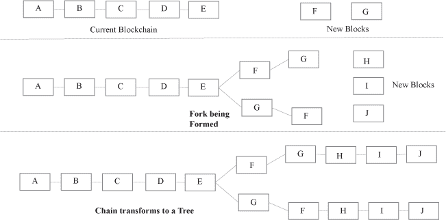
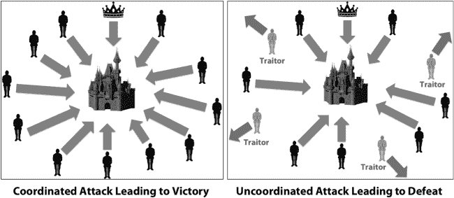
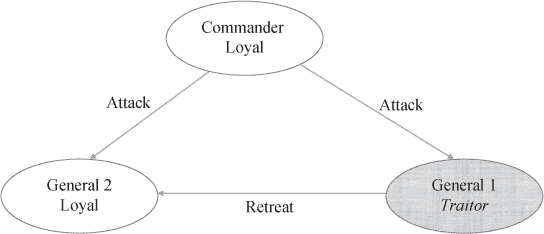
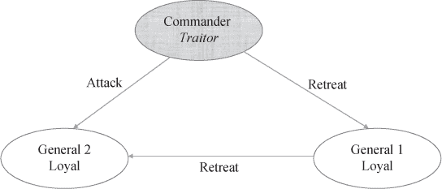
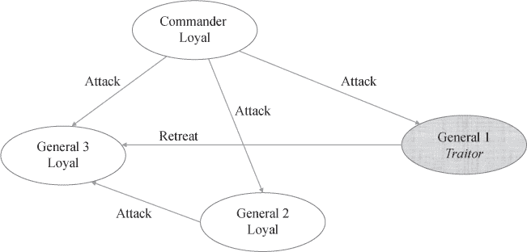
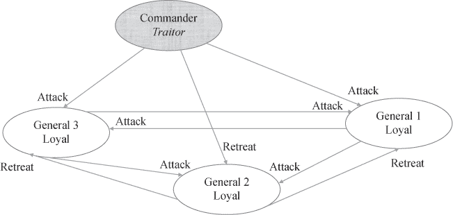
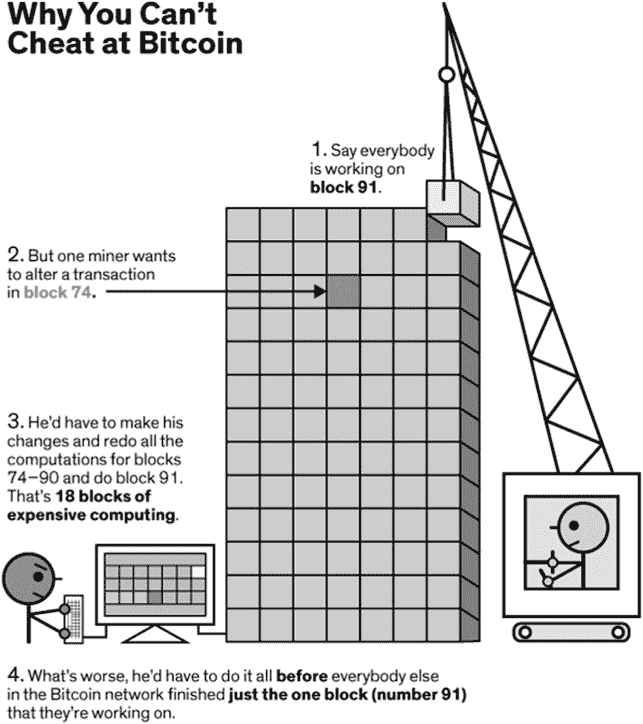
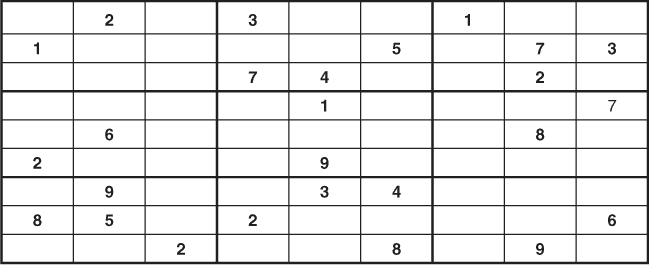
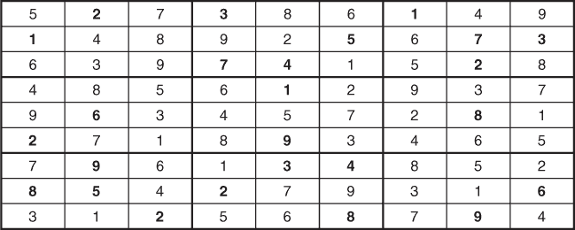

## 4

## 共识机制

### 4.1. 引言

区块链是一个系统，它使得未知且不可信的各方能够彼此进行交易，而这些交易的记录被保存在区块中。区块是按顺序连接的，以便永远保存交易的顺序和优先级。该机制本身是自我执行的，因为没有中央管理者在制定规则或临时决定，而是网络中*所有*参与者的集体决策。每个参与者都有平等的投票权。由于不同的参与者可能根据接收消息的顺序得出不同的结论，系统应该能够快速解决这些分歧，确保有大多数达成一致。

网络中的参与者都有平等的权利，因此可以被认为是*同伴*。然而，同伴可能会任意失败，有些同伴可能是恶意的。为了使系统有效，它应该具有内置机制，以确保在某些同伴恶意或出现故障时输出仍然有效。

网络本身要求有最少的结构。参与者可以随时加入或离开网络。然而，尽管有些节点可能任意失败，甚至有些节点可能存在恶意行为，系统仍能够达成共识。这是区块链技术的一个关键特性，被称为共识机制。只要大多数 CPU 计算能力由非恶意的节点控制，这些正常运行的节点将共同生成最长的链并超过攻击者或恶意节点。额外的参与者加入网络，甚至那些曾经离开现在重新加入网络的人，都会简单地接受最长的链作为当时的合法链，并记录在他们离开网络期间发生的事情。

区块链中已经采用了两种流行且经过验证的技术：工作量证明和权益证明。 “工作量证明”技术需要一个计算证明和解决一个复杂的加密谜题。计算工作的难度限制了新块可以添加的速度，以及可以添加块的参与者，从而使恶意或非功能性节点难以添加包含错误信息的新块。 “权益证明”赋予在网络中有更高权益的参与者更高添加块的机会，从而再次防止小型和恶意节点破坏网络。

中本聪在他的论文中提出了一种共识机制。这个系统并不保证总是能达成一致或共识，但保证了达成共识的概率将接近于 1。随着越来越多的非恶意参与者加入网络，概率接近于 1。增加挖掘新块的难度会导致插入新块所需时间更长，并且使得多个解决方案获得关注变得罕见。以太坊也基于工作量证明机制来验证新块。然而，与比特币需要大约 10 分钟挖掘一个新块相比，以太坊系统可以在 12-15 秒内生成一个新的块。因此，以太坊系统提高了吞吐量，记录交易，同时也导致多个解决方案的出现，因为不同的矿工会能够同时提出替代块。为避免这种情况的发生，协议实施了讨论于 Wood（2014）中的安全措施。

本章余下的部分组织如下。在第 4.2 节中，我们讨论了达成共识的重要性。在第 4.3 节中，我们提出了广为人知的拜占庭将军问题，这是一个抽象的计算机科学问题。在第 4.4 节中，我们讨论了参与者的经济激励。在第 4.5 节中，我们讨论了广泛使用的区块链共识机制——工作量证明。在第 4.6 节中，我们描述了另一种共识机制——权益证明。在第 4.7 节中，我们讨论了这些共识机制的一些威胁。我们将在第 4.8 节中进行总结。

### 4.2 节 共识的重要性

共识机制对于确保区块链中区块的正确顺序至关重要。区块链通过在现有链上添加新块来增长。因此，不仅新块需要验证，当前链以及该链中区块的排序也需要验证。这一过程的执行方式是，新块被附加到链上，而这些新块可以有多种排序。多个排序的可能性导致了一个分叉过程，通常被称为*分叉*。一旦发现分叉，就必须迅速解决，以确保*链*不会变成*树*。图 4.1（Fig. 4.1）形象地说明了这一概念。当前区块*A*至*E*构成了当前链，假设还需要添加两个区块*F*和*G*。现在考虑一些链在*F*之后添加*G*，而其他链在*G*之后添加*F*，这会导致一个分叉。当添加更多区块*H*、*I*和*J*时，分叉将链转换成了一个树结构。因此，需要一种机制来快速解决分叉，防止链变成树。

**图 4.1：向现有链添加新块。**

扩展上述示例，可以想象到在第二阶段，*H，I*和*J*新块的顺序排列上可能存在差异。如果允许这些差异，树会形成更多的分支和扩展。共识算法迅速解决分叉，从而防止分支的形成，确保链不会变成树。

在任何系统中，分叉的形成都是自然的，因为区块链的不同参与者可能不会以相同的顺序接收新信息。然而，一旦发现分叉，也就是说，当参与者了解到分支时，必须有一种机制来同意哪个分支是有效的，并修剪掉其余的分支。这确保只有主干被允许传播，防止形成树。通常，在比特币和以太坊平台上，最长的分支被认为是最有效的，尽管这两个平台在如何定义“最长”方面有一些细微的差别（Natoli & Gramoli, 2016）。分叉不一定立即解决，但可以扩展到一些有限的深度。延伸分支需要解决导致更长时间内额外计算锻炼的谜题，在此期间，确定并传播最长的链。比特币建议在发出交易后挖掘六个区块来认为系统已接受该交易，同样，以太坊建议附加五个到十一个额外的区块（Wood, 2014）。

共识具有三个主要属性：一致性、有效性和终结性。一致性意味着两个或更多方独立地达到相同的结论，并且双方都意识到他们已经达成了相同的结论。换句话说，仅仅达到相同的结论是不够的，但每个方都必须意识到并确信其他人一定达到了相同的结论。因此，达到结论的过程或算法应该是客观的、无歧义的和普遍的。有效性表明最终解决方案是从提出的方案中选择的一个。网络或系统应考虑可能有部分有效参与者和部分恶意参与者的规定。因此，终结性表明最终解决方案是由有效参与者决定的，而不是由恶意参与者决定的（Natoli & Gramoli 2016）。

### 4.3. 拜占庭将军问题

在计算机网络的早期阶段，一个经常出现的问题是一个计算机系统能否在其一个或多个组件失败的情况下继续可靠地运行。失败的组件发送的信息被忽略或忽视，因为来自失败组件的消息可能与系统其他部分发送的消息冲突。这个抽象问题被称为拜占庭将军问题（Shostak, Pease, & Lamport, 1982）。

拜占庭将军问题是一个假设的问题，涉及到包围敌方堡垒的攻击军队师团。每个师团都有自己的将军，将军们只能通过信使彼此沟通。将军们必须决定一个共同的行动计划，以确保协调一致的攻击。为了在系统中引入失败点，假设其中一些将军是叛徒。叛徒不能改变行动方案，但他们可以阻止忠诚的将军达成共识。

为了进一步简化问题，假设师团只有两个行动方案：攻击或撤退。所有将军都使用相同的方法或算法，汇总从不同来源接收的信息，以达到个人决策。攻击的成功取决于所有师团是否同时发起攻击。如果只有部分师团攻击，而其他师团撤退，那么攻击的师团将被消灭。那就是达成共识是至关重要的。不仅每个将军要得出相同的结论，而且他们还应该有信心，其他将军也会这样做。图 4.2（#fig2）通过一幅图片说明了问题。

**图 4.2：    拜占庭将军问题——攻击或撤退。**

拜占庭将军问题的困难在于，除非超过三分之二的将军是忠诚的，否则不可能有解决方案。特别是，如图 4.3（#fig3）所示，只有三个将军在有一个叛徒的情况下无法达成共识。由于消息完全由发送者控制，叛徒可以发送任何可能的 message。在计算机系统中，这个人工制品对应于计算机彼此之间发送的消息（Shostak 等人，1982 年）。考虑图 4.3（#fig3），其中指挥官是忠诚的，并向两个将军发送相同的 message，要求他们发起攻击。然而，其中一个将军是叛徒，因此他向另一个将军发送相反的 message，并要求他撤退。忠诚的将军收到了冲突的 message，因此无法决定行动计划。

**图 4.3：    有一个叛徒的简化拜占庭将军问题。**

**图 4.4：    指挥官是叛徒时的拜占庭将军问题。**

现在考虑一个稍有不同的情况，如图 4.4 所示，其中指挥官是叛徒并向两位将军发送了冲突的信息。他对一位将军要求攻击，对另一位将军要求撤退。由于将军们忠诚，他们传达了从指挥官那里收到的每条信息。正如在对忠诚的将军的图中 4.3 和 4.4 所注意到的，信息是相同的，这位将军无法区分这两种情况。所以，如果忠诚的将军总是遵循从指挥官那里收到的信息，那么在这两种情况下他都必须攻击，而另一位将军在两种情况下都会撤退。由于一位将军攻击，而另一位撤退，在这两种情况下攻击都会失败。

通过归谬法证明，在少于 3*n*+1 个将军的系统中，存在*n*个叛徒时无法解决问题。在图 4.5 中，我们展示了四个将军如何应对他们中间的一个叛徒。首先，让我们假设指挥官是忠诚的，但其中一个将军是叛徒并改变了信息。然而，只要忠诚的将军坚持多数信息，他们将采取统一的行动。

**图 4.5：   带有一个叛徒的扩展拜占庭将军问题。**

假设将军 1 是叛徒并改变了指挥官的信息，但将军 2 忠诚并传达了指挥官给他的同样的信息。如果指挥官向所有将军传达了相同的信息，将军 3 将收到两个相似的信息和一个矛盾的。同样，将军 2 收到的三条信息中，两条是攻击（来自指挥官和将军 3），一条是撤退（来自将军 1）。将军 1 收到的所有三条信息都是一致的攻击。在这种情况下，共识将是攻击，所有三位将军都会遵守。注意，叛徒只能发送错误的信息来阻碍达成共识，但一旦决定了共识，就必须遵循共识。

在图 4.5 中，假设情况是指挥官是叛徒，他向三位将军发送了矛盾的信息。假设指挥官只能在两个选择的信息之间做出选择：攻击或撤退。指挥官指示将军 1 和将军 3 攻击，而指示将军 2 撤退。每位将军都忠诚地传达了收到的信息。因此，将军 1 和将军 3 将指示其他两位将军攻击，而将军 2 将指示其他两位将军撤退。图 4.6 展示了每位将军收到的信息。如图所示，三位将军都收到了两条攻击的信息和一条撤退的信息。再次，如果他们遵循多数规则，三位将军都会攻击，从而破坏了叛变指挥官的计划。

图 4.6:   具有三个忠诚将军和叛变指挥官的拜占庭将军问题。

当消息不必是二进制而是可能有多个值时，情况就会变得更加复杂。上面的例子可以通过包括“不确定”的第三个消息来扩展，即指挥官或将军可以发送三个消息中的一个：攻击、撤退和不确定。在这种情况下，所有将军和指挥官之间达成共识的复杂性会增加。现在想象一下，当有数百甚至数千名将军时，这种复杂性的指数增长。

此外，消息可能是一个连续变量。在我们的例子中，假设指挥官发送的是攻击时间，而不是决定是否进攻或撤退。所有将军必须在彼此之间 10 分钟内发起攻击，这样攻击才能成功。如果叛徒随意改变攻击时间并向其他将军发送错误信息，那么系统将无法正常工作。为了使系统有效，忠诚的将军们应该能够独立地得出相同的攻击时间结论，实际上是为了忽视或忽略从叛徒那里收到的信息。

这个拜占庭将军问题适用于所有分布式网络，因为网络中的某些节点可能是恶意的，或者简单地没有发送消息。其他运行中的节点应该能够正常运行并达成共识，尽管并非所有节点都正常运行。这个问题需要每个节点必须遵循的算法来解决。此外，系统对恶意和非功能节点的脆弱性必须预先确定。数学上已经证明，如果叛变节点少于总节点的四分之一，即对于具有*n*个恶意节点的系统，总节点数必须是 3*n* +1，这样系统才能达成共识。

在区块链网络中，上述问题甚至更加复杂，因为系统中没有真正的指挥官。所有参与节点都是将军，并且具有相同的层次结构。所有参与节点必须对节点之间传输的每条消息达成一致，即使没有节点比其他节点优越。系统应该能够在节点或一组节点腐化或恶意的情况下正常工作，即这些节点发送的信息是不可靠的。总之，即使区块链中的某些参与者是恶意或功能失调的，并发送不准确的信息，区块链的参与者也应该能够达成共识。

### 4.4. 有效性和可验证性的经济学

区块链的有效性和传播需要许多无关参与者的努力。这些参与者必须以某种形式得到补偿，以确保他们继续参与链。这些激励通常通过交易费用资助。希望其交易通过区块链进行的交易方将支付象征性的交易费用。然后，这笔交易费用将由“矿工”收集，该矿工通过解决复杂的加密谜题或赢得随机抽奖来挖掘下一个区块，这取决于共识机制。

矿工获得补偿的另一种方式是通过通货膨胀。随着他们最初挖掘的货币价值上升，他们的财富增长，而无需进行任何额外的工作。因此，最初的矿工为了保护他们货币的价值甚至使其增长，会鼓励系统增长和记录更多交易。此外，他们致力于系统的安全和信誉，不希望这些被破坏。

区块链中的激励措施，通过交易费用和通货膨胀，鼓励参与节点保持诚实。即使恶意攻击者能够组装足够的 CPU power，以超越诚实的节点，他们应该有更大的动力阻止新块的产生，而不是改变现有的块。换句话说，具有足够 CPU power 的恶意节点应该有机会通过挖掘更多货币而不是回滚交易来产生更大的利润。遵守规则的激励应该超过欺诈系统的激励。进一步降低恶意节点在系统中积累的货币或财富的价值。

为了保护系统的圣洁，欺诈的成本应相对于不正当收益而言较大。因此，恶棍从系统中盗窃的收益将低于由此产生的成本，从而使盗窃在金钱上变得没有吸引力。在比特币设置中，这是通过设置自然实现的。首先，矿工必须购买能解决挖掘算法的昂贵硬件设备。恶棍需要投资计算能力，因此在系统中拥有高投资。此外，如果挖掘过程被破坏，比特币的声誉和信誉将受到不利影响，降低其价值。因此，恶棍从系统中盗窃的货币价值将降低，随着恶棍盗窃更多，相应地降低过程的信誉。通过这种方式结构化过程，使货币的价值基于其声誉，从而阻止恶棍盗窃，损害声誉，进而降低他们正在盗窃的物的价值。

### 4.5. 工作量证明（Proof of Work）

中本聪面临着“在无需信任的网络中建立信任”的挑战。他必须依赖一个系统，以确保个人或甚至小型团体无法在计算上超越集体网络。因此，基本想法就是使向区块链添加区块变得困难，并需要大量的计算能力。这是“工作量证明”算法的共同特征。

工作量证明是区块链网络达成共识、确认交易和向链中生成新块的共识机制之一。工作量证明解决了拜占庭将军问题，即在多数决策中确定代表。它不是基于参与度分配选票，而是基于处理能力分配选票。工作量证明本质上是为每个 CPU 单元投的一票。这种投票机制，而不是每个参与者一票，防止了攻击者通过获取许多边缘参与者来实现颠覆。

在许多共识协议中，工作量证明（Proof of Work，PoW）机制占据了现有数字货币总市值的相当大比例（约为 90%）。¹ 通过比特币引入的 PoW 机制已经被 Litecoin、Dogecoin 和 Ethereum 等数字货币采纳。此外，PoW 机制甚至在数字货币之外的其他领域也得到了广泛应用。

防止恶意参与者腐蚀网络是非常重要的。工作量证明机制通过增加进行欺诈行为的相关成本来降低欺诈行为的相对收益。在比特币的情况下，这些成本就是计算成本、硬件和电力消耗（也称为“燃料”）。验证者通过向网络揭示计算上难以解决的密码学难题的答案来建立其真实性。

在工作量证明机制中，矿工们相互竞争以验证下一组交易。成功的矿工将通过交易费用获得奖励，以构建下一个区块。构建下一个区块并获得奖励的概率与计算能力成正比。如后文所述，矿工们相互竞争以解决复杂的密码学难题。拥有更强大的计算能力会提高首先解决难题的概率，但并不能保证一定能解决。

例如，比特币就采用基于哈希的工作量证明，需要找到一个“nonce”值。当与其他变量结合时，哈希的结果值必须小于目标值。当找到这样的 nonce 值时，矿工创建区块并将其发送给其他参与者进行验证和采纳。一旦其他参与者验证了解决方案，他们将接受新区块并开始解决下一个密码学问题，以获得挖掘下一个区块的权利（Gervais 等人，2016 年）。

-   通过工作量证明做出的多数决策由最长的链表示，如第 4.2 节所述。最长的链是投入其中的最大“工作量证明”的代表。当大多数计算能力被诚实节点控制时，诚实的链会增长得更快，并超过恶意节点传播的替代链。此外，要修改过去的一个区块，攻击者不仅需要重新做他们感兴趣的区块，还需要做所有后续的区块。也就是说，攻击者节点需要重新生成该特定区块及其所有后续区块的工作量证明，并追赶上并超过在此过程中诚实节点所完成的工作。这个概念在图 4.7 中有所说明。因此，攻击者的计算能力应该超过诚实节点的计算能力的总和。

**图 4.7：    工作量证明使区块链中的更改变得困难。²**

-   虽然在任何给定时刻最长的链都被传播并存活下来，但需要指出的是可能存在“陈旧区块”。陈旧区块指的是已经被开采但未包含在最长链中的区块，而是属于一个已废弃的分叉。这对整个区块链的安全性和性能都是有害的，因为它们会触发链分叉。链分叉会消耗计算时间和能量，从而减慢主链的增长。此外，它们还带来安全风险，因为恶意节点可以利用陈旧区块来破坏网络。

**图 4.8：    数独谜题。**

-   需要矿工解决的加密复杂问题只能通过暴力破解。它需要通过逐个尝试所有可能的组合来找到解决方案。因此，从概率上讲，计算能力最强的矿工解决难题的可能性更大。这个难题具有以下两个特性：

+   -   问题难以解决。

+   -   一旦达到，解决方案可以很容易地进行验证。

-   为了更好地理解上述规则是如何工作的，考虑一下图 4.8 中显示的数独谜题。对于那些不熟悉数独游戏的人来说，目标是用数字 1-9 填充每一行、每一列和九个方格，使得行、列或方格中没有重复的数字。细胞中已经给出的数字不能更改。假设这是要解决的谜题，最快找到正确解决方案的人将有机会构建下一个区块并获得硬币作为她的努力回报。

那些擅长用逻辑解数独谜题的人仍然需要大约 10 分钟来解决上述问题。然而，拥有过剩计算能力的主机将通过暴力破解，随机为单元格分配数字，直到找到正确答案。更重要的是，对于熟练的问题解决者来说，找到解决方案需要大约 10 分钟，而对于任何有数字基本理解的人来说，验证图 4.9 中展示的此谜题的解决方案将不到一分钟。

**图 4.9：数独谜题的解决方案。**

这就是为什么篡改区块链上现有的区块如此困难。即使对于像数独这样的简单谜题，恶意行为者也需要逐一解决这些问题，而其他人则一起解决额外的谜题。回顾图 4.7（#fig7）所示的示例，恶意行为者需要解决 16 个谜题，每个谜题对应一个从#75 到#90 的区块，而其他人则正在解决谜题#91。假设恶意行为者实际上比集体小组快两倍。即便如此，当恶意行为者解决 16 个谜题时，集体小组保守估计至少已经解决了 8 个，并将开始解决谜题#99。现在，对于恶意行为者来说要解决这 8 个谜题，集体小组将解决 4 个，依此类推。或许，在解决 32 个谜题后，或者在谜题#106 时，恶意行为者将追上集体小组。相对于消耗资源重新创建从#74 开始的区块，恶意行为者本可以合法地成为第一个解决从#91 到#106 的谜题并获得奖励。如果系统为解决新谜题提供丰厚的奖励，那么对恶意行为者来说，改变区块#74 可能并不符合经济利益，而会选择合法地创建新区块并获得相应的奖励。

工作量证明模型是一种结合激励、分布式计算和市场经济学的安全措施。这一创新使得区块链能够利用安全和分布式共识构建系统，该系统已证明在过去十年中成功。工作量证明的限制在于它依赖于计算能力以及其高能耗的设计。例如，在比特币的情况下，平衡能源消耗成本与其价值是一项复杂的任务。

### 4.6\. 权益证明

还有一种不需要工作量证明机制所需的能量或计算力的替代共识机制。不同于工作量证明中需要解决复杂问题，权益证明随机选择一个参与者，这个概率与他们在这个区块链中持有的股份成比例。股份指的是参与者愿意“锁定”一定时间的货币或兴趣的数量。“锁定”类似于为一定数量的时间提供担保。作为对系统承诺资金的回报，参与者获得更高的中奖几率，以及形成下一个区块的权利。目前，权益证明正在现有的虚拟货币如 Nxt 和 Blackcoin 中使用。

如上所述，下一个区块构建者的选择是通过抽奖决定的，每个参与者有与其在网络中股份成比例的机会。这类似于 NBA³的选秀抽奖。成绩最差的队伍有 16 张抽奖券，成绩第二差的队伍有 15 张，依此类推。由于抽奖仅限于没有进入季后赛的队伍，只有 16 支队伍有资格参加。因此，刚好错过季后赛的队伍只有一张抽奖券。总的来说，抽奖中有 136 张票，最差的队伍有 16 张票，赢得抽奖的几率大约是 12%。概率从 1%到 12%不等，但如果一个人有更多的票，他们赢得抽奖的几率也会更高。

与工作量证明机制相似，权益证明也能确保系统的完整性和之前区块无法被更改的事实。每位参与者锁定代币的方式使得能够选择下一个创建区块的人。一个人要想超越集体网络的速度投资足够的代币是非常困难的，如果不是不可能的话。此外，如果一个人在网络上投资了这么多的代币，那么他们有最大的经济利益去保护网络的价值，因为他们严重依赖于网络的价值和声誉。

目前还有其他几种共识建立机制正在试验中。其中一种机制是证明已过去的时间，这需要节点在将下一个区块添加到区块链之前，进行计算性等待一段时间。强制等待时间使得向区块链添加区块在计算上变得困难。

另一种是证明权益模型的变体，称为委托证明权益。在这种机制中，利益相关者使用他们的权益作为投票过程中的权重来选举代表，称为见证人。见证人反过来验证并执行新的交易，并负责将这些交易添加到区块中。这相当于公司治理中董事会的选举。大多数股东在谁应该担任董事会成员方面有更大的发言权，但同时必须提名一个可信的人。一旦提名，董事就会按照自己的意愿行事。同样，在这种机制中，顶级的见证人是有最多投票的，因此获得验证和执行交易的权利。利益相关者对见证人的投票按他们在网络中的权益比例计算。

### 4.7. 结论

本章讨论的共识机制是无需许可的区块链的一个基本特性。共识机制在无法相互信任的未知个体之间产生信任，因此在没有可信第三方的情况下，他们不会进行交易。共识机制使区块链框架能够替代点对点交易中的可信第三方，从而取代传统的可信第三方，如律师、银行、代理人和经纪人。

另一方面，在受许可的区块链中，所有参与者都是已知的并值得信任，因此共识机制并不是那么关键。在已知并值得信任的各方之间，即使没有强大的共识机制，也可以发生交易，因为受许可的区块链中的参与者有内置的动机来保持区块链网络的完整性。网络信誉的泄露不仅会损害参与者的财务利益，还会导致他们个人信誉的损失。因此，在受许可的区块链中，强大的共识机制并不是一个关键特性。

在所有区块链特性中，共识机制最为技术化，并且基于密码学证明以及计算能力。要理解像工作量证明这样的共识机制，需要有数学和计算机科学的培训。此外，由于它还涉及具有独立行动者的群体中的激励问题，因此还需要熟悉博弈论这一学科⁴。在本章中，我们提供了一个非技术的概念理解。对概念的基本熟悉对于理解区块链的各种特性及其应用至关重要。

为了使无需许可的区块链繁荣发展，其底层共识机制必须赢得普遍的信任。区块链基础设施的一个关键优势是其不可变性，即存储在区块链中的记录无法被更改且永远保存。共识机制使得修改之前的区块变得困难甚至不可能，从而增强了区块链中固有的不可变性特征。

目前，工作量证明是区块链中广泛接受的共识机制。然而，其他共识机制，如权益证明或时间证明，正在被开发和测试。工作量证明机制需要大量的计算能力和能源（燃料）来运行。寻找一种更简单、更经济的替代方案将加快区块链基础的传统和确立的记录保存过程的接受和使用。

后续章节讨论了许多区块链的应用，在所有这些应用中，共识机制都是用来提供记录的信任和不可篡改性的。当然，共识机制也存在某些局限性和脆弱性，这些将在后续章节中讨论。计算机科学和安全领域的研究正在探索如何使共识机制更加健壮，减少遭受恶意攻击的可能性。

### 笔记

1. 数据来自 CoinMarketCap。可在[coinmarketcap.com/](http://coinmarketcap.com/)找到。

2. [理解区块链基础（第二部分）：工作量证明与权益证明](https://medium.com/loom-network/understanding-blockchain-fundamentals-part-2-proof-ofwork-proof-of-stake-b6ae907c7edb)

3. 国家篮球协会（NBA）是美国男子职业篮球联赛。

4. 博弈论是经济学的一个分支，它处理经济冲突的数学建模。
