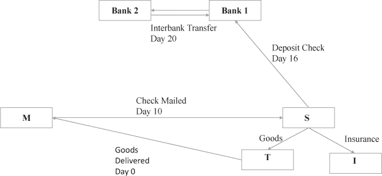
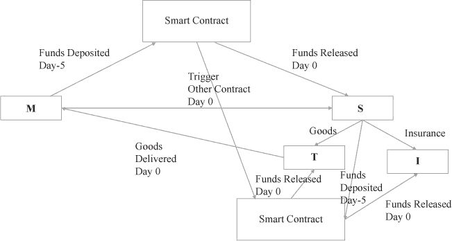
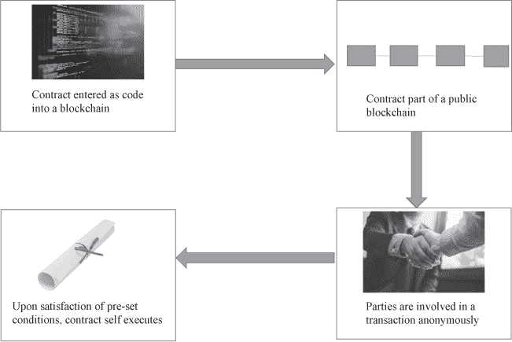

## 5

## SMART CONTRACTS

### 5.1. 引言

智能合约可以说是区块链技术最广为人知的组成部分。"智能合约"这个术语与自我执行的合约、区块链合约或数字合约同义。在这个过程中，传统合约被转换成计算机代码，然后存储并在系统中复制。这些代码由一个计算机网络监督，并以透明的方式促进货币、财产、股份或其他资产的交换。本质上，智能合约是当预设条件得到满足时自动执行交易的计算机代码。计算机程序会自动验证预设条件是否得到满足，然后决定资产应该如何在基础交易的参与方之间重新分配。去中心化的账本存储条件并以不可篡改、防篡改的形式最终执行交易，这提供了安全和有效性。

尼克·萨博（Nick Szabo）是一位计算机科学家和密码学家，他在 1990 年代中期提出了“智能合约”的概念，这比区块链或比特币的出现几乎提前了十年。虽然他没有将这些命名为“智能合约”，但这些合约是自我执行的，不需要可信赖的第三方（Szabo, 1999）。他最初的动机是降低交易成本，以实现微交易。随后，他将合约法的概念扩展到促进互联网上陌生人之间的交易。萨博在 1998 年推出了一种名为“比特金”（Bit Gold）的虚拟货币，但这种货币并没有获得太多人气或关注。然而，比特币利用了许多相同的特点，并普及了“智能合约”的概念。

智能合约不仅仅是关于协议的预条件和规则的集合，它们还能自动执行这些规则和义务。因此，智能合约必须得到能够确定预条件是否得到满足的技术支持。智能合约本质上是一系列包含“如果-那么”规则的计算机代码，并存储在区块链上。当满足条件“如果”时，代码会自动执行并输出结果，“那么”。它们可以用在商业交易中，双方同意决定的条款。

作为一个例子，假设买方同意在货物交付时支付一百万美元。然后买方将一百万美元存入区块链账户，卖方确信资金存在，并且一旦买方收到货物，资金将释放给卖方。然后卖方可以在装运货物上安装一个跟踪设备。一旦货物交付，跟踪设备显示目的地，这一点由区块链上的数百个用户验证，然后从托管账户释放出一百万美元到卖方的账户。买方不能再取消购买或拒绝支付。货物收到后支付是自动的。这减少了非支付的风险，相应地减少了交易成本。

尽管智能合约通常与加密货币相关联，但目前这种观念正在应用于其他领域和用途。这些用途将在后面的章节中详细描述，范围从矿物的道德采购到航班保险和在线体育博彩。智能合约在以太坊平台中非常突出，是关键特性之一。

共享经济在过去几年一直是经济增长的关键驱动力。这个市场的一些关键参与者，如 Airbnb、Uber 和 Lyft，虽然是相对年轻的公司，但已是家喻户晓的名字。这些平台遇到的通用问题是需要一个可信赖的第三方来执行交易并确保每个参与方根据合同支付。使用这些服务时也缺乏隐私，并且需要为每个平台注册。已经提出了一个智能合约手机应用来解决这些问题（Bogner、Chanson 和 Meeuw，2016 年）。

本章余下的内容组织如下。在下一节中，我们将定义智能合约。在第 5.3 节中，我们将讨论微交易的经济学和消费者最小化认知成本的需求。第 5.4 节描述了智能合约的特点，第 5.5 节描述了它是如何工作的。一些应用将在第 5.6 节中讨论。优势将在第 5.7 节中讨论。第 5.8 节描述了区块链技术如何提供执行智能合约所需的必要基础设施。第 5.9 节讨论了法律后果。我们在第 5.10 节以简要总结作为结论。

### 5.2. 智能合约定义

-   智能合约是一套简单的业务规则，一旦满足了预定的条件就会自动执行。在传统环境中，一个负责的第三方中介，通常是一个律师或担保人，被分配任务，在满足底层条款和条件的情况下确保合同的正确执行。在智能合约环境中，可信第三方的执行角色被委托给计算机代码，验证角色由区块链的参与者共同承担。验证过程的去中心化和执行的自动化有助于明确无误地满足预设条件和执行结果。这使得参与者能够以透明和无冲突的方式交换有价值的项目，而不需要第三方中介。

-   在当前应用中，智能合约是简单的业务规则，它们被计算机编码并在执行交易前自动验证。智能合约可能很简单，比如，“验证账户余额(*B*)超过交易金额(*T*)，在支付(*T*)之前。” 在那个实例中，当系统接收到一个新的交易时，它会自动检查账户余额，将账户余额与交易金额进行比较，当*B* > *T*时执行交易。从这个意义上说，智能合约主要是编码在区块链上的“如果/当—那么”声明。当预设的条件得到满足时，计算机网络执行这些行动。

-   智能合约通常涉及跨多个无关方的资产交换。根据合同中概述的预设条件，交易中各个参与者的资产被存入并重新分配给参与者。合约的自动执行性质确保了通过实时性能和成本节约来实现效率。

-   为了更好地说明这个概念，考虑一个简单的货物支付转移示例。假设美国的一个制造商**M**想要从位于澳大利亚的供应商**S**那里购买一些原材料。供应商**S**委托一家运输公司**T**运送货物，并从公司 I 购买保险，以防货物在运输过程中丢失。**S**只有在从**M**那里收到货款，即货物已经被交付的确认之后，才会同意支付给**T**运输费用。

-   **图 5.1：传统环境下的供应链交易。**

图 5.1 展示了在传统商业中，这笔交易的支付是如何处理的。Fig. 5.1 一旦*M*收到货物和附带的发票，它会将其发送给其财务出纳员，该出纳员然后发行并邮寄一张支票给*S*。*S*在收到*M*的支票后，会将其存入他们在澳大利亚的银行，该银行然后联系*M*在美国的银行并将资金转账。在收到银行账户中的现金后，*S*会将支票发送给*T*，*T*会进行类似的兑现过程。保险公司*I*提前收取保险费，但直到足够的时间过去且*S*没有提出索赔时，才确认收入。

图 5.2 展示了在智能合约下，这笔交易是如何进行的。Fig. 5.2 当下单时，*M*将钱存入区块链上的托管账户。*S*注意到*M*存了钱，与*T*签订运输合同，并向*I*购买保险。*S*将在同一区块链上的另一个托管账户中存入运费和保险费。*T*在货物上安装一个地理追踪装置，该装置可以通过物联网（IoT）进行监控。当货物被运送到*M*并由追踪装置记录时，智能合约自动执行，并瞬间将*M*的托管资金释放给*S*。资金释放给*S*触发了其他两个智能合约，*S*的托管资金释放给*T*和*I*。保险公司*I*收到保险费并注意到货物已按预期送达，因此不会有索赔。总的来说，可以有尽可能多的规定来满足买家的满意度和规定。

**图 5.2：带有智能合约的供应链交易。**

让我们考虑另一个更常见的例子，那就是卖房。任何在美国卖过房子的人都知道，这是一个相当复杂、昂贵且令人畏惧的过程，有很多文件和许多不同方的沟通。在传统设置中，房屋买卖涉及到多个方，如买方和卖方。在美国购房涉及获得法庭注册的文件或产权，核实卖方确实是物业的合法所有者在产权上列出。还需要额外的核实，即物业上没有未解决的债权。组织收盘通常和策划婚礼一样繁琐。这就是为什么大多数卖家会使用房地产经纪人，经纪人处理文件并作为各方之间的联络人，直到交易“完成”。由于涉及的金钱数额和方数，托管服务在这些交易中很有帮助。每次收盘都有双方律师以及一个产权代理参与。总之，卖家需要支付这些服务的费用，占房价的 6%至 7%。因此，房地产销售的智能合约解决方案对卖家可能有很大的经济影响。最重要的是，智能合约将解决信任问题，确保卖家是房屋的合法所有者，买家有足够的资金支付购房款。在这种情况下，“如果-那么”原则将确保只有在购房款存入系统后，房屋的所有权才会转交给买家。由于各方之间的信任不再是问题，因此无需中介，从而为交易的实际签署方，即买家和卖家节省了相当多的费用。

类似智能合约应用正在为房地产租赁市场开发，租户在区块链上存入资金，钥匙在转交给房东后释放，这一事件由区块链上的所有参与者见证。如果租约规定的指定日期内钥匙未到达，预租户将退款。智能合约基于类似的“如果-那么”前提运作。系统在托管资金的情况下向租户释放钥匙，并在钥匙已转交给租户后向房东释放资金。通过这种机制，在交易中建立了一定的信任度，尽管房东和租户可能从未谋面。智能合约执行了传统设置中作为中介的房地产经纪人的任务。

### 5.3\. 微交易的经济学¹

在 1990 年代，电子商务的早期阶段，计算机科学家们正在努力大幅降低电子商务的交易成本，以便创建一个系统来促进微支付。技术专家所指的交易成本是指计算成本或网络成本。Nick Szabo 弥合了技术专家的成本观念与经济学家观念之间的鸿沟。通常，当经济学家讨论交易成本时，他们会指的是认知成本，或消费者的心理处理努力。²

心理交易成本对人类行为的影响可以通过观察古老的议价习惯来很好地理解。在经济历史上，随着社会变得更加富有，零售议价相应地减少。零售价格成为个人财富的较小部分；因此，个人不愿意在议价上付出大量的心理能量，或产生认知成本，而在零售购买中表现出接受价格的行为。对微交易也是如此，因为价格变得很小的一部分客户财富，它们往往会变得无关紧要。

考虑电费账单为例。虽然电力公司不必为每个电器提供详细的电力消耗数据，但可以想象与智能电器集成的个人会计软件将使消费者能够做到这一点。同样，房主如何更好地平衡电力与燃气供暖，虽然这将导致一些节省，但也会产生较大的认知成本。同样，当我们与可靠且广为人知的实体进行交易时，我们信任他们，倾向于不再重新计算费用，以节省认知成本。

在审视微支付时，较大的成本是由与微支付相关的心理交易成本限制所施加的。因此，Szabo 受到启发去探索自动微支付的可能性，从而大大减少了对消费者施加认知成本的心理过程。随着微支付的认知成本下降，越来越多的消费者将参与涉及微支付的更多交易。

Szabo (1997) 得出结论，心理或认知成本通常超过计算成本。交易各方更喜欢执行时需要较少的心理能量和记忆的系统，并且不介意为计算交易成本支付更多。认知成本来源于三个来源，包括现金流的不确定性、产品属性的不完全和昂贵的观察以及昂贵的决策制定。随着社会变得更加富有，心理成本将主导消费者偏好。因此，智能合约是一种机制，用于自动化某些决策过程，并将执行的物流外包给公共领域，从而降低认知成本，促进更多交易和商业模式。

### 5.4 智能合约的特点

本质上，智能合约充当自动履约账户。交易双方将可交付的现金或商品放入履约账户。一旦预设条件得到满足，转账将自动完成，无需进一步的人类干预。因此，所有的条件，“如果-那么”规则以及奖励和成本必须在开始时预先指定。智能合约不仅仅是维护条款的文件，而是执行这些条款并强制执行条件。在最简单的情况下，智能合约具有以下基本组成部分。

首先，交易各方必须明确识别。与任何合同一样，签署人必须被识别。换句话说，这些是参与交易的个体或公司。签署人是指同意智能合约条款和条件并具有交易结果的基础经济利益的两个或更多方。

第二，协议的结果或主题必须是客观且无歧义的。协议的主题必须是智能合约环境中的一个项目或信息。由于智能合约在满足条款或预设条件时会自动执行，这些预设条件必须对智能合约的执行者，即区块链参与者可见。区块链中的所有节点必须能够无障碍且直接访问协议主题的项目或信息。例如，在体育博彩的智能合约中，比赛的胜者和最终比分是公开可用且无歧义的。

第三，合同的结果必须包括直接和具体的条款。条款的“具体性”需求源于使用编程语言数学描述条款的需要。条款应包括预设条件，以及每个签署人对合同的每个可想象结果的成本和奖励。

第四，这些合同必须能够在所需的技术环境中运行。最初，合同的每一方都必须能够使用公钥加密技术。这将使得各方能够进行唯一识别。所使用的底层系统必须是可靠和安全的。一旦条款和条件被编程，黑客就无法对其进行修改或重写。此外，一旦资产被转入系统，这些资产必须得到保护。

第五，智能合约的执行需要一个开放和去中心化的数据库。这确保了预先条件可以被多个无利益相关的方客观评估，以确保正确执行。也就是说，交易的条款可以被数百人或者计算机见证和验证，从而确保正确执行。区块链技术为智能合约提供了充足的环境。

最后，智能合约的结果可能会触发其他智能合约。智能合约之间可能存在依赖关系。这可能是智能合约的级联，即在第一个智能合约解决后，会触发其他合约，依此类推。可以想象整个组织或系统都是基于精心设计、预先确定的智能合约运行的。当然，这需要广泛规划和考虑每个可能的结果。此外，所有级联合约都必须能够在由分布式数据库，如区块链，支持的技术环境中运行。

### 5.5\. 它是如何工作的？³

尼克·萨博（Nick Szabo）最初的建议是将合同条款翻译成计算机代码，以便计算机可以自动执行和自我强制执行它们。这将最小化对可信第三方的需求，甚至减少交易各方使用认知能力执行琐碎任务的需求。如上文所述，尼克·萨博不仅对减少交易成本或计算成本感兴趣，而是对包括认知成本在内的总成本感兴趣。通过其分布式控制，区块链技术提供了触发自我执行的基础设施，这种基础设施是不可篡改的，也无法被操纵。

智能合约位于区块链上，有一个独特的地址。通过向智能合约地址发送交易来触发智能合约。智能合约将独立且自动地执行合同条款，与代码一致。交易结果被广播到区块链上的每个其他节点。因此，交易记录在各个位置或节点上维护，并印在账本，即区块上。记录是不可变的，随着区块链上更多交易的发生，会添加更多区块。

图 5.3 说明了智能合约如何运作的总结。区块链上的参与者创建合同，允许不同方访问合同内的各种功能。例如，只有少数方被授权在该合同上进行交易，只有一个方有权“提取”合同中的资产。运作机制可以通过以下步骤来理解：

**1.** 一旦创建了合同，它就有自己的状态，并且可以对区块链上的资产进行保管。⁴ 在某种意义上，合同在区块链上有自己的账户。合同可以持有它被指定持有的资产。

**2.** 合同使商业逻辑的表达成为可能。也就是说，它可以设定价格，在收到货物后批准支付等。例如，商业逻辑可能是“在货物交付后 10 天支付款项”，或者“如果从纽约到洛杉矶的 123 航班延误两小时或更多，向*B*支付 100 美元。”

**图 5.3：智能合约的功能。**

**3.** 合约必须全面且无歧义。也就是说，合约应该对每一可能的应急情况指示正确的行动方案。例如，如果我们正在赌 2020 年 NCAA 大学篮球锦标赛的冠军，一份适当起草的合约应该考虑到比赛被取消的可能性，并规定在这种情况下资产如何分配。

**4.** 各方之间的关系由数据驱动。在计算机科学家的行话中，“一个会计交易只是‘一个表示价值转移的签名数据结构’”（Antonopoulos, 2014）。简单的交易可以这样表述，“如果你向我发送 X 单位商品，我将支付你 Y 美元。”

**5.** 智能合约由发送到其地址的消息或交易触发。一旦发生预先指定的事件，一条消息会自动发送到代表合约的“状态”，并要求执行合约的条款。

**6.** 智能合约必须确保在相同的一组情况下总是产生相同的结果。从这个意义上说，它必须是确定性的，而不是概率性的。像“一旦条件满足，抛硬币，只有当它落在正面时才支付”这样的概率性规定将无法奏效，因为不同的节点将进行实验并返回不同的结果。由于节点得出不同的结果，网络内无法达成共识，因此合约将不会被执行。

**7.** 由于智能合约位于区块链上，其内容、代码和操作对网络中的每一个其他节点可见并受到审查。

**8.** 与合约的交互是通过区块链上的消息进行的，因此参与者可以获得合约的每一项操作的可验证记录。

智能合约作为独立且客观的“可信第三方”，其唯一角色就是按照参与者的规定执行合约。智能合约的结果是可预测且无歧义的。合约结果与区块链上的所有其他节点共享。

### 5.6\. 智能合约应用

虽然世界各国政府和监管机构对加密货币持怀疑和谨慎态度，但他们热情地接受了智能合约的底层技术，认为其具有革命性。商业和政府一直在利用这项技术产生效率和节省成本。在本节中，我们将在以下段落中提供一些用例示例。

大型全球银行已经成功在区块链上交易了诸如信用违约掉期（credit default swaps）等复杂的金融工具。信用违约掉期主要是债权人购买的保险产品，以防止借款人拖欠还款而造成损失。在借款人拖欠信用支付的情况下，该工具使债权人能够收取一些支付。智能合约的实施是一个简单的“如果-那么”业务规则。如果借款人拖欠信用支付，掉期的卖方将自动向掉期的买方支付。

保险业是一个仍然非常古老的行业，很大程度上依赖于纸质文件和人工审核。这通常会导致从损失发生到索赔解决之间存在显著的时间滞后，从而导致高昂的行政成本、不满的保险持有者和总体效率低下。保险业正在探索在索赔处理中应用智能合约，特别是在自然灾害的情况下。自然灾害，如地震和飓风，是众所周知的，通常会导致大量索赔被提出，个别处理这些索赔需要大量的时间和精力。智能合约应运而生。借助智能合约，自然灾害造成的损失可以由参与者网络批准，并得到及时执行，保险持有者在危难时刻可以收到赔偿。损失的具体细节可以保留在区块链上，随后进行验证，如有必要，之后再进行调整。

例如，创作内容（比如这本书）的过程涉及到多方，因此他们都 entitled to a share of the proceeds from the sale of the content。例如，尽管这本书是由翠岩出版社进行营销和销售的，但作为作者，我有权获得销售价格的一部分作为版税。我的一部分报酬发给我出版代理人。出版社向作者支付版税通常基于信任，因为作者无法独立验证这本书卖出了多少册。智能合约可以通过确保版税根据预先确定的收益分配方案分发给贡献者，来帮助解决这个问题，通过在区块链上记录收益分享安排。

Ujo⁵ 是一家在线音乐分享/购买公司，它使用区块链基础设施让听众直接向音乐家支付音乐费用。具体来说，它允许公众用加密货币下载音乐，然后将其转交给内容生产者，这是一种去中心化的稳定币 Dai。它使用智能合约功能将收益分配给音乐的各个所有者。音乐行业以中介收取高额佣金而闻名，包括唱片公司、演出场所和音乐流媒体业务。Ujo 试图利用区块链技术让内容生产者对其知识产权有更大的控制权，并限制中介的角色。

IoT 是一个智能合约和区块链技术可以应用的领域。IoT 将日常设备连接到互联网，以通过传感器改善系统的互联性。整合区块链和智能合约将使系统更加高效。涉及系统的传感器将是区块链上的节点，借助智能合约，可以追踪每个产品的位置和所有权，并相应地支付。因此，各方之间的资产转移可以通过追踪设备、IoT 和智能合约完成，而无需任何人工干预。

后续章节中描述了其他使用案例。这些应用程序以许多有趣和创新的方式使用智能合约功能。

### 5.7. 智能合约的优势

与传统的基于纸张的、手动执行的合同相比，智能合约提供了许多优势。在某些情况下，智能合约更为方便且更快。这些都是自验证、自执行且防篡改的，因此提供了一个良好的安全与便捷的混合，以便促进交易，否则由于交易费用高昂或参与方之间缺乏信任，这些交易可能不会发生。

合同的签署方是协议的唯一各方，没有律师、代理人或经纪人参与。这为签署方提供了更大的自主性，并消除了另一方（间接参与交易）操纵的可能性。签署方自主性的提高赋予他们权力，并使他们能够控制条款和条件，而不受第三方的无需干预，从而降低交易成本。

智能合约是用一种编程语言明确详细地编码的，这种语言精确且逻辑性强。由于编码的要求，合同内部的矛盾在最初就得到了解决。计算机代码比法律术语中的模糊性更加精确和明确。此外，编程练习确保了条件是全面的，因为任何不在合同中的条件都将保持未指定，并在执行时导致错误。这些异常会在智能合约的早期就被识别并解决。在传统合同中，起草合同的人可能会遗漏一些条件和应急情况。因此，智能合约往往更加精确和准确。此外，如果正确实施，它们极其难以被黑客攻击，因为它们受到复杂密码学的保护。

交易的前提条件和条款被编码。加密的信息存储在共享账本上，并永久性地打上时间戳。因此，合同“丢失”或放错位置的风险不存在。总是在区块链上有一个备份，即使签署人之一或两个都放错了或丢失了原合同。因为它们存储在区块链生态系统中，智能合约是透明的。这消除了合同执行过程中的争议和争议的可能性。此外，参与交易的人不必信任所有参与者，因为智能合约的无私、自动执行性质取代了信任。因此，参与者在没有“可信”第三方提供的情况下，拥有更大的信任度。

由于智能合约是自动执行的，一旦满足了预设的条件，就可以实时处理。智能合约通过互联网运行，仅需几行软件代码。因此，通过智能合约完成的交易速度几乎瞬间完成，可以节省数小时，如果不是数天的话。与传统的手动处理不同，智能合约可以在非工作日和周末执行，从而减少了等待时间并提高了效率。

用智能合约取代传统合同可以减少成本。由于参与方可以信任可见数据和技术以确保交易的准确执行，因此无需第三方来验证和核实协议的条款。由于律师、经纪人或代理商没有角色，他们的佣金和费用被取消。此外，这也减少了随后的诉讼或法院成本。由于签署方同意并承诺遵守智能合约中设定的条件，智能合约客观且无私地执行，未来很少有分歧或争议需要进行耗时且成本高昂的诉讼。

自动化合同不仅更快、更便宜，而且避免了手工过程中不可避免的无意错误。使用加密代码也确保了文档和基础资产的安全和安全。由于这些合同在没有区块链大多数参与者的知识或同意的情况下无法更改，因此本质上是不易篡改的。此外，更改一个记录需要整个链更改的要求提供了保证，一旦交易在区块链上执行并记录，它就不会被随后更改或篡改，从而使其具有防欺诈性。

### 5.8. 区块链促进智能合约

基于区块链的系统让网络中的所有参与者都能够观察并验证交易的合法性，从而消除了信任第三方的需要。正如前面所讨论的，区块链在分布式环境中存储数据。记录、交易、条件等存储的数据对公众实时公开。因此，区块链生态中的所有参与者都能够独立验证交易的先决条件是否已经满足，以及交易是否按照预先设定的规则执行。

尽管智能合约的概念自二十世纪末期就已经存在，但实施却花了大约二十年时间。区块链技术提供了执行智能合约所需的必要基础设施，以确保可靠和安全。目前，我们仍然生活在一个基于纸张的合同世界中，其中信任第三方的参与是强制性的。在发达国家，信任第三方会收取高额交易费用，以保持中立和“可信”。在其他交易费用可能较低的社会中，所谓的“可信”第三方可能容易受到贿赂，并在稍后的日期改变合同条款，导致昂贵且耗时的诉讼。

区块链通过使两个或更多彼此不了解或不信任的当事人之间能够直接转移资产，促进了比特币的增长和普及。智能合同的融入拓宽了区块链可以支持的应用和交易范围。它现在允许在彼此不信任的当事人之间发生跨时长的多部分交易。交易中的每一方都可以检查代码，即阅读合同，在决定是否参与交易之前。一旦履行了义务或满足了预先条件，每一方都可以确信合同将得到执行。每一方可以确信对方在以后无法修改合同或对合同条款或执行有任何进一步的控制。每一方都可以对后续过程进行验证。一旦交易执行，交易的效力和可验证性将永远得到保存。换句话说，它创建了一个永久的审计轨迹。

### 5.9. 智能合同的法律复杂性

由于“合同”一词被用来描述这种技术 artifact，因此讨论“合同”的使用可能是一个误称很重要，因为这与法律定义中的“合同”一词几乎没有关系。重申一下，“智能合同”仅仅是简单商业逻辑的编码，可以自动执行，并且永久的、不可更改的记录交易。术语“合同”与这些安排的法律有效性关系不大。实际上，使这些合同具有吸引力的特点：去中心化、匿名性和自动化，正是这些特点导致了诸多法律和监管问题，如本节所讨论的。

通常，一份法律合同是在两个有责任感和已知身份的当事人之间签订的，这些当事人在特定的司法管辖区内被法律允许签订合同。匿名或伪匿名与法律合同的概念相悖。在公共的、无需许可的区块链网络中，可能很难确定参与者是谁以及他们地理位置在哪里，即在哪个国家的司法管辖区内。由于各国之间的法律和规定存在差异，了解司法管辖区对于确定适用的法律至关重要。

法律管辖区在定义“合同能力”方面有所不同。合同能力是指一方签订合同的能力。在澳大利亚、英国、法国和美国，18 岁以下的任何人按法律都是未成年人，因此不能签订合同。此外，未成年人通常可以随时撤销合同。由于智能合约中的各方通常彼此未知，无法验证签署人的年龄。因此，一方可能无意中与被技术提供的匿名性所掩盖的未成年人签订合同。这威胁到协议的执行性（Giancaspro，2017）。

在大多数司法管辖区，法律职业仍然陈旧，没有跟上技术的发展。尚不确定计算机代码，尽管在数学上有效，但在法律环境中是否可以被认为是可信证据。即使很清楚信息和记录无法被篡改，但在每个司法管辖区是否可以作为“证据”呈现，以及交易是否具有“法律约束力”仍然不清楚。此外，由于区块链设计上是去中心化的，因此尚不清楚数据存储在哪个司法管辖区，以及是否符合诉讼司法管辖区的“证据规则”。每个网络节点可能受到不同的法律要求，由于没有中央管理或枢纽，因此“枢纽”的国籍可能存在疑问，这成为法律争论的基础。

为了使“智能合约”在国际上大规模和复杂的交易中获得关注，可能需要监管机构和立法者跨国合作，协调法律和监管制度。2019 年，美国证券交易委员会（SEC）主席在新加坡发表了一次重要的演讲。演讲内容在后面的章节中详细分析。

法律只有在能够通过对违规者施加处罚或制裁来执行时才能有效。在宣布制裁时，至关重要的是首先要确定违法者。技术提供的伪匿名与执法预期相反。此外，根据建立账户（假名）的司法管辖区的隐私法律，各方实际身份可能保持私密。罪犯通常会利用“监管套利机会”，寻找提供更多保护并保持匿名性的国家和司法管辖区（如开曼群岛、巴拿马等）。然而，需要注意的是，尽管有些平台向账户持有者提供匿名性，但最受欢迎的两个平台，比特币和以太坊，并不支持匿名。政府也试图通过实施反洗钱法律来 discourage 匿名使用。

### 5.10。结论

智能合约是一项具有巨大潜力的年轻技术。它允许没有理由相互信任的双方进行交易，并消除了信任第三方的需要。没有中介进行交易 potentially saves money for the transacting parties as there is no need for agent commission, broker fees or government surcharge.

由于智能合约是自动执行的，因此降低了参与者的认知成本。一旦代码得到验证和同意，常规交易将由计算机程序执行，由区块链上的众多参与者监督和验证，并且永久存储在区块上，无法篡改。因此，智能合约创造了一个机会，使常规交易和流程自动化、无误和客观。

尽管智能合约前景广阔，但它仍然容易受到“成长的痛苦”和潜在问题的困扰。首先，由于智能合约完全依赖于代码，其功能取决于代码的好坏，代码中任何问题或错误都会产生广泛的影响。代码中的错误可能会被黑客和诈骗者利用。2016 年，发生了 DAO 攻击事件，由于代码中的一个错误，投入智能合约的资金有可能被盗。⁶ 还有其他需要解决的问题，例如政府税收当局如何对这种合同进行监管和征税。此外，如果发生无法预见的状况，如大流行，智能合约如何修改或适应变化的情况。

尽管这些问题无处不在，但在智能合约中，这些问题由于其新颖性而变得更加突出。然而，由于这项技术有着巨大的前景和广泛的应用性，这些问题将随着时间的推移得到完善。尚需观察智能合约何时以及是否成为我们社会和商业交易的一个组成部分。

### 注解

1. 本节是对尼克·萨博（Nick Szabo）于 1990 年代中期发表或展示的学术文章的非技术性总结。

2. 例如，参见*资本主义经济制度*（威廉姆森 1985 年）或不完全合同（哈特 1989 年）。

3. 本节基于 Christidis 和 Devestsikiots (2016) 第二部分的 D 节。

4. 详细讨论请参见 R. G. Brown (2015)。

5. Ujo Music 利用区块链技术创建一个透明、去中心化的权利和权利所有者数据库，使用智能合约和加密货币自动支付版税。详情请访问[ujomusic.com](http://ujomusic.com)。

6. 有关攻击及其原因的详细信息，请参见[`www.coindesk.com/understanding-dao-hack-journalists`](https://www.coindesk.com/understanding-dao-hack-journalists)的概要。
