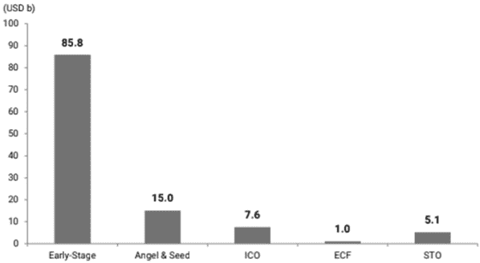
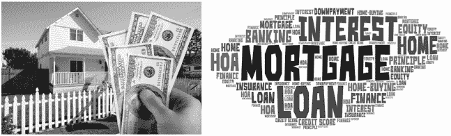

## 6

## TOKENIZATION

### 6.1. 引言

资产令牌化是区块链技术的一个核心组成部分，自 2018 年以来，它已经成为创造区块链技术创新应用的特征，并且正在快速发展。很明显，人们渴望在区块链上“代币化”几乎所有类型的资产类别，包括房地产、绘画、钻石、股票等等。这些资产类别有时难以转让或分割，因此买家和卖家交换“纸质”或法律文件，代表资产的全部或部分所有权。与纸质记录一样，财产转让证明和产权证明往往难以转让和追踪。在发达国家，商品交易所已经很大程度上消除了纸质记录，用电子记录取而代之。然而，这些电子记录仍然依赖于可信方和安全的存储，增加了运营的开支。因此，解决方案就是数字化和记录的广泛分散，或者在区块链上维护记录。

资产令牌化是使用数字表示来证明实体资产的所有权。即便是在现在，当一个人购买一个高价值资产，比如一栋房子、一艘船或一辆车时，购买者除了获得资产的物理占有外，还会得到一份购买记录的纸质文件。在美国，我们称这份文件为房子的“产权证明”或车的“产权证明”。传统上，这份产权证明是在政府实体核实销售条款和支付后发行的。他们还会核实卖方是财产的合法所有者，因此有“出售权”。在这个交易中，政府机构充当了一个“可信第三方”，收取记录费用，并提供销售有效性的保证，并记录财产的合法所有者。在一个数字化的世界里，数字代币被用来证明实体资产的所有权。这些记录是在线维护的，可以随时由任何人访问。代币可以通过消除需要政府机构验证记录的延迟，加速和简化购买和销售过程。这一特性使代币化的资产面向更广泛的市场，并接触到之前未开发的潜在投资者基础。

代币化的最早成功应用之一是在初始代币发行（ICO）领域。随着对实用代币和安全代币兴趣的增加，自然演进到代币化其他资产类别。数字代币可以用来证明对物理资产的所有权。数字代币可以通过 ICO 或安全代币发行（STO）创建。这些代币代表 underlying asset 的股份，并由资产所有者最初出售。一旦发行，安全代币可以在二级市场上交易。代币的持有者可以选择持有代币，直到 underlying asset 被处置并达成解决方案，或者他们可以在二级市场上交易代币，这将使代币的价格与资产的价值相匹配。随着资产价值的增加，代币的价格也随之增加，反之亦然。

在本章中，我们首先讨论了各种资产类型进行代币化的潜力。接下来，我们将展示这一概念以及代币化是如何实际操作的示例。接下来，我们讨论了一些代币化新兴用例。这些用例仍处于开发阶段。然后，我们总结了代币化的过程以及预期的增长潜力。最后，我们讨论了当前的风险，并将代币化与资产证券化进行了比较。这两种方法有很多相似之处，因此从 2008 年全球金融危机中吸取的教训应该在代币化的背景下重新审视。

### 6.2. 代币化的未开发潜力

代币化将通过对消除每次交易后维护和更新记录的“可信经纪人”的角色，简化交易的进行。由于代币化允许资产的数字化交换，而不需要物理交换，因此它简化了许多复杂性，并提供了改进当前做法的巨大机会。

有了代币化，证明部分或全部所有权的可能性将变得更容易。由于资产以数字化形式交易，并且每次交易的记录都保存在区块链上，当前的所有权可以实时在全球范围内，24/7，365 天一年内验证。不再需要在工作时间内访问政府官员，支付费用，并排队等候以询问财产记录以验证所有权。只要有互联网连接和智能设备，就可以随时随地完成。

通过即时验证和所有权的轻松转移，它将加快交易过程。交易可以在几秒钟内完成，记录更新。目前，大多数证券交易需要大约一天或两天才能完全执行，尤其是当交易双方遍布全球时，房地产交易需要大约一周或一个月才能完成。购买或出售数字代币的便利性将增加资金流动，减少将有形财产转换为货币或其他流动资产时固有的摩擦。

分词处理将增加持有数字化资产的流动性，因为它可以非常容易且几乎瞬间地转换成货币。数字代币的交易可以发生在全世界任何时间。因此，数字化资产的市场比实物资产的市场要广泛得多。数字化增加了潜在买家的数量，从而增加了代币的需求。需求的增加伴随着流动性的提高，很可能会增加基础资产的价值，创造财富。

总之，tokenization 有四个关键优势：

**1.** *更广的覆盖范围*——通过 tokenization，销售的范围得到了大大扩展。世界各地的投资者和投机者可以不通过经纪人或中介直接购买数字化代币。这增加了代币在首次发行以及在二级市场的潜在买家数量。

**2.** *交易便利性提高*——由于代币交易发生在互联网上，记录保存在全球平台上，因此很少需要中介或经纪人。买方和卖方之间的交易可以在任何时间发生，而不受经纪人便利的影响。

**3.** *更大的流动性*——增加潜在买家的数量并使交易更加容易，增加了交易资产的流动性。通常，如果资产流动性高，它们的定价通常更高，相反，流动性低的资产往往估值较低。换句话说，如果一个资产的市场小，被垄断，且难以出售，就会有一个“流动性折扣”。通过应用技术提高流动性，预计基础资产的价值会增加。

**4.** *记录的透明性*——由于记录保存在区块链上，记录的透明性和可用性得到了提高。这减少了买方和卖方之间的信息不对称。买方知道代币的确切历史、每次交易的价格和条款。

标记化（tokenization）的优势更适用于目前被视为“流动性差”的可交易资产，这是因为市场固有的低效率。这些市场通过标记化提供的 increased transparency and frequency of transactions 将受益匪浅。如果执行得当，这些市场可能会吸引许多小投资者，从而增加需求和 underlying asset 的价值。换句话说，通过消除“流动性折扣”，随着标记化，underlying asset 的价值预计会增加。

### 6.3. 标记化的吸引力示例

代表 underlying asset 很小一部分的代币在互联网上出售，交易记录在区块链上。个人可以投资于这些代币，从而获得 capitalize on the increase in value of the underlying asset 的权利，而无需购买全部资产，或承担所有所有权的其他责任。当然，这也意味着如果资产的价值下降，或者变得毫无价值，将面临投资损失。

考虑房地产市场的代币。假设一位刚从大学毕业并找到一份高薪工作的年轻专业人士，正在储蓄购买曼哈顿的一套公寓。一套典型的 1,000 平方英尺的两居室公寓售价约为 100 万美元。这位大学毕业生想要对公寓进行适度投资，初始投资 1 万美元，并每季度增加约 5,000 美元。1 万美元最初只能购买他大约 10 平方英尺，并且每个季度他会增加额外的 4-5 平方英尺。目前，还没有机制可以实现这种投资。个人必须做的就是将 10,000 美元和随后的资金存入银行账户或共同基金，直到他有足够的资金支付公寓的首付。¹ 传统方法的问题是，房地产价格通常更加波动，并且增长速度比传统投资的回报快。因此，我们的年轻专业人士用他的适度投资追赶房地产市场，可能需要多年才能为公寓存够首付。然而，通过购买房地产代币，他将紧密地与曼哈顿的房地产价格挂钩，他的投资价值随着房地产价格的上涨而增加。这相当于持有房地产共同基金，而不需要支付高昂的管理费用，并且主要限于商业建筑的分散所有权。

情况的反转也是完全可能的。假设你拥有一套当前市值为 50 万美元的公寓，你迫切需要 5000 美元的现金。目前，你没有机制以 5000 美元的价格出售公寓的 1%。然而，有了代币化，每位物业所有者都将能够将物业代币化为小部分，或代币，并可以将其代币交易给他人。在当前情况下，公寓所有者必须依靠银行提供 5000 美元的家庭股权贷款，这将承担利息，并且必须通过定期每月分期付款偿还。然而，有了代币，就没有隐性或显性的利息费用，本金金额不必偿还。公寓所有者，出售代币，有选择但不是义务在后来的日期以回购时的公平市场价值买回代币。

因此，房地产的代币化使得房地产的价值货币化对当前所有者和潜在所有者来说更加便宜和方便。这是通过消除参与房地产交易的经纪人或中间商来实现的。经纪人往往会收取高额佣金或交易费用，仅仅是为提供“可信第三方”服务。然而，当技术充当“可信第三方”时，那些费用和佣金就被节省下来，为所有者和投资者带来金钱上的好处。

### 6.4. 操作化

一旦代币售出，代币持有者在将来必须得到补偿。补偿或者代币的价值可以通过两种方式之一发生变化：

**1.** *股权法* – 在股权法中补偿代币持有者，代币类似于公司股票。基础资产可能产生现金或利润，也可能不产生。相反，随着时间的推移，基础资产的价值，如黄金、画作或钻石，会增加。因此，代币的买家投机基础资产的价值会随着时间的推移而增加，代币的价值也会增加。在基础资产价值上涨后，代币可以在电子媒介中出售或交换，而不必出售或转移基础资产。因此，代币持有者可以在不出售或转移基础资产的情况下实现收益。

**2. 现金流方法** —— 在现金流方法中，用于补偿代币持有者的收益来自代币的销售，用于资助特定的项目。随后，在与代币持有者，数字所有者结算条款时，将该项目产生的利润与代币持有者分享。例如，参见图 6.1，农民在农业季节开始时需要资金购买化肥、种子和租赁农业设备。手头现金不足，又不愿向银行借款，农民将农场收益的数字代币出售。比如说，他需要 10 万美元用于上述用途，并把农场 50%的收益，即 1000 个代币，每个代币 100 美元，数字化。一旦庄稼收割并出售，比如说售价为 25 万美元，每个代币的持有者将获得 1250 美元的收益。与此同时，原始代币持有者可以在二级市场上将其代币出售给另一位投资者。类似的应用于资助电影制作，在下一节中讨论。

**图 6.1：** 农民在种植时需要现金，可以在收获时还款。

当后续的代币结算采用权益法时，代币化是将有形和物理资产转换为数字代币的过程。代币的价值取决于底层有形资产的价值。随着底层资产价值的变动，代币的价格也会相应变化。

本质上，代币化减少了小额交易的摩擦。它还允许个人或小团体在不涉及大型机构（如银行）的情况下参与这些交易。交易的便捷性降低了交易成本，使得更多的交易和资金流动成为可能。

### 6.5. 用例

代币化的概念相对较新，大约在 2018 年左右提出。然而，这一领域的发展速度非常快。新的应用层出不穷。一些早期的应用是为了提高现有金融产品市场的效率和透明度。其他应用则是为了代币化流动性差的资产，目前尚无成熟的市场用于交易这些资产。后续章节将详细讨论更多的用例。在本节中，我们简要介绍了几个示例案例。

#### 6.5.1. 通过区块链交易的期权合约

德国公司 Stocchain 提供一个用于交易传统期权的用户平台。²该公司推出了 STOC 代币，这是传统期权合同的小单位。预计 STOC 代币将提供更多机会给小投资者进入期权市场。此外，STOC 平台将全天候开放，使得全球各地任何时间都可以进行交易变得更加容易。这两项措施将增加代币的流动性。令牌化传统期权合同为投资者提供了进一步定制到期日期和合同大小的能力。由于该平台使用区块链技术，其平台是不可变的，一旦购买了代币，所有权信息就不能被抹去。这种以及类似的商业模式正在整合令牌化和区块链技术的相关优势，以减轻现有市场金融产品的交易。

公司网站上推广的区块链技术的关键特性包括 fractional ownership 和可访问性。将期权合同划分为更小的面额，使得小投资者能够在没有投入太多资源的情况下参与这个波动性大的期权市场。此外，将期权合同划分为更小的单位增加了它们的流动性，提供了更多的交易机会。此外，该平台还提供用户 24/7 访问购买或出售代币。

#### 6.5.2. 艺术品的令牌化

令牌化正在被用来开发用于开启流动性较差的资产类别新市场的代币，其中现有市场有限。其中一个应用是在大师级艺术品交易的领域。投资于 fine art 一直是一种投资工具，同时也是富人和名人消遣的方式。这些爱好或投资通常超出了大多数普通人所能承受的价格范围。艺术品的令牌化使得普通人也能够投资于大师级艺术品。总部位于新加坡的公司 Macenas 建立了一个平台，以促进对艺术的投资。³

著名的画作通常通过拍卖以数百万美元的价格售出。目前，大多数普通人无法参与这个市场。画作 Token 化将使全世界的个人能够购买并拥有这些画作的一部分，并从画作价值的增加中受益。例如，2012 年纽约拍卖的莫奈的《睡莲》画作，成交价为 4300 万美元。Token 化将把画作的所有权转化为比如说一百万个代币。拍卖结束后，每个代币的售价为 43 美元。个人花费 4300 美元购买 100 个代币，就拥有了画作 0.01%的所有权。随着时间的推移，随着画作价值的增加，代币的价值也会增加。代币可以在个人之间交易，而不必出售画作。显然，购买代币的人并不拥有画作的任何物理部分。然而，43000 美元会归画作的所有者所有，如果画作的所有者要出售画作，他们必须结算，或回购，所有未偿还的代币。通常，这种交易需要极大的信任和记录保存。然而，区块链技术消除了记录保存的成本，减少了欺诈的风险。由于区块链是一个公开的账本，是不可变的，4300 美元购买 100 个代币的交易是永久记录的，没有人可以“更改”或删除它。通过区块链实现的不可变记录保存为这种交易的发生提供了所需的信任。

上述例子是假设性的，实施前可能需要对所有权法律要求进行修改。由于 Token 化是新的，没有法律保护阻止物理所有者未经适当补偿代币持有者或财产的部分所有者的情况下处置财产。在物理环境中存在这样的法律保护，即企业所有者不能在没有得到其商业伙伴的同意的情况下物理出售企业。许多国家的法律框架必须适应，以保护数字资产持有者，就像当前的法律保护商业伙伴一样。

#### 6.5.3 电影众筹

区块链技术也已经进入了电影行业。2019 年 7 月，一部即将上映的电影《雅达利：满手的硬币》的制片方对电影制作进行了 Token 化。制片公司计划通过出售电影代币来筹集高达 4000 万美元。持有代币的投资者获得电影收益的股份，并在电影发展中也扮演着互动角色。同样，“日行者电影基金”也是利用区块链基础设施来投资 Wesley Snipes 制作的电影和电视剧。该基金预计将筹集约 2500 万美元，并将向其投资者提供利润分成以及一些特权，如邀请参加电影首映式等。

好莱坞的会计做法在过去缺乏可信度。有些经典的极端创意会计案例在实践中被广泛应用。例如，尽管电影《星球大战 3：绝地归来》全球票房达 4.75 亿美元，预算不足 4000 万美元，但这部电影在账面上竟然没有盈利！同样，埃迪·墨菲 1980 年代的票房大片《美国来客》票房达 3.5 亿美元，尽管预算仅占票房的 10%以下，但也没有实现盈利。更近一些，2002 年的电影《蜘蛛侠》票房收入超过 8 亿美元，但其共同创作者斯坦·李本应获得 10%的利润，却一分钱也没有收到，因为显然这部电影没有实现任何利润。使高票房电影利润消失的会计花招被戏称为“好莱坞会计”。这种创意会计的基础是成本分配方法和创建“空壳公司”来转移利润。

实际上，大多数电影都是亏损的；然而，整个电影行业却非常盈利。根据《福布斯》杂志的一篇文章，大约 80%的电影亏损。⁴ 这主要是因为供求失衡。电影制作供过于求，每年约有 600-700 部电影制作，而剧院和其他渠道每年只能展示大约 200 部电影。因此，大约 400-500 部电影甚至没有一个像样的上映机会，更不用说有可能产生任何利润了。偶尔的票房大片可以弥补许多其他电影制作和上映所发生的损失。因此，电影行业成功的关键组成部分是制作多部影片，希望其中一部能成为票房大片。因为这是一个数字游戏，所以在任何给定年份都有多部项目上映的大型电影制片厂有最好的财务成功机会。例如，华特迪士尼影业在 2018 年的营业利润约为 30 亿美元。

根据过去的经验，单一项目或甚至几个项目的制作或投资似乎极不可能带来高概率的财务成功。关键在于能够对大量的项目进行小额投资。在这种情况下，基础资产即将制作的电影及其收益。

电影众筹是利用现金流方法的代币化应用。在项目启动时，参与者投资资金进入项目。在项目结束时，根据预先确定的安排，将项目的收益（电影等）分配给投资者。在此过程中，投资者 potentially could 在二级市场交易他们的所有权。

如果区块链技术能带来急需的透明度到“好莱坞会计”中，那么它的引入是一个受欢迎的发展。然而，如果旧的费用分配和将利润转移到空壳公司的做法仍然存在，那么太多的不 sophisticate individual investors 可能会被剥夺他们合法的利润。此外，由于通过数字化，潜在的投资者名单扩大到拥有智能手机和互联网连接的任何人，因此问题得到了放大。因此，寻找投资娱乐业务并分享丰厚利润机会的 unsuspecting 和信任的投资者并不短缺。

因此，加强底层会计和审计流程以使数字化正常运行是至关重要的。只有当系统中有信任时，这个应用才能保持有效和繁荣。虽然区块链技术在所有权记录方面提供了“信任”，但仍然有重要的验证和确定底层资产的质量与价值，或从该资产产生的利润的正确会计处理。从这个意义上说，数字化和区块链技术并没有取代会计职业，反而使其更加相关和重要。恰当应用和验证会计原则是确保数字化和区块链应用获得全球接受的关键。

### 6.6. 资产数字化过程

随着个人和企业考虑将资产进行数字化并在线市场化，有一个简单的检查清单可供遵循。随后的章节中提供的用例对这些步骤在其实际应用背景下的详细内容进行了说明。在本节中，我们以这些用例为例，说明资产数字化的过程。

资产数字化的前提是确定将被数字化的资产。各种类型的资产都可以被数字化。这三个用例涉及三种不同类型的资产。

+   第一个用例关于*Curzio Research*，是关于一个传统资产类别，即需要资本资源的 newly formed and expanding company 的所有权。它选择通过数字化和在线提供股票，而不是通过传统渠道。

+   第二个用例关于*矿产供应链的区块链*，涉及对贵金属（3TG）的数字化，这些贵金属需要遵守规定和合规性。这一类资产的数字化有助于满足合规要求并简化记录保存。在这个例子中被数字化的资产是 underlying 3TG 金属，即金、锡、钨和钽。

+   第三个用例是对*日本房地产市场*（J-REIT）的数字化。在这个用例中，被数字化的资产是日本房地产。

代币化促进了区块链参与方之间经济价值的交换。在理解区块链的用例时，了解价值是如何产生的、哪些参与者贡献了经济价值、哪些参与者获取价值以及原因，更重要的是了解价值是如何转移的至关重要。为了使区块链应用在长期内可行，所有关键参与者都必须从安排中受益。具体来说，贡献经济价值的参与者，即向区块链支付资金的参与者，应该认为这是相对于其他选择成本效益最高的选项。从区块链获取价值的参与者应该觉得付款与所需的努力相符。所有参与者都必须认为转移是“公平”且值得信赖的，即每个参与者都被收取或支付了之前商定的金额。

确定代币的分配数量是另一个关键的商业决策。代币过多可能会因为需求没有供应那么大而影响其价值。相反，代币过少可能会影响二级市场的流动性和交易便利性。

目前，随着用例的开发，区块链中收集和分配经济价值有不同的机制。简而言之，三个用例中区块链参与方之间的经济价值交换如下：

+   在第一个用例中，新成立公司的证券发行是传统的价值交换。在公司成立之初，投资者通过支付法定货币或虚拟货币购买公司的资本股票。随后，他们有权享有公司的剩余收益。通常，这通过定期股息或证券价值的增值来实现。投资者当然可以在二级市场上买卖他们的证券。

+   在保持冲突矿物供应链记录的第二种用例中，经济价值的转移更具创新性。发达国家的最终用户，受到有关采购冲突矿物的一系列规定约束，会将资金投入系统中，因为区块链解决方案将大幅降低他们的合规和记录保存成本。作为回报，提供有关矿山、冶炼厂和其他上游供应商做法的信息的贡献者会为此信息获得报酬。

+   关于日本房地产市场（J-REIT）的代币化第三个用例，投资者最初购买 REIT 的股份，然后将资金投资于房地产市场。投资者继而从物业的商业化和房地产市场的增值中获益。

为了发生有意义且可信的经济转移，必须有一个机制来评估代币背后的资产在创建时以及持续过程中的价值。对于广泛交易的资产，如商品和股票，其价值由现有市场决定。然而，如果是一个新的市场，如艺术或房地产或一家新公司的证券，初始评估必须由会计师或投资银行家来完成。确定每个代币的初始价值以及随后的估值是具有挑战性的，这是会计师可以做出贡献的地方。

每个区块链应用案例也有一些智能合约的实施变体。投资者与管理层之间的一些基本协议可以通过智能合约自动化。同样，监管和税收影响也可以通过智能合约实施。

需要考虑的最后一个因素是代币发行或交易所在司法管区的监管限制。例如，在美国，证券交易委员会要求遵守 Reg D。这将在初创企业 Curzio Research 发行证券代币的使用案例中详细讨论。国际区块链应用开发者应熟悉其相关司法管区的监管报告和注册要求。此外，税务当局可能会施加税务报告后果，例如美国国内收入局（Internal Revenue Service）。

此外，美国的区块链平台提供商必须向美国证券交易委员会（SEC）注册为“经纪商-交易商”，并获得交易证券的许可证。经纪商-交易商受 1984 年证券交易法案监管，必须建立昂贵的报告和合规程序。

接下来的三章详细讨论了三种不同应用的代币化实施。这些讨论激发了商业问题，概述了现有的解决方案，并提出区块链作为一种比现有方法更优越的替代技术平台，这归功于更大的信任、更低成本、更大的流动性或所有这些特性的组合。

### 6.7. 代币化市场的增长

到目前为止，通过代币实现的货币化和筹资主要还是通过传统的证券化代币。STO 是基于区块链的资产，与物理世界独立存在。根据法律，这些代币被归类为证券，受发行人、投资者和后续持有者的规则和法规管理。截至 2019 年，数字证券行业的大部分价值来自于用于初创企业融资的传统证券化代币。韩国区块链研究和咨询公司 Chain Partners 估计，通过证券化代币可以捕获当前 1020 亿美元总可触达初创企业筹资市场的 51 亿美元。

代币化潜在市场规模的成长估计各不相同，因为这是一个新兴市场，大部分潜力尚未开发，风险也未减轻。在 2018 年 6 月至 2019 年 12 月的 18 个月内，仅通过 STO（证券化代币发行）就筹集了近 10 亿美元⁵，另外还有 10 亿美元的数字化房地产资产。STO 的增长是指数级的，2017 年只有五个 STO，增长到 2019 年的 83 个 STO。⁶ 这一增长主要集中在五个司法管辖区，即美国、英国、德国、瑞士和爱沙尼亚，这表明全球还有更大的未开发市场。随着越来越多的司法管辖区允许这种资本生成方式，增长将会更加惊人。

2014 年至 2018 年中期，通过数字资产筹集了超过 110 亿美元，这证明了使用分布式账本技术（DLT）和智能合约进行筹资的有效性。然而，创新者意识到需要以合规的方式筹集资本，因此他们开始使用技术“编码”全球法规。这些所谓的“安全代币”在效率和流动性上与普通的 ERC20 代币享有同样的优势，但它们还具有内置的合规性优势。因此，数字证券有机会成为一种全球标准的基于互联网的融资机制。

代币化市场规模预计将从 2018 年的不到 10 亿美元增长到 2023 年的约 27 亿美元。这表示在未来五年内，复合年增长率将达到 22%。⁷ 这一增长归因于数字支付系统的普及。

根据另一项预测，目前存储在区块链中的资产规模，包括加密货币和其他形式的代币化，全球总额为 0.3 万亿美元，这是世界 GDP 的 0.3%存储或交易在区块链上。前景非常积极，预计到 2020 年将达到 1 万亿美元，即世界 GDP 的 0.6%，并在 2021 年翻倍达到 2 万亿美元。⁸ 另一项预测预计，代币化全球市场将以 24%的年增长率扩大到 2023 年的 2.3 万亿美元。⁹

**图 6.2：各种创业融资方法的市场规模比较。**

来源：Chain Partners, lcodata；Crunchbase News；汤森路透 TAB 数据 注：ICO 数据是 2018 年 1 月至 11 月的总和。

图 6.2 展示了 STO 市场与其他创业资金来源之间的关系。尽管对冲基金和风险投资家继续提供大部分早期资金，但通过 STO 获得的资金并非微不足道。创业融资是早期风险企业带来的创新的命脉，曾作为数字资产最初崛起的主要催化剂之一。预计通过 STO 筹集资金的增长将继续。

### 6.8.普遍风险

虽然区块链技术解决了一些信任和市场流动性问题，但它并非万能药。一些商业问题和风险仍然存在。尽管有技术，资源丰富的恶棍总能找到方法颠覆系统并进行盗窃。与所有新技术一样，有时信任和依赖被夸大和误用。在本节中，我们讨论了一些尽管采用了区块链技术记录，但仍持续存在的问题。其中一些弱点可能被恶棍和欺诈者利用，欺骗那些无知和信任的人。我们讨论了两个最重大的风险：对基础资产或利润的不当评估，这可能会损害代币化和区块链技术的适用性和潜力。目前，如前所述，新企业的种子资金通常由风险投资家和天使投资者提供。专业投资者拥有资源和专业知识，可以进行广泛的尽职调查程序，而在新的众包模式中，这些程序可能会被省略，从而产生风险。此外，不同司法管辖区之间的监管制度存在差异，由于代币化超越了地理界限，因此全球监管机构必须协调其努力，并定期交流对系统构成的威胁。

#### 6.8.1.资产或利润的不当评估

有时人们可能没有意识到，区块链和代币化的透明度与“信任”与资产的所有权权益相关，而与基础资产的估值并无必然联系。这是一个重要的区别。区块链技术确保的是，在任何时间点资产的所有权都是无可争议的，然而代币的隐含价值可能并不可靠，这取决于基础资产的性质。当基础资产有一个单独的、成熟的市场时，例如黄金、白银和其他贵金属和商品，代币的价值可以精确获得。然而，当基础资产本身不流动或很少交易时，代币的价值将会有很大的波动。例如，代表无价艺术品的代币在二级市场的价格大多是出于投机，因为珍贵的艺术品并不经常交易。此外，由于每件艺术品都是独一无二的，很难精确确定经典画作的市值。由于大多数著名画作的销售发生在拍卖会上，很难预测画作的交易价格或市值，因此代币的派生价值也难以预测。

基础资产的定价偏差可能导致系统低效和投资者信任丧失。例如，当资产在创立时定价偏差，即代币发行时，早期投资者支付的代币价值超过其真实价值，因此长期内不太可能收回他们的投资。同样，如果资产在处置时被低估，处置时的代币持有者收到的代币价值低于其真实经济价值。从这个意义上说，他们被剥夺了本应属于他们的财富。

由于理性的市场参与者预期这种定价偏差会在创立之时、处置之时或两者之间的任何时间发生，他们合理地要求对估值进行专业认证。这为会计师和审计师创造了一个新的市场。会计作为一个学科，专门负责经济价值的测量。随着对此种测量的精确度和频率需求的增加，它为会计职业产生了额外的责任和机会。因此，专业会计师应当很好地把握住区块链技术采用和代币化使用将产生的商业机会发展。

同样，对于标记化的现金流方法，确定影响代币价值的基础经济学问题并非微不足道。在现金流方法下，最终结算价值的确定基于初创企业的营业利润衡量。同样，尽管区块链技术使所有权的记录不可争辩且透明，但它并没有使确定营业利润变得更加明确。确定营业利润必须符合财务会计政策和程序，并受制于当前会计方法和标准中普遍存在的估计和近似。因此，在代币化之初就明确了会计政策和估计，并纳入智能合约中。在底层会计政策没有明确和全面指定的情况下，它为代理人——获得资金的实体，提供了在报告利润方面的大量自由。这对于缺乏完善财务会计标准的电影和项目众筹行业可能是一个重大问题。

此外，在代币化之初必须做出合理的利润预测，以正确设定代币的初始价格。购买代币的投资者必须得到项目预期价值和风险的保证。这种沟通必须由一个客观和负责任的一方来证实。这是会计职业通过代币化能够解决的另一项新的商业需求。

#### 6.8.2 尽职调查的减少

标记化过程也放弃了从风险资本家或天使投资者那里获得种子资金的传统方式。尽管这些传统的融资方式使得这些投资选项只能供一小部分富裕的个人、风险资本家和天使投资者享用，但它们也有适当的保障。风险资本家和天使投资者通常拥有足够的资源来承担昂贵的尽职调查程序，并且具备评估新商业模式和商业计划的企业智慧。可能购买代币的普通投资者既缺乏这些资源，也不具备进行类似尽职调查程序的企业智慧。因此，出现了羊群效应。一旦足够多的投资者涌入某个代币，其价值就会上升，更多的投资者会跟随其后。

这些投资中固有的“羊群效应”可能会创造出古老的“泵与 dump”计划问题。一旦标记化市场成熟，不道德的经纪人和交易员肯定会进入这个市场，并试图构思类似于泵与 dump 的方案，以欺诈天真和不知不觉的投资者。很容易想象出乔丹·贝尔福特在《华尔街之狼》中所描绘的战术的再次出现。

#### 6.8.3 跨境交易相关的风险

全球贸易、关税减少和通信进步使世界变得更小，通过降低国际商业交易的成本和障碍。这也与全球金融体系内个人市场的更深层次整合相一致。数字资产的普及及其绕过现有法律和监管的固有特性，让银行监管机构感到担忧。巴塞尔委员会在 2019 年 3 月发布了一份声明¹⁰，阐述了这种担忧：

加密货币交易平台和与加密货币相关的新金融产品的持续增长有可能引发金融稳定性的担忧，并增加银行面临的风险。

银行和金融机构面临的风险很多。一些银行没有完全发展出处理交易、交易或存储数字资产风险的过程，然而他们别无选择，只能参与其中。巴塞尔委员会将这些风险确定为：

对于银行来说，*…*存在许多风险，包括流动性风险；信用风险；市场风险；操作风险（包括欺诈和网络风险）；洗钱和恐怖融资风险；以及法律和声誉风险。

在现代经济中，全球银行在多个司法管辖区运营，因此必须遵守每个司法管辖区的法律和规定。这是一项艰巨的任务，但当各国之间的法规不协调，甚至可能冲突时，任务变得更加困难。

每个司法管辖区或主权国家都有权拥有适合自己的法律和规定。然而，法规之间的差异可能会对合法商业造成障碍，并为“可疑”商业实践利用这些差异，从而规避其在母国司法管辖区的法律精神提供机会。这种邪恶的做法，尽管不违法，被称为监管套利。也就是说，“可疑”的商业实践可能会利用法律和规定之间的差异和矛盾，以牺牲大型跨国金融机构和 unsuspecting 投资者的利益来创造财富。

随着金融服务的全球化，监管机构之间跨司法管辖区的合作至关重要。对于金融科技来说，尤其是数字资产，跨境合作的需要更加重要。由于这个部门的新颖性和激进的增长，国际合作的先决条件是在这个迅速发展的领域建立能力和分享知识。缩小司法管辖区之间的专业知识差距将加速全球框架的发展。

最近，2019 年 7 月 30 日，美国证券交易委员会（SEC）专员 Hester Peirce 在新加坡社会科学院（SUSS）融合论坛上讨论了数字资产跨境监管的挑战。她承认，现代技术提出了独特的担忧，如下所述：

当然，跨境监管的挑战并非全新，但随着技术的进步，我们的世界以及随之而来的金融市场一体化，这些挑战近年来已经加快了速度。… 技术最近的创新，—尤其是互联网—已经极大地促进了我们的世界一体化。¹¹

跨境监管的挑战既涉及检查也涉及执行。Peirce 女士指出：

… 我们担心无法审查在我国市场运营的外国实体，更普遍的是，我们的国内规则执行能力将受到跨境监管能力的限制。

在数字资产和金融科技领域，上述担忧和挑战被放大，因为全球大多数司法管辖区都在初步阶段监管加密货币。正如早前所提及，加密货币开发者与监管者之间的专业知识差距加剧了问题。此外，数字资产的设计使全球各地的人们能够进行交易。这使得确定企业实际运营的司法管辖区以及适用的规则集变得困难。多个国际组织正在尝试解决这些担忧。最值得注意的是，成立于 20 世纪 40 年代的经合组织（OECD），正在研究数字资产相关的跨境监管。此外，在 2008 年全球金融危机后成立的国际金融稳定委员会（Financial Stability Board），正在尝试协调数字资产和分布式账本技术的监管。

尽管监管机构正在努力减少跨境差异，但安全令牌的开发人员仍需提供强大的监管控制，使其成为管理众多监管司法区的理想工具。此外，智能合约功能使得在协议层嵌入法律法规成为可能，提供了适应性和灵活性。同样，编码的预防性和检测性控制框架可以减轻风险影响，导致合规成本下降。会计行业可以协助设计普适或易于适应的适当控制措施。由于编码框架降低了合规成本，它们可以帮助简化跨境交易的促进。会计行业还可以贡献于设计智能合约，以严格遵守所有适用的法规，涵盖任何公司行为。这些特性在关于 J-REITs 的后继案例研究中详细讨论。

### 6.9. 回到未来 - 资产证券化

在讨论资产代币化，特别是在房地产背景下，如果不讨论资产支持证券（ABS）的兴起和衰落，那就是疏漏了。ABS 经常被指责为 2008 年全球金融危机（GFC）的原因。在 ABS 引入之前，银行作为“组合贷款人”运作，也就是说，他们发放贷款，收取还款，直到贷款全部还清。银行从存款中筹集这些贷款资金，有时还通过由银行承销的债务来筹集。

#### 6.9.1. 证券化如何运作

抵押贷款证券化是一个巧妙的装置，它使银行能够发放更多的抵押贷款，从而使更多的人能够负担得起购房。抵押贷款证券化是一个结构化的过程，通过这个过程，抵押贷款被组合并以“资产支持”证券的形式出售。它们被称为“资产支持”，因为这些贷款是以房屋或实物资产为抵押的。这个过程是这样运作的。潜在的房主访问当地银行获取购房贷款。银行进行初步尽职调查并批准贷款。借款人购买房子，银行支付大部分购买价格。尽管房主承诺将来还款，但总是存在房主可能违约的风险。贷款持有者承担这种风险，并通过利息收入得到补偿。然而，为了将风险从账本中移除并使更多资金可用于发放额外贷款，发起银行随后以固定费用将未来现金流入的权利出售给投资银行。投资银行从各地收集许多按月支付抵押贷款的合同，并将这些合同作为抵押支持证券（MBS）进行包装。本质上，证券化是将流动性差的资产转化为证券的过程。这种方法非常流行和主流，以至于两部好莱坞电影《Inside Job》和《The Big Short》以这个看似复杂的金融装置为基础来构建它们的剧情。

抵押贷款证券化对所有参与方都有利。房主能够利用相对便宜的国际信贷市场。发起人能够以更有利的利率获取更广泛的资金来源，通常这些债务评级高于他们的整体企业评级。此外，通过移除资产及其相应的债务，他们能够改善自己的资产负债表。投资银行通过金融工程的魔法收集大量抵押贷款，并将它们打包成 MBS，从而收取丰厚的费用。MBS 的最终购买者能够从这些有利可图的投资机会中受益，这些机会是根据他们的风险偏好量身定制的，而无需执行收取付款和贷款服务的操作任务。随之产生的市场非常大，为一组抵押贷款提供了大量的流动性，而单独来看，这些抵押贷款的流动性是非常低的。

**图 6.3：购房通常是通过抵押贷款或带利息的贷款来融资的。**

当然，这个基本概念还有其他变化。其中一个例子就是“分级”的创建，即风险调整回报。第一个分级是最安全的，在支付方面有优先权，因此利率较低。第二个分级仅在上面分级完全满足后才支付，因此相对有风险，利率较高。最低的分级风险最大，因为它只有在前面两个分级全额支付后才支付。通常，分级可以以几乎任何方式构建，并且发行者认为合适的任何规则。这使得投资银行能够设计出可以量身定制各种风险概况的产品。

#### 6.9.2 证券化的缺点

与贷款发起人发放按揭的传统方式不同，MBS 方法使贷款发起人能够转嫁未来违约风险。在传统方式中，贷款发起人会持有按揭直到其还清，因此会内部化违约风险。然而，通过 MBS，当贷款发起人将贷款“出售”给投资银行时，贷款发起人转嫁了风险。同理，当投资银行创建并出售 MBS 给投资者时，投资银行也将风险转嫁。因此，贷款发起人对违约的关心只限于将其贷款转交给投资银行的那一刻。这给贷款发起人带来了扭曲的激励。与其建立借款人的长期信用状况以完全满足贷款条款，贷款发起人更注重短期，只关心贷款在未来六个月内能否保持健全，直到贷款最终出售给投资银行。

投资银行对此并不太关心，因为它不会持有贷款直到其到期。相反，它会将其与其他贷款结合起来，进行证券化，然后转手。同样，信用评级机构并不太关心个人贷款，只是关心贷款组合。因此，由于各方都不关心借款人长期偿债的能力或意愿，那些信用记录不良且收入前景不确定的个人也获得了长期按揭贷款。

由于链条中的每一方都关心生成产品并将其卖给下一方，从而收取他们的费用和佣金，所以他们都很关心通过批准贷款来产生大量业务。这些各方都没有关注长期后果。这几乎就像是一场“烫手山芋”的游戏。一旦贷款传递出去，那就是其他方面的问题了。只要借款人继续偿还贷款，这个系统就会繁荣。然而，当许多房主开始违约时，情况突然停止了。这一情况相对迅速地膨胀，并因美国部分地区房地产价值的 concurrent drop 而加速。随着资金流的停止，贷款持有者受到了不利影响，导致了雷曼兄弟、华盛顿互助银行等主要美国金融机构的破产。

通过 MBS 产生的扭曲金融激励是 2008 年金融危机的主要原因。事后看来，显然在发放贷款时不应该降低标准。房地产所在地与贷款所有者之间的巨大分离导致了过程监控不足。由于不再有财务利益促使交易各方执行，传统检查和平衡系统遭到了破坏。因此，监管机构不得不介入，以确保适当的检查和平衡以及内部控制程序得到实施。

这段历史和发展是相关的，因为令牌化也会导致类似的房地产所有者分离和较短的时间框架。令牌化可能会加快“烫手山芋”的游戏。链条中的每一方在将“定时炸弹”传递给下一方时收集他们的佣金或费用。因此，所有各方都想参与游戏，并在尽可能短的时间内传递尽可能多的“定时炸弹”。只要他们不是在“定时炸弹”爆炸时持有它，他们就能从费用中受益。证券化和令牌化之间的这些相似之处将在下一节中进一步讨论。

### 6.10。令牌化和证券化——相似之处

正如上述讨论的，本质上来说，证券化是一个积累“非流动性”资产并将它们转化为一个流动性更强、更容易交易的产品的过程。非流动性资产的代币化试图满足同样的需求。像绘画或房地产这样的资产的代币化，试图将交易稀少、价值高昂的资产转化为可轻松交易的等值组件。回到前面提到的莫奈绘画的例子。尽管绘画本身可能不会经常交易，或许 20 至 25 年交易一次，但基于画作价值的代币可能会更频繁地交易。尽管代币的价值来源于绘画的价值，但实现价值并不一定需要卖掉绘画。同样，在房地产证券化中，尽管物业不会每天出售，但证券化的债务工具有一个活跃的市场，可以轻松交易。在这两种情况下，为了实现全部潜力并使这些资产可交易，底层非流动性资产通过证券化或代币化转化为小规模的交易元素。

虽然代币化的所有应用并不都与非流动性资产的交易有关，比如矿产供应链中的代币化，但有一些代币化的应用与证券化有相似之处。毫不奇怪，这些应用也出现在房地产市场。因此，考虑这些相似性并建立控制和预防措施以避免重复 2008 年金融危机的教训是很重要的。证券化与代币化之间有许多相似之处。这些包括：

+   从根本上来说，它们都有助于提高市场上其他非流动性资产的流动性。

+   两者都通过频繁交易促进更大的资本流动，从而创造财富。

+   它们使投资者能够多元化投资组合，从而管理和优化回报。

+   它们为金融机构和中介提供了新的商业机会，以筹集资金和收取费用。

+   终端投资者无法亲自评估底层资产的质量，因此不得不依赖中介和评级机构对资产进行客观评估。

+   中介和评级机构有经济激励，几乎没有反激励，提供乐观展望，因为它们只有在发生销售时才收取佣金，如果不发生销售就不收取。

区块链技术确保所有权记录是不可变的且无误。然而，验证 MBS 的所有权并不是导致 2008 年金融危机的原因。相反，是底层资产的估值和与按揭付款相关的现金流停止。这些问题在新技术下仍然存在。事实上，问题由于交易加速和潜在投资者群体的进一步扩大而加剧。

为了使流动性较差的资产的代币化成功并进行市场增长，需要各种专业组织的参与。必须有明确的规章制度和保护投资者的机制。应该有识别无良供应商和实施处罚的手段。没有这样的保障措施，普通投资者可能会遭受损失，从而影响对系统的信任。

信任对于投资至关重要，这是通过制定和执行国际标准、涉及声誉良好的合法中介机构，如会计公司和华尔街银行来逐步建立起来的。代币化有巨大的创造财富和促进多样化所有权的潜力；然而，必须确保在基础设施中建立适当的控制和限制，以避免失败和欺诈。充分的规章制定和执行这些规章将防止欺诈者和无良企业利用新的商业模式欺骗不知情或许容易受骗的投资者。

### 6.11. 结论

代币化是区块链技术中具有巨大潜力且应用广泛的方面。代币化主要是数字所有权证明。它不仅便于记录和验证所有权，还能使所有权的快速从卖方转移到买方。因此，很容易设想许多商业应用场景中，所有权的转移摩擦会对交易量造成阻碍。我们提供了三个简单的代币化应用案例，涉及期权交易、高价值绘画的所有权以及电影制作的融资。

代币化的两种关键货币化方式有两种：股权法和现金流法。在股权法中，代币的价值随着基础资产价值的变化而变化。在现金流法中，出售代币所得的资金用于资助一个项目。项目结束后，将项目的收入或利润分配给代币持有者。在这两种情况下，都存在会计职业可以帮助解决估值和测量的挑战。

区块链和代币化的关键比较优势在于其更广的覆盖范围、更高的灵活性和透明度。此外，这项技术提高了进行交易的速度。尽管技术和科学家们重视便捷性，但重要的是要注意在金融应用中可能有其他属性更为重要。例如，在金融应用中，服务的安全性和可靠性比服务的便捷性更为重要。例如，我们之所以把现金和其他贵重物品存放在银行里，并不是因为方便，而是因为安全。当我们评估这项新技术的潜在应用时，重要的是不要忽视每个应用中真正重要的属性。

在接下来的章节中，我们介绍了三种代币化的成熟应用案例。第一个案例是传统应用，即为新的创业公司获取种子资金。公司选择通过代币化首次公开募股（IPO），而不是通过传统方式获取资金。第二个案例是在采矿业中，购买冲突矿产的合规和记录工作相当繁重。该案例提出了一种创新解决方案，利用区块链技术的关键特性，提供了一种成本效益高且有效的解决方案。第三个应用案例是日本房地产市场代币化。这是代币化应用的一个新兴领域，具有巨大的潜力。然而，考虑到 2008 年金融危机（主要由房地产资产证券化引起）的近期历史，这个应用也充满了风险。挑战在于如何建立适当的控制措施和保障，以在提高流动性的同时保持市场的完整性。

### 注解

1. 示例改编自 [`medium.com/coinmonks/asset-tokenization-on-blockchain-explained-in-plain-english-f4e4b5e26a6d`](https://medium.com/coinmonks/asset-tokenization-on-blockchain-explained-in-plain-english-f4e4b5e26a6d)。

2. 本节内容改编自描述。可在 [`www.stocchain.de/`](https://www.stocchain.de/) 找到。

3. 更多信息可在 [`www.maecenas.co/`](https://www.maecenas.co/) 找到。

4. 文章可在 [`www.forbes.com/sites/schuylermoore/2019/01/03/most-films-lose-money/#379f8da7739f`](https://www.forbes.com/sites/schuylermoore/2019/01/03/most-films-lose-money/#379f8da7739f) 找到。

5. [`www.forbes.com/sites/forbesrealestatecouncil/2019/11/13/the-future-of-real-estate-investing-digital-assets-are-here-now/#4f2816e651f0`](https://www.forbes.com/sites/forbesrealestatecouncil/2019/11/13/the-future-of-real-estate-investing-digital-assets-are-here-now/#4f2816e651f0)（2020 年 1 月访问）。

6. 数据来源：[`thetokenist.io/security-token-study-64-successful-stos-raised-nearly-1-billion-so-far-trends-suggest-significant-growth/`](https://thetokenist.io/security-token-study-64-successful-stos-raised-nearly-1-billion-so-far-trends-suggest-significant-growth/)（2020 年 1 月访问）。

7. 数据详见：[`www.prnewswire.com/news-releases/2-67-billion-tokenization-market—global-forecast-to-2023-300784939.html`](https://www.prnewswire.com/news-releases/2-67-billion-tokenization-market—global-forecast-to-2023-300784939.html)（2020 年 1 月访问）。

8. 数据来自：[`hackernoon.com/market-outlook-on-tokenized-assets-a-usd24trn-opportunity-9bac0c4dfefb`](https://hackernoon.com/market-outlook-on-tokenized-assets-a-usd24trn-opportunity-9bac0c4dfefb)（2020 年 1 月访问）。

9. 数据来源：[`www.marketwatch.com/press-release/tokenization-market-size-2019-global-analysis-by-size-share-growth-opportunities-emerging-trends-business-strategy-competitive-landscape-and-regional-forecast-to-2023-2019-11-29?mod=mw_quote_news`](https://www.marketwatch.com/press-release/tokenization-market-size-2019-global-analysis-by-size-share-growth-opportunities-emerging-trends-business-strategy-competitive-landscape-and-regional-forecast-to-2023-2019-11-29?mod=mw_quote_news)（2020 年 1 月访问）。

10. 详见：[`www.bis.org/publ/bcbs_nl21.htm`](https://www.bis.org/publ/bcbs_nl21.htm)

11. 完整演讲详见：[`www.sec.gov/news/speech/speech-peirce-073019`](https://www.sec.gov/news/speech/speech-peirce-073019)（最后访问于 2020 年 1 月）。
