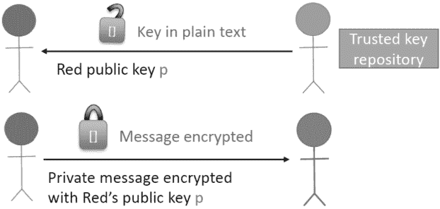
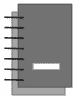
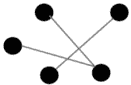
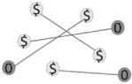
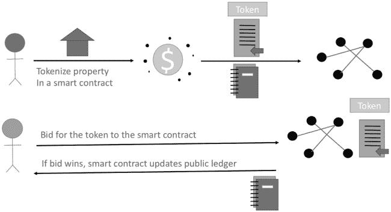
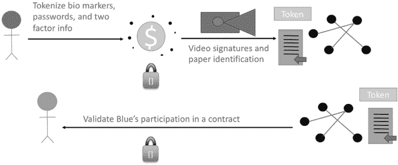
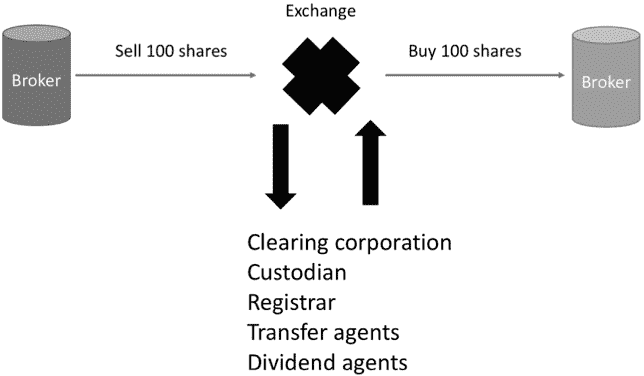

## 7

## 一个评估区块链用例的框架

菲利普·G·布拉德福德和罗杰·M·贝尼特斯

### 7.1. 摘要

预测新技术的影响是具有挑战性的。很难知道技术将如何被利用以及哪些技术启用的应用将会繁荣。虽然预测未来可能是无法实现的；确定当前技术适用于各种应用的适宜性可以洞察其潜力。用例是确定当前技术适宜性的最佳工具之一。给定一个商业问题，用例可以确定技术是否有助于解决这一问题。用例通过关注技术的功能属性而非底层实现来做到这一点。

区块链是面向服务并以软件为基础的技术。由于它们可能以多种方式对企业产生贡献，用例在评估区块链方面提供了很多帮助。大多数新的面向服务的技术都增强了流程或服务。偶尔，新的面向服务的技术会提供新颖的流程或服务。不常有的是，这样的新技术会创造原创的商业模型。创造原创的商业模型是技术能提供的最好的商业成果之一。用例将帮助我们更好地理解区块链应用如何增强业务，理解新颖的应用，甚至推动新的商业模型。

### 7.2. 引言

现代历史充满了技术对商业的高影响。区块链技术已经在许多组织中产生了影响。因此，对于企业来说，准备好迎接区块链技术的高影响是非常重要的。在大多数情况下，准备新技术的影响等同于接受新技术。在适当的情况下，早期采用对于新技术至关重要。这确保了企业的管理层理解新技术的应用和潜力。早期采用还确保了企业将培养适当的人才来开发和维护该技术。

区块链技术提供了处理许多当前商业挑战的不同方式。拥有处理问题的不同方法拓宽了企业的能力。这些不同的方法可能会给企业带来既有机会也有威胁。例如，区块链提供了使用加密货币的不同支付方式。电子支付系统已经使用了 50 多年。但是，最近区块链帮助那些传统银行系统之外的人获得了国际支付系统的访问权限。当然，随着这些不同的支付系统成熟，它们可能会直接与传统的支付系统竞争。正如往常一样，这些不同的方法都有自己的优势和劣势。区块链支付系统要想“规模化”并对传统银行系统构成威胁，必须克服许多重大的障碍。

区块链技术还增强了某些商业流程。改进商业流程可能增加价值或降低成本。例如，验证证书和学习记录的传统方法是手工操作，这是一个缓慢而繁琐的过程。在确定一个证书是否正确发放时，可能会带来额外的时间和复杂性。例如，一个证书可能又依赖于其他独立的证书。因此，验证所有这些记录是繁琐且劳动密集型的。区块链被用来验证和核实证书、学习记录、课程和文凭。这些区块链对传统手工任务的改进增加了价值并降低了成本。

区块链技术有潜力取代某些商业流程。确定交易商品或艺术品的来源可能会采取新的形式。通过使用智能合约，可以优化合规成本和努力。例如，金融机构实施了解你的客户（KYC）规定可能会以新的方式进行。了解你的客户和其他反洗钱规定对银行业至关重要，对于违规行为，可能会施加高达数十亿美元的巨额罚款。然而，目前合规流程往往是手工操作，依赖于少数人的专业知识。即使是耗资 1 亿美元自动化解决方案也是受欢迎的，因为违规的罚款在全球范围内是相当严重的。

近年来，有多起针对国际银行的大额罚款案例，这些银行因未能遵守反洗钱（AML）和了解你的客户（KYC）规定而受到处罚。2017 年，德意志银行因未能防止洗钱而被罚款 6.3 亿美元。总部位于苏黎世的瑞银集团（UBS AG）在 2019 年因未能遵守反洗钱规定而支付了 42 亿美元的罚款。2019 年，澳大利亚的西太平洋银行（Westpac）被发现未能检测到数百万笔可疑的国际转账，预计罚款将达数亿澳元。区块链技术有助于提高资金的透明度，以及资金转移的可追溯性。

区块链技术的另一种潜在商业模型是开发应用程序来追踪自主代理的来源或重大交易。来源在从艺术品购买或销售的历史到确定基本材料的原产地等众多领域都很重要。由于自主代理能够进行交易，追踪这些交易很有用。区块链为供应链提供了更安全、可追溯的方法。公司可能会创建一个数字护照或跟踪日志，证明商品的真实性，并创建一个可审计的产品供应链结构的记录。这一主题在后续章节中有详细的讨论。

区块链技术具有创造新商业模式的潜力。创造新的商业模式是经济演变中最高峰之一。新颖的业务模式在未开发的企业部门中增加价值。这些新的企业部门代表了重大的经济和社会里程碑。智能合约是新颖商业模式可能出现的领域。智能合约是软件执行的合同，表示自主各方之间的正式协议。一个区块链网络验证它们的条款和条件。这样的验证区块链网络肯定是由许多不可知自主方组成的。这增加了对合同解释的公正性和适当时间执行的信心。

自 2018 年以来，区块链技术一直在快速发展。大约在 2008 年引入，区块链技术的早期发展受到了爱好者、投机者和暗网用户的推动。然而，从 2017 年开始，区块链的成熟应用正在向游戏、媒体和财产登记等领域，以及其他高价值领域转移。到 2020 年及以后，区块链有潜力成为数字共享经济的重要组成部分。公司和政府在资产转让、智能合约和新市场上有很大的利益。因此，公司和政府在区块链研究和开发上投入了数百万美元。例如，在 2017 年，国土安全部（DHS）向区块链初创公司提供了约 250 万美元的资助。这是他们小企业研究计划的一部分。这些公司专门从事多种区块链应用、分析和去中心化密钥管理。另一个例子是中国政府在发展区块链技术的专业园区上投入了超过 1700 亿元人民币（约合 240 亿美元）。该国已经在杭州、重庆和苏州等城市创建了多个区块链产业园区，探索技术的未来应用。

#### 7.2.1 区块链的关键特性

区块链的特性对其商业应用案例至关重要。¹ 应用案例与功能需求紧密相关。在敏捷商业或系统开发的情况下，详细需求 somewhat 流动。主要功能通常很清晰，但细节和某些功能可能在解决方案的过程中进行权衡。专注于主要功能有助于推动预期解决方案的实现，并使应用案例保持相关性。

区块链是经常更新的去中心化公共账本。这些更新大约每 10 分钟预期一次或更少。这些公共账本记录点对点交易。点对点交易需要独立验证和执行，因为这些交易不由一个可信赖的第三方（如金融机构）促成。

这些交易的账本记录具有抗篡改性。其有效性可以被任何拥有正确工具的人轻松验证。此外，每个账本的定期更新都由一个自主代理网络进行验证。执行是基于共识允许交易发生。

生成定期更新的自主代理是有激励的。这些激励措施包括对交易进行补偿以及参与验证和执行更新。并非所有网络参与者都获得补偿。然而，网络参与者可能获得补偿的可能性激励自主代理支持网络。

一些区块链专注于智能合约。智能合约是当满足某些条款或条件时，区块链自动集体执行的计算机程序。条款和条件不是由可信第三方验证，而是由大多数区块链网络参与者验证。

实物或数字资产可能被代币化。代币化是实物或虚拟资源的唯一数字表示。区块链的关键能力之一是它们能够唯一地表示价值。因此，代币化与区块链非常契合。代币化有助于有效地将智能合约应用于虚拟或实物资产。

#### 7.2.2. 区块链的独特性

使用区块链的吸引力可能会因其某些属性而降低。在许多区块链中，定期更新速度较慢。这对于任何区块链上的大规模交易来说至关重要，因为它会延迟验证过程。这些更新在给定时间段内以块的形式汇总。例如，在比特币的情况下，预期的事务块之间的时间目标是 10 分钟，如第二章所提及。大多数区块链具有更小的预期块之间时间。定期更新不是精确定时，但通常在目标时间范围内。

区块链的空间有限。每个区块必须由区块链网络中的节点处理，因此保持区块合理大小是有意义的。在区块链中插入信息的成本可能会有所不同。这是因为交易成本通常是区块链模型的一部分。这些交易成本以相关的加密货币定价，这些加密货币可能非常波动。

区块链验证自主系统的共识，但它们本身并不是数据库系统的替代品。在区块链中记录共识是区块链的明确目的，然而，在区块链中记录更一般的记录可能并不受欢迎。特别是，下载整个区块链可能会耗时且成本高昂。区块的空间也有限，成本高昂，且记录不可更改。

使区块链适合商业案例取决于区块链提供的属性。这些属性必须与任何区块链的个性特征进行权衡。在本章的剩余部分，我们首先进行关于加密的技术讨论。我们的第一个用例是公钥加密系统。在 7.4 节和 7.5 节中，我们给出了一个评估区块链系统用例的框架。我们还开发了一个评分卡，用于评估区块链及其用例。这个框架从底层和顶层应用区块链，并开发评分卡。接下来，我们讨论区块链中的智能合约。我们深入开发了许多用例。最后，我们在简要总结之前，给出了区块链的注意事项和风险。

### 7.3\. 密码学和加密技术的技术入门

密码学是一门高度技术性和应用性的学科。家里的 WiFi 服务、工作中的 WiFi 服务或当地商店的 WiFi 服务都使用密码学。无论何时我们在网上订购任何东西，我们都在使用密码学。将文件放入云端或从云端获取文件也需要密码学。应用密码学的另一个常见用例是无线汽车钥匙。考虑到应用密码学的广度和深度，区块链使用密码学并不令人惊讶。实际上，区块链依赖于公钥加密。因此，第一个用例图示例说明了基本的公钥加密。

对称加密系统有一个密钥。所以，一个密钥既加密又解密秘密数据。由于有一个既能加密又能解密数据的密钥，所以存在对称性。大多数机械锁匙都是对称密钥。这是因为同一个锁匙既能锁门也能开锁。

公钥系统是不对称加密系统。这些系统之所以不对称，是因为一个密钥锁定数据，另一个密钥解锁数据。其中的一个密钥是公钥，另一个是私钥。公钥可能对所有感兴趣的人都公开。在已知公钥的情况下，找到私钥是难以解决的。

对于一个不对称的加密系统，设*E*为加密函数，*D*为解密函数。假设为这些加密和解密函数生成了一个公钥*p*和一个私钥*s*。私有信息*M*可以加密为*c* ← *E[s]*[*M*]，其中*c*是密文。密文信息可以解密为*M* ← *D[p]*[*c*]。

广义地思考，让我们计算*c*' ← *E[p]*[*M*]。也就是说，我们可以使用公钥加密一个私有信息*M*。当然，如果*c*' 容易在不知道私钥*s*的情况下，而用一个简单的解密机制*F*解密，那么*F*[*c*'] ← *F*[*E[p]*[*M*]]. 现在，由于*F*[*c*'] = *M*，所以必须有*c* ← *E[s]*，一旦我们有了*c*'，这个计算必须很容易。所以，加密方案就会被攻破。

所以，一个秘密信息*M*，一个公钥*p*和一个私钥*s*，使得

*M* = *E[p]*[*D[s]*[*M*]]

*M* = *D[s]*[*E[p]*[*M*]]

在这个用例中，蓝方想要向红方发送一个秘密消息。红方生成一个公钥*p*和一个秘密键*s*。公钥*p*可以公开发布。理想情况下，公钥由一个可信的第三方发布。秘密键*s*保持私密。

图 7.1 展示了一个示例用例图，其中蓝方安全地将私人消息传输给红方。首先，蓝方从可信密钥仓库绿方获取红的公钥*p*。接下来，蓝方使用红的公钥*p*加密他们的私人消息，并将加密的消息发送给红方。红方使用他们的秘密键解密加密的消息。在加密和解密方面，红的秘密键是红公钥*p*的反函数。

**图 7.1： 蓝方向红方发送一个安全的私人消息。**

### 7.4. 评估框架用例

区块链的有效性取决于对区块中交易有效性的信任。反过来，块的有效性取决于加密安全性。这种加密依赖性通过它们在区块链中的进展确保了对块的有效性的信任。特别是，信任块 10 包含有效的交易，需要我们信任块 9 的有效性，这又需要我们信任块 8 的有效性，等等。

如果量子计算成为现实，区块链密码学将大部分失败。这是因为 Shor 算法可以通过量子计算机有效地进行复合整数因式分解。因此，很清楚加密在区块链的信任中扮演着至关重要的角色。区块链有许多其他属性使这项技术具有吸引力，这些属性在审核用例中至关重要。

表 7.1 中的定义可以通过图表、注解和替代定义进行补充。这种补充使得更多的利益相关者能够更好地为谈判和讨论打下基础。

**表 7.1：  所选用例属性定义。**

| **属性** | **定义** |
| --- | --- |
| **公共账本** | 公共账本是一个可以公开验证的交易记录。交易的原理可能通过加密保持秘密，或者可以公开识别。然而，交易本身总是公开的。 |
| **点对点区块链** | 两个当事人之间的交易由区块链网络进行验证。这些交易不由第三方启用、中介、批准或审核。这意味着任何错误或不当的交易都必须由交易的两方负责。这是因为没有仲裁或争端解决。 |
| **自主激励** | 独立的自主机器被激励去启用和维护区块链网络。自主机器对交易的内容没有兴趣。相反，它们被激励去启用交易。它们也可能被激励去执行智能合约。 |
| **令牌化** | 令牌化是物理或抽象事物的数字表示。本质上，一个项目可以被象征性地表示为一个数字令牌。许多类似的物品可以被令牌化，形成新的市场。令牌化的重要特性包括不可复制性，用户定义的转让所有权限制，以及市场创建。 |
| **智能合约** | 智能合约是区块链网络上执行的计算机程序。智能合约编码了两个或多个对等交易。智能合约的条款和条件由区块链网络验证，当适当的条款和条件得到满足时，合约被执行。 |
| **每笔交易成本** | 每笔交易都包括支持网络的激励措施。在某些情况下，单个小型交易可能需要花费数美元。没有经济激励，自主机器将不会发挥其在促进交易和维护网络中的作用。 |

有许多具有自己专用属性的区块链。一旦达成了区块链*配置*，那么每个业务案例中每个区块链属性的重要性都将被评分。用例的分数之和为业务案例给出了整体的区块链评分。

将属性符号用图表连接在一起有助于发展评分。评分 100/100 表明该属性对于用例至关重要。同样，低分，比如说 25/100，表明一个属性对于用例来说不重要。

**表 7.2：一个示例用例评分卡。**

| **区块链属性** | **用例评分（0-100）** | **符号** |
| --- | --- | --- |
| 公共账本 |  |  |
| 对等区块链 |  |  |
| 自主和激励 |  |  |
| 令牌化 |  |  |
| 智能合约 |  |  |
| 每笔交易成本 |  | **$/Tx** |
| 总分 |  |  |

表 7.2 显示了区块链技术的属性。这个表格既有每个属性的重要性评分，也有一个符号。这些符号是用于用例图表的。构建不同业务问题用例图的目的是使用一套通用的符号。这些符号的语义应该为所有利益相关方定义良好。这最好通过几种方式完成，因为利益相关者将具有不同的背景以及不同的词汇。 表 7.1 给出了用例属性定义。

### 7.5. 应用框架

寻找区块链技术在商业中有效应用的两种广泛方法如下：一种是*自上而下的方法*，即从商业挑战出发，判断区块链特性是否可能对其解决方案有所贡献；另一种是*自下而上的方法*，即从关键的区块链特性出发，寻找区块链可以应用的商业挑战。自上而下和自下而上的方法可以结合起来，作为混合方法来开发区块链的相关应用。混合方法通常是迭代的自上而下和自下而上的应用区块链方法。

#### 7.5.1. 自上而下的方法

有许多流程图用于检查区块链是否可能对解决商业问题有所贡献。在自上而下的流程图中，从商业问题开始。目标是确定区块链是否提供了一个好的解决方案。商业需求通常被分解成可以用特定技术特性解决的部分。有时这些商业属性只适合特定的区块链。其他时候，商业属性对大多数区块链都适用。

根本问题在于区块链特性在解决商业挑战中的作用。这可能定义了感兴趣的具体区块链。最后，这个选择给出了下一个问题：任何属性都会增强现有流程、贡献于流程的新解决方案或创建新流程吗？

在自上而下的方法中，区块链特性是固定的，而商业问题则被适配到这些特性中。例如，考虑一个商业挑战。从广义上讲，有两种情况。第一种情况，当前手头的问题已有解决方案。在这些情况下，现有的解决方案可能被用作寻找基于区块链解决方案的指导。第二种情况，当前问题尚未解决。这类问题可能在没有区块链的情况下有很好的传统解决方案。首先应该对这些传统解决方案进行审核，以便为区块链和非区块链解决方案提供比较的基础。应该仔细审核区块链，并详细记录需要区块链解决方案的推理。

以下是对区块链进行自上而下审核以解决商业挑战的步骤：

+   将这个挑战分解为子挑战的图形：

    +   – 为这个挑战及其子挑战找到合适的区块链。

    +   – 这个图的结构反映了挑战中的依赖关系。

    +   – 确定考虑中的区块链的依赖关系。

+   列出关键区块链特性，如表 7.2 中的那些：

    +   – 看看哪些属性有助于解决子挑战的解决方案。

    +   – 确定挑战的依赖结构是否与区块链的依赖关系相匹配。

+   为这个问题评分每个区块链特性。将分数相加并分析总分。

#### 7.5.2. 自下而上的方法

这种方法从区块链的属性开始。首先考虑通用区块链属性。所有区块链都有许多共同的属性，如点对点交易、智能合约、代币化等。接下来可以考虑特定区块链的属性，如具有指定时间内平均区块生成的灵活智能合约。

这些技术属性解决了复杂的商业挑战。此外，可能寻求新的或意外的商业挑战，在这些属性中将产生以前未利用的价值。再次强调，目标是确定这些区块链属性是否增强、改善或创建新的解决方案。在这种情况下，首先列出所有感兴趣的区块链属性。表 7.2 展示了选定的区块链属性。接下来，关注这些属性的特性，浏览所有可能通过使用这些属性得到改进的商业流程。

这被称为“寻找问题的解决方案”。许多时候，这样的视角可能不会很快带来结果。相反，这种方法可能有助于理解区块链景观以及它为潜在商业挑战提供的机遇。自下而上筛选区块链以解决商业挑战的步骤包括：

+   确定是使用通用区块链属性还是特定区块链的属性。

+   生成可能通过区块链属性得到增强的有用且相关的商业挑战：

    +   – 商业挑战应该分解为依赖图。

    +   – 将区块链属性与依赖关系对齐。

+   关注那些区块链属性产生影响的图形组件。

+   在这些情况下评估区块链的属性得分。

+   将得分相加并分析区块链的贡献。

我们倡导对自下而上和自上而下的区块链应用方法采取正式态度。优点包括创建一个结构化的思维过程，理解和记录障碍，事先确定可行的解决方案等。当然，将所学内容保存下来对未来是很有价值的。因为后来，可能出现新的商业问题。对问题和应用有一个敏锐的理解将迅速导致更好的结果。

### 7.6\. 智能合约：独特特性

新技术常常不被充分理解。它通常复杂且处于发展的早期阶段。其技术属性或好处可能并不清晰。早期实施可能不稳定，在许多方面可能不足。尽管如此，新技术对经济增长至关重要。但是，新技术可能因各种好坏参半的原因而得到推广。

一个关键问题是区块链为企业提供了哪些独特特性？区块链提案常常看起来不必要。首先要看的是为什么这个商业问题不能用关系型或 NoSQL 数据库系统解决？

有提议称，区块链提供了新的价值。今天，这些技术或提议通常围绕公共共享账本，账本的维护成本由参与交易的各方支付。

智能合约的使用也是区块链应用的关键枢纽。智能合约一直是区块链早期发展的关键特征。在比特币的背景下，区块链的诞生就包含了智能合约。以太坊的领域进一步发展了智能合约的功能，并使其更加一体化。在以太坊的情况下，智能合约或许是最重要的特征。有许多语言可用于在以太坊上编写智能合约。

传统的纸质合同是结构良好的文件。合同中使用的术语在合同开始时定义，以供整个合同使用。合同分为条款。每个条款都有狭窄的焦点。每个条款必须不与法律或法规相矛盾。通常后续的条款建立在先前的条款上，甚至建立在先前的合同上。有时，条款和条件的具体含义会受到质疑。在最坏的情况下，关于条款和条件的含义的问题可能求助于案例法，或者很少诉诸诉讼。

智能合约完全是数字化的合约。它们是用编程语言编写的，因此可以由区块链执行。这种合约编程语言通常是面向对象的。面向对象的编程范式非常适合智能合约的某些方面。例如，每个类可能代表一个合约条款。类包含可能表明条款的依赖关系。也就是说，如果一个主要条款必须有一个子条款才能有效执行主要条款，那么这个子条款可以包含在主要条款中。例如，要获得驾驶执照，驾驶员可能需要有一份视力矫正表以及一份器官捐赠表。视力和器官捐赠表的详细信息可能包含在法律意义上的驾驶执照文件中。继承扩展或捕获其他条款已经达成一致的详细信息。例如，涵盖所有销售税的法律可能首先从销售点税继承。智能合约可以被编码为在销售完成时自动为销售税留出资金。

对于面向对象的合约语言的担忧包括关于多态性、动态作用域和全局指针变量的疑问。在面向对象的编程语言中，多态性有时发生在同一个操作符或操作在不同的上下文中具有不同的含义。这可能是有益的，也可能是增加人类理解合同条款的混乱。同样，许多面向对象的编程语言具有动态作用域。动态作用域可能导致相同的表达式在不同的上下文中执行时产生不同的值。最后，全局指针引用可能导致一个值有两个不同的含义。

另一方面，好的编程语言具有非常明确的意义。实际上，很多时候编程语言的意义是在正式的数学术语中定义的。因此，我们可以在某些编程语言中证明定理或关于某些程序的重要事实。这些事实可能包括正确性的概念。这排除了很多潜在的歧义。此外，一些编程语言具有内置的定理证明器。例如，声明式编程语言被给出事实和关系，并推导出结果或解决方案。

### 7.7\. 示例用例

用例有许多形状和形式。在后续章节中详细讨论了一些用例。这里的目的就是介绍一些用例，说明区块链技术如何满足商业需求。² 我们在评估用例时涵盖了视觉模型。这种可视化通常有助于与所有利益相关者拓宽用例讨论。本文中的两个用例，即带有智能合约的令牌化和电子公证，为展示区块链技术的关键特性提供了背景。

#### 7.7.1\. 带有智能合约的令牌化

**图 7.2:    带有智能合约的基本令牌化用例。**

在区块链上对财产进行令牌化的基本用例在图 7.2 的用例图中展示。这幅图展示了这一用例的基本功能。更多的细节可以在其他的用例图中包括。例如，从财产契约中获取元数据并用于令牌化的过程本身可能需要另一个用例图。财产契约适合于区块链模型，因为它们是高价值物品。它们不会持续交易。智能合约适合于财产契约，因为必须满足复杂的条款和条件。

一个简单但流行的令牌化示例是在“加密猫”这一创新应用中。加密猫是一个分布式应用程序。这个应用程序让人们培育数字猫。他们还交易数字猫。利用巧妙的令牌化和智能合约，每只猫都是独一无二的，无法克隆。然而，加密猫是通过一对公猫和母猫进行交配而产生的。系统中甚至还有遗传学的概念。每只加密猫都有其自己的数字编码基因组。在这种情况下，代币代表包括他们的外表和基因组的抽象数字猫。

加密猫的遗传学决定了猫的颜色、条纹、微笑等。在交配过程中，遗传算法（GAs）随机组合加密猫父母的位字符串，生成新的遗传学特征，代表新的特性。这些新特性在新生成的加密猫中表现出来。

培育加密猫需要虚拟配种。虚拟配种利用遗传算法结合两只培育中的加密猫的遗传基因。新创造出的加密猫后来可能会被拍卖。它们也可以作为额外的虚拟宠物保留。其价值基于它们的出处，特别是它们有趣的特征。通常，高价值的加密猫会培育出高价值的加密猫崽。

加密猫是区块链早期成功的应用之一。区块链有无数的应用，但像加密猫这样的分布式游戏是由区块链实现的。由于加密猫具有实际价值，加密技术在保护这种价值方面发挥了重要作用。区块链的分布式和自主性质也有助于分布式应用的有效性。

#### 7.7.2\. 电子验证平台

区块链电子身份和电子公证系统验证个人的身份和组织中他们的角色。电子身份通常是点对点的。在许多情况下，组织中的正式角色是公共知识，因此公共账本适合这种情况。

电子身份和电子公证系统为智能合约打下坚实基础。有多种基于区块链的电子身份系统帮助难民、服务不足或贫困人口。电子身份改进了传统的基于纸张的身份。这些改进包括一组经过验证的交易，这些交易可能与身份持有者进行核实。

电子公证系统旨在增强或替代传统的公证系统，以识别进入协议或签署合同的个人。电子公证系统对智能合约很重要。电子公证系统将智能合约扎根于非数字世界。

图 7.3（Fig. 7.3）展示了制作电子公证代币的过程。一个人可能采取生物特征，如指纹、密码以及其他信息，如出生地、朋友的名字等。当然，这些代币应该通过加密技术锁定。否则，身份可能会被复制。电子公证然后记录传统的签名和纸质记录，如驾驶执照、护照和出生证明视频。视频可能是代币的一部分，也可能位于另一个位置。³ 视频确实存在深度伪造的问题，这可能会阻碍电子公证的采用。

将证书和文凭放在区块链上正在变成现实。随着互联网和相关技术，按需课程和证书今天是现实。这带来了课程和证书的可转移性问题。课程和证书容易可转移将大幅增加它们的价值。这对机构、学员和雇主来说也将是节省时间和资源。

**图 7.3：电子公证系统。**

#### 7.7.3\. 股票交易后台

今天证券交易公司的后台处理反映了股票交易是基于纸质的时代。这些基于纸张的过程比现代计算机时代早了几百年。金融后台处理有很多冗余。⁴这种冗余很大程度上体现在对账和验证上。例如，验证是为了确定交易是否被正确执行。对账是让交易中的所有方就交易时间和数量达成一致，并验证当时的估值。

结算交易是各方相互比较和验证他们的交易是否正确记录的过程。有许多参与者需要结算交易。主要的结算群体包括经纪人、清算所和保管人。这些群体结算每一笔交易的双方。卖方这边有所有这些后台结算合作伙伴。同样，买方这边也有这些结算合作伙伴。所有这些各方都互相验证彼此的记录。他们的会计也要接受审计。他们都是支持功能性金融市场的重要部分。因此，他们也可能受到货币监理署和其他联邦机构的审计。

**图 7.4：参与公司股票交易结算的各方。**

图 7.4 给出了后台职能的高级视角。证券公司通常将大多数股票持仓以街名持有。街名是一种识别证券公司为股份保管人的保密级别。当然，证券账户持有者通常拥有这些股票，尽管它们是以街名持有的。本质上，街名允许证券公司代表他们的客户并保持他们的身份安全。所有证券公司都把所有股票以他们的名字持有，这使得清算公司在每交易日结束后更容易净额计算总股份所有权。保管人持有街名股票的同时追踪实际证券账户所有者。确定谁拥有哪些股份对于许多原因都至关重要，包括谁将获得股息、股票拆分、新发行等。股息和转让代理专注于这些行动。这些数据也报告给税务机关和系统，以便进行股份投票。

在过去，股票证书是印刷出来的，每次交易后都会在上面注明个别所有者的名字。当股票交易时，旧的纸质证书会被销毁，然后印上新所有者名字的新纸质证书会被打印出来，依此类推。因此，拥有保管处、保管人、转让代理是关键，这些机构负责寻找、存储、移动、打印和销毁纸质证书。

今天大多数股票以簿记形式表示。也就是说，计算系统表示股份并将这些股份与他们的所有者联系起来。这些表示是分开和冗余的。区块链有一个单一的点来表示共识。这些共识可以表示交易作为单一的真实来源。这些交易由自主机器验证并永久存储。这些永久的交易存储还提供了交易的来源。此外，这些单一的真实来源还可以用于审计。

可能没有必要持有以街道名称的股份。相反，通过不公开披露识别证券所有者的公钥来保持证券持仓的匿名性可能是可行的。由于不再需要按经纪公司聚合净股份，以及其他许多中介功能，因此采用区块链解决方案解决传统问题将提高金融交易机构的效率并降低运营成本。

#### 7.7.4 保险

保险是基于 pooling 资源来覆盖罕见的不利事件。传统上，保险承保人通过承保保险单来分散保险单。保险承销商是获得报酬来承担合同中定义的不利事件风险的组织。也就是说，如果发生了受保的不利事件，那么这些承保人将对受害者进行赔偿。因此，联合承保就是通过一组保险承销商来分散风险的过程。这种古老的实践可以被重新塑造为点对点模型。个别项目的保险单可能在保险智能合约中被标记化。

智能保险合同与传统保险合同相比具有许多有趣的优点。例如，通过互联网验证条款和条件非常有吸引力。例如，农作物保险可能基于降雨量。如果降雨量低于预设的阈值，则产生保险调整。一个实例调整是为一个验证的保险索赔支付。像这样的智能合约也可能减少保险调整所需的时间。保险索赔调整员验证一些保险索赔。索赔调整员甚至可以由智能合约部署。图像或其他信息可以加载到智能合约中并验证。

保险公司经常将他们的责任进行 pooling，并使用再保险来投保。再保险是保险公司的保险。再保险在许多方面都有所分散。例如，它可以按地理位置、保险类型、保单数量等进行分散。保险智能合约可能包含保险单再保险的参数。这将使政策更加清晰透明，因此被保险人可以更清楚地了解政策的保险风险。此外，面向对象的智能合约语言将非常适合这种类型的合同包含。

### 7.8. 注意事项和风险

测试网络不是面向客户的功能要求。然而，它们对于评估和实施系统至关重要。随着新区块链的开发和实施，拥有网络的健壮测试是关键的。

区块链网络需要广泛分布的支持和控制结构。这种分布是关于控制而非地理位置。分布式控制是区块链的的关键原则之一。这是因为区块链网络的弱点来自于它们的共识算法。区块链共识算法通过投票确定有效性。网络节点的多数决定一个区块或交易是否有效。因此，如果许多节点受到一个实体的控制，那么区块链就存在脆弱性。51%攻击是指超过区块链共识计算一半以上的参与者被攻陷。也就是说，这种妥协可能导致投票不正确，给出错误的共识。

区块链的一个重要贡献是它们巧妙地使用密码学来维护之前的交易并在无关利益方之间锁定分布式共识。撇开量子计算不谈，51%攻击并不会破坏密码学。相反，51%攻击是直接针对共识机制的攻击。这意味着参与节点较少的区块链比参与节点众多的大型区块链更容易受到攻击，因为少量节点更容易被攻陷和控制。

### 7.9 总结

新的区块链属性可能由用例驱动，而用例可能通过新的区块链属性进行验证。使用本章中的图表对区块链的新用例进行评估是可行的。这些视觉表示法用共同的符号将不同的利益相关者聚集在一起。将这些图表中代表的图像得分与图像结合起来将有助于它们的评估。区块链技术可能会创造新的行业。例如，分布式应用和智能合约可能会捕捉到新发现的经济学力量。用例将有助于加速这些新应用的验证。

### NOTES

1. 参见 Tasca 和 Tessone (2019)。

2. 关于如何[`www.ivarjacobson.com/sites/default/files/field_iji_file/article/use-case_2_0_jan11.pdf`](https://www.ivarjacobson.com/sites/default/files/field_iji_file/article/use-case_2_0_jan11.pdf)的更多信息。还参见 Bittner 和 Spence (2003)。

3. 更多信息请参见 Sward，Vecna 和 Stonedahl (2018)。

4. 关于交易公司当前流程的更多详细信息，参见 David M. Weiss (2006)。

### CONTRIBUTOR CONTACT INFORMATION

菲利普·G·布拉德福德博士是美国康涅狄格大学斯坦福分校计算机科学项目的负责人。Phil 的电子邮件地址是 phillip.bradford@uconn.edu 和 phillip.g.bradford@gmail.com。

罗杰·M·本尼茨可以通过邮箱 Rbenites@blockhivetechnologies.com 联系到。
