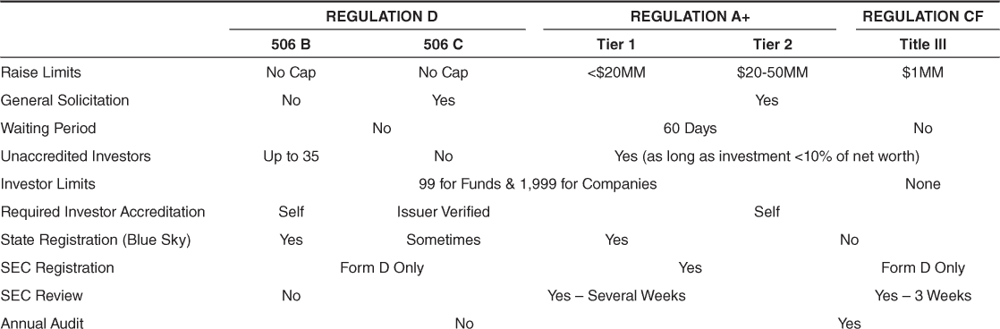
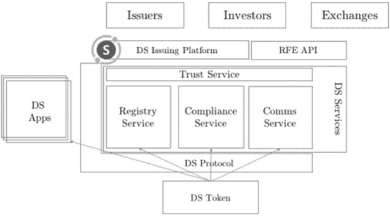
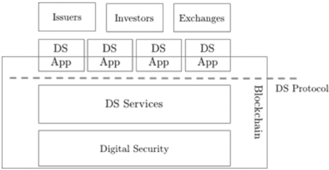
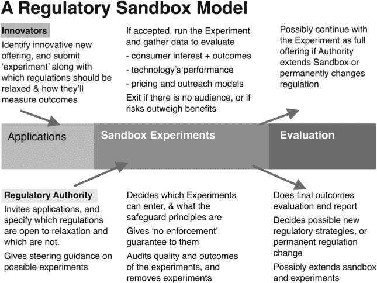
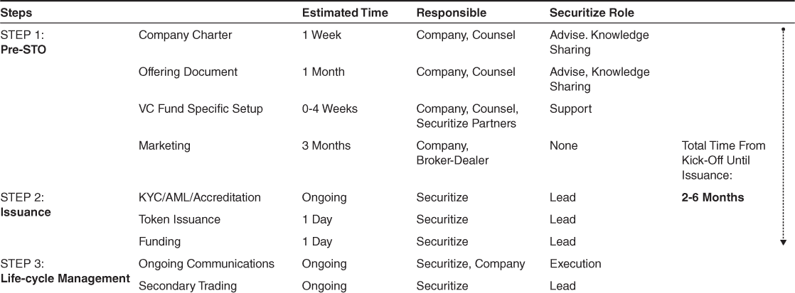
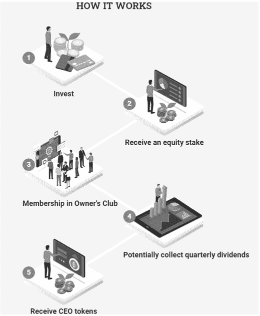
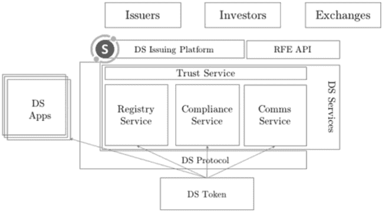

## 8

## 通过代币化融资企业扩张

MIKE ROGERS

### 8.1. 引言

传统的融资机制，如首次公开募股（IPOs），近年来一直面临压力，因为日益发展的互联网技术使复杂的过程得以简化，并消除了不必要的参与者。在线平台的增长与私人 placement 的增长同步，帮助企业家在业务早期阶段与大量潜在投资者建立联系。现在，随着区块链技术重塑互联网的基础，私人 placement 的融资方式正在通过证券代币发行（STOs）进行改革。

以下真实世界的案例研究描述了最近成立的金融新闻通讯提供商 Curzio Research 的 Curzio 股权所有者（CEO）代币发行。该案例突出了发行数字证券以筹集资本的成本、好处、要求和时间表。这一章节泛化为矿业行业的 STO，这是一个传统、过时和保守的领域。

### 8.2. 公司背景 – Curzio 研究

成立于 2016 年，Curzio Research 是一家金融新闻通讯出版商，为个人投资者提供精选的投资研究和分析。在成立的前 18 个月内，Curzio Research 积累了约 40,000 名读者。出版商的成功在很大程度上取决于将其读者名单转化为付费订阅者的能力。Curzio Research 在这方面做得很好，在启动的前两年内创造了 640 万美元的收入。作为比较，在同一时期，他们最大的竞争对手实现了 20 亿美元的销售额，同时分销给数百万读者。

随着 Curzio Research 的读者群体扩大，收入增长将会同步进行：在新闻通讯行业，订阅者名单的大小意味着一切。在分析了现有名单的数据并组建了合适的管理团队之后，Curzio Research 准备进行战略扩张。由于资本是扩大企业规模的燃料，该公司于 2019 年开始通过私人 placement 筹集 300-1200 万美元。

### 8.3. 私人 placement —— 替代方案与挑战

根据联邦证券法，除非证券发行已向 SEC 注册或存在注册豁免，否则公司不得提供或出售证券。符合豁免要求的发行通常被称为私人 placement 或未注册的发行。私人 placement 可以在以下豁免下提供：

+   Regulation A+；

+   Regulation CF；

+   或者，更常见的是，Regulation D（Reg D）。

表 8.1（#tab1）为这些豁免的简化总结以及它们的规则。

Curzio 研究由于 100 万美元的筹资上限而不符合 Reg CF 豁免。公司也不感兴趣 Reg A+上市，因为报告要求增加和 60 天的等待期。排除法，Reg D 是合适的豁免；在 Rule 506(c)和 Rule 506(b)之间决定时，公开招揽是主要因素。由于销售和营销是 Curzio 研究的专长，因此选择了 Reg D 506(c)上市。

在初步规划过程中，Curzio 研究开始看到传统私募的缺点。中介希望仅仅通过介绍潜在投资者就提取过高的费用。此外，经纪人寻求租金，而不保证为 Curzio 研究潜在金融工具提供充足流动性。很明显，Curzio 研究的传统私募将给中介带来的价值比给 Curzio 研究利益相关者的价值要多。

**表 8.1：     融资替代方案的关键特性比较。**

在面向未来、竞争激烈的行业中运营，Curzio 研究的领导层一直在关注数字资产市场的进展。他们知道有几个初创公司最近通过进行 STO 筹集了资金。因此，Curzio 研究开始研究数字证券生态中的安全令牌发行平台，并与 Securitize 联系。

### 8.4 。安全令牌发行与传统私募的比较

在会议期间，Securitize 与 Curzio 研究讨论了 STO 的独特优势。STO 提供与传统私募相同的全部好处，同时在整个安全生命周期内提供增强功能以最大化利益相关者的价值：通过 24/7 Security Token Exchanges (STE)的全球资本池的基于网络访问、降低运营成本和复杂性、通过投资者改善流动性等。

安全令牌是监管筹资的理想工具；其可编程性质使得在整个令牌生命周期内可以根据每个发行人的独特要求进行定制。从发行阶段开始，每个令牌的智能合约中就嵌入了条款和限制，以确保在从投资者那里筹集资金时能够遵守适当的监管规定。发行后，与投资者权益相关的事件，如接收股息、参与令牌购回和/或在公司决策中投票，都通过平台来促进。一个可编程和自动化的平台有助于简化与生命周期事件相关的典型流程。令牌还作为自动投资工具：底层账本跟踪随后的令牌交换，而智能合约自动执行公司行动。

通过在标准化的互联网生态系统中运营，如 Securitize 的 DS（数字安全）协议生态系统，安全令牌可以确保完全遵守适用的证券法规和规定。如图 8.1 所示，在该生态系统中，DS 服务（数字安全服务）基础架构支持第三方 DS 应用程序（数字安全应用程序），以解决 DS 令牌（数字安全令牌）生命周期的所有方面。

**图 8.1：Securitize 的 DS 协议生态系统**

**图 8.2：Securitize 的数字所有权架构**

如图 8.2 所示，令牌与利益相关者（发行人、投资者和交易所）之间的互动由分层和可扩展的 DS 协议（数字安全协议）管理。这种智能合约基础设施在生态系统中提供了一系列服务和应用程序；这些组件在遵守规定的同时为利益相关者提供价值，并利用区块链的不变性、公共性、分布式账本特性。

此外，根据发行人的要求，每个代币都编程了特定的合规规则。结果是一个受控的互联网环境，既能培育创新，又能保护消费者利益：这对于许多国家立法者采取的基于“沙盒”的方法来监管数字资产是理想的。这如图 8.3 所示。²

STO 的前期成本计算结果显示，其成本低于传统的未经注册的发行。Curzio 研究还预计，由于安全生命周期事件的简化以及相关合规流程，未来将获得节省。此外，Securitize 保证了在标准的 12 个月锁定期后每个代币的流动性。¹ 由于 STE 全天候 24/7 交易，Curzio 研究的投资者将通过 STO 实现更多的流动性。

**图 8.3：监管沙盒模型**

### 8.5. 安全令牌发行流程

在与 Securitize 合作时，Curzio 研究遵循了一个三步流程来设置、执行和管理其代币发行：

① - 设置阶段

在每个安全令牌发行之前，Securitize 与其客户合作创建一个定制的 STO 策略。这个过程包括确定如何最佳地：

+   构建每个发行计划。

+   起草或修改所需的文件。

+   获取适当的法律审查。

+   安排市场营销活动。

② - 发行阶段

安全令牌发行流程包括铸造公司的代币，适当监督每个投资者的了解你的客户（KYC）/反洗钱（AML）/认证程序，以及指导发行人与其投资者之间的资本和代币交换。

③ - 生命周期阶段

一旦代币发行并分发到每个钱包，投资者生命周期阶段就开始了。在这个阶段，Securitize 的平台为持续的投资者沟通和二级市场交易合规提供了一条途径。

标准的 STO 时间线在表 8.2 中有所说明。

以下三个小节详细讨论了上述三个步骤。

#### 8.5.1. 预售前

未注册的发行通常针对发行公司的普通股或优先股。然而，债务工具，如 promissory notes 或债券，以及混合证券，如认股权证和可转换债券，也可能发行。

**表 8.2：标准 STO 时间线。**

在此案例中，Curzio Research 发行了系列 A 非投票优先股，该股票赋予投资者在 Delaware 州成立的 Curzio Research, Inc.的股权。根据公司章程，Curzio Research, Inc.被授权发行五百万股优先股，以便完成代币发行。

通过使用简单未来股权协议（SAFE），投资者有权购买 CEO 代币。SAFE 旨在成为创业公司的友好替代品，用以替代可转换债券；该协议既不是债务也不是股权，也不会产生利息。投资者向公司注入资本，以此换取该协议。SAFE 持有人在未来的股权轮次中有权购买股票；这一权利受协议中最初设定的参数制约。像 Curzio Research 这样的早期阶段企业通常很难为其公司准确估值：SAFE 的创建旨在寻求融资时缓解此类挑战。

接下来，Curzio Research 创建了一份私人 placement memorandum（PPM），其中描述了公司结构、发行条款以及对潜在投资者的潜在风险。Curzio Research 聘请了外部法律顾问协助创建 PPM，以及与首席执行官代币发行相关的其他法律免责声明。PPM 是一个用于说明此类发行性质、特征和风险因素的标准化文档。

首席执行官代币发行的最显著条款如下：

+   融资金额：

    +   – 最低发行额为 3,000,000 美元，最高发行额为 12,000,000 美元。

+   最低投资规模：

    +   – 25,000 美元。

+   代币价格：

    +   – 每代币 5 美元。

+   代币折扣：

    +   – 代币根据投资的时间和投资阶段，可能会提供某些折扣，这些折扣由 Curzio Research 公司独自决定，具体如下：

        +   （1）私人销售（第 1-2 周）– 10%的代币折扣。

        +   （2）预售（第 2-4 周）– 5%的代币折扣。

        +   （3）主销售（第 5 周+）– 0%的代币折扣。

    +   – 同时，Curzio Research 出版物订阅者在发行时也可享受 10%的特殊代币折扣。

+   奖励新闻通讯订阅：

    +   – 根据在代币中的累计投资，投资者有资格免费订阅 Curzio Research 的五个现有新闻通讯，以及 Curzio Research 在指定期间制作的每一个新闻通讯：

        +   （1）2.5 万美元美元 – 2 年会员。

        +   （2）5 万美元美元 – 5 年会员。

        +   （3）10 万美元美元 – 终身会员。

+   合格购买者：

    +   – 美国认证投资者。

    +   – 符合国际司法管辖规定的合格非美国投资者。

+   支付方式：

    +   – 投资者可以使用比特币、以太坊或美元（美元）购买 CEO 代币。

+   最大代币供应量：

    +   – 333 万 2000 个 CEO 代币。

+   代币销售期限：

    +   2019 年 2 月至 4 月

+   代币持有者权利：

    +   – 通过公司的 A 系列非投票优先股，持有 Curzio Research 的直接股权。

    +   – 有望获得未来 3%的股息。

    +   – CEO 所有者俱乐部会员。

+   代币持有者义务：

    +   – Curzio Research 设立了在某些情况下赎回 CEO 代币的权利；潜在的阻碍是在潜在投资者未能正确完成 KYC/AML/认证过程，或未签署 SAFE 协议的情况下。

+   代币转让限制：

    +   – SAFE 和代币受到标准 12 个月锁定期的约束，在此期间，CEO 代币的二级交易将受到现有证券法规允许的交易的限制。

+   代币收益用途：

    +   – CEO 代币收益被指定用于一般公司用途，如资本支出、收购、基础设施和人员、产品和服务的发展，以及发行、法律和会计费用。具体而言，Curzio Research 计划：

        +   （1）将其前端读者档案增加到 10 万+。

        +   （2）进一步货币化其现有播客。

        +   （3）建立世界一流的投资者教育平台。

        +   （4）增加新的播客和读者要求的新闻通讯。

        +   （5）聘请更多专家分析师和其他关键人员。

        +   （6）与大型外部媒体机构合作，提高品牌知名度。

+   代币格式：

    +   – CEO 代币将符合 ERC20 标准，并作为智能合约嵌入以太坊区块链。

如前所述，Curzio Research 选择在 Regulation D, Rule 506(c)下进行代币发行，允许公司广泛地进行宣传和广告 CEO 代币。Curzio Research 团队制定了一个完善的市场营销策略，包括以下内容：

+   Curzio Research 创建了一个独特的网站[CurzioEquityOwners.com](http://CurzioEquityOwners.com)，作为 CEO 代币发行的信息门户。着陆页优雅地展示了：

    +   – 一个讨论 CEO 代币发行详细信息的采访视频。

    +   – 收到代币的过程在图 8.4 中用五个高级步骤解释。这幅图展示了一个投资者可以期待用他们的资本换取的内容的通用概述。

常见问题部分提供了安全代币的定义，并区分了安全代币和实用代币。

**图 8.4：代币是如何工作的。**

+   定义安全代币：

    +   - 在基本层面上，代币（或“币”）是某物的数字身份。

    +   - 安全代币是一种可交易资产。它可以支付投资者股息、利息或代表其所持基础资产的股权。由于这些代币由有担保的资产支持，并且可以交易，因此它们受到联邦证券法规的约束，就像股票一样。

    +   - 安全代币为资产所有者提供了一种快速、安全地将其资产（房地产/艺术品/收藏品/公司）出售给投资者的方式，同时为投资者提供监管保护。

+   安全代币与实用代币的区别：

    +   - 第一代加密货币主要是实用代币。它们不是为了投资而创建的。这些更像是应用程序币或用户代币，并允许访问公司的产品或服务。

    +   - 实用代币的一个例子是 Filecoin，它筹集了 2.57 亿美元。这些代币将赋予用户访问其分布式云存储平台的权限。

安全代币与私募相比有许多优势，这些包括：

+   安全代币市场为任何公司提供了一条途径，以区块链的速度和安全将资产的一部分出售给投资者——包括房地产、艺术品、业务或世界上价值数百万亿美元的任何资产——。

+   这些成本效益高。STO 中嵌入了智能合约。智能合约（或加密合约）是自动执行的区块链合约，消除了中介（投资银行），从而降低了服务交付的成本。这使得 STO 比传统的私募路线要便宜得多。

+   诸如 KYC 和 AML 等重要安全检查是自动的，这使得向认证投资者出售资产的速度大大加快。这些步骤还确保 STO 完全符合监管机构的规定。

+   加密货币交易优于传统交易，因为它是不间断的。大多数 STE 每天开放 24 小时……因此您可以在任何时间进行交易。

+   由于它们能带来更大的流动性和较少的行政管理，安全代币正被迅速采用。它们已经被好莱坞（现在个人投资者可以资助电影）、艺术家（安迪·沃霍尔最近将一幅画的 31.5%股份进行数字化并在拍卖会上出售）和房地产（最近圣瑞吉斯·阿斯潘度假村将其酒店进行数字化，赋予投资者所有权）等行业所采用。

+   在传统的私募中，投资者的资金可能会被锁定相当长的时间。平均而言，获得风险投资的公司需要五年才能被收购……而上市（IPO）需要超过八年。但 STO 参与者在 12 个月的锁定期后可以将他们的代币兑换成现金。

Curzio Research 联系了其最坚定的支持者，即其订阅者。订阅者名单是低垂的果实，因为公司的现有读者已经表达了对了解数字资产市场的兴趣。公司领导通知订阅者关于发行的详情，并指导他们如果感兴趣就访问[CurzioEquityOwners.com](http://CurzioEquityOwners.com)。

Curzio Research 针对首席执行官代币发行的促销策略取得了巨大成功，因为公司在筹集资金的前八天交易内就达到了 300 万美元的软顶目标：更令人印象深刻的是，考虑到 Curzio Research 用于推广首席执行官代币发行的营销预算还不到 2 万美元。

#### 8.5.2. 发行阶段

如前所述，首席执行官代币发行仅限于美国认证投资者和指定的合格非美国投资者。在 Securitize 的协助下，随后确认了每位潜在投资者：

+   满足了所有适用的投资者适当性标准，包括该投资者所在国家的标准。

+   完成了 KYC 验证。

+   进行了反洗钱尽职调查和筛查。

+   执行并交付了 SAFE 协议和一个可在网站上找到的配套问卷。

Curzio Research 随后使用 Securitize 的标准智能合约作为发行首席执行官代币的框架。律师确认，所有必要的 Reg D、Rule 506(c)限制和相关全球合规要求都已作为智能合约编入以太坊区块链。由此产生的符合 ERC20 标准的代币考虑到了投资者限制、锁定期和二级交易限制等其他合规要求。首席执行官代币智能合约还定制化以允许分配 Curzio Research 打算支付给其代币持有人的未来潜在股息。

首席执行官代币的购买价格定为美元。接受美元、比特币（BTC）或以太坊（ETH）支付。以比特币和以太坊支付的款项交付给指定的数字托管人，该托管人在支付日将比特币和以太坊兑换成美元。五名投资者选择使用加密货币购买首席执行官代币（其中两人使用比特币，三人使用以太坊）。根据 Curzio Research 在设置阶段定义的要求，Securitize 协助收集投资者订阅并把首席执行官代币发放到每个投资者的指定数字钱包。

#### 8.5.3. 生命周期管理

代币发行要求发行方管理其投资者和相关证券代币的生命周期。Curzio Research 将利用 Securitize 的在线平台与投资者进行持续沟通并监控首席执行官代币的二级交易。

在整个 CEO 通证的生命周期中，Cuzio Research 将需要根据 PPM 中定义的细节与 CEO 通证持有者进行沟通。此类事件包括但不限于预期股息的未来的声明和支付、公司可选的赎回和/或回购 CEO 通证，以及与每个财政年度结束后的未经审计财务报表交付相关的信息权利。Cuzio Research 还打算更新投资者关于所有重要商业新闻和交易的信息。根据新闻流动，公司打算每月、每季度或半年发布这些更新。Cuzio Research 将使用 Securitize 的社区管理解决方案来简化与投资者的持续沟通。

获得许可的证券化交易平台（STE）如 OpenFinance Network（OFN）是提供证券化通证发行（STO）流动性的主要参与者。它们的核心职能是确保证券通证的公平有序交易，并有效地为交易所用户提供价格信息。STE 在防止证券化通证生态系统中不合规、未注册的受限证券转售中扮演着至关重要的角色。

根据证券法规，CEO 通证被归类为受限股份。因此，二级交易受到项目计划说明书（PPM）中设定的转让限制。投资者被禁止在 Cuzio Research 指定一个 STE 或替代交易系统用于交易之前转让 CEO 通证。在选择二级市场后，所有潜在的 CEO 通证购买者将需要验证其身份，并在交易所完成必要的了解客户（KYC）和反洗钱（AML）检查，然后才能获得通证。从技术角度来看，CEO 通证的转让由合规服务管理，这是 Securitize 的 DS 协议生态系统的一个内置组件。DS 协议生态系统的说明见图 8.5。

**图 8.5：  Securitize 的 DS 协议生态系统。**

在发行之前，每个 CEO 通证的智能合约都上传了其转账能力，以便它们使用合规服务来检查特定钱包地址之间是否可以交换通证。当 DS 通证合约发送 transferTo 和 transferFrom 验证调用时，合规服务会检查注册服务中的发送者和接收者地址，其中存储了每个投资者的个人资料和相关合规信息。在获取投资者概况后，合规服务验证双方是否具有正确的类别，并且根据适当的规定现有限制内。如果一切检查无误，那么交易可以在交易所上发生。如果未满足适当的条件，交易将被停止，各方将被告知原因。

识别信任服务作为 DS 协议架构中的关键组件非常重要。信任服务被其他组件用来确保特定的参与者或 DS 应用被允许采取某些行动。它为其他 DS 服务提供了控制，所有参与这些服务的行动者在信任服务之前都已获得授权执行相关功能。例如，信任服务最终授权交易所向注册服务引入额外的条目。根据 DS 协议模型，在 CEO 代币锁定解除后，交易所被委托负责收集新投资者的 KYC 和资质信息。

受限证券通常在直接参与计划市场（DPP）中交易，在那里清结算过程中存在重大低效和问题。缺乏标准化和兼容性导致平均结算过程需要六到八周。区块链可以为受限证券的交易、清结算提供各种解决方案。利用分布式账本技术，STE 可以为碎片化的 DPP 市场带来效率、透明度和互操作性。

OFN 转变 DPP 市场流程的框架包含一个统一的协议来标准化资产和数据。由此产生的互操作性创建了一个机制，使代币化交易能够连接链下“传统”另类资产和链上“数字”资产，如 CEO 代币。OFN 的白皮书详尽地阐述了典型的证券交易生命周期（STL），称其“始于投资者发起的交易，无论是买家还是卖家。他们的经纪人将交易发送到交易所进行处理，在那里它与相应的对手方匹配。然后，交易所将这个匹配的交易发送到中央对手方清算所（CCP），在那里它与经纪人协调以减少默认和对手方风险。从那里，交易被发送到结算，投资者的保管人（持有资产和资金）通过中央证券存管库（CSD）工作，以确保资产和资金从一方转移到另一方。最后，交易数据被发送到发行人的注册人或转让代理，以更新他们的股东名单和信息。”

OFN 强调了 CDS 和 CCP 在当今 STL 流程中维护各方“信任”的中心作用。当前模型提供了资产标准化、参与者间互操作性、降低交易对手风险并确保交易验证。然而，STL 模型也有显著的缺点：需要大规模的规模才能使集中式信任实体的网络有效，对小型参与者来说，获得网络访问权需要高昂的入门成本，数据需要在多个中介机构中冗余存储，等等。这种过时的遗留系统带来的复杂性和低效导致了 STL 过程中发行人和投资者不必要的高昂成本，而中介机构则显著地从寻租中受益。为了克服这些低效，OFN 开发了一个分布式证券托管系统，用重新构想的 STL 替换了 CCP 和 CSD 的需要。

OFN 为替代资产提供了一个共同的框架和通信协议，以标准化这些资产以及与这些资产相关的报告、合规、结算和清算流程。通过用 OFN 替换 CCP 和 CSD，市场参与者不再需要依赖人工对账的账本；终于可以实现资产所有权和资金可用性的实时验证，有效消除了交易对手风险。投资者通过 OFN 在二级市场交易，可以直接享受到较低的费用，这是由于标准化和简化的合规、所有权转移、托管和收益分配流程所带来的效率提升和成本节约。

如第十章所讨论，代币化资产，如 CEO 代币可以由 OFN 及其经纪商、托管人和银行的联盟以符合统一商业代码的方式进行分布式保管。这种机制通过新的分布式账本记账方式桥接了证书和簿记记录之间的鸿沟，使即时结算成为可能。数字资产市场爱好者认为这些好处最终会导致从传统的离线电子簿记系统完全迁移到在分布式账本上记录所有权。

### 8.6. 矿产行业的融资

矿产和采矿行业，这是一个以采纳新技术缓慢著称的行业，正在迅速地融入区块链技术。如下一章所讨论，区块链应用正在为矿产行业的记录和采购开发。在这里，我们简要讨论了采矿业是如何通过利用区块链和智能合约技术来为其项目获得融资的一种创新方式。

采矿业是一个资本密集型行业，需要大量的初始投资，且充满了经济不确定性。自 2008 年全球金融危机以来，商品市场上的原材料价格波动一直存在。采矿业的繁荣，在金融危机之前，是由发展中国家快速的生长和工业化推动的。然而，自金融危机以来，终端需求和初始信贷可用性都出现了急剧下降。尽管过去十年许多其他行业已经恢复，但采矿业的经济复苏并不明显。中国低于预期的增长速度，欧洲持续的债务问题，以及全球信贷的收紧，都阻碍了复苏。商品价格的下跌导致回报和收入减少，从而产生了矿工长期投资视角与投资者短期回报视角之间的不匹配。因此，矿工最近在筹集股权资本以资助企业冒险时遇到了挑战。

在利润下降、信贷紧张和投资者要求更高的背景下，采矿业正在寻找创造性的融资选项来资助其增长项目。他们正在将传统的融资选项与替代融资来源相结合。^(²)采矿特许权和金属流融资已经成为矿工特别受欢迎的融资来源，因为它允许在不稀释股权所有权的情况下获得早期阶段资本。采矿特许权是基于矿物生产或矿物销售产生的收入或利润的一定比例支付权利。特许权融资通常涉及投资者向矿业公司支付预付款，以换取矿业公司合同承诺在指定期间内支付未来收入的一定比例。

特许权融资的结构非常适合通过智能合约和共识机制实施。因此，矿业公司正在将特许权融资模型与数字包装相结合，并向投资者提供安全代币。此外，流融资模型——一种金属预付款结构——容易证券化。因此，将前沿技术应用于一个古老问题产生了对双方都有益的创新解决方案，即投资者和矿业公司。

### 结论 8.7。

需要资金的企业正在寻找新的融资选项。对于私募，有两个选项：传统的私募或 STO。在进行了成本效益分析之后，一些企业决定 STO 为其利益相关者提供了最大的价值。

证券化通证发行（STO）带来了一些筹资优势，例如较低的前期成本、简化的行政程序、紧凑的流程时间表，以及扩大了潜在投资者的范围，他们可以通过互联网贡献法定货币和数字货币。这一简化流程可以在几个月内完成，其中准备文件和法律审查需要的时间最长。在 Curzio 研究的案例中，他们能够在发行的前两周内筹集到 300 万美元的目标资金，并从超过一百位投资者那里总共筹集了 410 万美元。传统的采矿行业也采用了这种新的融资工具来筹集资金，以资助新的业务。

证券化通证发行（STO）不仅提供了一种便宜且快速筹集资金的方式，而且还为通证的生命周期内提供了后勤优势。在 Curzio 研究的案例中，通过在 Securitize 的 DS 协议生态系统内运营，CEO 通证有望减少与金融工具生命周期事件相关的合规和运营费用。这些通证还提供了实用性，用户可以通过其在线平台访问 Curzio 研究的基于网页的内容。在锁定期结束后，CEO 通证投资者应从指定的 STE 中获得增强的流动性。投资者还可以利用 Securitize 的平台在一个地方管理与管理通证相关的事件，因为这些发展是在数字证券生态系统的分布式账本上记录的。

### 注释

参见 1. 锁定期是一段时间，在这段时间内，投资者不允许赎回或出售他们在投资中的股份；这些限制有助于保持公司领导层的稳定，并给他们时间执行他们的策略。

参见 2. [`www.whitecase.com/sites/default/files/2019-05/tokenising-mining-metals-assets-web.pdf`](https://www.whitecase.com/sites/default/files/2019-05/tokenising-mining-metals-assets-web.pdf)。2020 年 1 月访问。

### 贡献者联系方式

想要联系 Mike Rogers，请访问[MillennialsInBlockchain.io](http://MillennialsInBlockchain.io)或发送电子邮件至 Mike@MillennialsInBlockchain.com。你也可以在 Twitter 上关注他@MillennialMike7，他在那里公开讨论他的激情。
