## 10

## 日本房地产市场的资产代币化

迈克·罗杰斯

### 10.1. 引言

数字资产市场目前正在经历显著增长，同时对资产代币化的兴趣也在增加。回顾比特币的“彩色硬币”时代，开发者们看到了基于区块链的资产跟踪所有权的机遇，从而实现安全的点对点资产转移。自那时起，创新者一直在创建协议，以现代化在线资产创建、表示和所有权转移的方法，尤其是在数字证券行业。

随着数字证券市场的持续扩大，全球倡导组织开始关注。个人、企业和政府都在探索这种强大、功能丰富的金融科技（fintech）。然而，潜在的利益相关者主要缺乏对清晰、可靠的研究的访问，这些研究展示了代币化的合法商业用例。

本章展示了在日本房地产市场中使用数字证券的价值主张。通过这种独特的金融机制，日本房地产管理者可以找到解决当前挑战的方案，例如投资基金期限延长、市场定价低效和基础投资流动性不足：由分布式账本技术（DLT）提供动力，证券化令牌生态系统准备好解锁日本房地产市场（约 17.7 万亿日元，约合 1600 亿美元）中的新能力。

### 10.2. 区块链引发的金融变革

区块链是一种记录在数字账本上的交易分布式数据库结构，为用户提供了一个安全、透明的活动历史。在我们日益增长的数字世界中，大量的数据容易受到篡改和盗窃，区块链的构成为其用户提供增强了的安全性和保证。

正如前几章所提到的，区块链安全性基于共识和防篡改的概念。当网络设备确认交易的可靠性和系统真实状态时，便达成了共识。一旦交易得到确认，区块链的记录就被认为是防篡改的，意味着它们无法在没有压倒性共识的情况下被更改。此外，密码学在区块链数据安全中扮演着关键角色。密码学散列算法通过生成加密密钥来加密和解密信息，帮助保护账本的交易数据。非对称密码学，或公钥密码学（PKC），用于保护数字资产钱包，确保只有预期的用户可以访问。

与对称加密算法不同，后者使用相同的密钥进行数据加密和解密，PKC 算法使用一个密钥进行加密（公钥）和另一个密钥进行解密（私钥）。数字资产钱包地址是通过公钥生成的，使其可以安全地与他人分享。私钥用于创建数字签名和验证交易；在确认数字签名内的散列后，交易被验证并添加到账本中。不对称加密系统在数字资产行业中广泛使用，以增强交易安全性，因为只有与相应数字钱包关联的私钥才能授权资产转移。

当结合这些特性时，区块链数据的完整性得到维护，提供了一个将金融产品转换为通过加密技术保障的数字代币的中介；这些数字资产可以在分布式账本网络上发行和转让。分布式账本技术（DLT）正在现代化金融服务基础设施及相关流程，通过创建经多方共识机制认证的电子记录共享数据结构（账本）。因此，数字资产交易实时记录在权威账本上，该账本对适当的网络用户可用。如后文详细讨论，分布式账本网络模型可以消除或简化报告和审计过程，以降低成本并提供更大的保证。当将智能合约集成到分布式账本系统中时，金融工具和相关程序进一步得到转变。

### 10.3 SMART CONTRACT STANDARDS EXPEDITE DIGITAL ASSET FUNCTIONS

如前所述，智能合约是协议，通过数字化手段执行之前商定的条款和程序。通过智能合约执行的交易是条件性的，因为底层代码遵循“如果，那么”逻辑语句，意味着如果满足一个要求，那么就发生一个动作。智能合约活动记录在分布式账本上，使所有交易都可追踪且防篡改。智能合约的独特特性确保了在没有第三方的情况下可靠地执行交易，从而降低了运营和交易成本。

智能合约在概念上与传统数据库结构中用于自动化软件的“存储过程”相似。然而，分布式账本智能合约可以跨不同实体自动化业务流程，而网络规则提供了保证执行和结果对所有系统参与者都可验证和审计。同样，分布式计算平台“以太坊”提供了一个图灵完备的脚本语言，为智能合约的实现提供了内置标准。

以太坊请求评论（ERC）标准描述了代币所需的功能集合，使智能合约和相关应用能够以可预测的方式进行通信和执行功能。ERC20 标准为系统化创建通证（ERC20 通证）提供了一个框架，以及跟踪余额和转移功能的能力。利用以太坊强大的平台，ERC20 通证为 businesses 提供了一个创建自身数字资产的简单机制。这种新颖的功能引发了一场数字资产筹资热潮，给全球金融监管带来了非传统的挑战。

### 10.4 HARMONIZING FINANCIAL REGULATION ACROSS JURISDICTIONS

重大技术创新，如互联网，与个人市场在全球金融系统中的更深层次整合相一致。1987 年，前美国证券交易委员会（SEC）主席 Charles Cox 在国会作证时注意到了这一趋势，他表示

由于包括技术进步和许多世界证券市场取消了对外国参与的限制等多种因素，国际化不仅仅是发展中的趋势，它已经是当今的现实。¹

技术进步也带来了跨境监管的新挑战，这一点从区块链和数字资产最近的创新中得到了证明。

对其他司法管辖区的企业进行监管需要当地立法者思考他们的规则如何适用于希望进入其资本市场的主体。在某些情况下，这只需要外国和国内公司遵守相同的法律。然而，监管机构意识到这种方法可能并不总是恰当，为外国发行人和投资者提供某些豁免。这种灵活性使当地地区能够从全球企业中收获经济回报，同时保护其公民免受潜在的欺诈和滥用。

2014 年至 2018 年中期，通过数字资产筹集了超过 110 亿美元。大部分由以太坊的 ERC20 标准促成，这一全球现象展示了使用分布式账本技术（DLT）和智能合约进行筹资的有效性。然而，在此期间创建的大部分实用通证是通过不合规的首次币发行（ICO）发行的。根据 Satis Group 的数据，78%的 ICO 被认定为骗局，7%失败或已死亡，只有 15%在交易所上市。² 因此，创新者和政策制定者认识到了明显加强数字资产监管的必要性。

2019 年 7 月 30 日，美国证券交易委员会（SEC）委员 Hester Peirce 在新加坡社会科学院融合论坛上谈论了数字资产监管领域跨边合作的重要性。她承认，数字资产提出了独特的担忧，因为

世界上各个国家仍处于确定如何以及是否对加密货币进行监管的早期阶段。对于任何特定国家的规则的不确定性使得确定适用哪个国家的规则更加困难。③

在没有单一的全球监管框架的情况下，这对于创新者来说是一个挑战，因为这种框架既不太可能也不明智，创新者需要规划潜在的司法管辖区之间的摩擦。

数字资产监管框架需要与投资者的期望相一致，因为生态系统参与者的地理位置往往不同。Hester Peirce 在新加坡承认了这个问题，她表示

如果投资者、他们进行交易的平台以及他们投资的公司都在同一个国家运营，那么投资者知道哪个国家的规则适用，但是当涉及多个司法管辖区时，情况就会变得更加复杂。

注意到这些挑战，数字证券企业家认为他们的产品和服务可以提供一个可行的解决方案，以应对可能随着 Web 3.0 接近而加速的监管泥潭。

### 10.5. 数字证券——向 Web 3.0 迁移

一个更加可靠、公平和开放的网络的概念很久以前就被设想出来了，然而，适当的实施需要在计算学科上取得几十年的重大进步。幸运的是，最近在人工智能、分布式系统和云计算等领域取得的突破使我们更接近于 Web 3.0。价值创造、存储、传输和重新定义方式的即将到来的转变无法被过分强调。然而，首先需要理解下一个网络的原则，才能真正把握即将到来的范式转变。

Web 3.0 的基础是一个“语义网”，在其中有状态的互联网或

一个能够处理数据，以及改变数据状态的规则，就像今天互联网处理消息的方式——基本上是去中心化的——并允许私有有状态网络之间以及与公共网络通过标准协议互操作的互联网。⑤

区块链技术为网络参与者提供了一种在互联网上持有和转移状态的媒介，无需中央服务提供者的帮助。有状态的互联网和语义网将催生一种新的数字经济，这种经济在网上跨多边市场运营。分布式账本技术（DLT）系统、智能合约和安全代币将使我们的现有金融体系与明天的数字价值系统之间的合规互操作性成为可能。

安全令牌或数字证券旨在代表资产和/或实体的所有权。数字证券在简洁性、效率和流动性方面与传统的 ERC20 代币享有同样的优势，但它们还具有编程内嵌的监管遵从性的额外好处。通过确保正确遵守身份、司法管辖权和资产类别限制，数字证券有望成为全球标准化的机制，使受监管的金融在 Web 3.0 上运作。

数字证券提供强大的监管控制，使它们成为管理众多监管司法管辖区的理想工具。治理法律和法规嵌入在协议层，提供适应性和灵活性。编码的预防性和检测性控制框架可以减轻风险影响，导致合规成本下降。随着编码框架降低合规成本，它们将有助于促进不同 DLT 系统之间的跨境交易。智能合约可以确保严格遵守所有适用法规，同时执行任何公司行动，如投票、股息、股票回购和交易。由此产生的治理相关摩擦的减少可以允许创建无信任业务。

通过网络平台、分布式账本技术（DLT）、智能合约和基于区块链的资产的组合，自主经济模型和企业结构终于成为可能。投资者和市场参与者可以找到交易对手，发现价格，并交易代表所有权和经济权利的数字工具。组织治理和决策可以被形式化、自动化，并使用软件实施。

作为投资工具、协议、合同和工具的混合体，数字证券可以确保今天金融法规和规章的适当迁移到新的数字经济中。因此，预计在未来几十年内，安全令牌的使用将显著增长。

### 10.6. 安全令牌的预期增长

当我们分类数字证券时，我们发现将安全令牌分为两大类最为合适，即传统安全令牌和资产支持安全令牌（ABSTs）。传统安全令牌是在安全令牌发行（STO）期间发行的数字资产，这是一种我们在 Curzio 研究章节中探讨过的私有融资方法。这些基于区块链的资产独立于物理世界存在，意味着它们在“链上”生活和交易。根据法律，传统安全令牌必须遵守每个发行人、投资者和后续持有人的规则和法规。

截至 2019 年，数字证券行业的大部分经济价值来自用于初创企业融资的传统安全代币。韩国区块链研究和咨询公司 Chain Partners 估计，未来安全代币可以捕捉到当前 1020 亿美元的总可达到的初创企业筹资市场的 510 亿美元的一部分（图 10.1）。

图 10.1：**通过安全代币（STO）融资。**

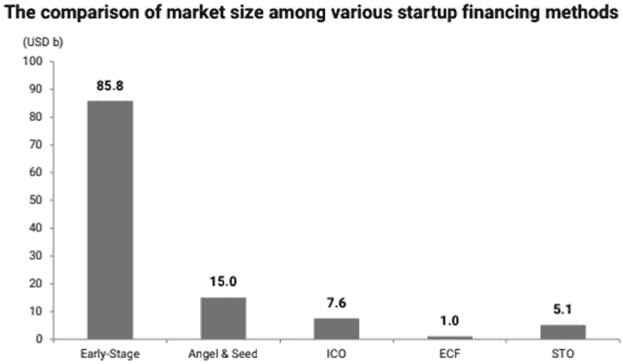

来源：Chain Partners，lcodata；Crunchbase News；汤森路透 TAB 数据。注：ICO 数据是 2018 年 1 月至 11 月的总和。

初创企业融资是早期阶段创业带来的创新的命脉，一直是数字资产最初崛起的主要催化剂之一。从筹资角度来看，传统的安全代币本质上已成为符合监管要求的实用代币的继承者。

根据图 10.2，Chain Partners 预测，到 2030 年，安全代币市场将达到 2 万亿美元，年复合增长率为 59%。然而，大多数增长预计将由 ABSTs 的发行所推动。

图 10.2：**安全代币的预期增长。**

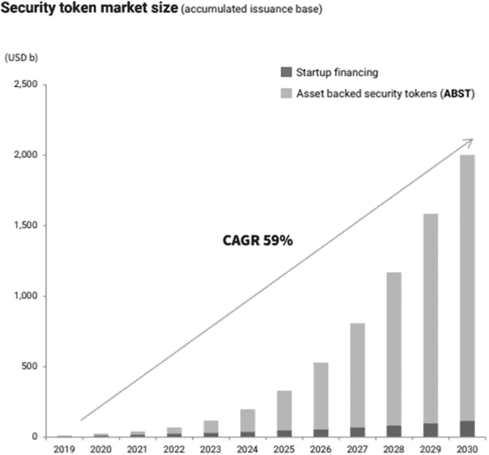

来源：Chain Partners。经许可使用。

ABSTs 是通过将现有金融/实物资产证券化而创造的数字资产；这些代币是存在于“链下”的资产的“链上”表示。ABSTs 由底层现实世界资产支持，并从中获取价值，从概念上类比于传统金融中的资产支持证券（ABS）。

ABSs 是通过强大的创新过程——证券化而创造的。正如哥伦比亚大学教授 Suresh Sundaresan 所定义，证券化是

*一个框架，通过仔细的包装、信用增强、流动性增强和结构设计，将公司或金融机构的一些非流动性资产转化为由这些资产支持的证券包。 （Sundaresan，1997）*

证券化的灵活性已经革命化了可投资世界，为发行人和投资者提供了机会。

技术长期以来一直是新证券化方法的支持者；信息技术的出现使得有担保的借款全球化，催化了 ABSs 数十年的繁荣，如图 10.3 所示。

图 10.3：**各行业资产基础证券的增长情况。**

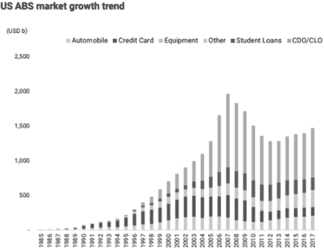

来源：Chain Partners。经许可使用。

以类似方式，区块链技术催生了证券化金融资产，这是一种特别适合全球金融结构的工具。在这种情况下，通过利用 DLT 在通信、计算和记录方面的进步，以及智能合约的自动执行，ABSTs 为数字化现实世界资产提供了理想的媒介。

金融全球化与日益增长的对变革性金融机制的需求，如代币化，之间存在共生关系。全球化要求跨境各方的一致性，特别是金融家声称证券 underlying assets 的能力；代币化是市场融资能力的进化，允许在互联网上无缝传输和有状态存在的数字原生证券。

考虑到 ABSTs 目前只占数字证券市场的 20%，代币化资产在未来十年将会有巨大的增长。根据图 10.4，Chain Partners 预计 ABSTs 的市场供应量将在 2021 年左右超过传统证券代币。

**图 10.4：相对预计增长的 ABSTs。**

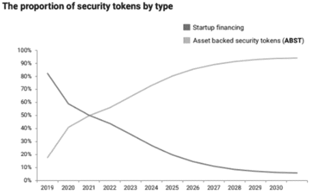

来源：Chain Partners。经许可使用。

为了实现这些宏伟期望，首先必须实现机构化，这需要建立强大的国际标准、最佳实践和可信的基础设施。幸运的是，数字证券行业在 2019 年在这些领域取得了重大进展，并继续在 2020 年这样做。

### 10.7。数字证券生态系统

证券代币生态系统持续扩大，目前由初级发行、交易和安全平台组成。战略资源和知识共享为所有各方带来显著价值，因为数据增强服务和产品正在上线。

初级市场主要包括数字安全平台，例如 Securitize。这些提供商支持数字证券所有权的整个生命周期，不仅限于发行，还包括每个利益相关者的目标：发行人、投资者和交易所。Securitize 的平台由其 DS 协议（数字证券协议）提供动力，这是一种流动且适应性强的所有权架构，在 Curzio 研究章节中有详细介绍。DS 协议创建了一个符合监管要求的互联网生态系统，建立在智能合同基础设施 Digital Securities Services (DS 服务)上，支持第三方数字证券应用程序(DS 应用)。证券代币与其他智能合同之间的所有交互都是标准化的，使适用证券法律和法规在整个数字证券生命周期中得到适当遵守。

数字证券二级市场由多个持牌证券代币交易所（STEs）和其他市场和流动性提供者组成。STEs 根据美国规定被归类为替代交易系统（ATS），必须得到 SEC 的批准。ATS 在日本被称为 proprietary trading systems，是计算机系统，通过匹配买家和卖家找到执行证券交易的对手方。通过消除传统经纪人和交易所的服务，ATS 为寻求获取流动性的投资者提供较低的交易成本。

我们的 Curzio 研究章节研究了 Open Finance Network，这是一个 ATS，其协议用于标准化替代资产，以及与这些资产相关的报告、合规、清算和结算流程。这种互操作性为代币化交易创建了一个机制，使离链的“传统”资产和链上的“数字”资产能够连接。此外，市场参与者不再需要依赖人工对账的账本，使资产所有权和资金可用性的实时验证成为可能。代币化资产的即时结算将改变典型的证券交易生命周期。

数字证券市场的代理已经获得了必要的执照和监管批准，作为投资服务提供商运营。结合技术知识，数字资产行业的质量和执行标准得到了提高。成熟使得传统金融服务公司开始与证券化代币生态系统合作，正如 Securitize 最近一轮筹资从桑坦德创新风险投资、三菱日联金融集团、野村控股和索尼金融风险投资那里筹集了超过 1400 万美元所示。⑥ 与这些值得信赖的机构合作进一步合法化了数字证券，并有助于加快证券化代币的采用。

### 10.8. 房地产市场的低效率

当前，房地产行业充满了低效率；可靠的房地产数据分布不均、随意定价、不透明的所有权结构、碎片化的信息系统、模拟（纸质和其他非电子）记录、地方化的市场和孤立的网络，以及其他无数的不足，都导致了市场透明度问题。信息透明度较低的市场在投资者做出决策时会阻碍他们的信心，导致逆向选择和低效定价。数字证券可以提供一个框架，现代化一个以实时数据缺乏而闻名的资产类别的流程和程序。

在分布式账本系统上发行和转让的代币化资产将提高数据透明度并扩大市场准入，最终改善房地产的流动性和资产定价效率。通过精心的金融结构技术，可以定制房地产资产的所有权利益及其底层现金流。证券化代币可以捆绑在一起，代表多个物业的现金流主张，或者代表单个物业的份额所有权。数字证券提供了证券化的灵活性，同时利用基于网络平台的开放接入。

代币化的灵活性为发行人和投资者提供了独特的优势。基于协议的金融工程允许从任何类型的现金流中创建代币，包括那些在当前结构化技术下经济效率低下的现金流。这些代币有明确定义的授权，充当借款人和投资者之间的金融中介。发行人可以通过其资产负债表上的资产进行成本有效的杠杆操作，从而提供获取低成本全球资金的途径。资本提供者可以享受多种投资部署选项，多样化投资组合风险。此外，提供直接资产类别曝光的代币能更好地进行风险校准，帮助投资者形成定制化的风险回报配置。

如前所述，证券化代币的好处可以使机构房地产的流动性大幅提高。如图 10.5 所示，Resource Real Estate, LLC 的“不流动-流动光谱”，机构房地产是一种极其不流动的资产。

**图 10.5:    资产的相对流动性。⁷**

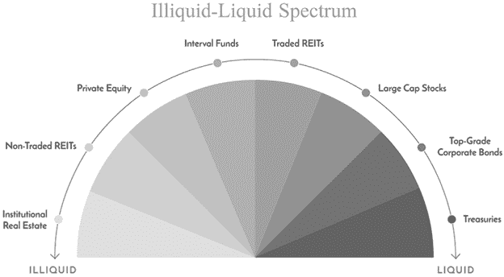

从购买者的角度来看，机构房地产投资需要较大的前期成本，其中大部分是由当地贷款机构提供的。这限制了知名度较低的购买者获取低成本的全球资本市场借款的能力。同样，从贷款者的角度来看，他们只能局限于地区市场，这限制了他们转移风险和寻求可能表现更好的资产类别以进行多元化的能力。地区性集中的贷款机构可以通过分布式账本技术（DLT）系统调整贷款敞口，通过证券化代币的方式，将这些现金流分块提供给全球投资者池。随后的代币购买者可以从其居住地之外的房地产投资中获得曝光，而原始贷款者可以从中获得流动性的替代方法。

如果执行得当，代币化有可能将某些机构房地产投资的流动性水平提高到“交易型 REITs”的水平。Resource Real Estate, LLC 的“不流动-流动光谱”上如此大规模的移动将为投资者带来额外的好处，增加市场竞争性，降低中介佣金，导致资产定价更有效率，直接参与者的利润更高，并进一步减少机构摩擦。房地产投资信托（REIT）结构自 1960 年创立以来对全球房地产市场产生了深远影响。起源于美国的 REIT 为投资者提供了一种可以接触到大规模、多样化和流动性强的收入产生型房地产资产的投资工具。自引入六十年来，世界各国继续通过法律首次采用 REITs，展示了用创意结构在世界各地房地产市场中解锁价值的当前机会。

我们相信，数字证券可以为创建具有变革性的房地产投资工具提供一个创新框架，利用技术进步来跟踪房地产市场数据。通过为市场参与者提供实时数据，投资者将能够获取进行交易所需的信心信息。这将吸引更多参与者进入房地产市场，进一步增加市场数据量。买方、卖方、行业参与者和数据点之间的反馈循环将导致价格发现过程更加高效。

数字证券目前最适合于信息技术基础设施强大、开放数据计划以及关注未来的政府和企业的房地产市场。发达国家最符合这些条件，尤其是那些已经利用房地产投资信托（REITs）结构多年的国家，因为数字证券将为解锁进一步价值提供创新的结构。因此，我们提出了一个分步计划，利用分布式账本技术（DLT）和资产证券化，提高日本房地产市场的数据透明度和投资流动性。

### 10.9. 日本房地产市场

在本节中，我们简要概述了日本房地产市场。我们首先描述了该市场的经济状况和规模。然后讨论市场上一些不足和低效的地区，这些地区可以得到改进。

#### 10.9.1. 市场规模与投资环境

仅次于美国和中国，但领先于英国、印度和德国，日本目前是世界上第三大经济体，根据日本经济研究所（NRI）的预测，到 2020 年代初期，按名义国内生产总值（GDP）计算，日本经济有望保持这一地位，使日本成为未来十年资本配置的理想目标。

**图 10.6：    选定国家 GDP。**

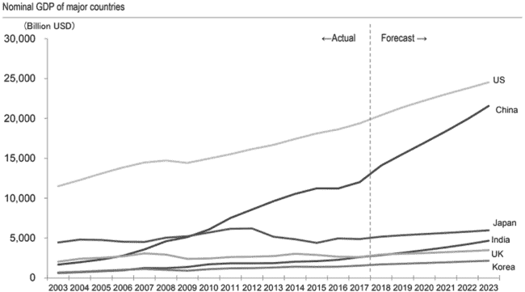

数据来源：由日本经济研究所（NRI）根据国际货币基金组织（IMF）2017 年 4 月发布的《世界经济展望数据库》（World Economic Outlook Database）数据整理。

据日本三井住友信托研究所（SMTRI）报告，2019 年初，投资于日本国内房地产的房地产私募基金市值达到 17.7 万亿日元（约合 1600 亿美元）。考虑到日本房地产投资信托基金（J-REITs）占 17.9 万亿日元，日本房地产市场管理的资产总额接近 36 万亿日元（约合 3400 亿美元）。这些结果在日本三井住友信托研究所第 27 次“私募房地产基金调查”中以图 10.7 的形式呈现。请注意，尽管私募基金的部分相对稳定，但资产管理增长的大部分动力来自于 J-REITs。

当与其他主要房地产市场相比较时，日本为投资者提供了相对较高的收益率差距。据 Jones Lang LaSalle（JLL）统计，2019 年东京主要办公大楼的平均收益率差距为 2.9%，这高于伦敦（2.5%）和纽约市（1.25%）的平均收益率差距。因此，寻求收益的外国基金在过去几年中向日本房地产市场投入了创纪录的资金：仅 2017 年，海外公司用于收购的日元就达到了 11 万亿。实际上，根据 SMTRI 的调查，日本收益率差距的相对吸引力是外国投资者选择日本的最主要原因(图 10.8)。

**图 10.7：日本房地产的融资来源**。

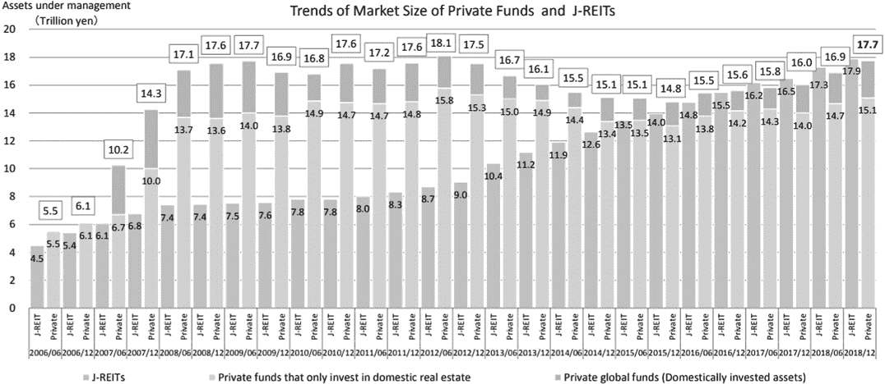

来源：来自 2019 年 1 月日本私人房地产基金 SMTRI 调查的结果（第 2 页）⁸。

**图 10.8：吸引外国投资者的因素**。

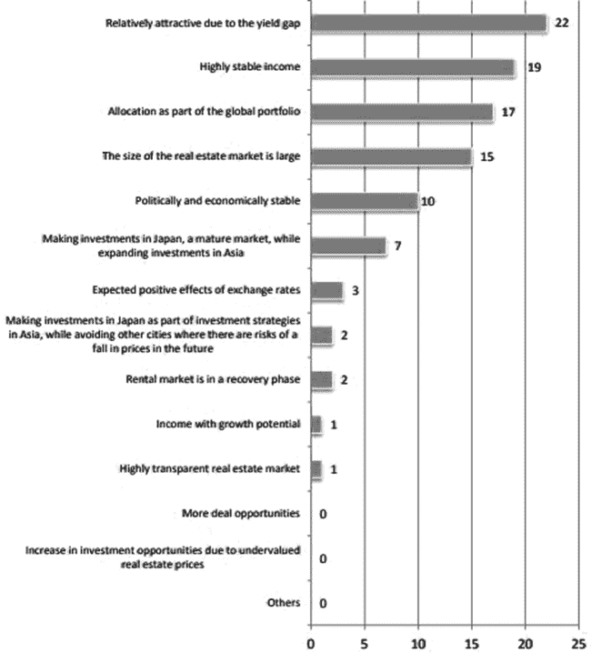

***来源***：来自 2019 年 1 月日本私人房地产基金 SMTRI 调查的结果（第 7 页）⁹。

外国投资者，如机构房地产巨头 KKR 和黑石，也被日本银行设定的超低利率环境所吸引。为了促进增长，日本银行实施了政策，以促进低成本融资市场，从而刺激房地产需求。有趣的是，一些银行甚至通过发行负利率贷款支付企业向他们借款。这些宽松的货币政策条件在过去十年中促使大量主权资本投向日本房地产市场，如图 10.9 所示，其中底部柱状图显示了管理日本以外资本的 SMTRI 调查受访者所占的百分比。

#### 10.9.2\. 日本房地产市场痛点¹⁰

随着日本银行进一步放宽利率的可能性增加，房地产收购的竞争格局加剧。平均投资期限为 5 年以上的基金主导了这一市场，因为 2019 年新成立的房地产基金的平均期限现在是 9.1 年。基金期限的延长与流动性的降低一致，因为投资者资本用于购买和维护基础房地产资产。

日本的房地产证券化涉及主要参与者，如 GK-TK（GodoKaisha-TokumeiKumiai）和 TMK（TokuteiMokutekiKaisha）。证券化产品吸引了寻求管理资产负债表风险和多样化现金流的全毬机构投资者。由于机构投资者要求的收益率高于个人，最近膨胀的房地产价格使得在大都市区形成交易变得困难。实际上，当 SMTRI 进行调查时，近 25%的外国投资者选择了“上升的房地产价格”作为不投资日本市场的理由(图 10.10)。

**图 10.9：    日本房地产投资基金海外投资者的百分比。**

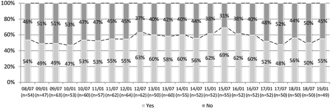

**来源**：数据来源于 SMTRI 关于日本私募房地产基金 2019 年 1 月调查结果（第 2 页）

**图 10.10：    阻碍外国投资日本房地产市场的缺点。¹¹**

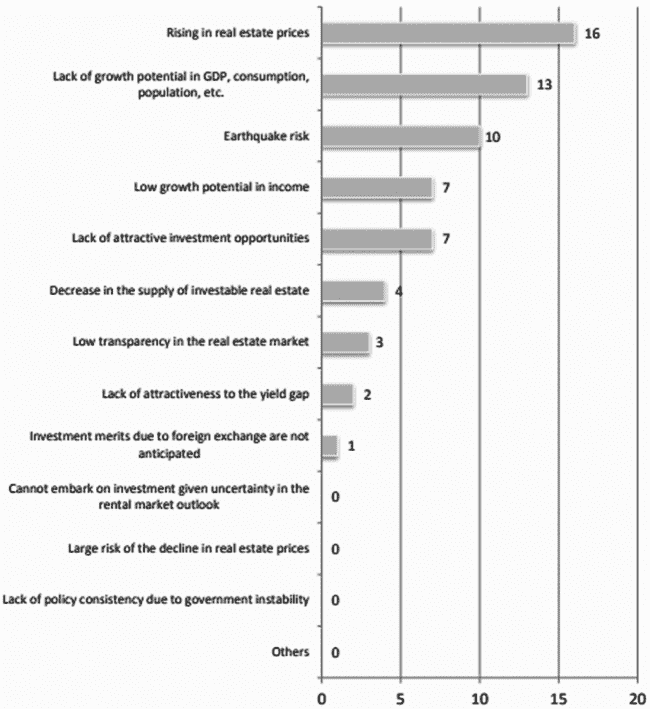

**来源**：数据来源于 SMTRI 关于日本私募房地产基金 2019 年 1 月调查结果（第 7 页）¹¹。

当分析 J-REITs 的商业环境时，SMTRI 调查的第二个最常见回应是，基金经理“寻求更好地理解和收集信息”，然后再启动开放式私募基金。这些经理指出，需要“扩大投资基金的投资者类别”和“提高流动性”是私人 REIT 市场进一步发展的关键因素(图 10.11)。

**图 10.11：    促进外国投资日本房地产市场增长的因素。**

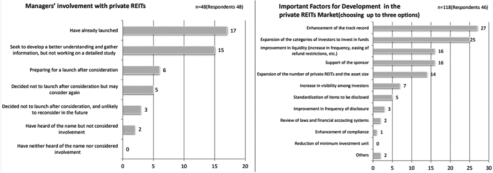

**来源**：数据来源于 SMTRI 关于日本私募房地产基金 2019 年 1 月调查结果（第 10 页）¹²。

因此，我们相信分布式账本技术（DLT）系统和资产 Token 化可以为基金经理提出的当前挑战提供解决方案，这些挑战阻碍了日本房地产的最大投资。

### 10.10. 令和年代日本房地产投资的 Token 化

在 DLT 系统内运行的安全令牌旨在改善价格发现过程的效率。系统中存在的低效限制了日本房地产市场；特别是与投资数据透明度、访问和流动性相关的挑战。

#### 10.10.1. 数据透明度

房地产投资机会往往很复杂，需要大型分析师和法律团队进行密集的尽职调查；为了适当评估前景和评估相关资产的技术细节，需要显著的前期成本。这些成本往往是固定的，导致在资本规模部署方面具有竞争优势。因此，存在一个门槛，大型资产管理公司相对于资本较少的公司具有明显的优势。

数字证券可以通过利用 DLT 生态系统和证券化代币历史来提高房地产资产周围的数据透明度，从而帮助降低初始资本配置的门槛。提高数据透明度将在投资决策过程中传播更多的信息输入，鼓励资源更为有限的投资者部署资本。因此，日本房地产的全球投资者群体将扩大，从而产生额外的资金流动和更高的价格。

根据 JLL 的“2018 年全球房地产透明度指数”，日本在调查的 100 个国家中排名第 19 位；日本的排名位于“透明”组的前部，但离进入“高度透明”级别还有很远(图 10.12)。自 2016 年的上一次调查以来，85% 的国家看到了房地产透明度的提高，其中许多超过了日本。最显著的提高是在那些依赖技术的司法管辖区。

JLL 的调查揭示了一个提高房地产数据透明度所使用技术的上升趋势。一个例子是在迪拜，一个建筑分类计划利用了一个官方政府应用程序，用于房地产经纪人和运营商的注册。荷兰也因利用房地产技术鼓励数据共享而受到认可；向开放数据的转变使得验证交易价格和其他注册信息变得更加容易。

**图 10.12：    选定国家的透明度得分。¹³**

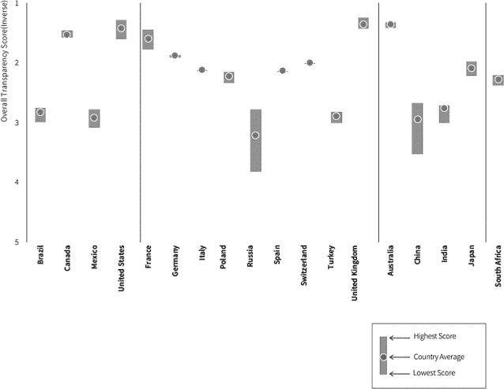

JLL 2018 年的报告强调了最近 250 多家房地产科技（proptech）初创公司的兴起，自其 2016 年透明度指数报告以来，这些公司共筹集了超过 60 亿美元的投资。这些技术赋能的平台产生了大量新鲜数据，并创造了新的指标，激发了投资者和商业界对房地产透明度有重大飞跃的期望。然而，行业未能跟上更高的预期标准，因为数据访问、质量和一致性方面存在挑战。我们相信，证券化代币生态系统可以协助解决这些担忧，特别是在日本房地产市场中。

JLL 研究人员，Yuto Ohigashi 对日本需要采取行动发表了评论：

日本的*市场透明度有所提高，但其他国家取得的进步更为显著。如果日本不加快改善的速度，可能会落后于全球趋势。¹⁴*

如前所述，许多日本房地产基金经理在向市场投入更多资本之前，寻求更好地了解和收集信息。这一声明与 JLL 调查中日本在“交易过程”中排名第 35 位相吻合，这主要归因于缺乏透明度和交易价格信息的有效性。日本采用区块链技术是为了提高房地产价格的透明度。此外，日本政府支持开放数据计划，使其成为代币化解决方案的理想沙盒。

提高房地产透明度的其中一个建议是创建一个实时透明度指数，通过分布式账本技术（DLT）网络和安全代币，将用户之间的日本市场数据进行聚合和共享。利用 JLL 全球房地产透明度指数（GRETI）作为框架，我们相信技术已经发展到可以连续编译和展示 JLL 的 186 个单独透明度措施的程度；这将显著优于目前每两年更新一次的指数方法。定量数据可以从以下几个方面收集：（1）房地产科技平台 API（应用程序编程接口）；（2）房地产区块链技术应用举措，如土地所有权和登记记录、房地产买卖和产权转让、投资者/租户身份等信息；以及（3）在每种安全代币生命周期中收集的基础数据。

定性因素可以通过使用 DLT 网络的行业专家联盟来汇总；这些从业者将为可操作的数据添加粒度，利用他们在各自专业领域的洞察力。定性输入的时间线将由参与成员通过共识决定（例如：每日、每周、每季度等）。我们的提议将满足投资者和商业界对更高透明度标准的日益增长的需求；技术提高了对及时提供高质量信息的期望。然而，正如 JLL 2018 年 GRETI 报告所显示的，期望与现实之间存在巨大的鸿沟。

我们提议的网络用户将因贡献数据而获得实时访问房地产透明度信息的权限，而不是等待 JLL 每两年的更新。目前 JLL GRETI 为房地产基金经理和其他决策者提供行业基准。芝加哥大学布斯商学院房地产客座教授约瑟夫·L·帕格利亚里（Joseph L. Pagliari）表示：

全球房地产透明度指数长期以来一直是国际房地产投资界评估和定价风险的黄金标准。¹⁵

一个实时的透明度指数对于希望从国外向日本房地产市场部署资本的国际投资决策者来说将无比宝贵。

如果数字证券成为交易各方间中介的工具，我们提议的基于区块链的 DLT 系统网络可以提供更多关于 underlying Japanese properties 相关数据的可见性。在初始发行时，物业信息，如土地所有权、资本化和占用率、所有权和租户历史等，可以在每个数字证券的生命周期内实时跟踪。这些信息通常分散在多个组织中，并以不同的格式呈现；现在可以使用基于 DLT 系统的网络平台，将这些数据标准化并随时提供。

我们设想网络用户最初将是那些不属于全球房地产投资管理顶级梯队的人，特别是那些努力超过初始资本部署门槛的房地产经理。网络参与者的主要动机将是获取由众包产生的房地产市场信息，这些信息的总和比每个参与者自己积累的个别信息更有价值。人们可能会将这个网络视为下一个互联网版本的商业生态系统，哈佛大学教授詹姆斯·F·莫尔（1996 年）将其定义为：

一个由相互作用的组织和个人支持的经济社区——商业世界的生物体。经济社区为客户生产有价值的商品和服务，客户本身就是生态系统的成员。成员生物体还包括供应商、领先生产商、竞争对手和其他利益相关者。随着时间的推移，它们共同进化其能力和角色，并倾向于与一个或多个中心公司设定的方向对齐。持有领导角色的公司可能会随时间而变化，但生态系统领导者的功能受到社区的重视，因为它使成员能够朝着共同的目标对齐他们的投资，并找到相互支持的角色。

我们提议的生态系统的价值将随着 Web 3.0 技术进一步融入商业流程和日常生活 society, creating an unparalleled trove of real estate market data（创造前所未有的房地产市场数据宝库）而呈指数级增长。

一旦商业环境发生根本性变化，机构房地产公司最终会被激励加入这个网络。正如 Intraspect Software 的联合创始人兼 CTO 汤姆·格里伯所说，“全球化正在消除大公司的传统优势：获取资本、进入市场和规模经济。”¹⁶同样地，我们相信分布式账本技术（DLT）生态系统、智能合约、安全代币和其他 Web 3.0 技术可以改变日本房地产市场中数据透明的方法和激励机制，最终改变明日全球房地产行业的面貌。

JLL 的 Yuto Ohigashi 认为，“提高透明度的两个关键：一是通过政府举措改变市场机制，二是让私营市场参与者在其商业活动中意识到透明度。”¹⁷ 日本开放数据举措正在激励创建分布式账本系统，这可以作为一个标准化的网络来聚合和分享房地产数据，而数字证券不久将追踪日本房地产市场的交易，我们相信这将吸引更多的国际投资。

#### 10.10.2. 开放获取

JLL 在 2018 年的调查发现，房地产投资者倾向于开放和透明的市场。他们的研究发现，“高度透明”的城市占到了覆盖到的 158 个城市中直接房地产投资的 70%，以及近四分之三的跨境投资。投资者和房地产开发商越来越需要与城市层面动态相关的更多信息。正如图 10.13 所示，发现城市的房地产透明度与其总交易量之间存在显著相关性。

东京的透明度得分为 1.98，在全球城市中排名第 50 位。尽管日本最大的都会区属于第二透明度层级，但房地产交易量仍令人印象深刻地排名全球前三。为了看到房地产交易量的必要上升，日本房地产管理者可能需要吸引更多国际投资社区的份额。根据 Savills World Research 的数据，2017 年至 2018 年第三季度的跨境投资比例急剧下降(图 10.14)。

**图 10.13：房地产透明度指数与投资量。¹⁸**

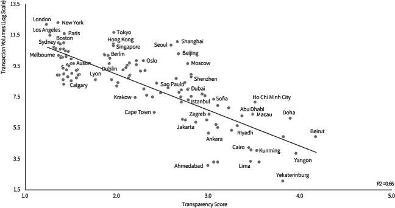

**图 10.14：投资量与海外投资。¹⁹**

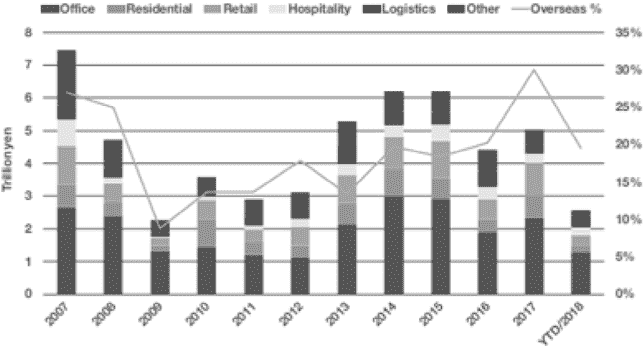

2018 年 12 月，日本看到来自国际投资者的投资额同比下降超过 2 万亿日元，这是自 2008 年金融危机以来最大的百分比下降。这一数据验证了 SMTRI 调查结果的真实性，其中房地产投资经理寻求“扩大投资基金的投资者类别”。日本房地产的证券化可以使创建吸引全球另类投资者的多样化产品成为可能。

如早先讨论的，证券化代币是促进无缝跨境交易的理想工具，这归功于其可编程的特性。日本证券化房地产可以提供一个编码的预防性和侦查性资产控制框架，这将有助于减轻司法管辖区监管担忧。根据 JLL 2018 年的指数，日本在“上市车辆治理”方面排名第 31 位，这是国际投资减少的一个因素。如果数字证券成为上市的首选工具，治理可以实现标准化和自动化。国际投资者将有一个更便捷的机制来参与治理行动，导致相应的跨境资本部署增加；一个全球多元化的投资者群体将提高市场流动性。

#### 10.10.3 流动性提升

如前文所述，日本大约有一半的不动产资产管理被锁定在私人市场，这导致了较大的流动性溢价。流动性溢价主要源于高昂的交易成本，这些成本包括广泛的市场摩擦：大的买卖价差、市场深度的减少、高昂的物业搜索成本和经纪费用，所有这些都会增加市场复杂度。

证券化代币可以通过提升基础投资的特性来提高日本私人房地产市场的流动性。当前模式严重依赖像房地产银行家和经纪人这样的中介，而这些复杂资产的买家基础有限。通过提供一个资产标准化框架，数字证券可以降低分析和搜索成本。当供需摩擦得到缓解，交易将更加频繁，导致价格透明度提高。如图 10.15 所示，由此产生的反馈循环最终将提高私人房地产投资的流动性。

房地产的证券化也可以增加日本房地产市场供给侧的价值。如前一部分所述，不断上涨的房地产价格是基金经理忽视日本的主要原因之一。迅速膨胀的房地产价格主要可以归因于投资级别房地产的供应有限。通过证券化，房地产资产可以汇集在一起，重新打包成带息的数字证券。多样化可以使违约风险分散，从而增加投资级别房地产的机会。

**图 10.15：私有市场流动性不足的原因。²⁰**

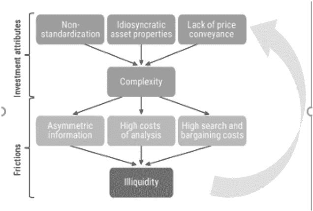

私有房地产基金的证券化将是另一个应用，它将增加日本房地产市场的投资流动性。如前面所提到的，私有的日本房地产基金的平均投资期限为 5 年以上，而最近成立的基金的预期寿命为 9.1 年。这些漫长的基金期限使资本被锁定在较长时间内，这使得一些投资者望而却步，不敢向私有房地产基金投入资本。这尤其令人沮丧，因为私有房地产基金通常有机会投资于高质量的物业，从而获得超额回报。私有投资基金的另一个缺点是，其高潜在的 J 曲线效应(图 10.16)，在基金的早期年份，由于缺乏可行的投资机会，承诺的资本在早期年份并没有被耗尽，因此会收取费用，而回报则迟迟不来。

**图 10.16：投资回报的 J 曲线。**

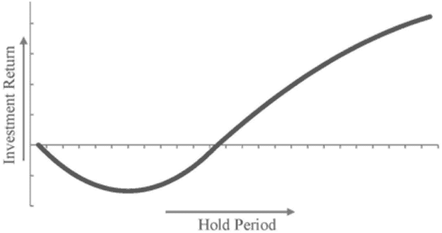

通过提高房地产透明度，向国际投资社区开放，并提供更大的流动性，数字证券最终可以有助于最大化日本房地产市场的价格效率。因此，我们相信证券化将从海外投资者那里进一步推动资本投向日本。此外，日本房地产行业在准备迎接 Web 3.0 这个新数字经济方面将远远领先于其国际同行。

### 10.11. 结论

金融服务行业的领导者们普遍认为，区块链技术可以改造全球金融系统，成为新数字经济基础设施的基石。通过提高数据效率、透明度和安全性，分布式账本技术可以现代化或甚至取代中介通常执行的过程。当与智能合约相结合时，分布式账本技术可以通过资产证券化带来金融产品创造的下一个巨大变革。

数字证券允许在分布式账本系统上对标准化发行的代币化资产进行持续转让。与其他过去的金融创新机制类似，代币化将改变曾经流动性差且经济效益不高的资产的结构，使其可供更广泛的全球投资者使用。其他独特创新，如内置监管控制，将消除浪费性的合规成本，进一步扩大可以发行和交易的资产范围。

我们首先在本章中以探索代币化可能对日本房地产市场产生的潜在影响为目标。分布式账本技术的很大魅力在于将世界各地的各方团结在共同的事业上，进一步激励信息共享以促进跨境交易。数字证券提供了一个实现这一目标的框架，同时遵循经过时间考验的现行世界秩序的法律和法规。本研究概述了资产代币化不仅能给日本房地产基金经理带来好处，而且能广泛地给全球金融界带来好处，因为社会和市场正为数字金融时代的到来做准备。

### 注解

1. *证券市场的国际化：电信与金融小组委员会第 100 届国会听证会*，4（1987 年）（查尔斯·科克斯，证券交易委员会代理主席的声明）。

2. *来源*： [`research.bloomberg.com/pub/res/d28giW28tf6G7T_Wr77aU0gDgFQ`](https://research.bloomberg.com/pub/res/d28giW28tf6G7T_Wr77aU0gDgFQ)（于 2020 年 2 月 4 日访问）。

3. 可在[`www.sec.gov/news/speech/speech-peirce-073019`](https://www.sec.gov/news/speech/speech-peirce-073019)（于 2020 年 2 月 4 日访问）找到演讲内容。

4. [`www.w3.org/standards/semanticweb/`](https://www.w3.org/standards/semanticweb/)（于 2020 年 2 月 4 日访问）。

5. [`media.consensys.net/bring-on-the-stateful-internet-d589adc7bb65`](https://media.consensys.net/bring-on-the-stateful-internet-d589adc7bb65)（于 2020 年 2 月 4 日访问）。

6. [`www.securitize.io/press/securitize-lands-strategic-investment-from-sony-financial-ventures`](https://www.securitize.io/press/securitize-lands-strategic-investment-from-sony-financial-ventures)（最后访问于 2020 年 2 月 4 日）。

7. 来自资源房地产公司。

8. SMTRI J-REIT Index 是由住友三井信托研究所（以下简称“SMTRI”）独立开发的一种 J-REIT 指数。这是 SMTRI 的知识产权，与 SMTRI J-REIT 指数计算、数据发布和使用相关的所有权利都属于 SMTRI，请访问 SMTRI 网站查找相关信息。"SMTRI J-REIT Index®"是 SMTRI 的注册商标。

9. 参见上文。

10. 本节总结了关于投资者特征和偏好的调查研究，“2019 年 1 月日本私募房地产基金调查”。

11. 见上文第 8 条。

12. 见上文第 8 条。

13. 来自 JLL Investment Management 的 2018 年全球房地产透明度指数研究的数据（第 63 页）。

14. [`www.joneslanglasalle.co.jp/en/trends-and-insights/cities/japan-improved-transparency-ranking-14th-in-greti2018`](https://www.joneslanglasalle.co.jp/en/trends-and-insights/cities/japan-improved-transparency-ranking-14th-in-greti2018) （于 2020 年 2 月 4 日访问）。

15. [`www.us.jll.com/en/trends-and-insights/research/global-real-estate-transparency-index-2018`](https://www.us.jll.com/en/trends-and-insights/research/global-real-estate-transparency-index-2018) （第 30 页）。

16. Gruber (2007)。

17. [`www.joneslanglasalle.co.jp/en/trends-and-insights/cities/japan-improved-transparency-ranking-14th-in-greti2018`](https://www.joneslanglasalle.co.jp/en/trends-and-insights/cities/japan-improved-transparency-ranking-14th-in-greti2018) （于 2020 年 2 月 4 日访问）。

18. 基于 JLL La Salle Investment Management 的 2018 年全球房地产透明度指数研究（第 65 页）。

19. 来源：Real Capital Analytics (2018)。Savills World Research Japan ‘Spotlight 2018 review and 2019 prospects’。经许可使用。

20. 来自 PIMCO 的一项名为“私人市场中的流动性、复杂性和规模”的研究（第 6 页）。

### CONTRIBUTOR CONTACT INFORMATION

想要联系 Mike Rogers，请访问[MillennialsInBlockchain.io](http://MillennialsInBlockchain.io)或发送电子邮件至 Mike@MillennialsInBlockchain.com。你也可以关注他在 Twitter 上的账号@MillennialMike7，他在那里公开讨论他的激情。
