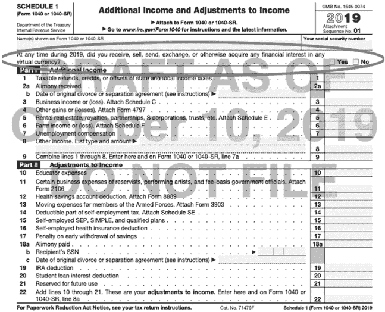

## 11

## 区块链支持的业务创新

### 11.1. 引言

前几章详细讨论了区块链的一些有趣用例。在本章中，我们简要讨论了一些新兴的创新应用和商业模式。随着加密货币成为主流，大量资本开始涌入，税务机关开始关注。因此，出台了税收规定，为税务服务公司提供了教育和服务纳税人的机会。我们在下一节讨论这些发展。

金融和会计领域的其他辅助服务已经出现，以支持加密货币的发展。在第 11.3 节中讨论了这样一个应用。出现了一种新的商业模式，可以以实物货币发放贷款，同时以加密货币作为抵押。这笔简单的交易需要支持服务，以确保抵押品保持安全和 secure.

区块链在汽车行业记录保管方面的应用很受欢迎。特别是在二手车市场，汽车行业的买家和卖家之间通常存在信息不对称。这导致了信任的丧失，从而增加了交易成本和不确定性。区块链应用可以提供不可篡改和全面的记录，在“无信任”的环境中产生信任。本节还讨论了汽车行业的其他应用。

在接下来的第 11.5 节中，讨论了一个概念性的案例，即点对点停车位租赁。这个模型与 Airbnb 类似，但针对的是日常停车位。在当前经济中，某些个人拥有有价值的资源，却不知道如何将这些资源货币化。这是由于系统中的摩擦。区块链解决方案可能使点对点交易成为可能。

在 11.6 节中讨论了区块链在保险行业中独特而简单的应用。借助区块链，保险承保和索赔结算可以通过智能合约自行执行。快速自动解决索赔问题，从而提高了效率和客户满意度。此外，运营成本的降低为保险提供商开辟了新的边际市场。

在 11.7 节中，我们讨论了来源的概念以及区块链技术的特点如何适合建立来源。在社会责任和消费者选择可持续和道德购买选项的时代，来源问题变得越来越重要。来源问题在农业行业尤为相关。通过降低交易成本，从而促进微交易，区块链技术正在利用其潜力，将流行且实用的金融产品适应于收入较低的人们。第 11.8 节结束本章。

### 11.2. 加密税业务模式

随着加密货币资产的普及和其在全球范围内的广泛使用增加，世界各地的监管机构和税务机关正在制定和发布有关税务法律的监管指南。2019 年是加密货币税务的一个里程碑年份，因为世界各地的监管机构调整了其税务政策，并发布了有关加密货币资产税务处理的更新指导。这些指南的复杂性和差异性为会计师和税务专家创造了新的商业机会。虽然美国和中国英国在 2019 年底发布了更全面的指南，但像韩国这样的国家正在制定法规，并计划在 2020 年发布这些法规。

2014 年，美国 Internal Revenue Services (IRS) 是第一个发布关于加密货币税务处理的全面指导的监管机构。¹ 起初，IRS 认识到加密货币的双重用途——支付商品或作为投资持有。尽管这些货币作为“真实货币”运作，但在任何司法管辖区内都没有法定货币地位。因此，在税务目的上，加密货币被视为财产，通常适用于获取和处置财产的税法也适用于加密货币。美国个人所得税表（Form 1040）在 2019 年包括了关于加密货币资产的直接问题（参见图 11.1）。2019 年 10 月发布的新的 IRS 指南包括了关于“硬分叉”和“空投”的税务处理。他们通过假设的例子说明了处理的复杂性。

**图 11.1：美国个人所得税表 1 的日程安排。**

2020 年初，区块链技术公司 Lukka 推出了一款“一站式”税务工具，帮助个人和企业向美国国税局（IRS）计算其税务义务。这款工具是与[CPA.com](http://CPA.com)合作开发的，在税务申报季节之前发布，并紧随美国国税局（IRS）的最新指南之后，帮助纳税人更好地理解关于加密货币投资的底层税务法律。

同样地，在 2019 年 12 月，英国也发布了其加密货币税务指南²，涉及加密货币交易所和挖矿活动等。该指南维持认为，加密货币，比如比特币，不会被视为货币，而是会被归类为商品，但留下了随着行业演变而重新考虑的可能性，并指出：

*加密货币资产领域发展迅速，并且不断发展。术语、硬币、代币和交易类型可能会有所不同。由于底层技术的不断发展和加密货币资产使用的领域，加密货币的税务处理也在不断发展。因此，英国税务及海关总署（HMRC）将根据实际发生的事实审视每个案例，并适用相关的税收法规（而不是参考术语）。³*

根据代币是挖矿还是通过交易所获得，税收有很多细微差别。另外，有时这些会被征税为收入，但在某些情况下，只有资本收益被征税。另外，加密货币的应税价值取决于情况。获取加密资产的各种活动被识别为：

+   代币的买卖。

+   用代币交换其他资产。

+   挖矿。

+   以加密资产提供商品或服务。

此外，这些活动的税收处理取决于涉及的各方和交易的目的，很可能引发以下一种或多种税收：

+   资本收益税。

+   公司税。

+   所得税。

+   社会保险缴费。

+   印花税。

+   增值税，或 VAT。

对于纳税人来说，税收的复杂性和各种可能性以及重大的经济后果使得加密税的辅助服务具有利润性和增长性。此外，由于税收监管在各司法管辖区之间的差异，会导致为高净值个人提供更好的税收管理而利用这些差异的税务咨询服务的产生。而且，公司可能会利用这些工具创建“虚拟”避税天堂。因此，会计师和税务专家的角色可能会增长，而不是减少。

### 11.3. 加密世界的抵押借贷

自古以来，世界各地的人们偶尔会发现自己面临同一个问题——急需现金。这个问题的一个常见解决方案源自古代中国，直至古希腊——即抵押借贷。抵押借贷，或 commonly known as pawning，指的是任何非货币资产与现金的临时交换，预期在指定时间内可逆转。也就是说，借款人向贷款人交出有价值的物品以换取现金，后来一旦偿还了贷款，借款人便重新获得了该物品的所有权。当借款人无法偿还贷款时，贷款人获得抵押品的所有权，并可以出售抵押品以收回贷款金额加上一定的利润。这种无需 necessarily disposing off assets 就能获得短期现金的机制，并不仅仅适用于穷人。著名的例子是，英格兰国王爱德华三世在十四世纪时为了资助对抗法国的战争，曾抵押了王室珠宝；西班牙的伊莎贝拉女王据说也曾经以她的珠宝为抵押借款，以资助克里斯托弗·哥伦布远航新大陆。

有担保的借款概念已根据当代需求和现代技术进行了调整。现在，它影响了美国大多数成年人。按揭贷款和汽车贷款是有担保借款最常见的形式。起初，贷款人支付现金用于购买房屋或汽车。随后，借款人定期还款，还款额超过利息，用于偿还贷款。与此同时，借款人获得了使用该资产的权利。如果借款人出售资产，贷款人有权首先从出售所得中偿还任何未偿还的贷款余额。通常，贷款人持有财产直到贷款全额还清，从而防止在未经他们同意的情况下出售抵押资产。在借款人逾期还款或无法偿还贷款的情况下，贷款人会没收资产并取消贷款。然后，贷款人出售资产以收回未偿还的余额。

经纪公司通过允许投资者进行保证金交易，在投资领域采用了有担保的融资方式。保证金交易允许投资者通过使用账户中的证券作为抵押借款，投资超过其流动资产的金额。例如，如果个人有 10,000 美元用于投资市场，她会购买价值 10,000 美元的证券，并使用这些证券作为抵押借款额外的金额，比如 8,000 美元，她也将其用于投资。因此，凭借 10,000 美元的起始资金，个人可以购买 18,000 美元的证券。现在假设她的投资在贷款累积 1%利息的时间内增长了 5%。在她最初的 10,000 美元投资中，投资者将获得 500 美元（或投资收益 5%），但通过保证金交易，她净赚 820 美元（900 美元的回报减去 80 美元的利息），或 10,000 美元投资的 8.2%。如果她的投资增值速度超过贷款的利息，她获得的回报率将高于基础市场。杠杆使一笔好交易变得更好。然而，当市场下跌，投资价值减少时，她遭受的损失更大，因为她仍然需要支付利息。此外，当投资价值减少时，为了保护其贷款价值，贷款人可能会出售部分投资以减少未偿还贷款的金额。

企业在融资活动中也会使用抵押品。两种传统方法是通过应收账款保理和库存抵押。大多数企业向客户出售商品时会提供信用，从而在销售时产生收入而非现金。当从客户那里收到钱时，现金随后被收集。与此同时，公司拥有应收账款，这是未来现金流入的承诺。一家快速成长的企业可能由于收款账款的延迟而面临现金流问题。需要立即现金的企业可以向贷款人求助，并以折价出售其应收账款以补偿贷款人的利息费用以及未支付的风险。贷款人在收回应收账单后，将扣除本金和贷款应收利息的余额后，将剩余金额转给企业。保理的好处是，企业可以在不申请或符合贷款条件的情况下使用现金，从而绕过传统的银行渠道。同样，库存可以作为抵押品来获得商业贷款。如果借款人不履行贷款条件，贷款人可能会出售库存以满足贷款条款。贷款人还可能定期检查抵押的库存，以确保抵押的库存没有过时或其他价值减少的情况。

担保贷款之所以受欢迎，是因为它对贷款人和借款人都提供了好处。抵押资产或担保资产在借款人违约时给贷款人提供了一定的信心。这减轻了贷款人的风险，使贷款人能够收取比 otherwise 低的利率。对于借款人来说，他们可以在不出售资产的情况下使用现金，从而维持使用资产的权利以及从资产价值的潜在增值中受益。此外，它还允许借款人避免因出售资产而产生的税收后果，例如支付资本利得税。

贷款人在借款人违约的情况下承担无法收回本金和利息的风险。担保贷款通过提供底层资产的价值作为对未来支付的担保，帮助减轻这种风险。然而，仍有一些风险存在，这些风险基于抵押品的质量。这些风险包括：

+   作为担保资产对贷款起到保证作用，资产价值的下降对贷款人构成风险。例如，假设贷款人基于一个市值为 100 美元的担保资产发放了 100 美元的贷款。假设作为抵押品的资产价值下跌到 90 美元，借款人可以轻易地放弃该资产并不偿还贷款，而贷款人则要承受 10 美元的损失。为了防止这种情况的发生，贷款人通常要求担保资产的价值高于贷款金额。这被称为“贷款价值比率”，通常约为 0.8。换句话说，担保资产是贷款金额的 125%（1/0.8）。较低的贷款价值比率能给贷款人提供更大的保护。资产价值的波动性越高，预期的贷款价值比率就越低。

+   贷款人希望防止借款人在未经贷款人知晓或同意的情况下出售或处置担保资产。在传统当铺中，贷款人通常会物理占有资产，禁止出售资产。在按揭和汽车贷款中，贷款人保留资产的所有权，从而防止在未经他们同意的情况下出售资产。

+   贷款人通常防止借款人使用同一资产作为多个贷款的担保。技术上，这将产生大于任何贷款人可接受的贷款价值比率。此外，在借款人违约的情况下，出售担保资产可能不足以偿还所有贷款余额，导致某些或所有贷款人遭受损失。

一些新兴企业已开始使用数字资产作为以美元计价的贷款的担保。这对那些大部分个人财富投资于数字货币的人来说是有利的。这也适用于可能无法获得美元传统贷款的国际中小型企业（SMEs），因为大银行主要与大型外国公司交易。

加密贷款组织发放以美元计价的短期现金贷款，同时持有多种加密货币（如比特币和莱特币）作为偿还的担保。通常，利率约为 8%。此外，为了防范加密资产的波动性，典型的贷款价值比率约为 35-50%。而且，当贷款价值比率超过 70%时，借款人需要转移额外担保物，或偿还部分贷款以维持贷款价值比率在 70%以下。

在贷款发放时，放贷者要求借款者将数字资产转移到由第三方维护的安全钱包中。抵押品的保管人分别为每位借款人生成一个独特的钱包地址。借款人通过区块链将他们的加密货币资产转移到各自的钱包中。借款人必须确信他们转移的数字资产将得到保护，并在贷款偿还后归还给他们。数字资产的第三方安全存储者，会将数字资产离线转移到被称为“冷存储”的安全存储系统。存储在“热钱包”中的数字化资产可用于交易，然而，存储在“冷存储”中的资产则不行。作为独立数字资产的保管人，这样的组织必须维护复杂的内部控制系统，以确保他们在保管的数字资产安全。他们主要是通过授权和职责分离来实现这一点。访问“冷存储”需要多因素认证和“分层访问控制”，限制对员工的访问。每笔贷款的抵押品分别存储在不同的“冷存储”中，每个保护都有一个独特的私钥。此外，硬件地理位置分散，以防止物理威胁，遵循灾难恢复协议的最佳实践。

在贷款启动并将抵押品转移到“冷存储”之后，放贷者继续监控抵押品的实时价值。如果贷款价值比超过 0.7，将向借款人发送自动警报或保证金调用。在收到保证金调用后，借款人被要求将额外的数字资产转移到他们的冷存储钱包，以恢复贷款价值比。在收到保证金调用时，借款人可能会偿还全部或部分贷款。在借款人不响应保证金调用的情况下，放贷者将清算抵押品以履行借款人的义务，并将剩余的抵押品转回给借款人。

在 2018 年初，当数字货币的价值迅速下跌时，放贷者的风险管理协议被触发。随着贷款价值比超过 0.7，发送了电子邮件警告。借款人被通知即将到来的保证金调用，并要求他们转移额外抵押品或偿还贷款。据一家此类贷款公司的经验，大多数客户选择增加额外抵押品以平衡他们的贷款价值比。然而，一些客户由于市场动荡而感到焦虑，选择提前偿还贷款。

抵押加密资产的快速发展得益于区块链技术。数字化的资产可以轻松地转让给贷款人，整个贷款交易在没有借款人和贷款人之间的物理会议的情况下即可完成。这使得贷款人能够有效地进入否则成本过高的市场。此外，它还允许加密借款人灵活地找到最便宜的资本来源。抵押品的转让、存储、定期监控和最终返回都是自动化的，并通过算法进行监控。围绕这一过程的内部控制是对传统控制（如授权、身份验证和职责分离）的适应，这些控制是在数字化环境中实施的。

在加密贷款中，传统的抵押贷款风险得到了缓解。如前所述，系统风险之一是贷款人需要确保抵押资产的安全，借款人不能出售或将其用作另一笔贷款的抵押。区块链的设计不允许人们“双重支出”或两次抵押同一资产。一旦他们将抵押品发送到贷款人的“安全钱包”，他们就不再有权访问这些资产，直到贷款还清。贷款人承担的另一个普遍风险是抵押品价值的突然和永久性下降。抵押品价值的实时算法监控和对保守的贷款价值比率的的要求限制了贷款人对波动性市场的暴露。此外，抵押品的地理位置和物理监控不再成为担忧，这使得全球各地的个人和企业都能以美元获得贷款，而无需通过复杂的、耗时的过程向金融机构申请贷款。

### 11.4. 汽车行业的应用

二手车市场充斥着“柠檬车”和一贯的口号是“买家小心”。一个不精通的买家通常不知道车辆的状况，是否曾发生事故，是否定期进行维护，是否出现了重大故障或维修等。二手车市场充斥着不确定性，没有人真的信任二手车销售员。买家和卖家之间这种市场特有的不信任，为基于区块链的解决方案提供了机会。

对于一辆汽车，在其生命周期中涉及许多方：原始制造商、原始经销商、修理工、保险代理人、前车主、车辆管理局等。此外，操纵和伪造的机会很多。卖家可以轻松地操纵速度表，或者谎称进行了定期维护，或者即将进行重大维修。提出了一种区块链解决方案，将各种利益相关者连接到分布式账本系统中，如图 11.2 所示。

一个名为“Car Dossier”的应用⁴提供了一个基于区块链的数字档案，从汽车制造开始存储与汽车相关的所有相关信息。它包括所有权详情、事故记录、重大维修、定期维护、保险覆盖、注册文件等，通过将不同方连接到统一的系统。

安永（EY）正在开发另一个有趣的区块链解决方案，即把汽车的所有权分散给多个所有者。随着拥有、维护和停放汽车的成本不断上升，生活在大城市里的千禧一代通常会放弃拥有汽车。通常情况下，汽车一天中只被使用一小部分时间，造成了闲置产能。EY 正在创建一个名为 Tesseract 的基于区块链的移动平台。⁵该平台便于记录汽车多重所有权的账目，并以透明和可验证的方式分配所有权成本。在 Tesseract 平台上，车辆和行程被数字记录在区块链上。交易通过智能合约自动结算，涉及所有者、运营商和第三方服务提供商之间。汽车的所有权可以灵活且分属于多个所有者。

**图 11.2：汽车历史分布式记账的区块链。**

Tesseract 平台使得汽车所有者与租户之间的点对点交易成为可能。由于交易成本和记账成本造成的摩擦，目前这类微交易并未发生。一旦这些成本被最小化，并通过技术手段建立信任，这类交易将越来越可行。区块链赋能的系统还充分利用了技术在维护不可篡改且完整的所有权和使用记录方面的关键优势。

同样，德勤也开发了几种基于区块链的汽车行业解决方案。⁶它创建了一个客户忠诚度平台，可以维护所有消费者购买记录。这将便于即时兑换这些积分，避免延迟和不便。它还有一个应用，从各种来源存储和更新关于所有权、里程和维护历史的车辆数据。与 EY 的例子类似，德勤还开发了一个应用，将确保安全的点对点汽车共享。

### 11.5. 微租赁停车位

类似于上文提到的汽车共享应用和 Airbnb 式的点对点交易商业模式，一个尚未充分开发的潜在商业机会就是促进停车位的共享。目前，这一领域还没有任何发展，因此讨论还是概念性的。该概念利用区块链框架，通过最小或适度的交易费用创建未知方之间的信任，从而促进微交易。

考虑一个居住在任何大都市城市的人的例子。假设他们居住在市中心或中央商务区，但在郊区工作。在他们居住的公寓或房子里，比如说他们有两个停车位。由于房主在郊区工作，可以设想他们会开车去上班，因此他们的停车位在周一至周五的正常工作时间是空闲的。通常，主要大都市区的中央商务区的停车费很贵，通常每小时收费 5 美元左右，一天的最高收费约为 25 美元。

在我们的例子中，房主拥有一个宝贵的资产，即位于中央商务区的两个停车位，然而这些资源却被利用率不高。这两个停车位每天可能有约 50 美元的收入，或者一年的收入约为 10000 美元。阻止房主出租停车位并每年赚取 10000 美元的原因是系统中的摩擦和交易成本。房主如何找到想要停车的通勤者，如何监控停车时间并收取费用，以及克服许多其他类似的物流问题。由于无法找到可行的解决方案来解决这些问题，停车位一直空着，房主也就失去了这笔容易获得的收入。如果有一个平台能够解决许多这些问题或困难，那么这些拥堵社区中的更多个人停车位就可以用于商业用途，成为房主的收入来源，同时还能降低停车成本，从而使通勤者受益。

区块链基础设施有潜力促进私人停车所有者和通勤者之间的日常交换。传感器和物联网可以帮助建立监控系统，智能合约机制将促进资金的转让，从而使系统具有信任感。一旦用于生成信任的交易费用大幅降低，许多类似的微交易可能性都可以想象得到。

### 11.6. 针对航班延误和取消的保险保护

保险行业尝试了一个有趣且创新的新商业模式。通常，保险行业是古老的，并不以快速采用新兴技术而闻名。然而，针对航班延误的保险申请为其创造者赢得了“最具创新性的区块链初创企业奖”，这个奖项归 Ehterisc 所有。⁷ 航班延误的 DApp 被描述为“为消费者设计的参数化保险应用”，并建立在以太坊区块链上。

传统上，保险流程是繁琐的、手工的、耗时的，对于保单持有人来说可能会感到沮丧。最初，保险政策的申请和生成通常需要申请人填写一份详尽的表格，无论是纸质还是电子形式，然后提交给代理人。接下来，核保人会评估申请。一旦申请获得批准，申请人支付保险费并获得保险政策。在保单持有人遭受不幸事件时，她需要向保险公司提交一份索赔表格。保险公司雇佣的理赔员会核实索赔事实，评估损失，并最终向保单持有人支付赔偿。提交索赔并最终从保险公司获得赔偿的过程可能需要数周甚至数月。

区块链保险应用程序自主管理整个业务流程，从保险覆盖的申请到如有需要时的赔偿，以及其中的每一个流程。该应用程序利用智能合约的力量，以及区块链上的不同解决方案。该应用程序声称，如果乘客的航班延误 45 分钟或更长时间，在降落时即可立即收到赔偿。乘客只需检查他们的电子邮件，并按照简单的指示将退款存入他们的银行账户。这种策略提供了灵活性和规模，使新型保险产品成为可能。它有潜力通过减少或甚至消除当前索赔处理方法中的长时间等待和不确定性，来扩大保险产品市场。

安盛（Axa S.A.），一家总部位于巴黎的法国跨国保险公司，也是世界上第二大金融服务公司，推出了一种名为斐齐的类似保险产品。它于 2017 年 9 月推出了该产品，作为针对航班延误的参数化保险计划的一部分。这种保险的传统流程是，旅客需要给他们的保险公司打电话，提交文件，然后与航空公司核实，之后再向旅客支付赔偿。保守估计，这个过程需要一周到两周。斐齐则利用公开的航班统计数据和智能合约，在航班延误或取消时自动向旅客赔偿，通常在旅客取回行李之前。

斐齐（Fizzy）也是基于以太坊区块链构建的，其智能合约是在乘客购买航班保险的基础上制定的。斐齐在从巴黎到美国的航班上进行了试点运行。其业务流程相当简单，共分为七个简单的步骤，完全自动化。这些步骤如下：

+   乘客记录航班信息。

+   乘客选择保险覆盖的金额。

+   然后程序会通知乘客需要支付的保险费。

+   乘客通过信用卡或加密货币支付保险费。

+   智能合约被制定出来，并通过公开可用的数据库，如航班追踪器，获取航班数据和延迟信息。

+   智能合约的代码决定了是否存在延迟（两小时或更久）。

+   当检测到延迟时，智能合约会自动执行一个简单的“如果-那么”规则，并自动向乘客的银行账户支付款项。

上述简单产品相较于传统保险产品和流程具有许多优势。索赔处理没有排除或不确定性——在延迟情况下总是会有支付。乘客甚至不需要填写索赔表格。保险赔偿金在乘客着陆后直接存入其银行账户，不再需要去银行兑换支票。保险公司没有任何手动干预，从而降低了保险公司的运营成本。

不幸的是，在 2019 年 11 月，Fizzy 上市两年后停止运营，因为它没有达到商业目标。AXA 声称，在当时，市场对基于区块链的消费者产品并没有足够的需求。然而，AXA 承诺将继续测试类似的保险产品，并通过推出 Fizzy 在构建和部署智能合约方面获得了宝贵的经验。

总的来说，由区块链驱动的去中心化保险具有许多尚未被利用的优势。智能合约实现了完全自动化，包括保费报价、确定何时结算索赔，以及自动支付，从而降低了运营成本。降低成本使保险公司能够进入发展中经济体和低收入企业，从而扩大其市场范围。此外，由于成本降低，保险公司可以提供低利润的保险产品，如为农民提供的农作物保险等。整个合同都是透明的，并可以接受公众审计，从而提高行业信心和信任。正如 AXA 通过 Fizzy 的经验所证明的，也许社会还没有准备好，但潜力存在，并且概念已经得到测试。

### 11.7\. 确立来源⁸

随着消费者素养的提升，以及他们对企业社会责任要求的日益增加，追踪零售产品的来源正在变得越来越重要。例如，当消费者购买了一个标有“美国制造”的产品时，他们如何知道有多少比例的原材料是源自美国的。同理，当购买巴西咖啡时，消费者如何知道这些咖啡豆确实是在巴西种植的。

区块链技术通过提高可追溯性以及不可变性的特性，使得消费者能够确定产品的来源或其成分的来源。追溯性是通过在区块链账本上记录产品的每一个细节和生产过程来实现的。一旦编码进入区块链，产品的记录就是“永久的、按时间顺序排列的，并且对网络上的每个参与者都可用”（Gupta, 2017）。这意味着产品的来源可以追溯到其来源，并且永久存储，从而可供未来审查。

随着供应链变得更为复杂和全球化，许多组织在产品生命周期的各个阶段做出贡献。消费者的透明度期望也在增加，因此大型公司承受着越来越大的供应链透明度压力。

消费者对产品的保证需求分为四类：关于原产地的保证；关于真实性的保证；关于货物所有权的保证；以及关于完整性的保证，如图 11.3 所示(Fig. 11.3)。区块链技术可以通过提供可追溯性、可验证性、可追踪性、不可变性和可验证性来满足这些保证（Montecchi et al., 2019）。

关于原产地的保证涉及确定产品是否在无需童工、合法从道德生产商那里采购成分的道德和安全环境中制造。关键成分如咖啡豆或可可的原产地可能会影响消费者的意见和购买意愿。对于品牌产品和奢侈品来说，真实性保证非常重要。例如，当消费者购买一块劳力士手表或一个普拉达手袋时，他们是为品牌名称支付高额费用，而不希望购买来自假制造商的类似产品。奢侈品制造商使用各种类型的商标来认证产品的真实性，这通常需要信任的第三方，成本较高。区块链技术提供了安全的替代认证，无需依赖中介（Tucker & Catalini, 2018）。对于昂贵产品，消费者可能要求在运输和储存阶段获取货物所有权的信息。关于完整性的保证涉及产品达到客户预期的性能和可靠性水平。区块链可以通过提供供应链过程的透明度来支持这一点，而这对于消费者来说是以前难以获得的。这在声称使用昂贵原料，如蒙古羊绒、鳄鱼皮或手工编织丝绸等异国情调的时尚产品中尤为重要。通过区块链，可以向消费者提供关于原料、流程的完整性以及适当的货物所有权链的保证。

**图 11.3：原产地保证。**

一家英国公司恰当地命名为 Provenance，与一位在伦敦的时装设计师合作，提供完全可追溯的服装，其中每种原材料的来源都被记录下来并可供最终消费者查看。主要原材料是来自国家公园的 Suri Alpaca 羊毛。通过区块链，它允许下游消费者一路追溯到上游，并确信羊毛的来源。

另一个相似的例子是意大利酒庄 Catina Volpone 与 EY 合作，开发了通过区块链技术认证的葡萄酒案例。这确保了生产过程的完全透明。最终消费者将能够获取包括收割、 bottling 等日期的每一个详细信息和其他生产细节。

实现区块链解决方案以优化供应链需要所有合作伙伴同意协作并共享信息。如果从羊驼农场主（如前所示）到制革商和递送员的众多参与方中任何一方不同意参与，该解决方案就无法实施。供应链中的任何断裂都会违背初衷。虽然所有合作伙伴的同意是必要的，但这还不够。每个合作伙伴在构建和维护区块链方面的财务承诺是强制性的。大多数流程都不得不自动化，以消除人为错误的可能性。最终客户应意识到并感兴趣于获取原产地信息，并愿意为此支付额外费用，以证明所有上游成本的合理性。

另一个重视产品原产地的领域是农业供应链。区块链技术可以提供一个机制，记录产品从收割到零售店的不变信息，包括用于确定新鲜度的时间戳。这样的系统不仅会给予消费者对其购买产品的信任和信心，还会给那些采用良好农业实践生产产品的生产者提供奖励的机会。从根本上说，这可能导致可持续的农业实践和负责任的消费。意大利面酱制造商巴瑞拉与 IBM 合作，解决其生产周期的透明度和可追溯性问题。供应链从种植、收割、储存到零售店开始。为了确保完整性，它在其供应链中提供了详细的质量控制信息。这不仅确保了食品安全，还提高了品牌声誉。

除了溯源，农业行业还可以从基于区块链的保险、众筹和其他类似应用中受益。例如，通过智能合约构建的农业保险可能与政府卫星提供的关键天气数据相连接，在发生干旱或洪水等情况下立即支付赔偿。农业保险的智能合约的设计、验证、实施和执行过程仍处于开发阶段，有一些试点实施作为概念验证的证据。这些试点计划已经在东南亚和印度次大陆实施。然而，尽管有好处，但这些产品在农村和文盲社区中的采用率仍然很低。

发展中国家的农业土地注册是区块链技术的另一个重要应用。在全球贫困地区，文盲率加上预期寿命低，往往导致土地被误用。联合国开发计划署正在印度工作，以使土地注册更加可靠。尽管仍处于试点阶段，但这个项目成功的社会影响不容忽视。

### 11.8. 结论

本章简要概述了区块链技术在许多行业中的有趣应用，从农业到保险和抵押借款。区块链的关键特性是提供一个平台，以实现安全、验证的实时数字交易。恰当利用这一特性将导致通过高效运营节省成本，同时增加用户的便利性以及他们对系统和记录的信任。

本章的目的是展示这项革命性技术的广泛适用性和采用情况。此外，目的是突出这项技术在会计、银行、金融和税收方面创造的机会。由于这项技术能够实现微交易，越来越多的交易将产生，从而对会计和金融专业人士的需求增加。正如例子所看到的，每一个例子都是对高素质会计和金融专业人士需求增加的体现，以帮助实施和执行这些创新。

### 注释

【1.](#ifn1) 可在 [`www.irs.gov/irb/2014-16_IRB#NOT-2014-21`](https://www.irs.gov/irb/2014-16_IRB#NOT-2014-21) 找到。

【2.](#ifn2) 指导方针可在 [`www.gov.uk/government/publications/tax-on-cryptoassets/cryptoassets-tax-for-businesses#trading-in-exchange-tokens`](https://www.gov.uk/government/publications/tax-on-cryptoassets/cryptoassets-tax-for-businesses#trading-in-exchange-tokens) 找到。

3. 指导方针可以在[`www.gov.uk/government/publications/tax-on-cryptoassets/cryptoassets-tax-for-businesses#trading-in-exchange-tokens`](https://www.gov.uk/government/publications/tax-on-cryptoassets/cryptoassets-tax-for-businesses#trading-in-exchange-tokens)找到。

4. 有关应用程序的更多信息可以在[`cardossier.ch/`](https://cardossier.ch/)找到。

5. 有关此应用程序的更多信息可以在[`www.ey.com/en_gl/automotive-transportation/tesseract-blockchain-integrated-mobility-platform`](https://www.ey.com/en_gl/automotive-transportation/tesseract-blockchain-integrated-mobility-platform)找到。

6. 可以在[`www2.deloitte.com/content/dam/Deloitte/cn/Documents/consumer-business/deloitte-cn-consumer-blockchain-in-the-automotive-industry-en-180809.pdf`](https://www2.deloitte.com/content/dam/Deloitte/cn/Documents/consumer-business/deloitte-cn-consumer-blockchain-in-the-automotive-industry-en-180809.pdf)找到 Deloitte 的详细信息。

7. Etherisc 的详细信息可以在[`blog.etherisc.com/first-blockchain-based-app-to-insure-your-next-flight-against-delays-10f53b38ad2d`](https://blog.etherisc.com/first-blockchain-based-app-to-insure-your-next-flight-against-delays-10f53b38ad2d)找到。

8. 本节是对 Montecchi, Plangger 和 Etter (2019)的非技术性总结，并提供了来自 Provenance 和 Agunity 的示例。

9. 可以在[`www.provenance.org/`](https://www.provenance.org/)找到 Provenance 的详细信息。
