## 12

## 内部控制

Gerard Brennan

### 12.1 引言

区块链和分布式账本技术（BC/DLT）的兴起带来了一个全新的资产类别，以及审计和财务报告 potentially 新的方法和实践。正如本书中所概述的，这项技术是新颖且与众不同的。这项技术不仅对它影响的 markets 和 business processes 产生颠覆性影响，还对企业的内部控制和财务报告流程产生影响。在 BC/DLT 环境中，风险、断言、信息系统、业务流程和内部控制都发生了很大变化，需要采用不同的方法和工具来处理。

本章将比较和对比 BC/DLT 技术与目前大多数企业中使用的传统中心数据库类型业务系统之间的相似性和深刻差异。区块链可能是引发我们用更全面、自动化的方法取代陈旧的保证方法和实践的“门户”颠覆因素。例如，今天在审计中广泛使用的定期抽样，必须让步于基于总体的审计和监控。区块链是设计为自动网络，它广泛利用分析和密码学来促进报告和保证。传统的数据库保证和报告通常使用定期的非统计抽样方法，仅仅因为它具有成本效益。使用我们目前的审计程序进行总体审计或统计抽样所需的努力和资源是令人望而却步的。我们需要认识到，即使没有 BC/DLT 的出现，我们的当前审计实践也需要改变，以充分应对对运营和财务报告的新风险和现有风险。

当前支撑审计的方法论和框架（即 COSO）是健全和可持续的，但当前的审计实践方法却远远不够！在自动化分析的群体监控等领域正在取得进展，但采用率却慢得出奇。审计和报告中自动化的缓慢采用率不仅仅是技术挑战的结果，它更多地反映了支持当前审计行业的盈利性基础设施对变革的抵抗。审计费用通常是基于“人力和小时”来计费的，这阻碍了公司使用自动化。复杂的手动抽样方法和实践指南根深蒂固，并鼓励使用过时的手工审计方法。监管机构和标准制定机构并没有充分鼓励自动化的审计实践，只是对审计公司采用的主要是手工流程负责。分析和技术自动化的技术已经存在了几十年，它们在重新定义运营和营销流程方面的采用已经迅速进行。金融服务、互联网零售、社交媒体广告等领域迅速接受了结构化和非结构化数据分析，而审计和财务报告在利用这些方法和工具方面却落后了。

有许多原因使得审计程序应该实现自动化，并减少对手工技术的依赖。在当今日益快速的商业环境中，年度审计（而非持续性审计）的概念似乎越来越不合适。如果在 12 月份发现了严重的内部控制缺陷，而这个缺陷发生在当年 1 月份，那么在提供组织内部控制有效性的充分保证方面往往已经太晚。对组织的损害可能是巨大的，调查和修复的努力将是昂贵的。

基于小样本而非审计总体获得的审计保证存在严重局限性。即使在存在欺诈可能和试图隐瞒的情况下，也会使用抽样方法。当手动进行时，测试整个总体往往是过于昂贵的。然而，恰当使用技术可以使测试总体变得可行。毫无疑问，在总体中获得的保证水平和精确度总是优于统计或非统计样本。

目前大多数内部控制过程都是基于简单的长期“四人审批”或“职责分离”的审计原则。只要组织内部没有串通，这些就是有效的控制方法。根据 ACFE 2018 年《国家欺诈报告》，基于全球约 2700 个实际欺诈案例的研究显示，大约 49%的所有欺诈行为都是串通一气的（即由两人或更多人共同实施）。¹ 这令人担忧，因为 2018 年识别出的几乎一半实际欺诈行为都绕过了基于“四人审批”的控制环境！在集中数据库环境中，防止欺诈行为或隐瞒欺诈的唯一方法是创建一种“监控感知”机制，利用基于总体数据的连续分析。与大多数集中数据库中基于“四人审批”的控制环境不同，大多数区块链数据库有 8、10、100、1000 或更多双眼睛审视每一笔交易。当存在串通行为，这几乎占实际欺诈行为的一半时，主要的控制标准“四人审批”不足以检测和防止欺诈和滥用。

有许多其他硬性和软性原因使得审计和内部控制过程需要改变，其中最有力的是下一代审计师和会计师的技能、兴趣和动机。正是这一代千禧员工正在从当前一代手中接过接力棒，设计和执行未来的审计工作。这些 20 岁和 30 岁的年轻人熟悉科技，他们渴望不断探索和使用新技术，他们希望在职场中有自主权，而不仅仅是听从指挥，并且他们会根据组织提供的技术和职业机会来选择雇主。根据 CompTIA 的一项研究，“四分之三的千禧一代表示，公司使用技术会影响他们的就业决定。”² 这些员工将是未来的审计师、经理、董事和合伙人，他们将塑造和定义未来的审计公司和实践。

### 12.2 风险管理与内部控制系统框架

内部控制只是更大风险管理过程中的一个环节，这个过程帮助企业识别和减轻危及实现明确业务目标的风险，并识别和利用帮助实现这些相同目标的机会。下面定义的最佳风险管理框架同样适用于使用 BC/DLT 网络或传统集中数据库网络的组织。

风险管理是指用于描述评估和管理对组织目标构成威胁的整体框架，为组织风险宇宙提供宏观视角。所有组织都不断面临变化中的风险和机遇，成功的公司会积极管理这些风险以确保其保持竞争力。风险和机遇总是与组织目标相关联，并且应该根据组织目标来确定。这些目标应该是明确、具体、可衡量的，并且在整个组织和组织外部的有效沟通中传达，以便所有利益相关者都清楚组织的使命。那些无法清晰阐述其使命和目标的公司将无法有效管理组织内的风险，也无法专注于明确的组织目标。

如图 12.1 所示，所有组织都存在风险，所有风险的总和通常被称为“总风险”，涵盖可能导致组织目标实现受到不利影响的组织内风险宇宙。管理层内部控制过程是帮助组织减轻一些风险的第一道防线。这个内部控制过程可能包括因监管而实施的控制，如遵守萨班斯-奥克斯利法案或其他特定行业监管合规控制，或因 ISO 定义的内部实体控制、权限级别或其他公司定义的内部控制框架而实施的控制。通常，COSO 模型为开发全面的内部控制过程提供了一个晴雨表框架。

通过仔细、全面且成功实施内部控制框架，实体现在剩下的是“净风险”。这些风险不包括在内部控制过程中，但仍可能代表对实体实现目标构成实质性风险。这可能包括更多宏观类型的风险，如市场巨变、竞争活动、资源限制、重大倡议/项目失败、关键人员流失等。通常，实体从这些风险类型中可能遭受的潜在价值损失要比传统内部控制过程所涵盖的风险更大。应对这些净风险最好是通过全面、持续的企业风险管理（ERM）过程。ERM 过程不断监控组织的净风险，根据它们各自的影响和可能性对它们进行评分，并根据它们潜在的干扰关键业务目标的能力对风险进行权衡。然后，风险管理团队开发/实施具体的应对措施以适当减轻这些风险。

**图 12.1：风险与内部控制。**

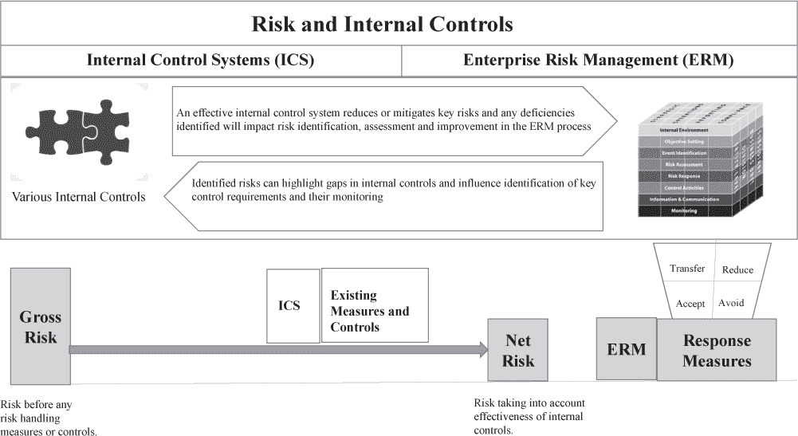

在处理企业风险管理（ERM）的净风险时，组织通常发现内部控制过程中存在缺口，这些缺口可以通过更新或更改控制来解决。ERM 过程中识别的企业风险的应对策略通常通过实施额外的内部控制来避免或减少风险，通过利用某种类型的保险来转移风险，或者有时只是接受风险并继续监控，因为积极缓解的成本过高。

#### 12.2.1 风险与内部控制

一个常见的误解是，风险、内部控制和审计仅在与财务业务流程相关时才需要——确保没有人“篡改账本”。然而，正如我们将在下面看到的，对大多数组织影响最大的风险并不是来自对财务报告的内部控制失败（ICFR）或财务流程失败，而是来自战略和运营风险，这些风险没有得到适当的识别和缓解，可能导致任何实体迅速倒闭。像柯达这样的公司拥有健全的财务内部控制流程和运营管理能力。在鼎盛时期，柯达占据了美国 90%的电影市场，是世界上最具价值的品牌之一——他们于 1975 年发明了第一台数码相机。然而，柯达未能准确预测数字胶片的统治节奏和市场影响，导致柯达在 2012 年申请破产。³ 有无数其他组织的例子，他们未能有效地在其整个业务范围内一致地管理和把握风险和机遇，导致了类似的命运。

风险管理、内部控制和 ERM 不仅限于财务风险和流程，还应包括所有影响业务的活动和流程，包括：战略、运营、财务和合规性组成部分。分类的数量或分类名称可能会有所不同，但组织内部的所有活动和外部对组织的所有影响都应该归入这些分类之一。全面的 ERM 或内部控制评估应涵盖所有这些关键业务流程，并定义缓解策略和控制，以有效地管理风险和在所有这些领域中利用机遇。

图 12.2 提供了可能适合这些分类中一个或多个的业务流程的示例。这些列表中不应该缺少任何关键功能，公司正在评估是否需要控制和 ERM 审查。如果识别出一个重要的业务活动/流程，它超出了这四个分类，应该适当添加并管理，以确保在所有关键业务流程中对风险进行评估。

**图 12.2：关键影响组织的流程和活动**

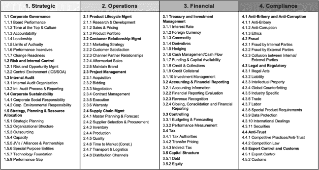

支持上述论点，即风险管理应该涵盖组织的所有风险，企业高管委员会在图 12.3 中的研究表明，大多数公司可能面临的最大潜在价值损失来自运营和战略风险，而不是像通常认为的财务或合规风险。市场变化、竞争活动、产品淘汰、高层管理变动、预测不当等，通常对大多数公司的声誉、收益或增长风险构成潜在的影响，比财务报告错误或遗漏要大得多。

这项研究表明，实体可能失去的 75%以上的潜在价值通常在战略和运营过程/活动中。控制和 ERM 不能仅限于解决财务或合规风险和机会，这是至关重要的。通常，在组织中从事内部控制和 ERM 开发和管理工作的员工来自财务部门，该部门的主要关注点是财务风险和控制。

**图 12.3：关键组织流程的价值损失。**

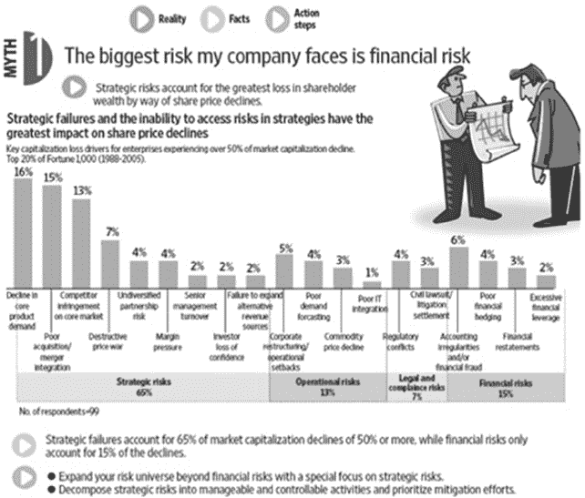

来源：改编自企业高管委员会公司。

#### 12.2.2 COSO 框架 - 内部控制模板

特雷德韦委员会赞助组织委员会（COSO）是由包括 AICPA、IMA、AAA、FEI 和 IIA 在内的五家私营部门标准制定组织的联合倡议，为定义和管理风险管理过程中的内部控制提供了一个广泛采用的全面框架。COSO 通过开发框架和指导企业风险管理（ERM）、内部控制和欺诈防范，提供了战略和战术思维领导力的共识。

人们常说的“COSO 立方体”为 COSO 框架提供了一个很好的总结。立方体的顶部概述了存在风险和需要控制以减轻这些风险的关键业务流程领域，如我们上面讨论的那样。立方体的右侧概述了确保风险管理过程和控制环境涵盖从总部到最远程实体的所有业务层次的需求。COSO 立方体的正面面板代表了风险管理过程和活动，这些过程和活动需要得到实施，以确保组织中适当识别和减轻风险(图 12.4)。

**图 12.4：COSO 立方体。**

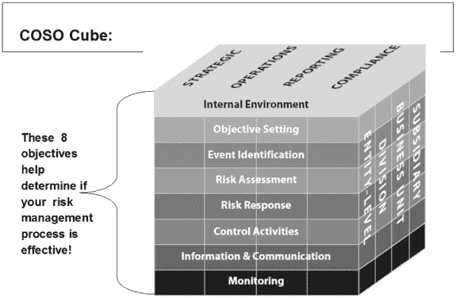

来源：[AICPA.org](http://AICPA.org)，经许可使用。

利用 COSO 框架应该足以覆盖区块链和分布式账本环境中的新流程和风险。风险、流程和参与者可能各不相同，但评估分布式账本所需全面、坚实的框架的需求应该使用 COSO 立方体进行评估。

#### 12.2.3 财务控制识别“自上而下”方法

在财务审计中，采用“自上而下”的方法来识别风险和内部控制，该方法源自 COSO 框架，并是大多数财务审计中用来识别财务报告的风险点和关键控制的传统方法。

风险是针对明确的企业目标来识别的，重要的账户是根据货币价值或活动阈值来确定的，以便进行审计审查。管理层提出的完整性、准确性、截止日等假设，为外部审计师制定一套审计程序、控制和控制活动提供了理论基础。然后，确定支持重要账户的关键流程和系统，并提出“可能出错什么？”的审计问题，以帮助识别各自流程和系统中的关键风险和缓解控制。这些财务报告控制随后以有助于确保它们将有效地减轻对组织财务报告的风险的方式进行设计和实施(图 12.5)。

**图 12.5：内部控制发展自上而下方法。**

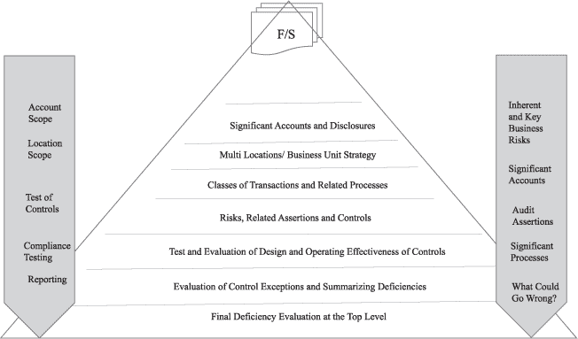

在年度或持续的财务审计过程中，对控制进行审查，以确保它们被适当地设计和有效地运行，以减轻对组织财务报告的风险。这种控制方法必须不断审查，因为组织内部或财务报告过程范围的重大变化可能导致关键控制的设计或运行有效性失败——危及财务报告过程和实体的财务报表。

#### 12.2.4. 管理层声明

管理层声明是管理层关于组织某些方面（通常与财务报告有关）的声明。⁴ 如上面在“自上而下”风险评估描述中所概述，声明是在开发和审计基于风险的财务审计过程中主要使用的概念。虽然管理层声明指的是财务类型的控制，但有时也可以应用于其他控制。华尔街区块链联盟对传统中央数据库过程和 BC/DLT 上管理层声明的研究表明，对于大多数常见的管理层声明，BC/DLT 网络在其设计中具有更强的声明。 表 12.1 概述了应用于 ICFR 的最常见的声明。注意当将一些关键声明应用于区块链或分布式账本网络或流程时，它们将变得多么强大。

**表 12.1：区块链对审计假设的影响。**

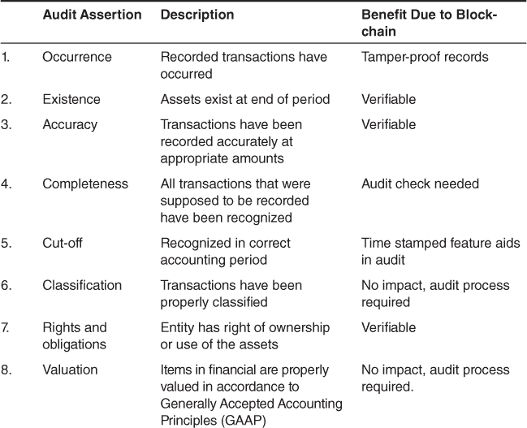

在考虑公共或私人区块链或分布式网络的设计和操作，如早期章节所涉及，似乎完整性、发生、准确性和截止等断言在不可变的、由共识和密码学保障的分布式网络上的断言强度和精确度会更高。而其他如估值的断言则不会因区块链的结构而本质上更健壮。

### 12.3. 内部控制类型及评估

内部控制存在于上述四个关键业务流程向量中，包括战略、运营、合规和财务控制。通常最大的重点是 ICFR，然而如上所述，其他业务控制领域往往对组织的目标构成更大的风险。一般来说，任何组织中的内部控制或治理业务流程的控制可以分为两大类。

+   实体级别控制。

+   交易或业务流程级别的控制。

实体级别或公司级别的控制是总体内部控制，反映了管理的基调和指令。这些有助于确保管理按照应有的方式运作。即，高层管理致力于以符合法律、公司政策和商业行为指南的方式管理公司，以帮助确保实现清晰的企业目标。实体级别控制的例子包括：

+   对公司风险管理和内部审计职能的控制。

+   集中处理和公司级别的对企业共享服务环境的控制。

+   用于监控操作结果的控制措施。

+   对财务和税务报告的控制。

+   内部审计。

+   举报热线。

+   信息技术环境和组织。

+   由高级管理团队进行监督。

交易或业务流程级别的控制是更细粒度的控制，可能特定于业务的某一部分或业务流程。这些通常更具体，可自动化，并有明确的测试或抽样方法。交易级别控制的例子可能包括确保关键业务流程（如支付、账单或工资单）按预期运行的控制措施。交易级别控制确保业务流程中具体的控制措施有效运行，例如确保支付过程中没有重复发票（通过重复发票分析检查）或仅向授权员工发放工资单（通过将工资登记册与当前员工名单比对）。交易级别控制通常比实体级别控制更正式，更容易与分析自动化，因为交易级别控制通常更具体。

在任何控制环境中，这两种广泛的控制类型都被利用来帮助减轻组织各个层面的欺诈和挪用风险是非常重要的。公共和私有的分布式账本也需要确保在宏观和微观层面上都有控制措施，以减轻这种新技术要求的非常不同的控制环境 - 我们将在下面进行更多的讨论。

#### 12.3.1 内部控制评估

控制审查或评估方法应与控制所减轻的风险相匹配。对于风险较低的过程或次要控制，审查或观察流程可能就足够了。对于具有适当风险级别的首要或关键控制，可接受评估过程是设计测试（TOD）和有效性测试（TOE）。这些测试确保控制得到适当设计并且有效运行，以提供合理的保证，识别出的风险得到适当缓解，并且未解决的风险不会造成伤害或危及组织目标的实现。

年度审查文档（TOD）通常是由专家（即外部/内部审计师、管理层内部控制专家等）手动进行的内部控制系统年度审查。在发生任何重大流程变化之后，或者在引入或删除流程时，也应审查控制的有效性。后一种审查过程经常被忽视，因为工程师和流程所有者是进行变更的人员，他们并不关注变更对控制环境的影响。

另一个重要的控制设计问题是一种新兴的审计方法，称为“过程挖掘”。在过程挖掘中，系统日志通过持续分析来审查/监控，以确保围绕定义的正式流程设计的控制实际上正在运行且没有被规避。通常，员工、客户和供应商可能会因为成本和便利而用非正式流程替代定义好的流程。如果可能的话，过程挖掘也应该成为设计审查的一部分。

测试控制（TOE）是在整个考虑期间连续进行控制测试，以确保设计得当的控制一直有效。当前的审计实践中，通常会定期（即每年）对时间点评估（TOD）进行统计或非统计抽样。这种基于样本的手动方法在确保控制长期有效方面往往是不充分的。如果认为控制设计不充分（TOD），审计员不应进行有效性测试（TOE），而应报告控制缺陷。TOE 为使用连续审计或监控分析提高内部控制的效率和精确度提供了最大机会。所有审计员都需要更广泛地采用连续自动化测试有效性的工具和技术。

将 TOD 和 TOE 用于控制评估的方法可以且应该适当地应用于审计区块链和分布式账本。然而，由于区块链的性质，TOE 必须是一个连续的自动化评估过程，利用基于总体的分析。区块链的自动化、密码学、安全的结构要求与分布式账本独特结构相对应的控制/控制活动提供区块链上的保证，并且像区块链一样自动化。这一概念将在接下来的章节中详细讨论。

#### 12.3.2\. 信息技术控制

所有业务流程的控制环境都依赖于支持业务的底层信息系统的完整性和安全性。在现代商业中，大多数关键业务流程都依赖于关键的自动化应用系统，用于生产/交付产品和提供这些业务流程所需的会计、财务报告和审计保证服务。这些信息系统包括企业资源计划系统（如 SAP）、客户资源计划系统（如“销售力量”）以及用于购买到支付、订单到现金等财务系统。这些通常复杂的信息系统需要进行审计，以确保这些系统中的交易和输出得到适当认可，并且可以被关键利益相关者依赖。这就是为什么确立支持组织业务流程的关键系统的完整性至关重要。信息技术（IT）控制为支持关键业务流程的信息系统的完整性提供了所需的保证。这些 IT 控制可以分为几个类别，如图 12.6 所示。

**图 12.6：整体信息技术控制方法。**

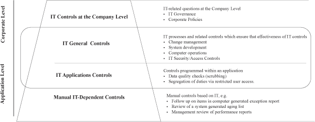

这些信息技术控制被分解为我们在上面讨论的所有控制的两类宽泛类别，“企业”或实体级别控制和“应用”或交易级别控制。核心信息技术控制类别是信息技术通用和应用控制，这些控制是大多数信息技术应用的系统审计、系统和组织控制（SOC）报告以及 CPA 公司根据 SSAE-18 执行的 ISO 27001 等著名信息安全标准的基础。2002 年，布什总统签署的《萨班斯-奥克斯利法案》第四百零四部分涉及有效评估内部控制框架（ICFR），特别强调健全信息技术控制的重要性——如果设计不当或运行无效，可能会导致被审计实体出现重大缺陷甚至实质性弱点。与所有级别的健全信息技术控制的重要性相关的是这样一个基本原则：如果处理的信息或任何类型的应用程序是不安全的、不准确的或不完整的，那么就没有依据依赖该系统产生的任何信息。

信息技术内部控制类别以及为提供对信息技术过程和系统的保证而普遍采用的审计方法论可以有效地适应区块链——尽管风险和控制将会有所不同。必须改变的是外部审计公司和内部审计人员常常使用的手动遗留审计实践/程序，这些程序未能利用自动化分析和基于大数据的持续监控。区块链和分布式账本，就其本质而言，是由自动密码学保障的自动化信息系统。正如本章前面所概述的，对大型中央或分布式数据库使用周期性抽样审计程序的概念在提供适当的控制保证以减轻欺诈和滥用风险方面是“远远不够”的。

### 12.4．审计区块链/分布式网络

上述开发基于风险的内部控制和审计的传统方法和途径适用于为区块链和分布式账本提供保证。以目标为中心、基于风险、自上而下的方法来识别和审查分布式账本上的内部控制是适当的，然而，为分布式账本提供保证的方法和实践需要利用一个完全不同的方法和工具集。区块链代表了与传统中央数据库结构非常不同的架构，有一套新的能力和风险，这导致了一个非常不同的内部控制环境。

审计区块链与传统中央数据库系统的优缺点如下：

优点*：

+   控制精度和形式化的更高水平。

+   通过分布式账本实现安全和可持续性——没有单一故障点。

+   完全自动化的生态系统，由密码学保障安全。

+   共识机制有助于防止简单的串通——不是“4 只眼睛”，而是 8、100 和 1000 双眼睛！

缺点：

+   区块链/分布式账本技术（BC/DLT）是新的，仍然令人怀疑。

+   目标、风险和控制与中心数据库过程差异很大。

+   在审计和 IT 领域围绕区块链的有限技术专长/经验。

区块链的自动化特性使得数据分析和使用形式化的自动化控制变得容易。考虑一下，区块链网络中的协议代码是一系列自动预防性分析，它会在任何信息被提交到账本之前审查/批准每一个交易区块。由于密码学、去中心化和共识机制，区块链账本比中心数据库更安全，共识机制确保了每一笔交易都超过了一般的“4-eyes”审查。例如，大多数公链或私链有 8、100、1000 或多双眼睛在审查每一笔交易。区块链或分布式计算机通常没有数据中心、中央计算机或系统故障的单一节点。

审计区块链和分布式账本的主要挑战在于这是一项新兴的技术。审计师在企业应用中有限的经验和把握。如我们稍后所讨论，目标、风险、控制和断言与中心数据库应用相比非常不同。了解分布式账本和需要实施以监控它们的控制保证流程的有限技术专家也较少。这些限制并不会阻碍区块链的采用和发展，但需要时间来解决这些问题，并发展可持续的内部控制和审计过程来保障区块链和分布式账本。

#### 12.4.1 保障区块链的安全

如上所述，BC/DLT 的设计本质上与传统的中心数据库大不相同。由于协议分析、共识机制、密码学和账本的分布式特性，区块链比传统的中心数据库要安全得多。然而，必须应用新的风险、断言和控制来审计区块链网络。BC/DLT 网络通常是开源的，没有明确的所有人或中央权威（即公链）或参与者/节点跨组织，代表了一个以上的主权组织（即私链）。本节将区分公共和私有区块链的控制含义。我们将主要关注系统审计的最优方法，暗示如果不能信任区块链，那么也不能信任从中衍生的信息。

公共或不许可的区块链代表了分布式账本最普遍的应用。比特币、以太坊、莱特币等，都是公共或不许可的 BC/DLT 网络的例子。几乎任何人都可以加入并参与公共网络。许多公共区块链，如比特币，都是大型国际网络，拥有数百万参与者，他们主要用加密货币进行投资或其他金融服务应用进行交易。对于任何审计师或审计公司来说，审计一个大型、公共、全球性的分布式网络都是一个艰巨的任务——这有点像“审计互联网”！然而，当个人或实体在公共区块链上进行重要交易时，该网络需要被审查并认证，才能依赖该网络上的交易信息并用于网络外的财务报告。

私人或许可的区块链是 BC/DLT 网络世界中的一个较新参与者。这些通常代表较小的一些早期阶段的应用程序，具有用例，并且在供应链管理、保险、食品安全以及金融服务等领域有一些大型项目正在开发中。私人区块链通常比大型公共链要小得多。在私人区块链中，参与者必须被邀请或获得许可加入链，私人链甚至可能只用于在公司内部进行交易。例如，私人区块链可以被用于大型跨国公司的部门报告合并。在私人 BC/DLT 网络上进行系统审计可能在一个大型公共网络上更有效率。这是因为私人或许可的区块链只有被邀请和值得信赖的参与者。如果私人链由多个实体和司法管辖区组成，或者由竞争参与者组成，可能会存在复杂性。在这些情况下，可能会有额外的问题，例如哪个实体负责维护区块链，谁将承担审计网络的费用等。

#### 12.4.2 风险与限制

让我们讨论一些在 BC/DLT 网络上开发内部控制和审计流程、系统或交易的关键限制。如上所述，COSO 提出的当前风险管理和内部控制框架对于开发内部控制和审计非传统数据库是健全的，并适用于区块链技术，然而，详细的实施和内部控制 BC/DLT 网络完全不同，必须进行更改。

在为区块链/分布式账本网络定义审计和内部控制设计方法时，一个重要的考虑因素是，区块链网络通常拥有不完整或有限的数据，这些数据不足以对完整流程进行审计或对端到端交易进行审查。区块链设计上的一个特点是在数据库中携带有限的信息，以防止网络“膨胀”（变得太大，无法高效地发送到区块链上的所有节点）。记住，区块链通常不会被归档，并且必须保留并分发从第一个或“创世纪”区块到当前区块的所有信息。区块链记录可能只包含几个字段，如公钥、单位数量、时间戳等，缺乏任何估值、源文档链接和其他关键信息，这些信息对于评估内部控制和进行彻底审计是必需的。

#### 12.4.3\. 交易的净额处理和对控制影响的考量

在公共区块链上进行加密货币交易的区块链网络在评估或审计交易时存在独特问题，因为即使有适当的访问权限，区块链通常也提供不了与个人或实体相关的交易的全貌。这是因为加密货币交易所和钱包会“净额”处理交易所内交易，并且从不提交给区块链。例如，如果加密货币交易员“A”在交易所“X”上向同样在交易所“X”的加密货币交易员“B”转账 5 个比特币，这笔交易可能永远不会提交给比特币区块链，因为交易所“X”只会净额处理这两位客户之间的交易。这种常见的做法，被称为“离链”交易，允许加密货币交易所通过不将交易所内交易提交给区块链来节省时间、精力和成本。只有当它们是交易所间交易或加密货币的初始购买时，这些交易才会提交给相应的区块链网络——这些被称为“上链”交易。对内部控制和审计的影响是，加密货币的控制环境必须针对整个区块链生态系统，而不仅仅是区块链本身，以确保彻底的控制审查或审计。涉及加密货币的任何系统审计或审计方法必须能够识别加密货币生态系统中所有利益相关者之间的所有交易，包括交易所、钱包、场外交易员、银行和其他第三方，以确保流程和交易的全貌。

这一现象在图 12.7 中有所说明。数据来自 CoinDesk 2019 年的一篇“研究报告”，报告显示近年来这种现象变得非常明显。随着加密货币交易世界活动水平的提高，链下交易的比率也在增长。图表显示了随时间的“链上/链下比率”，代表了记录在链上的交易量，这些交易量通常属于交易所之外的私人交易，以及仅在交易所内参与方之间的链下加密货币交易量。

观察每个类别的两个关键指标：链上交易量与链下交易量（交易所交易量），该研究测量了 2013 年 12 月至 2018 年 12 月之间这些值的比率。这个简单的指标被称为链上/链下比率。

**图 12.7：链上/链下比率**

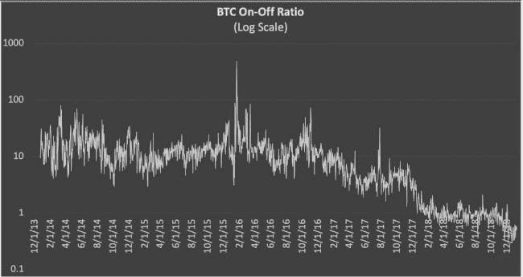

*来源*：CoinDesk 的“研究报告”：2019 年 1 月 11 日（第 2 页）。[`mail.google.com/mail/ca/u/0/#inbox/FMfcgxwBVDFGBNSTPnWSkxFGzczhPVkB`](https://mail.google.com/mail/ca/u/0/#inbox/FMfcgxwBVDFGBNSTPnWSkxFGzczhPVkB)

图表显示了在研究期间，每在交易所上移动的一美元，在区块链上移动了多少美元。比率大于 1 表明相对于交易所，链上交易量较高。比率小于 1 则意味着交易所内交易远远超过交易所间交易。这暗示了大多数个人之间的交易在公共区块链上没有记录，因为双方都属于同一个交易所。链上/链下比率用于评估加密货币的交易量中有多少没有反映在保护该货币的网络上的交易——这些“链下”交易不受区块链/分布式账本网络的保护，也不代表特定资产的记录。在比特币的大部分历史中，我们看到比率表明始终发生的链上交易量大于交易所交易量。这种情况一直持续到 2018 年第一季度初，趋势发生了转变。自那时以来，平均值为 0.94，标准差为 0.31。这一现象/趋势的含义是，审计师在评估加密货币时，由于数据不完整、区块链上缺失交易、链下交易的完整性，甚至交易所失败的可能性，审计端到端交易的任务越来越困难。

#### 12.4.4. 面向更广泛的区块链/分布式账本生态系统

鉴于审计区块链作为一个独立实体的上述限制，很快就很明显，对任何区块链或分布式账本网络进行全面的财务报告或审计需要在审计范围内涵盖更广泛的生态系统，以捕捉端到端的过程和交易。一家快速成长的金融科技公司，如卢卡科技（Lukka Tech），已经开发出一种实现这一目标的创新方法。卢卡为基金、基金经理、场外交易柜台（OTC）及其他以加密货币进行交易的客户提供中后台财务和税务报告。如上所述，由于大多数主要交易所上的净额或“场外”交易，区块链上的数据有限，并不提供完整的加密货币交易。

卢卡在下一节中详细介绍的方法，使用专有的应用程序编程接口（API）为客户提取仅追加的加密货币交易数据，并将数据提取到经过“SOC”审查认证的安全“记录系统”中，该系统由安全的云数据库管理。数据从整个区块链生态系统中为客户获取，包括所有主要区块链、交易所、钱包、银行、OTC 柜台、矿池等，确保所有客户交易都被捕获并整合到经过认证的记录系统中。然后，将数据进行标准化并添加定价、估值、头寸等信息进行丰富，并以适合财务或税务报告的格式将数据提供给客户。

卢卡（Lukka）在与大学、会计师事务所和其他机构的研究合作中，正在探索将区块链的基础设施数据提取到其现有的安全记录数据库中的方法。这样，客户或审计师可以使用一个多功能的“分析引擎”来连续自动执行控制分析，监控其审计框架下以下三个关键领域的基于风险的区块链系统审计控制：

+   协议认证* – 以确保协议分析是安全的、完整的，并且适合该区块链用例/应用程序。

+   共识机制* – 以测试公共或私有区块链是否遵守其商定的共识机制。

+   交易和智能合约* – 以验证交易组合和普遍的智能合约控制是否存在，以减轻操纵风险和智能合约攻击。

卢卡目前拥有大约 75 个针对上述三个风险类别的区块链特定控制措施，并将其开源，以获取客户、会计师事务所、学术研究人员和其他该领域的思想领袖的额外输入，以帮助进一步推动区块链网络的自动化系统审计。

#### 12.4.5\. 分发审计以分发账本

在公共或私有区块链上建立只读审计节点，是执行区块链或分布式账本网络全面系统审计的一种替代方法。审计节点可以作为一种检测控制，并持续通过自动化分析，在每次交易通过区块链执行时监控区块链的特征。这确保了审计程序（或智能合约）得到了网络共识机制的适当批准，并允许在交易前对网络进行预防性控制审查。网络可以提供警报，防止交易或代码（即智能合约）在区块链网络上执行。通过上述提供的“记录系统”方法来对区块链进行系统审计，控制总是只提供检测或交易后的保证。通过在网络上建立一个安全的只读审计节点，我们可以将区块链的固有安全性和不可变性扩展到智能合约启用的审计程序——确保没有人能篡改或改变共识机制或智能合约中的分析。

尽管这种分布式方法很有前景，并可能最终是执行内部控制审查和审计区块链及分布式账本网络的方式，但它仍需克服几个挑战，包括：

+   在任一给定区块链上进行端到端流程或交易控制审查和审计所需的数据量很少。如前所述，区块链中的数据输入不包含您需要进行全面审计的许多字段——这是为了防止它变得“庞大”，即变得太大而无法有效分发。

+   并非所有的加密货币交易都报告在区块链上——这阻止了端到端流程或交易审计，请参考之前关于“离线”交易的讨论。

+   这项技术仍在发展之中，目前只有少数区块链协议能够管理和处理智能合约——特别是那些能够对区块链网络上所有交易进行全面基于人口统计的审计所需的复杂性。

+   如上所述，智能合约本身是区块链网络面临的最大单一控制风险。

从长远来看，作为节点进行的分布式审计可能是内部控制的首选解决方案，因为它与这项新兴技术的分布式去中心化设计最为一致。然而，目前存在技术限制，这意味着需要进一步成熟智能合约，以便分布式审计方法真正可行。因此，对于需要内部控制和审计审查的个人和实体，迫切需要一个区块链和分布式账本网络的临时审计解决方案。

### 12.5. 区块链系统审计

我们现在更详细地探讨一下在区块链上进行的系统审计的具体内部控制和审计方法。正如上面所述，系统审计控制是在测试与业务流程相关的财务、战略、运营或合规控制之前的首要审计任务——必须首先确保底层信息系统是安全的并且得到认证，然后才能测试在这些系统上进行交易的控制。本节将探讨传统的 IT 通用控制如何在系统审计中与审计区块链或分布式账本所需的风险和控制相一致。⑤

#### 12.5.1. 传统系统审计控制应用于区块链

†图 12.8† 识别了在任意中心数据库系统的一般 IT 控制中用于系统审计的常见类别。我们将这些应用于区块链系统，以查看它们映射得有多紧密。这包括标准 IT 通用控制，涵盖访问安全、变更管理、计算机操作、归档等类别。有趣的是，传统 IT 通用控制类别中只有少数适用于区块链或分布式账本。

†图 12.8：传统系统审计控制应用于区块链。†

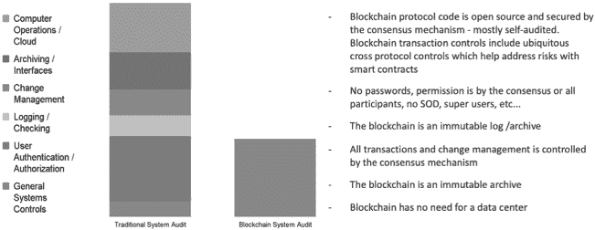

本书前面章节中概述的区块链的本地结构和操作设计上比传统的中心数据库业务流程要安全得多。在区块链或分布式网络上，没有中心数据中心或计算机操作。区块链的定义就是不会归档账本的一部分。在共识机制内，变更管理通常是透明/安全的。此外，没有密码或其他形式的访问控制。适用于传统系统审计的控制和控制类别中，只有少数直接适用于区块链的系统审计。

#### 12.5.2. 新技术——新风险

几乎所有传统系统审计控制都不适用于区块链，然而区块链结构 clearly 引入了新的风险、断言和控制，这些需要用新的内部控制集合来评估和解决。这些新的风险和控制集合适合以下三个主要类别(图 12.9)。

†图 12.9：区块链审计框架。†

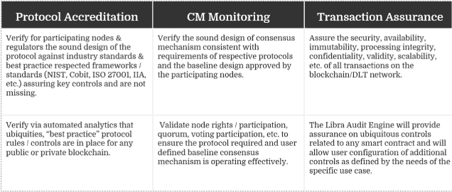

†来源†：图片经 Lukka Tech 授权从[`Lukka.tech`](https://Lukka.tech)获得。

需要控制的关键风险领域包括协议认证，我们需要控制帮助确保区块链协议代码是安全、完整且适用于各自的区块链用例/应用。协议代码是基于规则的代码，定义了任何区块链的治理。这是一组在区块内对相应区块链提交的每笔交易运行的预防性分析控制。协议代码在大多数公共区块链上是开源代码，并像交易一样由网络的共识机制保护。在公共和私有区块链上，协议代码首先由区块链的创始人在其创立时定义，通常只是从其他成功的区块链复制，通常没有经过严格的风险审查或调整，以解决网络之间的流程差异或应用受尊重的保证标准（COSO、IIA、AICPA、NIST、COBIT 等）。这代表了对区块链的新的关键风险，即对于比特币或其他某些成功的网络有效的协议代码可能不适用于另一种加密货币网络，或对于完全不同的区块链应用，例如供应链或保险用例。

比特币区块链的协议分析真的非常好，在 10 多年的时间里从未被攻破。它帮助保护比特币网络，但这并不意味着它将对其他区块链应用同样成功。新区块链网络的开发人员如果只是从比特币或其他知名网络中复制协议控制，并将其应用于新的区块链应用，而不考虑流程或功能差异、所需的安全和控制级别，将面临协议保护网络的缺陷风险。任何区块链上的协议代码都需要为网络的特定应用设计，并在创立时仔细认证并在持续的基础上监控，以解决拟议的更改、错误、升级等问题，这些问题可能会威胁到网络的完整性。

共识机制是区块链的另一个新的风险领域。区块链或分布式账本的共识机制简单来说就是所有交易或变更在提交到区块链账本之前，所达成一致的审查和批准方法。这个共识机制是任何区块链的关键控制区域，可能采取多种形式并利用多种类型的共识（即工作量证明、权益证明、零知识证明等），但无论达成何种机制，只有当它为支持账本的过程设计得当且在网络上有效运行时，它才是有效的。

大多数公共和私有区块链需要至少简单多数（即 51%或更多）的验证者的共识批准，并通常包括某种类型的分析审查以及工作量证明或权益证明，以确认哪个矿工将新版本的账本提交给网络上的所有节点或参与者。这里的关键风险在于区块链网络节点或参与者是否遵守他们达成的共识机制。例如，在私有区块链上，创始人/参与者可能在共识机制中达成协议，要求 75%的活跃有效参与者必须批准任何影响网络的交易或更改。假设八月的一个炎热日子，除了 25%的网络参与者外，所有人都度假或离线，一个交易区块需要提交给网络？网络如何确保这些少数参与者不会违反共识机制而批准交易？需要控制措施来确保网络及其相应的参与者遵循他们同意的共识机制，以确保区块链的持续完整性。

交易和智能合约代表了区块链面临的最大新的潜在风险领域。这包括从批准区块提交到账本的应用交易，或由网络上的智能合约活动触发的交易。可能存在某些交易组合，它们创建了未预见的漏洞，或某些普遍的智能合约风险，这可能导致网络上的漏洞（例如，“重入”当智能合约在完成第一次触发之前被第二次触发，导致一些未预见的异常）--下文将讨论一些示例。大多数最近在 BC/DLT 上的黑客攻击/妥协事件都是由于智能合约中的漏洞。智能合约只是由区块链网络的共识机制验证的计算机代码。它们根据网络上的触发事件执行某些预定的动作。与任何计算机代码一样，总会存在未预见的漏洞和风险，并且所有计算机代码都必须不断监控，以识别触发事件、处理更改或异常，这些可能危及代码。

**图 12.10：   公共/权限区块链的控制库存示例。**

**来源**：图片经 Lukka Tech 授权获取，详见 [`Lukka.tech`](https://Lukka.tech)。

图 12.10 提供了可能包含在上述三个关键框架区域内的区块链系统审计中的控制类型的示例。在协议认证的框架领域内，控制涵盖诸如符合商定的参数（如最大区块/交易大小、允许的节点数量/类型、允许的资产）、通过检查区块历史来防止“双重花费”等主题。在共识机制的控制中，可能包括确保有适当数量的可动态投票节点存在以批准并将交易提交到网络，确保验证器/矿工只批准合格的区块且每个区块只有一次投票等。在最后一个风险领域“交易保证和智能合约”内，控制将确保具有多重签名要求的交易或交易组合（“多签名”）具有适当的签名数量，确保带有位置戳的交易不是来自受制裁的地区，并确保普遍的智能合约控制有助于减轻智能合约遭受黑客攻击和妥协的风险。

图 12.11 是 Lukka 系统审计控制库存的快照。正如前面提到的，Lukka 目前拥有大约 75 个针对区块链的独特控制，涵盖上述三个框架风险类别，并且已经将其开源以进一步丰富这些控制。这将有助于为区块链网络建立一个全面、可持续、自动化的系统审计基准。请注意下面的图表，每个建议的控制都标识在我们上面讨论的三个系统审计框架之一中。每个控制的目标、风险和断言都与一段简短的解释相匹配，说明该控制如何适用于区块链/分布式账本。随后为每个控制定义了一个伪代码分析，并建立了一个闭环升级警报流程。最后，每个建议的控制都与相应的 IT 及相关标准适当对齐。

#### 12.5.3。智能合约中的风险

智能合约对区块链网络的完整性构成了最大的潜在风险。智能合约是区块链的共识机制验证的计算机代码，基于网络上的触发事件定义某些预定的动作。因此，智能合约的风险源自任何计算机代码的脆弱性。考虑一下，编写得很好的应用程序“APP”（其实质就是计算机程序）需要定期更新以解决错误或性能问题的情况有多频繁。您手机上的“APP”是由信誉良好的公司的优秀程序员编写的，经过彻底测试，然而几乎每周都会有某种更新需要实施，以保护免受安全或性能问题。

**图 12.11：  样本控制库存。**

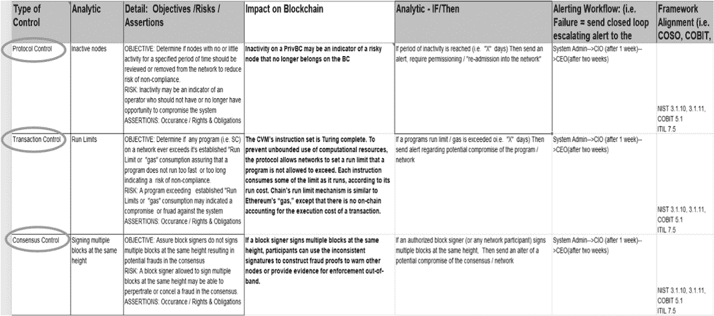

来源：来自 Lukka Tech 的授权许可的图表，[`Lukka.tech`](https://Lukka.tech)。

所有软件代码都可能受到某种持续风险的影响，这些风险源于设计/验收测试中未能发现的漏洞，或者是由于支持代码的基础过程发生变化，或者是由于未预见的程序与其他网络内的程序相互作用。即使是来自顶级公司的备受尊敬的企业级代码（如 Windows、Apple IOS 等）也需要定期发布补丁更新，以解决它们各自软件中的这些问题。不可避免地，代码无法一次就编写正确，并持续确保其未来的可靠性。一些最近的高调区块链/分布式账本（BC/DLT）妥协事件的基本问题包括：

+   *重入*——当一个智能合约在完成第一次触发之前被第二次触发时，会导致一些未预见的异常情况。

+   *竞态条件*——当两个运行良好的独立智能合约同时运行时可能会出现故障，从而产生未预见的漏洞。

因此，需要一些预防性/检测性控制，这可能包括限制或警报，以解决上述问题或对任何单一节点或节点组在网络交易中的主导地位。例如，区块链创始人/参与者可能希望在任何单一节点在任何给定时间使用超过 X%的网络资源时收到警报。智能合约通常需要支付费用或称为“燃料”的资源才能在网络上运行。可以对任何智能合约在定义期内消耗的“燃料”量施加限制。这将会警告网络参与者，有一个或几个节点正在消耗过多资源，可能在网络上进行恶意活动。这些都是确保早期检测潜在异常所需的普遍交易或智能合约控制/分析的例子。在没有预防的情况下，早期检测至少可以确保这些漏洞的影响得到控制。随着时间的推移和进一步的发展，这些漏洞可以在具有基于人群的持续控制/分析以及闭环升级警报的区块链上得到缓解。

### 12.6\. 整个生态系统的控制措施

鉴于上述审计区块链或一组区块链的限制，以下部分概述了内部控制和审计整个区块链生态系统的方法。这有助于确保在区块链生态系统中存在端到端的内部控制。正如所讨论的，区块链上的审计数据有限，在加密货币的情况下，区块链上的交易往往是不完整的。需要一种更广泛的方法，以确保系统审计覆盖区块链生态系统中的所有潜在风险。

#### 12.6.1\. 区块链生态系统

区块链生态系统包括提供对特定区块链访问的“上匝”和“下匝”。除了区块链之外，这些可能还包括：

+   交易所，管理加密资产。

+   钱包，存储加密资产。

+   矿工或挖矿池通过验证网络获得加密资产。

+   场外交易台，促进私人交易。

+   银行/金融机构提供资金或货币兑换。

+   预言机，向区块链提供安全的第三方信息。

除了区块链，上述生态系统的大多数成员都是传统的中心数据库系统。这些过程也需要有适当的、运行良好的内部控制以及保证审查和审计。

在复杂的区块链生态系统中，识别端到端流程控制并为整个系统提供一体化保证具有挑战性。区块链或分布式账本通常是更大去中心化生态系统中的“公共”或“共享”资源。在公共和私有区块链中，关于分布式生态系统和账本内的所有权、边界和责任会产生问题。公共区块链中一些普遍存在的问题包括：

+   谁拥有比特币区块链？

+   你该如何审计它？

+   谁来支付审计费用？

+   如果每个人都付款，那么您如何分配审计任何公共账本的成本？

在一个由独立授权参与者组成的私有区块链中，合作开展商定的商业使命时，将围绕谁拥有区块链、如何最有效地进行审计、审计成本如何分担以及许多其他相关问题产生疑问。回答这些问题并制定控制/保证流程来解决独特的区块链风险需要超出中心数据库环境可能需要的协作水平。

许多公共和私有区块链网络、会计事务所、标准制定机构、监管机构和其他机构目前正在应对这些挑战。当前的区块链生态系统需要集成的内部控制和保证解决方案。现有的内部控制解决方案和程序对区块链生态系统有用处有限。正在开发新方法来应对新挑战，下一个方法就是其中之一。

#### 12.6.2. 记录系统

Lukka⁶ 已经开发了一种认证的“记录系统”方法，以解决加密货币和区块链领域上述讨论的限制。Lukka 正在改进其平台的功能，以包括一个分析引擎。分析引擎将使他们能够执行自动化的持续运营和内部控制审查。通过摄取上述三个区块链风险区域的基础设施信息以及交易（即协议、共识机制和交易/智能合约），Lukka 将能够使用自动分析，对特定客户的整个区块链生态系统的系统审计控制进行审查。

图 12.12 概述了在区块链及其生态系统上进行内部控制监控和审计的集成“记录系统”方法。请注意，整个生态系统都在提供与区块链相关的活动信息。从各种来源捕获的信息不仅包括来自区块链的交易数据，还包括上述讨论的基础设施数据，包括协议共识机制和交易组合以及智能合约输入。这种方法通过开放和专有的 API 将带有权限客户端元数据（即密钥、访问代码等）的“只追加” (即，数据只能添加，不能以任何方式更改或修改) 交易提取到一个认证的“记录系统”安全云数据库中。⁷ 数据从整个区块链生态系统中为客户摄入，包括所有主要区块链、交易所、钱包、银行、OTC 柜台、矿池等，确保所有客户交易都被捕获并整合到认证的记录系统中。然后，将数据标准化并使用后退库存（LIFO）、先进先出（FIFO）等估值、定价、头寸进行丰富，并将其提供给客户用于财务或税务报告。

**图 12.12：    将区块链生态系统作为“记录系统”进行审计。**

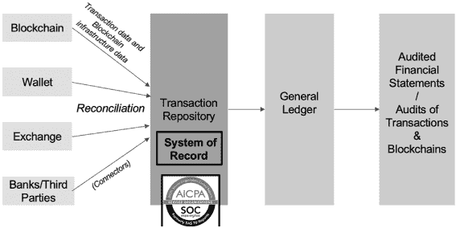

来源：图片经 Lukka Tech 授权获取，[`Lukka.tech`](https://Lukka.tech)。

#### 12.6.3 其他框架

还有其他监测内部控制并进行全面系统审计的有力方法，这些方法针对区块链或分布式账本网络。我们上面描述了在公共或私有区块链上建立只读审计节点，控制监控/审计作为智能合同在区块链内执行的方法。这种方法的变体包括在中心或从父区块链节点监控许多不同区块链的想法。这些节点可以通过智能合约和对等网络访问区块链生态系统的其他部分，以审计完整交易和端到端流程。然而，为了使这些方法可行，需要区块链和分布式账本上智能合约的采用、安全和复杂性有显著的成熟。在此期间，区块链及其生态系统需要进行控制和系统审计审查，以应对当前年度及以后的重要活动。

### 12.7 结论及其他考虑

在本章中，我们讨论了区块链技术带来的固有风险以及如何调整内部控制框架来应对这些风险。当然，由于这项技术是新的，并非所有的潜在风险都被知晓或缓解。这是一个不断发展需要会计师和审计员防止、发现和解决缺陷的领域。为了让这项技术发挥最大潜力并用于主流交易，开发一个全面的内部控制系统至关重要。

分布式网络中所需的风险缓解和控制措施与中心数据库系统所需的不同。区块链网络的系统审计是第一个保证优先事项，因为它提供了对区块链交易和结构进行认证的基础——没有这种保证，建立在网络上的任何业务或报告流程都存在风险。区块链设计上携带有限量的交易信息，在加密货币的情况下，交易信息常常是不完整的，因此需要对较大的区块链生态系统（即交易所、钱包、其他第三方等）进行内部控制/审计审查。

在大众媒体上，有一些猜测认为区块链将使审计变得多余甚至过时。我们不同意。区块链确实需要被审计！无论是公共区块链还是私有区块链，都需要内部和外部保证提供者进行独立的审计/保证。尽管区块链具有固有的安全性，但审计员将保持相关性。利用区块链上的自动化审计工具将使审计员和会计师能够专注于更战略、法医审计方面。

区块链不会消除审计员对交易的评估，但它们可以改变审计员进行系统财务报表审计的方式。与区块链相关的证据将允许审计员进行更多分析，利用自动化、人工智能和机器学习能力。如果审计员接受这些技术，那么就有机会实现审计精度和效率的指数级增长，同时显著减少财务报告和审计周期。

如何在未来更好地审计区块链和分布式账本尚在形成中，仍在研究中，但肯定包括使用控制分析法和持续审计/监控技术。目前，学术界和企业界正在开发相关应用程序。这些方法基于 COSO、COBIT、NIST 等普遍存在的风险框架，这些框架也不断更新，以应对新兴风险和技术。当然，当前的控制/审计实践存在局限性。例如，手动、定期、非统计抽样方法，有限的“4-eyes”审查等，对于应对动态的、分布式的、自动化的 BC/DLT 生态系统的保证需求能力有限。正在开发工具、技术和方法，以重新定义审计实践，解决区块链和分布式账本问题。

### 注释

【1.】ACFE 2018 年“国家欺诈报告”，美国注册欺诈检查员协会（第 42 页）。具体链接请访问[`mail.google.com/mail/ca/u/0/#inbox/FMfcgxwBVDFGBNSTPnWSkxFGzczhPVkB`](https://mail.google.com/mail/ca/u/0/#inbox/FMfcgxwBVDFGBNSTPnWSkxFGzczhPVkB)

【2.】Comp TIA 文章“New Comptia study offers insight into how millennials may change the workplace”，史蒂文·奥斯特罗斯基，Comp TIA，2015 年 11 月 4 日。具体链接请访问[`www.comptia.org/about-us/newsroom/press-releases/2015/11/04/new-comptia-study-offers-insight-into-howmillennials-may-change-the-workplace`](https://www.comptia.org/about-us/newsroom/press-releases/2015/11/04/new-comptia-study-offers-insight-into-howmillennials-may-change-the-workplace)

【3.】Darn（2012）

【4.】审计中的管理声明，会计工具，2017 年 11 月（第 1 页）。具体链接请访问[`www.accountingtools.com/articles/what-are-management-assertions-in-auditing.html`](https://www.accountingtools.com/articles/what-are-management-assertions-in-auditing.html)

【5.】这项工作是基于罗格斯大学连续审计与报告实验室（CarLab）和 Lukka Tech 的合作研究。

【6.】本部分是基于 Lukka 的产品开发而写的。[`lukka.tech/`](https://lukka.tech/)Lukka 为区块链及其生态系统构建中后台财务/税务报告和审计解决方案。Lukka 的成功企业财务和税务报告解决方案正在被全球从事加密货币交易的个体和大实体所使用。

【7.】这种方法已获得 SOC1 和 SOC2 认证。对于 SOC 的定义，请参见 AICPA 网站“Defines SOC”。具体链接请访问[`www.aicpa.org/soc`](https://www.aicpa.org/soc)

### 贡献者联系方式

格雷厄德（Rod）布 renn 是海洋视野顾问公司（Ocean View Advisors LLC）的负责人，同时也是一位教育工作者/研究者，提供创新的会计和审计技术解决方案。Rod 可以通过 rod.brennan@verizon.net 联系。
