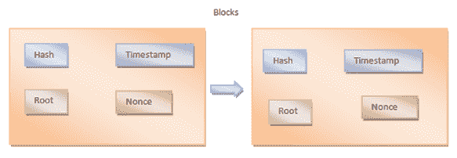
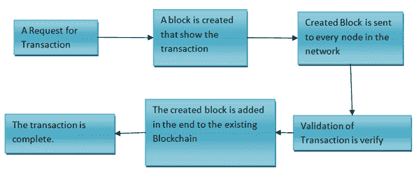
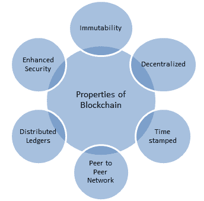
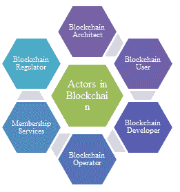
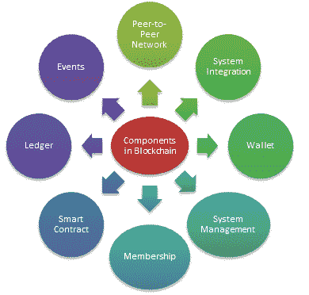
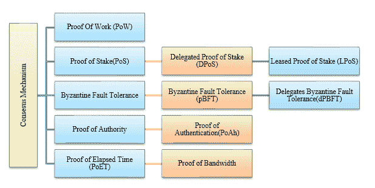
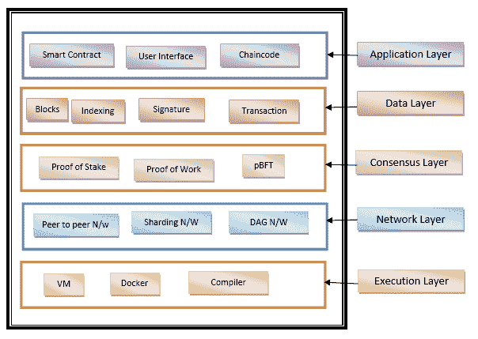
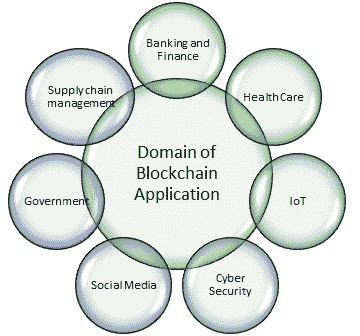
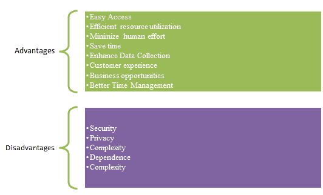
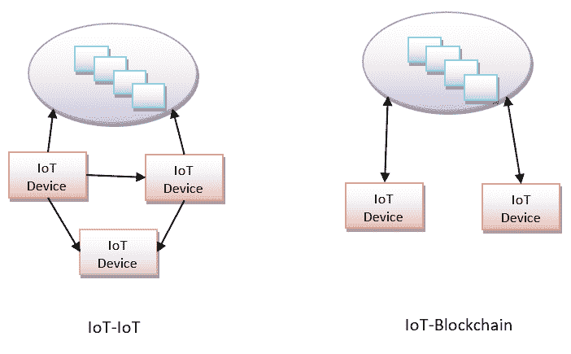

# 第一章

# 区块链与物联网（BIoT）的集成：

应用、安全问题与挑战

+   苏什玛·马利克

    印度贾纳克普里技术创新与管理学院

+   安妮卡·拉纳

    

    印度德里玛哈拉 aja 苏尔 ajal 学院

摘要

物联网（IoT）指的是将智能设备与互联网连接以积累数据并传输到智能设备。但由于缺乏内置的安全措施，IoT 容易受到隐私和安全威胁。区块链技术有助于满足 IoT 设备的安全需求。区块链技术的主要特征，如不可变性、透明度、可审计性和数据的加密，解决了 IoT 设备的不足。本章对区块链和 IoT 技术进行了全面的调查，并探讨了这两种技术的集成以克服其不足之处。本章包括对这两种技术的概述，以及它们的优缺点。它还突出了它们的应用领域，并展示了区块链和 IoT 技术集成的优点，以开发 BIoT（基于区块链的物联网）。同时，分析了在平滑集成区块链和 IoT 技术过程中遇到的主要挑战。

引言

区块链有一份记录，称为区块。所有区块都通过加密技术（Alphonse & Starvin, 2020）链接起来。区块链可以定义为一个在点对点网络上的透明、可信和去中心化的账本，它是一种由中本聪在 2008 年发明的虚拟比特币加密货币。交易是区块链上的数据单元，一定数量的交易被捆绑在一个区块中（N. Kumar & Aggarwal, 2020）。计算加密哈希值并放置在其下一个区块中，附带时间戳。区块链是一个分布式和开放的账本，能高效地记录交易。区块链中的数据修改受到限制（Bach et al., 2018）。对于所有参与者，区块链账本都是可以访问的，但仍然不受任何网络当局的监管，这可以通过在网络节点之间施加严格的规定和相互协议来实现（Uddin et al., 2021）。区块链中的每个区块都包含一个哈希值，存储前一个区块的哈希值。哈希是每个区块在创建时分配的唯一地址，并且区块的任何修改都会导致其哈希值的变化。存储所有交易的根哈希值。区块的创建时间作为时间戳存储，Nonce 值确保当前的哈希值低于图 1 中显示的目标。

| 图 1. 区块结构 |
| --- |
|  |

区块链是由包含信息的区块组成的链。由于这项技术，数字文件无法倒签或篡改，并且由于不需要中心服务器，双重记录问题也得到了解决。区块链技术用于以安全的方式转移货币、财产、合同等物品，不涉及像银行或政府这样的第三方。存储在区块链中的数据很难被修改。

区块链简单地说是三种不同技术（Sharma 等人，2020 年）的结合：

+   1. 互联网，

+   2. 私钥加密和

+   3. 激励机制协议

这种技术是分布式、去中心化、共享和不可变的，意味着存储的数据不能被修改或从数据库账本中删除。账本中存储了所有交易记录和前一个块的哈希值，并提供全球信任。椭圆曲线加密（ECC）和 SHA 256 哈希算法通过数据认证和完整性提供安全。区块链是一种软件协议，类似于用于互联网上电子邮件的 SMTP，因此区块链在没有互联网的情况下无法运行（Thompson，2021）。

有时区块链被比特币这个词所取代，但事实上，比特币不是区块链技术，而是区块链技术是比特币的背后。比特币是数字货币，而区块链则作为账本，用于存储比特币的信息。区块链可以没有比特币存在，但比特币的存在却依赖于区块链。

区块链工作原理

在区块链内，任何新的记录或交易都会创建一个新的区块。创建后，这个区块会与区块的每个节点分享，以验证区块的真实性。在验证区块的有效性后，它会被添加到区块链的末尾，代表交易的完成（Lastovetska，2021）。图 2 展示了区块链的工作原理。

| 图 2. 区块工作原理 |
| --- |
|  |

区块链特性

| 图 3. 区块链特性 |
| --- |
|  |

区块链是一种安全存储数据的技术。图 3 主要突出了区块链的一些特性（Alphonse & Starvin，2020）（Zheng 等人，2017）如下：

不可变性

区块链有许多令人兴奋的特点，但毫无疑问，不可变性是区块链技术的的关键特点。不可变性的意思是不能被修改或更改的东西。由于其特点，区块链技术将保持原样的永久性和不变的网络。

去中心化

区块链的另一个特性是去中心化以及开放账本，这意味着它没有单一实体可以控制。在区块链中，多个节点共同存储数据，区块链中的每个节点都有账本的相同副本。

时间戳

区块链中的区块可以存储时间戳，如创建时间、更新时间，并存储有关谁更新了它的信息。

点对点网络

区块链技术提供了点对点网络，这意味着只有两个参与方参与交易，如发送者和接收者，通过移除第三方授权。在点对点网络中，每个节点或区块都有能力授权交易，因此不需要其他方。

增强的安全性

根据去中心化的特性，区块链没有中心机构来提供安全保护。但是，为了确保区块链节点的安全，采用了加密技术如密码学。这种加密技术充当了攻击的防火墙。简单来说，密码学是一种复杂的数学算法，它隐藏了网络中数据的真实本质（Ferdous et al., 2020）。

分布式账本

区块链是一个公开的账本，这意味着用户和交易的所有信息都对所有人公开，因为账本是由网络上的所有用户维护的，这提供了更好的结果。

区块链中的参与者

参与者是区块链的主要元素，基于区块链的业务使用这些参与者提供架构和解决方案。现在，大多数企业都在使用区块链技术在其业务中实现安全和快速交易（S. Aggarwal & Kumar, 2020）。区块链参与者列表见图 4，其功能在图 5 中突出显示。

| 图 4. 区块链中的参与者 |
| --- |
| 图 |

区块链架构师：区块链架构师的职责是设计草图并提供基于区块链的业务的架构。

区块链用户：区块链用户可以在业务网络中完成功能，并与基于区块链的应用程序交互。

区块链开发者：在开发了基于区块链的业务的架构之后，区块链开发者将到来开发基于架构的应用程序。

区块链运营商：每个基于区块链的业务网络都有自己的区块链运营商，其主要任务是管理、维护、控制和监控区块链网络。

区块链监管机构：区块链监管机构负责规范区块链 based 业务的整体权威。

会员服务：运行基于区块链的业务需要各种证书，这可以通过会员服务参与者来实现。

| 图 5. 区块链参与者的功能 |
| --- |
| 图 |

区块链中使用的组件

在区块链中完成交易需要一些组件（S. Aggarwal & Kumar, 2020）。组件的功能和描述在图 6 中如下：

| 图 6. 区块链中的组件 |
| --- |
| 图 |

账本：它在网络中的每个节点存储数据，并包含数据的前一个和当前状态。

智能合约：它是在区块链账本上积累的代码行。当满足预定的条款和条件时，这些代码会自动执行。人们需要这些程序在区块链网络上运行应用程序。

会员资格：为了对区块链网络上的身份进行认证、授权和管理，需要会员资格的许可。

点对点网络：P2P 网络是区块链的支柱，其中每个节点都连接到另一个节点，并与网络的其他节点共享资源，无需第三方的验证参与。在网络中，所有节点在基于区块链的应用中都是平等的。

事件：在区块链网络中，任何操作如交易执行、支付激活等都会由事件组件创建通知。组织的内部处理控制事件的执行。

系统管理：区块链的这一组件具有改变、创建、管理和控制区块链组件的潜力。

钱包：钱包组件用于安全、保密地存储用户信息。

系统集成：系统集成不是区块链的一部分，但用于将区块链与外部应用程序集成。

为什么需要区块链技术？

有没有其他方法可以在不涉及在线钱包、银行和第三方应用程序的情况下完成交易？在这种情况下，答案是肯定的，这只有得益于区块链。有时，由于技术问题、账户被黑、超出每日转账限额、转账费用等多种原因，银行的传统交易方式会失败。加密货币用于解决传统交易模式这些问题。加密货币是一种数字支付方式，可用于商品和服务。现在许多公司发行了自己的货币，这些货币称为代币，用户使用这些代币为公司提供的产品和服务的支付。加密货币是使用区块链技术的二进制或虚拟货币。区块链是一种去中心化技术，跨越多个节点传播，这些节点管理和记录交易（Sharma 等人，2020 年）。

区块链技术的分层结构

本节解释了区块链技术的分层结构（Uddin 等人，2021 年）。它由五个层次组成，如图 9 所示：

应用层

区块链技术的应用层包含智能合约、链码和 dApps。应用层包括两个子层，如

+   展示层：这一层包括脚本、API 和用户界面，这些工具用于将区块链技术与应用层连接起来。

+   执行层：这一层包括智能合约、链码和底层规则，并从展示层接收指令以运行交易。

应用层的主要组件包括：

+   智能合约：智能合约是用 Solidity 语言编写的一段程序，在以太坊运行时引擎上执行。它是在区块链上存储的简单代码行，当满足预定条件时执行。它自动化了程序的运行，使得网络上的每个用户都能在不损失时间的情况下获得结果。它机械化了工作流程，并在满足预设条件时触发下一次执行。与智能合约关联的交易可以影响分布式账本中的状态变化（Uddin 等人，2021 年）。

+   链码：在区块链上执行以应用业务逻辑，说明应用程序如何与账本交互的代码行称为链码。每个链码都有一个隔离的程序，在账本上保存其私有状态。当提出一个交易时，它触发链码来决定对账本应用什么状态变化。链码可以通过 RESTful API 或 SDK 访问。

+   去中心化应用（dApps）：它意味着分布式网络应用。它基于区块链技术，如以太坊和比特币运行。智能合约和链码被 dApps 用来与区块链交互。当在区块链网络上实现时，它不由一个单一的组织控制。

数据层

区块链的数据层包括交易、区块、哈希函数、一个 Markle 树和数字签名用于认证。区块链的主要组成部分是区块，它们相互链接。区块可能包含许多交易以及其前一个区块的哈希值，这有助于链接区块。通过这个哈希值，可以追踪区块，因此，区块的修改或更改是不可能的。一个区块可以被分为两部分，如交易记录和头部。交易记录在 Merkle 树中维护，如图 7 所示。Merkle 树是一种数据结构的二叉树，它汇总并帮助高效和安全地检查大型数据集。区块链网络中的每个节点都需要维护每个发生在区块链上的交易的完整副本，并帮助用户检查交易是否包含在区块中。区块的头部可能包含前一个区块的哈希值以进行认证、Merkle 树根、提供哈希值的 Nonce 以及指代区块创建时间的 timestamp。数字签名用于验证数字平台上的内容。数字签名使用公钥加密系统，该系统包括用于验证二进制数据的公钥和私钥。

| 图 7. Merkle 树结构 |
| --- |
|  |

共识层

当区块链网络中的节点交换数据时，没有中央实体来监控交易或防止在区块上修改或更改数据。为了顺利共享信息并避免与欺诈相关的活动，需要一个验证协议，这被称为共识算法。在这层实施的几种共识算法列于图 8 中。

| 图 8. 共识机制 |
| --- |
|  |

网络层

网络层也被称为点对点网络，它有助于区块链中的节点之间的通信。通过点对点网络，区块链网络中的所有节点都很容易被追踪，并帮助彼此在整个网络中连接区块。点对点网络是由被称为节点的计算机组成的网络，这些节点分布在整个网络中，并且网络工作负载也分布在各个节点之间。在区块链的点对点网络中有两种节点：

完整节点：它确保了交易，并且按照共识机制中设置的规则检查和验证区块。它存储了完全分布式的账本。

轻节点：这些节点进行交易，然后发送到完整节点。它只存储区块链的头部。分片策略通过将点对点网络分区来提高区块链的性能。分片是用于在网络上分配计算和存储工作负载的分割方法。在实施此方法后，每个节点都不负责处理整个网络的交易，而只处理与其实分片相关的信息。

| 图 9. 区块链的层次结构 |
| --- |
|  |

区块链的安全特性

区块链是一个记录交易记录的块链。每个块都是相互连接的，这使得修改或删除单一记录变得困难。一些安全特性被突出显示为（Stephen & Alex, 2018）（Soni, 2019）：

账本：区块链使用账本来存储每一笔交易。账本是不变的意思是账本中的数据不能被更改或删除。用户只能从账本中读取数据或信息。

块链：区块链另一个主要的安全特性是块链和每个块应该有哈希值。在区块链技术中，每个块通过其前一个哈希值连接。当任何攻击者修改或删除数据时，此时块的哈希值也发生变化，并且会影响区块链中整个块链。

去中心化：区块链技术是一种去中心化应用。区块链技术中的节点之间进行点对点通信。网络中的每个节点都有一份账本，并且验证交易。如果任何节点对交易不同意，交易将被取消。

挑战

区块链技术于 2009 年出现，今天它是最具革命性的技术之一。它是一个分布式账本，通过区块链网络的节点存储交易。它是 21 世纪最强大的技术，但仍然不容易适应这项技术。在实施过程中，它面临了许多挑战，因此需要克服这些挑战以加速其采用。其中一些挑战在图 10 中突出显示，例如（Chen, 2018）：

存储能力：区块链中块的存储能力有限。它没有被设计用来存储大量交易数据。

可扩展性差：随着区块链大小的增加和交易数量的增多，区块链的性能受到影响，同步时间也增加。区块链技术适用于有限数量的用户，但在大规模集成时并不能给出最佳结果。当网络上的用户数量增加时，区块链的交易处理需要花费大量时间，并且交易成本也会比平时高。虽然因为其快速的交易处理而使用区块链，但随着更多用户登录系统，它反而会变慢。

| 图 10. 区块链的挑战 |
| --- |
|  |

安全性：由于区块链的分布式结构，数据在区块链网络中并不安全。而且第三方或政府无法对区块链的运行进行监管。

人才和技能不足：管理区块链技术除了需要软件和硬件方面的专家外，还需要有足够技能的人员。这是一项新兴技术，因此有些人能够支持这样的技术并很好地处理它。

公众认知：区块链技术面临的最大挑战是公众对这项技术的知识匮乏。大部分公众对区块链的存在及其潜在应用尚无了解。这项技术的成功完全取决于用户或公众对其的接受程度。

缺乏标准化：由于区块链技术使用了各种各样的网络，因此没有适用于所有情况的统一标准。由于缺乏标准化，一些问题如互操作性、成本增加和无法大规模采用等问题随之产生。

能源消耗：区块链技术需要大量的计算能力，因为它基于点对点机制来验证交易并增加网络的信任度。

区块链的应用

区块链的应用每天都在各个领域增加。图 11 突出了某些领域或区域，如医疗保健、银行、房地产、社交媒体等，区块链在这些领域得到了实施并且运行良好（Sharma 等人，2020）（Al-saqqa 和 Almajali，2020）。表 1 突出了区块链技术在不同领域的功能。

| 图 11. 区块链的应用领域 |
| --- |
|  |

表 1. 区块链的应用领域

| 领域 | 应用 |
| --- | --- |

| 银行与金融 | • 数字货币支付。 • 核心银行设施如支付可收取少量或零费用。

• 在客户之间快速安全地进行支付转账。

• 清算与交易

• 簿记 |

| 医疗保健 | • 维护患者数据库。 • 帮助医生和医疗人员检索患者的病历记录。

• 改善医疗保健系统的运作。

疾病识别变得快速，且易于治愈。

• 数字健康钱包。|

物联网 | • 数据存储和可靠的设备连接。 • 发展智慧城市和智能家居。

• 自动驾驶汽车。

• 无人机和个性化机器人。

• 数字助手。

农业中的无人机传感器网络 |

网络安全 | • 数据无法被篡改。 • 变化反映在所有节点上。

• 没有人能摧毁整个网络。|

供应链管理 | •  billing 和数据传输。 • 监控数据。

• 股权管理。

• 验证记录链。|

政府 | • 文档、合同和所有权证明的数字化，以进行转让。 • 启动福利计划。

• 消除中间人。

• IP 注册和交换。

• 注册和身份识别。

防止税务欺诈。|

| 社交媒体 | • 在社交平台上识别和验证数据的来源。 • 防止虚假信息和新闻的传播。 |
| --- | --- |

物联网概览

当众多设备通过互联网集成并开始通信，变成智能设备时，物联网（IoT）就进入了人们的视野。物联网的主要目的是设备的集成。这些智能设备最初从环境中收集数据，然后通过互联网在网络上共享（Sharma 等人，2020 年）。借助物联网技术，现实世界中的物体被转换成虚拟世界的智能物体（Bayani 等人，2018 年）。这项技术还有助于控制物体，更新物体的状态，并更好地处理数据。物联网是由“互联网”和“物品”两个词组合而成的（Jalali 等人，2019 年）。

互联网是由网络组成的网络，有助于通信和信息共享。互联网使用传输控制协议（TCP）。互联网协议（IP）用于连接计算机或设备。许多私人、公共和政府组织的网络通过有线或无线技术相互连接。另一方面，物品是物理上实际存在的物体，存在于现实世界中。这些物品不仅是电子设备，还包括现实世界的有生命和无生命物体（Alphonse & Starvin，2020 年）。当这些物品嵌入软件和传感器时，网络将允许这些物品从环境中收集数据。物联网技术的目的是将互联网与电子设备（如智能手机、计算机、平板电脑、智能电视）连接起来，以及将空调、微波炉、风扇等不智能的设备连接起来。物联网有潜力使每个物体在虚拟意义上变得智能，并通过数据收集、AI 算法和网络提高人类的生活水平（Sharma 等人，2020 年）。物联网平台使用许多元素来设计，如（Sarmah 等人，2017 年）：

硬件：这是用于感知或从外部环境收集数据的多种传感器，以及用于互联网和 Wi-Fi 的通信硬件，如调制解调器。

中间件：中间件元素集合了数据分析工具，这些工具分析来自传感器的收集数据，并使用云存储数据。

演示：在数据分析之后，可以通过使用这个元素将信息传递给最终用户。这个元素可能包含应用程序的数量。

物联网的特征

物联网是通过互联网收集或整合物/对象。物联网设备有许多特性，这里列出一些（Sarmah 等人，2017）：

数据：数据是物联网在物联网环境中共享的主要特性。

连通性：在物联网环境中，物联网设备和带有传感器的硬件通过互联网、Wi-Fi 或蓝牙等通信介质连接以共享数据。

物：任何通过传感器共享数据的物理世界对象都成为了物。

异质性：由于不同的硬件平台和网络，物联网技术中的设备是异质的。

通信：在物联网平台上，物体的连接是为了通信目的。物体会分享可以进行分析的数据。通信可能是通过蓝牙进行短距离，或通过互联网或 Wi-Fi 进行长距离。

动态变化：在物联网平台上，事物迅速改变了它们的状态，例如连接或断开，许多设备也在动态地改变。

物联网架构

物联网是在网络上组合的物。借助物联网，非生物事物也变得活跃，并帮助从环境中收集数据，成为智能物。物联网技术通过实现自动化以及提供大量数据收集、分析收集的数据，并根据这些数据进行行动，而无需人工干预（S. Kumar 等人，2019），为系统的功能和业务转型提供了潜力。物联网系统的四个基本组件如表 12 所示。

+   1. 传感器或设备：物联网技术的主要组件是传感器，它们帮助从环境中收集数据，是传感器或设备。传感器从环境中获取输入，并将收集到的数据传输进行处理。在分析了从业务中实施的传感器收集的数据后，企业主可以及时做出正确的决策，并帮助客户有效地使用业务产品和服务。（Sharma 等人，2020）。一个设备可以有许多传感器，例如智能手机就有许多传感器，如 GPS、相机、指纹等。

+   2. 连通性：不同设备的传感器收集的数据发送到云基础架构进行存储和分析。智能设备与云之间的连通性可以通过不同的通信媒介实现，如手机、卫星网络、蓝牙、Wi-Fi、WAN 等（Sharma 等人，2020 年）。

+   3. 云：云是通过对环境中的传感器收集的数据进行存储。它是一个集中式系统，通过互联网协助向数据中心提供数据。数据处理也在这里实施。云需要软件来帮助处理收集的数据。它可以简单到分析温度传感器收集的数据后检查物体的温度，也可以复杂到识别物体并在视频上使用计算机视觉（Sharma 等人，2020 年）。

+   4. 用户界面：用户界面需要通过发送短信或电子邮件或激活警报向最终用户提供信息。最终用户需要与物联网系统进行通信的界面。例如，假设一个用户想要启动家用空调并想在从办公室回家的路上调整空调的温度，这可以通过使用他们的手机轻松实现，而在家中无需在场就能冷却房间（Sharma 等人，2020 年）。

| 图 12. 物联网架构 |
| --- |
|  |

设备如何表现得像智能设备？

一个普通设备可以通过与物理世界的互动，通过无线通信技术如 RFID、蓝牙和 Wi-Fi 收集数据，或者通过实施传感器来转变为智能设备。例如，一个普通的手机可以通过互联网变成智能手机，并帮助通过 GPS 确定目的地路径，使用应用程序执行许多功能，使用触摸传感器提供输入，使用声音传感器检测和识别电话和信息中的声音。这些智能设备正在产生大量的数据，这些数据可以存储在云上，并使用遗传算法、人工智能和神经网络进行处理和分析，以在正确的时间做出正确的决策。需要可靠的设备以确保数据的认证并防止未经授权的访问。

物联网的应用

智能家居：通过实施互联网和 Wi-Fi 连接，普通家庭被转换成智能家庭。例如，Google Home 语音控制器使用户能够控制家中的灯光、电视和扬声器，用户的声音可以控制这些设备。还有许多其他的控制功能。亚马逊 Echo Plus 也根据用户的语音指令工作，如播放歌曲、打电话、发短信、基于问题提供信息等。智能家居中的另一个物联网应用是门铃摄像头，它不断检查门内的活动，用户可以随时回应（Sharma 等人，2020 年）。

可穿戴设备：可穿戴设备行业是第一个在其服务中采用物联网技术的行业。如今，Fit Bits、心率监测器和智能手表被许多用户使用。

智慧城市：在城市的实施互联网，普通城市可以作为智能城市运行。关键任务如交通管理、废物管理、电力管理等，通过部署物联网技术可以轻松实施，并消除用户日常面临的挑战（Atlam & Wills, 2018）。

远程医疗：由于 2020 年后的冠状病毒大流行，远程医疗和远程医疗成为必需品。在大流行期间，患者无法去医院，但远程医疗解决了这个问题。利用这项技术，患者和医生可以轻松相互沟通。

智能电网：智能电网是物联网技术的最佳应用。它使现有的和新电网线能够减少电力浪费，并最小化成本。

农业：农业也是不受物联网技术影响的行业之一。农民使用物联网启用的工具，如滴灌；用于农场监控的无人机。有了这些工具，农民在作物生产方面有了更多的收获，并提供了帮助。

互联汽车：物联网技术在汽车行业也发挥着重要作用。停车传感器就是最好的例子。它基本上可以识别停车位的实时可用性。

物联网的优缺点

当今可用的技术并没有达到其 100%的能力。每种技术都面临一些缺口。物联网技术帮助其他技术达到准确和 100%的能力。本文档的上下文说明了物联网技术在图 13 中的利弊。

| 图 13. 物联网技术的优缺点 |
| --- |
|  |

物联网安全、隐私、威胁和挑战

物联网时代改变了我们的生活方式。尽管物联网有许多优点，但它在我们日常生活中容易受到各种安全威胁。大多数安全威胁与数据泄露和服务中断有关。物联网的物理安全风险直接受到安全威胁的影响。物联网（IoT）由各种设备和平台组成，每个设备都有自己的凭据，每个系统都有自己的安全要求。由于大量个人信息在各种设备之间传输，用户的隐私也非常重要。因此，需要一种安全的技术来保护个人信息。

此外，对于物联网服务，存在各种通过不同网络通信的设备。这意味着存在许多与用户隐私和网络层相关的安全漏洞。用户隐私也可以通过各种方法被发现。以下是一些物联网安全威胁：

端到端数据保护（E2E）：端到端数据保护通过全面网络保障物联网环境中的数据安全。数据从相互连接的各种设备收集并迅速与其他设备共享。因此，需要一个框架来保护数据、维护数据机密性和管理信息隐私在整个数据生命周期中。

安全的事物规划：物联网中设备的互联和通信根据不同情况而有所不同。因此，设备必须能够保持高度的安全性。当家庭网络中的本地设备和传感器安全地相互通信时，它们与外部设备的通信应遵循相同的安全规则。

可见/可用的安全性和隐私性：用户配置错误导致了大多数安全和隐私问题。用户会发现实施这样的隐私政策和广泛的安全机制极其困难和不合理。需要选择可以自动适用的安全性和隐私政策。

物联网挑战

物联网（IoT）最大的挑战是安全性。工业、商业、消费或个人数据可能用于物联网应用。这些应用的数据必须保持安全，防止被盗或篡改。物联网改善了设备连接，但扩展性、可用性和反应时间方面仍然存在挑战。当数据安全地在互联网上传输时，安全是一个问题。政府立法可能用于在数据跨国传输时应用安全措施。物联网相关的最重要的安全问题在各种安全挑战中（Aldowah 等人，2019 年）如下，如果图 14 所示。

|  |
| --- |
|  |

物联网与区块链技术的集成 |

本节的目标是解释物联网和区块链这两种上述技术的合作，这两种技术被称为基于区块链的物联网（BIoT）。数百万异构物联网设备产生了大量的数据，并需要一种提供数据安全的技术。通过集成物联网和区块链技术解决了数据的安全问题。区块链技术的去中心化特征有助于消除基于集中式架构系统的缺点。物联网技术有助于减小对象的大小，而区块链技术则有助于为物联网设备收集的数据提供安全保护。数字相机、传感器或智能手机是一些基于物联网的设备，通过设备间的交互提供庞大的大型网络。物联网技术面临信任挑战，其中每个设备都可以访问数据，并将验证数据是否被任何设备或节点篡改。BIoT 集成可以通过提供数据安全来增加物联网设备之间的数据共享。物联网设备需要在系统中分享可靠的数据，并将最终提高性能。这两种技术的集成使用户能够更高效、更强大地获得两种技术的优势（Sharma 等，2020）（Reyna 等，2018）如图 15 所示。区块链技术通过提供可信赖的服务来改进物联网技术，因为区块链数据是可靠的，而且容易追溯。它增加了安全性，因为数据源可以随时被识别，而数据保持不可变。在数据安全是主要关注点的应用中，技术的集成将提供保证，即数据将在可信用户之间共享（Tandon，2019）。因此，这两种新兴技术的集成将代表一场关键的革命（Tandon，2019）。BIoT 的一些优势列在图 16 中。表 2 列出了一些关于物联网与区块链技术集成的一些相关研究。

| 图 15.物联网与区块链的互动 |
| --- |
|  |
| 图 16.BIoT 的优势 |
|  |

表 2.区块链与物联网技术集成的相关研究 |

| 序号 | 参考文献 | 描述 |
| --- | --- | --- |
| 1. | (Villegas-ch 等，2020) | 在校园内实现了区块链和物联网技术的集成，以创建智能校园。在 COVID-19 期间，所有教育中心都关闭了，但借助这种 BIoT 技术，校园内所有人员都很容易连接，并且还以安全的方式分享他们的数据。 |
| 2 | (V. K. Aggarwal 等，2021) | 在区块链和物联网集成后，服务很容易在用户之间共享。 |
| 3 | (Porkodi & Kesavaraja, 2020) (Nehra et al., 2020) | 物联网设备与区块链技术整合，以提高安全性和隐私性。同时使用较少的计算能力并提高吞吐量。 |
| 4 | (Puri et al., 2020) | 物联网和区块链技术的整合为车联网（IoV）的发展开辟了新的前景。这种组合增加了车联网服务，如车辆、道路和生命安全保险。 |
| 5 | (Banerjee, 2019) | 在供应链和物流领域，物联网和区块链技术的整合发挥了重要作用。自动供应链、产品或订单跟踪以及可追溯性和分销供应链等问题可以通过物联网和区块链技术的结合轻松解决。 |
| 6 | (Latif et al., 2021) | 区块链技术在工业物联网（IIoT）中起着重要作用，通过消除集中式架构，确保安全和可靠的工业运营。 |
| 7 | (Panarello et al., 2018) (Atlam & Wills, 2018) | 区块链和物联网技术的整合解决了物联网技术如数据不可变性、透明度、可审计性和数据加密等方面的不足。 |
| 8 | (Hassan et al., 2019) | 物联网技术在我们的日常生活中起着重要作用。由于其集中性质，一些挑战如安全、身份验证等问题已经出现，但区块链技术来克服这些挑战。 |
| 9 | (Hassan et al., 2019) | 区块链和物联网技术的融合被称为物联区块链（BCoT）。在这个融合中，两种技术以相互有益的方式从彼此那里获益。 |
| 10 | (Hassan et al., 2019) | 物联网技术的 Security 将与区块链技术整合，以开发一个更可靠和稳定的系统。 |

物联网和区块链技术整合过程中遇到的问题和挑战|

两种新兴技术的整合，如区块链和物联网，使用户能够更高效、更有力地享受这两种技术。但在物联网和区块链技术整合过程中，会遇到一些问题和挑战，如图 17 所示，例如：|

+   1. 数据一致性和吞吐量问题：物联网设备不断流式传输数据，但区块链的吞吐量有限，因为它具有加密安全协议。需要高带宽才能将新块添加到区块链网络中。这就是为什么面临提高区块链吞吐量以满足物联网系统频繁交易需求的挑战（Panarello et al., 2018）。|

+   2. 在区块链上处理大数据：区块链网络中的每个区块都维护着分布式账本的本地副本。当新区块添加到网络时，整个网络的每个节点都需要将新区块添加到其本地账本中。物联网技术对块存储空间造成了负担。因此，这两种技术的整合面临着更大的数据存储空间挑战。|

+   3\. 实时数据：物联网设备生成的实时数据可能会对 BIoT 造成限制。

+   4\. 透明度和隐私：区块链技术为数据提供透明度和隐私，但在物联网网络中，物联网设备可以访问和修改数据。因此，为了在 BIoT 中实现数据的透明度和隐私，需要为 BIoT 中的物联网设备设计一种成本效益高的访问控制。

+   5\. 物联网的连通性挑战：需要高计算、存储和网络资源来共享物联网数据。这就是为什么物联网技术在提供新的领域机会方面与区块链技术的整合能力有限（Tandon, 2019）。

+   6\. 能源效率：区块链和物联网技术都需要持续的电力消耗来完成它们的工作（V. K. Aggarwal 等，2021）。

+   7\. 技能缺乏：全球用户对这两种技术都不是很了解。因此，找到既了解这两种技术又有培训经验的人也是一个挑战（V. K. Aggarwal 等，2021）。

|  |
| --- |
|  |

结论

随着技术的发展，物联网（IoT）将逐渐与其他技术如人工智能、大数据、云计算、深度学习、区块链等整合。物联网技术将与区块链技术整合，实现更高的安全性，并构建更可靠的系统和信息。这两种技术的去中心化特性有助于技术的整合。区块链技术提供了可靠的数据交互、完整的数据存储，以及在物联网技术中对节点进行身份验证，有助于在大量物联网设备上进行认证和数据保护。区块链技术的共识机制和去中心化特性为物联网技术实现分布式数据库和一致性架构提供了一个安全、可扩展的环境。通过物联网与区块链技术的整合，可以实施预防安全攻击和隐私泄露的措施。

参考文献

Aggarwal, S., & Kumar, N. (2020). Blockchain components . In The Blockchain Technology for Secure and Smart Applications across Industry Verticals (1st ed.). Elsevier Inc. doi:10.1016/bs.adcom.2020.08.019

Aggarwal, V. K., Sharma, N., Kaushik, I., & Bhushan, B. (2021). Integration of Blockchain and IoT (B-IoT): Architecture, Solutions, & Future Research Direction Integration of Blockchain and IoT (B-IoT) . Architecture, Solutions, & Future Research Direction. doi:10.1088/1757-899X/1022/1/012103

Al-saqqa, S., & Almajali, S. (2020). Blockchain Technology Consensus Algorithms and Applications: A Survey Types of Blockchain. Academic Press.

Aldowah, H., Ul Rehman, S., & Umar, I. (2019). 物联网安全：问题、挑战与解决方案。在《智能系统与计算进展》（第 843 卷）。Springer International Publishing. doi:10.1007/978-3-319-99007-1_38

Alphonse, A. S., & Starvin, M. S. (2020). 区块链与物联网：概述。在《区块链技术研究手册》。Inc. doi:10.1016/B978-0-12-81

Atlam, H. F., & Wills, G. B. (2018). 区块链与物联网的技术方面。在《区块链技术在物联网应用中的作用》（第一版）。Elsevier Inc., doi:10.1016/bs.adcom.2018.10.006

Bach, L., Mihaljevic, B., & Zagar, M. (2018). 区块链共识算法比较分析。MIPRO, 1545–1550。

Banerjee, A. (2019). 区块链与物联网：新范式下供应链提高效率和成本的应用及用例。在《区块链技术在物联网应用中的作用》（第一版，第 115 卷）。Elsevier Inc. doi:10.1016/bs.adcom.2019.07.007

Bayani, M., Leiton, K., Loaiza, M., & Automation, I. L. (2018). 物联网（IoT）在智能在线学习中的优势。Academic Press。

Chen, X. (2018). 区块链挑战与机遇：一项调查。Zibin Zheng, Shaoan Xie, Hong-Ning Dai, Huaimin Wang。Academic Press。

Ferdous, S., Jabed, M., Chowdhury, M., Hoque, M. A., & Colman, A. (2020). 区块链共识算法调查。Survey (London, England), 1-39。

Hassan, M. U., Rehmani, M. H., & Chen, J. (2019). 基于区块链的物联网系统中的隐私保护：集成问题、前景、挑战及未来研究方向。Future Generation Computer Systems, 97, 512–529. doi:10.1016/j.future.2019.02.060

Jalali, M. S., Kaiser, J. P., Siegel, M., & Madnick, S. (2019). 物联网的机遇与风险：物联网产品采用动态的系统分析。IEEE Security and Privacy, 17(April), 39–48. doi:10.1109/MSEC.2018.2888780

Kumar, N., & Aggarwal, S. (2020). 区块链架构。在《区块链技术在安全智能应用跨行业垂直领域的应用》（第一版）。Elsevier Inc., doi:10.1016/bs.adcom.2020.08.009

Kumar, S., Tiwari, P., & Zymbler, M. (2019). 物联网是未来技术提升的革新方法：综述。Journal of Big Data, 6(1), 111. Advance online publication. doi:10.1186/s40537-019-0268-2

Lastovetska, A. (2021, August 25). 区块链架构详解：它是如何工作的以及如何构建。[链接](https://mlsdev.com/blog/156-how-to-build-your-own-blockchain-architecture)

Latif, S., Idrees, Z., Ahmad, J., Zheng, L., & Zou, Z. (2021). 基于区块链的工业物联网安全可靠运营架构。Journal of Industrial Information Integration, 21(December), 100190. 10.1016/j.jii.2020.100190

内赫拉，V.，夏尔马，A. K.，&特里帕蒂，R. K.（2020）。物联网应用的区块链实现。《区块链技术研究手册》。INC。doi:10.1016/B978-0-12-819816-2.00005-8

潘帕雷洛，A.，塔帕斯，N.，梅尔利诺，G.，隆戈，F.，&普利亚菲托，A.（2018）。区块链与物联网集成：一项系统调查。《传感器》（瑞士）第 18 卷，第 8 期。MDPI AG。doi:10.3390/s18082575

波科迪，S.，&凯萨瓦拉贾，D.（2020）。区块链与物联网的集成。《区块链技术研究手册》。INC。doi:10.1016/B978-0-12-819816-2.00003-4

普里，V.，库马尔，R.，范勒，C.，夏尔马，R.，&普里亚达 arshini，I.（2020）。区块链技术在物联网车辆中的关键角色。《区块链技术研究手册》。INC。doi:10.1016/B978-0-12-819816-2.00016-2

雷 yna，A.，马丁，C.，陈，J.，索勒尔，E.，&迪亚兹，M.（2018）。关于区块链及其与物联网的集成。挑战与机遇。未来几代计算机系统，88，173-190。doi:10.1016/j.future.2018.05.046

萨姆哈，A.，巴乌拉，K. K.，&巴乌拉，A. J.（2017）。物联网简要评论。学术出版社。

沙尔马，D. K.，考希克，A.

索尼，S.（2019）。关于区块链的全面调查：工作原理、安全分析、隐私威胁和潜在应用。学术出版社。

斯蒂芬，R.，&亚历克斯，A.（2018）。区块链安全的回顾。IOP 会议系列。材料科学与工程，396（1），012030。提前在线发布。doi:10.1088/1757-899X/396/1/012030

坦多，A.（2019）。集成区块链与物联网的挑战。《区块链技术研究手册》。INC。

汤普森，B.（2021 年 8 月 28 日）。区块链教程：学习区块链技术（示例）。https://www.guru99.com/blockchain-tutorial.html

乌丁，M. A.，斯特拉内里，A.，贡达，I.，&巴拉苏布拉马尼亚安，V.（2021）。关于物联网中区块链采用的调查：挑战与解决方案。《区块链：研究及应用》第 100006 期（2）。提前在线发布。doi:10.1016/j.bcra.2021.100006

维莱加斯-查，W.，帕拉西奥斯-帕切科，X.，&罗马尼卡雷兹，M.（2020）。在大学校园流程中集成物联网和区块链。su12124970。

郑，Z.，谢，S.，戴，H.，陈，X.，&王，H.（2017）。区块链技术概述：架构、共识和未来趋势。doi:10.1109/BigDataCongress.2017.85

附加阅读

福蒂诺，G.，梅辛纳，F.，罗萨奇，D.，&萨内，G. M. L.（2020）。在物联网中使用区块链的一个基于声誉的分组代理模型。IEEE 交易工程管理，67（4），1231-1243。doi:10.1109/TEM.2019.2918162

Gharibi, M., Boutaba, R., & Waslander, S. L. (2016). 物联网无人机。IEEE Access: 实用创新，开放解决方案，4，1148-1162。DOI:10.1109/ACCESS.2016.2537208

Goyal, S., Sharma, N., Kaushik, I., Bhushan, B., & Kumar, A. (2020). 基于边缘计算的物联网优先级与问题。2020 年 IEEE 第 9 届国际通信系统与网络技术会议，CSNT 2020，72-77。10.1109/CSNT48778.2020.9115789

Li, H., Lu, R., Misic, J., & Mahmoud, M. (2018). 连接车辆云计算的安全与隐私。IEEE 网络，32(3)，4-6。DOI:10.1109/MNET.2018.8370870

Misra, S., Deb, P. K., Pathak, N., & Mukherjee, A. (2020). 基于区块链的 SDN 以保护基于雾的资源受限物联网。2020 年 IEEE INFOCOM - IEEE 计算机通信会议研讨会，INFOCOM WKSHPS 2020，490-495。10.1109/INFOCOMWKSHPS50562.2020.9162706

Pedrosa, A. R., & Pau, G. (2018). ChargeItUp: 关于自主车辆的基于区块链的技术。2018 年 CRYBLOCK - 分布式系统中的加密货币和区块链研讨会，MobiSys 2018，87-92。10.1145/3211933.3211949

Rudra, B. (2020). 区块链对物联网安全的影响。加密货币与区块链技术应用，99-127。DOI:10.1002/9781119621201.ch6

SrivastavaG.CrichignoJ.DharS. (2019). 一个轻量级且安全的医疗设备物联网区块链。2019 年 IEEE 加拿大电气和计算机工程会议，CCECE 2019，1-5。10.1109/CCECE.2019.8861593

Uddin, M. A., Stranieri, A., Gondal, I., & Balasubramanian, V. (2021). 物联网采用区块链的调查：挑战与解决方案。区块链：研究与应用，2(2)，100006。DOI:10.1016/j.bcra.2021.100006

Xie, L., Ding, Y., Yang, H., & Wang, X. (2019). 基于 SDN 的 5G-VANETs 中的区块链安全物联网。IEEE Access: 实用创新，开放解决方案，7(c)，56656-56666。DOI:10.1109/ACCESS.2019.2913682

Zhong, L., Wu, Q., Xie, J., Guan, Z., & Qin, B. (2019). 基于区块链的安全大规模即时支付系统。计算机与安全，84，349-364。DOI:10.1016/j.cose.2019.04.007

KEY TERMS AND DEFINITIONS

Big Data: 大数据是一个随时间指数级增长的大量信息的集合。这是一个如此庞大和复杂的数据集，以至于传统的数据管理工具无法有效地存储或分析它。大数据与常规数据之间的区别在于大数据要大得多。

Bitcoin: 比特币是一种加密货币或虚拟货币，旨在作为一种货币和支付形式独立运作，而不依赖于任何个人、团体或实体，从而消除了金融交易中第三方参与的需要。

区块链：区块链是一个分布式数据库，跨计算机网络中的节点共享。区块链是一种以数字方式存储数据的数据库。区块链因在比特币等加密货币系统中维护安全和去中心化的交易记录而广为人知。区块链的独特特点是，在不需要信任的第三方的情况下，它保持了数据记录的完整性和安全性，并建立了信心。

云：术语“云”指的是通过互联网可访问的服务器，以及在这些服务器上运行的软件和数据库。世界各地的许多数据中心托管云服务器。

加密货币：使用加密来确保交易安全的任何类型的数字或虚拟货币都被称为加密货币。加密货币在没有中心权威发行或控制的情况下工作，而是依赖于一个去中心化系统来跟踪交易和创建新单位。

物联网（IoT）：物联网，或 IoT，是由带有唯一标识符（UID）并能够在无人为或计算机接触的情况下传输数据的网络化计算机设备、机械和数字机械、商品、动物和人组成的网络。

账本：账本是一种在去中心化网络成员之间共享、复制和同步的记录类型。分布式账本跟踪网络参与者之间的交易，例如资产或数据的交换。

点对点网络：点对点（P2P）网络是一种去中心化的通信架构，其中两个称为节点的对等体可以不使用中心服务器而相互通信。

协议：协议是为格式化和处理网络中的数据而制定的一组规则。计算机协议与共同语言类似。尽管网络中计算机使用的软件和硬件可能大不相同，但协议允许它们相互通信。

传感器：传感器是一种检测其周围环境的物理输入并将这些输入转换为可以由人类或机器评估的事实的设备。
