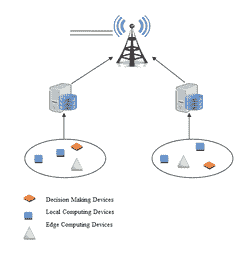
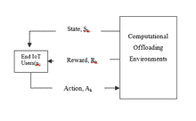
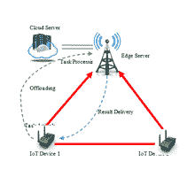
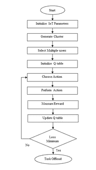
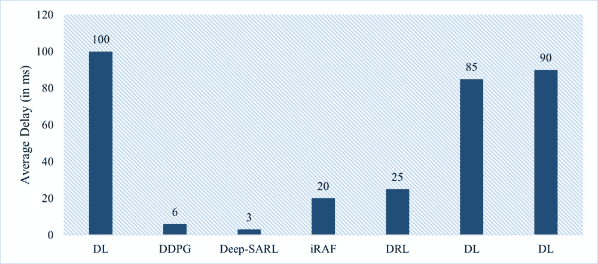

# 第三章

# 使用深度强化学习对边缘物联网网络进行任务卸载

+   普拉迪普·贝迪

    

    加尔各答大学，印度

+   苏博特·古奥尔

    

    马来西亚城市大学

+   贾格内什·库马尔

    圣安德鲁斯理工学院和管理学院，印度

摘要

边缘计算是一种分布式计算，专为物联网（IoT）用户设计，以在用户设备附近提供计算资源和数据管理。通过为物联网引入边缘计算，网络在处理实时应用时减少了带宽和延迟问题。边缘计算的主要好处是减少了物联网用户和服务器之间的通信开销。随着物联网融入我们的日常生活，它吸引研究人员关注其性能管理，如复杂性最小化、延迟最小化、内存管理、能量消耗最小化等。在本章中，我们重点关注使用深度强化学习最小化物联网用户端的计算复杂性。任务卸载决策过程是使用 Q 学习设计的，这可以最小化系统成本和高维数据的诅咒。此外，与现有算法相比，所提出的方法在系统成本方面表现更佳。

引言

“物联网”（IoT）这个术语明确地指的是那些可以轻松识别的、在互联网结构中的对象、物品和事物，它最早是在 1998 年被提出的（刘等人，2020 年）。近年来，由于一些具有代表性的应用（例如，温室智能监控、读取电表、远程医疗和智能交通监控等），物联网的概念变得流行起来。通常，物联网有四个主要组成部分——传感器、数据处理、应用和服务。新时代的应用，如智慧城市、智能教育系统和智能产业等，都是与物联网（IoT）集成在一起的（Anand 等人，2021 年）。物联网架构由传感器、执行器和网关等物联网设备组成，这些设备用于收集数据并进行计算（刘等人，2020 年）。

随着技术的进步，每天在硬件和软件方面都有新的创新，这有助于物联网网络和它们的应用增加。大规模使用物联网设备导致数据处理和存储需求增加（Alfakih 等人，2020）。例如，采用智能农业需要许多传感器、计算设备来监测温度、湿度、pH、光照、营养水平等，这些都是植物正常生长和发育所必需的。在物联网网络场景中，这些数据由部署的传感器生成，并通过网关设备收集，然后发送到云服务器端进行数据处理（Wang 等人，2019）。

在动态和实时的信道环境中处理如此大量的数据时，会出现一些需要解决的问题。在智能农业的情况下，首先需要解决的问题是如何定位传感器，以便它们可以覆盖最大面积。另一个问题是，大多数农场位于城市外部，那里互联网服务有限，且无法始终连接到远程服务器。这个问题可以通过将物联网云架构与边缘计算集成来解决，这种集成可以提供解决此类问题的有希望的方法（Wang 等人，2019）（Alelaiwi，2019）。在物联网网络中出现的另一个问题是，这些部署的物联网传感器需要向边缘服务器提供大量的处理服务，这给无线电服务和存储服务带来了负担。因此，需要开发物联网设备，使它们能够在本地处理一些简单的数据处理任务。因此，为了在边缘-物联网网络中快速和最优地处理大量数据，需要设计一个最优的计算任务卸载方案（Chen 等人，2020）。

用户设备在权衡连续或其他指标的情况下处理一些计算密集型程序，并通过无线传输将这些数据处理任务上传到边缘服务器，这一过程被称为任务卸载。处理程序为这些上传分配一定的计算资源给边缘服务器，以获取持续或渐进的替换，从而提高用户参与度。选择是否卸载的根本方面，即卸载选择，通常是计算机卸载和资源分配的初始部分。本文中将终端设备视为代理，对这些设备是否应将计算任务卸载到边缘设备进行判断。计算资源分配问题被构造成此框架的总成本延迟，以解决资源分配和任务卸载。在本文中，提出了一个最优的计算卸载选择，并使用强化学习来解决这些问题。

强化学习是人工智能的一个分支。无监督学习和监督学习的主要区别在于，无监督学习不涉及人工标签。探索未知领域和应用之前获得的知识是游戏的核心。强化学习通过不断的尝试和错误，与环境的持续互动，以及从环境中接收奖励或惩罚，然后获取知识以升级其自身的范式。它学会了新的行为策略。在特定时期的训练后，它可能会根据环境变量做出判断，以最大化长期利润。强化学习现在可以处理高维动作和状态，学习效率大幅提高，并在一定程度上打破了强化学习的限制。深度强化学习技术将用于解决边缘计算中的任务卸载问题，使模型适应性地学习卸载决策。

但在现有深度学习模型中仍然存在一些问题，例如：

IoT/边缘兼容性：随着边缘计算和物联网的普及，一个新的边缘范式已经出现，人工智能被集成到边缘。三层设计的物联网-边缘 AI 集成使用多个级别在边缘服务器和云服务器上进行 DNN 处理。DNN 的前层位于边缘服务器上，后层位于云上。当将 AI 集成的物联网输出边缘卸载到云时，如何在物联网边缘部署深度神经网络（DNN）是一个重要考虑。

异构性兼容的卸载：在关于卸载模型的早期研究中，大部分假设计算都是相同类型的。由于这一点，卸载建模变得容易。建模因责任范围广泛而变得更加困难。计算单元本身可能是变异性（硬件）的来源。

移动性兼容的卸载：为确保服务连续性和服务质量（QoS）标准，节点必须向另一个边缘/雾域进行切换。如果任务正在卸载到虚拟机容器，那么问题就是这个虚拟机是否应该移动到新服务器上。这个问题源于迁移成本与减少延迟和通信成本的好处之间的权衡。此外，动态虚拟机迁移和最优卸载决策需要预测技术。在移动性背景下，由于这些特性，卸载建模更加困难。

边缘计算

边缘计算是一种分布式方法，旨在处理物联网网络的任务处理和数据管理。这些计算资源部署在物联网设备附近，旨在减少响应时间，并减少处理互联网上的实时应用所需的整体带宽要求。其主要好处是减少了物联网用户与云服务器之间的通信差距（Wei 等人，2018 年）。利用边缘服务器进行任务卸载已吸引研究人员探索提高物联网网络性能的新前景，以处理计算复杂性。为此，需要减少延迟、任务卸载、存储管理、功耗等。通过实施边缘计算可以实现这些目标。但是，随着每天数据量的增加，仍然需要更多的进步，这需要更快的处理速度。由于本地计算不可能始终进行，因为物联网设备具有有限的电池电量和计算资源（Higuchi 等人，2019 年）。

因此，为了支持实时高延迟消耗的物联网应用程序，需要减少边缘服务器的卸载复杂性。卸载算法关注满足不同资源需求应用程序的服务质量（QoS）要求（Khayyat 等人，2020 年）。由于仅分配给网关设备的频谱有限，它们无法处理大量的计算任务（Li 等人，2020 年）。因此，一些研究人员实现了聚类概念，将物联网设备分组以根据其集群处理需求。这些集群是根据其计算需求制定的（Guo 等人，2019 年）。

随后，需要优化任务卸载，以处理物联网边缘计算网络的主要问题和挑战。传统的卸载方案不能为动态环境提供最优决策（Zhang 等人，2018 年）（Wang 等人，2019 年）。许多研究人员提出了动态任务卸载算法，如马尔可夫决策过程（MDP），通过与环境参数互动。但是 MDP 一次只能处理一个任务。此外，强化学习显示了其解决 MDP 问题的有效性，但仍然需要使学习过程更加适应信道环境（Zhang 等人，2019 年）（Chen 等人，2019 年）。

使用强化学习进行计算卸载

强化学习是一种最优的学习过程，通过与环境的交互来学习通道状态。在边缘-物联网网络中，每个物联网用户被视为代理，他们的需求被视为环境。如图 1 所示，为设计云-边缘-物联网计算网络给出了三层架构。有许多物联网网络与边缘服务器相连。每个物联网网络由大量物联网用户、网关设备（或边缘设备）组成，可以从物联网用户那里收集数据。这些网关设备在特定的覆盖区域内从物联网用户那里收集数据，并在配备有限存储容量和计算资源的边缘服务器上处理它们。因此，这些设备，无论是网关还是边缘服务器，都可以同时允许有限的处理，因为每个物联网用户都有不同类型和大小的任务。这些计算资源配备了有限的资源和电池电量，所以，需要最优的任务卸载来提高整个网络的性能和寿命。

在图 2 中，通过强化学习说明了边缘-物联网任务卸载方案。在这个架构中，每个代理，物联网用户（u[i]），在时间实例（k）具有状态（S[k]）和行为（A[k]）来根据环境参数给出的决策策略确定计算模式。因此，如果环境发生变化，观察到新的状态（S[k+1]）和新的奖励 R[k]。

强化学习包括以下元素：

+   • 代理：这些都是终端用户，物联网设备，可以执行某些操作。

+   • 环境：这些是决定代理奖励的确定性参数。

+   • 状态：状态探索环境状态，如通道增益、队列状态、计算能力等。

+   • 策略：策略定义了代理在给定时间的行为方式，或者可以说策略是从环境的态到代理在环境中采取的动作的映射。

+   • 奖励：奖励可以决定一个代理是否可以卸载任务。为此，实施了强化学习。对于任务卸载，每个代理在学习过程中最大化奖励。在边缘计算中，为了根据电力、时间和空间最小化系统计算成本，采用了负奖励来做出正确的决策。

+   • 动作：每个物联网用户执行的动作是为了选择本地计算还是卸载。

| 图 1. 带有边缘计算和卸载方案的物联网网络 |
| --- |
|  |
| 图 2. 物联网用户的强化学习 |
|  |

相关研究

Liu 等人（2020 年）研究了物联网（IoT）网络中边缘计算的资源分配机器学习方法。在这项工作中，通过分配用户优先级提出了一种面向物联网用户的集中聚类方法。选择最高优先级的集群并将其分配给边缘服务器卸载其任务，而优先级最低的任务可以在本地计算其任务。通过考虑所有 IoT 用户为代理的马尔可夫决策过程进行分布式任务卸载，并做出一系列任务卸载决策。根据通道动态基于成本效益设计的策略。在此方法中，使用深度 Q 网络对高维任务学习最优策略。

Alfakih 等人（2020 年）提出了一个使用深度强化学习方法设计的算法，用于从物联网用户到边缘服务器的任务卸载状态-动作-奖励策略。通过最小化与时间延迟和能量相关的系统成本执行最优卸载决策。

Wang 等人（2019 年）提出了一个面向车联网雾-云网络设计的任务卸载算法。目标是最小化车辆的能耗和计算资源。将 NP 难题表述为卸载问题的优化。

Alelaiwi 等人（2019 年）提出了一种利用深度学习预测反应时间的结构，并研究如何将基于深度学习的反应时间预测系统的利用情况卸载到决策中，以决定是否在云枢纽、附近的雾/边缘枢纽或附近的邻居雾/边缘枢纽、附近的雾/边缘节点或邻居雾/边缘节点卸载。此外，还应用了有限玻尔兹曼机学习来处理资产访问的不规则性。

Chen 等人（2020 年）提出了一种物联网与边缘服务器之间卸载任务的算法，并将其命名为智能任务卸载算法（iTOA）。与现有算法相比，iTOA 通过使用蒙特卡洛树搜索（MCTS）来决定网络当前状态下的卸载活动。为了提供快速的搜索设施，将 MCTS 算法与深度神经网络（DNN）合并。

Wei 等人（2018 年）分析了一个由多个移动设备组成的系统，这些设备旨在将上传任务执行到 MEC 服务器，并且在一个单细胞中，因此将有限的服务器与无线信道适当的分配成为一个问题。作者因此为移动设备上的能量和任务设计了一个优化问题，以便它们能够有效划分。选择最大节省能量优先（SMSEF）算法作为关键算法使用。

樋口等人（2019 年）研究了一种虚拟边缘服务器及其与多车辆的兼容性，但他得出结论称，在其早期开发阶段，其可行性需要更多关注。该论文的最终模拟结果显示，对于车辆，水平卸载形式可以将近边缘计算结构上的峰值负载减少近 53%。在研究期间，V2V 通信技术的渗透率保持在较低水平。

哈亚特等人（2020 年）专注于多层次的车载边缘云网络，并为此提出了一个先进的基于深度学习的算法。主要关注点是实现能量节约和有效利用车辆共享的资源，这是通过实现计算约束卸载的集成模型来实现的。通过实现资源分配的二进制公式，减少了时间和能量消耗。然而，由于问题的维度问题，这种解决方案是 NP 难的，因此非常复杂/难以解决。因此，作者开发了一种类似的强化学习方法，并提出了基于神经网络的分布式深度学习算法，以最终实现卸载决策的最优解决方案。

李等人（2020 年）提出了一种深度强化学习计算方法，以解决边缘计算服务器（ECS）在混合计算资源方面的复杂计算卸载问题。该研究的主要关注点包括网络状况和任务特性等。设计了演员梯度策略，以选择任务卸载的改进选项。考虑到执行多个任务、边缘子网的异质性以及边缘任务的多样性，所提出的计算方法能够熟悉网络并创建计算卸载选择以限制分配延迟。

郭等人（2019 年）和贝迪等人（2021 年）专注于通过降低 MDs 的费用来提高运营收益。由于计算需求根据地区而变化，且计算边缘服务器的可用性存在差异，因此无法选择传统的方法来实现目标。为了解决这个问题，论文得出结论，我们可以在时间变化的 UDN 场景中开发有效的计算资源策略和卸载任务配置文件。作者得出了一种基于深度 Q 网络的解决方案。

在物联网网络中，随着边缘计算的出现，给研究人员和开发者带来了许多挑战，包括动态计算卸载方案设计、计算资源、频谱资源及其分配，以及传输电力控制。研究发现，这些挑战很难独立解决，因为边缘服务器的计算卸载方案设计需要了解网关的资源以及终端用户的传输功率能力。已有研究集中于能够在边缘服务器处理多个资源的计算卸载方案，特别是在 MEC 框架中。在物联网网络中使用任务卸载方案时，功耗和延迟是两个主要关注的问题。因此，许多研究者提出了能够处理能量需求和延迟的优化任务卸载方案，如 MEC 系统。但是，基于 MEC 的任务卸载一次只能处理一个用户。随后，通过使用深度强化学习在 MEC 框架中实现了多用户框架。然而，这些算法在同时优化处理多用户多任务方面并不高效。

为了达到系统的阈值结构，本研究验证了最优的任务卸载策略。通过利用聚类优化算法将物联网用户划分为不同组别，这作为任务卸载方案设计的第一步。通过使用分布式计算任务卸载算法，实现了功耗、时间和系统成本的降低，以及执行延迟的显著减少。表 I 中描述了不同作者对工作的各种贡献。

鉴于之前的研究，以下主要问题被列出：

+   • 马尔可夫决策问题（MDP）的一个主要问题是，它只能与单个用户和任务调度一起使用。

+   MDP 虽然能带来最有效的价值，但同时也可能产生时间上的约束问题。

+   • Q 学习是一种可以用于解决 MDP 问题的方法，但它可能会遇到诸如高估函数等问题。在一些随机环境中，著名的强化学习算法 Q 学习表现非常差。这种低效的表现是由于动作价值的巨大高估。这种高估是由于正偏误导致的，因为 Q 学习使用最大动作值作为最预测动作值的近似。

表 1. 提供了物联网网络中任务卸载的各种方法的比较研究

| 作者 | 描述 | 结果 | 缺点 |
| --- | --- | --- | --- |
| 刘等人（2020 年） | 具有马尔可夫决策过程的深度强化学习方法 | 优化了物联网用户的聚类，从而实现了最优的能源成本。 | 不适用于同时处理多个用户。 |
| 李等人（2020 年） | 深度确定性策略梯度 | 最小化任务延迟 | 未考虑能源成本消耗。 |
| Alelaiwi 等人（2019 年） | 深度学习用于预测响应时间 | 提高了计算卸载的性能 | 时间约束问题 |
| Xiaolan 等人（2019 年） | 用于优化任务卸载的贪心 Q 学习算法 | 在考虑整个网络的能量消耗和延迟要求的情况下，实现了更好的任务卸载性能。 | 不适用于同时处理多个用户。 |
| 陈等人（2019 年） | 深度强化学习方法 | 提高了服务延迟性能 | 没有预测模型，也不适用于大规模物联网场景 |
| Min 等人（2019 年） | 基于快速深度 Q 网络（DQN）的卸载方案 | 在足够长的学习时间后，产生最优的卸载策略 | 本地功率控制和卸载决策问题 |
| 张等人（2018 年） | 提出了考虑成本和能量的计算卸载任务，使用深度强化学习。 | 估计了能源和成本 | 无法为多个用户优化服务 |

• 提议的工作

在迈向数字化的世界中，小型移动设备能够执行小规模和中等水平的计算问题，但没有能力处理高强度的计算过程。然而，在网关处卸载计算过程可以成为解决这一问题的关键方案之一。考虑到 x 个物联网设备在边缘卸载 T[x] 任务的同时能够执行这些任务，整个计算模型可以总结为以下三个步骤（图 3）：

+   • 所有 x 个物联网设备通过利用各种传感器在边缘计算节点处携带和传递足够的输入信息，并将结果发送到物联网、终端设备。

+   • 边缘计算节点应将其计算资源的一部分分配给 x 个物联网设备任务的计算。

+   • 计算完成后，结果通过边缘服务器发送到物联网、终端设备。

| 图 3\. 物联网任务卸载 |
| --- |
|  |
| 图 4\. 提出的任务卸载流程图 |
|  |

为了处理序列学习并实现决策制定，机器学习如强化学习（RL）可以作为决策代理人，帮助获得累积奖励的目标（刘等，2019）。该过程具有许多关键优势，如节能、快速卸载、低惯性和理想的负载分布，因此它是远程通信未来数字化的关键竞争者。正在进行的研究和检查依赖于 MEC 框架中适当的有效卸载和任务分配。资源分配方案被视为部分卸载方案。

proposed work is performed in following steps (figure 4):

+   • 步骤 1：将输入证明为任务，并与相应的 IOT 用户相对。

+   • 步骤 2：生成 IOT 用户簇。

+   • 步骤 3：确定每个簇的 IOT 用户优先级（多个）。

+   • 步骤 4：使用 Q 学习算法训练深度强化网络。

+   • 步骤 5：按照上述步骤，下一步是卸载任务。

+   • 步骤 6：评估和确定性能参数。

讨论

在本节中，本文提出了一些现有研究的比较分析，展示了深度强化学习在边缘计算中任务卸载的效率。表 II 显示了现有技术和平均毫秒的比较分析。阿里等（2021）提出了深度学习技术，平均延迟最大，即 100 毫秒。李等（2020）提出了 DDPG 技术，平均延迟为 6 毫秒。陈等（2019）提出的另一种技术具有最小的平均延迟，为 3 毫秒。陈等（2019）使用 iRAF 的平均延迟为 20 秒。刘等（2019）提出了基于 DRL 的方法，平均延迟为 25 秒。侯赛因和穆萨（2020）也提出了深度学习技术，平均延迟为 85 和 90 毫秒。本文讨论了与雾计算相关的几个基本问题，包括结构、接口和编程、卸载处理、有效资源提供和安全方面。在先前的出版物中已经开发了各种优化方法，以解决此类处理和传输延迟约束。以延迟为限制，提出了基于 Q 学习优先级的任务卸载策略，以最小化通信系统和计算中的能量消耗。

表 2. 比较分析

| 参考文献 | 技术 | 优化 | 平均延迟（毫秒） |
| --- | --- | --- | --- |
| 阿里等（2021） | DL | MCC | 100 |
| 李等（2020） | DDPG | DRL | 6 |
| 陈等（2019） | Deep-SARL | DRL | 3 |
| 陈等（2019） | iRAF | DRL | 20 |
| 刘等（2019） | DRL | DRL | 25 |
| 侯赛因和穆萨（2020） | DL | ACO | 85 |
| 侯赛因和穆萨（2020） | DL | PSO | 90 |
| 图 5. 比较分析 |
|  |

结论

边缘计算因提供物联网消费者所需的计算能力而广为人知，因为物联网计算需要广阔的资源谱。此外，将计算活动发送到边缘服务器会消耗更多能量。因此，在物联网用户端本地节约能量是一个难题。这可以通过优化网络设计或路由策略来实现。本文的目的是总结在作业卸载方面已经完成的研究。为了克服卸载问题并在减少人力投入的同时部署一个智能决策支持系统，到目前为止已经提出了各种各样的算法、框架和预测模型。本文简要介绍了几种作业卸载方案及其局限性。根据文献综述，确定深度强化学习技术在降低计算工作量方面优于传统方法。此外，提出了一种基于改进的基于 Q 学习的深度强化学习方法，以在少量计算成本的同时管理多个用户和任务。这种可能与大多数类型的卸载（如车辆和移动卸载）一起使用的方法，将在未来得到实施。它还可以通过在多代理网络中使用来增强。

参考文献

Alelaiwi, A. (2019). 边缘云平台中计算卸载的高效方法。并行与分布式计算杂志，127，58-64。DOI:10.1016/j.jpdc.2019.01.003

Alfakih, T., Hassan, M. M., Gumaei, A., Savaglio, C., & Fortino, G. (2020). 基于 SARSA 的深度强化学习方法在移动边缘计算中的作业卸载和资源分配。IEEE Access:实用创新，开放解决方案，8，54074-54084。DOI:10.1109/ACCESS.2020.2981434

Ali, A., Iqbal, M. M., Jamil, H., Qayyum, F., Jabbar, S., Cheikhrouhou, O., Baz, M., & Jamil, F. (2021). 移动云计算中作业卸载优化和能量管理的高效动态决策任务调度器。传感器，21（13），4527。DOI:10.3390/s21134527

Bedi, P., Goyal, S. B., Sharma, R., Yadav, D. K., & Sharma, M. (2021). 无线体域网络中使用深度学习的大数据分类智能模型。在 Sharma, D. K., Son, L. H., Sharma, R., & Cengiz, K. (eds.)，《微电子学与电信工程》。网络与系统讲座笔记（第 179 卷）。Springer。DOI:10.1007/978-981-33-4687-1_21

Chen, J., Chen, S., Luo, S., Wang, Q., Cao, B., & Li, X. (2020). 无人机边缘计算网络的智能作业卸载算法（iTOA）。数字通信与网络，6（4），433-443。DOI:10.1016/j.dcan.2020.04.008

Chen, J., Chen, S., Wang, Q., Cao, B., Feng, G., & Hu, J. (2019). IRAF: 用于协作移动边缘计算物联网网络的深度强化学习方法。IEEE 物联网杂志，6（4），7011-7024。DOI:10.1109/JIOT.2019.2913162

Chen, X., Zhang, H., Wu, C., Mao, S., Ji, Y., & Bennis, M. (2019).

Guo H. Lv J. Liu J. (2019). 超密集边缘计算中的智能资源配置和任务卸载。国际无线和移动计算、网络和通信会议。10.1109/WiMOB.2019.8923227

Higuchi, T., Ucar, S., & Altintas, O. (2019). 将任务卸载到车辆虚拟边缘服务器。2019 年 IEEE 第 16 届移动自组织和智能系统研讨会，MASSW 2019，162-163。10.1109/MASSW.2019.00040

Hussein, M. K., & Mousa, M. H. (2020). 使用蚁群优化的高效物联网应用任务卸载方法。IEEE Access: 实用创新，开放解决方案，8，37191-37201。DOI:10.1109/ACCESS.2020.2975741

Khayyat, M., Elgendy, I. A., Muthanna, A., Alshahrani, A. S., Alharbi, S., & Koucheryavy, A. (2020). 多级车辆边缘云计算网络的高级深度学习计算卸载方法。IEEE Access: 实用创新，开放解决方案，8，137052-137062。DOI:10.1109/ACCESS.2020.3011705

Li, Y., Qi, F., Wang, Z., Yu, X., & Shao, S. (2020). 基于深度强化学习的分布式边缘计算卸载算法。IEEE Access: 实用创新，开放解决方案，8，85204-85215。DOI:10.1109/ACCESS.2020.2991773

Liu X. Qin Z. Gao Y. (2019). 通过强化学习进行物联网网络中的边缘计算资源分配。IEEE 国际通信会议，1-6。10.1109/ICC.2019.8761385

Liu, X., Yu, J., Wang, J., & Gao, Y. (2020). 通过机器学习进行物联网网络中的边缘计算资源分配。IEEE 物联网杂志，7（4），3415-3426。DOI:10.1109/JIOT.2020.2970110

Min, M., Xiao, L., Chen, Y., Cheng, P., Wu, D., & Zhuang, W. (2019). 基于学习的计算卸载方法用于具有能量收集功能的物联网设备。IEEE 车辆技术 Transaction，68（2），1930-1941。DOI:10.1109/TVT.2018.2890685

Rajawat, Bedi, Goyal, Alharbi, Aljaedi, Jamal, & Shukla. (2021). 使用融合深度学习的物联网传感器应用的雾大数据分析。数学问题工程。DOI:10.1155/2021/6876688

Wang, X., Han, Y., Wang, C., Zhao, Q., Chen, X., & Chen, M. (2019). 边缘 AI：通过联邦学习智能化的移动边缘计算、缓存和通信。IEEE 网络，33（5），156-165。DOI:10.1109/MNET.2019.1800286

王**X.**, 魏**X.**, & 王**L.** (2019). 车联网中基于深度学习的能量高效计算卸载方法。中国通信 , 16(3), 81–91。DOI:10.12676/J.CC.2019.03.008

魏**F.**, 陈**S.**, & 邹**W.** (2018). 移动边缘计算系统中任务卸载的贪心算法。中国通信 , 15(11), 158–170。DOI:10.1109/CC.2018.8543056

张**C.**, 刘**Z.**, 顾**B.**, 矢野**K.**, & 田中**Y.** (2018). 一种基于深度强化学习的成本和能量感知的多流移动数据卸载方法。日本电气通信协会期刊 on Communications , 101(7), 1625–1634。DOI:10.1587/transcom.2017CQP0014
