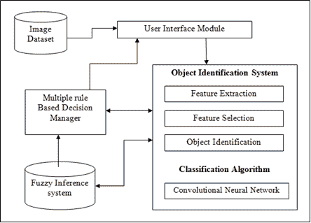
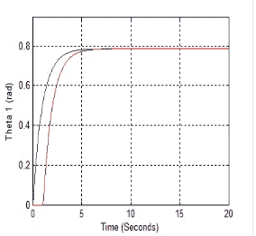
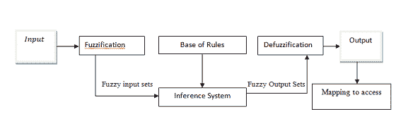
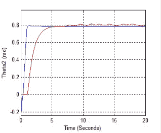
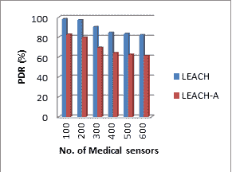
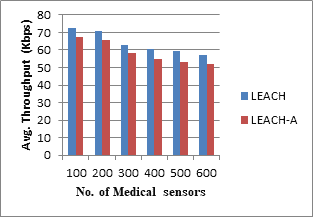
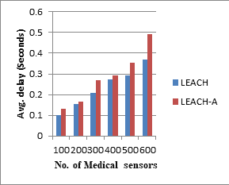

# 第四章

# 使用模糊推理系统在远程辅助机器人手术中进行目标识别

+   梅哈纳·P·洛汗德

    印度皮姆普里钦查德瓦德工程学院

+   迪普蒂·杜雷什·帕蒂尔

     [`orcid.org/0000-0001-7379-863X`](https://orcid.org/0000-0001-7379-863X)

    印度普恩市 MKSSS 的 Cummins 工程学院

摘要

尽管远程医疗至今仍在实践，但高速连接和提高的组织能力使得可以远程操作医疗设备，即远程机器人手术。这些技术有许多好处，包括提高性能和能够到达地理隔离的地方进行复杂手术，而这些地方又没有经过培训的外科医生。本研究提出了一种早期机器人解决方案，用于在复杂且不可预测的环境中执行有限的遥操作任务。因此，研究受到了未来人机协作的启发。它专注于限制或防止机器人与其环境之间的意外事故。为了在有限的空间内访问机器人手术设备，使用了模糊控制方法。我们可以推断，一个能够在有限任务的同时响应不可预测和动态环境中的外部因素的适应性机器人系统是潜在可行的。

引言

在过去的二十年里，遥控机器人系统因其众多的医疗和非医疗用途而吸引了众多人的注意。机器人出现在医学领域开辟了新的发展机会，不仅在手术精确度和舒适度方面，而且在患者受益方面也是如此。在健康应用方面，可以区分出两大类：远程控制手术和遥控康复机器人系统，这两者都在改善医疗保健交付方面显示出巨大的潜力。遥控手术在这一领域已经得到了广泛的研究和推广。遥控系统显著增强了人类的感觉运动能力。人类实现 increased sensorimotor abilities 的能力，使他们能够从远处连接事物和地方（Mehrdad 等人，2021）。在图像分析、机器学习和自动化领域的研究人员已经转向几何技术来收集和分析图像，这是由于在记忆和处理能力方面最近技术的发展。在自动化和沉浸式虚拟现实研究中，信息技术被用来在临床成像、实际监控、自动化和计算机辅助制造方面提供高效的解决方案（Thilahar & Thilahar，2019）。

传统的机器人辅助系统由主机模块和从机模块组成。人类操作者将控制主机单元，从机系统将遵循主机机器人的动作与环境互动。在手术过程中，手术区域通常是患者身体上正在接受手术的部分。操作者将得到来自手术区的感觉信息反馈。领导者机器人重复给操作者的感觉信息使她/他能够完成手术。实际上，人机协作最严重的担忧是安全问题（Haddadin & Hirzinger，2010 年；Haddadin 等人，2009 年）。

远程医疗手术的必要性是远程机器人手术的主要推动力。远程位置的医院通常在全球范围内拥有有限的资源和熟练的医生。这项成功的研究展示了使用远程机器人设备在农村和资源不足的地区进行远程手术的可行性和可能性。在这种情景中的根本问题是较大的延迟。尽管这些启发性的测试，但目前的标准实践要求患者和外科医生在同一所医院。机器人解决了由于安全顾虑而无法先前完成的绝大多数任务（Bauer 等人，2008 年；Hägele 等人，2002 年）。研究人员在 2017 年设计了用于手术应用的远程操作工业操纵器的架构时，解决了安全的人机交互难题（Capolei 等人，2017 年）。该研究的目的是通过患者皮肤上的小切口正确且安全地插入和定位一根长而轻的手术器械——腹腔镜，作为工具运动的支点点。这最终使人类交互的想法以及设计一个在处理如此敏感和不可预测的情况时反应灵敏且足够安全系统的想法受到了质疑。这个挑战性的问题需要一个能够实时管理多个事件的精心组织的架构设计。远程手术提供了“无需专家亲自访问即可实现全球医学专业知识的交流”的能力。另一个使手术机器人吸引人的原因是它们能够帮助外科医生进行训练。除此之外，还发现人类协作可能会导致工作场所事故大幅减少以及各种经济行业生产过程的优化（Bauer 等人，2008 年；Kaplan 等人，2016 年）。

在实施远程手术时，要求最小的时间延迟——即发出指令、执行手术和屏幕上获得视觉确认之间的时间间隔——一直是实现具有临床效用的远程机器人手术中最困难的问题之一。多个变量会影响这种延迟，包括将视频和动作转换为合适信号所需的时间以及通信网络本身的延迟。本研究提出了一种初步的、安全的机器人解决方案，用于在动态和不可预测的环境中执行有限的遥操作任务。文章解释了所开发的控制架构，该架构在其模块化结构中融入了控制理论、计算机视觉和决策理论等多个学科的专业知识。实验是在模拟系统上进行的。一个基于规则的属性管理着系统中的所有组件。

在第二部分中，本文致力于相关研究。这一部分描述了机器人辅助手术中决策过程的背景研究。第三部分描绘了对象识别的系统架构。文章的第三部分在第四部分集中于结果和讨论。我们将在第五部分完成文章的结论。

相关研究

高级分析、模式识别、智能系统和物联网只是现代方法中的一部分，它们可以帮助改善医疗应用程序（Abdelaziz 等人，2018 年；Ali 等人，2018 年；高等人，2018 年）。人工智能技术，如机器学习，也通过分析可访问的大量医疗数据，帮助医疗专家完成任务。数据分析已经显示出在健康数据中找到模式和隐藏方面的潜力，从而通过有效的决策提高医疗质量（Mehta & Pandit，2018 年）。在医疗应用程序中使用云提供了一种处理和共享医疗报告的方式，以及更具适应性地提供新的医疗服务（Casola 等人，2016 年）。整合机器人辅助系统的目的是在减少人工干预的同时，提供一定程度的用户灵活性。这个统一系统采用数据挖掘方法来构建和发展能够在医疗环境中操作的计算机。物联网和机器人已被广泛用于解决各种医疗挑战，范围从在手术中远程支持医生（Akkas 等人，2020 年；Joseph 等人，2017 年；Postolache 等人，2020 年）。

此外，它通过减轻医疗人员的常规职责，释放他们的压力，使得适当的程序比以前更好、更经济。使用机器人可以提高准确度，减少人为错误。在许多医疗应用中，机器人需要不断移动。在这种情况下，机器人必须找到到达目标的最佳路径，同时避开拥挤地点的障碍物。因此，确保有效的导航是许多研究的主要关注点（侯等人，2020 年）。这是因为典型的机器人无法处理具有随机移动性的人的动态环境。此外，由于人们的不可预测移动，避免机器人环境中的碰撞是具有挑战性的，尤其是在受限地点操作时。许多研究已经最近发现了机器人系统障碍检测的主题（安等人，2018 年；弗拉加-拉马斯等人，2019 年）。在这种情况下，物联网被用来进行物理交互（Safeea 等人，2019 年）。该设备采用基于地图的导航系统，在生成周围环境的地图的同时，同时跟踪其位置。当有许多机器人参与医疗环境时，它们之间具有额外连接方式是至关重要的（罗德里格斯-洛萨达等人，2005 年）。其目的是在网络连接较弱的情况下，防止机器人环境中的错误信息。物联网启用的机器人成为残疾人和需要特别照顾的老年人的伴侣（阿里和塔普斯，2014 年）。尽管在机器人系统中广泛使用设备到设备接口，但整合智能系统可以提高人机交互的效率。在（沙里夫和阿尔西拜，2017 年）的研究中，研究人员提出了一种“Nao 机器人”，它可以评估临床数据并与患者沟通。与机器人互动后，患者将能够解释自己身体的生命体征，并对自己健康状态做出假设。此外，它还可以估计未来心脏病发作的风险，并开出处方以减少医疗风险。

许多研究已经在一个智能机器人系统上应用于多种场合，包括内窥镜检查（Akimana 等人，2016 年；Guntur 等人，2019 年；Lehman 等人，2008 年）。在（Ishak 和 Kit，2017 年）的研究中，研究者创建了一个可以帮助医生在手术时照顾病人的机器人手臂。可以使用手势和姿态信息来操作机器人手臂。在（Su 等人，2020 年）的研究中，描述了创建一种基于物联网的协作控制技术，用于机器人辅助微手术。该方法可以以计划的方式处理多个任务，并在手术期间调节移动限制和碰撞。最近，物联网系统已经开始使用触觉技术（Sreelakshmi 和 Subash，2017 年）允许外科医生通过机器人界面从隔离区远程处理病人（Kim 等人，2018 年）。此外，网络连接问题和服务质量（Guntur 等人，2019 年）可能会阻碍将网络用于连接多个机器人和医生的使用。这可能会对手术治疗的精度和成功产生重大影响。

许多研究者已经在特征识别、分割和虚拟区域（Ganapathy 等人，2016 年；Kanimozhi 等人，2018 年；Sarakoglou 和 Tsagarakis，2012 年）领域取得了一定的成果。在（Ramesh 等人，2015 年）中，研究者改变了模糊成员函数，该函数用于在模糊集合上集中融合检测系统。在（Banga 等人，2011 年）设计了一种基于模糊规则的无线通信最优路由。他们提高了网络的寿命和传输性能，这是由于应用了模糊逻辑和智能原则。在（Kumar 和 Dhiman，2021 年）的研究中，探讨了一种基于规则的方法来预测相关信息，以及用于确定系统鲁棒性的模糊集的数学方程。在（Chatterjee，2021 年）的研究中，强调了在人工智能领域进行知识产权保护的重要性。利用机器学习方法，（Vaishnav 等人，2021 年）描述了 COVID 19 分析分析的模型。在（Mule 等人，2021 年）的研究中，简要概述了人体呼出的气息。利用 5G 网络进行远程手术的研究由（Lokhande 和 Patil，2020 年；Meshram 和 Patil，2020 年）的研究者提出。

系统架构

在医疗领域，机器人可以用来监测病人的健康状况或识别健康问题。在任何情况下，机器人首先要从多个传感器收集健康数据。在提供相关信息之前，这些数据需要经过一系列的处理过程。

去噪、预处理和阈值化都是提取过程中的步骤。再次，它通过向系统中融入更多感官能力来拓宽机器平台的能力。这增加了预测模型可访问的信息量，提高了精确估计的速度。适应性是指为系统准备意外事件、缺陷、环境情况的变化、活动或人类行为的能力。适应性可以通过使用之前描述的感知、智能和决策能力来实现。

机器人系统中的决策制定

机器人的移动对人类协作至关重要，因为在这样的不确定环境中，机器人必须不仅考虑自己，还要对其周围环境进行推理，以执行适当的动作。在考虑的问题中，机器人接到的指令必须涵盖各种场景，并且其执行受到许多上下文敏感决策的影响。例如，如果机器人正在等待下一个命令而出现问题怎么办？假设机器人正在等待下一个用户的指令，同时执行一个受限功能，如定位工具；机器人必须避免由于处理的物体脆弱或有害而与任何外部刚体发生碰撞。因此，机器人应该能够避免任何事故。如果机器人在移动时遇到障碍，它会停止并决定下一步行动。

决策制定有助于决定下一步行动。如图 1 所示的对象识别系统架构由七个主要组件组成：图像数据集、用户界面模块、对象识别系统、模糊推理系统、帮助在手术中做出决策的多条规则基础决策管理器。

|  |
| --- |
|  |

图像数据集：为了分析所提出的系统，使用了包含数百万张图像的常见基准数据集。

用户界面模块：此模块从数据集中接收所需数据，并选择应收集哪些数据以评估所提出的解决方案。获取的数据被提供给识别系统进行进一步的数据处理，以及为建议的结果提供多条规则基础系统。

对象识别系统：它由四个子系统组成：特征选择、分割、设备识别系统和分类子系统，其中分类子系统包括一种被称为卷积神经网络（CNN）的现有分类技术。更进一步，本文应用了一种现有的分类技术，即卷积神经网络，以成功地对图像数据集进行分类。这种分类技术中包含了一种遗传算法过程，该过程利用时间限制和时间模糊规则。

模糊推理系统（FIS）由一系列由人类操作者获得的语言条件语句组成，这些语句传达了关于被控制系统的信息。这些语句基于 if-then 逻辑定义了一系列控制动作（Passino & Yurkovich，1998）。

首先步骤是对每个输入进行模糊化，这通过将每个输入与一系列模糊变量关联来完成。对每个变量应用成员函数，以给出模糊变量的语义数值意义。三角形和指数形式是模糊逻辑控制中经常使用的两种连续成员函数。然后将模糊输入与模糊控制器的知识库配对，该知识库包含一组控制规则。去模糊化是必要的，以将模糊控制动作转换为准确的输出值。

图 2 显示了一个应用于伸展操纵器的模糊系统的块图。对话环境被分为输入和输出的模糊集，值范围从[-1, +1]。因此，使用了缩放增益来标准化控制系统。输出与访问权限映射，其中决定医疗设备的访问权限并在手术环境中相应地操作设备。

|  |
| --- |
|  |

多规则基础决策管理器：这绝对不是标准的过程化或面向对象的控制问题，机器人理解要做什么、如何做以及以什么顺序做。此外，系统必须能够快速响应变化的条件或故障。因此，研究人员转向基于规则的技术，该技术使用规则从事实中生成结论。规则是一个只适用于问题子集的命令，规则引擎确定在任何特定时间使用哪些规则并执行它们。基于规则的方法解决了适用于动态环境的高速且持续反应系统的需求；这样的系统能够根据场景和动态情况改变意图。此决策管理器有助于使用模糊规则基对来自对象识别系统的图像数据做出最终决策。

结果与讨论

主从式手术机器人的模型被置于模拟环境中。选择相应的信号将末端点放置在所需位置（Boucetta，2015）。模拟结果在图 3 和图 4 中显示。

|  |
| --- |
|  |
|  |
|  |

主从机器人的第一个 Z 角度 theta1 是稳定且稳步达到任务的。主机器人的第二个 X 角度 theta2 更快，而从机器人的则更慢，偶尔有波动。

这些系统需要处理从网络中众多传感器收集的大量数据。虽然患者对数据的安全性有所担忧，但他们已经表现出接受现代技术的迹象。本节描述了运行性能指标的结果。NS-2 参数用于设计系统。节点是用于手术室的医疗设备。在调查中使用了节点模拟，如摄像头、健康检查设备和其他医疗传感器。文章使用了诸如触觉输入、视觉数据和听觉数据等感官通道。

传感器网络是一个受到广泛关注和研究的概念。它不断扩展其边界，带来许多机会和挑战。对安全的担忧始终处于前沿。网络的快速增长也为攻击者提供了研究这项技术的潜在途径。最具破坏性的攻击形式之一就是分布式拒绝服务（DoS）。本工作中构建的系统采用了低能耗自适应聚类层次（LEACH）协议，簇头根据剩余能量做出决策（Lokhande & Patil, 2021; Passino & Yurkovich, 1998）。该协议在降低能耗的同时增加了网络的寿命。

| 图 5. 平均数据包投递率 |
| --- |
|  |
| 图 6. 平均吞吐量 |
|  |
| 图 7. 平均延迟 |
|  |

LEACH 协议被进一步开发以增加网络寿命并最小化数据包丢失。在这里，10%的节点作为攻击节点。使用 LEACH 模型在攻击节点存在的条件下，图 3、4 和 5 分别显示了数据包投递率（PDR）、吞吐量和延迟。蓝色线条表示没有攻击时的 LEACH 协议，而红色线条反映了存在攻击时的 LEACH 协议（LEACH-A）。

结论

该研究描述了一个智能自主的机器人系统，该系统能在动态外部刚体环境中平稳移动。该系统解决了通用的遥操作问题以及有限的动作。特别是，管理系统能高效响应外部干扰，同时遵守指定的约束。基于规则的决策系统的根本优势在于其能够迅速响应变化的情况或故障。整个视觉系统能够实时从现场获取有用的信息，过滤出机器人，并在可能发生事件时迅速通知高层结构。建议的研究旨在提高医疗领域网络的效率。医学研究主要集中在减少能源使用和提高节点寿命。由于物联网网络的动态特性，研究指出能源最小化是一个关键问题。然而，通过改善降噪或部署更多对象识别摄像头来提供多视角，性能可能会得到提高。

参考文献

11Abdelaziz, A., Elhoseny, M., Salama, A. S., & Riad, A. M. (2018). 一个用于在云计算环境改进医疗服务的机器学习模型。测量，119，117-128。DOI:10.1016/j.measurement.2018.01.022

20AhnH. S.，ZhangS.，LeeM. H.，LimJ. Y.，MacDonaldB. A. (2018). 使用多个机器人服务于多个患者的机器人医疗保健服务系统。国际社会机器人会议论文集，493-502。DOI:10.1007/978-3-030-05204-1_48

26Akimana, B.T., Bonnaerens, M., Van Wilder, J., & Vuylsteker, B. (2016). 物联网中的人机交互调查。学术出版社。

15Akkas, M.A., Sokullu, R., & Çetin, H.E. (2020). 使用物联网进行医疗保健和患者监测。物联网，11。

10Ali, O., Shrestha, A., Soar, J., & Wamba, S. F. (2018). 云计算使能的医疗保健机遇、问题与应用：系统评价。国际信息管理杂志，43，146-158。DOI:10.1016/j.ijinfomgt.2018.07.009

23AlyA.TapusA. (2014). 面向提升人机关系：定制机器人行为以适应人类档案。美国人工智能协会秋季研讨会系列（AIHRI）。

37Banga, V. K., & Kaur, J., Kumar, R., Singh, Y. (2011). 使用软计算建模和仿真机器人臂运动。世界科学院学报，75，614-620。

6Bauer, A., Wollherr, D., & Buss, M. (2008). 人机协作：一项调查。国际人力资源；人形机器人学杂志，5(1)，47-66。DOI:10.1142/S0219843608001303

45Boucetta, R. (2015). 远程手术：用于远程手术助手路径规划控制的自适应模糊方法。第 14 届计算机信息系统与工业管理国际会议。CISIM。

7Capolei, M. C., Wu, H., Andersen, N. A., & Ravn, O. (2017). 使用工业机器人臂定位腹腔镜摄像头。2017 年第三届国际控制、自动化和机器人会议(ICCAR)，138-1

14Casola, V., Castiglione, A., Choo, K. K. R., & Esposito, C. (2016). 云计算中的医疗保健相关数据：挑战与机遇。IEEE 云计算杂志，3(6)，10-14。DOI:10.1109/MCC.2016.139

39Chatterjee, I. (2021). 人工智能与专利性：回顾与讨论。现代研究国际期刊，1(1)，15-21。链接：https://ijmore.co.in/index.php/ijmore/article/view/2

19Fraga-Lamas, P., Ramos, L., Mond’ejar-Guerra, V., & Fern’andez-Caram’es, T. M. (2019).物联网深度学习无人机系统在自主障碍检测和碰撞避免方面的综述。遥感，11(18)，2144。DOI:10.3390/rs11182144

34Ganapathy, S., Vijayakumar, P., Yogesh, P., & Kannan, A. (2016). 一种基于智能条件随机场的特征选择方法，用于有效的入侵检测。国际阿拉伯 Journal of 信息技术，13(1)，64-74。

12Gao, J., Yang, Y., Lin, P., & Park, D. S. (2018). 计算机视觉在医疗保健应用中的进展。医疗工程杂志，1-4。

25Guntur, S. R., Gorrepati, R. R., & Dirisala, V. R. (2019). 机器人技术在医疗保健领域的应用：从医疗机器人互联网(IoMRT)的视角来看。在《生物信号分析和诊断成像中的机器学习》（第 293-318 页）。Elsevier。DOI:10.1016/B978-0-12-816086-2.00012-6

3Haddadin, A. A.-S., & Hirzinger, G. (2010). 人友好型机器人的安全性分析。国际社会机器人学杂志，2(3)，235-252。DOI:10.1007/s12369-010-0053-z

4Haddadin, S., Albu-Schäffer, A., & Hirzinger, G. (2009). 安全机器人需求：测量、分析与新见解。国际机器人学研究，28(11-12)，1507-1527。DOI:10.1177/0278364909343970

5Hägele, M., Schaaf, W., & Helms, E. (2002). 机器人助手在手工工作场所的有效合作与安全方面。第 33 届国际机器人学会议(ISR)，7-11。

18Hou, Y. C., Mohamed Sahari, K. S., & Yeng Weng, L. (2020). 为多个自主移动机器人开发碰撞避免系统。国际先进机器人系统杂志，17(4)。DOI:10.1177/1729881420923967

28Ishak M. K. Kit N. M. (2017). 基于物联网(IoT)的机器人辅助手术设计与实现。2017 年先进计算与应用会议(ACOMP)论文集，65-70。链接：10.1109/ACOMP.2017.20

17Joseph A. Christian A. Abiodun A. A. Oyawale F. A. (2017). 护理领域的人形机器人综述。国际数学和数学教育会议(ICMME-2017)论文集。

35Kanimozhi, U., Ganapathy, S., Manjula, D., & Kannan, A. (2018). 利用模糊时间规则构建的智能乳腺癌风险预测系统. 国家科学院学报. 在线(Bergheim) . 提前在线出版. doi:10.1007/s40009-018-0732-0

9KaplanK. E.NicholsK. A.OkamuraA. M. (2016). 走向手术中人与机器人协作: 在包含分割任务中的人和机器人代理的表现评估. 2016 年 IEEE 国际机器人与自动化会议(ICRA), 723–729\. 10.1109/ICRA.2016.7487199

31Kim, S. S. Y., Dohler, M., & Dasgupta, P. (2018). 技能互联网: 在机器人手术中使用第五代电信、触觉和人工智能. BJU 国际 , 122(3), 356–358\. doi:10.1111/bju.14388

38Kumar, R., & Dhiman, G. (2021). 通过模糊数进行模糊优化比较研究. 国际现代研究期刊 , 1(1), 1–14\. https://ijmore.co.in/index.php/ijmore/article/view/1

27Lehman, A., Berg, K., Dumpert, J., Wood, N. A., Visty, A. Q., Rentschler, M. E., Platt, S. R., Farritor, S. M., & Oleynikov, D. (2008). 合作机器人辅助下的手术. 计算机辅助外科 , 13(2), 95–105\. doi:10.3109/10929080801956706

43Lokhande, M. P., & Patil, D. D. (2020). 通过机器间通信测量远程机器人系统中的网络性能. 学术出版社.

47Lokhande, M. P

1Mehrdad, S., Liu, F., Pham, M. T., Lelevé, A., & Atashzar, S. F. (2021). 高级医疗远程操作机器人综述. 应用科学 (巴塞尔, 瑞士) , 11(1), 209\. doi:10.3390/app11010209

13Mehta, N., & Pandit, A. (2018). 大数据分析与医疗保健并行: 一项系统回顾. 国际医学信息学杂志 , 114, 57–65\. doi:10.1016/j.ijmedinf.2018.03.013

42Meshram, D., & Patil, D. (2020). 5G 触觉互联网在远程机器人手术中的应用. 第三界计算与网络通信国际会议. 计算科学 Procedia, 171, 2618–2625.

41Mule, N. M., Patil, D. D., & Kaur, M. (2021). 对人体内 exhaled breath (EB) 诊断疾病的研究方法的全面调查. 医学信息学解锁 , 26, 100715\. doi:10.1016/j.imu.2021.100715

44Passino, K. M., & Yurkovich, S. (1998). 模糊控制 . Addison-Wesley, Longman.

16Postolache, O., Hemanth, D. J., Alexandre, R., Gupta, D., Geman, O., & Khanna, A. (2020). 使用物联网和虚拟现实远程监测脑卒中患者的物理康复. IEEE 期刊精选区域通信 , 39(2), 562–573\. doi:10.1109/JSAC.2020.3020600

Ramesh, L. S., Ganapathy, S., Bhuvaneshwari, R., Kulothungan, K., Pandiyaraju, V., & Kannan, A. (2015). 使用相关反馈和重新排名提供相关信息的用户兴趣预测。国际智能信息技术杂志，11(4)，2。DOI:10.4018/IJIIT.2015100104

Rodriguez-Losada, D., Matia, F., Jimenez, A., & Lacey, G. (2005). Guido，用于虚弱视力受损者的机器人 SmartWalker。首届国际 Domotics、Robotics 和远程协助会议（DRT4all）论文集，153-167。

Safeea, M., Neto, P., & Bearee, R. (2019). 通过调整预先生成的路径，在线避免协作机器人操纵器的碰撞：一个工业用例。机器人与自主系统，119，278-288。DOI:10.1016/j.robot.2019.07.013

Sarakoglou, I., & Tsagarakis, N. G. (2012). 高性能触觉反馈显示及其在遥操作中的集成。IEEE 触觉 Transactions，5(3)，252-263。DOI:10.1109/TOH.2012.20

Sharif, M. S., & Alsibai, M. H. (2017). 基于 nao 机器人的医疗数据分析：一种向机器人实时与人体交互的自动化方法。在 2017 年第 7 届 IEEE 国际控制系统、计算和工程会议（ICCSCE）论文集，91-96。IEEE。

Sreelakshmi, M., & Subash, T. D. (2017). 触觉技术：关于其应用和未来前景的全面回顾。材料今天： Proceedings，4(2)，4182-4187。DOI:10.1016/j.matpr.2017.02.120

SuH.Ertug OvurS.LiZ. (2020). 基于物联网（IoT）的冗余操纵器协作控制，用于远程操作的微创手术。在 2020 年 IEEE 国际机器人与自动化会议（ICRA）论文集，9737-9742。IEEE。10.1109/ICRA40945.2020.9197321

Thilahar, R., & Thilahar, C. R. (2019). 模糊神经遗传方法在增强现实系统中的特征选择和图像分类。国际机器人与自动化杂志，8(3)，194-204。DOI:10.11591/ijra.v8i3.pp194-204

Vaishnav, P. K., Sharma, S., & Sharma, P. (2021). 对筛查 COVID-19 疾病的分析性综述分析。国际现代研究杂志，1(1)，22-29。

附加阅读

Lokhande, M. P., & Patil, D.

Lokhande, M. P., & Patil, D. D. (2020). 物联网 M2M 框架中的安全威胁。国际计算机科学和工程杂志，29(8)，1809-1823。

Lokhande, M. P., & Patil, D. D. (2021). 用于远程机器人手术的物联网 M2M 通信设备分类：综述。印度计算机科学与工程专业杂志，12(3)，618-628。DOI:10.21817/indjcse/2021/v12i3/211203102

Lokhande, M. P., & Patil, D. D. (2022). 通过改进物联网中的 LEACH 协议来提高能源效率。国际计算机科学与工程技术杂志，25(1)，1-10。

关键词与定义

适应性：系统能够在开放环境中自行配置。

决策管理器：它根据对象属性给出决策。

去噪：从原始信号中移除不需要的信号。

动态上下文：系统在改变节点行为属性下工作。

语义：为模糊变量提供意义。

不可预测网络：在这种网络中，设备在开放环境中持续工作。
