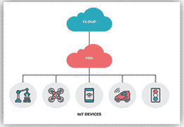
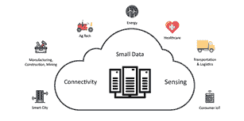
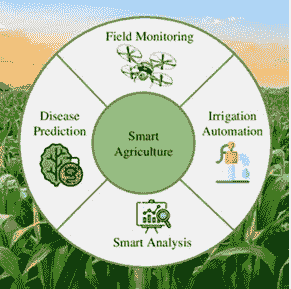
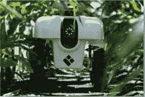
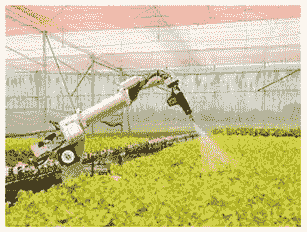
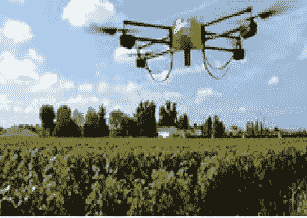

# 第五章

# 基于雾的物联网辅助智能农业应用

+   帕万·维希

    维韦卡南达专业研究学院，印度

+   莎玛·库瑟尔

    沙特阿拉伯贾赞大学

+   阿伦·维卢

    艾奎法克斯，美国

+   拉胡尔·雷迪·纳迪卡图

    美国卡姆贝斯大学

摘要

增加农业活动旨在实现智能农业或精准农业，这一点至关重要。网络的快速发展导致了基于物联网的农场管理系统。增加农业活动旨在实现智能农业或精准农业，这一点至关重要。现有的基于云的平台无法处理连接的物联网设备提供的巨大配额和多样数据，这些设备基于传统的云模型。将数据处理更靠近其输出的源头，以减少基于生成数据进行实时决策时的延迟，这一点很重要。采用基于雾的模型将解决此问题，并将在本章中讨论。为了确保实时决策中有最佳带宽使用和低延迟，基于物联网的雾农场管理系统可能更有能力。

引言

在雾计算中，数据、计算机、存储和应用程序位于数据源和云之间的任何地方，这是一个去中心化的计算基础设施（Whig 等人，2022 年）。雾计算，就像边缘计算一样，将云计算的好处和力量带到数据产生和执行的地方。因为两者都涉及将智能和处理移到数据产生的地方，所以有时会互换使用雾计算和边缘计算这两个术语。这通常是为了提高生产力，但也可能是出于安全或合规担忧（Anand 等人，2022 年）。

雾计算将云计算的力量扩展到信息产生和使用的更近地方。换句话说，更多的人可能同时留在互联网上（Alkali 等人，2022 年）。它提供相同的网络和云服务，但增加了安全和合规性。

+   ① 维韦卡南达专业研究学院研究院长

+   ② 沙特阿拉伯贾赞大学助教

+   ③ 研究员，Equifax 导演，亚特兰大美国

+   ④ 美国卡姆贝斯大学研究员

雾计算的特点

根据 IDC 的数据，到 2025 年，所有数据的 45%将在网络边缘创建，其中 10%的数据将来自手机、智能手表、连接的汽车等边缘设备（乔普拉和 WHIG，2022 年）。唯一能够经受住时间考验的技术被认为是雾计算，在未来五年内，它甚至可能超过人工智能、物联网应用程序和 5G。

它从传统的数据中心和云端的末端设备提供高度虚拟化的存储、计算和网络服务。低延迟、位置意识、边缘位置、互操作性、实时数据与云的连接以及支持在线云交互都是雾计算的特点（Chopra & Whig, 2022b）。

|  |
| --- |
|  |

雾应用需要实时交互，而不是批量处理，并且通常直接与移动设备接口（Chopra & Whig, 2022a）。雾节点也已在不同的上下文中使用，具有不同的形式因素。雾计算的基本原理如图 1 所示。

尽管在雾计算方面已经有很多发表和研究的成果，但各种雾计算参与者将来如何协同并不是简单可以说清楚的。然而，基于主要服务和应用的性质，可以明确地得出结论：订阅模型将在雾计算中发挥广泛的作用智能电网、智慧城市、互联汽车等。

全球服务的供应商预计将进行合作。新的参与者，包括运输提供商、汽车制造商、政府当局等，将进入雾计算领域。一些知名的雾计算玩家包括基于云的提供商，如 Apache CloudStack7、OpenStack6 和 OpenNebula8（Mamza, 2021）。

FOG 与边缘计算

云允许消费者快速轻松地访问计算机、网络和存储选项，但它是一个集中的资源（Bhargav & Whig, 2021）。这可能导致位于云远端的数据和设备性能问题和安全延迟。

边缘计算的目标是将数据源和设备拉近，消除处理时间和距离。原则上，这将进一步提高应用程序和设备的表现和速度（Khera 等，2021）。

雾计算，思科的一个术语，也将计算带到网络的边缘。它还指的是这一过程最佳运作的标准。雾计算、云和边缘计算的金字塔表示如图 2 所示。

|  |
| --- |
|  |

通过将存储和计算系统尽可能地靠近需要它们的应用程序、组件和设备，可以消除或显著减少处理延迟。这对于连接物联网的设备尤为重要，这些设备产生了大量的数据。因为它们更靠近数据源，所以在雾计算中这些设备的延迟要低得多（Velu & Whig, 2021）。

雾是标准，它允许在编辑框架内重复、结构良好、可扩展的性能，以考虑边缘计算与雾计算之间的区别（Whig, 2019a）。数据被创建、处理和

存储在边缘计算中，这是边缘计算的一种形式。边缘处理以及数据传输所需的基础设施和网络连接都是边缘计算的一部分（Whig，2019c）。

这是因为目标是在边缘和移动边缘计算中尽量减少延迟并提高效率，同时在不同位置处理数据。边缘通常出现在传感器连接设备和数据收集发生的地方——数据源和处理地点之间存在物理连接。边缘计算缩短了处理地点和数据源之间的距离，通过在 IoT 或边缘节点连接的局域网处理器上执行边缘计算活动来实现（Whig & Ahmad，2019）。这导致传感器与处理地点之间的物理距离更远，但不会有进一步的延迟（verma，2019）。

边缘计算的优势

以下是边缘计算的一些优势

最小延迟

将分析保持更接近数据源，特别是在垂直系统中，每秒都至关重要，防止系统故障、线路停电和其他严重问题。更快的警报和用户更少的风险以及时间损失意味着实时进行数据分析的机会。

| 图 3. 边缘计算的优势 |
| --- |
|  |

良好的带宽

在网络中保持良好的带宽。许多数据分析活动，甚至是重要的分析，并不需要云存储和处理的大规模。相连的设备不断为分析生成额外数据。绝大多数这些大量数据是通过边缘计算机传输以节省其他关键活动的带宽（Reddy，2019）。

运营成本

运营成本降低。网络带宽的本地处理和保留意味着运营费用降低。提高安全性。保护物联网数据在传输或存储期间非常重要[17]。用户可以使用相同的控制、策略和流程监控、防御并启用整个 IT 系统中的边缘节点。

信心

由于物联网设备通常在恶劣环境和紧急情况下使用，情况可能很严重。在这些情况下，边缘计算可以提高可靠性和减轻数据传输的负载。在不损害保密性的情况下加深洞察力（chouhan，2019）。您的团队可以本地检查收集、分析和存储数据的设备，而不是将敏感数据传输到云进行分析，从而冒着数据泄露的风险。这就是为什么边缘计算在数据安全和保密方面为更敏感的数据提供了更明智的选择。

敏捷性

增强业务的敏捷性。只有认识到消费者需要的资源、这些资源需要的位置以及需要帮助的位置，公司才能迅速响应消费者需求。雾计算使开发者能够根据需要快速创建和部署雾应用（Ahmed & Chaudhari, 2022）。雾计算技术还允许用户基于当前能力和基础设施，为他们的客户提供更专业的服务和解决方案，并找到处理数据和数据工具的最佳方式。

高度依赖数据传输包括雾计算问题。5G 网络的部署解决了这个问题，然而，可用性受限、速度降低、高频拥塞。在雾节点附近需要特别注意速度和安全（H. Sharma et al., 2016）。

雾计算的限制

由于雾计算与物理位置相关联，其中一些云计算的随时/随地优势受到了削弱。

安全性

在适当的情况下，雾计算可能面临安全挑战，例如互联网协议（IP）欺骗或中间人攻击（MitM）。

成本

雾计算是一个使用边缘和云资源的系统，这意味着硬件成本昂贵。

模糊的

尽管不同供应商对雾计算的定义有所不同，存在一些模糊性，尽管雾计算已经存在了好几年。

雾计算与物联网的关系

物联网和终端用户越来越强大。现在有很多数据立即在云上处理。图 4 显示了物联网设备与雾计算的关系（Whig & Ahmad, 2011）。此外，雾计算对物联网应用开发过程有许多优势：

| 图 4. 物联网下的雾计算 |
| --- |
| 图 4. 物联网下的雾计算 |

更大的业务敏捷性

您可以使用适当的工具创建和部署雾应用。设备可以像这些应用程序一样以用户的方式工作（Whig & Naseem Ahmad, 2012）。

提高安全性

雾计算作为设备的代理，限制其资源并升级其安全软件和凭证。它在不同部分的 IT 基础设施中使用雾节点，运用相同的策略、程序和控制。

数据处理是一个复杂的分布式系统，通过大量节点使其更容易检查接近链接设备的安全状态（Whig & Ahmad, 2014b）。

低延迟

你注意到 Alexa 问得有多快了吗？这是因为雾计算延迟最小。由于雾计算地理位置更接近所有用户（和设备），它能够提供即时答案。这项技术对所有时间敏感的活动都非常优秀。

网络带宽效率

雾计算允许根据应用程序、计算机资源和可用的网络进行快速有效的数据处理。信息片段在多个地方混合，而不是通过单一路线传输。

这减少了需要传输到云的数据量，节省了网络带宽，从而降低了成本（Bhatia 等人，2015 年）。

服务持续性

即使云服务的网络访问受到阻碍，雾计算仍能独立运行并提供持续服务。此外，由于有多个连接通道，实际断开连接几乎是不可能的。

用户体验提升

边缘节点运行更强的协议，如 Zigbee、Z-Wave 或蓝牙。雾计算使设备与最终用户之间的即时通信成为可能，不受网络影响，从而提升了用户体验（Whig & Ahmad, 2015 年）。

农业与农场雾计算

借助雾计算，农业企业已经获得利润并发生革命。SWAMP 项目代表智能水资源管理平台，在此背景下是一个非常值得注意的例子（Verma 等人，2015 年）。

水，占 70%淡水的使用，是农业业务的关键组成部分，使其成为最重要的消费者。通常，灌溉系统中的泄漏和应用方法导致现场灌溉系统的资源浪费。

传统的灌溉方式，如表面灌溉，浪费了大量水资源，仅仅对植物不易生长的区域进行浇水。局部灌溉则能更高效地利用水资源，防止过度灌溉或干旱。主要问题是农民为了防止干旱，会额外浇水。这不仅导致产量损失，还加剧了宝贵资源（Shridhar 等人，2014 年）的浪费。

因此，农民需要一种方法来应对这些情况并提供足够的回答。正是在这个时候，SWAMP 项目发现了物联网、数据分析、独立设备等问题。借助雾计算，SWAMP 为农业创建了一个智能水资源系统理念，确保水资源浪费降到最低（Whig & Ahmad, 2014c）。雾计算还使系统能够收集并分析来自现场的传感器数据，以提高水的分配效率。

SWAMP 项目发布了一篇关于智能农业环境概念的文章，其中收集并实时存储数据进行分析。文章讨论了采用雾计算过滤数据的两种不同方法（Whig & Ahmad, 2014a）。实验过滤了技术，并使用包含温度和湿度等测量值的实时数据包。Agrifog，智能农业或精准农业，是雾计算在农业中的另一种应用（Whig & Ahmad, 2013）。该软件使用 iFogSim 创建。

它通过数据处理来最小化实时情况下的决策延迟。IoT-Fog 是一个成本效益高且对从云和雾基础系统收集的数据进行比较分析的系统。

雾计算已经作为平台革命化了农业和农业产业，使农民能够减少浪费并理解和分析加工信息以确定从中受益的方法。

医疗计算与雾

在医疗行业，新技术经常被用来提高服务和解决方案。此外，雾计算也利用了它的优势，与以前的技术发展相似（Whig，2016 年）。

电子健康（eHealth）是雾计算在医疗保健方面最重要的应用之一。eHealth 是一个在线和印刷平台，它优雅地引导卫生工作者沿着医疗保健轨迹前进，这一轨迹经常因为技术和其他结构的上升变化而看到令人兴奋的变化（Sinha 等人，2015 年）。

他们使用一种网络混合，其中医疗设备连接到云平台。应用程序组织、传输、保存和记录对治疗、支付和记录过程重要的信息。由于专业人士可以访问包括 X 光片、超声波、CT 扫描或 MRI 等文件的电子医疗记录（EMR），雾计算促进了诊断和评估程序。它还在私有云中保持数据安全（Bhatia & Whig，2013 年）。

该程序可以在多个网络上与雾计算保存私人数据，并跟踪这些信息，而不是保留物理副本。记录的信息允许医生访问并诊断患者的状况，快速获取其病历。雾计算还使 eHealth 能够为基本医疗需求提供快速答案（Collings & Shen，2014 年）。

同样，墙，另一种健康解决方案，通过构建先进的基于传感器的定制上下文感知程序，为雾计算机提供了一个聪明的家庭环境。

智慧城市与雾计算

智能城市是使用电子设备从有能力或无能力居住在那里的人群中收集数据的城市群体。然后，这些数据有助于提高这个城市的生活质量。

人们选择留下来，并使这些智能城市成为他们的家园，因为有就业可能性和提高生活条件。为了保护公民和访客的隐私，雾计算创建了成本效益高、实时和延迟敏感的监控系统（A. Sharma 等人，2015 年）。

对于许多地方，雾计算已经创造了奇迹，改善了交通问题。人们被定位，GPS 技术预测交通并提供其他路线和到达时间。

雾计算的另一个有趣应用是自动驾驶汽车，其中许多数据集需要处理。雾计算在连接低级传感器并允许高带宽进行实时处理方面发挥着重要作用。

智能废物管理解决方案需要在智能城市中得到解决，这些城市对居民的需求安全且有意识。市政

委员会可以利用传感器数据并在此处改进垃圾管理技术。实施了智能废物管理解决方案。

随着新技术解决方案的不断涌现，智能城市正在日益快速发展。借助雾计算平台，收集和处理的数据量得以允许

教育雾计算

技术的进步，特别是在 Covid 19 的背景下，已经改变了教育业务（Rupani 等人，2017 年）。整个部门在很大程度上依赖于电子设备，许多需要进一步发展职业生涯的专家通过在线程序接受培训。

雾计算平台允许简单通信，并确保网络保留数据存储和管理。为了保护隐私和安全，它增强了教育系统的可扩展性、灵活性和冗余性。

计算机和娱乐的雾

在过去几十年中，娱乐业务取得了长足的进步。客户和生产商都享受到了巨大的需求。

考虑体育方面，例如 ESPN、NBA TV、NBC 体育网络等，所有现场直播的比赛，体育迷们希望每场比赛分钟都有高质量和准确的报道。

案例研究：农业与雾计算/物联网

随着公司产生的 10%的数据在云外部或集中式数据中心生成和处理，边缘计算在许多领域（Nadikattu 等人，2020 年）缓慢加速。然而，考虑到到 2025 年这一比例将达到 75%，我们很快就会看到边缘计算使用的指数级增长。智能农业的模型如图 5 所示。

在农业领域，边缘计算已经是一个关键的物联网趋势，这是有原因的。边缘计算在速度和效率方面正在增强云计算基础设施。

| 图 5。智能农业模型 |
| --- |
|  |

虽然不能高估物联网应用在农业中的优势，但智能农业技术仍然可能带来一些问题，特别是当它们依赖云时。

物联网云计算存在一些关键障碍。智能和智能农业

案例 1

安全问题：当数据从字段中的一个设备传输到云时，泄露的可能性相当高。此外，可能的脆弱点可能是物联网网络中的每个设备或传感器。

可能的答案：持续计算允许您在数据收集时限制数据侵权或盗窃的危险。

案例 2

担忧：数据收集、传输和分析是一个耗时的工作。这就是为什么某些公司可能面临的问题，需要在从信息中获得的洞察力的深度和处理速度之间进行选择。这特别适用于现场远程农业仪器。

简单答案：边缘计算通过提高网络效率和数据处理效率来解决这一问题。在每一个网络设备中，收集的数据和反馈可以进行分析，提高处理速度，增加洞察力的深度。

案例 3

成本难度：由项目产生的云计算成本通常依赖于这些项目生成数据的量。考虑到单个智能农业系统所使用的设备数量和它产生的数据量，云计算的成本可能会迅速飙升。

可能的答案：在农业中使用先进计算机，你无需用不必要的无价值数据充斥或移动仓库。解决方案：因此，你云存储和带宽成本可能简单地就降低了。

智能农业的例子很多，从监测气候变化和作物/牲畜状况的监控，到自动温室处理，甚至是端到端的农业管理解决方案，都是物联网启用的。

对于智能农业中的边缘计算应用来说，所谓的“精准农业”是最主要的可能领域。采用这种策略，农民依赖信息更好地监督企业，提高他们的运营效率，从而降低运营成本。

边缘计算使用的可能性

机器人

随着自动驾驶飞机、自主拖拉机和机器人机器的可用性，它们可以与相邻的传感器通信，以获取所需的环境信息，如图 6 所示。

| 图 6.­ |
| --- |
|  |

考虑工作类型、现场已有的车辆数量、工具尺寸等因素，用最有效的方式来覆盖区域，利用计算机视觉和预加载的田地数据来计算（Lahade & Hirekhan, 2015）。此外，如果有未预见的障碍，或者例如有人在路上，它可以选择重新规划路线或完全停止。

以这种方式，智能设备可以执行多项任务，例如，根据需要灌溉和排干土地，甚至可以独立收获作物。

自动化

温室，甚至整个农场，都可以利用物联网边缘计算设为自动控制，就像农业机器人一样。为了处理收集和决策常规活动，例如给植物浇水、喂牲口、温度管理、灯光、房间湿度等，封闭的生态系统因此可以在不依赖远程服务器的情况下自行处理。图 7 显示了农业自动化。

边缘计算，如同机器人技术一样，使得农场或温室能够独立于主服务器运行，并根据本地传感器数据做出本地选择。这增加了农业操作的可靠性，并减少了农业生产过程中的浪费（Arun Velu, 2021; Whig, 2019b）。

| 图 7. 农业自动化 |
| --- |
|  |

自然灾害防护

农业物联网系统可以通过利用边缘计算来做出有关潜在环境风险或自然灾害的明智选择（Kautish et al. 2022）。

| 图 8. 使用机器人进行保护 |
| --- |
|  |

例如，远程传感器可以收集并分析天气或环境变化的数据，以预测未来的灾害。如果检测到特定危险指标，可以立即通知总控制中心。因此，农民将能够采取早期的预防措施，保护他们的庄稼，至少在一定程度上，在野火的情况下，图 8 显示了使用机器人保护庄稼（Sharma et al. 2022; Rajawat et al. 2022）。

结论

本章讨论了雾计算与物联网连接的各个方面，特别是在农业部门中的各种部门中的应用。本章对于从事同一领域研究的科研人员非常有用。随着科技的进步，我们很快将在农业部门迎来一场新的革命，即农业 4.0。

参考文献

Ahmed, S. V., & Chaudhari, A. L. (n.d.). 基于微控制器的控制系统概念有效学习工具的开发. 学术出版社。

AlkaliY.RoutrayI.WhigP. (2022). 利用人工智能研究可靠、高效和安全的物联网的各种方法. 可在 SSRN 4020364 上获取。10.2139/ssrn.4020364

Anand, M., Velu, A., & Whig, P. (2022). 利用机器学习模型预测贷款行为以实现安全银行. 计算科学与工程期刊: JCSE, 3(1), 1-13。

Arun Velu, P. W. (2021). 新冠病毒疫苗接种对全球的影响及数据分析应用. 国际可持续计算科学期刊, 3(2).

Bhargav, R., & Whig, P. (2021). 对泰坦尼克号数据集数据分析的更深入洞察. 国际可持续计算科学期刊, 3(4), 1-10.

Bhatia, V., & Whig, P. (2013). 基于安全双音多频的智能电梯控制系统. 控制系统(唐桥), 1(4), 1-5.

Bhatia, V., Whig, P., & Ahmad, S. N. (2015). 基于智能 PCS 的氧气含量测量系统. 国际信息技术与计算机科学期刊, 7(6), 45-51。DOI:10.5815/ijitcs.2015.06.06

Chopra, G., & Whig, P. (2022). 基于支持向量机的聚类方法. 国际机器学习与可持续发展期刊, 4(1), 21-30.

乔普拉，G.，&维 hig，P.（2022a）。车联网的能量高效调度。《国际计算科学中的可持续发展杂志》，4（1）。

乔普拉，G.，&维 hig，P.（2022b）。使用 AI 的智能农业系统。《国际计算科学中的可持续发展杂志》，1（1）。

丘哈纳，S.（2019）。使用 Arduino 和温度湿度传感器，自动化风扇速度。《国际计算科学中的可持续发展杂志》，1（2）。

科林斯，N.，&沈，Y.（2014）。开发低功耗动态阈值 PCS 系统。《电气与电子系统杂志》，03（03）。在线发表。

乔治，N.，穆伊兹，K.，维 hig，P.，&维卢，A.（2021）。使用自然语言处理（PAIN）的感知人工智能框架。《人工与计算智能》。

卡赫拉，Y.，维 hig，P.，&维卢，A.（2021）。使用 AI 的高效、有效且安全的电子账单系统。《维 ivekananda 研究杂志》，10，53-60。

拉哈德，S. V.，&赫雷卡南，S. R.（2015）。使用 FPGA 的智能自适应交通灯控制器（IA-TLC）。2015 年国际工业仪表与控制会议（ICIC），618-623。

马姆扎，E. S.（2021）。在卫生系统中使用 AIOT。《国际计算科学中的可持续发展杂志》，3（4），21-30。

纳迪卡图，R. R.，穆罕默德，S. M.，&维 hig，P.（2020）。用于 COVID-19 的新型经济社交距离智能设备。《国际电气工程和技术杂志》。

雷迪，R.（2019）。使用新型伪 PMOS 紫外线光催化氧化（PP-UVPCO）传感器净化室内空气。《国际计算科学中的可持续发展杂志》，1（3）。

鲁帕尼，A.，维 hig，P.，苏杰迪亚，G.，&维拉斯，P.（2017）。一种基于 Raspberry-Pi 和 FPGA 与 IoT 接口的图像处理鲁棒技术。2017 年国际计算机、通信与电子学会议（Comptelix），350-353。

沙尔马，A.，库马尔，A.，&维 hig，P.（2015）。基于 CDTA 的新型模拟反低通滤波器性能研究，使用 0.35 µm CMOS 参数。《科学、技术与管理国际杂志》，4（1），594-601。

沙尔马，H.，罗，N.，&沙尔马，M.（2016）。通过轨道周期分析占星术和科学计算。2016 年第三届国际计算可持续全球发展会议（INDIACom），236-239。

湿里达，J.，鲁钦，&维 hig，P.（2014）。设计仿真节能交通灯控制器（PTLC）。2014 年国际计算可持续全球发展会议，INDIACom 2014。

辛哈，R.，维 hig，P.，&拉詹，A.（2015）。变阻尼比对 PID 控制器设计的影响。2015 年第四国际可靠性与信息通信技术优化会议：趋势与未来方向，ICRITO 2015，4-7。

维卢，A.，& 维哈，P.（2021）。使用 NLP 保护个人隐私和节省时间：一种比较方法，运用 AI。维 ivekananda 研究期刊，10，42-52。

维玛，T.（2019）。不同 R2R D/A 转换器的比较。国际计算科学可持续发展期刊，1（2）。

维玛，T.，古普塔，P.，& 维哈，P.（2015）。采用扫描技术的传感器控制消毒门把手。智能系统与计算进展。10.1007/978-3-319-13731-5_29

维哈，P.（2016）。经济型水质监测装置的建模与仿真。水生与海洋生物学期刊，4（6）。https://doi.org/10.15406/jamb.2016.04.00103

维哈，P.（2019a）。一种新颖的多中心阈值三元模式。国际机器学习可持续发展期刊，1（2），1-10。

维哈，P.（2019b）。利用机器学习探索病毒疾病死亡率风险。国际机器学习可持续发展期刊，1（1），11-20。

维哈，P.（2019c）。通信与信号处理问题的机器学习技术。国际机器学习可持续发展期刊，1（3），1-10。

维哈，P.，& 阿玛德，S. N.（2011）。关于基于 ISFET 的水质监测设备性能的研究。国际通信网络与系统科学期刊，4（11），709-719。10.4236/ijcns.2011.411087

维哈，P.，& 阿玛德，S. N.（2013）。一种新颖的伪 NMOS 集成的 CC-ISFET 器件用于水质监测。集成电路与系统杂志。https://www.scopus.com/inward/record.url?eid=2-s2.0-84885357423&partnerID=MN8TOARS

维哈，P.，& 阿玛德，S. N.（2014a）。用于水质监测的 CMOS 集成的 VDBA-ISFET 器件。国际智能工程与系统期刊。https://www.scopus.com/inward/record.url?eid=2-s2.0-84901490722&partnerID=MN8TOARS

维哈，P.，& 阿玛德，S. N.（2014b）。在 SPICE 中模拟光催化传感器的线性动态宏模型。在 COMPEL - 国际计算机与电子工程杂志（卷 33，第 1-2 期）。10.1108/COMPEL-09-2012-0160

维哈，P.，& 阿玛德，S. N.（2014c）。在 SPICE 中模拟光催化传感器的线性动态宏模型。COMPEL - 国际计算机与电子工程杂志。10.1108/COMPEL-09-2012-0160

维哈，P.，& 阿玛德，S. N.（2015）。为低功耗应用设计的一种新颖 FGMOS 基 PCS 器件。光子传感器。10.1007/s13320-015-0224-5

维哈，P.，& 阿玛德，S. N.（2019）。光催化传感器输出的校准方法。国际计算科学可持续发展期刊，1（1），1-10。

维哈，P.，纳迪卡图，R. R.，& 维卢，A.（2022）。使用 AI 应用分析 COVID-19 大流行。物联网技术在医疗保健监测和数据分析中的应用，1。

怀特，P.，& 纳西姆·阿赫迈德，S.（2012）。基于 DVCC 的水质监测系统读出电路。国际计算机与应用杂志，49（22），1-7。https://doi.org/10.5120/7900-1162

卡乌蒂什，S.，雷亚纳，A.，& 维迪亚尔蒂，A.（2022）。SDMTA：针对混合云环境中的 DDoS 漏洞的攻击检测和缓解机制。IEEE 工业信息学交易。

拉贾瓦特，A. S.，贝迪，P.，古约尔，S. B.，卡乌蒂什，S.，志华，Z.，

夏尔马，C.，夏尔马，S.，卡乌蒂什，S.，阿尔萨莱米，S. A.，哈利尔，E. M.，& 穆罕默德，A. W.（2022）。一种新型中位数平均轮询调度算法：减少周转时间和等待时间的最优方法。亚历山大工程杂志，61（12），10527-10538。

附加阅读

拉曼，A.（2019）。雾计算在高等教育中的潜力。国际新兴技术学习杂志，14（18），194-202。doi:10.3991/ijet.v14i18.10765

雷，P. P.，阿迪基，P.，拉纳，S.，米特拉，S.，哈尔德，T.，保罗，M.，穆克吉，A.，科什卡，德，A.，查克拉沃蒂，N.，戈斯瓦米，R.，库恩德，V.，& 萨卡尔，D.（2018）。物联网架构综述。国王萨乌德大学计算机信息科学杂志，30（3），291-319。doi:10.1109/IEMCON.2018.8614931

博蒂亚，V.，& 怀特，P.（2013）。一种基于双重调谐多频率的智能电梯控制系统。国际研究工程与先进技术杂志，4（1），1163-2319。

佩尔万，G. P.（1998）。群体支持系统研究的回顾：领导者、方法和方向。决策支持系统，23（2），149-159。doi:10.1016/S0167-9236(98)00041-4

鲁帕尼，A.，怀特，P.，苏杰迪亚，G.，维亚斯，P.（2017）。一种基于 Raspberry-Pi 和 FPGA 通过物联网互联的图像处理鲁棒技术。2017 年国际计算机、通信和电子学会议（Comptelix），350-353。10.1109/COMPTELIX.2017.8003992

夏尔马，A.，库马尔，A.，& 怀特，P.（2015）。关于基于 CDTA 的新型模拟反低通滤波器的 0.35 µm CMOS 参数性能。国际科学、技术与管理杂志，4（1），594-601。

辛格，A. K.，古普塔，A.，& 森纳尼，R.（2018）。基于 OTRA 的多功能反滤波配置。电气和电子工程进展杂志，15（5），846-856。doi:10.15598/aeee.v15i5.2572

怀特，P.，& 阿赫迈德，S. N.（2012）。使用模拟集成电路监测水质的各种读出电路的性能分析。国际智能系统与应用杂志，4（11），103。doi:10.5815/ijisa.2012.11.11

怀特，P.，& 阿赫迈德，S. N.（2014）。使用 SPICE 模拟光催化传感器线性动态宏观模型的仿真。COMPEL：国际电气和电子工程计算杂志。

Jeschke, S., Brecher, C., Meisen, T., Özdemir, D., & Eschert, T. (2017). Industrial internet of things and cyber manufacturing systems . In Industrial internet of things (pp. 3–19). Springer. doi:10.1007/978-3-319-42559-7_1

McRae, L., Ellis, K., & Kent, M. (2018). Internet of things (IoT): education and technology. Relatsh. between Educ. Technol. students with Disabil . Leanne, Res.

KEY TERMS AND DEFINITIONS

Agriculture Sector: 农业部门包括主要从事种植作物、饲养动物以及从农场、牧场或其自然栖息地收获鱼类和其他动物的机构。

AI: 人工智能（AI）是指计算机或由计算机控制的机器人执行通常需要人类智能和辨别能力来完成的任务的能力。

Big Data: 大数据是组织收集的结构化、半结构化和非结构化数据的组合，这些数据可以挖掘出信息，并用于机器学习项目、预测建模和其他高级分析应用。

Cloud Computing: 云计算是一个泛指，涉及通过互联网提供托管服务的任何事情。

Fog Computing: 雾计算是一个去中心化的计算基础设施，其中数据、计算、存储和应用程序位于数据源和云之间的某个位置。

IoT: IoT，或物联网，是指连接设备的集体网络以及促进设备与云之间以及设备之间通信的技术。

Machine Learning: 机器学习是人工智能（AI）和计算机科学的一个分支，它专注于使用数据和算法来模仿人类的学习方式，逐渐提高其准确性。

Smart Cities: 智慧城市是指利用信息和通信技术（ICT）来提高运营效率，与公众分享信息，并改善政府服务和公民福利质量的市镇。
