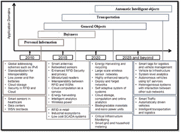

# 第六章

# 通过人机交互解开人工智能中的联邦学习之谜

+   Pawan Whig

    印度维韦卡南达职业研究学院

+   Arun Velu

    Equifax, 美国

+   Rahul Ready

    美国卡梅隆大学

摘要

如今，已经有尝试克服在视频游戏制作中的娱乐目标。实际上，大量工作投入到了利用计算机科学中的 AI 和先进技术来开发游戏，以便它们能被应用于教育、工业或政治过程中。为了这些产品能成功地被引入社会，它们必须尽可能让所有人都能接触，包括那些属于有特殊需求的少数群体的人。适应性和兼容性需要确保产品有更好的质量和采用率，以满足可访问性要求。本章将讨论在人工智能中解开联邦学习的神秘面纱，以及将人机交互与人工智能相结合来增强游戏的可访问性，从而使游戏对社会更具民主性和实用性，特别是对于那些依赖辅助技术服务的人来说。

引言

人机交互是研究计算机技术的设计和使用的学科，重点是人与计算机之间的界面（Whig 等人，2022 年）。人机交互研究人员研究人们如何与处理器互动并创造知识，使人们能以创新方式与计算机连接。

人机交互是一门结合了计算机科学、行为科学、设计、媒体研究和其他许多学科的研究课题。Stuart K. Card、Allen Newell 和 Thomas P. Moran 在他们 1983 年的里程碑式著作《与计算机交互的人类思维》中普及了这个词汇，而作者最初在 1980 年使用这个词，最早的文献使用记录是在 1975 年。这个词汇意味着，与具有有限应用的其他工具不同，计算机有多种用途，这些用途发生在用户与计算机之间的开放对话中。对话的概念将人机交互比作人与人之间的对话，这对于该主题的理论关切很重要（Anand 等人，2022 年）。

以前，人机界面（HCI）被称为人机研究或人机交互。它关注的是为人类使用而设计、实现和评估计算机系统及其相关现象。

人机交互可以应用于任何可以安装计算机的学科（Alkali 等人，2022 年）。下面列出了可能特别重要的一些应用人机交互的领域，如图 1 所示。

| 图 1. 与人机交互相关领域 |
| --- |
|  |

人类以多种方式与计算机互动，而人类与所用计算机之间的边缘存在对于建立这种联系至关重要。桌面程序、网络浏览器、便携式计算机和计算机信息亭等都使用了当今流行的图形用户界面（GUI）（Chopra & Whig, 2022）。语音用户界面（VUI）被用于语音识别和合成系统，开发多模态和整体用户界面（GUI）使人们能够以传统界面范式无法实现的方式与具身角色代理互动。在人机交互领域的历史中，它在交互质量和分支方面有所增长。（George 等人，2021）。而不是构建传统的界面，许多研究学科都关注多模态与单模态、基于命令/动作的智能适应性界面等概念，以及主动与被动界面。（Mamza, 2021）。

根据美国计算机协会（ACM）的定义，人机交互是“一个关注于为人类设计、开发和实施交互式计算系统，以及研究围绕它们的关键现象的领域”。确保用户满意度是人机交互（HCI）的一个重要方面（Sinha & Ranjan, 2015）。“由于人机交互研究的是人类与机器之间的交互，它依赖于来自机器和人类两方面的支持信息。在机器方面，计算机图形学、操作系统、编程语言和开发环境等技术非常重要。（Parihar & Yadav, 2022.).

在人类方面，通信理论、视觉和工业设计学科、语言学、社会科学、认知心理学、社会心理学和计算机用户满意度等人机因素都至关重要。当然，工程和设计方法也很重要（Bhargav & Whig, 2021）。由于其跨学科特点，来自许多背景的人们都为人机交互的成功做出贡献。人机交互（HCI）也被称为 HMI、人机交互（MMI）和计算机-人机交互（CHI）（Khera 等人，2021）。

图 2 展示了人机界面的框架。该框架显示了人机交互中信息的完整流程，D1-D4 显示了从设计方法、实施技术及工具、评估技术到案例研究的开发过程。U1-U3 表示社会组织和工作人机适应性，以及如图 2 所示的应用领域。

| !图 2. 人机界面框架! |
| --- |
|  |

人机交互的多种目标

人机交互是研究人们如何使用或不用计算产品、系统和基础设施的学科。因此，该领域的大部分研究旨在通过使计算机界面更易用来改善人机交互（Velu & Whig, 2021）。关于易用性应该如何定义、它与其他社会和文化标准的关系、以及它何时是计算机界面的一个有价值品质的争议越来越多。

人机交互（HCI）的组成部分

人机交互作为一个领域，专注于建立用户与计算机之间的“自然”对话。在这种对话中，用户参与计算机活动不需要做大量的认知工作。当我们投入大量工作创造有效的人机界面时（verma, 2019; Whig, 2019c; Whig & Ahmad, 2019），我们帮助消费者使用机器解决问题。相反，忽视人机交互几乎总是导致创建出糟糕的用户界面。糟糕的 HCI 会导致糟糕的可用性，从而增加了产品失败的可能性。

人机交互由四个主要组成部分构成。让我们更仔细地看看它们每一个：

用户

“用户”这个术语可以指个人或协作的用户群体。HCI 研究人们的行为、与技术的互动以及他们的愿望和抱负。考虑他们的才能和认知过程，以及他们的个性、经验、动机和情感（Arun Velu，2021）。在当今现代、竞争激烈的行业中，提供尽可能最好的客户体验至关重要。不出所料，以用户为中心的设计（一种在设计过程的每个阶段都关注用户和他们需求的设计方法）在设计过程中至关重要。

实践以用户为中心的设计的产品团队从一开始就将人员纳入设计过程，并根据它们对用户表现如何来评估重要的设计决策。产品团队还努力在用户和商业需求之间找到平衡（chouhan, 2019; Reddy, 2019; Whig, 2019b; Whig & Ahmad, 2019）。人机交互的主要组成部分如图 3 所示。

| 图 3. 人机交互的组成部分 |
| --- |
| 图 |

目标

当用户与计算机互动时，他们通常心中有一个目标——往往，是他们希望完成的任务（Nadikattu 等人，2021）。数字产品只是一个使消费者更有效完成这项活动的工具。例如，在电子商务环境中，一个任务可能是将商品添加到购物车然后购买它。

在考虑以目标为导向的体验时，请考虑以下因素：

用户完成任务难易程度

与产品互动所需的技能

操作所需的时间。

媒介

设计师在创建图形用户界面时必须关注发展适当的设计层次结构。当有清晰的结构时，用户可以更容易地探索和吸收材料。媒介、设备或界面是人类与计算机交互的基本组成部分。

例如，在设计视觉用户界面时，你必须考虑以下因素：显示大小、分辨率和主要交互方式（Aparicio 等人，2022 年）。为了改善用户体验，你必须根据这些特征改变层次结构。例如，当人们从他们的移动设备访问你的网站时，你可能只想显示最重要的信息，并通过使内容在小型屏幕上更易于阅读来调整文本大小，以提高愉悦度。

上下文

“人机界面”一词指的是人类用户与计算机系统之间的交互。交互是这种沟通的重要元素。人机交互不仅受用户使用设备的任务影响，还受此类行为发生的上下文影响。上下文指定了计算机系统使用的真实情况。例如，当设计一个移动应用程序时，你必须考虑视觉设计在昏暗的光线和阳光直射下看起来如何，以及应用程序在网络连接不佳的情况下是否可以正常运行。这些都是可能影响用户体验的众多因素中的两个（Sharma 等人，2016 年）。

良好的交互设计总是彻底的用户测试和特定设计特征的持续精炼的产物，特别是那些可能受到使用上下文影响的特征。因此，人机界面应始终与代表性的真实用户一起测试，这些用户代表预期的人群（Kumavat 等人，2022 年）。

人机交互领域的研究

下面提到了一些人机交互的研究领域

+   • 创建创新计算机界面的方法，以优化设计所需的属性，如易学性或可用性

+   • 实施界面的方法，例如通过软件库

+   • 评估和比较界面在可用性和其他期望质量方面的方法

+   • 研究人机使用及其更广泛的社会后果的方法

+   • 使用认知主义用户模型和活动理论描述人机使用，以及计算机界面设计的概念框架

+   • 计算设计、计算机使用和人机交互研究的考虑。

该领域的研究人员对他们想要实现的目标有不同的看法。作为认知主义方法的一部分，人机交互研究人员可能寻求使计算机界面与人类对他们活动的心理图片相一致。后认知主义视角可能被人机交互研究人员采用，以将计算机界面与当代社会行为或习俗相结合。（Mathurkar 等人，2021 年）。

新设计方法、设备、软件和硬件原型、交互范式以及交互模型和理论都是人机交互研究者感兴趣的（Srivastava 等人，2020 年）。

人机交互研究关注的是用户、他们的目的和任务、媒介以及人机界面，还有交互发生的背景。随着技术的发展，影响我们生活的方方面面，继续深入研究和推进人机交互课题至关重要。

Adobe、Microsoft 和 Facebook 的研究成果经常被转化为各种技术创新，这些技术有助于为众多行业创建直观易用的界面。语音只是用户界面未来发展的开始（Sowmya 等人，2020 年）。

AI 与人机交互领域的研究挑战

本节描述了人工智能与人机交互领域的一系列研究挑战

+   1. 显著的人类控制

根据一个主要关注点，智能自主系统应该受到人类的监督和管理，尽管它们具有“智能”并能够做出自动判断和结论。具有监管控制权并对系统和飞行甲板负责的飞行员是人为自动化系统控制的很好例子（Nadikattu 等人，2020b）。如图 4 所示，飞行员使用的是外环控制而不是内环控制。因此，飞行甲板上飞行员控制职责的性质发生了巨大变化。当控制权从驾驶员转移到车辆时，在人控与自动化之间需要做出权衡。这在半自动化驾驶引入和扩散时尤为重要，这关系到大量用户。

| 图 4. 显著的人类控制 |
| --- |
|  |

作为实现健壮且有用的人工智能的短期研究目标之一，有意义的人类控制已经被称为“人在环中”和“人在环上”，当人的干预直接影响行动实体时，称之为“人在环中”，而当它影响活动实体或社区时，则称之为“人在环上”。

最终，应该是人而不是计算机或算法来控制自主系统的行为——因此也应对其承担伦理责任。（Ruchin & Whig，2015）。

透明度、可理解性和可追溯性是实现人对智能系统控制的关键。它们还有助于建立用户与系统之间的信任关系，同时也能提升两者的团队表现。

此外，透明用户界面使用户能够看到并理解他们的行为和结果。机器学习系统的解释能力和以可理解方式展示信息的能力直接关联到透明度。除了能够验证和提升系统的能力，可解释的人工智能还有潜力从人类那里学习并获得新的洞察（Shrivastav et al., n.d.）。

作为一种替代方案，复杂系统中的透明度理念受到技术性和时间性的限制，同时还存在严重缺陷。正是由于这种对世界缺乏影响，透明度可能失去其力量，同时还会带来隐私风险。更重要的是，仅仅因为某事物可见，并不意味着它就能被人理解，这对于处理复杂系统来说是一个艰巨的任务。当谈及可获取性时，透明度意味着提供清晰、简洁且易于理解的解释（Bhatia & Bhatia, 2013）。

+   2. 智能

我们刚刚讨论的内容指向了对数字智能的更全面看法，这种看法强调的是人与科技互动的经验，而不是“智能功能”或“直观易用性”。当涉及到采纳新技术时，重点将从技术问题转移到技能与人类价值观的紧密联系上（Ahmad, 2012）。

“聪明”意味着“只有合作和富有同情心时才智能”因此，这意味着人类在他们的活动中将得到支持，他们的隐私将被尊重，并且他们将能够最大化他们个人的创造、社交和经济潜力，以及过上自主决定的生活（Nadikattu, 2020a）。

+   3. 需求多样化

同样重要的是，这些智能环境能够通过提供个性化、适应性强的和主动性的服务来支持人类，服务范围涵盖各种场所：家庭、办公室、公共空间以及在路上。根据 IST 咨询小组提出的环境智能情景（Nadikattu, 2014），它们最初在 2001 年引入，预计到 2010 年将完全发展成熟。当 API 方法被开发时，它已经有一个面向目前科学界正在关注和表达的目标和价值观的导向。

AI 和大数据必须融入适应性和个性化技术，以实现个性化、适应性、响应性服务的愿景。由于深度学习算法需要大量数据来学习和完善其决策过程，预测这些技术将在智能环境中协同运作。与此同时，AI 已经以多种方式应用于简化大数据的捕获和整理，以及分析大数据以获取关键洞察。在某些情况下，识别用户当前行为相对简单，例如在智能和环境辅助生活设置（AAL）中。使用越来越多的传感器和感知设备跟踪用户的行为模式。除了个人偏好，还应考虑组织和社交因素，例如组织文化和利用技术收集大量数据的能力，如企业文化（Bhatia & Gupta，2015）。

+   4. 技能

当机器人从数据中深刻和积极地学习时，人们对需要学习以有效生活和工作的事情的期望可能会根本性地转变。例如，共生方法会让人类处理定性主观判断，而机器处理定量部分，这种策略依赖于工具来辅助人类才能和创造力，而不是机器人来客观衡量知识。在人类必须消化大量复杂数据或在压力下迅速做出关键选择的情况下，先进技术，如 AI，可以用来增强人类记忆和解决问题的能力（Nadikattu，2020b）。通知、记忆和认知辅助以及决策辅助和推荐方案等技术都是补偿人类功能极限的例子。人工智能（AI）正在被用来帮助人们管理日常琐事，如购物和理财。

通过赋予全面捕获事件的能力，技术将在未来超越人类的感知，克服人类的感官限制。此外，它还可以通过提供访问网络化认知智能技术的途径来增强人类记忆，这些技术可以帮助人们完成日常琐事。信息和通信技术（ICT）与生物大脑的融合可能会最终利用技术来提高人类的感知和认知。根据这一理念，人类的判断和隐性知识，以及直觉和直觉应该与机器智能的潜力相结合。

然而，这样的发展目前只是一个想法和研究目标，而不是一个具体的现实。为了更好地理解人类的认知和大脑，认知科学将需要在这里加强我们的努力。最近在信息技术方面的进步，如来自人类活动的大数据，可以通过提供关于认知潜在原则的线索来帮助认知科学研究。

+   5. 情感模拟

作为情感和共情的生物，人类通过与其他人和计算机的关系展示他们的情感。改善人与技术关系的一个重大问题是信息技术如何记录和关联情感信号，以及技术如何传达情感和展示共情行为（Bhateja 等人，2018）。人与技术的连接和合作是通过模拟效果实现的；然而，人们可能会被误导，认为计算机并没有真正具有这些情感状态，并可能因此产生过度的情感依赖。情感模拟的流程图表示如图 5 所示。

| 图 5. 情感模拟的流程图表示 |
| --- |
|  |

也有可能个别人会被情感计算系统故意欺骗，例如，说服他们进行购买。在这方面，新的伦理准则至关重要。如果需要强化这样的伦理准则，必须采取多层次的策略，从培训软件工程师开始，然后是严格的复杂和新基准测试过程（Whig，2021）。

+   6. 安全

在新环境中，人类安全至关重要，应始终在设计和实施过程中以及通过独特的测试技术（Chopra & Whig，2021）中予以考虑。特别是，自我进化的智能系统的发展和使用由于技术误用或设计不当而存在重大风险。因此，复杂的智能系统应该是“设计安全”，这意味着它们应该在生命周期的尽可能早的阶段设计，利用安全和更安全的科技范式（Velu & Whig，n.d.）。

当涉及到自主系统时，传统的软件测试技术无法跟上，因为系统的行为不仅取决于项目和执行，还取决于系统获得的信息（Asopa 等人，2021）。随着人工智能的发展，研究人工智能对人类和社会的影响变得越来越重要，无论是短期还是长期，这需要与包括计算机科学家以及社会科学家和心理学家、经济学家以及律师在内的各种跨学科团队合作（Asopa 等人，2021）。

+   7. 种族转变

智能环境和人工智能（AI）除了技术障碍和转变外，还需要文化转变。技术变革必须与文化建设同步进行社会系统分析是了解智能生态系统影响的重要手段（Whig，2019a）。大多数人认为，越来越聪明的计算机最终会超越人类能力，使我们变得无能，取代我们的工作，甚至杀死我们。为了使智能生态系统得到广泛信任和使用，现有的观念和态度必须改变。这可以通过重新评估该领域的目的、目标和可能性来实现。需要对伦理和保密问题进行详细评估，以及以人物性格为基础的设计方法及其背后的理念，才能使公众和科学界信服（Ajay Rupani，2019）。图 6 示例了种族组成。

| 图 6. 种族组成示例 |
| --- |
|  |

研究问题

在智能环境和生态中，沟通将变得更加隐含，隐藏在物理和数字世界之间的连续性中，且更加微妙。物理/建筑领域中的虚拟/数字事物只是必须考虑的“混合世界”的两个例子。尽管所有对象在两个领域都有表示，但两个领域之间没有一个对一的映射，这对交互设计产生了重大影响（Rupani & Kumar，2020）。

没有必要让计算机在环境中脱颖而出，很快将完全没有必要，例如，公司的文化。有两种方法可以实现：身体上，通过与环境的融合，或者智力上，通过改变我们的观念。在這種情況下，计算机成為裝飾的一部分。将计算机嵌入环境中使其“消失”，引发人们如何感知对象的互动性以及他们如何将其视为交互伙伴的问题（Ahmad，2019）。

important 记住，“用户”通常不知道在他们当前的智能环境中可用的参与选择，因为传统的“ affordances”在这些情况下不再可用。就像互动地图中描述的方法，用户可以将他们当前的知识和参与模式从数字转移到现实世界的情境中。具有许多互动项和系统的环境提供了额外的问题，例如用户如何正确地处理一个特定的系统。

由于计算机体积的缩小，甚至可以将交互性整合到珠宝和高级时装中，尽管目前市场上已经可以买到智能眼镜、手表和手环等智能设备，但它们还未普及，并且其扩散速度比智能手机等其他便携式技术要慢。谈到可穿戴设备，美学方面如吸引人的设计和原创性在其采用中发挥作用（Purva Agarwal1, 2016）。因此，它们是“技术”对象，将时尚与技术相结合。尽管人们对于将计算机隐藏在如家具和配饰等普通物品中的热情和承诺感到兴奋，但信息过载、信息利用和信息不平等的问题可能会日益严重。

+   1. 隐藏的互动

除了有意识和有意的互动，我们还期待下意识和甚至无意/偶然的互动，或者是下意识却有意的互动，在注意力的边缘区域进行直接但又不完美的控制。在设计此类情境时，一个重大挑战是如何构建出互动性强却不过度侵扰的用户体验。

处理核心与边缘之间不可避免的注意力波动的最佳方式是提前规划。用户不应当承受过度的认知和感知压力，也不应该因为互动环境而感到困惑或不满意。智能环境可能会因为隐性互动而产生隐私问题。从技术角度来说，为了实现此类互动，环境必须捕捉上下文和用户数据，并进行必要的分析以做出适当有效的回应（Nadikattu 等人，2020a）。

+   2. 高度互动

不久之后可能会出现新类型的互动，它们利用传感器并模仿人类感官。大多数人通过视觉、听觉和触觉与技术互动，但味觉和嗅觉仍然知之甚少。未来情境中的多感官互动可能包括数字化化学感官如味觉和嗅觉，以及可能的物理触觉。对于智能环境来说，各种类型的自然互动是必不可少的（Whig & Ahmad, 2018）。

因此，在可能性、组合和技术需求方面，参与度将会大幅提高。除此之外，设计的焦点将不再仅仅局限于用户与物品的单一互动。他或她必须考虑完整的生态系统、生态学以及数据集，还要考虑分散在各种物理地点和使用情境中的大量用户群体。设计过程不应该仅仅增加更多的人、数据或物品，这种更广泛的背景需要新的设计技术。

智能设置需要一种以人为先的设计方法，比如用户中心设计（UCD）或以人为本的设计（HCD）。由于它们的主要目的是确保技术以最佳可能方式满足用户的需求，这一点尤为正确，因为据说这是这一新技术领域的最终目标。为了应对获取和结构化潜在使用场景、提取用户需求、生成设计以及进行评估的新挑战，这些设计技术必须继续发展（乔汗等人，2017 年）。

+   3. 公共空间的交互

在人多的公共区域，上述所有问题和挑战都会变得更加复杂。正在进行的研究探讨了不同的用户角色和交互风格，并推荐了设计公共空间交互的框架。根据他们与公共系统互动的方式，用户可以被分类为旁观者、观众等。重要的是要考虑交互系统如何吸引过路者的注意力，并激发他们与系统互动的兴趣。挑战、好奇心和责任感被确定为鼓励参与公共系统的因素。

此外，技术在公共场合的普及，模糊了私人与公共接触的界限，对于界面设计师来说是一个担忧的来源。例如，第三方如何看待用户的参与。公共区域的互动体验必须清楚地、及时地反馈谁控制着交互，定义双方用户都处于控制之下的是什么，并支持不同的用户角色在（社交）交互和内容方面的需求。隐私和公共接触的“模糊”边界（惠格和艾哈迈德，2017 年）。

因此，发生在公共场合的遭遇往往转瞬即逝。有许多“临时场所”比如城市和机场，它们正在因为多用户和多设备活动而变成智能城市和智能机场。此外，由于交互的临时性质，公共场合必须适应广泛的用户特征。其中包括宁静的美学、支持短期流畅交互的帮助，以及快速可用性。此外，还需要新的用户参与设计过程的方式。

+   4. VR 和 AR 中的交互

虚拟现实（VR）是“我们时代的科学、哲学和技术前沿”，带来了前所未有的挑战，因为可以导航并与虚拟物品和角色互动，它们可能代表全球任何地方的实际个体。VR 是最近技术发展才成为可能的，并且大多数行业预测都表明 VR 很快将产生重大影响（艾哈迈德和惠格，2011 年）。

沉浸感、临场感和互动性是 VR 体验的关键方面，还包括虚拟环境、生产者和玩家。近年来，人们一直关注提高硬件系统。在显著的技术进步之后，现在的目标是创造真实的体验，以提高用户在虚拟世界中的沉浸感和临场感。在 AR/VR 中，需要提高身体存在感，这包括自我定位和身体所有权的方面，如图 7 所示。用户网络病和地点复制的准确性不足是提供真实体验需要解决的问题。

|  |
| --- |
|  |

最新的网络化 VR 趋势揭示了 VR 中社交遭遇的新潜力，鼓励研究人员解决创新的 UI 和交互设计需求以及评估方法，还有隐私和道德考虑。同时，有必要进一步发展和扩大相关设计原则，以包含虚拟世界中社交互动的特点。目前，用户体验评估依赖于用户对发生和参与的主观判断，但未来的智慧应该集中在将此类评估与独立的测量和观察相结合。

随着技术的发展和用户接受度的提高，增强现实可能会变得更加流行（AR）。用户通过 AR（增强现实）与放置在他们实际现实环境中的数字叠加进行交互。尽管技术还处于起步阶段，但当它在未来达到其全部潜力时，预计将改变我们沟通、工作和与世界的互动方式。有些人认为，语音命令、人工智能和增强现实（AR）最终将使显示变得无用。地理增强现实体验、消息和叙述具有巨大的潜力。与“现实”相连的当前和即将到来的信息技术有可能改变社会（Pawan Whig，Anupam Priyam，2018）。

+   5. 估算计算

在评估智能环境中的整体用户体验时，有必要超越基于性能的方法。传统的评估实践已被判断不适合包括新的感知能力、主动性的转变、物理接口的多样化以及应用目的的变化的创新交互系统。在现实的交互环境中解释多个通信通道的信号、情境意识以及任务特定指标在通常无目的的系统中的不适用性，都是几个例子。

面对这样的情况，显然需要新的评估方法和工具，这些工具通过自动收集的用户体验指标来补充自我报告或观察指标。因此，需要一套新的框架和模型，以提供全面和系统的手段来评估智能环境中的 UX，同时考虑到各种特性和质量。

未来，智能可能成为一种服务以及新的设计材料。即使基于人工智能（AI）的服务现在也触手可及，它们可以帮助开发者创建基于 AI 的应用程序，而无需任何技术专业知识。此外，作为设计材料的 AI 可能通过插入到应用程序或物体中，帮助设计师在迭代设计和评估过程中使用智能作为工具，从而真正赋予专业人士权力。这种心态暗示技术将变得更加宝贵。然而，它也突出了未来制定具体指导方针的必要性（Rupani 等人，2018）。

研究问题

与 HCI 相关的研究被推动超越实验室研究，扩大到新的领域和环境，与研究“在野外”相呼应，随着互动技术渗透到生活的每个领域。特别是在公共场所，研究人员面临的问题是遵循标准协议来教育参与者并获得他们同意，与研究真实用户体验和行为，如果参与者知道自己被观察可能会受到影响。在艺术与技术交汇处的博物馆和研究可能会引发伦理问题，因为研究参与者和活动参与者之间的区别不明显。

关于脆弱用户群体，如老年人、残疾人、移民以及社会孤立个体，还有病人和儿童，这些都是人机交互研究需要关注的要点。这包括管理参与者对技术的误解，纠正他们对技术的不切实际或过于乐观的期望，以及当技术未能如预期工作时可能出现的问题（Agarwal & Whig, 2016）。

随着最近技术进步，关于在人机交互研究中使用互联网数据的问题引起了新的关注，包括在没有参与者同意的情况下使用数据。因此，研究者是否有权使用未经许可的公开数据成为一个问题。目前尚不清楚社区数据的依据是什么，以及获取知情同意的最佳程序是什么。匿名参与也是一个挑战，因为研究表明，即使数据被匿名化，当与其他信息结合时也可能被揭露。

+   1. 社交网络

信息安全是在线社交网络（OSNs）的一个关键问题，也是所有技术学科都在讨论的问题。隐私权包括亲密权、不受监视和保护的权利，以及管理个人信息的权利，包括其如何被分配。图 8 显示了各种在线社交网络。

| 图 8. 各种广泛可用的 OSN |
| --- |
|  |

数据保留困难、OSN 工作者访问私人材料的潜力、数据销售和针对性营销都是 OSN 的隐私问题。尽管人们对自己的隐私感到担忧，但他们仍然会泄露个人信息，这种现象被称为“隐私悖论”。

这些考虑因素包括：OSN 使用已深入日常生活； perceived advantages exceed observable hazards。个人并不是作为完全自由的代理来做出信息共享决策的。（Rupani 等人，2017 年）。在 OSNs 中为敏感应用提供隐私使 OSNs 中的隐私变得更加关键 在线社交网络（OSNs）具有两个根本相反的特征：隐私和内容共享。

欧盟议会和欧盟理事会发布了《通用数据保护条例》（GDPR）2016/679 号法规，以提高认识并保护用户权利。

+   2. 医疗保健部门

为了促进信息交换，并生成可以与专业群体共享的媒体材料，社交媒体在医疗保健 IT 背景下被广泛使用。有关儿童、老年人使用社交媒体以及用于研究目的（如收集患者报告的数据或进行在线调查和招募参与者）的伦理问题。（Chacko & Whig，2016 年）。自从 covid 之后，HCI 在医疗保健领域扮演了非常重要的角色，并且有很多使用机器的进展，成为了一个热门的研究领域。图 9 显示了医疗保健领域的 HCI 流程。

| 图 9. 健康领域的 HCI |
| --- |
|  |

上述所有技术的另一个特点是以说服性策略为主，用于改变人们的行为。虽然某些与健康相关的目标通常是 beneficial and desirable，但具有说服力的技术可以用来误导个人，或者在错误的情况下鼓励他们参与不良行为。移动商品和社会媒体尤其容易受到这些扭曲的影响，随着技术的进步和成熟，它们必须接受评估。深入探讨促进福祉、健康和人类潜力的技术，包括伦理考量（Rupani 等人，2016 年）。

+   3. VR 和 AR

VR 是一个引发两个关键社会和伦理问题的技术领域，原因在于它所创造的错觉：一是 VR 环境设计师的目标，可能是下流的内容；二是用户可以体验到“现实”可能是数字合成或数字捕捉的静态时刻。

随着其结婚证书证明了一个男人和一个虚拟角色的联合，全息公司引发了一场关于个人不可剥夺的自由、技术如何影响自由意志以及创造和滥用技术所涉及的伦理困境和责任的大讨论。对虚拟代理的过度依赖可能不如 VR 可能对社会互动产生的影响那么令人担忧，这可能导致个人退出社交活动，或允许在数字上延续生命超越物理死亡的可能性，例如。

+   4\. 物联网

物联网范式由各种技能定义，比如智能计划通过互联网基础设施联网并协作，从而使建筑、城市和交通变得更智能。在这个高度互联和多元化的世界中，新的隐私和安全问题随之产生，人类、设备以及自主实体之间的任何互动都是可能的。

在未来智能混合城市中，隐私将变得越来越重要。在虚拟世界中，人们可以使用假身份和匿名服务。在现实世界中，这将变得困难，如果不是不可能的话。如图 10 所示，模拟世界中的人物数据现在与现实世界的数据相互补充和整合。已知位置的商业或餐厅的顾客会被公共和私有的闭路电视（CCTV）摄像头拍照，并使用面部识别来识别人类身份。由于真实物品被标记，环境中的传感器将检测到个体穿着、携带、使用和购买的物品。在自动驾驶的背景下，车辆的仪器化程度的提高对隐私产生了影响。带着智能手机走路时，一个人的行走行为是可见的。物联网使逃避物品和人员的追踪变得越来越困难，隐私将在现实和混合世界中都是一个主要关注的问题。

| 图 10 IoT 下人机交互的过去与未来对比 |
| --- |
|  |

+   5\. 物联网与大数据

大数据和物联网都是最近的技术进步，它们无疑将成为未来技术增强环境的基础。大数据计划对隐私构成额外威胁，例如自动决策，这引发了关于歧视、自我决定和选择范围缩小的担忧，这是由于大规模个体数据的收割与使用高级分析相结合。例如，预测性分析可能对那些容易患病、犯罪或表现出其他社会不受欢迎的特质或行为的人产生负面影响。

+   6. 环境智能

所有技术领域都受到伦理、隐私和信任的影响。它们的基本担忧是一致的。尽管如此，不同领域带来了必须解决的其他问题。然而，生物识别技术提出了一个额外的道德问题，因为生物中心数据可以准确地调节某人的使用和某人的性情。

由于智能设置与其他新技术一样，引发了关于个人如何看待自己和我们在世界中的地位的担忧，因此它们带来了伦理问题。与智能系统相关的许多风险，例如基于收集的数据的用户识别、个人/敏感信息的持久性、档案、对个体的新属性的隐含推断和归因、用于监控的数据使用、数据误解、机密信息的公开披露以及说服性使用数据。

人工智能系统和自主代理的道德责任问题，以及它们的行为和决策的道德、社会和法律后果，是最严重的伦理问题之一。人工智能中的伦理决策是一个多学科研究领域，负责寻找解决这些困境和保护我们未来的答案。通常因素和道德标准指导人类的道德决策；从早期例子中学习的神圣价值观和文化考虑是常见的。

人类需要知道，当自主智能实体在做出更复杂和关键的伦理决策时，它们的判断是值得信赖和道德上正当的。因此，无论它表现为可追溯性、可验证性、不欺骗性还是可理解性，透明度都是必需的，这样人类才能理解、预测并正确地信任 AI。特别是智能 AI 将帮助人类检测 AI 错误并促进有意义的人类控制。然而，根据解释的使用方式，必须建立细节程度的平衡，因为完全透明在某些情况下可能过于强大。

+   7. 网络技能

上述提出的担忧主要涉及伦理和隐私问题，它们突出了障碍和潜在的危险。然而，隐私与网络安全紧密相连，这是一个因两个原因而受到关注的话题。首先，数字技术的增长导致我们社会的转型，为网络犯罪创造了更多机会。住宅单位以及公共组织和机构现在计算机化程度很高。人类活动的每一个元素，包括“面对面”会议，都在数字领域受到控制、记录和跟踪。其次，网络攻击成本低廉，没有地理界限（Kautish 等，2022 年）。

由于连接的设备数量巨大，传统的安保措施变得无效。由于大多数商业物联网设备缺乏适当的安全保障，它们可能成为黑客攻击、封锁、篡改通信、更改设置或发出欺诈性订单的容易目标，因为它们缺乏适当的安全保护。数据泄露和隐私侵犯，以及设备或服务器上设备和软件的攻击，是最重大的安全担忧（Moorthy 等，2022 年）。

从技术角度来看，在物联网和智能城市的背景下进行的网络安全对话是全面的，突出了困难，提供了设计，并推荐未来的研究计划。尽管应该寻求技术改进，但已经认识到，无论是因为错误还是无知，人类代理人是受损安全中的主要薄弱环节。建立实用的网络安全，教育个人如何提高他们的意识，以及培训企业和组织在网络安全的人文方面变得更加重要（Madhu 等，2022 年）。

结论和未来工作

本章探讨了当今社会技术世界中存在的七个主要困难，利用日益可用的交互智能来满足迫切的人类和社会需求。尽管是由当前技术突破和智能引发的，但讨论主要主张在未来技术构架中使用智能更好地服务和支持人类。在这种环境中，人机交互社区被呼吁承担一个重要任务：创造一个智能集成不会削弱人类自我效能和控制，而是增强它的未来。

人机交互(HCI)将致力于改善新技术增强环境中不同群体的生活质量，包括残疾人和老年人，因为其一直以人为中心。未来的技术环境将是智慧城市，不仅仅是智能家居和办公室。由于技术将成为日常活动的必要部分，满足人类的需求、财富和福祉，全民接入的重要性现在比以往任何时候都要大。为确保新技术不会排斥或孤立任何人，必须特别关注那些有被边缘化危险的人。

最后，我们生活的关键时期以及预期的未来悲观情景，已经推动研究开发技术以帮助人类应对关键社会问题，如资源短缺、气候变化、贫困和灾害。在此框架下，公民参与、社会公平和民主是应积极追求和实现的目标。在这方面，新技术的动态既带来问题也带来机遇，特别是在可持续性、公众参与和民主方面。承诺将得到履行，或者问题将变成灾难，这取决于当前和未来的行动和行为。

REFERENCES

Agarwal, P., & Whig, P. (2016). 基于可逆逻辑门实现低延迟的 4 位 QSD 加减法数制系统。《2016 年第八界计算智能与通信网络国际会议》(CICN), 580-584。

Ahmad, S. N. (2012). Pawan Whig.《移动与自组织网络杂志》。

Ahmad, S. N., & Whig, P. (2011). 研究基于 ISFET 的水质监测设备性能。《学术出版社》。

Ahmad, P. W., & S. N. (2019). 一种新颖的光催化传感器输出校准技术。《SSRG 国际 VLSI 与信号处理杂志》, 6(1)。

Ajay Rupani, P. (2019). 大数据科学的发展走向世界。《工程报告》, 2(2), 1-7。

Alkali Y. Routray I. Whig P. (2022). 利用人工智能研究确保物联网可靠、高效和安全的各种方法。可在 SSRN 4020364 上获取。10.2139/ssrn.4020364

Anand, M., Velu, A., & Whig, P. (2022). 利用机器学习模型预测银行贷款行为以确保金融安全。《计算机科学与工程杂志: JCSE》, 3(1), 1-13。

Aparicio, J. H. V., de León, H. R. M. P., Arroyo, L. O., & Herrera, J. Á. O. (n.d.). 应用于 Helmholtz 方程的双重互易边界元法。《学术出版社》。

Arun Velu, P. W. (2021). 使用数据分析方法探讨新冠疫苗对全球的影响。《国际可持续计算科学杂志》, 3(2)。

Asopa P. Purohit P. Nadikattu R. R. Whig P. (2021). 使用物联网减少智能城市可持续发展的碳足迹。2021 年第三界智能通信技术与虚拟移动网络国际会议(ICICV), 361-367。10.1109/ICICV50876.2021.9388466

巴拉加夫，R.，& 惠格，P.（2021）。关于泰坦尼克数据集数据分析的更深入洞察。《计算科学可持续发展的国际杂志》，3（4），1-10。

巴拉加夫，V. T.，塔瓦雷斯，J. M. R.，桑尼，B. P.，普拉萨德，V. K.，& 拉朱，K. S.（2018）。第二届国际计算智能与信息学会议论文集：ICCII 2017（第 712 卷）。斯普林格。

巴蒂亚，V.，& 巴蒂亚，G.（2013）。基于脉冲宽度调制技术的室温风扇速度控制系统。《计算机与应用国际杂志》，81（5）。

巴蒂亚，V.，& 古普塔，R.（2015）。设计基于 GSM 的电子投票机，带有选民跟踪。《BVICA M's 国际信息技术杂志》，7（1），799。

查克拉，J. B.，& 惠格，P.（2016）。基于 MIG 和 COG 反转逻辑门的低延迟全加/减法器。《2016 年第八届计算智能与通信网络国际会议》（CICN），585-589。

丘哈纳，G.，& 惠格，P.（2021）。番茄叶片病害识别技术的分析。《计算科学与工程杂志：JCSE》，2（2），98-103。

丘哈纳，S.，& 惠格，P.（2022）。使用 AI 的智能农业系统。《计算科学可持续发展的国际杂志》，1（1）。

丘哈纳，S.（2019）。使用 Arduino 和温度湿度传感器，自动化风扇速度。《计算科学可持续发展的国际杂志》，1（2）。

阿加瓦尔& P. W.（2016）。四元数符号数字系统通过反转逻辑门的回顾。《最近创新趋势计算与通信国际杂志》，4（3）。

丘哈纳，S.，查克拉，S.，乌帕迪亚，T.，鲁帕尼，A.，& 惠格，P.（2017）。不同技术中各种门控的比较研究。《国际机器人与自动化杂志》，3（2），00046。

乔治，N.，穆伊兹，K.，惠格，P.，& 维卢，A.（2021）。使用自然语言处理（PAIN）的感知人工智能框架。《人工智能与计算智能》。

考蒂什，S.，雷亚纳，A.，& 维迪亚 arthi，A.（2022）。SDMTA：混合云环境中 DDoS 漏洞的攻击检测和缓解机制。《电气和电子工程师协会工业信息学 Transaction》。

凯赫拉，Y.，惠格，P.，& 维卢，A.（2021）。使用 AI 的高效、有效和安全的电子账单系统。《维 ivekananda 研究杂志》，10，53-60。

库马尔瓦特，M. K. S.，索阿，A. K.，克赫德卡尔，H.，潘帕利 iya，C.，& 科德，S.（n.d.）。使用 YOLO v3 图像处理算法的社交距离检测器。《学术出版社》。

马德胡，G.，哥瓦兰，A.，& 拉维，V.（2022）。DSCN-net：用于自动诊断疟疾病原体检测的深度 Siamese 胶囊神经网络模型。《多媒体工具与应用》。

玛姆扎，E. S.（2021）。在卫生系统中使用 AIOT。《计算科学可持续发展的国际杂志》，3（4），21-30。

马图卡尔，G.，帕克希，C.，乌特卡尔，M.，& 奇特，P. H.（2021）。使用机器学习确保社交距离。《ITM 会议论文集》，40，03049。

Moorthy, T. V. K., Budati, A. K., Kautish, S., Goyal, S. B., & Prasad, K. L. (2022). 使用机器学习算法在 5G 网络中减小卫星图像大小. IET 通信杂志, 16, 584-591. https://doi.org/10.1049/cmu2.12354

Nadikattu, R. R. (2014). 使用机器学习在 Instagram 上分析美国与印度漫画的内容. 国际创新研究思想杂志, 2320-2882.

Nadikattu, R. R. (2020a). 机器学习和极限学习机技术在乳腺癌诊断上的仿真比较研究. 全球计算机科学和技术杂志.

Nadikattu, R. R. (2020b). 在乳腺癌诊断上机器学习和极限学习技术的仿真比较研究. 可在社会科学研究网络(SSRN)上获取, 论文编号 3640230. 10.2139/ssrn.3615092

Nadikattu, R. R., Bhandari, R., & Whig, P. (2021). 在视频压缩中改进的自适应罗德模式搜索算法模式. 在《创新在网络物理系统中》(pp. 441-448). Springer. doi:10.1007/978-981-16-4149-7_39

Nadikattu, R. R., Mohammad, S. M., & Whig, P. (2020a). 用于 COVID-19 的社会距离经济型智能设备. 国际电气工程和技术杂志.

Nadikattu, R. R., Mohammad, S. M., & Whig, P. (2020b). 用于 COVID-19 社会距离的经济型智能设备. 国际电气工程和技术杂志.

Parihar, V., & Yadav, S. (未注明). 应用人工智能估算有效消费者未来偏好. 学术出版社.

Reddy, R. (2019). 使用一种新型的伪 PMOS 紫外线光催化氧化(PP-UVPCO)传感器净化室内空气. 国际可持续计算科学杂志, 1(3).

Ruchin, C. M., & Whig, P. (2015). 使用扫描路径技术(USPT)设计和仿真动态 UART. 国际电气、电子与计算科学工程杂志.

Rupani, A., & Kumar, D. (2020). 温度对用于水质监测的光催化传感器(PCS)行为的影响.

Rupani, A., Saini, D., Sujediya, G., & Whig, P. (2016). 物联网上 FPGA 技术范式的综述. IJARCCE-国际先进研究与计算机通信工程杂志, 5(9).

Rupani, A., Whig, P., Sujediya, G., & Vyas, P. (2017). 一种基于 Raspberry-Pi 和 FPGA 物联网接口的图像处理稳健技术. 2017 年国际计算机、通信与电子会议(Comptelix), 350-353. 10.1109/COMPTELIX.2017.8003992

Rupani, A., Whig, P., Sujediya, G., & Vyas, P. (2018). 基于物联网的图像处理滤波器硬件实现. 第二届国际计算智能与信息学会议论文集, 681-691. 10.1007/978-981-10-8228-3_63

Sharma, H., Rao, N., & Sharma, M. (2016)。通过轨道周期分析占星术与科学计算。2016 年第三届计算促进可持续全球发展国际会议(INDIACom)，236-239。

Shrivastav, P., Whig, P., & Gupta, K. (待定)。通过槽式堆叠排列增强带宽及其与传统单片和堆叠片天线的比较分析。学术出版社。

Sinha, R., & Ranjan, A. (2015)。变阻尼比对 PID 控制器设计的影响。2015 年第四届可靠性、信息通信技术优化国际会议(ICRITO)(趋势与未来方向)，1-4。

Sowmya, K. B., Gomes, S., & Tadiparthi, V. R. (2020). 使用 ASMD 技术设计 UART 模块。2020 年第五届通信与电子系统国际会议(ICCES)论文集，176-181。

Srivastava, J., Bhagat, R., & Kumar, P. (2020). 使用 OTA 实现模拟反相滤波器。2020 年第六届控制、自动化与机器人国际会议(ICCAR)，627-631。

Velu, A., & Whig, P. (2021)。使用 NLP 保护个人隐私和节省时间：一种比较性 AI 方法。维韦卡南达研究期刊，10，42-52。

Velu, A., & Whig, P. (待定)。使用数据分析研究 COVID 疫苗接种对世界的影响。学术出版社。

Verma, T. (2019)。不同 R2R D/A 转换器的比较。计算科学可持续发展国际期刊，1(2)。

Whig, P. (2019a)。业务中的人工智能与机器学习。工程报告，2(2)，8-13。

Whig, P. (2019b). 基于机器学习的通信与信号处理问题技术。国际机器学习可持续发展期刊，1(3)，1-10。

Whig, P. (2019c)。使用物联网和机器学习预测智能建筑室内温度。国际机器学习可持续发展期刊，1(4)，1-10。

Whig, P. (2021)。基于物联网的智能盲人导航系统。计算科学与可持续发展期刊，2(2)，80-88。

Whig, P., & Ahmad, S. N. (2017)。光催化传感器的模糊逻辑实现。机器人与自动化国际期刊，2(3)，15-19。

Whig, P., & Ahmad, S. N. (2018)。各种 R2R D/A 转换器的比较分析。生物传感器与生物电子国际期刊，4(6)，275-279。

Whig, P., & Ahmad, S. N. (2019)。光催化传感器输出的校准方法。计算科学可持续发展国际期刊，1(1)，1-10。

Whig, P., Nadikattu, R. R., & Velu, A. (2022). 使用人工智能分析 COVID-19 大流行。物联网技术在医疗监测与数据分析中的应用，1。

Whig Priyam, & Ahmad. (2018)。使用各种拓扑结构对各种 R2R D/A 转换器进行仿真和性能分析。国际机器人与自动化期刊，4(2)，128-131。

ADDITIONAL READING

巴蒂亚, V., & 希格, P. (2013). 一个基于双重调谐多频率的智能电梯控制系统. 国际研究工程与先进技术杂志, 4(1), 1163–2319.

卡尔南, M. J. (1987). 绘制 MIS 的智力结构, 1980-1985: 共引分析. 管理信息系统季刊, 11(3), 341–353. DOI:10.2307/248680

古德休, D. L. (1998). 用于用户对信息系统评价的任务-技术匹配度的开发与测量效度. 决策科学, 29(1), 105–137. DOI:10.1111/j.1540-5915.1998.tb01346.x

普尔万, G. P. (1998). 群组支持系统研究的回顾：领导者、方法与方向. 决策支持系统, 23(2), 149–159. DOI:10.1016/S0167-9236(98)00041-4

鲁帕尼 A.希格 P.苏杰迪亚 G.瓦斯 P. (2017). 一种基于 Raspberry-Pi 和 FPGA 通过物联网互联的图像处理稳健技术. 2017 年国际计算机、通信与电子学会议(Comptelix), 350–353. 10.1109/COMPTELIX.2017.8003992

沙尔玛, A., 库马尔, A., & 希格, P. (2015). CDTA 基础上的新颖模拟反低通滤波器性能研究, 使用 0.35 µm CMOS 参数. 国际科学、技术与管理杂志, 4(1), 594–601.

辛格, A. K., 古普塔, A., & 森纳尼, R. (2018). 基于 OTRA 的多功能反滤波配置. 电气与电子工程先进杂志, 15(5), 846–856. DOI:10.15598/aeee.v15i5.2572

文卡特什, V., & 戴维斯, F. (2000). 技术接受模型的理论扩展：四个纵向现场研究. 管理科学, 46(2), 186–204. DOI:10.1287/mnsc.46.2.186.11926

希格, P., & 艾哈迈德, S. N. (2012). 分析各种读出电路用于监测水质的性能, 使用模拟集成电路. 国际智能系统与应用杂志, 4(11), 103. DOI:10.5815/ijisa.2012.11.11

希格, P., & 艾哈迈德, S. N. (2014). 在 SPICE 中模拟光催化传感器的线性动态宏观模型. COMPEL: 国际计算机与电子工程杂志。

张, P., & 迪伦, A. (2003). 人机交互与 Management Information Systems: 共同关注的问题, 编辑引言. 国际人机交互研究杂志, 59(4), 397–402. DOI:10.1016/S1071-5819(03)00109-5

关键词与定义

人工智能：人工智能(AI)是计算机或由计算机控制的机器人执行通常需要人类智能和判断力来完成任务的能力。

增强现实：增强现实改变了你的工作、学习、娱乐、购物以及与世界互动的方式。

大数据：大数据是组织收集的结构化、半结构化和非结构化数据的组合，可以挖掘出信息，并用于机器学习项目、预测建模和其他高级分析应用。

医疗保健部门：医疗保健行业是经济系统中提供治疗患者、预防、康复和缓解疼痛的各个部门的集合和整合。

人机交互（HCI）：人机交互是研究人与计算机交互以及计算机是否为成功与人类交互而开发的研究领域。

物联网（IoT）：物联网是一个由相互连接的设备和促进设备与云之间以及设备之间通信的技术组成的网络。

机器学习：机器学习是人工智能（AI）和计算机科学的一个分支，专注于使用数据和算法来模仿人类学习的方式，逐渐提高其准确性。

虚拟现实（VR）：虚拟现实是一种模拟经验，可以与现实世界相似或完全不同。
