# 第七章

# 使用区块链 IIoT 应用保护自然和减少碳足迹

+   帕万·维希

    印度维韦卡南达专业研究学院

+   阿伦·VELU

    艾奎 ifax，美国

+   阿西玛·巴特纳格尔·巴蒂亚

    印度维韦卡南达专业研究学院

摘要

我们行为所形成的温室气体的累计量是一个碳足迹。在美国，一个人的总碳足迹是 16 公吨，这是世界上最大的之一。全球平均水平更接近于 4 公吨。到 2050 年，全球平均每年碳足迹需求要降至 3 公吨以下，以最大限度地阻止全球温度上升 2°C。Rahul 等已经预测，使用物联网服务的碳足迹减少了 17%。在这项研究研究中，提出了一种使用物联网与增强学习 AI 减少碳足迹的新方法，使用时进一步减少了 5%的碳足迹，使用 Q 学习时几乎减少了 7%的碳足迹。详细的研究结果包括以展示结果。

引言

碳足迹是一个单一的人类活动向大气排放的温室气体的量，主要是二氧化碳（Whig 等，2022 年）。碳足迹可能是一个可以归因于个人行为、家庭、案例、实体，甚至是一个国家整体的大型衡量指标（Anand 等，2022 年）。通常以每年产生的二氧化碳公吨数来衡量甲烷、氮氧化物和其他温室气体的相应气体，这个数值可以与相应气体的二氧化碳公吨数相增加（Alkali 等，2022 年；Chopra & WHIG，2022 年）。

在评估碳足迹时会考虑许多变量，其中一些在图 1.1 中显示。例如，向杂货供应链倾倒会燃烧一定量的汽油，而温室气体的主要来源是化石燃料（Chopra & Whig，2022b，2022a；Madhu & WHIG，2022 年）。然而，杂货店是以燃气运营的，工人可能已经去上班了，这意味着商店有自己的碳足迹。此外，商店提供的所有商品都已经被送到那里，这意味着必须也要考虑总体碳排放量（Bhargav & Whig，2021 年；George 等，2021 年；Khera 等，2021 年；Mamza，2021 年；Pawar，2021 年；Whig & Rupani，2020 年）。相比之下，超市生产的浆果、土豆和精油都是在种植园中种植或饲养的，这是一种产生甲烷的操作，其温室效应比二氧化碳大 25 倍（Arun Velu，2021 年；Reddy，2019 年；Velu & Whig，2021 年；verma，2019 年；Whig，2019b，2019a）。碳足迹在图 1 中有很好的定义。

| 图 1. 碳足迹 |
| --- |
| 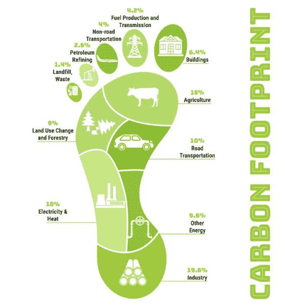 |

截至 2020 年 12 月，根据 NASA 的数据，二氧化碳（CO2）占地球大气层的 411 ppm。根据国家科学院的数据，美国大约 81%的总电力来自化石燃料的燃烧（chouhan, 2019；Mathurkar et al., 2021；Nadikattu et al., 2020b, 2021；Ruchin & Whig, 2015；Sharma et al., 2016；Shrivastav et al., 未注明日期）。美国或其他国家绿色能源仍需发展的一个关键原因是，可再生能源的存储仍然是不可能的。物联网通过智能计量和预测，有能力通过风能和太阳能等可再生能源改造电力电网。通过从化石燃料转换到清洁能源，大城市预计可以将二氧化碳排放减少一半以上（Chopra & Whig, 2021；Nadikattu et al., 2020a；Velu & Whig, 未注明日期；Whig2*, 2020）。新技术，在 4.0 时代如 AI、物联网和机器学习，被看作是减少碳足迹的福音。物联网在减少碳足迹方面扮演着重要的角色（S. N. Ahmad & Whig, 2011；Pawan Whig 2 Anupam Priyam3, 2018；Whig & Ahmad, 2018）。

除了更清洁的电力来源，物联网还将使住宅的 HVAC 能源自动化成为可能，据国际能源署称，这是全球电力需求的主要驱动力之一。为了提高能源效率，智能 HVAC 系统可以高效地监控大型建筑的温度，跟踪占用和其他变量（Bhatia & Whig, 2013; Chacko & Whig, 2016; Rupani et al., 2016, 2017, 2018; Whig, 2017; Whig & Ahmad, 2016）。

强化学习

在一个不可预测、可能复杂的环境中，智能体学会达到目标。人工智能在强化学习中面临类似于游戏的场景（P. W. 和 S. N. Ahmad，未注明日期；Ahmad, 2016）。为了解决问题，机器使用试错法。对于执行的动作，人工智能会收到奖励或惩罚，以使机器按照程序员的愿望行事。其目标是优化累积回报（Rashmi Sinha, 2015）。

尽管设计师设定了激励政策，即游戏规则，但他没有给模型提供关于如何解决游戏的反馈或建议（Moorthy et.al, 2022）。

模型需要找出如何执行挑战的方法，从完全随机的试验开始，以先进技术和超人类能力结束，以优化回报（Kautish et.al,2022）。强化学习可能是展示系统独创性的最有力的方式，通过利用搜索的优势和进行多次实验。与人类不同，如果在一个足够高效的计算基础设施上运行强化学习算法，人工智能将从成千上万的同时游戏中获得知识（Alferaidi et.al., 2022；Sharma et.al 2022）。

| 图 2. 强化学习框图 |
| --- |
| 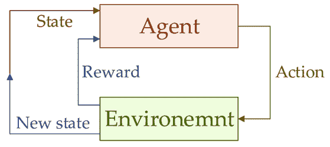 |

区块链

我们可以设想一个生态系统，其中协议以数字代码编写，并存储在清晰、公共的记录中，这些记录面临着被区块链移除、修改和修订的危险。在这种环境中，每个合同都将有一个数字记录和签名，可以被检测到。人们、企业、机器人和程序将可以自由地进行交易和互联。

几乎每个人都已经陷入了这样一个论点：区块链将改变商业并重塑组织和节约型。根据我们在技术创新研究中的经验，如果要实现区块链革命，许多障碍——技术性的、管理性的、组织性的，甚至是社会性的——都将不得不崩溃。在没有首先了解它将如何传播的情况下，冒然一头扎进区块链技术是错误的。

我们认为真正的区块链引领的企业和政府变革仍需数年才能实现。这是因为区块链并不是一个“颠覆性”技能，可以以低成本钥匙迅速推翻现有企业。区块链是一种基础技术，它能在其上建立新的经济和社会机构。然而，尽管区块链将产生巨大影响，但它需要数十年才能渗透到金融和社会基础设施。随着技术变革和制度变革的浪潮加速，采用将逐步稳定，而不是突然。

区块链和物联网（IoT）都被广泛认为是重要的数字转型技术。但是，如果你将两者结合起来呢？2019 年底，Gartner 将区块链与物联网的采用确定为数字转型的甜蜜点，特别是在美国。而这一切都没有改变。

自 2014 年左右以来，区块链技术作为一种分布式账本技术，在加密货币之外的领域受到了很多关注。

区块链旨在为包括交易和互动在内的应用提供基础。因此，区块链技术不仅可以增强物联网的合规性，还可以增强物联网的功能和成本效益。

区块链与物联网的益处

区块链的分布式账本是不干预的，减少了参与方之间的信任需求，根据一家 IT 服务业务的高级副总裁兼全球支付主管 Andres Ricaurte 的说法。因此，没有任何单一实体能够控制物联网策略产生的巨量数据。由于区块链加密，几乎不可能有人更改现有数据记录。此外，在区块链上存储物联网数据为防止敌对攻击者访问网络提供了额外的保护层。

| 图 3. 区块链与物联网的益处 |
| --- |
| 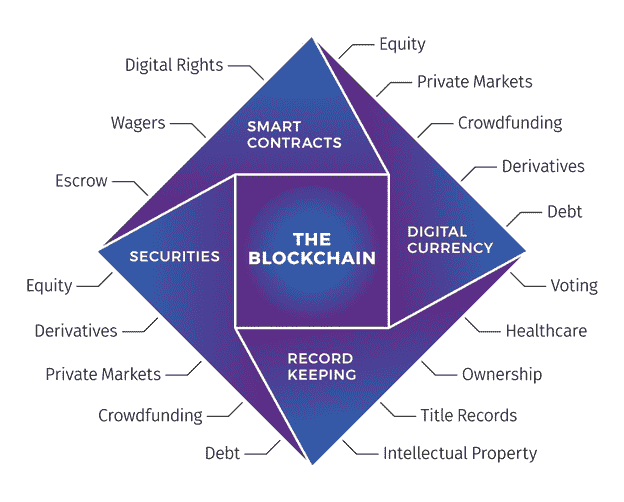 |

根据管理咨询公司 Alvarez & Marsal 的高级总监维普尔·帕雷克的说法，物联网提供商面临的最困难挑战之一是保护物联网生态系统的信息。物联网设备的网络安全漏洞使它们成为攻击、恶意攻击者和数据泄露的非正式董事会。

根据帕雷克的说法，物联网与区块链的结合为降低低效、提高安全性和增加各方透明度开辟了新的可能性，同时使安全的机器间交易成为可能。这些技术的结合使物理资产能够从原材料开采开始，沿着供应链直到到达最终客户进行监控。

安全性提升。区块链技术通过允许可信方验证和批准交易以及数据发送和存储过程中的加密来整合安全性。区块链技术能让我们看到谁有访问权限，谁在进行交易，以及所有互动的记录。此外，区块链通过加密、消除单一故障点和快速识别整个网络中最薄弱的环节来提供一层安全性。

节省成本。通过在区块链上自动验证和处理交易，整个生态系统可以更加主动且成本更低。

交易速度。这对于涉及许多供应商、制造商、分销商和客户的供应链交易尤其正确。因为区块链在一定程度上作为共享账本运行，不信任的各方可以直接相互交换数据，减少手动流程并提高交易速度。

罗斯曼解释说：“在亚马逊时，我们采用了一种名为‘逆向工作’的策略来处理问题，即从消费者出发，逆向寻求解决方案。” “区块链就是看似具有变革性的技术之一，但除了加密货币之外，大量的采用并没有达到预期。让我们从消费者出发，逆向思考，看看区块链如何可能帮助物联网。”

成本、安全、隐私和数据共享都是物联网实施中必须解决的问题。

罗斯曼认为，区块链的设计就是加密安全的，多个独立节点在升级之前验证链的修改，以避免恶意行为。这是为了保证安全。所有利益相关者都可以查看和确认区块链，这有助于提高数据访问和信任，而无需增加繁琐且昂贵的官僚层。这显著提高了可访问性、信任度和成本效益。

区块链的应用案例

智能合约/供应链 根据 Cleo 的 CTO 约翰·塞林斯的观点，物联网和区块链可能会集成在一起，以确保供应链中的质量保证。易腐商品，如葡萄酒或珍贵美食，在通过运输和仓储网络的过程中经常暴露在不断变化的温度和光照下。“通过集成物联网和区块链，我们可以记录易腐商品从制造商到零售商的路径，”塞林斯解释说。“在箱子或托盘级别，可以收集位置和温度数据并放入区块链中，从而提供产品在供应链中历史的验证能力，以及拒绝接受货物和转让的能力。

| 图 4. 表示智能合约的流程图 |
| --- |
| 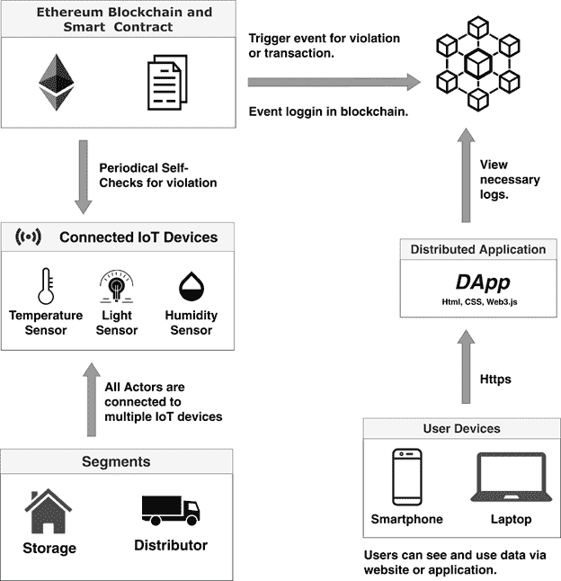 |

除了存储数据外，卡瓦略指出，某些区块链模型还允许公司以分布式和去中心化方式存储和运行不可变的算法。这些算法通常被称为智能合约，允许企业自动编码业务和领域规则。

物联网设备，如温度传感器，可以持续检查货物的温度，并将数据传达给运行中的智能合约，实时通知利益相关者任何温度下降，“卡瓦略解释说。“因为智能合约是在区块链之上运行的，所以底层的温度数据保存在一个不可变的数据结构中，这有助于防止数据篡改。”

| 图 5. 运输中的区块链和物联网 |
| --- |
| 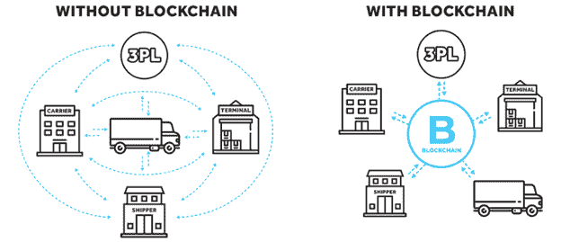 |

租赁拖车 根据 Gartner Inc.的研究“将区块链与物联网集成可增强多方流程中的信任，”安装在租赁车辆中的物联网传感器可能会将关键事件记录在区块链上，以协助监控车队的位置和返回，以及启用更有意义的计费方法。

“随着车载物联网传感器的发展，拖车租赁公司可能会根据负载的扭矩而不是距离来向租户收费，正如现在的做法一样，”研究表明。 “区块链分布式账本技术使人们能够分享一个唯一的、共享的真相版本。没有单一的实体负责数据，卡车司机和租赁公司都可以是独立的。

现场服务和石油作业 根据 Garter 的研究，石油和水井上的物联网传感器可能有助于石油公司控制拖车业务的性能，这些业务负责从井中提取和分发石油和水，并将其运送到各种目的地，包括环境废物填埋场。

根据文章所述，“井上的物联网传感器帮助石油公司安排卡车取货，并允许他们监控取货和交付的材料量，以避免欺诈和虚假陈述”。文章继续提到，“区块链分布式账本技术记录了物流链中的关键事件，并为整个物流链提供了可独立验证的真相的共享单一版本。”

根据 Gartner 的研究，在这个用例中使用区块链可能帮助石油公司节省成本并更有效地运行他们的取货和交付操作。此外，通过为监管机构提供数据，如将水运输到水排放地点的量与从水井中取水的量相比，区块链分布式账本技术将帮助石油公司管理其合规报告义务。

物联网与区块链技术整合的难点

物联网与区块链结合最困难的部分是一些物联网设备电池寿命的限制。

| 图 6. 物联网与区块链技术整合的难点 |
| --- |
| 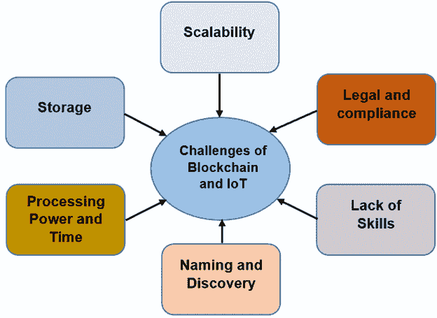 |

他解释说：“一些物联网设备总是与电源和 Wi-Fi 相连，所以实际上并没有什么重要的限制。”然而，许多物联网设备并非如此。并且，你不能在一个小设备上运行一个计算和带宽密集型的区块链交易系统。因此，它们可能需要采用某种基于服务器的架构。

数学建模

在这项研究中，初步计算是在不使用任何先进技术（即物联网）的基础上进行的建筑研究。

在没有 IOT 的情况下计算结果后，再次计算了应用 IOT 的夏季建筑的碳排放量，使用了物联网和强化学习的马尔可夫决策过程以及 Q 学习。数学计算如下

| 图 7\. FF |
| --- |
| 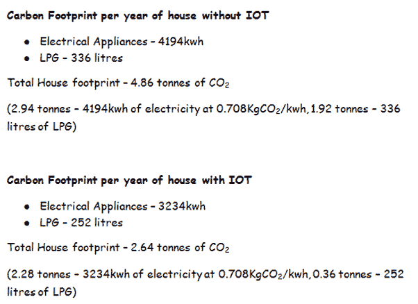 |
| 图 8.­ |
| 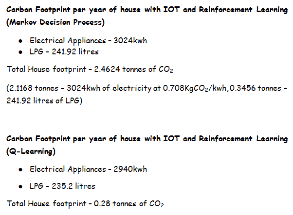 |

(2.058 吨 - 2940kwh 的电力，0.708KgCO[2]/kwh，0.336 吨 - 235.2 升 LPG)

上述数据摘要如下表-1

表 1. 年度碳排放量

| 每年一座房屋的碳排放量（吨） |
| --- |
| 实施技术 | 电子设备 | LPG | 总计 |
| 没有 IOT | 2.94 | 1.92 | 4.86 |
| 带有 IOT | 2.28 | 0.36 | 2.64 |
| 带有 IOT 和强化学习（马尔可夫决策过程） | 2.1168 | 0.3456 | 2.4624 |
| 带有 IOT 和强化学习（Q-学习） | 2.058 | 0.336 | 2.394 |

结果

观察到使用物联网的家庭碳排放量相比没有使用物联网的家庭减少了 23%，此外，当在物联网中应用强化学习（马尔可夫决策过程）时，图表相比没有物联网实施的家庭下降了 28%。当应用物联网和强化学习（Q-Learning）时，碳排放量图表显示比没有物联网的系统图表下降了 30%。这清楚地表明，安装了物联网和强化学习（Q-Learning）的家庭是最有效的减少碳排放量系统。

| 图 9. 夏季碳排放数据分析 |
| --- |
| 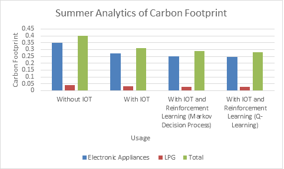 |

图 9 所示的上述图表代表了没有物联网、有物联网、有物联网和强化学习（马尔可夫决策过程）、有物联网和强化学习（Q-Learning）的夏季家庭（每月）碳排放量。

| 图 10. 冬季碳排放数据分析 |
| --- |
| 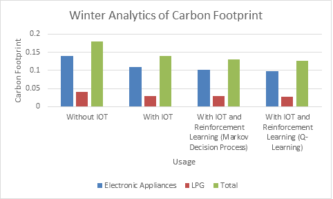 |

在冬季，没有物联网（IOT）、有物联网、有物联网和强化学习（马尔可夫决策过程）以及有物联网和强化学习（Q-Learning）的每月碳排放量的表示在图 10 中有所展示。

| 图 11. 碳排放量分析 |
| --- |
| 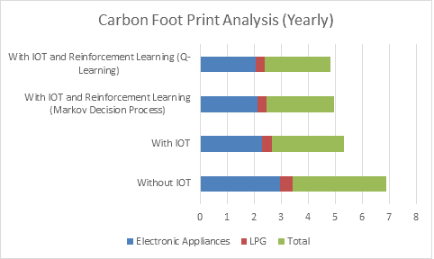 |

一个家庭在一年内使用不同技术减少碳排放量所造成的碳排放量的详细表示在图 11 中有展示。观察到安装了物联网和强化学习（Q-Learning）的家庭在减少碳排放量方面最为高效和有益，相比其他任何技术实施，减少了 30%。

| 图 12. 1965 年以来的碳排放量 |
| --- |
|  |

从 1965 年至 2019 年，每年碳排放量的增加在图 12 中有所表示。观察到碳排放量图表有剧烈的增加。甲烷排放并没有如此快速的变化，但人均能源和初级能源消耗有了显著的变化。这表明，随着人口的增加，能源消耗正在迅速增加，导致碳排放量增加。

| 图 13. 人均能源增长率、甲烷和初级能源消耗的比较 |
| --- |
| 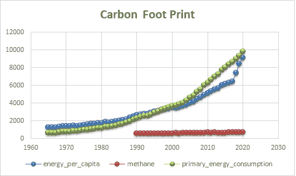 |

观察到甲烷排放不受年份影响，但人均能源和初级能源消耗有大幅增加，这是碳排放量增加的主要原因。

| 图 14. 初级能源消耗与人均能源的比较 |
| --- |
| 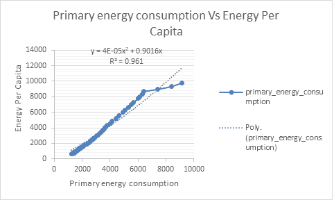 |

图 14 所示的图表是人均能源和初级能源消耗之间的比较，观察到 R²=0.9533。观察到人均能源与人均初级能源相似度为 95%，与初级能源差异度为 5%。

结论

因此，得出结论，与任何其他技术实施相比，使用物联网与强化学习(Q 学习)是最有效和有益的，因为它将碳排放减少了 30%，相比之下没有物联网的房屋，而仅实施物联网将减少 23%，物联网与强化学习(马尔可夫决策过程)将减少 28%。

参考文献

阿哈默德，P. W.，& S. N. (2016). 一种新颖的伪 NMOS 集成 CC-ISFET 设备用于水质监测。集成电路与系统杂志，8(2)，1-6。

阿哈默德，S. N. & 惠格，P. (2011). 关于基于 ISFET 的水质监测设备性能的研究。学术出版社。

阿哈默德&纳西姆。 (2016)。低功耗准浮动门 PCS 模型的仿真与性能分析。智能工程与系统国际杂志，9(2)，8-13。

阿尔法埃迪，A.，亚达夫，K.，阿尔哈比，Y.，维里雅西塔瓦特，W.，考什，S. & 迪曼，G. (2022). 联邦学习算法优化客户端和成本选择。数学问题工程。

阿尔卡利，Y.，罗特雷伊，I. & 惠格，P. (2022). 研究使用人工智能的可靠、高效和安全的物联网各种方法。可在 SSRN 4020364 上获得。

阿南德，M.，维卢，A. & 惠格，P. (2022). 使用机器学习模型预测安全银行贷款行为。计算科学与工程杂志：JCSE，3(1)，1-13。

阿伦·维卢，P. W. (2021). 使用数据分析 Covid 疫苗接种对全球的影响。国际可持续计算科学杂志，3(2)。

巴拉加夫，R. & 惠格，P. (2021)。对泰坦尼克数据集数据分析的更多见解。国际可持续计算科学杂志，3(4)，1-10。

巴蒂亚，V. & 惠格，P. (2013). 一个基于双重调谐多频率的智能电梯控制系统。国际研究与先进技术杂志，4(1)，1163-2319。

查科，J. B. & 惠格，P. (2016). 基于 MIG 和 COG 可逆逻辑门的低延迟全加/减法器。2016 年第八届计算智能与通信网络国际会议(CICN)，585-589。

丘普拉，G. & 惠格，P. (2022)。基于支持向量的聚类方法。国际机器学习与可持续发展杂志，4(1)，21-30。

丘普拉，G. & 惠格，P. (2021)。番茄叶片病害识别技术的分析。计算科学与工程杂志：JCSE，2(2)，98-103。

丘普拉，G. & 惠格，P. (2022a)。车辆互联网能源高效调度。国际可持续计算科学杂志，4(1)。

乔普拉, G., & 维古, P. (2022b). 使用人工智能的智能农业系统. 国际计算科学可持续发展期刊, 1(1).

丘哈纳, S. (2019). 使用 Arduino 和温度湿度传感器, 自动化风扇速度. 国际计算科学可持续发展期刊, 1(2).

乔治, N., 穆伊兹, K., 维古, P., & 维卢, A. (2021). 使用自然语言处理(PAIN)的感知人工智能框架. 人工与计算智能.

考尔蒂什, S., 雷亚纳, A., & 维迪亚 arthi, A. (2022). SDMTA: 混合云环境中 DDoS 漏洞的攻击检测和缓解机制. ieee 工业信息学交易.

克赫拉, Y., 维古, P., & 维卢, A. (2021). 使用人工智能的高效、有效和安全的电子账单系统. 维 ivekananda 研究期刊, 10, 53-60.

马德胡, M., & 维古, P. (2022). 机器学习及其应用的综述. 国际机器学习可持续发展期刊, 4(1), 11-20.

马姆扎, E. S. (2021). 在健康系统中使用 AIOT. 国际计算科学可持续发展期刊, 3(4), 21-30.

马图卡尔, G., 帕克希, C., 乌特卡尔, M., & 奇特, P. H. (2021). 使用机器学习确保社会距离. ITM 网络会议, 40, 03049.

莫 orthy, T. V. K., 布达蒂, A. K., 考尔蒂什, S., 戈亚尔, S. B., & 普拉萨德, K. L. (2022). 使用机器学习算法在 5G 网络中减小卫星图像大小. IET 通讯, 16, 584-591. https://doi.org/10.1049/cmu2.12354

纳迪卡图, R. R., 班哈里, R., & 维гу, P. (2021). 用于视频压缩中运动估计的改进的自适应罗德模式搜索算法. 在计算物理系统创新中, 第 441-448 页. 斯普林格.

纳迪卡图, R. R., 穆罕默德, S. M., & 维古, P. (2020a). 用于 COVID-19 的社会距离智能经济设备. 国际电气工程技术期刊.

纳迪卡图, R. R., 穆罕默德, S. M., & 维古, P. (2020b). 用于 COVID-19 的社会距离智能经济设备(SSRN 学术论文 ID 3640230). 社会科学研究网络. https://papers.ssrn.com/abstract,3640230

帕瓦, V. S. (2021). 具有嵌入式人工智能的物联网架构. 国际计算科学可持续发展期刊, 3(4), 11-20.

辛哈, R., & P. W. (2015). 输出误差对第二阶系统 VDRC 模糊接口的影响. 国际计算机与应用期刊, 125(13), 11-16.

罗迪, R. (2019). 使用一种新型的伪 PMOS 紫外光催化氧化(PP-UVPCO)传感器净化室内空气. 国际计算科学可持续发展期刊, 1(3).

鲁钦, C. M., & 维古, P. (2015). 使用扫描路径技术设计并仿真动态 UART(USPT). 国际电气、电子与计算科学工程期刊.

阿普 ani, A., 塞尼, D., 苏杰迪亚, G., & 惠格, P. (2016). 物联网技术范式综述. IJARCCE-国际先进研究在计算机与通信工程期刊, 5(9).

阿普 ani, A., 惠格, P., 苏杰迪亚, G., 维拉斯, P. (2017). 一种基于 Raspberry-Pi 和 FPGA 通过物联网互联的图像处理鲁棒技术. 2017 年国际计算机、通信与电子学会议(Comptelix), 350-353.

阿普 ani, A., 惠格, P., 苏杰迪亚, G., 维拉斯, P. (2018). 基于物联网的图像处理滤波器的硬件实现. 第二界国际计算智能与信息学会议论文集, 681-691.

夏尔马, C., 夏尔马, S., 考特什, S., 阿 lsallami, S. A., 哈利尔, E. M., & 穆罕默德, A. W. (2022). 一种新的中位数平均轮询调度算法: 减少周转时间和等待时间的最优方法. 亚历山大工程期刊, 61(12), 10527-10538.

夏尔马, H., 劳, N., & 夏尔马, M. (2016). 通过轨道周期分析占星术和科学计算. 2016 年第三届国际计算用于可持续全球发展会议(INDIACom), 236-239.

夏尔马, P., 惠格, P., & 古塔, K. (2012). 通过分槽堆叠安排增强带宽及其与传统单层和堆叠片天线的比较分析. 学术出版社.

维卢, A., & 惠格, P. (2021). 使用 NLP 保护个人隐私和节省时间: 一种使用 AI 的比较方法. 维 ivekananda 研究期刊, 10, 42-52.

维卢, A., & 惠格, P. (2022). 使用数据分析研究 COVID 疫苗对世界的影响. 学术出版社.

弗尔马, T. (2019). 不同 R2R D/A 转换器的比较. 国际可持续计算科学期刊, 1(2).

惠格, P. (2017). 为 PCS 系统设计的温度和频率独立读出电路. SF J 材料研究快报, 1(3), 8-12.

惠格, P. (2019a). 一个新颖的多中心阈值三元模式. 国际机器学习可持续发展期刊, 1(2), 1-10.

惠格, P. (2019b). 使用物联网和机器学习预测智能建筑室内温度. 国际机器学习可持续发展期刊, 1(4), 1-10.

惠格, P., & 艾哈迈德, S. N. (2016). 经济型水质监测设备的建模与仿真. 水产与海洋生物学期刊, 4(6), 1-6.

惠格, P., & 艾哈迈德, S. N. (2018). 一种新颖的伪 PMOS 紫外线光催化氧化(PP-UVPCO)传感器用于空气净化. 国际机器人与自动化期刊, 4(6), 393-398.

惠格, P., 纳迪卡图, R. R., & 维卢, A. (2022). 使用 AI 应用分析 COVID-19 大流行. 物联网技术和应用在医疗监测与数据分析中的应用, 1.

惠格, P., & 阿普 ani, A. (2020). 一种新颖的经济型社交距离智能设备用于 COVID19. 国际电气工程和技术期刊, 2.

Whig, K. K., & P. (2020). 货币政策委员会建议的宏观经济影响：一个 IS-LM 框架。 ACTA 科学农业, 4(2)。

Whig, Priyam, & Ahmad. (2018). 各种 R2R D/A 转换器仿真与性能分析。国际机器人与自动化杂志, 4(2), 128-131。

ADDITIONAL READING

Bhatia, V., & Whig, P. (2013). 基于双重调谐多频率的智能电梯控制系统。国际研究与工程技术期刊, 4(1), 1163-2319。

Fenner, A. E., Kibert, C. J., Woo, J., Morque, S., Razkenari, M., Hakim, H., & Lu, X. (2018). 建筑物的碳足迹：方法学与应用综述。可再生能源与可持续能源评论, 94, 1142-1152。DOI:10.1016/j.rser.2018.07.012

Giaccherini, F., Munz, G., Dockhorn, T., Lubello, C., & Rosso, D. (2017). 制革废水处理的碳与能源足迹分析：全球概述。水资源与工业, 17, 43-52。DOI:10.1016/j.wri.2017.03.001

Gui, F., Ren, S., Zhao, Y., Zhou, J., Xie, Z., Xu, C., & Zhu, F. (2019). 在产品生命周期中基于活动的碳足迹和成本分配与优化。清洁生产杂志, 236, 117627。DOI:10.1016/j.jclepro.2019.117627

Rosati, F., & Faria, L. G. D. (2019). 在可持续性报告中解决 SDGs：与制度因素的关系。清洁生产杂志, 215, 1312-1326。DOI:10.1016/j.jclepro.2018.12.107

Sharma, A., Kumar, A., & Whig, P. (2015). CDTA 基于新型模拟反低通滤波器性能研究。国际科学、技术与管理期刊, 4(1), 594-601。

Singh, A. K., Gupta, A., & Senani, R. (2018). OTRA-based 多功能反滤配置。电气与电子工程进展, 15(5), 846-856。DOI:10.15598/aeee.v15i5.2572

Whig, P., & Ahmad, S. N. (2012). 利用模拟集成电路监测水质的各种读出电路性能分析。国际智能系统与应用期刊, 4(11), 103。DOI:10.5815/ijisa.2012.11.11

KEY TERMS AND DEFINITIONS

AI：人工智能（AI）是指计算机或由计算机控制的机器人执行通常需要人类智能和判断力来完成的任务的能力。

碳足迹：碳足迹是指我们行为产生的温室气体（包括二氧化碳和甲烷）的总量。

IIoT：工业物联网（IIoT）是利用智能传感器和执行器来提高制造和工业过程的能力。

IoT：物联网（IoT）是指连接设备的集体网络以及促进设备与云之间以及设备之间通信的技术。

机器学习：机器学习是人工智能（AI）和计算机科学的一个分支，专注于使用数据和算法模仿人类学习的方式，逐渐提高其准确性。

马尔可夫决策过程：马尔可夫决策过程（MDP）是一种离散时间的随机控制过程。

q 学习：q 学习是一种无模型的强化学习算法，用于在特定状态下学习一个动作的价值。

强化学习：强化学习是一种基于奖励所需行为和/或惩罚不受欢迎行为的机器学习训练方法。
