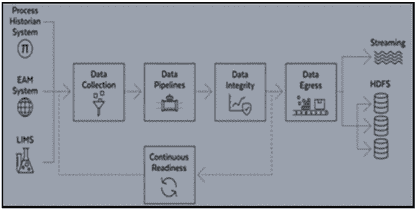
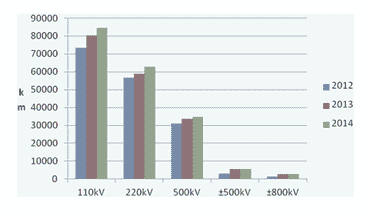
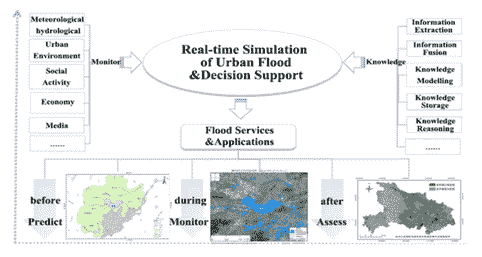

# 第九章

# 数字双胞胎与联邦学习在智慧城市及其应用中的研究

+   Surabhi Shanker

    

    印度古鲁哥宾德·辛格·印多尔大学三一理工学院

摘要

本章旨在探讨数字双胞胎的历史、架构、应用及其实施的挑战。数字双胞胎被认为是当今智慧城市建设的起点。本章从对数字双胞胎和城市数字双胞胎概念的简要描述开始，讨论数字双胞胎与智慧城市的关系，分析基于数字双胞胎的智能城市和智能家居的特征，并重点关注基于数字双胞胎的智能城市的主要应用。本章为基于数字双胞胎的智能城市和智能家居的未来发展提供了见解。

引言

“双胞胎”的概念是由美国宇航局（NASA）的阿波罗计划提出的，该计划设计和制造了两个完全相同的宇宙飞船。其中一个是发射到空中执行任务，而另一个留在地球上，让工程师们复制发射的那个的条件（Boschert & Rosen, 2016）。在 Grieves 撰写的一份白皮书中（Glaegen & Stargel, 2012），数字双胞胎首次在他的产品生命周期管理（PLM）高级课程中被提出。随着技术的提升，数字双胞胎被引入到航空航天行业，由美国国家航空航天局（NASA）和美国空军（Tuegel et al., 2011）提出。因此，留在地球上的宇宙飞船可以用一个数字镜像模型来替代，以通过高保真模拟提供更多的洞察。如今，数字双胞胎已应用于更多领域，并已成为最热门的技术。在图 1 中，数字双胞胎的完整发展历程可以划分为三个阶段。

|  |
| --- |
|  |

根据 Grieves 撰写的一份白皮书（Glaegen & Stargel, 2012），在概念的起始阶段即第一阶段，Grieves 在 2003 年提出了数字双胞胎的概念。它被解释为三个维度，包括一个物理实体，一个数字替身，以及连接这两个部分的联系（Glaegen & Stargel, 2012）。

2005 年，Grieves 提出了另一个观点，并告诉说数字双胞胎可以分为三种亚型，包括：DT 原型、DT 实例和 DT 聚合（Tac, 2012）。然而，由于技术和认知限制，接下来的五年里我们很少有相关报告。但幸运的是，在这个时期，新信息技术已经兴起并发展起来，为数字双胞胎未来的发展奠定了框架。

2010 年，美国宇航局在《草案建模、仿真、信息技术与处理路线图》（Allare, 2014）中详细阐述了数字孪生空间飞行器的定义和功能。2011 年，美国空军在飞机机械健康管理中发现了数字孪生的应用（Reifinider & Majumdar, 2013）。2012 年，美国宇航局和美国空军共同发布了一篇关于数字孪生的论文，表达了数字孪生是未来飞行器的关键创新（Tuegel et al., 2011）。此后，航空航天领域对数字孪生的研究逐渐增多。例如，Tuegel 提出了用于设计和维护的机身数字孪生，并讨论了其发展的挑战（Swedberg, n.d。）Allaire 等人研究了一个动态数据驱动的应用系统，该系统被描述为航空航天车辆数字孪生的执行基础（Menard, n.d.）。Reifsnider 和 Majumdar 在任务管理中引入了跨学科的基于物理的数字孪生方法（Science Service Dr. Hempel Digital Health Network, n.d.）。

在 2014 年，关于数字孪生的白皮书（Glaegen & Stargel, 2012）发布，广泛揭示了数字孪生的三维结构。随后，数字孪生被推广到了航空航天业以外的更多领域，例如，汽车（Panetta, 2017）行业、石油和天然气（Panetta, 2017）行业，以及医疗保健和药物行业（Murray, 2018）。近年来，许多知名组织都将数字孪生技术视为重要技术。在 2017 年和 2018 年，Gartner 都将数字孪生列为未来十年十大最有前景的技术趋势之一（13,14]。2017 年，洛克希德·马丁太空系统公司将数字孪生列为未来国防和航天六大突出技术之首（Tao, 2017）。中国科学技术协会智能制造协会指出，数字孪生是全球智能制造领域十大逻辑性和创新性进步之一（Tao, 2017b）。根据目前的趋势，可以预见，在未来几年内数字孪生将经历快速发展。

数字孪生-概念与架构

进步技术的增长是智能城市的具体途径，在那里所有的物理对象都将具有嵌入式计算和通信能力，以便它们可以感知大气并相互连接以提供服务。这些智能互联和互操作性也被称为物联网（IoT）或机器对机器（M2M）通信（Tao, 2017a）。智能城市的几个重要领域是智能能源、智能家居、智能交通系统和智能制造。由于传感器和执行器的可负担性和可用性，数据采集变得相对容易。通过互联网监控和诊断制造机器是一项挑战。在智能制造领域，物理和虚拟世界的融合仍然是 Cyber-Physical Systems（CPS）领域的最大挑战之一，需要更多的研究。为了应对这些挑战，提出了工业 4.0 的概念（Tao, 2017），揭示了如果生产系统变得智能和聪明，它们可以更有效地运行（Tao et al., 2018; Tao, 2017b）。为了实现这一点，已经有很多发展，其中之一就是数字孪生（机器对机器通信，2015）。

“数字孪生”是一个让模型预测实际物理资产模型的想法，用于预测性维护。这个模型会不断适应环境或操作的变化，使用实时传感数据，并可以预测相应物理资产的未来（Schuh et al., 2017）。它可以监控并识别其物理双胞胎预期的问题。此外，通过结合基于物理的模型和数据驱动分析，它可以利用物理双胞胎的剩余有用寿命（RUL）进行预测。它由三个主要部分组成：（i）现实空间中的物理产品；（ii）虚拟空间中的虚拟产品；（iii）将虚拟和现实产品连接在一起的数据和信息。因此，收集和分析大量制造数据以找到信息和连接已成为智能制造的关键。

数字孪生的概念是由 Grieves 在 2003 年关于产品生命周期管理（PLM）的一次演讲中提出的，该演讲在密歇根大学举行（Ribeiro & Björkman, 2017）。通用电气（GE）已经开始围绕数字孪生进行数字化转型之旅，通过构建关键的喷气发动机部件，预测与这些部件剩余寿命相关的商业成果（Qin et al., 2016）。

在（Uhlemann et al., 2017）的研究中，他们提出了一个用于数字孪生的动态贝叶斯网络方法，这是首次提出这样的方法。他们利用数字孪生的概念来跟踪随时间变化变量的演变，以监控飞机结构。

数字孪生服务的架构阶段包括：

| 图 2. 数字双胞胎服务架构的不同阶段 |
| --- |
| 图 |

+   数据收集：第一阶段是数据收集。工业数字化始于构建操作性数字双胞胎。这些由两种类型的数据组成：模型数据和时间序列数据。模型数据用于通过限制图模型来构建现实世界事物的数字表示，而时间序列数据表示在给定时间对某些物理事物状态的观察。它可以是连续的或离散的。

+   数据管道：在这个阶段，将数据收集阶段的各种不同数据源合并成一个单一的智能模型，并将其导出到元素图中。

+   数据完整性：它还查看实际数据流，以检测协作、连接甚至收集物理数据的仪器方面的物理问题。这是对单一变量或多个变量数据的一组分析。

+   数据流出：一旦收集并组织成数字双胞胎并分析，以确保数据的准确性。最后阶段是利用我们构建的数字双胞胎来解锁整个分析价值范围。

支撑数字双胞胎的底层技术

有五个底层技术趋势被用来以互补方式发展，以实现数字双胞胎。这些是：

+   物联网：高精度传感器 enable continuous collection of machine data, state and condition from the physical asset to the digital twin to the real life via wireless network.

+   云计算：它允许实时存储和处理来自其资产和其数字双胞胎的大量机器数据。

+   应用程序编程接口和开放标准：它提供必要的工具来提取、分享和协调来自多个系统的数据，这些数据贡献给单一的数字双胞胎。

+   人工智能：它利用历史和实时数据，结合机器学习框架，对未来情景或资产上下文中将发生的事件进行预测。

+   增强现实、混合现实和虚拟现实：它们呈现数字双胞胎的特殊模型和可视化，为其提供与数字双胞胎协作和互动的媒介。

数字双胞胎及其对智慧城市的重要性

众所周知，数字孪生是一种充分利用物理模型、传感器、运行历史数据等复刻过程，以同化多学科、多尺度和概率信息的方式。它在虚拟空间中作为物理产品的复刻过程。目前对数字孪生概念的理解多种多样，尚未形成统一的定义。然而，普遍认为物理实体、虚拟模型、数据、连接和服务是数字孪生的基本元素（陶等人，2019 年）。数字孪生的核心是物理空间与虚拟空间之间双向映射的关系。这种双向映射与单向映射不同。单向映射数据只在一个方向上进行，即从物理实体到数字对象。它也被称为数字阴影（Kritzinger，2018 年）。在这种情况下，“物理对象状态的改变导致数字对象状态的改变，但反之则不然。”（Kritzinger，2018 年）然而，数字孪生能够使虚拟对象在没有人工干预的情况下控制物理实体（Enders & Hoßbach，2019 年），这是数字阴影所不具备的特征。

作为理解双向映射、动态交互和虚拟与现实之间实时连接的关键方式，数字孪生可以把物理实体的属性和特征、结构、状态、性能、功能和行为映射到虚拟世界中（陶等人，2019 年），创建一个高保真的动态多维、多尺度、多物理量的模型，这将为观察、识别、理解、控制和转换物理世界提供一种实际的方法（陶等人，2019 年）。

数字孪生技术最初在产品与制造业设计领域显现并发挥作用，随后在航空、自动化、造船、医疗和能源等不同行业中得到应用。近年来，随着物联网(IoT)、大数据（陶等人，2019 年）、云计算和人工智能（AI）等技术的快速进步，智慧城市的建设基础逐渐从原有的静态 3D 建模水平，向融合动态数字技术与静态 3D 模型的数字孪生层面发展，这为数字孪生城市助力智慧城市构建提供了新的思路。

值得注意的是，数字孪生城市是数字孪生概念在城市层面上的广泛应用。它旨在构建物理世界和虚拟空间之间的复杂大型系统，使彼此能够相互规划、相互融合。它可以将物理城市与平行的“孪生城市”相匹配，形成物理城市与数字城市在物理维度和信息维度共存和融合的模式。建立数字孪生城市需要数据基础和技术基础。数据基础指的是城市各个角落的传感器和摄像头不断产生的海量城市大数据，以及市政管理部门连续构建的数字子系统。

技术基础工作指的是与物联网、云计算、大数据和人工智能（包括 5G）相关的技术。在数字孪生城市中，基础设施的运行状态数据、市政资源的布局数据以及人员、物流和车辆的流动数据将通过传感器、摄像头和各种数字子系统进行整合。借助包括 5G 在内的技术将数据传输到云端和市政部门，城市将得到良好的组织。数字孪生城市的建设将引发城市智能规划、管理和服务领域的重大创新，为智慧城市建设提供一个“新的起点”。这将有助于实现对城市全方位信息想象和智能城市规划、管理和服务的目标。数字孪生城市不仅是数字城市的目标，也是智慧城市的关键组成部分。它是使城市实现智能化的重要设施和基本能力，也是城市信息化从定性变化向定量变化转变过程中的一个重要里程碑，这为智慧城市的创新创造了更多空间。

随着物联网（IoT）的兴起，由于其成本效益高和易用性，数字孪生在其它行业得到了实施和普及。通过数字孪生实现智慧城市的概念变得日益清晰。从城市规划到土地利用优化，数字孪生为城市治理提供了有效的手段。数字孪生允许在实施之前模拟策略，预先发现问题，以防问题成为现实。

尽管新加坡是世界上技术最先进的国家之一，但 Esri 新加坡的首席执行官 Thomas Pramotedham 相信，对于任何踏上数字转换旅程的城市来说，创建一个数字孪生是至关重要的。Pramotedham 表示：“仅凭数字孪生的设置，政府机构才能有效地分析可以用数据做什么，以及推进公民生活、创造经济机会和恢复更紧密的社区。”这个概念对许多国家来说仍然是新的，但它预计在未来五到十年内将成为主流。

发展数字孪生驱动城市的益处

更高效的交通系统和住房结构将是发展智慧城市的主要好处。

毫无疑问，能够利用这项技术并充分利用其好处的城市将是那些增长的城市。除了技术成就外，它们将变得更加环境友好、经济和社会可持续。然而，一些分析师提出了关于这项创新如何征服传统方法的问题。数字孪生专家回答说，虽然计算机辅助设计目前负责设计和提供关于设计过程的愿景——数字孪生将提供相同的东西，但他们还可以与一个有物理对应物的互动。拥有一个对应的部件将使设计师能够预测任何潜在的问题。将虚拟技术与由地理空间分析驱动的智能地图相结合，是这项创新改善当前实践的一个主要例子。这些地图的目的是帮助用户在视觉化、处理和分析多源、大型和复杂的地理参考数据方面提供帮助。再次，数字孪生提供同样的服务，但它还代表了一个正在运行的物理对象，当物理对象的状态发生变化时，它也会实时地强烈变化。

智慧城市中的高级数字孪生应用

数字孪生技术的目的是提高能源消耗、安全、交通控制、公共卫生服务、城市规划和洪水监测的生产力和可持续性。

智能电网数字孪生服务

智能电网数字孪生是一个包含众多物理量、众多时间和空间尺度以及众多概率的复制体，它充分利用了电力系统的物理模型、在线测量数据和历史运行数据，并吸收了电力、计算机、通信、气候和经济学等多学科知识。它通过在虚拟空间绘图来重现智能电网整个生命周期的过程。由于人类对电力的需求不断增长，电网输电线路的规模每年都在增加（图 3），加之自然灾害的频繁发生和设备运行环境的恶化，使得电网线路检查的压力增大。目前的线路检查主要依赖人工方式。然而，这种方法不仅效率低下，还存在检查盲区，逐渐不能完全满足电网检查的需求（图 4）。现代化的电网迫切需要建立一种安全、有效和智能的检查模式。

| 图 3. 中国 2012 至 2014 年各种电压等级的增长情况 |
| --- |
|  |
| 图 4. 100 公里内国家电网分支机构的员工情况 |
|  |

基于数字孪生智能电网技术，我们可以开发一种在线、实时识别绝缘子损伤和 AI 在线设计树障安全距离的技术。这种方法可以实现实时检查、故障解析，并输出报告，从而显著减少劳动力。此外，根据这项技术，还可以设计一个基于电力走廊多元素特定放置、识别和建模，以及三维空间关联计算模型的软硬件集成系统，该系统可以用于解决电力走廊安全风险放置及其预警问题。目前，这项技术已经覆盖了中国 15 个省份、城市和地区，检查线路约 20,000 公里，检查里程超过 50,000 公里，带来了超过 2 亿元人民币的经济利润。

智慧城市运营大脑管理

在数字孪生城市的基础上，可以建立一个智慧城市运营大脑（SCOB），城市管理者将带头建立一个智慧城市运营中心（SCOC）并委派一位首席运营官（COO）负责。SCOC 归 COO 领导，他们之间的首席信息官（CIO）联合会议委员会负责管理和监督。SCOC 负责城市信息管理的四个主要部门，包括城市 IT 运营和维护中心、大数据中心、城市运营监控和指挥中心、智慧服务中心。SCOB 的主要功能包括

+   1. 参与和修订城市顶层规划；

+   2. 规划和修订各行业信息发展的总体目标、框架、任务、运营和管理；

+   3. 阐述相关政策和法规标准；

+   4. 负责城市信息资源的整合和共享；

+   5. 监控城市行为，多部门管理和设施；

+   6. 促进形成以社会为导向的大数据开放应用、服务和交易的系统。

公共信息云服务平台是 SCOB（图 5）的结构部分。一旦公共信息云服务平台建立，SCOB 办公室就开始激活，官员们只需使用该平台的“应用程序”来承担智慧城市管理的职责。

|  |
| --- |
|  |

该平台由基础设施层、软件开发和运营平台层、应用层组成。平台使用服务器、网络和传感器设备等结构来获取数据，并使用云基础设施、数据、平台和软件作为服务区域，最终实现智慧城市管理、智能公共安全、智能旅游等多个领域的云服务平台的应用。该平台可以产生数据收集、处理、存储、清洗、挖掘、应用和反馈的环境链。基于数字双生城市的智慧城市运营中心是智慧城市的核心。它是城市大数据的资源中心，城市物联网的中心。它直接监控城市的运行，广泛获取城市的运行数据，以实现跨部门和跨区域系统的有序管理和应急响应能力。

图 6 是基于数字双生城市的智慧城市运营大脑的图形 diagram。建立在智慧城市运营大脑上，可以通过整合云数据中心和各部门的数字子系统数据，构建多门户统一的智慧城市指挥和应急中心。中心还使用多维分析、数据挖掘等基本数据分析组件，以及物联网感知和实时运营监控等分析应用。

|  |
| --- |
|  |

这个中心可以降低城市信息化项目和维护的成本，最小化政府事务成本，提高城市效率。

智慧城市交通大脑

数字孪生技术上创建的智慧城市应用之一是智能城市交通大脑。每天，从手机、监控视频、出租车、室内定位系统、公交车和地铁以及移动应用中，城市中会产生数亿条出行线路的大数据。依靠全息感知、时空分析和数据挖掘等科技，武汉路智能交通应急系统（图 7）得以建立，它是武汉智能城市交通大脑的一个重要组成部分。该系统旨在深度整合多网络资源和实时动态交通信息，同时联接城市报警系统、警方、路况系统、事故紧急系统和交通视频系统等各应急平台资源，并在同一界面进行展示。武汉路智能交通应急系统基于实时交通数据流理解交通大数据管理。它开发了拥堵指数估算算法，该算法结合历史拥堵数据、交通数据、车辆速度数据等信息，实现了如下功能：

+   1. 准确评估道路拥堵程度；

+   2. 实时道路拥堵排名；

+   3. 历史拥堵与实时拥堵之间的相对分析。

系统还具备视频验证、重大活动安保、实时调度和导航以及拥堵事件回放等功能。所有这些功能为交通部门提供了决策机制，以利用智能交通云和 GIS 计算的好处来缓解和清除交通拥堵。

| 图 7\. 基于数字孪生的智慧城市交通大脑结构与功能示意图 |
| --- |
|  |

智慧城市公共卫生服务

基于数据云平台、分析系统、响应系统以及用户终端（Li et al. 2020）（图 8）的机制，可以构建一个智慧城市公共卫生服务系统。患者的时空数据是由大型医院信息系统提供的患者信息和通信运营商提供的患者时空路线数据混合形成的，存储在患者时空数据库中。这个数据库可以与时空数据云平台相关联，并连接到疫情大数据分析系统。分析系统利用时空连续性分析、人工智能分析等技术来调控疫情的发生和发展，确定密切接触者，并将结果传输到响应系统。响应系统与政府部门、雇主和个人用户相连，为政府提供疫情预防和控制的参考，为雇主提供员工健康状况证明的参考，为个人用户提供自我隔离和保护的信息服务。

|   | 图 8. 国家公共卫生预防和控制系统结构示意图 |
| --- | --- |
|   |  |

智能医疗

有限的资源与不断增长的需求的矛盾凸显了有效、智能和可持续医疗保健的必要性。区块链技术是最佳解决方案。物联网传感器积累和监控患者的健康数据，如心率、血糖水平、呼吸率、血压和体温。之后，管理员监控组成的数据并生成患者的报告。收到的报告由医生分析，然后批准所需的治疗。医生可以利用分布式数据库分享治疗报告以供进一步分析。经授权的报告以加密格式共享。患者向“云服务提供商（CSP）”索取以获取他们的治疗记录。

成功认证后，患者接收到治疗记录的加密文件。患者使用自己的私钥解密收到的加密文件，以获取他们的原始治疗记录。

智能交通

通过实施区块链技术概念，我们可以有效地处理与智能交通系统相关的安全与隐私问题。在车辆网络中，车辆可以不通过任何中央权威机构而与路侧单元或其他车辆进行通信。然而，在这样一个独立的环境中，挑战者可能会注入模糊或虚假信息以谋取个人利益。因此，车辆认证是保证这些车辆之间安全数据交换的必要条件。为了实现这一点，物联网传感器收集并监控车辆的信息，如车型尺寸、速度、行驶方向和负载。然后，分布式网络节点监控组合数据并生成实时数据包用于通信。接收到的数据包将用于计算车辆的行为。共享过程将记录在“CSP”上。车辆向“CSP”请求与它们相关的信息。

成功认证后，车辆将运行算法来确定它们的行为。成功结果将被记录以改进算法。

智能供应链

在全球范围内，复杂的供应链已经授权了多种产品的制造和销售，但这些供应链中的实体（例如，零售商、分销商、运输商和供应商）对产品生命周期的了解非常有限。然而，这类产品信息是必要的，因为顾客需要这些信息来建立信任，实体需要这些信息来做出商业决策或预见市场趋势。在数字孪生城市中的区块链技术可以成为一个解决方案。区块链追踪完整的产品信息，避免假产品进入市场，并在各个实体之间分享信息以优化决策过程。在这个过程中，物联网传感器收集并监控实体的信息，如物流、规格、隶属关系和价值。分布式网络节点监控组合数据并生成实时数据包用于通信。接收到的数据包将用于分析车辆的行为。共享过程将记录在“CSP”上。零售商、分销商、运输商和供应商可以检索“CSP”以获取与他们相关的信息。成功认证后，实体将获得他们所需的信息。

智慧城市的水灾监测与洪水情况服务

在洪水灾害的完整生命周期中，在灾害前的稳定监测和预报、灾害期间的动态监测和分析以及灾后的评估和重建，可以使用数字孪生技术识别实时城市洪水复制和智库研究与判断设施的应用状态，从而为智慧城市建设增加服务角色（图 9）。基于数字孪生的智慧城市洪水监测和服务系统主要涵盖三个领域，即洪水规范化和动态大数据监测、洪水知识图谱和洪水服务应用。洪水大数据监测指的是从城市和流域尺度的物联网环境中实时收集洪水灾害和洪水大数据的监测方法，结合空间、空气和地球的一体化实时监测技术。核心点是从地面传感器等监测和收集设备收集河流和湖泊的水情、城市气象站降雨情况和人与车辆的动态轨迹。这可以根据卫星遥感技术在大规模空气和天空状态下监测云和雨量、湖泊水量以及河流和水库上下游库的水位差异。

| 图 9. 智慧城市洪水监测和服务平台 |
| --- |
|  |

洪水知识图谱的结构是通过大数据分析和人工智能技术启动洪水大数据知识图谱，这将有助于完成知识和发现通过洪水灾害的动态监测和洪水大数据获取的知识。基于规范化和动态洪水监测和洪水知识图谱，可以提供智慧城市洪水服务应用，其中包括在城市场景中实时复制洪水监测大数据。在结合洪水知识分析、知识挖掘、建模和洪水灾害预测技术后，可以提供关于城市洪水灾害完整生命周期的洪水相关知识，这将有助于提供城市防洪管理服务。

结论

作为构建智慧城市的新模型，数字孪生将改革城市治理结构和规则，并为城市的发展和转型注入持续的动力。世界上许多发达国家都在计划建设和推出数字孪生城市。数字孪生技术的快速发展是建设数字孪生城市的原因之一。数字孪生的发展将创造一种新的管理设计，可以追溯过去的事件并探索前沿指南，这将是为未来数字孪生城市研究的发展趋势。数字孪生城市无疑是现代智慧城市建设的新的起点。建立在数字孪生上的智慧城市在经济发展、城市智能管理和公共智能服务方面有着广阔的前景，使人与自然能够更加协调地发展。对智慧城市的理解需要创建更加完整的垂直信息组织，以确保各种智慧城市应用能够得到良好和可负担的使用。智慧城市的大数据问题带来了新的机遇和挑战。有必要做好技术革命和技术研究，以促进数字服务行业的发展，发展数字经济。智慧城市的建设是一个引领性的项目。根据每个城市的特点进行顶层设计和总体规划是至关重要的，并开始建设智慧城市运营中心和运营大脑，使城市变得智能。

参考文献

5Allare, D. （2014 年）。多精度 DDDAS 方法及其在自主航空航天器上的应用。《计算科学进展》杂志，第 29 卷，第 1182-1192 页。

1Boschert & Rosen。（2016 年）。数字孪生——仿真方面。在《机电未来》一书中。Springer。https://doi.org/.171doi:10.1007/978-3-319-32156-1_5

25Enders & Hoßbach。（2019 年）。数字孪生应用的维度——文献综述。会议：AMCIS。

2Glaegen, E. H., & Stargel, D. S. （2012 年）。数字孪生范式对未来美国航空航天局和美国空军飞机的启示。第 53 届结构、结构动力学和材料会议：数字孪生专题，1-14。

23Kritzinger。（2018 年）。制造业中的数字孪生：分类文献综述和分类。10.1016/j.ifacol.2018.08.474

18 机对机通信。（2015 年）。智慧城市活动对物联网环境的影响。ETSI。

8Menard。（未注明日期）。数字孪生如何改进石油和天然气维护硬和运营的 3 种方式。来源于：https://www.linkedin.com/pulse/3-ways-digitaltwins-going-help-improve-od-gas-sophie-menard

12Murray。（2018 年）。洛克希德·马丁公司预测 2018 年国防技术趋势。来源于 https://dallasinnovates.com/lockheed-martin-forecasts-tech-trends-for defense-in-2018/

10Panetta。(2017)。2017 年十大战略技术趋势，数字孪生。来自：https://www.gartner.com/smarterwithgartner/gartner-top-10-strategic-technology-trends-2017/

11Panetta。(2018)。2018 年十大战略技术趋势：数字孪生。来自：https://www.gartner.com/smarterwithgartner/gartner-top-10-strategic-technology-trends-for-2018/

21Qin, J., Liu, Y., & Grosvenor, R. A. (2016). 面向工业 4.0 及以后的制造的分类框架。Procedia Cirp, 52, 173-178。

6Reifinider & Majumdar。(2013)。用于车队管理的多物理刺激仿真数字孪生方法。第 54 届 AIAA/ASME/ASCE/AHS/ASC 结构、结构动力学与材料会议, 1578。

20Ribeiro, L., & Björkman, M. (2017)。从标准自动化解决方案向网络物理生产系统过渡：评估关键概念和技术挑战。IEEE 系统杂志, 1-13。https://doi.org/10.1109/JSYST.2017.2771139

19Schuh, G., Anderl, R., Gausemeier, J., Hompel, M.T., & Wahlster, W. (2017)。工业 4.0 成熟度指数。管理公司的数字转型。慕尼黑：Herbert Utz。

9 科学服务 Dr. Hempel 数字健康网络。(n.d.)。医疗保健解决方案测试：面向未来医疗保健中的数字孪生。来自：https://www.dr-hempel-network.com/digital-health-technolgy/digital-twins-in-healthcare

13 中国智能制造协会科学技术部。(n.d.)。中国智能制造协会发布全球智能制造十大科技进步和中国智能制造十大科技进步。来自：http://www.cast.org.cn/n200705/n202961/n202993/c57776269/content.html

7Swedberg。(n.d.)。数字孪生为大型 RFID 和物联网数据带来价值。来自：http://www.rfidjournal.com/articles/vies717421

4Tac, E. J. (2012). 飞机数字孪生：实现的一些挑战。第 53 届 AIAA/ASME/ASCE/AHS/ASC 结构、结构动力学与材料会议、第 20 届 AIAA/ASME/AHS 适应性结构会议、第 14 届 AIAA。

17Tao, F., Liu, W., & Liu, H. (2018)。数字孪生及其潜在应用探索。计算机集成制造系统, 24(1), 1-18。

24Tao, F., Qi, Q., Wang, L., & Nee, A. Y. C. (2019). 数字孪生与物理信息系统向智能制造与工业 4.0：相关性与比较。工程, 5(4), 653-661。https://doi.org/10.1016/j.eng.2019.01.014

14Tao, M. (2017a). 数字孪生车间：未来车间的新范式。计算机集成制造系统, 23(1), 1-9。

16Tao, M. (2017b). 数字孪生车间：迈向智能制造的新车间范式。IEEE Access:实用创新、开放解决方案, 5, 20418-20427。

15Tao, Y. (2017). 数字孪生车间网络物理融合的理论和技术. 计算机集成制造系统 , 23(8), 1603–1611.

3Tuegel, J., Ingraffea, A. R., Eason, T. G., & Spottswood, S. M. (2011). 使用数字孪生重新设计飞机结构寿命预测. Int. J. Aerosp. Eng. https://doi.org/10.1155/2011/154798

22Uhlemann, T. H. J., Lehmann, C., & Steinhilper, R. (2017). 数字孪生实现工业 4.0 的网络安全物理生产系统.  Procedia CIRP , 61, 335–340.

额外阅读

Grieves, M. (2014). 数字孪生: 通过虚拟工厂复制实现制造卓越. 白皮书

Qi, Q., To, F., Zao, Y., & Zhao, D. (2018). 数字孪生服务 towards 智能制造业.  Procedia CIRP , 72(1), 237–242. doi:10.1016/j.procir.2018.03.103

关键词和定义

人工智能：人工智能（AI）正在我们世界中如火如荼地传播。借助智能机器实现高级认知过程，如思考、感知、学习、解决问题和决策制定，以及高级数据收集和汇总、分析和计算机处理能力，人工智能正在增强和提升人类智能，丰富人们在世界上的存在和工作方式。

数字孪生：数字孪生是物理对象的虚拟副本的概念。数字孪生基于数字格式复制物理模型，以进行远程监控、查看和控制。它实际上是物理系统的活模型，根据来自各种物联网传感器和设备的实时数据不断适应用户操作变化，并借助机器学习/人工智能预测匹配的物理实体的未来。

DT 原型：数字孪生原型为用户提供了一个全景图，以修改不同组件的参数和操作条件，并允许实时观察整个系统的响应。数字孪生原型是减轻产品开发人员与最终用户之间沟通、从规划和设计阶段到授权的一种很好的方式，并为通过物联网和实时传感器数据与物理实体相连接的数字孪生提供基础和平台。

联邦学习：联邦学习是一种机器学习技术，它允许机器学习模型从位于不同地点（例如，本地数据中心、中心服务器）的不同数据集中获取经验，而无需共享训练数据。这使得个人数据能够保留在本地站点，减少了个人数据泄露的可能性。联邦学习通过使用多个本地数据集来训练其他机器学习算法，而无需交换数据。这使得公司能够创建一个共享的全球模型，而无需将训练数据放在中心位置。

智慧城市运营大脑（SCOB）：SCOC 归首席运营官（COO）管辖，其间由首席信息官（CIO）联合会议委员会负责管理和监督。SCOC 负责管理城市信息化的四个主要领域，包括城市 IT 运营维护中心、大数据中心、城市运营监控指挥中心以及智慧服务中心。

智慧城市交通大脑：智慧城市交通大脑是基于数字孪生技术创建的智能城市的另一项应用。依赖于全息感知、时空分析和数据挖掘等技术，建立了武汉道路交通智能应急系统，这是武汉智慧城市交通大脑的重要组成部分。该系统旨在深度整合多网络资源和实时动态交通信息，同时连接城市报警系统、警方、路况系统、事故紧急系统和交通视频系统等各个应急平台资源，并在同一界面呈现。

智慧供应链：区块链跟踪完整的产品信息，防止假冒产品流入市场，并在各个实体间共享信息以优化决策过程。在此过程中，物联网传感器收集并监控实体的信息，如物流、规格、隶属和价值。分布式网络节点监控组成的数据并生成实时包裹用于通信。收到的包裹将用于分析车辆行为。共享过程将记录在“CSP”上。分销商、运输商和供应商可以查询“CSP”以获取与他们相关的信息。成功认证后，实体将获取他们所需的信息。
