# 第十章

# 医疗保健中的多标准决策制定：

文献计量评论

+   贝 ena·约翰·吉比

    SBES，国际管理与人力资源发展学院，印度

+   萨钦·萨卡雷

     [`orcid.org/0000-0003-1974-5929`](https://orcid.org/0000-0003-1974-5929)

    印度维什瓦卡 arma 信息技术学院

+   曼迪普·考尔

    浦那大学，印度

+   高尔夫·迪米安

    Graphic Era University（认定），印度

摘要

一个国家的福祉主要取决于其医疗保健，并且也是决策多目标、更容易出错的框架之一，多决策标准分析（MDCA）作为工具对此种独立行动的互动有很大帮助。因此，本研究有助于分析和整合在文献中发现的涉及 MCDA 的文章，并评估它们的一般问题、各种战略角度以及组织它们。对 PubMed 的文献数据集进行的调查显示，有 85 篇关于多决策标准分析的期刊文章，经过仔细审查，选择了 85 篇期刊文章进行详细研究。

引言

医疗决策制定与其他决策制定不同，因为有限的资源分配使得健康不可或缺且不可替代（Postmus D 等；2013；Drake JI 等；2017）。这个例外使得医疗服务提供者在做出最佳决策时难以抉择，因为他们的选择对患者的社会利益和个人满意度有重大影响（Blythe R 等；2019）。当医疗决策制定者面临这些复杂选择时，往往不会利用计算方法来作出决定（Baltussen R 等；2019；Drake JI 等；2017），这可能对社会和患者有利，也可能不利。这种动态互动引发了对其完整性的担忧，因为它可能忽视患者的偏好、被忽视的需求以及社会和道德理念。在这种复杂的决策活动中，特别是多标准决策分析（MCDA），已成为许多研究的研究领域，因为它是评估各种不相关冲突信息的辅助决策工具，并被认为是一种有价值的健康医疗决策支持工具（Barkhuizen H 等；2015）。MCDA 越来越多地用于通过各种不确定标准帮助做出医疗决策。尽管在财务评估中通常会处理不确定性，但处理 MCDA 中的各种不确定性来源的研究较少。

在复杂性增加的不确定性选择问题中，多目标问题始终存在，因为决策不仅仅是由一个人做出的。在医疗保健领域，这些技术甚至更加复杂，因为它们还包括财务约束和人力变量，导致利益冲突并使最终结论变得令人不安（Blythe, R 等人；2019）；Marsh, K 等人（2016）。在这种情况下，找到记住更多规则的策略非常重要，这些规则帮助并影响选择，以减少错误。然而，在绝大多数情况下，这种技术很难执行，因为决策标准相互冲突，增加了不确定的最终回应（Guindo, L.A 等人；2012）。为了扩大所选选择的效度和可靠性，广泛使用 MCDA。这些技术帮助决策过程，限制最终决策者的义务，确保根据标准得出正确的解决方案（Dolan, J.G. (2010)。

许多利用 MCDA 的研究，都是从提高一般卫生保健福祉的角度进行的。一些研究是关于调查特定应用领域的，如卫生保健创新的评估。其他人则是从同理心的角度进行评估，关注患者偏好。还有许多研究走得更远，了解并分析在卫生保健中以不同方式实施的 MCDA。在其应用中，MCDA 包括许多策略，通过在其框架内使用不同的决策标准选择。行表示需要分类的替代方案，而列表示标准或属性，这些是用来评估正在考虑的选择的结果。这些技术可以广泛分为三类：目标编程和参考点模型；价值测量模型和排序模型。MCDA 方法之间的区别在于如何从矩阵中提取信息。

由于在医疗保健领域包括 MCDA 在内的研究数量惊人，本综述旨在通过评估一般和战略视角并对其进行组织，来检查和整合文献中找到的数据。

到目前为止，在医疗服务中选择最合适的 MCDA 技术的方法不存在，而且 MCDA 在卫生保健中的传播很少被报道。因此，本文试图理解卫生保健中的 MCDA，并识别在卫生保健领域实施 MCDA 的出版趋势，以及了解 MCDA 在卫生保健中有效实施的应用领域。

为此，模型被划分为评估的两个阶段。首先是对文章整体问题的检查，意味着了解并评估 MCDA 在医疗服务中的状况。下一个阶段将是主要研究，即探索研究。

研究目标

从大量 Bibtext 数据库的 bibliometrics 检查程序是通过引文分析和作者、国家、标题等显示的各种链接。引文和网络分析有助于描绘明确的学科，或探索领域是如何结构的，以及它们是如何随着时间的推移而发展的。本研究使用 Bibliometrix、Biblioshiny，从 R 包中，检查本话题中识别的引文信息，用于数据可视化目的，并确定结果。引文和网络分析包括调查，以了解相关领域。

背景

本次综述的文献依赖于文献数据库，因为容易检查专家和专家如何以及为何使用 MCDA 帮助医疗决策。数据库在标题、摘要和全文中搜索关键词。

文献综述分为四个阶段，遵循一些考虑和拒绝措施，检查是在无偏见的方式下进行的，两名分析师进行了检查，并通过共识解决了争论。

在 PubMed 中进行了数据库文献搜索，范围在 2008 年至 2021 年之间，利用以下关键词在标题、摘要和全文中进行搜索，并下载了免费可用的研究，以及其他一些研究版本。以下描述了各个阶段及其相应的标准。

| 图 1. 连续步骤 |
| --- |
| 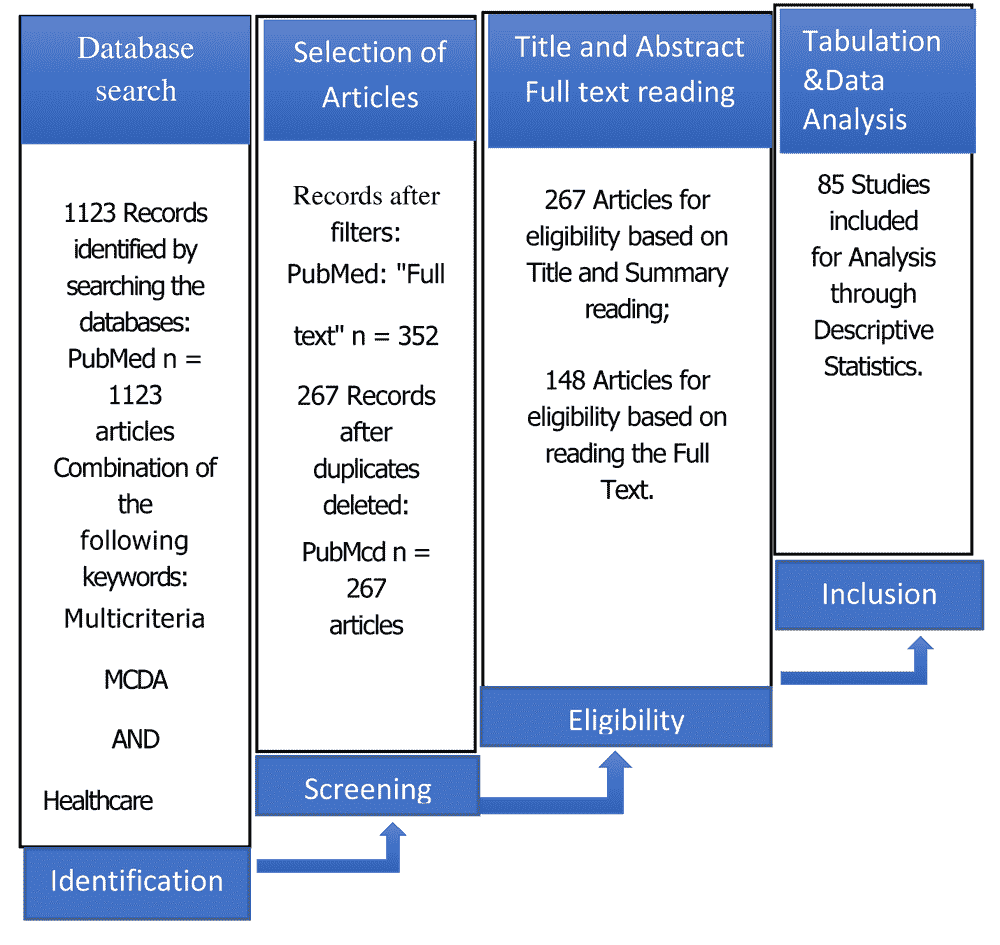 |

收集的数据导出到一个名为 bibliometrix 的 R 包软件中，Biblioshiny

(I) 识别：在 Excel 表中显示的每种技术的每个步骤执行后，识别研究。研究检查了 85 个文档，如表所示。

表 1. 数据主要信息

| 描述 | 结果 |
| --- | --- |
| 来源（期刊、书籍等） | 44 |
| 文档 | 85 |
| 关键词加（ID） | 253 |
| 作者关键词（DE） | 253 |
| 时期 | 2008:2021 |
| 单作者文档 | 4 |
| 每位作者的文档数量 | 0.206 |
| 每篇文档的作者数量 | 4.86 |
| 每篇文档的合著者数量 | 6.24 |
| 合作指数 | 5.91 |
| 作者 | 413 |
| 作者出现次数 | 530 |
| 单作者文档的作者 | 4 |
| 多作者文档的作者 | 409 |

(II) 筛选 对于研究的摘要，应用了筛选，并去除了重复项。

(III) 合格性 在初步文章之后，通过标题、摘要和全文进行搜索。这一阶段包括两个阶段。在第一阶段，进一步查看标题和摘要，以排除可以排除的文章。假设它们涵盖了基本内容，将下载全文。在第二阶段，通过阅读、选择和下载包含的文章。在这个阶段，删除了没有讨论原始研究目标的文章。

(IV) 包含：从文章中分离出的信息包含在一个 Excel 页面中，随后研究计划和程序用于解释信息和详细检查结果。

所展示的分析是在以下阶段进行的：

+   阶段 1：研究设计；

+   阶段 2：数据收集；

+   阶段 3：初步数据分析；

+   阶段 4：描述性文献计量分析；

+   阶段 5：网络分析；

+   阶段 6：结论和对未来研究的方向。

章节的主要焦点

本文探讨了以下研究问题：

+   1. MCDA 的当前研究状况是什么？

+   2. 在这个领域中最有生产力的国家是哪些？

+   3. 这个领域的研究是如何推进的？

+   4. 研究空白和未来研究方向是什么？

结果

| 图 2. 文章关键词云 |
| --- |
| 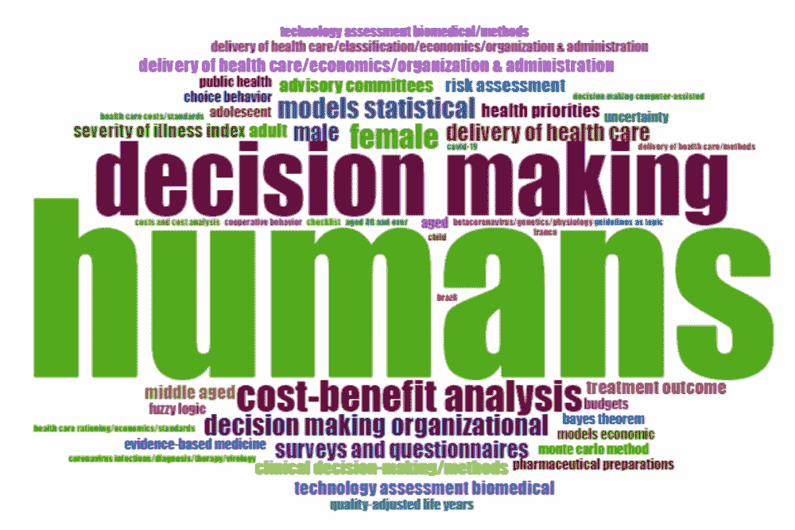 |

图 2 的关键词云是单词出现频率的视觉表示，显示了检查的文本，并作为识别分析焦点的工具。进行了关键词云分析。首先，可以清楚地看到两个最突出的单词是“人类”和“决策制定”。这一发现与研究论文中的研究观点相一致，并且是更重要的术语。

关键词云调查也显示了对探索对患者护理直接重要的领域的需求，并且研究反映了在 MCDA 使用中决策制定过程的非常不同的领域。

| 图 3. 年科学产出 |
| --- |
| 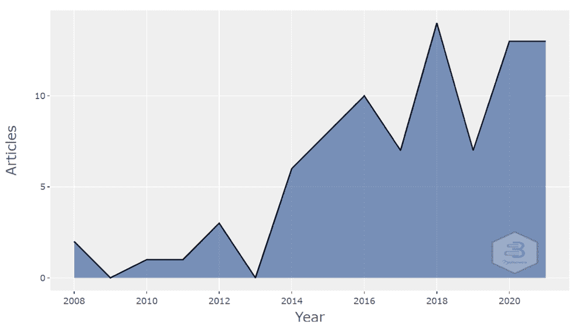 |

本领域发布的文献信息主要分布在 2008 年至 2021 年之间，2008 年之前较少，从 PubMed 提取，利用关键词从 85 篇期刊文章中恢复信息，以帮助分析。从图 3 可以看出，年度增长在 2013 年期间显示出指数增长。再次，分布发展在 2018 年增加，而在 2019 年的模式中下降，然后再次增加。

| 图 4. 主题演变 |
| --- |
| 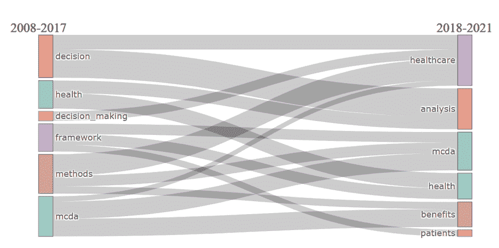 |

图 4 展示了从 2008-21 年主题演变以及对研究各种主题的理解。检查有助于识别研究兴趣以及它们随时间如何推进，并为我们提供了未来探索方向的信息，以及促进应对该领域变化和发展方式的认识，在整个时间范围内认识到许多重大变化。

| 图 5. 发布期刊分析 |
| --- |
| 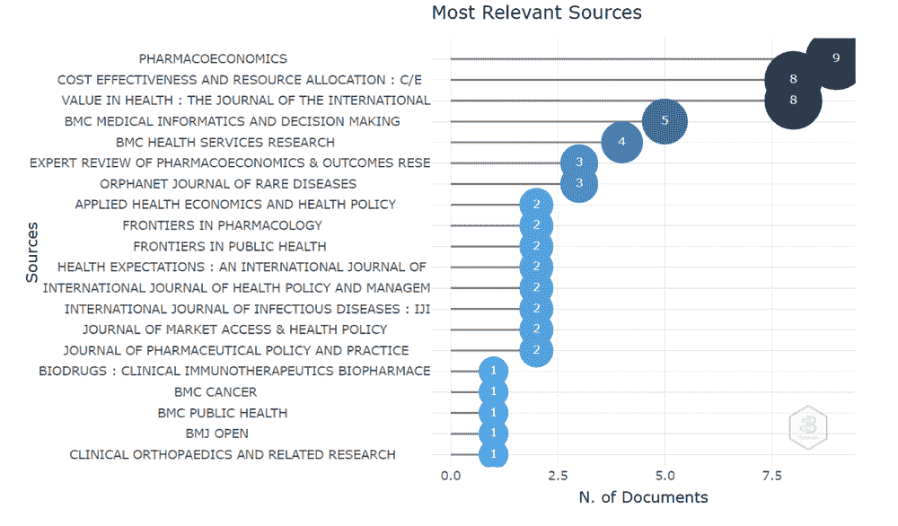 |

分析发表在多标准决策在医疗保健领域最多文章的期刊。从图 5 可以看出，在主题上最多发行的期刊。该领域各种领先期刊出版商，并且在相关领域有不止一篇文章，

| 图 6\. 相应期刊分析 |
| --- |
| 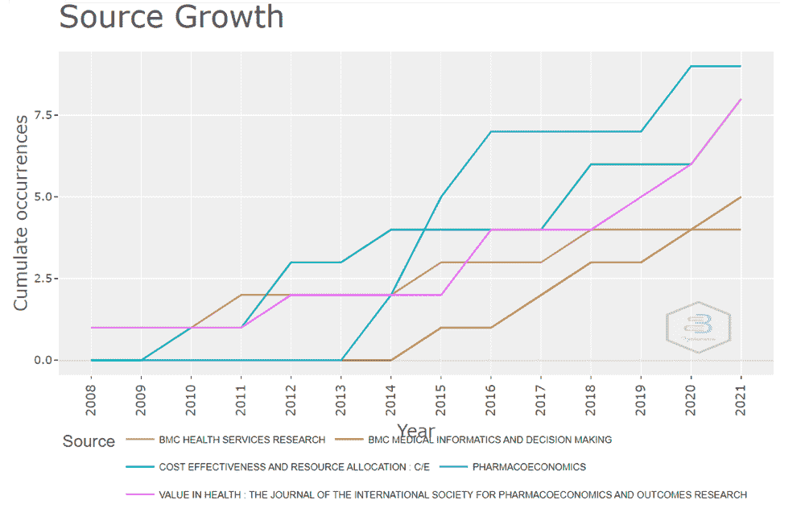 |

正如图 6 所示，在医疗决策领域，它为最分布广泛的期刊来源。 九篇论文在药品经济学方面表现出色。 考虑到其他人发表的文章在医疗领域也在 2016 年之后逐渐增加。

| 图 7\. 卫生保健领域的国家科学产出 |
| --- |
| 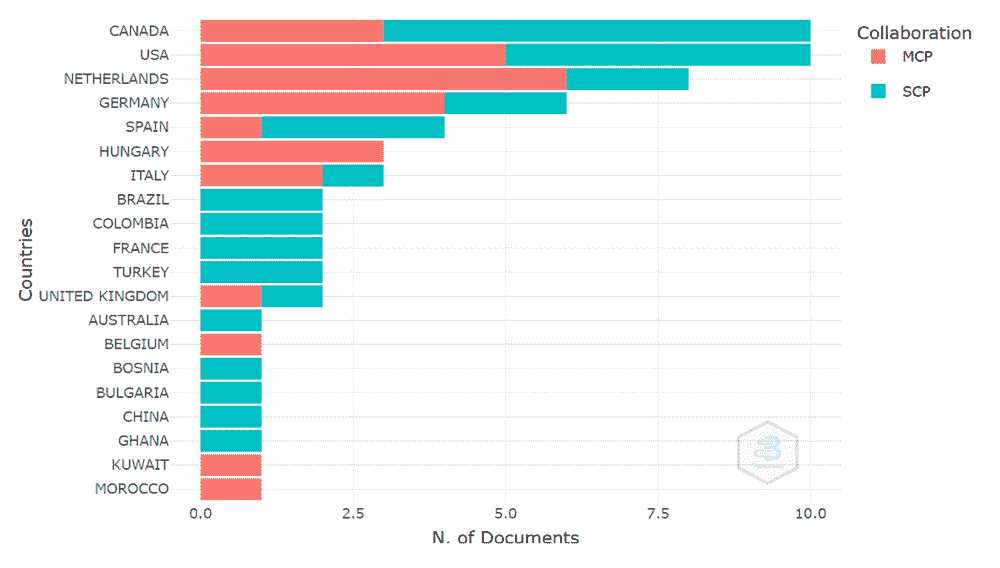 |

按国家划分的科学产出显示在图 7\. 数据由“Biblioshiny”生成，该应用提供了 Bibliometrix R 软件的网络界面。 分析揭示了医疗决策分析和医疗保健领域中最受关注的作者国家。 结果显示，加拿大，美国和荷兰是最明显的，其次是美国和德国。 图示表现了对应作者的图像化表示。

表 2\. 产出和国家合作

| 国家 | 论文 | SCP | MCP | MCP_Ratio |
| --- | --- | --- | --- | --- |
| 加拿大 | 10 | 7 | 3 | 0.3 |
| 美国 | 10 | 5 | 5 | 0.5 |
| 荷兰 | 8 | 2 | 6 | 0.75 |
| 德国 | 6 | 2 | 4 | 0.667 |
| 西班牙 | 4 | 3 | 1 | 0.25 |
| 匈牙利 | 3 | 0 | 3 | 1 |
| 意大利 | 3 | 1 | 2 | 0.667 |
| 巴西 | 2 | 2 | 0 | 0 |
| 哥伦比亚 | 2 | 2 | 0 | 0 |
| 法国 | 2 | 2 | 0 | 0 |
| 土耳其 | 2 | 2 | 0 | 0 |
| 英国 | 2 | 1 | 1 | 0.5 |
| 澳大利亚 | 1 | 1 | 0 | 0 |
| 比利时 | 1 | 0 | 1 | 1 |
| 波斯尼亚 | 1 | 1 | 0 | 0 |
| 保加利亚 | 1 | 1 | 0 | 0 |
| 中国 | 1 | 1 | 0 | 0 |
| 加纳 | 1 | 1 | 0 | 0 |
| 科威特 | 1 | 0 | 1 | 1 |
| 摩洛哥 | 1 | 0 | 1 | 1 |

图例：Country = 对应作者所在国家。

论文 = 对应作者国家的论文数量

SCP = 单一国家出版物。

MCP = 多国出版物

表 2 展示了文章产出和国家合作，检查结果显示了共同努力的协调，然而许多人仅仅一次性合作。

| 图 8\. 随时间推移顶级作者的产量 |
| --- |
| 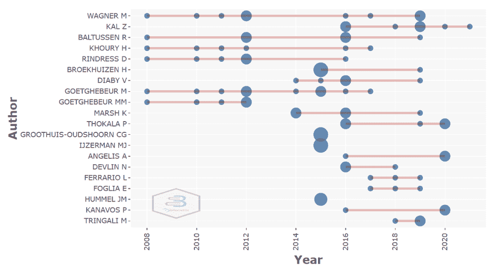 |

对医疗多准则决策领域的顶级作者进行了随时间变化的分析。图 8 的结果显示，Wagner M 在医疗多准则决策方面有更多的研究合作和网络研究。

表 3\. 作者引用

| 序号 | 姓名 | 年份 | 引用 |
| --- | --- | --- | --- |
| 1 | Marsh K, IJzerman M, Thokala P, Baltussen R, Boysen M, Kaló Z, Lönngren T,Mussen F, Peacock S, Watkins J, Devlin N; | 2016 | 337 |
| 2 | Marsh K, Lanitis T, Neasham D, Orfanos P, Caro J. | 2014 | 241 |
| 3 | Guindo LA, Wagner M, Baltussen R, Rindress D, van Til J, Kind P, Goetghebeur MM. | 2012 | 229 |
| 4 | Goetghebeur MM, Wagner M, Khoury H, Levitt RJ, Erickson LJ, Rindress D. | 2008 | 212 |
| 5 | Dolan JG. | 2010 | 189 |
| 6 | Adunlin G, Diaby V, Xiao H. | 2015 | 142 |
| 7 | Tony M, Wagner M, Khoury H, Rindress D, Papastavros T, Oh P, Goetghebeur MM. | 2011 | 132 |
| 8 | Goetghebeur MM, Wagner M, Khoury H, Rindress D, Grégoire JP, Deal C. | 2010 | 125 |
| 9 | Broekhuizen H, Groothuis-Oudshoorn CG, van Til JA, Hummel JM, IJzerman MJ. | 2015 | 109 |
| 10 | Jehu-Appiah C, Baltussen R, Acquah C, Aikins M, d'Almeida SA, Bosu WK, Koolman X, Lauer J, Osei D, Adjei S. | 2008 | 107 |

在文献分析中广泛使用的一个参数是区分主要作品及其被引用的次数。在表 3 中，从 85 个选择中引用的最多的 10 篇文章，以及 2021 年 11 月从数据集中引用的次数。

| 图 9. 合作作者网络分析 |
| --- |
| 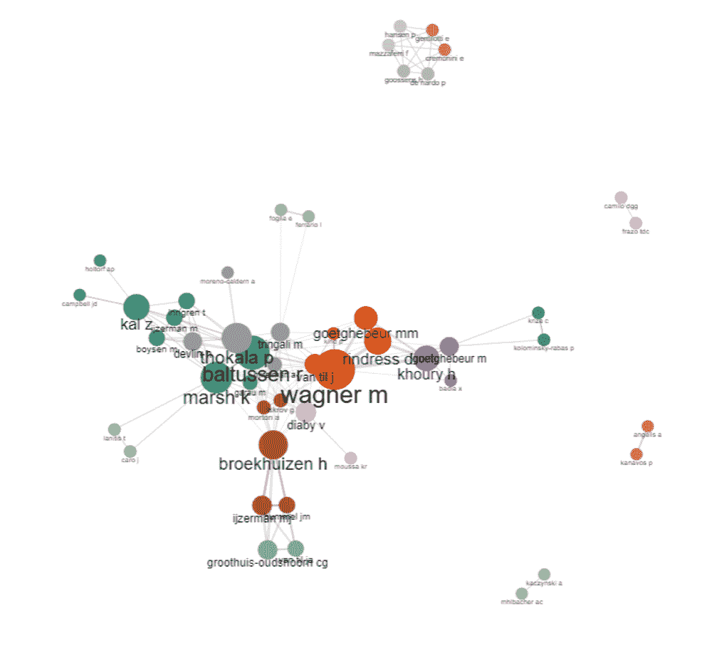 |

图 9 使用 Bibliometrix 包的合作作者网络分析，研究显示了本领域中的其他作者及其合作。这种合作分析有助于突出在各种领域中广泛使用的作者之间最重要的网络，

| 图 10. 三个领域分析（例如作者、国家和关键词） |
| --- |
| 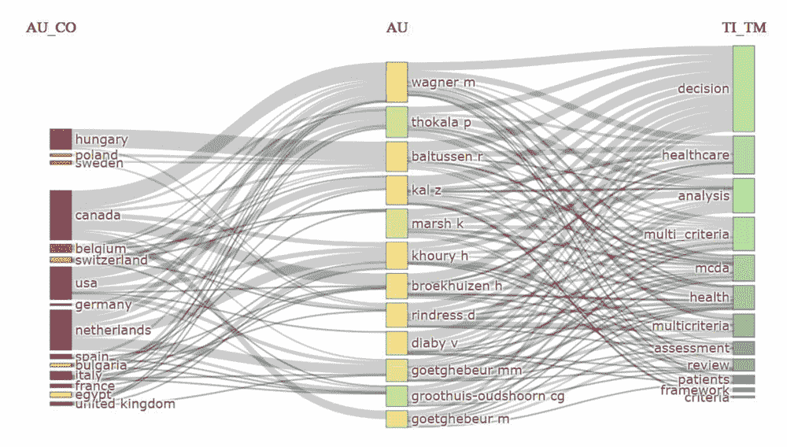 |

三个领域的主要项目之间的关系（例如作者、国家和关键词）如图 10 所示，Sankey 图表。在此，不同的阴影矩形在图表中展示了适用组件。形状的高度取决于图表中方形形状所关注的组件之间的关系的重要性。组件具有的关系越多，表示它的方形形状就越高。研究显示了哪些作者被最频繁地分布以及他们在哪些研究主题中进行了调查。

| 图 11. 合作共现网络作者标题词汇 |
| --- |
| 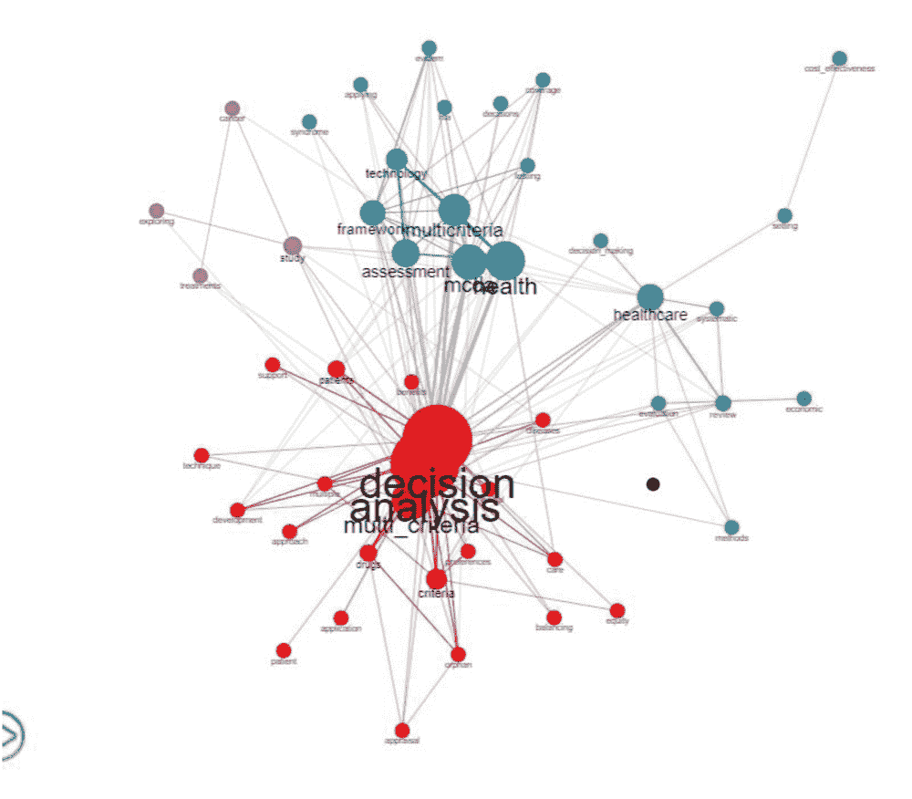 |

作者关键词共现网络分析图 11（最小共现次数）= 3；在文献中帮助作为本领域健康 MDCA 主要主题的指南。为了防止偏差，将数据集分离并进行分析。创建的共现网络地图根据它们的重要性将关键词绘制出来。圆形宽度表示重要性程度，并作为主题重要性的比例。这种共引网络的宝贵方面包括：(I) 节点中心性，(ii) 它们的邻近和扩散 (iii) 强连接，(iv) 群体 (v) 多种连接。

| 图 12. 在健康 MCDA 使用中作者及其标题中使用的词汇 |
| --- |
| 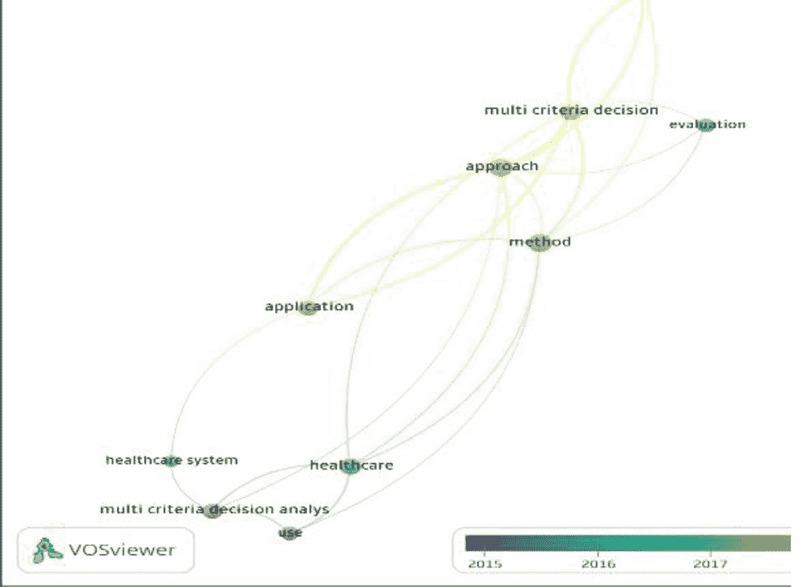 |

讨论和启示

为研究收集的信息提供了垂直的最新发展和它们在健康护理中使用 MCDA 及其对全球各个领域的影响的概述。由于研究合作节省了时间、成本和精力，因此在国际层面上选择该领域的尖端主题进行联合研究以促进发展。

局限性

当前研究区分了许多应用，并在多个健康护理决策领域的多准则决策分析（MCDA）方面进行了大量工作。此外，未包含在标题或摘要中的研究可能被忽视了。尽管这些可能是可能的阻碍，但研究样本提供了足够的数据来激发关于在健康护理中使用 MCDA 方法的讨论。

我们看待 MCDA 方法的观点取决于以前的研究，但重要的是要认识到，为了真正的独立指导，与特定选择和选择者相关的不同观点可能是有关系的。进一步的研究预计将更容易评估这些方法在真正导航方面的适用性和具体的前提条件。

其中一个原因是，MCDA 目前已经与知情的对话相结合，并且建议进一步研究来识别处理不确定性和创建可纳入各种方法的 MCDA 模型的方法。

未来研究方向

这项分析有几个局限性，主要与所使用的文章和选择的文章有关，由于探索的文章只是开放获取的。通过本研究获得的对健康护理中 MCDA 的分析仅限于本研究，未来的研究可以引导更多新的应用和方法，涉及 MCDA 在其他健康护理领域的应用。对于未来的工作，可以包括实际策略的使用以及关注 MCDA 在健康护理中的系统应用。

结论

多准则决策分析（MCDA）程序的使用已经分散，而且它在全球范围内得到应用，并逐渐被用于健康护理。本分析中研究的检查揭示了当前状况，并揭示了 MCDA 应用的重要性。就分析而言，在增加这些技术的使用中看到了一种模式，它们的年度分布有所增加，某些国家的文章比其他国家更多。我们无法找到发展中国家的研究。这表明，大多数研究发生在发达国家，文献计量分析支持了这一观点。通过本调查的数据，可以发现更多的多准则选择分析模型来自健康国家，并且审查可以指导在新的应用和程序中使用 MCDA 于健康护理，以帮助发展中国家和发达国家的落后地区。对于未来的工作，可以进行这种检查，主要关注系统应用 MCDA，而不使用数值方法。

参考文献

Abdullah, A. H., Holtorf, A. P., Al-Hussaini, M., Lemay, J., Alowayesh, M., & Kaló, Z. (2019). 利益相关者驱动的开发用于购买非专利药品的多准则决策分析工具。药物政策与实践杂志，12(1)，1-7。doi:10.1186/s40545-019-0171-4

Adunlin, G., Diaby, V., & Xiao, H. (2015). 健康护理中多准则决策分析的应用：系统评价和文献计量分析。健康预期，18(6)，1894-1905。doi:10.1111/hex.12287

Angelis, A., & Kanavos, P. (2016). 对新医疗技术进行价值评估：向应用于健康技术评估的稳健方法学框架迈进。药物经济学，34(5)，435-446。doi:10.1007/s40273-015-0370-z

Angelis, A., Kanavos, P., & Phillips, L.D. (2020). ICER 价值框架 2020 更新：关于效益聚合和情境考虑的推荐。健康经济学杂志，23(8)，1040-1048。10.1016/j.jval.2020.04.1828

Angelis, A., Thursz, M., Ratziu, V., O’brien, A., Serfaty, L., Canbay, A., Schiefke, I., Costa, J. B. E., Lecomte, P., & Kanavos, P. (2020). 非酒精性脂肪性肝病药物研发过程中的早期健康技术评估：两轮、跨国、多准则决策分析。医学决策制定，40(6)，830-845。doi:10.1177/0272989X20940672

Avila, M. L., Brandão, L. R., Williams, S., Montoya, M. I., Stinson, J., Kiss, A., & Feldman, B. M. (2016). 开发 CAPTSureTM - 用于评估儿童后血栓性综合征的新指数。血栓与止血杂志，14(12)，2376-2385。doi:10.1111/jth.13530

Baltussen, R., Marsh, K., Thokala, P., Diaby, V

布赖特，R., 内迪奥，S., 阿伯特，C., 布赖恩特，G., 迪恩斯，A., & 格雷夫斯，N. (2019). 开发和一个多元准则决策分析(MCDA)工具用于卫生服务管理员。BMJ 开放，9(4), e025752。doi:10.1136/bmjopen-2018-025752

博加瓦-斯托亚诺耶维奇，N., & 杰利奇-伊万诺维奇，Z. (2017). 成本效益实验室：实验室测试的经济评估实施。医学生物化学杂志，36(3)，238-242。doi:10.1515/jomb-2017-0036

鲍尔，J., 切 ynes，H., 莫尔德，G., 米勒，M., 佩奇，M., 哈里斯，F., & 比克，D. (2018). 出生后服务重新设计的多元准则资源分配模型。BMC 健康服务研究，18(1), 656。doi:10.1186/s12913-018-3430-1

布雷顿尼，A., 费拉里奥，L., & 福吉拉，E. (2019). HT A 和新型治疗评价：转移性去势抵抗性前列腺癌案例。临床经济学和结果研究，11，283-300。doi:10.2147/CEOR.S189436

布鲁克海乌森，H., 格罗 oothuis-奥乌尔斯 horn，C. G., 霍伯，A. B., 扬森，J. P., & 伊杰 erman，M. J. (2015). 使用概率多准则决策分析估计医疗治疗对患者价值。BMC 医学信息学与决策制定，15(1), 102。doi:10.1186/s12911-015-0225-8

布鲁克海乌森，H., 格罗 oothuis-奥乌尔斯 horn，C. G., 范蒂尔，J. A., 霍默，J. M., & 伊杰 erman，M. J. (2015). 处理多准则决策分析中医疗决策不确定性的方法综述与分类。药物经济学，33(5), 445-455。doi:10.1007/s40273-014-0251-x

卡米洛，D. G. G., 德索萨，R. P., 弗拉扎，T. D. C., & 达科斯塔，J. F. 小。 (2020). 卫生领域多准则分析：圣诞节期间急诊科最合适的三级系统选择。BMC 医学信息学与决策制定，20(1), 1-16。doi:10.1186/s12911-020-1054-y

卡波利纳，A. G. (2018). 基于价值的医学肿瘤学：在新兴价值框架中观点的重要性。 Clinics (圣保罗，巴西)，73(增刊 1)，e470s。doi:10.6061/clinics/2018/e470s

卡斯特罗，H.E., 莫雷诺-马塔尔，O., & 里维 illas，J.C. (2018). 仅 HTA 和 MCDA 或联合使用？哥伦比亚优先级设置案例。成本效益与资源分配，16(1), 1-7。10.1186/s12962-018-0127-6

克莱姆普特，I., 德弗里斯，S., 科恩，L., & 韦斯特霍文，R. (2018). 用于排名医疗保健中未满足需求的多准则决策方法。健康政策，122(8), 878-884。10.1016/j.healthpol.2018.06.010

Clemente-Suárez, V. J., Navarro-Jiménez, E., Ruisoto, P., Dalamitros, A. A., Beltran-Velasco, A. I., Hormeño-Holgado, A., Laborde-Cárdenas, C. C., & Tornero-Aguilera, J. F. (2021). 新冠疫情大流行期间紧急系统模糊多标准决策分析的性能：一项广泛的叙述性回顾. 国际环境研究与公共卫生杂志 , 18(10), 5208. doi:10.3390/ijerph18105208

De Nardo, P., Gentilotti, E., Mazzaferri, F., Cremonini, E., Hansen, P., Goossens, H., Tacconelli, E., Mangoni, E.D., Florio, L.L., Zampino, R., & Mele, F. (2020). 在医院床位短缺的低资源环境中，使用多标准决策分析优先安排 COVID-19 患者的住院治疗. 国际传染病杂志 , 98, 494-500. .10.1016/j.ijid.2020.06.082

Diaby, V., & Goeree, R. (2014). 如何使用多标准决策分析方法为医疗保健中的报销决策制定：分步指南. 专家评论药物经济学与结果研究 , 14(1), 81–99. doi:10.1586/14737167.2014.859525

Diaby, V., Sanogo, V., & Moussa, K. R. (2016). ELICIT：一种用于医疗保健多标准决策分析的不精确权重 elicitation 技术. 专家评论药物经济学与结果研究 , 16(1), 141–147. doi:10.1586/14737167.2015.1083863

Diaz-Ledezma, C., Lichstein, P. M., Dolan, J. G., & Parvizi, J. (2014). 诊断 Medicare 患者人工关节周围感染的多标准决策分析. 临床骨科和相关研究 , 472(11), 3275–3284. doi:10.1007/s11999-014-3492-2

Dolan, J. G

Dowie, J., & Kaltoft, M. K. (2018). 从快速推荐到在线偏好敏感决策支持：主动脉瓣严重狭窄的案例. 医学科学(瑞士巴塞尔) , 6(4), E109. doi:10.3390/medsci6040109

Drake, J. I., de Hart, J. C. T., Monleón, C., Toro, W., & Valentim, J. (2017). 利用多标准决策分析(MCDA)支持医疗决策制定 FIFARMA, 2016. 市场接入与健康政策杂志 , 5(1), 1360545. doi:10.1080/20016689.2017.1360545

Dubromel, A., Duvinage-Vonesch, M. A., Geffroy, L., & Dussart, C. (2020). 医疗决策制定中的组织方面：文献回顾. 市场接入与健康政策杂志 , 8(1), 1810905. doi:10.1080/20016689.2020.1810905

Dukhanin, V., Searle, A., Zwerling, A., Dowdy, D.W., Taylor, H.A., & Merritt, M.W. (2018). 将社会正义问题融入医疗保健和公共卫生经济学评价：系统评价. 社会科学与医学 , 198, 27-35. 10.1016/j.socscimed.2017.12.012

Fasseeh, A., Karam, R., Jameleddine, M., George, M., Kristensen, F. B., Al-Rabayah, A. A., Alsaggabi, A. H., El Rabbat, M., Alowayesh, M. S., Chamova, J., Ismail, A., Abaza, S., & Kaló, Z. (2020). 中东和北非实施卫生技术评估：现状与理想状态的比较. 药理学前沿 Frontiers in Pharmacology , 11, 15. 参考文献: 10.3389/fphar.2020.00015

Frazão, T. D. C., Camilo, D. G. G., Cabral, E. L. S., & Souza, R. P. (2018). 健康护理中多准则决策分析（MCDA）的应用：系统回顾主要特征和方法学步骤. 医学信息与决策 BMC Medical Informatics and Decision Making , 18(1), 90. 参考文献: 10.1186/s12911-018-0663-1

Garau, M., Hampson, G., Devlin, N., Mazzanti, N. A., & Profico, A. (2018). 应用多准则决策分析（MCDA）方法征求意大利利益相关者的偏好：关于 Obinutuzumab 对 Rituximab 难治性惰性非霍奇金淋巴瘤（iNHL）的案例研究. 药物经济学开放 , 2(2), 153–163. 参考文献: 10.1007/s41669-017-0048-x

Goetghebeur, M. M., Wagner, M., Khoury, H., Levitt, R. J., Erickson, L. J., & Rindress, D. (2008). 证据与价值：对决策制定的影响——EVIDEM 框架及其潜在应用. 卫生服务研究 BMC Health Services Research , 8(1), 270. 参考文献: 10.1186/1472-6963-8-270

Goetghebeur, M.M., Wagner, M., Khoury, H., Rindress, D., Grégoire, J.P., & Deal, C. (2010). 结合多准则决策分析、伦理和卫生技术评估：应用 EVIDEM 决策框架对 Turner 综合症患者生长激素进行评估. 成本效益与资源分配 Cost Effectiveness and Resource Allocation, 8, 4. 参考文献: 10.1186/1478-7547-8-4

Guarga, L., Badia, X., Obach, M., Fontanet, M., Prat, A., Vallano, A., Torrent, J., & Pontes, C. (2019). 实施反思性多准则决策分析（MCDA）以评估加泰罗尼亚卫生服务（CatSalut）中孤儿药物的价值. 罕见病杂志 Orphanet Journal of Rare Diseases , 14(1), 1–9. 参考文献: 10.1186/s13023-019-1121-6

Guindo, L.A., Wagner, M., Baltussen, R., Rindress, D., van Til, J., Kind, P., & Goetghebeur, M.M. (2012). 从功效到公平：关于资源分配和卫生决策制定的决策标准文献综述. 成本效益与资源分配 Cost Effectiveness and Resource Allocation, 10(1), 9. 参考文献: 10.1186/1478-7547-10-9

Hall, W. (2017). 在成本效益分析中不要忽视社会价值——对普遍健康保险优先级设定的评论：我们需要证据指导的审议过程，而不仅仅是更多关于成本效益的证据. 国际卫生政策与管理 国际 Journal of Health Policy and Management , 6(9), 543–545. 参考文献: 10.15171/ijhpm.2017.03

Holtorf,

伊 skrov（Iskrov）等人（2016）。孤儿药评估和评估的多标准决策分析。《公共卫生前沿》杂志，4，214。DOI: 10.3389/fpubh.2016.00214。

雅各布（Jakab）等人（2021）。患者和支付者对额外价值标准的偏好。《药物学前沿》杂志，12，690021。DOI: 10.3389/fphar.2021.690021。

扬森（Janssen）等人（2015）。健康护理背景下优先考虑结果的方法描述性综述。《健康期望》杂志，18（6），1873-1893。DOI: 10.1111/hex.12256。

杰胡-阿皮亚（Jehu-Appiah）等人（2008）。在加纳平衡公平与效率的健康优先事项：使用多标准决策分析。《价值健康：国际药物经济学和结果研究杂志》11（7），1081-1087。DOI: 10.1111/j.1524-4733.2008.00392。

卡里米（Karimi）等人（2021）。使用多标准决策分析评估复杂健康和社会护理计划：阿姆斯特丹北部《价值健康》杂志，24（7），966-975。DOI: 10.1016/j.jval.2021.02.007。

卡里米（Karimi）等人（2021）。使用多标准决策分析评估阿姆斯特丹北部的复杂健康和社会护理计划《价值健康》杂志，24（7），966-975。DOI: 10.1016/j.jval.2021.02.007。

卡 rer（Karrer）等人（2021）。探索使用 MCDA 方法对甲状腺结节当前干预的医生和患者视角。《成本效益与资源分配》杂志，19（1），26。DOI: 10.1186/s12962-021-00279-3。

克拉默（Klamer）等人（2021）。在比利时对 98 种传染病进行未来监测、预防和控制的优先排序：2018 年多标准决策分析研究。《公共卫生 BMC》杂志，21（1），192。DOI: 10.1186/s12889-020-09566-9。

科拉萨（Kolasa）等人（2018）。波兰对孤儿药的评估——多标准决策分析。《罕见病杂志》13（1），67。DOI: 10.1186/s13023-018-0803-9。

克雷默（Kremer）等人（2021）。基于多标准决策分析的疾病修饰药物的多发性硬化症决策辅助。《医学信息与决策制定》杂志，21（1），123。DOI: 10.1186/s12911-021-01479-w。

吕沃斯奇, V. E.，马伊南, M.，塔扎尔乌特, K.，迪亚洛, M. L.，哈贾德贾布托, C.，蓬松-凯尔让, N.，拉波斯特尔, F.，&杜斯 art, C.（2020）。考虑急诊科治疗创新的多标准决策分析方法：急性创伤疼痛中甲氧氟烷的组织影响。 《PLoS One》 , 15(4), e0231571。DOI:10.1371/journal.pone.0231571

马什, K.，伊杰曼, M.，索拉, P.，巴尔图森, R.，卡洛, Z.，隆格伦, T.，穆森, F.，皮克 ock, S.，沃特金斯, J. &德夫林, N（2016）。多标准决策分析在医疗决策制定中的使用-新兴良好实践：ISPOR MCDA 新兴良好实践任务组的报告 2。《价值在健康：国际药物经济学和结果研究学会杂志》 , 19(2), 125-37。10.1016/j.jval.2015.12.016

马什, K.，拉尼提斯, T.，内沙姆, D.，奥尔法恩, P.，&卡罗, J.（2014）。使用多标准决策分析评估医疗干预的价值：文献回顾。《药物经济学》 , 32(4), 345–365。DOI:10.1007/s40273-014-0135-0

米尔松, I.，瓦格, A.，奥尔克, M.，&查普尔, C.（2021）。哪种药物最适合过度活跃的膀胱？从患者的期望到医生的决定。《国际临床实践》 , 75(4), e13870。DOI:10.1111/ijcp.13870

莫 iot, J., 瓦格

米尔曼, A., 门特兹 akis, E., 基恩特, E., 帕奥卢 cci, F., 福达姆, R., 大岛, S., 费尔拉, M., 巴尔图森, R. & 尼伊森, L.W. (2012)。五个国家国家政策制定者在决策过程中的决策标准：一个用离散选择实验引出的相对偏好，用于公平和效率。 《价值在健康：国际药物经济学和结果研究学会杂志》 , 15(3), 534-539。.10.1016/j.jval.2012.04.001

莫克里尼, A. E.，&奥乌姆, T.（2020）。一个模糊多标准决策分析方法，用于评估医疗物流外包中的风险：摩洛哥案例。《健康服务管理研究》 , 33(3), 143–155。DOI:10.1177/0951484820901668

莫雷诺-加尔达ón, A.，唐, T. S.，&索拉, P.（2020）。医疗优先级设置中的多标准决策分析软件：系统评价。《药物经济学》 , 38(3), 269–283。DOI:10.1007/s40273-019-00863-9

莫顿, A.（2014）。在医疗优先级排序中对健康不平等的厌恶：多标准优化视角。《健康经济学杂志》 , 36, 164–173。DOI:10.1016/j.jhealeco.2014.04.005

米 hlbacher, A. C.，&卡钦斯基, A.（2016）。在医疗保健中使用多标准决策分析做出良好决策：MCDA 的使用、当前研究和未来发展。《应用健康经济学和健康政策》 , 14(1), 29–40。DOI:10.1007/s40258-015-0203-4

[尼梅斯等人](https://wiki.example.org/feynmans_learning_method)（2019）。在多准则决策分析框架中比较低中和中收入国家医疗保健中使用的加权方法。比较效果研究杂志，8（4），195-204。DOI：10.2217/cer-2018-0102

[尼古拉斯等人](https://wiki.example.org/feynmans_learning_method)（2018）。双胎输血综合症与母体症状学——对患者报告投诉的探索性分析。患者体验杂志，5（2），134-139。DOI：10.1177/2374373517736760

[奥利维拉等人](https://wiki.example.org/feynmans_learning_method)（2019）。健康技术评估的多准则决策分析：为提高艺术状态解决方法学挑战。欧洲健康经济学杂志，20（6），891-918。DOI：10.1007/s10198-019-01052-3

[奥塔迪等人](https://wiki.example.org/feynmans_learning_method)（2017）。腰椎融合的的一次性和可重复使用椎弓根螺钉工具包的比较分析：整合 HTA 和 MCDA。健康经济学评论，7（1），1-10。DOI：10.1186/s13561-017-0153-7

[ Öztürk 等人](https://wiki.example.org/feynmans_learning_method)（2020）。健康技术评估和土耳其透析替代品决策模型新方法。国际环境研究与公共卫生杂志，17（10），E3608。DOI：10.3390/ijerph17103608

[皮亚焦等人](https://wiki.example.org/feynmans_learning_method)（2021）。设计适应低资源环境的医疗设备的一个框架。全球健康杂志，17（1），64。DOI：10.1186/s12992-021-00718-z

[皮纳兹等人](https://wiki.example.org/feynmans_learning_method)（2021）。多准则决策分析方法在策略扩展中的应用，以玻利维亚恰加斯病管理为例。PLoS neglected tropical diseases，15（3），e0009249。DOI：10.1371/journal.pntd.0009249

[波斯特姆等人](https://wiki.example.org/feynmans_learning_method)（2018）。可能的益处和癌症治疗方法风险之间个体权衡：来自多发性骨髓瘤患者的声明偏好研究的结果。肿瘤学家，23（1），44-51。DOI：10.1634/theoncologist.2017-0257

[波斯特姆等人](https://wiki.example.org/feynmans_learning_method)（2014）。多准则决策分析视角下的医疗干预措施的健康经济学评估。欧洲健康经济学杂志。HEPAC 健康经济学在预防和护理，15（7），709-716。DOI：10.1007/s10198-013-0517-9

Puška, A., Stević, Ž., & Pamučar, D. (2021). 使用扩展的可持续性标准和多标准分析方法评估和选择医疗废物焚烧炉。环境、发展与可持续性，1–31。doi:10.1007/s10668-021-01902-2

Ruggeri, M., Cadeddu, C., Roazzi, P., Mandolini, D., Grigioni, M., & Marchetti, M. (2020). 多标准决策分析（MCDA）对健康创新进行前景扫描的应用：应用于 COVID-19 紧急情况。国际环境研究与公共卫生杂志，17(21)，E7823。doi:10.3390/ijerph17217823

Sarwar, A., & Imran, M. (2021). 优先考虑感染预防和控制活动以应对 SARS-CoV-2（COVID-19）：一种多标准决策分析方法。医疗保健领导杂志，13，77–84。doi:10.2147/JHL.S292606

Schey, C., Krabbe, P. F., Postma, M. J., & Connolly, M. P. (2017). 多标准决策分析（MCDA）：测试一个拟议的 MCDA 框架对孤儿药物。罕见病杂志，12(1)，10。doi:1

Suner, A., Oruc, O. E., Buke, C., Ozkaya, H. D., & Kitapcioglu, G. (2017). 利用多属性效用理论和层次分析过程方法分析传染病学和临床微生物学专家对手卫生的偏好。BMC 医学信息学与决策制定，17(1)，129。doi:10.1186/s12911-017-0528-z

Tony, M., Wagner, M., Khoury, H., Rindress, D., Papastavros, T., Oh, P., & Goetghebeur, M. M. (2011). 桥接健康技术评估（HTA）与多标准决策分析（MCDA）：在加拿大一个公共支付者进行覆盖决策的 EVIDEM 框架现场测试。BMC 健康服务研究，11(1)，329。doi:10.1186/1472-6963-11-329

van den Bogaart, E.H.A., Kroese, M.E.A.L., Spreeuwenberg, M.D., Ruwaard, D., & Tsiachristas, A. (2021). 经济评估新型护理模式：成本效用分析与多标准决策分析之间的决策是否改变。健康价值：国际药物经济学与结果研究学会杂志，24(6)，795-803。10.1016/j.jval.2021.01.014

van Til, J., Groothuis-Oudshoorn, C., Lieferink, M., Dolan, J., & Goetghebeur, M. (2014). 技术是否重要；一项探索多标准决策支持框架加权技术的试点研究。成本效益与资源分配，12，22。10.1186/1478-7547-12-22

Vettoretto, N., Foglia, E., Ferrario, L., Arezzo, A., Cirocchi, R., Cocorullo, G., Currò, G., Marchi, D., Portale, G., Gerardi, C., Nocco, U., Tringali, M., Anania, G., Piccoli, M., Silecchia, G., Morino, M., Valeri, A., & Lettieri, E. (2018). 为什么腹腔镜医生可能会选择三维视图：S.I.C.E.（意大利腹腔镜外科及新技术学会）关于 3D 与 2D 腹腔镜的全面 HTA 报告摘要。外科内镜杂志，32(6)，2986–2993。doi:10.1007/s00464-017-6006-y

维拉努埃瓦，V.，卡雷诺，M.，吉尔-纳格尔，A.，塞拉诺-卡斯特罗，P.J.，塞拉托萨，J.M.，托莱多，M.，阿尔瓦雷兹-巴隆，E.，吉尔，A. &苏比阿兹-拉巴尤，S.（2021）。通过多准则决策分析（MCDA）确定西班牙药物耐药性癫痫（DRE）患者局灶性发作癫痫（FOS）治疗中的关键未满足需求和价值驱动因素。癫痫与行为，122，108222。10.1016/j.yebeh.2021.108222

瓦格纳，M.，科胡里，H.，贝内特斯，L.，贝托，P.，埃雷特，J.，巴迪亚，X. &戈特盖贝尔，M.（2017）。评估仑伐替尼治疗碘难治性分化型甲状腺癌的整体价值：应用实用 MCDA 的多国研究。BMC 癌症，17（1），272。DOI：10.1186/s12885-017-3258-9

瓦格纳，M.，科胡里，H.，威尔莱特，J.，林德雷斯，D. &戈特盖贝尔，M.（2016）。EVIDEM 框架能解决评估罕见病治疗所提出的问题吗？分析问题与政策，以及特定情境下的适应。药物经济学，34（3），285-301。DOI：10.1007/s40273-015-0340-5

瓦格纳，M.，萨马哈，D.，卡斯卡诺，R.，布劳姆，M.，阿布里沙米，P.，佩特里，C.，阿沃加，B.，曼托瓦尼，L.，萨里亚-桑塔 amera，A.，金德，P.，施兰德，M. &特里纳利，M.（2019）。朝着合理性负责制迈进——系统探索合法医疗保健覆盖决策过程特征，以罕见疾病和再生疗法为案例研究。国际健康政策与管理杂志，8（7），424-443。DOI：10.15171/ijhpm.2019.24

瓦尔特斯特，P.，戈特盖贝尔，M.，克日什科夫斯基，C.，内德兰德，C.，&科尔莫 insky-拉巴斯，P.（2015）。在不同医疗创新阶段平衡成本与收益：系统回顾多准则决策分析（MCDA）的应用。BMC 健康服务研究，15（1），262。DOI：10.1186/s12913-015-0930-0

瓦尔特斯特，P.，戈特盖贝尔，M.，沙勒，S.，克日什科夫斯基，C. &科尔莫 insky-拉巴斯，P.（2015）。探讨德国医疗保健利益相关者对医疗技术评估的视角和偏好，以肺心脏传感器为案例研究的 multi-criteria assessment。健康研究政策与系统，13（1），24。DOI：10.1186/s12961-015-0011-1

王，J.，陈，H.，林，X.，季，C. &陈，B.（2020）。多重交叉扩增——检测呼吸机相关肺炎（VAP）中鲍曼不动杆菌的一个更适用技术。重症监护（伦敦，英格兰），24（1），306。DOI：10.1186/s13054-020-03003-4

沃森，M.（2018）。关于 MCDA 工具应用的

杨，C.，王，Y.，胡，X.，陈，Y.，钱，L.，李，F.，... 蔡，X.（2021）。利用健康技术评估和多准则决策分析改进基于医院的医疗采购决策。询问，58。.10.1177/00469580211022911

Zamora, B., Garrison, L.P., Unuigbe, A., & Towse, A. (2021). 协调 ACEA 和 MCDA：美国医疗保健环境中测量成本效益的方法。成本效益和资源分配，19(1)，13。.10.1186/s12962-021-00266-8

Zozaya, N., Martínez-Galdeano, L., Alcalá, B., Armario-Hita, J.C., Carmona, C., Carrascosa, J.M., Herranz, P., Lamas, M.J., Trapero-Bertran, M., & Hidalgo-Vega, Á. (2018). 确定两种生物药物对慢性炎症性皮肤疾病价值的 multi-criteria decision analysis。BioDrugs, 32(3)，281-91。10.1007/s40259-018-0284-3

附加阅读

Carnero, M. C., & Gómez, A. (2016). 应用于改善医疗保健组织维护政策的 multicriteria decision making 方法。BMC 医疗信息学与决策制定，16(1)，1-22。DOI:10.1186/s12911-016-0282-7

Diaby, V., Campbell, K., & Goeree, R. (2013). 多准则决策分析（MCDA）在医疗保健中的应用：一项文献计量分析。医疗保健运营研究，2(1-2)，20-24。DOI:10.1016/j.orhc.2013.03.001

Marsh, K., Caro, J. J., Hamed, A., & Zaiser, E. (2017). 增强每个患者的声音：涉及患者的 multi-criteria decision analyses 的系统评价。应用健康经济学和健康政策，15(2)，155-162。DOI:10.1007/s40258-016-0299-1

Tanios, N., Wagner, M., Tony, M., Baltussen, R., van Til, J., Rindress, D., Kind, P., & Goetghebeur, M. M. (2013, October). 医疗保健决策中考虑哪些标准？来自国际政策制定者和临床决策者的调查。国际医疗技术评估杂志，29(4)，456-465。DOI:10.1017/S0266462313000573

关键术语和定义

标准：标准是具体和可衡量的成果。一个广泛的标准表明了改进的方向。

MCDA 问题的要素：决策者（们）、备选方案和标准。

目标：目标与未来的预期绩效结果相连接。

MCDA：多准则决策分析是一种动态的检查，评估决策过程中的多个（冲突）标准。

MCDA 程序：价值缩放（或标准化）、标准权重和组合（决策）规则。

目标：目标是追求其最大限度，或者可能展示所需变革的方向。
