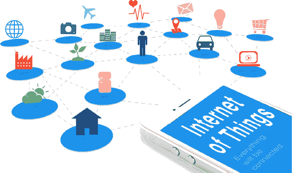
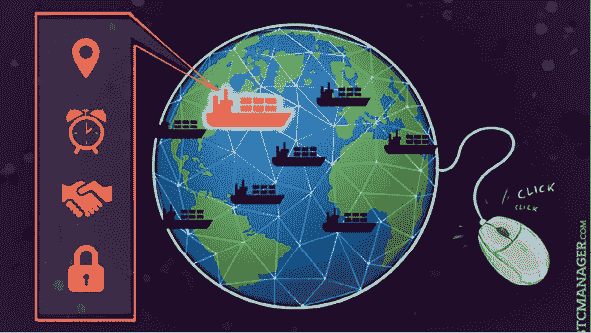
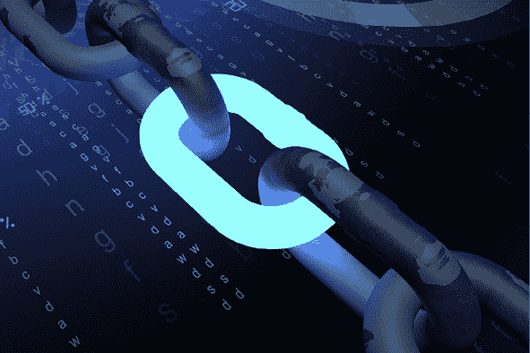
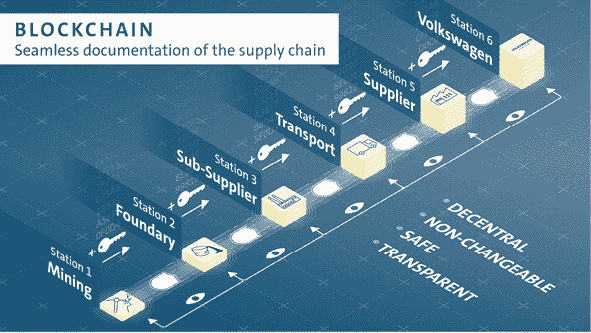
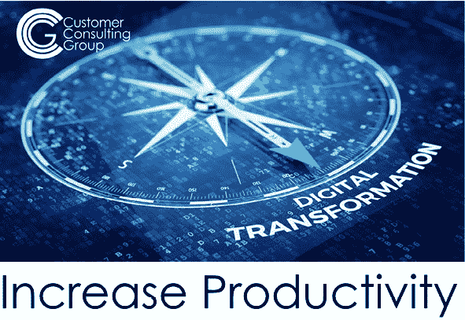
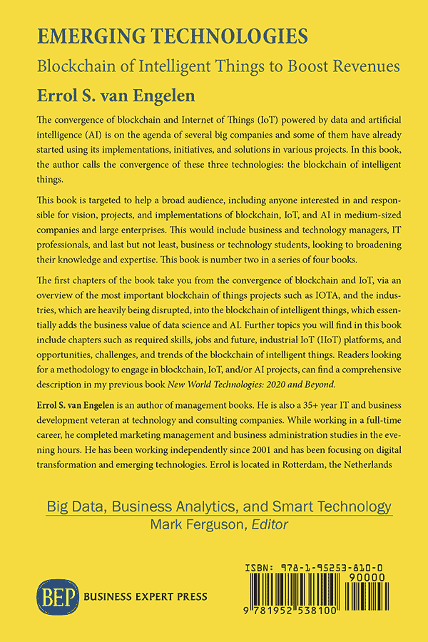

第一章

物链

鉴于网络安全犯罪的 history，物联网（IoT）系统今天并不安全。黑客可能会攻击不同的组件——物理设备、网络、加密或软件。这意味着隐私、安全性和身份验证的明显问题必须得到解决。

这进一步暗示了，企业的基础物联网系统将不得不包括许多不同的组成部分——一个安全平台、管理设备的边缘层、上下文规则、多种协议、各种数据格式和存储。当然，所有这些元素都将在独特的、动态的网络之间实现互操作。

我们当前的 IT 系统似乎根本无法胜任这些大型任务。它们经常无法提供所需的安全性，导致用户数据暴露在不被授权的各方，从而产生危险。区块链技术或许不是解决物联网（IoT）所面临的所有挑战的灵丹妙药，但它确实能帮助解决其中一些主要问题。由于物联网应用具有分布式特性，因此应用分布式账本技术（DLT）——区块链所提供的技术——是合理的。

区块链技术解决了信任、隐私、单点故障、可扩展性、记录保存、时间戳和一致可靠性等问题。与物联网结合，它可能建立一个健康的系统，允许设备在网络上自我注册和验证，而业务活动可以通过智能合约自动执行。 图 1.1 是区块链与物联网合并的图表。

在这种系统中，不用担心服务中断或身份盗窃等攻击，因为系统没有单点故障。

为了说明基于区块链的物联网系统的优势，想象一个具有复杂贸易路线和物流的商业环境，例如快递服务。将采用分布式账本跟踪和记录每个物品或包裹所发生的一切。这将提供物品和包裹的来源透明度、它们当前的递送状态等。

图 1.1 物链

来源：Bloctonite

将这两种技术应用在一起的可能性是无限的。再举一个例子：保险。区块链在保险中的主要用例将是智能合约以及增强其他几个元素，如处理索赔。

尽管成功可能看起来遥不可及，物联网正在到来，而像区块链这样的分布式账本技术将处于其中心。如果您拥有企业，现在是开始探索从物联网中获益的方式的时候了，否则您将会落后。

什么是区块链？

在它的最简单形式中，区块链允许各方共同创建一个永久性、不可更改且透明的交换和处理记录，而不需要依赖中心权威。在前几代数字技术中，数据和信息以及如何更快速、更安全地进行交换是关键，而区块链是关于价值的交换以及如何使其即时化和去中心化。

在这个背景下，许多人认为区块链是自 20 世纪 60 年代以来一直在进行的数字化的一个部分。但是，尽管区块链无疑是这一过程的一部分，但它也与之有着显著的差异。以前的技术是关于让相同的商业过程变得更快、更高效。区块链是关于彻底重新定义商业流程的实施方式，甚至是它们最初的设计方式。

区块链是如何工作的？

在所有区块链交易中，有四个基本组成部分：

共识协议：它管理着交易如何在成员之间被记录和达成一致。它消除了需要通过集中化的信息，比如通过孤立的数据库，来证明交易的有效性。

这可能是与区块链相关联的最大的突破，因为它让彼此不信任的各方能够达成一致。它还防止了“双重花费”问题的发生，在比特币出现之前，这一直是数字货币面临的最大问题。“双重花费”问题是指因为数字币或代币可以像在 Word 文档中剪切和粘贴一样被复制，从而可以被多次花费。共识协议也可以防止欺诈交易被错误地验证。

账本：当人们讨论区块链时，很多人所指的是这个。这是一个存储在分布式对等网络服务器上的所有交易的公共记录。一旦交易被验证，它就会被添加到账本作为一个“区块”。

奖励或激励：一个区块链解决方案需要一个奖励系统，比如“矿工”获得比特币或以太币，或一个激励机制，以确保竞争性利益保持一致。

在比特币和以太坊中，挖矿是将一定时间周期内执行的交易添加到账本的过程，也是网络节点达到安全、防篡改共识的手段。矿工通过完成复杂的数学问题来确认区块内的交易，以便能够将它们记录在账本上。他们通过完成这些数学问题获得比特币的支付（或奖励）。所有的矿工争相成为第一个解决允许他们将交易记录到账本上的数学问题的人。在比特币中，这被称为“工作量证明”。

矿工获得的比特币数量随着时间的推移而减少，这取决于网络中剩余的比特币数量。总共，只有 21,000,000 个比特币将存在。因此，挖矿提供了两个功能：首先，将新的比特币释放到网络中，作为矿工的报酬；其次，激励人们为系统提供安全性。

即使在无需为挖矿奖励人们金钱的情况下，经济激励仍然非常必要，例如，找到让行业参与者有理由在区块链上共同分享数据的好理由。奖励与激励的争论是区分区块链解决方案经济运作方式的主要方法之一。

智能合约：这些都是允许在区块链上开发应用程序的代码片段。它们是安全的，因为在一个区块链上，没有单一的失败点；代码存在于网络中的每一个节点上。这意味着没有任何一个地方可以让代码在不被网络上其他所有节点察觉的情况下被操纵。

为什么公司转向区块链？

智能合约

区块链技术之所以增长如此之快，主要原因是它简单易用。让我以交易系统为例深入解释这一点。传统的交易模型对于简单的交易来说是非常好的。那么，如果你想要透明地规定资产的长期行为，当前的系统效率就不太高。区块链提供了智能合约的条款，如果正确使用，可以成为交易和释放支付的好方法。这些是预先编程的合同，设置在某些条件下。这些条件决定了特定的交易如何展开。智能合约在不同领域都有应用；从商业交易到房地产，公司都在探索他们可以用智能合约做些什么的不同方式。

值得信赖的系统

区块链的一个关键特性是，它使整个货币交易变得简单和容易。借助这项技术，公司可以降低成本，并为企业增长和州内维护提供机会，这在传统的我们使用的系统下是不可能的。此外，由于区块链不是一个集中式系统，所以它处理交易的速度更快。区块链的不可更改特性为其用户提供前所未有的系统信任水平。此外，它还允许用户在实时中对交易提出疑问。

数字身份

现在，这是区块链的一个重要方面，微软和 IBM 等公司正在尝试探索。今天，我们需要一个系统，可以让我们快速访问一个人的所有凭证和信息。这不仅对一个公司有帮助，而且对每一个像医疗保健、教育和人力资源这样的部门都有好处。去中心化系统将为系统中的所有信息提供从任何地方轻松访问的途径。这不仅能节省时间，还能确保数据是真实且不可篡改的。

什么是物联网（IoT）？

首次提出“物联网”概念的是麻省理工学院自动识别中心的联合创始人凯文·阿什顿。他是这样定义物联网的：

如果我们有电脑，它们知道关于事物的一切——使用它们收集的数据，而无需我们的任何帮助——我们就能跟踪和计算一切，大大减少浪费、损失和成本。我们知道事物何时需要更换、修理或召回，以及它们是否新鲜或已过最佳使用期。

简单地说，物联网包括所有连接到互联网的东西。这包括从智能手机、智能恒温器、智能电视、智能手表、耳机、游戏机，以及你能想到的几乎所有其他东西。

所有这些都是连接到互联网的日常物品，并被其他设备识别。只要设备能够向数据库贡献信息，就可以认为它是物联网。

我们只是触及了物联网的表面；然而，你可能仍然想知道物联网的潜在好处。我们为什么甚至希望所有东西都连接到互联网呢？

好吧，让我们试着用简单的话来解释一下。

物联网的好处

设计物联网的一个重要原因是让我们的生活变得更加便利。当一个设备连接到互联网时，它就有能力发送或接收数据，甚至两者都能做。这种能力使事物变得智能，当然，这是有充分理由的。

之前我提到了一些设备，所以我们再次以智能手机为例。有了智能手机，再加上一个可靠的互联网提供商，你可以听任何你想听的歌曲或看任何你想看的视频。这之所以可能，并不是因为你把所有东西都存放在手机里，而是因为它们存放在别处，你的智能手机可以发送数据（请求那个视频/歌曲），然后接收数据（在你的智能手机上流式传输那个视频/歌曲）。

因此，智能并不意味着你智能手机里有一个大存储空间；而是意味着你能够连接到一个。这不是很棒吗？

所以说到物联网，所有连接到互联网的东西可以分为三大类：

1.  1. 接收和发送信息的东西：这指的是像一氧化碳传感器、运动传感器、光线传感器和水泄漏传感器这样的传感器。当这些传感器连接到物联网网关时，它们可以自动从环境中获取数据，我们可以因此做出明智的决定。

1.  2. 接收信息并对其采取行动的东西：例如，当你使用电视遥控器时，你就会这样做。你发送一个命令来改变频道或打开或关闭，你的电视就有反应。从远处，你可以告诉一个设备要做什么。

1.  3. 既能收集信息又能行动的东西：物联网既能做到 1）又能做到 2），收集、发送和在行动中使用接收到的信息。

三者都有一个很大的优势，那就是在没有人工干预的情况下相互依赖。话说回来，有没有缺点呢？有的！

当然，这项新创新有其缺点，这与安全和隐私威胁有关。目前，大多数物联网设备都不安全，因为它们容易受到黑客攻击。回顾 2018 年，数百万的物联网设备被黑客攻击。然而，物联网制造商现在更加关注安全和隐私，并警告用户采取一切预防措施来保护他们的设备。

那么现在该怎么办呢？目前，你能做的最好的事情就是将区块链与物联网结合起来。

合并的好处

在过去十年中，有几项技术应运而生，它们承诺可以通过颠覆几乎所有行业部门来革新整个经济：人工智能、大数据、物联网和区块链。

研究表明，使用区块链进行物联网有几个好处：建立信任、通过高级安全性降低风险、降低成本以及加速交易。

总结来说，我们可以说物联网和区块链融合的好处是双重的：

1.  1. 区块链可以是解决重要物联网挑战的方案。

1.  2. 物联网与区块链的结合可以在多个行业提供好处，并以此加速两者的采用。

区块链作为物联网挑战的解决方案

隐私

使用加密的、分布式的、可验证的地方来存储和共享数据，也意味着所有参与供应链的各方都可以信任数据。只有拥有授权的加密公钥和私钥的人才能阅读信息，或者在没有人工监督的情况下，机器和智能设备将安全记录彼此之间发生的交易。

此外，一旦数据存储在链上，它就不能以任何方式被更改或修改，这使得收集的数据绝对准确和精确。然而，如果记录最初记录不准确，那么区块链也无法修复这一点。

这还意味着黑客不能通过妥协物联网设备或以其他方式操纵系统来收集机密或敏感信息。

安全

安全问题在许多研究和调查中被认为是潜在物联网技术采用者最关心的问题。

预计到 2020 年，物联网设备的数量可能超过 200 亿，加上物联网设备在其当前形式下惊人的不安全性，区块链的应用变得必要。

黑客到目前为止已经成功地远程完全禁用了汽车，控制了植入的心脏设备，甚至使用冰箱对企业发起攻击，并发起了世界上最大的 DDoS 攻击。

凭借最强大的加密标准，区块链确保了物联网堆栈中急需的一层安全性。任何有害的、恶意的、危险的主体/行动者都必须绕过这一卓越的层以访问物联网数据或物联网设备，这将使网络攻击变得更加困难且耗时，如果可能的话。

区块链和物联网在各行业中的应用案例

除了安全和隐私外，区块链技术提供的智能合约也被视为物联网应用的游戏规则改变者。

基本上，利用编码逻辑，可以创建在满足某些条件时执行的协议。这可以作为许多用例和不同场景的基础。

供应链

物联网和区块链融合的最大益处预计将在多个行业的供应链和物流中体现。

图 1.2 马士基和 IBM

来源：BTC Manager

IBM、马士基和其他 40 多家组织正在努力改进并加速国际贸易和运输这一非常复杂且耗时的过程，并为其不可避免的官僚主义带来透明度。图 1.2 展示了 IBM 和马士基之间的这种合作情况。

结合物联网、传感器数据，从温度控制到集装箱重量，使得货运公司、航运线路、货运代理、港口和终端运营商、内陆运输和海关当局能够通过实时访问货物数据和运输文件，在单个共享视图中进行更高效的互动，而不会泄露细节、隐私或保密信息。

利用区块链，智能合约允许所有参与国际贸易的各方在国际贸易和运输的跨组织业务流程和信息交换中进行合作，这一切都有安全的、值得信赖的审计跟踪作为支撑。

IBM 启动了另一项利用物联网和区块链组合的供应链计划。

与沃尔玛合作，他们试图解决与食品安全和可追溯性相关的一系列长期问题，因为每年有近 2800 万人因食物中毒在美国患病。

为了有效解决这些问题，同时防止零售商和供应商在召回期间遭受巨大损失，IBM 和沃尔玛开发了一个解决方案，通过其供应链以近乎实时的速度跟踪产品，从农场到消费者。

所有参与者，包括种植者、供应商、加工商、分销商、零售商、监管机构以及消费者，都能访问到有关食品来源和状态的安全、可靠且可追溯的信息，以供其交易使用。

区块链上的每个节点可能代表一个在食品到达商店途中处理过食品的实体，这使得更容易、更快地查看是否有受影响的农场向特定地点销售了感染供应，从而提高了精度。

在将流程转移到区块链之前，通常需要大约七天的时间来追踪食品的来源。有了区块链，这一时间缩短到了 2.2 秒！这大大降低了感染食品到达消费者的可能性。

物流

制药及其它许多行业都在考虑可以利用物联网和区块链产生价值的相关解决方案。

在严格监管的背景下，需要证明已发运的药品未暴露于可能影响其质量的特定条件（主要是在温度层面），物联网传感器数据在区块链上的智能合约中与预设条件进行验证，以提供这一证明。

合同验证条件符合发件人、他们的客户或监管机构制定的所有要求，并触发各种行动，例如通知发件人和收件人、付款或释放货物。

解决假冒商品问题

根据国际商会的一份报告，假冒和盗版预计将对全球经济造成高达 4.2 万亿美元的负面影响。

假冒商品无处不在——时尚和零售产品、数码配件和媒体、软件——但最严重的影响在药品市场，假冒药品目前导致了大约每年 100 万人死亡。

通过区块链跟踪药品在其生命周期中的流动——从制造商到最终消费者——可能有助于识别假冒药品或协助药品召回管理。

区块链的智能合约功能搭配数字签名以及物联网设备的应用，可以提供有效的实时跟踪，随着药品通过供应链的流动，实现完全透明并可验证的证明，证明已向谁交付了药品以及由谁交付。

保险

区块链与物联网的结合，正在从简单的远程信息技术模型转变为连接实时物联网数据的几个智能自动化保险政策应用。

因此，通过与物联网数据结合使用，智能合约将在许多方面改进索赔管理、欺诈管理、健康保险以及财产和意外伤害保险，这些数据来自可穿戴个人技术（如智能手表）、物体上的传感器（如车辆、运输集装箱）以及基于位置的传感器（如工厂、仓库、家庭、警报、摄像头、工业控制系统）。

对于一直依赖代理和经纪人的保险公司来说，能够直接访问客观、未过滤的详细和精确的客户数据将代表一场巨大的变革。

点对点能源交易和设施优化

建筑设施管理和能源管理是物联网技术已经证明其价值的领域之一。

布鲁克林微网是其中一个有趣的项目，其中区块链和物联网的融合通过点对点市场提高了能源效率和设施优化，在这种情况下，分布式能源来自当地太阳能微网。

纽约布鲁克林的邻居们正在相互购买和销售太阳能电力，但这项计划不仅使小规模的环境友好电力交易成为可能，还在电网内设置了电池存储单元，以确保在下一场与风暴相关的紧急情况下供应电力。

智能仪表除了测量能源生产和消耗外，还彼此通信并形成区块链，这些交易正在其中进行。

区块链和物联网在能源行业的潜力可能是变革性的，在过去两年里，我们已经看到许多类似点对点市场的分布式能源初创公司，试图颠覆全球能源市场，但仍然困在上一个时代。

区块链作为安全工具

物联网目前面临的问题

自 20 世纪 80 年代初次构想以来，物联网已经发展到我们今天所站立的尖端技术，甚至还有自动驾驶汽车的互联网。预计到 2022 年，平均家庭中使用的物联网设备数量将从约 10 个激增至接近 500 个。在顾客甚至可以要求之前，购买技术产品时物联网连接是一个前提；尽管目前物联网存在一些问题，但产品设计现在倾向于互联性。

物联网目前面临的主要问题是什么，这些问题阻碍了其有效性，甚至使消费者数据面临危险？

在阅读这一部分时，请记住，大多数新兴的物联网平台都是基于云的，并有一个中心枢纽，然后为智能设备提供后端服务。这种设置使得设备是接收数据的一方，而另一端则是服务中心。

以下是一些集中式物联网最严重的问题：

+   -   安全性：这个问题在谈到物联网时被反复提出。由于连接的设备众多，使得用户难以保护他们的个人数据和使用模式。连接的设备越多，漏洞和安全隐患就越多。这也为公司遭受黑客攻击创造了更多途径。

+   云攻击：如本节开头所述，大多数物联网都有云架构。这意味着大量，往往是敏感的，数据将被存储在云端。这使得云服务提供商成为黑客的容易目标。在哪里有明显位置的集中数据，就有网络安全威胁的阴影。

+   成本高昂：物联网目前管理和高效部署的成本不仅高昂，世界经济论坛估计，如果一个云服务提供商被黑客攻击，可能造成 500 亿到 1200 亿美元的损失。集成成本高昂，而且物联网功能设备的成本也可能上升。

+   隐私和数据存储：公司将要为大量的消费者数据负责，这些数据他们可以选择出售或者存放在不安全的集中式仓库中。能够利用这些数据、存储并充分保护它是一个无法克服的挑战，而将其储存在云端被证明是一种极其危险的战略。集中式物联网加剧了消费者每天受害的个人信息资料（PII）蔓延危机。

+   消费者怀疑论：对于集中式物联网的采用一直缓慢，很显然所有相关方都有关于推进的合理担忧。不管怎样，物联网就像是一列失控的火车，因为制造商继续生产物联网设备。消费者怀疑物联网服务提供商是否能保护他们，也不一定信任物联网设备及其安全存储和传输数据的能力。

+   基础设施不足：物联网和促进连接的客户端-服务器模型存在主要的连通性问题。虽然目前它确实有效，但缺乏长期的可扩展性。看看 2022 年预测的物联网设备需要网络支持的数字，很难想象一个由当前已经低效和不安全的集中式模型支持的功能性网络。

+   区块链可扩展性问题：区块链可扩展性问题是指在比特币网络上可以进行的交易量的限制。这个区块链网络有限制，因为比特币区块链中的区块有一定的大小和频率，因此一次不能处理大量的交易。随着区块链技术被整合到各种主流行业中，我们肯定会看到区块链在未来有更多的进步，并降低区块链的限制数量。

物联网如何从区块链中受益

集中式服务可能目前还在工作，但它不是支持未来大规模物联网设备设计的足够长期的解决方案。将数据和后端服务从集中式服务器上转移将是物联网能力在安全方式上达到其全部潜力的关键。在图 1.3 中你可以看到区块链安全如何支持物联网。

去中心化物联网将通过无需信任的节点实现设备连接和数据存储，意味着没有人需要信任其他人，系统就可以正常运行，这些节点可以在没有中心化权威的情况下运行。分布式模型更加高效、安全、经济，并将为物联网解锁甚至尚未预测到的剩余优势。

图 1.3 物联网的区块链安全

来源：Computeworld

以下是去中心化物联网的主要优势列表：

+   • 提升安全性：区块链为设备提供了无与伦比的网络安全基础设施，远超基于云的存储。分布式网络缺乏单一的入口点或黑客攻击的脆弱点。加密签名使得黑客攻击变得极其困难；任何来自除真实源头以外的消息在网络上都将被视为无效。

+   • 防篡改数据：去中心化应用程序遭受篡改和欺诈活动的风险要低得多。为什么？因为 DLT 使用非对称加密技术对交易数据和相关信息在账本上进行时间戳标记和不可变存储。

+   • 更加经济：当通过将物联网放置在分布式网络上来移除安全漏洞，并使用 DLT 和区块链存储数据时，物联网将变得更加经济。当前，服务提供商在物联网方面拥有垄断地位，且支持设备的成本很高。去中心化将使物联网更加易于获取，且可以更容易地预防或避免黑客攻击造成的损害。通过去中心化物联网，还将消除运营中心化物联网系统的中介及其所有相关成本。

+   • 无需信任（或不可靠）：物联网中所有各方和设备之间的信任将使用分布式账本进行验证，并通过智能合约自动化。信任永远不会寄托于中心化服务提供商或其他行动者来存储数据或控制其设备连接。分布式账本技术（DLT）可以通过代码自动化服务，充当数据流动的中介。

+   • 自主性：区块链使智能设备能够独立行动并进行自我监控。这些微型“分布式自治公司”可能由能够根据特定家庭或行业的预设逻辑独立运行的去中心化物联网组成。这可能会完全消除中介玩家和中央权威，实现完全自动化的金融服务或保险理赔分配，例如。

自动化信任

信任对你的公司有多大成本？经济合作与发展组织（OECD）估计，每年有价值 4610 亿美元的山寨商品被销售。那是全球贸易的 2.5%。换句话说，全球市场上的四十分商品中就有一个是假的。如果你是一家公司的负责人，你的责任之一就是确保那些假货不会成为你产品中的一个部件，更糟糕的是，贴上你公司的名字在市场上销售。预防通常需要在大额重复测试、手工审计、对账、法律费用、保险等方面进行大量支出。

例如，在航空业，许多运营商会让飞机在地面上停留更长时间，比技术上必要的持有更多的备件，以及跳过可能从二手部件和飞机中获得的潜在节省——所有这些都是因为他们不能完全信任他们的来源。在医疗保健行业，信任也是有成本的，因为医生网络和医院需要确认每位新临床医生的资质：教育背景、执照、监管历史等。这通常需要几个月的时间，在这段时间内，临床医生不能工作，并且需要联系十多个实体。医疗保健支付者每年在维护提供商数据库上花费超过 20 亿美元。

幸运的是，现在可以将新兴和成熟的科技相结合，为公司提供自动化信任物理、数字和人力资产的方法。这是一个以区块链为中心的前提，然后与物联网和人工智能（AI）等关键八大技术之一集成。一旦信任变得自动化，降低的不仅仅是成本。全新的商业模式也随之产生。

更透明的供应链

供应链有点像接力赛。你的组件或产品要经过长途跋涉，频繁地从一个参与者手中传递到另一个参与者手中。但是有了自动化的信任，你可以实时跟踪这些资产，无论它们在复杂的供应链中飞奔，还是在合作伙伴、供应商和客户之间转移。一个透明的供应链可以在图 1.4 中看到。

图 1.4 透明供应链

来源：大众新闻发布室

当产品或组件离开工厂或农场时，信任的需求就开始了。一个实施了自动信任的制造商创建了一个带有规格、来源、成本和其他相关数据的数字“出生证明”。然后，它将这个出生证明（通常是一个物联网标签）输入到现有的企业资源计划（ERP）系统中，与区块链集成，创建一个安全、不可篡改、通过加密技术封存的记录。这个记录在不同的供应链参与者的服务器上以相同的格式立即可用，这些参与者包括制造商、物流提供商、分销商和批发商。

接下来是 IoT 传感器，用于记录位置、温度、环境振动和其他度量，以提供连续的端到端来源证明。物流提供商扫描传感器，将它们连接到区块链和数字出生证明。随着资产位置和条件的变化，IoT 传感器收集数据。区块链以安全、不可篡改的方式存储这些数据，并在所有参与方服务器的时戳上记录下来。

例如，从物流提供商到仓库的货物交接权限是在区块链上进行的，这再次创建了一个不可篡改的、去中心化的记录。区块链上的智能合约——软件执行和强制执行的、电子签名的协议——可以自动化这些交接过程。例如，在仓库接受交货之前，一个智能合约可以检查 IoT 获取的数据，以确保运输过程中的温度和振动在允许的范围内。如果出现问题，智能合约会查阅记录来确定责任。另一个智能合约可以自动计算（在某些区块链上，甚至可以发放）应付款项。

有了可信的数据，参与者可以在其上叠加由 AI 驱动的分析。算法可以标出需要维护、进一步分析，甚至必要时立即干预的部分。AI 还可以挖掘数据以获得更深入的洞察，例如预测维护或确定更有效的使用方式。

如果一家公司想追踪其数字资产，同样的过程适用：软件或服务的创建者创建一个数字出生证明，并将其输入区块链。然后区块链记录使用、修改和销售情况，所有记录都是不可篡改的、分布式的，有智能合约来自动化工作流程，有 AI 从数据中提取意义。

验证变得简单

无论你处理的是敏感数据、机器，还是医疗决策，重要的是只有具备合适资格的合适人员才能访问。例如，公用事业公司在自然灾害发生后急需迅速确认数百名承包商。如果一个没有合适资格的技术人员触碰了管道，公司通常必须支付高额罚款，甚至需要重新做工作。然而，目前确认一个承包商需要整整一天，这可能会给维修工作带来不必要的时间和成本上的延迟。

在这里，一个由区块链、物联网（IoT）和人工智能（AI）驱动的系统也能成为解决方案。在这个系统中，在自然灾害发生之前很久，承包商的员工就已经用他们的生物特征注册到了区块链上。他们输入了他们的个人信息、证件和资格证明。发放这些证件的组织通过区块链上的一个工作流工具确认了员工的声明。

现在，当一家公用事业公司雇佣这些承包商时，IoT 传感器使用 AI 驱动的面部识别验证个人的身份，并向公用事业公司提供一个确认过的他们资格的记录。区块链记录了每一次这些验证，创建了一份工作历史。再添加一层 AI 来分析这些员工的记录，公司可以快速洞察哪些员工应该在哪个地点、哪个时间完成哪个任务。

任何需要验证工作人员资格的行业都能受益。如果某个个人的档案在这个系统中可用，招聘公司可以获取到详细且可信的工作历史和资格信息——就像他们已经是内部员工一样。随着零工经济的增长，独立承包商展示可信资格的需求也会增长。

建立新业务

自动信任不仅能提供关于供应链、员工和运营的安全、实时洞察。有了正确的 Engagement Rules，所有用户都可以拥有自己独特的数字签名，附带不同级别的权限。数据的所有者可以将一些用户授权查看数据，将另一些用户授权修改数据，还有不授权查看数据的用户。这些不同级别的权限使得数据分享既灵活又安全。

有了可信数据以及选择性、安全分享数据的能力，新的收入流和效率就产生了：

+   • 去中心化、定制化定价。母公司可以使用结合 AI 和 IoT 的区块链来收集、分享和分析数据，以在销售点做出更有效的定价决策。

+   • 受信任的数据驱动商业模式。无论是开发新产品还是营销现有产品，对交易数据的自动信任——可以告知 AI 模型预测市场和消费者口味——使得新业务变得可行。

+   • 协作研究与开发。在联合研发项目中，无论是制药还是游戏等不同行业，一个常见问题是：成果的所有权是多少？结合区块链和 AI 可以追踪并分析谁为知识产权和产品贡献了什么价值。

+   • 消费者参与。当你可以安全地分享选定的数据时，你可以更好地分享质量和可持续性实践。例如，消费者可以确认易腐食品的来源、生产方法和有效性。

+   • 去中心化身份。借助区块链和 AI 来验证和确认消费者档案，消费者可以决定向谁分享他们身份的哪些方面。被授权访问这些档案的公司可以提供（在 AI 的帮助下）根据消费者信任定制的、增强的服务和体验。

有了来自物联网的值得信赖的信息、通过区块链安全记录和分享信息的方式，以及从人工智能中提取洞察力的分析，机会无处不在。这就是为什么自动化信任不仅是一种减少假冒商品、不合格人员以及确认资产和人所有的成本的方法，而且采用正确的方法，它是数字经济增长的基石。

下一次生产力革命

当工厂地板上的系统发生故障时，每秒的停机时间等同于金钱的流失——对于某些汽车制造商来说，大约每分钟损失 22,000 美元。

有了这些风险，推动智能工厂技术的发展，实现效率、先进的机器间通信和高速通信（甚至达到微秒级别）还不够快。正如图 1.5 所示，效率导致生产力的提高。

想象一下：

+   • 一个使用相同装配线填充不同饮料的饮料工厂

+   • 一家汽车制造商拥有一个模块化生产单元，可以在几乎零停机时间内生产不同类型的汽车

+   • 在零件和系统故障发生之前，通知技术人员的警报

+   • 能够感知物体并避免碰撞的机器与人类协同工作

图 1.5 提高生产力

来源：客户咨询集团

未来的工厂将高度高效且高度互联。一些最新的创新极大地提高了通信效率，同时解决了不断增长的带宽需求。

以下是给工业 4.0 增加智能的三个趋势：

1.  1. 先进工业通信实现了预测性维护。

如果智能工厂有一张名片，那就是它推动机器间通信和连接的程度，这催生了一系列其他能力。

虽然千兆以太网时间敏感网络（TSN）增加了制造设备之间的连接性和数据 ping 的速度，但新兴技术可以利用工厂地板上的数据，并实时破译这些数据。工业物联网（IIoT）相关应用使技术人员能够预测零件和系统故障，在它们发生之前提高后续产品开发的几代。

1.  2. 机器视觉和人与机器互动提高质量。

协作机器人（或协作机器人）旨在与人类并肩工作，是机器人领域增长最快的市场之一，预计到 2025 年将达到近 90 亿美元。

这些复杂的机器可以通过 TI 毫米波雷达检测定义区域内人员或物体的接近程度、速度和位置，使机器臂具有“视觉”，例如安全地帮助工人装载机器或在托盘上取组件。机器视觉还可以通过测试公差、尺寸和其他材料属性来提高产品质量。

1.  3. 边缘分析促进效率。

在工厂车间，一些关键动作不能等待云中的机器学习。相反，它们需要更接近行动的洞察和决策，例如，一个需要绕过工人完成工作的机器人手臂。边缘分析将智能和决策能力直接放入机器人手臂中。

大多数现代工厂已经在一定程度上从智能技术和物联网（IIoT）中受益。在未来的工厂中，智能技术将即使是效率最高的单一生产线也能增加灵活性和模块化。

Chapter Takeaways

+   • 区块链和物联网简介。

+   • 物联网与区块链的结合可以在多个行业中提供好处，并加速这两种技术的采用。

+   • 区块链和物联网在多个行业中的用例。

+   • 集中式物联网的最重要的几个问题与去中心化物联网的前几个主要优势。

+   • 物联网（IoT）与区块链技术的结合被视为一种自动化的信任机制，这有助于提升你的声誉。

+   • 在物联网和区块链中添加智能将导致下一次生产率革命。

Management Questions for Your Business

+   • 实施和运行物联网平台的主要要求是什么？

+   • 哪些技术最适合解决与集中式物联网平台相关的风险？

+   • 哪些技术最适合为物联网平台添加智能？

+   • 预测的总成本或预算以及预测的结果或节省是什么？

+   • 什么是正现金流（positive cash flow）的商业案例？

References and Additional Reading

Kim, S., and D.S. Deka. 2019. Advanced Applications of Blockchain Technology. Springer Nature, Singapore.

Laurence, T. 2017. Blockchain for Dummies. John Wiley & Sons, Hoboken, NJ.

Tapscott, A., and D. Tapscott. 2016. Blockchain Revolution: How the Technology Behind Bitcoin is Changing Money, Business and the World. New York, NY: Penguin Random House.

[www.e2e.ti.com/blogs_/b/thinkinnovate/](http://www.e2e.ti.com/blogs_/b/thinkinnovate/)

[www.medium.com](http://www.medium.com)

[www.openforum.com.au](http://www.openforum.com.au)

[www.strategy-business.com](http://www.strategy-business.com)

[www.ventsmagazine.com](http://www.ventsmagazine.com)

[www.weforum.org](http://www.weforum.org)

