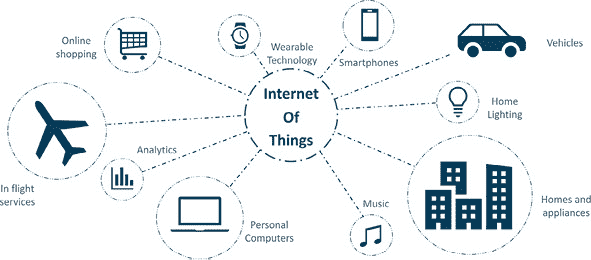
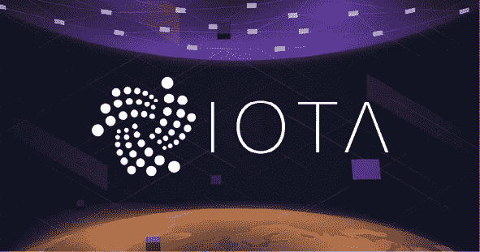
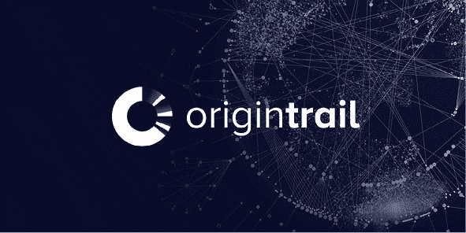
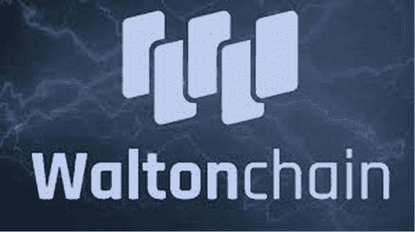

第二章

应用和项目

目前区块链正在被探索用于物联网项目中。区块链可以用于物联网项目中的安全应用。通过将区块链与物联网合并，物联网网络中智能设备收集的数据可以安全存储。数据是物联网网络中最有价值的组成部分，使用区块链来保护它可能对改善物联网网络至关重要。一些物联网应用和示例显示在图 2.1 中。

区块链可以与物联网结合使用的方式如下：

+   智能合约可以实现在物联网网络中。智能合约是当满足某些预定义条件时自动执行的合同。参与方可以确信合同中的每个实体都会如决定的那样工作，而无需中介。

+   物联网网络中连接的智能机器可以无需人工干预就记录它们之间的数据和交易。这将导致准确且防篡改的记录。

+   传统的物联网使用集中式存储和处理系统，但随着区块链及其去中心化、分布式和安全的网络的出现，数据将安全且易于访问。

区块链物联网的可能应用如下：

+   • 制药行业：在一些国家，制药公司法律要求在运输和分销过程中始终维持某些药物在规定的温度下。使用区块链智能合约的物联网技术可以帮助维护合规性的数据证明。

+   自动驾驶出租车行业：当区块链与自动驾驶出租车结合时，将完全自动化出租车行业。这将消除出租车公司采取的尽管措施，但司机和乘客仍然面临的安全问题。出租车可以接受客户的预订和支付，使用区块链。这还将使企业和客户双方节省成本。

+   智能能源：随着能源生产的去中心化，消费者开始使用太阳能等替代能源为他们的家庭供电，区块链可以用来在消费者之间购买和销售过剩的能源。

+   供应链：像 Modum 这样的产品使用区块链物联网自动化供应链。任何类型的产品都可以在供应链的所有阶段轻松追踪。消费者可以确信产品来自哪里，这在食品业务中尤为重要。这还将帮助消费者确信产品不是假冒的。

图 2.1 物联网应用和示例

来源：Edureka

物联网的区块链应用仍处于初级阶段。要想在物联网中成功实施区块链，还需要克服技术和经济挑战。区块链技术可能需要进行定制以更好地与物联网技术配合使用。这将物联网的技术进步推向下一个阶段。

顶级物联网区块链项目

如果你搜索物联网的区块链项目，你可以很容易地看到有许多项目正在寻找改善我们周围世界的方法。以下是一些较大的物联网区块链项目。

Ambrosus

概览

Ambrosus 正在建立一个基于区块链的供应链生态系统，确保通过该网络跟踪的物品的来源、质量、合规性和正确处理。Ambrosus 的业务范围涉及改进 essential products（基本产品），尤其是食品和药品，以及高价值产品的供应链。Ambrosus 旨在利用区块链技术和物联网系统重新定义供应链管理。

Ambrosus 解决了什么问题？

当今供应链的复杂性可能导致伪造或篡改信息。确定和定位供应链中问题出现的时间和地点可能需要花费公司大量金钱用于因销售劣质或有害产品而引起的诉讼。除了伪造、扭曲信息的问题，全球供应链在产品或材料从一个公司转移到另一个公司（包括制造商、仓库、分销商和零售商）的过程中涉及大量文件。

将区块链技术融入此流程也可以显著降低成本，并使分销过程更加简单和高效。一旦商品的信息自动记录并存储在区块链上，它就变得对每个人都可以访问。因此，物流链的每个参与者，包括最终客户，都可以通过简单地访问记录来检查有关产品的可靠信息。

产品和愿景

Ambrosus 团队在早期发现以太坊网络在处理 Ambrosus 网络所需的所有数据方面能力过于有限，因此他们创建了一个在该网络之上的协议。通过创建一个辅助区块链与分布式存储系统和智能合约，Ambrosus 变得可扩展，任何程度他们的系统都能处理，同时又在以太坊区块链上得到验证。

为什么需要区块链？区块链的去中心化特性是最抗篡改的防伪解决方案，此外，从数百个供应商、生产商、分销商、零售商到客户，跟踪商品的流动变得极其复杂和混乱。智能合约有助于简化整个流程，使其变得清晰简洁。在供应链中增加的不变性和可追溯性的价值对任何供应链系统都有益。信息在制造业的成功中至关重要，这可能是供应链行业和供应链管理目前成为一个 growing industry 的原因。

以下是一些 Ambrosus 的应用案例：

+   • 食品来源和追溯：供应商和分销商通过将他们的个人身份与签名链接起来签署产品的批次。这允许精确归因于质量保证的责任，并防止欺诈。

+   • 物流可持续改进：结合温度传感器和环境传感器来评估任何容器的异常物理参数变化和不良暴露。在容器级别执行测量，并触发警报，直接通知物流。

+   • 无中间人的食品配送：通过去中心化市场与合作伙伴餐厅和咖啡馆 placing food orders，客户会直接向配送人员支付，而无需通过中间人。

代币经济学：什么是 AMB 代币？

Ambrosus 的原生代币称为 Amber（AMB），它用于帮助追踪产品的价值链，将收集的信息与记录连接起来，并保持数据库的最新。Amber 代币与读数一起发送到网络，并保留在测量智能合约中，直到一批产品完成其在供应链中的流动。Amber 也是 Ambrosus 生态系统的燃料，用于访问网络服务、与传感器系统互动以及通过智能合约保证的商业协议。随着 Ambrosus 生态系统内执行不同动作，Ambrosus 平台的应用越广泛，对 AMB 的需求就越高，因此，采用是增长的关键。

增长潜力和路线图

供应链解决方案正成为区块链技术大规模采用的第一个领域之一。在提供供应链管理解决方案的其他区块链平台中，Ambrosus 主要关注产品的质量保证，特别是食品和药品。这种保证是通过附着在产品生命周期中的传感器来实现的，这代表了另一个独特卖点。Ambrosus 的核心价值主张是成为一个传感器无关的平台。它提供了数据存储和管理系统，使尽可能多的传感器能够与区块链进行通信。Ambrosus 从其他针对食品供应链行业的区块链公司中脱颖而出：他们得到了包括联合国和瑞士多个政府机构在内的多家大型组织的支持。

Ambrosus 团队在通过博客更新和 Twitter 互动与投资者沟通方面做得很好。

IOTA

“物联网应用”，更广为人知的是 IOTA，是一种加密货币，在市场上引起了一些波澜。自 2016 年中旬发布以来，它已经引起了足够的关注，其创造者称其为启动所谓的“机器学习经济”所必需的“缺失的拼图块”，这种经济将专注于允许设备交易从存储、计算/分析、电力和传感器数据在内的任何事物。在图 2.2 中展示了 IOTA 标志。

图 2.2 区块链与物联网项目 IOTA

来源：CryptoNewsZ

它与其他加密货币在公共分布式账本方面相似，但相似之处基本上就结束了。虽然比特币和大多数可用货币利用所谓的区块链架构，但 IOTA 不能被归类为区块链项目，因为它是基于一个名为“Tangle”的新发明。Tangle 是一种新的数据结构，它不依赖于块、链和矿工。相反，它采用了一种名为“有向 ac 网络”（DAG）的去中心化、无块、点对点架构。DAG 架构要求每个希望进行交易的网络参与者通过批准两个之前制作的交易来积极参与网络共识。

这意味着潜在的交易者通过证明过去交易的有效性“赚取”了在 IOTA 中进行零费用交易的权利，从而确保整个网络保持稳定和功能。

总的来说，有 354 个独特的实体对 IOTA 表示了兴趣，包括 68 个官方合作伙伴/协作者，135 个与基金会合作进行联合项目的实体，77 个参与 IOTA 数据市场的实体，以及 56 个构建了一个或多个基于 IOTA 的概念验证的实体和 49 个关于 IOTA 的学术出版物引用。我们将仔细研究 IOTA 的一些突出协作者，确定他们各自为桌面上带来了什么。

最重要的合作包括以下内容：

+   • 大众: 自动驾驶技术是 IOTA 数据市场的热门潜在应用之一。用于驱动这些自动驾驶车辆的感官数据可以引入 IOTA 数据库，然后用于提高未来产品的质量。这就是为什么大众，世界上最大的汽车制造商之一，决定与 IOTA 合作探索他们所说的“数字汽车通行证”。这项技术预计将于 2019 年某个时候发布，旨在可靠地捕获大众车辆的数据，并允许大众车主轻松购买软件和服务，如停车或高速公路收费。

+   • 移动开放区块链倡议（MOBI）：与 IOTA “提高驾驶安全性和可负担性，支持自动驾驶和电动汽车的发展和基础设施，促进共享出行和共享汽车的应用，以及将移动参与者连接到新的点对点生态系统”的承诺相一致，该项目加入了 MOBI 以进一步实现这些目标。该合作于 2018 年得到确认，并将看到 IOTA 与宝马、博世、福特、通用汽车、雷诺集团、ZF、加州大学伯克利分校区块链、Hyperledger、Fetch.ai、IBM 和 Aioi Nissay Dowa Insurance Services USA 等公司合作，促进一个生态系统，在这个生态系统中，企业和消费者可以安全地拥有自己的驾驶数据，管理共享出行和共享汽车交易，并存储车辆身份和使用信息。

+   • 富士 itsu: 富士 itsu 是一家知名科技公司以及 IT 服务提供商/产品制造商，它也对 IOTA 和其协议产生了兴趣。富士 itsu 将 IOTA 视为“工业 4.0”的基础，并期待其成为未来制造和供应链的关键要素。在这些领域建立信任和诚信非常重要，IOTA 可以通过提供基于 Tangle 的加密 ID 系统来跟踪产品组件和整体生产状态，从而帮助实现这一点。

+   • 微软: 关于 IOTA 在 2017 年底 allegedly 与微软合作的传闻引起了很大争议。微软区块链专家 Omkar Naik 在确认他的公司对于与 IOTA 基金会“合作”感到“兴奋”时，让 IOTA 社区欣喜若狂。他提到的引用导致 IOTA 将微软包括在其数据市场的官方成员中，但这似乎并不准确。微软代表确认，他们与 IOTA 的唯一官方合作是 IOTA 成为微软 Azure 的客户，并计划在 Azure 架构上部署提到的数据市场。

+   • 其他合作伙伴和实施案例包括：

+   • Crypto Storage AG 与 IOTA 基金会合作，为持有 MIOTA 加密货币的持有者提供专业、多签名的存储解决方案。该公告于 2019 年 1 月 9 日发布。该合作伙伴关系主要针对大型私有和机构投资者。

+   eCl@ss 希望创建一个精确传感器的生态系统，这些传感器记录数据并通过特定的、唯一的 ID 进行分类。已有超过 3000 家法人实体加入，eCl@ss 希望提供标准化和易于将数据传输到现实世界。

+   丹佛公司 Energinet 在 1 月底与 IOTA 基金会签署了一项谅解备忘录（MoU），以探索在能源市场中实施 IOTA 的可能性。

+   º IAMPASS 希望提供高可用性的数据中心，这些数据中心将处理在 IOTA 的 Tangle 之上的身份和访问管理服务。访问控制是当今安全管理的一个非常重要的部分。

+   Jaguar Land Rover 参与了一项数据收集计划。捷豹希望收集有关道路条件和车辆性能的信息，作为回报，他们向司机提供 IOTA 代币。该合作伙伴关系是捷豹解决汽车行业事故、道路拥堵和排放问题的举措之一。

+   Topocare 是 IOTA EDF（生态系统发展基金）的首批受助人之一，致力于实施复杂的防洪保护系统。Topocare 希望利用 IOTA 的 Tangle 提供人道主义改进和灾难救济或甚至预防。

与 IOTA 以某种方式合作的实体名单更长。只有时间才能告诉我们 IOTA 是否能够将大多数这些合作伙伴关系推进到典型的“谅解备忘录”或概念验证类型的交易，并最终创建能够在 Tangle 上成功运行的产品。

未来计划和路线图

2019 年对 IOTA 来说是非常激动人心的一年。他们在软件产品方面取得了重大进展，例如，通过 IRI、Trinity、单个客户端库和 Qubic。他们还在此过程中启动了新的项目。他们建立了一个非常强大的 Rust（一种编程语言）团队，致力于开发下一代的节点软件，该软件将通过 Coordicide 进行过渡。Coordicide 的目标是在不依赖协调器的情况下实现共识，同时确保可扩展性、安全性和去中心化。带有协调器的 IOTA 是可扩展和安全的，但不是完全去中心化的。2020 年将比去年更加令人兴奋，因为 IOTA 在 2020 年上半年将迎来一些重大变化。这些变化主要是基于与他们的研究部门的协作，以及建立在为 Coordicide 做的一些工作之上。

OriginTrail

概述

OriginTrail 使供应链上的数据共享变得可能。它帮助企业无缝、安全且透明地交换相关信息。因此，它可能成为公司建立责任感、保护品牌和提高效率的新方式。我一直关注着许多供应链项目，OriginTrail 是那些有潜力与领域内的大型公司如 VeChain 和 WaltonChain 竞争的项目之一。OriginTrail 旨在通过建立首个基于区块链的、专门针对供应链的协议，从而彻底改变供应链管理，使供应链即使在国际边界也能无缝交互。参见图 2.3 以查找 OriginTrail 的标志。

图 2.3 区块链与物联网项目 OriginTrail

来源：OriginTrail.io

OriginTrail 解决了什么问题？

现代供应链的所有接触点之间的跟踪越来越复杂。这最终使产品的质量和安全面临风险。全球供应链正变得越来越复杂。OriginTrail 概述了当前系统存在的两个主要问题：

+   • 数据碎片化——企业间的合作常常困难重重。

+   • 供应链数据没有合适的分布式解决方案。

生产线上的每一个环节都依赖于一个建立在“退一步，进两步”原则上的信任链。这意味着所有参与公司需要相互信任，直到他们能够验证他们接收到了他们所承诺的质量。因此，对商品和供应链的适当审计需要公司投入大量的金钱和时间。简而言之，在当前的供应链中，由于现有系统的集中性质，没有简单的方法可以安全地从一家企业向另一家企业共享信息。区块链解决方案不仅能创建一个更高效、透明的日志以跟踪货物，还能确保供应链的信任以及客户确保最终购买高质量产品的手段。

产品与愿景

OriginTrail 正在使用的区块链叫做 OriginTrail 去中心化网络 (ODN)。这是供应链数据共享的网络。它由世界各地的多个节点组成。希望使用该平台的用户和企业必须运行自己的节点，或者他们必须用 Trace 代币支付节点所有者的费用。作为回报，节点将加密、处理和分发他们的数据。ODN 是一个协议层，因此它可以与任何区块链交互：Ethereum、IOTA、Hyperledger 等等，并且可以在其上构建整个去中心化应用生态系统。

通过整合全球公认的 GS1 主数据标准实现互操作性。GS1 是一个非营利组织，为公司之间的沟通提供标准化实践。其他数据集包括物联网、GPS 和合规数据。OriginTrail 致力于与现有系统（如 GS1 标准条形码）集成，以提供更深入、更可靠的追踪。这对于采用是必要的，因为它不仅结合了最佳实践和经过验证的技术，而且使新公司更容易采用 OriginTrail 的技术。

在每次向协议添加新数据集时，通过进行交叉参考检查在网络内以及供应链实体之间实现共识。这确保了整个供应链在特定产品的批次和流程上保持同步。企业和消费者可以通过扫描代码或在一个应用程序界面中输入信息，并获得相关信息，例如组件最初是从哪里采购的，谁处理了它们等等。

代币经济学：TRAC 代币是什么？

TRAC 代币是供应链数据生产者和数据消费者以及 OriginTrail 节点持有者之间的一种补偿手段。通过运行节点和质押代币，投资者将能够因其验证交易的劳动而获得额外的代币。TRAC 为点对点网络中的节点提供激励，以执行系统功能。OriginTrail 节点因执行以下功能而获得激励：

+   发现和连接功能

+   供应链共识检查

+   数据质量检查

+   数据复制检查

+   数据存储和管理

+   供应链数据的筛选和传递

TRAC 的总供应量为 5 亿枚代币，其中 2.85 亿枚目前在流通中。考虑到其应用，这个数字很大，但并不至于在代币总供应量流通时使价格上涨变得困难。

增长潜力和路线图

OriginTrail 并不是第一家认识到供应链可以从区块链技术中受益匪浅的公司。许多竞争对手都在为这个潜在的巨大市场争夺份额。ShipChain、VeChain、WaltonChain 和 Wabi 都与物流和产品真实性有所关联。所有这些项目都将争夺客户和用户。

OriginTrail 旨在解决一个重要行业问题，并正在朝着使其概念广泛成为现实迈进。或许一开始找到一个更小的目标市场或行业来关注会更好；拥有广泛行业利用你的技术是件好事，但这种策略在未来可能也存在威胁，特别是在一个竞争激烈的市场中，一些竞争对手已经找到了他们的利基。

VeChain

概览

VeChain 的主要目的是提供一个基于区块链的平台，以改进供应链管理的方式。VeChain 旨在通过提供全面的治理结构、强大的经济模型以及先进的 IoT 集成，为现实世界构建供应链区块链技术。该平台为零售商和消费者提供了确定商品质量和真实性的可能性。乍一看，VeChain 看起来只是一个供应链项目，与 WaltonChain、Wabi 或 Ambrosus 类似，但自从其主要网络发布以来，人们意识到 VeChain 实际上是一个区块链平台。2018 年 2 月，VeChain 更名为 VeChain Thor (VET)。这次品牌重塑使公司从供应链拓展到了更一般的的企业 dapp 解决方案。该公司成立于 2015 年，其 ICO 于 2017 年 8 月启动。我觉得 VeChain 是一个每个加密货币投资者都应该理解并了解的项目，即使他们选择不投资。

VeChain 解决的问题是什么？

假冒商品损害品牌的声誉，减少公司的利润，并影响消费者的购买。实际上，根据 2018 年全球品牌假冒报告，到 2020 年，全球假冒产品的总价值预计将达到 1.8 万亿美元。VeChain 使品牌能够通过在产品上放置射频识别（RFID）标签、二维码或 NFC 芯片，来监控和管理其供应链中的产品。在 RFID 技术的情况下，这些标签包含了产品的整个历史，存储在一个安全的公共账本上，买家可以随时查看。

公司的全球供应链包括许多不同的利益相关者，这些利益相关者在全球的不同地区运作。公司不必在利益相关者之间拼凑一套令人困惑的跟踪软件，而是可以接入 VeChain 区块链。这一过程不仅提高了安全性，而且最终将有助于提升品牌声誉和客户体验。除了防伪保护外，VeChain 还通过简化产品跟踪和无缝连接供应链的不同部分，提高了物流系统的效率。全球物流是一个复杂的话题，通常包括在不同企业之间变化的各种独立系统。正因为如此，跟踪供应链中的产品可能是个大麻烦。这个问题通过 VeChain 的区块链技术得到了解决。VeChain 的领导层帮助将这一理念引入了许多行业，包括烟草和酒精、冷冻食品、汽车、奢侈品零售商品、制药和冷链存储。

产品和愿景

以下来自 VeChain 的声明很好地总结了他们的愿景和功能：

VeChain 的野心是建立一个去中心化的商业生态系统，它能够安全、私密地流动信息，跨越国界和公司建立信任和透明度。VeChain 利用区块链解决假冒产品和供应链、物流中的产品追溯问题，具体涉及：奢侈品、葡萄酒、农业、汽车、运输、制药、物流和审计服务。

我们来了解一下 VeChain 平台的各个方面。

治理模型

VET 代币的分配不仅决定了共识，也推动了 VeChain 治理模型。利益相关者有权投票选举 VeChain 基金会 governing body，称为 Steering Committee 董事会。这个委员会在技术、运营甚至公共关系等方面做出决策。

经济/支付模型

VeChain 的技术面向企业，这意味着支付模式必须符合企业的需求和标准。作为一个企业，您希望费用稳定，但加密货币价格波动太大。VeChain 通过采用多层支付模型解决了这个问题。这项功能帮助企业从主账户高效地管理多个 dapp 的支付，并帮助他们更好地与不希望处理加密货币资产的商业伙伴合作。

代币经济学：VET/VTHO 代币是什么？

如我们之前讨论的，VET 经济模型旨在为零售商创造更多可预测和稳定的环境。除了 VET，还将有另一种加密货币，称为 VeChain Thor Token (VTHO)。即使您没有运行节点，持有 VET 的 VeChain 也会奖励您 THOR。这种结构与 NEO 的 GAS 类似，用于运行基于 VET 构建的智能合约和应用程序。这意味着依赖 VeChain 追踪供应链和加强物流流的公司有真正的动力运行自己的节点。

增长潜力与路线图

2018 年 6 月，VeChain 团队在启动平台主网方面达到了一个关键里程碑。随着启动，网络从以太坊区块链迁移到自己的区块链，团队开始用 VET 交换 VEN。公司下一步是扩大生态系统，增加更多 dapp 和战略企业合作伙伴。任何区块链项目的成败都在于他们的合作伙伴，尤其是对于企业区块链解决方案。谈到合作伙伴关系，VeChain 到目前为止做得很好，在吸引大型行业参与者作为合作伙伴和客户方面取得了很大成就。最值得注意的是 PwC、DNV GL、宝马和 Kuehne & Nagel。VeChain 是 PwC 孵化计划的一部分；DNV GL 为石油和天然气、电力、海洋和可再生能源公司提供服务。

WaltonChain

概览

沃尔顿链是一个结合了区块链技术和物联网的分布式平台，利用 RFID 技术创建了一个价值物联网（VIoT）。虽然 RFID 技术不是新的，但沃尔顿链已经申请了独特的 RFID 芯片专利，可以直接向区块链读写数据，从而创建一个真实、可信和可追溯的业务生态系统，实现数据全面共享和绝对的信息透明。沃尔顿链中的“Walton”是对 RFID 技术原始发明者查理·沃尔顿的致敬。沃尔顿链的标志可以在图 2.4 中找到。

RFID 芯片是由沃尔顿链的子公司 Silitec（专门从事制造芯片的技术支持部门）开发的，而非外包。每个标签的成本不到 5 美分（行业平均 15 至 20 美分），未来由于规模经济效应，成本还将降低。

沃尔顿链解决了什么问题？

沃尔顿链的目标非常明确。虽然公有区块链本身可以应用于不同类型的用例，但主要想法是解决供应链管理领域的问题。该项目希望通过分析跟踪大企业在每个生产和分销步骤中的产品，实现企业间数据的协调。数据总是保存在区块链上，以确保其不可篡改和真实。通过利用区块链，第三方无法轻易“作弊”其数据提交，因为一切都需要通过区块链确认和授权。

图 2.4 区块链与物联网项目沃尔顿链

来源：Incrypts

供应链管理行业在过去几十年面临了许多问题。要追踪产品最初来自哪里相当困难，因为有多个第三方参与到整个分销过程中。当你涉及到进出口流程时，整个低效问题变得更糟。而这就是区块链可以显著改善的问题。通过使用 RFID 芯片并同时利用区块链，每个分销步骤都被追踪并必须由不同的实体验证。

生态系统

沃尔顿链由主链沃尔顿链和许多其他子链（子链）组成，这些子链与主链独立运行。拥有子链的优势包括不会拥堵主链，因为主要交易是在子链本身运行和存储，而不是在许多其他解决方案中的主链。这提供了无限的扩展性，因为拥有更多的子链不会拥堵和过载主链的网络。

子链也完全可以根据合作伙伴的具体需求进行定制，比如可以选择成为公有链或私有链，拥有与主链不同的共识算法，实现分层链（子链中的子链），在这些子链上举办 ICO（首次币发行），支持不同的编程语言，如 Solidity、C++、Java、Python 等。公司还可以直接购买已经为其他公司验证过可行的预设计子链。沃尔顿链的主要目标是连接数据。在沃尔顿链生态系统中，由主链和子链形成的 多链架构遵循区块链技术的跨行业覆盖的发展趋势。

应用案例

WTC-Food 系统：

沃尔顿链与福建思岚物联网科技有限公司合作，推出了世界上第一个基于区块链的双向追溯食品真实性平台 WTC-Food。WTC-Food 通过强大的、灵活的数据收集、信息追溯和信用背书，实现消费者、企业和技术的互利。未来，它将在食品行业得到广泛推广和应用。基于沃尔顿链区块链技术和相关硬件设备的食品追溯系统包括视频收集设备、传感器、智能终端、食品追溯子链、跨链节点和数据检查系统平台。

WTC-服装系统：

WTC-Garment，全球首个基于区块链的高端服装真实性追溯平台，由沃尔顿链与中国领先的高端服装品牌卡尔丹顿合作开发。该平台不仅通过全面的智能解决方案提高了高端服装零售商在制造、物流和店务管理方面的业务效率，还为顾客提供了沉浸式的购物体验。借助大数据，商家还可以分析客户需求，提高服务质量、数据利用、店铺销售和周转率。

阿里云：

沃尔顿链的子公司中川物联网与阿里云的合作，将为阿里云提供由中川物联网设计的多种物联网应用解决方案，并帮助建立城市管理的人工智能中心，推动智慧城市的发展。合作还涉及在智慧城市解决方案和区块链应用方案领域的携手。

合作重点：

+   • 推广沃尔顿链区块链技术，实现市政和商业物联网的覆盖

+   • 建立新的智慧城市

+   • 构建智慧城市方案及其应用：通过区块链和物联网技术实现资源分配优化，实现智能资源配置

未来计划

2020 年，沃尔顿链将根据市场情况进行一些调整。市场话题包括为普通用户发布 WTA（沃尔顿链自治）应用程序的全功能以及 WTA 在 WTA 应用程序中的质押，沃尔顿币（WTC）的回购计划，以及 WTC 代币交换。社区话题包括社区自治的发展，社区投票，以及沃尔顿链全球自治基金会的建立。技术话题包括子链的发展，钱包升级，区块链浏览器优化，实施追溯解决方案，升级和推广沃尔顿链盒，芯片研发，研究物联网目标的层次技术以及构建智能合约。

章节总结

+   -   区块链和物联网的简介。

+   -   物联网与区块链的结合可以在多个行业中提供好处，从而加速这两种技术的采用。

+   -   区块链和物联网在多个行业中的用例。

+   -   集中式物联网的最重要问题以及去中心化物联网的主要好处。

+   -   物联网与区块链的结合被看作是一种自动化的信任机制，这能提升你的声誉。

+   -   为物联网和区块链添加智能将引领下一场生产率革命。

-   针对你的企业的问题

+   -   本章中描述的每个基于区块链的平台的好处和缺点是什么？

+   -   每个平台的总预测成本或预算以及预测结果或节省成本是多少？

+   -   哪些商业案例有正现金流？

+   -   哪个平台拥有最高的现金流？

参考文献和额外阅读材料

Chowdhury, N., 博士. 2020. 深入了解区块链、比特币和加密货币. 美国佛罗里达州博卡顿：CRC 出版社。

Raj, K. 2019. 区块链基础：通往加密货币与去中心化区块链应用之路. 英国：Packt 出版社。

[www.blockfyre.com](http://www.blockfyre.com)

[www.captainaltcoin.com/](http://www.captainaltcoin.com/)

[www.chainbits.com](http://www.chainbits.com)

[www.iotdunia.com](http://www.iotdunia.com)

[www.medium.com](http://www.medium.com)

[www.waltonchain.tech](http://www.waltonchain.tech)
