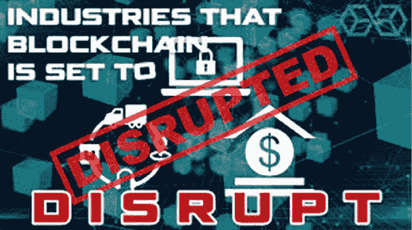
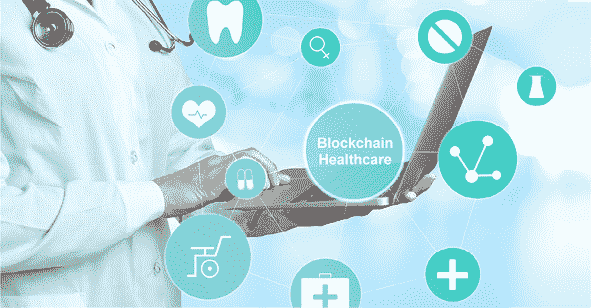
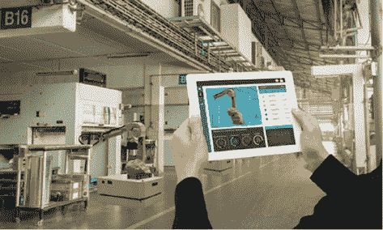
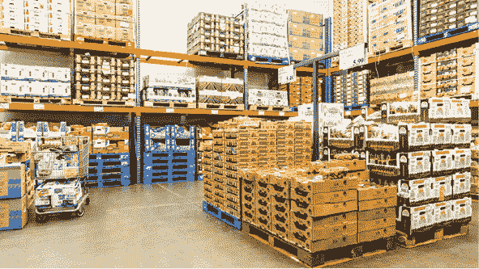
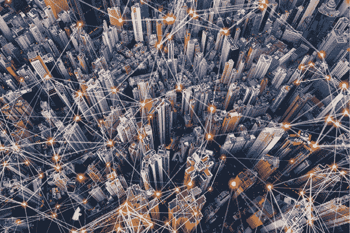
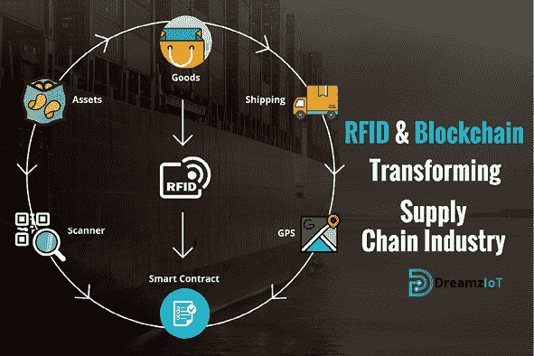
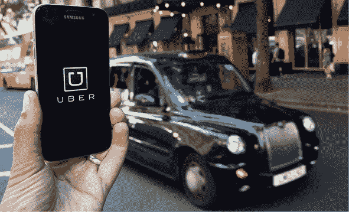

第三章

被颠覆的行业和垂直领域

区块链技术和加密货币在企业采用方面已经达到了一个拐点，这是由技术进步和金融服务、全球供应链、政府、医疗保健以及许多其他行业中的商业用例的成功试点所驱动的。企业采用仍处于初期阶段，但随着创新者继续想出更多使用区块链颠覆和重塑传统商业模式的方法，将迅速加速。已经在测试区块链解决方案的前沿行业领导者在测试区块链解决方案方面已经经历了显著的商业效益，包括：

+   - 更好的协作：当前的企业解决方案涉及本地化的 ERP 或其他信息系统。在复杂的全球供应链中，本地化数据很快就会变得支离破碎。供应链中的每个环节都会在其自己的时间表上更新自己的数据库。相比之下，区块链提供了一个准确、单一的加密数据实例，始终是最新的并且在线，消除了由数据孤岛和系统碎片化产生的冲突信息。

+   - 增强的安全性：与传统的记录系统相比，分布式、不可篡改的区块链技术具有内在的安全优势。每笔交易必须在记录之前得到同意。一旦记录，每个流程、每个协议、每个支付和每个任务都有数字签名和记录，可以进行验证和识别。网络本身由共识机制进行验证。这有效地使不良行为者无法对网络进行大规模攻击。

+   - 更快的追溯能力：任何参与复杂供应链的公司都知道，追踪一个物品回到它的起源是多么困难。利用区块链记录商品的交换，创建了一条审计轨迹，可以立即看到从源头到目的地以及其中每一个停留点的整个供应链，从而减少了依赖第三方共享信息的需要。

+   - 更大的透明度：网络中的每个参与者都收到完整的区块链副本（而不是维护单独的副本），并且他们必须通过共识或相互协议同意整个数据历史和每笔新交易。如果有人试图改变之前接受的交易，网络会立即认为更新无效并拒绝它。因此，与通过传统流程创建数据相比，区块链上的数据更加准确、可靠和透明。

+   • 改进运营：任何依赖传统流程的业务功能都容易出现人为错误，通常还需要验证。区块链技术可以在几乎每个业务功能中广泛应用，为任何交易增加信任和透明度。这使得交易能够更快、更高效地完成。由于区块链是一个单一的数字账本，因此消除了在多方之间对多个账本进行对账的需要。由于网络中的每个人都能够访问相同的信息，因此解决冲突数据所需的中介机构更少。

+   • 降低成本：除了通过自动化降低成本外，区块链还可以减少许多第三方服务的需求。由于信任和透明度是每一笔交易的固有属性，企业可以停止依赖第三方来解决贸易纠纷，而是信任区块链上的数据。企业还可以显著减少内部和外部审计的范围。

区块链与物联网（IoT）结合，很可能会颠覆许多行业和垂直领域，正如你在图 3.1 中看到的。

图 3.1 区块链颠覆的行业

来源：Blokt

农业

区块链是农业行业中最具潜力的技术之一，它能够提供更一致性。无论它是被应用于更智能地管理仓库、粮仓和供应链，还是在田间作为传输作物和牲畜实时数据的工具，农业运营的方方面面都可能通过区块链技术受益。

示例和用例

+   • 社区支持农业（CSA）：CSA 运营将社区成员聚集在一起，他们承诺在经济上支持农场运营，以换取水果、蔬菜或其他农场可能生产的产品。CSA 农民很可能是年轻人，这意味着他们可能更倾向于新技术。

+   • 提高农业供应链效率：特别是在发展中国家，生产者也可以通过确保通过区块链技术成为针对愿意为来源和质量支付更多的人群的供应链的一部分来增加收入。

+   • 现代化农场管理软件：随着农民将传感器、无人机和 AI 集成到他们的农业操作中，他们会发现存储在区块链上的数据使他们能够在竞争对手中脱颖而出，实现差异化。

+   • 监控农场库存：利用区块链上易于所有参与者访问的去中心化账本，将使沟通更加无缝，关于需要做什么，无论是收割作物、进行存储相关调整、订购新设备，还是其他方面。

汽车和互联汽车

一方面，汽车行业仍和过去一样：制造商销售他们的豪华皮卡和其他型号。另一方面，汽车行业也显示出深刻的变革迹象。车辆比以往任何时候都要智能，制造商嵌入更多传感器，能够从评估事故后伤害到追踪和禁用被盗车辆。我们继续向自动驾驶时代迈进。到 2025 年，大约有 800 万辆汽车将在达到第 3 级“有条件的”自动化或更高水平时在途中。

区块链在提供更大的汽车供应链监督和责任方面有明显应用，也可以作为驾驶员查看和理解他们的车辆数据如何被共享和利用的手段。

示例和用例

+   区块链保险平台：截至 2015 年，美国道路上有 2.68 亿辆注册车辆在行驶，当查看这些车辆频繁与其他物体、行人以及其他车辆相撞时，保险的需求就显得非常明确。2015 年，共有 32,166 人死亡，1,715,000 人受伤，以及 4,548,000 起汽车事故。区块链保险车辆的可能性是多方面的。实时更新保单、存储保单详细信息以及基于习惯调整费率的信息都可以被存储和自动化。

+   • 文档和标题转移：实际上车辆的标题价值巨大。不仅标题盗贼可以把你的车辆放在他们的名下，而且丢失标题会导致获取副本标题的头疼。没有标题，几乎无法证明一辆车实际上属于你。区块链平台已经被设想为存储和验证关于车辆标题转移的信息，以及销售证明、保险和其他收据，这些都能建立明确的拥有记录和法律文件。

+   • 法规和环境透明度：汽车、卡车和飞机是当今最大的二氧化碳排放源。根据美国肺脏协会的数据，大约每年有 3 万人因吸入车辆产生的污染物而死于健康问题。利用物联网追踪和报告与排放相关的数据，驾驶者和品牌将变得更加环保。使用区块链技术作为可互操作的账本统计数据，可以降低实施指标的成本。

+   - 奖励安全驾驶：不可否认的是速度、鲁莽、交通事故和道路死亡之间的相关性。至少有一家主要汽车制造商发现了一种独特的方式，通过区块链激励安全驾驶。有关驾驶员习惯的信息被传输到制造商的数据库中，这些信息被转化为专有代币。如果安全驾驶的驾驶员能够简单地获得加密货币以及/或降低他们的保险费率，这种系统可能会变得更加有效。图 3.2 展示了汽车领域的安全驾驶奖励创新。

+   - 保险领域的智能合约：2005 年至 2015 年间，美国平均每年发生 5,808,272 起车辆事故。这意味着每天有 15,913 起事故。这意味着几乎随时都有大量的保险交易、处理的索赔和相关调查和交易。区块链技术的智能合约方面也可能在调整费率、获得事故双方同意方面节省大量的时间和成本。

+   - 租赁/融资领域的智能合约：2018 年第二季度，美国近 32%的新车是通过租赁方式销售的。许多人认为租赁比购买一辆车要承担较少的财务负担。这就是租赁越来越受欢迎的原因。2015 年，维萨与电子签名公司 DocuSign 合作测试基于区块链的租赁智能合约。这些自我执行的合同通过减少中介简化了流程。

+   - 智能车辆衍生数据：智能车辆产生了前所未有的大量数据，这些数据必须被存储、分享和销售。自动驾驶车辆每秒可以产生高达一吉字节的数据，而且所有这些数据都将被某人利用。到 2020 年，汽车制造商可能通过销售车辆衍生数据获得的利润将超过销售车辆本身。这些数据必须得到保护，而区块链是作为车辆衍生数据存储和传输系统的理想选择。

+   - 防盗：车辆被盗从未如此容易。据《电讯报》报道，英格兰 10 辆汽车中有 9 辆被盗车没有被抓获，无钥匙技术只是让问题变得更糟。区块链有能力提供下一级别的身份验证，并不牵强附会地预测，这种身份特定的好处将被定制到车辆安全上。

图 3.2 汽车领域的创新

来源：AutoFacets

银行业与金融服务

区块链技术对银行范式的影响已经明显，这在图 3.3 中已有体现。世界银行发布的数据显示，目前全球有超过 17 亿人口缺乏基本银行或金融服务。世界银行进一步研究表明，区块链技术对促进无银行和银行服务不足人群的金融包容性具有巨大潜力。传统银行高度意识到区块链技术对金融行业造成 disrupt 的潜力。摩根大通、高盛和美洲银行等主要国际银行已经在大规模投资区块链行业。

图 3.3 物联网影响金融服务

来源：Finance Monthly

示例和用例

+   - 加密银行：金融机构已经注意到了加密货币。随着公众了解加密货币如何分散资产，高净值客户可能会促使银行更深入地进入加密领域。遵守监管机构规定，将强大声誉与加密货币产品相结合的银行可能具有显著的竞争优势。

+   - 银行间交易：实时银行间资金验证将统一银行并减少费用。这意味着更快、成本更低的电汇。现金流监控是适合自动化的任务，而区块链是这项工作的合适候选者。

+   - 了解你的客户（KYC）：金融机构面临着巨大的 KYC 要求。2017 年，收入达到 100 亿美元或以上的机构的 KYC 成本为 1.5 亿美元。分析师预计，KYC 费用的上升趋势将持续至少到自动化实施为止。区块链可能是 KYC 实践自动化的锚点。

+   - 记录共享和存储：估计显示，通过无纸化，零售银行记录管理成本可以减少 60 至 70%。这将使处理部门的运营费用最多减少 25%。

+   - 智能合约执行：智能合约将各方约束在协议中，用自我执行的算法强制执行该合同。资金仅保留在托管中，直到协议的条件得到满足。智能合约大幅减少了信任元素。这最小化了金融协议的风险以及最终上法庭的可能性。

慈善

慈善行业的年收入总额超过 4100 亿美元，但并非所有在慈善行业中活跃的组织都是利他主义的。英国欺诈成本测量委员会收集的数据表明，欺诈性的慈善机构每年捕获的捐款超过 300 亿美元。区块链技术能够在慈善捐款的资产分配上提供完全的透明度，让任何人都能追踪任何给定慈善机构的财务状况，并确保慈善组织在资本的公平和诚实地分配上受到问责。

区块链技术不仅为慈善机构提供了一种更高效、更开放的资本管理方式，而且还为捐赠者提供了向慈善机构提供资金的新机会。除了直接捐款之外，区块链行业还为慈善机构提供了从捐赠者那里获取捐款的新方法。

例子和应用案例

+   降低行政成本：虽然许多人认为 overhead 成本是必要的，但高昂的行政费用百分比是一个警示标志。管理成本最高的慈善机构实际上支出的钱比传递给受益人的还要多。基于区块链的平台旨在为慈善机构提供一个市场，以便接触到准备捐款的群体，并且这些平台比传统的市场营销和筹款机构收取的费用要少得多。这个平台还可以提供需求证明和收据证明，以确保该事业确实是值得的。

+   促进紧急援助：紧急援助相关的丑闻和混乱并不在少数。在海地救援彻底失败八年多之后，对失踪的 5 亿美元捐款的寻找仍在继续。因此，是的，紧急援助的管理亟需完整的区块链改革。在紧急情况下，大多数慈善捐款都会被捐出，能够追踪这些资金到目的地的路径对于避免紧急救援中普遍存在的浪费和欺诈行为绝对是至关重要的。

+   提供链透明度：缺乏透明度会降低人们对慈善机构的信任，并且可能会以几种方式回报，无论是否应得。首先，捐赠者不太可能向被指控进行浪费或非法行为的慈善机构捐款，这会减少他们所做的任何好事。此外，出于好意的慈善机构可能会卷入争议——比如在一个恐怖主义盛行的国家向受苦群体提供帮助——并因此面临不合理的制裁。能够追踪从捐款点到受益人的资金将不可避免地打击浪费性支出，揭露欺诈行为，并重新建立捐赠者合理期望的资金真实传递的信任。

+   • 以目标为导向的筹款模型：Kickstarter、GoFundMe 和 Indiegogo 等网站为以目标为导向的慈善事业成功奠定了蓝图，GoFundMe 已经达到在 12 个月内捐款额超过 10 亿美元的阶段。一个定制的区块链慈善平台将模仿基于目标筹款模型，同时依赖该技术减少费用，使系统不依赖于收入。智能合约是区块链为此目的特别有用的方面。

+   • 慈善挖矿：由高性能计算机网络组成的巨大计算能力，一些网络正在研究如何利用闲置计算能力开采加密货币作为慈善事业。到目前为止，这些事业已经证明是有希望的，PC 游戏玩家成功开采以太坊并捐赠给受暴力影响的叙利亚儿童。如果能有更多的人被说服将他们的闲置计算资源用于慈善捐赠的被动形式，这可能是一种帮助有需要的人的新颖方法。

+   • 跨境捐赠：尽管 2009 年的外国捐赠总额高于 2016 年，但这些数字每年都会波动，但总是相当可观。对于支持非美国实体和其他特定捐赠者的公司来说，这些外国捐赠可能带来一些重大的税务问题，甚至可能导致资产冻结和财务处罚。基于区块链的交易的分布式性质意味着它们在技术上不受任何地理区域的约束，这减少了与跨境慈善捐赠相关的法律和税收风险。尽管可能会有规定出现，但一些实体正在努力实施更高效、成本效益更高的跨境捐赠，以减少官僚主义和中介。

能源

区块链和能源科技是全球最被热议的两大技术运动。区块链、能源和可持续技术交叉领域的可能性令人惊叹，而且支持创新有着充足的金融机会。根据 Zion Market Research 的数据，能源管理预计到 2022 年将猛增至超过 700 亿美元的价值。整个行业目前受到不断上涨的能源价格和减少温室气体排放的监管压力推动，向更高效的创新转变。新能源突破将颠覆该行业，如图 3.4 所示。

示例和用例

+   • 电动汽车的加速采用：彭博社预计到 2025 年电动汽车数量将达到 1100 万辆，到 2030 年将达到 3000 万辆。利用区块链技术，可以维护监控峰值能源价格的系统——这些系统可以帮助充电站所有者进行交易，做出明智的决策，决定何时何地充电，以及决定他们可以从使用充电站的人那里得到多少。

+   微电网：集中式电力电网以其低效和巨大的能源损失而闻名。微电网旨在解决这些损失。区块链使用的分布式账本技术可以作为这些微电网用户的逻辑数字构建块，以监控消耗并执行能源交易。

+   能源 token 化：能源 token 化使得风能、太阳能和水电生产商能够与愿意为消费可再生能源的权利支付定金的投资者建立联系。区块链使得一种新的能源共享经济成为可能，这种经济促进家庭之间的电力开放交换，所有交易都通过去中心化账本记录。

图 3.4 能源技术突破

来源：IndustryWired

游戏

自加密货币诞生以来，区块链和游戏行业一直保持着显著的受众重叠。用法定货币交换数字货币或资产的概念在多人在线游戏发布比特币白皮书之前已久就已牢固确立。玩家很大程度上适应了数字经济，使游戏行业成为区块链创新者和实验性平台的吸引环境。

示例和应用案例

+   加密货币收藏品：加密货币收藏品是一种具有有限数量的、通过加密技术唯一且不可替代的数字资产。那些不理解其吸引力的人可能不会更感兴趣，但很大程度上在于其新颖性。现在已经是成年人的那些人曾经参与过数字宠物这个想法，所以交易受区块链保护的独特数字资产的概念比许多人意识到的受众范围要广泛。

+   电子竞技投注：电子竞技—围绕视频游戏的一种竞技形式—已经是游戏景观中令人印象深刻且不断增长的领域。寻求为其电子竞技生涯融资的个人和团队可能会感到像 haystack 里的针一样难找，但区块链平台已经出现并继续涌现，旨在将有才华的电子运动员与愿意投资的投资者连接起来，以减轻对传统赞助的依赖。

+   独特的游戏内资产：游戏内资产有多种形式，许多开发者为玩家提供购买这些资产的机会，以继续补充他们的开发预算。用于支付这些资产的系统已被黑客攻击，而这些资产本身并不总是真正独特的。为了解决这些问题，区块链已被提出作为一种减少重复内容的方法，并在购买和出售游戏内资产时执行更安全的交易。

政府

区块链技术不仅可以用于捕捉选票以选举政府官员，还可以用于操作治理机器本身。国家作为社会中必要的集中协调点，主要工作是建立法律并执行它们。然而，民主过程却因多层冗余、缓慢的官僚程序和繁文缛节而负担沉重。区块链技术在公共部门有众多应用，承诺改善沟通、减少浪费、防止欺诈和腐败，并提高政府服务质量。

示例和用例

+   • 打击腐败：在许多国家，不诚实的政府个人是腐败的原因。在这里，区块链将允许公民监督政府支出记录，提交并查看无法漂白的特定腐败投诉，公开登记在非法征用普遍的国家土地和资产，并创建一个透明的政府承包商体系。

+   • 海关和边境巡逻：在许多国家，海关和边境巡逻表现不佳，需要显著改进以达到表现较好者的水平。这种改进可能来自区块链技术的采用，它将提供更快速、更可靠的关于货物来源和合法性的证明，同时通过实时记录，海关代理人可以更有效地计划和操作。IBM 和马士基提供了一个平台来解决这个问题。

+   • 跨机构数据管理：在集中式、孤岛式的部门之间的一致性，以及巨大的、不同的官僚标准和做法的网，使得政府间数据的共享和支付的处理变得昂贵且几乎不可能。建立一个基于区块链的单一沟通方式，将保护免受昂贵的数据泄露和损失，减少培训成本，降低行政成本，并建立一个标准，通过这个标准，可以缩小浪费的政府支出网。

+   • 投票：区块链是结束美国选民舞弊普遍性争议的理想技术。一些州已经在地方选举中测试区块链系统。能够在家中使用区块链技术通过互联网投票，很可能会由于更加方便而导致更大的参与度，而不可篡改的区块链记录可以轻松标出冗余，并将唯一个人标识与个人绑定，以确保选民是他们所说的那个人，并确保他们有投票资格。

医疗保健

数据互操作性是健康护理行业面临的最大问题。Black Book Research 发布的研究数据显示，36%的健康护理专业人士在交换患者健康护理记录方面存在困难。广泛的电子健康护理记录提供商和平台以及所使用的数据标准的不一致性，使得有意义的患者数据无法在孤立的医疗数据平台之外共享。美国国家卫生信息技术协调办公室的健康信息技术互操作性路线图确定了一些对医疗保健互操作性至关重要的元素。正如你在图 3.5 中所看到的，健康护理行业将会发生重大变革。

示例和应用案例

+   电子健康记录（EHR）：它们是在《平价医疗法案》下强制实施的，其推出过程并不顺利。在调查的医生中，74%的人表示，由于需要维护电子记录数据库，他们的生产力保持不变或变得更糟。尽管不到 5%的医疗保健提供者在其商业计划中有区块链，但一些人认为，借助它的帮助，他们可以解决 EHR 挑战。

+   保险记录与报告：所有美国人都必须购买健康保险，否则将面临经济处罚。2014 年，共有 750 万名纳税人在处罚名单上，而另有 1250 万人在豁免名单上免于处罚。一些保险商正在探索如何运用区块链的分布式账本技术记录患者数据的实时变化。这样的系统可以帮助保险公司和医疗保健提供者避免因陈旧的记录保管方式而遭受巨额罚款。它还可以提高那些更换提供商或保险公司的患者的护理质量。

+   防止欺诈性 billing：根据卫生与公共服务部的一份报告，2016 年，卫生保健欺诈判决和和解金额达到 33 亿美元。这还不包括未发现的欺诈行为。基于区块链的欺诈预防措施可以通过自动化索赔处理和裁决来降低管理成本。它还可以作为实时记录，更快更经济地监控欺诈性索赔。

+   保护患者数据：2017 年，美国健康护理行业单个被盗记录的成本平均为 380 美元。与全球的平均成本 141 美元相比，这是一个惊人的高数字。区块链系统具有多个安全检查点，可以最小化漏洞。该技术还可以通过共享带有密码保护的记录，使患者对自己的数据有更大的监督权。

+   • 减少假药：世界卫生组织（WHO）估计，全球 10%的药品是假药。这使得非法药物制造商获得了 750 亿美元的收入，每年估计有 10 万人因此死亡。这些数据表明，区块链作为合法药品供应商的统一记录是必要的。区块链记录将使供应链更加透明，并帮助当局更快地识别假药。

图 3.5 区块链与物联网在医疗保健中的应用

来源：Healthcare Gazette24

保险

保险行业也是非常复杂的，包括经纪人、保险公司、消费者和再保险公司，使得预测行业的主要产品——风险——变得复杂。保险依赖于一个繁琐的合作过程，充满了数百个可能丢失、误解或更改关键信息的失败点。区块链技术承诺解决依赖重重中介的行业中存在的问题，这些中介由不同的动机和激励驱动。德勤的研究展示了区块链可能为保险行业带来的一系列关键益处，这些益处可能会彻底改变该行业。

示例和用例

+   • 防止欺诈：保险公司继续受到欺诈者的伤害。一项保守的估计将行业的欺诈损失定为每年 800 亿美元。由于保险欺诈导致的保险费上涨，每年累计增加 400 至 700 美元。汽车保险是保险欺诈成本最高的形式；25%的由汽车事故引起的身体伤害索赔是夸大或欺诈的。这增加了每年 200 至 300 美元。如果区块链可以用作行业范围内信息存储的基础，其中可以编写算法来检测重复索赔、慢性违法者和其他欺诈迹象，那将是一个巨大的胜利。

+   • 点对点保险：点对点保险这个术语相对较新，但该行业的根源可以追溯到老式的相互保险。2015 年点对点保险的估值为 640 亿美元，预计到 2025 年将达到 1 万亿美元，点对点保险无疑正处于上升趋势。市场预期增长是显而易见的：成员们共同 pool 他们的资源，未支付的保费将退还给成员。这种仅在需要时为您提供所需保险的一般愿景正在与区块链技术相结合，成员们将他们的资金存入数字钱包，这些资金代表了他们受到保护的曝光量。

+   - 财产和意外伤害保险：财产和意外伤害保险涵盖了与丢失或损坏财产相关的风险，2016 年其所占所有保单（5337 亿美元）的 47%。借助区块链，可以建立一个全新的资产生命周期跟踪系统。智能合同可以数字化纸质合同并根据编码标准处理索赔，根据通用标准和准则计算所有当事方的责任。更妙的是，保险公司和投保人可以实时更新这一记录。

+   - 再保险：再保险使保险公司能够通过将保单转嫁给其他保险公司来减轻自身风险。再保险费用比率通常占保费的 5%至 10%。普华永道估计，在再保险中引入区块链技术可能会消除 15%至 25%的费用，为整个行业节省 50 亿至 100 亿美元。实现这些节省的主要方式是采用区块链账本。

+   - 风险预防：保险业规模巨大，由 7000 多家公司组成，每年收取 1 万亿美元的保费。这使得该行业容易受到欺诈。保险公司有责任使用最严格的的风险预防和欺诈检测设备，而区块链是前沿的先进欺诈预防工具。这项技术可以作为在去中心化机构之间无缝、安全地共享欺诈情报的方法。

制造业

制造业的公司一直是技术创新的先驱，他们在得到主流认可之前就推动了自动化、数字化转变和供应链现代化的趋势。区块链可以帮助制造商减少产品在到达消费者手中的中转次数。大多数制造商为了让产品到达最终用户而必须通过无数的中间商。

图 3.6 制造业的区块链物联网

来源：The Sociable

随着工厂日益自动化，我们将开始看到更多的机器对机器交互。比你想象的要快，这将导致为不同组织工作的机器之间进行交互，甚至可能进行交易。行业中还有大量的欺诈行为，去中心化系统可以减轻这些欺诈行为。通过创建更多关于商品和服务的透明跟踪，区块链可以帮助更接近盗窃来源地识别产品被盗。如图 3.6 所示，制造业是区块链物联网影响最严重的行业之一。

示例和用例

+   • 3D 打印设计权：增材制造，又称 3D 打印，尚未实现主流采用，但该行业的势头正朝着正确的方向发展。提供了一个安全的平台，3D 打印设计和说明可以在各方之间购买或共享，这是区块链技术对 3D 打印的承诺之一。这样的市场将允许 3D 制造设计师向付费观众销售他们的设计。区块链也已被证明是处理金融交易的合适选择。

+   • 提高产品信任度：据估计，全球制造业领域的欺诈成本为 3.7 万亿美元，但随着黑客继续变得更加复杂和有效，这一数字可能会轻易上升。区块链的去中心化技术可以允许共享欺诈信息，但不会泄露或更改。

+   • IoT 设备身份验证：物联网（IoT）——许多连接的设备和传感器允许收集大数据——正在影响大多数行业，包括制造业。事实上，制造商非常依赖利用物流数据来消除低效并提高利润。IDC 预测，到现在为止，75%的大型制造商将已经使用物联网设备更新他们的操作，以加快产品上市时间。提供安全的网络，通过该网络 IoT 设备可以进行身份验证、监控，并通过该网络信息可以得到保护，这是区块链与物联网的主要用例交集。

+   • 降低入门门槛：对美国制造业的新承诺为小型制造商在国内市场上获得有利立足点创造了新机会。据 CNBC 报道，2017 年 7 月至 2018 年 7 月期间，制造业创造了 327,000 个新就业岗位，这是自 1995 年 4 月以来 12 个月内新增就业岗位最多的一次。利用区块链是创造业务价值的途径之一，使其在制造业中脱颖而出。据报道，2017 年有 58%的制造公司使用了区块链技术。

+   • 生产件批准过程（PPAP）：PPAP 是确保零件符合各自行业要求的 18 个元素的测试。虽然这个流程最初是在汽车和航空航天行业中使用的，但它已经成为其他制造行业的标准。对于 PPAP 的每一步，区块链可以作为一个可互操作的存储柜，用于存放必要的认证。通过创建 PPAP 测试的统一性，区块链可以对制造过程的演变做出重大贡献。

+   -   供应链审计：78%的供应链经理担心供应链中断，而在制造业中焦虑可能尤为高涨。2014 年至 2017 年间，供应链浪费和滥用欺诈风险从 25.2%升至 35%。制造商将目光投向区块链，作为一种减少供应链中断的手段。公司正在完善所有供应链参与方参考的系统。这些系统将允许制造商减少产品损失，并向他们传递成品产品的人提供前所未有的来源证明。

-   市场营销

-   市场营销是那些总是处于被削减边缘的重要预算项目之一，而且很难量化。无论在哪个行业，几乎每家公司都有某种市场营销支出，以帮助将产品和服务与相关客户连接起来。挑战之一是，记录客户在网站上的旅程可能由 IT 或营销团队完成，但这些数据常常被孤立，而整个组织都可以从审查这些数据中受益。基于区块链的平台不仅可以记录整个客户旅程，而且可以使所有相关合作伙伴轻松访问。

-   区块链还可以通过提供一个激励用户和客户分享数据的工具来帮助市场营销人员。目前，市场营销人员和用户之间存在冲突，用户希望保留自己的数据，而市场营销人员总是想要更多数据。许多人认为，区块链是一种通过为更广泛的受众提供更好的指标，减少数据和受众囤积的中介的影响，以及通过创新方法转变潜在有效的市场营销策略（如忠诚度计划）的手段。区块链如何改变市场营销可以在图 3.7 中看到。

-   图 3.7 区块链在市场营销中的应用

-   来源：分析洞察力

-   示例和用例

+   -   市场营销数据收集中的匿名性：我们的互联网人格本质上是一个暴露我们众多兴趣和信念的玻璃房。虽然这对营销人员和零售商来说是一笔财富，但也引起了不少争议，特别是对于那些认为免费平台之所以免费是因为其创造者的慷慨的人来说。每个人都记得 Facebook 因为其关于数据收集方式的透明度不足而陷入困境，而它并非唯一一家。区块链从业者开始建立系统以匿名化用户数据。这种匿名性可以确保数据不与任何特定个人绑定。其他创业公司正在寻求建立网络，以防止在没有用户同意的情况下收集其数据，并且通过用户数据加密实现点对点替代。

+   - 合并礼品卡商家：礼品卡是企业的一项重要营销工具，因为超过 59%的消费者表示，一旦开始购物，他们往往会超过礼品卡的面值进行消费。礼品卡通常适用于母公司旗下的多家企业。因此，一个允许更多企业整合其产品的系统，使客户可以将他们的礼品卡金额集中在一张类似于借记卡的礼品卡上，可能会使所有参与的公司获得更高的收益。区块链可以作为这些礼品卡的安全保管箱，利用无与伦比的认证方法将单一用户与他们的礼品卡金额联系起来，创建一种更灵活、无缝的方式来利用他们的信用。

+   - 忠诚度奖励计划的代币化：忠诚度计划是消费者选择一家企业而不是另一家企业的最明显因素之一。截至 2017 年，38 亿美国人至少拥有一个客户忠诚度计划会员。但仍有许多企业未能充分发展其计划。区块链可以作为一种激励参与的手段，提供更及时的奖励。这个概念与让奖励计划在区块链上统一有关，这样客户就可以更及时地兑换他们的积分，或者如果他们愿意，甚至可以将积分与其他链上的成员交易。

+   - 验证电子邮件送达：电子邮件仍然是保持联系的重要方式，尤其是对专业人士来说。2017 年，37 亿的互联网用户依赖电子邮件进行沟通。无数的电子邮件被垃圾邮件箱和缺乏监管所淹没，导致无数的邮件未读。对营销人员来说，这是一个问题。区块链以其收集元数据和追踪互动的能力，为收集指标提供了框架，这意味着可以更深入地了解如何调整活动以更好地与目标受众连接。

+   - 验证参与度：互联网上充斥着假装是人类的人工智能助手，混淆了参与度统计数据，导致出版商和零售商损失了宝贵的广告收入。广告欺诈并非新鲜事物。2013 年，Adweek 发表了一篇文章，称所有在线活动的 20%至 90%是由机器人完成的，而不是可能倾向于访问新兴新闻网站或购买广告中宣传的豪华露台家具的真实人类。区块链具有强大的能力来筛选机器人，确保互动是由人类进行的。这为数字广告领域的新范式打开了大门，使参与度的真正验证成为可能。

音乐

专家预测，音乐产业将从 2012 年的 14 亿美元增长到 2021 年的 172 亿美元。这是很大的增长！集中式流媒体媒体平台，如 Spotify 和 YouTube，通常因为向艺术家和创作者支付的报酬不足而受到批评。区块链技术为艺术家报酬问题提供了解决方案。

区块链创新者专注于缩小高收入者和贫困艺术家之间的鸿沟。智能合约技术将使版税支付和权利管理更加公平。技术可能会取代中介，以更低的成本自动化支付流程。区块链也可能为创意人士提供一个更安全的平台，以阻止盗版的方式分享他们的内容。一些创新者设想了使用区块链平台完全新的流音乐方式。

示例和用例

+   实惠的音乐平台：音乐盗版比以往任何时候都更受欢迎，2016 年至 2017 年间增长了 14.7%；35%的音乐购买者偶尔会从未经授权的来源下载至少一首歌。很多人无法为音乐支付费用。区块链账本自动化流程，减少了音乐创作者和消费者之间的中间人。减少了 DJ 在控制台的人数应该会产生成本较低的歌曲。在一个完美的世界里，节省下来的成本会一直流向消费者。

+   数字版权管理：数字版权限制了人们接触新音乐。当人们不能听到一首新歌曲时，什么会促使他们购买它？EMI 唱片公司在其数字音乐去除版权保护后，销售额增长了 10%。音乐行业缺乏一个准确、安全存储这些权利的系统。区块链是安全且可修改的，可能是一个合适的音乐权利管理平台的框架。

+   公平贸易数据库：艺术家去年从音乐产业 430 亿美元的销售额中只获得了 12%。区块链如何帮助音乐家赚钱？公平贸易音乐数据库被设想为一个艺术家可以上传他们的音乐并从中获得大部分销售收入的公共数据库。合同阻止了大多数艺术家立即注册这种数据库。这对未签约的艺术家来说将具有更大的吸引力。这是最大的疑问：谁会为那些破产的未签约艺术家的数据库付费？

+   艺术家的小额支付：顶尖 1%的音乐家从录制音乐中获得了 77%的收入。我谈论的是一个行业，其中大鱼几乎吞掉了所有的主要合同、播放时间和名声。一些流媒体服务和唱片公司使用小额支付。一些服务每次播放艺术家的歌曲时，通过发送加密货币到数字钱包来支付艺术家。直接支付通道消除了中介，降低了国际交易的成本。它确保创意人士为他们的工作获得公平的收入。

+   • 版税系统：Spotify 在 2016 年为未支付版税支付了 3000 万美元的和解金。这起诉讼表明，数字音乐流媒体并没有结束该行业的财务纠纷。对流媒体平台来说，版税支付也不是一件便宜的事情。它们在 2017 年花费了 Spotify 19 亿美元。由区块链驱动的行业范围内的版税跟踪和支付将为所有各方增加透明度和价值。它还可能降低版税支付费用。想象一下，歌曲下载后立即支付版权持有者，而不是几周、几个月或几年后。利用智能合约实现自动化支付，这可能成为现实。

零售

加密货币的关键优势在于用户能够立即以无需信任第三方的方式进行交易。这一优势对零售业显然有益处，它使得零售商能够接受加密货币作为商品和服务的支付手段，并大幅降低法定货币的处理和交易费用。区块链技术使得零售商和电子商务运营商不仅能够立即以低成本收到商品和服务的汇款，而且能够利用智能合约技术自动执行售后供应链和分销流程。

图 3.8 区块链与物联网在零售业的应用

来源：Merkle Hash

零售业面临着重大挑战，这些挑战可能决定哪些参与者将成为长期受益者，哪些则可能完全消失。在线零售商负责了零售销售额增长的大部分，仅在一个月的时段内就贡献了总增长的 11%。区块链技术独特地装备了应对零售商面临的挑战，从为供应链管理提供更大的监督到提供许多消费者现在要求的来源和道德证明，还有更多。如图 3.8 所示，零售业受到区块链和物联网的影响，尤其是在库存监督方面。

示例和用例

+   • 接受加密货币支付：尽管有很大一部分客户可能会因为购买更多高价位的家具而受到激励，但大多数接受加密货币支付的零售商尚未充分利用这些客户。确实存在一些障碍，例如加密货币投资者在价格上涨时倾向于持有资产，但分析师指出，最终花费这些硬币将是巩固其实际世界价值所必需的。

+   • 消费者需求合同：数据显示，消费者比以往任何时候都更加重视便利性：51%的美国人更喜欢在线购物，其中包括 67%的千禧一代，三分之一零售商表示，“目标化和个性化”是他们未来一年三大优先事项之一。通过智能合同技术，消费者可能能够提出一个项目，零售商将竞标提供项目中的各个元素。智能合同将为每个零售商处理支付和物流，零售商必须履行规格才能履行合同。

+   • 客户身份：与零售商分享我们的浏览和购买数据是有好处的：56%的消费者愿意分享数据以获得更快、更便捷的服务，64%的消费者希望零售品牌提供个性化的优惠。区块链可以作为消费者存储和管理与零售相关数据的一种容易访问的方式，通过权限保护它，并且只与那些让消费者相信放弃一些隐私是值得的零售商分享，无论是为了财务还是其他原因。

+   • 防止欺诈和假冒商品：2017 年，由于欺诈造成的零售损失预计至少为 230 亿美元。高端零售商平均损失更大，特别是由于高利润率和宽松的退货政策，损失率在 20%到 30%之间。区块链技术和其能力为每个产品分配唯一标识符，预计将提供前所未有的安全性，以识别供应链中的假冒商品，以及立即、廉价地拒绝欺诈性退货。

+   • 产品合同：据零售采购高管表示，近 75%的零售采购高管表示，为了提高他们的利润，他们将依靠供应链技术来提高供应商的效率。为了激励供应商提高效率，有人提出了一种解决方案，即通过智能合同促进产品合同，为供应链相关的里程碑提供支付承诺。这些产品合同将为供应商提供具体的动力，以满足更高的速度和质量标准，从而交付货物，最终使零售商获得更大的利润。

+   • 供应链/库存监督：无论零售商的子部门如何，对客户建立更透明的供应链都有明显的优势。所有零售商都能从更好的产品来源工具中受益，因为消费者越来越关注他们物品的来源，既从伦理角度又从价值观角度。通过区块链分布式账本技术实现零售供应链的透明度，将使早期采用者获得竞争优势，并可能在长期内成为行业标准。

智慧城市

大约两年前，智能城市经历了一次相当大的炒作周期，现在你不太经常听到关于它们的消息。这主要是因为许多创新和基于政府的赠款目前正在测试智能城市概念并构建未来更加互联的市民所需的第一个基础设施。现代智能城市已经构成了一个高度互联的技术网络，预计这个网络将迅速增长，Gartner 预测到 2020 年，典型的智能城市将包括 97 亿个物联网设备。

区块链技术可以提供智能城市成为现实所需的许多数字基础设施。因此，虽然市政当局和科技领袖正在开发激动人心的物联网硬件，他们也应该考虑未来的互操作性、自动化，以及区块链如何为连接的系统创建协议和安全。它还可能作为声誉管理工具，因为这些城市往往充满了要求个人和企业就公共和环境关怀达到一定标准的公民。

图 3.9 智能城市中的区块链物联网

来源：Smart Cities World

智能城市的样子可以在图 3.9 中看到。

示例和用例

+   • 部门透明度：虽然 37%的互联网用户报告称使用网络查找有关他们联邦政府的信息，但只有 5%的人认为他们的政府在向公众分享信息方面是有效的。然而，66%的美国受访者对未来更广泛的开放数据网络能提高政府责任感抱有希望。公众投票人应该知道的信息可以记录在区块链上，并通过广泛可用的应用程序访问。单一的安全、验证信息来源将消除当前通过互联网传播信息体系产生的许多混淆和错误信息。

+   • 改善公共交通：过去 20 年间，公共交通乘客量增加了 26%，随着更多智能城市的出现及其高度本地化的经济，预计这将激励人们更加依赖公共交通。区块链被提议作为各种公共交通方式（包括公交车、火车和地铁票）的单一支付点。平台的统一性可能会允许预先在卡上加载资金，一个人在同一次行程中如果既要乘坐火车又要乘坐公交车，则可以通过一次交易支付。在公共交通中使用区块链的更多用途几乎是可以肯定的。

+   智能设备间的互操作性：互操作性是智能设备的一个基本特性，75%的受访消费者表示，他们在家中的智能设备必须无缝连接到他们家庭电子网络中的其他产品。目前，32%的美国家庭拥有至少一个智能联网设备。区块链代表了一个平台，一个非常智能的个人或公司可以创建一个安全的、可互操作的控制系统，用于大量智能设备的庞大且不断增长的网络。

+   无钥匙签名接口（KSI）：2016 年，有 30899 起与政府数据泄露有关的信息安全事件，其中 16 起被视为重大事件。KSI 是爱沙尼亚建立的一种区块链形式，被爱沙尼亚政府采用。它提供了时间戳的永久记录，使数据不可更改，无论黑客尝试还是系统管理员操作。这意味着政府记录具有高度的透明性和永久性，这对于任何需要政府问责的环境都是宝贵的资产，包括智慧城市。

+   奖励公民身份：美国有 10%的孩子和 15%的贫困儿童生活在混合身份家庭中，这意味着解决移民和法律地位辩论的主动、创新解决方案应该受到欢迎。一些人正在寻求区块链作为一种新的、基于激励的方法来获得公民身份。一些项目允许公民交易关于自己和他人的数据，以适应智能城市居民的生活。这些项目还需要强大的个人身份验证方面，这意味着只有公民才能决定哪些项目进行。

+   物联网设备的安全性：预计到 2021 年，全球网络安全犯罪的成本将达到 6 万亿美元，智能城市中物联网设备的日益互联可能会使这种损害呈指数级增长。这就是为什么 47%的物联网开发者将安全视为他们最关心的问题。我们收集的数据越多，保护日益增长的数据存储中潜在敏感信息就越困难。考虑到智能城市中 IT 系统将使用的海量数据，这个数据金矿——以及可能使城市陷入瘫痪的脆弱性——必须通过值得这些高风险的技术来保护：区块链。

+   • 通用数据存储平台：我们在便利性和存储容量方面所获得的东西是以安全为代价的。2017 年，美国企业平均数据泄露成本为 130 万美元，小型和中型企业为 11.7 万美元。将会在智能城市中收集和互联的数据——传感器数据、智能电网数据、智能车辆数据等——不能因为存储在易受攻击的集中式数据枢纽上而受到妥协。对于面向智能城市生活的通用数据存储平台，区块链是唯一合适的选项，既能提供互操作性又能提供安全性。

供应链与物流

供应链，包括制造商、供应商、零售商和客户之间复杂的系统关系，是全球贸易的一个基本要素。然而，供应链网络却高度集中，第三方管理着供应链过程的几乎每一个步骤。拥抱技术的供应链经理可能会看到指数级的增长效应，因为数字商业规划解决方案可以通过降低产品创新成本 10%，进而减少新产品上市时间 30%。

应用于供应链行业，分布式账本网络不仅确认支付，还跟踪运输中的货物，确认交货状态，并跟踪仓储。区块链技术在供应链行业中最有趣的应用之一就是智能合约的使用。在供应链情况下，智能合约可以被用来，例如，一旦在区块链上记录了支付，就触发订单的交付。区块链可以为供应链经理和他们公司带来其他好处，包括供应商之间更大的透明度和责任感；一份清单，包括出发和到达时间；以及由于更广泛的自动化，全面减少人为错误。可以在图 3.10 中找到物联网区块链引起的变革概述。

图 3.10 供应链中的物联网区块链

来源：DreamzIoT

示例和用例

+   • 更好的运输数据：一项调查显示，89%的消费者担心收到产品会迟到，83%的人担心产品会有损坏。为了改善这一点，90%的受访者表示需要实时数据访问和更好的信息共享系统，包括 82%的人认为行业需要提高供应链的可见性。区块链的共享、分布式账本技术正好适合这份工作，为供应链中的所有参与者提供一种统一的记录方式，并且可以实时更新。

+   食品安全：尽管美国是世界上最具食品安全意识的国家之一，但每年仍有 4800 万例食物中毒病例，相当于每 6 个美国人中就有 1 个生病。食品供应链中管理不善的严重健康后果——这些后果可能导致个人和专业生活出现重大、可能无法调和的干扰——要求行业在提高透明度方面迈出重大步伐。

+   预防合规违规：违反美国贸易合规法律的民事罚款可达 100 万美元，每项违规 20 年监禁，每笔交易额外罚款最高可达 25 万美元。区块链恰好是供应链管理者不仅渴望，而且需要的去中心化、可互操作的记录，以避免巨额罚款和可能的监禁。

+   来源：无论是在艺术、餐饮服务、制药还是其他领域，来源的实物价值都是无可争议的：在英国，国际消费者愿意为英国制造的商品支付 22%的溢价。到 2018 年底，只有 17%的公司不会考虑或采用某种供应链自动化水平。考虑到客户、分销商和零售商对来源价值的重视，区块链技术有能力记录每个交易在永久记录上。消费者对来源的渴望现在比以往任何时候都更加强烈，而有了区块链，我们有了满足这一需求的工具。

+   减少人为错误：供应链管理中固有的手工流程众所周知的容易犯人为错误。即使是最细心、技能娴熟的数据输入员通常也会看到 2%的错误率，或者在一个 200 单元的 Excel 工作表中有 20 个单元出错。物流领域的利润已经很低，如果存在的话，通常在-1%到 8%之间。区块链供应链管理平台旨在减少对人的依赖，转而以更快速、更实惠的方式自动化交易、记录保存、数据输入和库存跟踪系统。

+   跟踪社会责任：86%的消费者期待公司能够采取行动解决社会和环境问题。他们也愿意尽自己的一份力，81%的消费者表示他们愿意做出个人牺牲来解决社会和环境问题。区块链能够追踪产品在供应链中的进度，提供一份记录，让每个具体产品都容易访问，证明产品的上架路径并非建立在儿童或其他不道德手段之上。

+   • 交易结算：1999 年，通用电气通过数字化其支付结算流程，节省了 18 亿美元。在许多供应链中常见的耗时跨境支付，每年会导致系统范围内的 1.6 万亿美元成本。区块链通过（a）直接从点对点处理支付，无需第三方干预，（b）自动立即更新账本，以及（c）同时执行交易的双方，实现了更快的交易结算。

电信行业

电信行业的演变帮助我们获得了今天所生活的数字世界，然而技术革命仍在不断变化，行业正在努力满足公众的需求。今天的电信行业拥有最复杂的运营框架。它包括合作伙伴、供应商、客户、分销商、网络提供商；多个实体的参与使难度进一步增加。除此之外，电信行业还面临许多其他挑战，如语音收入下降、5G 发展、网络安全等。

区块链是电信行业真正变革的创新技术之一，最终有助于业务模式转型。它可以推进为数字经济网络奠定基础的战略目标，并最终改变其业务模式。不同的国家已经在电信行业采用了区块链技术，以实现其最大优势。早期采用者肯定会在未来以多种方式受益。

示例和应用案例

+   数字身份：网络的安全性是电信运营商面临的主要问题之一。找到新技术驱动的新威胁的解决方案已成为电信行业的最高优先事项。区块链可以为人们、资产、个人设备建立安全的身份记录，并且能够与物联网传感器相连接。去中心化的账本可以减少欺诈行为，加强交易各方之间的信任。同样地，恰当的身份识别可以用来减少欺诈，追踪整体内容，并指导适当的版税支付。

+   • 动态高性能的 5G 网络：5G 是移动通信的最新一代，预计将提高容量、延迟和频谱速度。它还将通过彻底改变移动技术来促进物联网的发展。数十亿设备通过一系列接入点，包括车辆和智能城市，实现动态连接的 5G 网络，使其变得相当复杂。电信运营商构建复杂的 5G 网络所遇到的延迟可以使用区块链来加速。使用更强大的区块链网络的电信运营商可以采取行业范围内的方法，更新其网络基础设施和交易生态系统。

+   防欺诈：由于行业内现有的欺诈行为，每年造成的损失超过 380 亿美元。电信网络的复杂性和脆弱性使得欺诈行为的检测困难，另一方面，电信行业尚未找到有效并可持续的解决方案来解决这一重大问题。结合区块链技术及其检测欺诈的能力，可以消除现行的欺诈行为。

+   网络安全：网络安全是全球关注的重点之一。区块链技术基于去中心化理念运行，支持安全交易，移除风险要素，保障透明度。所有交易都存储在账本上，由于区块链上的交易是加密的、带有时标的并且与整个网络同步，因此可以很容易地进行验证。任何试图篡改记录的行为都可能被轻易抓到现行。区块链的特性使得链上的每个人都对数据拥有完全控制权，消除了单一人员的权威。

+   去除中间商：在各个层次普遍存在的中间商需要相应地收取服务费，从而增加了行业的开支。区块链技术消除了中间商的参与；电信运营商（telcos）可以轻松地从区块链中获益并节省大量资金。根据美国一位通信服务提供商 CIO 的说法，“区块链将提供一个安全的平台，有可能省略第三方中介，并采取防止欺诈和网络犯罪的安保措施。”

+   保障和管理物联网网络：有许多案例中电信运营商正在成为领先物联网服务提供商。借助区块链，可以在设备身份、授权、供应和交易方面实现高度的安全性和自动化管理。这种集成的最大优势是减少了认证时间，同时增加了基于需求的数据收入流的可能性。区块链可以最小化漏洞的攻击面，而智能合约则扩展了失败或受损设备的供应。

交通

像 Uber 这样的拼车应用代表了基于 Web 2.0 的去中心化的顶峰，它允许任何有车的人以雇佣兵的方式参与运输经济。将拼车平台移到区块链上完全消除了抬高价格的中间人，使得个人能直接连接到愿意以完全去中心化方式运送他们的司机。Uber 应用的使用方式已经在图 3.11 中有所展示。

基于区块链的拼车应用程序会在区块链上附加如位置和评论等元数据到用户资料，使得区块链能够筛选和匹配平台参与者、交通用户，并自主通过智能合约执行支付。区块链技术将有助于公共交通的几个方面。它可以保障租赁自行车的车队安全，协助协调拼车，散布关键数据——这只是其潜在应用案例的开始。

图 3.11 区块链在交通领域的应用：优步

来源：太阳报

示例和应用场景

+   • 去中心化的非传统交通服务：观察一个你认为进步的城市，你可能会看到使用公共交通的人数比例失调。不只是乘坐普通公交的人，还有骑自行车和滑板的人。最自行车友好的城市包括阿姆斯特丹、波特兰、哥本哈根、东京和巴塞罗那。区块链可以用作发放代币、车票和其他奖励，鼓励人们使用公共交通。这将有助于加速向非传统公共交通方式转变，使其成为主流的出行方式。

+   • 维护数据跟踪与安全：当你驾驶自己的车辆时，心里有底知道油已经换了，刹车片是更新的，总体上是安全的。而公共交通系统让人放心程度就差多了。你应当可以安全地假设，城市的公交车没有带故障刹车或者易燃发动机在路上行驶。区块链也可能成为发布公共交通车辆维护数据和使用的报告的平台。这些好处将大大减轻公共和私人雇员的负担，他们通常被迫依赖过时的维护系统。

+   • 出行即服务经济：许多人认为，出行共享、自动驾驶车辆和公共交通的进一步增长将对经济有利。出行即服务（Mobility-

    即服务（MaaS）是一种更好、更快捷、更连接和更个性化的交通方式，可以为城市、社区和交通机构带来好处。欧盟 MaaS 联盟更进一步，表示 MaaS 是将各种交通方式整合成一种可按需访问的单一移动服务。

+   • 透明的公共交通数据：了解公共交通车辆运行状况的好坏是交通系统顺畅和可持续运行的关键。扩大公共交通使用最强烈的论据之一是整体减少污染排放。但车辆必须达到环保和性能标准，才能实现这一目标。区块链上的公共交通车辆信息数据库将提高公众意识。由于区块链账本不可篡改且永久保存，它们适合用于公开可消费的信息。

+   通用交通支付系统：获取和使用票证的过程，尤其是在不同公共交通方式之间，往往是碎片化和耗时的。想要乘坐多趟火车、公交车，然后租一辆自行车的人可能需要执行四次不同的交易。已经有很多理由让人们避开公共交通。创建更高效的票证系统有助于吸引乘客回归。通过与区块链链接的平台和独特的“流动性”代币，购买和应用公共交通票证变得简单。不再访问多个票务柜台或自动售货机。相反，一个用于购买和存储数字票证的单一平台将取代过时的流程。

章节总结

+   本章概述了 17 个被物联网区块链颠覆的行业和垂直领域。

+   汽车、银行和金融服务、能源、政府、医疗保健、制造和供应链和物流等非常受影响的行业。

+   汽车行业正显示出深刻的变革迹象，特别是由于自动驾驶。

+   传统银行和金融服务正在大力投资这些技术。

+   物联网区块链、能源和可持续技术交叉的可能性令人震惊。

+   物联网区块链在公共服务领域有许多应用，包括改善政府服务。

+   医疗保健行业中的数据互操作性是物联网区块链正在改进的最大问题之一。

+   物联网区块链可以帮助制造商减少产品在到达消费者过程中的停靠次数。

+   物联网区块链通过提供更大的透明度和责任，使供应链经理和他们的公司受益。

针对您的企业的问题

+   我们的公司属于哪个行业或垂直领域？

+   我们想要实施哪些与物联网区块链相关的用例和主要流程？

+   您将如何描述流程、好处、风险、安全和预算，以及硬件、软件和人员？

+   如何预测有形和无形的成果或节省？

+   所有用例和主要流程的预测成本或预算以及预测成果或节省是什么？

+   哪些用例或主要流程的现金流最高？

参考文献和额外阅读

Campanella, D. 2018\. 区块链技术对资本市场的影响：我们金融体系的转变？德国，Studylab。

Sarsar, M. (2019) 大颠覆：物联网、智慧城市、互联车辆、大数据分析：实践者的观点和经验回归，独立出版

[美国海关与边境保护局](http://www.cbp.gov)

[颠覆日报](http://www.disruptordaily.com/)

[企业家](http://www.entrepreneur.com)

[美国联邦储备银行](http://www.federalreserve.gov/)

[美国健康信息技术网站](http://www.healthit.gov/)

[localharvest.com](http://www.localharvest.com)

[Medium 平台](http://www.medium.com)

[科学 Direct](http://www.sciencedirect.com/)

[共享出行新闻](http://www.sharedmobility.news/)

[UPS 官网](http://www.ups.com)

[warehouseanywhere.com](http://www.warehouseanywhere.com/)
