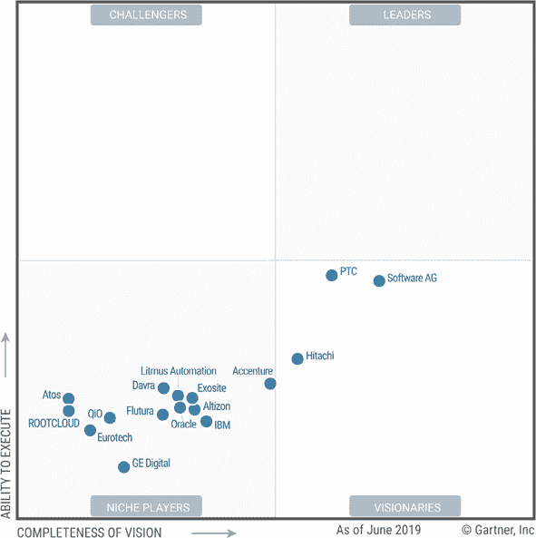
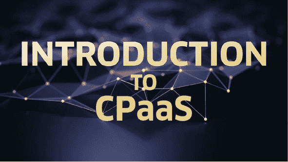
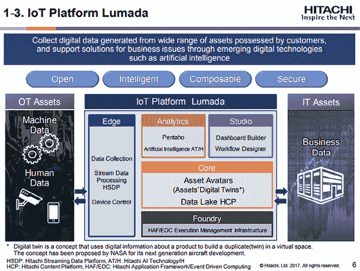
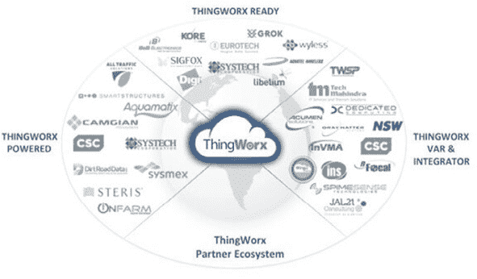
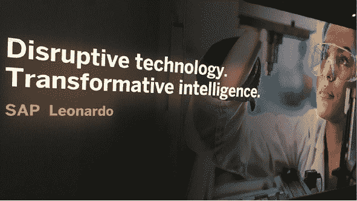

第六章

工业物联网（IIoT）平台

在 IIoT 平台市场中有很多供应商，他们提供的能力和方法部署惊人地相似。到目前为止，没有一家供应商在新兴市场中脱颖而出，成为明确的领导者。例如，Gartner 的 2019 年 6 月工业物联网平台魔力象限就没有领导者和挑战者。请查看图 6.1 以了解 Gartner 的工业物联网平台魔力象限。

鉴于市场碎片化和拥挤，以及 IIoT 从数据中提取价值、降低成本、改进运营和呈现新的业务模型的潜力不断增长，分析师建议寻求平台的商家花时间进行研究。他们还建议关注行业特定的用例和结果。

制造业的主要用例是生产监控和库存管理。在石油和天然气行业，用例是供应链优化和工人安全。许多 IIoT 用例与核心的整体运营效率、设备监控和预测性维护相关，因为任何停机都是极其昂贵的。

简单地说，工业物联网平台创建了一个关键的、单一的运营视图。其功能是一个“超集”，因为它共享了物联网平台的常见核心功能。根据行业分析师的说法，IIoT 平台应提供最重要的功能是：

+   设备管理软件能够连接数千到数百万的传感器、工业机器和数字系统。工业物联网（IIoT）解决方案通常设计用于识别故障并促进从故障中恢复。

+   通过软件开发工具包、开发工具和 API 进行集成，以支持企业业务流程和企业系统。然而，鉴于诸如 ERP、应用性能管理、企业资产管理、计算机化维护管理系统等后台应用程序的多样性，存在重大挑战。

+   • 数据管理以控制和监控摄入、存储、可访问性、流动。

+   • 分析连接设备、企业以及第三方的数据，揭示模式和资产优化。

图 6.1 顶级 IIoT 平台

来源：Gartner

工业物联网平台还应能够协调诸如机器学习（ML）等功能，使用边缘计算，因为某些制造业的时间序列数据量太大，无法传输到云端。此外，在安全或紧急情况下采取行动所需的数据延迟在云端太长。

另一个来自工业组织本身，以及对工程师文化的挑战，他们“非常信任自己能够触摸和控制的事物”，根据 Gartner 的说法，预计到 2023 年，30%的工业企业将拥有完整的工业物联网平台本地部署，高于今年的 15%。

什么是工业物联网平台？

工业物联网平台是一个模块化软件系统，它帮助连接一系列不同的设备（“物”），管理数据流动，提供数据分析能力，并支持应用开发，以便理解和利用处理后的数据。

物联网解决方案架构

一个典型的解决方案架构包括四个关键组件：

1.  1. 业务应用/集成：一个后端 IT 系统集成库，确保机器数据被输入到关键 IT 系统中，以完成操作的循环。与关键系统（如 ERP、BI、QMS 和计划、调度）的集成非常重要。此外，平台应提供一系列业务（行业特定）应用或构建此类应用的能力，以满足特定的顶点。

1.  2. 智能边缘网关：这是一个接近物的软件组件，能够收集、汇总、净化轻量级数据流，并将汇总/相关结果推送到物联网云。它充当物与云物联网平台之间的调解者。

1.  3. 物联网云：这是一个核心的物联网平台，能够处理大量数据，并具备数据分析、机器学习和人工智能能力。其核心能力包括，但不限于，设备管理、流分析，包括复杂事件处理、规则引擎、警报和通知、大数据和机器学习能力，以及其他关键平台服务，如身份验证、多租户、端到端安全、调度引擎、软件开发工具包（SDK）和平台应用程序编程接口（API）。

1.  4. 物：这些都是实际由收集其数据来监控的机器或系统。这是你的数据来源。

如何选择工业物联网平台

选择您的工业物联网平台时需要考虑的关键因素

+   部署灵活性：不同的组织有不同的需求、技术成熟度和内部支持第三方软件的能力。一个组织可能需要完全在本地部署，以保持对他们全部的控制权，或者可能会选择私有或公共云选项，以实现更高的效率和节省成本。有时，你可能从本地部署开始，然后逐步过渡到基于云的模式。无论什么情况，你的平台必须提供不同的部署选项的灵活性。

+   • 易用性：如果系统复杂，采用率就会受到影响。你的物联网平台必须易于学习、适应和操作。障碍越少，采用率越高。你的物联网平台将被你的车间人员、管理团队、IT 维护工程师、供应商/分销商使用，在某些情况下，甚至你的客户或合作伙伴也会使用。因此，拥有一个易于学习曲线和易于维护的物联网平台非常重要。

+   • 互操作性：你的组织数据存储在多个系统和各种格式中。物联网平台应该能够与你的后端 IT 系统（如 ERP、CRM、QMS、规划和调度）集成。这使得你的物联网项目成功，因为这类集成有助于将实时相关的机器数据输入关键 IT 系统，帮助做出数据驱动的决策。

+   • 验证证明：最后，你不想成为风险项目的试验品。确保物联网平台有足够的客户和开发者社区。你应该要求客户提供参考信息，并检查他们如何通过使用该平台获得好处。一个良好的合作伙伴和开发者生态系统是良好全球支持的标志。合作伙伴和开发者生态系统都可以帮助快速部署和配置，并实现产品上市时间。第三方验证证书，如安全或平台稳定性或客户推荐信，可能是选择平台的好过滤标准。

+   • 安全和可扩展性：你的数据是你的关键资产。因此，数据安全至关重要。物联网仍处于相对早期阶段，其安全框架尚未成熟。你的云物联网平台必须提供全面的物体级安全特性，同时还要保护传输中的数据和静止数据。其次，你的物联网平台必须具有企业级性能保证。你的物联网项目可能始于一个小规模的试点，但物联网举措通常是企业数字化转型的组成部分。因此，在选择物联网平台时，你需要展望未来，以定义可扩展性需求。

+   • 支持连接协议：每个物联网项目都有如物联网解决方案架构中所述的多个组件。物品、硬件、传感器、OT 系统和边缘网关是在数据到达物联网云之前出现的关键元素。在大多数物联网项目中，最大的挑战是将机器连接起来以收集数据。你的平台边缘需要支持广泛的通信协议。以太网、OPC—UA/DA、CSV/XML 等，只是要列举的几个广泛使用的协议，任何物联网平台都必须支持。

+   理解你的需求：不要被炒作或管理压力所驱动，首先重要的一个方面是要明白你为什么需要物联网，以及你希望通过物联网实现什么目标。很多人在问我有了自动化之后，为什么还需要物联网，或者有一种误解认为物联网将替代我所有的 SCADA、DCS 和 ERP 系统。物联网的关键优势在于，当你利用数据分析的力量，并能够将你的信息技术（IT）和运营技术（OT）系统跨越工厂或多个工厂连接起来时。你需要将物联网看作是一个大局，而不是一个点对点的解决方案来解决一个小问题。

有数百个物联网平台。从众多平台中进行选择可能是一项艰巨的任务。领先的技术分析公司，如 Gartner、Forrester 和 IDC，已经发布了他们对各种物联网平台的详细评估研究。你可以参考其中一些报告，以缩小你的关注范围，并对一个自信的决定进行闭合。

工业互联网平台市场

由于其在能源和公用事业、化工和材料、食品和饮料、水和废物管理、汽车、机器制造、半导体和电子、医疗设备以及物流和运输等众多行业中的广泛应用和采用，工业互联网平台市场正面临着指数级的增长，因为它抓住了这些垂直行业的必然采用。物联网市场的快速增长——参见图 6.2

图 6.2 工业互联网市场图

来源：IoT Central

SELECT USA，美国的一个联邦组织，负责促进外国直接投资，发现美国的物流和运输行业产生的收入接近美国年 GDP 的 7.5%，金额接近 1.4 万亿美元。IIoT 平台市场解决方案与交通业的融合正在以异常的方式发展这一领域：

+   • 它使道路、铁路、空中和航运制造商及海洋管理企业能够随时随地与他们的技术人员连接，使他们能够在现场维修和维护中保持警惕。

+   • IIoT 平台市场的公司正在通过移动设备为客户提供改进的用户体验，并为其服务人员提供改进的诊断能力。

+   • 诊断能力的提升：诊断 PC 应用和原生车辆网络之间的连通性帮助服务人员和经销商轻松修复车辆上的关键运行装置。

所有这些高效和经济性的运营特点已经将全球现有的交通业态引导向 IIoT 的安装，从而推动这一应用行业段在 2025 年以前以惊人的复合年增长率 31.3%增长。

根据全球 IIoT 平台市场敏锐的区域展望分析，截至 2018 年，北美地区以 33.5%的全球市场份额占据主导地位。除了前面提到的石油和天然气以及交通行业，该地区还见证了 IIoT 在其繁荣的医疗设备行业、食品和饮料消费以及其物流、水和废物管理设施中的应用，这是由于工业化和能源及公用事业部门的推动，满足了不断增长的城市人口的需求。

全球 IIoT 平台供应商

IIoT 平台市场的一些主要参与者包括 G.E.（Predix）、西门子（Mindsphere）、日立（Vantara）、霍尼韦尔（Uniformance）、ABB（Ability）、IBM（Bluemix）、微软（Azure）、施耐德电气（Wonderware）、Atos（Codex）、PTC（ThingWorx）、C3（C3IOT）、SAP（HANA）、软件 AG（Cumulocity）、博世（IoT 套件）和思科（Jasper）。

ABB 公司是一家电力和机器人公司，正在使用联网传感器来监控其机器人的维护需求，以在零件损坏前主动提供维修。KIST 欧洲公司和 IBM 是 SmartFactory-KL 的合作伙伴，这是一个创新性的工业设施，采用集成机制，可重新配置以执行各种制造任务。所有设备都配备了传感器并通过物联网(IoT)连接，实现对工厂物理属性、流程和系统的全面数字模拟，在 IBM 云中运行。

根据联合国的报告，到 2022 年，网络化设备（“物联网”）的数量将是人口的六倍之多。同样，许多知名企业和行业都有实施以数字为先的业务策略的政策（例如，KIST 欧洲和 IBM）。因此，现有的环境已经表明物联网已经开始在个人消费者和工业领域牢固地掌握主导权。未饱和的 IIoT 平台市场显示出所有潜在的和必要的素质，以取代日常评估管理的传统设备，采用物联网。

工业互联网平台（IIoT Platforms）

分析机构 Gartner 对领先的 IIoT 平台进行了全面评估，并命名了业务中的佼佼者。在这里，企业物联网洞察对 Gartner 的评价进行了回顾，并整理了结果，以总结能源和公用事业、制造业以及交通和物流领域企业可用的最佳 IIoT 平台。

埃森哲

+   • 平台：通信平台即服务（CPaaS）

+   • 发布时间：2015 年

+   • 行业：能源和公用事业、制造业、交通和物流

+   • 应用案例：资产管理与预测性维护

+   • 云：私有（企业内部）、混合（IaaS）、公共（AWS/微软 Azure）

图 6.3 指的是 CPaaS 的介绍。

首席信息官（CIO）感受到的压力预计只会随着客户需求的增加而增加。这就是为什么越来越多的 CIO 们开始青睐于客户体验的平台方法，即通信平台即服务（CPaaS）。实际上，IDC 预测到 2022 年，CPaaS 市场的价值将达到 109 亿美元。

CPaaS 横跨公司的各种传统系统，通过作为它们与客户通信渠道之间的桥梁来增强它们。这消除了“大拆大建”传统 IT 系统的高昂费用，并确保它们仍然能够在不阻碍灵活性的情况下提供价值。一个中心通信平台还可以支持创建和管理多个客户旅程。利用低代码开发、视觉组合和“拖放”功能，通信平台使公司能够实时构建、更改和优化客户旅程。低代码方法还实现了开发民主化，减轻了 IT 的负担，同时显著降低了开发过程和成本。

图 6.3 CPaaS 简介

来源：阿尔卡特-朗讯

从自动化的角度来看，采用平台方法可以无缝地整合和编排客户互动，使用自然语言处理（NLP）和人工智能（AI）。它们提供了发布、迭代和编排外向单向通信和交互式双向通信的工具，以及跨任何数字通信渠道的多步骤交互式客户旅程。这使得公司能够通过自动化渠道无关的客户旅程来提高运营效率和改善客户体验，其速度比以往任何时候都快。

Altizon

+   平台：Datonis

+   • 启动：不适用

+   • 行业：能源和公用事业、制造业、运输和物流

+   • 用例：实时监控资产以预测故障和备件管理

+   • 云：私有（本地）、混合（IaaS）、公共（AWS/微软 Azure）

Datonis 是由位于帕洛阿尔托的 Altizon Systems 公司开发的一个高度可扩展的、基于云的 IIoT 平台，该公司在过去六年中一直在帮助企业找到通过他们的 IIoT 转型之旅的方式。作为一个连续第二年被评为 Gartner 2019 年 IIoT 平台魔力象限的公司，Altizon 已经连接了超过 100 个制造工厂，实施的一项举措列表仍在增长。

他们的研究向他们展示了，每个行业垂直领域都有一套独特的障碍或最佳适用于 IIoT 的使用案例，而他们的关注点告诉他们，采用全面的方法可以更快地为客户实现投资回报。Datonis 帮助企业在诸如能效、过程质量改进和边缘机器的整体设备效率（OEE）等方面实现可衡量的业务成果。

Datonis 是一个基于云的 IIoT 平台，通过连接机器、人员和流程来推动数字化转型，利用机器数据、分析和人工智能来驱动成果。该平台是可扩展的，允许设备：

+   • 实时、安全地连接和传输数据

+   • 实时分析机器数据

+   为故障或错误设置警报和通知

+   • 大规模交互式分析机器数据

+   • 在机器数据上使用机器学习构建数据模型并预测结果

+   • 使用开放 API 将机器数据与企业系统整合

现在，企业可以交互式地分析大规模的机器数据，并利用机器学习的力量构建数据模型来预测结果。

Atos

+   平台：Codex IoT

+   • 启动：2016 年 6 月

+   • 行业：能源和公用事业、制造业、运输和物流

+   • 用例：包括资产监控、质量和预测性维护

+   • 云：私有（本地）、公共（AWS/微软 Azure）

Atos 提供 Codex IoT，这是一套物联网应用、蓝图、平台和业务服务，以及在其自有平台和合作伙伴平台上的开发、托管和集成服务，特别是西门子 MindSphere。Atos 为边缘解决方案提供广泛的托管服务；混合平台；与 Worldline（其专注于支付和交易服务的子公司）一起，提供物联网连接。该公司的客户集中在欧洲。然而，在 2018 年 10 月，该公司与 Syntel 合并，扩大了其在北美的影响力；顾问资源；以及在银行、金融和保险方面的专业知识（这项收购发生在本次分析的截止日期之后，因此未反映在 Atos 的得分中）。

Atos 拥有丰富的合作伙伴生态系统和与其他供应商合作的意愿，客户将其视为一个关键的区别点。它应该继续扩展其合作伙伴生态系统和创新中心的影响力，以适应不断发展的物联网市场需求。Atos 的发展路线图专注于区块链、认知学习、人工智能和机器学习以及多平台集成解决方案，帮助企业应对物联网数据的不断增长和复杂性。企业转向 Atos 寻求针对互联车辆、智能家居、工业物联网、智能电网以及能源和公用事业市场的垂直解决方案。

日立

+   • 平台：Lumada

+   • 发布时间：2016 年 5 月

+   • 行业：能源与公用事业、制造业、运输与物流、自然资源

+   • 用例：资产管理、预测性维护、运营卓越

+   • 云：私有（本地）、混合（IaaS）、公共（AWS/Google/微软 Azure）

图 6.4（#ch6fig4）展示了 Lumada 平台上各种数据源如机器、人和业务数据的数据收集功能。

一般来说，日立公司的 Lumada 物联网平台业务正在帮助日立协调其数百个业务，顺便说一下，根据日经亚洲评论，这家企业集团计划到 2022 年 3 月将业务实体减少到大约 500 个。

图 6.4 Lumada IIoT 平台

来源：物联网革命

“Lumada 使我们能够标准化我们在物联网和数据驱动解决方案方面的工作，”日立万塔拉高级总监、全球物联网营销 Bjorn Andersson 说。“Lumada 就是从这里来的。”也就是说，Lumada 是一个帮助企业集团标准化技术和找出可以跨其业务推广的最佳实践的机制，“这样我们就不必每次都重新发明轮子了，”Andersson 补充说。将 Lumada 描述为“不仅仅是一个平台”的 Andersson 表示，该软件不仅限于促进连接、数据管理和安全。它帮助日立万塔拉客户实现业务目标，他说。“我们试图把我们在这些业务领域所有的领域专业知识都融入进去，制造业是其中一个很大的领域，”Andersson 说。

然而，通过 Lumada 制造洞察，日立万塔拉不仅仅是在利用自己的内部制造经验。“我们正在进行大量的共同创造，”Andersson 说。并且从这些经验中学到的东西，他希望构建成“为我们的客户更打包的解决方案”，他补充说。很难确定 Lumada 的起源，但该公司在 2016 年正式向公众推出了这个平台。近年来，该平台在 Gartner、Forrester 和 IDC 的各类物联网和工业物联网排名中具有竞争力。

IBM

+   • 平台：沃森物联网

+   • 发布时间：2014 年 10 月

+   • 行业：能源与公用事业、保险、制造业、零售

+   • 用例：资产管理、预测性维护

+   • 云：私有云（本地部署；隔离和单租户），公共云（多租户）

沃森物联网利用数百万传感器持续不断地工作，以大量数据为企业有效性能提供支持。通过使多种技术汇聚一堂，包括互联网、微电子系统和无线通信等，物联网已成为现实。从数字孪生到互联汽车，物联网使我们的生活变得异常轻松。

几乎所有东西，从汽车到输送带，都连接到网络，物联网改变了每一家企业的运作方式。IBM 沃森物联网提供了一个灵活、多功能、可扩展的工具包，包括网关和应用访问，用于收集连接设备的数据并分析其增长。通过使用沃森物联网，企业可以提取连接设备的 data 和有价值的洞察力，以提高和改善企业的运作。

IBM 成功识别了各种具有巨大潜力改变我们生活世界的物联网区域，以及物联网的潜在好处。IBM 还与许多金融机构合作，提供更好的、安全的支付方式和手段。IBM 在将物联网技术推向不同水平方面始终做得最好，以便我们生活的世界变得更加安全和舒适。

甲骨文

+   • 平台：甲骨文物联网云服务

+   • 发布时间：2015 年 12 月

+   • 行业：能源和公用事业、制造业、运输和物流

+   • 应用重点：资产管理、生产监控、车队监控

+   • 云：私有云（甲骨文云；可部署在本地）

甲骨文是一家以先进数据库管理而闻名的全球软件公司。其产品线不仅限于云计算和企业软件，还提供了广泛的物联网工具包。

甲骨文物联网平台将企业软件与现实世界中设备和它们的指标连接起来。甲骨文通过用户友好的环境提供出色的面向企业的机会，用于构建商业应用程序。作为数据库管理的公认领导者，甲骨文可以处理大量数据。因此，创建大规模物联网生态系统绝非难事。

在数据泄露和无处不在的安全漏洞的时代，使用高级保护机制是再好不过的想法了。众所周知，物联网生态系统通常与各种设备集成。由于并非所有设备都内置了安全功能，因此使用集中式保护工具至关重要。甲骨文公司利用了高质量的安全机制。保护物联网系统免受任何外部威胁，这使得甲骨文公司独具特色。

甲骨文的主要目标是帮助您的产品尽快进入市场，使用高速消息传递和端点管理，扩展和改进您的供应链、客户体验应用和运营效率。通过使用甲骨文 IoT 云平台，您可以将设备连接到云端，进行实时分析研究，并将获取的数据与企业应用程序或网络服务集成。

PTC

+   -   平台：ThingWorx

+   -   启动：2014 年 1 月（收购）

+   -   行业：能源和公用事业、制造业、交通和物流

+   -   用例：资产管理、预测性维护、运营卓越

+   -   云：私有（本地）、混合（IaaS）、公共（AWS/Google/Microsoft Azure）

图 6.5（Figure 6.5）概述了 PTC ThingWorx 合作伙伴生态系统，包括像 CSC（计算机科学公司）这样的大型系统集成商。

PTC ThingWorx 是一个物联网的应用开发平台。PTC 是一家计算机辅助设计（CAD）软件和其他工具制造商用于设计、生产和维修产品的公司，于 2013 年 12 月收购了 ThingWorx。

PTC ThingWorx 平台由五个主要组件组成。

图 6.5 PTC ThingWorx 7

来源：Internet of Business

1.  -   1. ThingWorx Foundation 连接其他五个组件，包含基于模型的快速应用开发工具，包括用于组装仪表板和其他应用的拖放混合构建器。它还包括安全和服务以及隧道服务器等连接服务。一个子组件，ThingWorx Foundation Edge，附带边缘微服务器（IoT 边缘设备的服务器软件）以及 PTC AlwaysOn 协议的软件开发工具包，有助于最小化设备的电源和数据需求。

1.  2. ThingWorx Utilities 帮助商业用户定义、管理、监控和优化他们的连接产品以及创建与管理物联网设备相关的业务流程。生成的连接器旨在可在新业务流程和设备中重复使用。

1.  3. ThingWorx Analytics 包括仿真和预测分析功能，帮助用户从设备收集的数据中获取价值。该软件还可以实时检测异常和模式。分析服务器增加了监控预测结果（如设备故障）并自动检测某些结果原因的能力，从而优化它们。

1.  4. 为增强现实开发提供的 Vuforia 技术。

1.  5. Kepware KepServerEX 是一个用于集成工业系统的物联网网关和其他网络软件，包括 SCADA（监控控制与数据采集）和 MES（制造执行系统）软件。

2016 年，PTC（前 Parametric Technology Corp.）宣布支持公共物联网设备云服务，包括亚马逊网络服务物联网和微软 Azure 物联网中心。设备云服务处理与多种物联网设备的集成，使 ThingWorx 开发者能够专注于访问设备的应用程序构建。

PTC ThingWorx 吸引了大量的第三方支持。到 2016 年中，ThingWorx 网站列出了大约 100 个合作伙伴，其中值得注意的是博世、思科、戴尔、爱立信、日立、英特尔、德州仪器和威瑞森。

QiO

+   • 平台：Foresight

+   • 发布：2016 年 6 月

+   • 行业：能源和公用事业、制造业、交通和物流

+   • 用例：资产监控和预测性维护

+   • 云：私有（Foresight 云；可本地部署）

QiO 由四个应用程序组成：

1.  1. QiO Foresight Energy®让你能够预测业务中能源波动对质量、生产和成本的影响。分析来自你工业设备、智能电表、MES 和 ERP 系统的数据，创建实时的能源效率指数。

1.  2. QiO Foresight Maintenance®显著提高安全性、延长资产寿命、减少计划外停机和故障。我们融入人工智能的 QiO Foresight Maintenance®应用程序使你能够预测故障，并为你的团队推荐采取的最佳行动方案，以最小化停机时间来预防或减轻它们。

1.  3. QiO Foresight Performance®可数字化跟踪全球各地站点和供应商的合规性，并与之协作制定标准。QiO Foresight Performance®能帮助你快速改进企业内的关键绩效指标。预建的模板包含行业最佳实践，如质量、安全和精益，使入手变得容易。

1.  4. QiO Foresight Production®能帮助你巧妙地管理意外事件，否则这些事件会降低生产率、效率和质量。我们融入人工智能的 QiO Foresight Production®应用程序持续监控你的生产线日程和供应链网络，预测资源挑战，如物料、零件和劳动力，从而降低成本，提高质量。

尽管 QiO 的 Foresight 平台涵盖了工业市场的全部组件，但该公司的优势在于其先进的数据分析，特别是其工业资产的数字孪生。其市场营销合作伙伴包括劳斯莱斯、劳氏注册公司和 BT。

SAP

+   • 平台：Leonardo

+   • 发布：2017 年 1 月

+   • 行业：能源和公用事业、制造业、交通和物流

+   • 用例：资产监控、预测性维护、相关分析

+   • 云：通过 SAP 云平台提供云和本地服务

SAP Leonardo，见图 6.6，因其变革性的智能而被视为一种颠覆性技术。

SAP Leonardo 是数字创新系统，它将 SAP 云平台的外部面向未来的先进技术和能力整合到一个智能框架中。借助这种双模方法，SAP Leonardo 服务在 SAP 云平台上交付，使您免受核心平台任何风险或变化的影响。借助 SAP Leonardo，可以通过将 SAP Leonardo 融入 SAP 组合的广度来开启并推动创新 upright cycle。

图 6.6 SAP Leonardo

来源：Computerworld

框架中刚刚记录的数据和交易现在将用作安排发展的贡献，该发展将提供智能洞察并自动化业务流程。借助 SAP S/4HANA 作为核心，SAP Leonardo 帮助企业无处不在地扩展，通过快速采用新的业务模型和能力，并包括新出现的技术。现在，许可和订阅比以往任何时候都更容易，因为这将只为您使用技术和技能付费：参与服务而非产品。SAP Leonardo 使用 SAP Leonardo 的创新服务嵌入。

SAP Leonardo 将所有最新技术和服务整合到一个智能系统中，并包括以下功能：

+   机器学习：SAP Leonardo 包含 ML 功能，利用 AI 功能获取有用的知识，以做出有根据的商业决策。

+   物联网：SAP Leonardo 还涉及智能互联的事物、人员和流程，并利用 IIoT 和万物互联的好处。

+   大数据：借助大数据，它具有存储、管理、访问和与来自多种来源的任何形式的数据（如结构化或非结构化）接口的能力。

+   分析：它可以从庞大的匿名数据网络中提取敏锐的数据。它可以用来发现许多商业问题的答案。

+   区块链：这项技术用于在安全阶段加速交易，并增强透明度、信任和可追溯性。

+   • 设计思维：专家支持业务构想、快速原型制作和商业案例开发。

软件 AG

+   平台：Cumulocity

+   • 启动：2017 年 3 月

+   行业：能源和公用事业、制造业、交通和物流

+   应用案例：资产管理，预测性维护

+   云兼容性：私有、混合、公共

Cumulocity—见图 6.7—为您提供了非常快的远程资产可见性和控制，无论是房屋、汽车、机器还是需要管理的其他任何资产。

Cumulocity 提供

+   • 用于扩展现有功能或使 Cumulocity 与您的其他 IT 服务（如 ERP 或 CRM 系统）接口的 API。Cumulocity 还可以托管您的 HTML5 应用程序。

+   • 您可以使用认证的软件库将您的远程资产带入云端。

+   • 通过网络实现设备管理、数据可视化和远程控制功能。

+   通过实时处理和 Cumulocity 应用实现上述内容的快速定制。

图 6.7 Software AG Cumulocity

来源：企业物联网洞察

所有这些都是通过基于云的订阅服务提供的，使得使用 Cumulocity 创建物联网解决方案与定制开发和 RAD（快速应用开发）从根本上有所不同。您可以立即开始使用大量现有功能，而且可以免费开始。您不需要担心 IT 基础设施（托管、网络、安全、存储和备份）和 IT 管理（所有软件都提供给您的用户）。

Cumulocity 与任何网络架构兼容，但专门设计为与移动网络无缝对接。在以下部分中，我们将简要概述不同功能区域，并参考更详细的描述。

Cumulocity 具有广泛的定制选项，例如：

+   • 设置带有您最重要的 KPI 的图形仪表板。

+   • 订阅为 Cumulocity 应用程序贡献新功能的插件。

+   • 使用实时实施实时业务规则。例如，在关键事件发生时发送电子邮件，或在那种情况下触发设备的自动化操作。

+   • 编写警报规则以重新优先处理或抑制警报，并定义您的 SLA 参数。

章节总结

+   • IIoT 平台的关键组成部分

+   在选择您的 IIoT 平台时需要考虑的关键因素

+   • 全球 IIoT 平台供应商概览，包括平台名称、发布日期、目标行业、用例和摘要描述。

针对您的业务的管理问题

+   • 你是如何创建一个合适的 IIoT 平台的短名单的？

+   • 你是如何描述每个 IIoT 平台的，包括优势和风险、安全和硬件、软件及人员预算？

+   你是如何预测有形和无形的成果或节省的？

+   各个 IIoT 平台的总预测成本或预算以及预测结果或节省情况是什么？

+   哪个 IIoT 平台的现金流最高？

参考资料和额外阅读

杜梅宁，G.，F.W. 雅克尔，M. 沃尔斯莱格，和 M. 泽尔姆。2018. 企业互操作性：智能服务和企业互操作性的商业影响。英国伦敦和威利，新泽西州霍布肯：ISTE Ltd。

萨胡，P. 2019. 优化工业工程中的当前策略和应用，IGI 全球，宾夕法尼亚州，赫尔希。

[`dzone.com/`](http://http://dzone.com/)

[`engineering.com/`](http://engineering.com/)

[`enterpriseiotinsights.com/`](http://enterpriseiotinsights.com/)

[`iotworldtoday.com/`](http://iotworldtoday.com/)

[`ittechnologynews24.com/`](https://ittechnologynews24.com/)

[`simpleiot.eu/`](http://simpleiot.eu/)

[`smartfactoryvn.com/`](http://smartfactoryvn.com/)
