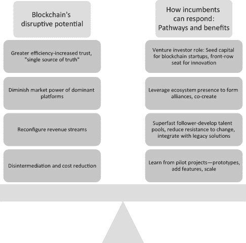
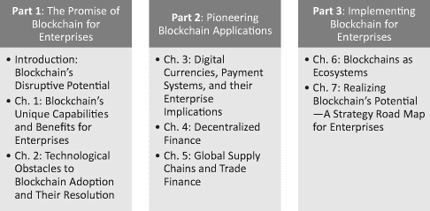

# 引言：区块链的颠覆性潜力

2021 年，一群黑客入侵了 Colonial Pipeline Company 的计算机系统，该系统包含管理管道运营的软件应用程序。他们加密了数据并锁定了对管道运行至关重要的系统的访问，并要求支付赎金以释放数据。1 Colonial 的 5,500 英里长的汽油和柴油燃料基础设施连接了德克萨斯州墨西哥湾沿岸的炼油厂和东海岸的大部分地区，为纽约、弗吉尼亚州、北卡罗来纳州、南卡罗来纳州和乔治亚州等主要大都市区和企业供应了 45% 的燃料。这种勒索软件攻击对各类企业来说已是家常便饭——且代价高昂。这次袭击迫使 Colonial 暂时停止了管道运营，导致了地区性汽油短缺、长队、价格上涨和汽油囤积。它还再次揭示了美国关键基础设施运营对网络攻击的脆弱性。Colonial 支付了约 500 万美元的赎金以解密其数据并重新访问计算机系统。2 除了支付赎金外，该公司还必须应对收入损失和声誉损害。

无论是对管道还是金融机构，对于一家公司来说，保护自己及其运营和数据库免受敌意、图谋不轨的经济行为者至关重要。解决方案在于分布式账本技术（DLT），即广为人知的区块链。DLT 设计之初就假定企业将面临不诚实的交易对手，他们试图在线交易中谋取私利。在 Colonial 的案例中，由于其使用传感器、阀门和泄漏检测系统来控制管道，因此在智能计量环境中采用基于区块链的多层网络安全保护本可以提供保护。3 另一种选择是使用分布式数据存储来存储关键数据，并与受许可的区块链相连接。4

当然，防止这类勒索软件攻击的传统解决方案已经存在，例如空气隔离系统 5、离线冷备份，以及经过测试的 IT 灾难恢复计划。在空气隔离系统中（在这种系统中，网络与外部网络，无论是有线还是无线，都断开连接，并确保 WiFi 收发器不在空气隔离系统的附近），传输数据的唯一方式是将信息复制到物理外围设备，如磁带备份或硬盘驱动器，然后将其连接到接收系统。离线冷备份在所有用户离线时进行，确保在备份过程中文件不能被更改，并保护备份数据免受活病毒和黑客攻击的侵害，并将备份数据存储在离线上。区块链提供了一种替代方案，但必须证明其相对于传统解决方案的优越有效性，才能证明转型是合理的。尽管区块链已经存在了十多年，但只是在最近几年才成熟到成为潜在的颠覆性创新的程度。本书探讨了区块链可能带来的机会，同时定义了当前区块链应用的限制，为传统企业的领导者提供策略，以便最大程度地利用区块链获得竞争优势。

## 什么是 DLT 和区块链？

DLT 依赖于三个相互关联的概念——分布式点对点（P2P）网络、强加密技术和源自博弈论的激励机制，即代币。代币是具有价值的数字资产，可以作为奖励来激励期望的行为，也可以作为参与者在 DLT 中提供服务，如验证真实性或转移资产所有权的支付手段。区块链是 DLT 的一个应用，也是最为人所知的应用，它特别将交易双方之间的交易所分组到区块中，然后通过加密技术将区块链接起来，因此得名“区块链”。区块链是比特币创建和交易的技术基础，自那以后，其适用性迅速扩展到了加密货币之外更广泛的领域。DLT 使用强加密，以确保数据安全并仅对预期接收者可用。数据的副本分布在节点上，因此篡改数据需要入侵多个节点并更改每个副本，这使得篡改行为越来越明显，也越来越困难。

## 区块链如何使用？

blockchain 的优势不仅限于价值交换和数据安全。区块链可以帮助避免增加成本、引入低效和逐步风险的中介。以下是一些简短的案例研究——有些正在发生，有些将在不久的将来发生——这些案例研究展示了区块链的影响力。

### 全球供应链

全球供应链是一个充满延误、欺诈、不道德的工人待遇和各方之间的数据不一致的领域。例如，供应链欺诈，通过使用相同的发票从多个信贷来源获得融资，每年可能造成 6000 亿美元的损失。由于严重依赖基于纸张的过程，存储在多个位置的数据孤岛中，行政成本可能高达货物价值的 20%。由于丢失或损坏的文件，或供应链合作伙伴之间的数据不一致，使得难以预测货物何时到达目的地，同时增加了供应链中在途库存的数量。

在 2017 年，IBM 和马士基联手开发并推出了 TradeLens，一个旨在解决上述全球供应链面临的慢性挑战的区块链平台。首先作为全球贸易数字化平台部署，TradeLens 将大量供应链参与者连接到一个“单一真相来源”。因此，几个供应链实体可以获得关于交易相同的信息，避免争端、延误和调和差异的需要。TradeLens 还提供电子提单设施，允许供应链实体安全地发行、转让和交付提单。

TradeLens 不仅对它服务的业务有益，而且对 IBM 和马士基来说也是一笔好生意。作为费用，托运人可以获得关于他们货物的持续更新的数据，使他们能够监控全球货物 movements and to increase their efficiency while keeping data secure from hackers. After two years in the marketplace, TradeLens tracked 30 million container shipments, 1.5 billion events, and 13 million documents across ten ocean carriers and more than six hundred ports. And TradeLens’s value only increases as more supply chain entities become members.

### 跨境支付

跨境支付对付款人和收款人来说可能既令人沮丧又代价高昂。这是一个问题，因为预计到 2022 年，跨境支付总额将达到约 30 万亿美元，手续费高达转账金额的 6-7%，总计可能超过 2 万亿美元。支付可能需要几天时间，当发送代理在收款国没有业务时，他们必须依赖当地的金融机构完成转账。这些转账对客户来说可能是模糊的，客户可能不知道交易何时完成，以及用于转换的具体汇率，这让他们在转账过程中面临金融风险。

这个问题充分发挥了区块链作为值得信赖和透明账本的优点。它可以帮助实现更快、成本更低、对交易各方风险较小的跨境交易。这就是为什么英国、加拿大和新加坡等中央银行正在联合进行试点，以更低成本提供更快支付，以及使用中央银行数字货币（CBDCs）。7

区块链的可扩展性意味着其在跨境支付中的实用性也可以用于管理小额零售转移，例如跨国汇款的外出工人。这些交易需要高额费用和缺乏透明度。这种汇款的总可接触市场在 2019 年估计为 5480 亿美元。8

这种广泛的区块链应用使得像 Ripple 这样的初创公司提供了对长期主导的 SWIFT 消息系统标准的替代，该标准是全球代理银行网络基础设施的核心，用于汇款。通过这种方式，Ripple 提供了快速、低成本、可靠的支付，并可访问广泛的国家和货币。像桑坦德银行这样的银行与该公司合作，自 2018 年起通过他们的移动应用 One Pay FX 提供低成本、一天的跨境支付。

### 保护数字数据：音乐、视频和数字艺术

在过去的几十年里，音乐家、视频游戏设计师和其他艺术家——以及他们的行业——一直在努力保护他们作品数字化文件不被复制和/或盗窃。创作者和公司主要通过中介向消费者传达，这些中介的费用可以是一笔交易总收入的重要部分。Spotify、Apple、Amazon、Google 等提供的音乐流媒体服务支付给音乐家的金额相对较小，大部分利润来自会员费和音乐文件的购买，这些利润流向全球音乐录制公司和制作人。如果音乐家将他们的音乐放在区块链上，听众可以使用一个应用程序连接到该区块链。他们可以用微交易支付，以换取不同级别的访问权限，例如一次性收听、在一定时间内重复收听，以及试听权。这将帮助音乐家摆脱流媒体服务作为中介，为自己保留更多收入，就像那些流媒体服务曾经破坏了更古老的音乐发行业务一样。伯克利音乐学院就是以这个目标为宗旨推出了开放音乐倡议，并在 2020 年将其 RAIDAR 许可平台提供给公众。RAIDAR 整合了智能合约和音乐家身份验证，使他们能够付费许可他们的艺术追求，交易成本低。9

视频游戏行业可能会经历与音乐行业相同的颠覆性变革。目前，像 Epic Games 这样的生产商——打造了拥有 3.5 亿全球用户的游戏《堡垒之夜》——在苹果 App Store 和谷歌 Play 上的销售要支付 30%的佣金。Epic Games 起诉苹果和谷歌 10，以迫使这两家公司降低他们的佣金率，声称他们滥用市场垄断地位。通过基于区块链的应用程序提供视频游戏访问，可以确保安全访问并把付款通道给游戏创作者，同时避免向控制苹果和谷歌的发行平台支付佣金。

第一个这样的游戏是*CryptoKitties*，2017 年在以太坊上推出，游戏的目标是培育、购买和销售虚拟猫咪。这个目标或许听起来很可笑，但这款游戏的流行程度压倒了以太坊区块链，一些虚拟猫咪的售价甚至超过了 10 万美元。一款较新的游戏，育碧的*Hash*，允许玩家建造新的环境并为其他玩家创造挑战，向其他玩家收取访问这些新“章节”的费用，从而利用区块链促进去中心化游戏开发，开发者的报酬由他们创建的环境的受欢迎程度决定。11 同样，来自游戏工作室 Sky Mavis 的*Axie Infinity*，其联合创始人和 CEO Trung Nguyen 来自越南，建立在以太坊上，允许玩家在竞争过程中赚取游戏原生的 SLP 代币，这些代币可以在交易所上兑换成加密货币。12 此外，*Axie Infinity*源自如*Pokémon*等经典游戏，允许玩家建造名为 Axies 的怪物，然后让它们与其他 Axies 对战，这些 Axies 和游戏中的地形成为 NFT，可以进行交易。玩家需要购买一些 Axies 才能开始游戏，2021 年 10 月的一轮融资中，*Axie Infinity*的估值接近 30 亿美元。13

在视觉艺术世界中，区块链的非同质化代币（NFT）功能允许创建和交易独一无二的数字文件。文件用只有其合法用户才能解锁和访问的公钥-私钥对进行加密。因此，NFT 为数字资产提供所有权证明。创建它们的能力催生了一个全新的数字数据市场，比如苏富比拍卖行以 6900 万美元的价格售出 Beeple 的数字艺术，大量的 NFT 在诸如 NBA Top Shot 和 Hashmasks 等实体的帮助下，以大众市场可接受的价位被创造、出售和交易。

尽管截图可以从显示器上复制数字艺术，但非同质代币（NFT）提供了所有权证明，并允许数字艺术被收藏和交易。苏黎世的 Suum Cuique Labs 召集了七十位艺术家共同创作了一组 16000 件作品——Hashmasks。每件作品都具有独特特征，如一个独特的面具、眼睛颜色、肤色、背景、角色以及一个隐藏的信息（例如，一条王炸散布在多件作品中）。14 作品发布后，买家用以太坊加密货币（Ether）支付了约 900 万美元购买了整个系列。很快市场就形成了，被认为是稀有或更受欢迎的作品以更高的价格售出——一件作品售价为 65 万美元。

### 信用报告机构和信用评分

信用机构，如 Equifax，汇总个人的财务和其他个人信息以发展信用评分和信用档案。尽管这些机构存在安全漏洞，但它们继续赚取巨额利润。Equifax 就是一个典型的例子——2017 年，黑客侵入了 1.4 亿个人信息记录，该公司在 2019 年同意支付 7 亿美元的罚款和客户赔偿，当年还遭受了 4 亿美元的损失。

借助基于区块链的身份验证，消费者可以在区块链上存储和控制他们的个人财务信息，并货币化这些信息，决定与谁分享以及分享多少。他们还可以限制对个人信息的访问，仅分享满足请求者需求的最少量细节。这种发展不仅会破坏商业模式，还会减少像 TransUnion、Experian 和 Equifax 这样的公司的需求。

### 为什么越来越关注区块链？

这些精选的应用程序只是建立在区块链上众多日益成功的试点项目和应用中的一小部分。虽然技术的不断扩展令人瞩目，但接受区块链的实体的大小、力量和承诺也显而易见。他们正定位自己成为各自领域的先行者，并应对来自新兴创业公司和后来居上的现有同行的竞争。为什么？区块链威胁到去中介化，使现有中介角色动摇。它允许交易各方直接互动，摒弃了银行等中间人，从而降低了费用和做生意的成本。

区块链的高级加密和对节点之间副本的分布式存储也使得黑客几乎无法入侵并更改或提取信息。与集中式数据库相比，区块链为经济参与者提供了更大的黑客防护，使得交易信息在生成和存储时可以被信任。将交易串联到抗篡改的区块中，使得交易双方可以追踪交易回其流程，从而确定问题或错误发生的时间。并且借助区块链的分布式安全网络，交易可以在支付完成的同时完成。

## 区块链采用的障碍

尽管区块链技术具有创新性，但它尚不成熟，需要持续发展以克服与主流传统解决方案相比的性能差距，特别是在处理速度、可扩展性、安全性和用户友好性等领域。它对大众市场通常是不透明的；很少有主流用户有使用区块链的经验，并且有使用私钥和公钥保护安全经验。出于这些原因，区块链在匹配企业级服务质量标准方面落后于传统应用程序。然而，尽管在某些方面尚不成熟，但它正在快速发展并迅速克服其不足。

技术障碍只是企业尚未全面采纳区块链的原因之一。区块链的采用面临两个额外的挑战——组织和经济方面的挑战。首先，区块链应用通常需要组织更广泛地与独立实体、供应商、监管机构以及常常是竞争对手合作，以充分利用区块链的优点。企业必须应对减弱的组织边界，并制定合作策略以促进创新和客户服务，这一步他们可能还没有准备好。企业还必须为其组织做好准备，接受并成功使用区块链。发展这种组织准备性涉及招聘专业人员、获得更多教育、入职技术和管理员工，以及克服对变化的抵触。

第二，区块链应用的开发和实施需要资金、人力和时间。高层管理——坚决的首席财务官和董事会——可能不愿意批准需要如此重大投资的预算，除非有明确的正面成本效益分析和投资回报率预计，这在区块链的初级阶段是难以获得的。这些额外的障碍导致现有企业不愿意坚持使用区块链，从而推迟了其广泛应用。经济挑战还延伸至寻找和解决适当的市场机会以及克服法律和监管的不确定性。15

## 应对区块链可能带来的潜在颠覆

考虑到区块链可以提供潜在的颠覆性影响，但也面临这些障碍，现任者保持警惕的态度会成功吗？如果需要更立即的回应，他们应该多快做出反应？在颠覆开始破坏现任特许权之前，他们需要哪些工具和能力来发起回应？现任者应该如何应对？

答案不是等待和观察。区块链挑战者可以在现任者的市场领域内建立显著的领导地位，而迟到的回应很可能是不充分的。其他现任者的回应方式，特别是竞争对手的回应，也很重要。这些其他现任者通过认真对待区块链威胁，可以成为“超级快跟风者”。16 当你的公司还在准备其初步回应时，他们将准备好大规模推出区块链解决方案。因此，现任者最好迅速进行区块链实验，以最小化随后的行业性颠覆带来的风险。他们需要准备好充分利用区块链的潜力，因为区块链将逐渐克服其技术局限，实现其全部价值。

现任者相对于颠覆者有一个生态系统优势——他们是区块链试图颠覆的商业生态系统的一部分。17 例如，一家投资银行试图在区块链上实施整个债券生命周期，可以利用与市场制造商、发行承销团、证券保管代理和监管机构等建立起来的现有业务关系和信任来说服他们全部参与债券生命周期区块链试点。他们的反馈和见解将对评估通过区块链管理公司债券的可行性和优势至关重要。第三方试点参与者的及时响应使现任者能够利用其生态系统地位来抵御挑战者。

现任者还拥有通过几种有计划的途径研究区块链的独特优势，这样可以限制风险和对正常业务的干扰。18 他们可以收购或与区块链初创公司合作，利用挑战者的能力。现任者还可以接触到更大的人才库，并在吸引新客户的同时获取前沿的区块链技术。如果现任公司选择结盟，它可以建立学习机制和知识转移流程，以捕捉并将区块链特有的学习反馈到其核心运营中。来自联盟的知识转移可以与内部区块链技能发展和教育相结合，培养一支准备好在区块链努力起飞时介入的管理和技术人才队伍。教育还有助于减少对变化的阻力，使更好地对齐和推广。

在位企业还可以采取风险投资角色，为区块链初创公司提供种子资金。在接触新技术和新产品/服务提供的同时，在位企业可以评估如何最佳地将区块链进展整合到他们的商业模式中。或者，他们可以参与专注于区块链创新的 external venture capital funds，仍然可以清楚地了解区块链发展情况。

在位公司可以（也应当）启动试点项目，以熟悉区块链。这些试点项目可以利用现有的资本和客户以及有技能的人员（内部和 newly recruited）以及在位公司承担风险的能力。理想情况下，在位公司将在多个领域启动试点项目，发起一场区块链创新的蜂群，以便最终发现最佳表现者。分布式账本技术（DLT）包括分布式账本——多个组织成员持有的相同记录的多个副本。因此，公司可以尝试与自身组织边界之外的组织成员合作，以确定将决策权让渡给去中心化网络的相对好处。

在位企业可以利用这些试点项目来开发支持商业规模推广批准的成本效益估算。通过这些项目，公司可以利用区块链的能力提供改进的客户解决方案，如推出新产品。试点项目还可以帮助公司在维护现有客户关系的同时，准备必要的转变，并提供更大的隐私保护、即时结算和更佳的体验。在位企业还可以将相关的老旧能力和解决方案与新兴的区块链解决方案集成，改善客户和合作伙伴抱怨的问题，提供即时答案，而不必等待区块链进一步成熟。

区块链颠覆是不可避免的，在位企业必须采取各种选项应对。总的来说，在位企业需要追求的广泛目标是不断提高区块链技能和知识。无论这最初是通过收购还是投资实现的，不断增加复杂度的连续试点项目将使这一目标变得可行。

图 0.1

对抗区块链颠覆：在位企业的路径与好处

在克莱顿·克里斯滕森对破坏性创新概念的阐述中，19 资源有限的新的进入者用一个有着粗糙边缘的创新解决方案挑战一个成熟行业及其在位企业：它的性能并不匹配在位企业产品和服务提供。矛盾的是，在位企业可能提供了一个超出市场某些部分需求的性能水平，而超性能可能伴随着一个阻止消费的价格标签。新进入者试图弥合这一差距，针对那些性能超出他们需求的细分市场以及那些被忽视的、愿意接受较低功能的细分市场。

破坏性创新的挑战者针对这些被忽视或服务不足的市场细分，他们意识到这些客户可能会欢迎一个“低端”、性能较差、功能故意受限且价格可能较低的产品。在位企业可能不会觉得这种新进入者的策略具有威胁，因为它们所针对的客户细分可能是低利润客户或“非消费者”，即不是它们当前的客户。非消费者实际上是一个由创新和价格相结合创造的新市场。如果新进入者成功地采用这种低端策略，它们可以接着去针对主流客户。新进入者逐渐在价格、性能和价值主张上赶超在位企业，认识到仅仅依靠创新可能不足以成交。主流客户在考虑转换的总价值时，会包括创新效益、成本降低、与现有解决方案的可比性（或优越性）、易用性以及解决他们具体问题的可靠性。

正是这条路区块链挑战者正在走。目前，他们在底层区块链技术仍然不成熟但正在演变和改善时，针对有解决方案的客户。只有当技术改善后，区块链挑战者才能针对主流市场细分。这种改善路径是一个缓慢的过程——这就是为什么在位企业有时间为开发适时的成功回应而犹豫。

在他们发展的这个阶段，许多区块链初创公司主要针对非消费者和消费能力有限、订单规模较小的客户群体。这些客户群体的利润和利润贡献可能不足以覆盖客户获取和客户服务成本。使用区块链并不一定会导致破坏，因为所提供的产品或服务以及所针对的市场细分可能被受到挑战的在位企业认为不重要。因此，这些基于区块链的组织并不构成对在位企业的直接威胁。相反，应该让在位企业担忧的是更长期的后果。

例如，Filecoin 是一个基于区块链的分布式数据存储系统，最初针对的是存储需求较低的客户或者不愿意使用大型、集中式存储服务的客户，因为这些服务的合同条款不足以提供足够的隐私或防御黑客攻击的保护。20 该公司试图挑战像亚马逊网络服务这样的集中式存储提供商。它使用互补的 IPFS P2P 分布式文件传输和存储网络，提供安全的分布式文件存储，同时在多个节点上加密并存储客户数据。该公司使用代币来激励存储提供商，并确保其客户可以根据需要访问存储容量，保证数据已经存储了合同约定的时长，并且随时可以提取，同时保证如果需要，可以提供长期数据存储。

另一个有趣的基于区块链的初创公司是塑料银行，它旨在防止未回收的塑料，其中很大一部分来自于新兴市场，最终流入海洋。塑料银行创建了一种基于资产的代币，当个人收集并上交废塑料时，他们可以在智能手机上收到这种代币。代币代替现金支付，以便能够向潜在买家提供回收塑料的来源证明，同时减少用户存储和保护现金免遭盗窃的负担。这些代币可以兑换成现金、太阳能手机充电、烹饪燃料、学费、支付公用事业账单和健康保险，从而也解决了减贫问题。塑料银行向废物收集者提供银行储蓄账户和获得信用评分的机会，增强了金融包容性。这一系统需要建立个体塑料收集者、废物收集中心、使用回收塑料的制造商和运输商之间的联系。

基因测试公司 Nebula Genomics 使用区块链让客户控制自己的数据并保护其隐私。使用区块链帮助 Nebula 的客户保持匿名，进而客户可以不透露身份提交样本并接收基因报告，确保他们的个人数据不会与存储在链外的加密基因组信息关联。提供基因组测序的公司可以通过与第三方分享客户数据来获利，而 Nebula 的差异化优势在于，它允许客户决定是否向例如制药公司或学术医学研究人员等外部实体授予对其数据的授权访问权限。这使得客户可以在不泄露隐私的情况下，因数据获得费用，并为医学研究做出贡献。Nebula 可以通过限制研究人员数据分析到受信任的执行环境（TEEs）来保护隐私和防止数据滥用，在 TEEs 中，研究人员可以在 Nebula 的计算设备和存储设备上分析数据，并匿名化个人数据。

随着颠覆性创新过程的展开，这些组织将增加额外功能并扩展其生态系统，以创建和提供健壮的解决方案。促进围绕最初创新发展生态系统，使得基于区块链的客户解决方案能够跨公司和行业进行协作开发，从而进一步颠覆中介利润流。因此，在 Filecoin 的案例中，第三方应用（如 Codefi 的 Filecoin Storage 应用）提供了额外功能，使潜在用户能够搜索 Filecoin 存储市场并比较价格、存储容量和他们的声誉分数。

当主流客户大量采用颠覆性新进入者的解决方案时，市场份额会发生重大转变，这表明颠覆已经完成。然而，我们还没有达到任何区块链颠覆者显示出进入主流的迹象的阶段。最初，区块链主要吸引那些技术熟练、习惯于在智能手机上进行移动电子商务交易并使用分布式应用（Dapps）的用户。Dapps 与区块链紧密相关，因为它们在 P2P 网络上运行，交易记录在分布式网络中的节点上。这与在客户端服务器模式下运行的传统应用不同，后者与应用与集中的服务器进行交易，该服务器可能位于云端。在应用的情况下，信息集中在服务器上，可能被黑客攻击。Dapps 设计之初就是利用 P2P 区块链网络中分布式节点上的交易验证和记录的可追溯和不可篡改特性。

此外，区块链特性可能对主流市场客户没有吸引力。改变标准区块链架构以吸引主流市场客户可能意味着牺牲区块链的一些创新优势。例如，在金融应用中，现任企业会希望提高交易处理速度，同时限制在每个节点上复制交易细节。使用授权节点授予更少节点的读写权限的“授权区块链”可能同时满足这两个需求。限制写权限可以提高交易处理速度，而限制读访问有助于保持交易细节私密，只被授权节点所知，有利于企业使用。

因此，交易信息只在授权节点上复制，减少了每个节点的交易可见性。然而，控制加入区块链的权利并具体授予读写权限，保留了 incumbent intermediaries 的中心地位，他们能够行使控制和治理权力。换句话说，中介机构将能够控制对区块链的访问，设定性能标准，并继续收取中介费用，尽管费用水平较低。这当然颠覆了区块链的一个标志性创新——去中介化——如果中心节点被黑客攻击和妥协，将增加成本并提高网络脆弱性。

新挑战者需要达到现任者目前提供的性能标准。正如下一章所讨论的，区块链需要克服各种障碍，使其目前无法满足大型企业的需求。随着挑战者升级他们的应用，现任者将有机会从初创公司的失误中学习，这将使他们能够研究挑战者的表现不佳，并开发可以受益于区块链应用的商业用例。现任者可能会更好地了解他们的客户需求和挫折。他们可以利用较长的客户关系和积累的客户互动数据。

现任者还能识别导致客户满意度降低的痛点，并利用这些信息来解决产品和服务的局限。这一背景使他们能够将客户数据与区块链方法的进步相结合，启动试点项目，测试区块链应用如何改善客户成果。当然，他们可能会得出结论，转向区块链是没有必要的，挑战者可以通过改进传统应用来克服其不足。但对于在区块链中找到用处的现任者来说，他们在自己领域内的深厚知识和经验将使他们能够阻止挑战者可能的进攻，同时在企业区块链实施中占据领先地位。

## [区块链无限可能：章节摘要]

在这本书中，我探讨了区块链的潜在颠覆性——这一潜力是如何以及如何被实现的，颠覆路上的障碍，以及对于在位企业，现在投资、探索和实验区块链所固有的关键优势。我借鉴了区块链应用的经验，为企业规模区块链的部署提供了策略。图 0.2 展示了接下来的章节进展。

第一章从区块链的技术特性开始，这些特性是其颠覆性能力的关键。我展示了如何利用这些特性来解决影响企业和其客户的长久问题。然后，我突出了区块链对企业的好处，讨论内部应用以及面向客户和生态系统范围内的应用，用例子说明了这些应用方向。内部应用更容易开发和使用，可能会导致准确、广泛可用的数据和交易记录（单一真相来源）以及效率提升。这些更容易实现的目标可以为更复杂的外部应用打下基础，这些应用可能会提供更好的客户解决方案和可能的竞争优势。

图 0.2

[区块链无限可能：企业利用其潜在颠覆性的战略](https://wiki.example.org/blockchain_strategy)

在第二章中，我审视了区块链采用的技术障碍以及如何解决这些障碍。我研究了区块链初创公司以及它们是如何解决区块链应用的技术障碍，特别是区块链三角难题：在去中心化程度的影响下，同时最大化安全、可扩展性和速度。颠覆性技术通常是由新进入者推向市场并不断改进的。这种持续改进的过程有助于使技术更加成熟和改善，克服性能差距，并改善与传统系统的竞争力。我回顾了几家这样的区块链初创公司以及它们的商业模式和试图满足的客户需求。只有 10%的区块链试点进入了生产阶段，而在美国之外的市场上，尤其是亚太地区，区块链项目正在“更快”地“推进”。这些初创公司技术上的进步对于实现区块链的颠覆性潜力以及最终在企业中接受区块链至关重要。本章突出显示的各种示例指向了区块链领域内的广泛创新活动。它们的经验为制定区块链战略提供了指导，我吸取了它们在解决问题、垂直市场关注、行业特定解决方案以及补充关键应用方面的选择，共同提供了一个解决方案生态系统。

区块链领域的一个主要发展是数字货币作为支付手段的日益增长的潜力。第三章考虑了支付革命的各个方面，强调了数字货币支付系统、私人稳定币、CBDC 及其对企业的影响。

随着数字货币的兴起，区块链部署的可能性提高了颠覆金融服务市场的潜力。在第四章中，讨论了一组新兴的替代方案，统称为去中心化金融。金融服务涵盖了一系列 offerings，如支付、储蓄、信贷和贷款、汇款、交易和结算、交易所和衍生品市场以及保险。这些金融服务领域的许多方面都需要中介机构来管理对手方风险、获得法律合规以及提供服务。金融世界的中介机构控制着资产（代表客户），承担系统风险，并接触到交易数据的某些方面。现有机构提供跨多个综合服务的可信服务，以中介费用作为回报，这可能是一个交易金额或资产的重要部分。本章讨论的去中心化金融应用代表了一场创新浪潮，每一大类去中心化金融创新都是建立在早期去中心化金融应用的先前进展之上，逐渐形成了一个完整的去中心化金融生态系统，该系统有潜力使去中心化金融成为区块链上的“杀手级应用”。

另一个非常适合区块链优势的行业活动领域是全球供应链和贸易金融综合体，这在第五章中讨论。全球供应链之所以运作缓慢，是因为其依赖于基于纸张的过程和电子数据交换（EDI）来传输文件。冲突信息和丢失文件导致错误，减缓了交易审批速度，从而导致交货时间长、对特定货物的状态和位置缺乏透明度以及资本分配效率低下。第五章讨论了几种获得关注的供应链区块链试点项目。本章讨论涵盖了供应链的互联、跨境支付、贸易融资以及匹配买家和卖家的市场。我讨论了区块链对供应链性能的好处，从数据整合和可视化到货物跟踪，提高了供应链网络数据的透明度和信任度，监控货物，并实时解决问题。

本章讨论的各种例子，包括跨行业和初创公司，强调了在定制垂直行业应用中部署区块链的进展，并突显了区块链在开发合作、跨组织客户解决方案方面的特别适用性。因此，在第六章中，我重点关注将战略生态系统框架应用于企业区块链部署的价值。我考虑了采用生态系统视角的好处，以及将区块链视为生态系统时出现的问题，包括培养生态系统成员、协调共同创造、公平分享成员间的奖励、生态系统治理和演变。然后我讨论了如何在生态系统框架中使用区块链，讨论了三个行业示例：医疗保健、供应链和自主（无人驾驶）车辆。

在第七章中，我总结了从各种行业应用中吸取的教训，并采用生态系统视角概述了成功在企业中使用区块链的战略步骤。我为在位企业描绘了一条前进道路，从建立应用区块链的商业案例到评估企业的成本效益，再到为发展所需的知识和人员技能以及克服变革阻力准备组织。

并非每个商业问题都需要基于区块链的解决方案。替代方案，如分布式数据库和控制塔/仪表板可能有效，并且本章的讨论强调了在区块链部署是最佳方法的情况。区块链应用的核心涉及民主化访问，提供自主权和控制决策制定、风险承担和分享奖励。这些特质共同代表了对习惯于在层次结构的组织中行使集中控制的企业的背离，以及解决方案。本章的分析讨论以及战略路线图可以帮助企业为颠覆性技术的兴起做好准备，这种技术将在几乎所有商业运作方式上带来根本性的变化。
