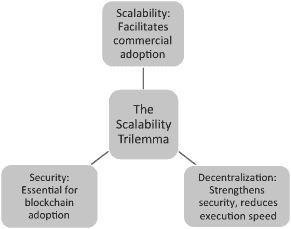
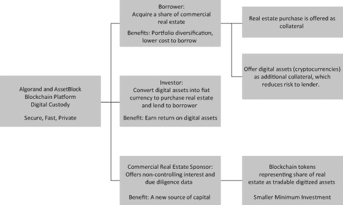
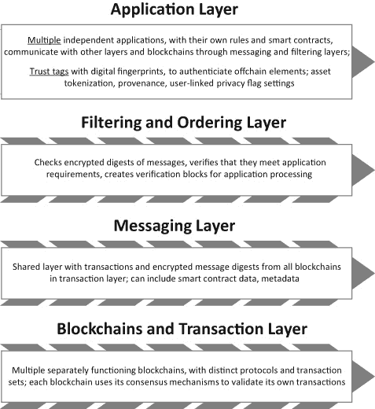
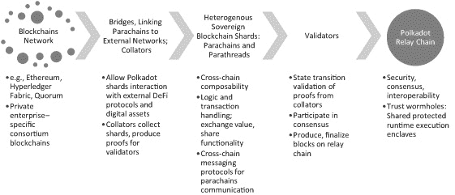
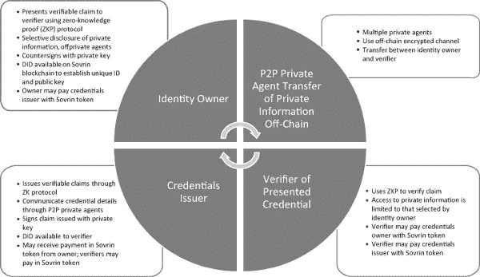
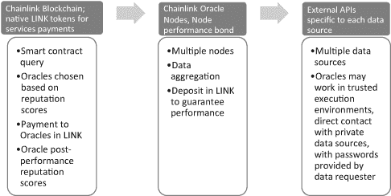
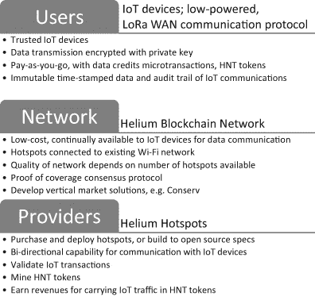
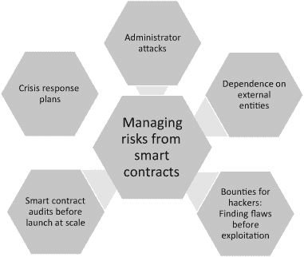

# 2

# 技术障碍阻碍了区块链的采用及其解决方法

与许多年轻的、有潜在颠覆性的技术一样，区块链技术受到性能缺陷的限制，这些缺陷在企业级应用中造成了障碍。因此，即使企业在试点努力中取得了成功的概念验证，它们也不愿意尝试更大规模的部署。成熟的企业在将区块链试点项目推进到商业大规模实施时遇到了困难。2019 年，美国银行时任首席技术官凯西·贝桑特表示，与区块链相关的炒作超过了现实。富国银行前首席执行官蒂姆·斯隆同样持怀疑态度，他指出“区块链被过度推销了”。1 多次冷漠的试点结果削弱了热情，创造了组织犹豫和“幻灭低谷”，导致 Gartner 预测“到 2022 年，只有 10%的企业将通过使用区块链技术实现任何根本性的转型”。然而，持续的发展可能导致到 2030 年，区块链为业务增加的价值超过 3 万亿美元。2 因此，所讨论的缺陷并不否定区块链的最终优势；相反，它们表明作为一种潜在的颠覆性技术，区块链目前还不够成熟——而这种不成熟并非永久性的。

区块链涉及的技术是多层次的。核心层包括采用的具体区块链协议（例如，以太坊、比特币、Ripple 或 Consensys Quorum），必须与第二层额外的区块链功能相结合，这些功能因协议而异。这层可以包括智能合约、SSI 以及使用 ZKP 等功能。这些进而与包括应用程序编程接口（API）和 Dapps 在内的代理层软件应用程序相互作用，使用户能够访问不同的区块链平台。还需要离线元素，如离线存储、与外部网络交换数据的能力以及与信息源（“预言机”）通信以接收信息触发自动智能合约执行的能力，还有互操作性功能。区块链还必须管理外部事件，如来自物联网（IoT）微服务的数据（其来源和准确性可能是不安全的）。这些技术复杂性可能会延迟区块链的采用，因为数字化经验较少的公司在面临财务、知识和人力资本约束时尤其如此。错误的实施可能会损害数据准确性和信任，抵消区块链的实用性。

为了克服区块链技术的不足，新兴的区块链初创公司正在提出众多创新解决方案，以促进持续改进。它们开发了新的区块链协议，以解决安全性、可扩展性、去中心化、交易速度、互操作性以及开发难度等问题。区块链技术开发仍在进行中，持续的实验已经产生了新兴的替代平台和解决方案。这种技术进步的浪潮是颠覆性技术环境的特点，因为先行公司通过关注性能改进来刺激大规模采用。

在本章中，我首先回顾了技术障碍。然后我考虑了区块链初创公司，研究它们如何使区块链更易于使用，并移除阻碍企业级采用的障碍。一些解决现有问题的新或改进解决方案的公司与那些构建行业和垂直市场应用的公司建立了合作伙伴关系。这些初创公司的共同目标是使用案例，突出他们技术升级的前沿努力对企业部署的潜力。

## 区块链可扩展性三角难题

区块链最初设计并整合到比特币中，受到三个看似不可调和的分歧的限制，这些分歧限制了其商业潜力：3 它不能同时最大化安全性、可扩展性和去中心化。以太坊区块链的创始人 Vitalik Buterin 将此描述为*可扩展性三角难题*，指出现有的区块链*只能优化安全、可扩展性和去中心化这三个参数中的两个*。用户希望建立安全的网络，以确保交易有效并保护免受双重支付和欺诈的侵害。如果只有少数实体被授权保证区块链网络的可信度（高度集中），企业将不得不评估使用集中式网络的好处与依赖集中式信任保证者的后果，后者可能成为潜在的失败点。广泛去中心化增强了安全性，共识算法也是如此，它们通过加密验证确保区块链不可变，并允许依赖区块链作为唯一真实来源。

然而，去中心化导致网络中所有节点记录交易，使得交易对整个网络可见，降低了隐私性，使得区块链解决方案对某些企业应用的吸引力降低。4 可以通过采取额外步骤来保护隐私，例如为每笔交易使用新地址；合并多个用户的事务；通过中介进行交易；将敏感的用户信息离链存储，可能在单独的私有区块链中；并将此类信息通过哈希链接到特定交易。这些步骤可能会产生额外成本，降低采用区块链解决方案的激励。

共同作用下，去中心化和经典区块链算法中设计的共识框架可以减慢区块验证和交易最终性，从而阻碍可扩展性。随着交易数量的增加，结算时间变长。尽管可以通过支付更高费用来优先处理交易，但这将提高交易处理成本。如果用于验证交易和确认支付的共识方法较慢，用户将寻求更快的替代方案。在区块链中集中权力以加快交易时间可能会使区块链体验对用户更具吸引力，但这种速度是以安全性为代价的。对于在交易额达数十亿美元的高容量应用中进行交易的企业来说，安全性至关重要。

图 2.1

区块链的可扩展性

在支付处理等领域，区块链必须与像 Visa 网络这样的成熟替代方案竞争，后者平均每天处理 1.5 亿笔交易（平均每秒 1,700 笔交易）。相比之下，比特币和以太坊网络的处理速度最多为每秒 7 到 20 笔交易。5 使用区块链的智能合约功能以及不成熟的技术导致的治理问题，可能会导致区块链发展方向的逆向不兼容。

### 智能合约问题

企业中区块链应用的吸引力之一是能够使用智能合约。一个主要担忧是，合同（合同各方之间具有法律约束力的协议）是否已经正确地在代码中捕捉到，这一过程需要法律人员和区块链程序员之间的紧密合作。在起草法律合同时，语言可能故意含糊，以给予各方在履行合同性能方面更大的灵活性。风险在于程序员在开发智能合约代码时可能会错误地解释法律语言，这需要一个额外的步骤来验证代码正确反映了其源合同。第二个问题出现在当外部来源向智能合约代码提供不正确或故意的虚假信息时，这会在虚假的 pretenses 下触发执行，并造成经济损失。

### 未解决的区块链治理，不成熟的技术

区块链协议的治理也使其不稳定，并引发对其适合大规模实施的关注。Gianluca Miscione 及其合著者 6 提出了一种他们称之为“部落”的新的区块链治理模式。他们指出，区块链治理应基于共识，而不是网络参与者和部落之间的竞争，部落发展自己的治理模式，这不由法治规定。这与传统治理模式形成对比，传统治理模式主要特征是市场和等级制度。

区块链可以改变其协议以加快交易速度，例如，引入如分片和侧链等新的区块链创新。分片将区块链划分为片段，每个节点只需更新其部分的区块链，从而实现更快的处理速度和提高可扩展性。7 侧链是与主区块链分开的独立区块链，它减少了主链的处理负担，从而提高了其速度和可扩展性。8 然而，对这些新技术的引入存在分歧可能会导致性能波动并降低性能。在这种情况下，之前验证的区块可能不再与新的更改协议兼容——即“硬分叉”。9 硬分叉是区块链协议的重大更改，创建了区块链的新分支，使得一旦用户开始使用新版本，旧版本验证的交易将被拒绝。然而，分叉在逐步改进方面可能具有价值，2017 年德勤的一份报告指出，分叉更有可能使区块链项目保持活力。10

这种向后不兼容性对商业企业来说是不可接受的，特别是当多企业区块链的成员无法就条件是否发生了足够的变化以需要改变协议以及协议应该如何改变达成一致时。最终，关于分叉的争议和拒绝支持分叉将导致一个分裂，区块链成员的解体，这将影响其未来的实用性。总之，治理争议可能会使区块链崩溃。

## 解决三元悖论

已经提出了许多技术解决方案,11 各种提出的解决方案在速度、安全性和去中心化程度之间做出了权衡，以最适合他们的需求。12 有几种方法显示出解决这些问题的潜力：

+   • *改变所使用的共识机制*，从 PoW 到 PoS 以及其他方案。这些不同的共识算法都旨在解决同一个问题：如何增加达成共识的速度，以提供交易保证，而不增加中心化或使网络变得不安全。

+   • *转向受许可的网络*，这种网络用可信实体来验证交易，代替基于加密的安全性。这减少了去中心化，并将潜在的失败点集中在几个可信实体上，从而 compromising 安全。尽管如此，许多企业区块链还是选择了受许可的网络，以改进 older 银行等中介控制的网络，而不失去处理速度。一个例子是 Ripple 运用其独特的节点列表（UNL），限制交易验证和账本更新到几个可信节点，其中大多数最初由 Ripple 控制。13 重要的是要注意，如果攻击者控制了这些可信实体，他们可以验证错误的交易， enable double-spend，并授权欺诈性转账，从而破坏网络信心并降低其实用性。来自 EOSIO 的开源区块链平台 EOS 协议有一个有限的区块生产者数量，从而减少了参与验证区块的节点数量并增加了处理速度。

+   • *在主区块链之外创建侧链*，随着交易数量的增加，以减轻区块链处理每笔交易的计算负担。较小的交易可以捆绑在一起，在主区块链之外的侧链中进行验证，然后作为单个聚合交易发送回主链进行处理。这类似于处理信用卡交易，一个月内积累的交易总额会呈现出来，可以作为一笔金额支付。然而，如前所述，侧链与主链之间的转移可能是一个安全弱点，需要额外步骤，例如在侧链和主链之间设置加密锁箱，在释放主链资金之前验证侧链转移（以防止双重支付），并将侧链作为私有授权网络，由可信节点管理跨链转移。

+   • *垂直可扩展性*通过增加每个节点的计算能力来提高处理速度。计算能力增强的节点能更快地验证交易，从而提升可扩展性。然而，由于最弱的节点可能会减慢形成多数共识以验证区块的时间，因此整体区块链网络的性能将受到最弱节点计算能力的限制。

+   • 其他建议的方法包括批量处理交易（这可能会产生隐私问题）以及使用闪电网络 14，该网络提出一个连接的离线网络，由两方支付通道组成（一个双方都可以用自己的私钥访问的多签名钱包），这样网络内的任何支付都可以通过一系列连接的两方交易来完成（网络找到完成交易的最短路线）。每个通道的总资金在开启通道时记录在区块链上，在通道中添加或提取资金还需要另一个区块链条目。

## 从区块链初创公司和先行者那里学习

我现在回顾一些区块链初创公司的重要突破，这些公司旨在在提高速度和可扩展性的同时保持区块链的强大安全保护。本章讨论的区块链公司有两个主要目标。第一个目标是克服技术缺点。几家公司致力于改进区块链的技术基础设施。他们解决区块链在可扩展性、去中心化程度、安全性和交易处理速度等关键领域的性能不足。他们还解决互操作性问题，以便企业内部和生态系统内的多个区块链应用程序即使在使用不同平台时也能相互通信和交易。最后，他们专注于保护交易各方及其交易细节的隐私。

第二个目标涉及产生收入并提高效率的行业特定解决方案。随着技术性能的提高，新的应用如雨后春笋般涌现，准备利用这些改进。有几家公司正在利用这些技术进步，并开发他们认为优于现有方法的行业特定客户解决方案。

### 提升区块链性能：Algorand

Algorand 引入了一种新的区块链协议 15 来以一种安全、去中心化且无需授权的方式解决可扩展性问题。它的方法建立在一个新的协议上，即纯 PoS（适应于已知存在不可信网络参与者的环境），它通过比区块链中使用的传统 PoW 共识机制更少的计算能力来提供共识验证，从而实现更快的处理速度。Algorand 还按照事务发生的顺序验证事务，而不是等待将事务聚集到区块中再验证这些区块，从而确保事务的即时最终性。Algorand 的方法还保证了活性，这一特性有助于在设定的时间限制内验证正确的交易。

对其方法至关重要的是其原生代币 Algo。Algorand 网络成员购买原生代币，并最终因参与网络的区块验证过程而获得奖励代币。利用其代币和纯 PoS 共识方法，Algorand 用两步方法抵御恶意用户。首先，Algorand 从所有代币所有者中随机选择一个网络节点来创建区块。那个代币所有者是唯一知道他们区块创建角色的用户。接下来，Algorand 随机选择了一组代币所有者，并提供他们必要的信息来验证新区块。代币奖励用于参与这种抽签过程。

区块创建成员（网络节点）和验证委员会（其他网络节点）在每一步和每个区块中都是随机且独立地被选中的。由于事先不知道区块创建者或验证区块的委员会的身份，恶意用户无法腐蚀并因此影响区块的创建或验证。这种验证方法是快速的，提高了处理速度。Algorand 不必牺牲去中心化，因为用户也是区块生产者和验证者，他们是通过随机选择产生的，用户/验证者池子是不断更新的。

### 一个 Algorand 应用：资产区块和商业地产

这些进展使得几家公司决定采用 Algorand 协议来为其区块链解决方案服务：例如，泰达币（US dollar stablecoin provider），一个支持以代币化碳信用资产为市场的全球碳持有公司；SIAE，一家已经发行了四百万代表创意权利的 NFT 的权利管理公司；以及 AssetBlock，一家市场推广代币化房地产的公司，接下来将对其进行讨论。

作为一种投资机会，商业地产几乎专门面向大型机构投资者。商业地产交易规模庞大，涉及数百万美元，这意味着最低投资额也很大。这阻止了小投资者参与这些投资。此外，有关潜在交易的信息并不集中，无论是在线还是离线，这使得没有关系的投资者难以找到及时的信息并进行尽职调查。

Algorand 对全球投资者的国际可访问性，其高速交易，以及其安全性和隐私优势都是 AssetBlock 决定在 Algorand 区块链协议上建立商业地产投资平台的原因。16 AssetBlock 寻找那些寻求额外资本的商业地产项目的发起人。其平台将商业地产投资细分为较小的份额，降低了最低投资额。这些非控制性股权投资随后可供全球的认证投资者使用。这些全球投资者可以使用他们所拥有的数字资产，例如转换成美元的加密货币，来投资 AssetBlock 平台上的一系列房地产。AssetBlock 还提供贷款融资来购买正在购买的房地产份额，接受加密货币作为抵押，以及正在收购的商业地产份额。

AssetBlock，由 Algorand 提供动力，为商业地产投资的获取和安全性以及加密货币问题提供了解决方案。持有用于增值的加密货币数字资产不会立即产生回报，AssetBlock 帮助将这些闲置资产转化为商业地产投资的新资本来源。在区块链上对这些所有权权益进行证券化增加了所有权的权利和安全，以及即时的结算和支付确定性。接受数字资产作为额外抵押品降低了贷款人的风险，使得贷款人反过来可以对借出的金额收取更低的利率。较低的按揭利率降低了借款人的加权资本成本，并增加了投资商业地产的可行性，例如，获得更高的净现值。将大型房地产投资细分为较小的级别增加了商业地产投资的流动性，并允许加密货币所有者在保持捕捉其作为抵押品数字资产增值可能性的同时，多元化他们的投资组合。这些创新有助于使商业地产市场更加透明、高效，并吸引来自全球的各种投资者。尽职调查信息——如高级债务、抵押品、关联抵押品和所有权变更——是可以追溯、不可篡改的，并且更好地防止欺诈，这有助于降低贷款处理费用。

将实物资产转换为数字资产确实带来了证券化风险。创建实物资产的数字表示的过程相对于区块链上的原生数字资产（例如，挖掘比特币）来说更为脆弱，后者的安全性通过验证激励（工作量证明和矿工的比特币奖励）得到加强。这些实物资产转换更容易受到安全威胁和欺诈，使得转向区块链变得不那么吸引人。17 Algorand 对验证的方法确实有助于减少这种脆弱性。图 2.2 总结了 AssetBlock 的业务模式。

### 区块链互操作性：Quant Overledger 与 Polkadot

多种区块链协议可用于作为应用的核心层，每种协议都有其特定的优势和不足。协议可以被看作是不同的操作系统，而特定的协议可能更适合于特定的企业用例。常见的协议包括 IBM 的 Hyperledger Fabric、以太坊、R3/Corda、Ripple 和 Consensys 的 Quorum。18 以太坊协议内置了智能合约功能，在业务应用中很有价值，特别是在需要自动执行交易并且依赖于满足智能合约中编码的合同条件的情况下。Hyperledger Fabric 是一个私有的区块链网络，支持权限管理，并用于企业应用，如数字支付和数字身份，支持多种智能合约语言，并在共识机制和隐私等领域提供模块化。Fabric 对 enterprises 很有吸引力，因为它让他们在共享私有数据方面拥有更多的控制权，允许他们指定在更广泛的网络中与之一定水平共享的 peers 。

图 2.2

阿尔戈兰特和资产块：商业地产投资

R3/Corda 是由金融机构组成的联盟开发的私有权限区块链，专注于银行、金融和保险的应用。Consensys Quorum 由开源的以太坊协议层组成，Consensys 提供额外的产品模块以创建定制的区块链应用程序。所选的协议影响应用程序质量及其在特定行业背景下满足用户需求的适宜性。例如，R3/Corda 特别适合于开发银行应用程序。选择协议是一项基础性工作，最好在区块链技术专家的指导下进行。

对现有协议的更新和新兴的竞争协议提供了改进的速度和可扩展性，增强了隐私性，并针对特定行业应用进行了优化。然而，协议的数量和竞争带来的互操作性问题对 enterprises 来说是一个挑战。如果区块链得到广泛采用，那么各种规模的 enterprises 将需要不同的区块链以相互通信，无论是内部互动还是跨越组织边界。这些区块链只能一次连接一对，使用为每对通信开发的专用软件。这种定制方法非常繁琐，尤其是随着不同的区块链协议不断发展，版本更新，市场份额和支持者随时间增加或减少。没有互操作性，跨不同区块链产品或不同版本的区块链协议迁移数据和旧应用程序是存在问题的。

此外，由于任何特定解决方案仅适用于单个账本，并且仅在该账本的区块链协议内执行，因此交易无法跨区块链认可。在任何区块链内验证的交易，无论其特定的共识算法、来源和审计跟踪，都不会自动在另一个账本中得到验证。正如 Quant Network 的一份白皮书中所述，“迁移并不总是可能的，因为交易只在其区块链地址空间内有效……也就是说，不可能使它们在其他账本中也有效。”19 这样的交易数据必须以与智能合约通过预言机接收的数据相同的方式接受，并且供应区块链需要被信任，这抵消了区块链去中介的潜力。没有互操作性，区块链的使用变得碎片化，效用变得有限，应用和数据陷入困境，公司仍孤立在孤岛中。

### Quant Network Overledger

Quant Network 的 Overledger 是实现多个不同区块链之间快速和安全通信的尝试之一。Overledger 的目的是允许多个区块链（无论是公共的还是私有的，有许可的还是无许可的，具有不同的共识机制）进行通信和交易、传输数据以及与非区块链传统系统进行交互。即使区块链被替换或升级，Overledger 也具有实际价值并且有用。它可以与互联网核心的 TCP/IP 协议提供的互操作性能力相比较。TCP/IP 允许计算机像它们是单一通用网络的一部分一样进行交互，无论数据传输方式如何（移动无线电、帧中继、异步传输等）。因此，它们可以传输标准化的数据包，而无需关注内容。20

Overledger 通过在现有区块链之上建立一个覆盖层来放置应用程序，从而实现互操作性。通信、迁移、信息交换和价值交换都是独立于最初部署它们的区块链账本的。互操作性允许公司尝试不同的区块链，并比较相对性能、可扩展性和安全性，然后选择一个特定的平台。由于决策者受到所选区块链协议的限制较少，因此区块链部署可以更快地进行。如果以后出现更好的解决方案，公司总是有一条途径迁移到该解决方案，且不会有风险使之前在区块链应用开发上的投资过时。广泛的互操作性创造了向后兼容性，允许公司依赖一个区块链网络来共同解决一个生态系统中具有共同利益的公司之间的业务问题。Overledger 还允许开发者在不需要为其他不同区块链重写或移植现有应用程序的情况下，构建可在多个区块链上工作的应用程序。类似地，应用程序在区块链之间稳定运行，并容易地在不同的区块链系统之间移动。Overledger 拥有自己的应用商店，可以在那里销售或免费发布新的多链应用程序给潜在客户。21

覆盖层中的消息触发接收方区块链中的操作。因此，通过覆盖层从一条区块链传输信息到另一条区块链的消息的完整性和安全性对于确保 Overledger 是一个可接受的互操作性解决方案至关重要。图 2.3 说明了位于区块链层之上的几个层次。这些层次根据区块链层的事务处理消息，并连接到多个独立应用程序，这些应用程序响应消息，实现多个区块链之间的通信。

图 2.3

量子网络 Overledger 互操作性框架

虽然 Overledger 连接的每个区块链都是安全的，但 Overledger 还采用了额外的安全措施，即 TrustTag，来保护其交易。TrustTag 允许数据在生成源头进行签名，保持数据存储的哈希（加密）版本以保证完整性，并确保数据不可变以及不可抵赖（数据源头无法后来声称它没有生成该数据）。22 TrustTag 使得资产的安全代币化成为可能，并促进私有区块链与公共无需许可的区块链之间的安全互动。应用程序接收到加密数据以及验证块，通过验证后允许使用数据触发智能合约执行。这样的 TrustTag 使得即使在整个生态系统中不同的参与者使用不同的区块链，资产也可以在供应链中进行追踪，例如。它还允许使用隐私标志来保持消息的某些部分对特定用户私密。

### 波卡与“平行链”的跨链互操作性

作为 Overledger 的竞争对手，Polkadot 可以将多个专业区块链连接到网络上。Polkadot 使用户能够利用具有不同最佳特点的专业区块链网络，从而为各个组织的商业需求创建一个有目的联合的区块链网络。与 Overledger 不同，Polkadot 提供了一个中继链，多个独立区块链可以在此链上存在并进行通信，并肩共存。图 2.4 说明了其组件如何围绕中继链汇聚。23

Polkadot 为企业用户提供了几个显著优势：异构分片、可扩展性、可升级性和透明治理。异构分片消除了各种分片（主区块链的分区）具有相同规格的要求；因此，每个分片都可以根据手头的商业目的设计具有不同特点。跨链组合性允许在不同分片之间发送多种数据类型。由于 Polkadot 允许并行处理交易（因此实现并行化链或“平行链”），因此可扩展性增加并得到增强。提供共享安全的嵌套中继链可以增加网络中的分片数量，创建小型 Polkadots 并进一步提高可扩展性。（以太坊计划推出类似以太坊 2.0 版本的升级，采用权益证明，以提高其可扩展性。）Polkadot 架构还确保了安全互操作性，因为“如果一条链上的消息被回滚，所有链都会被回滚，”24 从而保护数据免受任何篡改或盗窃。

图 2.4

波卡区块链网络架构

波卡实施了节点的“渔民”角色，收集者和某些（完整节点）侧链被允许监控网络并报告不诚实行为，为他们的工作赚取 DOT（波卡的原生货币）。25 这些波卡术语描述了特定节点在确保安全和可扩展性方面扮演的角色。渔民寻找欺诈行为，而收集者收集碎片和验证者批准并将新区块密封到波卡网络上。由于每个连接网络中的区块链都可以根据任何用例进行定制，波卡提供了易于升级的特性，允许向区块链网络添加额外功能，而不需要重新设计现有的区块链。它还强调透明的治理，因为拥有 DOT 的人可以提出协议更改的提案并进行投票，从而防止争议性的硬分叉。最后，波卡还允许区块链无需分叉即可进行升级和更新，通过透明的链上治理系统实现无分叉升级。

### 自主主权身份：Sovrin 和 U-Port

证明个人身份对于许多任务来说是必要的，比如获得医疗服务、在就业 Offer 中证明大学学历，以及被认定为有资格获得政府福利。传统上，中心化的、值得信赖的中介机构履行了证明身份和文件真实性的角色，以此换取中介费用。世界银行估计，大约有七分之一的人无法建立自己的身份，因此无法获得银行、教育和医疗服务等基本服务。26 无法证明的身份也使个人面临危险的情况，如人口贩卖和强迫劳动。

基本服务越来越多地以数字化形式提供，在这些交易中，数字身份验证至关重要。与物理识别一样，数字识别只由少数几个集中权威机构提供。集中式的身份验证来源可能被黑客攻击，从而 compromising 安全并提高或产生成本，例如，由于数据泄露而冻结信用报告的成本，以及被盗数据或信用信息的欺诈使用造成的财务破坏性后果。27 约翰·哈格尔三世和杰弗里·F·雷波特对数据“信息中介”28 的权力提出了警告，以及当验证身份的个人无法控制正在披露的信息以及披露给谁时，可能产生的灾难性后果。此外，当集中式中介机构控制个人的信息时，个人的身份在不同身份验证目的的中介机构之间不易移植。例如，银行需要了解自己的客户并防范洗钱，每个银行都必须分别使用适当的文件来验证客户的身份证。

挑战在于能够随时建立和使用数字凭证来证明在线身份，并使用这些数字凭证来验证年龄、地址、学术成就、就业状况以及资产所有权证明。安全的数字身份可以帮助减少身份盗窃，验证对网络的允许访问（从而提高网络安全），并通过授权将个人或实体的数据在不同系统之间转移来创建信任。如果个人能够控制并证明自己的身份，并且他们有权力决定是否提供所需的信任凭证（以及仅提供这些凭证），他们将对自己的身份拥有主权，绕过集中的中介机构以及依赖这些中介机构所固有的风险。

对这个挑战的答案是自主身份识别（SSI），它赋予个人终身控制完全可移植的数字身份。SSI 将始终由该个人控制，无法被剥夺，但控制 SSI 仍需要所有者与验证声明的发行者建立关系，以建立对他们的 SSI 的信任。然而，区块链可以通过提供数字凭证的标准格式和验证公钥的所有权来促进 SSI 的创建。个人可以使用私钥签署他们的数字文件，并同时确定对个性化数据的访问程度。然后，他们的公钥将注册在区块链上，以便被发现并用于验证数字签名。鉴于身份对所有人的目标，SSI 服务需要作为全球公共基础设施运行，可供所有希望建立身份的人、凭证发行者和试图验证身份的人使用。如果 SSI 特定于区块链且互操作性不可用，SSI 的实用性将不可避免地受到限制。

区块链支持的 SSI 的更广泛好处是，客户可以控制自己的数据，并为了适当的补偿控制数据的分享，从而减少像 Google 和 Facebook 这样的中介机构对个人的权力。同时，SSI 也有助于降低由少数实体控制的客户数据集中存储所带来的安全风险。Sovrin 网络试图提供这样的 SSI。29 除了验证数字签名和确立所有权外，Sovrin 还提供了一种标准方法来验证由验证所有者提供的数字凭证。它旨在将凭证所有者、凭证的信任发行者和寻求确立数字声明的真实性和来源的验证者联系起来。虽然广泛用于验证所有权，例如网站，但能够将公钥与作者私钥关联并证明所有权的可信证书机构相对较少。这类服务成本高昂，超出了大多数个人的承受范围。Sovrin 通过创建具有 P2P 私有代理的有效验证节点来解决 PKI 的成本和稀缺问题，代理代表凭证所有者证明提供的凭证的准确性。

Sovrin SSI 模型是使用开源 Hyperledger Indy 协议构建的，包括几个关键要素：

+   **凭证发行者**遵循标准协议，向个人发行声明（与个人相关的凭证），签署声明，并通过公共区块链上的去中心化标识符（DIDs）公开其公钥。因此，大学可以为某些 DIDs 发行声明，证明他们是大学的毕业生，并提供诸如学习领域、获得的学位和毕业年份等详细信息。

+   凭证的*所有者*对发行者提供的索赔进行背书，并将索赔以标准协议的形式提交给验证者，通过公共区块链上的 DIDs 公开公钥。

+   凭证的*验证者*以标准协议的形式从所有者那里收到凭证（索赔），并查找 DID 以获取验证索赔所有者和发行者签名的公钥。验证者依赖于凭证发行者发行准确的凭证。如果资格条件是大学毕业或在某公司工作一段时间，凭证发行者必须满足这些条件。

需要指出的是，这个过程需要凭证发行者建立他们的诚信声誉，以便被信任。如果没有现有的信任关系，一个有趣的问题是，新的凭证发行者如何建立信任？目前，像车辆管理局、大学和雇主这样的实体被默认为凭证的验证者，在 SSI 更广泛使用的初期阶段，它们可以继续充当凭证发行者。新的实体可以使用诸如 PoS 或从满意的用户那里获得声誉代币的数量等算法作为信任的衡量标准。

DIDs 包含了一个所有者的公钥以及所有者愿意公开的任何其他公共凭证，还包括一个联系网络地址。DID 允许发行者和验证者在 Sovrin 网络上查找公钥，而不需要属于同一个组织或身份联邦。每个 DID 都有一对关联的公钥和私钥；它们旨在价格低廉，以便每个用户可以生成所需的多个 DID，以创建不同子集的可验证索赔。索赔可以关于教育成就、当前雇佣信息、收入以及它是否达到一定的水平等等。这赋予了所有者对“谁看到什么”的控制权。

Sovrin 使用轻量级共识协议或状态证明，这是一种可以在智能手机上运行的加密证明，用于验证查询响应的有效性。它从而可以防范中间人攻击——攻击者在两个相信他们直接相互通信的当事人之间秘密干预，修改或替换通信以使攻击者受益。尽管如此，目前还没有广泛接受的标识数据保护标准和法规，尽管零知识证明（ZKP）30 可能成为这样的标准。ZKP 可以为区块链上的用户提供安全和保证，信息没有被更改或篡改——不可变性。ZKP 可以在保持隐私的同时，防止竞争对手获取信息，在双方之间共享信息。交互式 ZKP 需要用户让验证者确信他们拥有某些信息，而非交互式 ZKP 在稍后的阶段提供验证，如上文所述的 DID 和可验证声明。31 ZKP 基于数学公式，可能需要计算密集型操作，从而减慢处理速度。

Sovrin 通过为每个验证者生成唯一的数字身份（DID）来提供隐私保障，实现匿名。不同司法管区的不同政府法规，如欧盟的通用数据保护条例（GDPR），意味着全球身份公用事业需要遵守不同的数据保护和隐私法规。区块链上不存储任何私人数据；相反，数据所有者通过一个私有的点对点代理（一个数字钱包提供商）和一个加密的私有通道（链下）交换实际的凭证（可验证声明）。当使用零知识证明（ZKP）传递凭证时，所有者可以限制披露的信息量至最小。例如，可以披露他们有资格投票的证明，该证明通过 DID 的公钥信息验证，而无需透露其他信息，如居住地和实际出生日期，因为唯一重要的出生细节是他们是否在某个日期之前出生，以及可能的公民身份和居住地。

Sovrin 代币用于验证凭证以创造价值，激励并奖励在授权条件下分享这些数据的身份所有者和凭证发行者。作为副产品，一个去中心化身份识别（SSI）系统可以促进数字凭证保险市场（特别是，对接受可能是虚假的凭证的保险）。图 2.5 总结了 Sovrin 网络确保所有人 SSI 安全的核心特点。

图 2.5

Sovrin SSI 和代币模型：治理、性能、可访问性和隐私

### 智能合约执行的目标预言机：Chainlink

区块链的一个显著（且受欢迎）特性是其能够集成智能合约。许多区块链提供现成的模板和开发工具来构建和实施智能合约。智能合约可以在区块链内通过表明合同要求已得到满足的信息来触发，从而启动后续的交易，如所有权的转让和价值的交换。区块链中数据的安全和不可篡改性，追踪来源的能力，以及使用区块链原生的代币，都有助于自动化智能合约的执行。自动执行的智能合约节省了时间，避免了重复的错误检查，并在解决争议期间释放了被占用的大量资本。32 然而，区块链内智能合约的执行不能自动触发外部事件，例如来自区块链外银行账户的支付。

智能合约的执行通常依赖于外部数据，比如来自物联网传感器的数据（例如，产品是否储存在正确的温度下），市场数据（股票价格是否达到触发期权行权的水平），或者事件（例如，租户在良好的条件下搬出租赁房产并激活了押金的退还）。区块链的共识协议有助于保证数据的安全和不可篡改，但这并不适用于通过预言机从外部获取的数据。

预言机是设计用来安全地将智能合约与外部数据源和事件连接的区块链中间件。更具体地说，它们将区块链（及其智能合约）与不同数据源的不同 API 连接起来，每个 API 都是其数据源与区块链之间的标准通信通道。中心化的预言机可以帮助解决在连接、获取并沟通智能合约所需的外部链下数据时固有的安全弱点。然而，这要求用户或实体信任其交易伙伴提供的信息是准确的，并在指定时间框架内激活具有财务重大性的合同。中心化的预言机可能在关键时刻遭到黑客攻击或下线，成为单点故障，并使得合约本身不安全。

链 link 已经开发了一种替代方案，创建了一个去中心化的预言机网络 33，能够在安全地从外部数据源获取数据的同时满足智能合约数据请求。一个关键特性是在链 link 区块链内使用多个独立的预言机节点。这些节点可以从多个独立的数据源检索相同的数据点。多个数据源减少了依赖于单一数据源的风险，该数据源可能会被黑客攻击或道德沦丧，并防止单一数据源离线。然后，这些数据点可以被汇总为一个可靠的数据点，触发智能合约，使用汇总模型，如计算平均值，丢弃异常值，和使用估算算法。

链 link 建立了外部适配器，称为链 link，以连接区块链和 API；每个 API 都有自己的链 link。它使用一个声誉系统，允许预言机根据成功率、响应时间等因素进行评分并接收声誉分数。这个声誉系统可以将预言机节点匹配提供高质量服务并超越竞争者。链 link 允许智能合约根据声誉分数和最低声誉阈值选择，他们将要获取数据的预言机，根据声誉分数有助于做出选择。它还允许智能合约选择运行 TEE 的预言机，这样预言机节点无法查看查询详情；给定密码，TEE 预言机可以访问专有数据源，检索数据，并执行其他操作，如支付。

链 link 使用本地代币 LINK 促进预言机服务的智能合约支付。预言机节点需要在链 link 中存入协商好的 LINK 金额，以响应智能合约数据查询，存款激励预言机节点提供高质量的服务和高水平的在线时间。然而，如果预言机节点“提供异常数据或离线”，它可能会失去存款。34 链 link 也可以用作其他希望将智能合约连接到外部链外数据和事件的区块链的即插即用预言机解决方案模块。图 2.6 总结了链 link 的体系结构。

预言机也可以作为 AI 应用的数据源，例如，从事件流源达成的共识预测，在将预测发布到区块链之前，用机器学习算法进行分析，然后智能合约进一步行动。35 例如，一个机器学习算法可以分析过去的数据来发展关于害虫预测水平和作物损失的指标。然后，算法可以链接到一个去中心化的作物保险智能合约，如果达到保险条件关于害虫发生水平，合约会自动授权支付。

图 2.6

链链分布式预言机

### 通过区块链链接物联网设备以提供物联网传感器数据的不变审计跟踪：Modum

物联网设备是低功耗仪器（即传感器），具有简单的操作系统、有限的处理和存储能力。它们运行在多样且通常不兼容的协议和标准上，但都旨在从多个远程位置收集数据并将数据反馈到包括区块链在内的不同类型的网络。与运行区块链的节点相比，物联网设备的数量众多，因此可扩展性至关重要，以确保大量设备能够安全且持续地通信。接收如此大量消息的中心化服务器可能会成为瓶颈和故障点，但通过区块链节点去中心化物联网通信可以增加数据的健壮性和持续可用性。

不幸的是，物联网设备及其收集和传输的数据可能成为企业网络的一个薄弱安全点。它们更容易受到恶意攻击，比如耗尽电池的睡眠攻击以及像 Mirai 恶意软件攻击 36 这样的服务拒绝攻击，该攻击感染了物联网设备以便远程控制它们并影响性能。物联网设备可以被仿冒，并可能遭受物理篡改，因此对它们进行身份验证和确保数据完整性至关重要。37 基于区块链的物联网交易验证共识，使用私钥保护内容，进行时间戳标记以及向区块添加序列化条目，可以在维护隐私的同时降低物联网安全风险。然而，需要指出的是，计算能力的差异可能会限制一些物联网设备处理加密算法的 ability，从而减慢网络速度。

Modum 将区块链与物联网设备连接起来，在确保数据和事件的不变审计跟踪的同时捕获并发布数据到区块链。这种集成的物联网区块链解决方案有广泛的应用，例如，在生物制药行业监控供应链流动。药品是体积大、价值高的产品，在运输过程中对损坏非常敏感。物联网传感器可以安全地跟踪和传输数据——监控温度、湿度、位置（通过 GPS 追踪）、包装完整性等——以保持产品质量和安全，以及遵守运输合同条款和规定。其他应用包括监控医疗设备的运输，这些设备在运输过程中可能会因冲击和倾斜而受损。能够检测“冲击、倾斜、自由落体或其他加速度相关事件”的传感器可以在定期的时间点聚合并传输此类数据。

正在开发的药物的临床试验是另一个物联网传感器实时、持续流动数据有益的领域。数据可以传输到远程地点的临床试验经理，使他们能够监控质量问题。这种监控还有助于确保在试验期间患者住所遵循试验协议。重型建筑设备的资产生命周期管理也可以得到传感器的帮助。它们可以追踪资产的来源和历史，并提供预防性和有用寿命评估。38 Modum 解决方案已经部署在上述提到的几个场景中，包括四个主要相互链接的模块：数据收集、聚合和通信，数据分析与预测，以及在保护机密数据的同时，在生态系统范围内共享供应链数据和预测。

## 利用区块链开发新商业模式

接下来，我将转向那些开发了利用区块链独特特性的原创商业模式的区块链原生初创公司。接下来的几个例子可以让我们了解到企业如何利用区块链开发新的收入来源并创造新的业务。

### 基于 P2P 的物联网低功耗广域无线网络：Helium

正如在讨论 Modum 的解决方案时提到的，物联网设备普遍存在，预计到 2020 年将有大约二十亿个物联网设备在使用。39 所有这些设备都必须定期进行通信，在指定的时间间隔内提供更新的传感器信息，如果是物联网部署中的双向链接，则接收行动指导。然而，物联网设备传输的数据量较小，并不需要 WiFi 蜂窝网络的宽带能力和更高的成本。Helium 是一个创新者，试图开发一个基于 P2P 网络的物联网通信的双边市场，它将这个市场称为“人民网络”。40

在供应链方面（即创建物联网通信网络），Helium 开发了热点，可以将它们连接在一起以创建去中心化的广域网。不是 Helium 系统建立一个 Helium 热点网络，而是企业家会从 Helium 购买多个热点并在一个城市部署它们，共同建立一个 Helium 网络。WHIP，Helium 的安全、长距离、低功耗、双向无线网络协议，允许 Helium 网络以显著低于蜂窝网络的成本无线连接到互联网。一个关键要求是热点所有者必须有 WiFi 连接，这样他们就可以将他们的热点链接到他们现有的 WiFi 路由器，并可供物联网设备进行数据传输。

热点是 Helium 区块链的一部分，新的共识协议——覆盖证明，确保热点实际上存在，并为物联网设备提供传输覆盖。覆盖证明可以防止 Sybil 攻击和替代现实攻击——恶意热点模拟 WiFi 覆盖并窃取或转移物联网数据，利用双向能力向物联网设备发送恶意命令。热点所有者会因为传输物联网数据、交易验证和区块 inclusion，以及参与覆盖证明共识验证而收到支付（以 Helium HNT 代币支付）。热点验证物联网地理定位，并存储物联网交易数据以及交易的指纹和时间戳，提供防篡改的数据和审计跟踪。所有交易数据都可以存储在区块链上。

在需求方面，低功耗的物联网设备会使用 LoRaWAN41 协议，将信息远距离（大约十英里）传送到网络中的任何热点。物联网设备被映射到区块链上的公司 ID，成为可信设备，并使用私钥/公钥来加密数据传输，在接收端进行验证。物联网设备所有者无需支付加入 Helium 网络的费用；他们只需为实际传输的数据付费，这是一个基于微交易的小数据包传输的即用即付系统。物联网用户使用数据积分支付，这些积分可以通过兑换 HNT 代币获得。物联网设备的低功耗延长了电池寿命，从而提高了它们的可靠性。其他用户优势包括易于连接到 Helium 热点、从多个物联网设备汇集数据的能力，以及安全的、时间戳标记的物联网位置验证交易的不可篡改记录。Helium 估计，对于 2500 个物联网设备来说，每三十分钟传输一个数据包的费用大约为每月 35 美元。一个示例应用可能是某公司销售存放在配备物联网的冰箱中的新鲜易腐宠物食品，利用 Helium 网络获取温度更新、库存状态和新鲜度水平。

追踪几乎任何类型的资产都将与 Helium 物联网通信解决方案相得益彰。以下是一些有趣的行业特定应用：

+   • 保守，它使用物联网和 Helium 网络来监控相对湿度、温度、振动和光照水平，以确保珍贵艺术品和档案材料的展示和储存环境达到最佳。

+   • Clean Water AI，它通过 Helium 网络从边缘到云传输物联网数据，并与人工智能模式识别和机器学习相结合，检测饮用水中的细菌存在和污染。

+   • Agulus，它使用物联网和 Helium 来自动化农场上的灌溉基础设施。物联网传感器收集字段数据（土壤湿度含量、深度、营养物）并将数据传送到云控制中心。分析后，Agulus 可以激活灌溉系统、泵和喷雾器。

一个主要问题是 Helium 依赖于现有的 WiFi 信号。WiFi 提供商可能会将使用他们提供的 WiFi 连接视为免费搭乘。他们可能会要求支付费用，为 Helium 网络访问设定条件，并提高 Helium 服务对物联网社区的成本。第二个问题是地理覆盖范围，因为热点网络必须与物联网设备的地理分布相匹配。通过基本上将热点在美国的构建外包给市场力量，Helium 系统公司期待市场力量平衡物联网数据传输的需求和热点供应以进行此类数据传输，而不必一定播种市场。如果这一匹配过程发生得较慢，对于依赖传感器数据传输进行业务目的的物联网用户来说，可能会转向 alternative communication channels，并且 Helium 的创新优势可能会消失。Helium 网络架构在图 2.7 中展示。

### 为区块链项目和数字资产投保：ConsenSys 尽职调查

随着用户对使用区块链更加熟悉和自信，区块链应用将会变得更多。这将提高对区块链 growing use 所带来的风险的认识，并产生对黑客盗窃、智能合约执行错误或区块链前沿运行的保险需求。42 （前沿运行发生在市场制造商和交易员利用他们对即将到来的大订单的知识，这些大订单可能会影响价格，在大订单执行之前采取立场，从而从预期的价格变动中受益。）专业的区块链软件开发公司和个人可能需要职业责任保险；大型客户可能希望从他们的区块链提供商那里获得保证债券，特别是当使用持续进行时，如 TradeLens 或去中心化金融应用。

Figure 2.7

Helium 物联网通信网络

为了降低区块链应用的总风险，必须逐一解决每种风险源。Consensys Diligence43 是一款用于审计智能合约的应用程序。它在智能合约开发过程中检测区块链项目代码中的错误和安全隐患（即权限结构中的编码缺陷）以及与预期权限的偏差。在商业运营启动后修复代码是更佳的选择，因为如果在那时代码错误仍然存在，可能会导致更严重的后果。安永（EY，前身为 Ernst & Young）提供了一套类似的区块链分析工具，其中包括一个测试工作室，作为其智能合约与代币审查软件套件的一部分。例如，资产代币化公司 SolidBlock 使用了这些工具来定制针对常见攻击的智能合约测试，并在公开发布前在公共以太坊区块链上模拟交易和去中心化金融合约。44 2021 年，EY 宣布将投资额外的 1 亿美元用于此类工具以及资助广泛的区块链和加密资产研究。45

图 2.8

降低智能合约风险。来源：基于 Mardlin 的研究，关于去中心化金融（DeFi）用户应向去中心化金融开发者提出的问题。

图 2.8 总结了区块链及其智能合约背后的各种风险。企业区块链很可能是授权的，治理可能包括一个管理员或管理团队，具有一定程度的集中控制。这个人或团队可能拥有包括中断系统运行、升级系统的一部分或整个系统以及延迟行动的权力。在这种情况下，管理员可能成为脆弱点——黑客可能获取管理员的密码和私钥，从而 compromising 系统。46 实施如在执行管理更改前设置时间延迟等措施，或者让管理员行动受到去中心化团队的批准，可以减轻风险。

区块链和智能合约还依赖于外部各方，如预言机来激活智能合约、外部代币、第三方模块（如特殊目的智能合约）以及外部交易所。所有此类互动都需要防范隐藏的错误。解决这个挑战的一个有趣方法是向有能力的安全研究员提供赏金，他们在管理员发现并披露安全漏洞和缺陷之前，这些缺陷被攻击者利用。此类赏金计划可以与各种其他措施相结合以提供额外的保护，例如，智能合约审计、在部署大规模之前检测缺陷的结构化方法、专门的安全分析以及根据智能合约弱点分类数据库注册的智能合约漏洞检查。47 情景规划和事件响应策略应该伴随任何其他缓解措施，以控制缺陷和攻击造成的损害。

### 基于区块链的组织：Aragon

去中心化是区块链的内在方面，代币通常用于为去中心化区块链节点创造市场激励。如果可以将代币设想为投票，各个节点使用代币来表达他们的选择或观点，那么具有原生代币的区块链可以用来创建新的去中心化组织形式——去中心化自治组织或 DAO。添加智能合约允许由区块链驱动的平台创建新的、无边界的组织，这些组织是自主的、抗审查的，具有基于智能合约的参与式决策和争端解决机制。然而，组织必须应对诸如选民冷漠、贿赂攻击和寡头统治等问题。在这种情况下，DAO 项目试图改善成员代表方面的这些缺陷，寻求“使组织与利益相关者的利益保持一致，并通过博弈论货币激励改善合作和参与”48 ，以及创建“网络空间中的合作社”。

Aragon 是使用区块链创建去中心化民主组织的例子之一。49 每个基于 Aragon 的组织都有一套智能合约，这些合约描述了组织的利益相关者及其权利和特权。如果要保护少数派的利益，也就是说，如果他们可以否决可能成为多数派投票的结果，那么智能合约规则必须包含规定何时多数票是不充分的。这些步骤可以结构化为 Aragon 网络中的一系列智能合约，为 Aragon 平台成员提供基础设施和服务，以分配角色、筹集资金、采用会计实务以及使用代币作为投票来投票不同的拟议行动。

安然组织结构可以帮助避免纠纷。以一个组织内的财务职能为例，该职能独自拥有组织的资源访问权限，并且只有当组织内的成员提出时，才能向组织外的实体付款。这些付款必须在制定的预算内，并且只有在得到大多数成员—投票者的授权时才能进行支付。一个投票请求将被发送到组织的代币管理器，后者将征求所有代币持有者，即投票者的意见，并转发代币持有者的行动结果。大多数代币持有者批准的行动计划将占主导地位。

这种 DAO 模型为财务流动创造了一定的透明度，允许 DAO 成员中有更大数量的人影响这些流动。然而，如果一些投票者持有的代币更多，他们在投票结果上就会有更大的影响力—这和美国的情况很相似，在那里，共同基金、交易所交易基金（ETFs）和指数基金共同控制着美国公司大多数的投票股份—并且有效地控制了这些公司提出的重大提案的投票结果。因此，如果组织希望转向 DAO 模型，他们必须决定如何解决拥有主导地位的成员在投票权上具有更大权重所带来的后果。与整个区块链一样，基于代币的投票权的 DAO 还处于初级阶段，并且将在尝试不同的代币授予激励方案之前逐渐发展，以获得更广泛的接受。

### IP/内容管理：开放音乐倡议

音乐行业长期以来一直受到批评，认为对音乐家不公平，关于在创作和销售音乐的几方之间公平分享收入存在分歧，包括来自发行、出版、流媒体、销售和许可的多个收入来源。50 它还受到这些副本的不授权复制和分发的困扰。为了尝试解决这一问题，伯克利音乐学院与 MIT 连接科学合作，发起了开放音乐倡议。51 他们共同开发了一个多层次的开放区块链协议，用于识别音乐创作者—音乐元数据层—然后将此数据连接到许可和版税管理层—将音乐权利与许可和应付款项连接起来—以及音乐虚拟资产层。

区块链还可以将音乐资产与代币相链接，促进资产交换，去中心化的音乐版权交易和使用跟踪。52 部署这些层来覆盖音乐生态系统可以为跟踪使用和状态变化，转让，以及最终对各种权利持有者的音乐资产访问的微支付铺平道路。来自 Open Music Initiative 的此类应用之一是在区块链上的 RAIDAR 许可平台，它允许权利持有者，例如 Berklee 的音乐学生，将他们的音乐许可给其他人，例如电影制作人，虚拟现实应用程序和视频游戏。53

音乐元数据层的目标是将音乐作品，歌曲或曲目链接到一个包含该音乐作品创作数据的权威元文件。此元数据包括音乐数字文件的加密散列，并且每个元数据文件都将有一个类似于用于文本文档的 DOI（数字对象标识符）的唯一文件标识符。一个音乐作品的多个版本将具有多个不同的 DOI 号码。创建元数据注册表的副本将存储在多个未修改的开放访问可搜索存储库中，并通过 API 向公众提供。

创作元数据将被链接到一个独立的区块链注册表，并由音乐创作者或授权实体通过公私钥对进行数字签名，从而验证元数据以纳入区块链。元数据的一个简短版本将存储在区块链上；带有时间戳，包括完整元数据文件的加密散列；并且具有相同的 DOI。基于区块链的元数据可以启用音乐创作者的识别，支持他们的版权主张，并提供“相对不可变且不可否认的时间戳公共证据，证明音乐作品的 existence."54

此类元数据将不包括实际的 musical content (声音文件) ，该内容将存储在受保护的访问位置或法律和版权权利所有权数据以及其他机密信息。音乐内容文件及其相应的所有权信息将位于其他层，但与创作元数据相链接。智能合约可以明确链接到歌曲或曲目的元数据，在存在多个版本的情况下促进确切版本的许可。传统系统还可以依赖区块链注册表数据来引用音乐内容和所有权。

## 结论

本章讨论的各种例子揭示了区块链技术正处于动荡之中，众多区块链计划正在解决当前的劣势，这些劣势阻碍了企业在该领域的工作。许多这些努力强调开源架构，这指向了公共区块链开发背后的精神。其他人则专注于垂直市场，行业特定的解决方案，这些公司寻求突破时合作 partnership 很常见。这些努力处于起步阶段，信仰者和支持者启动试点并提供反馈，以继续改进所提出的创新解决方案。

企业可能会在未来一段时间内选择有权限的联盟区块链，拥有几个可信节点，从而无需采用缓慢和计算密集型的共识机制。然而，这种有限的去中心化创造了失败的集中点；尽管只有少数成员被授权访问区块链网络，但减少了恶意行为者的恐惧。企业必须在借鉴初创企业的学习和建设成果与在拥有遗留系统和传统最佳实践的生态系统中运营的压力之间保持平衡。这种平衡影响了商业规模区块链实施的道路，这在结论章节中讨论。

我现在转向区块链在特定行业的应用。在第三章，我考虑加密货币的应用及其演变成新型数字货币的形式，如稳定币和国家政府支持的 CBDC。支付世界正迅速接纳数字货币支付，这对全球金融体系、国家货币政策以及企业和个人都产生了重大影响。
