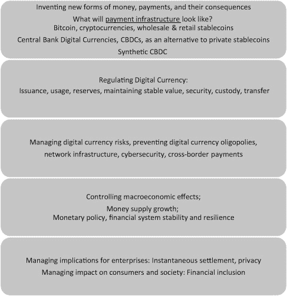
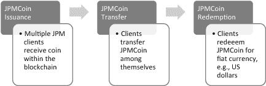
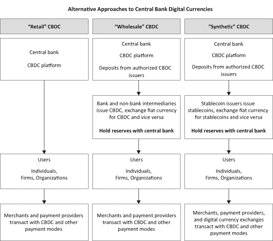
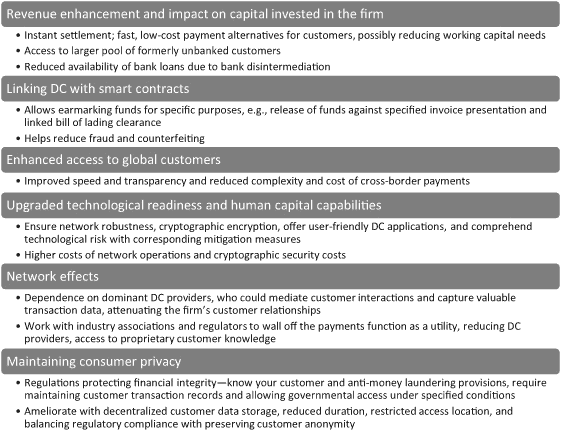

# 3

# 数字货币、支付系统及其对企业的影响

在本章中，我研究了数字货币和私人稳定币的演变及其对支付系统的影响。我考察了政府对数字货币的回应，包括 CBDCs，及其与私人稳定币和加密货币的竞争。我还研究了数字货币的政策含义和监管问题，然后转向数字货币对全球金融体系、货币政策、企业和消费者在 B2B 和 B2C 环境中的影响。由于它们依赖于区块链，我们可以将数字货币的普遍性、重要性和不断增长的用例数量解释为区块链在金融领域越来越重要的角色。随着数字货币继续受到欢迎和使用，区块链将进入主流。

## 加密货币、稳定币和 CBDCs

Bitcoin，作为区块链的第一个主要应用，诞生于 2008 年金融危机所带来的世界经济体系边缘崩溃的背景下。大衰退”的后果之一是对金融机构和政府强烈的信任缺失。特别是自由主义者，他们寻求一个不受政府当局控制的金融体系。这个想法是创造一种不依赖于任何国家政府的货币，这种货币可以不通过银行作为中介而持有和转让，从而使个人和企业能直接相互交易。结果就是比特币。

金钱是一种社会构建，是一群人——通常是一个国家——同意接受某个物品作为交换有价值的商品或服务的支付手段。无论是贝壳、盐块、金条还是银行券，支付都是完成经济交易的必要手段。金钱有几种功能：作为会计单位、价值储存手段和交换手段。但是，它需要稳定才能用来衡量商品或服务的价值。人们愿意接受金钱是因为其稳定性意味着它保留其价值，进而使其成为交换手段。金钱和支付随着时间的推移已经发生了显著变化。以政府为背书的硬币和纸币形式的货币，在支付手段上是一种重要的创新（中国第十一世纪，英格兰在 1600 年代末为了资助威廉国王与法国的战争）并彻底改变了商业。1

在过去的一个千年里，诸如银行货币（银行通过贷款和分位数银行创造的钱）、信用卡、移动钱包和加密货币（如比特币）等新的支付形式已经改变了经济景观。在相对较短的时间内，顾客已经习惯了各种各样的数字支付方式，比如用智能手机支付、使用无接触卡以及在现场注册“先买后付”计划。中国在使用支付宝（蚂蚁金服/阿里巴巴）和微信支付（腾讯）方面的经验表明，消费者和商家都渴望在他们在线交易中使用数字支付形式。在中国，2019 年近 80%的智能手机用户使用了近场（NFC）移动支付，支付宝和微信支付共同占据了 95%的份额。2 所有这些应用程序，然而，仍然连接到法定货币来源，如银行存款和验证的信用额度。鼓励使用基于区块链的数字货币作为支付手段具有广泛的影响，这一点在本章中进一步探讨。

### 比特币：起点

比特币是一种早期的加密货币，之后又有其他加密货币出现，尤其是以太坊区块链网络中使用的以太币（用于智能合约，“可编程货币”）和 Ripple 网络中的 XRP。然而，由于其波动性大和交易成本高，它作为支付系统难以获得广泛应用。这使得它作为计价单位和交换手段变得困难且昂贵。大部分比特币被作为投资工具持有，而不是在日常交易中使用。2021 年 10 月 24 日，比特币总市值约为 1.15 万亿美元，流通中的比特币有 1885 万枚（比特币最大发行量的 90%），每枚比特币价格为 61000 美元，然后 2022 年 1 月急剧下降至约 35000 美元，市值降至约 7500 亿美元。相比之下，2019 年 4 月，外汇交易中的美元日交易量约为 6.6 万亿美元。3

话说回来，加密货币在高价值、高调的交易中被用作支付手段。例如，特斯拉在 2020 年底宣布将接受比特币支付 4（但在 2021 年 5 月，这一决定被撤销，原因是比特币的高波动性和挖矿过程中的能源浪费），另一起案例是，一幅以约 6900 万美元售出的数字艺术品是用以太坊支付的。5 然而，这些只是特例，比特币在日常商业购买中的使用相对较少。尽管如此，无论比特币是否符合传统货币的特征，它都持续增长——作为一种价值储存手段，以及投机和投资工具。像 Square 这样的主要支付系统已经开始接受比特币，作为一种除了信用卡和借记卡等更传统支付方式之外的选项。需要的是将处理比特币的数字便捷性与美元等主要法定货币的稳定性结合起来。

### 稳定币的兴起

加密货币的波动性，在 2019 年至 2021 年间，比特币价格从不到 4000 美元涨至 60000 美元，催生了稳定币的兴起。稳定币与美元等稳定资产挂钩，并拥有大量抵押品支持，如 DAI，其与美元的比率为 1:1（DAI 由 MakerDAO 发行，其中包含 DAO 一词，以表明其采用去中心化治理）。其他稳定币则由等值的法定货币储备支持，例如 USDT（泰达币）和 USDC（美元币），它们持有的美元储备量与发行的 USDT 和 USDC 数量相匹配。对稳定币的需求足够大，以至于摩根大通等主要银行推出了自己的数字货币 JPM Coin，6 其价值等于一美元。JPM Coin 可在摩根大通 Quorum 区块链内部机构间用于转账和支付，实现即时结算和价值转移。

作为支付手段的数字货币重要性日益增长。稳定币消除了加密货币固有的波动性，满足了消费者对于方便、易用、快速、低成本的支付机制的需求，这些支付机制在国内和国际都能使用。与此同时，数字货币提出了私人货币与公共货币之间，以及基于国家和无国家状态的去中心化加密货币之间的竞争问题，这些加密货币未受监管（可能无法监管），如比特币。

观察数字货币（稳定和不稳定）的兴起，全球中央银行对私人公司发行的数字货币可能对基于国家的货币系统产生的潜在负面影响表示关切。为此，许多中央银行启动了试点项目来测试 CBDCs。在 2020 年 2 月的国会证词中，美国联邦储备银行主席鲍威尔对 Facebook 关于 Libra（现名为 Diem）的宣布作出回应，称这是“一个警钟，表明这一切来得很快，并且可能会以相当广泛和系统重要性迅速出现的方式到来。”7 CBDCs 可能会成为另一种基于区块链的货币形式，加入了现金、银行货币（支票、由中央银行储备支持的贷款）、私人加密货币和稳定币的连续体。

所有运行在区块链上的数字货币影响企业、整体经济和消费者。即使消费者意识到数字货币的波动性、有限的流动性和赎回风险，他们也可能享受使用数字货币支付的便利。在宏观经济层面，政府担心对私人数字货币的信任丧失，导致恐慌性提现，可能构成系统风险，影响金融稳定，并影响货币政策的传导。美国的关切是，像中国这样的国家的主权 CBDC 可能会如何影响作为全球储备货币的美元。

## 数字货币的后果

数字货币的兴起为企业带来了几个后果，这些后果在图 3.1 中总结并在接下来的章节中讨论。

图 3.1

数字货币：关键后果

## 创新货币新形式：数字货币、私人稳定币和支付系统

正如早前所讨论的，加密货币具有波动性。稳定币旨在提供使用数字货币的好处，同时减少其波动性，通过持有货币储备（即美元）来实现。稳定币的价值也可以通过算法过程来调整供需关系以保持稳定。通过消除波动性的担忧，稳定币作为一种支付手段变得更加可行，特别是当其设计旨在提升消费者使用的便捷性时。稳定币可以提供低成本、便捷且即时的结算服务。随着稳定币提供商与其他稳定币运营商争夺客户，他们试图通过提供令人愉悦的用户界面、卓越的应用设计、更好地与电子商务交易集成以及成本优势（即无处理费）来获得竞争优势。

当全球稳定币在多个国家被接受并作为支付手段时，对于跨国公司和个人来说，它们变得更加有吸引力。它们提供了速度和低成本，这对于向新兴市场家庭成员发送海外汇款的人来说尤其重要。与基于银行的当前转账方式或使用像西联这样的专业汇款机构相比，它们可以更加高效、成本更低、接近即时。这些优势有助于实现高消费者采用量，并可能使它们具有更大的系统性金融重要性。

### 稳定币与风险

与其它类型的加密货币相比，尽管稳定币很稳定，但它们确实存在风险。稳定币的价值可能由于不确定稳定币发行人是否持有足够的储备支持稳定币发行以及储备是否保持其价值而变得波动。像泰达币这样的稳定币价值有所波动，尽管它们预计会持有与创建的泰达币相等的美元储备。泰达币意外创建了超过流通中泰达币两倍的泰达币硬币，价格下跌了约 12%，尽管错误很快得到了纠正。8

其中一组风险主要源于私人金融机构可能对支付系统产生更大的影响。此外，还有流动性风险，即由于资金不足，赎回请求可能无法立即结算；稳定币发行人无法满足赎回请求的违约或信用风险；由于支持稳定币价值的底层资产损失而产生的市场风险；以及当部分资产以外币持有时可能产生的外汇风险。9 总的来说，稳定币的脆弱性 10 源于

+   特定稳定币安排的规则和治理；

+   创建和从流通中移除稳定币的过程；

+   支持稳定价值和支持这些资产的储备管理；

+   支持稳定币使用的基础设施的运作和健壮性；

+   稳定币的交易验证、交换、交易和定价；以及

+   私钥存储以及访问包含稳定币的数字钱包。

私有稳定币可以通过集中管理来管理，比如 Circle 的 USDC 就是如此，或者通过去中心化治理来管理，比如 MakerDAO，在那里 MKR 代币被发行出来，使得 MKR 代币的所有者能够参与到治理中，也就是说，设定准备金要求并修改 Maker DAI 协议（及其底层算法）。随着某种稳定币的运用越来越广泛，它可以在商业和货币供应上产生更大的影响，而治理上的缺陷会增加这种影响带来的风险。由于稳定币旨在与选定的法定货币保持一对一的稳定性，因此储备的变化必须伴随着稳定币流通数量的相应增加或减少。独立保管支撑稳定币的储备是保证储备被隔离和充足，不被用于资金运作的必要条件。

稳定币管理者还必须能够保持流动性，以便在市场上稳定币的需求和供应持续匹配；否则，稳定币的波动性就会产生。这可能涉及到稳定币运营商获得稳定币在多个数字货币交易所的上市，并维持内部稳定币库存，以在购买或销售操作中部署以维持稳定币价格稳定。此外，稳定币持有者（客户）需要使用他们的私钥来访问他们的稳定币持有量，而稳定币运营商可以提供保管他们的客户稳定币持有量，或与私有数字钱包互动，在那里每个所有者持有并控制他们的私钥。虽然前者集中保管客户的持仓类似于银行账户操作，但它增加了遭受黑客攻击的风险。然而，使个别客户控制他们的私钥并将持仓存储在私有钱包中需要客户接受教育，以保护他们的私钥和对钱包的访问控制，因为丢失私钥将阻止他们访问他们的持仓。

不同的稳定币在运营弹性上可能也会有所不同，也就是说，它们恢复遭受网络攻击和安全性漏洞的能力，以及在面对如 COVID-19 大流行这样的“黑天鹅”事件时保持稳健的能力。例如，在 2020 年，面对 COVID-19 大流行引发的意外全球衰退，市场突然需要增加流动性和提升信心，这促使美联储、欧洲中央银行和其他中央银行进行了重大干预。尽管恐慌得到了控制，但一个问题确实出现了：在这样的大灾难面前，稳定币可能会如何运作？根据稳定币的采用规模和速度，它们确实有可能影响金融系统的稳定性。因此，稳定币运营商必须解决消费者的信任问题，可能需要考虑这样一个问题：如果稳定币受到监管，并且其资产稳定性有稳定币运营商访问中央银行储备作为担保，那么信任度是否会更高。

一种方法是设定监管要求，确保有足够的股本可用，并且基础储备要投资于安全的流动资产，比如中央银行储备。这些资产需要得到保护且无任何抵押。规定稳定币运营商发行的稳定币总额不得超过存款客户的资金余额加上发行实体的股本，这将有助于巩固信任。有趣的是，如果资金从银行转移到稳定币提供商，从而减少了银行存款，这可能会影响银行可用于放贷的总资金，因为 fractional banking 模型依赖于杠杆客户在银行的存款。稳定币的兴起因此可能会减少货币供应量。

主权国家可能希望防止在其国内市场上使用在外国司法管辖区发行的稳定币，即使这样的规定难以执行。一个全球可访问的稳定币可以在任何国家在线获得，当地当局可能会发现定位稳定币提供商并执行海外实体遵守当地规定具有挑战性。因此，就全球稳定币而言，如果它是去中心化和全球的，那么跨越国界的稳定币监管将需要一个相互同意的跨境合作监管制度。国家必须就具体规定达成一致，然后合作进行监控、分享信息、执行合规，否则金融实体将会寻求跨境监管套利的机会。11

作为未来趋势的一个迹象，G20 金融稳定委员会报告提出了十项“高级”监管建议，主要目的是明确监管范围，与现有监管保持一致，开发新的方法以促进跨境监管，并将监管范围与新兴全球稳定币的具体监管需求相匹配。12 将来，监管标准可能包括维护稳定、确保流动性、防止挤兑、减少跨境交易的成本和摩擦、保护消费者资产及其隐私、防范非法活动和欺诈、提升网络安全以防止黑客攻击、鼓励用户友好的界面，以及允许试点测试。批发和零售稳定币需要有不同的监管规定，政府需要在不妨碍创新的同时平衡国内和多边监管。一份美国关于稳定币的报告指出，市场完整性风险、投资者保护的需求、控制非法金融的使用、系统风险以及市场集中是监管稳定币的理由，呼吁国会立法，要求为稳定币发行者提供存款保险，并建立在诸如金融稳定监督委员会等国际论坛的工作基础上。13

### 金融机构发行的私人稳定币：JPM Coin

鉴于稳定币对银行、银行存款水平以及整体客户关系的影响日益增长，银行通过创建自己的稳定币做出了回应。JPM Coin，成立于 2019 年，就是这样一个试点项目。它保持与 1 美元相等的价格，旨在方便 JPM 机构客户之间的转账。指定账户中的客户资金被转换成 JPM Coins，然后转账给指定的收款人，并立即转换成美元。JPM Coin 可以帮助结算债券和商品交易，因为即时结算可以实现即时交货。JPM 指出，该技术是“货币无关的”，可以用来转移其他货币。它也被设计成符合现有监管，同时“减少客户的对手方和结算风险，降低资本要求，并实现即时价值转移”。14 JPM Coin 的抵押品是美元，由 JPMorgan 以 1:1 的比例持有。基本假设是 JPMorgan 可以充分持有美元储备，无阻碍地支持其 JPM Coin。由于 JPMorgan 被监管为系统性重要的金融机构，JPM Coin 可以获得高度信任。

支撑 JPM Coin 的区块链是摩根大通专有的以太坊区块链变体 Quorum。这是一个受许可的系统，仅对摩根大通的全球机构客户开放。客户身份通过 KYC 协议验证，并且区块链可以隐藏发送者的身份以及转账的金额。摩根大通在区块链方面的技术专长确保了高级别的网络安全和反洗钱合规。允许价值转移的 Quorum 得到了摩根大通的 Interbank 信息网络的补充，这是一个旨在在 correspondent 银行之间传输信息的另一区块链。JPM Coin 是私人稳定币和加密货币世界中的有力竞争者。15 图 3.2 展示了 JPM Coin 的发行、转让和使用流程。

Figure 3.2

JPM Coin 的发行、转让和使用流程

其他主要系统性重要银行已经针对不断扩张的数字货币领域制定了自身的战略应对措施。其中有一组银行与 Fnality 合作组成财团。16 他们旨在创建并共享一个基于区块链的金融市场基础设施——Fnality 全球支付，该基础设施能为包括美元、加拿大元、英镑、日元和欧元在内的多种货币提供支付和即时结算服务。即使银行处于不同的货币区，使银行之间更容易结算金融交易可以允许它们的商业客户选择不在多个国家开设银行账户。

JPMorgan 和 Fnality 财团是众多从银行到私人加密货币初创公司的竞争对手之一，它们都在竞相创建嵌入可行区块链支付系统的数字货币。竞争的广度和强度表明，数字货币在未来金融系统中将变得越来越重要。

### 脸书的 Diem 项目（前称 Libra）

当脸书推出 Libra 时，加密货币和稳定币的世界再次扩大，Libra 是一种与包括美元在内的多种稳定货币挂钩的稳定币。在其 2019 年首次提出的原始形式中，Libra 的价值也将与多种货币的价值挂钩。17 Libra 区块链将确保交易和数据存储的安全，使用共识算法验证交易，并寻求最终成为一个无需许可的网络。Libra 的显著性将取决于几个因素，包括客户是否可以在其 Libra 存款上获得利息以及拥有未保险持仓的风险水平。

Libra 还计划促进每个用户的去中心化 SSI，减少他们验证信用证明时对第三方的依赖。其目标是向全球新兴市场中的无银行用户提供此类身份，从而推进金融包容性——并不是只有 Facebook 和 Libra 在寻求创建这样的 SSI 机制。如果数字身份的覆盖范围仅限于 Libra 网络内部，它可能会进一步将个人绑定到该网络，促进网络效应并增加用户的转换成本。

美国众议院金融服务委员会致 Facebook 创始人兼 CEO 马克·扎克伯格的信中提到，Libra 可能变得系统性地重要，但将以未受监管的“影子银行”和并行金融系统的形式运营。18 从其最初宣布开始，Libra 就引发了政府和竞争性加密货币的警觉。它受到了包括美国政府、欧盟、英格兰银行和国际清算银行在内的政府和货币机构的大量反对。（由于许多批评性的研究和报告都提到 Libra，为了连贯性，我在新版本中保留了 Libra 名称及其随后的名称变更至 Diem。）

考虑到 Facebook 庞大的会员基础——超过 20 亿用户——人们立即关注到该公司在支付领域的统治地位，这使得作为一家营利性股东所有公司的 Facebook 能够在货币政策上，特别是在较小国家和新兴市场的货币政策上发挥显著影响。尽管 Facebook 创建了独立非营利组织 Libra 协会来管理开源的 Libra 区块链和 Libra 货币，但这并没有消除人们的担忧。尽管 Facebook 只是“众多成员中的一员”，但成员们都是由 Facebook 挑选的以确保如此。19 像 Facebook 这样的寡头垄断企业将限制在网络上交易的数字货币范围并偏袒 Libra；银行将失去客户给 Libra 网络。政府更愿意有多家私人稳定币在由政府控制的支付轨道的核心层上运行，这一主题在下一节关于 CBDCs 的部分将进一步探讨。

Libra 的潜在影响力可能会危及政府对货币供应和货币政策的控制。当安全漏洞出现时，它可能会危害对货币体系的信心，这种失败可能源于被黑客攻击的数字钱包、Libra 价值的波动、金融流动数据的私有部门所有和控制、个人财务交易隐私的丧失、对不等竞争者访问 Libra 支付网络的担忧，以及各种新兴私人稳定币网络之间的互操作性缺乏。此外，还担忧加密货币被用于非法活动，例如洗钱和恐怖主义融资。这些担忧已经导致美国要求美国的加密货币交易交易所遵循 KYC 和 AML 规定，帮助美国当局识别从事邪恶加密货币活动的人员和实体。中央银行担心这些目标可能会受到 Libra 的影响。

对 Libra 的反对导致一些 Libra 协会成员退出，包括一些最大的支付公司，如 Visa、Mastercard、PayPal 和 eBay。20 作为回应，Facebook 在 2020 年 4 月推出了 Libra 2.0，后来更名为 Diem，进行了重大修改。在这一版本中，Facebook 提供了单一货币稳定币（除了多货币储备篮子方法），采取措施遵守美国和国际的 AML、KYC 和反恐融资（CFT）规定，放弃了最终无需授权的网络的目标，并通过将 Libra 稳定币价值与 1:1 的储备挂钩（即，与美元挂钩的稳定币持有等值的美元和美元计价的证券），增强了储备的稳健性。

社交媒体平台还将持有“期限非常短、信用风险低、流动性高”的“资产”并“保持资本缓冲”，21 并暗示当中央银行开发 CBDC 时，Libra“可以用 CBDC 替换适用的单一货币稳定币”。Libra 还将接受监管机构、中央银行和国际货币基金组织等组织的篮子组成的监督。此外，它将考虑实施赎回暂停和提前赎回折扣等措施，以应对诸如 Libra 储备流失等压力情景。通过这些变革，Libra 希望获得主权国家的批准，成为全球跨境支付环境中的关键参与者。然而，持续的政府质疑最终导致 Facebook 宣布停止其 Libra 努力。22

## CBDCs

各国政府希望能够监测并预防其金融系统的系统性风险。因此，它们旨在保持对货币的国内自主权，并通过中央银行的行动维持对货币供应、利率和货币政策变动的控制。私人稳定币的兴起使得中央银行考虑推出自己的 CBDC（比如数字美元或人民币）。CBDC 是政府试图控制私人稳定币增长和配置的一种方式，可能会在保留政府控制和发行的货币主导地位的同时，取代现金。CBDC 可能还有次要目标，比如让政府对个人和公司的经济交易和活动有更强的可见性。

虽然不是 CBDC，但美国联邦储备银行和欧洲中央银行已经推出了尝试复制数字货币的一个关键且令人向往的特点的支付系统：即时支付结算。美国联邦储备银行推出了 FedNow，这是一个新的银行间实时大额结算（RTGS）服务，允许客户“随时、任何日子、任何地方”发送和接收支付，并在几秒钟内完全访问这些资金[23 ]，并在 2020 年启动了试点。欧洲和欧洲中央银行有一个类似的快速支付系统——TIPS（目标即时支付结算）。这些系统都不需要区块链，是 CBDC 制度的替代品。如果 CBDC 将来可用，它们可能提供类似的即时支付结算，显著提高流动性，同时减少企业分配的工作资本量。访问 RTGS 系统受到限制，只有几家大银行可以参与，这些银行必须维持存款以覆盖结算过程中的违约风险，从而增加其工作资本投资。

### CBDC 特点

作为 CBDC 运营商的中央银行，“将负责执行客户尽职调查、提供或审查钱包、开发或选择底层技术、提供结算平台、管理客户数据、监控交易以及与客户请求、投诉和问题互动”24。CBDC 将作为类似于现金的稳定价值储存手段，注重安全和信任，但可以减少功能，允许银行和其他非金融机构向 CBDC 添加功能。银行可以通过 API 提供额外服务——例如，启用为特定目的标记资金，例如确保政府转移支付用于诸如租金或儿童保育相关支出等预期目的。这有助于 CBDC 创建者将自己与私人稳定币区分开来，“使支付处理功能与信贷创造和风险分析功能分离”25。实际上，这将增加 CBDC 的健壮性并减少其遭受安全攻击的脆弱性。

美联储的 CBDC 账户可以进行直接和立即的转账支付，例如在 COVID-19 大流行期间向接受者提供的的一次性失业补贴，并且这些账户还可以赚取利息。虽然创建 CBDC 会带来高固定成本，并且更适合那些拥有稳定货币的主要经济体，一旦创建，运营成本将很低——低于基于现金制度的运营成本，以及与印刷具有防伪特征的货币、存储和分发相关的费用。如果 CBDC 在一层体系中实施，成本还会进一步降低，因为银行会为其客户提供并管理 CBDC 账户，同时维持中央银行储备，因为他们已经拥有零售客户，并且在为零售客户提供用户友好的服务方面拥有丰富的经验。相比之下，政府在客户友好方面并没有被效仿。

中央银行数字货币（CBDC）的可用性，因其较低的风险和更大的信任，使得私人稳定币作为法定货币替代品吸引力降低。反过来，中央银行可以通过发行 CBDC 来赚取铸币税（政府发行货币时赚取的盈余，即货币价值与其生产成本之间的差额）。此外，中央银行可以通过降低与现金相比的操作成本以及替代金融资产（如货币市场基金）来抵消 CBDC 存款提供的任何利息 26。尽管随着利率接近零 27，这一点将变得不那么重要。赚取利息的 CBDC 存款将成为货币市场基金的替代品，后者用于持有和赚取临时现金盈余的利息。

从消费者视角看，主要发达国家的政府作为 CBDC（中央银行数字货币）的发起方，可能被视为比追求利润的私营实体更值得信赖，在管理一个国家的货币和货币供应方面能降低系统风险。与来自追求利润私营实体的私人稳定币相比，使用 CBDC 几乎无成本，因为客户可以避免中介费用。CBDC 的使用通过引入股票和债券的代币化，降低了资产交易所的成本并提高了效率。同时，股票和金融工具的几乎同时出售和结算也将成为可能，使得后台清算和结算变得 unnecessary。CBDCs（以及与区块链中智能合约链接的稳定币和加密货币）的另一项有用特性是，能够让货币执行特定功能，例如，在特定购买中扣除并发送销售税的不同百分比直接到国库。28 这些特性需要适应隐私保护，数字货币研究所（DMI）建议采用“设计隐私”来获得政治和立法支持以及消费者接受。DMI 还强调离线工作的能力，处理点对点转账。29

在创建 CBDCs 时，政府可以选择只创建批发市场，或者同时创建批发和零售 CBDCs。如果只创建批发市场，中央银行可以将 CBDCs 限制给银行和选定的金融机构。在这种安排下，中央银行可以授权狭义银行（那些只接受存款而不放贷的银行）向其零售客户提供并促进 CBDC 转账。美联储建议采取这种间接方法，指出美国法律没有授权个人直接拥有美联储账户，并且会显著扩大美联储在美国经济中的角色。30 对于这样一个扩大后的美联储存在政治反对意见，例如，国会议员汤姆·埃默尔引入了一项法案，以阻止美联储直接向个人发行 CBDC。31 在这种批发情况下，国家级 CBDC 控制支付基础设施，而商业银行和金融机构提供面向客户的服务。因此，更广泛范围的机构可以管理和分发政府支持的 CBDCs。这种方法可以保持竞争性，防止寡头的崛起。如果 CBDCs 直接面向公众营销，政府将成为金融系统中稳定币的唯一来源。在零售 CBDC 情景中，CBDCs 将通过个人数字钱包提供。就美国而言，用户可能需要与美联储保持个人账户，这将要求美联储管理和运营数百万个个人账户，这是一个可能超出其能力的客户服务任务。32

如果 CBDCs 可以在国界之间交换，它们可以对跨境支付产生积极影响，使其更快、更便宜。就像在国内市场一样，CBDC 发行者需要一个补充的本地实体网络来转换和促进本地货币的兑换。为了蓬勃发展，CBDC 设计的跨境方面需要关注功能性、降低风险，并提供相对于私人去中心化加密货币的优势。然而，CBDCs 可能对商业银行产生负面影响。如果允许个人拥有中央银行账户，他们可能会减少在商业银行的存款，降低银行向小企业放贷的能力，影响其增长。商业银行可能不得不降低费用并为存款者提供更好的利率以竞争，最终降低其盈利能力。

## 合成 CBDCs

考虑到 CBDC 可能对银行及其作为金融中介的角色产生负面影响,33 一个可能的替代方案是合成 CBDC（sCBDC）。34 sCBDC 是一种公私合作伙伴关系，其中稳定币提供者得到中央银行储备的支持并可以访问这些储备。他们需要满足预先确定的股权水平，并作为没有贷款功能的窄银行运作，从而符合现有的银行监管框架。sCBDC 将使中央银行储备可供数字货币提供者使用，而所有其他功能都将由这些数字货币提供者执行。政府还可以像目前监管银行一样监管私人稳定币发行者，以保护消费者和公众利益（例如执行 AML、KYC、CFT）并维持对货币政策的主导权。

合成 CBDC 不会增加或减少流通中 CBDC 的总量，从而避免了新型私人货币创造的风险，同时允许将 CBDC 功能所依赖的支付平台与支持银行贷款的储备结算系统分离。合成 CBDC 解决了“设计（一种）中央银行发行的货币工具，该工具可以跨越不同的支付平台流动，同时保持储备结算系统对那些参与主观和风险性的银行贷款过程的独立性和完整性。”35 背后的 sCBDC 规定可能要求在不同稳定币之间实现开放标准和互操作性（中央银行储备从一个稳定币账户转移到另一个）而不是要求消费者寻求加密货币交易所来交换一种数字货币换取另一种。由主权国家支持的 sCBDC，凭借国家的全信和信用，也被视为风险较低，因为访问中央银行储备会降低流动性和市场以及违约风险。此外，对 sCBDC 储备支付利息也可能将货币政策扩展到这类数字货币。

因此，CBDC 可以采取三种配置。一种是对零售用户的 CBDC，其中中央银行提供账户并向所有用户（包括个人、公司和其他组织）发行 CBDC，可能涵盖数百万用户。第二种是批发模型，中央银行向少数银行和非银行组织发行 CBDC，这些组织根据其 CBDC 发行和交易量与中央银行保持相应的监管和储备。第三种模型是合成 sCBDC，允许多个私人竞争性的稳定币发行者发行自己的稳定币，并寻找用户，但要求所有稳定币提供者必须与中央银行保持储备，并遵循 KYC 和 AML 合规等规定。图 3.3 概述了这三种 CBDC 替代模型。

由于 sCBDC 需要访问中央银行储备，政府可以限制这种访问仅限于国内稳定币，从而剥夺 Diem（Libra）等全球寡头在该国使用 sCBDC 的特权。这可能会在国内市场上创造更大的竞争性，但代价高昂。如果规定仅向国内提供商授予 sCBDC 地位，它们可能无法在跨境数字货币交易中竞争，从而降低数字货币作为支付机制的价值。

### 实施 CBDC 的问题

如果 CBDC 能够成功推出，并且及时推出，其国家政府的认可将显著影响企业和消费者对数字货币的接受程度，并加速其使用。公司和消费者预计 CBDC 或其零售等效物将在金融交易中得到广泛接受，要求企业开始为此做好准备。作为这种准备的一部分，企业将从了解影响 CBDC 在金融交易和支付中推出和使用的问题中受益。除了提供客户服务外，还有几个与推出 CBDC 相关的问题。

图 3.3

CBDC 的替代方案

+   安全性：保护 CBDC 免受黑客攻击至关重要，因为任何 CBDC 从上线那一刻起都会不断受到攻击。因此，CBDC 需要对攻击者具有弹性。比特币和以太坊提供了开发安全网络的例子，使用去中心化节点和基于 PoW 的验证方法。

+   安全性：客户可能还希望得到类似存款保险的安全保证。消费者和企业需要与数字货币的流动性和偿债风险隔离。这引发了 CBDC 是否需要存款保险的问题，如果它们是由联邦发行和管理的。

+   隐私：因为数字货币能够追踪每一笔金融交易，消费者可能会有隐私顾虑。提供与现金相同的或类似持票人匿名性的 CBDC 设计将更受欢迎，但这与防止非法使用，即洗钱的需求相冲突。CBDC 还必须应对现有的监管规定，例如欧洲的 GDPR 隐私框架。个人交易和汇总数据可以以去中心化的方式存储，并且在有限的时间内，以减轻隐私顾虑。

+   客户关系：如前所述，像美国联邦储备银行这样的中央银行需要介入整个经济的支付链，运营和维护一个单一的全球网络。这意味着美联储需要具备技术选择、客户互动、应用开发和品牌管理等方面的专业知识——在这些领域，它们的 capabilities 有限，尤其是与 Facebook 等私营公司相比。例如，客户可能希望将支付与社会媒体相结合，这样用户就可以在其社交网络中广播他们的财务交易，并允许朋友对他们的消费和购买模式“点赞”和评论（就像 Venmo 一样）。与私营盈利实体相比，美联储这样的政府机构能够管理一个拥有数百万客户的消费者支付应用吗？

+   创新：支付宝、PayPal 和 Paytm 等持续的创新表明，引入具有基本功能的 CBDC 和法币加密货币（具有故意限制的功能）将促进创新，私营部门公司将竞争添加 API 以增加功能。如果 CBDC 与私人稳定币共存，与私人稳定币的互操作性将是提供顺畅运行的支付系统所必需的。

+   监管：如前所述，防止利用数字货币进行非法交易是一个主要担忧。作为回应，美国政府已经将其“旅行规则”36 要求扩展至一定金额以上的数字货币交易。必须提供关于数字货币转账发送者和接收者的信息，以便监控可能的洗钱、恐怖主义融资和其他非法使用情况。建立一个中心化的全球虚拟资产服务提供商（VASP）注册表，每个 VASP 都有一个类似于 IBAN 或 BIC（在 SWIFT 中）的标识符，并有一个标准化的互操作消息层将所需信息固定在区块链交易上，将是遵守美国要求的一种方式。瑞士的 OpenVASP37 就是这样的解决方案，它使用以太坊的 Whisper 离线消息系统。Whisper 使两个互动的 VASP 的身份以及消息内容对外部观察者不可见。除非这些规定在全球范围内得到普遍实施，否则一些客户将寻求那些监管较宽松（对于发行稳定币的实体而言）且实施和执行力度较弱的国家。

+   金融包容性：广泛使用智能手机可能使更多无银行账户的个人能够访问央行数字货币（CBDC），从而跳过传统的银行系统。然而，CBDC 也必须避免边缘化使用现金的人，尽管这个问题很可能只是暂时的，因为便利性和易用性应该能够帮助那些顽固的现金用户转向数字支付世界。促进包容性也需要克服诸如可靠互联网连接的访问、限制设备所有权的可负担性约束以及为充电设备提供可靠能源访问等障碍。

### CBDC 试点

在这个新兴的数字货币世界中，央行强调合作，与其他央行合作研究实施 CBDC 的后果。几家央行联合宣布了分享开发和实施 CBDC 试点经验的意向——英格兰银行、瑞典中央银行、加拿大银行、日本银行、欧洲中央银行、瑞士国家银行和国际结算银行。38 瑞典中央银行 Riksbank 开始与 Accenture 进行为期一年的试点，测试普通公众如何将数字克朗，即 e-krona，存储在数字钱包中，并使用可穿戴设备、智能手表和现金卡等多种设备进行存款、取款和支付。试点考虑易用性、简洁性、安全性和性能，评估转向 e-krona 的价值。39 在另一次合作中，新加坡金融管理局（MAS）启动了 Project Ubin 项目；40 它将与英格兰银行和加拿大银行合作，分阶段试点跨境货币支付，同时使用不同的国家数字货币并连接到私人稳定币网络。这个试点寻求使用基于 RTGS 的区块链协议，如 Hyperledger Fabric 和 Quorum，部署在微软的 Azure 云上。

中国也在制定推出数字货币的计划，毫无疑问，这是受到了该国移动货币支付兴起的推动。2019 年，移动货币支付几乎占所有支付的 80%，总额达到 49 万亿美元。41 中国也急于摆脱美元作为全球储备货币的霸权地位。2019 年 10 月，国家主席习近平宣布“中国必须抓住区块链的机会”。42 国家密码管理局中国办公室推动了一项新的密码法，于 2020 年 1 月生效，规定了管理数字货币的规则，将控制权交给了中国人民银行。这实际上减少了支付宝和微信支付在中国支付中的重要性，这两个支付方式目前在中国占据主导地位。

如果中国消费者想在危机中转向现金，中国央行数字货币（CBDC）的可用性将允许个人将数字人民币存储在央行授权的钱包中。《经济学人》杂志建议，这种数字人民币将是“反比特币”，因为作为一种受国家控制的数字货币，这将使中国能够完全监控经济中的所有支付流动，进而使防止洗钱和逃税的权力更大。可编程的数字人民币还将允许中国政府确保，例如，旨在向小企业提供贷款的刺激措施确实按照这些指导方针进行分配。这可能会减少中国的隐私权，尽管考虑到中国政府通过社会信用和审查中国互联网对公民活动的一般控制，这或许是一个较小的优先事项。数字货币的移动应用程序试验于 2020 年 4 月进行。2022 年 1 月，中国将其数字货币提供给中国公民，到月底，中国数字货币的国内下载量达到 2.6 亿次，当月使用中国新数字货币进行的交易大约有 150 亿美元。43 中国的引入代表了央行数字货币在国家规模的最大的推出，它预示着全球货币系统将发生重大变化。

## 数字货币的政策影响

货币的未来会是什么样子，它将如何影响企业？现金是一种双方同意的价值观存储手段和一种匿名的支付方式，无需进一步的信息交换即可完成交易。银行创造的钱，比如支票（基于银行存款，因此是对价值观存储的索赔）和银行向企业发放的贷款（通过部分准备金银行，贷款额度基于存款、银行股本以及他们在隔夜市场上的联邦准备金访问权限，即他们的借款能力）是传统的支付手段。银行货币索赔取决于验证所有权和足够的资金支持索赔。满足索赔的转账会影响银行余额，这些转账由相关方记录（以防止双重花费）。验证索赔也会减慢支付速度，这是数字货币和基于区块链的加密货币，如比特币，相对于现金和银行货币的几种优势之一。

稳定币为消费者提供诸如易用性、便利性、即时支付和结算以及无处不在的移动可用性等好处，所有这些都在低成本上。跨境可接受性进一步增强了稳定币的优势，使它们作为支付手段和现金、银行账户、信用卡以及与验证声明（如银行账户）关联的移动钱包的替代品更具吸引力。对稳定币发行者的信任有限和安全问题是不利因素，但如我所述，CBDC 可以通过提供安全性、信任以及其他稳定币功能，成为传统货币的可接受稳定币替代品。CBDC 的可用性会降低私人数字货币的吸引力，因为 CBDC 被视为更安全；因此，它将使政府能更好地控制流通中的数字货币总量。综合来看，稳定币、加密货币和 CBDC 如何取代现金和银行货币很容易看出。

数字货币的更广泛使用，无论是加密货币、私人稳定币还是官方 CBDC，都将影响整个全球经济，影响支付和金融系统、金融行业的竞争结构、货币供应和货币政策，所有这些都将导致系统性金融效应。这些影响进而也会影响社会各界的企业、消费者和个人。中央银行和政府当局在考虑创建 CBDC 时，必须考虑政策影响，在分层数字货币系统中与银行和其他非金融机构合作，并颁布新的数字货币法规。

政策影响包括对金融系统的冲击和系统风险的变化，因为无论是新旧货币的功能都在改变，这影响了支付基础设施和跨境支付。这些变化可能会增加系统风险，因为私营实体开始对金融系统产生更大的影响。随着这些新兴金融参与者获得市场力量，它们可以影响金融稳定性和金融部门的竞争力。这进而带来宏观经济政策后果，例如对货币政策传导、货币独立性以及美元和欧元等主要货币在全球金融中的相对重要性的影响。这种宏观经济和跨境变化将会影响企业、消费者和社会，侵犯隐私保护，促进金融包容性，维护金融诚信。

### 全球金融系统和对系统风险的影响。

美国联邦储备系统和美国财政部等政府机构及其外国同行有共同责任维护全球金融系统的顺利运行和信心。数字货币是一种需要集体行动以防止负面后果出现的破坏性力量。

维护金融稳定和金融系统完整性。G20 金融稳定委员会指出，稳定币可以提高效率，但同时也可能对金融稳定构成风险。委员会强调了稳定币潜在的波动性、支撑其的基础交易设施的不足，以及可能的稳定币失败，这最终可能会降低对金融机构的信任。44 然而，在私人货币信心丧失和恐慌的罕见情况下，如 2008 年金融危机或 2020 年因需求崩溃而引发的 COVID-19 大流行期间的流动性恐慌，由主权国家支持的 CBDC 成为了一个受欢迎的避风港。CBDC 可以帮助稳定金融系统，使其免受系统性风险的影响。以 CBDC 或银行存款形式的安全逃逸也有助于通过减少对私人数字货币的依赖以及降低数字货币赎回的恐慌性尝试来降低系统性风险。

通过监控和预防非法活动来维护金融系统完整性是一项重要任务。当前的支付系统已经建立了此类保障措施，数字货币除非符合相关规定，否则不会获得官方认可和许可。如果数字货币发行者确保其用户遵守 KYC、AML 和 CFT 原则，他们可以防止非法活动。美国要求加密货币交易超过一定金额时遵守“旅行规则”，该规则要求发送方、接收方和交易金额必须得到确认。为了防止洗钱、逃税、腐败和恐怖主义融资，需要各国就金融诚信法规达成共识并展开合作，以协调跨境数字货币交易的安全。

现金和银行存款是由对政府和联邦储备（如银行监管、存款保险）的充分信任和信赖支持的。对新型货币的信任将取决于发行稳定币的私人实体（如摩根大通或 Facebook）提供的支持，以及管理加密货币区块链的去中心化（无需许可）实体的支持（即不是资产支持的，如同稳定币一样）。设定稳定币发行最低准备金水平的规定和监控此类数字货币的交易交易所可以减少它们的潜在不稳定因素。

提升跨境支付能力。跨境支付复杂，存在汇率不确定性，交易费用高昂，交易完成时间长的问题。各国政府已经开始合作进行试点项目，以研究使用数字货币带来的效率提升。这种做法需要主权国家政府之间的合作，并接受在外汇交易中使用 CBDCs，这导致了对外国民经济主权的潜在减少而犹豫不决。例如，另一个国家 CBDC 的广泛使用可能导致货币供应的不意变动，影响实施货币政策的能力。例如，加拿大银行和新加坡金融管理局合作的 Project Jasper 和 Project Ubin 项目，试图让中央银行扮演清算代理的角色，取代跨境中介银行的网络，并使用 CBDC 作为快速、低成本交换和结算的手段。这些问题在第五章中将进一步详细讨论。

维护金融行业竞争力。网络效应表明，随着时间的推移，被认为最值得信赖的数字货币提供商将会出现，并且这些少数派将主导支付格局，形成寡头垄断，使企业和个体更加依赖这些提供商。在选择特定的稳定币作为首选支付手段时，企业和个体正在决定信任哪个稳定币提供商。用户更愿意从几个竞争性的稳定币提供商中选择，作为替代支付轨道，而不是依赖于垄断或寡头垄断。寡头垄断不仅会减少企业的选择，还会减少他们在客户关系、控制客户数据和收费等议题上的谈判能力。这种网络效应可能是 Libra 推出的动机，Facebook 希望以同样的方式主导数字货币世界，就像它及其应用已经主导了社交媒体和通讯一样。这种垄断可能使稳定币提供商深入了解客户行为，并使他们能够在相邻市场扩展垄断，例如信用评级和提供债务融资。

CBDCs（央行数字货币）的作用至关重要，其背景在于维护竞争力以及防止支付寡头垄断。它们可以提供狭窄的支付功能，提供一个支付平台，并采取分层结构，与银行和非银行金融机构合作，作为 CBDC 的“分销商”，并与企业和个人零售账户接口。

### 宏观经济政策后果

随着数字货币作为一种货币形式被更广泛地接受，它们对货币政策传导和国家货币主权产生了影响。它们还产生了地缘政治的阴影——影响主要法定货币作为全球储备货币的角色（例如，美元是否会继续享有全球重要性？），导致地区性主导的法币数字货币岛屿。

货币政策传导。一个担忧是，数字货币（尤其是私人稳定币）可能会损害政府对货币供应的控制及其执行货币政策的能力。如果政府实施 CBDCs 并选择为 CBDC 账户提供利息，调整这一利率将使货币政策传导更加容易。46 这是因为 CBDCs 将是货币市场工具的替代品，银行需要将 CBDC 利率与存款利率相匹配，以防止客户将存款转为 CBDCs。有利息的 CBDCs 将使负利率成为可能（假设 CBDC 账户持有者为了避免负利率而转为现金的选择受到限制）。也就是说，现金将被数字货币取代，尤其是 CBDCs，而由于数字货币是可编程的并且可以附加条件，希望使用负利率的 CBDC 发行方可以附加一个智能合约到 CBDC 存款上，对存款收取费用并返回的金额小于最初存入的本金，从而有效地收取负利率。此外，CBDC 对系统中准备金减少的任何影响都可以通过公开市场操作来注入流动性，因此国际结算银行建议 CBDC“对货币政策实施的影响将是有限的”。47

然而，如果银行因存款流失而面临 CBDC 和私人稳定币的挑战，CBDC 可能会导致一定程度的银行去中介化。客户可能会将银行存款转移到 CBDC 账户或代币中，以便在在线交易中使用数字货币。特别是如果 CBDC 账户是计息的，他们可能会更喜欢相对较安全的 CBDC 账户。如果出现这种去中介化，企业从银行存款中获得的贷款资金将减少，从而使企业更难从银行获得贷款。银行可能不得不提供更高的利率以保留存款，从而推高贷款利率。这对小额借款者的影响会有所不同，因为他们通常更依赖银行贷款，而且通常无法发行债券。因此，借款人可能会寻求与能够提供贷款资金的数字货币提供者建立新关系。他们可能会通过稳定币提供商转向影子银行部门的借贷以及 P2P 借贷渠道。然而，这些数字货币实体可能会收取更高的利率，因为评估信用和定价风险可能成本更高。总的来说，小企业可能会有更少的借款来源，从而推高借款成本。

因此，通过影响银行体系，引入 CBDC 可能会影响货币政策，因为利率可能会偏离预期的目标利率，需要进一步干预。正如杰克·梅因（Jack Meaning）及其合著者所建议的 48， “很难对 CBDC 对货币传导机制的影响作出明确的或定量稳健的结论”，因为这取决于所讨论的具体 CBDC 的设计、引入的经济环境以及可能随之而来的结构性变化，例如可能的银行去中介化。

全球交易的稳定币将使那些货币疲软和经济增长波动较大的国家的公民能够转向全球稳定币。虽然这会提高个人福利，但这种转变可能会削弱他们本国实施货币政策的权力，迫使领导人将本国疲软的货币与更强大的货币挂钩。因此，稳定币可能会减少货币主权并增加疲软货币国家的货币替代，这些国家通常存在高通胀、治理不善、腐败滋生和法治执行有限的问题。在压力时期，大量已转换为全球稳定币的本币可能会导致大量资本外流，对汇率及国内金融部门产生负面影响。稳定币对国家经济主权的这种跨境影响将增强国家对接受更广泛使用数字货币的阻力。然而，这种变革可能是不可避免的，并且从长远来看可能会提高消费者的福利，因为他们在治理较差的经济体中面临的货币波动风险会更小。

地缘政治影响：美元的角色 如果一种外部的数字货币取得成功，那么它也将产生地缘政治影响。美元作为世界的储备货币，世界上大部分的贸易和跨境债务都是以美元计价的。一个得到跨境接受的 CBDC（中央银行数字货币），将对美元的角色产生影响，进而影响美元的强度和美国实施制裁以及以降低的利率从世界借债的能力。

中国和俄罗斯是两个希望在美国世界经济结构中发挥较小作用的国家，并且急于减少美元作为世界储备货币的角色。49 中国倾向于让人民币取代美元在贸易和借贷中的地位，特别是在中国是主要贸易伙伴和贷款来源的国家。中国国债市场一直很稳定，并且比美国国债有显著的溢价（2020 年 4 月约为 1.9%的溢价），这增加了对人民币的需求。50 考虑到中国通过支付宝和微信支付移动钱包在数字支付方面的熟练程度，以及通过中国的试点计划学到的知识，2022 年 1 月通过安卓和苹果应用程序推出中国 CBDC（数字人民币）并不令人意外。数字人民币由中国人民银行发行，并通过六大国有银行以及互联网银行微众银行和网商银行进行传播，它们可以为用户提供数字人民币钱包，进行 KYC 尽职调查，并投资于数字人民币的基础设施。用户可以使自己的身份对交易对手保持隐蔽，但执法机构可以获得途径以调查非法交易。51 然而，中国政府对保护个人隐私的兴趣有限可能会限制数字人民币在跨境交易中的可行性及其作为先行者的影响。52

有理由反对美国发行国家数字货币的创建：人们对隐私丧失的担忧、美国政府在提供客户服务方面的官僚效率低下，以及对商业银行的负面影响。私营部门创新（例如，PayPal、Venmo、Tether）目前可满足消费者对数字支付的渴望。最后，人们认为“只要美联储保持美元通胀率低，美元就会称霸”53。美联储表示，美国 CBDC 的潜在形式应当是“保护隐私、有中介、广泛可转让、需要身份验证”的，但未对美国 CBDC 的最终吸引力发表看法。54 美联储强调，要推进 CBDC，国会需要通过一项法律，行政部门也需要提供支持。关键的一点是，美联储支持美国 CBDC 的中介模式，私营部门与用户互动，提供数字钱包，并管理 CBDC 的持有和支付。

在没有主要经济体之间的协调发展情况下，多国 CBDC 的推出可能导致数字货币的孤岛现象，有不相容的法规和缺乏互操作性。这将负面影响跨境支付、贸易和数字货币的交换，增加全球支付和贸易中的摩擦，在这种情况下，允许稳定币私有化可能是促进 CBDC 跨境使用的首选方案。

### 对企业的影响

数字货币日益受到欢迎对企业的战略影响。数字货币影响企业对支付的控制，从支付系统的成本和效率到客户互动的深度和质量。客户和支付数据的管理、企业流动性和工作资本，以及对支付中介的依赖程度也可能受到影响。企业采用数字货币可能会产生什么影响？它们应该如何应对？

流动性和工作资本的影响 稳定币和加密货币与 CBDC 共存的情况下，企业必须决定是否接受以这些新型货币形式进行交易，同时也接受信用卡、预付值和像 PayPal 和 Venmo 以及 Square 这样的中介解决方案和销售点应用程序。应收账款的近即时结算（以及其应付款项的即时支付）将对客户和供应商有吸引力，减少整体工作资本需求和在其业务中的投资额。

转向数字货币将影响营运资本，因为即时结算将影响应收账款和应付账款中的浮动。他们获取贷款、贷款条件和贷款金额将受到当前银行关系以及与支持数字货币和其关联的 P2P 贷款网络的新兴金融机构建立的关系的影响。获得成本较低的改进支付基础设施将是一个好处，而他们可能会面临数字货币价值波动带来的新风险。55 他们在支付生态中的地位可能会影响他们对客户关系的控制程度以及他们控制交易安全和保护隐私的能力。随着企业与稳定币提供商发展金融关系，它们也将寻求在现有银行关系之间平衡这些新关系。

控制支付系统的成本和效率，使用支付中介随着企业向数字货币环境过渡，它们可能会选择对接受和交易多种数字货币持开放态度，让客户来决定自己的选择。客户对使用不同货币形式进行交易相对便利性的看法将决定企业在其传统货币和新兴货币形式之间发展的平衡。在诸如肯尼亚等国家，M-Pesa 已经演变为提供银行和储蓄账户，促进金融包容性，并为与 M-Pesa 合作的公司提供接触潜在客户的机会，这些客户以前可能难以触及。作为回应，银行可能会提供其网络中的数字货币，例如 JPM Coin。

影响企业的某些限制包括在多种数字货币中进行交易的成本、几种数字货币之间的无缝交换的可行性，以及影响企业在其多余资金中持有哪种货币以及持有位置的安全性和流动性考虑。企业必须考虑到网络运营成本和加密安全成本，这些成本通过即时结算迅速获得资金来抵消。企业可以将降低的交易成本和降低的跨境支付费用转嫁给消费者，降低价格并促进收入增长。它们还可以通过设计为国内和国际运营提供高效支付手段的数字货币来增加跨境贸易活动。

企业可能需要与多个支付生态系统建立关联并管理这些网络角色，选择在其运营中强调哪些支付选项以及在这些新兴生态系统中扮演什么角色。网络外部性将决定哪些稳定币，无论是私有的还是央行数字货币（CBDC），将占据主导地位，因为个人更倾向于使用已经被其他人广泛作为支付手段的数字货币。央行数字货币可能相对于私人稳定币具有优势，因为政府发行的纸币被广泛使用且受到信任。56 个人和消费者做出的支付选择可以影响企业在创新、制造和客户履行方面的全球影响力。

保护和管理客户互动与支付数据 随着数字货币提供者能够在他们的数字货币被使用的任何地方获取资金流动，企业可能会失去一些与客户关系的紧密性。如果针对数字货币体系的监管能够增强竞争性，企业可以通过谈判数据访问条件并设置对货币提供者查看其数据的限制作为偏爱几种竞争性数字货币中的一种的条件来保留控制权。企业还可能希望与行业和商业协会合作，鼓励它们游说监管机构限制数据访问并保护数字货币网络中的用户隐私。

开展数字货币试点实验 鉴于对数字货币的兴趣日益加速，以及对企业产生的各种影响，企业需要开始为这种颠覆性变革做准备。一种方法是启动数字货币试点项目，该项目将允许企业评估数字货币对其运营和业绩的影响。评估试点结果可以帮助企业制定适应数字货币环境的策略。作为一个立即的步骤，他们应该努力了解数字货币技术及其优势、可扩展性障碍、实施问题以及确保客户满意的方法。试点项目可以提供概念验证和关键发现以支持结果，例如从即时的结算和快速的低成本支付选项中为客户增加收入和减少流动资金。

企业可以通过与数字货币平台和交易所协商协议和程序来保护和管理专有消费者数据，在授予数据访问、共享和其他与数据相关的特权的同时，通过选择加入权限保护客户隐私。他们可以从使用数字货币平台获取的细粒度客户交易数据中评估其竞争优势的提升。他们还可以更好地了解如何管理竞争性数字货币提供商的激增，例如泰达币、USDC 和 Monerium（与多种国家法定货币挂钩的数字货币）以及数字货币交易所，如 Coinbase。他们还可以尝试在支持数字货币的区块链协议合作伙伴之间进行选择，例如 Algorand 或 Consensys Quorum，以支持客户的数字货币选项。选择标准应包括与 B2C 客户的数字货币协议和平台以及供应链合作伙伴的互操作性。

总之，数字货币的使用为企业带来了许多好处：

+   -  数字货币允许即时结算，并为客户提供低成本的支付选择，从而有可能提高收入和降低营运资本。

+   -  由于网络效应，接受数字货币的企业可能会依赖于主导的数字货币提供商，使它们能够调解客户互动并捕获有价值的交易数据，从而减弱它们与客户的关系。企业可能会考虑与行业同行和监管机构合作，将支付功能作为公用事业来隔离，减少数字货币提供商访问专有客户知识的机会。

+   -   使用数字货币可以增强企业接触全球客户的能力，因为提高了速度、透明度，并降低了跨境支付的复杂性和成本。

+   -  数字货币的使用可能会影响消费者隐私，因为保护金融诚信的法规要求企业保持客户的交易记录，并在特定条件下允许政府访问。需要考虑的问题包括客户数据存储、持续时间、位置以及如何在遵守监管的同时保护客户匿名性。

+   -  数字货币要求企业提高其技术准备和人力资本能力，确保网络的健壮性，支持加密解密，并提供用户友好的数字货币应用程序以及风险缓解措施。

图 3.4

数字货币对企业的好处

这些数字货币对企业的好处在图 3.4 中总结。

### 消费者与社会影响

向数字货币的转变也影响消费者和社会。使用数字货币可以使经济交易在区块链的节点上变得可见。它还可能将缺乏访问金融系统基础设施和设备的 population 排除在外。

保护消费者隐私和安全 经济交易的一般期望是隐私。尽管政府税务和财政当局可能要求披露经济活动，但通过仅向相关方披露信息来保护此类信息的隐私。个人和公司有权期望在使用数字货币时保持匿名，数字货币受到政府的可见性限制以遏制非法交易并维护金融系统诚信。鉴于数字货币可能用于非法交易，例如，在要求和解收集勒索软件，平衡隐私的同时政府当局可以访问数字货币交易是一个高优先级。数字货币可以设计为使用序列号提供某种匿名性，例如，中央银行数字货币（CBDC）代币的序列号。这些序列号将用于 CBDC 代币之外，尽管基础数字货币是 CBDC，但序列号仍能提供匿名性。每次 CBDC 交换时都需要更改序列号。中央银行可以通过在集中注册表（不在区块链上）中进行序列号查找来防止双重花费，并可能限制对序列号注册表的访问仅限于发行中央政府的序列号。

一个相关的问题是支付交易中消费者隐私的潜在丧失。根据支付基础设施的设计和监管的金融诚信要求，交易各方身份、交易金额、地点、时间戳以及其他相关交易信息可能会与交易本身一起被包含。这类数据消除了消费者交易周围的隐私，并可以用来监控和分析消费者行为的精细层面。企业可以通过限制对这类数据的收集和访问来主动代表他们的客户，消费者游说团体也可能推动在转向数字货币支付基础设施时要求更大的隐私。竞争性的数字货币提供商也可以通过提供更大的隐私性作为差异化和竞争优势的手段。

用户友好性、便利性和易用性将在消费者更可能适应数字货币时发挥作用，如果它与其他服务（如信用评分和其他支付应用程序如 Venmo）集成得很好。公平考虑表明，应保护广泛使用的数字货币不受价值波动影响。此类消费者保护应包括保护数字钱包和维护访问私钥的过程。监管私人稳定币的规定必须确保提供商提供客户服务，并设有明确的争议解决和资产回收程序。

促进金融包容性，改善对金融基础设施的访问个人的数字货币访问取决于他们对互联网的访问，无论是有线还是无线，以及他们对智能手机等设备的访问。由于互联网连接和智能手机信号可能不稳定，提供离线访问直到连接恢复将是任何数字货币系统的关键技术补充。通过蓝牙访问存储价值、启用点对点智能手机通信并通过 POS 设备转账，以及交换加密交易信息和余额更新等创新，是有助于无银行账户人群克服连接障碍的积极步骤。在发展中市场，价格低廉、负担得起的智能手机广泛可用，改善了对金融应用程序的访问，M-Pesa 就是一个杰出的例子。57 女性是一个特别的关注群体，因为 10 亿女性是无银行账户人群中的一员 58（总共有 17 亿无银行账户人群，接近世界人口的四分之一）。

一个关键问题是无银行账户人群是否能够访问新的支付形式，如稳定币和 CBDC。金融包容性是否会改善或恶化？由可能具有盈利目标的实体运营的私人稳定币，很可能会重视金融包容性，并开发应用程序和创新以尽可能多地触及个体 59 因此触及更多无银行账户人群，这些人群代表了巨大的市场潜力。而政府作为 CBDC 的发行方，也可能会提供尽可能多的公民访问权限，促进转移支付，为贫困人口降低支付和汇款成本，并将非正式部门纳入正式经济。

像 M-Pesa 这样的服务逐渐增强了其服务功能，以激励公民使用，包括基本的支付功能在内，还增加了储蓄账户、保险和贷款服务。新的竞争者很可能也会走类似的路子 60，而政府可以通过制定包括推进金融包容性（以及衡量进展的指标）作为发放许可证和接入银行网络的条件来发挥作用。数字货币通过代替现金，可以保护未开户的人群免受其现金被盗的风险，同时对正余额提供利息，增强服务，通过交易验证的密码学要求来防止欺诈，以及即时结算——这对贫困人群的受限预算来说是一个特别的福音。然而，私人数字密钥的丢失是不利的，因为它会使所有者无法访问其数字货币。鉴于未开户人群的金融素养有限，找回丢失的私人密钥的安排是必不可少的，并且依赖信任圈 61 来弥补私人密钥丢失的损失将是推进金融包容性的关键创新。出现的几个政策问题总结在表 3.1 中。

表 3.1 数字货币的政策含义

| 对全球金融系统及系统风险的影响 | 宏观经济政策的后果 |
| --- | --- |

| 

+   •   保持金融稳定性和金融系统完整性

+   保持金融部门的竞争力

+   •   提升跨境支付

|

+   •   货币政策的传导

+   •   货币独立性

+   •   地缘政治后果：美元在世界经济中的作用；数字货币的岛屿

| 

| 对企业的影响 | 对消费者和社会的影响 |
| --- | --- |

| 

+   •   控制支付系统的成本和效率，支付中介的使用

+   •   保护和管理客户互动及支付数据

+   •   影响流动性和营运资本

+   •   进行数字货币试点实验

|

+   •   保护客户隐私和安全

+   •   推进金融包容性，改善对金融基础设施的访问

|

## 结论

总之，基于区块链技术的数字货币、稳定币和央行数字货币（CBDC）的兴起，对支付世界有巨大的变革潜力。这些变化将影响宏观经济和金融行业的结构，并影响到企业和个人。企业应理解数字货币对其运营的影响，并主动采取措施管理这一转变。它们必须决定如何适应不断增长的客户对数字支付运营的需求，考虑采用数字货币支付系统的后果，并参与新兴的数字货币生态系统，以保持其相对于客户和供应商的竞争地位。在第四章中，我将考虑数字货币日益增多的应用，以及它们对基于区块链的分布式金融（DeFi）新兴世界中传统金融业者的挑战。DeFi 初创公司对传统金融服务业者构成了重大的颠覆性挑战，因为其举措横跨多个领域，从存款和储蓄账户到抵押贷款、金融衍生品、保险服务，以及通过债券和股票发行筹集资本。
