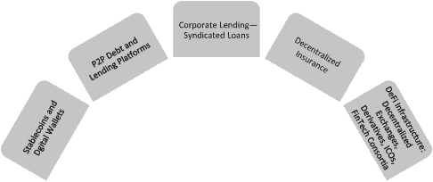
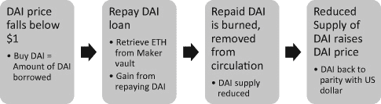
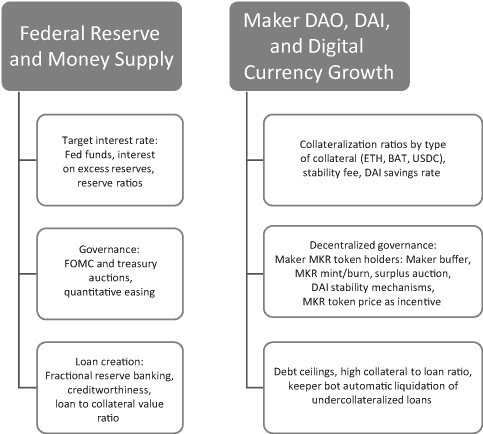
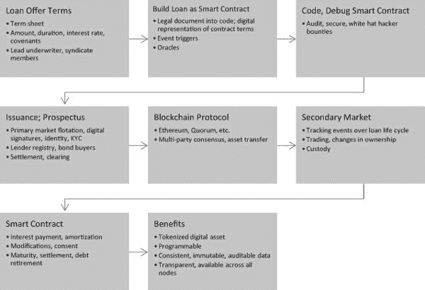
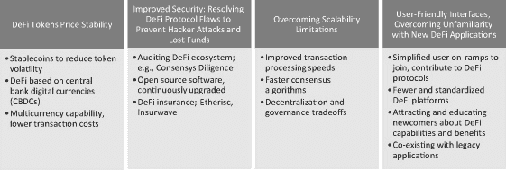

# 4

# 去中心化金融

资本是经济活动的一个基本要素。企业家必须从个人资金、天使投资者、风险资本家、机构投资者和股票市场等渠道聚集风险资本。贷款资本，其利息可在固定或变动利率下支付，在一定程度上以抵押品为担保，也可以从多个来源流向企业家。说服风险资本的来源投资于或向企业家的事业贷款并不总是容易的，对于有资本可投资的投资者来说，找到并确定值得接受的投资对象也是挑战。这些困难的根源在于信任问题。投资者能否信任企业家和借款人按照约定的方式使用他们的资本，并且谨慎使用？利息和本金偿还是否会在约定的条件下完成？这种信任缺口带来了对中介的需求，这些中介可以代表投资者和贷款人进行尽职调查，并将此类汇总信息提供给客户进行审查和决策。

对于风险资本和贷款资本，金融中介将投资者和贷款人与寻求资本的企业家和公司聚集在一起。除了提供接触资本来源（在某些情况下，帮助筹集风险资本和信贷）和促进贷款与偿还外，金融中介还可以提供其他辅助和相关服务。这些补充服务包括银行和保管、支付处理、汇款、储蓄账户、交易和结算金融资产和衍生品的交易所、投资建议和管理、国际贸易融资、信用证（LCs）以及个人财务。金融中介还服务于 evolving needs 例如对保险产品、遗产规划以及财务咨询的需求。

除了匹配供应者和客户，金融中介还通过帮助客户遵守法规并检测、预防和保护免受欺诈行为来管理对手方风险。他们可以控制资产（代表客户），为客户提供访问交易数据子集的方式，并承担系统风险。本质上，金融服务现状提供了一种减少客户风险的可靠手段，以中介费用作为回报，这些费用可能占到交易金额的一个很大比例。其他成本可能包括服务费、完成交易前的长时间延迟、透明度有限、用户对自己数据的控制不足以及单方面确定的服务条款和定价。

近年来，有几家金融科技移动先行公司崭露头角，旨在通过智能手机交易以较低的成本提供这些中介服务。这些金融科技挑战者中的一些包括欧洲的 Revolut 和 N26；美国的 Robinhood 和 SoFi；以及亚洲的 Paytm、蚂蚁金融、支付宝和微信支付。许多这些公司已经多元化，推出了综合服务产品，扩展到相邻市场。这些金融科技公司试图通过与 AI 相连的软件、用户友好的界面、智能手机访问、云计算服务、社交媒体和数据分析来获得与现有企业竞争的优势。在这种情况下，区块链提供了一种额外的方式来颠覆传统金融中介及其与客户的特权地位。

## 去中心化金融（Decentralized Finance，简称 DeFi）是什么？

区块链可以为金融服务提供许多核心要求，例如满足信任需求、提供快速且廉价的流动性、提供准确、不可篡改且及时的数据、确立来源并因此具有可追溯性、确保高安全性。它可以通过去中介化显著降低中介费用，并实现交易对手之间的直接互动，同时实现这一切。区块链使得去中心化 P2P 金融服务成为可能，并可以降低开发、推出和交易金融工具的成本。不出所料，许多新兴公司已经使用区块链在区块链上提供金融服务，成为现有企业的竞争者。去中心化金融（DeFi）描述了利用技术（包括区块链在内）颠覆金融行业的这一趋势。

除了为投资者和银行客户提供服务外，DeFi 还为发行人、金融资产组合经理和监管机构提供服务。1 发行人可以通过内置智能合约发行数字证券来筹集资本，这些智能合约包含条款和条件，并实时更新所需的 KYC 和 AML 信息。数字资产可以进行细分，增加流动性并使小投资者能够接触更多种类的金融资产。DeFi 还可以通过整合资产生命周期事件（包括自动利息和本金支付）来帮助发行人。组合经理可以通过访问去中心化交易所（DEXs）和具有智能合约编程功能的新的投资类别来获益。监管机构可以从区块链交易的不可变和透明特性中受益，实现自动化的审计和合规检查，从而使他们能够进行更深入的分析和对风险进行预测。

DeFi 协议通常都是开源的，提供互操作性和共同的软件基础设施，以鼓励在多个资产类别之间使用。它们是为了更广泛的应用而设计的，以鼓励开发者构建应用程序和提供建立在 DeFi 协议之上的新服务。智能合约和自动化执行在 DeFi 运营中扮演着核心角色，例如，智能合约控制的自动化市场制造商有助于扩大 DeFi 市场。（自动化市场制造商使用流动性池交易数字资产，而不是像传统交易所那样匹配买卖订单，从而实现订单交易的自动化，这对于市场的建立和维护至关重要。）

DeFi 的增长与以太坊协议紧密相关。DeFi 主要在以太坊上运行，并使用以太币和其他 ERC-20 代币；以太坊的普及程度以及大量价值投入到以太币中，使得 DeFi 应用程序吸引人在以太坊上构建。2021 年 10 月，锁定在以太坊 DeFi 应用程序中的总价值接近 1600 亿美元，而 2020 年 6 月初仅为大约 10 亿美元（尽管这可能由于资金锁定后再作为抵押品借款的双重计数而高估了）。本章后面将讨论的 Maker 和 Compound 是两个主要的 DeFi 应用程序，还有 Aave 和 Curve，大约有 35%的总以太币投入到这些协议中。2

DeFi 期望通过大量新的 P2P 货币应用实现去中介化，这些应用可以促进借贷、借款、交易（包括保证金交易）、稳定币兑换、投资于比特币等数字货币的期货市场、基于数字货币创建和兑换代币，以及使用期权和衍生品进行商品和外汇交易，通过新创建的 DeFi 公司如 Balancer 实现。3 Balancer 是一个多代币自动化市场制造商和交易所，作为一个自我平衡的加权组合运行。

图 4.1 展示了 DeFi 应用范围的不断扩大。我在接下来的几节中讨论了 DeFi 在各种金融领域的几个示例，以说明区块链在金融应用中的范围日益扩大。

图 4.1

DeFi 的应用范围不断扩大

正如第三章所讨论的，基于区块链的加密货币如比特币和以太坊有很多优势，但它们的波动性降低了它们作为价值储存或交换手段的吸引力。稳定币对于数字货币获得广泛接受以及“跨越鸿沟”进入大众市场采用是必要的。稳定币可以通过将稳定币与法定货币储备挂钩的方式创建；USDC（美元币）或 USDT（泰达币）等稳定币以这种方式创建，其金额与储备中的美元总额相等。另一种方法是使用加密货币储备作为发行稳定币的基础，并通过持续调整加密货币储备与发行的稳定币之间的比率来适应基础加密货币储备的价格波动。MakerDAO 及其 DAI 稳定币是这种方法的例子。

### MakerDAO 和其 DAI 稳定币

MakerDAO 及其 DAI 稳定币是众多已被广泛采用的稳定币之一。由于加密货币在商业交易中作为交换手段的使用受到限制（由于波动性和小额交易的高交易成本），购买加密货币的主要动机变成了投资和投机，希望这些货币——比特币、以太坊——能够升值，为持有者提供资本收益。因此，在等待升值期间，比特币和其他数字货币将是闲置资产。2020 年 12 月的一份估计显示，流通中“60%的比特币在过去 12 个月内没有移动”4。

作为回应，Maker 和其竞争对手建立了一种商业模式，围绕创建稳定币来激励加密货币“持有者”（HODL 是加密货币世界中指长期持有比特币和其他数字货币的一个术语），以部署他们的闲置资本。借用闲置的加密货币为数字货币持有者创造流动性和收入。Maker 稳定币模型结合了将波动的加密货币转换为稳定的数字货币，以及为创建的稳定币提供贷款的条款。这类似于商业银行的银行和部分准备金基础贷款，其中银行持有的准备金是总存款的一部分，但可以发放的贷款是手头存款的许多倍，因为它们得到了中央权威机构如美国联邦储备银行的支持。这种安排增加了货币供应量。

一旦 Maker 协议从加密货币中创建 DAI，这些加密货币由其客户存入，由于 DAI 稳定，它可以作为交易的支付手段。它还可以用于兑换或作为储蓄持有。Maker 协议通过设置贷款利率来补充 DAI 创建——Maker 的稳定率，这与美联储的目标利率相似。

Maker 以及大多数其他去中心化金融（DeFi）应用都采用了以太坊协议。以太坊的智能合约功能在构建金融应用时特别有用。Maker 及其 DeFi 竞争对手使用与 ERC-20 兼容的代币，比如以太币。ERC-20 定义了在以太坊内创建代币的标准，它规定了所有智能合约和 ERC-20 兼容代币必须实现的基本功能。5 这些功能包括特定代币的总供应量信息、账户所有者的余额以及向特定客户地址转移特定数量代币的能力。这些特性允许花费者从或向特定地址提取或归还指定数量的代币，并激活一个批准模块来执行指令，如转移或提取数字货币。Maker 包含了对其稳定币 DAI 特有的额外功能，例如在 Maker 内铸造和销毁（取消）代币的能力；这一功能同样适用于 DAI 以及 Maker 内单独使用的 MKR 代币，后者允许 MKR 所有者在治理中发表意见。

为了对冲加密货币的不稳定性，Maker 将其 DAI 稳定币与美元挂钩，维持 1:1 的比率。每个创建的 DAI 都由以太坊代币以太币支持，并存放在 Maker 那里。稳定币的创建过程始于客户向 Maker 存入以太币并同意将存入的以太币锁定在保险库中。一旦存入并确保安全，Maker 的抵押品规则就会启动，内部设定的抵押品对 DAI 的比率最初设定为，比如说，150%。抵押品比率由 Maker 治理成员设定，部分取决于抵押品背后加密货币的波动性；波动性越大的抵押品需要更高的抵押品比率。随着以太币价值的波动，一定程度的高抵押品是必要的——Maker 的意图是通过高抵押品来增强对 DAI 的信心，从而提高 DAI 稳定币的安全性。在 150%的抵押品比率下，存入 1 以太币（在存款时，加密货币交易所的价值约为 300 美元）将允许创建 200 DAI，以太币的存款人可以借款（抵押债务头寸）。

这种通过“以太坊上的无权限信用工厂”创建 DAI 的模型类似于股票经纪提供的保证金贷款。保证金贷款允许投资者在避免清算头寸的同时，仍可维持对部分投资资本的访问，代价是保证金利率。当借款人偿还 DAI 时，保险库中存入的以太币可以取回，扣除稳定费（类似于利息；年借款利率随特定加密货币的存放和抵押比率而变化。当以太币以 150%的抵押比率存入时，稳定费在 2021 年 6 月约为 3.5%）。

DAI 还可以在 Maker 的 DSR（DAI 储蓄率）合同中被锁定，以赚取额外的 DAI，这是通过稳定费产生的（费率由 Maker governors 决定）。实际上，Maker 提供了一个以太坊上的储蓄账户，用 DAI 支付利息。DAI 的总量与抵押贷款的需求成比例增长。智能合约自动化了 Maker 交易，包括发放 DAI 贷款、管理贷款偿还、收取利率、清算坏账和管理保险库。

DAI 可以在加密货币交易所交易。Maker 通过套利以及与存入抵押品之间的联系来维持 DAI 与美元的平价。提高或降低稳定费会导致债务减少或借款增加，从而改变 DAI 的需求和供应。如果 DAI 跌至 0.99 美元，借款人可以用 198 美元购买 200 DAI 并偿还原始的 200 DAI 债务，小赚一笔。当 DAI 偿还时，它会被从流通中移除，减少 DAI 的总量，提高其价格，使其与美元恢复平价。如果偿还的 DAI 没有被取消，DAI 的总量将超过抵押品的金额，导致 DAI 的价值低于与美元所期望的 1:1 的平价。这个过程在图 4.2 中有所说明。

图 4.2

Maker DAI 如何与美元保持稳定

如果 DAI 的价格大于 1 美元，借款人会在加密货币交易所出售 DAI 获得利润，这种情况会逆转，激励其他 ETH 持有者在 Maker 上创建 DAI 并出售获得利润。这个过程会增加 DAI 的供应，降低其价格，使其与美元恢复平价。

制造商系统包括自动化机器人守护者，它们参与维护等价性的这一特性（还有其他特性）。2020 年 3 月，在 COVID-19 大流行危机的高峰期，对流动性的追逐导致 DAI 挂钩断裂，DAI 的价格达到了 1.37 美元兑换 1 美元，然后到 2020 年 7 月稳定在 1.01 到 1.03 之间。然而，以太币是波动的，因为它的价值在波动。如果以太币的价值下跌到它的价值低于 300 美元，借款人需要向保险库贡献更多的以太币，以避免违反 150%的抵押要求，或者返回借来的 DAI。如上所述，借款人需要支付稳定性费用以取回以太币。（上面使用的以太币价值是为了说明目的。从 2021 年 2 月到 2022 年 2 月，以太币的价格在 1,416 美元和 4,620 美元之间波动，2022 年 2 月 19 日的价格为 2,790 美元）。

为了保护 DAI 的过度抵押和安全，防止不良债务增加并压垮制造商系统，系统稳定器规则允许在贷款变得危险时（即抵押比例被突破并降至 150%的设定比例以下）自动清算保险库。从 MKR 选民选择的信任的预言机流中收集链下 DAI 价格，并通过预言机安全模块链上提供一个中位数 DAI 价格到制造商协议（如果预言机被入侵，则有一个时间延迟以提供安全保护）。为了避免因违反抵押品地板而自动清算贷款，并被强制支付罚金，DAI 借款人有动力将抵押品超过最低 150%。

制造商规则允许外部第三方——即市场上操作的交易者，被称为守护者，他们通常使用自动化机器人——清算债务并将系统恢复到更安全的水平，在此过程中获得利润。守护者还会出价足够的 DAI，仅足以购买与关联保险库中的抵押品以太币，以偿还债务和相关费用。7 任何剩余的抵押品（通常是由于过度抵押和当抵押比例过高时自动清算造成的）将退还给保险库所有者，后者继续拥有通过以最初提供的以太币为抵押借来的 DAI。

Maker 的治理结构是 Maker 稳定币策略的一个重要组成部分。通过持有 Maker 代币，可以参与通过投票进行的治理，每个 MKR 代币附带一票投票权。作为 DAO 的 MKR 代币持有者，会裁决诸如不同类型抵押品的债务上限、借款利率中内置的风险溢价、设定坏账上限的程序等问题。他们还通过平衡 Maker 系统内锁定的总抵押品与系统总债务来确保 Maker 系统的稳定性。随着 Maker 在其 DAI 稳定币方面取得更多成功，随着更多 DAI 的发行、借款和偿还，MKR 治理代币的价值可能会上升。MKR 治理代币价值的上升类似于持有增长型公司的股份。这为用户谨慎管理 Maker 协议并保持 DAI 的稳定性创造了激励。

Maker 治理包括一个 Maker 缓冲区，该缓冲区持有从保管库流动性抵押品拍卖中获得的 DAI 作为稳定性费用。如果 Maker 缓冲区超过设定上限，将举行超额拍卖，将超额 DAI 出售为 MKR 代币，然后销毁，从而减少 MKR 的供应并提高其价值。销毁的代币发送到一个没有私钥的钱包中，以便没有人可以访问这个钱包，发送到这个钱包的 DAI 或 MKR 代币无法挽回地丢失。相反，如果抵押品清算加上 Maker 缓冲区中的 DAI 不足以完全偿还债务头寸，将发行 MKR 并出售为 DAI 以完全清算债务，结果是 MKR 代币价格下降。（请注意，MKR 不是像比特币那样挖矿产生的，而是由 Maker 治理机构创建的。Maker 最初推出时供应量为一百万 MKR。）

最初，Maker 只接受以太坊作为转换为稳定币的唯一基础。后来，它转向了多抵押品借贷模型，接受其他加密货币，例如 USDC（最初由数字货币公司 Circle 创建，后来由包括 Circle、Coinbase 和 Bitmain 在内的财团管理）。Maker 计划接受更多数字资产作为抵押品，将来可能包括实物资产作为抵押品。

### 稳定币与货币供应量

在美国银行系统中，有效联邦基金利率和回购（repo）利率之间的利率差决定了金融系统的流动性（见图 4.3）。回购市场的每日成交额超过 1 万亿美元，回购利率允许机构通过将现金借给需要资金满足短期流动性需求的机构 overnight 来赚取临时超额现金的利息。联邦公开市场委员会调整超额准备金利率（IOER），以将联邦基金利率移动到其期望的目标范围。如果隔夜银行间贷款利率大于 IOER，那么银行将贷款或扩大信贷，反之亦然。同样，Maker 可以调整抵押水平、清算低抵押债务和稳定费，以影响 DAI 贷款的创建，受其自我设定的债务上限限制。需要注意的是，随着 DAI 市场和接受度的增长，这个债务上限已经提高，从而影响了平行数字货币货币供应的增长。8

图 4.3

传统货币供应和数字货币系统

在美元重要性的背景下，考虑美元作为储备货币、其流动性或银行为满足储备要求而购买的高质量资产，defi 应用如 Maker 的货币供应影响变得越来越显著。随着美国赤字增长（2020 年 6 月结束的年度达到 3 万亿美元，占 GDP 的 14%）和货币供应增加（由于量化宽松，从 2012 年的约 14 万亿美元增长到 2019 年底的近 23 万亿美元），在面临美国金融系统脆弱性的情况下，基于数字货币的金融系统可能会获得动力。

此外，随着数字货币的持有量增加，稳定币更广泛使用的前景变得明朗，消费者需要安全的、易于访问的、易于使用的存储，以及跨钱包转移的便利。数字资产的存储和检索替代方案包括来自各种来源的在线托管数字钱包，如数字货币交易所（例如，Coinbase）、Trezor 和 Ledger 等物理硬件钱包、纯粹的手机钱包（智能手机上的虚拟钱包应用，指向区块链上的位置以存储和检索数字货币）如 Edge，以及桌面钱包（与移动钱包类似，但安装在桌面和笔记本电脑上）如 Exodus，与 Trezor 集成。物理硬件钱包是安全的物理设备，类似于 U 盘，可以存储私钥，从而保障对数字货币的访问安全。

### 挑战性创造者：复合协议与收益农耕

作为引入稳定币的先驱者，Maker 获得了以太坊 ERC-20 以太币总投资中的显著市场份额，截至 2022 年 2 月，Maker 金库中锁定的总价值达到了 160 亿美元。9 Compound 通过其业务模型中的创新差异挑战了 Maker。Compound 成立于 2017 年，在以太坊内推出了一个竞争性的货币市场协议，并在 2020 年 6 月引入其 COMP 代币后迅速增长。到 2022 年 2 月，Compound 中锁定的总价值达到了 67 亿美元，相比之下 Maker 约为 160 亿美元。10 Compound 的独特差异化特点如下总结。11

Compound 接受广泛的以太坊资产（例如，以太币、DAI、泰达币），尽管并非所有与以太坊兼容的代币资产都被支持。以太坊代币所有者可以在 Compound 中存入其与以太坊兼容的代币资产，并通过 Compound 协议出借，从而在原本闲置的资产上获得利息。借款的利率由算法确定，并因资产而异，这取决于该以太坊资产的需求/供应互动；智能合约匹配供应与需求并计算出连续变化的利率。Compound 协议允许出借者从特定资产（例如，以太币池）的池中借款。池是通过结合 Compound 所有客户存入的以太币创建的。因此，出借者并未直接向借款者出借；相反，Compound 协议为寻求借入特定资产的借款者提供来自该特定资产池的贷款。

通过汇总所有用户提供的资产，并从这些池中放贷，Compound 增加了每位贷款人的流动性。贷款人还可以在不等待特定贷款到期的情况下提取资产。这样做，Compound 创造了无摩擦的以太坊代币借贷，无需 P2P 协商债务到期、利率或抵押品。借款人必须在 Compound 上以其自身的以太坊兼容代币作为抵押品，他们可借款的总额取决于所存抵押品的部分金额。作为抵押品提供的每种资产的价值由一个价格预言机确定，该预言机从十大加密货币交易所汇总该资产的价格。借款人可借款的金额取决于作为抵押品的资产的风险性。这些资产在抵押强度上各不相同，从零到一，风险越高的资产越弱。抵押品风险越高，可借款的金额就越小。如果由于抵押品价值的下降，用户超出了其借款能力，那么超出的借款部分将以一定的折扣率用抵押品偿还。这也被称为清算折扣，它为 Compound 社区中的套利者创造了介入并用自己的同类资产偿还部分债务的激励，进而获得将被清算的借款人抵押品的一部分所有权。

最初，Compound 的治理是集中的，管理员会选择每种资产的利率算法等参数，并确定哪些以太坊资产将被接受在 Compound 上进行存款和借款。为了去中心化治理，Compound 推出了 COMP 代币，将治理权交到 COMP 代币持有者手中。每天都会发行新的 COMP 代币，并按比例分配到各个资产类别中，再在每种资产的借方和贷方之间平均分配；因此，每位 Compound 用户现在在治理中都有发言权。

Compound 协议上的一些典型用例包括借用代币在以太坊生态系统中使用，使用现有所有权资产作为抵押借入以太币或其他以太坊资产（保证金贷款），以及借入代币以偿还原始债务并实现盈利。像 InstaDapp 这样的专业 Dapp 提供了一个“最大化 COMP 开采”功能 13，帮助用户通过“收益农耕”实现更高的回报，这有助于以太坊资产所有者将闲置资产投入使用。在收益农耕中，数字货币所有者——流动性提供者——将他们的资产锁定在流动性池中，该池使用智能合约从池中贷款。将资产贡献给池的流动性提供者将从交易费用、贷款利息中获利，有时还包括治理代币，这可能会增加基础实体的价值；例如，Compound 增长并增加其贷款总额。

Maker 和 Compound 的增长，以及像 Aave、Curve Finance 和 Uniswap 这样的新兴竞争对手，凸显了 DeFi 协议和商业模式日益增强的吸引力。它们的增长还刺激了包括 DEXs 和去中心化衍生品市场在内的几种互补的 DeFi 机会的出现。

### DEXs 和交易系统

金融工具需要交易所来为金融资产定价和交易。在美国，由一组金融机构拥有的存托信托与清算公司（DTCC）处理证券交易的结算和清算，结算时间约为两天。该国在 2019 年每天的证券交易平均约为 1.3 万亿美元，DTCC 注册处更新交易以反映所交易证券的所有权和支付变化。为了防范对手方未支付的风险，金融机构在实际结算前预留资本来覆盖这些风险。此外，它们还维护自己的交割和结算记录。调和冲突信息消耗资源且耗时，因此改进这些后台职能（通常是基于大型主机的批量处理）可以减少结算时间并节省成本。像 Coinbase 这样的集中交易所已经出现，以促进数字资产交易和保管，它们克服了 DTCC 系统固有的缺点——更慢的结算时间、需要预留资本来覆盖非支付风险以及后台对冲交易记录的调和。

基于区块链的交易系统可以提供安全的即时交易、结算和支付。Paxos 这家区块链初创公司，得到了 SEC 的授权，启动了一个有限的试点项目，使用区块链来结算股票交易。14 该试点项目在一个私有的、受许可的以太坊协议上进行了为期二十四个月的运行，仅限于交易最活跃、波动性最小的股票，且这些股票的总日交易量的 1%为上限。允许有限数量的金融机构作为交易伙伴参与，包括瑞士信贷、野村和法国兴业银行。

区块链技术使得基于智能合约的证券数字化表示物可以进行交换，通过创建单一统一的交易记录，对账（reconciliation）变得不再必要。因此，Paxos 基于区块链的交易可以促成交收对支付（delivery versus payment）以及当日结算，甚至可以实现一日多次结算，从而增加日间流动性。这将释放出目前用于防范交易对手风险的资本。虽然自动股票转让是在 Paxos 区块链上而不是在 DTCC 系统内进行的，现金以稳定币的形式由 Paxos 保管账户持有，但 DTCC 仍将维护更新的股票注册表，这样在试点试验期间可以隔离交易系统免受故障的影响。尽管最初只限于 Paxos 结算服务网络的双边参与，但随着试点的成功进行，Paxos 可以寻求 SEC 的授权，将其区块链解决方案提供给美国所有证券交易商，以结算他们的证券交易。

随着加密货币越来越受欢迎，尤其是像比特币、以太币和 DAI 这样的数字货币，对于流动性的需求日益增加，以便加密货币所有者可以轻松地将一种加密货币兑换成另一种或法定货币，通过借贷或储蓄存款获得持有利息，以及进行杠杆操作。同样，去中心化金融（DeFi）的兴起导致了 DEXs 的相应增长，其中包括 Uniswap、Kyber、Balancer、Curve Finance 和 Bakkt，它们都摒弃了像 Coinbase（在第一章中讨论过）这样的中心化市场制造商，而是提供不同版本的快速、安全的去中心化 P2P 交易。随着 DEX 交易数字货币，距离交易法定货币和商品的数字化表示，以及如 Paxos 所示的股票等真实资产只是一小步。因此，任何能够以安全和不可变的方式数字化表示的资产都有可能在 DEXs 上交易，从而颠覆传统的中心化交易所。

### Balancer：去中心化交易所（DEX）和 ETF 供应

Balancer 交易所是这样一个协议，它允许用户交易各种与 ERC20 兼容的代币，同时还可以创建“可编程流动性”。Balancer 提供包含多个不同 ERC20 代币资产的投资组合的流动性池，每个独立投资组合的基础代币权重不同。这意味着 Balancer 可以为 ETF 类型的加密货币投资组合提供访问权限。在共享流动性池中，该池的创建者决定池中将接受哪些代币，最多八种不同的代币，并为投资组合中的每种代币设置权重。一旦为该共享流动性池选择了代币及其权重，它们就不能更改。

然后，Balancer 用户审查可用的不同投资组合，并决定他们想要投资的组合，选择一个加权平均货币与该特定投资组合相符的投资者偏好的组合。为了投资该组合，用户与其他用户在加密货币交易所上交换他们的加密货币持有量，以产生该组合中每种货币成分的具体数量，然后他们将这些贡献给 Balancer 以获得投资组合的份额。此外，一旦投资者成为流动性池的一部分，该投资者可以通过提供流动性并促进他们池中加密货币的交易来赚取费用。因此，Balancer 中的 ETF 投资者通过投资获得收入，而与投资组合产生的任何其他收入（如利息或增值）无关。

Balancer 还提供服务于希望交换特定加密货币的一定数量以换取另一种加密货币的交易员。一旦交易员放置了交换订单，一个算法就会在某些流动性投资组合的子集中执行此交换，即使基础代币的价格发生变化，也能保持投资组合的权重不变。不同的投资组合将根据维持所需投资组合构成的需求提供不同的价格，也许会降低他们过剩并需要出售以使投资组合恢复平衡的代币的价格。

自动市场制造和自动平衡的后果之一是，大订单可能导致价格波动更多，因为大订单将对投资组合在期望的投资组合组成权重之间的平衡产生更大影响。15 这种价格变化，称为“滑点”，在下单时传达给交易员，以便他们可以为订单执行设置可接受的滑点限制。此类交易员支付由每个投资组合设定的交易费用，算法倾向于具有较低交易费用（作为交易金额的百分比）的投资组合交易，前提是他们拥有用户寻求的具体代币。综合来看，投资组合通过提供特定货币的流动性赚取交易费用，同时算法推动投资组合降低其交易费用，从而在整个 Balancer 系统中降低交易成本。

Balancer 还提供 BAL 代币，允许 BAL 代币所有者参与 Balancer 治理，BAL 代币的数量随着投资组合大小的增加而增加。因此，较大的投资组合为 Balancer 系统提供更大的流动性，并赚取更多的 BAL。这使他们在治理中拥有更大的声音，意味着在决定交易费用水平、设定决定哪些 ERC20 代币将被接受、设置分配交易到不同流动性池的算法特性等方面拥有增加的声音。

Balancer 为其流动性池增加了额外细微之处，允许单一所有者的私人池，该所有者宣布接受用于投资组合的代币，设定投资组合组成权重和交易费用百分比，并完全控制这些参数。私人池对大型投资者和专业资金管理者具有吸引力，他们希望提供基于透明投资组合组成和权重的加密货币 ETF 服务。这些私人池为希望创建其原生代币市场的新的区块链实用程序提供了创新机会，并增加其代币流动性。例如，新的区块链初创公司可以启动引导流动性池 16，其投资组合包括其代币和其他成熟代币，如比特币或 DAI，随着时间的推移可以扩散其代币的所有权。因此，在第二章中讨论的 Algorand 可以利用 Balancer 普及其 ALGO 代币，并增加使用和参与 Algorand 作为区块链协议的兴趣。

### 数字资产衍生品市场：Synthetix

衍生品是交易系统中另一个重要的组成部分。它们允许投资者在不拥有基础资产的情况下交易资产预期的表现（例如，股票的看涨和看跌期权）。Synthetix 是一家区块链初创公司，它创建了一个基于以太坊的去中心化合成资产发行协议，该协议也是一个用于交易法币（例如，DAI 作为美元的合成形式）、加密货币和商品的合成形式的交易平台。它提供去中心化衍生品交易，生成与抵押品价值挂钩的原生代币 SNX。在这种情况下，存入的 ERC20 代币是各种资产的数字表示，如法币（美元、欧元等）、加密货币和商品（黄金、白银）。将来还可以扩展到其他实物资产，如股票。

在系统中生成 SNX 之后，用户可以将 SNX 锁定，并铸造一个第二代的代币 Synths，其抵押率高达 800%或更高。因此，八百个 SNX 可以生成一百个 Synths，这些 Synths 可以用来交换法币和加密货币以及商品的衍生品。所选资产的价格变动和衍生品的价值变动由预言机跟踪；在加密货币的情况下，Synths 还可以用来做空它们，从而跟踪以太坊、比特币等价格的下跌。

每次 Synth 的交易都会产生费用，平均约为 0.3%，这笔费用作为锁定抵押品的奖励分给 SNX 持有者。SNX 持有者还可以通过 2023 年每周 SNX 数量的增加获得额外的奖励，每周增加 1.25%。Synths 是用户的债务，必须用 SNX 抵押品偿还才能解锁。用户债务随着个人用户债务与整个 Synthetix 系统债务的比例变化而连续变化，总债务价值随着基础资产价格的变动而变动。正如 Synthetix 所解释的，“这样，SNX 持有者充当了所有 Synth 交易所的集体对手方；持有者承担系统内整体债务的风险。”17

Synthetix 还在单独使用以太坊作为抵押品进行实验，这将需要一个较低的抵押比例 150%，并允许用户直接以太坊生成 Synths，而不是首先将它们兑换为 SNX。用户的债务将以以太坊计价，用户不参与系统的集体债务方面，也不获得费用或奖励（因为他们不承担债务池风险）。由于可以进行更大额度的风险对冲，交易员访问数字资产衍生品市场的交易量增加，从而提高市场效率。随着区块链公司在去中心化稳定币、P2P 借贷、DEX 和衍生品市场方面积累经验，可以使用相同的原则和机制开发去中心化市场。随着时间的推移，提供类似功能的竞争协议将减少，几个健壮且功能全面的协议可能会占据主导地位。随着行业联盟如 R3/Corda 和 Ripple 的兴起，这一过程正在加速，这些联盟正在被广泛采用，允许第三方应用程序构建在这些标准协议之上，增加它们的实用性并帮助它们成为行业标准。

### 初始代币发行

区块链平台使得公司能够通过初始代币发行（ICO）和较新的演变方式初始交易所发行（IEO）直接从投资者那里筹集资本。ICO 是 IPO 的一种替代方式，可以民主化资本获取。它们还可以通过新兴组织内的共享治理帮助去中心化创新。18 然而，ICO 和 IEO 受到了监管有限和表现不佳的影响。

代币或硬币提供的权利和利益是 ICO 的核心问题。投资者应如何评估其 ICO 投资所获得的代币？加密货币交易所和列出 ICO 代币的 DEX 为 ICO 投资者设定代币价格，提供转售可能性，并为 ICO 投资者提供流动性。人们关心的是，特定交易所为代币设定的价格是否公平或受到操纵，成交量大和交易不频繁导致价格发现效率降低。

相关问题包括额外的代币发行是否与 ICO 公司服务需求的增长有关，以及是否有一个代币总发行量的上限。重要的是，ICO 启动文件是否提供了详细的商业计划，ICO 筹集资金的使用预算是否明确，筹集的资金是否可能提前偿还早期投资者，以及法律规定是否保护投资者利益。19 Vitaly Buterin 和其他人提出了一个去中心化自治 ICO（DAICO），在 ICO 投资者的资金中，当开发工作达到里程碑时，或者在设定期限后，将资金从 ICO 收益中释放给 ICO 买家。20

ICO 试图避免被归类为证券，因为这样的分类会增加合规要求。美国证券交易委员会（SEC）长期以来一直使用霍伊测试（即投资金钱或宝贵商品和服务于普通企业，有合理的盈利期望，来源于他人的努力）来确定是否一个问题是一个带有投资合同的证券，因此受到证券法规的约束。根据这些标准，SEC 认为一些 ICO 代币符合霍伊测试，因此需要作为证券进行监管，这是代币发行人更愿意避免的。

在投资者保护较弱的情况下，ICO 投资者更容易受到欺诈和价格操纵的影响。作为筹款工具的 ICO 在 2017 年和 2018 年达到了顶峰，筹集了 78 亿美元，然后在 2019 年降至 12 亿美元。ICO 买家期望随着底层服务的增长和客户基础以及用量的增加，代币能够增值。然而，拟议的服务通常处于概念阶段，很少有明确的转变为能够吸引大量付费客户的实用功能的前景。21 一家随后启动了 ICO 的公司的初始股权投资者仍然可以保留公司的控制权，同时使用 ICO 资金将资本回报给自己。由于许多新发行的 ICO 遭遇了困难，监管机构开始增加监管要求，以保护投资者免受欺诈性 ICO 启动的影响。一种回应是动态代币发行，如果公司在规定的里程碑上没有取得进展，例如奥利恩协议，代币投资者可以在发行后的九到十六个月内获得退款。22

更明确的法规可以阐明和加强 ICO 在筹集资本方面的作用。例如，瑞士已经将 ICO 划分为不同的类别——支付 ICO，如加密货币，它们被用作支付手段；实用型 ICO，它们通过基于区块链的基础设施访问一个现有的运行中的应用或服务；以及资产 ICO，它们使得实体资产能够在区块链上交易，并且更接近于证券投资，对发行人有债务或股权要求。23

### IEO 和初始 DEX 发行

到 2019 年，初始代币发行（IEO）已经取代了初始币发行（ICO），成为新区块链公司上市的首选方式，约占所有新数字货币公司融资的 80%。尽管 ICO 是公司与其投资者之间的直接销售，但加密货币交易所监督 IEO，代表发行者举办新代币的销售。在交易所上币的销售类似于通过主承销商进行新股发行。交易所会挑选它要 hosting 和 subsequently list on its exchange 的代币销售，这一选择是基于诸如发行公司潜力、发行质量以及维护交易所作为优质代币交易场所的声誉等参数。潜在的代币买家成为交易所的会员来竞价购买代币，而交易所通常要求买家持有该交易所的代币，并用该交易所的代币支付发行公司的代币。因此，像 Bitfinex 这样的公司可能会要求潜在的 IEO 买家持有并使用 Bitfinex 的 Leo 代币支付新的 IEO。

IEO 已经演变为初始去中心化交易所代币发行（IDO），在这种情况下，代币或代币是在去中心化交易所上发布的，费用较低，社区批准发行（类似于众筹），即时流动性更好，并且代币持有在所有者钱包中，由私钥保护。主要的 IDO 包括 Universal Market Access，这是一个在以太坊上构建合成资产的协议，以及基于以太坊的去中心化加密货币交易所，如 SushiSwap 和 Uniswap。24 NFT 的兴起可能会导致类似的投资风险，因为 NFT 易于创建，供应可能会超过波动的需求。

### 区块链与商业联名贷款

除了规模大、信誉好的借款人可以直接提供贷款工具外，中小型借款人必须找到愿意代表他们安排和联名贷款的银行，或者必须与其他商业银行和投资银行合作，找到愿意购买他们联名贷款一部分的贷款人。牵头承销商商定贷款金额、期限、条款、抵押品、贷款契约和利率以及定价，所有各方签署法律文件。当大部分总贷款的贷款人准备就绪且市场条件有利时，贷款联名集团启动贷款。

管理贷款注册、抵押品管理、二级市场和交易；记录所有权变更；安排利息支付是后续耗时且通常基于纸质的工作，需要对账，并受到监管申报和合规性保证的约束。如果必须修改贷款，必须获得贷款人的同意，并将修订后的贷款以更新的条件注册。这一周期以本金偿还、贷款到期和贷款文件的取消结束。整个过程需要法律审查和法律顾问代表所有贷款协议各方批准，这是一个缓慢且成本高昂的过程。

将区块链作为联合贷款的平台可以简化流程，提高效率，加快进程，降低成本。债务工具背后的可编程智能合约带来了灵活性，减轻了更改贷款条款的插入难度并自动化利息支付。交易的不可变性创建了贷款注册、贷款条款、所有权变更和相关材料的单一认证来源；未经授权的更改立即显现，所有各方都有访问并分享贷款更新状态的权利。此外，链上记录可以包括治理功能，如投票权和行使权利以及快速结算促进。成本也得到降低，尤其是中介费用和持续的交易成本，尽管可能会因与智能合约相关的编码和调试产生额外的成本。综合这些特点，使联合贷款更加容易接触到更广泛的潜在借款人。总之，基于区块链的数字资产是可编程的、不可变的、透明的，且高效和流动，并可符合监管标准。25 图 4.4 展示了区块链可以为联合贷款流程带来的转变。在接下来的两个部分，我将探讨区块链在债券生命周期中的两个应用。

图 4.4

区块链平台用于联合贷款流程

德意志银行智能债券试点是德意志银行（DB）的一个试点项目，展示了使用区块链来管理银团贷款流程的例子。DB 对开发一个概念验证感兴趣：我们能否在区块链上模拟并执行债券的生命周期——从清算证券、完成结算到触发利息支付——从而实现债券的分摊和退役？首先，项目发起人需要说服决策者，区块链能够带来竞争优势，而开发和实施原型的试点项目可以帮助未来的决策者了解在该领域部署区块链的情况。项目发起人必须成为福音传播者，并将来自不同领域——法律、数据分析、IT、金融、客户关系和合作伙伴关系——的热心人士聚集在一起，形成一个联盟，以寻求组织支持。为了获得预算批准，项目需要有高级别的支持者，他们具有预算监督权和影响战略方向的影响力。一旦这些支持者被说服支持试点，初步的资金批准就来了。

实施试点意味着需要与 DB 之外的第三方合作：区块链专家。DB 选择与多个区块链协议/平台合作，以提供未来的灵活性，并获得与多种平台合作的经验。这还将帮助它选择一个用于管理贷款银团的平台，并与跨行业合作伙伴合作。如果合作伙伴愿意使用相同的区块链协议，合作将更容易。为了简化问题，试点没有使用实时数据；相反，在设计好区块链平台后，使用历史数据在模拟中进行了测试。试点最终证明，区块链可以创建贷款的代币化版本并管理其生命周期。

DB 的下一步是让外部各方——法律顾问、潜在买家、市场制造商和保管代理——参与一个跨组织的概念测试。跨组织合作在成功使用区块链进行银团贷款方面的重要性使 DB 成为 R3 金融联盟的创始成员，该联盟旨在验证金融领域区块链的使用；设定并同意共同标准；并促进不同成员金融机构之间的区块链协议之间的互操作性。R3 为联盟成员建立了一个共同的开放源代码区块链协议——Corda——供成员实验区块链，并使快速无误的结算成为可能。

要想超越试点阶段，关键要素之一是对项目成果进行衡量，以此证明继续进行区块链实验的合理性。为衡量项目成果所制定的指标包括提高了后台办公效率、降低了成本、缩短了结算时间、改善了清算和支付流程、减少了错误和调节需求，以及利用了能够访问详细、准确且带时间戳的交易数据。随着试点进入大规模实施阶段，需要解决的问题包括以下几点：

+   -   金融数字资产是否可以无需中介进行转让？

+   -   智能合约执行能否证明所有权而不需要中介？

+   -   智能合约是否能够正确记录未来状态变化，例如按约定支付利息、所有权变更、债券到期和注销？

+   -   在区块链平台上执行的交易是否能够满足监管要求并实现合规？

+   -   新平台是否能够与遗留系统（如 SWIFT 消息匹配）集成？

+   -   考虑到多家银行不得不被说服跨越组织界限来测试试点应用 27，现有和未来的联盟成员是否愿意在全面实施阶段进行合作、提供资金支持并分享知识产权？

世界银行区块链债券-I 是世界银行基于区块链发行的债券的一个例子。澳大利亚联邦银行（CBA）是 2018 年发行价值 1.1 亿澳元的澳元区块链债券的唯一安排人。CBA 的区块链卓越中心之前与昆士兰州 Treasury Corporation 一起试点了一个原型区块链债券。该债券是在华盛顿特区和悉尼由世界银行运营的区块链平台上创建、分配、分发和管理的 28。世界银行和 CBA 期望这次债券发行能展示区块链作为一个“不同参与者之间的促进平台”的角色 29。他们在一个私人以太坊区块链权限网络中，与早期采用的区块链债券投资者一起，经过一年的时间开发了这种区块链债券。这是政府实体首次发行的区块链债券，试点为解决技术和法律问题提供了机会。

在最初发行几个月后，在市场制造商 TD 证券的支持下，债券-I 实现了二级交易，这凸显了区块链筹集资本、协调交易和提供“经过验证的、永久的记录和即时对账”的能力。30 债券-I 平台的功能包括自动债券拍卖、簿记建档和分配、电子报价捕捉、实时更新、根据参与者权限增强的可见性，以及为“诚信和运营风险管理”提供可审计且不可篡改的交易记录。

### 金融科技保险市场：利用区块链、人工智能、物联网和分析技术

保险提供了基本服务。为了帮助个人和企业避免可能导致企业破产和个人遭受不可修复损害的灾难性风险，保险公司汇集风险并提供针对极端结果的赔偿，以此换取一个已知的小额、即时支付——保险费。保险公司的成功程度取决于它们能否创造一个足够大的客户群体，以便在这个群体中分散风险。保费是基于精算师对历史数据的分析设定的，以便在平均水平上，总保费加上投资收集保费所得的收入，超过了部分群体成员实现的损失支付。这最终为保险公司及其被保险成员提供了利润或股息。

在保险业务中取得成功取决于完成几个关键且相互关联的步骤：利用对被保险损失历史数据的分析来正确且有竞争力地定价保费；直接向客户销售，并通过具有广泛市场覆盖的经纪人网络获取客户；保留客户，以便年度保单续保为保险公司提供稳定的保费收入；通过审慎地再保险部分承担的总风险来降低风险。这个最后的任务允许公司为其损失设定一个下限（以及收入的上限），从而限定承担的风险并将其在更长的时间内平滑处理。假设保费具有竞争力，客户保留主要受客户服务质量的影响，尤其是在理赔处理方面。寻求对认为属于保险范围的损失进行赔偿的焦虑客户，如果他们认为他们的索赔被减少或无理拒绝，他们不太可能续保。然而，保险公司可能很难在处理客户索赔的同时平衡政策条件，保护公司的利益，特别是在检测和拒绝欺诈性索赔方面。

区块链与人工智能和分析学的结合可以帮助保险公司应对上述挑战。区块链以其不可篡改的数据和来源追踪，可以追踪保险资产池的变化、其所有权和价值。基于人工智能的聊天机器人可以自动化定制保险覆盖范围的过程，并从客户数据中提供保险费率报价。其他的 AI 聊天机器人可以通过连接预言者（oracles）来加速索赔处理，这些预言者会提供天气数据、警察报告和其他来源的信息，而其他的 AI 聊天机器人可以增强客户参与度和客户体验。

在一家名为 Lemonade 的区块链保险公司中， Maya 和 Jim 这两个好玩的 AI 聊天机器人 31 是支持客户满意度的 AI 部署的例子。聊天机器人和智能合约带来的自动化可以降低成本，通过自动化一个以规模为主导的行业的关键流程，提供结构性成本优势。累积的客户数据可以使动态保险费率定价成为可能，尤其是在续保节点，这些累积数据可以作为法医分析的基础，以防止、检测和防范欺诈。在这种情况下，区块链内生成的代币可以用来激励期望的行为；例如在 Lemonade，保单持有人可以将剩余索赔池中的资金捐赠给指定的慈善机构，这实际上是对客户低损失比和索赔额与保费收入的比例的奖励。表 4.1 总结了一些区块链在保险应用中的好处。

区块链使整个保险周期受益，从客户获取、保险费率报价，到客户服务和索赔处理，再到客户保留，以及从改善保险营销到降低成本和提高客户对公平性的感知。32 安全的区块链数据可以帮助在最初的客户获取阶段以及随后的客户服务互动中验证客户身份。区块链还确保在更新记录时，如保费支付或修订保单条款等新验证的交易，保护隐私和数据。类似的数据链接可以帮助验证特定群体的团体福利，因为根据保险，不同群体可享有的福利套餐可能有所不同。不可篡改的验证数据提供了一个永久的记录，并帮助建立保险公司与其被保险客户之间的信任，并可用于减少欺诈和检测篡改和伪造。33

另一个平台 Insurwave,34 提供基于区块链和物联网的海洋船体保险解决方案，允许像马士基这样的公司管理全球运营的超过 350 艘集装箱船的保险。每艘被保险的船都在区块链上注册，算法计算保险费和政策，供船东使用。利用物联网设备，记录每艘船的航行和抵押品数据，如位置、天气和环境风险条件。累积的数据用于保单续保和索赔评估与处理。额外的好处是，为监管机构、所有者和潜在买家提供完整的、不可篡改的船舶生命周期事件记录，这对船舶二手交易非常有用。以标准格式存储的数据可以与再保险公司安全交换，透明地对交易进行对账，与第三方进行索赔代位处理，消除信息孤岛。

表 4.1 金融科技保险：利用区块链、人工智能、物联网和分析

| 差异化基础 | 目标 | 问题 | 解决方案：从区块链受益并补充 |
| --- | --- | --- | --- |
| 客户体验 | 使客户感到愉悦 | 以政策为中心，对索赔提出质疑，并且审批索赔缓慢，导致客户留存减少 | 增进保险人和被保险人之间的信任；AI 机器人帮助获得保险覆盖；愉悦的用户体验；基于应用程序；吸引年轻客户群体 |
| 负担得起 | 价格优惠 |  | 在保护竞争性隐私的同时保持透明度 |
| 索赔处理 | 公平、快速 | 在防止欺诈的同时平衡欺诈索赔的公平性。 | AI 机器人使用分析评估索赔；由物联网设备提供的处理数据。快速解决，快速理赔；付款授权和资金转账，导致保单续保和客户满意度 |
| 成本控制 | 降低成本优势和成本竞争力 | 规模不足和人力密集型处理 | 机器人和智能合约降低成本和错误 |
| 欺诈控制 | 欺诈减少和预防 | 虚假声明和伪造或不准确的文件 | 保险资产损失和代位求偿权 |
| 合规监管 | 高效、及时地遵守不断变化的多个司法管辖区的要求 | 不完整且缓慢的合规 | 监管机构能够访问安全的、不可篡改的、准确的数据，从而进行合规验证和分析 |
| 隐私和数据安全 | 准确、可交换且永久的记录 | 保险受益人不知情，特别是人寿保险；未领取的赔付 | 不可篡改的永久注册表便于受益人联系和支付 |
| 客户保留 | 减少政策复杂性和被拒绝的索赔，这会导致客户流失 | 在价格差异有限的情况下区分商品化服务 | 提高客户体验；更清晰的索赔验证和处理 |
| │行业合作│增加再保险合作伙伴的使用│与再保险伙伴共享数据并获得接受；不兼容的 IT 系统；数据标准│改善再保险放置；明确的合同条款；更容易的续约和索赔分配与结算│ |

Blockchain 保险行业倡议（B3i）的成立是为了开发基于智能合约的再保险（这被称为“无摩擦的风险转移”）以保护财产保险中超过损失的部分，即“灾难性超额损失”应用。B3i 汇集了实时信息共享，这使得保险公司和其再保险公司的账户调节成为可能，并允许自动支付。35 像 B3i 这样的保险区块链还可以简化监管流程，增强监管机构的可审计性，这些监管机构可以使用智能合约查询受保数据并评估其是否符合监管标准。例如，Amica 保险 36 能够在索赔调整员能够利用区块链及时获取准确的索赔数据时简化其索赔处理，这些数据包括保险持有人信息、索赔原因、保险覆盖和条款、保险索赔历史和其他重要文件。索赔调整员可以记录客户声明，访问地图，并提交通过安全且带时间戳的审计跟踪对其他人可见的索赔评估报告。

将区块链与物联网和人工智能（例如，IBM 的沃森物联网）相结合是提高保险业务效率的另一途径。物联网设备可以自动检测触发保险事件，例如汽车事故，进而触发维修、维修验证、在授权设施完成以及最终链接到索赔处理和支付。如果保单持有人同意加入并允许部署，例如，Groupama 保险公司在受保汽车上放置物联网智能传感器以跟踪位置、速度、加速度等相关变量，使其能够提供并部署由人工智能辅助的保险。作为使用物联网传感器的回报，其保单持有人会获得保费折扣。使用它们的其中一个好处是实时传达碰撞信息；如果被认为是严重的，可以立即派遣紧急服务，可能挽救生命。

法国的 Groupama 保险公司经历了欺诈性索赔减少、盗窃事件降低和鲁莽驾驶减少的情况。这是因为物联网设备促进了精确的车辆运动数据的传输，这些数据可以与大数据碰撞记录算法相结合分析，与传统的索赔检查员报告相结合，可以验证并加快索赔处理和结算速度。积累的动态数据在改进风险预测和风险预防方面补充了历史精算表。37 它还实现了礼宾式的保险服务：了解到个别驾驶员的习惯后，Groupama 可以指导驾驶员并警告他们注意危险条件，无论是即将出现的恶劣天气还是道路隐患。这导致了客户体验的改善和索赔的减少，进而提高了保单续保率。这种基于物联网的数据驱动的保险必须遵守隐私法规，因此，Groupama 需要获得客户的同意来收集数据，并向客户承诺，它永远不会将客户数据与第三方共享。

区块链在保险领域的应用潜力促成了专门针对保险的区块链协议的推出，比如以太坊的 Etherisc 试点项目。这个基于 P2P 的航班延误保险试点项目，采用了 Etherisc 的协议，会在航班取消或延误时向被保险人支付赔偿。其工作原理是，智能合约首先在客户发起的请求响应中发行保险；当预言机验证了航班延误时，授权支付。这使得发行和索赔处理自动化，并以透明和去中心化的方式进行。Etherisc 应用的另一个有趣的试点项目是通过 Aon、Sanasa 和 Oxfam 之间的合作，为斯里兰卡的小米稻农提供作物微保险 38。Oxfam 将其在发展中国家与农民社区合作的丰富经验与 Etherisc 的区块链协议和去中心化风险池专业知识相结合。Aon 带来了再保险和创新的保险设计方面的专业知识，而 Sanasa 则贡献了其本地的保险行业和文化知识。斯里兰卡偏远地区的许多农民没有银行账户，收入和流动性有限；对于这个群体来说，官僚主义和银行基础设施在物理和财务上都是遥不可及的。该概念验证的目标是利用区块链降低成本、提高效率，同时促进农民能够以公平和透明的方式获得实惠的微保险，在极端天气（可能导致作物损失）发生时得到赔偿。

更长期的目标是提供一个开源的通用保险框架，支撑以太坊的 Decentralized Insurance Protocol，使“产品构建者、风险池、预言机、索赔调整员、分销商和承保人能够基于以太坊区块链创建保险应用”。一个例子是 Raincoat，这是与波多黎各的 HurricaneGuard 合作的，旨在开发针对风暴的具有成本效益的保险。它使用美国国家海洋和大气管理局的公共数据，检测保险区域一定半径内的飓风风速，并自动支付赔款。39

区块链的增长也将创造对网络保险的需求，以保护数字钱包的访问权，防止私钥丢失或被盗，以及为区块链开发团队和公司提供职业责任保险，确保项目完成无忧。总之，将区块链协议与保险产品相结合可以带来更高的效率、降低成本、增加透明度、与商业伙伴和监管机构实时共享数据、改进索赔处理以及减少欺诈。随着准确可访问数据改善风险评估和风险定价，像参数保险和自动营销与索赔调整等新产品即将问世。

### 企业对 DeFi 变革的响应

基于区块链的 DeFi 可能更加便宜和安全，并能让用户控制自己的财务操作和个人信息。区块链可以提供一个安全、成本较低的环境，用于进行金融资产交易、记录保存和遵守监管规定，并确保加密货币/数字货币的稳定性。这些环境非常适合组织交易，用于交易数字资产以及与这些数字资产表现挂钩的金融工具（即衍生品）。DeFi 创新的每一个主要类别都建立在之前的发展之上。作为回应，现有企业推出了自己的区块链试点项目和项目，其中较为知名的是摩根大通的 Quorum，这是一个以太坊的私有版本。Quorum 区块链是为了应对新兴 DeFi 参与者的挑战而推出的。它旨在防止摩根大通市场地位的侵蚀，并允许其参与新兴的 DeFi 世界。Quorum 吸引了超过 300 家银行加入其银行信息网络，该网络与微软 Azure 云平台集成。

摩根大通的 Quorum 团队通过添加隐私功能（例如，允许发送者和接收者匿名）以及通过提供用户隐藏交易资产金额或细节的能力，将原始开源以太坊协议适应于企业对保密性的需求。40 摩根大通计划将此类扩展提供给可以构建包含此类隐私的垂直应用程序的第三方，例如 Komgo 的能量交易应用程序（Komgo 是一组使用区块链改进贸易商品金融及相关应用程序的公司）。为了提高企业间的接受度和采用率，摩根大通的 Quorum 与 Consensys 合并，推出了 Consensys Quorum，以提供公共和私人企业解决方案以及吸引企业的强大功能，同时保持开源开发。41

除了摩根大通的 Quorum（一个以太坊的许可版本）之外，IBM 的 Hyperledger Fabric 以及开源协议，如 Hyperledger Besu，也是企业友好协议的进一步示例。2019 年的一份报告显示，Corda、Hyperledger Fabric 和 Quorum 占据了所有在 GitHub 上放置代码的独特区块链开发者的 86%。42 随着时间的推移，竞争的协议将合并，几个幸存的平台将发展成为行业标准。较少但主导的区块链协议的副作用是，如果平台数量有限，实现互操作性可能会更容易。

为了成功，这些几项竞争性的 DeFi 创新必须超越技术爱好者的早期采用，实现大众市场的采用。在下一节中，我概述了必须解决以实现大规模 DeFi 采用的问题。

## DeFi：扩大市场，走向大规模采用

图 4.5 详细说明了 DeFi 必须解决才能起飞和大规模采用的问题。一个主要的优先事项是确保 DeFi 客户的数字货币稳定。再次，DeFi 的核心是以太坊，ERC-20 代币，其价值可以并且已经波动（以太坊的价值在 2021 年 2 月到 2022 年期间从 1,416 美元波动到 4,620 美元，在 2021 年 5 月至 7 月期间从 4,384 美元跌至 1,786 美元，2022 年 2 月 19 日的价格为 2,790 美元）。稳定币项目如 DAI 帮助 Maker 在 DeFi 世界中占据领先地位，但 DAI 对不稳定有免疫力，特别是在危机期间。例如，在 2020 年 3 月由大流行引发的流动性逃离期间，DAI 无法维持与美元的等价链接。因此，在增长 DeFi 并使其吸引主流客户方面，提供并包含法定货币稳定币（如 CBDC）是一个关键步骤。如果 DeFi 应用程序可以建立在即将推出的 CBDC 上，这将促进大规模采用，并使 DeFi 能够严重挑战和去中介传统 fractional reserve 银行。

尽管具有强大加密和共识验证方案的区块链协议是安全的，但数字托管钱包和数字货币网站可能成为失败的潜在点。2020 年 4 月 19 日的一起事件中，几乎所有 Lendf.me 的资金——约 2400 万美元——通过一种重入攻击被耗尽，这种攻击曾在 Consensys Diligence（数字保险）一年前讨论过。因为黑客在攻击过程中无意中暴露了一个 IP 地址，Lendf.me 得以追回资金。43 2022 年 2 月，连接以太坊与 Solana 区块链的 Wormhole 遭到攻击，损失约 3.2 亿美元。44 随着不同 DeFi 协议数量的增加，在同一利基中有几个相互竞争的 DeFi 产品，较弱、测试较少的协议中的缺陷将被利用，这可能会阻碍潜在的新 DeFi 客户。同时，此类攻击的披露有助于 DeFi 社区了解并更好地防范此类攻击手段。

图 4.5

走向主流的 DeFi 之路

对软件代码进行审计可以帮助防止利用代码缺陷的攻击。通过对其软件进行客观审计并确保在推出升级或更改 DeFi 系统的规则和标准时采取保护措施，可以加强 DeFi 生态系统。开源软件也有帮助，因为外部人士可以监控代码升级、分析攻击并提出改进建议。此外，还有几种 DeFi 保险产品，例如 Opyn Insurance，这是一个为 DeFi 用户和以太坊投机者提供保险的以太坊保险协议，帮助保险 Compound 上的存款价格波动。Nexus Mutual 是一家类似伦敦劳埃德保险公司的互助保险公司，为投资于 DeFi 公司（如 Compound 和 Synthetix）的客户提供保险。随着他们在这些协议中的投资规模增加，大型客户可能会寻求保险保障，以保护免受智能合约风险的侵害。

与提供传统解决方案的金融服务 incumbents 竞争，区块链必须应对可扩展性限制，例如慢的交易处理，并创建用户友好的上链途径，使客户能够自信地与不熟悉的区块链平台互动。45 更好的界面和用户教育也可以帮助这些新兴 DeFi 平台吸引新的、没有经验的用户，而 DeFi 应用的更广泛使用将使消费者熟悉区块链以及使用区块链软件的好处。

稳定币（包括 CBDC）和 DeFi 应用作为一个群体，可能是区块链传教士们翘首以盼的“杀手级应用”，并可能将区块链带入消费者主流。DeFi 应用可能是最终说服企业使用区块链为其内部和外部应用切实可行的那些应用。接下来，在第五章中，我考虑了区块链应用的另一大领域——全球供应链。
