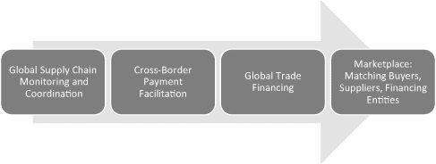
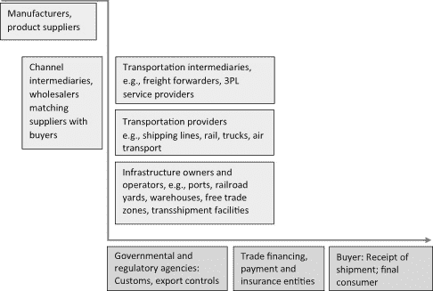
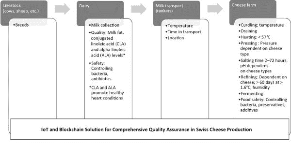
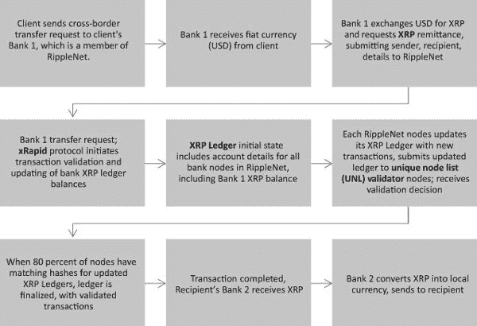

# 5

# 全球供应链与贸易融资

在第四章和第五章中，我讨论了稳定币和去中心化金融（DeFi）中取得一些成功的区块链试点项目，这些项目有能力逐渐达到企业级规模的应用。本章考虑另一个有趣的应用：全球供应链及其贸易网络。我还考虑了贸易融资和跨境支付在这些全球贸易网络顺畅运行中的互补作用。我检查了这些领域的区块链试点应用及其成功程度。

全球贸易连接了供应链、跨境支付、贸易融资和将买家和卖家匹配起来的市场。

+   供应链管理商品从供应商到买家的流动，并使合同方能够按时并根据协商的价格和合同条件交付成品。价值链（追踪客户价值从研发到制造和营销的各个阶段）分布在多个国家；材料、零部件和子系统需要按顺序提供，以完成成品。这样的价值链得益于参与价值创造的企业、运输提供商和监管机构的配合，这些监管机构监测多个法律管辖区遵守不同的规定。

+   跨境支付是完成全球供应链支付所必需的。安排此类支付是复杂且耗时的，可能涉及高昂的费用和从获得监管机构批准开始的延迟。在这些步骤上，进展可能对交易各方都不透明。在每一步，为所提供服务支付是转移控制和所有权到供应链中下一个行动者的必要条件。同样，支付延迟可能会延迟进一步的运输，并负面影响供应链的表现。

+   贸易融资催化了通过供应链进行的全球贸易，无论是在开放账本还是通过更传统的信用证（LC）进行。换句话说，卖家可能会接受买方提供的信用证并最终获得支付，或直接向客户提供信贷。当直接提供信贷时，卖家可以在信贷期限结束时从他们的客户那里收款，或者通过贴现应收账款，立即以折现金额增加其流动性。同样，买方可能需要获得融资以向卖家提供可接受的支付条款，并且获得此类融资可能取决于合同履行和收货的证明。

+   匹配供应链中互动的买家和卖家的市场服务是双方的逻辑延伸。此类匹配将基于在搜索标准中界定的需求，并且还可以为银行提供贸易融资和其他帮助减轻贸易运输风险的保险公司等其他服务提供商提供价值。

图 5.1 展示了这种集成的全球供应链的观点。

因此，如图 5.1 所示的理想全球供应链解决方案应该集成高效的供应链运作、跨境支付促进、贸易融资以实现这些支付，最终，还包括将买方与供应商以及其他供应链参与者和贸易融资实体连接起来的市场。

最初，一个基本的供应链解决方案可以与第三方贸易金融、跨境支付和市场解决方案相连接，创建一个生态系统。随着时间的推移，每个环节的主导企业可能会选择进入相邻市场，提供集成的一站式解决方案，试图用一个从中心控制的集中式层级模型替换去中心化的协作生态系统解决方案。在下面的章节中，我将讨论在全球供应链这些关键组成部分中已经开发和测试的区块链试点。

图 5.1

集成全球供应链

## 全球供应链

供应链是企业级区块链应用试点的众多试验场之一，这些试点已经启动并发展到 operational scale。区块链的使用可以满足供应链中许多紧迫的需求，从而最终提高性能。例如，部署区块链可以为供应链提供及时准确的信息，这些信息是安全的，且*难以篡改*，并有助于检测欺诈和假冒。不可变性和通过加密确保的安全性可以通过减少中介的参与来节省成本。由数据进入区块链触发的智能合约，包括来自物联网设备的数据，可以自动化交易，包括加快货物流动和加快支付。此外，区块链上可信赖的数据可以验证来源并加强质量保证，区块链内积累的数据可以成为未来供应链改进的分析洞察的基础。1

图 5.2

供应链参与者和合作者

供应链的本质是由来自各种行业的跨行业大小合作伙伴组成的。各方为实现项目目标而聚集在一起，然后又定期分道扬镳，无论是单次供应合同还是一段较长期的采购合作伙伴关系。图 5.2 列出了在全球供应链中参与货物移动的多样化的各方。上述所有各方可能需要被激励（甚至可能是被说服）加入区块链，以便该应用能提供比传统系统更多的好处。

### 文档在供应链中的作用

供应链中的这些参与者相互连接时，伴随着货物运输的是一大批重要的文件。这些文件证实了所有权、运输阶段、合规性以及所有权的变更。完整且准确的文件对于货物顺利到达最终目的地至关重要，因为正确填写、核实并正式分配的文件是货物清关和向下一阶段移交的必要条件。全球供应链在很大程度上运作缓慢，是因为它们大多数文件依赖于基于纸张的过程。冲突信息和丢失的文件会导致错误，并暂停交易审批。这会产生连锁反应，导致交货时间延长、货物状态和位置不明确，以及资本配置效率低下（由于对在途库存的投资增加）。

当买方使用信用证（LC）为其购买融资时，如果卖方想要收到付款，适当的文件和核实是必不可少的。开证行代表买方发出信用证，卖方在完成装运后提交该信用证。银行在履行符合信用证的装运单据后释放付款，然后期待按照协议条款从买方那里获得偿还。因此，开证行只有在核实贸易文件（例如，提单）符合信用证条款（货物描述、条件、数量）后，才会释放付款。此外，开证行将自行决定是否满足了信用证条款，如果它决定存在差异，必须在付款前获得买方的放弃或同意。换句话说，开证行不能单方面做出决定。2 因此，文件对于货物在供应链中介点顺利转移以及根据销售合同和信用证条款证明合规性以授权付款都是至关重要的。

电子数据交换（EDI）一直是传统供应链中文件传输的标准；信用证（LCs）通常以 SWIFT 网络内的 MT700 消息形式发出。任何运输过程中的变化都需要更新与变化一致的文件，以允许继续处理和进一步运输。中断可能源于合同条款的变更或出发地和目的地缺乏准确更新的信息。获取必要的修改文件可能是一个缓慢的过程，会导致延误并增加成本。在许多情况下，供应链参与者开发了与各地加速器之间的个人联系，以获取此类信息并克服瓶颈。

在供应链中引入区块链架构将提供一场革命性的、安全的、单一的真实信息源。不可篡改（可追溯篡改）的信息可以被信任，将取代非正式的个人网络，以持续更新的信息，广泛分布，并可供所有感兴趣的各方在去中心化的节点上使用。建立这样一个去中心化的网络需要与获取各种潜在生态系统合作伙伴的参与。每个合作伙伴（或节点）的技术理解和流程能力可能会有所不同。该网络将在不同的国家司法管辖区运行，试图遵守可能存在冲突要求的不同法律体系，同时实施仍处于发展阶段且远未成熟的区块链技术。然而，世界各地的成功试点提供了一个全球供应链可能的样子——无错误、安全、实时更新文档的成本较低。

### 配置理想的全球供应链

有效运作全球供应链有几个期望的特点，总结如下列表：3

+   • 将所有各方链接到供应链中

+   • 为每个参与者验证唯一 ID，包括制造商、货运代理、海关和政府机构、运输载体（船只、卡车、铁路、空运、港口）、第三方物流（3PLs）服务提供商和客户

+   • 使用物联网设备和传感器在运输过程中监控货物状况，并持续传输信息

+   • 及时（最终是实时）的信息可用性，更新变化，包括货物运单号、位置、存储特性如温度或湿度、状态变化（如控制权的转移）、清关完成、评估和支付的关税

+   • 与链上起源、保管跟踪和相关信息相关的可追溯性

+   • 对供应链信息的受控访问，仅限于特定于个别交易的各方

+   • 共享信息，将数据访问限制给相关各方，保持竞争安全和个人隐私，避免孤岛化和信息冗余

+   • 持续保持高水平的可追溯篡改安全

+   • 所有参与供应链实体之间的通用数据和传输标准，便于访问、协调、合作和验证

+   • 资产（货物、文件、支付）与合同条款相关的审批和价值转移。智能合约可以显著改进当前的纸质系统，合约执行由外部事件（预言者）提供的外部数据和物联网设备提供信息触发，此类更新信息表示合同条款的履行。

+   · 由于改进流程、减少错误、控制欺诈和减少运输途中的延误和时间而提高效率和降低成本

+   · 累积的历史货运数据，可作为预测、容量管理和根据市场状况调整定价的基础

+   · 最终，一个单一的真实来源，导致对合作伙伴和供应链效率及产出的更大信任

在供应链中部署区块链可以带来许多好处。可以实现将代币附着在商品上，随着商品在供应链中移动，当条件满足时，便于供应链成员之间转移所有权。这样的能力将使公司能够寻找新市场并准确评估风险，最终实现“灵活的需求链取代僵化的供应链”。4 这种区块链赋能的供应链还可以为有资质的供应商人员提供独特的可追溯标识符，使得供应链实体能够监控这些有资质人员在执行合同规定的关键活动，如食品链中的灭菌和消毒程序或增材制造环境中的篡改可追溯文件下载验证。

此外，提供端到端可见性的数字控制塔，包括供应链事件和相关业务指标的中央数据仪表板，可能是另一种选择,5 当嵌入式信任不那么重要且参与者数量较少且不发生变化时。从传统角度看，传统数据库管理系统可能在不部署尚不成熟或稳定的新区块链技术的成本和不确定性方面提供好处。6 然而，当高交易量使速度和自动化效率成为关键时，区块链提供了一种更优越的替代方案。7

鉴于区块链应用在克服供应链不足和提高其功能方面的潜力，我现在讨论 TradeLens，一个正在获得关注的试点应用。

### 马士基、IBM 和 TradeLens

TradeLens 是由马士基和 IBM 共同开发的基于区块链的全球供应链“公用事业”。马士基是一家丹麦的航运和物流公司，由马士基航运公司拥有和运营，是全球最大的集装箱航运公司，在全球经营着七十多个港口和码头。马士基在全球集装箱航运行业的市场份额领先，达到 16%，前五家公司在集装箱航运行业的市场份额达到 61%，形成了寡头垄断。马士基于 2014 年与 IBM 成立了一家独立的合资企业，以部署区块链技术并开发全球贸易平台。8 他们努力的成果就是 TradeLens，一个作为受许可网络的区块链解决方案，旨在服务整个行业并弥补当前供应链流程的不足。

TradeLens 是一个合资企业，马士基拥有 51% 的股份，IBM 拥有其余股份。由于所有权集中，TradeLens 与标准的区块链偏好——去中心化网络——有所不同。然而，这个合资企业旨在独立于马士基，总部设在新泽西，拥有独立的董事会成员。目标是保持 TradeLens 的中立性，即使在为供应链中的各个合作方提供服务时，也在 TradeLens 平台与马士基和其他集装箱船竞争对手之间设置防火墙，如图 5.2 所示。

IBM 是马士基的合作伙伴，有使用其超级账本区块链协议为不同行业供应链客户提供区块链解决方案的经验。IBM 认为在供应链背景下使用区块链及其超级账本协议有几个好处，包括数据整合和可视化，因为供应链信息可以同时安全地供供应链参与者使用；提高货物追踪、透明度和网络提供的数据信任；监控货物，例如确认原产地和血统（揭露并防止伪造尝试），追踪存储条件（例如温度、湿度），以及追踪危险或受限材料；以及实时解决由于供应链延迟、短缺和产品质量问题引起的问题（在食品链中尤其有用，因为食品安全至关重要，及时的知识可以提醒客户次优的运输条件、污染问题和法律合规问题）。一个众所周知的事例是 IBM 与 Everledger 的工作，后者已经在区块链上数字加密了超过一百万颗钻石，以促进追踪钻石（抛光和毛坯）从矿山到零售店的旅程，并提供不可篡改的钻石分级报告链接。9

TradeLens 旨在提供所有必要的供应链数据和信息，以跟踪和追踪货物，为管理供应链的所有参与者提供“端到端的供应链可见性，以便他们能够安全、无缝地实时交换信息”。10 数据隐私保护是 TradeLens 的一个关键特性，确保只有参与特定货物的公司才能访问与该货物相关的信息。TradeLens 旨在提供无纸化贸易功能，使用户能够“在组织边界之间安全地提交、验证和批准文件”，访问和批准权限因受信任的利益相关者集合而异。随着其扩展到包括更广泛的供应链参与者，包括马士基的竞争对手和独立的供应链实体（如海关机构和渠道中介），对客户的实用性会增加。因此，为了测试和试点 TradeLens，IBM 和马士基必须招募并说服几个行业的独立公司加入 TradeLens 区块链。此外，TradeLens 团队还必须开发长期的货币化策略，以收回构建和运营区块链的投资，同时奖励为创造价值做出贡献的各种 TradeLens 成员。

TradeLens 的设计和实施为全球供应链领域成功的区块链应用提供了指南针。TradeLens 解决了困扰全球供应链的几个问题。它能够满足每个 TradeLens 供应链成员的需求，从而增加了其实用性，并激励关键供应链实体加入 TradeLens，加入的关键因素是自愿的。TradeLens 的架构包括为每个供应链参与者验证身份以确定交易访问和读写权限，并为每个成员的数据提供加密保护，以增强网络信任。这是通过 TradeLens 网络选择从每个网络成员收集的相关数据来实现的，利用物联网设备和传感器获取实时数据，更新状态变化，涵盖货物位置、流向以及清关和评估关税等状态变化。

进一步地，TradeLens 使用像代币和补贴这样的机制来补充自动化数据收集，并促使其成员及时提供和更新数据。区块链固有的不可变性，加上时间戳和通过加密链接的数据块，创建了一个审计跟踪，确定了来源，有助于可追溯性、保管跟踪和相关文件的确定。多个隐私层和访问协议决定了成员可以访问哪些层面，限制了数据访问仅限于每笔交易的相關各方，同时在避免孤岛化和信息冗余的情况下提供竞争性的安全。公共账本之间的数据共享协议允许供应链数据在需要时与外部方共享。

作为一个在部分信任环境中的商业应用，TradeLens 使用 Hyperledger Fabric（区块链协议）来创建一个权限投票为基础的共识方法，从而实现快速共识和最终性，以及易于察觉的安全性。作为共同所有者，马士基（Maersk）和 IBM 设定了共同的数据和传输标准，例如 API 标准，允许第三方向 TradeLens 添加新模块和附加功能。这些共同标准对于网络成员之间的易用性、协调和协作至关重要，这些成员拥有不同的 IT 配置。在使用 Hyperledger Fabric 时，TradeLens 可以在不直接访问账本状态的容器环境中运行一个单独的智能合约层，特定对等节点（取决于交易）为给定智能合约的正确执行背书。智能合约执行是由分布在整个供应链的 IoT 设备提供的数据触发的，它可以授权货物和文件的转让以及批准支付。

使用 TradeLens 可以消除数据孤岛，并整合来自包括托运人、3PLs、港口、货物终端、海洋和内陆承运人、海关当局和金融实体等多个来源的数据。这种高效的数据共享可以减少错误，发现欺诈，减少供应链管道库存和工作资本，从而节省时间和成本。作为一个集体，经过成员批准，TradeLens 的匿名化数据可以与数据分析相结合，提供参与方之前无法获得的贸易流动和物流能力洞察。随着 TradeLens 使用率的提高，积累的历史货运数据可以作为预测、管理能力和定价的基础，而聚合数据如果出售给感兴趣的行业参与者，可能成为潜在的收入来源。

当然，TradeLens 面临着竞争，来自其他竞争性解决方案，它必须克服客户对更换经过验证的现行做法的抵触。此外，TradeLens 必须说服独立的供应链实体通过使用其区块链解决方案来协作。关于扩大 TradeLens 市场接受度以及让来自几个相关行业的公司在一个生态系统中共同工作的挑战，在第六章中进行了更详细的讨论。

### 政府间协作：eTradeConnect，全球贸易连通性网络

如上所述，政府机构对供应链中商品顺利流通至关重要。政府可能会对允许由私人、盈利性公司建立的供应链设定区块链生态系统的网络成员条件表示不满，并可能拒绝合作。如果没有国家海关机构的参与，供应链将显著减缓，从而抵消链条其他部分改进的积极效果。因此，一些国家和政府资助自己的供应链网络也就不足为奇了。

香港金融管理局（HKMA）与国际银行启动了一个贸易融资试点项目——eTradeConnect——以解决贸易融资障碍并降低风险。11 在试点中融入并测试的功能与 TradeLens 中融入的功能相似，其中包括一个受许可的区块链，以向贸易交易和生态系统的所有成员提供标准化的数字化数据，以及基于区块链共识验证发票、采购订单和提单的真实性。该网络能够发现“重复融资”的企图，避免欺诈，伪造发票需要伪造相关的采购订单和提单，这些采购订单和提单是由多个参与交易的相关方数字签名的，这会警告他们有篡改尝试。政府资助使得监管机构能够影响贸易融资应用的设计，这促使人们更加重视让监管机构能够访问持续更新的数据，以确定货物的来源和遵守制裁措施和出口控制。金融管理局推出了一个类似的网络贸易平台。12 这是一个一站式贸易和物流网络，连接国内和国外公司跨贸易价值链。

两国形成了一个全球贸易互联互通网络（GTCN），连接了新加坡的 NTP 和香港的 eTradeConnect。13 政府的合作使得影响这两个国家之间贸易的司法和法律差异得以调和，并促使专业从事亚洲贸易金融的银行加入其中。GTCN 是一个基于区块链的区域和全球贸易网络，它允许香港和新加坡的本国公司接入彼此的国内贸易平台，从而在提高透明度、诚信和贸易流的安全性的同时，增加他们接触全球贸易机会的途径。通过 GTCN，香港和新加坡的公司可以与两国监管机构和贸易参与者互动，并在货物到达后更接近的时间获得融资，从而优化在贸易应收账款中占用的营运资本的使用。

### 物联网传感器与供应链：Ambrosus

有许多场合需要记录使用的原料和成分、来源、生产条件、运输条件以及质量标准，以便区分商品并满足合同条件和满足最终用户的需求。此类数据也是提供篡改证据和防止仿冒品的关键。如前所述，正在运输的货物除非伴随文件准确并被相关方接受，否则无法清关。数据绑定代币是一种将数据和货物结合在一起的方法：代币代表货物，物联网传感器积累额外的生产线和运输数据。此类数据包括商品及其原料、零部件和组件的来源，生产过程条件的数据，以及运输和交付过程中温度、湿度和其他条件的处理和存储数据。

所有这些都可以附加在通过区块链在运输途中伴随货物的代币上，供供应链中的控制和所有权变更使用。在制药行业，药品来源和追踪运输对于检测和防范假冒药品以及监控未售药品返回到制造商至关重要。在鸦片等受控药品的情况下，监控处方数据和补药至关重要，以防止过度使用和上瘾及其有害后果。14

如果能够使物联网传感器安全且防篡改，当它们与区块链网络连接并使用智能合约来自动化交易时，它们可以成为实时数据的来源。一旦上线，它们将持续提供更新数据以跟踪装运，监控质量指标，评估设备状况和维护准备情况，并帮助减轻风险。物联网传感器自主与其它传感器和机器通信，为从整个网络部署的物联网传感器群体中产生新服务收入和数据货币化创造了可能性。15

Ambrosus 提供了一种解决方案，它将物联网实时传感器和电子身份识别与区块链相结合，以提高供应链的透明度，提供质量保证，并防止假冒。16 Ambrosus 基于以太坊，并在智能合约中代表客户及其供应链之间的协议。Amber 是用于支付活动和交易的原生代币，例如创建一个代表正在运输的托盘或项目的数字资产。数据与 Amber 代币绑定，并发送到网络，遵循供应链中的产品或批次，作为数字账本来确保信息的安全和透明传输。Ambrosus 的架构由四个相互关联的模块组成。Trace 模块从物联网设备生成数据，而 Edge-Gateway 收集和分析物联网生成的数据，并与第三模块，即 Ambrosus 区块链通信，数据在此安全存储并按需在参与者之间交换。最后一个模块是一个仪表板，允许 Ambrosus 客户检索、查看并进一步分析他们的数据。

使用 Ambrosus 的瑞士奶酪生产商可以向客户保证，关于每年从瑞士出口的七万吨奶酪的生产和来源。消费者关心安全和质量，因此跟踪生奶酪的产地、生产和交付条件；监控奶酪成熟和储存过程中的温度；并防止在奶酪中生长有害细菌造成污染至关重要。他们还希望了解制造过程的环保性、雇佣条件、动物福利、牲畜饮食和卫生情况。奶酪的营养品质是一个区分因素，并且会根据各种条件而改变。

Ambrosus 的物联网传感器与区块链相连，可以提供所有这些因素的数据。瑞士奶酪行业中的多家公司可以利用物联网传感器在整个生产价值链中的数据，提供牲畜来源的验证，而来自奶牛场和牛奶运输罐车的物联网设备可以验证牛奶的收集时间和温度，以及随后由罐车接收的时间和温度。奶牛场的物联网传感器还证明牛奶中的细菌和抗生素含量以及共轭亚油酸和α-亚麻酸，这些与抗炎效果和重要的奶酪质量考虑有关。

此外，牛奶罐车上安装的物联网传感器记录了运输过程中的温度和时间以及奶酪生产设施的交货时间。在奶酪生产过程中，各种与质量相关的传感器数据在奶酪加工的各个阶段被捕捉，例如牛奶凝固的温度、压榨（去除水分）的条件、盐腌的时间和程度、精炼过程中的时间和温度，以及指向发酵过程控制的关键测量值。物联网设备在区块链中捕获的数据有助于确保购买者对所提供瑞士奶酪的质量有所保障。17 图 5.3 说明了来自安全物联网设备的数据，这些设备与区块链相连，以帮助验证来源和质量。

图 5.3

瑞士奶酪行业的物联网和区块链解决方案。来源：Ambrosus，“Swiss Cheese: Protecting High-Quality Food Exports of Switzerland，”第 14 页（2020 年 5 月）。

### 食品安全信任网络：关注易腐食品的安全、新鲜度和浪费

2011 年的《食品安全现代化法案》增加了监管力度，以应对食物中毒病例的增加。IBM 的食品安全信任网络 18 是一个供应链应用程序，旨在通过与 Dole、Kroger、雀巢、泰森食品和沃尔玛等食品行业领导者合作，实施区块链解决方案来确保食品安全。该项目首先关注食品安全，力求在几秒钟内安全追踪产品，帮助确定和减轻污染源，并减少可能必要的召回的经济负担。其次，该项目强调食品的新鲜度，利用区块链提高供应链的可见性并优化保质期。第三，关注食品的新鲜度和早期减轻污染有助于减少食品浪费并最大化保质期。这些目标共同帮助优化食品供应链，使行业能够有效地应对召回。这种供应链的改进也有助于实现可持续性目标，提高食品质量，并认证来源——后者在有机和肉类替代品市场上变得越来越重要。

一个典型的例子是在新英格兰扇贝捕捞行业中使用食品信任区块链应用程序。新贝德福德扇贝的上乘口感和品质使其售价较高。该行业担心其他地区的劣质扇贝会被错误地宣传为来自新英格兰并以高价出售，从而损害新贝德福德扇贝的声誉。食品信任实现了来源追溯，向餐厅老板、厨师和他们的客户证明这些扇贝确实来自新贝德福德。另一个好处是，这些扇贝可以追溯到个别渔船的具体捕捞，对于担心诸如过度沙质的扇贝等问题的厨师可以向渔船船长通报，然后船长可以采取措施改进未来的捕捞实践。19

## 跨境支付

2022 年跨境支付流量预计将达到 156 万亿美元。20 它们本质上是复杂的，导致支付状态（是否以及何时完成）不透明，处理支付的成本高昂（每笔交易估计为 25-35 美元），21 付款延迟，确切应支付给收款人的金额不明确，在支付处理过程中流动性受限，以及由于时区差异和各种收款国有限的营业时间而导致的支付服务的时间可用性有限。

如果发送方的银行在新泽西州没有分支机构，它需要与一家代理银行合作，该银行可以通过其网络将支付款项汇至该国家。由于这笔支付是在国外使用已转账的资金进行的，发送方及其银行希望防范结算代理人失败的的风险，这可能导致支付未能完成，以及可能无法取回已转出的资金。降低结算风险的一种方法是使用收款国中央银行及其实时结算系统（RTGS）。在该系统中，中央银行储备用于实时结算，义务在发生时立即履行。RTGS 取代了银行之间的延迟净基础结算，其中两家银行计算在定义期间内的所有流入和流出，并结算一方欠另一方的净金额。这种延迟净结算方法可能会累积信用风险。然而，中央银行限制了对此类 RTGS 账户的访问，并且很少有银行具有在全球范围内运营 RTGS 账户所需的规模。进一步的复杂性来源包括以下几点：

+   - 在收款国缺乏存在感需要找到具有必要国内存在感的代理银行，并获取访问 RTGS 系统以及伴随的银行费用（资格条件可能限制银行访问一个国家的 RTGS）。

+   - 全球代理银行的数量一直在下降，迫使使用代理银行的一系列链，最终银行在链中具有必要的国内存在感和访问 RTGS 系统的能力。这增加了处理和最终确定跨境支付所需的时间。

+   - 参与处理跨境交易以最终确定支付的银行众多，每个银行节点都会产生处理成本，从而增加总成本并延迟支付。

+   - 在与链中其他银行通信时使用不同的消息标准迫使银行采用手动而非自动处理来解读消息细节，这一切都可能增加支付处理时间。有尝试实施全球支付消息标准，如 SWIFT GPI（全球支付计划，SWIFT 会员银行可用）、ISO 20022，以及使用法律实体识别符唯一标识参与全球支付的每家银行。

+   - 发送方的透明度不足：由于跨境支付可能涉及多家银行，发送方可能无法跟踪支付在其经过的银行链中的进展。原始银行通常无法追踪支付进入下一个环节。这种透明度的缺乏也适用于银行链收取的费用、转换后收款方实际收到的金额以及支付完成的时间。

+   - 中央银行的实时全额结算（RTGS）系统运营时间受限，加之时区差异，导致跨境支付进一步延迟。

+   - 互操作性问题源于不兼容的传统系统（大多数银行使用大型主机进行高速、大批量交易处理，并通过中间件层支持与新兴应用的交互）以及使用创新新技术的新进入银行与传统 RTGS 系统之间的不兼容。RTGS 系统可能在适应区块链基础跨境支付解决方案中用于验证交易详情的共识验证算法方面存在限制。

+   · 缓慢而繁琐的支付流程导致资金被困，因为参与资金转移的实体可能需要根据规定留出资本来覆盖结算义务。实体可能还需要提前为“nostro”账户预付资金作为抵押，并在跨境交易启动前获取外汇资金。（Nostro 账户是银行在境外 correspondent 银行持有的账户，它们在外汇交易过程中作为抵押品来覆盖风险。）大型银行有规模优势，可以采用持续链接结算（CLS）22，以一种流动性高效的方式跨时区结算外汇交易。

+   · 涉及洗钱、客户身份识别、制裁合规以及网络风险控制和弹性的法规在各国之间存在差异，当执行跨境支付时，这会增加银行的总体合规成本。

### 政府简化跨境支付的努力

加拿大银行的项目 Jasper 和新加坡金融管理局的项目 Ubin23 分别是解决上述跨境支付问题的试点项目。Jasper 和 Ubin 探索了基于分布式账本技术（DLT）的结算，用于不同区块链平台上的代币化数字货币。项目负责人指出，有其他替代 DLT 技术的方案，但提出“与集中式方法相比，DLT 可能提供更简单、更快速的采纳路径，因为它可以让不同司法管辖区控制其网络部分，同时允许与网络其他部分紧密集成。”24 试点项目使用了哈希时间锁定合约（HTLCs，一种智能合约），以确保所有证明支付必要事件的发生。HTLCs 涉及锁定资产，要求收款人通过加密支付证明在规定期限内确认收到，否则付款将退还给发送方。HTLCs 消除了需要中介（即 correspondent 银行）持有托管账户以确保满意交易完成的需求。此外，试点项目在加拿大的 Corda 和新加坡的 Quorum 上使用了两个不同的区块链平台，测试了互操作性问题。

试点项目考虑了各种模型，包括让中央银行 RTGS 系统充当“超级 correspondent”25，取代当前的中介 correspondent（商业银行）链条，并使用可用于批发银行支付和结算的 CBDC 代币。26 项目负责人指出，批发 CBDC 模型可能基于区块链，但其他技术也可能是可行的。

在批发 CBDC 模型中，CBDC 可能是特定货币的（即与加拿大元、新加坡元、英镑等挂钩），并且可以在银行或客户的母国之外进行交换，商业银行持有多个 CBDC 钱包（不同货币）与其母国中央银行。然后，每个中央银行都需要支持多个 CBDC 代币。多个 CBDC 的替代方案可能是一个与参与政府的货币篮子挂钩的通用 CBDC，并被所有这些政府接受。

实施如上所述的批发 CBDC 模型将需要各国政府就设定将本国货币转换为通用批发 CBDC 的汇率程序达成一致。必须设立一个交易所来发行和赎回此类 CBDC，并制定明确的规则，允许它们用于结算跨境交易。CBDC 平台需要全天候运行，并与实时全额结算（RTGS）平台并行运行，以便在其银行和中央银行之间以及跨国界使用 CBDC 进行结算。每个国家都必须设定银行（或其他结算账户持有者）持有另一国家数字 CBDC 钱包的资格条件，而无需拥有 RTGS 账户。这样一个模型需要时间来实施，因为各国和中央银行需要实施立法来接受通用 CBDC，并将通用 CBDC 纳入其货币政策管理。各国需要就 CBDC 如何可以用中央银行储备作为抵押达成一致，因为一国储备的汇率风险将是另一国持有的 CBDC 的抵押品。

此外，作为金融资产、价值储存手段、交换媒介以及用于投机的通用 CBDC 将会在模型中引入一个单一的失败点。这是因为 CBDC 由单一实体控制，即中央银行或其等效机构，若遭到黑客攻击，可能会危及其作为数字货币系统基础数字层的完整性。加拿大和新加坡在 Jasper 和 Ubin 试点项目的五个连续阶段上携手合作，最终阶段的报告于 2020 年 7 日发布，报告成功开发了原型应用程序，并描述了金融行业的益处。该项目有助于证明基于区块链的支付网络的商业价值，并在原型 CBDC 网络与其他区块链网络之间建立了连接接口，同时也支持特定的用例，比如贸易金融支付的托管和私人交易所的货银对付。27

为了解决跨国支付固有的问题，一种具有创新性的区块链解决方案将提供几个功能。首先，升级后的、标准化的支付消息协议将允许共享数据。其次，它将结束与客户尽职调查和验证合规性相关的步骤的重复。第三，区块链将使银行网络更容易接受和共享数据，例如由对手方提供的尽职调查数据，这也需要在 jurisdictions 之间进行协调立法。第四，通过与自动智能合约执行协调的 RTGS 系统的扩展可用性，消除了商业银行不同步的营业时间的影响，并为 RTGS 系统提供更广泛访问，特别是对于小型银行和非银行支付提供商。

最后，区块链解决方案将为第三方提供更大的创新范围（例如，为客户身份识别和尽职调查提供的附加 Dapp）。成功的应用程序将提供客户成本更低、透明度更高的结果，银行被困流动性减少，以及中央银行及时获得跨境支付总量及其方向的数据，这将导致增加韧性、降低系统性风险，以及更好地了解跨境支付市场的趋势。

### 瑞波 XRP 与跨境支付

跨国汇款，依赖数十年的 SWIFT 银行间消息系统，是一个充满问题的过程。跨国汇款费用高昂，完成汇款可能需要几天时间，汇款人不知道实际使用的货币兑换率，整个过程都是不透明的，汇款状态不明确。在复杂且缓慢的过程中，发款银行必须与全球银行网络中的代理银行连接成链，发款人需要等几天才能收到转账完成的确认。此外，参与促成此类转账的银行必须在各个汇款走廊上维持多种外币的流动性余额，这增加了它们的营运资本需求。尽管之前讨论过的通用 CBDC 模型提供了一种解决方案，但需要多个主权政府之间的合作，以及随之而来的额外的货币政策影响，使得私人数字货币成为一个吸引人的替代方案，以平滑跨国支付，也使它们成本更低，透明度更高。私人公司已经进入这个领域，被这个有大量潜在客户的市场和随之而来的利润机会所吸引——如果他们能成功地为客户解决成本、速度、透明度和监管问题。

Ripple 就是这样的私营企业初创公司之一，它推出了自己的数字货币 XRP，以提高跨境支付的效率。Ripple 正在通过区块链技术进行创新，以更好地服务于对现有解决方案不满意的客户。28 Ripple 的区块链解决方案包括几个组成部分。它开发了一种数字货币 XRP，用于跨境转账。与此同时，它还开发了 XRP 账本，这是一个为其客户提供服务的分布式账本网络，用于不断更新和存储客户的跨境支付交易和账户余额。之后，它开发并实施了 xRapid，一个开源的区块链协议，用于验证交易、更新账本和完成转账。Ripple 还开发了其独特的节点列表（UNL），29 其中 UNL 是由选定的可信节点组成，这些节点是唯一被授权集体验证和更新账本以及新的交易和余额的节点。30

数字货币 XRP、XRP 账本、xRapid 协议和 UNL 与 RippleNet 集成，后者是 Ripple 的金融网络，银行和金融机构如果希望使用 Ripple 发起和管理跨境支付，就可以加入该网络。RippleNet 的关键创新之处在于，客户可以用他们选择的任何国家法定货币兑换 XRP；近乎即时、安全且低成本地转移 XRP；然后立即将收到的 XRP 兑换为交易另一端的当地货币。这是因为 Ripple 说服了多个国家的加密货币交易所列出 XRP 进行交易。这使得参与发送或接收 XRP 的实体可以使用交易所购买或出售其 XRP 持有物，这些交易所支持的国家货币包括美元或欧元。XRP 在这些加密货币交易所的交易量和交易增长逐渐提高了 XRP 的流动性，以及与各种法定货币的便捷兑换，这有助于交易对手方愿意使用 XRP 满足其跨境汇款需求。

随着更多银行加入 RippleNet，通过不同的代理银行转移资金的多个路由路径开放。代理银行形成一个网络，银行可以通过这个网络与一个没有运营的国家中的客户进行操作，使用一系列网络银行最终到达客户。这些银行集团通过 RippleNet 合作进行转账，创建了一个网络，不同的网络可以竞争以较低的费用完成转账。这导致了一个竞争性的转账费市场，使发送客户能够访问最低成本的转账。客户首先向 RippleNet 发起请求，将 XRP 跨境转账，使用 xRapid 协议管理转账。XRP 账本维护交易记录（每两秒更新一次），一旦大多数节点验证了账本的最新状态，XRP 转账即完成，支付最终确定。结合 Ripple 的各种功能，使其能够颠覆跨境汇款市场，以 SWIFT 的代价增加其市场份额，并在这一支付领域成为主要竞争者。

Ripple 与 SWIFT 竞争，后者是自 20 世纪 70 年代以来银行一直使用的全球金融信息系统，用于其跨境汇款。Ripple 必须说服关键汇款走廊上每一对国家监管机构授权在其市场内使用 XRP 及其兑换为当地货币。它还必须培养一个 XRP 交易市场，以便 XRP 所有者可以将其兑换成法定国家货币和其他资产。这样的市场对于 Ripple 客户接受 XRP 作为跨境支付的基础至关重要。

尽管 Ripple 希望其客户使用 XRP，但 Ripple 也允许银行使用 RippleNet 和 xRapid 来转移法定货币，费用低于使用 SWIFT 的成本。银行然后在各个国家管理自己的不同货币的流动性余额，而不是维持一个以 XRP 计价的流动性池跨多个汇款走廊。银行因此可以利用 RippleNet 而不是 SWIFT，在保留其现有的 KYC、AML、制裁筛查和合规监管流程的同时，以较低的成本获得实时结算的好处。

随着银行对使用 Ripple 变得熟悉并验证其好处，它们可以决定是否也开始使用 XRP。Ripple 为其使用 XRP 的银行客户提供按需流动性服务，收取费用，使银行客户能够在任何特定国家获得所需的 XRP 余额。使用 XRP 的银行客户将直接受益，因为它将降低其流动资金，无需在各个汇款走廊的不同外币中建立 nostro 和 vostro 账户。交易费用以 XRP 支付，然后燃烧（转移费用中收到的 XRP 被取出现役），从而减少 XRP 的供应并逐渐提高其价格。

一旦监管机构和银行对数字货币的担忧得到满足，瑞波币便小心翼翼地在 RippleNet 上建立银行和非银行金融机构的生态系统。然而，成为 RippleNet 节点相对容易，这可能对 RippleNet 上的银行造成声誉损害：如果暗网用户在 RippleNet 上形成节点，他们可以提交和请求对非法转账的验证。瑞波币的治理机制（目前由瑞波币主导）将是防止此类事件的主要保障。

随着使用 XRP 的需求增长，XRP 的价格上涨，提高了瑞波币的数字货币库存价值。这使得瑞波币能够定期将 XRP 转换为运营资金，为其提供资本来折扣 RippleNet 和 XRP 账本使用费，补贴低价，所有这些都有助于吸引新客户加入瑞波生态系统。因此，在瑞波币创立时创建并归瑞波币所有的 XRP，为瑞波币提供了资金来培育市场，实现正面的网络效应。图 5.4 总结了形成瑞波币颠覆性商业模式的关键事件流程。

早期采用瑞波币的大多是较新、较小的挑战性银行和非银行金融科技企业。随着使用 RippleNet 的机构数量增加，RippleNet 网络对新客户更具吸引力，增加了对 XRP 的需求，刺激了 XRP 的交易量。瑞波币的成功对大型银行构成了威胁，因为 RippleNet 的日益普及将减少通过花旗、巴克莱、汇丰等主导这一市场细分的大型全球银行进行跨境汇款业务的量。SWIFT 推出了其 GPI，提供当天跨境转账、费用透明和支付全程追踪，降低了其银行客户转向瑞波币的动力。

因此，尽可能快速地增长 RippleNet 符合瑞波币的最佳利益。其目标是在 CBDC 和稳定币以及不断发展的 SWIFT 网络之前，将汇款流量从大型银行和 SWIFT 系统转移到自己的网络，确立了其作为 XRP 的替代品。瑞波币的颠覆尝试建立在提供较低的跨境汇款费用、资金几乎瞬间转移、实时验证转账和收款、转账时已知的汇率以及如果客户选择用 XRP 替换其在转账中使用的多种货币，将减少工作资本需求的基础上。当然，像 XRP 这样的私人数字货币提出了稳定性、系统风险和跨境监管等问题，如第三章所讨论。

图 5.4

瑞波币跨境汇款颠覆过程

## 贸易融资

在开放账户条款下的贸易融资是一种越来越受欢迎的全球贸易支付安排。31 在开放账户条款下，卖方将货物运送给买方，买方在一定期限内支付，即三十、六十或九十天。卖方/托运人承担买方不支付的风险，导致卖方获得信用保险，这是全球贸易和贸易融资的额外成本。此外，银行不愿意为全球贸易融资，因为不诚实的公司可能会试图使用同一采购订单（纸质文件）并伪造这些文件，从多家银行获得同一船货的融资。结果，中小企业（SMEs）更难从银行获得贸易融资，这限制了它们的成长。

分布式账本技术的应用能够通过认证的数字化采购订单、提单和发票来减少此类欺诈行为，提醒交易对手注意同一船货的重复融资企图。使用 DLT 技术可以追踪文件流程，记录交易演变，并通过与智能合约的链接——根据提单和货物的实际发运、到达、所有权交割证明——释放融资，所有这些都使用实时数据。有了更大的确定性、安全性和防欺诈保护，银行将能够以降低风险和利率向中小企业放贷，为卖家和银行都提供了新的收入增长来源。

### 香港金融管理局在贸易融资方面的试点项目 32

鉴于迫切需要改善贸易融资环境，香港金融管理局作为监管机构，与香港的几家大型全球银行合作，开发了一个基于 DLT 的贸易融资平台的试点项目。目标不仅是开发一个“技术原型”，还包括对 DLT 如何潜在地解决与贸易融资相关的广泛商业、监管、法律和技术问题进行深入调查。33

试点贸易融资解决方案设计包括一个基于区块链的数据层，用于在参与者和节点之间分配数据，以及一个业务应用程序用户层，从供应商到客户捕捉货物运输及其融资的多个步骤。银行可以用自己内部的“贸易融资和贸易系统”替换试点中开发的业务应用程序层，并使用自己的用户界面，连接到基于区块链的数据层。因此，区块链应用程序可以作为银行遗留系统的中间解决方案进行链接。

业务用户层模拟贸易融资中的事件链。有供应链参与者、物流运营商和货运代理商等节点，类似于 TradeLens 平台。监管机构，如香港金融管理局，可以加入该平台，以获取访问数据层和控制、合规目的。中小型企业和大公司都可以请求融资、提供文件、建立身份等。

供应链参与者和监管机构的 inclusion 对于贸易融资的有效提供至关重要，因为他们控制着可能触发释放批准贸易融资额度分层的智能合约的事件。一个整合了 TradeLens 和贸易融资平台的解决方案将是自然演变，并作为全球贸易中卖家和买家都非常有用的区块链应用出现。

治理结构是设计和实施贸易融资解决方案以及从试点扩展到商业规模使用的关键部分。香港金融管理局开发的贸易融资原型允许融资实体、交易对手、监管机构和其他必要的各方参与，以验证合同条件是否得到满足。治理必须明确指出哪些数据将存储在链下，以提高网络性能，保护数据隐私，并降低成本（在区块链中存储链上数据是昂贵的）。

治理还扩展到建立争端解决机制，特别是在跨境贸易中，其特点是被多个、不同且可能冲突的国际司法管辖区所界定。（特定司法系统的公平性和执行合规性是相关问题。）由于一个设计良好的解决方案将吸引大多数供应链参与者，并通过创造就业、出口收益和出口部门竞争力来增加公共福利，因此，公共部门在所有权和治理中的参与，创建一个公共事业，可能是一个有价值的发展。34

## 贸易市场

在全球供应链中，买家和服务器开始互动之前，他们需要找到对方。一旦找到，他们会进行谈判，以确定他们是否能达成令人满意的销售协议，明确双方都同意的合同条款。尽管买家可以是零售消费者，但这里重点是 B2B 交易，以及工业买家以大量合同形式为内部流程使用或最终销售给终端用户。在 B2B 情况下，买家可能会选择能够满足他们详细规格的卖家。

例如，在大量采购服装的买家中，规格可能包括所用纤维的性质、制成布料的织造过程、使用的特定染料和颜色、图案的印刷或完成过程、成衣设计、缝纫质量、每种颜色、面料和图案的尺寸和数量，以及使用的附件如纽扣、标签和护理说明。买家可能希望在每个订单中指定包含在总协议内的数量、每个货物的目的地、储存条件、转运点，并遵守海关和其他出口法规。买家还可能希望控制生产条件、环境问题以及有害废物的适当处理、公平对待工人、避免童工、支付公平工资，以及在性别、民族团体和宗教方面的平等待遇。

买家还可能希望确保知识产权保护（即 proprietary designs）并管理外汇波动的影响。由于全球供应链涉及与位于多个地理位置且受不同法律管辖区约束的供应商签订合同，买家可能发现难以验证卖家遵守合同条件的能力，例如技术能力、生产设备范围和总工厂产能、充足的流动资金、确保及时生产合同产品的人员水平、与类似商品相关的最低经验水平、其他客户对该卖家的满意度，以及整体商业声誉。

买家在验证卖家能力、经验和信誉时可能遇到的困难，导致了中介机构的使用。中介机构可以接管筛选卖家和将买家与能够满足他们期望的卖家及具备必要能力的卖家进行匹配的关键职能。他们为这些服务收费，但减少了买家的风险，并增加了买家找到满意供应源的可能性。利丰公司（Li & Fung），总部位于香港，就是这样的中介机构，拥有超过一百年的经验，并在亚洲及其他地区拥有大量潜在的卖家和合同制造商。35 利丰公司利用其员工对卖家的能力进行审计和验证，在将其作为潜在的供应源提供给符合其买家客户愿望清单的卖家之前。

随着时间的推移，出现了具有上述特点的颠覆性在线市场，与像利丰这样的公司提供的传统匹配服务展开竞争。虽然利丰专注于 B2B 应用，将企业买家与商户供应商连接起来，阿里巴巴（淘宝）和亚马逊则为零售卖家提供建立网上商店的机会，并与阿里巴巴和亚马逊的客户建立联系；利丰也发展提供类似功能。这些在线市场作为平台运营，通常是多边的，向买方、卖方和其他供应链参与者如货运公司、货运代理、金融机构和保险公司开放。他们可能为买家提供免费访问甚至补贴，以吸引他们加入平台，同时向卖家和其他方收取中介接入费用和佣金以获取收入。

如同其他在线平台一样，这些在线市场也受到同侧和跨侧网络效应的影响,37 随着卖家数量的增加和合同制造商的增多，吸引了更多的买家；其他买家（竞争对手）也纷纷涌入这些平台，在寻找潜在供应伙伴的过程中获得了满意的结果。应用接口的质量、易用性、隐私保护以及控制提供商访问网络的质量控制程度都是决定在线平台使用程度的重要因素。与大多数受网络效应影响的平台一样，可能只有少数几个平台能够生存下来，形成寡头垄断，从而能够收取更高的中介费用，并 capture a greater share of the value created by buyer-seller interaction and contracting.

正是在防止在线市场寡头垄断和避免支付不断上升的中介费用的背景下，基于区块链的市场作为一种替代方案应运而生。区块链平台将允许买家和卖家直接相互交互，避免或减少中介费用。这类平台还可以提供托管账户，在提供性能证明后释放付款。如前所述，HTLC 可以用来执行付款与性能完成的同步交换。多个买家和交易积累的数据可以指导并更好地预测需求和市场趋势，帮助买家避免对过剩商品进行折扣处理。

为了使这样的聚合数据和相关预测可供网络成员使用，区块链的治理机制需要得到成员的同意，将他们的交易数据包含在聚合数据库中，然后开发算法进行数据分析。接下来，管理者需要为这些服务定价，为参与聚合必要数据以进行预测和获取成员同意向非会员提供此类趋势分析和预测服务的不同会员细分提供不同价格。来自外部客户的这些费用可以补贴区块链解决方案的进一步发展和升级。该平台还可以帮助管理此类交易产生的任何税务后果。

然而，建立这样的 P2P 区块链平台的关键是认证卖家；验证其经验、能力和声誉；并保证其绩效。IBM 和 Chainyard 最近的一次尝试就是 Trust Your Supplier 网络。38 一个共同的主题是利用区块链创建和使用本地区块链令牌来认证卖家和其商业声誉，卖家的令牌奖励用于满足合同承诺的高绩效。卖家的累计令牌可以作为声誉得分的代理，买方可以在选择替代来源时使用此类声誉得分，支持高绩效的卖家或合同制造商。供应商还可以用这些代币奖励忠诚的买家或合同续签，作为忠诚和重复业务的支付，代币可兑换卖家服务。

一个像 Trust Your Supplier 这样的平台专注于帮助企业找到合格可靠的供应商，它通过不可篡改的供应商认证满足 ISO 标准，可持续发展评级，多元化和声誉。该平台能帮助商家快速评估潜在供应商，参考其可靠性记录、绩效评级以及对其他用户常见问题的回答。该平台通过使用第三方如邓白氏（Dun & Bradstreet）验证供应商记录，EcoVadis 进行可持续性分析，以及银行和实体如 RapidRatings 验证账户信息和财务概况及风险。客户可以通过网络接口（API）与 Trust Your Supplier 应用程序互动，并通过 SAP Ariba 等采购平台进行操作，他们还可以使用个性化的仪表板来查找并在合格的供应商之间进行选择。不履行承诺或怀有恶意行为的卖家将被禁止访问该平台，买家也会受到类似的处罚。IBM 将这些服务称为向供应商提供“基于区块链的数字护照”。39 分享此类护照数据可以减少验证和上车时间。

本章概述了区块链技术在三个不同行业领域的应用：数字货币与支付、使用数字货币的 DeFi 应用，以及全球供应链和贸易金融。这些应用有一个共同点：它们都由多个独立公司组成，这些公司联合起来以满足客户需求。这要求它们共享信息、彼此信任并协作，在保持竞争力的同时，力求提高盈利能力，形成生态系统以提供客户解决方案。区块链特别适合在生态系统中有效运行，在第六章中，我讨论了生态系统框架及其战略影响。接着，我借鉴了几个应用和试点项目的不同成果，讨论企业如何最佳地利用生态系统视角来成功推出区块链应用。
