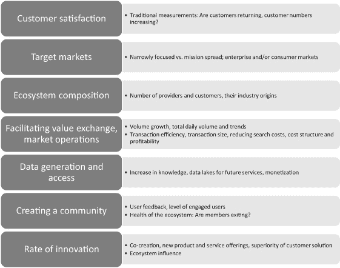
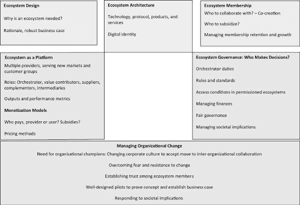
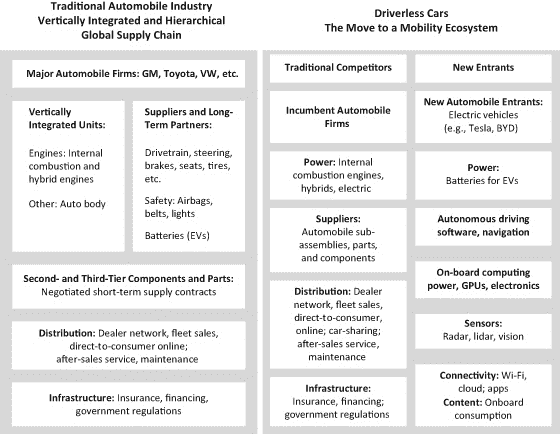

# 6

# 作为生态系统的区块链

随着全球数字经济中公司竞争的加剧，组织形式的生态系统作为一种公司组织原则的重要性日益增长。快速创新和竞争优势源于设计涉及多家独立公司能力和贡献的客户解决方案。问一下生态系统形式的组织是否特别适合于开发成功的区块链应用是有用的。

区块链节点可以分布在单一行业中的多家公司，以及跨多个行业。这引入了跨组织协作开发基于区块链的客户解决方案的可能性，这最终可能比单个竞争对手的提供更好。这种跨组织解决方案可以利用不同合作伙伴的多种能力，共同创造高度模块化、定制化的客户解决方案。这些基于区块链的跨组织客户解决方案与基于平台的解决方案形成对比，在后者中，强大的网络效应可能导致少数公司，有时甚至只有一家，占据平台主导地位，产生赢者通吃的结果。相比之下，独立公司基于自愿的跨行业合作开发的区块链应用可以利用每个参与者的独特但互补的能力，创造持续改进的客户解决方案——“生态系统的生态系统的泛滥”。1

这样的区块链客户解决方案确实要求公司走出组织边界，但随着区块链网络吸引生态系统范围内的参与，区块链的价值主张会增加。因此，区块链解决方案往往需要公司在生态系统中共存，集体创新并满足客户，使每个生态系统成员公司选择角色，如指挥者、创新者、供应商、互补者、中介和监管者。客户可以选择不同的生态系统网络来解决问题，因此生态系统与其他生态系统竞争，而不是公司之间相互竞争。然而，生态系统还需要生态系统指挥者进行大量的协调，这与去中心化相矛盾。正如我们所看到的，某种形式的受许可的区块链，指挥者设定访问网络和参与水平的条件，通常是企业在自己的试点中达到的地方。

在本章中，我首先考虑生态系统组织的关键方面以及它们可能如何适用于基于区块链的解决方案。然后，我考虑采用生态系统框架的跨组织区块链试点案例及其取得的成果。这些案例包括共享经济模式下的自动驾驶车辆、医疗保健应用和全球供应链。这些案例使我们能够评估作为企业级区块链成功实施催化剂的生态系统组织形式的价值。

启动基于区块链的生态系统平台的公司必须决定如何设计一个包容性的生态系统模型，反之，生态系统内的公司必须评估是否加入该生态系统，权衡潜在的好处、在生态系统中可能扮演的角色以及成为依赖并从属于主导区块链协调者的风险。生态系统的复杂性，源于几个相互作用的子系统，可能成为潜在成员的动力，因为加入此类区块链网络使成员能够集体提供超出任何单一成员能力的解决方案。与此同时，生态系统成员对更具参与性的治理区块链的偏好可能与主导网络发起人强加的设计以及特定区块链规则和架构相冲突。2

## 战略思维生态系统视角

生态系统由“需要互动以实现焦点价值主张的合作伙伴”组成。3 生态系统有几种形式。安德鲁·希皮洛夫（Andrew Shipilov）和安纳贝尔·高维（Annabelle Gawer）确定了生态系统的多种形式，如下所述：4

+   ·   通用生态系统：一组补充其他生态系统成员的非通用互补特性和能力的参与者

+   ·   商业生态系统：由影响企业客户和供应商的组织、机构和个体组成的社区，旨在使客户和供应商双方受益

+   ·   创新生态系统：贡献于焦点产品用户价值主张的一组参与者，创新生态系统可能随着产品和解决方案成熟到足以发展为经济可行的商业提议而演变为商业生态系统。

+   ·   平台生态系统：一个核心技术（通常是软件加上网络基础设施和云存储），成员可以连接他们的互补产品和服务，通常通过标准化或开放接口进行连接。平台所有者/运营商可能是完整生态系统的一个子集，他们共同控制平台发展、标准（例如数据隐私）、收入分享并设定访问平台的条件。

区块链特别有能力成为平台生态系统。最初根植于主要生态系统合作伙伴之间的共同创造和共享价值，核心平台生态系统可能会随时间演变，新的生态系统成员进一步发展平台及其产品，持续改进客户解决方案并促进生态系统成员之间的交易。

### 设计生态系统以提供成功的客户解决方案

为什么需要生态系统模型？考虑生态系统模型的企业需要权衡生态系统与层次化组织供应链以及/或企业作为中心角色的垂直整合企业。当模块化组件被适配以塑造客户解决方案时，生态系统模型很可能优于垂直整合和层次化组织。构建生态系统是复杂的，企业需要强有力的理由、一个健壮的商业模式来证明投资合理性，以及一条货币化路径。

### 生态系统界面架构

界面将根据生态系统的目标和需要允许特定成员子集协作来实现这些目标来塑造。例如，一个生态系统可能寻求建立行业特定的公用事业，减少现有痛点带来的摩擦。成员们需要同意遵守共享流程并接受迭代和持续改进。选择区块链协议是一个基本步骤，因为协议需要被所有潜在的生态系统成员采用。生态系统成员以及访客和潜在客户将通过独特的、可验证的数字身份得到识别。成员们将就 API 达成一致，以促进访客访问和第三方添加功能以及规定数据流动、数据分析、与物联网网络的链接以及云基础设施的规则。同样重要的是区块链上展示的产品和服务，旨在提供一体化的解决方案。然而，随着用户和提供者数量的增加，区块链的速度和可扩展性问题可能会阻碍提供快速服务以及提供快速、灵活的响应。

### 生态系统会员

当生态系统形成时，其创始成员可以设定最低合作伙伴能力以加入生态系统。成员需要达到一定的技术能力来安全地管理节点和数据并采用标准协议。管理成员可能根据成员对解决方案的贡献和访问权限级别建立合作伙伴层级。随着独立实体加入生态系统，他们必须协商他们可以接受的相互依赖程度。虽然生态系统在合作伙伴数量上可能有所不同，但如果客户发现他们的解决方案有吸引力，并且未来成员符合生态系统的进入条件，它们很可能会随时间增长。

随着生态系统的建立，其可持续性将取决于“必备”成员，他们的领域专业知识、独特能力和“引力作用”对于区分生态系统与竞争对手并吸引客户至关重要。创始成员需要确定期望的合作伙伴并考虑说服他们加入的特征。设计一个最小可行性生态系统是确保生态系统所有合作伙伴都能接受的一个起点。这可能涉及选择资助特别有吸引力的合作伙伴（可能是一个预定的初期期限）并吸引早期成员来增长生态系统。“生态系统必须是别人想加入的俱乐部。”5

由于生态系统是协作性的，关键问题之一是决定与谁进行协作。这种协作可以延伸到过去的和未来的竞争对手，或者可以跨越行业界限，包括跨行业的合作伙伴。协作至关重要，因为共同创造是生态系统方法的一个基本优势。共同创造是一种群体外包的形式，它鼓励多方创新，因此需要开放接口，以提供提供商之间的链接并实现定制化解决方案。

面向全球客户的生态系统也会在其合作伙伴网络中寻求地理多样性。全球影响力有助于超越现有的组织、地区和国家界限，找到创造性的合作伙伴。生态系统合作伙伴将必然扮演不同的角色，但其中 orchestrators 对于建立网络和招募合作伙伴至关重要，其他成员随后加入一个已经运行的生态系统。生态系统建立之后，增长网络将成为一个战略考虑。6 这对于扩展内容和能力至关重要，进而可以产生新的产品和服务。增长路径将涵盖不断演化的客户解决方案、交易促进和进入相邻市场。增长和规模可以帮助网络与其他网络竞争，并且通过精心地组合网络中的合作伙伴，可以加速实现规模的增长网络效应。

随着合作伙伴网络的建立，创建共同目标和社区来“粘合”合作伙伴变得重要；否则，合作伙伴的退出可能导致网络退化。因此，保持合作伙伴之间的联系，取决于满足合作伙伴的期望并认可并奖励他们不同的贡献。合作伙伴集体实现的总体收益应具有正和博弈的特点，而不是赢者通吃的轮廓；否则，生态系统可能会解体，其不稳定性反过来又会损害客户解决方案的质量，负面影响生态系统的表现和生存。

### 生态系统即平台

生态系统可以采用一个数字平台，以实现互动和交易完成，服务于企业和/或消费者市场。平台生态系统可能是一个多边的平台，拥有多个提供商。它能够整合其成员行业子集团的几种平台，并演变为服务于新的市场和客户群体，成为一个多行业的公用事业，在主要提供商和关键行业之间的互联点拥有枢纽。模块化特性允许个别生态系统合作伙伴与其他不断变化的生态系统成员合作，编织出多种价值主张，从而提供跨组织、跨行业的解决方案。提供开放 API 和自助服务门户可以增加成功的机会，通过降低吸引开发者和客户的障碍。

### 货币化

生态系统的启动可能需要大量的初始投资，最终的投资回报将在决定生态系统启动批准中发挥作用。同样，货币化路径是生态系统战略的一个基本要素。一个基本的决定是围绕谁来支付的问题。生态系统组织者和成员可以在向提供商、用户或两者收费之间进行选择。向提供商收费意味着成员从参与生态系统中获得了显著的好处，并为此向生态系统网络支付交易流程费。 Alternatively, customers could be charged a fee for service. The fees charged could vary over time with volume and usage, complexity of service provided, and value delivered. Further, ecosystems need both providers and partners, with network effects multiplying in a burgeoning symbiotic relationship between the numbers of providers and customers. Thus, motivating the early entry of multiple providers with subsidies, reduced fees, and a discount structure can hasten the generation of network effects.

定价可能与向选定的客户和提供商（可能是竞争对手）提供的独家权益相关联。除了生态系统服务之外，额外的收入可能来源于数据的销售、基于生态系统使用分析的营销分析发现和咨询服务。除了收入之外，生态系统治理还需要管理财务，包括初始投资决策（以及随后继续投资以建立生态系统能力），以及建立储备。维持生态系统可持续性源于有效的生态系统表现。因此，基本的产出指标与期望的绩效标准相比是必要的，以监控生态系统的健康状况并采取必要的纠正措施。以下 6.1 节中列出了值得考虑的常见绩效指标。

### 生态系统治理

鉴于为客户提供解决方案的生态系统合作伙伴之间存在独立又相互依赖的关系，治理对于设定目标、规则、标准和公平评估及奖励合作伙伴贡献至关重要。毫不夸张地说，没有良好的治理，生态系统将解散，而公平的治理将有助于实现规模效应。治理可能会由生态系统 orchestrators 和关键提供商共享，并为生态系统成员提供表达意见和同意或不同意的渠道。生态系统治理可以被概念化为管理生态系统成员之间的紧张关系，这些关系跨越多个维度，包括标准化与多样化、控制与自主、集体决策与个人决策。

图 6.1

生态系统评估指标

生态系统可以在这些维度上进化，平衡开放性（无需授权）和授权，从而使生态系统 orchestrator 对生态系统产生影响。治理职责应包括以下内容：

+   • 决定生态系统是开放的还是需要授权的（后者必须为服务提供商和用户设置访问条件）

+   • 协调创新，特别是在早期阶段，当时 early customer solutions 正在开发中，目标是建立一个高效的去中心化互动协作系统。

+   • 促进价值创造，以区别于竞争生态系统。

+   • 设定客户服务级别并保护客户利益，灌输生态系统范围内的道德行为标准。

+   • 评估合作伙伴对价值创造的贡献并公平分享由成员按贡献比例创造的价值。

+   • 解决知识产权问题：知识产权所有权、知识产权共享和支付，以及知识产权向生态系统产品的溢出；对融入核心价值主张的知识产权进行补偿。

+   • 规范成员的专利和代码所有权，因为价值创造的重要比例将存在于代码开发和独特的知识产权中。

+   • 鼓励并保持会员资格；使会员活动与共同目标保持一致。

+   • 决定监管机构的组成，并为生态系统成员提供渠道，让他们就拟议的法规和修订版提出意见和建议。

+   • 设定规则和标准（例如，数据和服务质量标准、错误修正程序）；数据所有权和访问、共享、安全与维护；利用数据分析；与生态系统合作伙伴分享从集体匿名数据中得出的宏观洞察。

+   • 在合作伙伴行为对生态系统的持续增长和竞争力产生不利影响时，实施制裁，包括强制退出。

### 组织变革：影响

生态系统的组织模式与等级制度控制的组织相反。采用生态系统框架将需要重大的组织变革，因为组织及其成员从等级制度向更大的平等过渡。一个重大任务是建立生态系统成员之间的信任。公司文化现在必须调整竞争的伦理，追求组织间合作，走向有见识的共识。随着向生态系统的更广泛转变，组织必须应对向不熟悉的技术——区块链的转变。预计在用基于区块链的解决方案替换传统解决方案时会有一些变革的恐惧和阻力，高层组织冠军可以帮助减少对此类变革的焦虑。关于区块链的教育是必要的，将阻力转变为理解，甚至是有见识的热情。设计良好的试点项目可以是教育努力的一部分，证明概念并建立功能和企业案例，以转向区块链。企业通常求助于临时的并行轨道，区块链由传统解决方案支持。这有助于降低风险，保护企业免受区块链努力失败的负面后果，代价是保留冗余。

### 社会影响

成功生态系统的组织可能会成为寡头垄断也可能引起社会关注。这种担忧源于对某些人群访问受限和生态系统以牺牲消费者福利为代价的商业支配的恐惧。随着这些担忧的增长，呼吁社会对生态系统进行控制可能会影响其商业可行性和成功。生态系统治理可能会扩展，包括社会效应，在制定和评估客户解决方案的质量和大小时。这种观点将积极寻求提高公共利益，并在生态系统提供者和客户之间平衡这种成就与私人利益。图 6.2 总结了指导组织间区块链开发和实施的关键方面。

我现在考虑一些例子，说明生态系统方法如何塑造基于区块链的解决方案。我首先从自动驾驶车辆（例如，无人驾驶汽车）开始，然后考虑医疗保健和供应链的例子。

图 6.2

生态系统视角下的战略思维

## 为自动驾驶车辆服务区块链

自动驾驶汽车（如无人驾驶汽车）具有颠覆汽车行业竞争平衡的潜力。传统上，像通用汽车、丰田和大众等少数几家主要汽车公司一直主导着全球行业，既实行垂直整合的制造和分销，又有按层次组织的供应商体系。向 AV 的转变，以及电动汽车日益增长的重要性，已经打乱了传统按层次组织的汽车行业，并迫使它考虑转向基于生态系统的组织。

考虑生态系统模型的原因源于 AV 兴起背后的竞争要素的变化。制造无人驾驶汽车需要具备不同技术能力的企业，从传统的汽车制造到开发软件和 AI 系统，以及电子和光学设备，如果它们要提出卓越的客户解决方案，就需要自愿合作。自动驾驶汽车（AV）捆绑了多项不同的技术革新来提供交通服务。它们需要与 AI 能力相连接的车辆驾驶软件，以实时快速地处理和响应关于驾驶环境的巨量数据。该软件与多种传感器（如视觉识别系统、导航系统和它们相关的地图、与云服务器和数据湖的移动连接、以及强大的车载计算能力（图形处理单元））相连接。驾驶指令通过车载电子和软件传达给汽车的机械系统——轮子、发动机动力、转向和方向、刹车——从而控制车辆的运动。用自动化取代人类司机增加了车辆的电子和软件含量，并在价值链上重新安排价值贡献和利润分配。这些新技术超出了主要汽车公司传统领域的专业知识。

随着传统汽车行业向 AV 方向发展，它对新技术提供者越来越有吸引力。例如，AV 软件领导者包括谷歌的 Waymo 部门，该部门利用其在亚利桑那州测试设施中驾驶的实验性 AV 汽车的模拟和数据不断更新其 AV 软件。特斯拉依赖 AI 机器学习，从使用它们的汽车在道路上行驶的特斯拉车主那里挖掘驾驶性能数据，以归纳性地发展其 AV 软件。辅助自动驾驶的汽车电子包括使用激光成像汽车周围环境的 Lidar 单元、测量汽车周围物体距离的 RADAR、检测和识别物体的摄像头、以及车载计算机和相关云连接。这些需求吸引了新的竞争对手，如英特尔（促使其收购 Mobileye）、英伟达、安波福、百度和优步。

另一个复杂因素是电动汽车日益增长的重要性，城市推动电动汽车以减少城市污染，并将污染源转移到发电厂。特斯拉的崛起源于其早期转型能力，用电池驱动的电动动力系统替代内燃机。电动汽车的兴起导致对内燃机的需求减少，这威胁到主要汽车公司对内燃机产能的大量全球投资。这些搁浅的工厂投资可能会反过来减少主要汽车公司内部为自动驾驶汽车（AV）开发所需的一系列新技术的资金，促使它们考虑与自动驾驶汽车领域新兴的强大参与者进行合作和创新。

考虑到汽车大约有 90％的时间是停放的，以及自动驾驶汽车在市场初期阶段成本较高的估计（主要原因是车载计算能力、电子设备、传感器和自动驾驶软件的价格较高 7），人们认为一些消费者可能更愿意雇佣自动驾驶汽车的服务而不是拥有它。波士顿咨询集团估计，到 2030 年，一款配备电动动力系统的自动驾驶汽车的成本可能会比 2017 年其内燃机动力的对应车型高出 75%，而 2030 年大约 25%的汽车乘客里程将来自共享的自动驾驶电动汽车。8

此外，麦肯锡预测到 2030 年，每十辆售出的汽车中就有一辆是共享汽车。9 他们还表示，这种共享汽车更可能在大城市中使用，在那里“拥堵费、停车难、交通堵塞等问题使汽车拥有对许多人来说更是一种负担，而共享出行则提供了竞争性的价值。” 共享经济模式可能是克服“购车冲击”和增加自动驾驶汽车（AV）市场份额相对于传统汽车的一种创新解决方案。这一转变在图 6.3 中有所描述，该图说明了对自动驾驶汽车（AV）兴趣的日益增长如何促使从层级结构向生态系统模型的转变。

图 6.3

从层级结构向生态系统的转变：向自动驾驶汽车迈进

### 区块链技术对自动驾驶汽车行业的好处

在共享经济应用中，如自动驾驶车辆（AV）的案例，主要目标之一是最大化共享 AV 资产的持续收入。自动驾驶车辆制造商作为一个群体可以拥有这些共享车辆资产，并通过共享车辆使用的利润年金流来回收成本并获得投资回报。区块链可以管理共享经济对自动驾驶车辆服务的需求和 AV 交通，确保车队可用性并处理支付。下面将进一步讨论的年金模型和公共事业模型都可以用于通过区块链提供自动驾驶车辆交通服务。

在年金模型中，增值内容提供商的价值生态系统可能会聚集在区块链平台上，共同提供无人驾驶汽车租赁服务。每个生态系统提供商对完成无人驾驶汽车的增值贡献将代表他们在每辆汽车中的所有权份额，份额的大小取决于每辆汽车选择的最终配置。这些所有权份额可以保留或交易，所有权状态的变化记录在区块链上。应用程序编程接口（API）将允许个人召唤无人驾驶汽车，智能合约将根据与各提供商所有权份额相关的收益对每个用户进行计费。可以在该区块链上开发的原生代币可以作为提供交通服务的支付手段。这些代币代表了客户从使用无人驾驶汽车中获得的收入，将根据他们的所有权份额按比例分配给车队所有者，这代表了每辆无人驾驶汽车在其有用生命周期内所获得的年金。

区块链可以扩展到安排和支付定期维护，以及保险公司，他们可以为自动驾驶车辆车队提供保险，或者为自保车队提供再保险。可以根据用户累计使用量提供忠诚度代币。车队中每辆汽车的区块链数据可以监控使用情况，管理例行的定期维护以及异常事件，如事故。它还可以涵盖车队中每辆自动驾驶车辆在其整个使用寿命期间，从最初生产投入使用到报废回收，代币鼓励和奖励总增值的回收。

作为一种替代方案，制造业生态系统可以通过在共享经济中部署自动驾驶车辆来拥有并赚取收入。私人创业公司也可以购买并同样部署自动驾驶车辆，寻求类似的利润年金流。第三种可能是私人个体拥有自动驾驶车辆，收入和利润年金归这些个体所有者所有；这种第三种情景在经济上似乎不太可行，原因是每辆自动驾驶车辆的购买价格明显更高，车队所有权带来的规模经济以及更密集使用带来的更高维护需求。尽管如此，这三种所有权模式都可以依赖于年金模型区块链。

公共服务模式基于公共部门的拥有，类似于公共交通的提供方式。提供公共交通服务的当地政府也可以考虑将 AVs 以共享模式部署，作为许多交通选择中的一种；AVs 对于低需求路线和在非高峰时段可能更有效率。这种公共服务模式可以使用经过一些适应性修改的区块链，以满足公共服务考虑。

自动驾驶车辆（AVs）可以作为公共服务提供，通过区块链，地方政府拥有并提供的自动驾驶车辆可供共享使用。这类似于公共交通（如公交车或火车）的公共所有制，向拥有唯一身份识别码（作为城市或地区的市政居民）的用户提供服务。这种作为公共服务的交通可能会基于费用，采用渐进式费用结构，与收入挂钩，同时也为特定人群提供免费或减免费用的服务。区块链可以使用每位旅行者的唯一身份识别码，结合旅行路线参数，计算并向该用户收取提供的交通服务费用，这与其他公共服务（如公共供水）的收费方式类似。这种公共服务模式也可能是混合型的，包括公私合作伙伴关系，私人所有者在车辆成本加上预定的投资回报得到之前，从使用中收取费用，在此之后，车队所有权将回归到市政所有，交通服务可以以更低的价格提供，以覆盖运营成本。

### 自动驾驶车辆中区块链采用的挑战

由于许多不同行业需要合作，才能成功将 AVs 引入大众市场，每个不同行业的领导者中至少有一位需要发起这样的合作。与此同时，一家受到尊敬的中立 IT 公司，具有区块链专业知识，需要参与这些初步谈话，作为“诚实的经纪人”，以增加信誉并克服对采用不熟悉技术的抵触情绪。城市公共交通管理员也需要参与，以阐明管理 AV 引入的规则和法规。为了实现 AV 成功推出所必需的快速增长，向交通用户提供补贴以增加需求可能是必要的。

支持自动驾驶车辆部署的跨行业联盟需要投资于开发和试点新的软件模块，例如一种提供从每辆自动驾驶车辆的物联网设备到验证其数字身份、记录使用情况并将相关费用与特定的运输客户关联的解决方案。其他模块将匹配可用的自动驾驶车辆与客户需求，并分配赚取的收入以及相关的自动驾驶车辆成本到适当的自动驾驶车辆供应商账户。为了激励自动驾驶车辆所有者使其车辆队可用于区块链中，并接受合适的定价公式，联盟需要建立一个代币在系统内使用的市场，将其列入数字货币交易所，并管理其价值，使其作为稳定币发挥作用。这些并非不可克服的挑战，但表明了如果自动驾驶车辆区块链要获得牵引力和 increasing 采用，必须解决的任务。

随着自动驾驶车辆（AV）需求的大规模发展，下一步将是协调下一代自动驾驶车辆的创新，因为需要各个生态系统合作伙伴提供的各个子系统的同步创新，以全面实现自动驾驶车辆的性能并保持竞争优势。否则，自动驾驶车辆的创新将被落后创新者的步伐所限制。一旦自动驾驶车辆的创新管理纳入区块链，区块链可以扩展到监督制造和供应链运营。

### 自动驾驶车辆行业中区块链实施问题

区块链应用在自动驾驶车辆制造、使用以及自动驾驶车辆与独立实体（如监管机构、保险公司）之间的通信等方面具有价值，还包括商业和休闲应用。在自动驾驶车辆的设计和制造中，传统汽车公司至少需要与电子和软件公司合作。至少，基于区块链的生产系统应该将每一辆自动驾驶车辆视为价值链中移动的代币，个别公司对自动驾驶车辆价值的贡献更新在附着在代币上的账本中，实现贡献的跟踪和奖励。

在用户方面，区块链可以注册 AV 的使用情况，每个车辆都有特定的代币来注册状态变化，例如特定客户使用特定车辆。区块链还可以注册相关数据，如 AV 当前的位置和位置变化，并将此类数据与用户计费关联。此外，安装在每辆 AV 上的物联网传感器可以监控运行准备情况。此类信息可以与计费和维护相关数据（包括订购零件和维护费用）关联，从而在整个 AV 使用寿命内形成 AV 维护日志。所有权相关数据（如贷款、租赁、更新的所有权权益和折旧费用）也可以类似地记录。完全有可能一辆 AV 继续由制造商联盟拥有，而 AV 的使用费用通过区块链归集，在整个 AV 使用寿命期间返回给 AV 所有者。保险公司可以提供基于不可变、持续更新的驾驶记录和为所有者、贷款人、制造商和政府机构提供不同访问权限的参数化保险。

对于 AV 的担忧之一是，它们可能被恶意行为者黑客攻击，导致事故并危及生命和财产。通过云连接，基于区块链的 AV 与其他车辆、物联网设备和其他服务提供者的通信可能显著降低此类风险。此类安全性还提供数据隐私和安全的內容交付，当 AV 乘客与购物、娱乐和其他商业和休闲应用程序互动时。为此，区块链试点项目需要探索攻击者和漏洞，并在大规模实施之前开发出健壮的解决方案。

最大的挑战将是如何在扩展规模时获得令人满意的性能。随着在运营中的自动驾驶车辆（AV）数量增加，区块链应用程序将需要在实时数据供应对安全 AV 操作至关重要的情况下管理许多连接。在制造方面，要在基于区块链的生态系统中发展 AV 制造，将需要类似于马士基和 IBM 在 TradeLens 中的角色那样的协调者，而 AV 供应商侧的区块链将面临类似挑战，包括招募网络成员、建立公平的治理以及公平评估和奖励贡献。此类区块链还必须在 AV 引入的早期阶段，面临监管差异和多重司法管辖区的常态时获得监管批准。

## 区块链与医疗保健交付

在美国，有一群多样化的实体在价值链中协作创新，提供医疗服务。提供优质护理的一个关键要素是持续获取最新的患者信息，确保信息的准确性、可用性和及时性，这些都非常重要。然而，美国的医疗保健系统在履行其最基本的责任——即在需要时向医疗提供者提供最新的患者医疗记录——方面遇到了困难。履行这一基本且必要服务失败的原因是多方面的。流程的差异阻碍了健康保健记录在组织边界之间的顺畅转移，这进一步受到了不同标准和格式的阻碍。法律障碍阻碍了这种数据交接，主要是《健康保险便携与责任法案》（HIPAA）的规定，这促使医疗保健提供者谨慎行事，在完全确保符合 HIPAA 规则之前延迟这种数据转移。美国的医疗保健系统是碎片化的，分为政府和私营部门的责任；私营部门的一些部分是营利性实体，必须在最大化利润和提供医疗保健之间保持平衡，这影响了这些提供者按时完整地分享医疗保健记录的意愿。

生态系统成员之间也存在相互竞争的价值主张和相反的目标。医疗保健记录告知精算计算，表明可保性和适当的保险费率，从而使健康保险公司和雇主可能与个人患者及其医疗保健提供者产生潜在的矛盾。同样，个体基因组数据可以提供深入了解疾病发病的易感性，但这需要立法保护，以防止因医疗保健记录透明度而对个体产生歧视性待遇。这些障碍部分源于支撑美国医疗保健提供的意识形态选择。这些障碍可能在提供国家医疗保健和单一支付者系统的国家不存在，在那里，生态系统成员更有可能分享相似的目标。

为了提供共同创造的客户解决方案，生态系统需要共享共同目标。当生态系统成员的目标出现分歧时，生态系统可能表现出更多零和游戏的特征，一些网络成员的利益以牺牲其他成员为代价。生态系统成员可能更愿意运行自己的集中式生态系统，更喜欢在较小的生态系统中担任中心、 orchestrator 的角色。这样的 orchestrator 将希望管理网络、设定目标并控制对其网络的访问；这种中心化的方向也可能导致创新受限和客户满意度降低，并被视为出于个人私利行事。

美国健康护理递送生态系统有两个方面，患者是生态系统的中心，与患者护理提供者和支付者互动。在患者护理方面，有几个独立实体开始合并成一体化实体，以响应成本降低的压力，更好地协调并提高患者结果。这些实体包括医疗服务提供者，如家庭医生、护士和医生助手，他们通常组织成医生执业集团、社区卫生中心和新兴的药房式诊所。他们与专科医疗服务提供者如外科医生和肿瘤学家互动，后者可能进一步组成医院、急诊室和重症监护室、康复设施、辅助生活设施、临终关怀医院和其他实体。

这些医疗服务提供者得到了实验室和专门测试服务（如 MRI、CT 扫描）的支持，以及监控和物联网设备与传感器的支持，患者的电子健康记录（EHRs）中汇总了健康数据，并通过基于人工智能的数据分析来辅助诊断。新的发展包括远程医疗服务提供者和健康护理导航员的日益普及，他们充当患者和患者护理提供者之间的中间人。监管机构，如美国食品药品监督管理局（FDA）和美国卫生与公共服务部，负责监督患者护理，以确保安全、有效和合规。

在支付方，有政府实体，包括医疗保险和医疗补助，其覆盖服务是根据平价医疗法案确定的，由退伍军人事务部确定。私人支付者众多，私人健康保险公司的健康保险支付和个体支付的共付额之间分配了总健康护理费用；来自个人和提供健康保险福利的雇主的保险费部分抵消了保险公司对覆盖成本的支出。此外，政府和企业部门基金会资助以及企业风险资本支持，使药物开发和与健康护理相关的研发得以进行，这对健康护理递送的长期改进至关重要。这些资金来源将其支出分配给制药公司和通用药品制造商、医疗设备和设备生产商、医疗用品公司、健康护理信息技术和软件提供商以及健康护理研究机构，包括大学。其他受益者还包括健康护理中介，如合同研究组织、保险经纪人、药房福利经理、药品分销商和药房，以及提供法律服务的组织。总的来说，美国健康护理系统占美国 GDP 的近 20%。

### 区块链在健康护理中的希望

区块链为医疗行业提供了诱人的希望，如下所述。

+   支付：除了解决医疗记录可获取性问题，区块链还能使支付变得更加高效，并降低行政成本，其优势在于与区块链验证的医疗程序、药物处方等相结合的卓越索赔管理。例如，一个医疗区块链可以整合智能合约以激活健康护理交付过程中的下一步，这种激活是由诸如检测结果和程序结果等更新信息触发的。随着各个步骤的完成，有了完成证明，智能合约可以自动化来自诸如医疗保险和私人保险公司的服务提供支付。智能合约可以咨询药房福利管理配方，将支付与患者结果而非当前基于程序的计费联系起来，并使用去匿名化和汇总的患者数据分析以及人工智能来提供患者护理改进建议。

+   药物研发：区块链还可以在药物制造和供应链中发挥作用，防止假冒伪劣，确保药物得到妥善储存，监控受控物质（例如阿片类药物）的销售，并将过期的药物从库存中移除。区块链在开发新药物方面也具有潜在作用，通过监控患者注册，捕获并存储药物试验数据，确保数据安全，并引导数据通过 FDA 提交的 Investigational New Drug 和营销批准。10

+   患者健康记录：有了区块链作为这个生态系统的核心来记录和传输患者数据，它可能提供分布式可用的不可变患者健康记录——一个真相来源——具有追踪到的所有相关医疗保健提供者的来源。区块链可以为患者提供数据主权和控制权，允许他们同意向授权的医疗保健提供者提供数据访问权限。本地代币可以奖励同意允许访问他们数据的病人，例如，寻求他们的药物试验候选人的制药公司。11

### 在医疗保健中采用区块链的挑战

部署区块链的难度与其说是技术性的，不如说是经济和组织性的。管理医疗记录的传统解决方案主导着私营部门的格局——如 Epic Systems、Cerner、Meditech 和 Allscripts 等公司——建立了数据孤岛。整合这些差异化的数据库会产生高昂的转换成本，并可能会减缓潜在的区块链颠覆者的步伐，给现有的电子健康记录（EHR）公司足够的时间来决定是否提供基于区块链的电子健康记录解决方案。这导致了提供商生态系统的流程和数据标准不兼容，再加上遵守 HIPAA 隐私法规所需的合法障碍，这都减缓了区块链解决方案的进展。因此，正如上文所讨论的，关于组织目标的分歧、法律障碍以及利润动机是更大的障碍。

考虑到这些障碍，医疗保健生态系统内部署区块链的困难并不令人惊讶。在最近的一项调查中，44%的医疗保健受访者表示，区块链是他们最不感兴趣的技术。12 投资者中对区块链在医疗保健领域的应用持类似轻蔑态度的比例甚至更高，达到 64%。此外，当美国医疗保健系统面临政治风险，并受到报销、支付方和医疗保健行业监管不确定性影响时，医疗保健公司可能不愿批准像区块链这样风险较高的新技术投资。

尽管存在这些困难，至少在短期内，一个更有可能的发展趋势是在整个生态系统的子集中进行创新。Martin Ihrig 和 Ian Macmillan13 指出，在一个生态系统中，创新应该创造其他利益相关者可以贡献的价值主张。他们举了一个例子：一种治疗代谢紊乱的新方法，这种方法可以消除手术的需要，但会减少外科医生的收入，并使医院在传统治疗方法上的投资变得过时。创新公司需要决定是否愿意创建一个新的利润共享的医生团队治疗诊所网络，同时颠覆生态系统的医院和外科医生。

更广泛地说，生态系统的创新将 differently 影响每个生态系统参与者的结果。创新者需要计划管理由此产生的紧张关系。Ihrig 和 Macmillan 接着建议，如果生态系统创新能够增强其他生态系统成员的差异化，总体上补偿其他利益相关者的负面影响，那么它可能会成功。因此，在引入用于患者数据记录的区块链的情况下，对于医生和其他医疗从业者、医院、监管机构、保险公司、制药公司和药品分销商应该有积极的影响，以克服当前在电子健康记录领域占据主导地位的现有参与者的可能的负面影响。生态系统内需要有一个创新联盟 14 来推动如区块链引入等风险性新方向。

### 区块链与全球供应链：TradeLens 作为生态系统

在第五章中讨论的 TradeLens 是实施组织间供应链解决方案的生态系统视角应用的一个例子。15 如果每个人都信任数据、从数据的同一副本工作，并确信数据是安全和私密的，供应链参与者将受益。16 作为独立公司，他们需要被激励和说服加入区块链，如果应用程序要提供比传统系统更多的好处。

随着更多的供应链参与者加入 TradeLens，正如任何数字平台一样，积极的网络效应带来了更大的好处。考虑到 TradeLens 由马士基和 IBM 控制，将 TradeLens 与其所有者分离的治理安排对于吸引马士基的竞争对手至关重要，这些竞争对手的集体参与是使 TradeLens 有效运作所必需的。提供入职帮助是必要的，以促使较小的供应链公司参与，以克服他们相对较低的技术和组织准备水平可能会降低他们在网络中作为平等成员运作能力的担忧。定价 TradeLens 的服务需要平衡参与的成本和好处，以及需要回收投资并创造正现金流以资助持续的可持续运营。TradeLens 必须展示持续的演变和升级，以吸引那些可能更愿意加入如全球航运业务网络（GSBN）等拥有更先进区块链协议的新供应链网络的成员。GSBN 包括一些最大的中国和亚洲航运公司，它们共同控制着全球约 30%的集装箱运输量（马士基本身控制着约 20%）。

IBM 和马士基作为共同所有者和 orchestrators，做出了几项架构选择，以激励供应链生态系统的 TradeLens 采用。

+   吸引买家：对有货物需要跟踪的用户开放访问，这是一种用户补贴，以鼓励快速采用。通过向用户提供大量潜在供应链提供商的信息和累计历史货物数据，以培养用户忠诚度，旨在使 TradeLens 成为首选平台。

+   对生态系统成员的价值：已经下订单并等待货物发货的客户从货物流程的可见性和透明性中获得了价值，这对管道库存和工作资本水平有积极影响，并减少了库存不足的损失。供应链提供商同样从了解货物位置、状态和可能的延误中获得价值。这些数据可以增加来自忠诚、满意的客户的市场份额。这种客户忠诚度使得供应商更愿意为使用 TradeLens 支付费用，无论是通过订阅费、根据使用水平的基础费用，还是通过为获取货物状态数据而收取的费用。

+   鼓励协作创新：IBM 和马士基可以在创新被吸收为标准特性之前设定规则来奖励创新者。17 这样的规则鼓励区块链的持续发展，例如，通过整合物联网设备、软件和人工智能能力来跟踪货物。这种开放创新可以帮助 TradeLens 与其他类似新兴平台竞争。

因此，推动开放标准、鼓励新参与者接受、将数据安全置于首位、去中心化治理以及开发衡量进展的指标都有助于成功的 TradeLens 区块链应用。在完成了令人满意的初步试验后，IBM 和马士基在 2018 年 1 月推出了 TradeLens，到年底时已经签约了超过“100 个组织，包括四家海运公司、三家内陆运输公司、四十多个全球港口和码头、大型货运代理商以及八个海关当局，横跨从鹿特丹到巴林的全球各地”。18 TradeLens 吸引了诸如陶氏化学和杜邦之类的用户，这些用户依赖 TradeLens 成员来运输他们的货物。

区块链为那些彼此不认识的实体和个人提供了在无需信任的环境中分享数据和进行交易的可能性。机器——区块链——提供了信任。区块链技术也为生态系统提供了重大益处，这从各种组织正在进行的大量区块链试点应用中就可以看出。19 随着作为生态系统公用事业的价值增加，广泛采用的势头也在增长。帮助其他公司以公平的条款创建和分享价值是鼓励新兴生态系统参与的最佳途径。20 区块链的使用可以催化协同价值创造，透明地分配和记录这部分价值的分配。参与者可以自行判断他们的回报是否与他们的努力相符。

在下一章也是最后一章中，我将基于各种行业和生态系统应用案例的洞察，概述企业决定区块链是否适合解决他们希望解决的问题的战略步骤，如果适合，还应如何开发和实施这些区块链应用。
