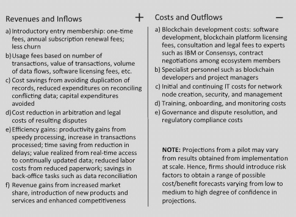
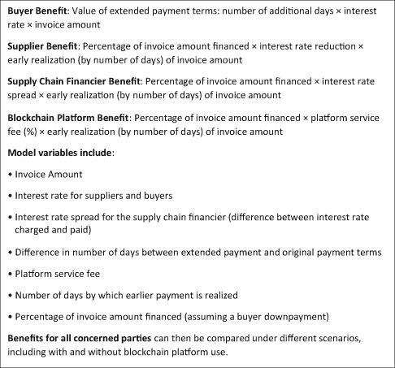
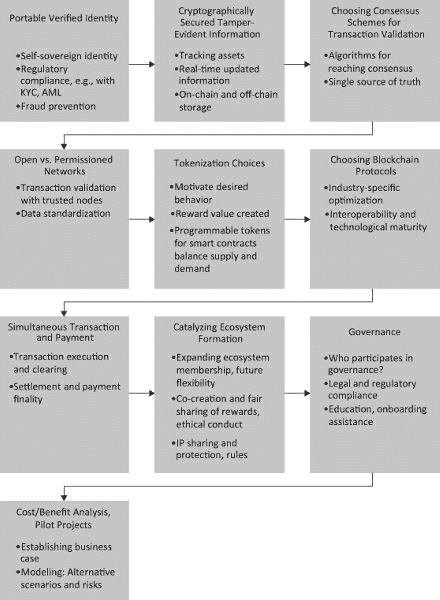
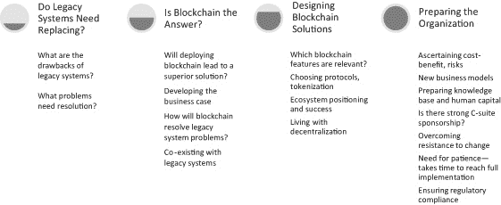

# 7

# 实现区块链潜力：企业战略路线图

在之前的章节中，我讨论了区块链的颠覆性能力如何在几个行业中得到应用。我还阐述了区块链为何尚未在企业中广泛采用的原因。现在，我考虑的是企业如何决定是否在其运营中开发和使用区块链。

## 企业应该如何战略性地对待区块链的承诺？

企业可以遵循逐步的方法来决定是否以及如何部署区块链。第一步是确定现有的遗留解决方案是否不令人满意且需要更换。如果是这样，公司需要评估区块链是否是答案。然后，他们应该规划开发基于区块链的解决方案的商业案例，以获得支持和资源（资本、人员、时间等）来开发和测试项目。这导致了设计区块链解决方案，应该利用区块链的独特特征和能力。最后一步是准备组织与区块链合作，以便经理、技术人员和其他员工团结一致，取得成功。

### 现有的遗留解决方案需要更换吗？

如果遗留解决方案运行良好，客户也满意，那么可能没有必要转向基于区块链的解决方案。在区块链出现之前，公司使用集中式数据库来保护数据和控制访问。集中式公司控制下属单位并管理供应商。一个控制塔或仪表板，它总结更新、及时的信息，并对关键指标进行异常报告，在过去一直为高层管理和关键决策者提供良好的服务，并且在公司继续采用层次结构、主导其层次结构并可以依赖自身数据进行健全的长期决策时，可能仍然可行。

作为 Capital One 的行业专家评论说：“请记住，链条的力量取决于其最薄弱的环节，这对区块链来说同样正确。如果一个节点有性能、规模或安全问题，它们可以影响其他节点。区块链可能是一个强大的解决方案，但组织只有在现有技术无法很好地解决他们面临的挑战时才应该使用它。”1 当行业结构发生变化，使得公司必须合作以满足客户需求——并且需要来自独立方的准确、及时的数据时，区块链变得有吸引力。我之前提到了信用评分行业，美国市场有三大主导公司，包括 Equifax。正如所提到的，像 Equifax 这样的集中控制深度存储库已经被黑客攻击，对客户造成了相当大的附带损害。在这种情况下，基于区块链的去中心化信用评估，个人控制自己的信用数据，是具有长期潜力的颠覆性创新。

### 区块链是答案吗？

区块链能带来更好的解决方案吗？如果客户对现有的（遗留）解决方案不满意，它可能是一个合适的替代品。区块链特别适用于实现某些目标：

+   用直接交易方的互动替代中介及其费用，以降低成本；

+   保护数字资产，通过清晰地识别未经授权的复制、伪造和仿造行为，从而提供可追溯的安全性；

+   为特定数字资产保留不可篡改的交易记录；

+   在通过同时结算和支付最终性交换宝贵资产时，保护对手方风险；

+   在交易的不同阶段，涉及多个实体之间访问、更新和共享准确、实时更新的信息时，提供透明度；

+   与未知方进行在线交易，其中不存在先前建立的信任关系；

+   与多个独立公司共同创造客户价值；

+   共享治理，接受去中心化，放弃应用程序设计和功能方面的层级控制；

例如，电子健康记录（EHR）在不同医疗保健提供者之间的可携带性，可能使医疗保健团队能够跨越不同的医疗保健组织，从而提高患者结局和护理质量。在区块链内共享 EHR 的医疗保健节点可以实现这一目标，这是医疗保健提供者与生态系统合作伙伴合作并试点区块链应用程序的一个原因。

内部业务流程的问题可能导致内部“客户”产生类似的满意度下降。例如，建筑承包商必须从一个合同地点部署和移动重型设备到另一个地点，而在偏远的建设现场关键设备故障可能会导致运营延误和成本增加。使用与物联网传感器链接的区块链和智能合约来跟踪设备准备情况和使用情况，将有助于预测和检测设备即将发生的故障。它还可以发起预防性的零部件请求和维护步骤，包括及时订购和定位关键备件。企业转向区块链可能仍需要将遗留解决方案与区块链结合，作为一个中间阶段，区块链补充遗留解决方案。例如，桑坦德银行是早期采用 Ripple 降低其客户跨境汇款成本的银行，但仍然必须继续使用遗留的汇款转账系统。一些客户没有或无法使用桑坦德的 One Pay FX 移动应用程序，还有几个政府机构没有批准在其汇款走廊上使用 XRP。

据 Forrester 研究，使用 IBM 区块链的总经济影响 3 指出，区块链参与者需要对区块链的引入保持耐心。首先，达到规模运营并开始获得好处需要时间。其次，区块链应用开发得益于与专家合作伙伴的协作，该合作伙伴因其专业知识、经过验证的记录和良好声誉而被选择。找到、谈判并开始与这样的合作伙伴合作可能需要时间。第三，成本效益结果需要在各种预测范围内被接受。为了支持积极推荐，预测应包括悲观的和乐观的情景以及基本案例，甚至基于悲观的场景的更低成本效益预测，也应该在企业决策者批准之前被视为可接受。

当高容量交易处理至关重要时，区块链使用是有问题的（因为区块链有可扩展性限制，尽管这些问题正在逐渐得到解决）。企业也可能因为区块链固有的透明性而望而却步，因此更倾向于使用受权限的区块链，在那里他们可以控制数据访问和共享。此外，区块链内的数据存储成本高昂，使得需要持续访问大型数据库的应用程序变得不经济。（成本上升是因为相同的数据在多个节点上存储，使用区块链共识验证算法在多个节点上更新数据和账本增加了处理成本）。

### 开发区块链解决方案的商业案例

公司需要确保拟议的区块链解决方案最终将提高其盈利能力和效率。因此，明确应用区块链的商业案例至关重要，这包括列出预期的好处（如新的收入来源和新服务/产品带来的最终利润）、通过效率提升带来的利润率改善以及成本降低。无论是内部应用还是外部面向客户的区块链应用，都可能是替代现有解决方案的候选者，而开发这两类区块链应用可以通过为其采用制作商业案例来加强。通过区块链使用积累的数据是额外的长期收入来源：公司可以提供预测和消费者需求分析，基于分析生态系统的广泛数据的累积数据湖。

寻找大型的、有潜力的市场是区块链应用获得显著收入的关键。例如，考虑到使用 SWIFT 进行跨境汇款的总金额巨大，Ripple 开发一个基于区块链的更好的跨境汇款解决方案是有意义的。即使在全球市场中只占有很小的初始市场份额，Ripple 也有可能实现显著增长。RippleNet 的访问竞争性费用以及 XRP 作为汇款首选数字货币的持续销售帮助增加了他们的市场份额。区块链的一个缺点是，对于企业来说，确定成本效益结果是困难的，这可能会限制企业在规模上采用区块链。在下一节中，我将更深入地研究经济障碍以及如何解决它们。

实施经济障碍从经济角度来看，公司可能因为对使用区块链的成本效益权衡存在不确定性，以及在投资运行区块链网络的设备和软件方面的高开发成本以及对领导和建设区块链应用的人才稀缺而不愿承诺采用区块链技术。公司可能会决定，现有的分布式数据库等技术在短期内是令人满意的，并且可以估计，区块链不会提供足够的改进来证明转向一种新且不熟悉的技术的合理性。

评估使用区块链的经济回报鉴于上述经济障碍，评估对公司经济回报至关重要。量化区块链的影响应该包括成本影响，考虑区块链采用产生的成本和因更高效而产生的成本降低。还可能从区块链用户的费用中获得收入增长，更广泛地说，因竞争力提升和推出新产品与服务而获得市场份额增长。4 图 7.1 概述了进行成本效益分析相关的因素。

图 7.1

成本效益分析的相关因素

由于成功的区块链应用涉及持续成本，总拥有成本（TCO）是一个有用的度量标准，因为它使成本效益分析更加完整。5 TCO 假设区块链应用是一项在数年内产生回报的同时也在贬值并需要持续维护以提供高性能的资产。TCO 包括 IT 成本，如硬件、许可和软件购买与开发、IT 支持人员的成本、终端用户培训和帮助、通信以及停机成本、遗留接口和数据迁移成本以及软件错误和升级成本。其他 TCO 成本包括管理资源和时间承诺以及与管理相关的行政和持续改进的人员配置。

另一种方法是建模可能因部署区块链解决方案而产生的不同场景。帕塔拉·帕努帕布 6 考虑了供应链金融中的区块链用例，估算不同生态系统成员（即供应商、买家和供应链金融提供商）的成本效益。该模型考虑了几个参数：

+   • 供应商从供应链金融提供商那里获得较低的利率，与加入区块链平台的成本和支付发票一定比例的交易费用相比，节省了费用；

+   • 由于区块链的安全性和交易执行的不可变性，信任供应链信息可以更快地促进支付；

+   • 利润池的再分配，使得低利率供应链融资取代了供应商的高成本融资来源；

+   • 去中介化，将部分利率节省以区块链交易费的形式转移到区块链；

+   • 对买家的好处，买家可能不会直接从利率降低中受益，但可以从供应商提供更长的付款期限中受益，因为供应商的利率较低。

该模型可以考虑不同的场景，包括和不包括区块链使用，以评估在此供应链金融设置中使用区块链的总效益。该模型比较了传统的供应链金融与在供应链区块链中提供的低成本融资和延长付款期限的替代方案，使用区块链平台提高供应链效率，从而减少运输途中天数，进而使运单发票金额的实现更早。图 7.2 阐述了该模型及其参数。

这种详细的建模可以帮助企业尝试不同的区块链费用结构和服务的配置，从不同的试点项目中获取数据输入模型，比较不同替代方案的成本效益。

图 7.2

模型用于评估区块链应用在供应链中的成本效益。改编自帕塔拉·帕努帕布，《基于区块链的供应链金融解决方案的成本效益分析》（硕士学位论文，麻省理工学院运输与物流中心，2019 年 5 月）。

估算从传统系统转向区块链应用的成本效益。区块链试点项目可以提供概念验证，但可能无法证明其相较于传统应用的经济效益，这使得大规模实施难以获得预算批准。区块链开发也可能产生高成本，这阻碍了具有不同目标的多个试点项目的资金。

银行业的一项应用指出，区块链解决方案在以大型机为中心的计算网络中可能最为有效，这需要显著的增量投资。银行能够利用 z Systems（新一代 IBM 大型机）的“速度、密码学和可靠性”来托管区块链，同时与已经在主板上运行的交易数据和应用程序无缝集成。7 此外，分布式存储在每一个节点上不断更新的信息的副本也会产生成本。例如，在考察在供应链中使用区块链解决方案的潜在成本效益时,8 发票处理效率的提高带来了工作资本的减少；这些好处被区块链平台的成本和使用费用所抵消。此外，收益归供应商所有，而不归购买者所有，这使得一些生态系统成员不愿意加入区块链。

偏好集中式、许可网络区块链并非为 enterprises 设计。像比特币那样，它是一个无需许可的网络，向任何希望加入网络的人开放。这种开放性在企业级的分布式账本技术（DLT）应用中并不受欢迎，例如，在 DB 试点的企业债券发行和生命周期管理投资银行网络中。在这种情况下，寻求贷款的客户或管理债券发行的投资银行可能会倾向于限制网络成员资格。中本聪的白皮书阐释了比特币的概念 9 假设一个旨在追踪数字资产（如比特币）所有权和状态变化的去中心化分布式网络需要在不良意图的参与者（例如，试图双重支付或引入伪资产的节点）的存在下工作。10

为了防止恶意行为而采取的额外步骤可能会对希望在其区块链中与几个可信节点合作的 enterprises 造成不便，在许可网络中。这样，企业可以避免使用计算和时间密集型的共识验证方法，增加区块链的执行速度。然而，这种治理节点的集中化与区块链的基本去中心化原则相悖，可能会危及安全。在许可网络中选择集中式网络会减少信任中介的好处，增加网络管理和治理成本。

跨多个区块链协议互操作性障碍的解决成本

智能合约缺陷成本智能合约代码中的错误，以及为了反对合同条款而故意引入的错误，都会增加在区块链解决方案中使用智能合约的成本。例如，智能合约可以被篡改，以将数字资产释放到任意地址（浪费型合约）、任意账户杀死合约（自杀型合约）以及编程合约无限期地锁定资源，没有任何可以释放这些被扣押资金的条件（贪婪型合约）。像 MAIAN 这样的工具可以检测到这样的恶意合约 11，但需要额外的支出。

### 设计区块链应用

成功的区块链应用起源于利用区块链能力克服客户痛点商业模式。换句话说，企业必须确定哪些能力能为客户创造价值。

授权或非授权区块链？企业在开发区块链解决方案时，不太可能选择*经典*的区块链配置（非授权、去中心化）。最初，他们可能会选择封闭的授权系统，优先考虑强调流程改进和效率提升的内部应用。当开发面向外部客户的应用时，他们可能会更喜欢自己能行使 orchestrator 角色的生态系统，在投资、货币化和治理决策上有很大的发言权。在这样的生态系统内授权区块链中，企业和其生态系统合作伙伴设定进入条件，决定哪些实体可以作为节点加入区块链。

例如，美国存托凭证中央对手方（DTCC）为其之前存储在交易信息仓库中的 11 万亿美元的信用衍生品试用了定制的受控区块链。这个受控应用程序是 IBM、R3 和 Axoni 的 AxCore 区块链协议（以太坊的一个版本）合作开发的，使得 DTCC 的合作伙伴，如巴克莱、花旗、德意志银行、瑞银和摩根大通等，可以将记录保存、生命周期事件、支付和信用违约掉期（credit default swaps）的结算迁移到区块链平台上，为监管机构和交易对手方提供单一的记录集。12 该项目随后扩展到其他 DTCC 客户，但使用的是受控访问。控制访问可以更快地验证交易和提高数据隐私。此外，有限的节点更容易在信用衍生品这种情况下达成共同的数据标准和治理。缺点是节点越少，安全性越弱。随着可扩展性、速度、隐私和最终性问题的解决，企业平台可能会向公共受控区块链的方向发展。此外，私有区块链可以与公共无权限的去中心化区块链链接，利用在基础公共平台上构建的具有隐私层的区块链协议，以及计算信任在链下执行。

哪种区块链协议？具体的用例将影响区块链协议的选择，这取决于是否创建受控网络，互操作性的程度，以及可扩展性、速度、最终性和隐私保护等方面的相对性能，以及安全地链接到去中心化安全存储和云集成，和链下网络（例如，到预言机）。

以太坊因其与以太币链接的智能合约功能，以及以太币作为代币被广泛接受，还有金融科技生态系统的广泛使用而成为金融应用的首选协议。像 Hyperledger、R3/Corda 和 Consensys 等其他广泛使用的协议可能因为其在各种行业中 specialized vertical industry segments 的部署结果而更适合某些用例。例如，Infura 允许企业和他们的开发者通过 Infura 节点将应用程序连接到区块链，从而实现快速的的概念验证（Proof of Concept）试点，使没有区块链开发经验不再是障碍。像 Quant Overledger（在第二章中讨论）这样的新协议提供了更大的灵活性，例如简单的 API，允许遗留应用程序与 Dapps 进行通信。

身份验证区块链的强大之处在于预防欺诈，它既能让篡改行为一目了然，又能抵抗篡改。预防欺诈的一个关键步骤是使用经过验证的身份。在区块链内部署并验证的 SSI（去中心化身份识别）赋予了个人对自己身份和数据的控制权。个人可以决定向他人透露多少信息，从而防止数据泄露造成的损失，比如 Equifax 公司 1.4 亿个人信用记录被窃取的情况。供应链和贸易金融生态系统的网络成员在遵守 KYC（了解你的客户）法规时面临的一个主要痛点是，SSI 可以降低与识别客户和遵守 KYC 要求相关的复杂性和负担。

德国初创公司 evan.network14 开发了一个适用于区块链生态的身份和信任基础设施，它整合了个人和组织身份、物理对象的身份以及第三方提供的外部身份（例如数字签名和数据认证），15 这样生态成员就可以依赖 evan.network 作为身份验证者。网络效应对 evan.network 的增长至关重要，因为它能验证的身份证越多，它就越有用，从而吸引更多成员加入。

作为一家起初专注于建立全面验证身份数据的德国公司，evan.network 在德国之外的扩展取决于与其他大型市场中具有相似战略意图的区块链的许可和合作。Komgo 和 we.trade 等应用程序利用区块链确保安全、透明、实时、防篡改、不可篡改的数字化文档和交易记录的能力。因此，信用风险和贷款违约降低，它们还可以提供基于智能合约的自动化信贷和收款。这些应用程序针对新的客户群体，如中小企业，并与通过 we.trade 会员银行加入的新客户连接起来。Komgo 和 we.trade 可以依赖 evan.network 的身份工具，并专注于改进它们的贸易金融应用程序，在一个新兴的生态系统中进行合作。

催化生态形成以实现客户价值 区块链在将生态系统成员聚集在一起协同工作，并开发出比现有传统解决方案有重大改进的客户解决方案方面表现出色。区块链解决方案使生态系统中的公司能够利用彼此的互补能力，共同开发创新解决方案。区块链以其去中心化的节点架构，以及跨各个节点的事务和信息流透明且不可篡改的记录，独特地适合促进组织间的合作和解决问题。例如，围绕加密货币、数字钱包、去中心化交易所和分布式应用提供商建立的生态系统可以提供使用数字货币的服务，如借贷和投资组合管理。

为了使增长获得动力，成功的联盟必须对所有成员中立且公平，并在早期的连续投资亏损期间保持联盟的团结。当然，早期的成功，如展示出提高效率和降低成本，也将刺激正面的网络效应，并且会有更多的公司寻求加入这个生态系统。一个关键步骤是协调一致，以便所有生态系统各方能在单一平台上互动，减少互操作性问题，并使加入联盟更具吸引力。16 联盟需要在标准化与容纳成员独特差异之间保持平衡，例如在智能合同中定制条款。Voltron，一个基于 R3/Corda 构建的贸易金融平台，提出了一种独特的方法——创建一个核心智能合同基础，并附加一个用于自定义添加的额外层。17 图 7.3 设定了一个过程，帮助企业在设计区块链应用时评估不同的区块链特性。

## 准备组织

组织天生抵制变革，这意味着项目领导者需要为组织过渡到区块链做准备，部署教育和培训以培养必要的人力和知识基础，并帮助上船。在内部培养必要的专业知识需要投资和时间，并且可能需要根据需要补充外部合同帮助。如果企业优先考虑内部应用，它需要激励不同的组织单位协同工作，以应用和实现区块链的好处。高层管理支持需要提供资金和时间，在更大规模实施之前建立概念验证。组织还需要现实的期望，因为区块链实施是困难的，尤其是在初步尝试中，试点可能无法一次就建立概念验证。最后，一个理解技术并能作为与高管联络桥梁的高级管理支持者可能是决定性的任命。

组织准备好可以通过启动和学习试点项目来加强。第一章讨论了在考虑商业化运营的情况下，试点项目对组织在规模实施时给予竞争对手的优势。在比较中国和美国区块链努力时，Gartner 注意到，那些已经建立区块链技术基础设施的中国公司正在利用区块链应用帮助需要更快支付和更大信用额度的商家和消费者，在区块链应用方面处于领先地位。18 关键在于，等待区块链的承诺完全显现的企业可能会落后，因为当它的竞争对手正在实施经过时间考验的区块链商业努力时，它仍然在建立区块链基础设施和发展熟悉度，这会导致严重的竞争力损失。

图 7.3

设计区块链应用

### 抵触变化

高层可能会对用区块链应用替换传统系统的努力产生抵触，原因是区块链应用尚未得到验证，行业同行中区块链使用的积极成果甚少，以及作为先驱所固有的风险。需要在高层管理中具有信誉的内部推手需要领导区块链发展努力，获取预算并保护项目团队免受干扰，同时获得足够的时间完成试点并评估结果。招募有能力的设计师和程序员来提供可以在试点努力中部署的可行解决方案可以增强信誉并减少抵触。区块链解决方案的需求和预期的价值，与转换成本以及个人准备改变的程度，是一些决定组织接受和抵触的因素。19

### 知识、金融和人力资本资源限制

基于传统系统和经验建立的企业知识可能会妨碍理解区块链潜力，即颠覆他们的业务流程和现有生态系统，以及创造新的商业模式。20 积累的知识和遗产可能会产生对用区块链替换传统系统和业务方式的抵触。此外，企业可能会尝试将区块链纳入现有商业模式。区块链初创公司有优势，因为它们没有传统遗产，可以全新的视角解决商业问题，利用 DCL 的效力提高效率和生成新的商业模式，同时超越传统的组织边界。

经验丰富的区块链程序员和设计师的短缺，他们既拥有必要的区块链领域技能，又理解用户和企业在企业层面的需求，这仍然是制约企业的一个问题。人才短缺导致劳动力成本上升，进而（负面）影响区块链的成本效益计算。作为一种新技术，分布式账本技术（DLT）也需要新的技术技能，比如身份验证和密码学，代币激励设计，嵌入隐私控制，与去中心化的云计算数据存储大量数据相结合，以及与受许可的网络治理结构集成。21 所有这些都会成为企业采用者的瓶颈，直到他们能够逐步增加投资、招聘和培训，以获得必要的人才和知识能力。招聘开发人员和项目经理，以及投资于软件和网络以运行区块链，可能涉及重大投资，企业的财务限制决定了可用于进行此类试点项目和随后大规模实施的水平和支持的持续时间。成本效益分析在说服高层管理和董事会批准对被视为风险项目的资金方面至关重要。

### 用户反应

用户已经习惯了基于网页的用户界面，点击和拖拽导航以及下拉选项框。在多年的使用中，无论是台式机、平板电脑还是智能手机上持续使用和熟悉，使得用户不愿意学习新界面，并期望新应用程序提供类似的便利和易用性。潜在用户可能会因为觉得区块链难以理解，界面不友好，不熟悉这项技术而拒绝使用区块链，这限制了其采用率。大多数用户对区块链感到陌生；它们的界面还没有达到传统应用程序的易用性和透明度。

此外，区块链对用户提出了新的要求，例如，要求用户使用公钥和私钥来确保身份并获得区块链的访问权限。安全地存储和检索私钥对于继续访问和使用区块链应用程序至关重要，新手用户可能会无意中将私钥放错地方或向不良意图的行为者提供访问权限，从而被拒绝访问应用程序，可能还会失去资产和信息。可以通过让潜在用户群体的子集参与应用程序和界面设计来改进区块链用户界面——“参与式设计”。22 相比之下，对区块链试点项目和应用程序的负面体验使用户对转向区块链的实用性产生怀疑，并增加支持现状，依赖满足他们当前需求的传统应用程序，即使这些应用程序并不完美。

### 主导网络成员对区块链的控制

开放公共网络中的区块链治理，比如用于比特币的治理，是民主的。在授权网络中，主导成员拥有更集中的控制权，并能指导其区块链网络的未来发展。他们可以塑造新成员的加入、交易费用、货币化策略和成员奖励，以适应他们的需求。他们还可以通过行政命令撤销过去的交易，这与区块链的不可变性相抵触，并向不同的网络节点授予不同级别的控制权，例如改变区块链架构、制定标准、功能演变和接受未来的协议更改。其他生态系统成员可能就不愿意以从属地位加入该网络。将区块链视为涵盖整个生态系统的范围，并借鉴生态系统治理原则，有助于解决一些关于主导成员控制权的紧张关系，并实现更大的去中心化自治。23

### 监管不确定性

各国及其政府对区块链持有混合态度，对区块链倡议的支持程度不同。他们不喜欢去中心化经济交易，因为这会将有价值的交易所移出其税收管辖区。像中国和印度这样的国家已经禁止了加密货币的使用，而其他政府则鼓励区块链的发展，其中包括瑞士和爱沙尼亚。缺乏监管清晰度，企业可能对区块链持谨慎观望态度。

缺乏明确的监管框架很重要。例如，如前言中所讨论的，跨境汇款会产生高额费用，占汇款金额的 6%至 7%，并且可能需要数天时间，过程不透明，客户无法确定交易何时完成或用于转换的汇率。区块链应用旨在解决这些问题，目标是更快地完成交易、降低成本和提高透明度。然而，实施成功的跨境汇款应用需要多个政府及时合作，这些政府的管辖权涉及跨境资金转移。政府必须被说服彼此合作并接受协调一致的国际法规。企业及其银行必须与中央银行、监管机构和支付基础设施运营商一道工作，这是一个缓慢且有时是官僚主义的过程，以达到令人满意的解决方案。24

区块链的演变速度已经超过了法律监管，正如 ICO 的情况一样，到 2018 年，全球 ICO 筹集的资金估计已经超过了 500 亿美元。在缺乏监管的情况下，ICO 投资者对于 ICO 发行方是谁、筹集的资金将如何使用以及是否有外部审计师审查发行情况等问题缺乏了解。25 这种信息上的缺失使 ICO 投资者容易受到欺诈和价格操纵。在美国证券交易委员会（SEC）介入并认定 ICO 可能需要遵守美国证券法，并且可能被要求遵守之后，美国的 ICO 发行量大幅下降。例如，Telegram Group 这个 ICO 在 SEC 的压力下，被迫向美国投资者退还 12 亿美元，因为其 ICO 发行违反了美国证券法。26

监管机构可能会坚持对区块链拥有更多的控制权。例如，在一个基于区块链的全球供应链中，海关官员可能要求访问区块链，以确保遵守进出口法规和关税，这将使他们能够查看私营部门交易的情况。公司可能因此选择不参与区块链，以避免政府的监督。监管不确定性影响的另一个例子是关于区块链程序员和项目负责人受托角色和责任的争论。27 争论的焦点是，区块链网络的开发者是否保持着一个应有受托义务的治理角色，这个角色应对网络的数字资产持有者（加密货币和代币的所有者）负责。如果这样的方向使企业面临来自错误区块链执行的损害索赔，企业将有理由对区块链的使用持谨慎态度。

### 区块链与法律责任：交易完成的问责制

中介可以保护交易对手的利益，例如，在合同条件得到满足之前，持有资金在托管中，然后释放托管资金进行支付。在像 Airbnb 这样的集中网络中，如果用户预订并支付的住宿不可用，Airbnb 作为网络中介，将承担寻找替代住宿的任务。在区块链这种去中心化节点中，可能缺乏立即的责任和对等的回应。智能合约可能不会为绩效不足提供类似的问责制。它可能为未履行提供还款和可能的裁决，但由未履行或履行不当造成的损害需要由法院判决。现行的司法体系需要决定智能合约是否具有法律约束力。因此，智能合约不能轻易地代替法律体系和对“合理照顾”或“善意”的常识判断。28 企业还必须应对报告或夸大链外事件（由预言机）的缺陷，这可能导致自动执行合同和相关的支付或兑换错误。因此，对交易或服务完成、服务质量以及支付纠纷的疑虑，可能会阻碍用户对区块链解决方案的采用。

我现在简要比较一下美国联邦储备银行波士顿分行的试点项目 FedNow 和 Ripple，以获得开发区块链项目的策略洞察。

### FedNow：美国联邦储备银行试点项目

目前，美国的金融系统平均需要三天时间来清算和最终确定支付，这导致客户对更快支付的压力增大。基于区块链的支付可以实现近乎即时的结算和支付最终性。围绕区块链的炒作使得美国联邦储备银行波士顿分行开始思考，区块链是否能帮助其推进确保货币稳定和金融系统完整性的任务，提高其整体效率。自 2019 年起，该行开始尝试使用区块链，29 目标是通过试验和错误了解，如何利用区块链使用更好地执行中央银行服务。

FedNow 计划于 2023 年启动，是美国联邦储备对标准延长支付结算窗口的回应——它试图提供当天的多次支付结算。30 美国联邦储备银行开始开发 FedNow，以提供全年每天 24 小时实时、安全、高效的即时支付服务。当 FedNow 可用时，现有银行可能会认为它是可接受和满意的，并可能减少转向基于数字货币的区块链的推动。

波士顿联邦储备银行希望在一个精心界定的、简单的测试用例中测试区块链功能。鉴于在技术知识、编程语言、业务专长和网络安全方面的资源限制，它不希望超越自身能力。它的目标是学习、建立概念验证、确定可扩展性、确定协议限制，并测试使用开源工具的可行性。它首先为试点建立了一个隔离的沙箱，与正在进行的活动并行运行；然而，他们并没有让试点与遗留系统互动，以减少在实施过程中由有害错误引起的风险。

波士顿联邦储备银行随后进行了两项实验。第一个实验涉及管理金融机构在联邦储备银行持有的有限数量的账户。区块链试点将用于记录转账以及相应的总账条目和更新，然后验证转账和账本记录的对账。在第二个实验中，它在区块链内的节点集合中模拟了一个监管节点。这个第二种用例测试了一个具体要求：监管节点需要访问所有交易细节，而特定于交易的对手方通过专用通道限制仅与他们自己的互动。联邦储备银行希望确定在使用区块链时可扩展性的限制，因为越来越多的此类交易，每个交易都有一组特定的对手方，这暗示了不断增加的专用通道数量和可能的性能下降。此类侧信道，相关对手方完全控制数据（是否以及与谁分享以及分享的条件），是波士顿联邦储备银行区块链需要提供以被接受并在关键业务应用中取得突破的特点。

他们的试点结果帮助波士顿联邦储备银行决定现在还为时尚早，它不应该承诺使用区块链。区块链技术被认为还不够成熟，技术上也不完整，无法满足其解决客户痛点的需求——主要是将交易最终完成和支付结算窗口从两天或三天缩短为当天和实时结算。它还必须实施受许可的网络，才能使用会员服务，当时可用的以太坊版本被认为无法满足其会员和许可要求。它还能够评估使用开源协议的利弊；很难获得帮助和专家建议，而且不断发展的协议 create a burden of rewriting code to accompany newer versions.

波士顿联邦储备银行还发现了可扩展性的缺陷：为确保数据隐私，特定交易的对手方只能访问特定账本，这些账本验证并记录他们的交易。它需要确保关键业务数据只对特定交易中的感兴趣方可用，这需要建立私人通道。联邦储备银行发现，在以太坊和超级账本中设置通道既复杂又不易扩展。关于这些努力，联邦储备银行表示：“当一个网络上存在数百个实体时，潜在通道的数量会呈指数级增长，管理它们的难度也会呈指数级增长。”31

### Ripple 的区块链战略

Ripple 与 FedNow 形成了鲜明的对比。Ripple 能够从一张白纸开始，并从零开始开发其区块链支付系统。它利用具体的区块链特性来构建其具有破坏性的应用程序，并为客户提供比现有的 SWIFT 消息系统为基础的传统替代方案更多的优势。与比特币不同，Ripple 没有采用完全去中心化的网络，而是将验证限制在几个受信任的验证节点，即 UNL 上。这导致了更快的处理和结算。然而，依赖几个受信任的节点使得 RippleNet 容易受到单点故障的影响，即 Ripple 本身。此外，Ripple 不使用比特币的较慢且耗能的 PoW 方法来发行 XRP。相反，它预挖了 XRP，在 2012 年公司成立时创造了一百亿 XRP，并释放（赠送）了八十亿 XRP 给 Ripple 公司用于资助其运营（创始人保留了二十亿 XRP 作为他们的份额）。32 Ripple 指出 XRP 是独立的，尽管 XRP 的流动性和接受度对 Ripple 的增长至关重要，但它的主要责任是对股东负责，而不是对 XRP 所有者和市场制造商负责。

总之，Ripple 解决了客户对成本高昂、不透明且缓慢的国际汇款服务的不满，并利用区块链创建了更快、更安全且成本更低的应用程序。它采用受信任的节点，这些节点列在 UNL 上，这使得交易验证既迅速又同时实现了支付的最终性。Ripple 依靠区块链 continuously update the ledger with transaction state and account balances 的能力，向客户提供不可变性和时间戳审计跟踪。随着 XRP 使用的增长，网络效应可能会说服客户使用 Ripple 网络而不是现有的 SWIFT 解决方案。这将进一步通过扩大 XRP 作为跨境转移中的交易媒介的使用来扩大 Ripple 的业务，并通过减少客户的多货币流动资金需求来受益客户。

## 选择和实施区块链解决方案的策略路线图

考虑到波士顿联邦银行在其区块链试点的经历，虽然试点没有达到预期的结果，但银行学到了足够的东西，确定区块链有潜力，随着技术的成熟，未来价值会体现，这成为继续学习和实验区块链创新的动力。Ripple 形状的区块链使其适合其应用用例，离开了比特币所使用的经典开源、完全去中心化节点形式。因此，关键步骤是有一个有吸引力的用例。区块链可以适应具体的用例，并且采用可以分阶段进行并且程度不同。33

公司可以从区块链使能技术开始，比如加密算法，然后开发受到区块链技术某些方面启发并限制在内部可信节点的小型网络（即几个节点）的区块链式解决方案。接下来，公司可以追求完整的区块链解决方案，包括并遵守完整的区块链规范。公司然后可以转向结合区块链与互补技术（如 AI 和 IoT）的区块链增强解决方案。最后，他们可以开发一个生态系统，鼓励并利用第三方分布式应用（Dapps），这些应用建立在区块链平台上并提供额外功能。区块链 thus 启用了一种新的商业模式，公司开发建立在去中心化系统上的新服务，与生态系统成员协作并向其提供服务。

尝试区块链试点的公司可以尝试使用不同的协议来处理相同的用例，然后选择结果更优的协议。例如，区块链成员公司可以从区块链应用中安全流动的数据中获得洞见。但没有了区块链试点，组织就无法评估收益并决定合适的架构和应用特性。企业通过试点也会意识到人力资本的缺口。如上所述，开发和实施区块链项目需要专业知识，这类资源可能稀缺、难以寻找和招聘，且成本高昂。通过减少对区块链的不熟悉并 提供用户友好的界面，可以支持用区块链解决方案替换传统应用程序。实验还可以帮助确定转向区块链的成本效益优势，并帮助论证从传统应用程序切换的理由。图 7.4 总结了企业考虑区块链应用的关键战略步骤。

图 7.4

企业区块链的策略性方法

## 对企业来说，现在就有 everything to gain，时机正合适

这份区块链调查强调的是，区块链是一个充满变革的世界。尽管加密货币可能会被国家数字货币和稳定币边缘化，但底层的区块链技术正在深入人心，渗透到各个行业。所有年龄段的消费者都对区块链的概念感到舒适，因为像 NBA Top Shot 这样的 NFT 和像*Axie Infinity*这样的区块链游戏已经成为日常用语的一部分，吸引了大量的零售客户和游戏玩家。像 Visa 和 Square 这样的公司为使用数字货币支付提供了便捷的在线通道，客户们已经习惯了保护他们的私钥和持有数字钱包。

去中心化金融（DeFi）初创公司允许企业和个人持有和交易代币，并通过质押闲置数字资产作为抵押品来支持贷款、投资和衍生品，以此将数字资产转化为工作资产。政府和机构也在进行类似的实验，欧洲投资银行（EIB）在公开的以太坊区块链上发行了 1 亿欧元的两年期零息债券，与高盛、桑坦德和法国兴业银行合作，巴克莱银行合作向 EIB 提供资金，以央行数字货币（CBDC）的形式。34 与此同时，初创公司竞相提供更快、更安全、更具可扩展性和隐私保护的新区块链协议，以及可互操作的协议，以便不同的区块链可以结合起来创建定制化解决方案。

各国政府也参与其中，中国承诺成为全球区块链开发和应用的领导国。中国不仅推出了国家数字货币，还开发并提供了一种低成本的区块链基础设施——区块链服务网络（BSN），该网络提供低成本服务器、编程工具和标准模板以促进互操作性。BSN 对中资和外资企业都开放，这些企业可以在此网络上托管区块链节点和信息传输。与无权限和去中心化的经典分布式账本技术（DLT）相比，BSN 的服务器由中国政府控制有根本的不同，因为它是完全集中的，政府对区块链运营的可见性优于隐私。一个开放的问题是，中国对 BSN 的监管程度是否允许它控制访问，从而拒绝给予其认为不适当的个人和企业 BSN 使用权限。

除了拥有众多初创企业的美国之外，其他国家也在进行类似的探索，比如瑞士、新加坡、爱沙尼亚、俄罗斯、欧盟、日本、韩国和印度。全球各国中央银行正在尝试进行 CBDC（中央银行数字货币）试点，而像 Coinbase 和 Ripple XRP 这样的私营公司正在华盛顿特区和其他首都进行游说，以影响监管政策，使其不至于过于繁重，也不会扼杀他们的创造力和行动自由。 emerging world 将是一个私人稳定币与国家队数字货币共存并作为越来越接受的支付、贷款和投资工具的局面。

诸如隐私保护、防篡改和身份验证等优势可以带来社会效益，例如选民参与和透明选举、高效无腐败的政府服务提供，以及增加金融包容性。而作为去中心化技术的区块链，可以颠覆传统层级企业，并使它们面临一个存在性困境——它们能否在一个相互依成为常态、合作是提供创新客户解决方案和开发竞争优势基础的生态系统中运行？

区块链已经被释放出来，并且在不同的方向上迅速发展。像 Audius 这样的初创公司试图通过减少中心化中介来更充分地奖励音乐家和其他创作者。随着数字人民币的引入，稳定币和 CBDC 甚至更有可能成为支付手段，使波动性加密货币边缘化。尽管以太坊在商业区块链应用中占据主导地位，但由于处理成本（“燃料”）更高以及在高交易量下的处理速度更慢，它正在失去优势，为像 Polygon、Polkadot、Algorand、Avalanche 等新兴协议让路。*Axie Infinity*的 Ronin 区块链就是这样的努力，试图成为其他游戏开发者的区块链标准，其 RON 代币作为去中心化 Ronin 治理的基础。随着对互联网的不满日益增加，这源于拙劣的隐私控制、虚假信息的传播、主导寡头的崛起以及网络欺凌和匿名等不当行为，区块链显示出作为构建以安全、去中心化的点对点互动为中心的 Web 3.0 的基石的潜力，摆脱中心化实体的控制。

企业最能从加入这一浪潮中受益。它们可以从取代中介、节省佣金或费用中受益。它们可以依靠安全的客户和交易对手识别在全球范围内进行交易，同时符合多司法管辖区的 KYC 和其他法律要求。它们还可以开发新市场和收入来源，与独立跨行业合作伙伴在一个新兴生态系统中合作，通过基于区块链的信息共享和使用代币来激励和奖励共同创造。

世界经济论坛在其《利用区块链技术构建价值》报告中指出，“当做得正确时，区块链就是重新思考商业模式，重新思考公司之间以及公司与客户之间的关系，并且在本质上，是一种战略变革努力。”36 实验允许企业评估他们提出的解决方案的不同替代配置，例如在开源和定制区块链协议之间进行选择。他们可以求助于沙箱，参与人数有限，与主流传统运营分离，以控制风险。他们可以尝试不同的治理安排，以确定责任并保持质量和公平。他们还可以探索即时结算的不同支付轨道的影响，从接受加密货币支付到私人稳定币如 USDC 或 DAI，以及随着 CBDC 的推出而出现的其他选项。

实验还允许企业关注监管接受和合规性，例如，区块链与隐私法规的兼容性，比如欧盟的 GDPR 和“被遗忘权”，这似乎与区块链的不易篡改和不可变性质相冲突。基于平衡的区块链，例如 Algorand，验证更新的账户余额，提供了一种遵守“被遗忘权”隐私要求的方法。37 这样的实验，以及对不同协议的评估和即时结算等问题，对于企业了解区块链开发和实施的细微差别，以及跟上快速发展的技术至关重要，其中既有初创挑战者，也有在位竞争者。

区块链提供了改进的客户解决方案，但它们也将改变公司，动摇其集中化和层级制度的支柱。企业习惯于处于中心位置，选择分包商和供应商，外包合作伙伴，并最终决定追求新产品和市场。区块链颠覆了这种层级制度，为跨行业结合技术和能力提供了令人兴奋的新可能性，但同时也期望治理将同样在合作伙伴和行业之间共享。它具有双面 Janus 的特点，既有面向客户的，也有内部组织影响。那些迅速面对这一挑战的企业将更好地准备好迎接新的区块链世界。
