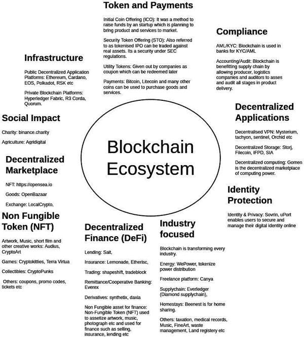
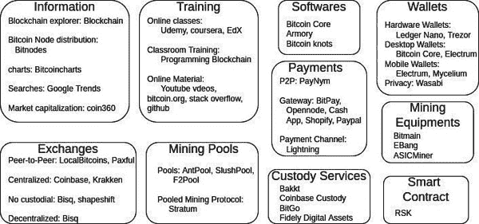

# 第一章

# 简介

撰写本书时，比特币已经运行了 13 年多。这是一个多么精彩的十年啊！比特币是第一个完全去中心化的货币，不需要任何可信赖的第三方来调解交易，使其成为实体现金的数字等价物。如今，有数千种加密货币，许多都有不同的价值主张。不仅仅是加密货币；整个生态系统仍在不断进化，带来新的创新。

在本章中，我们将尝试窥视围绕加密货币和区块链技术形成的生态系统的规模。您将了解不同类型的加密货币以及构成这一生态系统的每个部分。

# 结构

在本章中，我们将讨论以下主题：

+   加密货币和区块链生态系统

    +   分布式账本技术（DLT）

    +   加密货币及其价值主张

        +   智能合约和代币平台

        +   支付、价值储存和替代金融

        +   隐私

        +   预言机和多链连接器

        +   稳定币

    +   区块链生态系统

        +   交换媒介和价值储存

        +   私人和公共区块链

        +   授权和无需授权的区块链

        +   合规性、记录保存和审计

        +   代币

        +   去中心化应用

        +   可替代和不可替代代币

        +   去中心化金融

    +   比特币生态系统

        +   比特币教育、培训和在线帮助材料

        +   节点与钱包

    +   挖矿和挖矿池

        +   支付

        +   交易所

# 目标

本章的主要目标是提供一个关于区块链和比特币生态系统的概述，帮助读者了解该领域正在进行的创新规模。

阅读本章后，您将对区块链技术和加密货币所服务的不同目的有所了解。

# 加密货币和区块链生态系统

让我们看看数字来了解生态系统的规模和大小。

现在有超过 9000 种加密货币。所有加密货币的市值合计达到 1.8 万亿美元。有数十万种代币编写在各种加密货币之上。有超过 500 个交易所可以购买或出售加密货币。全球有超过 10000 台加密货币 ATM 机在运行。与加密货币和区块链相关的职位有数万个。全球有超过 1 亿用户。现在这是一个蓬勃发展的行业。

当比特币被创造时，它是一种唯一的加密货币。随着更多加密货币和其他技术的出现，我们开始将它们分为不同的类别，然后这些类别不断增长。

加密货币作为一种分布式交易账本运行。交易是资金方和收款方之间加密货币转移的记录。后来，我们构建了其他分布式账本，用于存储资产转移信息并在各方之间自动执行协议。这些分布式账本系统依赖于区块链。然后，出现了一些基于其他方法的创新想法。

# 分布式账本技术（DLT）

比特币采用了区块链技术，这是一种由区块组成的链表，每个区块都包含不可更改的交易列表或智能合约。类似于账本，它是一本记录簿。在网络中与他人共享。分布式账本技术（DLT）是一个总称，区块链是其下的一种技术。分布式账本技术（DLT）可以分为基于区块链的实现和非基于区块链的实现。很少有加密货币使用其他记录存储方法；例如，IOTA 使用**有向无环图**（**DAG**）。哈希图是另一种用于分布式记录的技术。这些也被称为分布式账本技术。

当企业开始涉足这个概念时，它们创建了具有访问控制并建立在防火墙后安全记录的区块链实现和平台。这些区块链实现是为了在组织内部或组织联盟之间使用，被称为私有区块链。企业联盟的私有区块链实现提供了由多个链组成的联邦架构。

以下是对前述描述的说明：

**图 1.1：分布式账本技术的分类**

# 加密货币及其价值主张

比特币被设计成一种具有有限和可控供应的货币。在经济学中，通货膨胀率是商品和服务价格在一段时间内上升的速度。在比特币术语中，通货膨胀是新比特币挖掘或铸造，或创造的速度。通货膨胀由算法控制，并且每 4 年左右减半。不同加密货币有不同的通货膨胀规则。

比特币最初是为点对点支付而设计的。最初，转移比特币不需要向比特币矿工支付费用，因为任何人都可以在他们的笔记本电脑上铸造比特币。大量供应、低价值、零交易费和全球存在使比特币成为一种良好的支付媒介。然而，随着时间的推移，比特币的价值增加，网络费用增加，供应开始减少，这使得它成为一个极好的增值资产。它仍然作为交换媒介使用，全球许多商家接受它。

以下是一些以其特定特性而闻名的顶级加密货币和代币项目：

**表 1.1：** 顶级加密货币/代币与其特定品质的映射

# 智能合约和代币平台

智能合约是在区块链上编码并使用编程语言编写的自我执行协议。

比特币提供了一种简单的编程语言，可用于编写智能合约。脚本语言非常原始，并不提供一个构建复杂现实世界合同的可行平台。为了解决这个问题，*维塔利克·布特林*创建了一种名为以太坊的加密货币，它支持图灵完备的*Solidity 语言*来编写合约。这种语言允许开发者比创建加密货币更快地创建代币。这导致了**首次代币发行**（**ICO**）通过代币销售筹集资金，代币化证券、实用性代币、**去中心化金融**（**DeFi**）以及最近**非同质化代币**（**NFT**）。这吸引了区块链技术解决现实世界问题的巨大兴趣。

However, RSK 是比特币的层 2 解决方案，提供了与以太坊类似的智能合约功能。与以太坊一样，RSK 允许使用*Solidity*编写智能合约。

# 支付、价值储存和替代金融

随着比特币变得有价值，个人电脑和笔记本电脑上的挖矿开始变得困难，大约在 2013 年，第一块 ASIC 硬件面市，提高了网络费用。很清楚，如果网络费用继续增加，比特币作为购买咖啡等低价值物品的支付工具将不再可行。比特币开发社区在是否增加区块大小以降低交易费用，还是保持不变，以便比特币网络在安全方面不做妥协的问题上产生了分歧。

Alternatively, 以太坊、莱特币和其他一些加密货币使用了抗 ASIC 的挖矿算法。这个想法是使用需要内存的算法，而不是更快的处理速度，因为 ASIC 硬件在解决 CPU 密集型问题时效率很高，而对于内存密集型问题则不擅长。

比特币现金是创建的主要目的是通过增加区块大小来降低交易费用的比特币硬分叉之一。

其他如莱特币和狗狗币等加密货币提供了更短的确认时间，使它们更适合现金支付。

XRP 是一种提供全球范围内近实时支付的加密货币。其主要目标是向金融机构提供一种交换媒介。它声称提供类似 SWIFT 的支付处理能力。

# 隐私

比特币交易记录在区块链上，任何人都可以查看它们。当我们从交易所购买比特币时，我们需要向交易所提供 KYC 信息。交易所知道你的交易情况，所有相关的交易也都在区块链上。交易所可以将这些信息泄露给罪犯、黑客、外国政府、广告商等。交易所还可以将区块链上的其他交易关联起来，你可能会失去你的财务隐私。有几种方法可以提供使比特币交易更加私密的途径，但这些并不如加密货币那样好，因为加密货币是以隐私为目标设计的。门罗币、达世币、Zcash 和 Zcoin 是一些专门以隐私为目标设计的加密货币。

# 预言机和多链连接器

智能合约执行协议，但这些协议是基于区块链上不存在的现实世界信息。这些信息是由称为“预言机”的实体提供的。这些实体大多是中心化的第三方。波卡和链链提供了去中心化的机制，以提供外部现实世界信息。波卡和链链可以在多个区块链之间进行接口，使它们能够交换信息。这导致了这个领域内一些有趣的项目的出现。这些概念仍在成熟中，我们可能会看到这个领域出现更多的进展。

# 稳定币

稳定币是一种与另一种资产（如美元、欧元或比特币）、黄金等实物资产挂钩的加密货币。

加密货币是在交易所用货币进行买卖的，这吸引了交易所收取的费用。对于想要利用加密货币市场的波动性但发现费用高昂的交易者来说，可以将他们的加密货币投资转移到稳定币上，并在需要购买加密货币时使用它们。

此外，世界上大多数人都无法接触到如美元和欧元等被认为是更稳定的货币。他们可以购买与这些货币挂钩的稳定币。

# 区块链生态系统

区块链生态系统包括加密货币、私人和公共区块链、交易所以及创建在它们之上或与之相关的其他服务。

以下是对区块链生态系统的广泛概述。请注意，区块链生态系统非常广泛，这里无法展示所有内容：

**图 1.2：** 区块链生态系统

# 媒介交换和价值储存

我们了解到，加密货币是为了满足特定需求而创建的。所有加密货币都需要开发者；它们需要交易所。那些作为支付手段变得流行的加密货币需要支付处理器、钱包以及接受它们的商家。

作为一种价值储存手段或 SoV 而变得流行的加密货币需要极其安全的储存方法来长期保存，所以需要保险库和硬件钱包，需要能够提供保管服务的资产管理员，还需要 ETF，这样非技术投资者就可以依赖金融机构来保障资金安全。

# 私有与公有区块链

像 Hyperledger Fabric 这样的私有区块链被创建出来，以提供组织数据的不可篡改性和访问控制，这些数据可以被审计员验证。Hyperledger Fabric 等私有区块链技术还提供了一个联邦结构，每个组织可以使用 Hyperledger Fabric 创建各自的区块链，数据和代码可以在链之间转移。这使得具有相似利益的组织团体可以聚集在一起，共享数据以改进供应链、透明度和审计性。这也为组织团体提供了访问控制机制，赋予了一定实体集特定的权利。

# 许可式与非许可式区块链

许可式区块链实现是为了组织内部使用或组织间的一组组织内部使用。只有指定的或预定义的实体才能参与。就像办公室互联网，只有指定的各方可以使用它，普通公众无法使用。

另一方面，非许可式区块链不需要任何加入或与区块链互动的权限。任何能上网的人都可以开始使用它。

# 合规性、记录保存和审计

金融机构已利用私有区块链来存储客户的 KYC/AML 数据。由于区块链是不可篡改的，它提供了易于审计的功能，有助于满足合规要求。私有区块链也已被用于记录保存，如医疗记录。

# 代币

像以太坊这样的公有区块链（它简化了用易于开发的语言编写智能合约）允许代币的发展，分布式应用开发，数字资产的交易和估值，以及供应链管理。代币的发展促成了**首次代币发行**（**ICO**）和**证券化代币发行**（**STO**），这些都被用于为初创公司筹集资金。实用性代币有助于数字化优惠券或票据。

# 去中心化应用

分布式应用或 DApps 是基于去中心化网络的应用程序，它们使用智能合约和用户界面，表现得像任何托管应用程序。DApps 用于构建可以帮助构建平台和市场应用程序。这些市场和平台作为去中心化组织运作。DApps 还可以提供抗审查和隐私功能。

# 同质化与非同质化代币

可替代代币就像货币一样。如果一个代币是可替代的，那么它与其他相同代币无法区分。所有加密货币都是可替代的。有时游戏中有一些物品是全局限量的，对所有玩家在任何等级都具有相同价值；这些也可以被认为是可替代的。

NFTs 代表*非同质化代币*。非同质化代币与可替代代币相反，这意味着它们的价值观取决于情况和个体偏好，就像电影院的座位成本，可能因座位的位置而有所不同。它们适用于资产的数字化，如艺术、短片、音乐等，或适用于数字资产，如数字艺术品和收藏品。

# 去中心化金融

去中心化金融或 DeFi 是在区块链上使用智能合约创建的金融合约。智能合约可用于借贷、保险、交易和衍生品市场等许多其他领域。去中心化金融还可以涉及数字资产或货币用于结算或抵押。

# 比特币生态系统

随着加密货币和区块链的不断发展，比特币生态系统也在演变。为了改善用户和开发者的体验，已经建立了很多服务。有专门为比特币设计的服务，也有为加密货币、代币和区块链设计的服务，这些服务反过来也促进了比特币的发展。

以下是比特币生态系统的示意图：

**图 1.3：** 比特币生态系统的构建模块

# 比特币教育、培训及在线帮助材料

有若干网站为我们提供学习材料、区块链信息、价格信息、挖矿池、趋势等信息。还有些网站提供由 MOOC 提供商提供的比特币在线课程。甚至像 MIT 这样的知名大学也提供比特币的在线课程。此外，还有培训机构和个体举办的课堂课程。还有网站提供测试平台，提供转换器、计算器、验证工具等。除此之外，在 git 上还可以找到许多用 Python、Node.js、Golang 等编写的实用库。YouTube 上也有许多解释比特币区块链各个方面的视频。除此之外，还可以在 stack exchange 上提问技术问题，可能会得到核心开发者的回复。

# 节点与钱包

有许多比特币节点软件可供选择，其中一些提供完整节点功能，而其他则提供 SPV 节点。通过名为钱包的软件访问比特币。有由交易所和支付处理器提供的在线钱包，也有硬件钱包、桌面钱包、移动钱包和轻钱包。

# 挖矿与挖矿池

当矿工解决数学问题并创建下一个区块时，他们会获得比特币作为奖励。矿工争相解决这个难题。公司也争相建造挖矿设备，这些设备以更低的成本提供更好的计算能力。随着更多矿工进入市场，以及挖矿设备公司建造更高效的挖矿设备，Bitcoin 网络会调整这个难题的难度。这降低了旧设备的回报率，它们变得过时。

随着比特币价格以指数方式上涨，挖矿难度也大幅增加。由于这一点，任何人独自解决一个难题的机会微乎其微，即使他们拥有世界上最好的数百台设备。这就是当前挖矿的状态。为了解决这个问题，任何想通过挖矿赚钱的人都必须加入一个挖矿池。有一些挖矿池会在矿池挖出一个区块后，根据矿工的贡献支付矿工。

# 支付

Bitcoin 钱包能够接收或发送比特币到其他的 Bitcoin 钱包。人们可以使用与他们钱包关联的比特币，并将其发送到另一个 Bitcoin 地址，该地址将与接收者的钱包相关联。建议我们始终为接收比特币使用新的地址。对于支付来说，这是实现起来过于复杂的事情。因此，Bitcoin 提供了一种安全且私密的支付转账方式，称之为 PayNyms。

还有像 BitPay 这样的支付网关，以及像 Coinbase 这样的交易所也提供支付网关，允许比特币用于商业目的，如购买等轻松转账。像 Paypal 这样的支付网关允许客户用比特币给钱包充值，并以美元或其他货币向商家支付。

Bitcoin 交易，如果支付了足够的网络费用，平均需要 10 分钟来确认，这可能需要几美元。确认意味着将交易纳入一个区块。由于网络费用高昂，购买咖啡并不可行。为了解决这个问题，Bitcoin 有一个第 2 层网络叫做**闪电网络**，它允许商家与客户创建通道。如果在该通道上进行了足够的交易，那么有效的网络费用就会低到足以使交易可行。闪电网络上的交易也是即时的。

# 交易所

是交易所赋予了比特币货币价值。交易所是加密货币买卖交易的地方。在交易所里有买家，他们希望以一定的询价购买比特币，也有卖家以一定的价格出价。中心化交易所利用询价和出价来上下调动价格，以发现比特币的正确价格。交易所也承担风险，因为价格可能迅速波动，因此可能会因此受损。所以，中心化交易所根据市场波动收取差价费用，但并非所有交易所都这样。点对点交易所没有足够的成交量可以追踪加密货币价值，因此它们为买家和卖家提供一个直接相互购买的平台，并收取固定的佣金。

交易所也可以按照以下方式分类：

+   **托管交易所**：持有比特币钱包的交易所

+   **非托管交易所**：不持有比特币钱包的交易所

# 结论

在本章的开头，我们探讨了与比特币、区块链和分布式账本技术（DLT）相关的发展。这让我们对构成生态系统的要素、它的进展情况以及它对我们生活的影响有了很好的了解。

在下一章中，你将了解一些帮助中本聪建立比特币的历史，然后你将学习它是如何发展的。你还将了解比特币的定义、它解决的游戏理论问题以及解决问题在未来即将产生的影响。此外，我们还将介绍比特币的基本属性。

# 需记住的要点

+   当比特币被创造时，它是唯一的加密货币。

+   中本聪是一个化名，在 2008 年 10 月 31 日发布比特币白皮书，发布代码，并在 2009 年 1 月 3 部署网络。他一直活跃到 2010 年 12 月。他的身份至今仍然未知。

+   比特币有一个原始的脚本语言，足以编写智能合约。

+   DLT 是分布式账本技术，包括区块链、哈希图、有向无环图等。

+   私有区块链在组织内部运行。

+   公共区块链是开放的网络，世界上任何地方的人都可以与它们互动。

+   有许可的区块链实现是为了组织内部使用或多个组织之间的内部使用而创建的。

+   无许可的区块链不需要任何加入或与区块链互动的许可。

+   加密货币可以根据它们的价值主张进行分类。

+   很少有加密货币提供图灵完备的脚本或编程语言支持，这使得编写智能合约并在其上构建代币变得更加容易。

+   同质代币就像货币一样。如果一个代币是同质的，它与其他相同的代币无法区分。

+   NFT 是不可替代代币。非可替代代币与可替代代币相反，这意味着它们的价值取决于情况和个体偏好。

+   去中心化金融或 DeFi 是在区块链上使用智能合约创建的金融合同。

+   稳定币是一种与另一种资产（如美元、欧元、比特币或黄金等实物资产）挂钩的加密货币。

+   分布式应用或 DApps 是基于去中心化网络的应用程序，它们使用智能合约和用户界面，表现得就像任何托管应用一样。

+   托管交易所持有自己的比特币钱包。

+   非托管交易所不持有比特币；这些交易所的用户直接从他们存放在交易所外的钱包中发送和接收比特币。

+   适合小额购买的加密货币，归类为货币或媒介。

+   那些交易成本高、在使用它们的过程中建立用户信心的加密货币，如它们将是安全的、可靠的，并长期保护价值，可以被认为是价值储存手段。

+   智能合约是编码在区块链上且使用编程语言编写的自我执行协议。

+   初始币发行（ICO）用于筹资，与 IPO 类似，但使用的是基于以太坊等加密货币创建的代币。这一方式被提供产品和服务的初创公司用于加密货币和区块链领域。

+   安全代币发行（STO）是像 ICO 一样的公开募集，但作为数字证券在交易所出售，这些证券具有法律约束力，因此，它们是投资者的更好选择。

+   实用代币是公司以优惠券或票证的形式发行的，这些优惠券数量有限。这些优惠券可以以后使用，或者票据可以用于音乐会。

+   交易所是加密货币获得价值的市场。

+   钱包包含一系列可以接收加密货币的地址。钱包还可以访问这些加密货币，将它们发送到其他地址和钱包。

+   完整节点是一个程序，它验证所有区块和交易。

+   挖矿节点通过使用计算能力与其他挖矿节点竞争解决加密难题。

+   解决加密难题的挖矿节点将区块中的交易从内存池添加到区块中，矿工会获得比特币作为区块奖励。

+   矿工加入挖矿池，合作而非竞争解决加密难题。根据矿工在计算能力方面的贡献，他们按比例获得挖出的加密货币。

# 问题

1.  DApp 与托管应用有何不同？

1.  首次币发行（ICO）的哪些缺点导致了它们作为筹资工具的失败，以及安全代币发行（STO）如何解决这些问题？

1.  为什么比特币挖矿消耗大量能源？

1.  “账本”这个术语与区块链有何关联？

1.  层 2 和侧链之间有什么区别？

1.  什么是图灵完备语言？

1.  请给出五个可替代商品和非可替代商品的例子。

1.  Give five applications of utility tokens.

1.  Match the most important property of blockchain with the listed applications:

    **Properties:**

    1.  Immutability

    1.  Smart contract

    1.  Decentralized

    1.  Consensus

    1.  Ledger

    1.  Chronological order

    **Applications:**

    1.  Recordkeeping, auditing

    1.  Transactions, payments

    1.  Marketplace

    1.  Timestamping

    1.  Agreements

    1.  Voting

1.  Fill in the blanks:

    1.  DApps are applications built on the ___________ network using _______ contract and ____________.

    1.  _______________ was the first cryptocurrency launched decades before Bitcoin.

    1.  Bitcoin is not __________ coin, but it is _____________ resistant.

    1.  ____________ helps smart contract interact with real-world resources.

    1.  First blockchain was used for reliable decentralized ___________.

    1.  Ethereum provides ______________ language for its smart contract called Solidity.

1.  True/False:

    1.  Blockchains do not need to have a value associated with transactions.

    1.  Bitcoin script language does not support smart contracts.

    1.  Hardware wallets contain cryptocurrencies and losing them means losing all the stored currencies.
