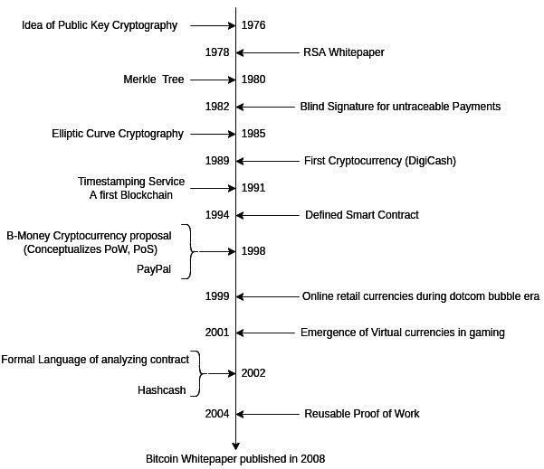
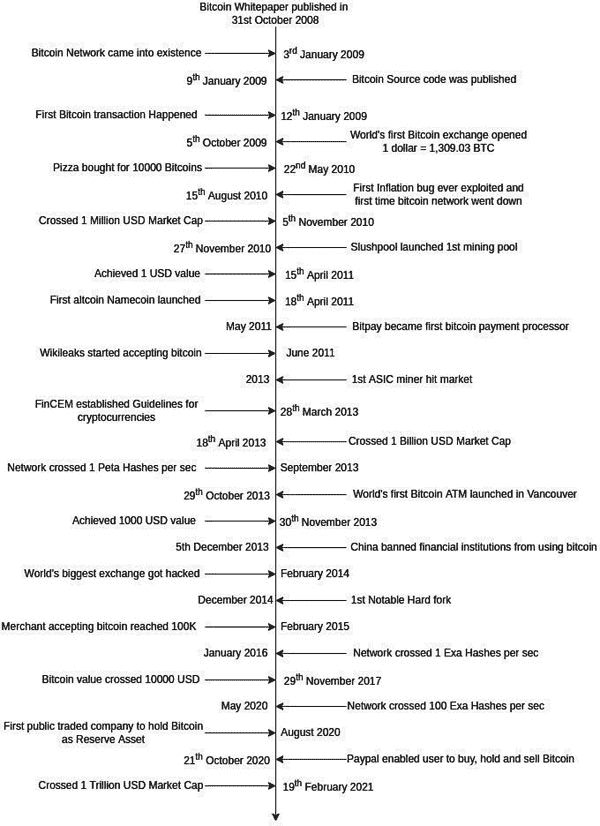
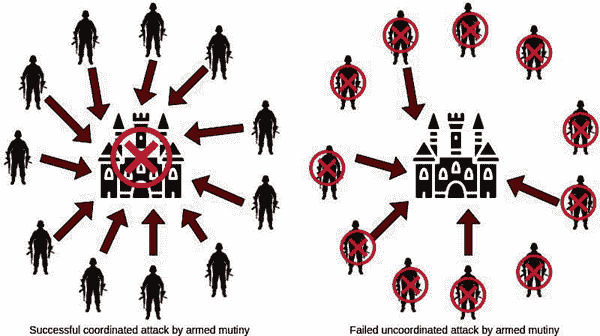

# 第二章

# 比特币概览

在上一章中，您对比特币和区块链生态系统有了基本的了解。您还学习了在技术领域中经常使用的基本术语。

在本章中，您将了解导致比特币发展的因素，当时正在发生哪些发展，以及哪些成功和失败。然后，我们将调查过去 13 年中发生了什么，即重要的里程碑是什么，重要的成就是什么帮助比特币变得流行，以及哪些事件导致了比特币采用的挫折。

随后，您将了解比特币是什么，它解决了什么问题，如何解决问题，以及解决问题所产生的影响规模。我们还将理解为什么理解比特币很重要，以及了解它如何帮助我们。

您还将了解赋予比特币价值的特性。

# 结构

在本章中，我们将讨论以下主题：

+   学习比特币的依据

+   导致比特币的发展

+   比特币的兴起

+   定义比特币

    +   拜占庭将军问题

    +   比特币作为拜占庭将军问题的解决方案

    +   比特币作为数字资产的属性

# 目标

本章的主要目标是建立学习比特币的依据。我们希望在深入探讨即将到来的章节中的技术之前，让读者充分理解比特币这一概念。

为了使读者充分欣赏比特币，他们需要了解其成长历程和所取得的成就。因此，在本章中，我们将学习比特币的历史以及促使比特币发展的相关技术。我们还将理解比特币的价值主张。

阅读本章后，读者将了解学习比特币的重要性。

# 学习比特币的依据

现在，我们对分布式账本技术生态系统在过去 13 年中变得多么庞大有了一个很好的了解。因此，可能会有一个问题，“如果分布式账本技术已经发展了这么多，那么我们为什么还要学习一个过时的技术？”

尽管加密货币种类繁多，但比特币在某些方面仍然领先，如下：

+   比特币网络是最安全的网络，因为挖矿计算能力为其安全做出了贡献。

+   与其他所有加密货币和代币相比，比特币的市场主导地位最高。

+   由于比特币没有公认的创造者，因此可以认为它比其他任何加密货币或代币项目都要去中心化。

+   比特币的改进过程相当严格，这意味着只有当大多数利益相关者完全确信某个功能时，改进才会被接受。这意味着只有与比特币特性相一致的最佳功能才会被接受。

+   比特币网络是最受监控的加密货币网络，它充当早期预警系统，在灾难性事件发生前检测异常。

+   比特币网络在加密货币领域拥有最大的开发者基础，仅次于以太坊。

+   比特币，作为最早的加密货币，与其他加密货币相比具有优势。它经历了各种攻击，如技术、社会和政治方面的攻击。由于这个原因，它在全球领导者中建立了声誉，并且是包括对冲基金经理、顶级上市公司、政府和等等在内的最接受的加密货币之一。

现在看来比特币并未过时且表现良好可能是显而易见的，但我们仍然需要了解为什么学习比特币很重要。

如前所述，比特币是最早的加密货币，因此其代码被大多数加密货币使用。比特币是大多数其他加密货币和区块链的基础。这意味着它可以帮助你理解其他加密货币和区块链技术的内部工作原理。这可能有助于你理解以太坊、超级账本或其他流行技术，为软件工程师和企业家提供更好的机会。

了解比特币内部结构也有助于你保障你的加密货币投资，了解其长期价值鼓励你长期持有，避免陷入恐慌性买卖。

# 导致比特币的发展

中本聪是一个天才，但他/她不是第一个创造加密货币或考虑它的人。他建立了一种比早期实现更优越的加密货币，并召集了合适的人来研究。比特币是密码学领域所有正在发生的事情的结晶。

以下是在密码学领域的发展时间表以及在此过程中发生的集中化和去中心化货币实验：

**图 2.1：** 导致比特币的密码学发展的历史

1976 年 11 月，一篇题为《密码学的新方向》的论文由*怀特菲尔德·迪菲*和*马丁·E·赫尔曼*发表。该论文提出了一种由两个密钥组成的方法：一个用于加密可以公开共享的消息，另一个用于解密私有消息，密钥的所有者可以安全地持有。该论文还提出了数字签名概念。它说，就像物理签名一样，数字签名将附加到文档上，可以由签名所有者创建，也可以由任何人验证其内容和签名者。

这个概念后来在 1978 年的一篇名为《*由 R.L. Rivest, A. Shamir*和*L. Adleman*提出的获取数字签名和公钥密码系统的方法》的论文中首次提出了实现方案。如今，RSA 和其他非对称公钥密码算法被广泛用于传输机密和通过 SSL 安全地连接互联网。

1980 年，*Ralph C. Merkle*发表了一篇题为《*公钥密码系统的协议*》的论文。这篇论文很重要，因为它提出了一种通过迭代哈希验证消息单个元素完整性的方法，稍后你会了解到。这被称为*Merkle 树根*。它通过确保区块中的交易完整性来帮助比特币区块链。

1982 年，*大卫·乔姆*发表了一篇题为《*不可追踪支付的盲签名*》的论文。该论文试图解决与数字支付相关的隐私问题。*大卫·乔姆*预见到了数字支付的危险，今天，我们知道金融隐私很重要。他在 1989 年推出了 DigiCash，这是第一种加密货币，当时非常成功。然而，它之所以失败，是因为它不是去中心化的。

1985 年，*维克多·S·米勒*发表了一篇题为《*密码学中椭圆曲线的应用*》的论文，解释了如何在有限域中的椭圆曲线用于公钥密码学。比特币使用椭圆曲线密码学以及数字签名。

值得一提的是，比特币白皮书有 8 个参考文献，其中 3 个参考文献是关于*W.S. Stornetta*撰写的论文。从 1991 年开始，他撰写了多篇关于不涉及中央时间戳权威的数字时间戳的论文。*W.S. Stornetta，D. Bayer*和*S. Haber*在过程中创造了第一个区块链（当时不叫区块链）。他们创建了一个不可变记录序列，通过线性哈希链相互链接。

1994 年，*尼克·萨博*提出了智能合约的想法。1998 年，他提出了一个去中心化加密货币 Bit-gold 的想法。它从未推出，但它为加密货币奠定了基础，导致了比特币的发展。2002 年，他撰写了一份论文草稿，《*合同分析的形式语言*》，描述了智能合约的语言。

1998 年是一个有趣的年份。PayPal 问世（提供了替代支付系统，至今仍很受欢迎），Bit gold 被构想出来，*韦伊·戴*提出了 b-Money 的想法。这一年，他构想了工作量证明和权益证明。工作量证明被比特币和其他许多加密货币用作共识算法，而权益证明被 Cardano 使用，将来会被以太坊使用。

许多数字货币在 1990 年代末至 2000 年代初被推出，但它们都失败了。有网络货币，还有游戏货币，这些货币在游戏中使用。第二人生有一种可以用真实货币购买的货币，你可以在游戏中赚钱，然后将其兑换成真实货币。

2002 年，*亚当·巴克*发表了一篇论文，《哈希现金 - 一种拒绝服务对策》。这篇论文在*比特币白皮书*中被引用。该论文提供了一种使互联网资源的系统性滥用变得昂贵的机制。其中一个应用是电子邮件垃圾邮件。它使用 CPU 功率来阻止垃圾邮件或任何类似的互联网资源滥用。

2004 年，*哈尔·芬尼*发布了*RPOW - 可重用工作量证明*的代码。这可能是中本聪创建比特币所需的最后一块拼图。在此之前，工作量证明可以用来生成一个代币，这个代币可以帮助执行一次交易。RPOW 允许代币的接收者生成一个新的代币，它可以发送给下一个人，依此类推。这样，由工作量证明生成的代币就像货币一样发挥作用。RPOW 使用哈希现金作为工作量证明代币。哈希现金代币的接收者用一个名为 RPOW 代币的 RSA 签名代币来换取哈希现金代币，然后将其发送给下一个接收者，并重复这个过程以推动其进一步传播。

值得注意的是，自 1980 年代以来，已经推出了大量数字货币或数字支付方法，但除了少数游戏货币外，只有 PayPal 幸存下来。有几家公司试图复制 PayPal 模式，但它们都失败了。在失败尝试中最成功的是 e-gold。任何人都可以创建一个账户，并将他们的黄金和银转换为 e-gold。

当中本聪撰写比特币白皮书时，构建比特币所需的所有成分已经存在。即使中本聪没有做，第一个工作加密货币也会产生。中本聪是天才，但不是超人类。他的白皮书非常容易理解，这就是为什么它吸引了很多人。部分原因是所有的复杂性已经在之前由同样聪明的人完成的工作中得到了照顾。

中本聪应该得到赞誉，不仅仅是因为他创造了第一种加密货币，即使没有他，这种情况迟早也会发生，而是因为他用正确的心态设计了它，这使得它在 13 年后仍然占据加密货币市场的市值主导地位，并且可能会在未来的几年里继续占据主导地位。

最后，中本聪可能掌握了关于密码学中正在发生的事情以及任何发行货币或支付系统的人所发生的一切的信息。他足够聪明，能够创造真正去中心化和抗审查的东西，同时隐藏自己的身份。

# 比特币的崛起

2008 年 10 月 31 日，*中本聪*在 metzdowd.com 的密码学邮件列表上发表了题为《比特币：一种点对点的电子现金系统》的比特币白皮书。2009 年 1 月 9 日，中本聪在*SourceForge*发布了比特币代码，并通过挖掘第二个及以后的区块启动了网络。第一个区块是硬编码在代码中的，因此没有挖掘，任何区块链的第一个区块都被称为创世区块。中本聪与包括*Hal Finney, Adam Back, Gavin Andresen*在内的许多密码学领域的聪明人合作。中本聪与 Hal Finney 合作密切，2009 年 1 月 12 日，他们之间发送了第一笔交易。

令人惊讶的是，比特币迅速受到了关注。2009 年 10 月 5 日，世界上第一个比特币交易所成立，当时 1 美元可以买到 1309.03 个比特币。2010 年 5 月 22 日，有人用 10000 个比特币买了两份披萨。[这一天被称作比特币披萨日](https://wiki.example.org/bitcoin_pizza_day)。

比特币网络从未停止工作过并不是真的。这种情况发生了两次。第一次，一个通货膨胀漏洞（一个允许增加加密货币供应的漏洞）被发现，但在它被修复之前，有人用它生成了比特币。这个问题在几小时内得到解决，使额外的比特币无效。第二次是在 2013 年 3 月，一次比特币软件升级导致了网络分裂。这个问题很快得到解决，因为池和节点所有者积极地回到了旧版本。

最初，任何人都可以轻松地在个人电脑或笔记本上挖掘比特币。由于矿工不多，挖掘一个区块不会花太多时间。然而，随着更多的人开始挖掘，挖掘一个区块变得需要很长时间。2010 年 11 月 27 日，Slushpool 推出了第一个挖矿池，矿工们共同挖掘一个区块，一旦挖掘成功，奖励将根据矿工的贡献进行分享。后来，挖矿池成为了挖掘区块的唯一可行方式，几个挖矿池几乎完全控制了网络的计算能力。时至今日，这种情况依然存在。2014 年 7 月，一个挖矿池短暂地获得了网络 50%以上的挖矿权力。这个挖矿池没有尝试进行 51%的挖矿攻击，但它意识到这可能会影响网络的整体信誉，并承诺永远不会超过 40%的总挖矿力量。

Namecoin 是比特币之后推出的第一个加密货币。同年，Litecoin 也被推出，并且至今仍然很受欢迎。2013 年，当 ASIC 矿机上市时，计算要求变得过高，使得小玩家难以进行挖掘。那时，许多矿工转而挖掘 Namecoins，Litecoins 和其他货币。

2011 年 5 月，Bitpay 成为了第一个允许商家接受比特币作为支付的处理商。

2013 年 3 月 28 日，美国首次制定了加密货币法规。FinCEN 引入了这些法规。

2013 年 10 月 29 日，加拿大温哥华的第一台比特币 ATM 开业。

比特币交易所有一个被黑客攻击的历史，很多人失去了他们的比特币。然而，对比特币价格和信心最大的影响发生在 2014 年 2 月 MtGox 被黑的时候。当时它是最大的比特币交易所。

2014 年 6 月 10 日，*迈克·赫恩*创造了 BIP 64。同年 12 月，他发布了软件，导致了第一次硬分叉和比特币 XT 的创建。

2010 年，中本聪秘密引入了 1MB 的区块大小限制。由于每个区块每 10 分钟生成一次，1MB 的区块大小限制是比特币扩展的最大限制因素。在 1MB 的限制下，比特币最多能有每秒 7 笔交易。一些开发者在 2011 年就提出了提高这一限制的建议。

2015 年，BIP 100 和 BIP 101 被提出以提高这一限制。许多比特币硬分叉与这一限制的增加有关。通过隔离见证软分叉，这一限制得到了提高。

比特币在价格飙升和暴跌时有多个炒作周期。这些炒作周期出现在 2011 年，2013 年两次，以及 2017 年。这些炒作周期为比特币提供了媒体曝光，并有助于提高采用率。2020 年 8 月，MicroStrategy 成为首家在其库存中持有比特币的上市公司。这使得比特币作为价值储存手段的合法性得到了认可。

以下是自那时以来比特币所取得的事件和成就的时间线：

**图 2.2：** 自比特币白皮书发布以来的时间线和里程碑

# 定义比特币

比特币不是一回事，而是两回事，以下是它们的定义：

**比特币是一个无需许可、可验证、点对点、供应不弹性且具有进化属性的资产。**

以及

**一个去中心化的网络，旨在在不可信的环境中，无需中介创建、存储和转移比特币。**

比特币也被设计为可扩展，并有与之并列和以上的层级。与其他现有网络相比，比特币具有最高的累计工作量证明。在未来的应用中，资产、货币和代币将能够自我保障，并从比特币中获得部分价值支持。由于其设计、开源、去中心化特性、价值以及累计的工作量证明，它有朝一日可能成为互联网的一个基本组成部分。将来，比特币可能具有以下定义：

**互联网内的一层信任。**

# 拜占庭将军问题

比特币网络采用工作量证明（Proof-of-Work，简称 PoW）共识机制来生成比特币，并通过脚本、加密和工作量证明来将其从后续接收者那里转移。

比特币的工作量证明（PoW）共识机制试图在一个敌对环境中建立共识，攻击者可能正在合作攻击网络，通过包括或排除可能帮助他们交易信息的 messages。这就是这本书有一个副标题的原因：

**在不可信环境中建立信任**

这实际上是 1982 年发表的一篇名为《拜占庭将军问题》的论文的解决方案，该论文由*Leslie Lamport, Robert Shostak, 和 Marshall Pease*发表。这是一个重要的博弈论问题，该问题的条件如下：

1.  拜占庭军队正在计划对一个城市进行攻击。

1.  拜占庭军队有几个师，每个师都由一位将军指挥。这些将军在城市的不同距离外驻扎。

1.  任何两个将军都不能直接相互通信，他们需要依靠信使传递他们的消息。

1.  为了赢得对城市的攻击，他们需要就攻击计划达成共识。这需要大量的通信。

1.  现在的问题是，他们中可能有叛徒，他们试图通过传播错误信息来破坏计划。

1.  协调一致的攻击将导致胜利。

1.  无协调的攻击将会失败。

以下是拜占庭将军问题的胜败条件的图示表示：

**图 2.3：拜占庭将军问题的说明**

在比特币的情况下，大多数参与节点同意交易消息、它们的顺序以及与之前接受的消息的链接，基于定义的共识规则。每个节点在这里扮演将军的角色。与拜占庭将军问题不同，目标是保护网络。如果网络被破坏，那么叛徒攻击者可以双重支付、排除或包含消息，并改变消息的顺序。这将影响网络的信用价值。

现在，我们了解到比特币共识机制本质上解决了拜占庭将军问题。

同样的拜占庭将军问题可以考虑具有以下特征，以用于需要合作的其他类似问题：

1.  如果有大多数人在合作，任何数量的将军都可能是叛徒。这使得它成为一个民主系统。

1.  每位将军可能扮演不同的角色来实现计划的成功。这可能已经达成了协议。

1.  共识可以在不需要领导的情况下达成。

这对现实世界有影响，因为在大多数需要达成协议的事务中，需要一个中央可信任的权威。所以，这个影响超出了支付范围。

例如，如果我们想要建立一个出租车聚合网络，将会有乘客、司机、车主和汽车本身。他们四个人需要通过共识规则达成协议，这些规则以智能合约为形式，其中：

1.  司机将把乘客用最节省时间的方式送到他的具体位置，

1.  汽车将由车主维护，司机会在需要时加油，

1.  乘客在到达目的地后支付给车主，

1.  司机将从车主那里得到他的月薪。

尽管驱动者、乘客、车主和车辆之间有清晰的区别，但一旦建立了协议规则，每个人在等级上都是平等的。每笔交易记录保持在不可更改的记录序列中，以确保易于审计。不需要中央权威来领导平台。

以下插图展示了一个汽车聚合网络：

**图 2.4**：去中心化的汽车聚合网络

# 比特币解决拜占庭将军问题的方案

为了解决这个问题，比特币需要：

+   保持所有交易按照它们发生的时间顺序，在不可更改的记录序列中。

+   确保交易在不可更改性和顺序方面，以及任何共识规则或合同时易于验证。

+   能够解决任何可能因为两条记录同时生成而产生的竞争条件。

+   快速移动消息，以确保之前提到的竞争条件不会使确认时间变长。

这就是比特币具有以下特性的原因：

+   **工作量证明**通过在创建时附加成本，使交易变得不可更改。

+   **区块链**由包含交易的区块组成，每个区块都知道前一个区块的信息，并且每个区块按时间顺序排列。

+   比特币的工作量证明算法使得验证区块变得容易，但创建它们却异常困难。这确保了交易传播速度足够快，以至于两个遥远的节点同时创建区块的竞争条件得以在区块深度达到六层之前解决。

+   每笔交易通过**密码学**和脚本执行的顺序、共识规则和合约与前一笔交易关联。

+   **验证节点**或全节点就像是观察者，在比特币矿工进行的比赛中观看比赛。它们不是通过创建区块并使用工作量证明算法将交易添加到区块来确认交易。相反，它们验证所有共识规则、智能合约条款、区块的时间顺序、比特币从发送者到接收者的发送，以及比特币从前一笔交易中的资金。

# 比特币作为数字资产的属性

比特币网络需要收集手续费，以便它能资助挖矿的成本，因为挖矿是保障网络安全的**工作量证明**。中本聪设计了一种智能的方法来实现这一点：

+   当矿工解决加密难题，成功挖出一个区块时，他会获得新铸造的比特币作为报酬。每挖出 210,000 个区块，奖励就会减半，大约需要 4 年。

+   后来，随着网络价值的提升，矿工会收取费用，以将交易包含在区块中。

这确保了比特币的供应完全不受弹性影响，也就是说，它的供应是预先确定的。比特币的供应也在以指数级速率减少，这意味着当它变得流行时，供应将不足以满足需求。

区块奖励从创世时的 50  减少到作者撰写此书时的 6.25 ，网络费用从开始时的零显著增加。这使得比特币对投机的吸引力降低。

比特币也具有很高的可分性，最小单位为聪，其价值如下：

比特币不需要中介，这使得它成为物理现金的数字等价物。

比特币既不是一种隐私币，也不会透露你的身份。比特币的隐私特性可以如下理解：

+   比特币不将一个人与一个身份链接起来；相反，比特币与地址相关联。

+   比特币可以从交易所、矿工或个人那里购买。这使得比特币的追踪变得困难。

+   比特币可以从交易所购买。大多数交易所遵循 KYC 规范，因此，将身份与地址链接起来。当我们从交易所转移我们的比特币时，交易所知道接收地址。

+   比特币区块链上的所有交易都是透明的，包含诸如前一个交易、支付给地址和资金地址及接收地址等信息。这样，每笔交易都有一个历史，可能会留下发送者或接收者身份的线索。

+   有一些技术可以使找到身份变得相当困难。

总体而言，比特币隐私是一个非常个人化的问题。因此，当政府监管比特币并激励其使用时，比特币地址变得更加透明，也更容易追踪，但当政府惩罚其用户时，比特币地址变得不透明，更难以追踪。这使得比特币具有抗审查性。

比特币在网络上，而钱包只持有其私钥。这使得比特币与地理位置无关，因此，人们可以轻松地在地球的两端之间转移比特币。

比特币的价值由交易所决定。由于比特币可以轻松地在全球任何地方转移，所以它在每个货币中的价值几乎相同。在某些情况下，当政府对加密货币施加限制或当地货币受到货币控制时，比特币的价值可能会比国际价值稍高。

比特币是网络上与一个地址相关联的一个数字。如果一个地址与犯罪分子或黑客有联系，交易所可能会封锁这样的地址，这可能会影响该比特币在下一次交易中的价值。但在后来的交易中，如果它与其他比特币混合，那么它就与其他任何硬币无法区分。由于比特币几乎无法区分，因此它们非常同质化。

所有有效的比特币交易要么在内存池（比特币网络上的每个完整节点的内存）中，要么在区块链上。这些交易由节点验证。任何人都可以通过拥有一个节点或查看一些流行的网站来查看一个交易。

这赋予了比特币以下特性：

+   稀缺性

+   可分性

+   抗审查性

+   易于转移

+   可兑换

+   可验证

此外，它使比特币：

+   不适合投机

+   更适合持有或保存

# 结论

在本章中，我们回顾了密码学发展的历史，这导致了比特币的产生。然后，我们查看了从白皮书发布到撰写这本书的时间线。

之后，我们定义了比特币和它解决的拜占庭将军问题。你了解到它是如何解决游戏理论问题的，以及问题的解决方案如何改变组织的根本结构。然后我们利用这些知识来列出比特币的基本特征。

在下一章中，你将了解比特币网络的结构。我们将把网络的每个部分与本章中学到的比特币的基本原理联系起来。

# 需记住的要点

+   在比特币之前，密码学的发展已经进行了近 30 年，为其产生奠定了基础。

+   DigiCash 是第一个已知运行的加密货币，于 1989 年推出。

+   W.S. Stornetta, D. Bayer, 和 S. Haber 创造了第一个区块链。

+   Wei Dai 提出了 b-Money 的概念，它概念化了工作量证明和股权证明。

+   工作量证明通过在其创建上附加成本使交易不可变。

# 问题

1.  解释为什么比特币更适合保存，而不适合投机。

1.  解释以下属性以及这些属性与比特币货币的关系：

    1.  稀缺

    1.  可分

    1.  抗审查

    1.  容易转让

    1.  可兑换

    1.  可验证

1.  解释以下比特币元素的每个：

    1.  工作量证明

    1.  区块链

    1.  验证节点

1.  填空：

    1.  RPOW 使用 __________ 作为工作量证明代币。

    1.  __________ 提出了智能合约的想法。

    1.  比特币使用 ____________ 非对称加密。

    1.  _________ 是第一个在其储备中持有比特币的上市公司。

    1.  1 MB 区块大小限制是由 __________ 设定的。

1.  真/假

    1.  比特币区块容易验证但极其难以挖矿。

    1.  比特币不是最安全的网络。

    1.  比特币是一种货币，而不是一种资产。
