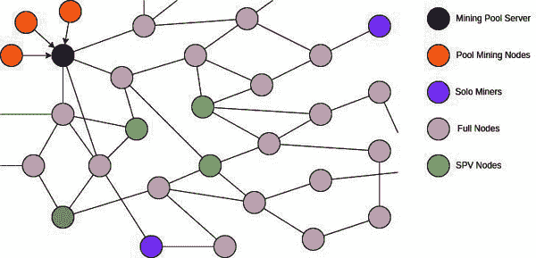
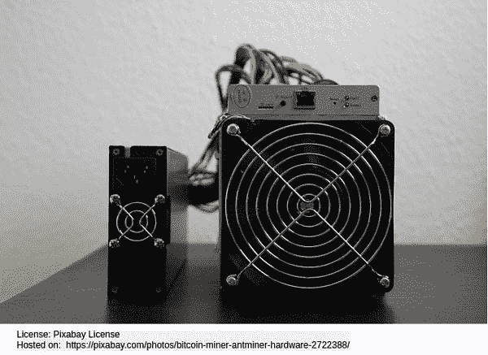
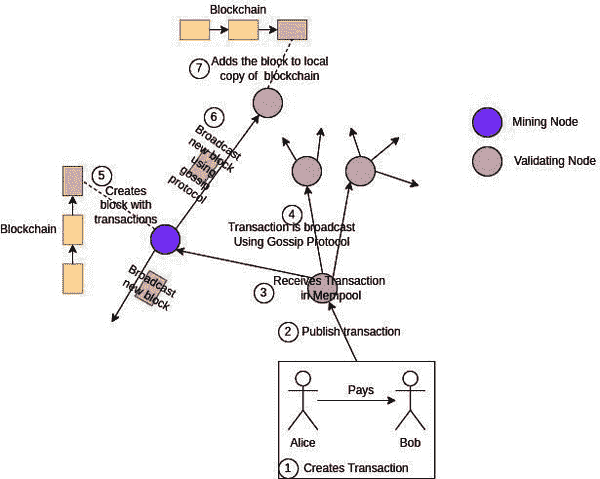
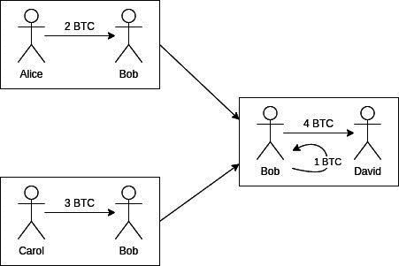
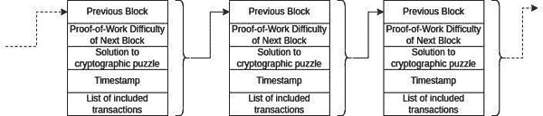
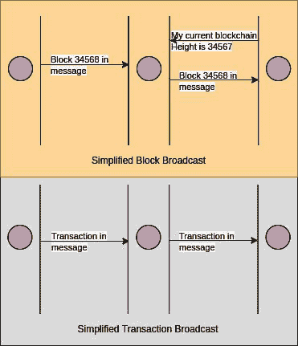

# 第三章

# 理解比特币网络

在上一章中，您学习了导致比特币发展的技术发展。您还学习了自比特币白皮书撰写以来发生的事件，并试图理解比特币的需求、它解决的问题以及解决问题可能改变世界的方式。

当我们从我们的钱包中支付比特币到别人的地址时，将创建一个交易并在比特币网络上进行广播。这进入了 mempool，然后矿工挖出一个包含此交易的区块。为了实现这一点，比特币网络需要相互通信，并在网络上发布这些交易和区块。比特币网络在使网络去中心化方面发挥着重要作用。

在本章中，我们首先学习构成比特币网络的不同类型的节点。我们将了解为什么需要不同类型的节点以及它们如何相互交互。然后我们将了解比特币共识网络、其构建模块以及为什么共识网络中的每个组件都是必需的。

# 结构

在本章中，我们将介绍以下主题：

+   比特币物理网络拓扑

    +   挖矿节点

        +   池挖矿

        +   独立挖矿

    +   完整节点

    +   简化支付验证（SPV）

+   比特币共识网络

    +   交易

    +   区块链

    +   共识规则

    +   工作量证明（PoW）

    +   验证节点

    +   mempool

    +   密码学

    +   八卦协议

+   比特币网络安全

# 目标

本章的目标是给读者一个关于比特币网络的高级理解。这将使您了解比特币的核心概念，如去中心化和抗审查，是如何整合到其设计中的。此外，它还将帮助您在接下来的章节中更深入地了解技术和进行编程。

它还将帮助您了解在您进行支付时可能发生的背景情况以及交易如何包含在区块链中。

# 比特币物理网络拓扑

比特币网络由与其他节点交互以发送和接收交易和块的节点组成。节点可以随时加入或离开比特币网络。

交易就像一个包含资金来源、资金接收者和转移金额的账目条目。这些交易由矿工添加到区块中，并广播给其他节点。

以下插图显示了比特币网络拓扑：

**图 3.1：** 比特币网络拓扑

在前面的图中，矿工创建一个区块并发送给其他节点。单独挖矿的矿工也接收区块，因为它也是一个完整节点。完整节点负责验证交易和区块并转发它们。SPV 节点是轻量级节点，它们依赖完整节点接收必要的信息。

池挖矿节点与挖矿池服务器相连。池挖矿节点从服务器接收任务，并根据接收到的任务尝试挖掘区块。如果成功，池挖矿节点将区块发送给服务器。挖矿池服务器还从其他节点接收区块和交易，这就是为什么从池挖矿节点到挖矿池服务器有一箭头的原因。比特币网络本是点对点的非层级结构。

# 挖矿节点

挖矿节点竞争解决一个加密难题，哪个节点解决了难题，就能够构造带有选择交易的区块。当一个交易包含在一个区块中时，这个交易就被确认了。所以，挖矿是交易确认的行为。

使用计算能力解决加密难题以确认交易，这称为**工作量证明**。

矿工可以选择进行单独挖矿，或者加入挖矿池。

以下是挖矿设备的图片：

**图 3.2：** 正在工作中的挖矿设备

# 池挖矿

现在，只有进行池挖矿才是有利润的。在这种情况下，矿工加入挖矿池以共同进行挖矿努力。挖矿池中的每个矿工都尝试解决一个加密难题，挖矿池了解矿工贡献的计算能力。矿工解决加密难题后，挖矿池获得区块奖励。然后，挖矿池根据矿工对计算能力的贡献将区块奖励分给所有矿工。解决加密难题的矿工没有任何特殊优势。这种设置对所有矿工都有利，因为解谜是基于计算能力的贡献来确定的概率。矿工不直接与网络交互；相反，他们是由挖矿池服务器分配一个任务。

# 单独挖矿

比特币的计算需求已经变得如此之高，以至于单独挖矿几乎是不可能的。然而，有一个好处。目前，有几个挖矿池拥有网络几乎全部的计算能力。只要几个挖矿池联手，比特币网络就会遭受 51%攻击。如果大多数节点都是单独挖矿的矿工，这是不可能的。因此，通过单独挖矿，我们可以使挖矿更加去中心化。

# 完整节点

完整节点是验证节点，它们保持区块链的一个副本，并验证接收到的所有交易和区块。它们还将区块和交易转发给其他节点。

# 简化支付验证（SPV）

SPV 节点是轻量级节点，这意味着它们不维护整个区块链，并且没有全节点的帮助无法验证区块。SPV 要求非常少的磁盘空间，并且可以在嵌入式设备上设置或在内存中执行，使它们更便宜的维护和携带。

# Bitcoin 共识网络

Bitcoin 共识网络基于工作量证明（Proof-of-Work，PoW）机制。交易通过节点辅助使用八卦协议创建并发布在网络上。验证节点或全节点验证接收到的交易，然后将其添加到它们的内存池中。矿工利用他们的计算能力解决一个加密谜题，以创建包含它想要包含在区块中的交易的区块。区块与前一个区块相连。创建的区块是工作量证明，区块链由这些区块组成。矿工然后使用八卦协议将新创建的区块发布到 Bitcoin 网络。验证节点基于共识规则接收并验证区块，然后再次使用八卦协议将其转发给连接的节点。所有这些活动都使用密码学。

以下是比特币共识网络的说明：

**图 3.3：**比特币共识网络

Bitcoin 共识网络的关键组成部分如下：

+   交易

+   区块链

+   共识规则

+   工作量证明

+   验证节点

+   内存池

+   密码学

+   八卦协议

这些将在以下章节中解释。

# 交易

交易是唯一的支出记录。它包含三件事：

+   资金来源

+   资金接收者

+   每位接收者接收的金额

以下是对交易结构的说明：

**图 3.4：**比特币交易资金与支付

# 区块链

区块链是记录交易的不可变区块序列。区块链也是按时间顺序排列。每个区块都链接到它的前一个区块。链的末端是最近的区块。

根据您所学的，以下是对区块链的说明：

**图 3.5：**区块链结构

# 共识规则

Bitcoin 网络，就像网络协议一样，对区块和交易有共识规则。这些规则应该通过矿工通过工作量证明共识机制来保护。

# 工作量证明（PoW）

工作量证明或 PoW 是一种机制，旨在通过迫使攻击者花费计算资源来防止服务拒绝攻击。这使得服务拒绝攻击对攻击者变得不可行。比特币使用工作量证明使双重支付变得非常困难和昂贵。

这可以通过以下类比来理解：

在古代，有许多房子、寺庙、水井等容易复制的建筑，但也有一些纪念碑、堡垒等是独一无二的。像埃及的吉萨金字塔、中国的长城、印度埃洛拉的凯拉萨寺庙这样的纪念碑，在经历了数百年后，仍然很难复制。它们的共同点是制造它们的难度。难度使它们在数百年保持独特。这些结构本身就是证明建造它们所付出的艰辛工作的证据。这种工作的证明被称为工作量证明。

下面的图表显示了两个著名的纪念碑：

**图 3.6:** 独特且著名的纪念碑

每个矿工都以计算能力竞争，解决密码学难题并创建一个交易区块作为区块链中的下一个区块。在创建一定数量的区块后，密码学难题的难度会根据增加或减少解决密码学难题的平均时间进行调整。由于这种挖矿设备，制造公司也在成本效益方面进行竞争。挖矿领域的这场战斗保持了网络的安全并保护它免受双重支付的威胁。

**这是一种机制，其中一方需要向验证者证明它已经执行了所需的工作（或计算能力），以获得执行某些任务的权限。**

随着区块在链中越深入，改变任何区块的难度将以指数方式增加。尽管矿工之间存在竞争，他们在创建区块的同时，也在同意共识规则的条款。这就是它被称为*工作量证明*共识机制的原因。许多加密货币和区块链技术使用其他形式的共识机制，如*权益证明、权威证明、实用拜占庭容错*等。

挖矿可以被定义为*工作量证明*在实践中的行动。

我们知道矿工加入并组成一个池。一些矿工池控制着网络的大部分计算能力。如果有两到三个顶尖矿工加入，他们就能超越其他矿工。

2014 年 7 月，*Ghash.io* 控制了网络计算能力的一半以上，但后来同意其计算能力永远不会超过 50%。理解为什么我们此后从未出现过这种情况，以及任何矿工为什么会同意不接管网络是很重要的。

挖矿也为网络增加了价值，这意味着尽管矿工可以阻止来自特定国家或交易所的交易，但他们不会做任何会引起注意并影响他们收入来源的网络的事情。

# 验证节点

比特币不完全依赖挖矿节点来防止双重支付，相反，它还有验证节点来验证收到的所有交易和区块。验证节点也被称为全节点，这些节点进一步传播交易和区块。

# Mempool

Mempool 是未确认交易的内存存储。矿工从 mempool 中挑选交易，只有有效的交易才会存储在 mempool 中。一个交易可能因为很长时间没有被包含在区块链中而失效。mempool 中的交易没有确认，可能因竞争条件而变得无效。

# 密码学

密码学是比特币的核心。它在工作量证明、交易、区块链和验证中都有应用。

以下是比特币网络中密码学的应用：

+   挖矿节点需要解决密码学难题才能创建一个交易区块。

+   每个区块使用密码学保护所有交易不被修改。

+   每个区块使用密码学哈希保护区块链不被修改。

+   交易使用密码学从源解锁资金并将其锁定，以便接收者认领。

# Gossip protocol

比特币交易和区块需要迅速地被几乎所有节点接收。比特币节点始终在监听连接的节点，并让它们了解自己拥有的比特币区块链中的区块。当一个节点接收到一个区块或交易时，它会根据共识规则进行验证，然后将其发送给需要它的节点。八卦协议是节点之间使用包含命令和有效载荷的消息进行通信的方法。

以下是八卦协议在消息广播中的说明：

**图 3.7：** 八卦协议在消息广播中的简单表示

# 比特币网络安全

保护网络不仅是数学或密码学问题，也是博弈论问题。比特币网络通过密码学和博弈论来保护。因此，有很多因素共同作用来保护网络：

+   挖矿使得修改区块变得困难，而且随着区块深入区块链，难度会指数级增加。

+   挖矿难度增加了网络的价值。它的价值不仅在于计算能力，还在于成本和时间。

+   采矿设备公司竞相降低设备的成本效益。

+   验证节点观察网络，确保网络按预期运行。

+   许多区块链浏览器网站和独立爱好者以不同的方式观察网络。他们不断观察节点、区块链和 mempool。

# 结论

在本章中，您学习了比特币网络的网络拓扑。您了解了比特币网络中存在的不同类型的节点以及它们的角色和需求。然后，您了解了比特币共识机制是如何工作的，以及构成比特币共识网络的不同组件。我们还涵盖了每个这些组件，以公平地了解比特币网络的结构和运作，而不深入了解其真实的运作。

在下一章中，您将了解比特币在现实世界中的使用，并学习不同国家对比特币使用的监管。

# 需记住的要点

+   挖矿是工作量证明的实践。

+   比特币网络由挖矿池服务器、池矿工节点、独立矿工、全节点和 SPV 节点组成。

+   池矿工节点不直接与比特币网络交互；相反，它们依赖挖矿池服务器获取工作。

+   独立挖矿解决加密难题的几率微乎其微。

+   全节点也被称为验证节点，因为它们根据共识规则验证区块和交易。

+   八卦协议是节点之间使用包含命令和有效载荷的消息进行通信的方法。

# 问题

1.  区块验证与区块确认有何不同？哪个节点负责区块验证，哪个节点负责区块确认？

1.  前四大挖矿池是什么，它们目前占网络计算力的比重是多少？

1.  如果您计划购买比特币挖矿设备，您会关注哪些参数，以及您如何判断哪种设备对您更好？

1.  如果一个矿工不能将收到的所有交易放入内存池到下一个块中，它将根据什么标准选择将交易添加到下一个块中？

1.  填空：

    1.  比特币网络是一个 ____________ 网络，这意味着没有服务器和客户端，也没有等级制度。

    1.  在池挖矿中，_________ 解决加密难题，_________ 与比特币网络连接以获取区块。

    1.  SPV 需要 ____________ 节点来验证传入的区块。

1.  真/假：

    1.  挖矿节点不需要内存池。

    1.  节点可以随时加入和离开比特币网络。

    1.  每个全节点都维护着区块链的一个副本。
