# 第四章

# 比特币在现实世界中

在上一章中，你学习了比特币网络结构以及共识网络的基本知识。这让我们对比特币网络的工作原理和结构有了基本的了解。

在本章中，你将了解不同的人和组织如何使用比特币。你将学习我们与网络互动的多种方式。你将了解交易员、投资者、企业和数字游牧民族如何使用比特币。此外，你还将了解不同类型的交易所，以及一些比特币法规。

# 结构](toc.xhtml#s62a)

在本章中，我们将涵盖以下主题：

+   不同类型的交易所

+   比特币应用案例

    +   比特币交易

    +   投资和储蓄比特币

        +   在线商家接受比特币

        +   在实体店接受比特币

        +   以比特币支付或接收工资

        +   使用比特币支付费用和旅行

        +   比特币用于汇款

        +   比特币为社会事业

        +   挖掘比特币

+   比特币与加密货币法规

# 目标

本章的主要目标是让读者对比特币在现实世界中的位置以及如何使用它有一个清晰的认识。我们将从不同的角度来了解比特币生态系统。尽管这本书面向技术读者，但我们相信解决方案总是为观众构建的。因此，了解观众的需求有助于构建正确的解决方案。此外，这有助于我们拓宽对比特币技术的认识。

由于上一章重点关注网络的结构和工作原理，而本章将重点关注比特币与现实世界的联系，因此阅读完本章后，你将同时从内部和外部了解比特币网络和货币/资产。

# 不同类型的交易所

加密货币交易所允许加密货币与其他加密货币或法定货币进行交换。根据不同的因素，加密货币交易所可以分为几种类型。

交易所还可以根据加密货币的保管情况进行以下分类：

+   **托管交易所**：持有比特币钱包的交易所

+   **非托管交易所**：不持有比特币钱包的交易所

在交易所中，卖家需要找到买家来出售他们的加密货币。这可以通过使用交易所作为平台的托管方法来实现，或者可以隐藏在用户面前，交易所负责在买家和卖家之间移动加密货币。这些类型的交易所可以按照以下方式进行分类：

+   **点对点交易所**：在点对点交易所中，交易所充当托管人。直到卖方收到支付，交易所才会将托管在托管账户中的待售加密货币保留。一旦卖方确认他们已经收到了所需的款项，交易所就会将加密货币释放到买方的账户中。否则，这可能会进入争议，交易所会指派人员单独处理争议。买方或卖方发布他们的价格，另一方会根据价格、喜好、评价和建议选择合适的候选人。*Paxful* 和 *Local* *Bitcoins* 是点对点交易所的例子。

+   **零售交易所**：零售交易所是最常见的交易所形式。它们允许购买者为他们能支付的最高价格出价，同时允许销售者为他们能接受的最低价格定价。其余由交易所管理。这些交易所是托管的，在市场波动下保持买入和卖出之间的差价以管理盈利。Zebpay、WazirX、Unocoin、Coinbase 和 Kraken 是零售交易所的一些例子。

+   **即时兑换机**：这些交易所具有固定的买入和卖出价格，无需托管。这使得它们易于实施，运行这类交易所相当简单。InstaBitco.in、Changelly 和 ShapeShift 是即时交易所的例子。

    +   **比特币自动取款机**：这些是能将现金兑换成比特币，或收到比特币后分发现金的即时兑换机。

零售交易所对于赋予加密货币其价值起着重要作用。这些也是交易者最友好的，因为这些交易所提供实时图表和 API 以开发交易应用。另一方面，点对点交易所提供一些隐私，并允许使用现金支付。

交易所还可以按照以下方式分类：

+   **中心化交易所**：中心化交易所由一家公司或组织运营管理，该公司或组织获取利润，提供客户服务，并在出现争议时解决问题。

+   **去中心化交易所 (DEX)**：去中心化交易所是未托管的点对点交易所。这些交易所作为**去中心化自治组织**（**DAO**）启动，由于其去中心化特性，这些交易所提供了抗审查的能力。它们不需要进行 KYC 或 AML 验证。*Bisq* 是点对点交易所的一个例子。

# 比特币应用场景

在本主题中，您将了解交易者、投资者、旅行者、自由职业者和矿工与比特币网络互动的不同方式。

# 比特币交易

本主题不涉及交易建议，而是让您了解交易者如何进行比特币交易。

交易的目标是从交易工具的波动中获利。这需要对加密货币的历史和当前价格变动进行大量分析，并从经济和政治事件以及条件等真实事件中收集指标。

所以，交易者需要执行以下操作：

+   分析历史和当前价格变动。

+   根据价格或其他事件来安排货币、稳定币和其他加密货币之间的资金流动。

+   存入和提取资金。

因此，交易者需要的是提供以下功能的市场：

+   多种加密货币支持。

+   稳定货币以及加密货币和稳定货币（如 EUR、USD、YEN、GBP）之间的轻松转换。

+   放置买单和卖单的能力。

+   托管钱包：

用于购买、出售、下单和询问的 Web API 可能很有用。

因此，非托管交易所或 P2P 交易所对交易者没有帮助。交易者需要一个提供放置买单和卖单能力的托管交易所。支持交易 API 非常有用，因为它可以集成到交易者的应用程序中，从交易所获取必要的数据以决定买单和卖单的目标价格，或把货币转移到其他加密货币、稳定货币或稳定加密货币。

以下是比特币的历史价格图表：

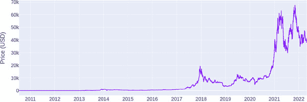

**图 4.1：** 比特币的历史价格图表

# 在比特币中进行投资和储蓄

投资者关注长期收益，而储蓄者将比特币视为价值储存工具，这对他们的子女和孙子女可能有用。投资者和储蓄者不关注短期价格波动。对他们来说，安全性更为重要，价格的小幅变动并不重要。

投资者或储蓄者需要的是：

+   将比特币存放在安全的保险库或钱包中。

+   掌握私钥。

+   投资者可能还希望有一个未来出售的价格目标：

因此，投资者或交易者会从可靠且安全的交易所购买比特币，并将比特币转移到他们的硬件钱包中。每当他们需要出售时，他们可以将所需的比特币再次转移到交易所并出售。

以下是投资者购买和出售比特币的示意图：

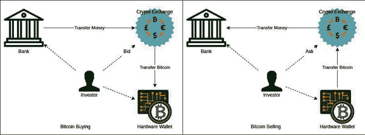

**图 4.2：** 投资者在零售交易所的买卖

# **在线商家接受比特币](toc.xhtml#s68a)

作为商家接受比特币很容易：只需在您的网站上放置比特币地址和其二维码。这种方法的的问题是，您将不知道谁支付了多少钱，并且不建议您在一个地址上接受所有支付。

有几种支付处理器可以集成到您的网站中，例如 Coinbase Commerce、coingate、btcpay、bitpay 等。或者，如果您正在创建自己的网站，您可以使用 Shopify 或 WooCommerce 来构建可以与许多流行支付处理器集成的网站。

以下是加密货币集成的在线网站的示意图：

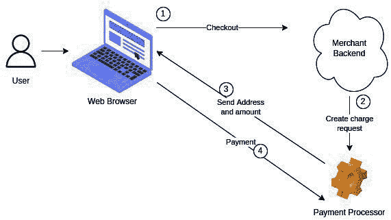

**图 4.3：** 与第三方支付处理器集成的网站

BTCPay 是一个开源的、自托管的支付处理器，可以与一些流行的硬件钱包集成。使用与硬件钱包集成的自托管开源支付处理器的优点。我们可能需要使用固定的比特币地址，或者我们需要使用由中心化支付处理器提供的钱包服务。在线钱包存在被黑客攻击的风险。

另一方面，中心化支付处理器既方便又经常更便宜，因为自托管服务器需要云托管。另外，BTCPay 只支持比特币支付，这对于在线商店来说是非常有限的。

以下是与硬件钱包集成的自托管支付处理器的示意图：

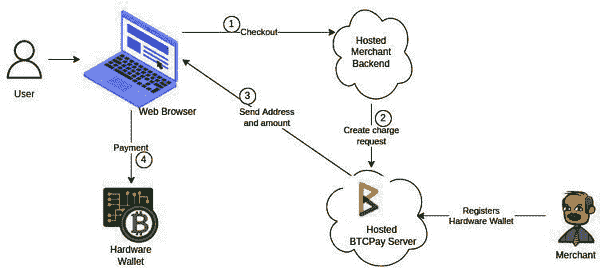

**图 4.4：** 与自托管支付处理器集成的网站

大型品牌和聚合公司可以频繁与供应商、服务提供商和客户进行交易，他们可以在闪电网络上拥有支付通道。这将使他们能够降低单笔交易的成本。

**闪电网络**

闪电网络是比特币网络之上的第二层解决方案。在闪电网络中，发送方和接收方之间创建了一个通道，比特币被锁定在其中。

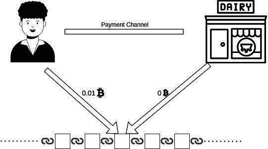

**图 4.5：** 创建闪电通道

然后，发送方可以在通道中有余额时发送。

**图 4.6：** 使用通道进行支付

发送方或接收方可以随时关闭通道。关闭通道时，所有先前交易的累积结果到达比特币区块链，此时，必须支付网络费用。

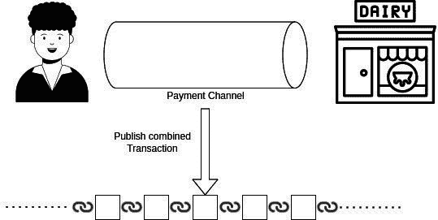

**图 4.7：** 关闭通道并将最终余额发布到区块链

在关闭之前，此通道上发生的交易越多，每笔交易的 effective 费用就越低。这降低了网络费用，使小额交易变得可行。

# 实体店接受比特币

比特币不再适合购买咖啡，因为交易费用已经显著上涨。在撰写此书时，平均交易费用为 15 美元。它仍然适用于购买更昂贵的物品。

由于只有少数人愿意用比特币支付，最好的方法是在比特币地址上放置一个二维码，并且每天更换一次。

另外，比特币钱包，如 Samourai 钱包，支持可重用支付代码 PayNyms，可以用于接收支付。这可能只是一个替代方案，因为 PayNyms 并不支持大多数钱包。

以下是实体店使用 PayNyms 接收比特币支付的示意图：

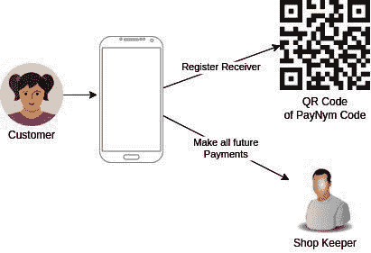

**图 4.8：**在零售店使用支持 PayNym 的移动钱包

# 以比特币支付或收取工资

世界上有许多以加密货币支付的人。其中大多数是独立承包商或自由职业者，他们地理位置无关，只需要互联网连接和笔记本电脑就可以工作。他们可以从这些硬件生成比特币地址，并从钱包接收付款。

这对于一对一支付来说很好，但对于有十几名员工的公司来说就困难了。此外，并非所有员工都对一种货币感兴趣。每个员工可能需要不同类型的货币，如本地货币或比特币、以太坊或 XRP。

Bitwage 是一个可以使这可行的应用程序。它允许雇主以对他们合适的任何货币支付，而员工可以收到他们需要的任何货币的金额。以下是雇主和员工之间工资支付分配的说明：

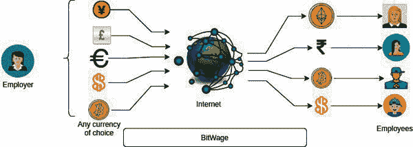

**图 4.9：**雇主通过 BitWage 向全球分布的团队支付工资

Bitwage 还允许您将常规支付转换为银行加密货币。

# 使用比特币支付费用和旅行

比特币价格呈指数级上涨，许多人赚了大钱。此外，还有地理位置无关的合同工，他们以比特币或其他加密货币支付。

以比特币或因投资比特币而赚了大钱的人可能会用他们的比特币周游世界。

由于比特币不适合小额支付，比特币持有者可以购买礼品卡，这些礼品卡可以在商店、酒店或购买机票时使用。像*Bitrefill、eGifter、Gyft 等*礼品卡提供商提供了将比特币转换为礼品卡的便捷方式。一些提供商甚至提供闪电网络支持，通过创建通道，可以有效降低比特币网络费用。

以下是使用比特币购买礼品卡然后消费的说明：

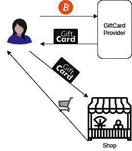

**图 4.10：**用比特币购买礼品卡并在购物时使用

# 比特币用于汇款

比特币也用于跨境汇款。汇款是外国工人、居民和与国外有联系的公民非商业性转账资金，以支持他们在那里的家庭。比特币允许直接将资金转账到接收者的钱包，可以是硬件钱包、移动钱包或托管交易所的钱包。还有专门的服务，如*BitPesa*，专为汇款设计。在 BitPesa 中，发送者可以发送比特币，接收者将收到银行账户或移动钱包中的资金。

以下是 BitPesa 汇款网络的说明：

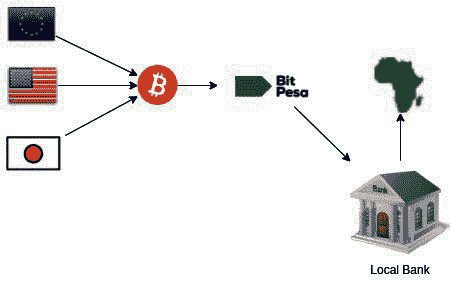

**图 4.11：**BitPesa 帮助非洲移民将钱寄回家

# 比特币用于社会事业

社会服务机构需要在那些银行系统接入有限的地区和人群中开展工作。很多时候，这些地方处于战争地带、独裁统治、军事管制之下等。因此，法律和金融系统并不总是站在需要保护的人们一边。所以，社会服务机构必须忽视现有系统，动用自己的资源。在這種情況下，比特幣幫助很大，因為它具有抵抗审查的特性。許多享譽全球的社會服务机构支持使用加密货币进行支付。联合国儿童基金会就是这样一个组织；它已经启动了一个加密货币基金，用于接收加密货币捐款。

# 比特币挖矿链接

比特币挖矿是赚取比特币的一种方式。它非常价格敏感，所以用常规电力连接挖矿比特币并不经济，即使是最高效的设备也不行。要想比特币挖矿有利可图，电力成本需要非常低，或者是一种本来就会浪费的额外电力。

比特币挖矿也会产生大量的热量和噪音。如果热量用来供暖或加热水，可能会进一步改善其经济可行性。在较冷的国家，一些人使用比特币挖矿来供暖他们的房屋，并向植物提供热量，除了温室供热。

所以，以下是一些常用来降低比特币挖矿成本的不同方法：

+   使用像太阳能电池板和风力涡轮机这样的便宜能源，不储存电池。

+   油田使用废气作为采矿的能量来源。

+   电力发电厂会产生过剩的能源。

+   使用产生的热量。

    +   用于加热水作为热水器

    +   用于供暖房屋

    +   用于向温室农场供热的

+   选择最有效的比特币挖矿设备。

+   加入挖矿池。

比特币挖矿还要求挖矿设备定期升级，因为随着时间的推移，它们的盈利能力会降低。

# 比特币和加密货币法规链接

我们在上一个主题中讨论的所有用例都受到特定国家的法律约束。在使用比特币进行任何活动之前，请了解您国家的法律。

请记住，加密货币很少被允许作为法定货币。因此，即使在一些允许使用比特币的国家，将其作为法定货币使用也是非法的。法定货币可以定义如下：

法定货币是指可以用来解决金融纠纷，如债务支付等任何事物。

加密货币法规可以广泛分为：

+   **自由放任**：那些加密货币得到良好监管，个人可以进行交易、购买商品、挖矿和接收支付的国家。

+   **限制性**：那些禁止与加密货币相关某些活动的国家。许多国家不允许加密货币与本地货币的转换，反之亦然。可能对商品的买卖或支付有限制。还可能对从事加密货币交易的企业有限制。或者，银行可能不被允许推出与加密货币相关的金融工具。

+   **有争议的**：加密货币未受监管的国家。

+   **禁止性**：一些国家对从事加密货币交易实施了全面禁令。一些国家甚至将其定为可惩罚的罪行。

许多国家正在计划对加密货币进行监管，因此一个今天没有对其进行监管的国家可能在将来会这样做。这是一个动态领域。

以下是目前各国监管的状态：

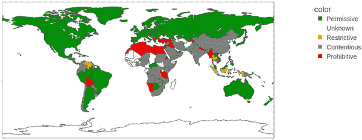

**图 4.12：** 国际比特币法规

请记住，上述信息可能在本书上市时已经过时。

在印度，目前加密货币的规定并不明确。2018 年 4 月，印度储备银行，该国的中央银行，发布了一项 circular，其中规定银行不得从事加密货币交易。这导致任何通过注册银行账户从交易所购买加密货币的人的银行账户被冻结。这使得加密货币交易变得困难，许多商业和企业倒闭或关闭了店铺。尽管如此，比特币在印度从未被禁止；因此，一些交易所通过提供一个点对点交易平台来合法规避。

在 2020 年 3 月，印度最高法院，该国最高法院，废除了印度储备银行（RBI）的 circular，允许通过银行账户交易加密货币。任何从事加密货币交易的人一直都需要对其利润支付税款，尽管适用的税法条款并不明确。

在 2022 年的联盟预算中，印度财政部长就加密货币的税收问题提供了指导。尽管现在加密货币受到监管，但仍不被认为是合法的。仍然难以处理加密货币。

许多发达国家，如美国、欧盟国家和日本，都有适当的监管措施，保护投资者和企业家。

# 结论

在本章中，您了解了我们与比特币及其网络互动的方式。您首先了解了不同类型的交易所及其特点，以及它们为用户提供的优势，然后我们看到了交易员、投资者、自由职业者、旅行者和矿工如何与比特币网络互动。我们还提出了不同人可能使用比特币的有用方式。然后，我们试图对国际法规进行分类，并查看了印度的监管状态。

这带我们结束了专注于比特币生态系统用户视角的部分。我们已经在第一章中涵盖了比特币的概述。阅读本章后，您将获得对比特币、比特币网络和比特币生态系统的基本而广泛的了解。

在下一章，我们将详细介绍比特币白皮书并帮助你理解它。

# 需记住的要点

+   点对点交易所采用托管模式，其中交易所作为第三方。

+   零售交易所允许买家为他们能支付的最高价格*出价*，同时允许卖家为他们能接受的最低价格*询价*。

+   零售交易所通过出价和询价尝试发现加密货币的价值，这有助于加密货币获得其价值。

+   Bitcoin ATMs 是现金交易的即时交易所。

+   去中心化交易所（DEX）是不受管理的点对点交易所。

+   交易员从交易工具的波动中赚钱。

+   投资者通过持有加密货币寻求长期收益。

+   储蓄者将加密货币视为价值储存。

+   加密货币支付处理器可以集成到网站中，以实现加密货币支付。

+   Lightning Network 允许在将汇总交易添加到区块链之前，各方之间进行多个离链交易。

+   PayNyms 是公开可共享的可重复使用支付代码，生成唯一未使用的地址。

+   礼品卡是使用比特币进行零售购物的最简单方式。

+   Bitcoin 矿工需要廉价能源来源并利用产生的热量。

+   Bitcoin 矿工需要不断更新他们的设备，使用市场上最有效的设备。

+   法定货币是可用于解决金融纠纷的任何东西。

# 问题

1.  零售交易所与点对点交易所有何不同？

1.  短语“不是你的钥匙，不是你的比特币”是什么意思？

1.  随机选择 10 个国家，并根据这些国家的加密货币法律地位对它们进行分类。

1.  调查并了解为什么 BitPesa 在非洲如此成功。

1.  配对以下内容：

    1.  汇款

    1.  薪水

    1.  即时兑换器

    1.  商家

    与：

    1.  BtcPay

    1.  BitWage

    1.  自动柜员机（ATM）

    1.  BitPesa

1.  真/假：

    1.  托管交易所不保险比特币钱包免受黑客攻击。

    1.  价值储存意味着金融工具中的价值是安全的。

    1.  如果一个国家不监管加密货币，则无需支付税款。
