# **第五章**

# **白皮书**

中本聪发表了题为“*比特币：一种点对点电子现金系统*”的比特币白皮书。这份论文可在**[`bitcoin.org/bitcoin.pdf`](https://bitcoin.org/bitcoin.pdf)**找到。比特币以及大多数加密货币都是基于这份白皮书的。彻底理解白皮书对于理解接下来的章节中的内容非常重要。本章重点解释白皮书中的内容。

由于论文的作者是匿名的，并且从未声称对论文拥有版权，所以白皮书不受任何版权保护。因此，任何人都可以轻松地复制或引用这篇论文。比特币白皮书也存储在区块链上，从这里可以随时检索。除此之外，还有其他多个网站提供了这份白皮书。它甚至在以下爱沙尼亚政府网站上也可获得：

q-

**[`www.e-resident.gov.ee/bitcoin-whitepaper/`](https://www.e-resident.gov.ee/bitcoin-whitepaper/)**

以及在以下美国政府网站上：

**[`www.ussc.gov/sites/default/files/pdf/training/annual-national-training-seminar/2018/Emerging_Tech_Bitcoin_Crypto.pdf`](https://www.ussc.gov/sites/default/files/pdf/training/annual-national-training-seminar/2018/Emerging_Tech_Bitcoin_Crypto.pdf)**

# **结构**

在本章中，我们将讨论以下主题：

+   白皮书摘要部分

+   白皮书中的引言部分

+   白皮书中的交易部分

+   白皮书中的时间戳服务器部分

+   白皮书中的工作量证明部分

+   白皮书中的网络部分

+   白皮书中的激励部分

+   回收磁盘空间部分的白皮书

+   简化支付验证部分的白皮书

+   白皮书中的合并和分割价值部分

+   白皮书中的隐私部分

+   白皮书中的计算部分

+   白皮书中的结论部分

# **目标**

本章的主要目标是帮助读者深入理解比特币白皮书。

# **白皮书摘要部分](toc.xhtml#s81a)**

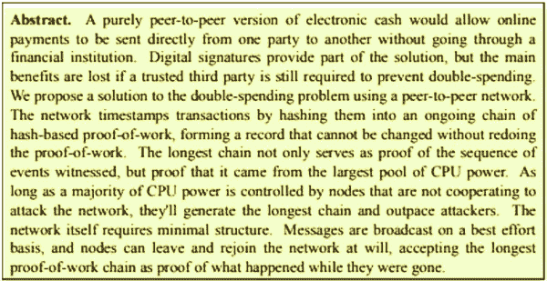

**图 5.1：** 白皮书摘要部分

比特币是一种完全点对点的电子现金。过去有一些加密尝试提供了电子现金系统。这些实现是集中的，其中一些失败了。这些实现需要第三方来避免双重支付问题。比特币不需要第三方，因为它使用一个不可变的区块链，每个区块包含一个交易列表、一个确认交易完整性的哈希和一个时间戳。区块链通过使用基于哈希的工作量证明来保持不可变性。

比特币是一个合作系统，节点要么遵守共识规则，要么合作攻击网络。合作系统形成了一股 CPU 计算能力，这增加了现有链中的区块。最长的链存储了最大的 CPU 计算能力，因此，被认为是实际的区块链，而其他链则被舍弃。这种机制假设最大的 CPU 计算能力是由诚实的节点拥有。如果整个网络被攻陷，这种假设就会失败。在接下来的章节中，我们将解释为什么这不再是一个问题。

比特币网络维护着真相轨迹（区块链），因此，允许任何节点随时离开或加入网络。新加入的节点在加入网络时同步他们的本地链。如果一个节点由于某些原因离线了一段时间，它也需要同步其本地链。如果我们查看白皮书，它很容易理解和实施。因此，成千上万的加密货币应运而生，其中大部分几乎使用了原始设计。

# 白皮书引言部分

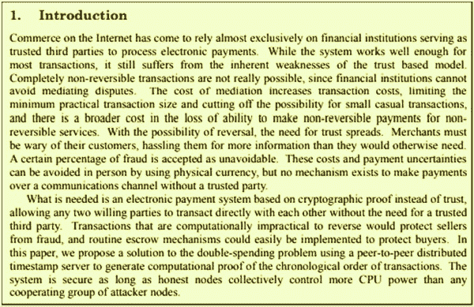

**图 5.2：** 白皮书引言部分

引言部分解释了当今存在的可信第三方的缺点。可信第三方通常是大型的金融机构，它们促进争议解决。很多时候，这些争议会导致交易撤销、诉讼和损失。对于高价值交易或服务支付可以被撤销的交易，这些额外的成本对他们有利，因为无法撤销交易可能会导致巨大损失。另一方面，对于小额交易或服务支付不可撤销的交易，这些成本是不必要的。这两种交易通常都是由相同的支付处理机构处理的。这些支付处理机构必须承担的损失由这两种交易承担，因此，成本影响了这两种交易。简而言之，信任第三方的成本是普遍存在的。

点对点现金系统旨在消除可信第三方的作用，从而消除了交易撤销的可能性。即便如此，依然可以实施托管机制来保护买方。这种机制可以将类似现金交易的不可撤销的小额交易与需要调解的大额交易分开，并且可以由第三方可信的托管机制提供服务，而不会影响网络本身的成本。

# 白皮书交易部分

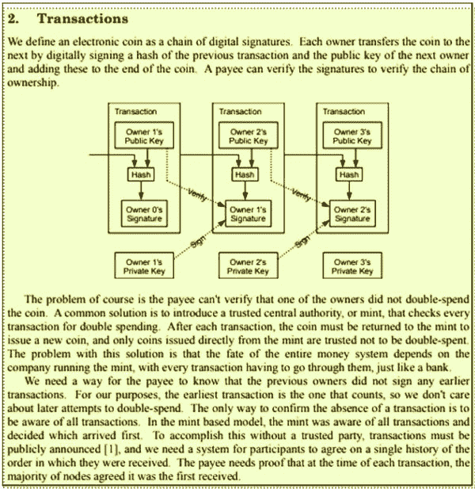

**图 5.3：** 白皮书交易部分

交易部分将交易解释为一系列数字签名，这些签名导致了比特币在各方之间的流动。为了理解这一点，我们需要了解散列（Hashing）和数字签名这些术语。

**散列**

**散列是一个不可逆** **过程，为大量文本生成固定字节输出。这个固定字节输出被称为散列码。散列具有一些性质，使其在诸如用于随机分配数据的桶化等应用中非常有用。它还安全地存储和传输密码。它还用于网络握手以发送挑战码。散列码输出是确定性的，这意味着相同的文本总会生成相同的散列码。这些代码非常随机化，因此无法通过暴力破解或其他更复杂的攻击确定。**

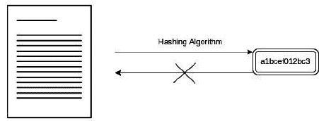

**图 5.4：** 散列算法不可逆性说明

**数字签名**

**数字签名就像物理签名一样** **，因为它们确保了文档的完整性，同时也确保了文档是由签署者签署的（真实性）。数字签名使用“公钥和私钥密码学”。文档由发送者的私钥签署。这创建了一个代码的签名，并与其他文档一起保留以供其他人验证。**

**以下是数字签名过程：**

**图 5.5：** 数字签名过程说明

通过使用发送者的公钥来验证签名。验证算法使用文档内容、签名和发送者的公钥进行验证。

以下是签名验证过程。

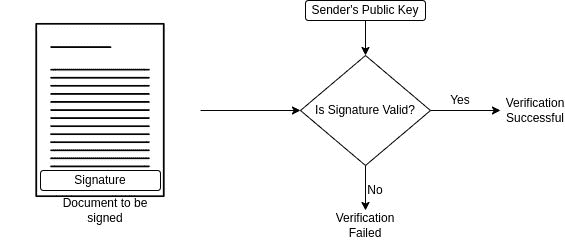

**图 5.6：** 数字签名验证过程说明

比特币交易有两个部分：ins 和 outs。输入交易携带有关先前交易的信息，以及发送者的签名和其公钥用于验证。Out 包含要转让的比特币信息以及接收者的公钥。只有接收者知道私钥，因此，可以解锁前一个交易中锁定的比特币并发送给下一个接收者。这创建了一个所有权链。为了理解这一点，让我们看看爱丽丝是如何支付鲍勃的。

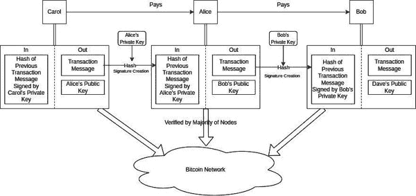

**图 5.7：** 交易创建和广播说明

爱丽丝想要支付鲍勃。为此，爱丽丝寻找她的未花费交易。她通过用她的私钥签名先前未花费交易的哈希创建一个交易输入。这释放了前一个交易中锁定的比特币。她现在通过向鲍勃添加一条消息以及鲍勃的公钥创建非交易输出。为了让鲍勃支付戴夫，他需要做同样的事情：挑选出他之前的未花费交易，对其进行哈希，并用他的私钥签名以释放锁定的比特币。然后，他需要创建一条消息给戴夫以及戴夫的公钥。为了让这些交易被认为是有效的，这些以及携带价值的所有先前交易都需要由比特币网络中的大多数节点验证。

比特币网络由维护所有先前交易的验证副本节点组成。当执行新的交易时，它会在网络上广播，并且所有参与的节点都会根据已经接收的所有现有未花费交易来验证其有效性。这个机制不会遗漏任何相关的交易，避免了错误地或故意地双重花费的机会。

# 白皮书中的时间戳服务器部分

**图 5.8：**白皮书中的时间戳服务器部分

时间戳服务器是创建交易区块并给区块加时间的节点。创建区块后，时间戳服务器广泛发布区块哈希。每个区块还包含前一个区块头的区块哈希。由于新创建的区块包含前一个区块头的包含创建前一个区块时间戳的区块哈希，新区块不能有一个比包含的区块哈希更早的时间戳。因此，这种方法在区块链上施加了时间顺序的必要性。因此，不需要依赖外部来源来施加时间戳的精度。

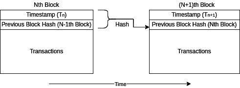

**图 5.9：**带有时间戳的区块结构

在前面的图中，我们可以看到 N+1^(th)区块包含 N^(th)区块的哈希。由于 N^(th)区块哈希有一个时间戳，N+1^(th)区块的时间戳必须在 N^(th)区块的时间戳之后创建。这确保了：

*N+1^(th)区块的时间戳>N^(th)区块的时间戳*

因此，它在区块链上施加了时间顺序。

# 白皮书中的工作量证明部分

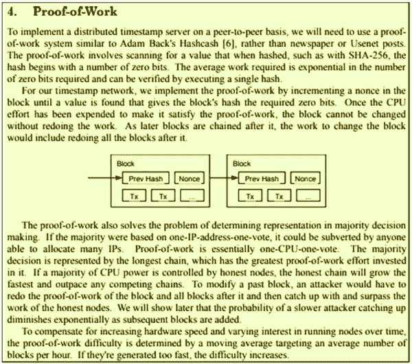

**图 5.10：**白皮书中的工作量证明部分

比特币使用工作量证明机制来确保区块链的完整性。工作量证明算法需要 CPU 使用（工作）来创建一个区块。任何想要修改现有交易的攻击者都需要重新进行工作，创建包含交易的区块，并在其之后重新进行工作以创建区块。这里的想法是，一个非合作节点需要在 CPU 计算能力上与合作节点竞争完成的工作量。*中本聪*建议一个简单的工作量证明机制，涉及计算区块哈希的起始零的个数。这里的逻辑如下：

获得“0…..”二进制哈希值的概率是 1/2。

获得“00….”二进制哈希值的概率是 1/4。

获得“000…”二进制哈希值的概率是 1/8。

实现二进制哈希值所需的 CPU 计算能力与概率成反比，即如下：

*工作量≈1/概率*

*中本聪*还建议根据区块生成的速度如何迅速来调整所需的工作量，从而保持区块生成时间。

所以，现在的区块看起来像以下的插图：

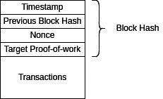

**图 5.11:** 带有 Nonce、时间戳和前一个区块哈希的区块结构

在这里，目标工作量证明（Target proof –of work）要求时间戳服务器使用所需的 CPU 工作量来创建一个区块。这是通过取每个区块创建所需时间的时间移动平均值，并根据区块创建时间更长或更短来增加或减少该值来计算的。下面的方程式展示了 Target work 是如何计算的：

*D[n]: 高度为 n 的区块的目标工作量证明*

*T[n]: 第 n 个区块的时间戳*

*ΔT: 创建区块的预期时间*

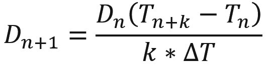

以下流程图展示了时间戳服务器如何为区块创建找到正确的 nonce：

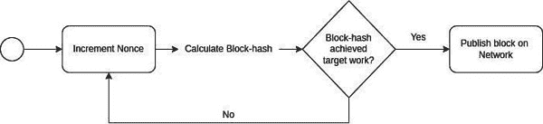

**图 5.12:** 找到所需 nonce 的区块挖矿过程

时间戳服务器增加 Nonce 并计算区块哈希。如果区块哈希达到所需的工作量，该区块会被发布到比特币网络；否则，时间戳服务器会增加 Nonce，直到它达到所需的工作量，或者另一个节点用正确的 nonce 发布了区块。

# 白皮书中的网络部分

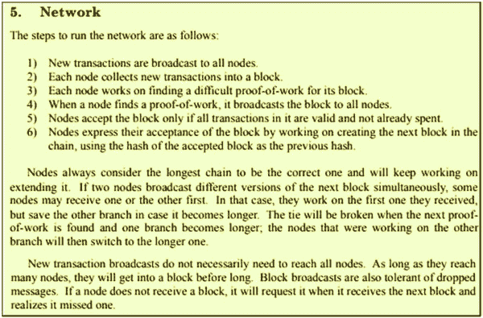

**图 5.13:** 白皮书中的网络部分

本文中使用的节点一词与前几节中使用的时间戳服务器相同。现在，我们不再用节点一词来描述创建区块的节点；相反，我们称它们为挖矿节点。

每个节点都连接到多个节点，而这些节点又连接到其他几个节点。这形成了一个节点网络。每个节点都尝试为区块链中下一个要创建的区块找到 nonce。当创建一个新交易时，比如“*爱丽丝支付鲍勃*”，它会被发送到它的同伴节点。每个接收节点都会检查该交易是否有效，是否试图创建一个非法交易或尝试花费一个已经花费的交易。然后它会被发送到他们的同伴节点，依此类推；这样就广播到了整个网络。每个接收节点都将交易添加到区块中，并尝试找到 nonce。哪个节点先找到 nonce 就会创建区块并将其发送给它的同伴节点。所有接收节点都会验证区块时间戳、交易、nonce 和下一个目标工作量证明。然后接收节点会将它转发给他们的同伴节点，依此类推；这样就广播出去了。在接收到区块后，每个节点开始处理下一个 nonce。这是继续进行的方式。

以下图片展示了区块和交易是如何传播的：

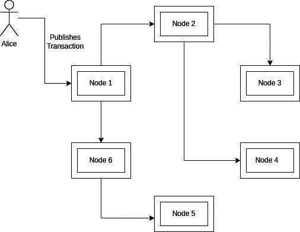

**图 5.14:** 比特币网络上的交易传播

一个 ping 命令需要近 200 毫秒才能覆盖地球上最长的距离。区块广播涉及在每个跳点进行验证；因此，为了覆盖网络的 95%，传播延迟可能长达一分钟。由于这个原因，多个节点可以在不知道已经创建的区块存在的情况下创建有效的区块。这导致了区块链上的分叉。根据位置的不同，节点可能选择不同的节点作为同一区块高度的有效节点。由于没有一个节点能知道哪个区块应该被考虑，哪个应该被拒绝，他们需要开始处理收到的第一个区块，但也要保存其他有效的区块。现在，有多个节点集合为不同的链计算 nonce，所以它们可能会继续在各自的链上创建下一个区块。为了解决这个分叉问题，节点必须继续这个过程，直到竞争链中的一个变得比其他链都长。节点然后会接受最长的链作为正确的链，并丢弃其他链。由于找到 nonce 的时间明显高于区块传播延迟；争夺下一个区块的节点不会很多。

以下是区块链分叉的说明：

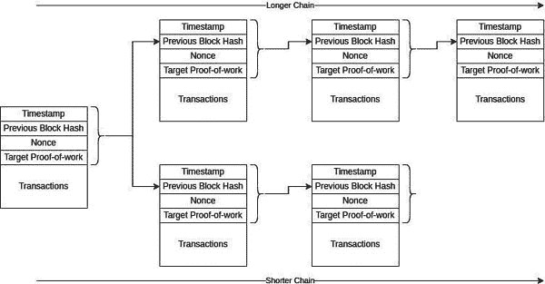

**图 5.15：** 由于几乎同时挖掘区块导致的区块分叉说明

如果出于某种原因，节点没有接收到区块并且接收到了一个新的区块，节点可以从它的同伴那里请求错过区块。由于没有收到区块并不是一个问题，区块也不需要到达所有节点。

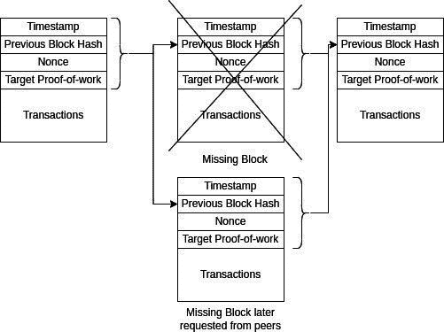

**图 5.16：** 节点请求缺失区块的 peer

# 白皮书中的激励部分

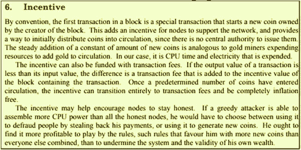

**图 5.17：** 白皮书中的激励部分

本节解释了节点创建区块和支持比特币网络的激励。成功创建区块的节点以两种方式获得激励：

+   每个新创建的区块都会向成功找到 Nonce 的节点颁发比特币。

+   此外，在交易中，输入值减去输出值也增加了节点创建区块所获得的区块奖励。

节点在尝试寻找 nonce 时会消耗 CPU 算力，这导致了能源消耗。由于许多节点将争夺 nonce，这个过程大多会导致尝试失败。节点在尝试过程中所消耗能源的成本需要在节点成功时予以回收。节点还需要产生收益以运行一个盈利的业务，因为这对节点所有者来说是一个生意。区块奖励确保了节点有足够的激励继续寻找 nonce。

如果一组节点决定不与网络合作，进行双重支付或改变区块/交易的接受规则，或以某种方式攻击网络，那么这些节点将形成自己的网络。将提供更好的激励，并且节点按照规则行事的网络将提供更好的交易发布价值。因此，奖励将具有更高的信用价值。这将鼓励节点合作和支持网络，而不是攻击它。

节点可以自由地包括或排除一个交易，或不与网络合作。通过包括奖励，交易的创建者鼓励节点将交易包含在区块中。随着越来越多的交易包含在区块中，交易奖励将成为挖矿节点收入的主要驱动力，因此，对区块奖励的需求将减少。网络实现了一种机制，随着时间的推移减少区块奖励。

以下图表说明了交易奖励：

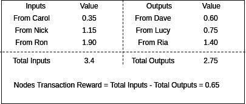

**图 5.18:** 交易奖励支付说明

此外，区块奖励是铸造比特币的唯一来源。这导致了预设的通货膨胀。

以下是比特币通货膨胀的图表，包括过去和未来：

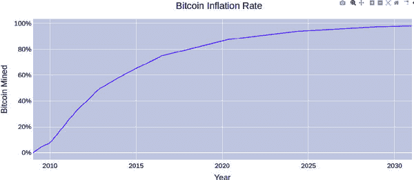

**图 5.19:** 比特币过去和未来的通货膨胀

# 

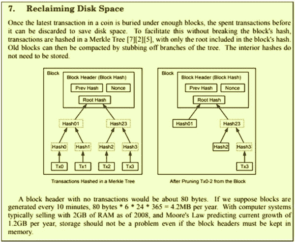

**图 5.20:** 白皮书中的“回收磁盘空间”部分

本节解释了我们如何压缩区块链中存储的区块，从而回收磁盘空间。Merkle 树是一种从交易列表派生代码（称为 Merkle 根）的方法。此代码确认了包含在区块中的交易的完整性。作为区块头的一部分，Merkle 根还确保了工作量证明保护它免受修改。

更新后的区块头现在如下所示：

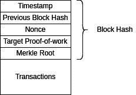

**图 5.21:** 比特币区块结构说明

我们可以看到，由于在计算区块哈希时没有使用交易，如果没有 Merkle 根，它们的完整性就无法得到保护。

可以从以下说明中理解 Merkle 根的计算：

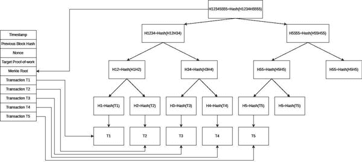

**图 5.22:** Merkle 树根的计算

在前面的说明中，计算每个交易的第一个哈希。然后，递归地，将哈希成对地连接并哈希以获得上级的哈希。如果没有成对，则将哈希与自己连接。

每个节点在通过网络接收时验证一个区块并将其存储在磁盘上。当在磁盘上保存足够的区块，并且节点确信由于分叉，较旧的区块不会改变，节点可以将发送的交易从较旧的区块中删除，只保留头部和未花费的交易。这样，节点可以节省大量的磁盘空间。

# 【白皮书中的简化支付验证部分](toc.xhtml#s89a)

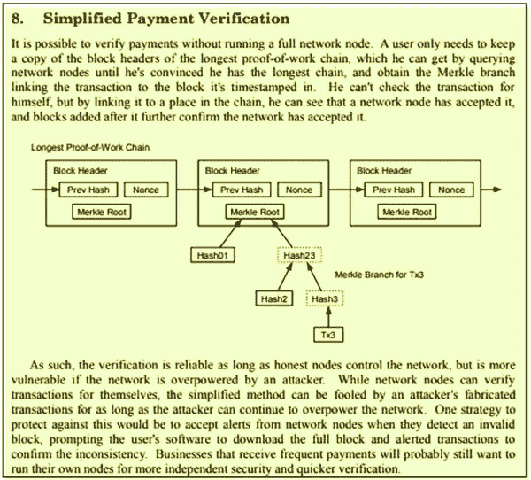

**图 5.23:** 白皮书中的简化支付验证部分

本节解释了即使不维护完整区块的节点如何仍然可以验证接收的区块。实现简化支付验证的节点只保留最长链的区块头，这意味着不存在竞争链，并且最长链已经找到。该节点在其网络中寻求维护完整区块链的其他节点来验证区块。

它使用了一种名为*Merkle 证明*的技术，如下所述：

**图 5.24:** Merkle 证明的说明

SPV 节点请求全节点提供与 T4 相关的哈希。全节点发送验证 Merkle 根所需的哈希。由于 H34 可以从 H3 和 H4 派生，H1234 可以从 H34 和 H12 派生，H12345555 可以从 H1234 和 H5555 派生，通过提供 H3，H4，H12 和 H5555 以及 Merkle 根 H12345555，SPV 节点可以验证 T4 是否存在于 Merkle 根 H12345555 的区块中。

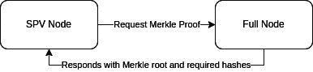

**图 5.25:** SPV 节点与全节点之间的通信

然而，攻击者可以形成一个网络，由于 SPV 节点依赖于全节点进行验证，它可能不知道与之通信的节点是否欺诈。结果，它可能会继续接收伪造的交易。如果节点在网络上看到无效区块的存在时广播警报，这种攻击是可以处理的。

# 【白皮书中的合并和分割价值部分](toc.xhtml#s90a)

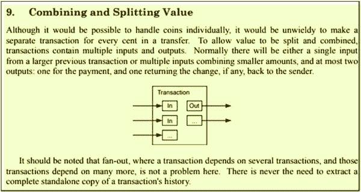

**图 5.26:** 白皮书中的合并和分割价值部分

本节解释了在比特币交易中合并和分割价值的概念，而不是为每个比特币或比特币的一部分都有一个交易。如果爱丽丝需要支付鲍勃，她需要使用支付给她的未花费交易，这些交易的组合价值大于或等于她需要支付给鲍勃的金额，并支付给自己剩余的（找零）价值。

如果未花费的交易金额大于所需金额，则交易将被分成要支付的金额和剩余的找零。如果未花费的交易金额较小，则需要合并多个交易的值以使输入值大于或等于所需金额。如果输入值与所需金额相同，则输出只是一个交易，即支付给鲍勃的金额。然而，如果输入值更大，爱丽丝需要支付给自己找零。如果输出小于输入，则剩余的价值支付给矿工节点，正如我们在之前的某一节中学到的。这可以从*图 5.18*中理解。

# 【白皮书中的隐私部分](toc.xhtml#s91a)

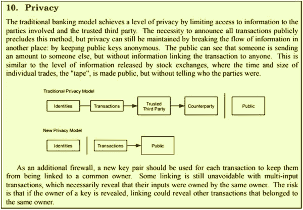

**图 5.27:** 白皮书中的隐私部分

本节解释了如何在所有交易都被广播的情况下在比特币网络中实现隐私。用户可以通过这种方式保持其公钥匿名。尽管交易是公开的，但没有人会知道交易属于谁。然而，由于需要将更改发送回交易的所有者，其价值和交易详情可以被推导出来。为了解决这个问题，交易所有者可以将更改发送到不同的公钥。这意味着每次都需要使用一个新的密钥对。然而，如果他们在现有交易中透露了身份，交易历史仍然可以揭示所有者的交易链。

以下是对交易中提高隐私方法的解释：

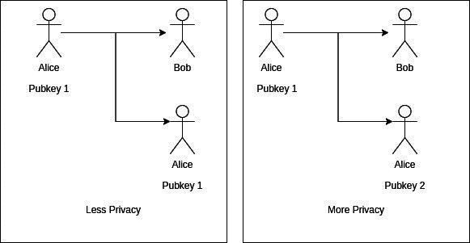

**图 5.28:** 交易中提高发送者隐私的方法

# 白皮书计算部分

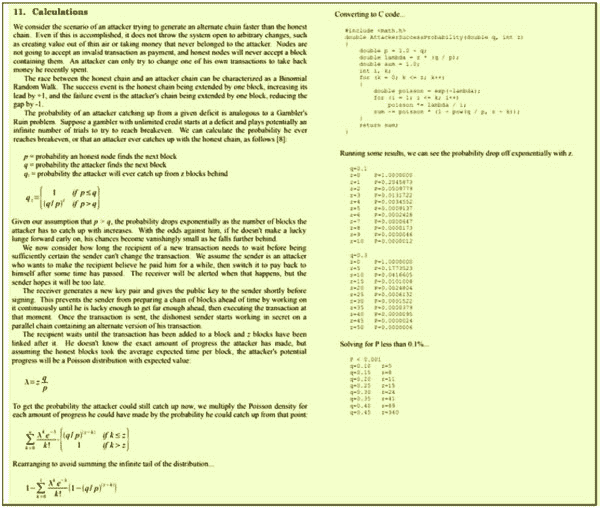

**图 5.29:** 白皮书计算部分

本节解释了攻击者或一组攻击者尝试挖掘比诚实节点更多块的情况。如果攻击者能够拥有更多的 CPU 处理能力并挖掘更多的块，那么攻击者将成为网络的一部分，这意味着它必须依赖诚实节点接受块。

结果如下：

1.  攻击者无法改变区块奖励，因此他们无法增加比特币供应。

1.  攻击者无法更改他人支付的交易内容，因为它无法签署他们的交易。

1.  攻击者无法阻止诚实节点广播交易。

然而，攻击者可以更改自己的交易，通过不包含它们来审查交易，或者撤销最近包含的交易。

现在，考虑一个攻击者可能持有大多数 CPU 权力也可能不持有的情况，尝试攻击一个网络。这种情况就像赌徒毁灭问题，解决方案是通过使用二项式随机游走得出的。

攻击者想要改变 z-1 深度的交易，所以它会从 z 深度开始。如果他们能在诚实节点之前挖掘一个块，差距将减少 z-1，但如果诚实节点挖掘了块，差距将增加到 z+1。我们正在试图找出攻击者能够创建最长链的概率。

在赌徒毁灭问题中，赌徒与对手竞争，试图赢得对方的全部财富。这是一个迭代投注游戏，每一注都会有一方赢得 1 美元或输掉 1 美元。最后，一方失去了所有的财富。

首先，看看赌徒的毁灭问题。

-   q: 赌徒赢得单注的概率

-   p: 赌徒输掉单注的概率

-   i: 赌徒的初始财富

-   p=1-q

-   0< i< N

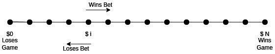

**图 5.30:** 赌徒毁灭问题的说明

赌徒赢得游戏的可能性可以通过以下概率之和计算得出：

+   如果赌徒赢得赌注的概率是 q，那么新的获胜概率是。

+   如果赌徒输掉赌注的概率是 p，那么新的获胜概率是。

使用总概率定律，即。

赌徒赢得游戏的可能性是在赢得或输掉当前赌注后赢得游戏的可能性之和。这可以表示如下：

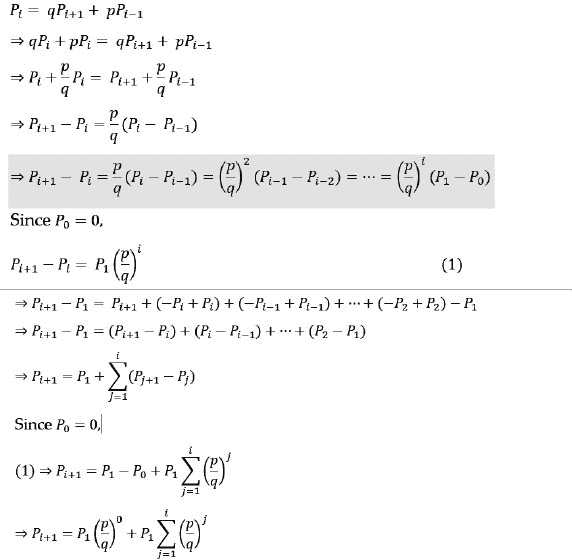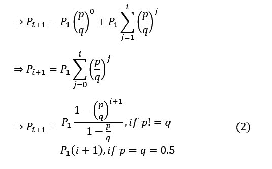

在获胜的情况下，*P[N] = 1 且 i = N - 1*

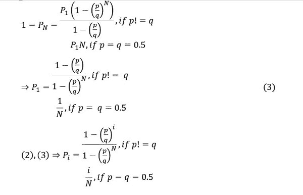

现在，考虑比特币挖矿的情况，攻击者可以无限挖掘区块以击败诚实节点。这是一个赌徒毁灭问题，有一些不同。攻击者有无限的美元和无限的时间，为了获胜，攻击者需要通过添加区块比诚实节点更大的链。一开始，攻击者希望能够在 z-1 深度修改一个交易，所以它从 z 深度开始。

以下图表解释了这一点：

**图 5.31：** 攻击者成功挖掘更长链的说明

考虑，

*p：诚实节点找到下一个区块的概率*

*q：攻击者找到下一个区块的概率*

*z：攻击者必须比诚实节点添加更多的块*

*i：攻击者可以输给诚实节点的额外区块数*

*q[z]：攻击者击败诚实节点的概率*

*所以，N= i + z*

*在这里，i→∞，因为赌徒开始时资源无限.*

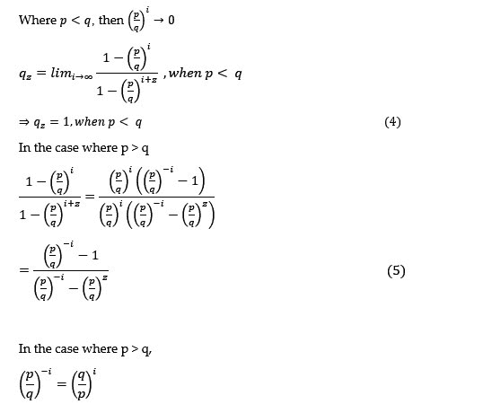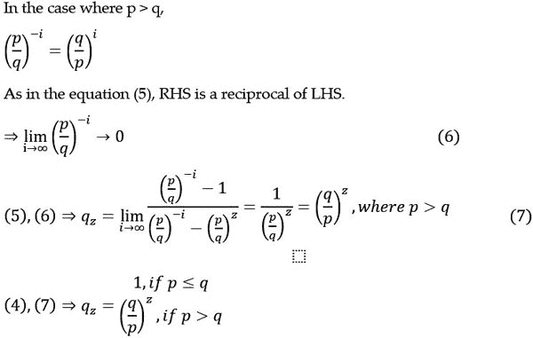

这就是我们到达白皮书中这一部分的方程的方式。

假设攻击者发现块的概率低于诚实节点，即攻击者赶超的机会呈指数下降。

现在，我们在这里迈出了一步，试图确定如果商家等待 z 个确认，攻击者能够进行双重支付的概率。中本聪认为，每个时间段的获胜事件数量的概率分布是泊松分布，原因如下：

+   挖矿事件可以在每个时间间隔内发生任意次数。

+   每个事件都是独立的，不会影响其他事件的概率。

+   事件的平均速率是恒定的，因为我们知道区块时间是不变的，区块挖掘的概率与 CPU 功率的比例成正比，所以它也是恒定的。

+   两个事件在确切相同的时间发生是不可能的，因为节点根据到达时间进行判断，如果它们确实发生，它们会等待找到最长的链。所以，同时发生两个事件是罕见的，即使它们发生，也可以安全地认为它们是不同的。

考虑，

*T：平均区块时间*

*z：在区块链中考虑花费的交易所需的深度*

*P[p]：每 T 分钟诚实节点挖掘一个区块的概率*

*P[q]：每 T 分钟攻击者节点挖掘一个区块的概率*

*p：每 T 分钟诚实节点挖掘的区块数*

*q: 攻击者每 T 分钟挖掘的区块数*

*T[z]: 挖掘 z 个区块的平均时间间隔*

*T[z]= T*z*

量 p 和 q 是它们各自在时间间隔 T 内挖到区块的概率的倒数。

因此，

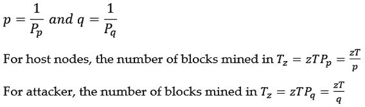

攻击者在 T 分钟内可以挖掘 q 个区块，所以它可以挖掘：

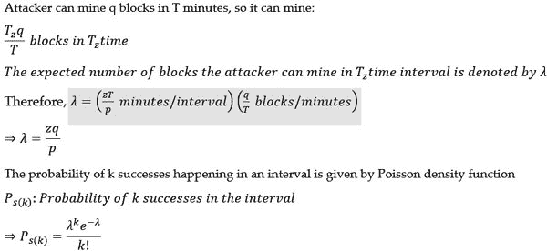

在一段时间内 k 个成功事件发生的概率由泊松密度函数给出。

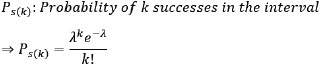

作为一个更一般的情况，我们想知道如果不在当前间隔，商家接受修改交易的总体概率。所以基本上，即使攻击者在一段时间内取得 k 个成功，它仍然可以在未来实现 z-k 个区块，并在未来的间隔中修改区块。

这个问题可以通过使用全概率定律来解决，即 *P(A)= ∑[n]P(A|B[n] )P(B[n])*

*P[s]: 成功总概率*

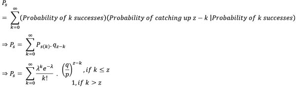

这是中本聪用来编写代码并证明概率呈指数下降的方程式。

从方程式中，我们可以推断出，如果攻击者没有控制多数的哈希功率，那么攻击者成功挖掘 z 个区块的概率会随着 z 值的增加而指数下降。因此，在确认交易之前，重要的是要等待几个区块。

建议商家在区块链深度为 6 的交易后才确认支付。

# 白皮书结论部分

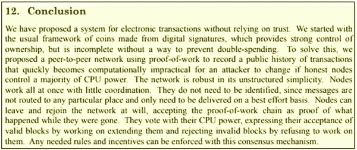

**图 5.32:** 白皮书结论部分

这一节解释了我们在论文中取得的成绩。这可以列为以下几点：

+   一个保护双重支付的点对点支付系统，不需要可信赖的第三方。

+   数字签名提供交易的所有权。

+   如果诚实节点控制了 CPU 功率的多数，那么工作量证明对于攻击者来说在区块链中修改足够的区块以造成双重支付是不切实际的。

+   节点独立工作，很少需要协调。节点可以独立离开和加入网络。它们需要进行通信，但它们的状态不依赖于其他节点，也不需要路由等。

+   节点无需透露其身份。

+   节点通过其 CPU 功率进行投票，因此，它们通过 CPU 功率的竞争来挖矿区块。成功的节点将获得支持网络的激励。

+   共识规则通过多数支持和参与来执行。

# 结论

在本章中，您详细了解了白皮书的内容。您还通过推导来了解了白皮书中的计算。

在下一章中，您将通过编写实际程序来解析存储在文件系统中的比特币软件的区块和索引，从而了解区块链中区块的结构。您还将通过编程详细了解挖矿过程。

# 需记住的要点

+   比特币网络不需要任何中介来发送比特币。

+   区块链是每个节点维护的真理之链。

+   可信赖的第三方在所有交易中都有成本，即使交易不需要争议解决。

+   比特币交易可以选择性地有一个可信赖的第三方作为托管实现，而不是按照规则。

+   交易是一系列数字签名，将支付的金额与之前的交易链接起来，最终指向挖出的硬币。

+   哈希是不可逆的。

+   数字签名确保了文档的完整性和真实性。

+   一旦创建，交易将广播到比特币网络。

+   区块链中的每个区块按时间顺序排列。

+   一个 nonce 是矿工找到的随机值，使其符合目标工作量证明，因此是可接受的。

+   比特币通过调整目标工作量证明来维护区块时间。

+   新区块发布到网络。

+   如果几乎同时挖掘出两个区块，区块链的分支中将存在多个竞争链。

+   在竞争的分支中，较长的链被接受，另一个被拒绝。

+   找到所需 nonce 的矿工将获得区块奖励。

+   此外，矿工从包含在区块中的交易中收集交易费。

+   矿工有保护网络而不是攻击网络的动机。

+   比特币通货膨胀是预先确定的。

+   节点可以通过移除包含的交易来删除较旧的区块，一旦收到足够的新区块。

+   SPV 简化支付验证节点只保留最长链的区块头部，仅包含所需的交易。

+   SPV 节点通过 Merkle 证明使用完整节点来验证区块和交易。

+   比特币的支付者可以结合其未使用的比特币交易输出，或分割其之前的未花费输出。

+   人们可以通过从不重复使用他们的地址来增强他们的隐私。

+   随着区块深度的增加，恶意矿工成功反转已经包含在区块链中的交易的概率呈指数级降低。

# 问题

+   节点如何知道它错过了区块？它如何获得丢失的区块？

+   为什么一个交易的输出通常只有一个或两个？

+   什么使区块链不可变？（勾选正确答案）

    +   梅克尔根

    +   数字签名

    +   工作量证明

    +   区块链的副本

+   真或假

    +   区块头哈希值越大，工作量证明越大。

    +   SPV 区块验证的成功取决于其对等方的诚实。

+   比特币由 ______ 产生。

+   为什么将比特币发送回相同的公钥会减少隐私？

+   在甘伯的毁灭问题中：瑞亚起始资金 i=2000 美元，赢得赌注的概率 p=0.7。

    +   瑞亚赢得总财富 N=6000 美元的概率是多少？

    +   瑞亚成为无限富有的概率是多少？

+   攻击者拥有整个网络 20%的挖矿能力。一个在线商店要求比特币交易在区块链中达到 6 的深度后才发货。

    +   攻击者在这段时间挖出 3 个区块的概率是多少？

    +   攻击者在确认时间内以及之后挖出 3 个区块，从而能够产生最长链的概率是多少？
