# 第六章

# 区块链、交易和挖矿

在上一章，我们试图详细理解比特币白皮书的内容。比特币白皮书于 2008 年 10 月 31 日发布。它提供了互联网货币的概念性设计，可以像现金一样工作。正如我们所看到的，设计非常详细，但并没有提供具体的区块奖励、区块时间或交易消息、散列或签名算法的细节。白皮书更像是对加密货币设计的模板。因此，我们称之为比特币白皮书的东西应该更准确地称为加密货币白皮书。

在本章中，我们将分析比特币协议的实现。我们将使用的比特币软件是用相当复杂的 C++编写的。对于试图理解比特币的平均程序员来说，查看并理解比特币软件代码是一项艰巨的任务。即使对于一个非常好的 C++程序员，理解比特币程序也是非常困难的。在当今的互联网时代，浏览网站和博客可以简化这个任务。而 Python 在尝试理解和验证我们的学习过程中非常有用。本章的目的是通过编程学习，而不是尝试构建最有效的解决方案。

在深入实际实现比特币协议之前，我们需要安装软件，并让区块链和索引与网络同步。

# 结构

我们将在本章涵盖以下主题：

+   比特币软件

    +   比特币核心安装

        +   运行比特币核心服务器

        +   比特币核心客户端

        +   用 Python 查询索引

+   区块链

    +   创世区块

    +   区块与索引

    +   区块头

        +   区块版本

        +   前一个区块哈希

        +   时间戳

        +   Merkle 根

        +   比特和非随机数

    +   序列化区块

        +   魔法数字

        +   区块文件

        +   使用区块索引进行区块遍历

+   交易

    +   UTXO

+   挖矿

    +   挖矿盈利性

        +   区块奖励

        +   交易费

        +   币基交易金额验证

        +   挖矿成本

    +   Mempool

# 目标

本章的目标是帮助你理解比特币区块链的结构，比特币软件如何存储和组织区块链，区块和交易是如何索引的，mempool 数据的结构，以及如何使用它们和 UTXO 进行挖矿。

本章使用 Python 编程理解比特币区块链、区块文件、索引、UTXO 和挖矿。

# 比特币软件

主要有三款软件提供完整验证：Armory、比特币核心和 Bitcoin Knots。其中，比特币核心是最广泛使用的软件，也是更新最频繁的。中本聪创建了这款软件，之后由比特币核心团队负责维护。它也被称为中本聪客户端。据某些估计，多达 95%的全节点运行这款软件。因此，我们将使用这个软件进行开发和学习。

# 比特币核心安装

Bitcoin Core 的安装说明可以在以下部分找到：

**[`bitcoin.org/en/full-node`](https://bitcoin.org/en/full-node)**

在左侧，您可以找到 Linux、Mac OS 和 Windows 的安装说明。此外，Bitcoin Core 可以通过 Snap Store 在 Linux 上安装。Bitcoin Core 也可以在 Docker 上安装。始终使用正版软件非常重要，因为如果您使用该软件生成私钥或接收比特币，那些私钥将 known to the attacker or attacking software who will use it to steal your bitcoins protected by the private keys。从正版网站下载软件并在多个不相关的网站上验证散列是确保安全最佳方式。

# **运行 Bitcoin Core 服务器** (toc.xhtml#s101a)

Bitcoin Core 服务器可以从 GUI 或命令行运行。对于 GUI 版本，我们可以运行 `**bitcoin-qt –daemon**`，对于命令行，我们可以运行 `**bitcoind**`。我们将使用命令行运行守护进程和客户端。同步所有块及其索引可能需要一两天的时间。更大的内存、更好的互联网和更快的磁盘可以加快下载和索引生成。

以下是启动守护进程的示例命令：

`bitcoind -printtoconsole -txindex=1 -dbcache=8392`

`**dbcache**` 是内存中的数据库缓存大小。它提高了块验证时间并减少了下载区块链的时间。

`**txindex=1**` 表示将创建除必要之外的交易索引。

# **Bitcoin Core 客户端** (toc.xhtml#s102a)

我们可以使用以下命令连接到守护进程：

`bitcoin-cli [options] <command> [params]`

我们还可以使用 `**bitcoinrpc**` 对 Python 进行守护进程连接。以下是 pip 包信息：

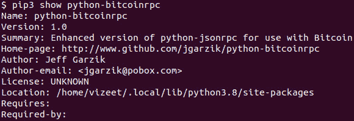

**图 6.1:** Python pip 包以创建 Bitcoin Core Daemon 的 Python 客户端

# **在 Python 中查询索引** (toc.xhtml#s103a)

Bitcoin Core 使用 LevelDB 来存储其索引。LevelDB 是一个磁盘上的键值存储，它使用二进制文件来存储键值对。它支持快速遍历存储的键和键值对的快速访问。尽管 LevelDB 提供非常快的查询，但它有限制，因为它不支持模式搜索和过滤。要查询数据库，我们需要以下 pip 包安装：

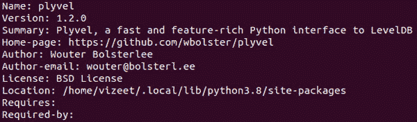

**图 6.2:** Python 包用于 LevelDB

以下是在 LevelDB 数据库中存储的键和值：

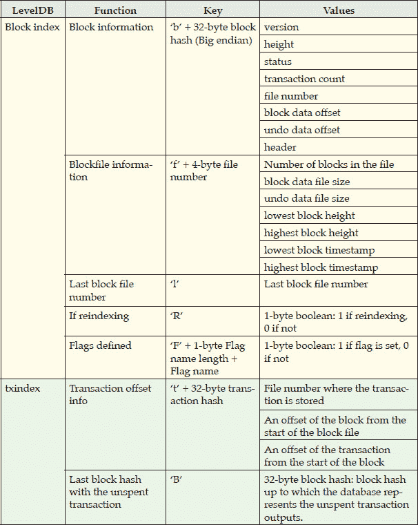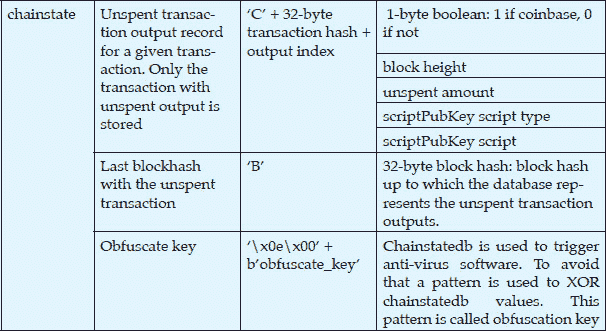

**表 6.1:** Bitcoin 区块链 LevelDB 索引

我们将使用 `**plyvel**` 包在 `**Python 3.6**` 中探索这些值。

# 区块链

区块链是块的轨迹，每个块都是交易的集合。区块链包含自比特币网络成立以来发生的所有交易。

# **创世区块** (toc.xhtml#s105a)

创世区块定义如下：

*区块链中的第一个区块称为创世区块。*

2009 年 1 月 3 日，比特币网络诞生。中本聪挖了几个月的区块。在那段时间里，还有少数其他开发者也挖过区块，但比特币区块链的第一个区块与众不同。它不是挖出来的，而是被硬编码在比特币软件中。通过使用前一个区块散列进行遍历后，区块链结束在这个区块，这意味着我们可以通过改变这个区块来创建一个不同的链和因此，一种新币。这个区块带有特殊的信息，向世界证明比特币的存在。

以下是创世块的十六进制代码：

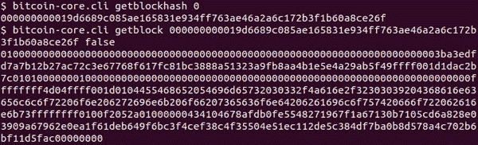

**图 6.3：**显示创世区块的块十六进制转储

这个十六进制代码，当打印为字节转储时，会给出以下输出：

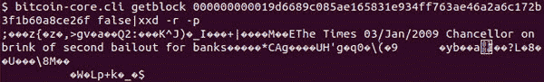

**图 6.4：**显示创世区块散列转储的二进制形式

我们可以看到带有日期和来源的消息：

**图 6.5：**显示存储在创世区块中的消息

2009 年 1 月 3 日，伦敦《泰晤士报》发表了一篇题为“Chancellor on brink of second bailout for banks”的文章，这篇文章是中本聪试图证明比特币推出的依据。它指出，当前的金融体系没有坚实的基础；它需要干预才能维持，而这些干预是为了使某些企业受益，例如大银行，但没有银行家或政府的干预为 2008 年大衰退后失去工作的普通民众提供救济。中本聪将比特币视为一种替代品，因为它提供了一种无需干预的货币系统，该系统由一组无法被一群人意志修改的规则驱动。

# 区块与索引

比特币核心守护进程在运行时，会在默认目录`**~/.bitcoin**`下创建几个目录和文件。以下是文件和目录及其功能的列表：

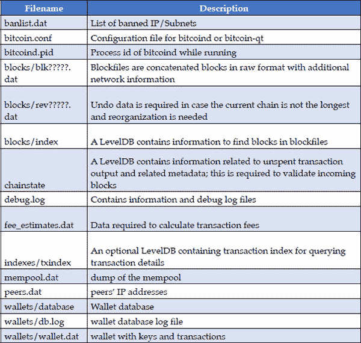

**表 6.2：**比特币核心使用的文件和目录及其功能列表

区块链相当大，这使得维护索引变得必要，以提高验证新区块和交易以及某些由共识规则所需的其他操作的效率。

# 区块头

比特币区块平均每 10 分钟生成一次。以下是区块头结构：

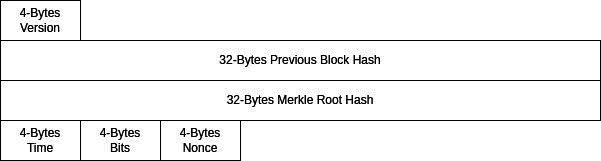

**图 6.6：**区块头结构

截至目前，区块高度为`**726556**`。比特币命令行工具（bitcoin-cli）使用以下命令提供最新的验证区块高度：

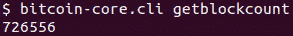

**图 6.7：**比特币区块链中的当前区块高度

我们可以使用区块高度信息来获取区块散列：

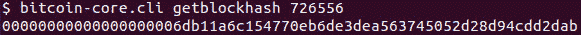

**图 6.8：**从块高度获取块散列

由于我们知道区块头长度为 80 字节，我们可以使用区块哈希获取区块头。以下是通过读取区块内容的前 80 字节得到的区块头：

**图 6.9：** 使用比特币核心 CLI 从区块哈希获取的区块头内容

如果我们对区块头的内容应用两次 sha256 算法进行哈希，我们会得到区块哈希。以下程序执行此操作：

`import hashlib`

`**blk_b = bytes.fromhex(‘040020200a377a6ce7bfbd5efdbe087801fbef9a8a7b6815c3eb08000000000000000000ead1c751f9b4fedd1ff1ab37f7dccec13fc4cdfd6df4406fdd72cd44655fd2fa9389286273370a1739264fbc’)**`

`**h1 = hashlib.sha256(blk_b).digest()**`

`**h2 = hashlib.sha256(h1).digest()**`

`print(h2[::-1].hex())`

**程序 6.1：** 从区块头获取区块哈希的程序

运行这个程序会得到以下哈希值，正如我们看到的，它与给我们区块头的区块哈希相同：

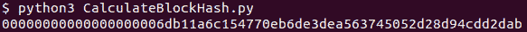

**图 6.10：** 显示计算得到的区块哈希

区块元素以小端方式存储，因此为了能够使用这些值，我们需要反转字节顺序。以下是获取区块头结构的小程序，它接受区块头的十六进制代码并对头部元素进行注释：

`*def getBlockHeader**(blk:* *bytes**):*`

`*block = {}*`

`*block[**‘version’**] = blk[**0**:**4**][::-**1**].hex()*`

`*blk =* *blk[**4**:]*`

`*block[**‘prev_blockhash’**] = blk[**0**:**32**][::-**1**].hex()*`

`*blk =* *blk[**32**:]*`

`*block[**‘merkle_root’**] = blk[**0**:**32**][::-**1**].hex()*`

`*blk =* *blk[**32**:]*`

`*block[**‘time’**] =**int**.from_bytes(blk[**0**:**4**], byteorder=**’little’**)*`

`*blk =* *blk[**4**:]*`

`*block[**‘bits’**] = blk[**0**:**4**][::-**1**].hex()*`

`*blk =* *blk[**4**:]*`

`*block[**‘nonce’**] = blk[**0**:**4**][::-**1**].hex()*`

`*return* *block*`

**程序 6.2：** 从区块头字节获取区块头结构的程序

我们调用方法如下：

`*blkhdr = bytes.fromhex(“*040020200a377a6ce7bfbd5efdbe087801fbef9a8a7b6815c3eb08000000000000000000ead1c751f9b4fedd1ff1ab37f7dccec13fc4cdfd6df4406fdd72cd44655fd2fa9389286273370a1739264fbc”*)*`

`jsonobj = getBlockHeader(blkhdr)`

`print(json.dumps(jsonobj, indent = 4))`

这给出了以下结果：

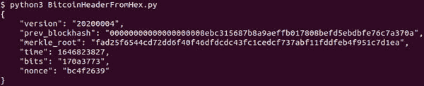

**图 6.11：** 从执行程序显示的区块头结构

我们可以利用收集到的信息进行进一步的分析。

# 区块版本

*version*字段表示矿工对增强功能的支持。在比特币中，影响区块或交易验证共识规则且向后兼容（不会导致链分裂）的协议增强称为软分叉。比特币区块共识机制已从`**IsSuperMajority()**`或 ISM 更改为版本位。

版本 1 到 4 被称为`**IsSuperMajority()**`软分叉。在这个共识系统中，新版本在连续的 1,000 个区块中的 950 个被激活。一旦发生此激活，将拒绝旧版本的区块。

隔离见证比特币网络的引入升级到了使用版本位的较新共识机制。这个机制是在比特币改进提案 BIP-9 中提出的。所有比特币改进提案的列表可以在 **[`github.com/bitcoin/bips`](https://github.com/bitcoin/bips)** 中找到。版本位允许多个软分叉等待接受并最终部署。

在这个机制中，软分叉经历一个工作流程。下面的流程图展示了软分叉的生命周期。（来源 **[`github.com/bitcoin/bips/blob/master/bip-0009.mediawiki`](https://github.com/bitcoin/bips/blob/master/bip-0009.mediawiki)**）

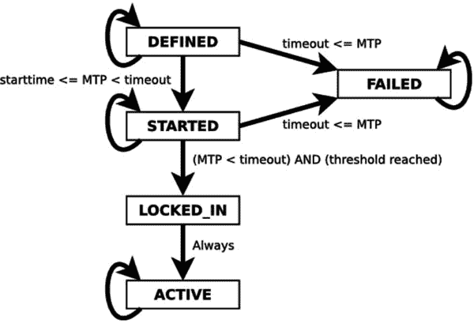

**图 6.12:** 图片来自 BIP 9，展示了软分叉的工作流程

当开发者提出一个软分叉时，它会在开发者论坛上进行辩论，并在 BIP 中起草。随着 BIP 实施 defined and is ready for deployment，软分叉进入 Defined 状态。之后，支持升级的矿工准备升级。准备好的矿工通过设置相应的版本位来发出准备信号。此时，软分叉达到 Started 状态，需要在接下来的 1 年内获得最后 2016 个区块中的 95%支持。如果软分叉在 1 年内没有达到 95%的接受度，它被认为是失败的并被撤回，这意味着支持它的区块将被拒绝。如果软分叉达到 95%的接受度，它达到一个*locked_in*状态，并在 2016 个区块后成为一条规则。

如果一个改进很重要，而矿工社区没有达成共识，开发者社区可以在特定区块中通过启用 BIP148 强制更改。

版本位设置了一个`0x20000000`，其他设置位表示对软分叉提案的准备。如果爱丽丝提出一个升级，并且 0x1 位表示她的软分叉，那么支持并准备升级的矿工将创建一个版本为`0x20000001`的区块。如果鲍勃也提出一个升级，并且`0x4`位表示他的软分叉，那么矿工可以通过设置 0x4 位来投票，即`0x20000100`。如果矿工为两个升级投票，他们将设置两个位，所以版本将是`0x20000101`。

# 前区块哈希

在前面的程序中，我们得到了一个区块头结构，其中一个字段是前区块哈希。我们可以通过查询 Bitcoin Core 软件使用少一个区块高度的区块哈希，得到相同的区块哈希，如下所示：

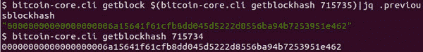

**图 6.13:** 显示通过区块头和区块高度获得的上一区块哈希并进行比较

# 时间戳

使用时间，我们可以使用以下 bashshell 命令获取块的时间戳：

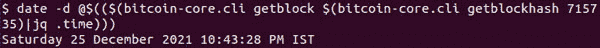

**图 6.14:** 显示从区块头中的时间字段获得的日期时间

# Merkle 根

要计算 Merkle Root，我们需要一个区块中交易的列表。我们使用以下 CLI 命令从区块的区块结构中获取交易列表：

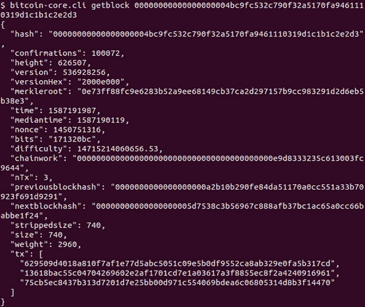

**图 6.15：** 由比特币核心 CLI 命令显示的区块结构

正如你在 *第五章，白皮书，图 5.22* 中学到的，Merkle Root 的哈希是通过重复哈希和连接连续的交易对来计算的。以下 Python 程序执行相同的操作：

`def hashOfJoinedStr(a:str, b:str):`

`# 反转输入，因为哈希前后的大小端问题`

`a١ = bytes.fromhex(a)[::-1]`

`b١ = bytes.fromhex(b)[::-1]`

`h = hashlib.sha256(hashlib.sha256(a1 + b1).digest()).digest()`

`return h`

`def buildMerkleRoot(hash_list: list):`

`if len(hash_list) < 2:`

`return hash_list[0]`

`new_hash_list = []`

`# 处理成对的哈希。对于奇数长度，最后一个会被跳过`

`for i in range(0, len(hash_list) - 1, 2):`

`new_hash_list.append(hashOfJoinedStr(hash_list[i], hash_list[i + 1])[::-1].hex())`

``# 奇数长度，对最后一个哈希再哈希一次`

`if len(hash_list) % 2 == 1:`

`new_hash_list.append(hashOfJoinedStr(hash_list[-1], hash_list[-1])[::-1].hex())`

``return buildMerkleRoot(new_hash_list)`

**程序 6.3：** 从交易哈希构建 Merkle Root 的程序

我们在代码中包含以下行以对比特币核心服务器进行 RPC 调用：

`from bitcoinrpc.authproxy import AuthServiceProxy, JSONRPCException`

`rpc_connection = AuthServiceProxy(“http://%s:%s@127.0.0.1:8332”%(<username>, <password>))我们如下调用上述方法：`

`if __name__ == ‘__main__’:`

`block_hash = rpc_connection.getblockhash(715735)`

`block = rpc_connection.getblock(block_hash)`

`print(‘从 RPC 调用获取的梅克尔根\t = %s’ % block[‘merkleroot’])`

`hash_merkle_root = buildMerkleRoot(block[‘tx’])`

`print(‘计算得到的 Merkle Root\t = %s’ % hash_merkle_root)`

这给我们带来以下结果：

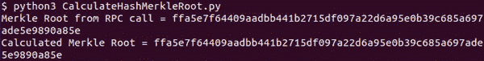

**图 6.16：** 展示了计算出的 Merkle Root 值与头部值相等的程序执行结果

# Bits 和 nonce

接下来要了解的字段是 Bits。Bits 是目标阈值的压缩表示。区块哈希需要小于目标阈值才能被接受为有效区块。

下面是未压缩方程式：

*b[1] b[2] b[3] b[4]: Bits 的四个字节*

*目标阈值 T= b[2] b[3] b[4].256^(b1-3))*

让我们看看下一个区块，其区块高度为`**715735**`，其区块哈希是否小于目标阈值。

*h: 区块哈希*

*T: 目标阈值*

*h= 0000000000000000004db407202aff54e9ace0efb72588bb73a2beebb248c28*

*b[1] b[2] b[3] b[4] = 170b98ab*

*b[1]=0x17,b[2] = 0x0b,b[3] = 0x98,b[4] = 0xab*

*T=0x0b98ab.256^(0x17-0x03)*

⇒*T=0x0b98ab.256^(0x14)*

如果 *T* `>` *h* 则区块有效

下面的程序将位转换为获取目标阈值：

`def getTargetThreshold(bits: bytes):`

`shift = bits[3]`

`value = int.from_bytes(bits[0:3], byteorder=’little’)`

`target_threshold = value * 2 ** (8 * (shift - 3))`

`return target_threshold`

**程序 6.4:** 将区块头中的位转换为目标阈值的程序

以下代码调用这个方法并验证区块哈希具有所需的工作量证明：

`bits = bytes.fromhex(“170b98ab”)[::-1]`

`target_threshold = getTargetThreshold(bits)`

`print(‘Target Threshold = %x’ % target_threshold)`

`block_hash = 0x00000000000000000004db407202aff54e9ace0efb72588bb73a2beebb248c28`

`print(‘Block Hash = %x’ % block_hash)`

`print(‘Valid’ if target_threshold > block_hash else ‘Invalid’)`

这给了我们以下结果：

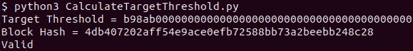

**图 6.17:** 从区块头中的位计算目标阈值的插图

# **序列化区块](toc.xhtml#s113a)

比特币序列化区块还包含除了区块头和交易之外的字段。以下是这些字段：

+   魔数

+   区块大小

以下是一个序列化区块的插图：

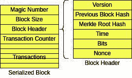

**图 6.18:** 图展示了序列化区块的结构

# **魔数](toc.xhtml#s114a)

区块哈希是区块头的哈希。魔数是网络的标识符。如果一个节点连接到同一对等节点以进行多个不同的币网络，区块魔数可以作为标识符，节点将不必为多个网络验证区块共识规则。这提高了效率。

公共比特币网络，也就是比特币进行转账的网络，也被称为*主网络*。还有测试网络（testnet）和回归测试网络（regtest），用于测试。这些网络中的每一个都有定义好的魔数和不同的端口号，以连接到对等节点。

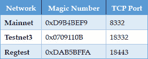

**表 6.3:** 展示不同比特币网络的魔数和分配的 TCP 端口号的表格

# 区块文件

比特币核心将区块链存储在以区块文件形式存在的目录中，每个区块文件包含多个以二进制格式存在的区块。区块文件如下表示：

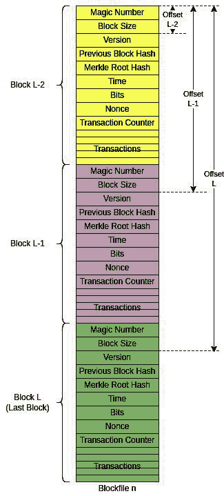

**图 6.19:** 区块文件结构的插图

我们可以通过使用序列化区块中的区块大小来解析区块文件中的所有区块。这有助于跳过两个区块之间可能存在的任何垃圾字符。区块文件总是从序列化区块的开始处开始，因此我们知道前 4 个字节代表一个魔数。从区块索引中，我们可以获取区块文件中的区块计数。

为了使用来自 LevelDB 索引的键访问值，我们需要了解它们的结构。正如我们所学的，LevelDB 是一个二进制键值数据库，它将数据存储在文件系统中。比特币利用 LevelDB 来存储多个值，有时，也存储多个键。为了存储可变长度的键和值，比特币使用了一种可变长度的整数格式编码。在这种编码中，如果一个字节的最显著位被设置，那么下一个字节也包括在内。

要进行编码，将 7 位存储在字节数组中，从数字中删除，然后减 1。 重复此过程直到位变为零。 所有字节的最高有效位都设置为除最后一个字节外的所有字节。

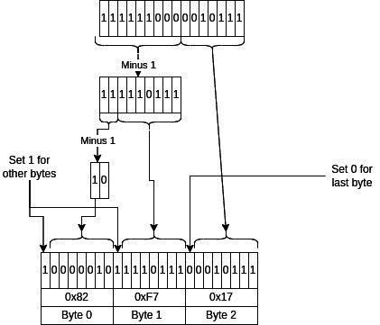

**图 6.20：**显示 b128 变长整数编码机制的插图

下面是编码器的实现：

`def b128_varint_encode(n: int):`

`l = 0`

`b = []`

`while True:`

`# 取 7 位并在不是最后一个字节时设置 MSB`

`b.append((n & 0x7F)| (0x80 if l != 0 else 0x00))`

`if n <= 0x7F:`

`break`

`n = (n >> 7) - 1`

`l += 1`

`return bytes(bytearray(b[::-1]))`

**程序 6.5：**将数字编码为 b128 变长整数的程序

下面的代码解码可变长度整数：

`def b128_varint_decode(b: bytes, pos = 0):`

`n = 0`

`while True:`

`data = b[pos]`

`pos += 1`

`# 取消设置 MSB 位`

`n = (n << 7) | (data & 0x7f)`

`if data & 0x80 == 0:`

`return (n, pos)`

`n += 1`

**程序 6.6：**将 b128 变长整数解码为整数的程序

运行上述代码，我们得到以下编码和解码整数对：

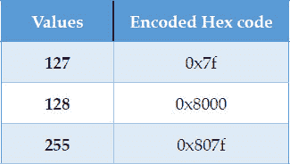

**表 6.4：**样本 b128 变长整数编码数字

要解析块文件中的块，我们需要从块索引中获取块文件信息。 块文件索引包含以下信息：

+   `**count**`：块文件中存储的块数

+   `**filesize**`：块文件大小（以字节为单位）

+   `**undofilesize**`：撤销文件大小（以字节为单位）

+   `**lowest**`：包含从此块高度开始的块

+   `**highest**`：包含直到此块高度的块

+   `**Lowest_timestamp**`：包含从此块时间戳开始的块

+   `**highest_timestamp**`：包含直到此块时间戳的块

下面的代码从块索引中获取块文件信息：

`block_db_g = plyvel.DB(os.getenv(‘BLOCK_INDEX_DB’), compression=None)`

`blocks_path_g = os.getenv(‘BLOCKS_PATH’)`

`def getBlockFileIndex(n_file: int, block_db):`

`key = b’f’ + (n_file).to_bytes(4, byteorder=’little’)`

`value = block_db.get(key)`

`jsonobj = {}`

`jsonobj[‘count’], pos = b128_varint_decode(value)`

`jsonobj[‘filesize’], pos = b128_varint_decode(value, pos)`

`jsonobj[‘undofilesize’], pos = b128_varint_decode(value, pos)`

`jsonobj[‘lowest’], pos = b128_varint_decode(value, pos)`

`jsonobj[‘highest’], pos = b128_varint_decode(value, pos)`

`jsonobj[‘lowest_timestamp’], pos = b128_varint_decode(value, pos)`

`jsonobj[‘highest_timestamp’], pos = b128_varint_decode(value, pos)`

`return jsonobj`

**程序 6.7：** 查询区块数据库以获取区块文件索引的程序

我们使用以下参数调用此方法：

`blk_index = getBlockFileIndex(138, block_db_g)`

在执行上述程序之前，我们需要设置以下环境变量：

`BITCOIN_HOME：比特币工作目录的路径。`

`BLOCK_INDEX_DB：默认为 $BITCOIN_HOME/blocks/index`

`BLOCKS_PATH：默认为 $BITCOIN_HOME/blocks/`

``CHAINSTATE_DB：默认为 $BITCOIN_HOME/chainstate``

``TX_INDEX_DB: 默认情况下是 $BITCOIN_HOME/indexes/txindex``

这给出了以下结果：

**图 6.21:** 运行程序后获得的区块文件索引结构

现在，利用上述信息，我们已经编写了以下代码来解析区块文件：

`def parseSerialisedBlock(block_f):`

`serialized_blk = {}`

`serialized_blk[‘magic_num’] = block_f.read(4)[::-1].hex()`

`serialized_blk[‘blk_size’] = int.from_bytes(block_f.read(4), byteorder=’little’)`

`serialized_blk[‘version’] = block_f.read(4)[::-1].hex()`

`prev_blkhash_b = block_f.read(32)`

`serialized_blk[‘prev_blkhash’] = prev_blkhash_b[::-1].hex()`

`serialized_blk[‘merkle_root_hash’] = block_f.read(32)[::-1].hex()`

`serialized_blk[‘time’] = int.from_bytes(block_f.read(4), byteorder=’little’)`

`serialized_blk[‘bits’] = block_f.read(4)[::-1].hex()`

`serialized_blk[‘nonce’] = block_f.read(4)[::-1].hex()`

`return serialized_blk`

**程序 6.8:** 获取区块头以及魔法数字和区块大小的程序

我们遍历区块文件，使用前面方法获得的区块信息来查找文件中的所有区块：

`if __name__ == ‘__main__’:`

`n_file = 138`

`block_filepath = os.path.join(blocks_path_g, ‘blk%05d.dat’ % n_file)`

`block_f = open(block_filepath, ‘rb’)`

`blk_index = getBlockFileIndex(n_file, block_db_g)`

`print(blk_index)`

`for i in range(blk_index[‘count’]):`

`# 将文件指针移动到区块头的末尾`

`serialized_blk = parseSerialisedBlock(block_f)`

`next_blk_loc = block_f.tell() - 80 + serialized_blk[‘blk_size’]`

`block_f.seek(next_blk_loc)`

`print(‘serialized_blk = %s’ % serialized_blk)`

以下是区块文件中的前两个区块的信息：

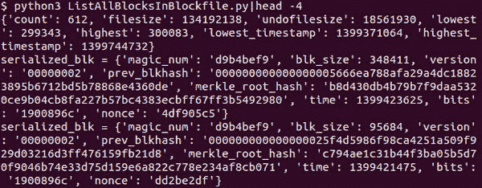

**图 6.22:** 显示了一个区块文件中的前两个区块以及文件的其他信息

这种解析方法在重新扫描索引的区块时非常有用。

# **使用区块索引遍历区块文件](toc.xhtml#s116a)**

LevelDB 索引在多个方面都有帮助。它们有助于更快地验证区块和交易。我们可以使用它们来遍历区块链，这在软分叉部署中需要解析固定数量的区块时非常有用。使用区块文件编号和区块文件索引遍历区块链是一种更有效的方法。

以下图表展示了区块遍历的步骤：

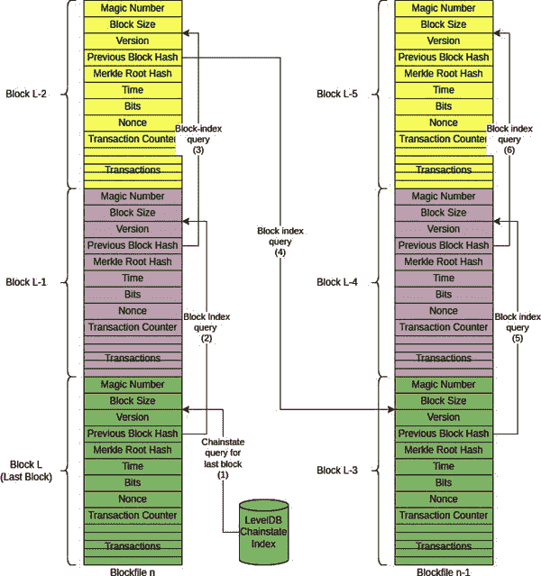

**图 6.23:** 使用 LevelDB 索引遍历区块文件的示例

我们需要记住的一件事是，区块文件中的区块并不总是按顺序排列，这意味着我们总是需要使用区块头中的前一个区块哈希来获取前一个区块的位置。

链状态数据库是编码的，与其他数据库不同。这是因为过去链状态数据库中的字符序列触发了防病毒软件。在这种编码方法中，每个字节都与混淆密钥中的字节进行异或操作。混淆密钥存储在链状态数据库中的 b’\x0e\x00’ 键下。

以下代码将混淆密钥应用于所有字节并返回解码的链状态值：

`def getObfuscationKey(chainstate_db):`

`value = chainstate_db.get(b’\x0e\x00’ + b’obfuscate_key’)`

`print(‘混淆密钥 = %s’ % value)`

`obfuscation_key = value[1:]`

`return obfuscation_key`

`def applyObfuscationKey(data: bytes, chainstate_db):`

`obfuscation_key = getObfuscationKey(chainstate_db)`

`new_val = bytes(data[index] ^ obfuscation_key[index % len(obfuscation_key)] for index in range(len(data)))`

`return new_val`

**程序 6.9:** 使用混淆密钥解码链状态的 LevelDB 程序

现在，我们已经有了足够的信息来遍历区块链。让我们看看我们是如何做到的：

**步骤 1:** 从链状态数据库中查询最后一个区块哈希。

**步骤 2:** 在区块索引数据库中查询区块哈希以获取区块索引。

**步骤 3:** 区块索引包含区块的位置信息。使用这些信息，我们读取正确的区块文件或撤销文件，并从偏移位置读取数据以获取区块数据。

**步骤 4** 从区块数据中，我们获取前一个区块的区块哈希，然后重复步骤 2-4。

以下是自区块索引数据库获得的区块索引信息：

+   `**版本号**`: 客户端的版本号（不是区块）。

+   `**高度**`: 区块的高度。

+   `**状态**`: 表示它包含的数据类型。它可能是 BLOCK_HAVE_DATA 或 BLOCK_HAVE_UNDO，表示它是否正向修补或反向修补链状态数据。

+   `**交易计数**`: 区块中的交易计数。

+   `**文件编号**`: 包含区块的区块文件编号。

+   `**数据位置**`: 数据块的字节位置。

+   `**撤销位置**`: 撤销区块的字节位置。

+   `**头部**`: 区块头内容。

在上面的信息中，我们遇到了通过撤销区块的反向修补。要理解这一点，我们需要了解比特币区块链中的区块可能竞争下一个位置。这是因为矿工可能会几乎同时挖掘一个区块，其中一个区块将在后来被接受，因为它所在的竞争链变得更长。当这种情况发生时，使用撤销区块来反转链状态索引。

以下是使用 LevelDB 索引遍历区块链的代码：

1.  获取 LevelDB 数据库：

    `block_db_g = plyvel.DB(os.getenv(‘BLOCK_INDEX_DB’), compression=None)`

    `chainstate_db_g = plyvel.DB(os.getenv(‘CHAINSTATE_DB’), compression=None)`

1.  从链状态数据库中获取最后一个区块哈希：

    `def getRecentBlockHash(chainstate_db):`

    `key = b’B’`

    `block_hash_b = chainstate_db.get(key)`

    `block_hash_b = applyObfuscationKey(block_hash_b, chainstate_db)`

    `return block_hash_b`

    **程序 6.10：** 从链状态数据库获取最近的区块的程序

1.  从区块索引数据库获取区块索引：

    `BLOCK_HAVE_DATA = 8`

    `BLOCK_HAVE_UNDO = 16`

    `def getBlockIndex(block_hash_b: bytes, block_db):`

    `key = b’b’ + block_hash_b`

    `value = block_db.get(key)`

    `jsonobj = {}`

    `jsonobj[‘version’], pos = b128_varint_decode(value)`

    `jsonobj[‘height’], pos = b128_varint_decode(value, pos)`

    `jsonobj[‘status’], pos = b128_varint_decode(value, pos)`

    `jsonobj[‘tx_count’], pos = b128_varint_decode(value, pos)`

    `if jsonobj[‘status’] & (BLOCK_HAVE_DATA | BLOCK_HAVE_UNDO):`

    `jsonobj[‘n_file’], pos = b128_varint_decode(value, pos)`

    `if jsonobj[‘status’] & BLOCK_HAVE_DATA:`

    `jsonobj[‘data_pos’], pos = b128_varint_decode(value, pos)`

    `if jsonobj[‘status’] & BLOCK_HAVE_UNDO:`

    `jsonobj[‘undo_pos’], pos = b128_varint_decode(value, pos)`

    `jsonobj[‘header’] = {}`

    `jsonobj[‘header’][‘version’] = value[pos:pos+4][::-1].hex()`

    `jsonobj[‘header’][‘prevblockhash’] = value[pos+4:pos+36][::-1].hex()`

    `jsonobj[‘header’][‘merkleroot’] = value[pos+36:pos+68][::-1].hex()`

    `jsonobj[‘header’][‘time’] = value[pos+68:pos+72][::-1].hex()`

    `jsonobj[‘header’][‘bits’] = value[pos+72:pos+76][::-1].hex()`

    `jsonobj[‘header’][‘nonce’] = value[pos+76:pos+80][::-1].hex()`

    `return jsonobj`

    **程序 6.11：** 从区块数据库获取区块索引结构的程序

1.  以下程序解析区块字节以获取区块头信息：

    `def getTransactionCount(mptr: mmap):`

    `prefix = int.from_bytes(mptr.read(1), byteorder=’little’)`

    `b_cnt_m = {‘fd’: 2, ‘fe’: 4, ‘ff’: 8}`

    `if prefix < 0xFD:`

    `tx_cnt = prefix`

    `else:`

    `b_cnt = b_cnt_m[‘%x’ % prefix]`

    `tx_cnt = int.from_bytes(mptr.read(b_cnt), byteorder=’little’)`

    `return tx_cnt`

    `def parseBlockHeader(mptr: mmap, start: int, height: int):`

    `seek = start-8`

    `mptr.seek(seek)`

    ``block_header = {}``

    `block_header[‘magic_number’] = int.from_bytes(mptr.read(4), byteorder=’little’)`

    `block_header[‘block_size’] = int.from_bytes(mptr.read(4), byteorder=’little’)`

    `block_header[‘version’] = int.from_bytes(mptr.read(4), byteorder=’little’)`

    `prev_block_header_hash = mptr.read(32)`

    `block_header[‘prev_block_hash’] = prev_block_header_hash[::-1].hex()`

    `block_header[‘merkle_tree_root’] = mptr.read(32)[::-1].hex()`

    `block_header[‘timestamp’] = int.from_bytes(mptr.read(4), byteorder=’little’)`

    `block_header[‘date_time’] = datetime.datetime.fromtimestamp(block_header[‘timestamp’]).strftime(‘%Y-%m-%d %H:%M:%S’)`

    `block_header[‘bits’] = int.from_bytes(mptr.read(4), byteorder=’little’)`

    `block_header[‘nonce’] = int.from_bytes(mptr.read(4), byteorder=’little’)`

    `txcount = getTransactionCount(mptr)`

    `return block_header, prev_block_header_hash`

    **程序 6.12：** 获取区块头信息的程序

以下程序使用区块索引信息获取区块内容，然后使用其区块哈希和区块索引找到前一个区块：

`def traverseBlockChain():`

`df = pd.DataFrame()`

`prev_blockhash_bigendian_b = getRecentBlockHash(chainstate_db_g)`

`blockheader_list = []`

`while True:`

`jsonobj = getBlockIndex(prev_blockhash_bigendian_b, block_db_g)`

`print(jsonobj[‘n_file’])`

`if ‘data_pos’ in jsonobj:`

`block_filepath = os.path.join(blocks_path_g, ‘blk%05d.dat’ % jsonobj[‘n_file’])`

`start = jsonobj[‘data_pos’]`

`print(‘height = %d’ % jsonobj[‘height’])`

`elif ‘undo_pos’ in jsonobj:`

`block_filepath = os.path.join(blocks_path_g, ‘rev%05d.dat’ % jsonobj[‘n_file’])`

`start = jsonobj[‘undo_pos’]`

`# load file to memory`

`with open(block_filepath, ‘rb’) as block_file:`

`with mmap.mmap(block_file.fileno(), 0, prot = mmap.PROT_READ, flags = mmap.MAP_PRIVATE) as mptr: #File is open read-only`

`blockheader, prev_blockhash_bigendian_b = parseBlockHeader(mptr, start, jsonobj[‘height’])`

`blockheader[‘height’] = jsonobj[‘height’]`

`blockheader[‘tx_count’] = jsonobj[‘tx_count’]`

`blockheader_list.append(blockheader)`

`if jsonobj[‘height’] == 1:`

`break`

`df = pd.DataFrame(blockheader_list)`

`df.to_csv(‘out.csv’, index=False)`

**程序 6.13：** 遍历比特币区块链的程序

我们将上述程序称为：

`if __name__ == ‘__main__’:`

`遍历区块链()`

我们得到了 `**out.csv**`，其中包含以下几行的一部分：

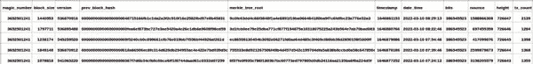

**图 6.24：** 显示了前几个遍历的块信息

这完成了区块链部分。您理解了区块链的结构，这些块如何存储以及如何读取、遍历和解析这些块以获取头部和前头字段。

# 交易

当一方用比特币支付另一方时，发送者创建一个交易并将其发布到比特币网络。我们在 *第五章，白皮书* 中详细讨论了这个问题。

在本节中，我们将看看交易是如何存储的，它们的格式，如何进行验证以及其他相关信息。

交易在块中一个接着一个地存储在交易计数之后的块中。块有其自己的变长整数格式。这与我们在前一节学到的 LevelDB 变长整数格式不同。这个要简单一些。一个前缀表示整数的长度。

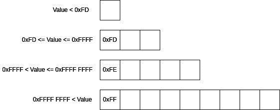

**Figure 6.25:** LevelDB 索引值结构使用的变长整数格式

在前面的小节 ***使用块索引遍历块*** 中，我们使用了一个名为 `**getTransactionCount**` 的方法。

调用 `**getTransactionCount**`，我们传递了带有块哈希的修剪块的字节。以下是调用代码：

`blk_h = ‘00e0ff376a2079af63073c47184cd091819d506f12cb6b68887c040000000000000000001036e0b1059b1ec79cb36897ccf8bc5aef4c7996897b83754ab590bb2774bc2726c0475fea0710178ffaf153fda4090100000000010100000000000000000000’`

`blk_b = bytes.fromhex(blk_h)`

`blk_m = mmap.mmap(-1, len(blk_b) + 1)`

`blk_m.write(blk_b)`

`blk_m.seek(80)`

`tx_count = getTransactionCount(blk_m)`

`print(‘Transaction Count = %d’ % tx_count)`

运行后，我们得到以下结果：

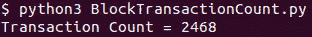

**Figure 6.26:** 显示了前面程序中块中的交易计数

在交易列表中，第一个交易是 coinbase 交易。这是一个特殊的交易，因为它是由矿工创建的，用来支付自己从块中收集的区块奖励和交易费用。这个交易还会将比特币添加到硬币的供应中。这个交易没有输入 txouts。

这个交易的结构如下：

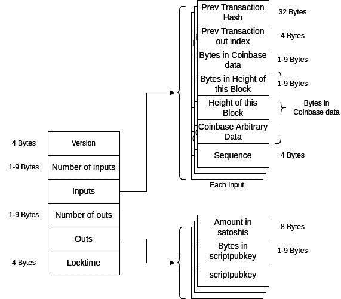

**Figure 6.27:** Coinbase 交易结构

以下程序解析 coinbase 交易：

`import mmap`

`import json`

`def getVarInt(blk_m: mmap):`

`b_cnt_d = {‘fd’: 2, ‘fe’: 4, ‘ff’: 8}`

`prefix = int.from_bytes(blk_m.read(1), byteorder=’little’)`

`if prefix < 0xFD:`

`return prefix`

`else:`

`b_cnt = b_cnt_d[‘%x’ % prefix]`

`size = int.from_bytes(blk_m.read(b_cnt), byteorder='little')`

`return size`

`def getCoinbaseTransactionInfo(blk_m: mmap):`

`tx = {}`

`tx['version'] = blk_m.read(4)[::-1].hex()`

`tx['inp_cnt'] = getVarInt(blk_m)`

`inp_l = []`

`for i in range(tx['inp_cnt']):`

`inp = {}`

`inp['prev_tx_hash'] = blk_m.read(32)[::-1].hex()`

`inp['prev_tx_out_index'] = int.from_bytes(blk_m.read(4), byteorder = 'little')`

`inp['bytes_coinbase_data'] = getVarInt(blk_m)`

`pos = blk_m.tell()`

`inp['bytes_height'] = getVarInt(blk_m)`

`inp['height'] = int.from_bytes(blk_m.read(inp['bytes_height']), byteorder='little')`

`size = blk_m.tell() - pos`

`coinbase_arb_data_size = inp['bytes_coinbase_data'] - size`

`inp['coinbase_arb_data'] = blk_m.read(coinbase_arb_data_size).hex()`

`inp['sequence'] = int.from_bytes(blk_m.read(4), byteorder = 'little')`

`inp_l.append(inp)`

`tx['inputs'] = inp_l`

`tx['out_cnt'] = getVarInt(blk_m)`

`out_l = []`

`for i in range(tx['out_cnt']):`

`out = {}`

`out['satoshis'] = int.from_bytes(blk_m.read(8), byteorder='little')`

`out['bytes_scriptpubkey'] = getVarInt(blk_m)`

`out['scriptpubkey'] = blk_m.read(out['bytes_scriptpubkey']).hex()`

`out_l.append(out)`

`tx['outs'] = out_l`

`tx['locktime'] = int.from_bytes(blk_m.read(4), byteorder='little')`

`return tx`

**程序 6.14：** 从区块字节获取交易结构的程序

要获取交易信息，我们使用被截取的区块字节，创建一个内存映射文件对象，并将该对象作为参数传递给 `**getCoinbaseTransactionInfo**`。以下是调用代码：

`if __name__ == '__main__':`

`# 被截取的区块哈希 000000000000000004ec466ce4732fe6f1ed1cddc2ed4b328fff5224276e3f6f`

`blk_b` = bytes.fromhex(‘0400000039fa821848781f027a2e6dfabbf6bda920d9ae61b63400030000000000000000ecae536a304042e3154be0e3e9a8220e5568c3433a9ab49ac4cbb74f8df8e8b0cc2acf569fb9061806652c27fd7c0601000000010000000000000000000000000000000000000000000000000000000000000000ffffffff3f03801a060004cc2acf560433c30f37085d4a39ad543b0c000a425720537570706f727420384d200a666973686572206a696e78696e092f425720506f6f6c2fffffffff012fd8ff96000000001976a914721afdf638d570285d02d3076d8be6a03ee0794d88ac00000000’)

`blk_m = mmap.mmap(-1, len(blk_b) + 1)`

`blk_m.write(blk_b)`

`blk_m.seek(0)`

`blkhdr = blk_m.read(80)`

`blk_size = getVarInt(blk_m)`

`tx = getCoinbaseTransactionInfo(blk_m)`

`print(json.dumps(tx, indent = 4))`

运行代码后，我们得到了以下的交易结构：

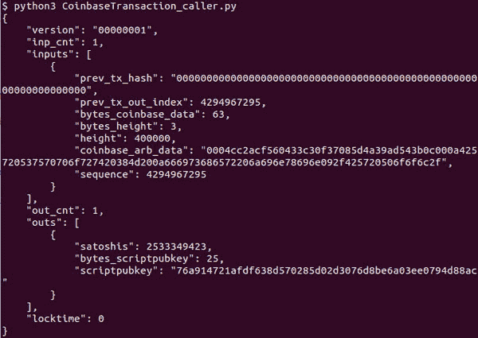

**图 6.28：**使用程序获得的 coinbase 交易结构

如我们所见，交易的版本是 1。截至今天，比特币网络同时允许版本 1 和版本 2。如果交易脚本中使用了 BIP-68 功能，则必须使用版本 2；否则，两个版本之间没有区别。

该交易有 1 个输入和 1 个输出。由于这是一个 coinbase 交易，没有输入交易，输入包含交易哈希为零和索引为 0xffffffff。这表明这是一个 coinbase 交易。

接下来是`**coinbase_data**`的大小。这包括从区块版本 2 开始的区块高度。

`**coinbase_arb_data 字段在 coinbase 交易中是一个任意的字节序列，可以是矿工想要放入的任何内容**`。有时，矿工会添加一条消息，以显示他们对某些改进的支持。如果我们把十六进制代码转换成字节，我们可以看到隐藏的信息：

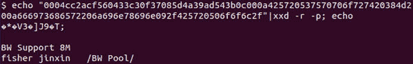

**图 6.29：**显示 coinbase 任意数据的结构

我们可以看到消息`**BW 支持 8M 渔民金心/BW 池/**`。该区块由 BW 池开采，他们支持 8 MB 的区块大小。

在输出中，前 8 个字节是矿工支付给其比特币地址的比特币。这个值以聪表示，这是比特币的最小单位：

1 比特币=10⁸聪

1 比特币=10⁶微比特币

1 比特币=10³毫比特币

所以，输出中所有`聪`的总价值等于区块奖励和交易费用的总和，通过在区块中添加交易来计算。

向比特币地址支付是通过一个名为`**scriptPubKey**`的脚本完成的。我们将在接下来的章节中了解比特币交易所使用的脚本。

其他交易如下所示：

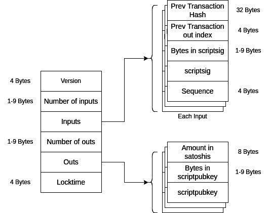

**图 6.30：**区块中其他交易的结构

锁定时间将交易锁定到指定的时间或区块高度。这意味着交易将留在内存池中，不会被包含在区块链中。指定的时间是过去的中位数时间而不是区块时间。建议设置此字段。要使用锁定时间，输入中的至少一个序列字段不应等于 0xffffffff。

输入包含前一个交易的哈希，也称为交易 ID，及其未花费的输出，从中提取价值以支付输出。交易哈希是通过应用两次 SHA256 得到的，因此长度为 32 字节。ScriptSig 是包含一个签名以证明前一个交易输出中的比特币属于在这个交易输入中创建的人的脚本。

以下代码解析了区块的其他交易：

`def getTransactionInfo(blk_m: mmap):`

`tx = {}`

`tx[‘version’]` = blk_m.read(4)[::-1].hex()

`tx[‘inp_cnt’]` = getVarInt(blk_m)

`inp_l = []`

`for i in range(tx[‘inp_cnt’]):`

`inp = {}`

`inp[‘prev_tx_hash’]` = blk_m.read(32)[::-1].hex()

`inp[‘prev_tx_out_index’]` = int.from_bytes(blk_m.read(4), byteorder=’little’)

`inp[‘bytes_scriptsig’]` = getVarInt(blk_m)

`inp[‘scriptsig’]` = blk_m.read(inp[‘bytes_scriptsig’]).hex()

`inp[‘sequence’]` = int.from_bytes(blk_m.read(4), byteorder=’little’)

`inp_l.append(inp)`

`tx[‘inputs’]` = inp_l

`tx[‘out_cnt’]` = getVarInt(blk_m)

`out_l = []`

`for i in range(tx[‘out_cnt’]):`

`out = {}`

`out[‘satoshis’]` = int.from_bytes(blk_m.read(8), byteorder=’little’)

`out[‘bytes_scriptpubkey’]` = getVarInt(blk_m)

`out[‘scriptpubkey’]` = blk_m.read(out[‘bytes_scriptpubkey’]).hex()

`out_l.append(out)`

`tx[‘outs’]` = out_l

`tx[‘locktime’]` = int.from_bytes(blk_m.read(4), byteorder=’little’)

`return tx`

**程序 6.15：** 解析交易的程序

要调用该方法，我们需要提供`**getTransactionInfo**`的内存映射字节`**bblock**`。以下是调用该方法的代码：

`if __name__ == ‘__main__’:` 

`# 修剪后的区块的哈希值为 000000000000000082ccf8f1557c5d40b21edabb18d2d691cfbf87118bac7254`

`blk_b = bytes.fromhex(‘020000007ef055e1674d2e6551dba41cd214debbee34ae b544c7ec670000000000000000d3998963f80c5bab43fe8c26228e98d030edf4dcbe48a666f5c39e2d7a885c9102c86d536c890019593a470ded01000000010000000000000000000000000000000000000000000000000000000000000000ffffffff4803e09304062f503253482f0403c86d53087ceca141295a00002e522cfabe6d6d7561cf262313da1144026c8f7a43e3899c44f6145f39a36507d36679a8b7006104000000000000000000000001c8704095000000001976a91480ad90d403581fa3bf46086a91b2d9d4125db6c188ac0000000001000000014dff4050dcee16672e48d755c6dd25d324492b5ea306f85a3ab23b4df26e16e9000000008c493046022100cb6dc911ef0bae0ab0e6265a45f25e081fc7ea4975517c9f848f82bc2b80a909022100e30fb6bb4fb64f414c351ed3abaed7491b8f0b1b9bcd75286036df8bfabc3ea5014104b70574006425b61867d2cbb8de7c26095fbc00ba4041b061cf75b85699cb2b449c6758741f640adffa356406632610efb267cb1efa0442c207059dd7fd652eeaffffffff020049d971020000001976a91461cf5af7bb84348df3fd695672e53c7d5b3f3db988ac30601c0c060000001976a914fd4ed114ef85d350d6d40ed3f6dc23743f8f99c488ac00000000’)`

`blk_m = mmap.mmap(-1, len(blk_b) + 1)`

`blk_m.write(blk_b)`

`blk_m.seek(80)`

`tx_cnt = getVarInt(blk_m)`

`coinbase_tx = getCoinbaseTransactionInfo(blk_m)`

`tx = getTransactionInfo(blk_m)`

`print(‘Transaction:’)`

`print(json.dumps(tx, indent=4))`

这给出了 coinbase 交易后第一个交易的以下内容：

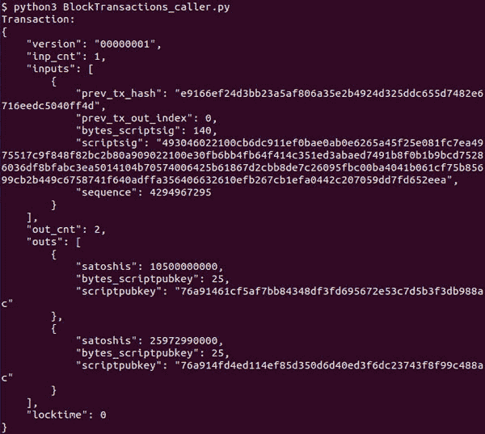

**Figure 6.31:** 显示了一个交易结构

为了计算交易哈希，我们需要获取交易字节并应用 SHA256 两次进行哈希，并且反转字节顺序。以下方法从交易字节计算交易哈希：

`def getTransactionHash(start: int, end: int, blk_b: bytes):`

`b = blk_b[start: end]`

`h١ = hashlib.sha256(b).digest()`

`h٢ = hashlib.sha256(h1).digest()`

`tx_hash = h2[::-1].hex()`

`return tx_hash`

**Program 6.16:** 从交易字节中获取交易 ID 的程序

以下代码调用了该方法：

`if __name__ == ‘__main__’:`

`# trimmed block for block hash 000000000000000082ccf8f1557c5d40b21edabb18d2d691cfbf87118bac7254`

`blk_b = bytes.fromhex(‘020000007ef055e1674d2e6551dba41cd214debbee34ae b544c7ec670000000000000000d3998963f80c5bab43fe8c26228e98d030edf4dcbe48a666f5c39e2d7a885c9102c86d536c890019593a470ded01000000010000000000000000000000000000000000000000000000000000000000000000ffffffff4803e09304062f503253482f0403c86d53087ceca141295a00002e522cfabe6d6d7561cf262313da1144026c8f7a43e3899c44f6145f39a36507d36679a8b7006104000000000000000000000001c8704095000000001976a91480ad90d403581fa3bf46086a91b2d9d4125db6c188ac0000000001000000014dff4050dcee16672e48d755c6dd25d324492b5ea306f85a3ab23b4df26e16e9000000008c493046022100cb6dc911ef0bae0ab0e6265a45f25e081fc7ea4975517c9f848f82bc2b80a909022100e30fb6bb4fb64f414c351ed3abaed7491b8f0b1b9bcd75286036df8bfabc3ea5014104b70574006425b61867d2cbb8de7c26095fbc00ba4041b061cf75b85699cb2b449c6758741f640adffa356406632610efb267cb1efa0442c207059dd7fd652eeaffffffff020049d971020000001976a91461cf5af7bb84348df3fd695672e53c7d5b3f3db988ac30601c0c060000001976a914fd4ed114ef85d350d6d40ed3f6dc23743f8f99c488ac00000000’)`

`blk_m = mmap.mmap(-1, len(blk_b) + 1)`

`blk_m.write(blk_b)`

`blk_m.seek(80)`

`tx_cnt = getVarInt(blk_m)`

`coinbase_tx = getCoinbaseTransactionInfo(blk_m)`

`stb = blk_m.tell()`

`tx = getTransactionInfo(blk_m)`

``endb = blk_m.tell()``

``tx_hash = getTransactionHash(stb, endb, blk_b)``

`print(‘Transaction Hash = %s’ % tx_hash)`

这给出了以下结果：

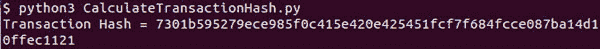

**Figure 6.32:** 展示了使用程序从交易字节获取的交易哈希

我们可以使用以下代码在**txindex**中搜索此交易：

`txindex_db_g = plyvel.DB(os.getenv(‘TX_INDEX_DB’), compression=None)`

`BLOCK_HEADER_SIZE = 80`

`def getTransactionIndex(tx_hash: bytes, txindex_db):`

`key = b’t’ + tx_hash`

`value = txindex_db.get(key)`

`jsonobj = {}`

`jsonobj[‘n_file’], pos = b128_varint_decode(value)`

`jsonobj[‘block_offset’], pos = b128_varint_decode(value, pos)`

`jsonobj[‘file_offset’], pos = b128_varint_decode(value, pos)`

`print(jsonobj)`

`return jsonobj`

`def findTransaction(tx_hash: bytes, txindex_db):`

`jsonobj = getTransactionIndex(tx_hash, txindex_db)`

`print(‘交易索引：’)`

`print(json.dumps(jsonobj, indent=4))`

`block_filepath = os.path.join(blocks_path_g, ‘blk%05d.dat’ % jsonobj[‘n_file’])`

`with open(block_filepath, ‘r+b’) as blk_f:`

`blk_m = mmap.mmap(blk_f.fileno(), 0) # 映射整个文件`

`blk_m.seek(jsonobj[‘block_offset’] + BLOCK_HEADER_SIZE + jsonobj[‘file_offset’])`

`tx = getTransactionInfo(blk_m)`

`blk_m.close()`

`return tx`

**程序 6.17：** 用于在数据库中使用交易索引查找交易的程序

`**findTransaction**` 方法以小端格式的交易哈希和链状态数据库作为参数进行查询索引。以下是示例代码：

`if __name__ == ‘__main__’:`

`tx_hash = bytes.fromhex(‘7301b595279ece985f0c415e420e425451fcf7f684fcce087ba14d10ffec1121’)[::-1]`

`tx = findTransaction(tx_hash, txindex_db_g)`

`print(“交易信息：\n”, json.dumps(tx, indent = 4))`

运行此代码会给我们提供有关交易在块文件中位置的以下信息，以及已解析交易的一部分：

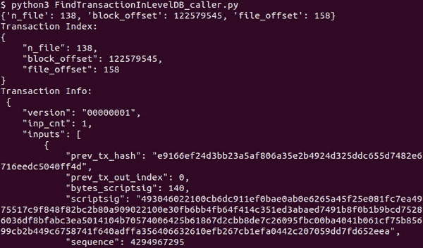

**图 6.33：** 显示了在块文件中读取交易所需的信息，并显示了已解析交易的一部分。

# 未花费的交易输出（UTXO）

UTXO 代表**未花费的交易输出**。链状态数据库的主要目的是存储此信息，以便可以高效地验证新交易。

从链状态数据库解析 UTXO 信息，我们需要了解更多的事情。交易输出有一个金额字段，编码以压缩其值。以下是压缩程序：

`def amount_compress(n: int):`

`if n == 0:`

`return 0;`

`e = 0`

`while ((n % 10) == 0) and e < 9:`

`n //= 10`

`e += 1`

`if e < 9:`

`d = n ٪ 10`  

`assert d >= 1 and d <= 9`  

`n //= 10`  

`return 1 + (n*9 + d - 1)*10 + e`  

`else:`  

`return 1 + (n - 1)*10 + 9`  

**程序 6.18：** UTXO 中金额压缩程序  

下面是解压缩值的程序：  

`def amount_decompress(x):`  

`if x == 0:`  

`return 0`  

`x -= 1`  

`e = x ٪ 10`  

`x //= 10`  

`if e < 9:`  

`d = (x ٪ 9) + 1`  

`x //= 9`  

`n = x * 10 + d`  

`else:`  

`n = x + 1`  

`while e > 0:`  

`n *= 10`  

`e -= 1`  

`return n`  

**程序 6.19：** UTXO 中金额解压缩程序  

*表 6.1* 提供了链状态数据库中可用的交易输出信息。要连接不带索引的交易 ID，我们需要使用 b128 编码对其进行编码。此外，脚本字段不会使用 b128 编码，因为它是一个固定大小的字段。  

以下程序获取与 UTXO 相关的存储值：  

`def getUnspentTransactions(tx_hash: bytes, out_index: int,chainstate_db):`  

`key = b’C’ + tx_hash + b128_varint_encode(out_index)`  

`value_obf_b = chainstate_db.get(key)`  

`value_obf_b = applyObfuscationKey(value_obf_b, chainstate_db)`  

`jsonobj = {}`  

`code, pos = b١٢٨_varint_decode(value_obf_b)`  

`jsonobj[‘is_coinbase’] = code & 0x01`

`jsonobj[‘block_height’] = code >> 1`  

`compressed_amount, pos = b128_varint_decode(value_obf_b, pos)`  

`jsonobj[‘unspent_amount’] = amount_decompress(compressed_amount)`  

`jsonobj[‘script_type’], pos = b128_varint_decode(value_obf_b, pos)`  

`jsonobj[‘scriptPubKey’]= value_obf_b[pos:].hex()`  

`return jsonobj`  

**程序 6.20：** 获取 UTXO 结构的程序  

前面提到的方法`**getUnspentTransactions**`，需要交易哈希、未花费的输出索引和链状态数据库。以下是一个调用语句的例子：

`if __name__ == ‘__main__’:`

`tx = bytes.fromhex(‘a23203c053852755c97b87e354d1e9053a6d1a20d32892e8ee45dfa2c3105f94’)[::-1]`

`jsonobj = getUnspentTransactions(tx, 0, chainstate_db_g)`

`print(jsonobj)`

这是结果：

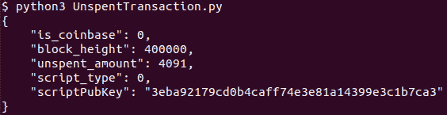

**图 6.34:** 显示存储在 Chainstate DB 中的 UTXO 信息

在前面的结果中，`**scriptPubKey**`不是一个完整的脚本；它需要脚本类型来获取完整的脚本。以下代码打印出脚本类型 0 的完整的`**scriptPubKey**`：

`def uncompressScriptType0(script_data: bytes):`

`script = bytes([`

`0x76, # OP_DUP`

`0xa9, # OP_HASH160`

`20 # size`

`]) + script_data + bytes([`

`0x88, # OP_EQUALVERIFY`

`0xac # OP_CHECKSIG`

`])`

`return script`

**程序 6.21:** 使用脚本类型和脚本数据获取脚本公钥的程序

由于交易脚本留到接下来的章节讲解，所以我们没有讲解其他脚本。

以下是对前面方法的调用代码：

`if __name__ == ‘__main__’:`

`script_data = bytes.fromhex(‘3eba92179cd0b4caff74e3e81a14399e3c1b7ca3’)`

`script = uncompressScriptType٠(script_data)`

`print(‘script = %s’ % script.hex())`

这给了我们以下的脚本：

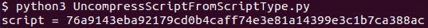

**图 6.35:** 显示通过解压脚本数据获得的脚本公钥

本节关于交易的内容就讲解到这里。在本节中，我们主要关注数据库中的交易格式和交易索引。脚本留到接下来的章节讲解。

# **挖矿](toc.xhtml#s119a)

挖矿是寻找 nonce 并创建区块的过程。在前面的章节中，我们学到了一些有用的知识，这些知识将有助于我们理解挖矿过程。

挖矿涉及以下内容：

+   花费能量寻找 nonce，这是创建小于目标阈值的区块哈希所必需的。

+   了解区块奖励。

+   从 mempool 中选择交易以在区块大小限制内最大化交易奖励。

+   创建币基交易，使用区块奖励、交易费、区块高度和脚本公钥向自身地址支付奖励。

+   寻找 Merkle 根。

+   寻找下一个区块的目标阈值。

+   准备和支持软分叉。

+   在区块头部创建其他字段。

在本节中，我们将逐一研究这些内容。

# **挖矿盈利性](toc.xhtml#s120a)

为了计算挖矿盈利性，我们需要了解使用流行的挖矿设备寻找 nonce 需要多少能量，以及每个交易中获得的区块奖励和总交易费。

# **区块奖励](toc.xhtml#s121a)

区块奖励是一种创建比特币的机制。随着时间的推移，区块奖励在减少。比特币网络创建之初，每个区块的区块奖励是 50。目前，它是 6.25。每 210,000 个区块后，区块奖励减半。这减少了新铸造的比特币的供应量。

以下程序为给定的区块高度提供区块奖励：

`def getBlockReward(block_height):`

`halving_count = block_height // 210000`

`block_reward = 50/(2**halving_count)`

`return block_reward`

**程序 6.22:** 为给定区块高度获取区块奖励

我们对给定的区块高度调用此方法，如下所示：

`if __name__ == ‘__main__’:`

`block_reward = getBlockReward(645675)`

`print(block_reward)`

这给了我们以下结果：

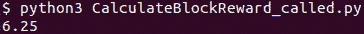

**图 6.36:** 显示运行前面程序获得的区块奖励

这意味着高度为`***645675***`的区块的区块奖励是`***6.25₿***`。

# **交易费用](toc.xhtml#s122a)*

我们可以用以下方程计算交易的交易费用：

*f : 交易费用*

*i[n]: 第 n 个输入*

*o[n]: 第 n 个输出*

*f = ∑[n]i[n] - ∑[n]o[n] (1)*

要编写一个计算交易费用的程序，我们需要在 txindex 中查找之前的交易。节点总是根据存储在链状态数据库中或处于 mempool 中的之前未花费的交易输出验证交易。一个区块中的所有交易都已经验证。节点只需要验证区块头和包含在区块中的交易列表的 Merkle 根哈希。由于我们试图查找已经验证和确认的交易的先前交易输出，我们需要 txindex 来查找交易。

以下方法返回交易输出中锁定的比特币的价值：

`def getTransactionOutAmount(tx_hash: bytes, out_index: int, txindex_db):`

`tx = findTransaction(tx_hash, txindex_db)`

`return tx[‘outs’][out_index][‘satoshis’]`

**程序 6.23:** 从 txindex 获取 UTXO 金额

该方法调用*程序 6.17*中定义的`**findTransaction**`。

以下方法使用前一个方法中的交易输入锁定的值，并返回与交易相关的交易费用：

`def getTransactionFee(tx: dict):`

`inp_val = 0`

`for inp in tx[‘inputs’]:`

`prev_tx_hash = bytes.fromhex(inp[‘prev_tx_hash’])[::-1]`

`inp_val += getTransactionOutAmount(prev_tx_hash, inp[‘prev_tx_out_index’], txindex_db_g)`

`out_val = 0`

`for out in tx[‘outs’]:`

`out_val += out[‘satoshis’]`

`tx_fee = inp_val - out_val`

`return tx_fee`

**程序 6.24:** 程序获取给定交易的矿工收取的交易费用

现在，我们可以将区块中交易列表收集的所有交易费用相加。以下程序计算区块矿工收取的费用奖励：

`def getBlockFeeReward(block_hash: bytes, block_db):`

`block_index = getBlockIndex(block_hash, block_db)`

如果“data_pos”在 block_index 中：

`block_filepath = os.path.join(blocks_path_g, ‘blk%05d.dat’ % block_index[‘n_file’])`

`start = block_index[‘data_pos’]`

如果“undo_pos”在 block_index 中：

`block_filepath = os.path.join(blocks_path_g, ‘rev%05d.dat’ % block_index[‘n_file’])`

`start = block_index[‘undo_pos’]`

`with open(block_filepath, ‘r+b’) as block_f:`

`blk_m = mmap.mmap(block_f.fileno(), 0)`

`blk_m.seek(start + BLOCK_HEADER_SIZE)`

`tx_cnt = getVarInt(blk_m)`

`print(tx_cnt)`

`coinbase_tx = getCoinbaseTransactionInfo(blk_m)`

`print(coinbase_tx)`

`fee_reward = 0`

`for i in range(1, tx_cnt):`

`print(i)`

`start = blk_m.tell()`

`tx = getTransactionInfo(blk_m)`

`end = blk_m.tell()`

`tx_fee = getTransactionFee(tx)`

`print(tx_fee)`

`fee_reward += tx_fee`

`return fee_reward`

**程序 6.25:** 计算矿工挖出一个区块所收集的交易费的程序

在前面的代码中，`**getCoinbaseTransactionInfo**` 和 `**getTransactionInfo**` 定义在 *程序 6.14* 和 *程序 6.15* 中。

我们通过执行以下代码来调用该方法：

如果 __name__ == ‘__main__’：

`block_hash_b = bytes.fromhex(‘00000000000000000

`total_tx_fee = getBlockFeeReward(block_hash_b, block_db_g)`

`print(‘Fee Reward = %d’ % total_tx_fee)`

运行代码后，我们得到以下结果：

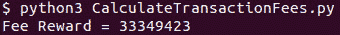

**图 6.37:** 显示挖矿给定区块矿工所收集的交易费

我们使用的区块哈希是高度为`400000`的区块的哈希，该区块的挖矿奖励为`2500000000` satoshi。

# Coinbase 交易金额验证

使用区块奖励和交易费之和，我们可以验证矿工总共收集的比特币是否正确，他们没有支付给自己多余的。coinbase 交易输出的 satoshi 之和给我们矿工支付给自己的金额。矿工支付给自己的总奖励如下：

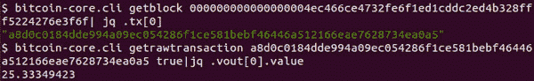

**图 6.38:** 显示支付给矿工的 coinbase 交易输出值

我们可以看到矿工支付了自己`2533349423 satoshi`，这与我们计算的区块奖励和交易费奖励之和相等。

# 挖矿成本

矿工通过不断尝试新值来找到 nonce，这需要大量的 CPU 处理，因此也需要能量。挖矿设备还产生大量噪音和热量，矿工需要进行管理。高能耗设备还需要足够的电力负荷、防火安全和维护。此外，由于挖矿兴趣历史上一直上升，更好的挖矿设备也已经被生产出来，挖矿盈利能力已经下降。根据设备消耗的电能和挖出的比特币，有可能旧设备开始导致亏损，因此升级设备可能成为必要。

因此，任何进入挖矿行业都必须确保电力成本低，除了在维护和安全上的支出外，他们还应该将利润的大部分用于挖矿设备的升级和扩张。

要计算电力成本，我们需要了解找到所需 nonce 所需的网络哈希能力。找到 nonce 所需网络哈希能力是找到 nonce 难度的后果，因此它取决于块哈希值低于目标阈值的概率。由于散列生成一个随机的 256 位代码，所以有可能的结果。

小于 1 的 nonce 的可能值只有 0，所以找到它们的概率为。

小于 2 的 nonce 的可能值为 0 和 1，所以找到它们的概率为。

这给我们：

*p：找到 nonce 的概率*

*T: 目标阈值*

*p=T/2*²⁵⁶ (1)

挖矿设备试图以极快的速度找到散列值。

1 TH/s 的哈希率是每秒的散列值。以下计算找到了比特币网络的哈希率：

*t[b]：秒内的区块时间*

*H[网络]：网络哈希率*

*(1)* ⇒ *所需试验次数 = H[网络] t[b]=2²⁵⁶/T*

⇒*H[网络] = 2²⁵⁶ / Tt[b]*

使用上述方程，我们可以找到当前网络的哈希率：

区块高度为*645675*的区块的目标阈值为

*T = 0x1007ea0000000000000000000000000000000000000000*

*H[网络] = 2256/(600*T)=125,686,927,612,715,270,144*

正如我们所看到的，值为 125 exa-hashes per second。随着时间的推移，这个数值已经增长了指数级。以下是显示网络哈希率随时间变化的图表：

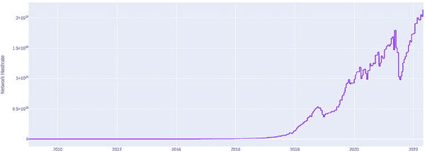

**图 6.39：**比特币网络哈希率逐年变化

尽管网络哈希率已经指数增长，但哈希率有时会下降。当矿工开始亏损不得不停止挖矿时，这种情况会发生。这是比特币挖矿与商品挖矿之间的一个重要区别。比特币挖矿的成本相当有弹性，并根据挖矿盈利进行调整，而在常规挖矿中，盈利的下降并不会导致挖矿成本的下降。此外，商品矿工需要继续挖矿，因为关闭矿山重新开放是昂贵且有时困难的。因此，常规商品挖矿总是存在风险，如果没有找到进一步的低成本储备，那么挖矿可能需要放弃或价格上涨。因此，价格上涨导致供应增加。相比之下，在比特币中，通货膨胀是由算法固定的，所以挖矿盈利和网络哈希率不会导致比特币产量的变化。这使得比特币通货膨胀不受任何外部影响，如禁令或限制。

挖矿设备成本数千美元。拥有最高哈希能力的设备已经超过了 100 Tera 每秒哈希（TH/s）。对于使用 100 Tera 每秒哈希设备的矿工来说，他们将需要：

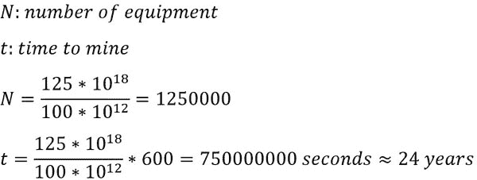

如我们所见，即使是 100 TH/s 也不足以挖出一个区块。因此，几乎从不单独挖矿。为了将挖矿作为一项业务，矿工需要加入一个挖矿池。挖矿池通过集体寻找 nonce 来运作。每个参与者向池贡献他们的 CPU 功率来寻找 nonce。对于池中谁成功找到 nonce 来说没有区别。池使用 nonce 来准备一个区块，然后根据他们对挖矿哈希能力的贡献，与池中的所有参与者分享利润。这是一个非常民主的系统，但它使挖矿变得更加集中。由于只有在找到 nonce 时才分享利润，所以每个矿工都更愿意加入一个累积哈希能力最高的挖矿池，因为这将增加找到 nonce 的概率，并更频繁地分享利润。因此，比特币网络有一些大型的挖矿池，如果它们联合起来主导共识规则，那么开发者和其他利益相关者可能会失去他们的价值，网络可能会被少数玩家接管。

在撰写本书的时候，以下是一些顶级的挖矿池：

+   Foundry USA

+   AntPool

+   Fool

+   Poolin

+   Binance Pool

+   VIABLE

+   BTC.com

+   SlushPool

比特币挖矿是使用 ASIC 矿机完成的，这些矿机被专门设计用来以极快的速度执行 SHA256 运算。选择正确的矿机取决于几个因素，如输入成本、电力消耗、产生的热量和噪音、效率、电力来源以及达到盈亏平衡点的时间。

一个新的矿工可能更节能，但可能需要一大笔钱，这可能会使达到盈亏平衡点的时间更长。一个便宜或免费的电源可以使低效的设备更加经济。

此外，以下两种流行的池挖矿协议可用于挖矿：

+   Stratum

+   Stratum V2

正如名字所说的，Stratum V2 是 Stratum 协议的新版本。这些都是开放的协议，被广泛用于池挖矿。Stratum V2 比版本 1 至少高效两到三倍。版本 2 在定制块模板方面也给了个体矿工更好的控制权，这可以使矿工个体决定它打算支持或不予支持的改进。

还有一些流行的池挖矿软件：

+   Nice Hash

+   更好的哈希算法

+   Cuddle Miner

上面提到的每一款软件都有优点和缺点，并且将取决于个人需求。

大多数挖矿池在创建区块时，在 coinbase 交易的任意数据中留下它们的签名。利用这些签名，我们可以计算出每个挖矿池挖出的区块百分比。

使用电力成本，我们可以计算出挖矿设备的平均每月利润。

首先，我们需要定义比特币的挖矿哈希率、电力消耗和当前的卖出价格：

`MINER_HASH_RATE = 96 * 10**12`

`MINER_POWER_WATT = 2832`

`electricity_rates = {“rate_slabs”: [{“min”: 1, “max”: 30, “unit_price”: 4}, {“min”: 31, “max”: 100, “unit_price”: 5.45}, {“min”: 101, “max”: 200, “unit_price”: 7}, {“min”: 201, “unit_price”: 8.05}]}`

`CURRENT_SELL_PRICE = 3070000`  

`def getPriceFromUnit(unit: float):`  

`rate_slabs = electricity_rates[‘rate_slabs’]`  

`price = 0`  

`for slab in rate_slabs:`  

`if slab[‘min’] > unit:`  

`countinue`  

`elif (‘max’ in slab and slab[‘max’]) > unit or ‘max’ not in slab:`  

`price += (unit - slab['min']) * slab['unit_price']`

`else:`

`price += (slab['max'] - slab['min']) * slab['unit_price']`

`return price`

**程序 6.26：** 定义矿工算力、电费和比特币价格的程序

我们还需要计算网络算力：

`def getTargetThreshold(bits: bytes):`

`shift = bits[3]`

`value = int.from_bytes(bits[0:3], byteorder='little')`

`target_threshold = value * 2 ** (8 * (shift - 3))`

`return target_threshold`

`def getNetworkHashRate(target_threshold: int):`

`network_hashrate = (1<<256)/(600*target_threshold)`

`return network_hashrate`

**程序 6.27：** 计算网络算力的程序

利用挖矿设备的算力，我们可以得到矿工在 10 分钟内挖到的区块数量：

`def getBlockMiningRatePer10Min(hashrate: int, target_threshold: int):`

`network_hashrate = getNetworkHashRate(target_threshold)`

`block_mining_rate = hashrate/network_hashrate`

`return block_mining_rate`

**程序 6.28：** 计算每 10 分钟挖掘的区块数量的程序

由于我们知道每个区块中创建的比特币数量，我们可以计算 10 分钟内挖到的比特币数量：

`def getBitcoinMiningRate(hashrate: int, bits: bytes, blk_reward: int):`

`tgt_threshold = getTargetThreshold(bits)`

`block_mining_rate = getBlockMiningRatePer10Min(hashrate, tgt_threshold)`

`bitcoin_mining_rate = block_mining_rate * blk_reward`

`return bitcoin_mining_rate`

**程序 6.29：** 计算挖矿设备每 10 分钟挖到的比特币数量的程序

这可以用来计算一个月内挖到的比特币数量：

`def getBitcoinMinedPerMonth(hashrate: int, bits: bytes, blk_reward: int):`

`btc_mined_per_month = getBitcoinMiningRate(hashrate, bits, blk_reward) * 6 * 24 * 30`

`return btc_mined_per_month`

**程序 6.30：** 使用挖矿设备计算每月挖到的比特币数量的程序

现在，为了计算挖矿费用，我们需要知道矿工的功耗（单位：瓦特）：

`def getUnitFromPower(power: float):`

`unit = power * 24 * 30 / 1000`

`return unit`

`def getMiningPowerExpense(power: float):`

`unit = getUnitFromPower(power)`

`expense = getPriceFromUnit(unit)`

`return expense`

**程序 6.31：** 计算电力费用的程序

使用每月挖掘的比特币数量和挖掘费用，我们可以得到矿工每月的利润：

`def miningReturn(power: float, hashrate: int, bits: bytes, blk_reward: int):`

`expense = getMiningPowerExpense(power)`

`btc_mined_per_month = getBitcoinMinedPerMonth(hashrate, bits, blk_reward)`

`revenue = btc_mined_per_month * CURRENT_SELL_PRICE`

`profit = revenue - expense`

`return profit`

**程序 6.32:** 计算单个矿工每月挖矿利润的程序

以下是要调用 `**miningReturn**` 方法的代码以获取挖矿利润：

`def getBlockHeaderBytes(blk_hash: bytes):`

`jsonobj = getBlockIndex(blk_hash, block_db_g)`

`if ‘data_pos’ in jsonobj:`

`block_filepath = os.path.join(blocks_path_g, ‘blk%05d.dat’ % jsonobj[‘n_file’])`

`start = jsonobj[‘data_pos’]`

`elif ‘undo_pos’ in jsonobj:`

`block_filepath = os.path.join(blocks_path_g, ‘rev%05d.dat’ % jsonobj[‘n_file’])`

`start = jsonobj[‘undo_pos’]`

`# 将文件加载到内存中`

`with open(block_filepath, ‘rb’) as blk_f:`

`blk_f.seek(start)`

`return blk_f.read(80)`

`if __name__ == ‘__main__’:`

`blk_hash = bytes.fromhex(‘000000000000000000079dc864537510659e14439ff5f4a208231bcf276358ba’)[::-1]`

`blk_index = getBlockIndex(blk_hash, block_db_g)`

`blk_hdr_b = getBlockHeaderBytes(blk_hash)`

`jsonobj = getBlockHeader(blk_hdr_b)`

`blk_reward = getBlockReward(blk_index[‘height’])`

`bits_b = bytes.fromhex(jsonobj[‘bits’])[::-1]`

`mining_return = miningReturn(MINER_POWER_WATT, MINER_HASH_RATE, bits_b, blk_reward)`

`print(“每月挖矿回报 = %s” % (mining_return))`

这给我们以下每月挖矿回报：

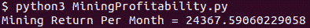

**图 6.40:** 显示了为在班加罗尔的设备计算的当前每月挖矿利润

# 内存池

在比特币网络上广播的交易由每个节点验证并存储在称为内存池的数据结构中。为了创建一个区块，矿工从内存池中选择交易。交易数量需要保持在限制范围内，使得区块大小不超过 1MB 的区块大小限制。因此，矿工选择那些能给他们带来最大利润的交易。

我们需要使用以下比特币客户端 API 来访问内存池数据：

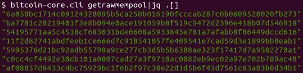

**图 6.41:** 显示了内存池交易列表的一部分

以下是从 API getrawmempool 输出的部分内容：

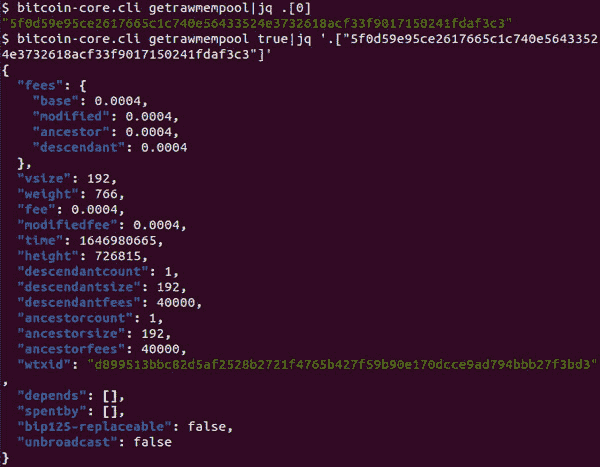

**图 6.42:** 显示单个内存池交易的详细信息

在这里，我们希望编写一个程序，选择内存池交易以最大化矿工的手续费奖励。为了实现这一点，我们需要选择具有最高每字节 Satoshi 费用的交易，因为我们的空间限制为 1 MB，如果一个交易占用的字节更多，它需要支付更多费用以在有限的区块大小中得到容纳。有时，交易输入本身就在内存池中。我们不能将依赖于比特币的交易添加到区块中，而这些交易仍然在内存池中。因此，我们需要确保如果一个交易被添加到区块中，那么它的所有祖先也被添加到内存池中的区块。

在 mempool json 中，**ancestorcount**包括当前交易，**descendantcount**也是如此。另外，depends 是祖先列表，而**spentby**是后代列表。

要编写一个选择交易以最大化收益的程序，我们可以使用以下算法：

1.  通过包含其祖先的金额和字节数来计算 mempool 中所有交易的 satoshi/字节。

1.  按字节的 satoshi 降序排序。

1.  如果总大小超过 1MB，则排除交易，并排除已包含在 1MB 中的交易的祖先。

1.  将祖先交易添加到列表中。

以下程序列出了向矿工提供最高比特币每字节的交易哈希，并且其组合大小小于 1MB 的交易：

1.  我们需要导入以下软件包：

    `from bitcoinrpc.authproxy import AuthServiceProxy, JSONRPCException`

    `import json`

    `import pandas as pd`

    `from pandas import DataFrame`

    `import numpy as np`

    `import copy`

    `import hashlib`

1.  作为第一步，我们需要从 mempool 中获取所有交易并计算 Satoshi/字节：

    `def findAllDependentTx(mempool: dict, k: str):`

    `tx_l = [k]`

    `vsize = mempool[k][‘vsize’]`

    `fee = mempool[k][‘fees’][‘base’]`

    `if len(mempool[k][‘depends’]) == 0:`

    `return tx_l, vsize, fee`

    `for dependent in mempool[k][‘depends’]:`

    `dep_tx_l, dep_vsize, dep_fee = findAllDependentTx(mempool, dependent)`

    `tx_l.extend(dep_tx_l)`

    `vsize += dep_vsize`

    `fee += dep_fee`

    `return tx_l, vsize, fee`

    `def getMempoolTxList():`

    `mempool = rpc_connection.getrawmempool(True)`

    `tx_l = []`

    `for k, v in mempool.items():`

    `dep_l, vsize, fee = findAllDependentTx(mempool, k)`

    `dep_l.remove(k) # 从依赖列表中删除自身`

    `sats_per_byte = fee*10**8/vsize`

    `tx_l.append({'txid': k, 'sats_per_byte': sats_per_byte, 'vsize': vsize, 'depends': dep_l})`

    `return tx_l, mempool`

    **程序 6.33：** 根据 vsize 和 Satoshi/byte 的交易列表程序

1.  接下来是按 Satoshi/byte 降序排列它们的方法：

    `def getSortedDF(tx_l: list):`

    `df = pd.DataFrame(tx_l)`

    `df = df.sort_values(by=['sats_per_byte'], ascending = False)`

    `df = df.reset_index(drop=True)`

    `return df`

    **程序 6.34：** 根据 Satoshi/byte 对交易列表进行排序的程序

1.  如果总大小超过 1MB，则排除交易，并排除已经包含在 1MB 中的交易的祖先。以下方法执行此操作：

    `def pruneDF(df):`

    `vsize = 0`

    `mb = 1 << 20`

    `inc_l = []`

    `for index, row in df.iterrows():`

    `if row['vsize'] + vsize > mb:`

    `df.drop(index, inplace=True)`

    `else:`

    `if row[‘txid’] in inc_l:`

    `df.drop(index, inplace=True)`

    `continue`

    `inc_l.extend(row['depends'])`

    `vsize += row['vsize']`

    `return df, inc_l`

    **程序 6.35：** 根据 Satoshi/byte 和 vsize 删除列表中的交易的程序

1.  以下程序将祖先交易添加到要包含的交易列表中：

    `def updateWithDepends(df, depend_l: list, mempool):`

    `tx_l = []`

    `for dep in depend_l:`

    `vsize = mempool[dep]['vsize']`

    `fee = mempool[dep]['fees']['base']`

    `sats_per_byte = fee*10**8/vsize`

    `tx_l.append({'txid': dep,`

    `'sats_per_byte': sats_per_byte,`

    `'vsize': vsize,`

    `'depends': []}) # 忽略依赖项`

    `df2 = pd.DataFrame(tx_l)`

    `df.append(df2, ignore_index = True)`

    `return df`

    **程序 6.36：** 将依赖交易添加到列表中的程序

1.  下面的程序是将所有先前步骤连接起来的主要方法：

    `def getMempoolTx():`

    `tx_l, mempool = getMempoolTxList()`

    `df = getSortedDF(tx_l)`

    `df, depend_l = pruneDF(df)`

    `df = updateWithDepends(df, depend_l, mempool)`

    `final_tx_l = df['txid'].tolist()`

    `sum_vsize = 0`

    `for tx in final_tx_l:`

    `sum_vsize += mempool[tx]['vsize']`

    `print('sum_vsize = ', sum_vsize)`

    `print('交易计数 = ', len(final_tx_l))`

    `return(final_tx_l)`

    **程序 6.37：** 获取要包含在新块中的最终交易列表的程序

从交易哈希列表中，我们可以使用以下方法获取交易内容：

`def getRawTransaction(txid: str):`

`rawtx = rpc_connection.getrawtransaction(txid)`

`return rawtx`

**程序 6.38：** 获取交易 ID 的原始交易程序

现在，我们可以使用这些信息来挖掘比特币。这几乎没有成功的可能性。我们需要填写块头中的每个字段，然后找到 nonce。所以，让我们按照以下方式进行：

1.  版本：

    `def getVersionBytes(supported_softfork_bits: int):`

    `version = 0x20000000 | supported_softfork_bits`

    `v_bytes = bytes.fromhex(hex(version))[::-1]`

    `return v_bytes`

    **程序 6.39：** 使用支持的软分叉位获取版本字节的程序

1.  时间：

    `def getTimeBytes():`

    `t = time.time()`

    `time_b = bytes.fromhex(hex(t))[::-1]`

    `return time_b`

    **程序 6.40：** 获取块字段中的时间字节程序

1.  接下来是`**bits**`。只有当区块高度是 2016 的倍数时，`**bits**`才会更新。要计算`**bits**`，我们需要计算目标阈值。我们取最后 2016 个块的块时间，然后调整目标阈值。以数学方程式的形式表示：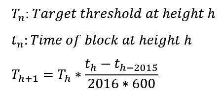

    在代码中使用这个方程式：

    `def calculateNextTargetThreshold():`

    `block_hash = rpc_connection.getblockhash(height)`

    `block = rpc_connection.getblock(block_hash, 0)`

    `blkhdr = getBlockHeader(bytes.fromhex(block))`

    `bits = bytes.fromhex(blkhdr['bits'])[::-1]`

    `tt_old = getTargetThreshold(bits)`

    `block_hash_٢٠١٥ = rpc_connection.getblockhash(height-2015)`

    `block_٢٠١٥ = rpc_connection.getblock(block_hash_2015, 0)`

    `blkhdr_٢٠١٥ = getBlockHeader(bytes.fromhex(block_2015))`

    `delta_t = blkhdr[‘time’] - blkhdr_2015[‘time’]`

    `tt_new = tt_old * (blkhdr[‘time’] - blkhdr_2015[‘time’])//(2016 * 600)`

    `return tt_new`

    **程序 6.41：** 计算下一个目标阈值的程序

1.  要将目标阈值转换为位，我们需要使用以下压缩逻辑：

    1.  将目标阈值转换为字节，这是一个基于 256 进制的数字。

    1.  如果最高有效位大于 0x7F，则在字节前加上 b’\x00’。

    1.  第一个字节是字节的长度。

    1.  接下来的 3 个字节是基数 256 数中的三个最高有效数字。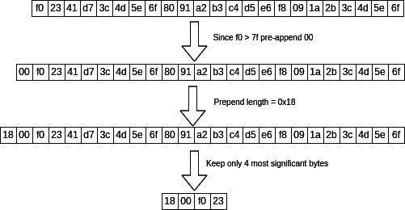

    **图 6.43：目标阈值转换为 bits 的说明**

    `def targetThreshold2bits(tt: int):`

    `tt_b = tt.to_bytes((tt.bit_length() + 7) // 8, ‘big’)`

    `print(tt_b.hex())`

    `prepend = b”0” if tt_b[0] > 0x7f else b””`

    `tt_b = prepend + tt_b`

    `b١ = bytes([len(tt_b)])`

    `tt_b = tt_b + bytes(2)`

    `tt_b = tt_b[0:3]`

    `bits = b١ + tt_b`

    `return bits`

    **程序 6.42：将目标阈值转换为 bits 的程序**

只有在块高是 2016 的倍数时，bits 才会被更新。以下代码根据块高返回 bits：

`def getBits():`

`if height % 2016 != 0:`

`block_hash = rpc_connection.getblockhash(height)`

`blkhdr = getBlockHeader(bytes.fromhex(block))`

`return bytes.fromhex(blkhdr[‘bits’])[::-1]`

`tt = calculateNextTargetThreshold()`

`bits = targetThreshold٢bits(tt)`

`return bits`

**程序 6.43：如果下一个块高是 2016 的倍数，则返回 bits 的程序**

现在，我们可以使用上面提到的头元素来查找 nonce 并构建区块。我们还需要更新交易和 Merkle 根。我们可以通过在*程序 6.37*中已经获得的交易列表来计算新块的 Merkle 根。我们将留给您实现最终的挖矿代码。

这带我们结束了这一章。

# 结论

在本章中，我们从设置比特币软件和区块链同步开始。您学习了如何使用比特币核心 CLI 和 Python RPC 客户端。您还研究了区块和索引的结构。您学习了如何从索引中查询数据。我们编写了简短的程序来了解区块文件的结构，您还学习了内存池的内容、它的作用以及如何用于挖矿区块。

比特币之所以具有变革性，是因为它在任何交易中消除了中介的需求。因此，我们拥有了一种行为类似于现金的加密货币。这是许多密码学专家数十年的目标。我们中的大多数人知道这是一种威慑。这感觉像是我们进入了火箭科学。但正如本章所看到的，这种想法只是威慑。比特币协议简单得令人惊叹。本章是第一章深入编程的章节。我们只使用了比特币软件客户端、区块文件、索引和对协议的一些基本知识来增强您对比特币协议现有实现的 understanding. 我们留下了某些重要主题，如交易脚本和隔离见证，供接下来的章节讨论。

了解到如此有影响力的技术可以轻松学会，这让我们对自己的能力建立了信心。它允许我们相信自己能够理解事物。它消除了对专家的需求，并允许我们在自己内心找到专家。它在根本层面上改变了我们看待世界的方式。

在下一章中，你将了解比特币协议消息。你将了解比特币节点如何找到其他节点，与它们连接，同步他们的区块链，以及广播区块和交易。

# 需要记住的要点

+   比特币核心（Bitcoin Core）是由比特币核心团队维护的最受欢迎的比特币软件，最初由中本聪（Satoshi Nakamoto）创建。

+   平均每 10 分钟挖出一个区块。

+   比特币区块链中的每个区块都包含前一个区块的哈希区块头。这使得区块链更像一个栈。

+   区块头包含默克尔根哈希值，结合工作量证明算法，确保了包含在区块中的交易的完整性。

+   工作量证明（Proof-of-work）也保护了区块头其他字段的安全，比如时间、版本、前一个区块哈希和目标阈值。

+   区块版本表明矿工对协议增强的支持和准备，这也称为软分叉。这种类型的软分叉也称为矿工发起的软分叉。

+   如果一个改进对比特币的未来很重要，比特币开发者社区可以发起 BIP 148，并强制矿工转向软分叉。

+   区块头的哈希应该小于区块头中的位字段计算出的目标阈值。

+   目标阈值仅在区块链上的每个第 2016 个区块时进行调整。

+   新的目标阈值是通过修改现有的目标阈值来计算的，通过取前 2016 个区块的区块时间，使得下一个 2016 个区块的平均挖矿时间为 10 分钟。

+   区块存储在区块文件中，与区块文件和区块相关的信息存储在区块索引中。

+   链状态数据库存储未花费的交易输出（UTXOs）。

+   区块索引和 UTXO 索引都有助于快速验证区块。

+   还有一个名为交易索引或 txindex 的其他索引，比特币软件不使用。这是可选的，它存储与存储在区块中的交易相关的索引。

+   挖矿的过程就是寻找一个 nonce 值，使得新创建的区块头哈希值小于目标阈值。

+   比特币挖矿是一个昂贵的过程，就像商品挖矿一样，矿工需要投资于勘探，在比特币挖矿中，矿工需要不断投资于设备以保持其可行性。

+   单独挖矿只适合正在学习比特币的开发者，或者通过将自己的算力加入整个网络算力来减少挖矿集中化的开发者。

+   盈利性挖矿只能在矿池中进行。矿工会加入其中几个著名的矿池之一。

+   挖矿池使用矿工的组合算力来寻找 nonce。一旦找到 nonce，矿池将根据矿工的算力贡献支付矿工。

# 问题

1.  计算当前的比特币供应量。另外，计算当前比特币供应量占最大供应量的百分比。

1.  找出下一个比特币减半（当区块奖励变为当前奖励的一半）的预期年份、月份和日期。

1.  创建一个表格，列出比特币挖矿设备、它们的成本和每月的利润。

1.  创建一个表格，列出每个区块的平均年交易次数。

1.  完成留白的单独挖矿程序。

1.  真/假：

    1.  软分叉是不兼容旧版本的改进，这就是矿工需要对其表示支持的原因。

    1.  即使比特币价格持续下跌，网络算力也只能在长期内上升。

    1.  内存池将未确认的交易存储在内存中。

1.  填空：

    1.  在 ______ 个区块之后，矿工可以使用锁定在 coinbase 交易中的比特币。

    1.  交易次数 2,597 的压缩形式是 ______________。

    1.  0.25 BTC 的压缩形式是 ______________。

    1.  值 0x1715a35c 的 Bit 意味着目标阈值是 ______________。

    1.  区块大小限制是 ____________MB。
