# 第七章

# 节点通信

在上一章中，您学习了节点存储的数据结构以及它们的验证、创建和版本化方法。在本章中，我们研究节点之间的通信。

比特币网络是一个点对点的网络，其中没有主服务器或客户端，也没有从服务器或奴隶。为了建立通信，需要建立一个基于服务器-客户端模型的 TCP 连接。一旦建立了连接，节点就无法区分是它发起的连接还是接受了连接请求。一旦建立了 TCP 连接，就需要建立比特币网络连接。比特币网络是一个非常民主的网络，节点可以选择它们的同伴。这个决定取决于对等方将要提供的版本或服务。一旦双方达成一致，连接就建立起来了，然后它们就可以交换信息了。

在任何时候几乎都有近 10,000 个已知活跃节点，这足以允许大多数节点找到并选择多个合适的同伴。

作为一个开放的点对点网络，每个节点都依赖其同伴获取有关其他可用同伴的信息，以便它也可以与它们建立连接。它还需要广播交易和区块，并帮助它们在网络上传播。此外，它还需要与网络保持同步，这意味着拥有带有最新块的最新区块链和带有最新交易的最新内存池。它还需要验证交易和区块，并帮助 SPV 验证交易。

在本章中，您将了解比特币网络拓扑、网络节点以及这些节点之间如何进行详细通信的信息。

# 结构

本章将涵盖以下主题：

+   比特币网络拓扑

+   节点引导

+   网络消息传递

    +   消息格式

    +   建立连接

    +   与不活跃的对等体断开连接

    +   节点发现

    +   接收完整区块链

    +   同步区块链

    +   交易广播

    +   区块广播

        +   无请求的区块推送

        +   直接头部公告

        +   紧凑区块公告

             高带宽紧凑区块公告

             低带宽紧凑区块公告

# 目标

本章的目标是帮助您了解比特币网络，包括网络拓扑和节点通信以及协议消息的进展。

在本章中，你将学习到比特币网络中不同类型节点的角色。你将了解到每个节点如何发现其他节点的方法。你还将理解如何与其他节点创建和建立连接以及交换协议消息。此外，你将了解协议消息携带的不同类型的有效载荷、它们的目的以及消息类型的预期序列。在本章的后面部分，我们将讨论节点版本及其在建立与对等节点连接和通信中的作用，并且你将理解连接终止。

# 比特币网络拓扑

比特币网络允许运行不同版本代码的节点进行通信并找到与他们版本和服务提供或请求相匹配的对等节点。例如，一个节点可能是一个 SPV，并且只需要与全节点通信。一个全节点可能对与 SPV 的连接不感兴趣，所以可能会断开连接。以下图表显示了节点的分布情况。我们可以看到，大多数节点位于美国和德国。

**图 7.1:** 全球节点分布的说明

一个比特币节点使用 TCP 握手与其对等节点建立连接。它可以有 IPv4 或 IPv6 IP 地址。节点甚至可以连接到 Tor 网络上的对等节点，Tor 是一个匿名网络，可以保护节点免受监视和追踪。如果我们在我们系统中运行 Tor，端口为 9050，那么我们的节点可以使用以下命令行选项通过 Tor 网络连接或接受连接：

`-proxy=127.0.0.1:9050`

以下图表显示了基于连接类型和地址类型比特币网络连接的分布：

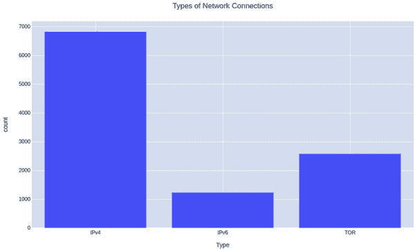

**图 7.2:** 显示基于连接类型和地址类型节点分布的图表

我们在网络中有不同类型的节点，其中一些如下：

+   一个拥有完整区块链的全节点，也称为归档节点。

+   一个全节点验证所有区块，但不会维护完整的区块链。它仍然被称为全节点，因为，按定义，全节点验证完整的区块链，这个节点确实做到了。这些也被称为修剪节点。

+   一个 SPV 节点维护带有所需交易的区块头链。它需要与全节点通信，这些全节点可以帮助它验证区块，但由于它不验证区块本身，所以也不会传递交易。

+   一个不与 SPV 节点通信的全节点。

+   一个只接受区块而不接受交易的全节点。

因此，节点之间有很多变化。此外，它们可以运行不同版本的软件。可能存在一个攻击节点或一群攻击节点，网络或目标节点需要识别并将其列入黑名单。

# 节点引导

正如你所了解的，比特币没有中心化的服务器，因此找到要连接的节点是一个挑战。为了解决这个问题，比特币核心硬编码了 DNS Seeder 地址。这些被称为种子服务器。这些服务器提供了一系列可能活跃或不活跃的地址。我们需要迭代地找到可以连接的活动地址。种子服务器可能会在未来更新。

这里是硬编码的 DNS 种子：

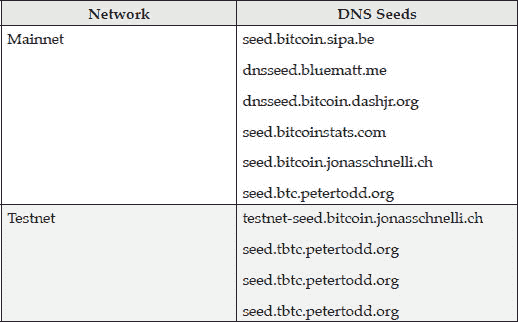

**表 7.1：** 硬编码的 DNS 种子列表

我们将使用以下包从 DNS 种子节点获取地址：

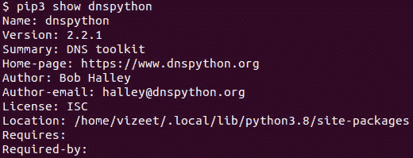

**图 7.3：** 与 DNS 服务器通信的 Python 包

以下程序生成了来自 DNS 种子的地址：

`import dns.name`

`import dns.message`

`import dns.query`

`import dns.flags`

`import ipaddress`

`def getNodeAddresses(dnsseed: str):`

`dest = ‘8.8.8.8’`

`rdclass = 65535`

`domain = dns.name.from_text(dnsseed)`

`if not domain.is_absolute():`

`domain = domain.concatenate(dns.name.root)`

`request = dns.message.make_query(`

`domain,`

`dns.rdatatype.A,`

`dns.rdataclass.IN)`

`request.flags |= dns.flags.RD|dns.flags.RA|dns.flags.AD`

`request.find_rrset(request.additional, dns.name.root, rdclass, dns.rdatatype.OPT, create=True, force_unique=True)`

`responseudp = dns.query.udp(request, dest)`

`rrset = responseudp.answer`

`rrset_l = []`

`for rrset_val in rrset:`

`rrset_l.extend(str(rrset_val).split(“\n”))`

`ipaddr_l = []`

`for rrset_s in rrset_l:`

`ipaddr_l.append(rrset_s.split(“ “)[4])`

`return ipaddr_l`

`def getTestnetPeers():`

`port = 18333`

`dns_seeds = [`

`“testnet-seed.bitcoin.jonasschnelli.ch”,`

`“seed.tbtc.petertodd.org”,`

`“seed.testnet.bitcoin.sprovoost.nl”,`

`“testnet-seed.bluematt.me”`

`]`

`ipaddr_l = []`

`for seed in dns_seeds:`

xwi

``ipaddr_l.extend(getNodeAddresses(seed))``

``peers = []``

`for ipaddr in ipaddr_l:`

`peers.append((ipaddr, port))`

`return peers`

**程序 7.1：** 从 DNS 种子获取地址列表的程序

我们按以下方式调用上述方法以获取前五个地址和端口号的列表： 

如果 `__name__ == ‘__main__’:` 

获取测试网络节点 `peers = getTestnetPeers()` 

对于 `range(5)` 中的每个索引： 

打印 `print(peers[index])` 

这给出了以下前五个 IP 地址和端口号： 

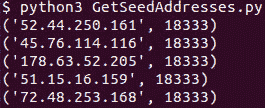

**图 7.4：** 使用 DNS 种子生成的一些 IP 地址和端口号列表 

Bitcoin Core 源代码中还有一些硬编码的 IP 地址，仅在政府封锁到已知 DNS 种子的连接时作为最后的手段使用。这些地址在以下文件中： 

`chainparamsseeds.h` 

Bitcoin Core 还维护着 `**peers.dat**` 文件，其中包含了它连接到的活动地址以及连接时间。这有助于在连接断开后重新连接到节点。Bitcoin Core 守护程序还具有 `**addnode**` 命令选项，用于指定连接的对等节点。这个节点被视为其他节点的平等。 

此信息仅适用于 Bitcoin Core。除了利用 Bitcoin 节点引导方法外，我们还可以连接来自其他网站的地址，例如**[`bitnodes.io/api/v1/snapshots/latest`](https://bitnodes.io/api/v1/snapshots/latest)**。

以下代码从该 URL 获取节点列表：

`import requests`

`import socket`

`from urllib.parse import urlparse`

`def isValidIPv6Addr(addr: str):`

`try:`

`socket.inet_pton(socket.AF_INET6, addr)`

`except socket.error:`

`return False`

`return True`

`def parseNodeInfo(ip_port: str, nodeinfo: dict):`

`node = {}`

`node[‘selected’] = False`

`node[‘port’] = int(ip_port.split(‘:’)[-1])`

`val = ip_port.rsplit(‘:’, 1)[0]`

`parsed = urlparse(‘//{}’.format(val))`

`addr = parsed.hostname`

`if isValidIPv6Addr(addr) == False:`

`return node`

`node[‘selected’] = True`

`node[‘ipaddr’] = addr`

`node[‘type’] = nodeinfo[11]`

`node[‘time’] = nodeinfo[2]`

`return node`

`def getMainnetPeers():`

`url = ‘https://bitnodes.io/api/v1/snapshots/latest/’`

`headers = {‘Accept’: ‘application/json’}`

`r = requests.get(url=url, headers=headers)`

`jsonobj = r.json()`

`peers = []`

`for k, v in jsonobj[‘nodes’].items():`

`node = parseNodeInfo(k, v)`

`if node[‘selected’] == True:`

`peers.append(node)`

`return peers`

**程序 7.2**：使用外部 URL 获取节点列表的程序

我们调用上述方法以如下方式获取对等节点：

`if __name__ == ‘__main__’:`

`peers = getMainnetPeers()`

`for peer in peers:`

`print(‘%s\t\t\t%d’ % (peer[‘ipaddr’], peer[‘port’]))`

这给了我们以下前五个对等节点：

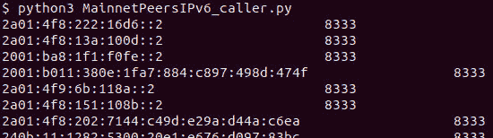

**图 7.5**：从外部网站获取的对等节点的 IP 地址和端口号列表

# 网络消息传递

Bitcoin 网络节点之间相互通信的原因有很多，比如了解其他对等节点，

# 消息格式

网络上传交换的消息具有头部和负载，且负载取决于命令。

以下是消息格式：

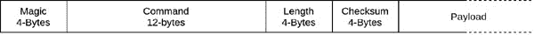

**图 7.6**：协议消息格式说明

*以下是对消息格式各字段的解释：*

+   **魔数**与我们在***第六章，区块链、交易和挖矿***中学到的区块结构相同，我们可以在表 6.3 查看其值。

+   **命令**是发送的 ASCII 命令，全部用零填充，即 b'\\0'。

+   **长度**是负载的长度。

+   **校验和**是负载的校验和。

+   **负载**是发送的命令的参数。

以下创建此消息的方法：

`def createMessage(command, payload):`

`magic = 0x0709110B`

`checksum = hashlib.sha256(hashlib.sha256(payload).digest()).digest()[0:4]`

`magic_b = struct.pack(‘<L', magic)`

`cmd_b = struct.pack(‘<12s', command.encode(‘ascii'))`

`payload_len_b = struct.pack(‘<L', len(payload))`

`checksum_b = struct.pack(‘<4s', checksum)`

`msg = magic_b + cmd_b + payload_len_b + checksum + payload`

`return msg`

**程序 7.3**：创建协议消息的方法

# 建立连接

比特币通过首先交换版本信息然后确认接受来建立连接。在确认版本之前，节点需要发送自己的版本信息。因此，网络握手如下所示：

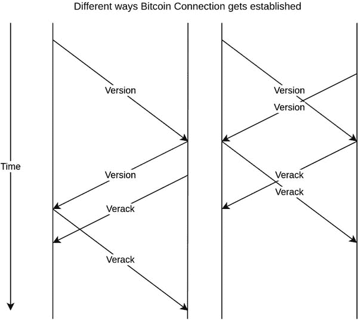

**图 7.7**：建立比特币连接的消息传输序列说明

以下是`**版本**`消息负载的结构：

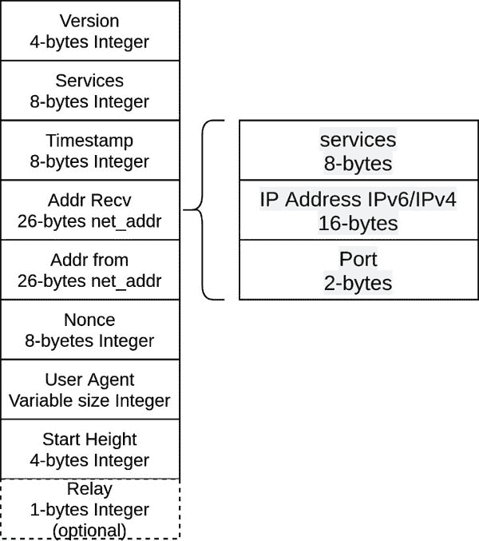

**图 7.8**：版本消息负载结构

*以下是对`**版本**`消息各字段的解释：*

+   `**版本**`是主机上运行的协议版本。

+   **服务**是发送节点支持的服务。以下是服务代码的列表：

| **字节码** | **提供的服务** | **描述** |
| --- | --- | --- |
| 1 | NODE_NETWORK | 完整节点 |
| 2 | NODE_GETUTXO | BIP 0064: 支持 getutxos 和 utxos |
| 4 | NODE_BLOOM | BIP 0111: 支持 Bloom 过滤器 |
| 8 | NODE_WITNESS | BIP 0144: 支持隔离见证 |
| 1024 | NODE_NETWORK_LIMITED | BIP 0159: 支持修剪节点 |

**表 7.2**：版本消息所需的服务代码列表

+   **时间戳**是负载的 Unix 纪元时间。

+   **Addr Recv** 是接收连接节点的地址。因此，发送`**版本**`负载的节点将包含它正在连接的对等点的地址和端口。服务字段通常设置为零。

+   **Addr from** 是原始连接节点的地址。因此，发送`**版本**`负载的节点将包含其自身的地址和端口。它还包括发送者的服务。

+   **Nonce** 是一个随机数，它在识别我们是否没有连接到自身时很有用。

+   **用户代理**用于标识节点上运行的软件。它定义在 BIP-0014 中。

+   **开始高度**是节点区块链当前的区块高度。

+   **中继**是一个可选的布尔值，由 SPV 设置为 false 以表示节点将不参与消息的中继。这意味着它不希望对等体宣传`**inv**`消息与 MSG_BLOCK。这保护节点不会因`**inv**`消息而被淹没。这在 BIP 0037 中定义。

编写此书时节点的版本分布如下：

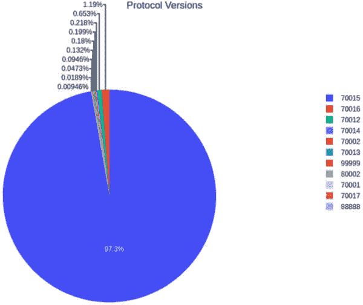

**图 7.9**：显示比特币网络上节点版本的分布图

以下是比特币网络中用户代理的分布：

**图 7.10**：柱状图显示比特币网络中用户代理的分布

以下是创建 `**version**` 负载的程序： 

从 `bitcoinrpc.authproxy` 模块中导入 `AuthServiceProxy` 和 `JSONRPCException`

导入 `struct` 模块

导入 `random` 模块 

`rpc_connection = AuthServiceProxy(“http://%s:%s@127.0.0.1:18332”%(‘test’, ‘test’))` 

定义函数 `setVarInt(n: int):` 

如果 `n < 0xfd:` 

`n_h = ‘%02x’ % n` 

或者 `n > 0xfd` 且 `n < 0xffff:` 

`n_h = ‘fd%04x’ % n` 

`elif n > 0xffff and n < 0xFFFFFFFF:` 

`n_h = ‘fe%08x’ % n` 

否则: 

`n_h = ‘ff%016x’ % n` 

返回 `bytes.fromhex(n_h)` 

定义函数 `getLastBlockHeight():` 

获取高度 `height = rpc_connection.getblockcount()` 

返回高度 `height` 

定义函数 `createUserAgent():` 

`sub_version = “/MyTestAgent:0.0.1/”` 

`sub_version_b = sub_version.encode()` 

`len_b = setVarInt(len(sub_version_b))` 

返回 `len_b + sub_version_b` 

定义函数 `createRecvIPAddress(ip, port):` 

`service_b = struct.pack(‘<Q’, 1)` 

`ip_b = socket.inet_aton(ip)` 

`ipv4_to_ipv6 = bytearray.fromhex(“00000000000000000000ffff”) + ip_b` 

`ipv6addr_b = struct.pack(‘>16s’, ipv4_to_ipv6)` 

`port_b = struct.pack(‘>H’, port)` 

`addr_b = service_b + ipv6addr_b + port_b` 

`return(addr_b)`

`def createTransIPAddress():`

`service_b = struct.pack(‘<Q’, 1)`

`ip_b = socket.inet_aton(“0.0.0.0”)`

`ipv4_to_ipv6 = bytearray.fromhex(“000000000000000000000000”) + ip_b`

`ipv6addr_b = struct.pack(‘>16s’, ipv4_to_ipv6)`

`port_b = struct.pack(‘>H’, 0)`

`addr_b = service_b + ipv6addr_b + port_b`

`return(addr_b)`

`def createVersionPayload(s: socket, version: int):`

`version_b = struct.pack(‘<L’, version)`

`services_b = struct.pack(‘<Q’, 1)`

`timestamp_b = struct.pack(‘<Q’, int(time.time()))`

`myip, myport = s.getsockname()`

`addr_recv_b = struct.pack(‘<26s’, createRecvIPAddress(myip, myport))`

`addr_trans_b = struct.pack(‘<26s’, createTransIPAddress())`

`nonce_b = struct.pack(‘<Q’, random.getrandbits(64))`

`user_agent = createUserAgent()`

`user_agent_b = struct.pack(‘<%ds’ % len(user_agent), user_agent)`

`start_height_b = struct.pack(‘<L’, getLastBlockHeight())`

`payload = version_b \`

`+ services_b \`

`+ timestamp_b \`

`+ addr_recv_b \`

`+ addr_trans_b \`

`+ nonce_b \`

`+ user_agent_b \`

`+ start_height_b`

`return payload`

**程序 7.4：** 创建版本消息有效载荷的程序

创建消息有效载荷时，我们使用 Python struct 包。以下是符号及其含义：

| **符号** | **表示** |
| --- | --- |
| < | 小端序 |
| > | 大端序 |
| B | 1 字节无符号整数 |
| H | 2 字节无符号整数 |
| L | 4 字节无符号整数 |
| Q | 8 字节无符号整数 |
| xs | 大小为 x 的字节数组 |

**表 7.3：** Python struct 包符号及其含义列表

您可以查看 Python 文档以获取更多详情：

**[`docs.python.org/3.8/library/struct.html`](https://docs.python.org/3.8/library/struct.html)**

IP 地址和端口位于大端序，而其余消息位于小端序。当我们打包 ASCII 字符串时，它将其转换为字节数组并用零填充。

我们称之前的方法如下：

`if __name__ == ‘__main__’:`

`peers = getTestnetPeers()`

`p = random.choice(peers)`

`s = None`

`peerinfo = {}`

`print(“尝试连接到 “, p)`

`s = socket.socket(socket.AF_INET, socket.SOCK_STREAM)`

`err = s.connect(p)`

`print(‘TCP 连接已建立’)`

`payload = createVersionPayload(s, 70015)`

`print(‘版本有效载荷：‘, payload.hex())`

`s.close()`

这会创建以下十六进制字符串的有效载荷：

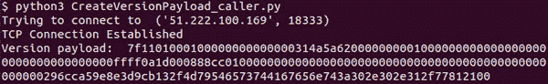

**图 7.11：** CreateVersionPayload 程序创建的版本有效载荷的显示

当我们收到`***version***`消息时，我们执行以下操作：

1.  我们首先接收消息头，验证魔数和校验和，然后识别命令：

    `flog = open(‘communication.log’, ‘wt+’)`

    `def calculateChecksum(b: bytes):`

    `checksum = hashlib.sha256(hashlib.sha256(b).digest()).digest()[0:4]`

    `return checksum`

    `def checkMessage(msghdr: dict, payload_b: bytes):`

    `if msghdr[‘magic’] == ‘0709110b’:`

    `print(‘魔数检查通过’, file=flog)`

    `else:`

    `print(‘魔数检查失败’, file=flog)`

    `print(‘魔数 = %s’ % msghdr[‘magic’], file=flog)`

    `raise Exception(‘无效的魔数’, file=flog)`

    `checksum_calc = calculateChecksum(payload_b)`

    `if msghdr[‘checksum’] == checksum_calc:`

    `print(‘校验和检查通过’, file=flog)`

    `else:`

    `print(‘校验和检查失败’, file=flog)`

    `print(‘有效载荷 = %s’ % payload_b.hex(), file=flog)`

    `print(‘预期校验和 = %s’ % msghdr[‘checksum’].hex(), file=flog)`

    `print(‘接收到的校验和 = %s’ % checksum_calc.hex(), file=flog)`

    `raise Exception(‘无效的校验和’)`

    `def parseMsgHdr(msghdr_b: bytes):`

    `msghdr = {}`

    `msghdr[‘magic’] = msghdr_b[0:4][::-1].hex()`

    `msghdr[‘command’] = msghdr_b[4:16].decode(“ascii”).strip(‘\0’)`

    `msghdr[‘length’] = int.from_bytes(msghdr_b[16:20], byteorder=’little’)`

    `msghdr[‘checksum’] = msghdr_b[20:24]`

    `return msghdr`

    **程序 7.5：** 用于解析消息头的程序

    我们可以看到程序校验和只包含双 SHA256 哈希的前 4 个字节；为了获取命令，我们将其剥离。

1.  接下来，我们再次从套接字接收消息，并调用`***version***`载荷的解析器。为此，我们通过名称调用该方法。我们将为后续程序不需要的方法创建虚拟方法：

    `MSGHDR_SIZE = 24`

    `CMD_FN_MAP = {`

    `‘version’: parseVersionPayload,`

    `‘addr’: parseAddrPayload,`

    `‘filterload’: parseFilterLoadPayload,`

    `‘filteradd’: parseFilterAddPayload,`

    `‘merkleblock’: parseMerkleBlockPayload,`

    `‘ping’: parsePingPongPayload,`

    `‘pong’: parsePingPongPayload,`

    `‘feefilter’: parseFeeFilterPayload,`

    `‘inv’: parseInvPayload,`

    `‘getdata’: parseInvPayload,`

    `‘notfound’: parseInvPayload,`

    `‘tx’: parseTxPayload,`

    `‘block’: parseBlockPayload,`

    `‘getblocks’: parseGetBlocksGetHeadersPayload,`

    `‘getheaders’: parseGetBlocksGetHeadersPayload,`

    `‘headers’: parseHeadersPayload,`

    `‘reject’: parseRejectPayload,`

    `‘sendcmpct’: parseSendCompactPayload,`

    `‘cmpctblock’: parseCompactBlockPayload,`

    `‘getblocktxn’: parseGetBlockTxnPayload,`

    `‘blocktxn’: parseBlockTxnPayload`

    `}`

    `def recvAll(s: socket, payloadlen: int):`

    `payload_b = b’’`

    `length = payloadlen`

    `while True:`

    `recvd_b = s.recv(length)`

    `payload_b += recvd_b`

    `if len(payload_b) == payloadlen:`

    `break`

    `length = payloadlen - len(payload_b)`

    `return payload_b`

    `def recvMsg(s: socket):`

    `msghdr_b = s.recv(MSGHDR_SIZE)`

    `msg = parseMsgHdr(msghdr_b)`

    `payloadlen = msg[‘length’]`

    `payload_b = recvAll(s, payloadlen)`

    ``checkMessage(msg, payload_b)``

    `payload_m = mmap.mmap(-1, payloadlen + 1)`

    `payload_m.write(payload_b)`

    `payload_m.seek(0)`

    `msg[‘payload’] = {}`

    `if payloadlen > 0:`

    `msg[‘payload’] = CMD_FN_MAP[msg[‘command’]](payload_m, payloadlen)`

    `print(‘<== msg = %s’ % msg, file=flog)`

    `return msg`

    **Program 7.6:** 基于命令接收和处理消息的程序

1.  以下代码解析`***version***`载荷：

    `import ipaddress`

    `import datetime`

    `def parseIPAddress(ip_m: mmap):`

    `addr = {}`

    `addr[‘service’] = int.from_bytes(ip_m.read(8), byteorder=’little’)`

    `parseServices(addr[‘service’])`

    `ip = ip_m.read(16)`

    `if ip[0:12].hex() == “00000000000000000000ffff”:`

    `addr[‘version’] = ‘IPv4’`

    `addr[‘address’] = str(ipaddress.IPv4Address(ip[12:16]))`

    `else:`

    `addr[‘version’] = ‘IPv6’`

    `addr[‘address’] = str(ipaddress.IPv6Address(ip[0:16]))`

    `addr[‘port’] = int.from_bytes(ip_m.read(2), byteorder=’big’)`

    `return addr`

    `def parseServices(services: int):`

    `service_l = []`

    `if services == 0x00:`

    `service_l.append(‘Unnamed’)`

    `if services & 0x01 == 0x01:`

    `service_l.append(‘NODE_NETWORK’)`

    `if services & 0x02:`

    `service_l.append(‘NODE_GETUTXO’)`

    `if services & 0x04:`

    `service_l.append(‘NODE_BLOOM’)`

    `if services & 0x08:`

    `service_l.append(‘NODE_WITNESS’)`

    `if services & 1024:`

    `service_l.append(‘NODE_NETWORK_LIMITED’)`

    `print(‘Services: %d implies: %s’ % (services, service_l), file=flog)`

    `def parseVersionPayload(payload_m: mmap, payloadlen: int):`

    `payload = {}`

    `start = payload_m.tell()`

    `payload[‘version’] = int.from_bytes(payload_m.read(4), byteorder=’little’)`

    `payload[‘services’] = int.from_bytes(payload_m.read(8), byteorder=’little’)`

    `parseServices(payload[‘services’])`

    `payload[‘timestamp’] = int.from_bytes(payload_m.read(8), byteorder=’little’)`

    `payload[‘dt’] = datetime.datetime.fromtimestamp(payload[‘timestamp’]).strftime(‘%Y-%m-%d %H:%M:%S’)`

    `payload[‘addr_recv’] = parseIPAddress(payload_m)`

    `payload[‘addr_trans’] = parseIPAddress(payload_m)`

    `payload[‘nonce’] = int.from_bytes(payload_m.read(8), byteorder=’little’)`

    `payload[‘user_agent_size’] = getVarInt(payload_m)`

    `payload[‘user_agent’] = payload_m.read(payload[‘user_agent_size’])`

    `payload[‘block_height’] = int.from_bytes(payload_m.read(4), byteorder=’little’)`

    `if payload_m.tell() - start != payloadlen:`

    `payload[‘relay’] = int.from_bytes(payload_m.read(1), byteorder=’little’)`

    `return payload`

    **Program 7.7:** Program to parse version payload

比特币网络消息使用与我们曾在 *第六章，区块链、交易和挖矿，图 6.25* 中讨论过的相同的变量整数格式。

**verack** 消息没有负载。它是接收到的 **version** 的确认。

一旦发送和接收了 **version** 消息，并发送和接收了 **verack** 消息，我们认为连接已经建立，并准备好发送和接收其他类型的消息。

以下是建立比特币连接的代码：

`def sendVersionMessage(s: socket, version: int):`

`sndcmd = ‘version’`

`payload = createVersionPayload(s, version)`

``sndmsg = createMessage(sndcmd, payload)``

``s.send(sndmsg)``

`print(‘==> cmd = %s, msg = %s’ % (sndcmd, sndmsg.hex()), file=flog)`

`return True`

`def waitForVersion(s: socket):`

`recvmsg = recvMsg(s)`

`vers_recvd = False`

`if recvmsg[‘command’] != ‘version’:`

`print(‘Invalid Response’)`

`return False`

`services = recvmsg[‘payload’][‘services’]`

`if services & 1 == 0x00:`

`print(‘Peer is not full node’)`

`return False`

`return True`

`def sendVerackMessage(s: socket):`

`sndcmd = ‘verack’`

`payload = b’’`

`sndmsg = createMessage(sndcmd, payload)`

``s.send(sndmsg)``

`print(‘==> cmd = %s, msg = %s’ % (sndcmd, sndmsg.hex()), file=flog)`

`return True`

`def waitForVerack(s: socket):`

``recvmsg = recvMsg(s)``

`verack_recvd = False`

`if recvmsg[‘command’] != ‘verack’:`

`return False`

`return True`

`def establishConnection(s: socket, version: int):`

`vers_sent = sendVersionMessage(s, version)`

`vers_recvd = waitForVersion(s)`

`if vers_recvd == False:`

`return False`

`verack_sent = sendVerackMessage(s)`

`verack_recvd = waitForVerack(s)`

`if vers_sent and vers_recvd and verack_sent and verack_recvd:`

`print(‘Connection is established’, file=flog)`

`return True`

`return False`

**程序 7.8:** 建立比特币连接的程序

我们使用以下程序调用前面的方法：

`if __name__ == ‘__main__’:`

`peers = getTestnetPeers()`

`p = random.choice(peers)`

`s = None`

`peerinfo = {}`

`print(“Trying to connect to “, p, file=flog)`

`s = socket.socket(socket.AF_INET, socket.SOCK_STREAM)`

`err = s.connect(p)`

`print(‘connected’, file=flog)`

`if establishConnection(s, 70015) == False:`

`print(‘Establish connection failed’, file=flog)`

`s.close()`

`flog.close()`

我们得到以下通信日志：

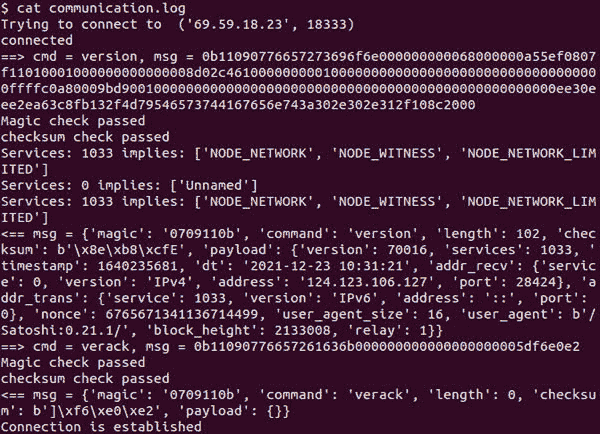

**图 7.12:** 比特币连接建立过程中的消息交换通信日志

在这个子主题中，你学会了建立比特币连接。

# 与不活跃的对等节点断开连接

TCP/IP 连接可能会在没有对端知识的情况下变为不活跃。为了断开一个不活跃的连接，节点发送`**ping**`消息并期待`**pong**`作为响应。`**ping**`消息包含一个 8 字节的随机数 nonce。在`**pong**`响应消息中，接收节点会回传它作为`**ping**`消息一部分收到的相同 nonce 消息。

以下方法解析`**ping**`消息并响应`**pong**`消息：

`def parsePingPongPayload(payload_m: mmap, payloadlen = 0):`

`payload = {}`

`payload[‘nonce’] = int.from_bytes(payload_m.read(8), byteorder=’little’)`

`return payload`

`def createPongPayload(nonce: int):`

`nonce_b = struct.pack(‘<Q', nonce)`

`return nonce_b`

`def sendPongMessage(s: socket, recvmsg: dict):`

`# 发送 pong 消息`

`sndcmd = ‘pong’`

`nonce = recvmsg[‘payload’][‘nonce’]`

`payload = createPongPayload(nonce)`

`sndmsg = createMessage(sndcmd, payload)`

`s.send(sndmsg)`

`print(‘==> cmd = %s, msg = %s’ % (sndcmd, sndmsg.hex()), file=flog)`

**程序 7.9：** 发送 ping 和接收 pong 消息的程序

如果对等节点响应了一个不同的 nonce 或者没有响应，那么我们可以安全地假设它不活跃，我们可以断开连接。

# 节点发现

正如你所学习的，平均几乎有 10,000 个活跃节点，重要的是要在网络上分配负载。几乎 95%的全节点运行 Bitcoin Core，它有一些硬编码的 DNS 种子，所以如果这些节点只依赖 DNS 种子提供的地址，那么这些地址可能会过载。这会损害比特币网络的去中心化特性，会影响性能，并且容易受到**服务拒绝**（**DoS**）*攻击*。

为了找到新的对等节点，我们有一个以下顺序图：

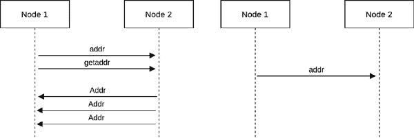

**图 7.13：** 显示从对等节点接收节点地址步骤的顺序图

正如`**verack**`一样，`**getaddr**`没有负载。以下是`**addr**`消息的负载结构：

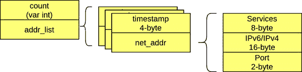

**图 7.14：** addr 的负载结构

现在，我们将尝试从一个对等节点获取`**addr**`消息。为了获取`**addr**`消息，我们需要处理一些更多的消息，因为这些可能由对等节点发送。此外，我们将发送一个较低版本以避免`**sendcmpct**`请求。我们将使用版本*70013*。以下是将发送`**getaddr**`并接收`**addr**`的程序：

`def parseAddrPayload(payload_m: mmap, payloadlen = 0):`

`payload = {}`

`payload[‘count’] = getVarInt(payload_m)`

`payload[‘addrs’] = []`

`for i in range(payload[‘count’]):`

`addr = {}`

`addr[‘timestamp’] = int.from_bytes(payload_m.read(4), byteorder=’little’)`

`addr[‘addr’] = parseIPAddress(payload_m)`

`payload[‘addrs’].append(addr)`

`return payload`

`def sendrecvHandler(s: socket, version: int):`

`if establishConnection(s, version) == False:`

`print(‘建立连接失败’, file=flog)`

`return`

`# send getaddr message`

`sndcmd = ‘getaddr’`

`payload = b’’`

`sndmsg = createMessage(sndcmd, payload)`

``s.send(sndmsg)``

`print(‘==> cmd = %s, msg = %s’ % (sndcmd, sndmsg.hex()), file=flog)`

`while True:`

`recvmsg = recvMsg(s)`

`if recvmsg[‘command’] == ‘addr’:`

`break`

`elif recvmsg[‘command’] == ‘ping’:`

`# send pong message`

`sndcmd = ‘pong’`

`nonce = recvmsg[‘payload’][‘nonce’]`

`payload = createPongPayload(nonce)`

`elif recvmsg[‘command’] == ‘getheaders’:`

`# send header message`

`sndcmd = ‘headers’`

`hashes = recvmsg[‘payload’][‘block locator hashes’]`

`stophash = recvmsg[‘payload’][‘hash_stop’]`

`payload = createHeadersPayload(hashes, stophash)`

``sndmsg = createMessage(sndcmd, payload)``

``s.send(sndmsg)``

`print(‘==> cmd = %s, msg = %s’ % (sndcmd, sndmsg.hex()), file=flog)`

`if recvmsg[‘command’] == ‘addr’:`

`print(‘Received Addr’, file=flog)`

**程序 7.10:** 发送 getaddr 和接收 addr 的程序

我们还需要处理`**getheaders**`请求，这将在下一个和即将到来的子主题中解释。

我们使用以下代码来调用前述方法。相同的调用代码将用于调用即将进行的方法：

`if __name__ == ‘__main__’:`

`peers = getTestnetPeers()`

`print(peers)`

``p = random.choice(peers)``

`s = None`

``peerinfo = {}``

`print(“Trying to connect to “, p, file=flog)`

`s = socket.socket(socket.AF_INET, socket.SOCK_STREAM)`

``err = s.connect(p)``

`print(‘connected’, file=flog)`

`sendrecvHandler(s, 70013)`

``s.close()``

``flog.close()``

我们获得以下通信日志：

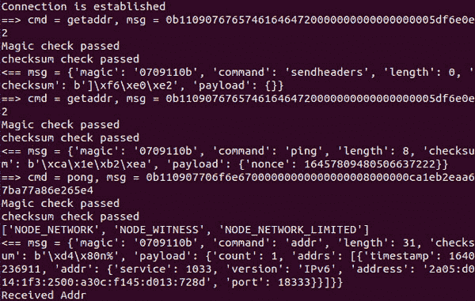

**Figure 7.15:** 从对等节点接收 addr 的通信日志

# 接收完整的区块链

当我们安装比特币软件并且第一次连接到网络时，它会同步区块链的所有现有区块。它告诉它的对等节点它的区块高度为零，并请求对等节点提供区块。这被称为**初始区块下载**（**IBD**）。自从比特币核心版本 0.10.0 以来，我们一直在使用名为**首先获取头部**的 IBD 方法。

以下图表展示了这个过程的步骤：

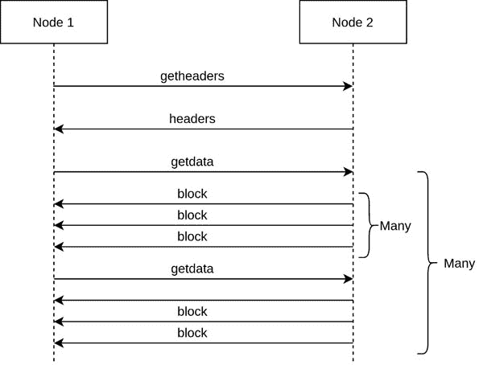

**Figure 7.16:** 显示 IBD 步骤的序列图

新节点最初只有一个创世区块。它在`**getheaders**`请求中发送此区块的哈希。节点以`headers`消息响应，包含一个区块头哈希列表。比特币核心发送最多 2000 个区块哈希的列表。在接收到区块哈希后，节点验证区块哈希，然后向其对等方发送包含其收到的部分区块头哈希的`**getdata**`请求。由于节点与多个对等方连接，它可以向所有对等方请求不同的区块哈希集合。请求的对等方一个接一个地响应所有区块。一旦节点收到了请求的区块，它可以再次使用包含接收到的区块哈希列表的`**getdata**`请求。这个过程一直持续，直到节点接收到所有区块，并且节点的区块链完全与网络同步。

以下是`**getheaders**`、`**headers**`和`**getdata**`消息的结构：

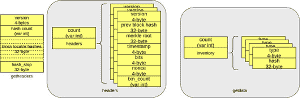

**图 7.17：** `getheaders`和`getdata`的负载结构

`**block**`的结构与我们在*第六章，区块链、交易和挖矿*中讨论的*图 6.6*相同。

在以下代码中，我们仅发送了两个`**getheaders**`请求：第一个仅包含创世区块哈希，下一个包含 32 个接收到的区块哈希。这意味着我们期望接收两组 2000 个区块。我们对每个`headers`响应进行多个`**getdata**`请求。在以下代码中，每个`**getdata**`请求包含 16 个区块头哈希。

`def getGenesisBlockHash():`

`blkhash = rpc_connection.getblockhash(0)`

`return blkhash`

`def parseSendCompactPayload(payload_m: mmap, payloadlen = 0):`

`payload = {}`

`payload[‘announce’] = int.from_bytes(payload_m.read(1), byteorder=’little’)`

`payload[‘version’] = int.from_bytes(payload_m.read(8), byteorder=’little’)`

`return payload`

`def parseFeeFilterPayload(payload_m: mmap, payloadlen = 0):`

`payload = {}`

`payload[‘feerate’] = int.from_bytes(payload_m.read(8), byteorder=’little’)`

`return payload`

``mempool_l_g = []``

`def parseInvPayload(payload_m: mmap, payloadlen = 0):`

`MSG_TX = 1`

`payload = {}`

`payload[‘count’] = getVarInt(payload_m)`

`payload[‘inventory’] = []`

`for i in range(payload[‘count’]):`

`inv = {}`

`inv[‘type’] = int.from_bytes(payload_m.read(4), byteorder=’little’)`

`if inv[‘type’] == MSG_TX:`

`mempool = rpc_connection.getrawmempool(True)`

`if (len(mempool_l_g) > 0):`

`new_tx = set(mempool.keys()) ^ set(mempool_l_g[-1].keys())`

`if len(new_tx) > 0:`

``mempool_l_g.append(mempool)``

`print(‘inserted mempool’, file=flog)`

`else:`

`mempool_l_g.append(mempool)`

`print(‘inserted mempool’, file=flog)`

`inv[‘hash’] = payload_m.read(32)[::-1].hex()`

`payload[‘inventory’].append(inv)`

`return payload`

`def parseBlockHeader(payload_m: mmap):`

`hdr = {}`

`hdr[‘version’] = int.from_bytes(payload_m.read(4), byteorder=’little’)`

`hdr[‘prev_blockhash’] = payload_m.read(32)[::-1].hex()`

`hdr[‘merkle_root’] = payload_m.read(32)[::-1].hex()`

`hdr[‘timestamp’] = int.from_bytes(payload_m.read(4), byteorder=’little’)`

`hdr[‘bits’] = payload_m.read(4)[::-1].hex()`

`hdr[‘nonce’] = payload_m.read(4)[::-1].hex()`

`return hdr`

`def parseGetBlocksGetHeadersPayload(payload_m: mmap, payloadlen = 0):`

`payload = {}`

`payload[‘version’] = int.from_bytes(payload_m.read(4), byteorder=’little’)`

`payload[‘hash count’] = getVarInt(payload_m)`

`payload[‘block locator hashes’] = []`

`for i in range(payload[‘hash count’]):`

`h = payload_m.read(32)[::-1].hex()`

`payload[‘block locator hashes’].append(h)`

`payload[‘hash_stop’] = payload_m.read(32)[::-1].hex()`

`return payload`

`def parseHeadersPayload(payload_m: mmap, payloadlen = 0):`

`payload = {}`

`payload[‘count’] = getVarInt(payload_m)`

`payload[‘headers’] = []`

`for i in range(payload[‘count’]):`

`hdr = {}`

``start = payload_m.tell()``

`h_b = hashlib.sha256(payload_m.read(80)).digest()`

`hdr[‘blkhash’] = hashlib.sha256(h_b).digest()[::-1].hex()`

`payload_m.seek(start)`

`hdr[‘header’] = parseBlockHeader(payload_m)`

`hdr[‘txn_count’] = getVarInt(payload_m)`

`payload[‘headers’].append(hdr)`

`return payload`

`def parseTxPayload(payload_m: mmap, payloadlen = 0):`

``payload = {}``

`payload[‘version’] = int.from_bytes(payload_m.read(4), byteorder=’little’)`

`payload[‘tx_in count’] = getVarInt(payload_m)`

`payload[‘tx_in’] = []`

`for i in range(payload[‘tx_in count’]):`

``txin = {}``

`txin[‘prev_tx_hash’] = payload_m.read(32)[::-1].hex()`

`txin[‘prev_tx_out_index’] = int.from_bytes(payload_m.read(4),`

`byteorder=’little’)`

`txin[‘bytes_scriptsig’] = getVarInt(payload_m)`

`txin[‘sriptsig’] = payload_m.read(txin[‘bytes_scriptsig’]).hex()`

`txin[‘sequence’] = payload_m.read(4)[::-1].hex()`

`payload[‘tx_in’].append(txin)`

`payload[‘tx_out count’] = getVarInt(payload_m)`

`payload[‘tx_out’] = []`

`for i in range(payload[‘tx_out count’]):`

``txout = {}``

`txout[‘satoshis’] = int.from_bytes(payload_m.read(8), byteorder=’little’)`

`txout[‘bytes_scriptpubkey’] = getVarInt(payload_m)`

`txout[‘scriptpubkey’] = payload_m.read(txout[‘bytes_scriptpubkey’]).hex()`

`payload[‘tx_out’].append(txout)`

`payload[‘locktime’] = int.from_bytes(payload_m.read(4), byteorder=’little’)`

`return payload`

`def parseBlockPayload(payload_m: mmap, payloadlen = 0):`

``payload = {}``

`payload[‘version’] = int.from_bytes(payload_m.read(4), byteorder=’little’)`

`payload[‘prev_blockhash’] = payload_m.read(32)[::-1].hex()`

`payload[‘merkle_root’] = payload_m.read(32)[::-1].hex()`

`payload[‘timestamp’] = int.from_bytes(payload_m.read(4), byteorder=’little’)`

`payload[‘bits’] = payload_m.read(4)[::-1].hex()`

`payload[‘nonce’] = payload_m.read(4)[::-1].hex()`

`payload[‘txn_count’] = getVarInt(payload_m)`

`payload[‘txns’] = []`

`for i in range(payload[‘txn_count’]):`

`payload[‘txns’].append(parseTxPayload(payload_m))`

`return payload`

`def createGetHeadersPayload(hdr_info_l: list, version: int):`

`version_b = struct.pack(‘<L’, version)`

`blk_locator_hashes_b = b’’`

`count = 0`

`for i in range(len(hdr_info_l) - 1, len(hdr_info_l) - 32, -1):`

`if i < 1: # assuming first block is genesis`

`break`

`blk_locator_hashes_b += bytes.fromhex(hdr_info_l[i][‘blkhash’])[::-1]`

`count += 1`

`blk_locator_hashes_b += bytes.fromhex(getGenesisBlockHash())[::-1]`

`count += 1`

``hash_count_b = setVarInt(count)``

`stop_hash_b = bytes(32)`

`payload = version_b \`

`+ hash_count_b \`

`+ blk_locator_hashes_b \`

`+ stop_hash_b`

`return payload`

`def waitForBlock(s: socket):`

`while True:`

``recvmsg = recvMsg(s)``

`if recvmsg[‘command’] == ‘block’:`

`break`

`elif recvmsg[‘command’] == ‘ping’:`

``sendPongMessage(s, recvmsg)``

`return recvmsg`

`def sendGetHeadersMessage(s: socket, hdr_info_l: list, version: int):`

`sndcmd = ‘getheaders’`

``payload = createGetHeadersPayload(hdr_info_l, version)``

``sndmsg = createMessage(sndcmd, payload)``

``s.send(sndmsg)``

`print(‘==> cmd = %s, msg = %s’ % (sndcmd, sndmsg.hex()), file=flog)`

`def waitForHeaders(s: socket):`

`while True:`

``recvmsg = recvMsg(s)``

`if recvmsg[‘command’] == ‘headers’:`

`break`

`elif recvmsg[‘command’] == ‘ping’:`

``sendPongMessage(s, recvmsg)``

`return recvmsg`

`def createGetDataPayload(count: int, hash_l: list):`

`MSG_BLOCK = 2`

`hash_count_b = setVarInt(count)`

`hashes_b = b’’`

`for i in range(count):`

`type_b = struct.pack(‘<L’, MSG_BLOCK)`

`hashes_b += type_b + bytes.fromhex(hash_l[i][‘blkhash’])[::-1]`

`payload_b = hash_count_b + hashes_b`

`return payload_b`

`def sendGetDataMessage(s: socket, count: int, hash_l: list):`

`sndcmd = ‘getdata’`

``payload = createGetDataPayload(count, hash_l)``

``sndmsg = createMessage(sndcmd, payload)``

``s.send(sndmsg)``

`print(‘==> cmd = %s, msg = %s’ % (sndcmd, sndmsg.hex()), file=flog)`

`def sendAndHandleGetHeaders(s: socket, hdr_info_l: list, version: int):`

``sendGetHeadersMessage(s, hdr_info_l, version)``

``recvmsg = waitForHeaders(s)``

`count = recvmsg[‘payload’][‘count’]`

`for i in range(0, count, 16):`  

`lindex = i + 16 if i + 16 < count else count`  

`print(i, lindex)`  

`blk_l = recvmsg[‘payload’][‘headers’][i:lindex]`  

`sendGetDataMessage(s, lindex - i, blk_l)`  

`for j in range(i, lindex):`  

``waitForBlock(s)``  

`return recvmsg`  

`def sendrecvHeadersData(s: socket, version: int):`  

``recvmsg = sendAndHandleGetHeaders(s, [], version)``  

`sendAndHandleGetHeaders(s, recvmsg[‘payload’][‘headers’], version)`  

`def sendrecvHandler(s: socket, version: int):`  

`if establishConnection(s, version) == False:`  

`print(‘Establish connection failed’, file=flog)`  

``return``  

``sendrecvHeadersData(s, version)``  

**Program 7.11:** Program for making IBD request to peer and receiving blocks  

This gives the following output. First, we send the `**getheaders**` request with genesis block hash and no hash stop:  

  

**Figure 7.18:** getheaders request sent to the peer  

The following is the truncated ***headers*** response containing 2,000 headers:  

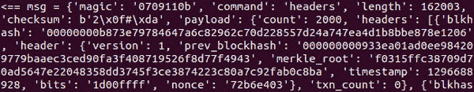  

**图 7.19:** 从对等节点接收到头部响应

我们回应了一个 `**getdata**` 请求，请求 16 个区块。请求内容如下：

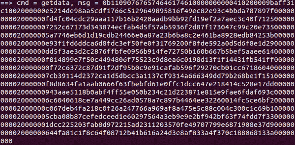

**图 7.20:** 向对等节点发送 getdata 请求

我们获得了 16 个区块，以下是其中之一：

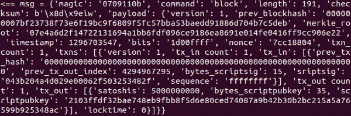

**图 7.21:** 从对等节点接收到的区块

在接收到 16 个区块后，我们请求下一个 16 个区块，并再次获得 16 个区块。这个过程一直持续，直到我们接收到所有的 2,000 个区块。节点还需要根据共识规则验证每个区块。这些共识规则中的一些在 *第六章，区块链、交易和挖矿* 中已经介绍过。

在接收到 2,000 个区块后，我们再次发送 `**getheaders**` 请求，包含最后 31 个区块哈希列表和创世区块哈希，共计 32 个哈希。以下是请求的部分内容：

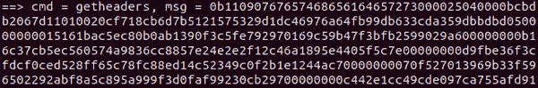

**图 7.22:** 向对等节点发送截断的 getheaders 请求

我们再次获取了下一个 2,000 个区块的 `**headers**`*，并重复了该过程。这个过程可以一直持续，直到我们接收到所有的区块。一旦接收到的 `**headers**` 少于 2,000 个，我们也可以向其他对等节点发送 `**getheaders**` 请求。通过向其他对等节点发送 `**getheaders**` 请求，我们可以猜测最优质的区块链，并保持不同链上的区块，以便能够撤销区块。

如果区块链落后于 24 小时以上，还可以使用 IBD 方法同步区块。

# 同步区块链

如果我们的节点落后于 24 小时以内，我们必须考虑可能存在竞争链的情况。在这种情况下，我们需要从不同的对等节点获取区块，并保持竞争链上的区块，以便如果另一条链更长时可以撤销它们。我们使用与上一个小节相同的方法获取区块，唯一的区别是我们现在是从多个对等节点获取区块。我们的节点还需要决定哪个链是最优的，通常情况下，更长的链是被优先考虑的。

# 交易广播

正如我们所知，要花费作为 UTXO 存在的未花费输出，我们需要创建一个交易并发送给对等节点。我们可能还需要从对等节点接收交易，然后发送给其他对等节点。在本小节中，我们将了解节点是如何接收交易的。

以下图表展示了获取交易步骤的过程：

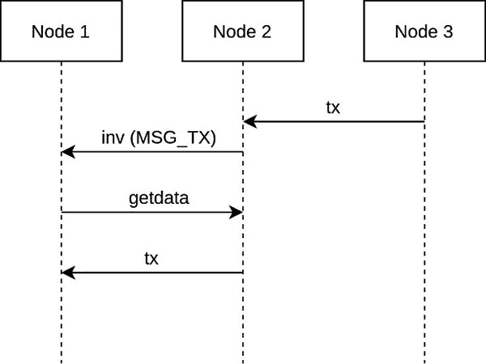

**图 7.23:** 显示交易广播步骤的序列图

当一个节点接收到一个交易时，它会将其发送给对等节点的 `**inv**` 消息。对等节点检查它是否之前见过这个交易。如果没有，它会返回带有 `**MSG_TX**` 选项和 `**txid**` 的 `**getdata**` 请求。发送 `**inv**` 消息的节点回应实际的原始交易。

`**inv**` has the same payload structure as `**getdata**`. The `**tx**` message has the same message structure as the Bitcoin transaction we discussed in *Chapter 6, Blockchain, Transactions, and Mining, figure 6.30*.  

The following code processes the `**inv**` message if it has the option `**MSG_TX**`:  

`def createGetDataTxPayload(payload: dict):`  

`MSG_TX = 1`  

`data_b = b’’`  

`count = 0`  

`for i in range(payload[‘count’]):`  

`# we only request data for tx`  

`if payload[‘inventory’][i][‘type’] == MSG_TX:`  

`type_b = struct.pack(‘<L’, payload[‘inventory’][i][‘type’])`  

`hash_b = bytes.fromhex(payload[‘inventory’][i][‘hash’])[::-1]`  

``data_b += type_b + hash_b``  

`count += 1`  

``count_b = setVarInt(count)``  

``payload_b = count_b + data_b``  

``return count, payload_b``  

`def waitForInvMessage(s: socket):`  

`while True:`  

``recvmsg = recvMsg(s)``  

`if recvmsg[‘command’] == ‘inv’:`  

`break`  

`elif recvmsg[‘command’] == ‘ping’:`  

``sendPongMessage(s, recvmsg)``  

`print(‘收到 INV’, file=flog)`

`return recvmsg`

`def waitForTxMsg(s: socket):`

`while True:`

``recvmsg = recvMsg(s)``

`if recvmsg[‘command’] == ‘tx’:`

``break``

`elif recvmsg[‘command’] == ‘ping’:`

`sendPongMessage(s, recvmsg)`

`def sendGetDataMessageWithTx(s: socket, recvmsg: dict):`

`sndcmd = ‘getdata’`

`count, payload = createGetDataTxPayload(recvmsg[‘payload’])`

``sndmsg = createMessage(sndcmd, payload)``

``s.send(sndmsg)``

`print(‘==> 命令 = %s, 消息 = %s’ % (sndcmd, sndmsg.hex()), file=flog)`

`return count`

`def waitAndHandleInvTxnMessage(s: socket):`

``recvmsg = waitForInvMessage(s)``

``count = sendGetDataMessageWithTx(s, recvmsg)``

`for i in range(count):`

``waitForTxMsg(s)``

`def sendrecvHeadersData(s: socket):`

``waitAndHandleInvTxnMessage(s)``

`def sendrecvHandler(s: socket, version: int):`

`if establishConnection(s, version) == False:`

`print(‘建立连接失败’, file=flog)`

``return``

``sendrecvHeadersData(s)``

**程序 7.12：** 用于接收和处理交易的 inv 消息的程序

以下是通信日志，显示了接收的 `**inv**` 消息和发送的带有对两笔交易的请求的 `**getdata**` 消息：

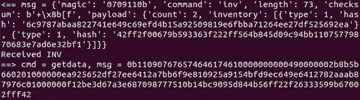

**图 7.24：** 从节点接收的 `inv` 消息以及作为响应向节点发出的 `getdata` 请求

我们根据我们的节点的请求收到了两笔交易：

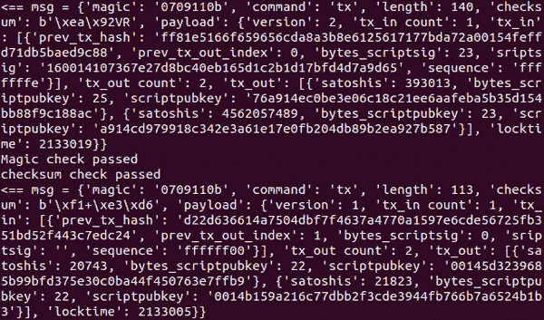

**图 7.25：** 包含响应 `getdata` 请求从节点收到的交易的 tx 消息

我们的节点可以通过首先发送一个带有收到的交易的交易 ID 的 `**inv**` 消息来将收到的交易发送到其他连接的节点。这个过程一直持续到所有活动节点都收到了交易。

在这个子主题中，您学习了在比特币网络上如何广播交易。

# 区块广播

区块也需要在网络上尽快传播，以便即使最远的节点也能在合理的时间内收到它，从而不会创建太多或太长的竞争分支。在我们能够接收到最新的区块之前，我们需要与连接的节点同步，以便同伴知道我们的节点没有落后，我们的节点将能够验证最近接收的区块。

一旦区块链同步完成，我们就准备好接收同伴的实时更新。

以下是广播区块的不同方法：

+   矿工挖出新区块时，只需通过`**block**`消息广播新区块。这被称为**未请求区块推送**。

+   对于一个普通节点，有三种方法可以接收新区块。这些方法被称为**直接头部声明**。这可以通过`**sendheaders**`方法或`**sendcmpct**`消息来实现。`**sendheaders**`方法是传统的直接头部声明方法，自 70012 以来一直可用，而`**sendcmpct**`方法是在 70014 中引入的。以下子点解释了它们：

    +   节点在连接建立后立即发送`**sendheaders**`。这告诉同伴，每当它接收到一个新的区块时，它可以发送*headers*。基于`**headers**`，我们可以请求`**getdata**`。作为对`**getdata**`的响应，同伴发送区块。

    +   通过请求紧凑区块，可以进一步减少中继延迟。可以在连接建立后立即发送`**sendcmpct**`消息。有两种方法：

        +   **高带宽中继：** 每当同伴接收到一个区块时，它会发送`**cmpctblock**`。它包含一个头部和一个短 ID 列表。我们查看`**mempool**`，根据短 ID 获取交易 ID 列表，并重建区块。如果在`**mempool**`中缺少交易，我们通过发送`**getblocktxn**`仅请求那些缺失的交易。同伴用包含交易的`**blocktxn**`消息响应。

        +   **低带宽中继：** 每当同伴接收到一个区块时，它会发送一个`headers`消息。我们发送一个`**getdata**`消息作为响应，带有`**MSG_CMPCT_BLOCK**`类型。同伴用`**cmpctblock**`响应，进一步处理类似于**高带宽中继**。

# **未请求区块推送](toc.xhtml#s142a)

以下图显示了矿工成功挖出区块后的**未请求区块推送**。矿工不需要首先发送*headers*消息，因为它知道同伴不会有它。它也不需要与同伴同步节点，因为它只有在知道链中前一个节点的情况下才能挖出区块。

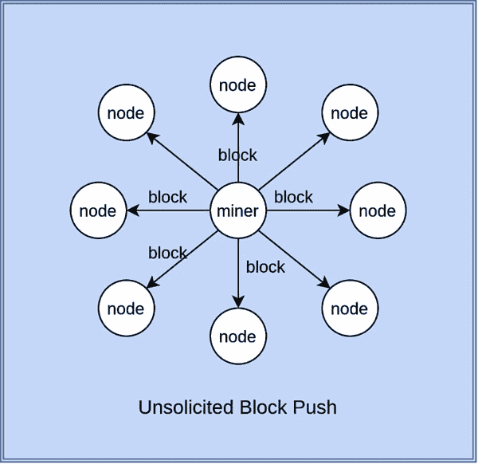

**图 7.26：** 矿工使用未请求区块推送向同伴广播新生成区块的说明。

从图中我们可以看到，矿工刚刚将新挖出的区块推送给所有连接的同伴。矿工不需要进行其他通信。

# 直接头部声明

以下图示展示了直接头部声明（传统方式）：

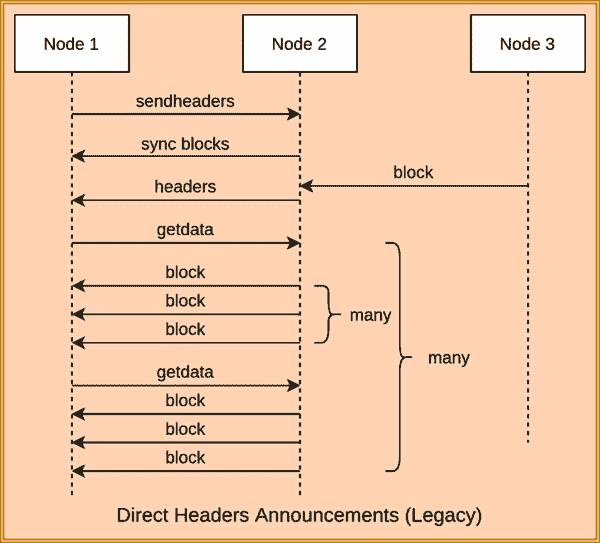

**图 7.27**：直接头部声明（传统方式）的序列图

建立连接后，我们立即向对等节点发送`**sendheaders**`消息，使对等节点意识到，与其发送`**

一旦对等节点意识到我们持有的区块链并且与该节点同步了所有区块，我们就可以从对等节点接收新区块。请注意，我们的最长区块链可能与对等节点的最长区块链不同，因此我们需要从不同的对等节点接收区块。

在以下代码片段中，连接已经建立，现在我们正在发送和处理接收新区块所需的消息：

`def sendSendHeadersMessage(s: socket):`

`sndcmd = ‘sendheaders’`

`payload = b’’`

``sndmsg = createMessage(sndcmd, payload)``

``s.send(sndmsg)``

`print(‘==> cmd = %s, msg = %s’ % (sndcmd, sndmsg.hex()), file=flog)`

`def createHeadersPayloadNoHeaders():`

`cnt_b = setVarInt(0)`

`headers_b = b’’`

``payload = cnt_b + headers_b``

``return payload``

`def createHeadersPayload(hashes, stophash):`

`b_cnt_d = {‘fd’: 2, ‘fe’: 4, ‘ff’: 8}`

`found = False`

`for blk_hash in hashes:`

``try:``

`blk = rpc_connection.getblock(blk_hash)`

`found = True`

``break``

`except Exception as e:`

``continue``

`if found == True:`

`txcnt = 0`

``txcnt_b = setVarInt(txcnt)``

`headers_b = b’’`

`count = 0`

`while True:`

``# 返回区块十六进制``

`print(‘block_hash = %s’ % blk_hash, file=flog)`

`blk = rpc_connection.getblock(blk_hash, False)`

`blk_b = bytes.fromhex(blk)`

`blkhdr_b = blk_b[:80]`

``headers_b += blkhdr_b + txcnt_b``

``blk = rpc_connection.getblock(blk_hash)``

`count += 1`

`if count == 2000 or ‘nextblockhash’ not in blk or stophash == blk_hash:`

`print(count, file=flog)`

`print(stophash, file=flog)`

``break``

`blk_hash = blk[‘nextblockhash’]`

``cnt_b = setVarInt(count)``

``payload = cnt_b + headers_b``

``else:``

`cnt_b = setVarInt(0)`

`headers_b = b’’`

``payload = cnt_b + headers_b``

``return payload``

`def waitForHeaders(s: socket):`

`while True:`

``recvmsg = recvMsg(s)``

`if recvmsg[‘command’] == ‘headers’:`

``break``

`elif recvmsg[‘command’] == ‘ping’:`

``sendPongMessage(s, recvmsg)``

`elif recvmsg[‘command’] == ‘getheaders’:`

``sendHeadersMessage(s)``

``return recvmsg``

`def waitAndHandleHeaderResponse(s: socket):`

``recvmsg = waitForHeaders(s)``

`count = recvmsg[‘payload’][‘count’]`

`for i in range(0, count, 16):`

`lindex = i + 16 if i + 16 < count else count`

`blk_l = recvmsg[‘payload’][‘headers’][i:lindex]`

``sendGetDataMessage(s, lindex - i, blk_l)``

`for j in range(i, lindex):`

``waitForBlock(s)``

`def getBlockHashListFromCoreClient():`

``blkhash_l = []``

``height = getLastBlockHeight()``

`for i in range(31, -1, -1):`

``d = {}``

`d[‘blkhash’] = rpc_connection.getblockhash(height - i)`

``blkhash_l.append(d)``

``return blkhash_l``

`def sendrecvHeadersData(s: socket, version: int):`

``sendSendHeadersMessage(s)``

``blkhash_l = getBlockHashListFromCoreClient()``

``sendAndHandleGetHeaders(s, blkhash_l, version)``

``waitAndHandleHeaderResponse(s)``

`def sendrecvHandler(s: socket, version: int):`

`if establishConnection(s, version) == False:`

`print(‘Establish connection failed’, file=flog)`

`return`

``sendrecvHeadersData(s, version)``

**程序 7.13:** 使用直接头部宣布（遗产）接收区块的程序

这为我们提供了以下消息交换序列，这些交换发生在我们节点和对等节点之间。

首先，我们向对等节点发送`**sendheaders**`以指示我们期望`***headers***`消息而不是`**inv**`来接收区块：

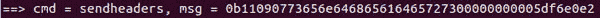

**图 7.28:** 向对等节点发送 getheaders 消息，表明我们的节点接受直接头部宣布

然后，通过发送带有最佳链最近区块的`**getheaders**`消息来同步区块链：

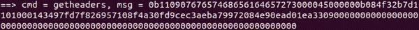

**图 7.29:** 向对等节点发送 getheaders 请求以同步

由于对等节点没有最近的区块，它用以下空`**headers**`消息响应：

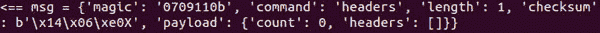

**图 7.30:** 对等节点响应带有头部列表的头部消息

对等节点发送一个空`***headers***`响应，因为它没有任何新块。

此后，我们等待对等节点在接收到区块时向我们发送新区块：

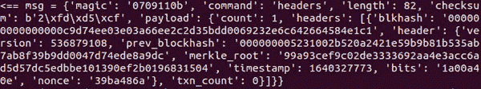

**图 7.31:** 在接收到新块后，对等节点向我们节点发送一个头部列表

如果我们还没有区块，我们就请求对等节点发送缺失的区块。这是通过向对等节点发送带有我们在`**headers**`消息中收到的区块头部哈希的`**getblock**`消息来完成的。

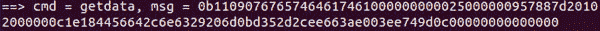

**图 7.32:** 我们的节点向对等节点发送 getdata 请求以获取区块

对等节点用`**block**`消息发送原始区块。以下是截断的`**block**`消息：

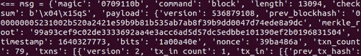

**图 7.33:** 对等节点响应包含完整区块的区块消息

在本子主题中，你学习了原始直接头部宣布方法是如何工作的。在下一个子主题中，你将了解最近接收的区块的改进广播方法。

# 紧凑区块宣布

我们知道区块是交易的集合。一个区块由的大部分交易几乎所有对等节点都已经接收。所以，如果我们能发送一个与区块头一起的压缩交易列表，就不需要发送整个区块。这就是紧凑区块公告背后的想法。因此，自版本 70014 以来，直接头部广播已由`**cmpctblock**`*.* 替换，现在使用两种方法：

1.  对于高带宽通信：通常只有少数对等节点启用此方法，因为它需要更多处理。

1.  对于低带宽通信：此方法为其他对等节点启用。

连接建立后，我们会立即向一个对等节点发送`**sendheaders**`消息，让我们的对等节点知道，与其发送`**inv**`消息，不如直接发送`***headers***`消息来接收新到来的区块。然后，我们发送一个`**sendcmpct**`消息，让我们的对等节点知道，对于隔离见证和非隔离见证交易，我们期望收到`**headers**`或`**cmpctblock**`消息。

以下是`**sendcmpct**`负载的结构：

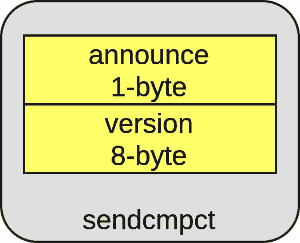

**图 7.34：** sendcmpct 消息结构

在`**sendcmpct**`消息中，有两个字段：

**Announce**是一个字节长的布尔值。值**0**表示支持低带宽传输，而值**1**表示支持高带宽传输。

**Version**是一个 8 字节字段；目前，它可以有以下值之一：

+   值 1，表示支持`**wtxid**`，即隔离见证中的见证交易 ID。

+   值 0，表示支持具有与该值相同的交易 ID 的其他交易。

我们将在接下来的章节中讨论隔离见证交易。

下一个子主题将涵盖这些中继方法中的每一个。

# 高带宽紧凑区块公告

以下是活动图中消息交换的顺序：

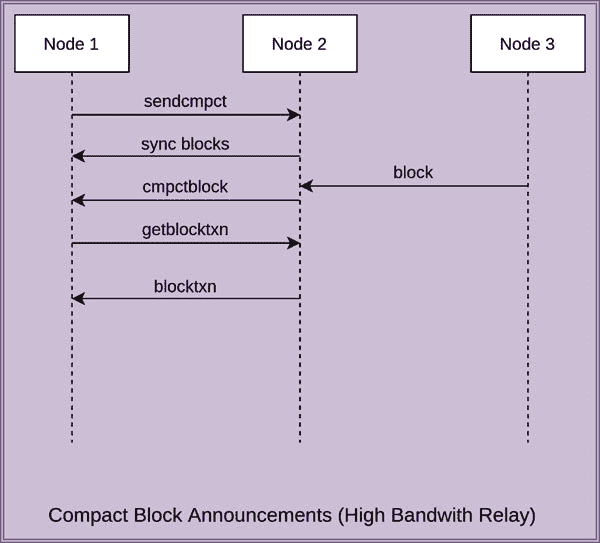

**图 7.35：** 高带宽传输的紧凑区块公告序列图

在接收到`**sendcmpct**`请求，无论是隔离见证交易还是非隔离见证交易后，我们会发送一个`**getheaders**`请求，带上最近区块和创世区块的列表，并与对等节点同步，就像在前一子主题**同步区块**中做的那样。

一旦对等节点意识到我们拥有区块链中所有区块，而这些区块是它认为的最佳区块链，我们就可以准备好从对等节点接收新区块。请注意，我们的最佳区块链可能与对等节点的最佳区块链不同，因为我们将从多个对等节点接收区块。最佳区块链意味着累积工作量证明最高的链。这可以通过将链中每个区块记录的难度相加来计算。难度调整每 2016 个区块后发生一次，所以累积工作量证明最高的链通常是区块数更多的链。

当节点接收到一个新的区块时，它会发送一个包含该区块中所有交易的压缩或短 ID 的 `**cmpctblock**` 消息。为了解析和生成短 ID，我们需要安装以下 Python 包：

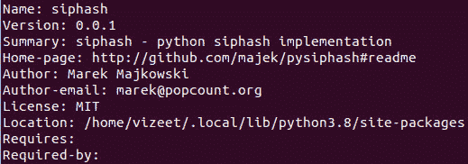

**图 7.36：** 用于生成和解析短 ID 的 pip 包

以下是 `**cmpctblock**`、`**getblocktxn**` 和 `**blocktxn**` 消息的结构：

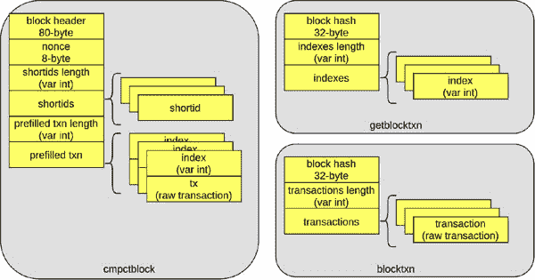

**图 7.37：** cmpctblock、getblocktxn 和 blocktxn 的载荷结构

以下是这些消息载荷的详细信息：

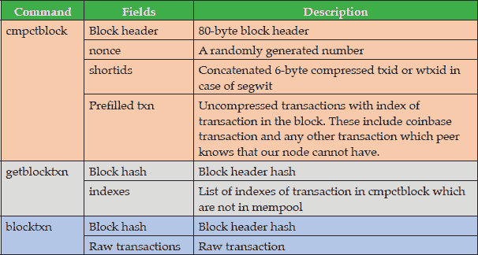

**表 7.4：** 紧凑消息列表及其描述

在以下代码中，连接已经建立，现在我们正在发送和处理接收新区块所需的请求：

`def parseShortIds(payload_m: mmap, shortids_len: int):`

`shortids = []`

`for i in range(shortids_len):`

`shortids.append(payload_m.read(6).hex())`

`return shortids`

`def parsePrefilledTxn(payload_m: mmap, prefilledtxn_len: int):`

`prefilledtxn_l = []`

`for i in range(prefilledtxn_len):`

`prefilledtxn = {}`

`prefilledtxn[‘index’] = getVarInt(payload_m)`

`prefilledtxn[‘tx’] = parseTxPayload(payload_m)`

`prefilledtxn_l.append(prefilledtxn)`

`return prefilledtxn_l`

`def parseCmpctBlockPayload(payload_m: mmap, payloadlen = 0):`

`payload = {}`

`pos = payload_m.tell()`

`payload[‘hdr_nonce’] = payload_m.read(88).hex()`

`payload_m.seek(pos)`

`payload[‘header’] = parseBlockHeader(payload_m)`

`payload[‘nonce’] = payload_m.read(8)[::-1].hex()`

`payload[‘shortids_length’] = getVarInt(payload_m)`

`payload[‘shortids’] = parseShortIds(payload_m, payload[‘shortids_length’])`

`payload[‘prefilledtxn_length’] = getVarInt(payload_m)`

`payload[‘prefilledtxn’] = parsePrefilledTxn(payload_m, payload[‘prefilledtxn_length’])`

`return payload`

`def parseBlockTxnPayload(payload_m: mmap, payloadlen = 0):`

`payload = {}`

`payload[‘blkhash’] = payload_m.read(32)[::-1].hex()`

`payload[‘txn_len’] = getVarInt(payload_m)`

`payload[‘txn’] = []`

`for i in range(payload[‘txn_len’]):`

`txn = parseTxPayload(payload_m)`

`payload[‘txn’].append(txn)`

`return payload`

`def createSendCompactPayload(announce: int, version: int):`

`announce_b = struct.pack(‘<B’, announce)`

`version_b = struct.pack(‘<Q’, version)`

`payload = announce_b + version_b`

`return payload`

`def createHeadersPayloadNoHeaders():`

`cnt_b = setVarInt(0)`

`headers_b = b’’`

`payload = cnt_b + headers_b`

`return payload`

`def createGetBlockTxnPayload(payload: dict, shortIDs_index_l: list):`

`hdr_b = bytes.fromhex(payload[‘hdr_nonce’])[0:80] #header`

`blkhash_b = hashlib.sha256(hashlib.sha256(hdr_b).digest()).digest()`

`print(‘blkhash = %s’ % blkhash_b[::-1].hex())`

`indexes_len_b = setVarInt(len(shortIDs_index_l))`

`indexes_b = b’’`

`for shortIDs_index in shortIDs_index_l:`

`indexes_b += setVarInt(shortIDs_index)`

`payload = blkhash_b + indexes_len_b + indexes_b`

`return payload`

`def sendSendCompactMessage(s: socket):`

`# send sendcmpct message for Segwit`

`sndcmd = ‘sendcmpct’`

`payload = createSendCompactPayload(1, 2)`

`sndmsg = createMessage(sndcmd, payload)`

`s.send(sndmsg)`

`print(‘==> cmd = %s, msg = %s’ % (sndcmd, sndmsg.hex()), file=flog)`

`# send sendcmpct message for others`

`sndcmd = ‘sendcmpct’`

`payload = createSendCompactPayload(1, 1)`

`sndmsg = createMessage(sndcmd, payload)`

`s.send(sndmsg)`

`print(‘==> cmd = %s, msg = %s’ % (sndcmd, sndmsg.hex()), file=flog)`

`def sendHeadersMessage(s: socket):`

`# send header message`

`sndcmd = ‘headers’`

`payload = createHeadersPayloadNoHeaders()`

`sndmsg = createMessage(sndcmd, payload)`

`s.send(sndmsg)`

`print(‘==> cmd = %s, msg = %s’ % (sndcmd, sndmsg.hex()), file=flog)`

`def convertTxIDs2ShortIDs(payload: dict, txid_l: list):`

`hdr_nonce_b = bytes.fromhex(payload[‘hdr_nonce’])`

`shortids_l = []`

`for txid in txid_l:`

`txid_b = bytes.fromhex(txid)[::-1]`

`h_b = hashlib.sha256(hdr_nonce_b).digest()[0:16]`

`sip = siphash.SipHash_2_4(h_b, txid_b)`

`siphash_b = sip.digest()`

`shortid = siphash_b[:-2].hex()`

`shortid_l = siphash_b[2:].hex()`

`shortids_l.append(shortid)`

`return shortids_l`

`def findMissingShortIDs(payload: dict):`

`for i in range(len(mempool_l_g)):`

`stored_mempool = mempool_l_g[-1-i]`

`txid_l = []`

`for k, v in stored_mempool.items():`

``if ‘wtxid’ in v:``

`txid_l.append(v[‘wtxid’])`

`else:`

`txid_l.append(k)`

`shortIDs = convertTxIDs2ShortIDs(payload, txid_l)`

`shortIDs_index_l = []`

`for recvd_shortID in payload[‘shortids’]:`

`if recvd_shortID not in shortIDs:`

`shortIDs_index_l.append(payload[‘shortids’].index(recvd_shortID) + 1)`

`if len(shortIDs_index_l) > 0:`

`break`

`return shortIDs_index_l`

`def waitForCmpctBlock(s: socket):`

`while True:`

`recvmsg = recvMsg(s)`

`if recvmsg[‘command’] == ‘cmpctblock’:`

`return recvmsg`

`elif recvmsg[‘command’] == ‘ping’:`

`sendPongMessage(s, recvmsg)`

`return recvmsg`

`def sendGetBlockTxn(s: socket, recvmsg: dict, shortIDs_index_l):`

`sndcmd = ‘getblocktxn’`

`payload = createGetBlockTxnPayload(recvmsg[‘payload’], shortIDs_index_l)`

`sndmsg = createMessage(sndcmd, payload)`

`s.send(sndmsg)`

`print(‘==> cmd = %s, msg = %s’ % (sndcmd, sndmsg.hex()), file=flog)`

`def waitForBlockTxn(s: socket):`

`while True:`

`recvmsg = recvMsg(s)`

`if recvmsg[‘command’] == ‘blocktxn’:`

`return recvmsg`

`elif recvmsg[‘command’] == ‘ping’:`

`sendPongMessage(s, recvmsg)`

`def waitAndHandleHeaderResponse(s: socket):`

`recvmsg = waitForCmpctBlock(s)`

`shortIDs_index_l = findMissingShortIDs(recvmsg[‘payload’])`

`if len(shortIDs_index_l) > 0:`

`sendGetBlockTxn(s, recvmsg, shortIDs_index_l)`

`waitForBlockTxn(s)`

`def sendrecvHeadersData(s: socket, version: int):`

`sendSendHeadersMessage(s)`

`sendSendCompactMessage(s)`

`blkhash_l = getBlockHashListFromCoreClient()`

`sendAndHandleGetHeaders(s, blkhash_l, version)`

`waitAndHandleHeaderResponse(s)`

`def sendrecvHandler(s: socket, version: int):`

`if establishConnection(s, version) == False:`

`print(‘Establish connection failed’, file=flog)`

`return`

`sendrecvHeadersData(s, version)`

**程序 7.14:** 用于接收和处理高带宽中继的紧凑消息的程序

我们执行了上述代码，并得到了以下的通信消息。我忽略了一些其他消息，比如 `**ping**` 或者 `**addr**` 或者 `**inv**`。

首先，我们发送了`**sendheaders**` 和 `**sendcpmct**` 以支持 segwit，以及 `**sendcmpct**` 以支持非 segwit：

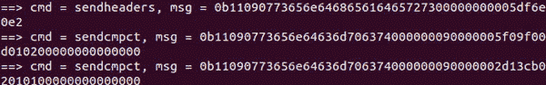

**图 7.38:** 我们节点发送给对等节点的消息，接受 segwit 和非 segwit 有效负载的紧凑消息

然后，我们发送了一个`**getheaders**`消息，并接收到了**headers**消息。以下是截断的`**getheaders**`消息和接收到的`***headers***`消息：

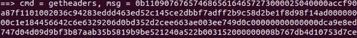

**图 7.39:** 向具有块哈希列表的对等节点发送截断的 getheaders 请求

我们收到响应中的一个头部列表，它是空的，如下面的传入消息所示：

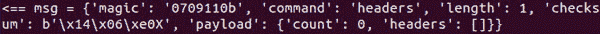

**图 7.40:** 对等节点响应时发送最近的头部列表，而不是在 getheaders 请求中

对等节点响应了`***headers***`消息，其中没有*headers*，计数为零。

接下来，我们等待对等节点发送一个`**cmpctblock**`消息。与此同时，我们收到了具有交易的`**inv**`消息。以下是截断的`**cmpctblock**`消息：

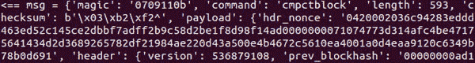

**图 7.41:** 在接收到新块时，对等节点发送 cmpctblock 消息

在接收到`**cmpctblock**`消息后，我们通过为每个`**txid**`和`**wtxid**`生成短 ID 来在 mempool 中搜索接收到的短 ID。如果有任何缺失的交易，我们就向在`**cmpctblock**`消息中缺失短 ID 的索引发送一个`**getblocktxn**`请求消息给对等节点。以下是我们发送的交易消息：

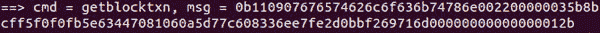

**图 7.42:** 我们的节点向具有缺失短 ID 索引列表的对等节点发送 getblocktxn 请求

在接收到`**getblocktxn**`*时，对等节点只发送了`**blocktxn**`消息，其中只包含在`**getblocktxn**`消息中接收到的缺失交易。以下是从对等节点接收到的截断的`**blocktxn**`消息：

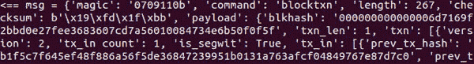

**图 7.43:** 对等节点响应包含缺失交易的 blocktxn 消息

# 低带宽紧凑块公告

以下是在主机与其对等节点之间交换消息的序列，以活动图的形式表示：

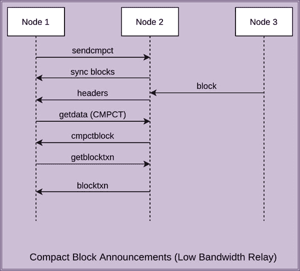

**图 7.44:** 低带宽中继的紧凑块公告序列图

在低带宽紧凑区块公告方法中，我们在`**sendcmpct**`消息中设置为 0，并为分离见证和非分离见证交易发送`**sendcmpct**`消息。一旦区块链同步，我们等待来自对等方的`**headers**`消息。作为对`***headers***`消息的回应，我们发送一个带有`**MSG_CMPCT_BLOCK**`作为响应的`**getdata**`消息。

以下代码执行此操作：

定义发送 SendCompactMessage 函数如下：

`# 发送 Segwit 的 sendcmpct 消息`

`sndcmd = ‘sendcmpct’`

`payload = createSendCompactPayload(0, 2)`

`sndmsg = createMessage(sndcmd, payload)`

``s.send(sndmsg)``

`print(‘==> cmd = %s, msg = %s’ % (sndcmd, sndmsg.hex()), file=flog)`

`# 发送其他情况的 sendcmpct 消息`

`sndcmd = ‘sendcmpct’`

`payload = createSendCompactPayload(0, 1)`

``sndmsg = createMessage(sndcmd, payload)``

``s.send(sndmsg)``

`print(‘==> cmd = %s, msg = %s’ % (sndcmd, sndmsg.hex()), file=flog)`

`定义创建 GetDataPayloadCMPCTBlock 函数如下：`

`MSG_CMPCT_BLOCK = 4`

`count = len(hash_l)`

``hash_count_b = setVarInt(count)``

`hashes_b = b’’`

`for i in range(count):`

`type_b = struct.pack(‘<L’, MSG_CMPCT_BLOCK)`

`hashes_b += type_b + bytes.fromhex(hash_l[i][‘blkhash’])[::-1]`

``payload_b = hash_count_b + hashes_b``

``return payload_b``

定义发送 GetDataMessage 函数如下：

`sndcmd = ‘getdata’`

`blk_l = recvmsg[‘payload’][‘headers’]`

``payload = createGetDataPayloadCMPCTBlock(blk_l)``

``sndmsg = createMessage(sndcmd, payload)``

``s.send(sndmsg)``

`print(‘==> cmd = %s, msg = %s’ % (sndcmd, sndmsg.hex()), file=flog)`

`定义等待并处理头部响应函数如下：`

``recvmsg = waitForHeaders(s)``

``sendGetDataMessage(s, recvmsg)``

``recvmsg = waitForCmpctBlock(s)``

`shortIDs_index_l = findMissingShortIDs(recvmsg[‘payload’])`

`if len(shortIDs_index_l) > 0:`

`sendGetBlockTxn(s, recvmsg, shortIDs_index_l)`

``waitForBlockTxn(s)``

定义发送接收处理函数如下：

`if establishConnection(s, version) == False:`

`print('建立连接失败', file=flog)`

``return``

``sendrecvHeadersData(s, version)``

**程序 7.15：** 用于接收和处理低带宽中继紧凑消息的程序

我们执行前述代码并获得通信日志。首先，我们的节点发送`**sendheader**`和`**sendcmpct**`消息，让对方知道我们的节点支持直接头部公告。当节点收到新的区块时，它会向我们的节点发送以下`***headers***`消息：

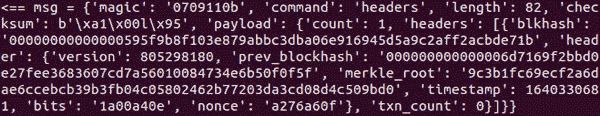

**图 7.45：** 从对等方接收到的包含区块哈希和头部的 headers 消息

我们用以下包含`**MSG_CMPCT_BLOCK**`标志和我们期望从对等方获取的区块哈希列表的`**getdata**`消息进行回复：

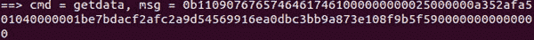

**图 7.46：** 向对等方发送包含区块哈希列表的 getdata 请求

对等方用以下包含区块头部和包含的交易的短 ID 列表的`**cmpctblock**`消息进行回复。

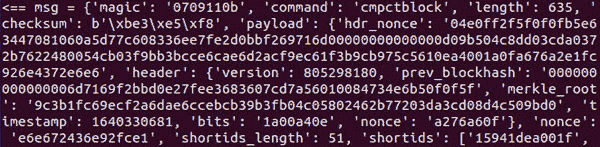

**图 7.47:** peer 发送 cmpctblock 消息，其中包含短 ID 列表

在接收到短 ID 和区块头的列表之后，我们的节点以下列 `**getblocktxn**` 消息响应 peer，其中包含表示我们节点 mempool 中缺失交易的短 ID 列表：

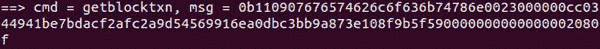

**图 7.48:** 向拥有缺失短 ID 索引的 peers 发送 getblocktxn 请求

然后，peer 用一个包含所需交易的 `**blocktxn**` 消息响应：

**图 7.49:** 拥有所需交易的 peers 发送 blocktxn 消息

这带我们结束了本章。

# 结论

在本章中，你首先学习了比特币网络拓扑，并了解到节点运行不同的版本，可能是不同类型的节点，如归档节点、修剪节点或 SPV 节点。你也了解到了节点如何找到连接到 peer 的地址，以及节点在首次与 peer 连接时如何获取所有区块，以及它是如何获取所有竞争的区块链分叉的。接下来，你又学习了节点如何将交易和区块消息广播给所有剩余的节点。我们没有涵盖 SPV 节点为接收所需交易和验证区块而进行的网络通信。我们也没有涵盖隔离见证交易。

在下一章中，你将了解技术的局限性，它对自然的影响，以及由于设计而存在的外潜在风险和漏洞。我们将彻底研究它们并评估它们是真实的、有风险的，还是只是一个神话。

# 需记住的要点

+   比特币是一个点对点的网络，需要一个 TCP 连接或一个 tor 网络来连接到一个 peer。

+   比特币网络是非层次化的，这意味着所有节点都是平等的，没有主节点或服务器。将会有 TCP 服务器，但不会有比特币网络服务器。

+   节点可以随时连接和断开，可以选择连接哪些节点。

+   节点需要一组初始地址，或者我们需要提供初始地址，以便它们可以与 peer 建立初始连接。

+   `**Version**` 消息是每个节点发送的第一个消息。如果一个节点对其在 `**version**` 消息中收到的信息感到满意，它将以 `**verack**` 响应。

+   一旦交换了 `**version**` 和 `**verack**` 消息，连接就被认为是建立起来了。在此之前，节点不会接收任何其他消息。

+   节点可以随时向一个 peer 发送 `**ping**` 消息，以了解 peer 是否仍然连接。

+   节点应该通过在本地存储活动地址并从其 peer 请求新地址来减少对硬编码 DNS 种子的依赖。

+   一个节点首次启动时，它会获取直到 24 小时前的所有区块头的列表。在收到它们之后，它需要从所有连接的节点获取头部，以获取所有竞争的链。

+   一旦节点的区块链与所有对等节点同步，它就可以准备接收新区块和交易。

# 问题

1.  我们如何理解对等节点正在发送比特币区块或不同网络的区块？

1.  为什么节点需要从多个对等节点接收最近的区块？

1.  初始区块下载方法与区块链同步有何不同？

1.  您认为在什么情况下我们应该使用精简节点而不是归档节点？

1.  节点何时发送`***sendheaders***`和`***sendcmpct***`消息？

1.  编程问题：

    1.  编写一个程序，与多个对等节点连接并向另一个对等节点发送一个地址。

    1.  编写一个程序，接收多个 TCP 连接并限制活动连接数。

    1.  编写一个程序，将区块传递给其他已连接节点。

    1.  使用 Bitcoin Core 钱包创建一个原始交易，并使用您自己的程序发布它。

1.  真/假：

    1.  节点响应发送方的`***cmpctblock***`消息是必要的。

    1.  交易`***inv***`消息需要节点的区块链与对等节点的区块链同步。

    1.  在初始区块下载过程中，我们向多个对等节点发送`***getdata***`请求以提高下载性能。

1.  填空：

    1.  在高带宽紧凑区块公告中，节点在接收到区块后发送 _________ 消息，而不是 _________ 消息。

    1.  `***inv***`消息不再用于广播 _________。

    1.  无请求的区块推送方法仅由 _______ 节点用来发布 __________。
