# 第九章

# 钱包和地址

在上一章中，我们研究了比特币作为一个网络协议，它的优势使它成为一项伟大的技术革新，以及它的局限性和对其长期存在构成风险的条件。

在本章中，您将学习如何访问您的比特币，将它们发送到单个或多个地址，并执行各方之间的智能合约。

要访问你的比特币，你需要一个软件程序，它可以为接收比特币生成地址，并且该软件可以签署交易，以便将其转让给接收方。这个软件程序称为**钱包**。本章重点介绍私钥、公钥、地址和钱包。我们将在下一章详细介绍交易和交易签署。交易签署也是钱包功能的一个重要组成部分。因此，一个钱包有三个基本功能：

+   它提供了你持有的比特币信息。

+   它提供地址以接收比特币。

+   它帮助签署交易，以便可以在网络上发布。

钱包可以从多种方式进行分类。以下根据使用媒介的类型，是钱包的分类：

+   **移动钱包：**这些安装在手机上。一些著名的有 Electrum、Mycelium、Samourai 等。

+   **桌面钱包：**这些安装在桌面上。一些著名的有比特币核心、Armory、Electrum 等。

+   **硬件钱包：**这些都是专注于安全性的独立硬件设备，被认为能提供更好的安全性。两家公司主要主导这个市场：Ledger Nano 和 Trezor。

除了前面提到的钱包类型，大多数交易所也提供钱包服务。

钱包还可以根据密钥的类型进行如下分类：

+   **确定性钱包：**这些钱包允许用户使用种子确定性地生成密钥。这些钱包不需要存储密钥，因此可以从黑客攻击中安全，也可以从丢失密钥的风险中安全。

+   **非确定性钱包：**这些钱包存储密钥集合。这些也被称为**只是一堆密钥（JBOK）**。

钱包还可以根据热钱包和冷钱包进行分类：

+   **冷钱包**将私钥存储在离线上，交易签署也在离线进行，这使得它们非常安全。硬件钱包是冷钱包的例子。

+   **热钱包**加密私钥但将其保持在线上。这些钱包也在线签署交易。大多数移动和桌面钱包都是在线钱包。比特币核心提供了一个在线钱包。

在本章中，我们将构建一个确定性钱包。在下一章中，您将学习如何离线使用该钱包签署交易。

***** 不要在任何地方使用本书中使用的私钥或助记词。你的比特币会被盗 *****

# **结构](toc.xhtml#s192a)**

在本章中，我们将涵盖以下主题：

+   助记词代码

+   私钥、公钥和地址的格式和生成

    +   私钥

    +   公钥

    +   地址

+   分层确定性（HD）钱包

    +   掌握密钥生成

    +   密钥导出

        +   父私钥 -> 子私钥

        +   父公钥 -> 子公钥

        +   子私钥 -> 父私钥（钱包私钥泄露）

        +   导出硬化子密钥

    +   扩展密钥

        +   主扩展公钥和私钥

        +   扩展公钥和私钥

    +   密钥导出路径

# 目标

本章的目标是帮助您理解钱包、公钥、私钥以及比特币地址在功能和实现方面的知识。

我们将讨论钱包的功能。此外，您将了解对它们进行分类的不同方法，并学会创建自己的分层确定性钱包和生成它们的种子。您还将学习与钱包相关的安全知识。

本章还涵盖了私钥、公钥和地址的格式，并且您还将学会生成它们。

# 助记词代码

为了创建一个确定性的钱包，您首先需要学会生成一个随机种子。这个种子将帮助您生成私钥和公钥对。您选择的自然随机数决定了私钥相对于暴力破解或基于知识攻击的安全性。一个好的随机数确实是随机的，这意味着它不遵循攻击者可以确定的模式。此外，生成最好是良好的分布，这意味着如果我们继续在一个有限域上生成它，那么在很长一段时间后，这个有限域非常良好地分布，没有大量的密度区域，并且不是非常均匀。因此，随机数需要同时保护免受暴力攻击和推断模式的智能攻击。这需要选择正确的随机性来源，也称为*熵源*。这主要来自硬件来源，如风扇噪音或鼠标移动。我们也可以将背景噪音作为熵源。

我们将实现一个程序，使用 BIP 39 生成随机种子。

链接：**[`github.com/bitcoin/bips/blob/master/bip-0039.mediawiki`](https://github.com/bitcoin/bips/blob/master/bip-0039.mediawiki)**

文档描述了生成种子的方法，它由 12/18/24 个常见的英文单词组成。这个单词集合不仅仅是随机序列，还包括校验和，因此，不遵循 BIP 中描述的方法是无法随机生成的。

共有 2048 个助记词用于生成种子，相当于 11 位。助记词的完整列表可以在**[`github.com/bitcoin/bips/blob/master/bip-0039/english.txt`](https://github.com/bitcoin/bips/blob/master/bip-0039/english.txt)**找到。

如果我们准备 12 个单词的助记词，我们需要 11*12 位，共 132 位。

132 位由一个 128 位的随机数和 4 位作为其校验和组成。

我们将随机数中的位称为熵位。以下是获取 12 个单词助记种子的过程示意图：

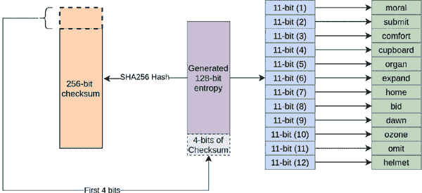

**图 9.1：** 从熵生成助记码的示意图

使用以下公式计算所需位数：

*熵位数量 = 助记词数量 * 32 / 3*

这里是**checksum_bit_count**的公式：

*校验位数量 = 助记词数量 / 3*

这是获取**checksum_bit_count**和**entropy_it_count**的代码：

`def getChecksumBitCount(mnemonic_length: int):`

`if (mnemonic_length % 3) != 0:`

`raise ValueError('无效的助记码长度')`

`checksum_bit_count = mnemonic_length // 3`

`return checksum_bit_count`

`def getEntropyBitCount(mnemonic_length: int):`

`if (mnemonic_length % 3) != 0:`

`raise ValueError('无效的助记码长度')`

`entropy_bit_count = (mnemonic_length * 32) // 3`

`return entropy_bit_count`

**程序 9.1：** 从助记种子长度获取校验位数量和熵位数量的程序

以下是生成熵位的代码：

`def getRandomNumberBits(bit_count: int):`

`r = random.SystemRandom().randrange(0, 1 << 32)`

`r_b = r.to_bytes((r.bit_length() + 7) // 8, 'big')`

`h = hashlib.sha256()`

`h.update(r_b)`

`h_b = h.digest()`

`byte_count = bit_count // 8`

`rand_num_b = h_b[0:byte_count]`

`return rand_num_b`

**程序 9.2：** 生成随机数的程序

然后，我们将校验位附加到随机数位。以下是生成位的代码：

`def getMSBChecksumBits(checksum: int, checksum_bit_count: int):`

`msb_checksum = checksum >> (256 - checksum_bit_count)`

`return msb_checksum`

`def getEntropyWithChecksum(random_number: int,`

`msb_checksum: int,`

`checksum_bit_count: int):`

`shifted_random_number = random_number << checksum_bit_count`

`entropy_check_i = shifted_random_number | msb_checksum`

`return entropy_check_i`

`def convertIntToBytes(num: int, bit_count: int):`

`size_bytes = math.ceil(bit_count / 8)`

`num_s = (‘%x’ % num).zfill(size_bytes * 2)`

`num_b = bytes.fromhex(num_s)`

`return num_b`

`def getChecksum(b: bytes):`

`return int.from_bytes(hashlib.sha256(b).digest(), byteorder=’big’)`

`def getEntropyCheckBits(mnemonic_length: int):`

`entropy_bit_count = getEntropyBitCount(mnemonic_length)`

`random_number_b = getRandomNumberBits(entropy_bit_count)`

`checksum_bit_count = getChecksumBitCount(mnemonic_length)`

`checksum = getChecksum(random_number_b)`

`msb_checksum = getMSBChecksumBits(checksum, checksum_bit_count)`

`random_number = int.from_bytes(random_number_b, byteorder=’big’)`

`entropy_check_i = getEntropyWithChecksum(random_number, msb_checksum, checksum_bit_count)`

`bit_count = entropy_bit_count + checksum_bit_count`

`entropy_check_b = convertIntToBytes(entropy_check_i, bit_count)`

`return entropy_check_b`

**程序 9.3：** 附加了校验和的熵位获取程序

在此之后，我们需要使用这些位来从 2048 个助记词列表中选择单词。这通过将**entropycheck 位**分成 11 位列表来实现。以下是执行此操作的代码：

`def getMnemonicWordList():`

`word_list = []`

`with open(‘mnemonic_word_list_english.txt’, ‘rt’) as word_file:`

`word_list = word_file.read().splitlines()`

`return word_list`

`def entropyCheckBits2List(entropy_check_b: bytes, size: int):`

`selector_int = int.from_bytes(entropy_check_b, byteorder=’big’)`

`selector_list = []`

`while size >= 11:`

`selector_list.append(selector_int & 0x07FF)`

`selector_int = selector_int >> 11`

`size -= 11`

`return selector_list[::-1]`

`def getMnemonicWordCodeString(mnemonic_length: int):`

`entropy_bit_count = getEntropyBitCount(mnemonic_length)`

`checksum_bit_count = getChecksumBitCount(mnemonic_length)`

`entropy_check_bit_count = entropy_bit_count + checksum_bit_count`

`entropy_check_b = getEntropyCheckBits(mnemonic_length)`

`selector_list = entropyCheckBits2List(entropy_check_b,`

`entropy_check_bit_count)`

`mnemonic_word_list = getMnemonicWordList()`

`word_key_list = []`

`for selector in selector_list:`

`word = mnemonic_word_list[selector]`

`word_key_list.append(word)`

`return word_key_list`

**程序 9.4：生成助记词单词代码列表的程序**

在本子主题中，您学习了生成助记词种子。您可以使用它生成 12、18 或 24 个单词的助记词种子。这里有一个权衡：24 个单词的种子提供更多的安全性，但比 12 个或 18 个单词的代码更难记住。在下一节中，我们将讨论私钥、公钥以及比特币使用的地址格式。

# **私钥、公钥和地址的格式和生成**

在本子主题中，您将了解私钥和地址的格式，并学习如何生成它们。

# **私钥**

私钥可以是几乎任何 256 位值。它们可以在*0x1*到*0xFFFF FFFF FFFF FFFF FFFF FFFF FFFF FFFE BAAE DCE6 AF48 A03B BFD2 5E8C D036 4140*之间。

私钥以**钱包导入格式（WIF）**表示。这是带有前缀和校验和的 base58 格式。

Base58 方案定义在以下文档中：

**[`tools.ietf.org/id/draft-msporny-base58-01.html`](https://tools.ietf.org/id/draft-msporny-base58-01.html)**

公钥可以压缩或展开。压缩和展开的公钥会导致不同的地址，因此私钥必须包含有关它将生成的公钥是压缩还是展开的信息。为了生成私钥的 WIF 格式，我们需要在 WIF 格式中了解关于硬币、网络和压缩的信息，以便生成的地址属于特定的网络且是确定的。

以下是要提供的 prefix 信息：

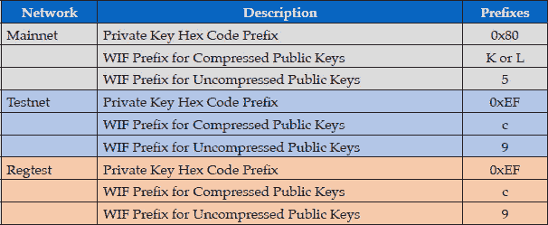

**表 9.1：私钥前缀**

如前所示，regtest 使用与 testnet 相同的私钥前缀。

为了为压缩的公钥生成 WIF 格式，我们将 b’\01’ 添加为生成的私钥的后缀。

Base58 编码字符串由以下字符组成：

*123456789ABCDEFGHJKLMNPQRSTUVWXYZabcdefghijkmnopqrstuvwxyz*

如其名称所示，有 58 个字符。为了获取编码字符串，我们迭代地将数字除以 58，并在每一步将余数转换为 base58 字符，然后连接编码字符以获得最终编码字符串。

以下插图展示了为测试网获取 WIF 编码的私钥的逻辑：

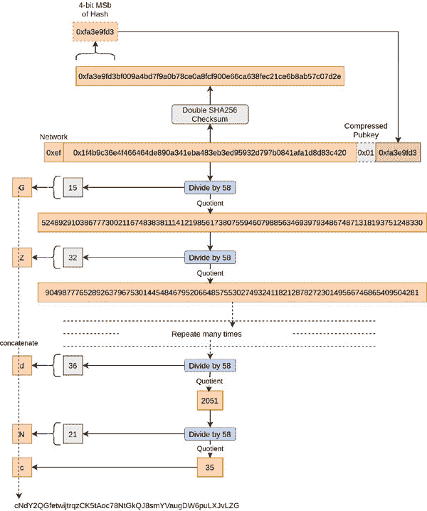

**图 9.2：** WIF 编码方法的图示

以下程序将一个数字编码为 base58 字符串：

`g_alphabet=’123456789ABCDEFGHJKLMNPQRSTUVWXYZabcdefghijkmnopqrstuvwxyz’`

`g_base_count = len(g_alphabet)`

`def hash256(bstr: bytes):`

`return hashlib.sha256(hashlib.sha256(bstr).digest()).digest()`

`def base58_encode(num: int):`

`encode = ‘’`

`if (num < 0):`

`return ‘’`

`while (num >= g_base_count):`

`mod = num % g_base_count`

`encode = g_alphabet[mod] + encode`

`num = num // g_base_count`

`if (num >= 0):`

`encode = g_alphabet[num] + encode`

`return encode`

**程序 9.5：** 将数字编码为 Base58 字符串的程序

以下程序在将数字进行 Base58 编码之前，在数字后缀四个字节的校验和，以生成 Base58check 编码：

`def base58checkEncode(prefix: bytes, b: bytes):`

`with_prefix = prefix + b`

`with_checksum = with_prefix + hash256(with_prefix)[0:4]`

`val = int.from_bytes(with_checksum, byteorder=’big’)`

`encode = base58_encode(val)`

`if prefix == b’\x00’:`

`encoded_prefix = base58_encode(0)`

`encode = encoded_prefix + encode`

`return encode`

**程序 9.6：** 将数字编码为 Base-58-Check-Encode 的程序

以下程序将私钥十六进制代码转换为 WIF 格式。它接受私钥的十六进制代码和一个布尔值，表示该密钥是否应用于生成压缩的公钥：

`PRIVKEY_PREFIX_MAINNET=0x80`

`WIF_PREFIX_MAINNET_COMPRESSED=[‘L’, ‘K’]`

`WIF_PREFIX_MAINNET_UNCOMPRESSED=[‘5’]`

`PRIVKEY_PREFIX_TESTNET=0xEF`

`WIF_PREFIX_TESTNET_COMPRESSED=[‘c’]`

`WIF_PREFIX_TESTNET_UNCOMPRESSED=[‘9’]`

`def encodeWifPrivkey(privkey: int, for_compressed_pubkey: bool):`

`prefix_b = bytes.fromhex(‘%02x’ % PRIVKEY_PREFIX_TESTNET)`

`privkey_b = bytes.fromhex(‘%064x’ % privkey)`

`if for_compressed_pubkey == True:`

`privkey_b = privkey_b + b’\01’`

`wif_encoded = base58checkEncode(prefix_b, privkey_b)`

`return wif_encoded`

**程序 9.7：** 生成 WIF 编码私钥的方法

我们称这种方法为压缩公钥的方法：

`if __name__ == ‘__main__’:`

`h = 0x1f4b9c36e4f466464de890a341eba483eb3ed95932d797b0841afa1d8d83c420`

`wif = encodeWifPrivkey(h, True)`

`print(wif)`

我们得到以下结果：

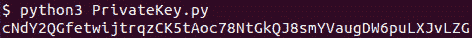

**图 9.3：** 显示了生成的压缩公钥的 WIF 编码私钥

我们称其为未压缩公钥时的方法：

`if __name__ == ‘__main__’:`

`h = 0x1f4b9c36e4f466464de890a341eba483eb3ed95932d797b0841afa1d8d83c420`

`wif = encodeWifPrivkey(h, False)`

`print(wif)`

我们得到以下结果：

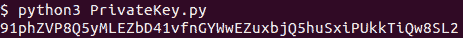

**图 9.4：** 显示了未压缩公钥的生成的 WIF 编码私钥

# 公钥

一个私钥通常以 WIF 编码表示。我们使用 WIF 编码的私钥来生成公钥和地址。要从 WIF 编码的私钥生成公钥，我们需要将私钥转换回十六进制代码。我们使用 WIF 编码字符串而不是十六进制代码的原因是尺寸。私钥被表示为 64 位十六进制代码或 53 个字符的字符串。因此，使用 WIF 编码意味着少输入 11 位数字。

首先，我们解码 WIF 字符串，以及解码的十六进制编码的私钥，我们还得到它是用于测试网还是主网以及它是用于压缩公钥还是未压缩公钥。这是解码 WIF 字符串的代码：

`def base58_decode(s: str):`

`decoded = 0`

`multi = 1`

`s = s[::-1]`

`for char in s:`

`decoded += multi * g_alphabet.index(char)`

`multi = multi * g_base_count`

`return decoded`

`def base58checkDecode(s: str):`

`with_checksum_int = base58_decode(s)`

`with_checksum_b = bytes.fromhex(‘%x’ % with_checksum_int)`

`decode_b = with_checksum_b[1:-4]`

`return decode_b`

`def base58checkVerify(wif: str):`

`decoded_wif = base58_decode(wif)`

`wif_str = ‘%02x’ % decoded_wif`

`if len(wif_str) % 2 == 1:`

`wif_str = ‘0’ + wif_str`

`postfix = bytes.fromhex(wif_str)[-4:]`

`wif_without_postfix = bytes.fromhex(wif_str)[0:-4]`

`h = hash256(wif_without_postfix)[0:4]`

`if h == postfix:`

`return True`

`return False`

`def getNetworkNCompression(wif_prefix: str):`

`if wif_prefix in WIF_PREFIX_MAINNET_COMPRESSED:`

`return ‘mainnet’, True`

`elif wif_prefix in WIF_PREFIX_MAINNET_UNCOMPRESSED:`

`return ‘mainnet’, False`

`elif wif_prefix in WIF_PREFIX_TESTNET_COMPRESSED:`

`return ‘testnet’, True`

`elif wif_prefix in WIF_PREFIX_TESTNET_UNCOMPRESSED:`

`return ‘testnet’, False`

`def privkeyWif2Hex(privkey_wif: str):`

`assert base58checkVerify(privkey_wif)`

`wif_prefix = privkey_wif[0:1]`

`network, compress = getNetworkNCompression(wif_prefix)`

`privkey_b = base58checkDecode(privkey_wif)`

`privkey_i = int.from_bytes(privkey_b, byteorder='big')`

`if compress == True:`

`privkey_s = '%066x' % privkey_i`

`else:`

`privkey_s = '%064x' % privkey_i`

`return privkey_s, network, compress`

**程序 9.8：** 将私钥编码为 WIF 编码方案的程序

比特币私钥公钥加密基于**椭圆曲线数字签名算法（ECDSA）**。**椭圆** c**urve** d**igital** s**ignature** a**lgorithm** 使用椭圆曲线密码学。正如名称所示，椭圆曲线是以下方程的几何表示：

*y² = x³+ ax + b*

椭圆曲线密码学基于有限域上的椭圆曲线，也称为**伽罗瓦场**。伽罗瓦场可以是素域或二元域。比特币使用了一个特定的椭圆曲线，即有限素域上的*secp256k1*。以下是 *secp256k1* 的方程：

*y² = x² + ax + b*

这里

p = 2²⁵⁶ - 2³² - 2⁹ - 2⁸ - 2⁷ - 2⁶ - 2⁴-1

p = 0xfffffffffffffffffffffffffffffffffffffffffffffffffffffffefffffc2f

还有一个名为**生成点**的变量，其值为：

`G = (79BE667E F9DCBBAC 55A06295 CE870B07 029BFCDB 2DCE28D9 59F2815B 16F81798, 483ADA77 26A3C465 5DA4FBFC 0E1108A8 FD17B448 A6855419 9C47D08F FB10D4B8)`

我们在 Python 中使用 ecdsa 包从私钥十六进制代码生成公钥。一旦 WIF 私钥被解码，我们使用 ecdsa *包。* e*cdsa* 包使用签名密钥表示私钥，使用验证密钥表示公钥。

下面是我们在中使用的 ecdsa 包：

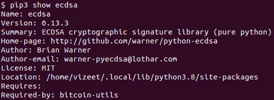

**图 9.5：** pip3 包关于已安装 ecdsa 包的信息

我们还使用 cryptotools 包执行与 secp256k1 相关的操作。以下程序将 WIF 编码的私钥转换为公钥：

`from ecdsa import SigningKey, SECP256k1`

`def compressPubkey(pubkey: bytes):`

`x_b = pubkey[1:33]`

`y_b = pubkey[33:65]`

`if (y_b[31] & 0x01) == 0: # even`

`compressed_pubkey = b’\x02’ + x_b`

`else:`

`compressed_pubkey = b’\x03’ + x_b`

`return compressed_pubkey`

`def privkeyHex2pubkey(privkey_s: str, compress: bool):`

`if compress == True:`

`privkey_s = privkey_s[0:64]`

`privkey_b = bytes.fromhex(privkey_s)`

`sk = SigningKey.from_string(privkey_b, curve=SECP256k1)`

`vk = sk.get_verifying_key()`

`pubkey_b = b’\x04’ + vk.to_string()`

`if compress == True:`

`pubkey_b = compressPubkey(pubkey_b)`

`return pubkey_b`

`def privkeyWif2pubkey(privkey: str):`

`privkey_s, network, compress = privkeyWif2Hex(privkey)`

`pubkey = privkeyHex2pubkey(privkey_s, compress)`

`return pubkey`

**程序 9.9：** 从 WIF 编码的私钥获取公钥的程序

在上述代码中，b’\x04’是未压缩公钥的前缀，b’\x02’和 n’\x03’被用作压缩公钥的前缀。

我们通过执行以下代码调用上述程序：

`if __name__ == ‘__main__’:`

`privkey_wif = ‘cNdY2QGfetwijtrqzCK5tAoc78NtGkQJ8smYVaugDW6puLXJvLZG’`

`print(‘privkey(WIF) = ‘, privkey_wif)`

`privkey_s, network, compress = privkeyWif2Hex(privkey_wif)`

`pubkey_b = privkeyWif2pubkey(privkey_wif)`

`print(‘pubkey = %s’ % pubkey_b.hex())`

`print(‘-----------------------------------------------------------’)`

`privkey_wif = ‘91phZVP8Q5yMLEZbD41vfnGYWwEZuxbjQ5huSxiPUkkTiQw8SL2’`

`print(‘privkey(WIF) = ‘, privkey_wif)`

`privkey_s, network, compress = privkeyWif2Hex(privkey_wif)`

`pubkey_b = privkeyWif2pubkey(privkey_wif)`

`print(‘pubkey = %s’ % pubkey_b.hex())`

我们得到了以下公钥：

**Figure 9.6:** 显示从 WIF 编码的私钥生成的公钥

# 地址

当商家或交易者要求以他们的服务或产品兑换比特币时，他们会提供他们的比特币地址。我们将请求的比特币转到他们的地址，并将剩余的任何找零保存到另一个地址。在本子主题中，我们将了解并从公钥生成地址。

以下插图展示了如何生成公钥哈希地址：

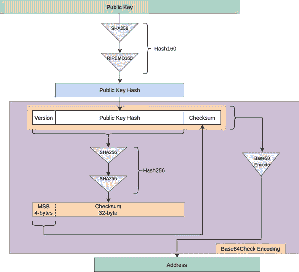

**Figure 9.7:** 地址生成机制的说明

公钥到地址的转换是一个两步过程。在第一步，我们计算公钥的哈希，即***PKH*** 或 **公钥哈希**。在第二步，我们使用 base58check 算法编码 PKH。使用校验和的一个重要好处是，几乎不可能在生成有效地址时犯打字错误。这是比特币的一个重要安全特性。助记符代码也使用 base58check 算法，并提供相同的好处。顺序放错，或者放错或重复的词几乎不会导致资金损失。

使用哈希 160 和地址代替公钥可以提供增强的安全性。如果将来量子计算机能够将公钥翻译成私钥，那么哈希公钥仍然会是安全的。所以，除非我们暴露了我们的公钥，我们的比特币仍然会是安全的。这对于几乎互联网上的所有事物来说都是重要的，因为公钥私钥加密的崩溃将导致混乱。

可以使用脚本代替公钥。在这种情况下，在前面的图中公钥被脚本替换。公钥地址被称为**Pay-to-Public-Key-Hash** 或 **P2PKH** 地址，而脚本地址被称为 **Pay-to-Script-Hash** 或 **P2SH** 地址。

以下表格列出了与网络和地址类型相关的版本前缀：

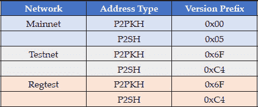

**Table 9.2:** 地址前缀表

在前面的表中，我们可以看到`**testnet**` *和* `**regtest**` 使用相同的版本前缀。

以下程序将公钥转换为地址：

`PKH_MAINNET_PREFIX = 0x00`

`SH_MAINNET_PREFIX = 0x05`

`PKH_TESTNET_PREFIX = 0x6F`

`SH_TESTNET_PREFIX = 0xC4`

`PKH_REGTEST_PREFIX = 0x6F`

`SH_REGTEST_PREFIX = 0xC4`

`def hash160(secret: bytes):`

`secrethash = hashlib.sha256(secret).digest()`

`h = hashlib.new(‘ripemd160’)`

`h.update(secrethash)`

`secret_hash160 = h.digest()`

`return secret_hash160`

`def pkh2address(pkh: bytes):`

`prefix = PKH_TESTNET_PREFIX`

`address = base58checkEncode(bytes.fromhex(‘%02x’ % prefix), pkh)`

`return address`

`def sh2address(sh: bytes):`

`prefix = SH_TESTNET_PREFIX`

`address = base58checkEncode(bytes.fromhex(‘%02x’ % prefix), pkh)`

`return address`

`def pubkey2address(pubkey: bytes):`

`pkh = hash160(pubkey)`

`address = pkh2address(pkh)`

`return address`

**Program 9.10:** 将公钥转换为地址的程序

我们用以下程序调用前面的方法，以获取压缩和未压缩公钥生成的地址：

`if __name__ == ‘__main__’:`

`pubkey = ‘0240bb63da114aa89f4d2cf35d695d3e52e6add7a4bae06f190d947bef5c62b5e0’`

`pubkey_b = bytes.fromhex(pubkey)`

`print(‘Compressed PubKey = ‘, pubkey_b.hex())`

`address = pubkey2address(pubkey_b)`

`print(‘Address = ‘, address)`

`print(‘-----------------------------------------------’)`

`pubkey = ‘0440bb63da114aa89f4d2cf35d695d3e52e6add7a4bae06f190d947bef5c62b5e0e99601851593a9e54e2059a25d76512698acf60089935dedc015f1bb2bc81eda’`

`pubkey_b = bytes.fromhex(pubkey)`

`print(‘Uncompressed PubKey = ‘, pubkey_b.hex())`

`address = pubkey2address(pubkey_b)`

`print(‘Address = ‘, address)`

我们得到了以下结果：

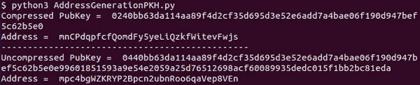

**图 9.8：** 显示了从公钥生成的地址

# 分层确定性（HD）钱包

在早期版本中，钱包是一个存储在文件中的私钥和公钥对的集合。这个文件需要备份多次，并在多个地方加以保护。这很繁琐，并且在最初几年导致了很多人丢失硬币。然而，有一个优点：由于这些不是从一个单一的种子生成的，意外暴露秘密不会导致在派生地址中丢失所有硬币。这些都是非确定性钱包。

这种方法的替代方案是确定性钱包，它们使用一个单一的种子和一个索引生成。分层确定性钱包需要一个表示键的层次结构的字符串，而不是索引值。这使得从一个单一的种子生成大量的键成为可能。此外，它通过在层次结构中选择不同的层次位置，为不同目的提供了一种分组地址的方法。

分层确定性钱包使用 12 个、18 个或 24 个单词的助记词，这使得更容易记住种子，同时提供与任何复杂密码相似的安全性。记住和输入 12 个单词更容易。如果钱包需要每次都输入它们，或者你不想把它们写在纸上，这很有用。24 个单词的代码更安全，在大多数情况下都推荐使用。

使用如 BIP32 所定义的确定性钱包，可以在需要时更容易地生成私钥和公钥对，或者只生成公钥。这消除了对钱包的物理形式的需求。因此，在旅行和消费或交易时，我们可以根据需要生成地址和私钥。我们仍然有不小心暴露助记词并失去所有储蓄的风险，但如果我们总是离线生成键或地址，我们可以几乎消除这种风险。有专门的设备叫做硬件钱包，它们就是这么做的，因此，被认为是存储比特币的最佳方式。

下面的图表说明了使用 BIP32 规范进行分层确定性钱包的 mnemonic 代码词列表生成密钥：

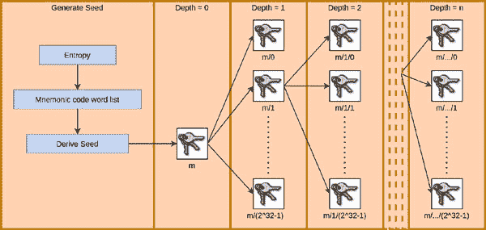

**图 9.9：** 使用 Mnemonic 代码词列表生成密钥的说明

BIP32 规范使用 pbkdf2-hmac 算法生成私钥。**pbkdf2**代表**基于密码的密钥派生函数 2**。pbkdf2 需要散列算法作为输入。我们使用 SHA512 作为 pbkdf2 所需的散列算法。此外，pbkdf2 是一个密钥派生的迭代过程；迭代次数越多，生成的密钥越安全，但迭代次数越多，生成密钥所需的时间也越长。如果我们一次性生成足够多的私钥公钥对，这样我们就不需要反复运行程序，我们可以有更高的迭代次数。比特币核心这样做，在第一次运行中生成 100 个私钥、公钥和地址。一旦生成了密钥和地址，钱包文件对用户来说就像是一个 JBOK。建议迭代次数应该超过 10,000。比特币核心使用 25,000 次迭代，但有些流行的钱包使用的迭代次数仅为 2048，这意味着如果我不想创建一个 JBOK 钱包文件并有效使用它，2048 应该是可以的。我们将使用 10,000 来平衡时间和安全性。

下面的图表显示了种子的生成方式：

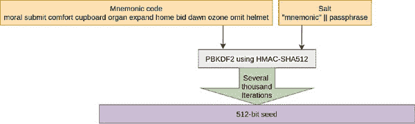

**图 9.10：** 从 Mnemonic 代码词列表生成种子的机制说明

在 Python 代码中执行此操作，我们需要 hmac 和 pbkdf2 包。我们使用以下源代码中的 pbkdf2：

**[`github.com/sfstpala/python3-pbkdf2`](https://github.com/sfstpala/python3-pbkdf2)**

我们还需要使用以下用于 secp256k1 椭圆曲线密码学的包：

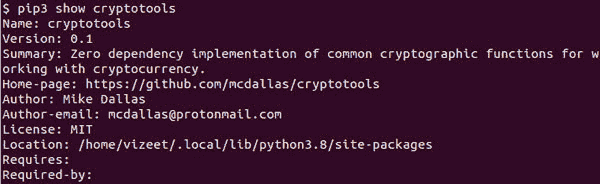

**图 9.11：** 安装的 cryptotools 包的 pip3 包信息

从 mnemonic 代码词列表生成种子的代码如下：

`import pbkdf2`

`import hashlib`

`import hmac`

`import struct`

`from cryptotools.ECDSA.secp256k1 import PublicKey, \`

`PrivateKey, Point, G as secp256k1_G, \`

`N as secp256k1_n, CURVE`

`iterations_g = 10000`

`dklen_g = 64 # 派生密钥长度`

`def genSeedFromStr(password: str, salt: str):`

`password_b = password.encode('utf-8')`

`salt_b = salt.encode('utf-8')`

`seed = pbkdf2.pbkdf2(hashlib.sha512, password_b, salt_b, iterations_g, dklen_g)`

`return seed`

**程序 9.11：** 从 Mnemonic 代码词列表和盐字符串生成种子的程序

我们将 mnemonic 代码词列表和密码传递给种子生成方法，如下所示：

`if __name__ == '__main__':`

`mnemonic_code_l = ['moral', 'submit', 'comfort', 'cupboard', 'organ',`

`'expand', 'home', 'bid', 'dawn', 'ozone', 'omit', 'helmet']`

`mnemonic_code = ' ' .join(mnemonic_code_l)`

`print('Mnemonic Code = ', mnemonic_code)`

`seed = genSeedFromStr(mnemonic_code, ‘mnemonic’ + ‘mycomplexpasscode’)`

`print(‘seed = %s’ % seed.hex())`

我们得到一个 512 位的种子作为结果：

**图 9.12：** 从程序中生成种子和助记词代码

一旦从助记词代码中使用 pbkdf2 导出种子，我们使用该密钥生成主密钥对，然后进一步生成子密钥对。我们使用 HMAC 代码生成这些密钥。HMAC 代表**基于哈希的消息认证码**。

# HMAC：基于哈希的消息认证码

下面的图表说明了基于哈希的消息认证：

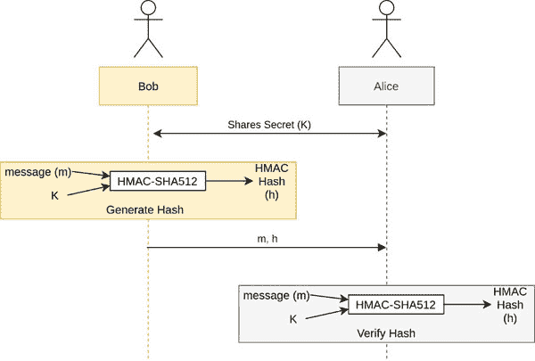

**图 9.13：** 说明基于 HMAC 的认证机制

鲍勃与爱丽丝分享秘密，所以鲍勃和爱丽丝只知道这个秘密。鲍勃需要给爱丽丝发送一个消息（m）。他使用 HMAC-SHA512 哈希算法生成哈希（h）并发送给爱丽丝，同时附带消息。当爱丽丝收到消息时，她再次使用相同的 HMAC-SHA512 算法生成哈希。如果计算出的哈希与收到的哈希相同，她可以确信消息没有被篡改。

我们使用 HMAC-SHA512 算法来生成主密钥对和随后的子密钥对。

# 主密钥生成

下面的图表说明了主私钥生成和主链码生成，这些将在密钥对层次结构中生成下一级子密钥对时被需要：

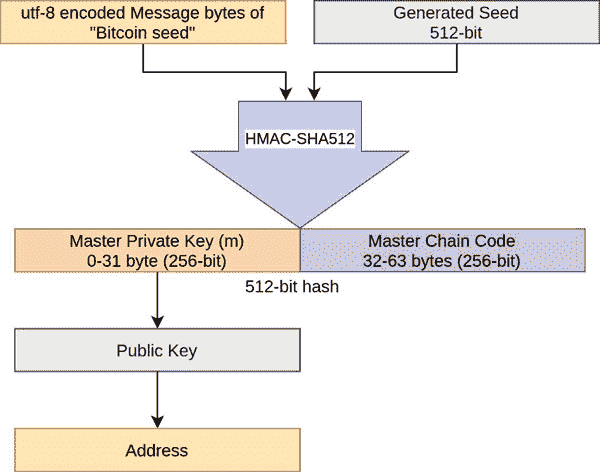

**图 9.14：** 说明如何从种子字节生成主密钥地址

以下是程序代码：

`def genMasterKeys(seed: bytes):`

`h = hmac.new(bytes(“Bitcoin seed”, ‘utf-8’),`

`seed,`

`hashlib.sha512).digest()`

`private_key = int.from_bytes((h[0:32]), byteorder=’big’)`

`chaincode = h[32:64]`

`return private_key, chaincode`

**程序 9.12：** 生成主私钥和链码对的程序

我们按照以下方式调用此方法：

`privkey, chaincode = genMasterKeys(seed)`

`privkey_s = ‘%064x’ % privkey`

`print(‘master privkey = %s’ % privkey_s)`

`print(‘master chaincode = %s’ % chaincode.hex())`

这生成了以下主私钥和链码：

**图 9.15：** 从程序中生成的主私钥和主链码

# 密钥导出

# 父私钥 -> 子私钥

每个树位置的密钥对可以生成子密钥对。对于第一次生成的子，我们有以下子私钥导出机制：

**图 9.16：** 说明子私钥导出机制

为了导出子私钥和子链码，我们需要父私钥、父公钥、父链码以及要导出的子索引。此方法用于从索引 0 到 2³¹ - 1 导出子密钥。

以下代码实现了子密钥导出过程：

`def finiteFieldAddition(a: int, b: int, modulo: int):`

`return (a + b) % modulo`

`def genNormalChildPrivKey(privkey: int, chaincode: bytes, index: int):`

`privkey_s = ‘%064x’ % privkey`

`pubkey_b = privkeyHex2pubkey(privkey_s, True)`

`index_b = struct.pack(‘>L’, index)`

`h = hmac.new(chaincode, pubkey_b + index_b, hashlib.sha512).digest()`

`h256 = int.from_bytes(h[0:32], byteorder='big')`

`child_privkey = finiteFieldAddition(h256, privkey, secp256k1_n)`

`child_chaincode = h[32:64]`

`return child_privkey, child_chaincode`

**程序 9.13：** 从父私钥和链码生成子私钥和链码的程序

上述代码的运行如下：

`child_privkey_i, child_chaincode = genNormalChildPrivKey(privkey, chaincode, 1)`

`child_privkey_wif = encodeWifPrivkey(child_privkey_i, True)`

`print("child privkey = %s" % child_privkey_wif)`

`print("child chaincode = %s" % child_chaincode.hex())`

它给出了以下结果：

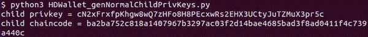

**图 9.17：** 展示了从程序生成的子私钥和子链码

# 父公钥 -> 子公钥

BIP32 如此有用的一个重要原因是，我们可以在不知道父私钥的情况下派生子公钥和地址。这可以防止意外暴露私钥；因此，后续所有子的私钥都是安全的。

这是基于以下逻辑：

*P[p]：父私钥*

*U[p]：父公钥*

*P[C]：子私钥*

*U[C]：子公钥*

*H[0-31]：从父链码、公钥和子索引获得的 hmac(sha512) 哈希的 32 个 MSB*

*G：有限域椭圆曲线中的生成点*

正如我们在子私钥派生中学到的：

⇒ *P[P]+H[0-31] = P[C] (1)*

将两边乘以生成点 G：

*P[P] G + H[0-31] G = P[C].G*

在椭圆曲线密码学中，公钥的派生如下：

⇒ *U[x] = P[x].G (2)*

*(1), (2)* ⇒ *U[P] + H[0-31] .G = U[C]*

G 是有限域中 x、y 坐标的向量。将 G 与标量哈希相乘需要进行椭圆曲线有限域点乘法，并且与相加需要进行椭圆曲线有限域点加法。另外，如果我们使用的公钥是压缩的，则需要使用椭圆曲线密码学解压算法。

以下图所示：

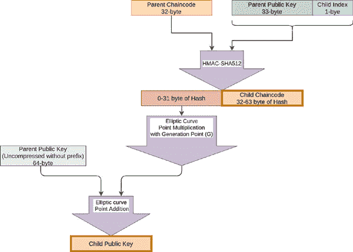

**图 9.18：** 从父公钥和链码派生子公钥的示意图

下面的 Python 实现从父公钥生成子公钥：

`G_p = Point(secp256k1_G[0], secp256k1_G[1])`

内联代码 `def compressPubkey(pubkey_b: bytes):`

`pubkey_P = PublicKey.decode(pubkey_b)`

`pubkey_b = PublicKey.encode(pubkey_P, compressed=True)`

`return pubkey_b`

`def genNormalChildPubKey(pubkey_b: bytes, chaincode: bytes, index: int):`

`index_b = struct.pack(‘>L’, index)`

`h = hmac.new(chaincode, pubkey_b + index_b, hashlib.sha512).digest()`

`h256 = int.from_bytes(h[0:32], byteorder=’big’)`

`h256G = CURVE.point_mul(G_p, h256)`

`pubkey_b = compressPubkey(pubkey_b

`pubkey_point = Point.from_compact(pubkey_b[1:])`

`child_pubkey_point = h256G + pubkey_point`

`child_pubkey_b = PublicKey.encode(child_pubkey_point, compressed=True)`

`child_chaincode = h[32:64]`

`return child_pubkey_b, child_chaincode`

**程序 9.14：** 从父公钥和链码派生子公钥和链码的程序

我们按照以下方式调用前面的代码：

`pubkey_b = privkeyHex2pubkey(privkey_s, True)`

`child_pubkey_b, child_chaincode = genNormalChildPubKey(pubkey_b,`

`chaincode, 1)`

`print(“child pubkey key = %s” % child_pubkey_b.hex())`

`print(“child chaincode = %s”% child_chaincode.hex())`

这给我们以下结果：

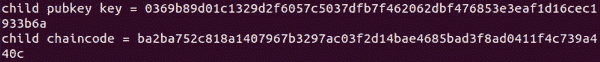

**图 9.19：** 显示生成的子公钥和链码

我们可以看到，用私钥派生的子链码与用公钥派生的链码相同。

# 子私钥 -> 父私钥（钱包私钥泄露）

当我们使用 xpub 时存在风险。如果我们不小心将子私钥暴露给拥有父 xpub 的攻击者，他们可以找到钱包中的所有私钥，并提取所有存储的比特币。

以下方程解释了这是如何发生的：

*P[p] + H[0-31] = P[C]*

⇒ *P[C] - H_[0-31] =P[P]*

这表明，通过知道儿童的 HMAC-SHA256 哈希和私钥，我们可以获得父私钥。而且既然我们获得了父私钥，我们就可以通过同样的机制获得父的父私钥。此外，一旦父私钥被知道，我们可以派生出其所有孩子的私钥。这意味着，只需丢失一个私钥和相应的父 xpub，整个钱包就可以被提取比特币。

以下插图说明了曝光的阶段：

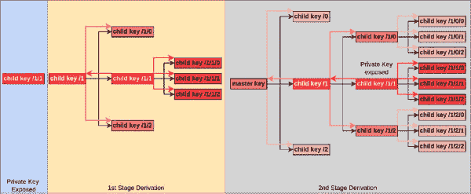

**图 9.20：** 攻击者使用一个私钥派生出所有私钥的示意图

当某人掌握了你的私钥时，他们可以从它派生出越来越多的私钥，最终到达主密钥并派生出所有的钥匙，正如我们用私钥派生所做的那样。

以下程序从子私钥派生出父私钥：

`def genNormalParentPrivKey(child_privkey_i: int,`

`pubkey_b: bytes,`

`chaincode: bytes,`

`index: int):`

`index_b = struct.pack(‘>L’, index)`

`h = hmac.new(chaincode, pubkey_b + index_b, hashlib.sha512).digest()`

`h256 = int.from_bytes(h[0:32], byteorder=’big’)`

`privkey = finiteFieldAddition(-h256, child_privkey_i, secp256k1_n)`

`return privkey`

**程序 9.15：** 从子私钥派生父私钥的程序

我们按照以下方式调用前面的代码：

`p_privkey_i = genNormalParentPrivKey(child_privkey_i,`

`pubkey_b, chaincode, 1)`

`p_privkey_wif = encodeWifPrivkey(p_privkey_i, True)`

`print(‘parent privkey = %064x’ % p_privkey_i)`

这给我们以下结果：

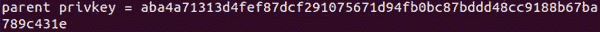

**图 9.21:** 使用子私钥、公钥和链码获得的父私钥

我们可以看到，这里派生出了我们之前从种子得到的相同的主私钥。

# 派生硬化的子密钥

在前几节中，您学习了正常的密钥派生，同时也了解到我们可能会因为一个容易犯的错误而失去钱包中所有的比特币。为了避免这种情况，BIP32 还建议对子派生算法进行修改，称为硬化派生。

以下图说明了硬化派生的过程：

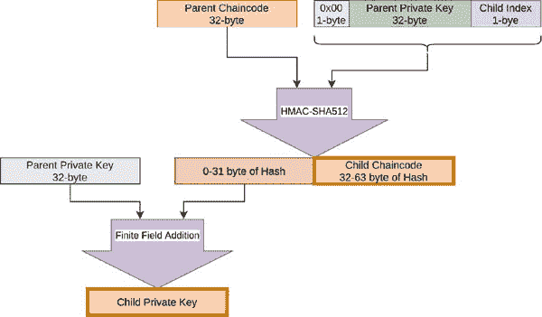

**图 9.22:** 从硬化父私钥派生子私钥的过程

我们在这里看到，在硬化的派生中，父私钥使用字节 0x00 作为后缀，而不是父公钥。硬化的子派生的子索引从 2³¹ 到 2³²-1：

`def genHardenedChildPrivKey(privkey: int, chaincode: bytes, index: int):`

`index_b = struct.pack(‘>L’, index)`

`privkey_b = bytes.fromhex(‘%064x’ % privkey)`

`h = hmac.new(chaincode, b’\x00’ + privkey_b + index_b, hashlib.sha512).digest()`

`h256 = int.from_bytes(h[0:32], byteorder=’big’)`

`child_privkey = finiteFieldAddition(h256, privkey, secp256k1_n)`

`child_chaincode = h[32:64]`

`return child_privkey, child_chaincode`

**程序 9.16:** 从硬化父私钥派生子私钥的程序

我们按照以下方式调用前面的代码：

`index = ((1<<31) + 1) # 2³¹ + 1`

`child_privkey_i, child_chaincode = genHardenedChildPrivKey(privkey, chaincode, index)`

`child_privkey_wif = encodeWifPrivkey(child_privkey_i, True)`

`print(“child privkey = %s” % child_privkey_wif)`

`print(“child chaincode = %s” % child_chaincode.hex())`

我们得到以下结果：

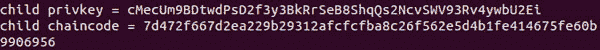

**图 9.23:** 显示硬化子私钥和链码

与正常的子派生不同，硬化的子派生不支持 xpub 或扩展公钥。因此，要观察子地址，我们无法使用 xpub；相反，我们需要离线生成公钥和地址，然后将它们传递给在线钱包以观察。这与正常的派生相比有点不方便，但由于这更加安全，因此建议使用正常的派生。在下一节中，我们将了解如何将两者结合起来，以在安全和方便之间实现更好的权衡。

# 扩展密钥

BIP32 还描述了主网的 xpub 和 xprv 以及测试网的 tpub 和 tprv。这些被钱包用来生成子密钥和地址。xpub 和 tpub 用于生成公钥，而 xprv 和 tprv 用于生成私钥。生成的 xpub 或 tpub 可以提供给钱包以监视生成的地址，而无需暴露私钥或种子。生成的 xprv 或 tprv 可以提供给钱包以生成私钥。这使得 HD 钱包易于使用，这也是为什么几乎所有的钱包软件都使用 BIP32 规范，如比特币核心、电子钱包以及硬件钱包如 nano 或 trezor。

下图显示了 xprv 的派生过程：

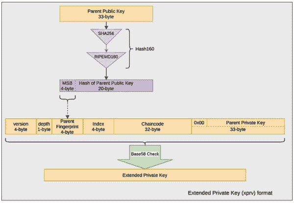

**图 9.24：** 扩展私钥派生的示意图

下图显示了 xpub 的派生过程：

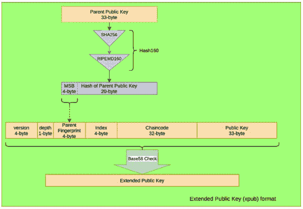

**图 9.25：** 扩展公钥派生的示意图

对于主 xpub 和 xprv，深度为零，父指纹是零字节的 4 字节。

# 主扩展公钥和私钥

主是所有密钥的根，知道它的 xpub 密钥将允许生成所有后续密钥。您绝不应该有任何理由为根生成 xpub 或 xprv。然而，在本节中，您将学习生成 xpub 和 xprv 的方法。 

下面的代码准备了主 xpub 和 xprv：

`XPUB_VERSION = ‘0488B21E’`

`XPRV_VERSION = ‘0488ADE4’`

`TPUB_VERSION = ‘043587CF’`

`TPRV_VERSION = ‘04358394’`

`def getMasterXPrv(chaincode_b: bytes, privkey: int):`

`version_b = bytes.fromhex(TPRV_VERSION)`

`depth_b = b’\x00’`

`fingerprint_p_b = bytes(4)`

`index_b = bytes(4)`

`privkey_b = bytes.fromhex(‘%066x’ % privkey)`

`raw_xprv = depth_b + fingerprint_p_b + index_b + chaincode_b + privkey_b`

`xprv = base58checkEncode(version_b, raw_xprv)`

`return xprv`

`def getMasterXPub(chaincode_b: bytes, pubkey: str):`

`version_b = bytes.fromhex(TPUB_VERSION)`

`depth_b = b’\x00’`

`fingerprint_p_b = bytes(4)`

`index_b = bytes(4)`

`pubkey_b = bytes.fromhex(pubkey)`

`raw_xpub = depth_b + fingerprint_p_b + index_b + chaincode_b + pubkey_b`

`xpub = base58checkEncode(version_b, raw_xpub)`

`return xpub`

**程序 9.17：** 派生主 XPrv 和主 XPub 的程序

我们如下调用该方法：

`xprv = getMasterXPrv(chaincode, privkey)`

`print(‘xprv=%s’ % xprv)`

`pubkey_b = privkeyHex2pubkey(privkey_s, True)`

`xpub = getMasterXPub(chaincode, pubkey_b.hex())`

`print(‘xprv=%s’ % xpub)`

我们得到以下主 xpub 和 xprv：

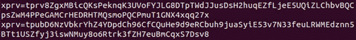

**图 9.26：** 显示了主 xprv 和 xpub

# 扩展公钥和私钥

如果我们有根的密钥和链码，我们可以为密钥派生层次结构中的深度和索引生成 xpub 和 xprv。

在下面的代码中，我们根据给定的深度和索引生成 xprv 和 xpub：

`def getXPrv(p_pubkey: str,`

`chaincode_b: bytes,`

`privkey: int,`

`depth: int,`

`index: int):`

`version_b = bytes.fromhex(TPRV_VERSION)`

`p_pubkey_b = bytes.fromhex(p_pubkey)`

`privkey_b = bytes.fromhex(‘%066x’ % privkey)`

`depth_b = bytes([depth])`

`p_fingerprint_b = hash160(p_pubkey_b)[0:4]`

`index_b = struct.pack(‘>L’, index)`

`raw_xprv = depth_b + p_fingerprint_b + index_b + chaincode_b + privkey_b`

`xprv = base58checkEncode(version_b, raw_xprv)`

`return xprv`

`def getXPub(p_pubkey: str,`

`chaincode_b: bytes,`

`pubkey: str,`

`depth: int,`

`index: int):`

`version_b = bytes.fromhex(TPUB_VERSION)`

`p_pubkey_b = bytes.fromhex(p_pubkey)`

`pubkey_b = bytes.fromhex(pubkey)`

`depth_b = bytes([depth])`

`p_fingerprint_b = hash160(p_pubkey_b)[0:4]`

`index_b = struct.pack(‘>L’, index)`

`raw_xpub = depth_b + p_fingerprint_b + index_b + chaincode_b + pubkey_b`

`xpub = base58checkEncode(version_b, raw_xpub)`

`return xpub`

**程序 9.18:** 给定深度和索引生成 XPub 和 XPrv 的程序

我们如下调用方法：

`# 我们正在为 index=1 和 depth=1 计算`

`child_xprv = getXPrv(pubkey_b.hex(), child_chaincode, child_privkey_i, 1, 1)`

`print(‘child xprv:’)`

`print(child_xprv)`

`child_xpub = getXPub(pubkey_b.hex(), child_chaincode, child_pubkey_b.hex(),1, 1)`

`print(‘child xpub:’)`

`print(child_xpub)`

我们为给定的密钥得到以下的 xprv 和 xpub：

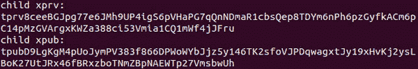

**图 9.27:** 显示孩子 xprv 和 xpub

我们可以注册 xpub 到钱包中，以便观察涉及生成的地址的交易。BitcoinJ 是支持用 xpub 观察地址的钱包之一。生成的 xprv 可以用来生成签名交易的孩子私钥公钥对。你绝不应该在任何地方暴露或使用 xprv，甚至应该避免使用 xpub。总是私下生成这些地址，并将个人地址注册到钱包中观察。这将有助于防范丢失比特币的风险。

# 密钥派生路径

如我们现在所知，分层确定性钱包的美妙之处在于我们可以以任何深度和任何索引确定性地派生密钥。为了能够在层次结构中定位一个密钥，HD 钱包使用一种称为密钥派生路径的表示法。

这里是对密钥派生路径的表示：

+   主密钥用 m 表示。

+   正常密钥用索引号码 0 到 2³¹-1 表示。

+   硬化密钥用索引号码 2³¹到 2³²-1 表示。

+   深度分隔符是正斜杠/。

作为一个例子，密钥派生路径可能如下所示：

*m/45/78’/56/9’*

这里，78’和 9’是硬化密钥，而 45 和 56 是正常密钥。

下面的插图展示了包括硬化密钥的密钥派生：

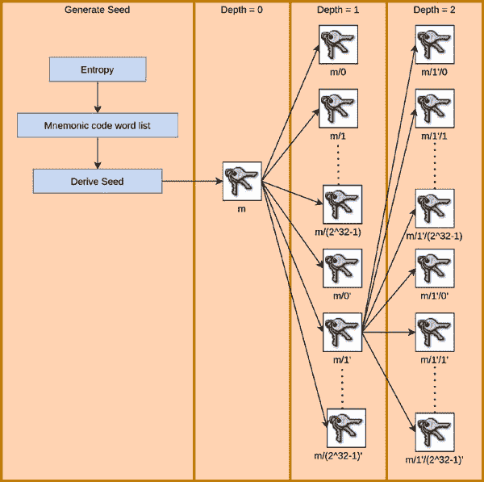

**图 9.28:** 包括硬化密钥的密钥派生

在上一节中，你了解到硬化密钥更安全但也不太方便使用。

**提示：为了降低风险，我们可以将最低层设置为正常派生，这意味着 xpub 将帮助生成子索引。然而，我们也将父级设置为硬化，所以如果一个子私钥被暴露，它将暴露同一父级的其他子密钥。但由于父级是硬化的，它不会允许在父级深度派生其他索引的私钥。我们可以将每个父级下的子数限制在 20 个左右。所以，每次私钥暴露，我们都会失去 20 个地址。我们还可以在每个地址中进一步仅存储有限数量的比特币，这样失去它们就不会造成巨大损失。**

**这可能是一种方便的妥协，但它不是比特币的好选择，因为比特币是一种高价值和高网络费用的加密货币。这意味着存储非常小的数量相当昂贵，即使失去小面额也是一笔可观的损失。简而言之，比特币不适合小额交易、交易和较低的安全性。这种策略可能适用于其他加密货币，那里的网络费用不高。**

# 结论

在本章中，你首先学习了钱包的必要性。然后，你学习了我们可以将钱包分类的不同方式，并专注于实现基于 BIP32 规范的分层确定性钱包。在实现过程中，你学习了私钥生成和结构。你学会了派生公钥和地址，并为`mainnet` *和* `testnet`生成 P2PKH 和 P2PSH 地址。你还学会了生成易于记忆、保存和书写的密码，称为助记词代码词列表。你使用助记词代码通过使用派生路径确定性地生成私钥。在本章中，我们还讨论了如何处理安全和便利性。我们没有讨论椭圆曲线密码学，因为我们将在接下来的章节中更详细地查看它。

在下一章中，你将学习创建最常用的交易类型。你将学会签署交易并验证接收到的交易。验证过程将涉及查看 mempool 和存储在 LevelDB 数据库中的 utxos。

# 需记住的要点

+   钱包是一种软件程序，用于存储私钥、公钥和地址，或者能够在需要时生成它们。

+   钱包可以告诉一个人持有多少比特币，它还可以在将交易发布到网络之前签署交易。

+   助记词代码词列表可以是 12/18/24 个单词。记住和输入 12 个单词更容易，但 24 个单词的代码更安全。

+   为了生成一个安全的助记词代码，我们需要生成一个好的随机数。为了生成一个好的随机数，我们需要找到正确的熵源。

+   Pbkdf2 是一种密钥派生迭代过程，迭代次数越多，派生密钥对暴力攻击的抵抗力越强。

+   建议的 Pbkdf2 迭代次数大于 10000，但次数越多，生成所需的时间越长。

+   扩展密钥提供了一种编码方法，如果支持，钱包可以使用给定的扩展密钥生成所需的私钥或公钥。

+   BIP32 HD 钱包支持派生正常密钥和硬化密钥。

+   如果任何子私钥的私钥泄露，那么伴随 xpub，有人可以提取钱包中所有地址存储的比特币。

+   硬化密钥不允许使用 xpub，失去一个私钥不会暴露任何其他地址。

# 问题

1.  为什么硬件钱包被认为是存储硬币最安全的方式？

1.  钱包程序有哪三个功能？

1.  使用确定性钱包的优缺点是什么？

1.  使用助记词列表的好处是什么？

1.  解释扩展密钥的使用。

1.  编程问题：

    1.  BIP44 基于 BIP32 HD 钱包，指定以下派生路径生成密钥：

        m / purpose’ / coin_type’ / account’ / change / address_index

        目的 = 44’

        cointype = 0’用于 Bitcoin 主网

        账户：用户账户的标识符（硬化）

        change = 0（正常）用于外部地址，1 用于内部（change）地址

        地址索引：地址从索引 0（正常）开始，按顺序向上。

        编写一个程序实现 BIP44 的 HD 钱包。

    1.  编写一个程序，从给定的 xpub 生成 100 个子地址。

    1.  编写一个程序来解析 xprv 和 xpub。

1.  真/假：

    1.  硬化派生使得从父私钥派生子私钥变得更加困难。

    1.  Base58Check 编码保护发送者输入错误的地址，从而避免向错误地址支付。

    1.  如果不小心将助记词列表按错误顺序输入，我将总是生成错误的密钥和错误的地址。

1.  填空：

    1.  24 个单词的助记码由 ____ 位随机数和 ___ 位作为校验和组成。

    1.  BIP32 HD 钱包密钥的最大可能深度是 ______。

    1.  P2PSH 的全称是 ___________，P2PKH 的全称是 ____________。
