# 第十章

# 创建和验证交易

在前一章中，你学习了关于钱包、私钥、公钥和地址的知识，并理解了如何生成它们。你学会了创建一个分层确定性钱包，并理解了 HD 钱包如何简化私钥、公钥和地址的生成，帮助我们保护钱包并简化隐私管理。

比特币存在最根本的原因是为了传输和存储价值。这意味着当你向另一个人支付比特币时，比特币必须从你的钱包转移到另一个人的钱包。如果你不将比特币从你的钱包转移到另一个人的钱包，它就会一直呆在你的钱包里直到你愿意。另外，当另一个人收到比特币时，他们应该能够将其的一部分发送给另一个人，或者在发送时添加额外的比特币。

我们通过创建交易并将它们发布到网络上来传输比特币。尽管我们创建交易以支付给另一个人，但交易不仅为我们所知；它为网络上的每个人所知。这就像付款后大声喊叫，以便每个人都知道交易已经完成。因此，网络上的每个人都是交易的见证人。

在本章中，我们的重点将放在交易上。我们将解析一个区块中的真实交易，并学习其格式和脚本语言以及验证签名。然后我们将构建我们自己的交易并将其发布到网络上。我们还将查看常见的交易类型和保护交易的方法。

# 结构

在本章中，我们将涵盖以下主题：

+   编写比特币交易脚本

    +   OPCODES

    +   签名验证

        +   哈希类型 – SIGHASH_ALL

        +   哈希类型 – SIGHASH_NONE, SIGHASH_SINGLE, SIGHASH_ANYONECANPAY

        +   标准比特币脚本 – P2PK

        +   标准比特币脚本 – P2PKH

             准备签名预图像

        +   标准比特币脚本 – P2MS

        +   标准比特币脚本 – P2SH

+   构建交易

    +   构建 P2PKH 交易

    +   构建 P2SH 交易

# 目标

本章的目标是帮助读者学习验证和创建交易。在本章中，你将学习区块链用于资助交易和保护目的地地址的脚本语言。你还将学习节点如何验证交易。然后你将学会创建交易并将其发布到比特币网络。

你将学习比特币脚本是如何执行的，你还将学习最常用的脚本并详细了解它们，无论是在交易验证还是交易创建中。

# 编写比特币交易脚本

Bitcoin 交易有两个部分：输入和输出。输入包括一个称为`**scriptSig**`的解锁脚本，输出包括一个称为`**scriptPubKey**`的锁定脚本。脚本`**scriptSig**`通常包括解锁先前锁定的交易所需的签名和公钥或脚本，以允许验证签名。脚本`**scriptPubKey**`基于一个早期脚本的名称，称为*P2PK*或*Pay-2-Pubkey*。现在，*P2PK*脚本不再推荐使用，且很少使用。因此，`**scriptPubKey**`现在是名副其实的。目前，最常用的脚本有*P2PKH, P2SH, P2SH-P2WPKH*和*P2SH-P2WSH*。在这里，*W*表示见证人，它是在 s*egregated* w*itness*增强部分引入的。我们有一个单独的章节来详细介绍它，所以我们不会在本章中涵盖 s*egregated* w*itness*。

为了验证交易的脚本部分，首先执行`**scriptSig**`，然后按顺序执行`**scriptPubKey**`。脚本语言是一种基于栈的反波兰语言。语言语义类似于逆波兰记法。

# **逆波兰记法**点击此处

逆波兰记法也称为*后缀记法*。以下是一个逆波兰记法的示例：

7+9 的逆波兰记法是 7 9 +

为了解决这个问题，7 和 9 被放入栈中，+ 是执行操作的运算符：

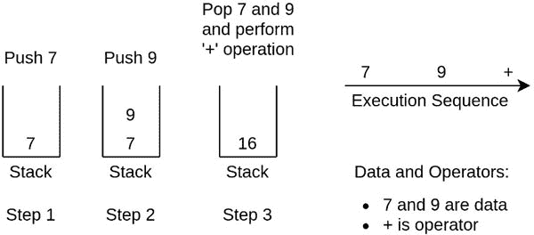

**图 10.1:** 逆波兰记法操作执行

当我们创建一个新的交易时，我们利用 UTXO 来资助交易。新交易的输入包含一个解锁脚本，该脚本用于释放 UTXOs 中由`**scriptPubKey**`锁定的资金。一旦执行了这两个脚本，栈顶会留下一个布尔值，表示脚本最终是否成功。这些脚本的执行方式与逆波兰记法类似。

# **操作码**点击此处

一个脚本由数据和操作符组成。这些操作符有定义的操作码。操作符有定义的功能。数据前面有一个`**pushdata**`操作符，表示以下数据的字节数。

以下是一些操作码：

| **单词** | **十六进制** |
| --- | --- |
| OP_DUP | 0x76 |
| OP_HASH160 | 0xa9 |
| OP_EQUALVERIFY | 0x88 |
| OP_EQUAL | 0x87 |
| OP_CHECKSIG | 0xac |
| 推送数据字节长度 | 0x01-0x4b |
| OP_PUSHDATA1 | 0x4c |
| OP_PUSHDATA2 | 0x4d |
| OP_PUSHDATA4 | 0x4e |

**表 10.1:** 操作码

完整的操作码列表可以在以下网址找到：

**[`en.bitcoin.it/wiki/Script`](https://en.bitcoin.it/wiki/Script)**

从 0x01 到 0x4b 的十六进制值表示数据的大小。OP_PUSHDATA1 表示下一个字节的数据显示数据大小，OP_PUSHADATA2 表示下一个字节的数据显示数据大小，OP_PUSHDATA4 表示下一个字节的数据显示数据大小。以下是`**pushdata**`和数据的说明：

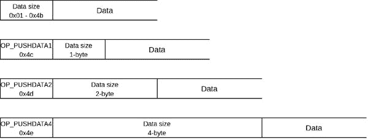

**图 10.2:** 推送数据大小编码

使用上述表格来将脚本十六进制代码转换为可读脚本：

`op_d = {‘76’: ‘OP_DUP’, ‘a9’: ‘OP_HASH160’, ‘88’: ‘OP_EQUALVERIFY’, ‘87’: ‘OP_EQUAL’, ‘ac’: ‘OP_CHECKSIG’, ‘ae’: ‘OP_CHECKMULTISIG’, ‘00’: ‘OP_0’, ‘51’: ‘OP_1’, ‘52’: ‘OP_2’, ‘53’: ‘OP_3’, ‘54’: ‘OP_4’, ‘55’: ‘OP_5’, ‘56’: ‘OP_6’, ‘57’: ‘OP_7’, ‘58’: ‘OP_8’, ‘59’: ‘OP_9’, ‘5a’: ‘OP_10’, ‘5b’: ‘OP_11’, ‘5c’: ‘OP_12’, ‘5d’: ‘OP_13’, ‘5e’: ‘OP_14’, ‘5f’: ‘OP_15’, ‘60’: ‘OP_16’, ‘6a’: ‘OP_RETURN’, ‘4c’: ‘OP_PUSHDATA1’, ‘4d’: ‘OP_PUSHDATA2’, ‘4e’: ‘OP_PUSHDATA4’}`

`OP_PUSHDATA1 = 0x4c`

`OP_PUSHDATA2 = 0x4d`

`OP_PUSHDATA4 = 0x4e`

`g_pushdata = range(0x01, 0x4c)`

`def prepare_readable_script(script_b: bytes):`

`script_len = len(script_b)`

`script_sl = []`

`i = 0`

`while i < script_len:`

`if script_b[i] in g_pushdata:`

`script_sl.append(script_b[i: i + 1].hex())`

`script_sl.append(script_b[i+1: i+script_b[i]+1].hex())`

`i += 1 + script_b[i]`

`elif script_b[i] == OP_PUSHDATA1:`

`script_sl.append(op_d[script_b[i:i+1].hex()])`

`datasize_b = script_b[i + 1: i + 2]`

`script_sl.append(datasize_b.hex())`

`datasize = int.from_bytes(datasize_b, byteorder=’little’)`

`script_sl.append(script_b[i + 2: i + 2 + datasize].hex())`

`i += 2 + datasize`

`elif script_b[i] == OP_PUSHDATA2:`

`script_sl.append(op_d[script_b[i:i+1].hex()])`

`datasize_b = script_b[i + 1: i + 3]`

`script_sl.append(datasize_b.hex())`

`datasize = int.from_bytes(datasize_b, byteorder=’little’)`

`script_sl.append(script_b[i + 3: i + 3 + datasize].hex())`

`i += 3 + datasize`

`elif script_b[i] == OP_PUSHDATA4:`

`script_sl.append(op_d[script_b[i:i+1].hex()])`

`datasize_b = script_b[i + 1: i + 5]`

`script_sl.append(datasize_b.hex())`

`datasize = int.from_bytes(datasize_b, byteorder=’little’)`

`script_sl.append(script_b[i + 5: i + 5 + datasize].hex())`

`i += 5 + data_size`

`else:`

`op_s = op_d[script_b[i:i+1].hex()]`

`script_sl.append(op_s)`

`i += 1`

`script_str = ‘ ‘.join(script_sl)`

`return script_str`

**程序 10.1：** 通过十六进制代码获取可读脚本

在上述程序中，脚本的第一个字节表示脚本大小（以字节为单位）。我们选取了一些操作码，并将它们与它们的十六进制代码进行了映射。

我们通过调用前述方法将十六进制代码转换为可读脚本：

`if __name__ == ‘__main__’:`

`data_s = ‘76a91461cf5af7bb84348df3fd695672e53c7d5b3f3db988ac’`

`print(‘推送数据： ‘, data_s)`

`script_b = bytes.fromhex(data_s)`

`print(‘解码后的脚本： ‘, prepare_readable_script(script_b))`

`print(‘====================================================’)`

`data_s = ‘6a4c500029282c0002c5164b82ab2b42044dbe2b8573c969cc10d9e0bd03646ccf1e7497c4bf69678a7b6a99ce4f8dda595a2ed353f27c6195bdfd0528ff229f2619002759d5b9d236d1458d1ad7e7640b5948’`

`print(‘PUSHDATA1: ‘, data_s)`

`script_b = bytes.fromhex(data_s)`

`print(‘解码后的脚本： ‘, prepare_readable_script(script_b))`

`print(‘====================================================’)`

`data_s = ‘47304402201f46c0a476592d44192773fb0ac385d5ab0fc286882016b220e055314989d70f0220151e45313207ef60d7e91b66f03bbaade27ad0fb0a78ca692ccdb4fa36202a66014d33014d0701434e54525052545903000800157934c4b76dd4598533af398d4600bc62c30e20001de8e1db9ab1622fb8b35eae514f6a2b848dec9000489ad6851b31a59f042593c28f49976ffe17abc6005d3d7d62a84e90b0cfcb455c4f73bc795115a5f2005eac6a674669c6c0de63177ae4b3f8f21579a5e90068430e5056f9b75beb0dbf415a8aa2c65305a89e00687fd8a1bcc5a7f48c540591a4e3521fe7a5d67300a393004b7d01b3ad81276898afb8203c1b631b8a40000085ecef53f53d0000000000000001808000000000000000300c0000000000000006030000000000000000c01000000000000000180e00000000000000030080000000000000006000000000000000000c00752103cff10054cf9cf2dbda64adb01ccfc46c3dee8fcf4a9ba7eb14015ebe97cc31f3ad0075740087’`

`print(‘PUSHDATA2: ‘, data_s)`

`script_b = bytes.fromhex(data_s)`

`print(‘解码后的脚本： ‘, prepare_readable_script(script_b))`

这给我们带来了以下结果：

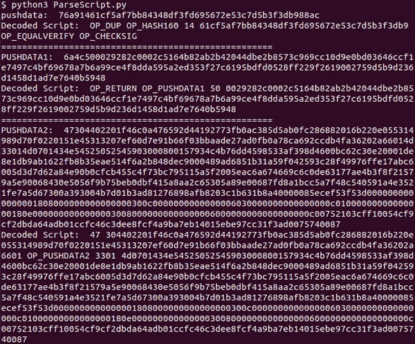

**图 10.3：** 程序解析的脚本示例

# 签名验证

当节点获得交易时，需要根据共识规则进行验证，包括验证签名和公钥与锁定脚本的匹配，其类型是 P2PKH 或 P2PSH，或任何其他类型的脚本。您在*第五章，白皮书*中学到了签名验证，在名为*数字签名*的注释中学到了两个输入到给定签名的要求：公钥和消息。在这种情况下，消息由版本、输入数量、输入、锁定时间、签名哈希类型、输出数量和输出组成。

在这里，签名哈希类型指示由新交易签名的消息的结构。

可以使用以下签名哈希类型：

| **SIGHASH 类型** | **十六进制代码** | **含义** |
| --- | --- | --- |
| **SIGHASH_ALL** | 0x01 | 签名所有输入和输出 |
| **SIGHASH_NONE** | 0x02 | 签名所有输入和无输出 |
| **SIGHASH_SINGLE** | 0x03 | 签名所有输入和单个输出 |
| **SIGHASH_ALL**&#124;**SIGHASH_ANYONECANPAY** | 0x81 | 签名一个输入和所有输出 |
| **SIGHASH_NONE**&#124;**SIGHASH_ANYONECANPAY** | 0x82 | 签名一个输入和无输出 |
| **SIGHASH_SINGLE**&#124;**SIGHASH_ANYONECANPAY** | 0x83 | 签名一个输入和一个输出 |

**表格 10.2：** 签名哈希类型

以下是前述每个签名哈希类型的描述:

+   `**SIGHASH_ALL**`：签署所有输出是必要的，以确保别人不会更改输出并窃取比特币。因此，每笔交易都至少需要用`**SIGHASH_ALL**`签署一个输入*.*

+   `**SIGHASH_NONE**`：这通常与`**SIGHASH_ANYONECANPAY**`一起使用，但是在所有输入都已知的情况下，可以使用此签名哈希类型而不带有`**SIGHASH_ANYONECANPAY**`。

+   `**SIGHASH_SINGLE**`：这通常与`**SIGHASH_ANYONECANPAY**`一起使用。类似于`**SIGHASH_NONE**`，这种签名哈希类型也可以在没有`**SIGHASH_ANYONECANPAY**`的情况下使用*.*

+   `**SIGHASH_ALL|SIGHASH_ANYONECANPAY**`: 如果在特定的目的下每个人都在做贡献，比如一起从礼品店买礼物，这个就很有用。在这种情况下，每个人都清楚资金的流向和数量，也清楚他们需要贡献多少。

+   `**SIGHASH_NONE|SIGHASH_ANYONECANPAY**`: 当一个协调者在为某些目的收集资金时这个很有用。收集者知道资金需要流向哪里，因此他们在创建一个输入的签名时会用他们的私钥签署所有输入和输出。其他人不知道资金将如何使用，因此他们会通过 `**SIGHASH_NONE|SIGHASH_ANYONECANPAY**` 来签署*.*

+   `**SIGHASH_SINGLE|SIGHASH_ANYONECANPAY**`: 这个在合并独立的交易时很有用，每个交易有一个输入和一个输出。需要有一个输入来签署所有的输出。这里最大的问题是输出值通常是固定的，所以多余的价值需要作为找零支付。这只可能在输入和输出相等或输入小于输出的情况下有用。如果输入小于输出，我们可以称这个交易为部分交易。在这种情况下，每个人都做一个部分交易，收集者添加剩余的比特币以完成交易。例如，如果支付由另一个实体资助，该实体最终通过签署所有输出来完成交易。

# 哈希类型 - SIGHASH_ALL

以下插图展示了在 `**SIGHASH_ALL**` 情况下如何在 scriptSig 中创建签名：

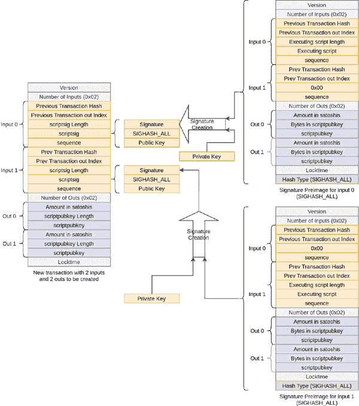

**图 10.4:** 创建 SIGHASH_ALL 类型的交易

前一个图展示了如何使用消息和私钥创建签名。在 `**SIGHASH_ALL**` 的情况下，我们通过获取新交易的的所有元素来创建消息。然后我们用执行脚本替换 scriptSig 和 scriptSig 长度，在 P2PKH 的情况下，是待签名的输入索引的 previous scriptPubKey 和 scriptPubKey 长度。对于其他输入，scriptSig 长度用零替换，因为这些输入不需要签名。对于 P2SH 脚本，scriptSig 和其长度用赎回脚本和其长度替换。在消息的最后，我们添加 sighash 类型。

# 哈希类型 - SIGHASH_NONE, SIGHASH_SINGLE, SIGHASH_ANYONECANPAY

以下插图展示了其他 SIGHASH 类型需要签名的消息结构：

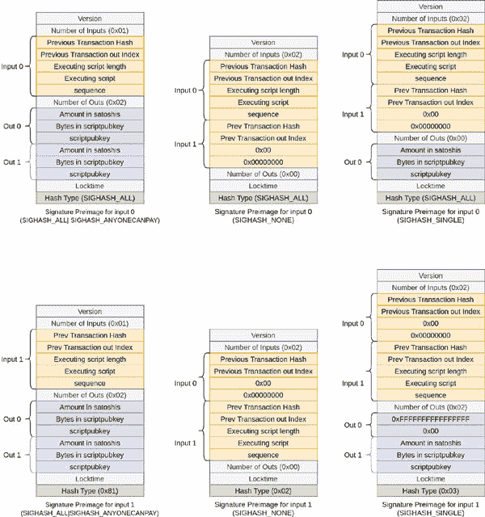

**图 10.5:** 除了 SIGHASH_ALL 之外的签名预像

在`**SIGHASH_ANYONECANPAY**`的情况下，只有已签名的输入是待签名的消息的一部分，其他输入不包括在内。在`**SIGHASH_NONE**`的情况下，没有任何输出包括在内，在`**SIGHASH_SINGLE**`的情况下，只有一个输出包括在内。我们可以观察到，在`**SIGHASH_SINGLE**`情况下，输出索引对应于正在签名的输入。这意味着，如果签名输入 0，则包括输出 0，排除输出 1。如果签名输入 1，则包括输出 1，排除输出 0。如果排除的输出不是消息的最后一个输出，那么我们需要通过仅保留`0xFFFFFFFFFFFFFFFF`和`0x00`作为占位符来保留被排除的输出，正如图中所示。在`**SIGHASH_NONE**`和 SIGHASH_SINGLE 的情况下，未签名的输入序列被`0x00000000`替换。

# 标准比特币脚本 - P2PK

P2PK 不推荐使用。P2PK 代表***Pay-2-Public-Key***。

在这个脚本中，`**scriptsig**`的内容是：

`<签名>`

`**scriptpubkey**`的内容是：

`<公钥> OP_CHECKSIG`

它的执行过程简单：首先执行`**scriptSig**`，其中将签名推入栈，然后执行`**scriptPubKey**`，将公钥推入栈，然后执行`**OP_CHECKSIG**`，通过弹出签名和公钥来检查签名，并将结果推回栈。

这个脚本有几个缺点：

+   压缩公钥是 32 字节长，而 P2PKH 脚本中使用的哈希是 20 字节长，所以它的十六进制是 40 字符长，这要容易得多。使用 base58check 编码生成的 20 字节地址是 34 字符长。

+   如果量子计算机能够利用一种名为 Shor 算法量子技术，预计它们将能够从公钥中导出私钥。为了使比特币在未来保持安全，我们不应该在还持有比特币的网络中暴露我们的公钥。通过拥有公钥哈希，我们有多层安全性来保护我们的资金。

由于这个脚本不推荐使用，深入理解它没有意义。

# 标准比特币脚本——P2PKH

P2PKH 是比特币脚本中最广泛使用的。P2PKH 代表***Pay-2-Public-Key-Hash***。在脚本中，发送者使用公钥的哈希锁定交易输出，并要求接收者在需要使用锁定在交易输出中的资金时提供公钥。哈希是 20 字节长，小于 32 字节的压缩公钥。它生成了一个 34 字符长的地址，包括一个校验和。这使得它更容易输入，并且由于包含校验和，不可能意外地输入错误的地址。

`**scriptSig**`在 P2PKH 中的内容是：

`<签名> <公钥哈希>`

`**scriptPubKey**`的内容是：

`OP_DUP OP_HASH160 <20 字节公钥哈希> OP_EQUALVERIFY OP_CHECKSIG`

由于`**<Signature>**`和`**<Public Key Hash>**`都是数据，两者都进入堆栈。一旦执行`**scriptSig**`，则执行`**scriptPubKey**`。

下面的插图展示了 P2PKH 的执行过程：

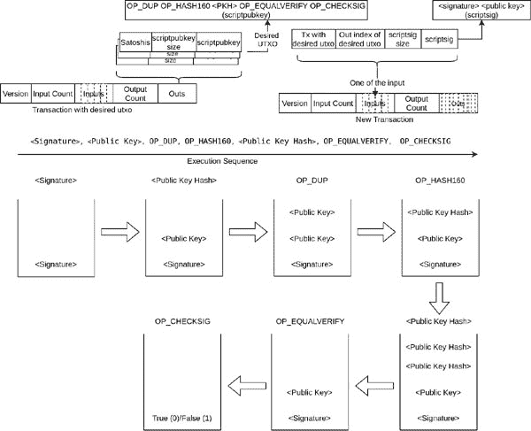

**图 10.6：** P2PKH 的执行

# 准备签名前的镜像

所有消息都包含签名哈希类型。一旦消息签名完成，签名哈希类型就附加到签名后，以帮助验证节点在验证之前重构消息。

现在，我们已经准备好验证一个真实的交易脚本。我们取以下交易 ID：

`83eeaecaf531e5239ffc3ba7ff583c696f7dbe3610f0d672d41e0b9443632c82`

由于交易在比特币区块链上，我们通过在比特币核心命令行界面调用`**getrawtransaction**`来获取原始交易，如下所示：

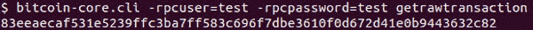

**图 10.7：** 显示了获取交易字节的比特币核心命令行界面命令

这给我们提供了以下原始交易：

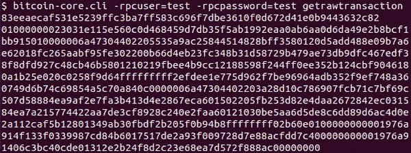

**图 10.8：** 显示了交易 ID 的十六进制数据

我们可以使用在*第六章，区块链、交易和挖矿*的*交易*主题和*其他交易*子主题下编写的`**getTransactionInfo**`方法来解析交易并获取`scriptSig`。

这给我们提供了以下信息：

`Transaction = {'version': '00000001', 'inp_cnt': 2, 'inputs': [{'prev_tx_hash': '15b91bcf8b2b9ea46d0daab60aaa2e99b15a5fb37d9d4568d4c060e515e13130', 'prev_tx_out_index': '00000001', 'bytes_scriptsig': 106, 'scriptsig': '47304402205535a9ac25844514828bff3580120d5add488e09b7a6e62018fc265aabf95fe302200b66d4eb23fc348b31d58729b479ae73db9dfc467edf38f8dfd927c48cb46b5801210219fbee4b9cc12188598f244ff0ee352b124cbf9046180a1b25e020c0258f9d64', 'sequence': 'ffffffff'}, {'prev_tx_hash': '840ac7a55498c6746b9d7460a348f79e2f35db4a9696bef762d975e7e1deeff2', 'prev_tx_out_index': '0000000c', 'bytes_scriptsig': 106, 'scriptsig': '47304402203a28d10c786907fcb71c7bf69c507d58884ea9af2e7fa3b413d4e2867eca601502205fb253d82e4daa2672842ec031584ea7a215774422aa7de3cf8928c240e2faa60121030be5aa6d5de8c6dd89d6ac4d0e2a112caf5b12801349ab30fbdf2b205f0b94b8', 'sequence': 'ffffffff'}], 'out_cnt': 2, 'outs': [{'satoshis': 69302, 'bytes_scriptpubkey': 25, 'scriptpubkey': '76a914f133f0339987cd84b6017517de2a93f009728d7e88ac'}, {'satoshis': 12900349, 'bytes_scriptpubkey': 25, 'scriptpubkey': '76a91406c3bc40cde01312e2b24f8d2c23e68ea7d572f888ac'}], 'locktime': 0}`

下面的程序进一步解析`**scriptSig**`以获取签名、`**sighash**`类型和公钥：

`OP_PUSHDATA1 = 0x4c`

`OP_PUSHDATA2 = 0x4d`

`OP_PUSHDATA4 = 0x4e`

`SIGHASH_ALL = 0x01`

`SIGHASH_NONE = 0x02`

`SIGHASH_SINGLE = 0x03`

`SIGHASH_ANYONECANPAY = 0x80`

`def getHashTypeInWords(hashtype: int):`

`hashtype_s = ""`

`if hashtype & SIGHASH_SINGLE == 0x03:`

`hashtype_s = "SIGHASH_SINGLE"`

`elif hashtype & SIGHASH_NONE == 0x02:`

`hashtype_s = "SIGHASH_NONE"`

`elif hashtype & SIGHASH_ALL == 0x01:`

`hashtype_s = "SIGHASH_ALL"`

`if hashtype & SIGHASH_ANYONECANPAY == 0x80:`

`hashtype_s = hashtype_s + "|" + "SIGHASH_ANYONECANPAY"`

`return hashtype_s`

`def decodePushdata(script_m: mmap):`

`length = int.from_bytes(script_m.read(1), byteorder='little')`

`if length == OP_PUSHDATA1:`

`length = int.from_bytes(script_m.read(1), byteorder='little')`

`elif length == OP_PUSHDATA2:`

`length = int.from_bytes(script_m.read(2), byteorder=’little’)`

`elif length == OP_PUSHDATA4:`

`length = int.from_bytes(script_m.read(4), byteorder=’little’)`

`return length`

`def parseScriptSig(script_m: mmap):`

`scriptsig = {}`

`scriptsig[‘bytes_sig’] = decodePushdata(script_m)`

`scriptsig[‘sig’] = script_m.read(scriptsig[‘bytes_sig’] - 1).hex()`

`scriptsig[‘hash_type’] = int.from_bytes(script_m.read(1), byteorder=’little’)`

`scriptsig[‘hash_type_name’] = getHashTypeInWords(scriptsig[‘hash_type’])`

`scriptsig[‘bytes_pubkey’] = decodePushdata(script_m)`

`scriptsig[‘pubkey’] = script_m.read(scriptsig[‘bytes_pubkey’]).hex()`

`return scriptsig`

**程序 10.2：** 脚本签名解析器

我们如下调用上述方法：

`script_b = bytes.fromhex(‘47304402203a28d10c786907fcb71c7bf69c507d58884ea9af2e7fa3b413d4e2867eca601502205fb253d82e4daa2672842ec031584ea7a215774422aa7de3cf8928c240e2faa60121030be5aa6d5de8c6dd89d6ac4d0e2a112caf5b12801349ab30fbdf2b205f0b94b8’)`

`script_m = mmap.mmap(-1, len(script_b) + 1)`

`script_m.write(script_b)`

`script_m.seek(0)`

`scriptsig = parseScriptSig(script_m)`

`print(json.dumps(scriptsig, indent=4))`

这给我们带来以下结果：

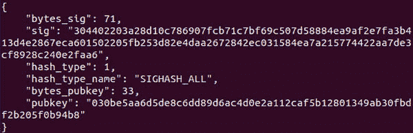

**图 10.9：** 运行 parseScriptSig 程序的 JSON 输出

我们将使用上述信息来验证交易。首先我们实现脚本操作。然后，我们使用列表作为堆栈，并使用弹出和附加操作：

`st = []`

`def opHash160():`

`v = st.pop()`

`h = hash160(v)`

`st.append(h)`

`def opDup():`

`v = st.pop()`

`st.append(v)`

`st.append(v)`

`def opEqualVerify():`

`v1 = st.pop()`

`v2 = st.pop()`

`if v1 == v2:`

`return True`

`else:`

`return False`

`g_pushdata = range(0x01, 0x4f)`

`def pushdata(d: bytes):`

`st.append(d)`

`def opCheckSig(script_b: bytes, inp_index: int, tx: dict):`

`pubkey_b = st.pop()`

`sig_b = st.pop()`

`v = sigcheck(sig_b, pubkey_b, script_b, inp_index, tx)`

`st.append(v)`

**Program 10.3:** 用于 P2PKH 的比特币脚本操作

`**OP_CheckSig**`操作使用在堆栈上的签名和公钥来验证交易消息。为了创建签名预映像，我们获取交易字节并执行脚本以替换需要验证的输入签名。这在 *figures 10.4* 和 *10.5* 中展示。这就是我们将脚本字节和输入索引传递给它的原因。

我们使用以下方法调用脚本操作符，该方法读取脚本字节直到整个脚本执行完毕：

`def execScript(script_b: bytes, inp_index: int, tx: dict):`

`l = len(script_b)`

`script_m = bytes2Mmap(script_b)`

`while script_m.tell() < l:`

`v = script_m.read(1)`

`b = int.from_bytes(v, byteorder=’little’)`

`if b in g_pushdata:`

`script_m.seek(-1, 1)`

`b = decodePushdata(script_m)`

`d = script_m.read(b)`

`pushdata(d)`

`elif v == b’\x76’:`

`opDup()`

`elif v == b’\xa9’:`

`opHash160()`

`elif v == b’\x88’:`

`opEqualVerify()`

`elif v == b’\xac’:`

`opCheckSig(script_b, inp_index, tx)`

**Program 10.4:** P2PKH 脚本执行

`**opCheckSig**`方法调用`**sigcheck**`方法，该方法使用`**ecdsa**`包执行签名验证。为了理解签名验证，我们需要了解比特币交易使用的签名格式。

我们使用创建的消息和私钥来验证签名。我们在交易中得到的签名采用 *DER 编码*。**DER**代表**Distinguished Encoding Rules**。这是 DER 编码的结构：

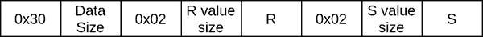

**Figure 10.10:** DER 编码

以下是 DER 编码组件的描述：

+   0x30 字节：表示复合结构

+   数据大小：此字节后面数据的大小

+   0x02：表示整数

+   R 值大小：R 的大小可能包括 0x00 前缀

+   R：这可能包括 0x00 前缀

+   S 值大小：S 的大小可能包括 0x00 前缀

+   S：这可能包括 0x00 前缀

我们正在使用的`**ecdsa**`包要求签名是*R*和*S*的连接。

以下代码返回连接的*R*和*S*：

`def getRandSFromSig(sig_b: bytes):`

`sig_m = bytes2Mmap(sig_b)`

`struct = sig_m.read(1)`

`size = sig_m.read(1)`

`rheader = sig_m.read(1)`

`rsize_b = sig_m.read(1)`

`rsize = int.from_bytes(rsize_b, byteorder=’little’)`

`if rsize == 33:`

`sig_m.read(1)`

`r = sig_m.read(32)`

`sheader = sig_m.read(1)`

`ssize_b = sig_m.read(1)`

`ssize = int.from_bytes(ssize_b, byteorder=’little’)`

`if ssize == 33:`

`sig_m.read(1)`

`s = sig_m.read(32)`

`return r + s`

**程序 10.5：**获取连接的 R 和 S 字节

我们需要构建签名前图以使用输入索引和当前执行的脚本进行签名验证。以下代码可以实现：

`def bytes2Mmap(b: bytes):`

`m = mmap.mmap(-1, len(b) + 1)`

`m.write(b)`

`m.seek(0)`

`return m`

#此方法返回变量整数值和变量整数字节

`def setVarInt(n: int):`

`if n < 0xfd:`

`n_h = ‘%02x’ % n`

`elif n > 0xfd and n < 0xffff:`

`n_h = ‘fd%04x’ % n`

`elif n > 0xffff and n < 0xFFFFFFFF:`

`n_h = ‘fe%08x’ % n`

`else:`

`n_h = ‘ff%016x’ % n`

`return bytes.fromhex(n_h)`

`def createMsgInputsForSig(tx: dict, script_b: bytes,`

`inp_index: int,`

`sighash_type: int,`

`inp_cnt: int):`

`msg_b = b’’`

`for i in range(inp_cnt):`

`tx_inp = tx[‘inputs’][i]`

`inp_b = bytes.fromhex(tx_inp[‘prev_tx_hash’])[::-1]`

`inp_b += struct.pack(‘<L’, tx_inp[‘prev_tx_out_index’])`

`if i == inp_index:`

`inp_b += bytes.fromhex(‘%02x’ % len(script_b))`

`inp_b += script_b`

`inp_b += struct.pack(‘<L’, tx_inp[‘sequence’]) # sequence`

`else:`

`inp_b += bytes(1)`

`inp_b += struct.pack(‘<L’, tx_inp[‘sequence’]) # sequence`

`msg_b += inp_b`

`return msg_b`

`def createMsgOutsForSig(tx: dict, inp_index: int, sighash_type: int):`

`msg_b = b’’`

`msg_b += setVarInt(tx[‘out_cnt’])`

`for o in range(tx[‘out_cnt’]):`

`tx_out = tx[‘outs’][o]`

`msg_b += struct.pack(‘<Q’, tx_out[‘satoshis’])`

`msg_b += setVarInt(tx_out['bytes_scriptpubkey'])`

`msg_b += bytes.fromhex(tx_out['scriptpubkey'])`

`return msg_b`

`def createMsgForSig(tx: dict, script_b: bytes, inp_index: int, sighash_type: int):`

`msg_b = bytes.fromhex(tx['version'])[:: -1]`

`inp_cnt = tx['inp_cnt']`

`msg_b += setVarInt(inp_cnt)`

`msg_b += createMsgInputsForSig(tx, script_b, inp_index, sighash_type, inp_cnt)`

`msg_b += createMsgOutsForSig(tx, inp_index, sighash_type)`

`msg_b += struct.pack('<L', tx['locktime'])`

`msg_b += struct.pack('<L', sighash_type)`

`return `msg_b``

**程序 10.6：** 创建签名前图像

我们使用调用上述方法生成的消息，并使用公钥来验证签名。我们编写了以下方法来验证给定输入索引处的交易签名：

`from cryptotools.ECDSA.secp256k1 import PublicKey`

`def uncompressPubkey(pubkey_b: bytes):`

`pubkey_P = PublicKey.decode(pubkey_b)`

`pubkey_b = PublicKey.encode(pubkey_P, compressed=False)`

`return pubkey_b`

`def sigcheck(sig_b: bytes, pubkey_b: bytes, script_b: bytes, inp_index: int, tx: dict):`

`sighash_type = sig_b[-1]`

`msg_b = createMsgForSig(tx, script_b, inp_index, sighash_type)`

`msg_h = hashlib.sha256(msg_b).digest()`

`prefix = pubkey_b[0:1]`

`if prefix == b"\x02" or prefix == b"\x03":`

`fullpubkey_b = uncompressPubkey(pubkey_b)[1:]`

`elif prefix == b"\x04":`

`fullpubkey_b = pubkey_b[1:]`

`rs_b = getRandSFromSig(sig_b)`

`vk = ecdsa.VerifyingKey.from_string(fullpubkey_b, curve=ecdsa.SECP256k1)`

`try:`

`if vk.verify(rs_b, msg_h, hashlib.sha256) == True:`

`print("签名有效")`

`return b'\x01'`

`else:`

`print("签名无效")`

`return b'\x00'`

`except ecdsa.keys.BadSignatureError:`

`print("签名无效")`

`return b'\x00'`

**程序 10.7：** 签名验证方法

我们可以使用上述程序来验证与 P2PKH 地址相关的交易签名。以下是验证 P2PKH 脚本所需的方法：

`def getScriptSig(tx: dict, inp_index: int):`

`return bytes.fromhex(tx[‘inputs’][inp_index][‘scriptsig’])`

`def getPrevScriptPubKey(tx: dict, inp_index: int):`

`prevtx_rb = bytes.fromhex(tx[‘inputs’][inp_index][‘prev_tx_hash’])[::-1]`

`prevtx_outindex = tx[‘inputs’][inp_index][‘prev_tx_out_index’]`

`prevtx = findTransaction(prevtx_rb, txindex_db_g)`

`prevScriptPubkey = prevtx[‘outs’][prevtx_outindex][‘scriptpubkey’]`

`prevScriptPubkey_b = bytes.fromhex(prevScriptPubkey)`

`return prevScriptPubkey_b`

`def verifyScript(tx: dict, inp_index: int):`

`scriptsig_b = getScriptSig(tx, inp_index)`

`execScript(scriptsig_b, inp_index, tx)`

`prev_scriptpubkey_b = getPrevScriptPubKey(tx, inp_index)`

`execScript(prev_scriptpubkey_b, inp_index, tx)`

`status = st.pop()`

`if status == b’\x01’:`

`print(‘1st Script succeeded’)`

`elif status == b’\x01’:`

`print(‘1st Script Failed’)`

`else:`

`print(‘1st Invalid state’)`

**程序 10.8：** 验证 P2PKH 脚本的方法

我们以下面这种方式来验证交易脚本 Sig：

`if __name__ == ‘__main__’:`

`txid_s = ‘2df97b379c9ce9e4a60529f555b9742c04f90b922c2fcff846ebae41206b93f9’`

`inp_index = 1`

`txid_b = bytes.fromhex(txid_s)[::-1]`

`tx = findTransaction(txid_b, txindex_db_g)`

`verifyScript(tx, inp_index)`

# **标准比特币脚本 - P2MS**](toc.xhtml#s223a)

P2MS 代表***Pay-2-Multisig***。这个脚本允许使用多个签名以访问被锁定的比特币。

脚本如下所示：

**ScriptPubKey:** `**OP_n <Public Key 1><Public Key 2>…<Public Key m>OP_m<Multisig>**`

**ScriptSig:** `**OP_0 <Signature 1><Signature 2>… <Signature n>**`

在一个 2-of-3-multisig 中，需要两个签名来认领由`**scriptPubKey**`锁定的资金。

这意味着当我们创建一个交易时，我们需要在脚本中有多个公钥。这些有以下缺点：

1.  交易将消耗比正常 P2PKH 脚本更多的字节，所以发送者将不得不支付更高的交易费。

1.  发送者即使要把比特币发送给一个接收者，也需要通过组合多个公钥来形成一个复杂的脚本。这对发送者来说是一种开销。

1.  如果量子计算机能够利用 Shor 算法来破解私钥和公钥加密，那么公钥可能不会保持安全。

在 2012 年，P2SH 作为一种软分叉被引入，解决了上述缺点，所以我们不会深入讨论这个脚本。

# **标准比特币脚本 - P2SH**](toc.xhtml#s224a)

P2SH 代表***Pay-2-Script-Hash***。正如这个名字 suggests，在这个散列中嵌入了一个脚本，只有当这个脚本满足时，才能进行支付。这主要用于允许使用多个签名以访问比特币。它于 2012 年作为软分叉引入。

由于 P2SH 脚本用脚本散列替换了多重签名脚本，所以发送者不需要向矿工支付额外的费用以包含他们的交易。

对于 P2SH，`**scriptSig**`是：

`<Signatures> <Redeem Scripts>`

`**scriptPubKey**`是：

`OP_HASH160 <20-byte Redeem Script hash> OP_EQUAL`

2-of-3 多重签名赎回脚本如下：

`<2><Public Key 1><Public Key 2><Public Key 3><3><Multisig>`

在 P2SH 中，需要执行两个脚本，即`**scriptPubKey**`和赎回脚本，以及给定的签名列表。这是一个特殊的脚本，执行方式略有不同。在这种情况下，维护一个栈的副本，一旦`**scriptPubKey**`执行完成，赎回脚本开始执行。

`script_m.

`pushdata(d)`

`elif v == b’\xa9’:`

The following illustration explains the execution of P2SH:

`v = script_m.read(1)`

+   `l = len(script_b)`

+   以下是更新后的`**execScript**`方法，它处理额外的操作码：

+   `def checkWrappedMultisig(st):`

`b = decodePushdata(script_m)`

`d = script_m.read(b)`

`elif v == b’\xa9’:`

`val = script_b[-2]`

`while script_m.tell() < l:`

`while script_m.tell() < l:`

`for pubkey_b in pubkey_l:`

`v = script_m.read(1)`

否则：

`st.append(b’\x00’)`

The following program identifies if we were executing P2SH script. This method is called after `**scriptSig**` is executed:

`script_b = st[-1]`

`break`

`b = decodePushdata(script_m)`

`script_b = st[-1]`

`st.append(b’\x00’)`

`break`

`elif b < 0x4f:`

To write a program that could verify signature against P2SH transaction output, we need to be able to identify P2SH as it involves three consecutive executions of scripts. Here are the three execution scripts:

以下插图解释了 P2SH 的执行：

`g_pushnumber = range(0x51, 0x61) # excludes 0x61`

`if v == b’\x01’:`

`if sig_index == sig_cnt:`

`# convert True/False to b’\x01’ or b’\x00’`

`num = b - 0x50`

`b = int.from_bytes(v, byteorder=’little’)`

如果 b 等于 0x00：

`b = int.from_bytes(v, byteorder=’little’)`

`return True`

`st.append(b)`

`opNum(b)`

`# 将真/假转换为 b'\x01'或 b'\x00'`

The following is the updated `**execScript**` method that handles additional opcodes:

如果签名索引等于签名总数：

`num = b - 0x50`

**Program 10.10:** Identify P2SH script

`opNum(b)`

`else:`

`elif b < 0x4f:`

`else:`

`def checkWrappedMultisig(st):`

否则：

`d = script_m.read(b)`

如果 v 等于 b’\x01’：

以下程序用于确定我们是否正在执行 P2SH 脚本。此方法在执行`**scriptSig**`后调用：

`sig_index += 1`

`st.append(b)`

`l = len(script_b)`

`pushdata(d)`

返回真。

`g_pushnumber = range(0x51, 0x61) # 不包括 0x61`

`val = script_b[-2]`

**程序 10.10：** 识别 P2SH 脚本

为了编写一个可以验证签名与 P2SH 交易输出的程序，我们需要能够识别 P2SH，因为它涉及到三个连续的脚本执行。以下是三个执行脚本：

`sig_index += 1`

`for pubkey_b in pubkey_l:`

`if b == 0x00:`

`elif v == b’\x87’:`

`opEqual()`

`elif v == b’\x88’:`

`opEqualVerify()`

`elif v == b’\xac’:`

`opCheckSig(script_b, inp_index, tx)`

`elif v == b’\xae’:`

`opCheckMultisig(script_b, inp_index, tx)`

**程序 10.11：P2SH 脚本执行**

以下方法执行 P2SH 脚本验证：

`def verifyScript(tx: dict, inp_index: int):`

`isP2SH = False`

`scriptsig_b = getScriptSig(tx, inp_index)`

`execScript(scriptsig_b, inp_index, tx)`

`prev_scriptpubkey_b = getPrevScriptPubKey(tx, inp_index)`

`if checkWrappedMultisig(st) == True:`

`redeemscript_b = st[-1]`

`isP2SH = True`

`execScript(prev_scriptpubkey_b, inp_index, tx)`

`status = st.pop()`

`if status == b’\x01’:`

`print(‘1st Script succeeded’)`

`elif status == b’\x01’:`

`print(‘1st Script Failed’)`

`else:`

`print(‘1st Invalid state’)`

`if isP2SH == True:`

`execScript(redeemscript_b, inp_index, tx)`

`status = st.pop()`

`if status == b’\x01’:`

`print(‘2nd Script succeeded’)`

`elif status == b’\x01’:`

`print(‘2nd Script Failed’)`

`else:`

`print(‘2nd Invalid state’)`

**程序 10.12：P2SH 验证方法**

我们按照以下方式调用前面所述方法来验证交易 scriptSig：

`if __name__ == ‘__main__’:`

`txid_s = ‘8b3e54e345d0b3e9278a27f1ab2aa2566aba8cbe7cf44b9aa1836c9d0fcc2625’`

`inp_index = 0`

`txid_b = bytes.fromhex(txid_s)[::-1]`

`tx = findTransaction(txid_b, txindex_db_g)`

`verifyScript(tx, inp_index)`

既然你已经理解了交易是如何被验证的，我们现在将创建交易并将 `**regtest**` 比特币从一个地址转移到另一个地址。

# **构建交易**

我们正在本子主题中尝试创建一个交易。为了构建交易，我们需要从之前的交易中资助交易。由于我们不想使用真实的比特币并且想要容易地挖出一个区块，我们使用了一个 `**regtest**` 环境。我们使用的交易输出需要是未花费的。如果交易已经被确认，我们可以在 *链状态数据库* 中找到该交易。如果资助交易没有确认，它将位于 mempool 中。我们使用来自链状态数据库的资助交易，而不是查看 mempool。我们已经定义了从链状态数据库检索 UTXO 的方法。以下方法用于获取未花费输出信息：

`getUnspentTransactions`

我们可以在****第六章，区块链，交易和挖矿****的 s**ubtopic** ***UTXO***，***程序 6.****20* 中查看方法实现。我们使用这个方法来获取 P2PKH 交易的 `**scriptPubKey**`。

下面的程序返回创建 P2SH 交易和为 P2SH 和 P2PKH 签名预图像所需的执行脚本。在下面的程序中，第一个参数是事务结构，它是一个`***dict***`，包含构建所需事务所需的信息。接下来的方法将在稍后用于从事务结构中给定的脚本的十六进制字符串中获取字节：

`def getExecutionScript(txn_struct: dict, inp_index: int):`

`inp = txn_struct[‘inputs’][inp_index]`

`script_type = inp[‘script_type’]`

``if script_type[:4] == ‘P2SH’:`

`script_b = bytes.fromhex(inp[‘redeem_script’])`

`elif script_type == ‘P2PKH’:`

`script_b = bytes.fromhex(inp[‘script_pubkey’])`

`return script_b`

**程序 10.13：** 获取在预图像中替换签名的执行脚本

我们在前面的方法中获得的脚本字节是`**createSignaturePreimage**`方法的输入*。*

在接下来的方法中，我们将根据给定的地址生成脚本的字节。在前面的章节中，我们已经了解了 P2PKH 和 P2SH 的结构，讨论了 P2PKH 和 P2H 脚本：

`def getScriptPubkeyP2PKH(address: str):`

`pkh_b = address2PubkeyHash(address)`

`pkhSize_b = encodePushdata(len(pkh_b))`

`scriptPubkey_b = bytes([OP_DUP, OP_HASH160]) \`

`+ pkhSize_b + pkh_b \`

`+ bytes([OP_EQUALVERIFY]) \`

`+ bytes([OP_CHECKSIG])`

`return scriptPubkey_b`

`def getScriptPubkeyP2SH(address: str):`

`sh_b = address2PubkeyHash(address)`

`shSize_b = encodePushdata(len(sh_b))`

`scriptPubkey_b = bytes([OP_HASH160]) \`

`+ shSize_b \`

`+ sh_b \`

`+ bytes([OP_EQUAL])`

`return scriptPubkey_b`

`def getScriptPubkeyFromAddress(address: str):`

`pkh_b = address2PubkeyHash(address)`

`pkhSize_b = encodePushdata(len(pkh_b))`

`script_type = getScriptTypeFromAddress(address)`

`if script_type == ‘P2PKH’:`

`scriptPubkey_b = getScriptPubkeyP2PKH(address)`

`elif script_type == ‘P2SH’:`

`scriptPubkey_b = getScriptPubkeyP2SH(address)`

`return scriptPubkey_b`

**程序 10.14：** 从地址准备脚本公钥

以下方法根据`**locktime**`字段生成交易输入的字节序列：

`def getSequence(txn_struct: dict):`

`if txn_struct[‘locktime’] > 0:`

`sequence_b = bytes([0xfe, 0xff, 0xff, 0xff])`

`else:`

`sequence_b = bytes([0xff, 0xff, 0xff, 0xff])`

`return sequence_b`

**程序 10.15：** 使用给定的锁定时间返回序列

以下是在后续方法中使用的实用方法：

`def createVarInt(i: int):`

`if i < 0xfd:`

`return bytes([i])`

`elif i < 0xffff:`

`return b’\xfd’ + struct.pack(‘<H’, i)`

`elif i < 0xffffffff:`

`return b’\xfe’ + struct.pack(‘<L’, i)`

`elif i < 0xffffffffffffffff:`

`return b’\xff’ + struct.pack(‘<Q’, i)`

`def address2PubkeyHash(address: str):`

`pkh = base58checkDecode(address)`

`return pkh`

`def encodePushdata(length: int):`

`if length <= 0x4b:`

`return bytes([length])`

`if length <= 0xff:`

`return bytes([OP_PUSHDATA1, length])`

`if length <= 0xffff:`

`return bytes([OP_PUSHDATA2]) + struct.pack(‘<H’, length)`

`if length <= 0xffffffff:`

`return bytes([OP_PUSHDATA4]) + struct.pack(‘<L’, length)`

`def getScriptTypeFromAddress(address: str):`

`if address[0] in [‘m’, ‘n’] or address[0] == ‘1’:`

`return “P2PKH”`

`elif address[0] == '2' or address[0] == '3':`

`return "P2SH"`

*图 10.16：* 构建交易所需的实用方法

以下是用于创建交易的操作码：

`OP_0 = 0x00`

`OP_DUP = 0x76`

`OP_EQUAL = 0x87`

`OP_EQUALVERIFY = 0x88`

`OP_HASH160 = 0xa9`

`OP_CHECKSIG = 0xac`

`OP_CHECKMULTISIG = 0xae`

签名预图是使用发送者的私钥签名的消息。以下方法使用前述方法生成签名预图：

`def createSignaturePreimage(txn_struct: dict,`

`script_b: bytes,`

`inp_index: int):`

`preimage_b = b''`

`preimage_b += struct.pack('<L', txn_struct['version'])`

`preimage_b += createVarInt(txn_struct['input_count'])`

`for i in range(txn_struct['input_count']):`

`inp = txn_struct['inputs'][i]`

`preimage_b += bytes.fromhex(inp['prevtxn'])[::-1]`

`preimage_b += struct.pack('<L', inp['prevtxnindex'])`

`if i == inp_index:`

`preimage_b += createVarInt(len(script_b))`

`preimage_b += script_b`

`else:`

`preimage_b += b'\x00'`

`preimage_b += getSequence(txn_struct)`

`preimage_b += createVarInt(txn_struct['out_count'])`

`for out in range(txn_struct['out_count']):`

`satoshis = txn_struct['outputs'][out]['satoshis']`

`preimage_b += struct.pack('<Q', satoshis)`

`address = txn_struct['outputs'][out]['address']`

`scriptPubkey_b = getScriptPubkeyFromAddress(address)`

`preimage_b += createVarInt(len(scriptPubkey_b))`

`preimage_b += scriptPubkey_b`

`preimage_b += struct.pack('<L', txn_struct['locktime'])`

`hashtype = txn_struct['inputs'][inp_index]['hash_type']`

`preimage_b += struct.pack('<L', hashtype)`

`print('preimage = ', preimage_b.hex())`

`return preimage_b`

**程序 10.17：** 准备签名预图

我们通过使用私钥对签名预图进行签名来生成签名。签名附加了`**hash_type**`。

这是代码：

`from ecdsa import SigningKey, SECP256k1`

`from ecdsa.util import sigencode_der_canonize`

`def signMessage(preimage_b: bytes,`

`privkey_wif: str,`

`hash_type: int):`

`hash_preimage = hash256(preimage_b)`

`privkey_s, network, compress = privkeyWif2Hex(privkey_wif)`

`if privkey_s.__len__() % 2 == 1:`

`privkey_s = “0{}”.format(privkey_s)`

`if compress == True:`

`print(‘压缩为真’)`

`privkey_b = bytes.fromhex(privkey_s)[:-1]`

`else:`

`privkey_b = bytes.fromhex(privkey_s)`

`sk = SigningKey.from_string(privkey_b, curve=SECP256k1)`

`sig_b = sk.sign_digest(hash_preimage,`

`sigencode=sigencode_der_canonize) \`

`+ bytes([hash_type])`

`return sig_b`

**程序 10.18：**签名消息的方法

在上述代码中，我们在`**ecdsa**`包中调用以下方法：

`sk.sign_digest(hash_preimage,`

`sigencode=sigencode_der_canonize)`

此方法使用预图像和私钥的哈希生成签名。我们知道生成的签名由 R 和 S 组成。由于比特币使用椭圆曲线算法`**SECP256k1**`，该算法在 X 轴上对称，因此可以使用 –S 获取相同的签名。这意味着对于同一个私钥和消息，有两个有效的签名。由于签名是交易的一部分，它使得两个交易 ID 代表同一笔交易，这是一个安全问题，也称为**交易可塑性**。交易可塑性还可能以其他方式发生。为了避免这个问题，我们使用 S 和 –S 中较小的那个。这就是为什么我们将`**sigencode_der_canonize**`参数传递给该方法的原因，它只生成**低 S**。

正如我们所见，`**ScriptSig**`具有以下结构：

+   **P2PKH:** `<签名> <公钥>`

+   **P2SH:** `OP_0 <签名 1><签名 2> … <签名 N> <Redeem Script>`

我们为每个资金交易输出创建 scriptSig：

`def getSignaturesAndExecScripts(txn_struct: dict):`

`signgrp_l = []`

`script_l = []`

`for inp_index in range(txn_struct[‘input_count’]):`

`inp = txn_struct[‘inputs’][inp_index]`

`script_b = getExecutionScript(txn_struct, inp_index)`

`preimage_b = createSignaturePreimage(txn_struct, script_b, inp_index)`

`inp = txn_struct[‘inputs’][inp_index]`

`signgrp = []`

对于每个 `privkey` 在 `inp[‘privkeys’]` 中：

`hashtype = inp[‘hash_type’]`

`sign_b = signMessage(preimage_b, privkey, hashtype)`

`signgrp.append(sign_b)`

`signgrp_l.append(signgrp)`

`script_l.append(script_b)`

返回 `txn_struct, signgrp_l, script_l`

**程序 10.19：** 准备签名和脚本列表的方法

我们使用 `**scriptSig**` 列表和交易结构来准备所需的交易，如下所示：

定义 `def getWithPushdata(data_b: bytes):`

`pushdata_b = encodePushdata(len(data_b))`

返回 `pushdata_b + data_b`

定义 `def createScriptSigForMultiSig(signgrp: list, script_b: bytes):`

`scriptSig_b = bytes([OP_0])`

对于每个 `sign_b` 在 `signgrp` 中：

`scriptSig_b += getWithPushdata(sign_b)`

`scriptSig_b += getWithPushdata(script_b)`

返回 `scriptSig_b`

定义 `def createScriptSigForP2PKH(txn_input: dict, signgrp: list):`

`sign_b = signgrp[0] # 它不是一个组.. 只是一个签名`

`scriptSig_b = getWithPushdata(sign_b)`

`privkey = txn_input[‘privkeys’][0]`

`pubkey_b = privkeyWif2pubkey(privkey)`

`scriptSig_b += getWithPushdata(pubkey_b)`

返回 `scriptSig_b`

定义 `def createSignedInput(txn_input: dict, signgrp, script_b: bytes):`

`prevtxn = txn_input[‘prevtxn’]`

`prevtx_rb = bytes.fromhex(prevtxn)[::-1]`

`prevtxnindex = txn_input[‘prevtxnindex’]`

`sgntxnin_b = prevtx_rb + struct.pack(‘<L’, prevtxnindex)`

如果 `txn_input[‘script_type’]` 为 `‘P2SH_Multisig’`：

`scriptSig_b = createScriptSigForMultiSig(signgrp, script_b)`

如果 `txn_input[‘script_type’]` 为 `‘P2PKH’`：

`scriptSig_b = createScriptSigForP2PKH(txn_input, signgrp)`

`sgntxnin_b += createVarInt(len(scriptSig_b)) + scriptSig_b`

返回 `sgntxnin_b`

在 P2PKH 脚本中，`scriptSig_b` 是签名加公钥

定义 `def scriptSigFromSignNPubkey(sign_b: bytes, pubkey_b: bytes):`

`scriptSig_b = getWithPushdata(sign_b)`

`scriptSig_b += getWithPushdata(pubkey_b)`

`return scriptSig_b`

`def createSignedTransaction(txn_struct: dict, signgrp_l: list, script_l: list):`

`sgntxn_b = b’’`

`sgntxn_b += struct.pack(‘<L’, txn_struct[‘version’])`

`sgntxn_b += createVarInt(txn_struct[‘input_count’])`

`for i in range(txn_struct[‘input_count’]):`

`txn_input = txn_struct[‘inputs’][i]`

`sgntxn_b += createSignedInput(txn_input, signgrp_l[i], script_l[i])`

`sgntxn_b += getSequence(txn_struct)`

`sgntxn_b += createVarInt(txn_struct[‘out_count’])`

`for out in range(txn_struct[‘out_count’]):`

`satoshis = txn_struct[‘outputs’][out][‘satoshis’]`

`sgntxn_b += struct.pack(‘<Q’, satoshis)`

`address = txn_struct[‘outputs’][out][‘address’]`

`scriptPubkey_b = getScriptPubkeyFromAddress(address)`

`sgntxn_b += createVarInt(len(scriptPubkey_b))`

`sgntxn_b += scriptPubkey_b`

`sgntxn_b += struct.pack(‘<L’, txn_struct[‘locktime’])`

`return sgntxn_b`

**程序 10.20：** 创建已签名交易

现在，我们可以为 P2PKH 和 P2SH 创建交易，并在比特币网络上发布。为此，我们需要私钥、公钥和地址。

我们使用 *第九章，钱包和地址* 中描述的方法生成密钥和地址，**在** *私钥、公钥和地址的格式和生成* **子主题** 下。

我们将使用以下私钥、公钥和地址：

| **私钥** | **公钥** | **地址** |
| --- | --- | --- |
| KwfxnwxpPG1RmhU8jaU8Ron4m1KZGymLAFNaMnSTonoZ7AQfnV53 | 0281238fc6d981efce6aa1b3ccb8556a1b115a40f8ab3315c003f415ceedc3defe | msMV395AdBAk2SfdDhBLq4uJZRS7doCn5T |
| L26JcHRhqEQv8V9DaAmE4bdszwqXS7tHznGYJPp7fxEoEQxxBPcQ | 037fadaea6edf196bf70af16cefb2bd3c830e54c0a6e9a00bf7806b241933547f7 | n1WvYkKU9i5RymcHeKFT4UworwqS6BKFSf |
| KxR8HHyfAwFPidCw2vXThXqT4vSMNeufirHFapnfCfkzLaohtujG | 02fcb1c7507db15576ab35cd7c9b1ea570141a8b81c9938dae0320392b0f7034d0 | miSFmBeKXf5Wp7Luj46XTu3Yh57nAwhZAo |
| KyWeQEcM2YdirR2E7JwxSRjfgNuWyt4DR3v4sGtPvmeZqhTxWVrp | 02d |
| Ky5CYfpeMkfFku7K4FvzeEwRmTJhWqD2eFiMnjLT7uw2oUVMgyg6 | 0319b4b9ab4732e78dab0e48c2c54fd57dd35350a0269f8c041807c3b798aa1872 | mnhWcUMqe9J1G4t3NMqNmLUqxfPTgwv7NK |
| L1cnATDVZyvuo9m6tprCmbr14vm3JeCbkc4Z2397ZM7P96N3d8GA | 039d5dbb6e052631c46e046c6d11fb95d257eae5093117d2c265aeb784dba4acf6 | mtRkMmpT6uhM9LXVPRk4ck9Gcaz9iuQgmZ |
| KyP1xynRgwrCUThXATVy5kbKqteAxisDFY74zrHozSGhb75hJ3M6 | 02dfa818542ab4685284f7c222d541e218aed0712fc9e63ca2802b15bb418383c9 | n2DfL6uEmPiwJBYjJRzyqUYDSTqxF8XSNS |

**Table 10.3:** 几个测试地址、公钥和私钥

我们启动比特币核心守护程序进行`**regtest**`，如下所示：

`bitcoind -regtest -printtoconsole –rpcuser=test –rpcpassword=test -txindex=1`

# 构建 P2PKH 交易

我们随后连接守护进程并生成两个区块，将比特币发送到一个特定的`**regtest**`地址。

为此，请运行带有`**regtest**`选项的 Bitcoin Core CLI，提供可选参数`**rpcuser**`和`**rpcpassword**`。`**rpcuser**`和`**rpcpassword**`选项允许客户端进行`**rpc**`连接。这对于使用 Python 包进行连接是必需的，但对于使用 CLI 进行连接则不是必需的。

在以下 CLI 语句中，我们生成两个区块，每个新生成的区块向给定地址支付 50。支付交易是 coinbase 交易，包含在生成的每个区块中。

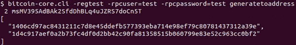

**图 10.12：** 显示了生成支付给给定地址的区块

我们从块散列中获取 coinbase 交易：

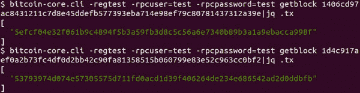

**图 10.13：** 显示生成的区块的 coinbase 交易

所以，我们现在有两个持有每个 50 regtest 比特币的交易：

`5efcf04e32f061b9c4894f5b3a59fb3d8c5c56a6e7340b89b3a1a9ebacca998f`

`53793974d074e57305575d711fd0acd1d39f406264de234e686542ad2d0ddbfb`

我们从第一个交易输出中获取`**scriptPubKey**`，如下所示：

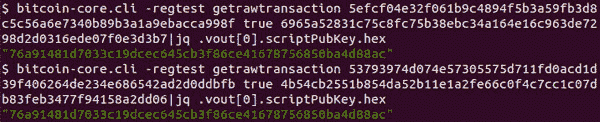

**图 10.14：** 显示了来自资助交易第一个输出的 scriptPubKey。

现在，我们在区块链中有两个区块，每个区块都有 50。有一个规则， coinbase 交易在接下来的 100 个区块内不能被花费。这个规则在网络遭受攻击或存在任何严重错误时很有用，需要重新组织比特币区块链。这意味着我们需要使软件的先前版本作废，部署修复问题的的新软件。我们可能还需要作废一些已经挖出的区块。这 100 个区块为开发者提供了大约 16 个小时来修复网络。过去，比特币开发者不得不进行两次重组，一次是 2010 年，一次是 2013 年。这显然影响了网络的可信度，我们不希望再次发生。

我们将挖掘另外 100 个区块，如下所述，以便能够使用之前的交易：

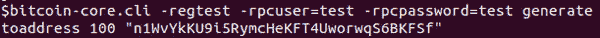

**图 10.15：** 显示生成 100 个区块的执行命令

我们将使用两个交易中的锁定比特币并将它们发送到两个不同的地址，并将 0.0001 regtest 比特币作为网络费用留下。我们首先创建一个没有签名的原始交易。以下代码定义了原始交易的结构：

`def createTransactionStruct():`

`txn = {}`

`txn[‘version’] = 1`

`txn[‘input_count’] = 2`

`txn[‘inputs’] = []`

`input0 = {}`

`input0[‘prevtxn’] = \`

`‘5efcf04e32f061b9c4894f5b3a59fb3d8c5c56a6e7340b89b3a1a9ebacca998f’`

`input0[‘prevtxnindex’] = 0`

`input0[‘script_type’] = ‘P2PKH’`

`input0[‘privkeys’] = [‘KwfxnwxpPG1RmhU8jaU8Ron4m1KZGymLAFNaMnSTonoZ7AQfnV53’]`

`input0[‘script_pubkey’] = ‘76a91481d7033c19dcec645cb3f86ce41678756850ba4d88ac’`

`input0[‘hash_type’] = SIGHASH_ALL`

`txn[‘inputs’].append(input0)`

`input1 = {}`

`input1[‘prevtxn’] = ‘53793974d074e57305575d711fd0acd1d39f406264de234e686542ad2d0ddbfb’`

`input1[‘prevtxnindex’] = 0`

`input1[‘script_type’] = ‘P2PKH’`

`input1[‘privkeys’] = [‘KwfxnwxpPG1RmhU8jaU8Ron4m1KZGymLAFNaMnSTonoZ7AQfnV53’]`

`input1[‘script_pubkey’] = ‘76a91481d7033c19dcec645cb3f86ce41678756850ba4d88ac’`

`input1[‘hash_type’] = SIGHASH_ALL`

`txn[‘inputs’].append(input1)`

`txn[‘out_count’] = 2`

`txn[‘outputs’] = []`

`output0 = {}`

`output0[‘satoshis’] = 40*(10**8)`

`output0[‘script_type’] = ‘P2PKH’`

`output0[‘address’] = ‘mxzmMmVycLDgAA48VtHDeh389eDAwiJqwQ’`

`txn[‘outputs’].append(output0)`

`output1 = {}`

`output1[‘satoshis’] = 599999*(10**4)`

`output1[‘script_type’] = ‘P2PKH’`

`output1[‘address’] = ‘miSFmBeKXf5Wp7Luj46XTu3Yh57nAwhZAo’`

`txn[‘outputs’].append(output1)`

`txn[‘locktime’] = 110 # 区块高度`

`return txn`

**Program 10.21:** 创建交易结构以用作 P2PKH 交易创建的输入的方法

我们调用以下代码来获取已签名交易的方法：

`if __name__ == ‘__main__’:`

`txn_struct = createTransactionStruct()`

`txn_struct, signgrp_l, script_l = getSignaturesAndExecScripts(txn_struct)`

`signed_txn_b = createSignedTransaction(txn_struct, signgrp_l, script_l)`

`print(signed_txn_b.hex())`

这是已签名的交易：

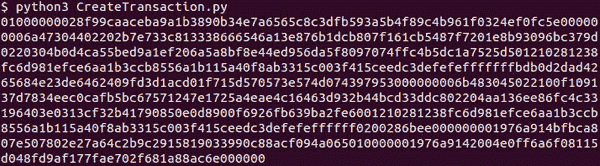

**图 10.16：** 显示程序创建的已签名交易

我们通过使用 *–*`**regtest**` 选项启动 Bitcoin Core 守护进程以获得 `**regtest**`。我们执行以下客户端：

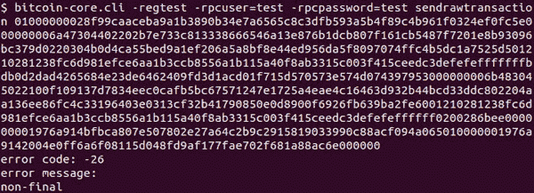

**图 10.17：** 显示交易未能发布

我们得到了一个错误消息 non-final，因为 locktime 高于当前区块计数：

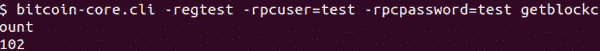

**图 10.18：** 显示获取最新区块高度的命令

我们创建了另外 8 个区块，然后再次发布交易：

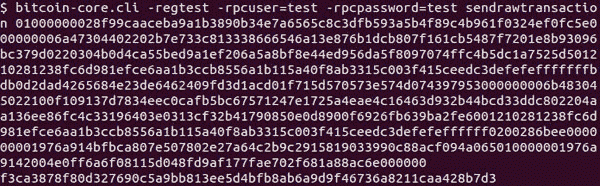

**图 10.19：** 显示一旦 locktime 条件满足，交易就会被发布

这次，交易成功发布，并且我们得到了交易 ID：

`efc4b90d71ff1e726924a5719fdbe9a548910aae20988c3dfa398575992100d6`

我们可以通过执行以下命令来查看已发布的交易：

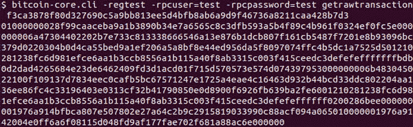

**图 10.20：** 使用 Bitcoin Core CLI 命令在内存池中显示交易十六进制数据

要将此交易添加到区块中，我们生成另一个区块，如下所示：

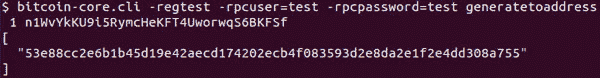

**图 10.21：** 显示下一个区块被挖掘

现在，我们可以看到已发布的交易已添加到新区块中：

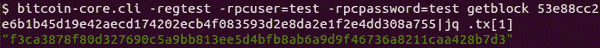

**图 10.22：** 显示在下一个区块中挖掘的交易

我们可以看到，生成一个区块后，我们创建的新交易被添加到新生成的区块中。现在，交易已确认，其深度为 1。

下一节将解释 P2PKH 交易的创建和发布。

# **构建 P2SH 交易](toc.xhtml#s227a)

在本节中，我们将创建一个交易并发布它。为此，我们需要生成一个区块，该区块支付给 P2SH 地址。P2SH 地址是通过生成赎回脚本的 hash160 值生成的。

我们使用以下方法生成赎回脚本：

`OP_CHECKMULTISIG = 0xae`

`def createRedeemScript(pubkey_l: list, sigcount: int):`

`redeem_script_b = bytes([0x50 + sigcount])`

`for pubkey in pubkey_l:`

`pubkey_b = bytes.fromhex(pubkey)`

`redeem_script_b += encodePushdata(len(pubkey_b)) + pubkey_b`

`redeem_script_b += bytes([0x50 + len(pubkey_l), OP_CHECKMULTISIG])`

`return redeem_script_b`

**程序 10.22：** 创建多签名赎回脚本的方法

我们正在创建赎回脚本，这需要使用与三个公钥相关的私钥的两个签名。所以，我们将使用 2-of-3 `**多签名**`。

我们传递三个公钥，以下代码中所需的签名数量是 2：

`if __name__ == ‘__main__’:`

`pubkey_l = ‘037fadaea6edf196bf70af16cefb2bd3c830e54c0a6e9a00bf7806b241933547f7’, ‘02fcb1c7507db15576ab35cd7c9b1ea570

`redeem_script_b = createRedeemScript(pubkey_l, 2)`

`print(‘赎回脚本 = %s’ % redeem_script_b.hex())`

`sh = hash160(redeem_script_b)`

`address = sh2address(sh)`

`print(‘P2SH 地址 = %s’ % 地址)`

执行上述代码行后，我们得到以下结果：

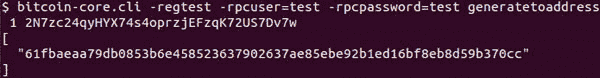

**图 10.24：** 显示支付给 P2SH 地址生成的区块

接下来，我们使用前一个 Bitcoin Core CLI 命令中的区块散列来获取 coinbase 交易的交易 ID：

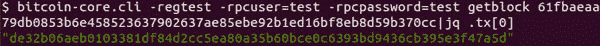

**图 10.25：** 显示将支付给 P2SH 交易的 coinbase 交易

我们需要获取生成的交易的结构，因为我们需要使用交易输出在交易中。

我们通过执行以下命令获取原始交易：

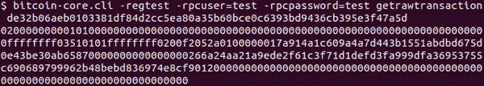

**图 10.26：** 显示支付给 P2SH 地址的 coinbase 交易的十六进制数据

通过执行以下命令，我们从原始交易中获取交易结构：

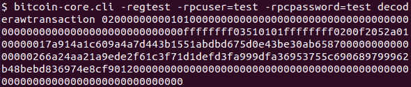

**图 10.27：** 显示获取交易十六进制数据内容的命令

以下是从前面命令生成的原始交易结构：

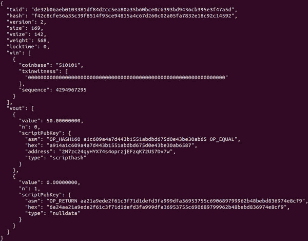

**图 10.28：** 显示解码的交易数据

我们使用生成的交易 ID 为 P2SH 交易创建交易结构，如下所示：

`def createTransactionStruct():`

`txn = {}`

`txn[‘version’] = 1`

`txn[‘input_count’] = 1`

`txn[‘inputs’] = []`

`input0 = {}`

`input0[‘prevtxn’] = \`

`‘de32b06aeb0103381df84d2cc5ea80a35b60bce0c6393bd9436cb395e3f47a5d’`

`input0[‘prevtxnindex’] = 0`

`input0[‘script_type’] = ‘P2SH_Multisig’`

`input0[‘privkeys’] = \`

`[‘L26JcHRhqEQv8V9DaAmE4bdszwqXS7tHznGYJPp7fxEoEQxxBPcQ’,`

`‘KxR8HHyfAwFPidCw2vXThXqT4vSMNeufirHFapnfCfkzLaohtujG’]`

`input0[‘redeem_script’] = ‘5221037fadaea6edf196bf70af16cefb2bd3c830e54c0a6e9a00bf7806b241933547f72102fcb1c7507db15576ab35cd7c9b1ea570141a8b81c9938dae0320392b0f7034d02102d50250aa629914e3146a5123a362a516c8aa95e5f0a6f3a078bd31fabe383abc53ae’`

`input0[‘hash_type’] = SIGHASH_ALL`

`txn[‘inputs’].append(input0)`

`txn[‘out_count’] = 2`

`txn[‘outputs’] = []`

`output0 = {}`

`output0[‘satoshis’] = 10*(10**8)`

`output0[‘script_type’] = ‘P2PKH’`

`output0[‘address’] = ‘mxzmMmVycLDgAA48VtHDeh389eDAwiJqwQ’`

`txn[‘outputs’].append(output0)`

`output1 = {}`

`output1[‘satoshis’] = 399999*(10**4)`

`output1[‘script_type’] = ‘P2PKH’`

`output1[‘address’] = ‘miSFmBeKXf5Wp7Luj46XTu3Yh57nAwhZAo’`

`txn[‘outputs’].append(output1)`

`txn[‘locktime’] = 0 # 区块高度`

`return txn`

`if __name__ == ‘__main__’:`

`txn_struct = createTransactionStruct()`

`txn_struct, signgrp_l, script_l = getSignaturesAndExecScripts(txn_struct)`

`signed_txn_b = createSignedTransaction(txn_struct, signgrp_l, script_l)`

`print(signed_txn_b.hex())`

**Program 10.23:** 创建交易结构的方法，用于 P2SH 交易创建的输入

这给出了以下已签名交易：

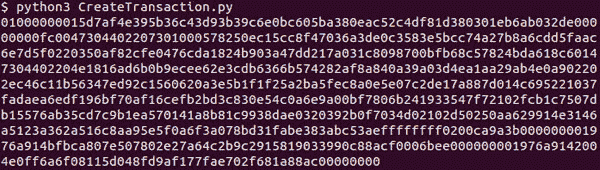

**Figure 10.29:** 显示了从 P2SH 地址转移比特币的已签名交易

我们需要在可以从 coinbase 交易输出中资助交易之前挖掘 100 个区块，因此我们将再次执行 CLI 命令 `**generatetoaddress**`。在发布交易之前，我们可以测试交易是否有效。我们可以通过运行以下比特币 CLI 命令来进行测试：

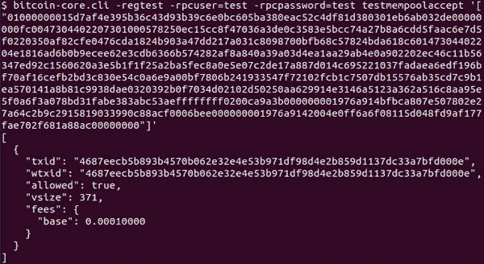

**Figure 10.30:** 显示交易是否有效并且可接受到内存池

我们可以看到交易是有效的，并且如果发送，将被 mempool 接受。如果我们在处理真正的比特币，这个命令可以通过验证一切是否正常来拯救我们。

现在，我们可以按如下方式发布交易：

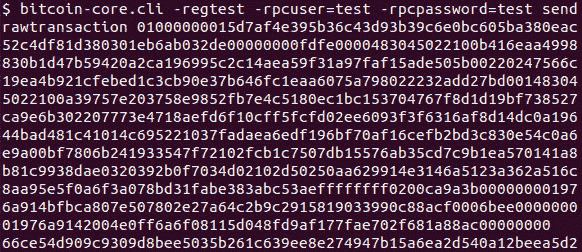

**图 10.31：** 展示了从 P2SH 地址转移比特币的交易已发布。

我们得到了`**66ce54d909c9309d8bee5035b261c639ee8e274947b15a6ea2d540a12beea5d2**`作为交易 ID。因此，我们成功地构建并发布了 P2SH 交易。

在本节中，您学会了使用交易结构中提供的信息构建和发布交易。

这就是本章的结束。

# 结论

在本章中，你学习了比特币脚本语言、其特点以及执行方式。你了解到脚本语言在交易验证中的使用。你了解了比特币使用的不同类型的脚本，并理解了比特币脚本的为什么和如何。此外，你还学会了创建交易并将其发布到比特币网络。这一章涉及了不少编码。

在下一章，你将学习并创建智能合约和其他有用的交易。

# 需记住的要点

+   比特币交易通过包含哈希的锁定脚本来保证安全，如果我们想要使用交易来资助新创建的交易，那么我们需要呈现相应的脚本或公钥。

+   为了创建一个新交易，我们还需要提供一个签名，通过基于脚本类型和哈希类型所需的格式签署一条消息。

+   比特币脚本语言基于 R*everse Posix* n*otation*。

+   当一个节点接收到一个新创建的交易时，它需要根据共识规则验证它，并需要验证用于解锁由`**scriptPubKey**`锁定的资金的`**scriptSig**`。

+   对于 P2PKH 脚本，`**scriptSig**`首先被执行，然后使用同一个栈执行前一个交易输出的`**scriptPubKey**`。结果位于栈顶。

+   在第一遍执行 P2SH 脚本时，执行`**scriptSig**`，然后执行`**scriptPubKey**`。在第三遍执行时，首先将签名推入栈中，然后执行赎回脚本。

+   新创建的交易可以通过使用 Bitcoin Core 命令`**sendrawtransaction**`发布到比特币网络。

+   如果你不想维护一个完整节点，你仍然可以使用 SPV 软件发布新创建的交易。此外，还有几个在线网站可以推送新交易。

+   在发送交易之前，我们可以使用 Bitcoin Core 命令`**decoderawtransaction**`对其进行解码，允许我们手动验证我们创建的交易。

+   我们还可以通过使用 Bitcoin Core 命令`**testmempoolaccept**`检查创建的交易是否有效。

+   P2PKH 和 P2SH 脚本在解锁资金的交易中隐藏公钥。

+   脚本语言提供了大量可以用来编写复杂智能合约的操作，但 P2SH 将这些复杂性隐藏发送者。

# 问题

1.  编写创建交易的程序：

    1.  创建一个具有三个输入和三个输出的 P2PKH 交易；它们的 sighash 类型都是 SIGHASH_ALL|SIGHASH_ANYONECANPAY。

    1.  创建一个具有三个输入和三个输出的 P2PKH 交易。两个输入的 sighash 类型为 SIGHASH_NONE|SIGHASH_ANYONECANPAY，第三个输入的 sighash 类型为 SIGHASH_ALL。

    1.  创建一个具有三个输入和三个输出的 P2PKH 交易。两个输入的 sighash 类型为 SIGHASH_SINGLE|SIGHASH_ANYONECANPAY，第三个输入的 sighash 类型为 SIGHASH_ALL

1.  编写一个通用程序，将任何比特币交易脚本的十六进制代码转换为可读脚本。

1.  为什么所有交易至少应该有一个输入使用 SIGHASH_ALL 签名？

1.  计算解锁前交易中的两个 P2PKH 输出并锁定到两个 P2PKH 脚本的交易费用，如果每字节交易费用为 10 萨思奇。

1.  选择正确的 sighash 类型：

    1.  SIGHASH_NONE|SIGHASH_ANYONECANPAY

    1.  SIGHASH_SINGLE|SIGHASH_ANYONECANPAY

    1.  SIGHASH_ALL|SIGHASH_ANYONECANPAY

    1.  雷努卡在另一个国家找到了工作。她的朋友们计划并一起从接受比特币支付的商店购买了一块手表。

    1.  一个社会服务机构正在为地震灾区购买衣物和食物。它要求人们通过提供已签名的交易输入来向他们捐款。

    1.  一所学校希望将其优秀学生送往参加全国学术会议。参会费用高昂，学校希望通过资助参会成本来帮助家长。

1.  真/假：

    1.  1-of-1 多签的 P2SH 脚本无效。

    1.  P2PKH 不允许使用未压缩的公钥。

    1.  在创建签名时，我们得到两个 S 值，我们选择较小的 S 值。

1.  填空：

    1.  一个交易所平台作为买家和卖家之间的托管人。卖家锁定他们的比特币，这样如果买方、卖方和托管人中任意两人同意卖家已收到钱，那么比特币就会被释放给买家。该平台实现 _____ 的 _____ 多签名。

    1.  一个地址与 P2PKH 或 P2SH 脚本有关，可以通过查看地址的 __________ 来确定，这对于主网 P2PKH 是 _____，对于主网 P2SH 脚本是 _______。

    1.  在执行 ___________ 脚本之后，才会验证 P2SH 脚本，除此之外还需要 scriptSig 和 scriptPubKey。``
