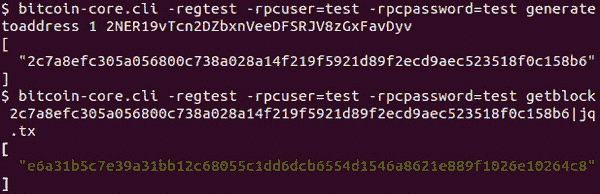
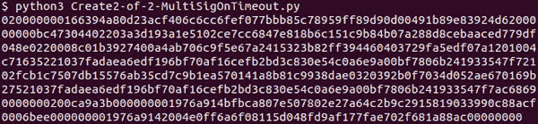
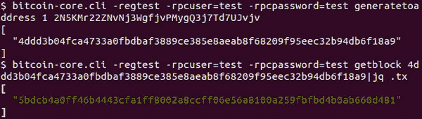

# 第十一章

# 智能合约与其他有用交易

在前一章中，你学习了如何验证和创建交易。你也学会了如何在发布之前检查它们的输入和输出以及正确性，并理解了发布交易的不同方法。在本章中，你将详细学习脚本编程。你将了解如何使用脚本语言实现简单但有趣的使用案例以及其他比特币交易的属性。

当我们想到智能合约时，我们会想到以太坊、卡尔达诺、币安智能链等。我们忽略了在智能合约方面领先的网络，即比特币。比特币是最安全的加密货币网络。由于智能合约和数字财产可能非常有价值，如果在技术上可行，将它们保存在比特币网络上可能是最佳选择。

在本章中，我们将深入研究脚本编程，并使用比特币脚本语言构建一些有用智能合约的使用案例。我们还将实现一些其他用例，这些用例不是各方之间的合同，但在解决实际需求方面很有用。

# 结构

在本章中，我们将涵盖以下主题：

+   脚本操作码

+   数字财产

    +   文档时间戳

+   时间锁定交易

    +   时间锁定支付

    +   具有相对锁定时间的支付

+   智能合约

    +   解决支付中的信任问题

        +   简单多签名支付

        +   具有相对锁定时间的改进支付

        +   涉及托管的支付

    +   涉及秘密标识符的支付

+   协作交易

    +   慈善用例

    +   补贴用例

    +   小组内计划的贡献

# 目标

本章的目标是帮助你理解比特币脚本语言更广泛的应用范围。此外，它还将帮助你学习为不同场景创建交易，包括智能合约和其他在前面章节中未涵盖的有用交易。

# 脚本操作码

在前一章中，我们只使用了在标准 P2PKH 和 m-of-n-multisig P2SH 脚本中使用的少数操作码。尽管这些足以处理个人和群体之间的基本货币转账，但可能需要更复杂的脚本。在本章中，我们将使用一些更多的操作码。

# 数字财产

数字资产或数字财产是资产的数字表示。财产可以表示为二维码或标识符或规格的哈希或价值。资产所有权可以由资产的所有者改变。它还可以在线借出或出租。使用比特币交易和脚本语言，我们可以实现其中一些功能。时间戳是数字资产管理的重要属性之一，我们将在本子主题中介绍。

# 文档时间戳

为了使文档具有法律约束力，并且成为合同的一部分，对其进行时间戳处理是必要的。区块中的交易可以与块的时间戳相关联，并且是不可变的。如果一个交易持有文档内容的散列值，那么我们可以认为该文档已被时间戳。然而，为了具有法律约束力，政府需要承认比特币区块链既是不可变的，又具有正确的时间戳。

以下是我女儿写的一篇短故事，我们将为它生成散列值并将其添加到交易中：

最佳朋友午餐派对：有一天，两只最好的朋友，一只猴子和一只鳄鱼决定在农场一起吃午饭。第二天，他们穿过河流到达农场。在丰盛的一餐后，猴子站起来大声咆哮。吓坏了的鳄鱼请求猴子停下来。但猴子说：“我每餐后都有咆哮的习惯，我忍不住”。猴子骑在鳄鱼背上穿越河流回家。当他们走到河中的一半时，鳄鱼在水里泡了一下。当猴子害怕时，鳄鱼说：“我每餐后都有泡水的习惯，我忍不住”。猴子明白了他的错误。

这个故事的 SHA256 散列值：

`3365b392ee14def189190638a532f6042446b74c98f186e9b595f77e47817e05`

以下是为前故事获取散列值的代码：

`def contentHash(story: str):`

`content_h = hashlib.sha256(story.encode(‘ascii’)).digest()`

`return content_h`

要将此添加到交易中，我们需要支付一点网络费用，将比特币从一个地址转移到另一个地址，并使用`**OP_RETURN**`捕获上面的散列值。

我们生成第一个区块，并将新挖掘的比特币发送到如图*11.1*所示的地址：

**图 11.1：生成的区块散列**

以下是新挖掘区块中包含的交易：

**图 11.2：币基交易的交易 ID**

在*第十章，创建和验证交易*中的*构建 P2PKH 交易*主题下，我们创建了一个具有两个输入和两个输出的 P2PKH 交易。我们修改代码以支持`**OP_RETURN**`输出。

这是为交易构建程序提供交易结构的代码：

`def createTransactionStruct():`

`txn = {}`

`txn[‘version’] = 1`

`txn[‘input_count’] = 1`

`txn[‘inputs’] = []`

`input0 = {}`

`input0[‘prevtxn’] = ‘5efcf04e32f061b9c4894f5b3a59fb3d8c5c56a6e7340b89b3a1a9ebacca998f’`

`input0[‘prevtxnindex’] = 0`

`input0[‘script_type’] = ‘P2PKH’`

`input0[‘privkeys’] = [‘KwfxnwxpPG1RmhU8jaU8Ron4m1KZGymLAFNaMnSTonoZ7AQfnV53’]`

`input0[‘script_pubkey’] = ‘76a91481d7033c19dcec645cb3f86ce41678756850ba4d88ac’`

`input0[‘hash_type’] = SIGHASH_ALL`

`txn[‘inputs’].append(input0)`

`txn[‘out_count’] = 2`

`txn[‘outputs’] = []`

`output0 = {}`

`output0[‘satoshis’] = 4999900000`

`output0[‘script_type’] = ‘P2PKH’`

`output0[‘address’] = ‘mxzmMmVycLDgAA48VtHDeh389eDAwiJqwQ’`

`txn[‘outputs’].append(output0)`

`output1 = {}`

`output1[‘satoshis’] = 0`

`output1[‘script_type’] = ‘OP_RETURN’`

`output1[‘content_hash256’] = ‘3365b392ee14def189190638a532f6042446b74c98f186e9b595f77e47817e05’`

`txn[‘outputs’].append(output1)`

`txn[‘locktime’] = 0`

`return txn`

**程序 11.1：** 文档时间戳交易结构定义

以下是 OP_RETURN 操作码的值：

`OP_RETURN = 0x6a`

在*第十章，创建和验证交易](c10.xhtml)*中，在主题***构建交易***下，我们已经定义了方法`**createSignaturePreimage 和 createSignedTransaction**`。我们向方法中添加以下行以处理 OP_RETURN 脚本类型：

`if outp[‘script_type’] == ‘OP_RETURN’:`

`content_b = bytes.fromhex(outp[‘content_hash256’])`

`scriptPubkey_b = bytes([OP_RETURN]) \`

`+ getWithPushdata(content_b)`

如同我们在*第十章，创建和验证交易*中做的那样，我们执行这个程序并获得原始交易的十六进制代码，如*图 11.3*所示：

**图 11.3：** 为文档打戳创建的交易十六进制代码

以下是新创建交易的输出：

**图 11.4：** 为文档时间戳创建的交易输出

现在，我们需要挖掘另外 100 个区块，以便我们使用的挖掘比特币准备好进行转账：

**图 11.5：** 挖掘接下来的 100 个区块

现在，发布新创建的交易：

**图 11.6：** 为文档打戳发布交易

现在，我们再次挖掘一个区块以将交易添加到新挖掘的区块中：

**图 11.7：** 挖掘下一个区块以包括发布的交易

以下是新挖掘区块中的内容。我们可以看到，该区块包含了新添加的交易：

**图

# **时间锁定交易](toc.xhtml#s236a)

Bitcoin 允许您为交易锁定特定时间或区块高度。它允许交易被锁定在固定时间或相对于资助交易的时间。

在以下小节中，我们将介绍固定和相对时间锁的使用案例。

# 时间锁定支付

我们也可以创建在给定时间戳之前不能花费的交易。这通过设置交易中的 nLockTime 字段来实现。nLockTime 字段可以设置为表示区块高度或表示 Unix 纪元时间。在纪元时间的情况下，它表示过去时间而不是区块的时间戳。

**nLockTime**字段有以下规则：

+   `**nLockTime**` < 500000000 表示区块高度

+   否则，它表示中位数过去时间

建议`**nLockTime**`不要设置为零或过去的区块高度或过去的区块时间。

中位数过去时间=（Tn-1，Tn-2，Tn-3，Tn-4，…Tn-10，Tn-11）的中值

以下代码为交易生成器程序提供了交易结构：

`def createTransactionStruct():`

`txn = {}`

`txn[‘version’] = 1`

`txn[‘input_count’] = 1`

`txn[‘inputs’] = []`

`input0 = {}`

`input0[‘prevtxn’] = ‘5efcf04e32f061b9c4894f5b3a59fb3d8c5c56a6e7340b89b3a1a9ebacca998f’`

`input0[‘prevtxnindex’] = 0`

`input0[‘script_type’] = ‘P2PKH’`

`input0[‘privkeys’] = [‘KwfxnwxpPG1RmhU8jaU8Ron4m1KZGymLAFNaMnSTonoZ7AQfnV53’]`

`input0[‘script_pubkey’] = ‘76a91481d7033c19dcec645cb3f86ce41678756850ba4d88ac’`

`input0[‘hash_type’] = SIGHASH_ALL`

`txn[‘inputs’].append(input0)`

`txn[‘out_count’] = 1`

`txn[‘outputs’] = []`

`output0 = {}`

`output0[‘satoshis’] = 4999900000`

`output0[‘script_type’] = ‘P2PKH’`

`output0[‘address’] = ‘mxzmMmVycLDgAA48VtHDeh389eDAwiJqwQ’`

`txn[‘outputs’].append(output0)`

`txn[‘locktime’] = 1624196667`

`return txn`

**程序 11.2：** 时间锁定支付的交易结构定义

我们得到了前述交易结构的以下已签名交易：

**图 11.9：** 为时间锁定支付创建交易

要能够发布前述交易，新创建的区块中的比特币需要可供花费。为此，我们创建另外 100 个区块。

我们现在试图发布交易，如 *图 11.10* 所示：

**图 11.10：** 发布时间锁定交易失败

由于区块的中位时间戳小于我们设置的锁定时间，交易发布失败：

**图 11.11：** 当前时间戳和上一个区块的时间戳

中位时间戳是通过计算最后 11 个区块中时间戳的中位数来计算的。为了获得一个大于交易中设置的锁定时间的中位时间戳值，我们等待几分钟并创建另外 11 个区块：

**图 11.12：** 挖掘下一个十一个区块以更改中位过去时间

现在，上一个生成区块的中位时间如下：

**图 11.13：** 获取过去的中位时间

此时间戳大于 1624196667：

**图 11.14：** 中位时间过去到现在

我们再次尝试发布交易：

**图 11.15：** 现在成功发布交易

我们可以看到，直到最新区块的中位时间戳不小于锁定时间，该交易才有效。

# 相对锁定时间的支付

交易中的 `**nLockTime**` 字段设置为静态区块高度或静态时期时间。如果新创建的交易需要等待相对于依赖区块的区块计数或时间戳的时间或区块计数，那么我们使用 `**OP_CHECKSEQUENCEVERIFY**`。

使用 `**OP_CHECKSEQUENCEVERIFY**` 操作码作为脚本实现相对锁定时间合约，因此我们使用具有赎回脚本的 P2SH。该操作码要求为相应的交易输入设置序列。

相对锁定时间是一个软分叉，需要将交易的版本号设置为 2。它还导致了对 `**nSequence**` 评估方式的更改。

在软分叉之前：

+   如果 nSequence 为 0xFFFFFFFE，则表示已设置 nLockTime。

+   如果 nSequence 为 0xFFFFFFFF，则表示未设置 nLockTime。

以下插图展示了软分叉后如何评估 nSequence：

**图 11.16：** nSequence 评估示例

下面列出了根据条件设置序列值的情况：

+   如果 nSequence > 0xEFFFFFFF，则未定义，因此该交易可包含在任何区块中。

+   如果 nSequence <= 0xEFFFFFFF，则第 22 位确定 0-15 位是表示区块高度还是时间戳。

    +   如果第 22 位设置，则 0-15 位表示区块高度。

    +   如果第 22 位未设置，则 0-15 位表示过去的中位时间。

这在以下代码中实现：

`def getSequence(txn_struct: dict, i: int):`

`inp = txn_struct[‘inputs’][i]`

`if ‘sequence_type’ in inp:`

`if inp[‘sequence_type’] == ‘time’:`

`sequence = inp[‘sequence’] | (1 << 22)`

`else:`

`sequence = inp[‘sequence’]`

`sequence_b = struct.pack(‘<L’, sequence)`

`else:`

`if txn_struct[‘locktime’] > 0:`

`# sequence`

`sequence_b = bytes([0xfe, 0xff, 0xff, 0xff])`

`else:`

`# sequence`

`sequence_b = bytes([0xff, 0xff, 0xff, 0xff])`

`return sequence_b`

**程序 11.3：** 计算 nSequence 的方法

要实现一个相对锁定时间的简单用例，在我们的用例中，新创建的交易只能在资金交易确认后的 105 个区块之后才能被挖掘。

以下是交易的赎回脚本：

`# 105 OP_CHECKSEQUENCEVERIFY OP_DROP`

`# <Alice 公钥> CHECKSIG`

这些是我们在这个交易中需要的操作码：

`OP_CHECKSEQUENCEVERIFY = 0xb2`

`OP_DROP = 0x75`

`OP_CHECKSIG = 0xac`

以下代码用于生成赎回脚本十六进制代码：

`def createRedeemScript(pubkey_alice: str):`

`redeem_script_b = bytes([0x01,`

`105, # 在 105 个区块之后`

`OP_CHECKSEQUENCEVERIFY, OP_DROP])`

`pubkey_b = bytes.fromhex(pubkey_alice)`

`redeem_script_b += createVarInt(len(pubkey_b)) + pubkey_b`

`redeem_script_b += bytes([OP_CHECKSIG])`

`return redeem_script_b`

**程序 11.4：** 为相对锁定时间创建赎回脚本的方法

我们按以下方式调用前面的方法：

`if __name__ == ‘__main__’:`

`pubkey_alice = ‘037fadaea6edf196bf70af16cefb2bd3c830e54c0a6e9a00bf7806b241933547f7’`

`redeem_script_b = createRedeemScript(pubkey_alice)`

`print(‘赎回脚本 = %s’ % redeem_script_b.hex())`

`sh = hash160(redeem_script_b)`

`address = sh2address(sh)`

`print(‘P2SH 地址 = %s’ % address)`

我们执行它并得到以下结果：

**图 11.17：** 为相对时间锁生成赎回脚本

我们生成一个区块，支付给前述赎回脚本指示的合约，然后获得交易 ID：

**图 11.18：** 相对时间锁定资金交易的交易 ID

现在我们使用以下代码创建一个新的交易：

`def createTransactionStruct():`

`txn = {}`

`txn[‘version’] = 2`

`txn[‘input_count’] = 1`

`txn[‘inputs’] = []`

`input0 = {}`

`input0[‘prevtxn’] = \`

`‘e6a31b5c7e39a31bb12c68055c1dd6dcb6554d1546a8621e889f1026e10264c8’`

`input0[‘prevtxnindex’] = 0`

`input0[‘script_type’] = ‘P2SH_RelativeTimeLock’`

`input0[‘privkeys’] = \`

`[‘L26JcHRhqEQv8V9DaAmE4bdszwqXS7tHznGYJPp7fxEoEQxxBPcQ’]`

`input0[‘redeem_script’] = ‘0169b27521037fadaea6edf196bf70af16cefb2bd3c830e54c0a6e9a00bf7806b241933547f7ac’`

`input0[‘hash_type’] = SIGHASH_ALL`

`input0[‘sequence’] = 105`

`input0[‘sequence_type’] = ‘block’`

`txn[‘inputs’].append(input0)`

`txn[‘out_count’] = 2`

`txn[‘outputs’] = []`

`output0 = {}`

`output0[‘satoshis’] = 10*(10**8)`

`output0[‘script_type’] = ‘P2PKH’`

`output0[‘address’] = ‘mxzmMmVycLDgAA48VtHDeh389eDAwiJqwQ’`

`txn[‘outputs’].append(output0)`

`output1 = {}`

`output1[‘satoshis’] = 399999*(10**4)`

`output1[‘script_type’] = ‘P2PKH’`

`output1[‘address’] = ‘miSFmBeKXf5Wp7Luj46XTu3Yh57nAwhZAo’`

`txn[‘outputs’].append(output1)`

`txn[‘locktime’] = 0`

`return txn`

**程序 11.5：** 创建相对锁定时间交易的方法

要索取上一笔交易中的锁定资金，我们提供了`**scriptSig**`，其中包含所需的签名和赎回脚本。下面是`**scriptSig**`的代码：

`def createScriptSigForRelTimeLock(signgrp: list, script_b: bytes):`

`scriptSig_b = getWithPushdata(signgrp[0])`

`scriptSig_b += getWithPushdata(script_b)`

`return scriptSig_b`

**程序 11.6：** 用于创建相对锁定时间的 scriptSig 方法

在*第十章，创建和验证交易*的***构建交易***主题下，我们已经定义了`**createSignedInput**`方法。我们在方法中添加以下行以处理*相对时间锁定*的脚本类型：

`elif txn_input[‘script_type’] == ‘P2SH_RelativeTimeLock’:`

`scriptSig_b = createScriptSigForRelTimeLock(signgrp, script_b)`

我们执行代码并得到签名的原始交易：

**图 11.19：** 为相对时钟事务创建十六进制代码

如果我们在挖掘了 105 个区块之前发布前述交易，我们会收到以下错误：

**图 11.20：** 在要求的区块高度之前发布相对时钟事务

当我们在输入事务后挖掘了 105 个区块后，我们可以发布前述交易：

**图 11.21：** 在要求的区块高度之后发布相对时钟事务

# 智能合约

*智能合约* 是两个或更多方之间以可执行计算机程序形式编写的合同。只有在合同允许执行时它才会执行，执行时智能合约遵循合同中定义的条件。

比特币提供了一种基于逆波兰表示法的原始脚本语言。该脚本不是图灵完备的，这意味着它不能解决所有计算问题。由于智能合约是程序化的合同模型，它们可以通过循环和状态变量变得比比特币脚本允许的更复杂。

它拥有大量可以用来创建各种智能合约的操作码。尽管操作码很多，但并非一切都可通过脚本实现。

此外，比特币交易本身对脚本施加了限制。由于比特币交易费用是基于每 v 字节计算的，并且相当高，因此一个复杂且较大的赎回脚本可能会使智能合约在经济上不可行。

以下是智能合约在比特币上的一些限制：

+   在交易中，智能合约只能影响一个输入。

    +   智能合约只能从具有固定价值的单个未花费交易输出（UTXO）中资助交易。

    +   根据智能合约，交易输出不能被修改。

    +   输出脚本是标准的，只能是标准脚本中的一种，如 P2SH、P2PKH、OP_RETURN、P2PK 或 P2MS 和标准的 segwit 脚本，这些我们将在下一章中介绍。

+   比特币脚本不是图灵完备的语言，并且没有选项：

    +   具有循环等非确定性操作。

    +   作为状态机工作并根据其状态执行操作。

+   比特币脚本限于它提供的操作码。

+   在比特币上编写脚本成本很高，智能合约的复杂性也取决于其经济可行性。

# 支付中信任问题的解决方案

我们知道简单的支付方法是将比特币转到收款人的地址。这可以在你的移动钱包中通过扫描二维码来完成。这对于小额支付来说很好，但随着比特币价格的上涨，交易费用也在增加，因此用低价格商品进行支付在经济上并不可行。

对于大额支付，我们需要提高支付的安全性。我们将按照以下子主题逐一解决，以提高支付的安全性。

# 简单的多重签名支付

买方和卖方之间的 2-of-2 多重签名是一种当信任方需要依赖非信任实体提供的服务时，确保支付安全的方法。例如，考虑一个知名企业需要从一家未受监管的小型供应商那里获得一项服务。

在这种情况下，商家将资金锁定在 2-of-2-multisig 地址中，并在从小供应商那里收到服务后才完成支付。锁定的资金作为商家和小供应商之间的智能合约。这给小型供应商带来了保证，因为他们将得到支付，因为大型商家无法取回资金。

# **带有相对锁定时间的改进支付**

上述支付用例中的问题是小型供应商在提供所需服务时延迟。他们知道资金被锁定了，所以在工作上面可能会有些疏忽。

为了解决这个问题，必须有一种方式使得商家能够撤销。然而，商家不应该能够随意撤销支付。这可以通过相对锁定时间实现，这样双方都知道比特币被锁定了，但有一定的时间限制。如果供应商在规定时间内没有提供服务，支付将会被撤销。

以下插图可以帮助理解用例。在这里，Alice 代表可信赖的商家，而 Bob 代表一个小型的不可信赖的供应商：

**图 11.22:** 带有相对锁定时间的改进支付

为了实现这一点，我们使用以下赎回脚本的 P2SH 交易：

`#IF`

`# OP_2 <Alice 的公钥> <Bob 的公钥> OP_2 CHECKMULTISIG`

`#ELSE`

`# 105 CHECKSEQUENCEVERIFY DROP`

`# <Alice 的公钥> CHECKSIG`

`#ENDIF`

在正常情况下，即没有争议时，双方签署支付 Bob 的交易。如果有争议，Alice 等待超时，然后创建由她自己的私钥签署的交易，将锁定金额转至她的地址。

需要记住的一点是，一旦有效，条件总是有效的。所以，如果 Alice 想给 Bob 更多的时间，她仍然可以做到。

以下是需要创建赎回脚本的必需操作码：

`OP_2 = 0x52`

`OP_IF = 0x63`

`OP_ELSE = 0x67`

`OP_ENDIF = 0x68`

`OP_CHECKSEQUENCEVERIFY = 0xb2`

`OP_DROP = 0x75`

`OP_CHECKMULTISIG = 0xae`

`OP_CHECKSIG = 0xac`

赎回脚本用于生成合同地址，在该地址中锁定合同金额。以下代码用于生成赎回脚本：

`def createRedeemScript2_2_seqcheck(pubkey_l: list):`

`redeem_script_b = bytes([OP_IF, OP_2])`

`for pubkey in pubkey_l: # Alice + Bob`

`pubkey_b = bytes.fromhex(pubkey)`

`redeem_script_b += createVarInt(len(pubkey_b)) + pubkey_b`

`redeem_script_b += bytes([OP_2, OP_CHECKMULTISIG])`

`redeem_script_b += bytes([OP_ELSE, 0x01,`

`105, # after 105 blocks`

`OP_CHECKSEQUENCEVERIFY, OP_DROP])`

`pubkey_b = bytes.fromhex(pubkey_l[0]) # Alice 公钥`

`redeem_script_b += createVarInt(len(pubkey_b)) + pubkey_b`

`redeem_script_b += bytes([OP_CHECKSIG, OP_ENDIF])`

`return redeem_script_b`

**程序 11.7:** 带有相对锁定时间的支付赎回脚本

我们使用以下脚本调用方法：

`if __name__ == ‘__main__’:`

`pubkey_l = [‘037fadaea6edf196bf70af16cefb2bd3c830e54c0a6e9a00bf7806b241933547f7’, ‘02fcb1c7507db15576ab35cd7c9b1ea570141a8b81c9938dae0320392b0f7034d0’]`

`redeem_script_b = createRedeemScript2_2_seqcheck(pubkey_l)`

`print(‘赎回脚本 = %s’ % redeem_script_b.hex())`

`sh = hash160(redeem_script_b)`

`address = sh2address(sh)`

`print(‘P2SH 地址 = %s’ % address)`

调用该方法后，我们得到以下赎回脚本和地址：

**图 11.23：** 生成相对锁定时间的支付赎回脚本

我们生成一个区块来支付到这个地址：

**图 11.24：** 生成支付赎回脚本的区块

我们从区块哈希中获取交易 ID：

**图 11.25：** 从生成的区块获取交易 ID

我们生成另外 100 个区块，以便此交易可供支付。正如你所学到的，此合约有两种可能的结果。

另外，`**OP_CHECKSEQUENCEVERIFY**` 是一个软分叉，需要交易版本等于或大于 2。因此，在以下交易结构中，我们将使用版本 2：

`def createTransactionStruct():`

`txn = {}`

`txn[‘version’] = 2`

`txn[‘input_count’] = 1`

`txn[‘inputs’] = []`

`input0 = {}`

`input0[‘prevtxn’] = \`

`‘624d92839eb89104d0909df89f95785cb8bb77f0fec66c6c40cf3ad2804a3966’`

`input0[‘prevtxnindex’] = 0`

`input0[‘script_type’] = ‘P2SH_Condition’`

`input0[‘condition’] = True`

`input0[‘privkeys’] = \`

`[‘L26JcHRhqEQv8V9DaAmE4bdszwqXS7tHznGYJPp7fxEoEQxxBPcQ’,`

`‘KxR8HHyfAwFPidCw2vXThXqT4vSMNeufirHFapnfCfkzLaohtujG’]`

`input0[‘redeem_script’] = ‘635221037fadaea6edf196bf70af16cefb2bd3c830e54c0a6e9a00bf7806b241933547f72102fcb1c7507db15576ab35cd7c9b1ea570141a8b81c9938dae0320392b0f7034d052ae670169b27521037fadaea6edf196bf70af16cefb2bd3c830e54c0a6e9a00bf7806b241933547f7ac68’`

`input0[‘hash_type’] = SIGHASH_ALL`

`txn[‘inputs’].append(input0)`

`txn[‘out_count’] = 2`

`txn[‘outputs’] = []`

`output0 = {}`

`output0[‘satoshis’] = 10*(10**8)`

`output0[‘script_type’] = ‘P2PKH’`

`output0[‘address’] = ‘mxzmMmVycLDgAA48VtHDeh389eDAwiJqwQ’`

`txn[‘outputs’].append(output0)`

`output1 = {}`

`output1[‘satoshis’] = 399999*(10**4)`

`output1[‘script_type’] = ‘P2PKH’`

`output1[‘address’] = ‘miSFmBeKXf5Wp7Luj46XTu3Yh57nAwhZAo’`

`txn[‘outputs’].append(output1)`

`txn[‘locktime’] = 0 # 区块高度`

`return txn`

**程序 11.8：** 用于创建 True 条件的交易的方法

对于赎回脚本，我们需要提供像普通多签脚本中一样的 Alice 和 Bob 的公钥。在这里，我们还需要提供`**OP_1**`或 True 到脚本。

因此，包含赎回脚本的 `**scriptSig**` 如下所示：

`#OP_0`

`#<Alice’s Signature>`

`#<Bob’s Signature>`

`#OP_1 (True)`

`#IF`

`# OP_2 <Alice’s pubkey> <Bob’s pubkey> OP_2 CHECKMULTISIG`

`#ELSE`

`# 105 CHECKSEQUENCEVERIFY DROP`

`# <Alice’s pubkey> CHECKSIG`

`#ENDIF`

我们在方法 `**createSignedInput**` 中进一步添加以下条件，以处理上述条件脚本的 *P2SH_Condition*：

`elif txn_input[‘script_type’] == ‘P2SH_Condition’:`

`scriptSig_b = createScriptSigForCond(signgrp,`

`script_b,`

`txn_input[‘condition’])`

我们还为自定义条件创建 `**scriptSig**`，如下所示：

`OP_FALSE = 0x00`

`OP_TRUE = 0x51`

`#########################`

`#True 情况`

`#OP_0`

`#<爱丽丝的签名>`

`#<鲍勃的签名>`

`#OP_TRUE（True）`

`#########################`

`#False 情况`

`#<爱丽丝的签名>`

`#OP_FALSE（False）`

`#########################`

`#需要根据用例自定义`

`def `**createScriptSigForCond**`(signgrp: `**list**`,`

`script_b: bytes,`

`cond: bool):`

`if cond:`

`scriptSig_b = bytes([OP_0])`

`for sign_b in signgrp:`

`scriptSig_b += getWithPushdata(sign_b)`

`scriptSig_b += bytes([OP_TRUE])`

`scriptSig_b += getWithPushdata(script_b)`

`else:`

`scriptSig_b = encodePushdata(len(signgrp[0])) + signgrp[0]`

`scriptSig_b += bytes([OP_FALSE])`

`scriptSig_b += encodePushdata(len(script_b)) + script_b`

`return scriptSig_b`

**程序 11.9：**用于条件处理的 ScriptSig

在执行代码时，我们得到以下已签名的原始交易：

**图 11.26：**用于相对锁定时间付款的交易十六进制代码

我们解码前述脚本并得到以下解码脚本：

**图 11.27：**相对锁定付款交易中的 ScriptSig

我们发布刚刚创建的交易如下：

**图 11.28：**带相对锁定的付款交易被发布

这展示了脚本在正常条件下的工作原理。在争议条件下，执行`**OP_ELSE**`条件，并且我们需要将交易保持在内存池中，直到满足`**OP_CHECKSEQUENCEVERIFY**`条件。如果我们在到期时间之前发布交易，它将被拒绝。为此，我们需要额外设置大于 105 的序列。

因此，我们修改交易结构如下：

`#2-of-2 多重签名与条件`

`def createTransactionStruct():`

`txn = {}`

`txn[‘version’] = 2`

`txn[‘input_count’] = 1`

`txn[‘inputs’] = []`

`input0 = {}`

`input0[‘prevtxn’] = \`

`‘624d92839eb89104d0909df89f95785cb8bb77f0fec66c6c40cf3ad2804a3966’`

`input0[‘prevtxnindex’] = 0`

`input0[‘script_type’] = ‘P2SH_Condition’`

`input0[‘condition’] = False`

`input0[‘privkeys’] = \`

`[‘L26JcHRhqEQv8V9DaAmE4bdszwqXS7tHznGYJPp7fxEoEQxxBPcQ’]`

`input0[‘redeem_script’] = ‘635221037fadaea6edf196bf70af16cefb2bd3c830e54c0a6e9a00bf7806b241933547f72102fcb1c7507db15576ab35cd7c9b1ea570141a8b81c9938dae0320392b0f7034d052ae670169b27521037fadaea6edf196bf70af16cefb2bd3c830e54c0a6e9a00bf7806b241933547f7ac68’`

`input0[‘hash_type’] = SIGHASH_ALL`

`input0[‘sequence’] = 110`

`input0[‘sequence_type’] = ‘block’`

`txn[‘inputs’].append(input0)`

`txn[‘out_count’] = 2`

`txn[‘outputs’] = []`

`output0 = {}`

`output0[‘satoshis’] = 10*(10**8)`

`output0[‘script_type’] = ‘P2PKH’`

`output0[‘address’] = ‘mxzmMmVycLDgAA48VtHDeh389eDAwiJqwQ’`

`txn[‘outputs’].append(output0)`

`output1 = {}`

`output1[‘satoshis’] = 399999*(10**4)`

`output1[‘script_type’] = ‘P2PKH’`

`output1[‘地址’] = ‘miSFmBeKXf5Wp7Luj46XTu3Yh57nAwhZAo’`

`txn[‘outputs’].append(output1)`

`txn[‘locktime’] = 0 # 区块高度`

`return txn`

**程序 11.10:** 方法——在假定条件下创建交易

在执行修改后的代码后，我们得到以下签名交易：

**图 11.29:** 带有相对锁定的支付交易发布

如果我们尝试在 106 个区块被挖出之前执行这个脚本，我们会得到以下错误：

**图 11.30:** 在所需区块高度之前未能发布的相对锁定支付

但是当 110 个区块被挖出后，我们可以发布它，如下截图所示：

**图 11.32:** 涉及托管方的支付流程图

对于编程这部分，我们只需要 2-of-3 多签名而不是之前的 2-of-2 多签名带相对超时，我们之前在小节中已经讨论过了。

所以，新的赎回脚本如下：

`#IF`

`# OP_2 <Alice 的公开密钥><Bob 的公开密钥><托管方的公开密钥> OP_3 OP_CHECKMULTISIG`

`#ELSE`

`# 105 CHECKSEQUENCEVERIFY DROP`

`# <Alice 的公开密钥> CHECKSIG`

`#ENDIF`

我们将把这个作为一个给读者的作业。

# 涉及秘密标识符的支付

考虑一个秘密特工在敌对领土执行任务的情况。一些物品需要转交给他们，以便完成任务。如果他们收到了那个包裹，那么任务就完成了；否则，任务就取消了。为了执行任务，他们需要得到付款。所以，他们只能在收到包裹后才能索赔付款。

在这种情况下，需要创建一个带有相对锁定时间并处于成功条件的合约，代理需要在成功条件下揭示秘密。

以下是合约的赎回脚本：

`#IF`

`# OP_SHA256 <秘密哈希> OP_EQUALVERIFY`

`# <代理方的公开密钥> CHECKSIG`

`#ELSE`

`# 105 CHECKSEQUENCEVERIFY DROP`

`# <机构方的公开密钥> CHECKSIG`

`#ENDIF`

以下是的操作码及其十六进制值：

`OP_2 = 0x52`

`OP_IF = 0x63`

`OP_ELSE = 0x67`

`OP_ENDIF = 0x68`

`OP_CHECKSEQUENCEVERIFY = 0xb2`

`OP_EQUALVERIFY = 0x88`

`OP_DROP = 0x75`

`OP_SHA256 = 0xa8`

`OP_CHECKSIG = 0xac`

**程序 11.11：** 用于包含密钥进行付款的赎回脚本中使用的操作码

以下是生成赎回脚本的代码：

`def createRedeemScriptWithSecretHash(pubkey_agency: str, pubkey_agent: str, secret_h: bytes):`

`redeem_script_b = bytes([OP_IF, OP_SHA256])`

`redeem_script_b += createVarInt(len(secret_h)) + secret_h`

`redeem_script_b += bytes([OP_EQUALVERIFY])`

`pubkey_b = bytes.fromhex(pubkey_agent)`

`redeem_script_b += createVarInt(len(pubkey_b)) + pubkey_b`

`redeem_script_b += bytes([OP_CHECKSIG])`

`redeem_script_b += bytes([OP_ELSE, 0x01,`

`105, # 在 105 个块后`

`OP_CHECKSEQUENCEVERIFY, OP_DROP])`

`pubkey_b = bytes.fromhex(pubkey_agency)`

`redeem_script_b += createVarInt(len(pubkey_b)) + pubkey_b`

`redeem_script_b += bytes([OP_CHECKSIG, OP_ENDIF])`

`return redeem_script_b`

**程序 11.12：** 用于创建包含密钥进行付款的赎回脚本的方法

我们通过传递公钥和密钥调用该方法，并在以下代码中生成地址：

`if __name__ == ‘__main__’:`

`pubkey_agency = ‘037fadaea6edf196bf70af16cefb2bd3c830e54c0a6e9a00bf7806b241933547f7’`

`pubkey_agent = ‘02fcb1c7507db15576ab35cd7c9b1ea570141a8b81c9938dae0320392b0f7034d0’`

`secret = ‘She sells seashells on the seashore’`

`secret_h = hashlib.sha256(secret.encode(‘utf-8’)).digest()`

`redeem_script_b = createRedeemScriptWithSecretHash(pubkey_agency, pubkey_agent, secret_h)`

`print(‘redeem script = %s’ % redeem_script_b.hex())`

`sh = hash160(redeem_script_b)`

`address = sh2address(sh)`

`print(‘P2SH 地址 = %s’ % address)`

调用该方法并为赎回脚本生成地址后，我们得到以下结果：

**图 11.33：** 涉及秘密代码支付的赎回脚本

在下面的截图中，我们生成一个块来支付给 P2SH 地址，然后获取所创建的 Coinbase 交易的交易 ID：

**图 11.34：** 用于涉及秘密代码的资金支付的 Coinbase 交易 ID

如果包裹送达代理，他们可以使用秘密代码接收支付。在这种情况下，赎回脚本中条件的 True 部分将被执行。我们创建提供秘密的交易结构如下：

`def createTransactionStruct():`

`txn = {}`

`txn[‘version’] = 1`

`txn[‘input_count’] = 1`

`txn[‘inputs’] = []`

`input0 = {}`

`input0[‘prevtxn’] = \`

`‘5bdcb4a0ff46b4443cfa1ff8002a8ccff06e56a8100a259fbfbd4b0ab660d481’`

`input0[‘prevtxnindex’] = 0`

`input0[‘script_type’] = ‘P2SH_WithSecret’`

`input0[‘privkeys’] = \`

`[‘KxR8HHyfAwFPidCw2vXThXqT4vSMNeufirHFapnfCfkzLaohtujG’]`

`input0[‘redeem_script’] = ‘63a82009b5eb7277b9d5062d91fe20f141ad4dd81970fd0baa72d31ee346a7c48d5b8c882102fcb1c7507db15576ab35cd7c9b1ea570141a8b81c9938dae0320392b0f7034d0ac670169b27521037fadaea6edf196bf70af16cefb2bd3c830e54c0a6e9a00bf7806b241933547f7ac68’`

`input0[‘secret’] = ‘She sells seashells on the seashore’`

`input0[‘condition’] = True`

`input0[‘hash_type’] = SIGHASH_ALL`

`txn[‘inputs’].append(input0)`

`txn[‘out_count’] = 2`

`txn[‘outputs’] = []`

`output0 = {}`

`output0[‘satoshis’] = 10*(10**8)`

`output0[‘script_type’] = ‘P2PKH’`

`output0[‘address’] = ‘mxzmMmVycLDgAA48VtHDeh389eDAwiJqwQ’`

`txn[‘outputs’].append(output0)`

`output1 = {}`

`output1[‘satoshis’] = 399999*(10**4)`

`output1[‘script_type’] = ‘P2PKH’`

`output1[‘address’] = ‘miSFmBeKXf5Wp7Luj46XTu3Yh57nAwhZAo’`

`txn[‘outputs’].append(output1)`

`txn[‘locktime’] = 0 # 区块高度`

`return txn`

**程序 11.13：** 用秘密创建交易的方法

通过以下`**scriptSig**`完成：

`#<Agent’s signature>`

`#<secret>`

`#OP_1`

`#IF`

`# OP_SHA256 <secret_hash> OP_EQUALVERIFY`

`# <Agent’s pubkey> CHECKSIG`

`#ELSE`

`# 105 CHECKSEQUENCEVERIFY DROP`

`# <Agency’s pubkey> CHECKSIG`

`#ENDIF`

在以下代码中完成此操作：

`def createScriptSigWithSecret(signgrp: list, script_b: bytes, secret: str, cond: bool):`

`if cond:`

`scriptSig_b = getWithPushdata(signgrp[0])`

`secret_b = secret.encode(‘utf-8’)`

`scriptSig_b += getWithPushdata(secret_b)`

`scriptSig_b += bytes([OP_TRUE])`

`else:`

`scriptSig_b = getWithPushdata(signgrp[0])`

`scriptSig_b += bytes([OP_FALSE])`

`scriptSig_b += getWithPushdata(script_b)`

`return scriptSig_b`

**程序 11.14：** 准备用于秘密标识符用例的 scriptSig 方法

本章讨论的每个智能合约相关的脚本可能需要单独处理 scriptSig。将每种方法添加到`**createSignedInput**`方法中作为新条件。

处理本子主题中讨论的带有秘密条件的情况，我们进一步在方法`**createSignedInput**`中添加以下条件来处理前述条件脚本的`**script_type**` *P2SH_WithSecret*：

`elif txn_input[‘script_type’] == ‘P2SH_WithSecret’:`

`if txn_input[‘condition’]:`

`scriptSig_b = createScriptSigWithSecret(signgrp, script_b, txn_input[**‘secret’**], **True**)`

`else:`

`scriptSig_b = createScriptSigWithSecret(signgrp, script_b, **‘’**, **False**)`

我们执行代码并获取已签名的原始交易：

**图 11.35：** 涉及秘密代码的支付创建的交易

这给我们提供了以下 `**scriptSig**`：

**图 11.36：** 涉及秘密代码的资金支付交易的 ScriptSig

我们将其发布如下：

**图 11.37：** 发布涉及秘密代码的支付交易

# 合作交易

在某些情况下，单个交易可能有多个贡献者。 这些贡献者可能不知道交易的其他部分。 因此，他们只能签署交易的一部分。 这是通过不同的 SIGHASH 类型完成的。

在 *第十章，创建和验证交易* 中的 ***签名验证*** 主题下，您学习了不同的 SIGHASH 类型及其用途。

在合作交易中，每个参与方都创建自己的交易并将其发送给负责创建和发布最终交易的人或机构。

对于单个交易，以下代码包含生成签名预像所需的更改：

`def createSignaturePreimage(txn_struct: dict,`

`script_b: bytes,`

`inp_index: int):`

`preimage_b = b’’`

`preimage_b += struct.pack(‘<L’, txn_struct[‘version’])`

`hashtype = txn_struct[‘inputs’][inp_index][‘hash_type’]`

`if hashtype & SIGHASH_ANYONECANPAY:`

`preimage_b += createVarInt(1)`

`inputs = [inp_index] # 仅处理当前输入`

`else:`

`preimage_b += createVarInt(txn_struct[‘input_count’])`

`inputs = range(txn_struct[‘input_count’])`

`for i in inputs:`

`inp = txn_struct[‘inputs’][i]`

`preimage_b += bytes.fromhex(inp[‘prevtxn’])[::-1]`

`preimage_b += struct.pack(‘<L’, inp[‘prevtxnindex’])`

`if i == inp_index:`

`preimage_b += createVarInt(len(script_b))`

`preimage_b += script_b`

`else:`

`preimage_b += b’\x00’`

`preimage_b += getSequence(txn_struct, i)`

`# 删除 SIGHASH_ANYONECANPAY`

`if hashtype & 0x0F == SIGHASH_NONE:`

`preimage_b += createVarInt(0)`

`else:`

`# remove SIGHASH_ANYONECANPAY`

`if hashtype & 0x0F == SIGHASH_SINGLE:`

`preimage_b += createVarInt(inp[‘input_index’] + 1)`

`outputs = range(inp[‘input_index’] + 1)`

`else:`

`preimage_b += createVarInt(txn_struct[‘out_count’])`

`outputs = range(txn_struct[‘out_count’])`

`for out in outputs:`

`outp = txn_struct[‘outputs’][out]`

`preimage_b += struct.pack(‘<Q’, outp[‘satoshis’])`

`if outp[‘script_type’] == ‘OP_RETURN’:`

`content_b = bytes.fromhex(outp[‘content_hash256’])`

`scriptPubkey_b = bytes([OP_RETURN]) \ + getWithPushdata(content_b)`

`else:`

`scriptPubkey_b = \`

`getScriptPubkeyFromAddress(outp[‘address’])`

`preimage_b += createVarInt(len(scriptPubkey_b))`

`preimage_b += scriptPubkey_b`

`preimage_b += struct.pack(‘<L’, txn_struct[‘locktime’])`

`preimage_b += struct.pack(‘<L’, hashtype)`

`return preimage_b`

**Program 11.15:** Method to create signature preimage for all sighash types

The following is the createSignedInput method updated after accumulating all the conditions we had used in the preceding use cases:

`def createSignedInput(txn_input: dict, signgrp, script_b: bytes):`

`prevtxn = txn_input[‘prevtxn’]`

`prevtx_rb = bytes.fromhex(prevtxn)[::-1]`

`prevtxnindex = txn_input[‘prevtxnindex’]`

`sgntxnin_b = prevtx_rb + struct.pack(‘<L’, prevtxnindex)`

`if ‘input_txn’ in txn_input: #added`

`scriptSig = txn_input[‘scriptsig’]`

`scriptSig_b = bytes.fromhex(scriptSig)`

`elif txn_input[‘script_type’] == ‘P2SH_Multisig’:`

`scriptSig_b = createScriptSigForMultiSig(signgrp, script_b)`

`elif txn_input[‘script_type’] == ‘P2SH_RelativeTimeLock’:`

`scriptSig_b = createScriptSigForRelTimeLock(signgrp, script_b)`

`elif txn_input[‘script_type’] == ‘P2SH_Condition’:`

`scriptSig_b = createScriptSigForCond(signgrp,`

`script_b,`

`txn_input[‘condition’])`

`elif txn_input[‘script_type’] == ‘P2SH_WithSecret’:`

`if txn_input[‘condition’]:`

`scriptSig_b = createScriptSigWithSecret(signgrp, script_b, txn_input[**‘secret’**], **True**)`

`else:`

`scriptSig_b = createScriptSigWithSecret(signgrp, script_b, **‘’**, **False**)`

或者如果`txn_input[‘script_type’] == ‘P2PKH’`：

`scriptSig_b = createScriptSigForP2PKH(txn_input, signgrp)`

`sgntxnin_b += createVarInt(len(scriptSig_b)) + scriptSig_b`

返回`sgntxnin_b`

**程序 11.16：** 准备签名交易输入的方法

交易由每个个人生成并发送给某人整理。每个交易都进入交易结构中的新字段`**input_txn**`。

我们需要的代码来解析和填充交易结构的上一个交易 ID，上一个交易输出`**index**`和`**scriptSig**`。以下方法可以做到这一点：

定义`updateTxnStructInput(txn_struct: dict, index: int):`

`txn_s = txn_struct[‘inputs’][index][‘input_txn’]`

`txn_b = bytes.fromhex(txn_s)`

`with mmap.mmap(-1, len(txn_b)) as txn_m:`

`txn_m.write(txn_b)`

`txn_m.seek(0)`

`inp = getTransactionInfo(txn_m)`

`txn_input = txn_struct[‘inputs’][index]`

`txn_input[‘prevtxn’] = inp[‘inputs’][0][‘prev_tx_hash’]`

`txn_input[‘prevtxnindex’] = inp[‘inputs’][0][‘prev_tx_out_index’]`

`txn_input[‘scriptsig’] = inp[‘inputs’][0][‘scriptsig’]`

返回`txn_struct`

**程序 11.17：** 从输入交易十六进制字符串更新交易结构

更新结构在以下程序中调用：

定义`getSignaturesAndExecScripts(txn_struct: dict):`

`signgrp_l = []`

`script_l = []`

对于`inp_index`在范围内的`txn_struct[‘input_count’]`：

`inp = txn_struct[‘inputs’][inp_index]`

如果`inp`中包含‘input_txn’：

更新`txn_struct`的结构输入`txn_index`。

`signgrp_l.append([])`

`script_l.append(b’’)`

否则：

`script_b = getExecutionScript(txn_struct, inp_index)`

`preimage_b = createSignaturePreimage(txn_struct, script_b, inp_index)`

`signgrp = []`

对于`inp[‘privkeys’]`中的每个私钥：

`hashtype = inp[‘hash_type’]`

`sign_b = signMessage(preimage_b, privkey, hashtype)`

`signgrp.append(sign_b)`

`signgrp_l.append(signgrp)`

`script_l.append(script_b)`

`return txn_struct, signgrp_l, script_l`

**程序 11.18：** 修改的签名和脚本方法，还包括修改后的交易结构

先前的方法现在还返回更新后的结构。

合作交易可能需要在不同条件下进行。 其中一些在这里讨论。

# 慈善用例

在慈善情况下，人们向组织捐款，然后组织利用这些资金和其储备资金进行社会服务活动。 这些资金也用于支付常规员工的工资。

在这种情况下，我们使用`**SIGHASH_NONE|SIGHASH_ANYONECANPAY**`，因为捐助者不知道资金将被用于何处，因此他们无法签署输出。

在此用例中，捐赠个人将创建一个没有输出的交易，并将其发送给慈善信托。 此交易将包括签名。 然后，慈善信托将从其储备中添加额外资金并支付供应商，供应商将为该组织的贫困儿童提供食品、服装等。

以下是慈善事业的说明：

**图 11.38：** 慈善用例

我们编写的代码中，Alice 和 Bob 各支付 50 给信托，信托在添加了他们各自的 50  作为额外捐款后，支付 125 给商家，并在扣除网络费用后将剩余资金退还给自身。

对于 Alice，我们创建了以下交易结构方法的代码：

`def createTransactionStruct():`

`txn = {}`

`txn['version'] = 1`

`txn['input_count'] = 1`

`txn['inputs'] = []`

`input0 = {}`

`input0['prevtxn'] = '5efcf04e32f061b9c4894f5b3a59fb3d8c5c56a6e7340b89b3a1a9ebacca998f'`

`input0['prevtxnindex'] = 0`

`input0['script_type'] = 'P2PKH'`

`input0['privkeys'] = ['KwfxnwxpPG1RmhU8jaU8Ron4m1KZGymLAFNaMnSTonoZ7AQfnV53']`

`input0[‘script_pubkey’] = ‘76a91481d7033c19dcec645cb3f86ce41678756850ba4d88ac’`

`input0[‘hash_type’] = SIGHASH_ANYONECANPAY|SIGHASH_NONE`

`txn[‘inputs’].append(input0)`

`txn[‘out_count’] = 0`

`txn[‘locktime’] = 0`

`return txn`

**程序 11.19：** 在慈善用例中为 Alice 定义交易结构的方法

执行该程序，我们得到以下交易：

**图 11.39：** 在慈善用例中为 Alice 的交易十六进制代码

这是交易中的脚本：

**图 11.40：** 在慈善用例中为 Alice 创建交易的 ScriptSig

在 sighash 类型为 `**ANYONECANPAY**` 的情况下，支付者不知道将合并多少其他交易。因此，即使它可能在最终交易中落入不同的索引，输入索引也为 0。

同样地，我们通过在交易结构中添加以下字段为 Bob 创建交易：

`input0[‘prevtxn’]=’7995c6e08aee1fb5ddb21c7b84ff949bdb2bd98183623606aa1732a61200c12f’`

`input0[‘privkeys’] = [‘L26JcHRhqEQv8V9DaAmE4bdszwqXS7tHznGYJPp7fxEoEQxxBPcQ’]`

`input0[‘script_pubkey’] = ‘76a914db610ec1429ecb422044ee4ea92f11bc080fdb3d88ac’`

执行后，我们得到以下原始交易：

**图 11.41：** 在慈善用例中为 Bob 创建交易

现在，慈善信托通过贡献自己的 25  向商家支付 125 。

到目前为止，`**createTransactionStruct**` 方法包括之前的交易 ID 和输出索引。现在，为了为最终交易提供资金，我们已经有了来自 Alice 和 Bob 的两个签名交易。因此，这需要对现有代码进行一些修改。

慈善信托向商家支付 125 ，地址为：

`mnhWcUMqe9J1G4t3NMqNmLUqxfPTgwv7NK`

改变支付到以下地址：

`mtRkMmpT6uhM9LXVPRk4ck9Gcaz9iuQgmZ`

修改后的交易结构如下：

`def createTransactionStruct():`

`txn = {}`

`txn[‘version’] = 1`

`txn[‘input_count’] = 3`

`txn[‘inputs’] = []`

`input0 = {}`

`input0[‘input_txn’] = ‘01000000018f99caaceba9a1b3890b34e7a6565c8c3dfb593a5b4f89c4b961f0324ef0fc5e000000006a47304402200a4ae1b5ddc7c49859001b9e2ff86bd4be57f44ce49571d6dc68e9942a86c990022054fa2e3446219e8dd6a4ba434d69bde460c7374228e6c529aaa95bb460e3ad2082210281238fc6d981efce6aa1b3ccb8556a1b115a40f8ab3315c003f415ceedc3defeffffffff0000000000’`

`input0[‘hash_type’] = SIGHASH_ANYONECANPAY|SIGHASH_NONE`

`txn[‘inputs’].append(input0)`

`input1 = {}`

`input1[‘input_txn’] = ‘01000000012fc10012a63217aa0636628381d92bdb9b94ff847b1cb2ddb51fee8ae0c69579000000006a4730440220152ecb49937c026ba62afd18604e916a515cb7727780b2e6b981cb0cb717a9940220197a071705e4f929b53e6aadefd477336765cb323ef77b86a3b6882669775d858221037fadaea6edf196bf70af16cefb2bd3c830e54c0a6e9a00bf7806b241933547f7ffffffff0000000000’`

`input1[‘hash_type’] = SIGHASH_ANYONECANPAY|SIGHASH_NONE`

`txn[‘inputs’].append(input1)`

`input2 = {}`

`input2[‘prevtxn’] = ‘c83e8dc76b2139f84235d38907291ebe2470786b2d5977302a63aff1c5d99649’`

`input2[‘prevtxnindex’] = 0`

`input2[‘script_type’] = ‘P2PKH’`

`input2[‘privkeys’] = [‘KxR8HHyfAwFPidCw2vXThXqT4vSMNeufirHFapnfCfkzLaohtujG’]`

`input2[‘script_pubkey’] = ‘76a9142004e0ff6a6f08115d048fd9af177fae702f681a88ac’`

`input2[‘hash_type’] = SIGHASH_ALL`

`txn[‘inputs’].append(input2)`

`txn[‘out_count’] = 2`

`txn[‘outputs’] = []`

`output0 = {}`

`output0[‘satoshis’] = 12500000000`

`output0[‘script_type’] = ‘P2PKH’`

`output0[‘address’] = ‘mnhWcUMqe9J1G4t3NMqNmLUqxfPTgwv7NK’`

`txn[‘outputs’].append(output0)`

`output1 = {}`

`output1[‘satoshis’] = 2499900000`

`output1[‘script_type’] = ‘P2PKH’`

`output1[‘address’] = ‘mtRkMmpT6uhM9LXVPRk4ck9Gcaz9iuQgmZ’`

`txn[‘outputs’].append(output1)`

`txn‘

`return txn`

**程序 11.20：** 慈善用例中定义组合交易结构的方法

我们执行上述程序以获得最终交易。解码最终交易后，我们得到相应输入的以下`**scriptSig**`：

**输入 0：**

**图 11.43：** 慈善用例中交易的第二个输入的 ScriptSig

**输入 2：**

**图 11.44：** 慈善用例中交易的第三个输入的 ScriptSig

下面的截图显示了交易成功发布到网络的情况：

**图 11.45：**慈善用例中的交易成功发布

# 补贴用例

此用例解决了一个人或组织部分赞助或补贴另一个个人支付需求的要求。

在这个案例中，我们使用`**SIGHASH_SINGLE|SIGHASH_ANYONECANPAY**`，因为只有一个输入和一个输出是由一个人所知的。

在这个案例中，接受补贴的个人只为服务或产品支付折扣价格。然而，商家或服务提供商收到的是全额付款，因为其余的金额是由赞助人或组织添加的。

此用例的好处有限，因为它不适用于以下条件：

+   个人需要从多个地址获取资金

+   个人需要从一个地址向多个收款人支付

如果有超过一个人被补贴，那么每个人被补贴也都有一个与最终交易输出索引相关的索引，他们的交易将被添加到该索引。

我们考虑一个例子用例，其中两个学生被选中参加一个教育旅行。学校正在赞助他们旅行费用的 25%。由于补贴的受益者不止一个，并且创建了一个最终的交易，一个学生得到索引值 0，另一个学生得到索引值 1。

以下是一个示例，说明一个人的购买是如何被另一个人补贴的用例：

**图 11.46：**补贴用例

在这个案例中，Alice 必须为索引 0 准备一个交易。因此，她不需要对代码做任何更改，除了交易结构。以下是为 Alice 的交易结构：

`def createTransactionStruct():`

`txn = {}`

`txn[‘version’] = 1`

`txn[‘input_count’] = 1`

`txn[‘inputs’] = []`

`input0 = {}`

`input0[‘prevtxn’] = ‘5efcf04e32f061b9c4894f5b3a59fb3d8c5c56a6e7340b89b3a1a9ebacca998f’`

`input0[‘prevtxnindex’] = 0`

`input0[‘script_type’] = ‘P2PKH’`

`input0[‘privkeys’] = [‘KwfxnwxpPG1RmhU8jaU8Ron4m1KZGymLAFNaMnSTonoZ7AQfnV53’]`

`input0[‘script_pubkey’] = ‘76a91481d7033c19dcec645cb3f86ce41678756850ba4d88ac’`

`input0[‘input_index’] = 0`

`input0[‘hash_type’] = SIGHASH_ANYONECANPAY|SIGHASH_SINGLE`

`txn[‘inputs’].append(input0)`

`txn[‘out_count’] = 1`

`txn[‘outputs’] = []`

`output0 = {}`

`output0[‘satoshis’] = 6667000000`

`output0[‘script_type’] = ‘P2PKH’`

`output0[‘address’] = ‘msV23rBcHAtQWSkWV9ph91DV65VduWi1Vt’`

`txn[‘outputs’].append(output0)`

`txn[‘locktime’] = 0`

`return txn`

**程序 11.21：**在补贴用例中为 Alice 定义交易结构的的方法

我们执行它以获取 Alice 的签名交易：

**图 11.47：**在补贴用例中为 Alice 创建的交易

在 Bob 的情况下，由于索引是 1，Bob 将需要在索引 0 处有一个空输出。这需要在代码中处理。

下面是交易结构的代码：

`def createTransactionStruct():`

`txn = {}`

`txn[‘version’] = 1`

`txn[‘input_count’] = 1`

`txn[‘inputs’] = []`

`input0 = {}`

`input0[‘prevtxn’] = ‘7995c6e08aee1fb5ddb21c7b84ff949bdb2bd98183623606aa1732a61200c12f’`

`input0[‘prevtxnindex’] = 0`

`input0[‘script_type’] = ‘P2PKH’`

`input0[‘privkeys’] = [‘L26JcHRhqEQv8V9DaAmE4bdszwqXS7tHznGYJPp7fxEoEQxxBPcQ’]`

`input0[‘script_pubkey’] = ‘76a914db610ec1429ecb422044ee4ea92f11bc080fdb3d88ac’`

`input0[‘input_index’] = 1`

`input0[‘hash_type’] = SIGHASH_ANYONECANPAY|SIGHASH_SINGLE`

`txn[‘inputs’].append(input0)`

`txn[‘out_count’] = 2`

`txn[‘outputs’] = []`

`output0 = {}`

`output0[‘script_type’] = ‘’`

`txn[‘outputs’].append(output0)`

`output1 = {}`

`output1[‘satoshis’] = 6667000000`

`output1[‘script_type’] = ‘P2PKH’`

`output1[‘address’] = ‘mnhWcUMqe9J1G4t3NMqNmLUqxfPTgwv7NK’`

`txn[‘outputs’].append(output1)`

`txn[‘locktime’] = 0`

`return txn`

**程序 11.22：** 为补贴用例中的 Bob 定义交易结构的方法

正如您所见，我们引入了新的`**script_type**`。在创建签名预图和签名交易时需要处理此问题。

以下代码创建签名预图：

`def createSignaturePreimage(txn_struct: dict,`

`script_b: bytes,`

`inp_index: int):`

`preimage_b = b’’`

`preimage_b += struct.pack(‘<L’, txn_struct[‘version’])`

`hashtype = txn_struct[‘inputs’][inp_index][‘hash_type’]`

`if hashtype & SIGHASH_ANYONECANPAY:`

`preimage_b += createVarInt(1)`

`inputs = [inp_index] # 仅处理当前输入`

`else:`

`preimage_b += createVarInt(txn_struct[‘input_count’])`

`inputs = range(txn_struct[‘input_count’])`

`for i in inputs:`

`inp = txn_struct[‘inputs’][i]`

`preimage_b += bytes.fromhex(inp[‘prevtxn’])[::-1]`

`preimage_b += struct.pack(‘<L’, inp[‘prevtxnindex’])`

`if i == inp_index:`

`preimage_b += createVarInt(len(script_b))`

`preimage_b += script_b`

`else:`

`preimage_b += b’\x00’`

`preimage_b += getSequence(txn_struct, i)`

`# 移除 SIGHASH_ANYONECANPAY`

`if hashtype & 0x0F == SIGHASH_NONE:`

`preimage_b += createVarInt(0)`

`else:`

`# 移除 SIGHASH_ANYONECANPAY`

`if hashtype & 0x0F == SIGHASH_SINGLE:`

`preimage_b += createVarInt(inp[‘input_index’] + 1)`

`outputs = range(inp[‘input_index’] + 1)`

`else:`

`preimage_b += createVarInt(txn_struct[‘out_count’])`

`outputs = range(txn_struct[‘out_count’])`

`for out in outputs:`

`outp = txn_struct[‘outputs’][out]`

`if outp[‘script_type’] == ‘’:`

`preimage_b += bytes([0xff])*8`

`preimage_b += bytes([0x00])`

`else:`

`preimage_b += struct.pack(‘<Q’, outp[‘satoshis’])`

`if outp[‘script_type’] == ‘OP_RETURN’:`

`content_b = bytes.fromhex(outp[‘content_hash256’])`

`scriptPubkey_b = bytes([OP_RETURN]) \ + getWithPushdata(content_b)`

`else:`

`scriptPubkey_b = \ getScriptPubkeyFromAddress(outp[**‘address’**])`

`preimage_b += createVarInt(len(scriptPubkey_b))`

`preimage_b += scriptPubkey_b`

`preimage_b += struct.pack(‘<L’, txn_struct[‘locktime’])`

`preimage_b += struct.pack(‘<L’, hashtype)`

`return preimage_b`

**程序 11.23：** 创建带有额外对空脚本类型支持的预映像的方法

创建带有额外空脚本类型支持的预映像的方法的代码如下：

`def createSignedTransaction(txn_struct: dict,`

`signgrp_l: list,`

`script_l: list):`

`sgntxn_b = b’’`

`sgntxn_b += struct.pack(‘<L’, txn_struct[‘version’])`

`sgntxn_b += createVarInt(txn_struct[‘input_count’])`

`for i in range(txn_struct[‘input_count’]):`

`txn_input = txn_struct[‘inputs’][i]`

`sgntxn_b += createSignedInput(txn_input, signgrp_l[i], script_l[i])`

`sgntxn_b += getSequence(txn_struct, i)`

`sgntxn_b += createVarInt(txn_struct[‘out_count’])`

`for out in range(txn_struct[‘out_count’]):`

`outp = txn_struct[‘outputs’][out]`

`if outp[‘script_type’] == ‘’:`

`sgntxn_b += bytes([0xff])*8`

`sgntxn_b += bytes([0x00])`

`else:`

`sgntxn_b += struct.pack(‘<Q’, outp[‘satoshis’])`

`if outp[‘script_type’] == ‘OP_RETURN’:`

`content_b = bytes.fromhex(outp[‘content_hash256’])`

`scriptPubkey_b = bytes([OP_RETURN]) \ + getWithPushdata(content_b)`

`else:`

`scriptPubkey_b = \ getScriptPubkeyFromAddress(outp[**‘address’**])`

`sgntxn_b += createVarInt(len(scriptPubkey_b))`

`sgntxn_b += scriptPubkey_b`

`sgntxn_b += struct.pack(‘<L’, txn_struct[‘locktime’])`

`return sgntxn_b`

**Program 11.24:** Method to create signed transaction with additional support for empty script type

我们得到了以下 Bob 的已签名交易：

**Figure 11.48:** Created transaction for Bob in the subsidy use case

爱丽丝和鲍勃将他们创建的交易交给了学院。 学院将这些交易包含在最终交易中并发布它。

这是最终交易的交易结构：

`def createTransactionStruct():`

`txn = {}`

`txn[‘version’] = 1`

`txn[‘input_count’] = 3`

`txn[‘inputs’] = []`

`input0 = {}`

`input0[‘input_txn’] = ‘01000000018f99caaceba9a1b3890b34e7a6565c8c3dfb593a5b4f89c4b961f0324ef0fc5e000000006b483045022100ff8125ed9e52def07818aa14607ab73ede3fdbc2c0aba0721b6645f9522bac050220419d776c4f291e255cc1dead6fd6543ddd39f2cb65274858c50564b92ae3449683210281238fc6d981efce6aa1b3ccb8556a1b115a40f8ab3315c003f415ceedc3defeffffffff01c058628d010000001976a9148343cfe3998d8a49bcfeea63dcbe12643a8e884788ac00000000’`

`input0[‘hash_type’] = SIGHASH_ANYONECANPAY|SIGHASH_SINGLE`

`txn[‘inputs’].append(input0)`

`input1 = {}`

`input1[‘input_txn’] = ‘01000000012fc10012a63217aa0636628381d92bdb9b94ff847b1cb2ddb51fee8ae0c69579000000006a47304402205a2a89a88e5de4f7198369b0eb01a327a5a737f5d7b80167780c8d492c353e480220497f122aa2fb3fcab3f41a2dcaea67d6f2a68d1b690b121e68eb78b4c19bcbab8321037fadaea6edf196bf70af16cefb2bd3c830e54c0a6e9a00bf7806b241933547f7ffffffff02ffffffffffffffff00c058628d010000001976a9144ec804774aba76cb4685b5152d6924d8ce5c87ae88ac00000000’`

`input1[‘hash_type’] = SIGHASH_ANYONECANPAY|SIGHASH_SINGLE`

`txn[‘inputs’].append(input1)`

`input2 = {}`

`input2[‘prevtxn’] = ‘c83e8dc76b2139f84235d38907291ebe2470786b2d5977302a63aff1c5d99649’`

`input2[‘prevtxnindex’] = 0`

`input2[‘script_type’] = ‘P2PKH’`

`input2[‘privkeys’] = [‘KxR8HHyfAwFPidCw2vXThXqT4vSMNeufirHFapnfCfkzLaohtujG’]`

`input2[‘script_pubkey’] = ‘76a9142004e0ff6a6f08115d048fd9af177fae702f681a88ac’`

`input2[‘hash_type’] = SIGHASH_ALL`

`txn[‘inputs’].append(input2)`

`txn[‘out_count’] = 3`

`txn[‘outputs’] = []`

`output0 = {}`

`output0[‘satoshis’] = 6667000000`

`output0[‘script_type’] = ‘P2PKH’`

`output0[‘address’] = ‘msV23rBcHAtQWSkWV9ph91DV65VduWi1Vt’`

`txn[‘outputs’].append(output0)`

`output1 = {}`

`output1[‘satoshis’] = 6667000000`

`output1[‘script_type’] = ‘P2PKH’`

`output1[‘address’] = ‘mnhWcUMqe9J1G4t3NMqNmLUqxfPTgwv7NK’`

`txn[‘outputs’].append(output1)`

`output2 = {}`

`output2[‘satoshis’] = 1665990000`

`output2[‘script_type’] = ‘P2PKH’`

`output2[‘address’] = ‘mtRkMmpT6uhM9LXVPRk4ck9Gcaz9iuQgmZ’`

`txn[‘outputs’].append(output2)`

`txn[‘locktime’] = 0`

`return txn`

**Program 11.25:** 在慈善使用情景中定义组合交易结构的方法

我们执行代码以创建最终交易，步骤如下：

**Figure 11.49:** 在补贴使用情景中创建的交易

我们使用比特币核心软件发布此交易，步骤如下：

**Figure 11.50:** 补贴使用情景交易成功发布

# 团队内计划贡献

与补贴或慈善不同，在这种情况下，参与的人员为一个已知目的而贡献，比如为老师买礼物。每个人都为购买礼物贡献自己的一部分或公平份额，并且每个人都知道自己如何支付。

在这种情况下，我们使用`**SIGHASH_ALL|SIGHASH_ANYONECANPAY**`，因为捐赠者知道资金将被用在哪里，所以签署输出。

在这种情况下，一个人将创建一个包含所有输入和输出的原始交易消息，每个人都会签名，然后最终签名的交易被发布。

这可以从下图中理解：

**Figure 11.51:** 计划中的团体交易

在上图中，Alice、Bob 和 Carol 共同为他们的老师买了一份礼物。Alice 和 Bob 创建了一个向商家支付的交易，并将交易交给了 Carol。Carol 使用从 Alice 和 Bob 那里收到的交易创建最终交易，并将自己的贡献添加到最终交易中。Carol 在发布到比特币网络之前签署了最终交易。以下是 Alice 交易结构的代码：

`def createTransactionStruct():`

`txn = {}`

`txn[‘version’] = 1`

`txn[‘input_count’] = 1`

`txn[‘inputs’] = []`

`input0 = {}`

`input0[‘prevtxn’] = ‘5efcf04e32f061b9c4894f5b3a59fb3d8c5c56a6e7340b89b3a1a9ebacca998f’`

`input0[‘prevtxnindex’] = 0`

`input0[‘script_type’] = ‘P2PKH’`

`input0[‘privkeys’] = [‘KwfxnwxpPG1RmhU8jaU8Ron4m1KZGymLAFNaMnSTonoZ7AQfnV53’]`

`input0[‘script_pubkey’] = ‘76a91481d7033c19dcec645cb3f86ce41678756850ba4d88ac’`

`input0[‘hash_type’] = SIGHASH_ANYONECANPAY|SIGHASH_ALL`

`txn[‘inputs’].append(input0)`

`txn[‘out_count’] = 1`

`txn[‘outputs’] = []`

`output0 = {}`

`output0[‘satoshis’] = 14999990000`

`output0[‘script_type’] = ‘P2PKH’`

`output0[‘address’] = ‘msV23rBcHAtQWSkWV9ph91DV65VduWi1Vt’`

`txn[‘outputs’].append(output0)`

`txn[‘locktime’] = 0`

`return txn`

**程序 11.26：** 为计划中的组交易中的 Alice 定义交易结构的方法

Alice 创建以下交易：

**图 11.52：** 计划组交易中 Alice 的交易十六进制代码

我们在交易结构的代码中修改以下字段，使其适用于 Bob：

`input0[‘prevtxn’] = ‘7995c6e08aee1fb5ddb21c7b84ff949bdb2bd98183623606aa1732a61200c12f’`

`input0[‘privkeys’] = [‘L26JcHRhqEQv8V9DaAmE4bdszwqXS7tHznGYJPp7fxEoEQxxBPcQ’]`

`input0[‘script_pubkey’] = ‘76a914db610ec1429ecb422044ee4ea92f11bc080fdb3d88ac’`

**程序 11.34：** 更新 Bob 的字段以定义计划中组交易中的交易结构的方法

Bob 创建以下交易：

**图 11.53：** 计划组交易中 Bob 的交易十六进制代码

Carol 在以下交易结构中添加了自己的输入，并合并了 Alice 和 Bob 的交易：

`def createTransactionStruct():`

`txn = {}`

`txn[‘version’] = 1`

`txn[‘input_count’] = 3`

`txn[‘inputs’] = []`

`input0 = {}`

`input0[‘input_txn’] = ‘01000000018f99caaceba9a1b3890b34e7a6565c8c3dfb593a5b4f89c4b961f0324ef0fc5e000000006a473044022073ecf25c06ffe90cb03951db885defb1a12aaf50f7b068a94dc6fa3f8dd69cf9022070f3b386c9ec95a24f475bb6b5add578591985320b4ab6424886612cd830b9c581210281238fc6d981efce6aa1b3ccb8556a1b115a40f8ab3315c003f415ceedc3defeffffffff01f0ae117e030000001976a9148343cfe3998d8a49bcfeea63dcbe12643a8e884788ac00000000’`

`input0[‘hash_type’] = SIGHASH_ANYONECANPAY|SIGHASH_ALL`

`txn[‘inputs’].append(input0)`

`input1 = {}`

`input1[‘input_txn’] = ‘01000000012fc10012a63217aa0636628381d92bdb9b94ff847b1cb2ddb51fee8ae0c69579000000006a473044022002388c5d0d89d73697abead51ae87cb6d9421662ecb513d620e76b90118307ff02206fe1b65fb514bb1e47c279047fe226b9aedd7ced45902cb377bbb70d60e49fb58121037fadaea6edf196bf70af16cefb2bd3c830e54c0a6e9a00bf7806b241933547f7ffffffff01f0ae117e030000001976a9148343cfe3998d8a49bcfeea63dcbe12643a8e884788ac00000000’`

`input1[‘hash_type’] = SIGHASH_ANYONECANPAY|SIGHASH_ALL`

`txn[‘inputs’].append(input1)`

`input2 = {}`

`input2[‘prevtxn’] = ‘c83e8dc76b2139f84235d38907291ebe2470786b2d5977302a63aff1c5d99649’`

`input2[‘prevtxnindex’] = 0`

`input2[‘script_type’] = ‘P2PKH’`

`input2[‘privkeys’] = [‘KxR8HHyfAwFPidCw2vXThXqT4vSMNeufirHFapnfCfkzLaohtujG’]`

`input2[‘script_pubkey’] = ‘76a9142004e0ff6a6f08115d048fd9af177fae702f681a88ac’`

`input2[‘hash_type’] = SIGHASH_ALL`

`txn[‘inputs’].append(input2)`

`txn[‘out_count’] = 1`

`txn[‘outputs’] = []`

`output0 = {}`

`output0[‘satoshis’] = 14999990000`

`output0[‘script_type’] = ‘P2PKH’`

`output0[‘address’] = ‘msV23rBcHAtQWSkWV9ph91DV65VduWi1Vt’`

`txn[‘outputs’].append(output0)`

`txn[‘locktime’] = 0`

`return txn`

**程序 11.27：**计划在团体交易中定义组合交易结构的方法

卡罗尔创建了以下交易：

**图 11.54：**卡罗尔在计划团体交易中的交易十六进制代码

然后她按照以下方式发布交易：

**图 11.55：**计划团体交易成功发布

通过这些协作交易，你学习了多个个体如何协作形成汇总交易。

# 结论

在本章中，你学习了我们可以使用交易和脚本的不同方法。你也学习了如何对数字财产进行时间戳处理，以及如何锁定交易直到达到区块高度或时间。在后面的章节中，你学习了如何确保支付安全，这可以导致建立点对点交易所。此外，你还学习了如何贡献交易，并将贡献的交易汇总成最终交易。

在下一章中，你将了解到一个重要的软分叉：隔离见证。

# 需记住的要点

+   数字资产或数字财产是财产的数字表示。

+   数字财产是独一无二的，并且在任何时刻都与所有者的比特币地址相关联。

+   数字财产可以有市场价值，可以被出售、拍卖或抵押。

+   `**OP_RETURN**`操作码用于在交易中存储数据。

+   `**OP_RETURN**`操作码是不可花费的，并且只与交易相关联。

+   交易可以被锁定，直到中时间过去小于锁时间，或者直到区块高度达到。

+   交易也可以基于相对于资助交易的相对锁时间被锁定，无论是区块高度还是中时间过去。

+   相对锁时间是一个软分叉，在脚本中使用。

+   相对锁时间修改了`**nSequence**`字段的发展方法。

+   智能合约是双方或多方之间以可执行程序形式订立的合同。

+   比特币智能合约有一定的局限性，不能做其他一些智能合约平台能做的所有事情。

+   比特币智能合约提供了足够的灵活性，以帮助克服其大部分局限。

# 问题

1.  编写一个程序，实现协作用例，其中爱丽丝和鲍勃赌他们各自队伍在足球比赛中获胜。如果队伍 A 获胜，爱丽丝支付鲍勃 45 。如果队伍 B 获胜，鲍勃支付爱丽丝 45 。双方在合同中锁定 50 。为了结算赌注，卡尔罗收取他的费用，即 4.9999 。剩余的 0.0001 作为费用支付给网络。卡尔罗将为合同提供所需条件，以将 95 转让给获胜者，其中 45 作为获胜金额，50 作为自有资金。

1.  编写一个实现点对点交易所涉及的托管程序。该程序需要具有 2-of-3 多重签名`**nLockTime**`。在程序中，你需要实现如图*11.32*所示的流程图。

1.  编写一个程序，实现数字资产从一个个人向另一个个人的出售，只有当接收者在大比特币网络上揭示卖家的共享密钥时，资产的转移才会发生。以下插图描述了该场景：

    **图 11.56：** 场景

1.  真/假：

    1.  `OP_RETURN`操作码不需要 nValue。因此，在交易中添加它们不需要任何成本。

    1.  数字财产是一种在任何时间点只能由一个人拥有的资产，可以从一个钱包地址转移到另一个。

    1.  合同中的一项条件，一旦有效，未来无法变得无效。

1.  填空：

    1.  过去的中等时间是通过取前 ________ 个块的时间戳的中位数来计算的。

    1.  序列值必须 __________ 或等于`OP_CHECKSEQUENCEVERIFY`，以便交易有效。

    1.  为了将多个 SIGHASH_SINGLE 交易组合成一个最终的交易，每个单独的交易都需要在正确的 ____________ 上有输出。
