# 第十二章

# 隔离见证

到目前为止，你已经学习了比特币及其构建块、白皮书、网络协议、网络消息传递、数据库索引、交易创建、交易脚本和智能合约。这涵盖了比特币在功能和实现的各个方面。

在这一部分，我们将看一些使比特币更加有趣的高级主题。

我们将从隔离见证，也称为 *SegWit* 开始。隔离见证是比特币历史上最重要的增强之一，是唯一一个在某种程度上修改比特币白皮书的增强，解决了长期存在的交易篡改漏洞，增加了 Satoshi 限制为 1MB 的区块容量的方式，改变了矿工计算网络费用的方式，以及改变了传统上接受增强的方式，开启了一个新的特性激活方式。所有这些都发生在一个增强中，因此需要专门的章节来介绍。

# 结构

在本章中，我们将涵盖以下主题：

+   理解隔离见证

    +   交易篡改性

    +   隔离见证

        +   用户激活软分叉（UASF）

        +   交易结构

            +   Coinbase 交易

            +   其他交易

        +   隔离见证作为扩容解决方案

        +   交易费计算

+   新的标准脚本

    +   本地 SegWit 交易脚本

        +   本地 P2WPKH

        +   本地 P2WSH

    +   包装 SegWit 脚本

        +   包装 P2WPKH 或 P2SH-P2WPKH

        +   包装 P2WSH 或 P2SH-P2WSH

+   签名验证

+   地址格式和生成

# 目标

在本章中，您将学习有关隔离见证增强的内容，为什么它是必要的，它解决了什么问题，它的特点是什么，如何识别 SegWit 交易，如何验证和创建 SegWit 引入的脚本类型，以及如何计算 SegWit 交易的网络费用。

我们将深入研究此改进的每个方面，通过理解漏洞是如何解决以及对原始白皮书进行了哪些改变，了解引入的 BIP 改进详细介绍了每个脚本类型，并验证和创建使用它们的交易。

# 理解隔离见证

隔离见证主要是为了修复多个*交易可塑性*漏洞。在这一部分，你将了解*交易可塑性*漏洞如何使比特币网络在多年间处于脆弱状态以及交易所如何采取措施来避免由漏洞引起的问题。

# 交易可塑性

交易可塑性是指同一笔交易可能具有不同的交易 ID，这意味着代表同一笔交易的两笔不同交易。

因此，即使是由同一人签名的未确认交易也不可能依赖。例如，有人可以简单地修改一个内存池交易并发布它，然后可能被挖掘。这意味着即使是你自己的未确认交易，也不可能链式连接。

也可能一个钱包正在等待不同的交易 ID，但接收到了不同的交易 ID，所以它忽略了交易。这会导致钱包认为它正在处理不同的交易，因此尽管已经确认，但它可能认为你的交易未确认。这可能被黑客用来误导钱包或交易所。

交易可塑性漏洞可被签名者（第一方）利用，或者可被接收或了解交易并进行修改的第二方或第三方利用。

以下是比特币网络初始存在的交易可塑性问题。

+   第二方或第三方利用的可塑性漏洞：

    +   在比特币中使用的椭圆曲线密码学中，(R, S) 和 (R, -S) 都是曲线上的有效点。在 SegWit 增强之前，这是通过考虑两个有效的 S 值中较小的一个来处理的。

    +   在最初的几年里，非 DER 编码的签名是有效的。这些被定为非法，严格执行 DER 格式。

    +   签名前导零。

    +   几个与脚本相关的修改，不会改变它们的预期有效性，也是可塑性的来源。例如，操作码 OP_0 将零字节推送到堆栈，意味着什么都不做，因此插入 OP_0 不会改变脚本行为。

+   第一方使用的可塑性漏洞：

    +   在签署消息时，签署者需要生成一个随机数。这个随机数导致不同但有效的签名。这个问题由 RFC6979 解决，该规范指定了确定性数字签名生成过程。然而，这不能被验证，因此仍然会导致可塑性。

通过引入对脚本和签名格式执行的规则，可以解决第二方和第三方的塑性问题，但这并不能解决签名者自己误用可塑性来欺骗交易所钱包的塑性错误。BIP-62 试图解决由第二方或第三方滥用可塑性而引起的交易可塑性问题，但其实施相当复杂，因为它试图解决这么多问题。

**提示：如果您通过预 SegWit 交易发送比特币，那么您需要注意任何人都可以更改您的交易 ID。此外，您不应链接未确认的交易。**

即使 BIP-62 解决了大多数问题，但它并不完美，因此未确认的交易无法链接。这意味着如果修改后的父交易被接受，依赖交易可能会变为无效。

下图显示了交易可塑性如何影响依赖未确认交易：

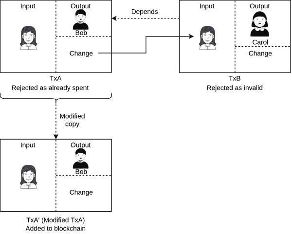

**图 12.1：** 未确认交易的交易篡改效应

以下顺序解释了这种情况是如何发生的：

1.  Alice 创建了交易 TxA，向 Bob 支付。

1.  Alice 告诉 Bob 她已经付款，交易 ID 是 TxA。

1.  攻击者创建了交易 TxA’，并在收到 TxA 后立即将其发布到比特币网络上。

1.  Alice 创建了交易 TxB，使用 TxA 中收集的找零支付了 Carol。

1.  TxA’ 被添加到比特币区块链中。

1.  Bob 从未收到有关 TxA 的确认，并认为交易失败了。

1.  类似地，由于 TxA’ 没有输入到 TxB 中，Carol 也没有收到付款。

1.  Alice 再次向 Bob 和 Carol 支付，不知道她向 Bob 的交易成功了。

1.  Bob 收到了两次付款，现在 Alice 需要把钱退回来，前提是 Bob 同意。

在 2014 年，全球最大的交易所遭受了黑客攻击，人们损失了大量资金。据认为，攻击者利用交易篡改来攻击他们的交易所。然而，我们知道这些事情是如何发生的以及为什么会发生，因此交易所和钱包软件都意识到了这些问题，并采取了措施以避免陷入陷阱。

随着隔离见证增强的实施，交易篡改问题最终得到解决。

# 隔离见证

隔离见证是解决长期交易篡改问题的方案。它将签名从交易 ID 计算中移出，从而解决了所有形式的交易篡改问题。

以下图表显示了隔离见证如何改变白皮书：

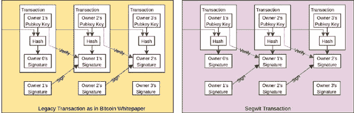

**图 12.2：** 显示白皮书中差异的隔离见证交易图表

在上图中，您可以看到隔离见证交易签名不再是交易的一部分。它作为扩展与交易一起发送。

SegWit 允许未确认的交易进行链式连接，并且我们可以依赖于交易 ID。这使得两个个体可以发送离线交易，如果两者都签署了支付合同。因此，闪电网络变得可行，改变了全球支付方式。我们将在下一章进一步讨论这个问题。

当规划 SegWit 时，1MB 的区块限制看起来是一个可扩展性问题，因为区块达到了限制，内存池已满，并且网络费用会飙升。

由于 SegWit 是一个软分叉，旧节点会忽略 SegWit 交易中的签名，因此它们不计入 1MB 区块计算范围内。这使得将所需的区块大小增加纳入了增强功能。对于 SegWit 交易的区块大小增加也降低了这些交易的交易费用。

在升级节点的修改后的区块大小计算中，交易中与 SegWit 相关的字节被视为四分之一字节。此外，SegWit 引入了新的标准 scriptPubKey，进一步减少了交易中的字节需求。这两件事使得 SegWit 交易更经济。

SegWit 激活影响了我们看待比特币、网络和增强功能的方式。有一种思想认为主要的增强应该通过硬分叉来进行，对增强的投票应该基于哈希功率。

由于 SegWit 激活是一项重大变革，它影响了生态系统中的每个人，每个人都不得不做出选择，许多人试图延迟这一选择。SegWit 激活遵循 BIP 9 并于 2016 年 11 月 15 日进入*启动*阶段。因此，在启动日期后一年设置了超时，必须在此之前达成共识；否则，激活将被标记为失败。

到了 2017 年 8 月，绝大多数节点都已准备好支持隔离见证，但矿工之间并未达成共识。比特币开发者社区将此视为经济多数和算力多数之间的不一致。随着矿池的崛起，算力多数并未代表经济多数，因为少数矿池拥有大部分算力，而这在用户对新增强支持方面是明显的。为了让其他利益相关者参与决策，我们需要改变增强功能的激活方式。这导致了称为**用户激活软分叉**（**UASF**）的新激活机制的出现。

# 用户激活软分叉（UASF）

用户激活软分叉是由经济多数而不是算力多数强制执行的激活规则，就像矿工所做的那样。经济多数代表了全节点的意愿。

BIP 148 是为了强制推行隔离见证（SegWit）部署而创建的，如果算力的大多数不激活与隔离见证相关的 BIP，这些 BIP 是 BIP 141、BIP 143 和 BIP 147。

# 交易结构

隔离见证将签名从交易 ID 计算中移出，因此修改了交易结构。你已经了解到，区块中包含的交易的完整性是通过将默克尔根添加到区块头来验证的。默克尔根是使用交易 ID 对所有区块交易按顺序计算得到的。由于隔离见证将签名从交易 ID 计算中移出，因此默克尔根也不再验证区块中签名的完整性。但是，如果它无法改变交易 ID，我们为什么要在意呢？答案是攻击者可以将其用作拒绝服务攻击。攻击者可以获取一个有效的区块并创建数百万个有效的区块，并将它们广播到网络中。这将导致比特币网络无法验证交易和区块，并将使整个网络崩溃。

比特币区块包含隔离见证默克尔根或见证根在其中一个 coinbase 交易输出中。这确保了所有交易的完整内容的完整性，包括签名。隔离见证默克尔根是整个交易的默克尔根，不同于区块头中的默克尔根，后者使用所有交易的交易 ID 来计算默克尔根。

我们将首先了解普通交易 ID 的结构，然后我们将计算*wtxid*，然后使用它来获取见证根。

# Coinbase 交易

下图显示了带有与 SegWit 相关的附加信息的 coinbase 交易：

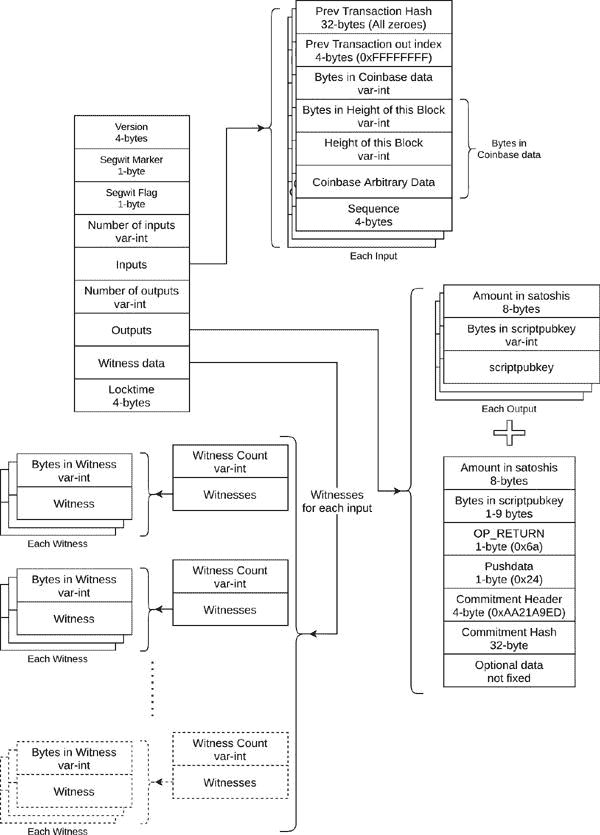

**图 12.3：** Coinbase 交易结构

在上述图表中，有几件事情需要记住：

+   见证数量 = 输入数量

+   SegWit 标记为 0x00

+   对于 SegWit 交易，SegWit 标志设置为 0x01

+   输入数量= 1

+   承诺哈希=hash256（见证根哈希|| 见证保留值）

+   见证根哈希是见证交易 ID 或完整交易的 hash256 的默克尔根

+   见证保留值是 coinbase 交易中的 32 字节见证。由于 coinbase 交易中存在真实输入，见证保留值可以是任何值。由于每个人都可以查看见证值，因此可以验证承诺哈希。

**交易 ID**（**txid**）是通过对交易的以下部分进行 hash256 计算得到的：

`txid = hash256([version][input count][inputs][output count][outputs] [locktime])`

见证交易 ID（*wtxid*）通过对完整交易进行 hash256 计算得到，如下所示：

`wtxid = hash256([version][segwit marker][segwit flag][input count][inputs] [output count][outputs][witness data][locktime])`

下面的程序解析了最近一个区块中的 coinbase 交易：

`def getCoinbaseTransactionInfo(txn_m: mmap):`

`tx = {}`

`startloc = txn_m.tell()`

`tx[‘version’] = txn_m.read(4)[::-1].hex()`

`tx[‘inp_cnt’] = getVarInt(txn_m)`  

`tx[‘is_segwit’] = False`  

`if tx[‘inp_cnt’] == 0:`  

`# 检查隔离见证标志`  

`tx[‘is_segwit’] = (int.from_bytes(txn_m.read(1), byteorder=’little’) == 1)`  

`if tx[‘is_segwit’] == True:`  

`tx[‘inp_cnt’] = getVarInt(txn_m)`  

`inp_l = []`  

`for i in range(tx[‘inp_cnt’]):`  

`inp = {}`  

`inp[‘prev_tx_hash’] = txn_m.read(32)[::-1].hex()`  

`inp[‘prev_tx_out_index’] = txn_m.read(4)[::-1].hex()`  

`inp[‘bytes_coinbase_data’] = getVarInt(txn_m)`  

`pos = txn_m.tell()`  

`inp[‘bytes_height’] = getVarInt(txn_m)`  

`inp[‘height’] = int.from_bytes(txn_m.read(inp[‘bytes_height’]), byteorder=’little’)`  

`size = txn_m.tell() - pos`  

`coinbase_arb_data_size = inp[‘bytes_coinbase_data’] - size`  

`inp[‘coinbase_arb_data’] = txn_m.read(coinbase_arb_data_size).hex()`  

`inp[‘sequence’] = txn_m.read(4)[::-1].hex()`  

`inp_l.append(inp)`  

`tx[‘inputs’] = inp_l`  

`tx[‘out_cnt’] = getVarInt(txn_m)`  

`out_l = []`  

`for i in range(tx[‘out_cnt’]):`  

`out = {}`  

`out[‘satoshis’] = int.from_bytes(txn_m.read(8), byteorder=’little’)`  

`out[‘bytes_scriptpubkey’] = getVarInt(txn_m)`  

`out[‘scriptpubkey’] = txn_m.read(out[‘bytes_scriptpubkey’]).hex()`  

`out_l.append(out)`  

`tx[‘outs’] = out_l`  

`curloc = txn_m.tell()`  

`txn_m.seek(startloc)`  

`txid_b = txn_m.read(curloc - startloc)`  

`if tx[‘is_segwit’] == True:`  

`# 如果 segflag 为真，则从 txhash 计算中删除 segwit 标记和标志`  

`txid_b = txid_b[:4] + txid_b[6:]`  

`for i in range(tx[‘inp_cnt’]):`  

`tx[‘inputs’][i][‘witness_cnt’] = getVarInt(txn_m)`  

`witness_cnt = tx[‘inputs’][i][‘witness_cnt’]`  

`witness_l = []`  

`for j in range(witness_cnt):`  

`witness = {}`  

`witness[‘size’] = getVarInt(txn_m)`  

`witness[‘witness’] = txn_m.read(witness[‘size’]).hex()`  

`witness_l.append(witness)`  

`tx[‘inputs’][i][‘witnesses’] = witness_l`

`locktime_b = txn_m.read(4)`  

`txid_b += locktime_b`  

`tx[‘locktime’] = int.from_bytes(locktime_b, byteorder=’little’)`  

`tx[‘txid’] = hash256(txid_b)[::-1].hex()`  

`return tx`  

**程序 12.1：** 用于 coinbase 交易的解析器  

要获取高度为 668000 的区块的 coinbase 交易十六进制代码，我们首先获取 coinbase 交易的交易哈希，即区块中交易列表中的第一笔交易。

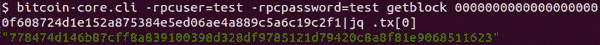

**图 12.4：** 获取 coinbase 交易 ID 的 CLI 命令

我们随后通过 Bitcoin Core CLI 获取 coinbase 交易十六进制代码如下：

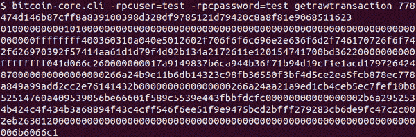

**图 12.5：** 从其交易 ID 获取 coinbase 交易十六进制代码的 CLI 命令

我们使用 coinbase 交易字节调用上述方法，如下所示：

`txn_b = bytes.fromhex(‘010000000001010000000000000000000000000000000000000000000000000000000000000000ffffffff400360310a040e5012602f706f6f6c696e2e636f6d2f746170726f6f742f626970392f57414aa61d1d79f4d92b134a2172611e120154741700bd36220000000000ffffffff041d066c260000000017a9149837b6ca944b36f71b94d19cf1e1acd179726424870000000000000000266a24b9e11b6db14323c98fb36550f3bf4d5ce2ea5fcb878ec778a849a99add2cc2e76141432b0000000000000000266a24aa21a9ed1cb4ceb5ec7fef10b852514760a409539056be66601f589c5539e443fbbfdcfc00000000000000002b6a2952534b424c4f434b3a68894f43c4cff546f6ee51f9e9475bcd2bfff279283cb6de9fc47c2c002eb263012000000000000000000000000000000000000000000000000000000000000000006b6066c1’)`

`txn_m = mmap.mmap(-1, len(txn_b) + 1)`

`txn_m.write(txn_b)`

`txn_m.seek(0)`

`tx = getCoinbaseTransactionInfo(txn_m)`

`print(json.dumps(tx))`

然后我们得到以下 coinbase 交易信息：

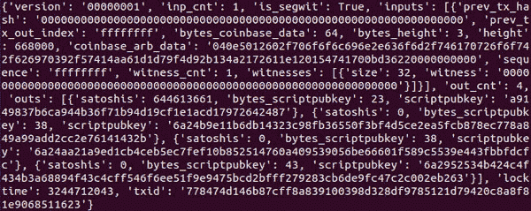

**图 12.6：** 从执行 Python 程序中获取的 coinbase 交易信息

# 其他交易

这是隔离见证交易的示例：

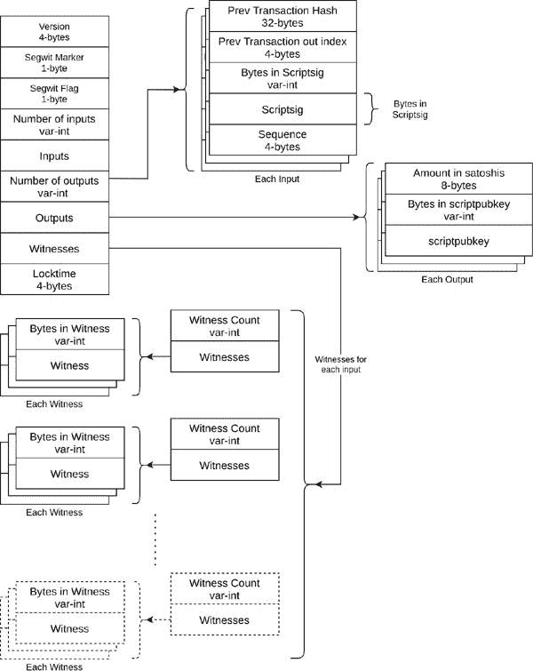

**图 12.7：** 隔离见证交易结构

上述交易图表显示，见证数据包含 scriptSig 信息。

# 隔离见证作为扩展解决方案

分叉见证的增强功能也允许区块最终比 1MB 更大。它改变了我们计算事务字节大小的方式，现在称为权重。以权重计算的新块大小限制为 4MB。实际最大块大小并不真的是 4MB；它要小得多。它在 2 到 3MB 之间。这是我们如何计算权重的方法：

`weight = (4 * sizeof ([version][input count][inputs][output count][outputs] [locktime])) + sizeof ([segwit marker][segwit flag] [witness data])`

矿工的业务是最大化利润。对他们来说，每一个字节都很重要，他们选择最终导致最大累积网络费用的交易。当矿工看到一个分叉见证交易时，他们知道重量才是最重要的，因此他们寻找支付比特币最高的交易。

我们使用事务结构图和关于`**txid**`、`**wtxid**`和`**weight**`的学习来编写一个程序，解析分叉见证事务并计算这些值：

`def getTransactionInfo(txn_m: mmap):`

`tx = {}`

`startloc = txn_m.tell()`

`tx[‘version’] = txn_m.read(4)[::-1].hex()`

`tx[‘inp_cnt’] = getVarInt(txn_m)`

`tx[‘is_segwit’] = False`

`if tx[‘inp_cnt’] == 0:`

`# check segwit flag`

`tx[‘is_segwit’] = (int.from_bytes(txn_m.read(1), byteorder=’little’) == 1)`

`if tx[‘is_segwit’] == True:`

`tx[‘inp_cnt’] = getVarInt(txn_m)`

`inp_l = []`

`for i in range(tx[‘inp_cnt’]):`

`inp = {}`

`inp[‘prev_tx_hash’] = txn_m.read(32)[::-1].hex()`

`inp[‘prev_tx_out_index’] = txn_m.read(4)[::-1].hex()`

`inp[‘bytes_scriptsig’] = getVarInt(txn_m)`

`inp[‘scriptsig’] = txn_m.read(inp[‘bytes_scriptsig’]).hex()`

`inp[‘sequence’] = txn_m.read(4)[::-1].hex()`

`inp_l.append(inp)`

`tx[‘inputs’] = inp_l`

`tx[‘out_cnt’] = getVarInt(txn_m)`

`out_l = []`

`for i in range(tx[‘out_cnt’]):`

`out = {}`

`out[‘satoshis’] = int.from_bytes(txn_m.read(8), byteorder=’little’)`

`out[‘bytes_scriptpubkey’] = getVarInt(txn_m)`

`out[‘scriptpubkey’] = txn_m.read(out[‘bytes_scriptpubkey’]).hex()`

`out_l.append(out)`

`tx[‘outs’] = out_l`

`curloc = txn_m.tell()`

`txn_m.seek(startloc)`

`txid_b = txn_m.read(curloc - startloc)`

`if tx[‘is_segwit’] == True:`

`# 如果 SegWit 标志为 true，则从 txhash 计算中删除 SegWit 标记和标志`

`txid_b = txid_b[:4] + txid_b[6:]`

`for i in range(tx[‘inp_cnt’]):`

`tx[‘inputs’][i][‘witness_cnt’] = getVarInt(txn_m)`

`witness_l = []`

`witness_cnt = tx[‘inputs’][i][‘witness_cnt’]`

`for j in range(witness_cnt):`

`witness = {}`

`witness[‘size’] = getVarInt(txn_m)`

`witness[‘witness’] = txn_m.read(witness[‘size’]).hex()`

`witness_l.append(witness)`

`tx[‘inputs’][i][‘witnesses’] = witness_l`

`locktime_b = txn_m.read(4)`

`txid_b += locktime_b`

`tx[‘locktime’] = int.from_bytes(locktime_b, byteorder=’little’)`

`tx[‘txid’] = hash256(txid_b)[::-1].hex()`

`curloc = txn_m.tell()`

`txn_m.seek(startloc)`

`wtxid_b = txn_m.read(curloc - startloc)`

`tx[‘wtxid’] = hash256(wtxid_b)[::-1].hex()`

`tx[‘bytes’] = len(wtxid_b)`

`tx[‘weight’] = (len(wtxid_b) - len(txid_b)) + (len(txid_b) * 4)`

`return tx`

**程序 12.2：** 交易解析器

上述程序给出了给定 SegWit 交易的交易信息。我们正在使用该程序解析带有 `**txid**` 的交易：

`c6176c811328a9fd82a3a71da78e73781bc5c9a6580fdee4cf4392b165b1a072`

我们可以使用 Bitcoin Core 如下获取 `**wtxid**` 或交易哈希：

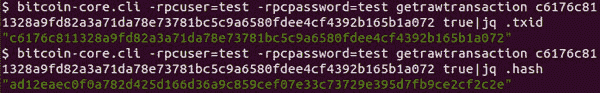

**图 12.8：** 从 txid 获取 wtxid 的 CLI 命令

我们调用该方法如下：

`txn_b = bytes.fromhex(‘02000000000102dc0f4a1601bd6bfec4241fede438bee45958773fe5d95f88ec890e2363983e0c0100000000ffffffff904d74d770c0ef5ce91190750b235d7ffb340b82b392812ba8e6ad5f0a8c4ca70000000000ffffffff02f31f0a00000000001600140c986c1d8ad520c072ee1aa0a151615c891ef71455b8180000000000160014097e656deb55afa3786c600a87d990dcab86fc2d024730440220685234e91eb14e6d1717c543193181700b1cbf5fecddbee79ed9b6b0bbf24077022033dac5cc679dca810327dcac4b84ba2b007a3a4fda6fb2cbc6099ae91c53804f01210277bed123bc0c0f9883b0bc14014f0385d39eac7ac7212d8c9928fa4121a191f4024730440220635eb52780098e3bd1e39a630a23f553ac62b97d0cd0356fa34ceb47cb0195250220599b83d8872ff173781b83b36bf159b59ed7685f73811f449fa1df814fbef15c0121022cd4d498f1ed0ee382eefe4b6e1d8c5aa678d47b693389ccdf77559b3220c5fa00000000’)`

`txn_m = mmap.mmap(-1, len(txn_b) + 1)`

`txn_m.write(txn_b)`

`txn_m.seek(0)`

`tx = getTransactionInfo(txn_m)`

`print(json.dumps(tx))`

我们获得以下交易信息：

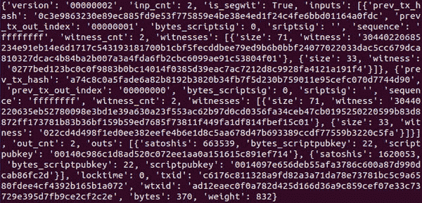

**图 12.9：** 通过执行 Python 程序获取的交易信息

在上述程序中，`**vsize**`的计算如下：

`vsize = weight / 4`

上述程序还给了我们`**wtxid**`。为了确保整个交易以及见证数据的完整性，我们计算承诺哈希。这个承诺哈希是使用隔离见证 - 默克尔根派生的，它是通过使用一个块中所有交易的`**wtxid**`来计算的。当矿工将承诺哈希添加到 coinbase 交易时，他们无法知道 coinbase 交易的`**wtxid**`。这就是我们不计算 coinbase 交易的`**wtxid**`的原因。相反，我们给它一个由所有零字节组成的 32 字节值。此外，我们需要见证保留值，它是第一个输入的第一个见证。

在下面的程序中，我们计算承诺哈希：

`def getWitnessReservedValue(cb_tx: dict):`

`return cb_tx[‘inputs’][0][‘witnesses’][0][‘witness’]`

`def getRootHashes(txn_m):`

`txcount = getVarInt(txn_m)`

`wtxid_l = []`

`txid_l = []`

`cb_tx = getCoinbaseTransactionInfo(txn_m)`

`txid_l.append(cb_tx[‘txid’])`

`wtxid_l.append(bytes(32).hex())`

`for txindex in range(txcount - 1):`

`tx = getTransactionInfo(txn_m)`

`wtxid_l.append(tx[‘wtxid’])`

`txid_l.append(tx[‘txid’])`

`witness_merkle_root_h = buildMerkleRoot(wtxid_l)`

`merkle_root_h = buildMerkleRoot(txid_l)`

`return merkle_root_h, witness_merkle_root_h, cb_tx`

`def calculateCommitmentHash(blkhash_b: bytes, block_db):`

`jsonobj = getBlockIndex(blkhash_b, block_db)`

`if ‘data_pos’ in jsonobj:`

`txn_filepath = os.path.join(blocks_path_g, ‘blk%05d.dat’ % jsonobj[‘n_file’])`

`start = jsonobj[‘data_pos’]`

`elif ‘undo_pos’ in jsonobj:`

`txn_filepath = os.path.join(blocks_path_g, ‘rev%05d.dat’ % jsonobj[‘n_file’])`

`start = jsonobj[‘undo_pos’]`

`# 将文件加载到内存`

`with open(txn_filepath, ‘rb’) as txn_file:`

`# 文件以只读方式打开`

`with mmap.mmap(txn_file.fileno(), 0, prot = mmap.PROT_READ, flags = mmap.MAP_PRIVATE) as txn_m:`

`txn_m.seek(start)`

`blkhdr = getBlockHeader(txn_m.read(80))`

`merkle_root_h, witness_merkle_root_h, cb_tx = getRootHashes(txn_m)`

`print(‘计算的见证默克尔根哈希\t = %s’ % witness_merkle_root_h)`

`print(‘计算的默克尔根哈希\t = %s’ % merkle_root_h)`

`witness_reserved_value = getWitnessReservedValue(cb_tx)`

`print(‘见证保留值 = ‘, witness_reserved_value)`

`# 计算承诺哈希`

`commitment_hb = hashOfJoinedStr(witness_merkle_root_h, witness_reserved_value)`

`commitment_h = commitment_hb.hex()`

`print(‘计算的承诺哈希 = ‘, commitment_h)`

`return commitment_h, cb_tx`

**程序 12.3：** 计算承诺哈希

要验证计算的交易哈希是否正确，我们使用以‘`**6a24aa21a9ed**`’开头的 scriptPubKey 的输出索引：

`def getCommitmentHashInCbTx(cb_tx: dict):`

`for output in cb_tx[‘outs’]:`

`if output[‘scriptpubkey’][:12] == ‘6a24aa21a9ed’:`

`commitment_h = output[‘scriptpubkey’][12:]`

`print(‘Actual commitment hash = ‘, commitment_h)`

`return commitment_h`

`def verifyCommitmentHash(cb_tx: dict, commitment_h: str):`

`if getCommitmentHashInCbTx(cb_tx) == commitment_h:`

`print(‘Commitment hash matches’)`

`else:`

`print(‘Invalid commitment hash’)`

**程序 12.4：** 验证承诺哈希

我们如下调用前述程序来计算承诺哈希并验证其正确性：

`if __name__ == ‘__main__’:`

`blk_hb = bytes.fromhex(‘00000000000000000000f608724d1e152a875384e5ed06ae4a889c5a6c19c2f1’)[::-1]`

`commitment_h, cb_tx = calculateCommitmentHash(blk_hb, block_db_g)`

`verifyCommitmentHash(cb_tx, commitment_h)`

这给我们以下结果：

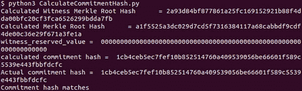

**图 12.10：** 通过执行 Python 程序获得的承诺哈希

# 交易费用计算

Bitcoin Core 根据诸如每个交易中收集的交易费、内存池中的交易、内存池大小和内存池清除等因素为我们提供费用估算。

以下 Bitcoin Core CLI 命令给出了费用估算：

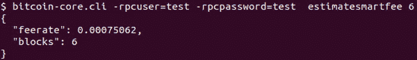

**图 12.11：** 获取推荐交易费率的 CLI 命令

这表明，要在接下来的六个区块内包含交易，我们需要支付每千字节 0.00075062 的费用。这里的 vbytes 与我们在 Bitcoin Core CLI 输出中获得的 vsize 相同。

以下程序计算获取交易确认所需的**估计最低费用**：

`def calculateTransactionFee(vsize: int, feerate: float):`

`return feerate * vsize/1000`

**程序 12.5：** 计算交易费用的程序

我们使用 Bitcoin Core CLI 获得的费率估算和我们通过将权重除以 4 得到的 `**vsize**` 调用前述方法：

`feerate = 0.00075062`

`vsize = 208`

`fee = calculateTransactionFee(vsize, feerate)`

`print(‘Estimated Minimum Fee in bitcoin = ‘, fee)`

我们得到以下结果：

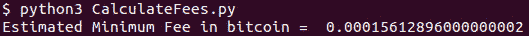

**图 12.12：** 根据推荐费率和 vsize 计算的交易费用

在美元中，这相当于$4.75，因为当前市场价格为 1 为 $30425。

# 新的标准脚本

隔离见证引入了四个新的标准脚本。这些脚本在 BIP 143 中定义，并可在以下 URL 找到：

**[`github.com/bitcoin/bips/blob/master/bip-0143.mediawiki`](https://github.com/bitcoin/bips/blob/master/bip-0143.mediawiki)**

在下一节中，我们将了解每个脚本，并构建程序来验证主网区块链上的交易。

# 本地 SegWit 交易脚本

SegWit 交易除了保护交易可塑性外，还在降低交易费用方面提供直接的货币利益。

本地 SegWit 交易如下所示：

`上一个 scriptPubKey： <1 字节见证版本> <2-40 字节见证程序>`

`ScriptSig: (空)`

`见证数据： <见证数据>`

我们可以看到`**上一个 scriptPubKey**`由两部分组成：见证版本和见证程序。这表明每个见证版本可以有不同的程序。这是一种可扩展的结构，允许未来的增强。在本章中，我们讨论了 Segwit 增强的第一个版本中引入的脚本。下一个版本用于 Taproot 和 Schnorr 签名。

# 本地 P2WPKH

正如其名称所示，P2WPKH 是 P2PKH 脚本的 SegWit 替代，我们已经在*第十章，创建和验证交易*中涵盖过。

P2WPKH 交易如下：

`上一个 scriptPubKey： 0 <20 字节公钥哈希>`

`ScriptSig: (空)`

`见证数据：`

`<签名>`

`<公钥>`

我们可以看到见证数据与 P2PKH 中的`**scriptSig**`相同。因此，我们只需要在脚本执行中进行小的修改。我们需要做以下几步：

1.  将`**上一个 scriptPubKey**`转换为 P2PKH 标准脚本。

1.  在处理`**previous scriptPubKey**`之前向堆栈添加见证数据。

我们修改了在*第十章，创建和验证交易*中用于 P2SH 的程序，以执行包括对 P2WPKH 交易的验证的准确活动。

我们通过以下步骤修改`**verifyScript**`以包含对 P2WPKH 的检查。

1.  如果`**scriptsig_b**`是空字符串，则添加对应于所需输入索引的所有见证数据元素：

    `if scriptsig_b == b`**’’**`:`

    `# native segwit`

    `print(‘native segwit’)`

    `witness_l = getWitnessList(tx, inp_index)`

    `pushWitnessData(witness_l)`

    `else:`

    `execScript(scriptsig_b, inp_index, tx)`

1.  将`**Previous scriptPubKey**`转换为标准的 P2PKH 脚本：

    `if isP2WPKH(prev_scriptpubkey_b) == **True**:`

    `**print**(**‘P2WPKH’**)`

    `# convert 0 <20-byte PKH> to OP_DUP OP_HASH160 <PKH> OP_EQUALVERIFY`

    `prev_scriptpubkey_b = **bytes**([**0x76**, **0xa9**, **0x14**]) + prev_scriptpubkey_b[**2**:] + **bytes**([**0x88**, **0xac**])`

    `is_segwit = **True**`

以下是前述更改中使用的所有方法的定义：

`def pushWitnessData(witness_l: list):`

`for data in witness_l:`

`st.append(bytes.fromhex(data[‘witness’]))`

`def getWitnessList(tx: dict, inp_index: int):`

`return tx[‘inputs’][inp_index][‘witnesses’]`

`def isP2WPKH(prev_scriptpubkey_b: bytes):`

`#0014<20 bytes>`

`if len(prev_scriptpubkey_b) == 22 and prev_scriptpubkey_b[0:2] == b’\x00\x14’:`

`return True`

`return False`

**程序 12.6：** 更新程序以验证 P2WPKH 脚本

这是调用`**verifyScript**`以验证 P2WPKH 脚本的代码：

`#txid :: 808767ec8b388a7d6c34b9658e573e39034831fea49f0f22911393d6f8e195fb`

`tx_s = ‘0100000000010240fc776263b1a4104da05cf069c8e7b0aeb7f7e4c686062906df9ab5d384716f0100000000ffffffff86ab7969a4d661aeaf8845f49eb2e5d30f6fb657d7694b8289224658158a62870000000000ffffffff02ea430000000000001976a9145d57c599fd94fce0cec607e15716f46468cb281b88aca47e000000000000160014f57aed6b1c121a10bec610987cbf414fb168778402483045022100eb6c3485c4ff17390dfbe35be9940b442783bd103095219c285331372b18913b02205bcbc7ce889823af020030d075832f314d1cc905269edf295e813dc7238dc37301210359522a87dc9c907d1669811b7254faf96d7ffcb1f22736bfcd0168fb19b9c98602483045022100acefd6d2ad0b56ad5837cd9d75b49c9f36f5deb6b12e290bbdc14076a38017cd02207a1add2928912d900756874e487d49b49defc7fc6f9805e9777afa929de5ffcb012102948374b79fa597475cab313e63d61d3d546288e6b9b3f80bd1ecc1a514dc382a00000000’`

`tx_b = bytes.fromhex(tx_s)`

`tx_m = bytes2Mmap(tx_b)`

`tx = getTransactionInfo(tx_m)`

`verifyScript(tx, 0)`

我们将在本章后面介绍签名验证。签名验证在 BIP 143 中有详细定义。我们执行前述程序，验证脚本，并得到以下结果：

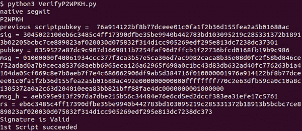

**图 12.13：** 执行 Python 程序显示签名有效

虽然结果显示签名有效，但我们在这个子主题中没有讨论过，应该忽略。

# 本地 P2WSH

P2WSH 是 P2SH 的 SegWit 替代方案。P2WSH 交易如下：

`上一个 scriptPubKey：0 <32 字节 赎回脚本哈希>`

`ScriptSig: (空)`

`见证：`

`<签名 1>`

`<签名 2>`

`…`

`<赎回脚本>`

在这里，P2SH-P2WSH 使用 hash256 哈希算法。所以，我们将 `**上一个 scriptPubKey**` 转换为以下脚本：

`OP_SHA256 <32 字节赎回脚本哈希> OP_EQUAL`

我们修改 `**verifyScript**` 以包含对 P2WSH 的检查：

`if isP2WSH(prev_scriptpubkey_b) == True:`

`print(‘P2WSH’)`

`prev_scriptpubkey_b = **bytes**([**0xa8**, **0x20**]) + prev_scriptpubkey_b[**2**:] + **bytes**([**0x87**])`

这是 `**isP2WSH**` 的实现：

`def isP2WSH(prev_scriptpubkey_b: bytes):`

`#0020<32 字节>`

`if len(prev_scriptpubkey_b) == 34 and prev_scriptpubkey_b[0:2] == b’\x00\x20’:`

`return True`

`return False`

我们还需要处理 OP_SHA256。我们需要在 `**execScript**` 方法中添加一个检查，如下所示：

`def opSha256():`

`v = st.pop()`

`h = hashlib.sha256(v).digest()`

`st.append(h)`

`def execScript(script_b: bytes, inp_index: int, tx: dict):`

`l = len(script_b)`

`script_m = bytes2Mmap(script_b)`

`while script_m.tell() < l:`

`v = script_m.read(1)`

`b = int.from_bytes(v, byteorder=’big’)`

`if b in g_pushdata:`

`script_m.seek(-1, 1)`

`b = decodePushdata(script_m)`

`d = script_m.read(b)`

`pushdata(d)`

`elif v == b’\x76’:`

`opDup()`

`elif v == b’\xa8’:`

`opSha256()`

`elif v == b’\xa9’:`

`opHash160()`

`elif b in g_pushnumber:`

`opNum(b)`

`elif v == b’\x87’:`

`opEqual()`

`elif v == b’\x88’:`

`opEqualVerify()`

`elif v == b’\xac’:`

`opCheckSig(script_b, inp_index, tx)`

`elif v == b’\xae’:`

`opCheckMultisig(script_b, inp_index, tx)`

**程序 12.7：** 更新程序以验证 P2WSH 脚本

我们调用了有改动的程序，如下所示：

`#txid :: dffe1dc8f36cbc39c0f40b090912c5a00da13e3534f97aec0ef5bfe552019897`

`tx_s = ‘02000000000102c2aa999f988ded79cb8021420a01469212fa67e666c7d4078a2aaba1b13adf5c0100000000000000007d2ac99074ba44aac9afc79449d9aa29ae206136b511b12cbe699137740424f80100000000000000000220f31d01000000001976a9143913ef9cfc2bbf68665d735b89538dfb883b59f488ac48c70f0b000000002200209705cdfcbc459a220e7f39ffe547a31335505c2357f452ae12a22b9ae36ea59d040047304402205ca8ff900fd03ca9cba763eccb0888ec943269257286a852e9ba96cbc7da340a02206b84aff30cc2c7669fa4133a317fd9c04b013c1d1f42a647b400f62c9f61343101473044022041e2797e0a4b63878b03ff68d4fce8d6b31909e940024dcfd1c0eea33b7a5a160220140aca6751de16c377ea972e47cfc238b3d6d56477f348fa193588828e51e0030169522103ac79bbcf0ff2204220fbd0f906a8c0ae35ad0c1863852102f83af40e7af36cba2102cf85157ae613db5b445594e76f971cf21a0e26d0e70a85c447d3506fe678ddc721035f32d7cc9b710d8e5084dd93aa67efe95c6d32ba2a71b833fb035063ee40efd953ae0400473044022054c259d498dd1f32a449d7a53c597be64ed6331b32f9e9b2a96a098333d993660220789c04d6f69af4919ac97a963dbf2920df287fd4b5fb9ce595290acae3a59e6301473044022009f219deb061a83bf9505c3642efbdb3ef1af9dbef873c118d757d336a63ab0802201763f0ede288e3c7e1993263e47da73d3f43fa00a58c58bcc85e72c743076caf0169522102e67ce679d617d674d68eea95ecb166c67b4b5520105c4745adf37ce8a40b92dc21029ff54b8bf26dbddd7bd4336593d2ff17519d5374989f36a6f5f8239675ff79a421039000ee2853c6db4bd956e80b1ecfb8711bf3e0a9a8886d15450c29458b60473153ae00000000’`

`tx_b = bytes.fromhex(tx_s)`

`tx_m = bytes2Mmap(tx_b)`

`tx = getTransactionInfo(tx_m)`

`verifyScript(tx, 0)`

执行上述程序后，我们得到以下结果：

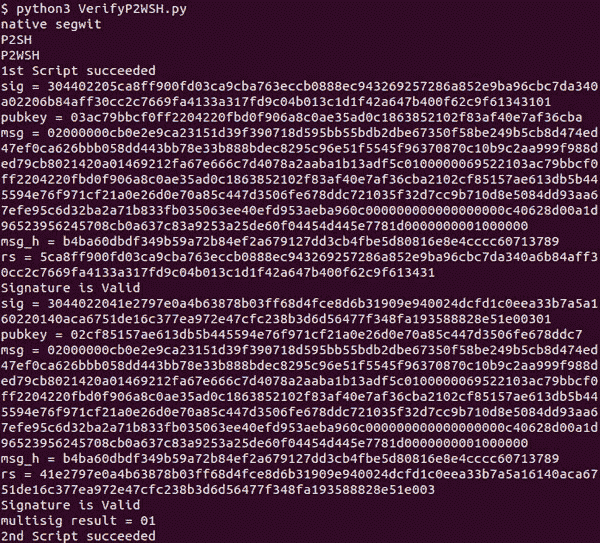

**图 12.14：** 执行 Python 程序后显示 P2WSH 脚本有效

# 包装的隔离见证脚本

在前面的子主题中解释的原生 SegWit 脚本也可以包裹在 P2SH 中。这使得更容易迁移到一个更新的格式，因为一个被包裹的 SegWit 脚本仍然可以在尚未升级到 SegWit 的交易所中使用。由于 SegWit 解决了长期存在的问题，并且对比特币开发者社区有利，为比特币用户提供了一种在交易所迁移之前就可以迁移的机制。

如果我们想要将比特币转移到 Segwit 钱包中，那么由于 Wrapped Segwit 地址是一个 P2SH 地址，当前交易所在转移比特币时不会遇到问题。但是，如果我们尝试将其发送到原生 SegWit 地址，则当前交易所将无法理解新的寻址格式，因此不会执行交易。

# Wrapped P2WPKH 或 P2SH-P2WPKH

P2SH-P2WPKH 交易具有以下脚本：

`Previous scriptPubKey: OP_HASH160 <20-byte Redeem-Script-Hash> OP_EQUAL`

`ScriptSig: 0 <20-byte-PublicKeyHash>`

`Witness:`

`<Signature>`

`<PublicKey>`

`Redeem Script: scriptSig`

我们修改`**verifyScript**`以包括对包裹的 P2WPKH 的检查，如下所示：

`if checkWrappedP2WPKH(st) == True:`

`prev_scriptpubkey_b = st[-1]`

`st.pop()`

`witness_l = getWitnessList(tx, inp_index)`

`pushWitnessData(witness_l)`

`print(‘P2SH_P2WPKH’)`

这个`**checkWrappedP2WPKH**`的实现如下：

`def checkWrappedP2WPKH(st):`

`script_b = st[-1]`

`if script_b[:2] == b’\x00\x14’ and len(script_b) == 22:`

`return True`

`else:`

`return False`

**程序 12.8：** 检查脚本是否为 P2SH_P2WPKH 的方法

我们使用包含 P2SH-P2WPKH 脚本的交易来调用更新后的方法，如下所示：

`#txid :: c137ca3dc53cd1562da3fd5ceea22c8902c3cfd28b5303ecc70675dfff71ec2d`

`tx_s = ‘020000000001027b806bcadab5c41bd3ccab867112fa041b36e0a8aff518296713721e36aed9f10000000017160014a5736b5f1caaf929de80829ec3acc2e13187f2c5feffffff7cbecb8841826bdb493bac6706be865731e414309d3640631f3571090abfdf20000000001716001405a7ef9d2ab852d55c58e42ac2d60202b2b6c9b0feffffff0234553d00000000001976a914265d799ec0fc523faba0ec8f5ee6f0621140a78588ac9cc911000000000017a9144bc6f0e3b0b3a26135ec3e5c6f88edb80881ce2c8702473044022072ddd8d42edee4662e388b8433c15516097d3bdb8a9ccec0acc21a7f7d068132022012f0ecfeb8682236c27fb8a591512102dfd8387a99111dad25a92fe65641841b01210335c4cfa33717ecea14e644ef938c9ecbcb7bd8569e8f407a014d835a8fb94efe02483045022100c038dd6cdf67aee993416e8471664a019f1d3204602e2acf759cf3cf3852d57c022017a84cdbc515de745587d62bb2b10597800c1b20f382a5b116ea8a0424ea242d012102e5692a54cbc71cb19cbc50b886305f0df9f462eae91125b39a85804cfe7a48012b310a00’`

`tx_b = bytes.fromhex(tx_s)`

`tx_m = bytes2Mmap(tx_b)`

`tx = getTransactionInfo(tx_m)`

`verifyScript(tx, 0)`

在执行上述程序时，我们得到以下结果：

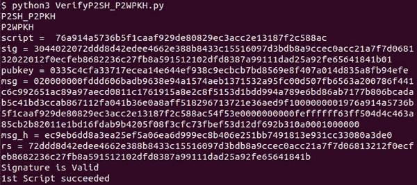

**图 12.15：** 执行 Python 程序显示签名有效。

# 包装的 P2WSH 或 P2SH-P2WSH

P2SH-P2WSH 交易具有以下脚本：

`Previous scriptPubKey: OP_HASH160 <20 字节 P2SH-赎回脚本哈希> OP_EQUAL`

`ScriptSig: 0 <32 字节 P2WSH-赎回脚本哈希>`

**见证：**

`<见证项>`

`<P2WSH-赎回脚本>`

`P2SH 赎回脚本：scriptSig`

我们修改`**verifyScript**`方法，包括检查包装 P2WSH 如下：

`if checkWrappedP2WSH(st) == True:`

`prev_scriptpubkey_b = st[-1]`

`st.pop()`

`witness_l = getWitnessList(tx, inp_index)`

`pushWitnessData(witness_l)`

`print(‘P2SH_P2SH’)`

**checkWrappedP2WSH 方法**实现如下：

`def checkWrappedP2WSH(st):`

`script_b = st[-1]`

`if script_b[:2] == b’\x00\x20’ and len(script_b) == 34:`

`return True`

`else:`

`return False`

**程序 12.9：** 检查是否为 P2SH_P2WSH 的方法

综合当前和 SegWit 交易的以前子主题所做的更改，我们得到以下的`**verifyScript**`：

`def getPrevScriptPubKey(tx: dict, inp_index: int):`

`prevtx_rb = bytes.fromhex(tx[‘inputs’][inp_index][‘prev_tx_hash’])[::-1]`

`prevtx_outindex = tx[‘inputs’][inp_index][‘prev_tx_out_index’]`

`prevtx = findTransaction(prevtx_rb, txindex_db_g)`

`prevScriptPubkey = prevtx[‘outs’][prevtx_outindex][‘scriptpubkey’]`

`prevScriptPubkey_b = bytes.fromhex(prevScriptPubkey)`

`return prevScriptPubkey_b`

`def verifyScript(tx: dict, inp_index: int):`

`scriptsig_b = getScriptSig(tx, inp_index)`

`if scriptsig_b == b’’:`

`# native segwit`

`print(‘native segwit’)`

`witness_l = getWitnessList(tx, inp_index)`

`pushWitnessData(witness_l)`

`else:`

`execScript(scriptsig_b, inp_index, tx)`

`prev_scriptpubkey_b = getPrevScriptPubKey(tx, inp_index)`

`isP2SH = False`

`if checkWrappedP2WPKH(st) == True:`

`prev_scriptpubkey_b = st[-1]`

`st.pop()`

`witness_l = getWitnessList(tx, inp_index)`

`pushWitnessData(witness_l)`

`print(‘P2SH_P2WPKH’)`

`if checkWrappedP2WSH(st) == True:`

`prev_scriptpubkey_b = st[-1]`

`st.pop()`

`witness_l = getWitnessList(tx, inp_index)`

`pushWitnessData(witness_l)`

`print(‘P2SH_P2WSH’)`

`if checkWrappedMultisig(st) == True:`

`redeemscript_b = st[-1]`

`isP2SH = True`

`print(‘P2SH’)`

`if isP2WPKH(prev_scriptpubkey_b) == True:`

`print(‘P2WPKH’)`

`prev_scriptpubkey_b = bytes([0x76, 0xa9, 0x14]) + prev_scriptpubkey_b[2:] + bytes([0x88, 0xac])`

`if isP2WSH(prev_scriptpubkey_b) == True:`

`print(‘P2WSH’)`

`prev_scriptpubkey_b = bytes([0xa8, 0x20]) + prev_scriptpubkey_b[2:] + bytes([0x87])`

`print(‘previous scriptpubkey = ‘, prev_scriptpubkey_b.hex())`

`execScript(prev_scriptpubkey_b, inp_index, tx)`

`status = st.pop()`

`if status == b’\x01’:`

`print(‘1st Script succeeded’)`

`elif status == b’\x01’:`

`print(‘1st Script Failed’)`

`return`

`else:`

`print(‘1st Invalid state’)`

`return`

`if isP2SH == True:`

`execScript(redeemscript_b, inp_index, tx)`

`status = st.pop()`

`if status == b’\x01’:`

`print(‘2nd Script succeeded’)`

`elif status == b’\x01’:`

`print(‘2nd Script Failed’)`

`else:`

`print(‘2nd Invalid state’)`

**程序 12.10：** 更新的程序以验证 SegWit 交易

我们使用包含 P2SH-P2WSH 脚本的交易调用更新后的方法如下：

`#txid :: c6ab739d8455cd5133e9f93f542f70a2ccef0c7fb05de998db817dd680af3a91`

`tx_s = ‘010000000001024e453d886f11e3af494ce6073956b0de6eaed80865529ab45f778d660459907e2500000023220020ffc74359d1e79a79b94319a1695a68810e439e4c32e4c1be2b0b7c915ca78536ffffffff4e453d886f11e3af494ce6073956b0de6eaed80865529ab45f778d660459907e29000000232200207a21661b84ac4a34a6afc034030faba8ce8344635ebaf34cde31083f186bf871ffffffff02b02a02000000000017a9147b60c1eebfc2c78c9993668dab556344bf1f78d187d9df0500000000002200206f50cccbc64ea3f6cc434d5878bbe45a609e5592026ce6704f586a0e795a6ae40300483045022100d168fa78728fda205eee72ad7b789bc3153adeec982b2588a1526509aa1e2ae8022010443c0652848492dad4904f45258f5452256bfe23d9c715bf052d908154de6e0125512102972c9ea94bfcd5956220f2e99776b3c5ebcca9373a2eccb3fb5fff8bbc9f999451ae03004830450221009691361fa2953e54bc5287306c023fc2d098aa6e85ed1a66d3369e93781260b102201fb639437128d361a12ea385a61bd49247d25c254d1efc03d5272dd368c0acfa01255121027c6cbed24ad235fe147413272ba92cfd61d5ab338c4dabd74cbfb7d11746da5451ae00000000’`

`tx_b = bytes.fromhex(tx_s)`

`tx_m = bytes2Mmap(tx_b)`

`tx = getTransactionInfo(tx_m)`

`verifyScript(tx, 0)`

运行上述代码会给我们带来以下结果：

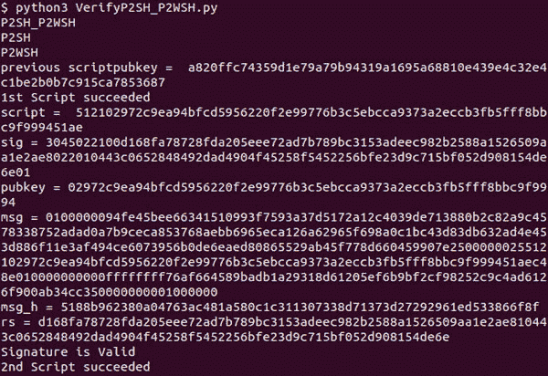

**图 12.16：** 执行 Python 程序显示 P2SH_P2WSH 脚本有效

我们了解到，通过对 P2PKH/P2SH 交易验证程序进行简单修改，我们也可以验证 SegWit 交易。我们还没有学会为签名验证创建正确的消息，所以我们将在下一个主题中讨论这个问题。

# 签名验证

在这一部分，我们将了解 BIP 143 来创建正确的签名预像。所有具有相同 sighash 类型的 SegWit 交易都具有相同的签名预像创建方法。

一个签名预像具有以下结构：

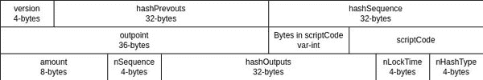

**图 12.17：** SegWit 交易的签名预像结构

签名预像的每一部分定义如下：

考虑，

***TxIDprev：上一个交易的 TxID***

***TxOutIndexprev：在输入中上一个交易的输出索引***

***output：*** *交易的输出*

***‖：*** *串联*

***Hash256：*** *双 SHA256 哈希*

我们对 sighash 类型 `**SIGHASH_ALL**` 的每一部分签名预像有以下定义：

*hashPrevouts = Hash256(‖(TxID_prev∥ TxOutIndex[prev] ))*

*hashSequence = Hash256(‖(nSequence))*

*outpoint = TxID[prev] TxOutIndex[prev]*

*scriptCode = 执行脚本*

*hashOutputs = Hash256(‖(output))*

我们使用这些信息修改了写在 *第十章，创建和验证交易* 中的 P2SH 交易验证方法，以包含 SegWit 交易。操作如下所示：

`def setVarInt(n: int):`

`if n < 0xfd:`

`n_h = ‘%02x’ % n`

`elif n > 0xfd and n < 0xffff:`

`n_h = ‘fd%04x’ % n`

`elif n > 0xffff and n < 0xFFFFFFFF:`

`n_h = ‘fe%08x’ % n`

`else:`

`n_h = ‘ff%016x’ % n`

`return bytes.fromhex(n_h)`

`def getAmountFromPrevout(prev_tx_hash_b: bytes, prev_tx_out_index_b: bytes):`

`prevtx = findTransaction(prev_tx_hash_b, txindex_db_g)`

`prevtx_outindex = int.from_bytes(prev_tx_out_index_b, byteorder = ‘little’)`

`prevAmount = prevtx[‘outs’][prevtx_outindex][‘satoshis’]`

`amount_b = struct.pack(“<Q”, prevAmount)`

`return amount_b`

`def createMsgForSigForSegwit(tx: dict, script_b: bytes, inp_index: int, sighash_type: int):`

`version_b = bytes.fromhex(tx[‘version’])[::-1]`

`inp_cnt = tx[‘inp_cnt’]`

`prevouts_b = b’’`

`sequences_b = b’’`

`for i in range(inp_cnt):`

`tx_inp = tx[‘inputs’][i]`

`prev_tx_hash_b = bytes.fromhex(tx_inp[‘prev_tx_hash’])[::-1]`

`prev_tx_out_index_b = struct.pack(‘<L’, tx_inp[‘prev_tx_out_index’])`

`sequences_b += struct.pack(‘<L’, tx_inp[‘sequence’])`

`prevouts_b += prev_tx_hash_b + prev_tx_out_index_b`

`if i == inp_index:`

`outpoint_b = prev_tx_hash_b + prev_tx_out_index_b`

`print(‘script = ‘, script_b.hex())`

`scriptCode_b = bytes.fromhex(‘%x’ % len(script_b)) + script_b`

`amount_b = getAmountFromPrevout(prev_tx_hash_b, prev_tx_out_index_b)`

`sequence_b = struct.pack(‘<L’, tx_inp[‘sequence’])`

`out_cnt = tx[‘out_cnt’]`

`outputs_b = b’’`

`for o in range(out_cnt):`

`tx_out = tx[‘outs’][o]`

`satoshis_b = struct.pack(‘<Q’, tx_out[‘satoshis’])`

`bytes_scriptpubkey_b = setVarInt(tx_out[‘bytes_scriptpubkey’])`

`scriptpubkey_b = bytes.fromhex(tx_out[‘scriptpubkey’])`

`outputs_b += satoshis_b + bytes_scriptpubkey_b + scriptpubkey_b`

`locktime_b = struct.pack(‘<L’, tx[‘locktime’])`

`hashPrevouts_b = hash256(prevouts_b)`

`hashSequence_b = hash256(sequences_b)`

`hashOutputs_b = hash256(outputs_b)`

`hashType_b = struct.pack(‘<L’, sighash_type)`

`msg_b = version_b + hashPrevouts_b + hashSequence_b + outpoint_b + scriptCode_b + amount_b + sequence_b + hashOutputs_b + locktime_b + hashType_b`

`return msg_b`

**程序 12.11：** 为隔离见证事务创建签名前图

该方法是从以下`**sigcheck**`方法中调用的，如果事务有隔离见证：

`def uncompressPubkey(pubkey_b: bytes):`

`pubkey_P = PublicKey.decode(pubkey_b)`

`pubkey_b = PublicKey.encode(pubkey_P, compressed=False)`

`return pubkey_b`

`def sigcheck(sig_b: bytes, pubkey_b: bytes,`

`script_b: bytes, inp_index: int, tx: dict):`

`sighash_type = sig_b[-1]`

`if tx[‘is_segwit’] == True:`

`msg_b = createMsgForSigForSegwit(tx, script_b, inp_index, sighash_type)`

`else:`

`msg_b = createMsgForSig(tx, script_b, inp_index, sighash_type)`

`print(‘sig = %s’ % sig_b.hex())`

`print(‘pubkey = %s’ % pubkey_b.hex())`

`print(‘msg = %s’ % msg_b.hex())`

`msg_h = hashlib.sha256(msg_b).digest()`

`print(‘msg_h = %s’ % msg_h.hex())`

`prefix = pubkey_b[0:1]`

`if prefix == b”\x02” or prefix == b”\x03”:`

`fullpubkey_b = uncompressPubkey(pubkey_b)[1:]`

`elif prefix == b”\x04”:`

`fullpubkey_b = pubkey_b[1:]`

`rs_b = getRandSFromSig(sig_b)`

`print(‘rs = %s’ % rs_b.hex())`

`vk = ecdsa.VerifyingKey.from_string(fullpubkey_b, curve=ecdsa.SECP256k1)`

`if vk.verify(rs_b, msg_h, hashlib.sha256) == True:`

`print(“签名有效”)`

`return b’\x01’`

`else:`

`print(“签名无效”)`

`return b’\x00’`

**程序 12.12：** 验证隔离见证交易中的签名

对于其他 sighash 类型，我们使用以下数学表达式：

+   *对于 sighash 类型 SIGHASH_NONE：*

    *hashPrevouts = Hash256(‖(TxID[prev] TxOutIndex[prev] ))*

    *hashSequence = 32 字节的零*

    *hashOutputs = 32 字节的零*

+   对于 sighash 类型 SIGHASH_SINGLE：

    *hashPrevouts = Hash256(‖(TxID[prev] TxOutIndex[prev] ))*

    *hashSequence = 32 字节的零*

    *hashOutputs = Hash256(output[inputindex] )*

+   对于 sighash 类型 SIGHASH_ALL|SIGHASH_ANYONECANPAY：

    *hashPrevouts = 32 字节的零*

    *hashSequence = 32 字节的零*

    *hashOutputs = Hash256(‖(output))*

+   对于 sighash 类型 SIGHASH_NONE|SIGHASH_ANYONECANPAY：

    *hashPrevouts = 32 字节的零*

    *hashSequence = 32 字节的零*

    *hashOutputs = 32 字节的零*

+   对于 sighash_type SIGHASH_SINGLE|SIGHASH_ANYONECANPAY：

    *hashPrevouts = 32 字节的零*

    *hashSequence=32 字节的零*

    *hashOutputs=Hash256(output[inputindex] )*

正如我们已经学会为 SIGHASH_ALL 创建签名预图一样，我们可以使用前述信息类似地构建其他 sighash 类型的预图。

# 地址格式和生成

隔离见证引入了基于 bech32 算法的较短地址格式。BIP 173 提供了有关比特币隔离见证地址中使用的 bech32 格式的信息。以下列出了 bech32 相对于非隔离见证交易中使用的 base58check 算法的一些优点：

+   Base58 在 QR 码中需要大量空间，因为它无法使用*字母数字模式*。

+   Base58 中的混合大小写使得可靠地书写、在移动键盘上输入或大声阅读变得不方便。

+   双重 SHA256 校验和缓慢且没有错误检测保证。

+   大多数关于错误检测码的研究仅适用于字符集大小为质数幂，而 58 不是质数幂。

+   Base58 解码复杂且相对缓慢。

bech32 字符串最多为 90 个字符长，由以下内容组成：

+   ***人类可读*** **部分** 旨在传达数据类型或任何对读者相关的信息。此部分必须包含 1-83 个 US-ASCII 字符，每个字符的值在 [33-126] 范围内。HRP 的有效性可能会被特定应用进一步限制。

+   ***分隔符*** 总是“1”。如果“1”允许出现在人类可读部分内部，则字符串中的最后一个是分隔符。

+   ***数据部分*** 至少为 6 个字符长，且仅由字母数字字符组成，不包括“1”、“b”、“i”和“o”。

我们将使用以下 Python 库进行 bech32 编码和解码：

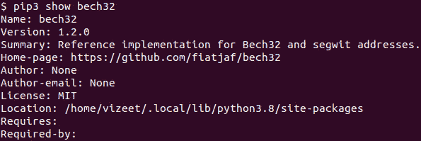

**图 12.18：** 新 Segwit 地址所需的 PIP 包

正如我们所学到的，在本地 SegWit 交易的情况下，`**previous scriptPubKey**` 的格式如下：

`<1 字节见证版本> <2-40 字节见证程序>`

当前版本为 0，对于 P2WPKH，见证程序大小为 20 字节，对于 P2WSH，见证程序大小为 32 字节。

下面是我们在之前的某个章节中讨论的原生 P2WPKH 交易示例中的前一个 scriptPubkey：

`前一个 scriptPubkey: 0x0014122bf8b77dceee01c0fa1f2b36d155fea2a5b016`

`=> 见证版本 = 0x00`

`=> 见证程序大小 = 0x14 = 20 字节`

`=> 见证程序 = 0x122bf8b77dceee01c0fa1f2b36d155fea2a5b016`

以下程序对见证程序进行编码并打印地址：

`import bech32`

`witprog = bytes.fromhex(‘122bf8b77dceee01c0fa1f2b36d155fea2a5b016’)`

`witver = 0x00`

`hrp = ‘bc’`

`address = bech32.encode(hrp, witver, witprog)`

`print(address)`

**程序 12.13：** 生成本地 SegWit 地址的 bech32 地址

在上述程序中，`**hrp**` 代表 **人类可读部分**。以下是与网络对应的 HRP 代码：

| **HRP 代码** | **网络** |
| --- | --- |
| bc | 主网 |
| tb | 测试网 |
| tb | 回归测试 |

**表 12.1：** 比特币网络的 HRP 代码

运行程序后，我们得到以下地址：

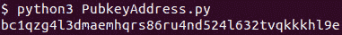

**图 12.19：** 从私钥生成的 bech32 地址

我们可以通过使用比特币核心客户端查看区块链中相应交易来检查地址是否正确。以下是 `**txid 6f7184d3b59adf06290686c6e4f7b7aeb0e7c869f05ca04d10a4b1636277fc40**` 的输出索引 1：

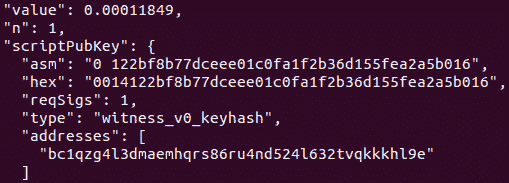

**图 12.20：** 显示交易输出中的 bech32 地址

现在，我们将为本地 P2WSH 进行操作。我们使用前面部分中示例中使用的 P2WSH 交易，其中：

`上一个 scriptPubkey = 0020d0862d6e40d240ea1711f6d897f5e7b07e974a593704077edffb7b67fd34b091`

所以，

`witness version = 0x00`

`=> 见证程序大小 = 0x20 = 32 字节`

`=> 见证程序 =`

`0xd0862d6e40d240ea1711f6d897f5e7b07e974a593704077edffb7b67fd34b091`

以下是获取与 P2WSH 对应的 bech32 地址的程序：

`witprog = bytes.fromhex(‘d0862d6e40d240ea1711f6d897f5e7b07e974a593704077edffb7b67fd34b091’)`

`witver = 0x00`

`hrp = ‘bc’`

`address = bech32.encode(hrp, witver, witprog)`

`print(address)`

这给了我们以下地址：

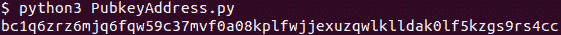

**图 12.21：** 从私钥生成的 bech32 地址

在上述程序中，我们查看了前一个 `**txid**` 在 `**txid**` 的索引 0 处的部分*:* 

`dffe1dc8f36cbc39c0f40b090912c5a00da13e3534f97aec0ef5bfe552019897`

通过使用比特币核心客户端查看前一个 `**txid**` 的 `**outindex**`，我们得到了以下前一个 scriptPubkey 和相应的地址：

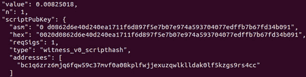

**图 12.22：** 展示了交易输出中的 bech32 地址

以下是解密 bech32 地址的代码：

`witver, witprog_l = bech32.decode(address[:2], address)`

`witprog_b = bytes(witprog_l)`

`scriptpubkey_b = bytes([witver]) + bytes([len(witprog_b)]) + witprog_b`

`print(‘scriptpubkey = ‘, scriptpubkey_b.hex())`

**程序 12.14：** 解码 bech32 地址以获取 scriptpubkey

在下面的执行中使用它来解码 P2WPKH 的 bech32 地址：

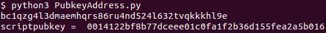

**图 12.23：** 解码 bech32 地址以获取 scriptpubkey

并在下面的执行中使用它来解码 P2WSH 的 bech32 地址：

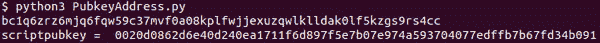

**图 12.24：** 解码 bech32 地址以获取 scriptpubkey

这就是本章的结束，我们很可能已经涵盖了隔离见证增强的所有方面。

# 结论

在本章中，您学习了隔离见证增强。您了解了为什么它很重要以及它对整体比特币的影响。此外，您还了解了与此增强同时发生的几个变化，比如我们改变了我们看待网络增强的方式。本章涵盖了新的地址编码算法，并教会了您如何对地址进行编码和解码。您学会了验证 SegWit 引入的新标准交易脚本，了解了交易的结构，并验证了它们以及签名。

在下一章中，我们将涵盖闪电网络，它既是比特币的一部分，又是一个独立的发展。它是一个第二层协议，可以提供比特币设计上所缺乏的速度。这是一个在可扩展性方面的重要发展。

# 记住的要点

+   比特币最初存在多个交易可篡改漏洞。

+   BIP62 是用于事务可篡改问题的原始解决方案，但实施起来很麻烦。

+   事务篡改使得未确认的交易对于交易签署者而言不可靠。

+   隔离见证通过将签名移出事务 ID 计算解决了所有事务可篡改问题。不计入事务 ID 计算的部分称为见证数据。

+   隔离见证被实施为软分叉。

+   SegWit 激活遵循 BIP 9。

+   BIP 148 的创建是为了在哈希功率多数派未激活与隔离见证相关的 BIP（BIP 141、BIP 143 和 BIP 147）时强制执行 SegWit 部署。这是**用户激活软分叉**（**UASF**）首次用于强制执行功能激活。

+   UASF 是由经济多数派而不是哈希功率多数派强制执行的激活规则。

+   隔离见证 Merkle 根是通过对块中所有交易的整个交易进行哈希计算，将哈希前置为 32 字节的零，然后计算 Merkle 根来计算的。

+   计算的隔离见证哈希 - Merkle 根与见证保留值的哈希（由矿工在 coinbase 交易的第一个输入中提供）连接起来形成承诺哈希，这个哈希位于 coinbase 交易的一个输出中。

+   SegWit 允许块的大小大于 1 MB，因为见证数据中的字节被认为是其大小的四分之一。因此，比特币软件更改了计算字节的方式。在此计数中，尽管实际可能大于 1 MB，但大小仍保持在 1 MB 以内。

+   使用隔离见证创建交易可减少所需的网络费用量。

+   SegWit 引入了四种新的标准脚本：P2WPKH、P2WSH、P2SH-P2WPKH 和 P2SH-P2WSH。

+   本地 SegWit 脚本哈希和公钥哈希使用 bech32 进行编码。

+   SegWit 地址具有可扩展的方案，包含版本，当前版本为 0。

+   SegWit 交易签名是使用与非 SegWit 交易不同的消息格式生成的。该消息格式在 BIP143 中定义。

# 问题

1.  计算具有 1 个输入和 1 个输出的 P2PKH、P2SH-P2WPKH 和 P2WPKH 交易的近似 vsize。比较它们，并确定使用 SegWit 交易可节省的百分比。

1.  计算具有 1 个输入和 1 个输出的 2-2 多重签名 P2SH、P2SH-P2WSH 和 P2WSH 交易的近似 vsize。比较它们，并确定使用 SegWit 交易可节省的百分比。

1.  编写程序以创建交易：

    1.  编写程序以创建 P2WPKH 交易。

    1.  编写程序以创建 P2WSH 交易。

    1.  编写程序以创建 P2SH-P2WPKH 交易。

    1.  编写程序以创建 P2SH-P2WSH 交易。

1.  填空：

    1.  BIP ______ 包含有关强制执行与 SegWit 相关的 BIP 的 UASF 的详细信息。

    1.  在 SegWit 之前，BIP _______ 提供了交易篡改漏洞的解决方法。

    1.  交易篡改漏洞的根源在于对于一个交易，_________ 可以不同但仍然有效。

1.  真/假：

    1.  在 SegWit 软分叉激活之后，非 SegWit 交易变得无效，并被网络拒绝。

    1.  BIP 148 取代了比特币网络上的 BIP 9 激活。

    1.  Bech32 编码生成的是包含大写或小写字母和/或数字的字母数字字符。
