# 第十三章

# 闪电网络

在上一章中，您了解了一个重要的增强功能，称为 **隔离见证**。这个增强功能通过将签名从交易 ID 计算中移出来，消除了交易篡改的可能性。这一改进通过增强其安全性，帮助了交易所和钱包。

这一增强功能还打开了安全链下交易的可能性，导致了第二层协议的发展，比如 **闪电网络**。

在本章中，我们将介绍最成功的第二层协议，称为闪电网络。闪电网络是通过添加双方资金并执行链下交易来创建通道的。这最初是由 *中本聪* 本人构想的。稍后在 2015 年，*Thaddeus Dryja* 和 *Joseph Poon* 在一篇题为 **比特币闪电网络** 的论文中首次提出了这一概念。该论文公开发表于以下链接：

**[`lightning.network/lightning-network-paper.pdf`](https://lightning.network/lightning-network-paper.pdf)**

几个月后，SegWit 在 2017 年 10 月激活后，闪电实验室在 2018 年 3 月推出了闪电网络的 beta 版本。

闪电网络通过在闪电节点通道上路由支付来运作。网络越广泛，用户体验就越好。因此，它的增长呈抛物线，一开始缓慢，现在迅速。为了帮助技术增长，一个化名的 Twitter 用户在 2019 年 1 月推出了闪电火炬。它基于奥运会中的接力赛的概念。它非常成功，并持续了 4 个月，但在那之后，全球范围内的采用仍然缓慢。

2021 年发生了一些变化，因为比特币海滩，一个冲浪社区，进行了两年多的工作，以及杰克·马勒斯在*萨尔瓦多*推出了闪电网络钱包 strike。之后，在*萨尔瓦多*总统*纳伊布·布凯莱*的支持下，比特币获得了法定货币地位。此外，政府推出了 Chivo，一个覆盖*萨尔瓦多*全国超过一百万人口的闪电网络钱包。自那时以来，闪电采用一直很快。

2021 年，Twitter 也集成了闪电支付。

闪电网络是构建基于比特币的循环经济的重要元素。在本章中，您将了解到什么使闪电网络如此特殊。

# 结构

在本章中，我们将涵盖以下主题：

+   闪电网络的简化工作原理

    +   连接的节点之间的支付

    +   通过多个通道进行支付

+   Bolt 规范

+   闪电网络中涉及的合约

    +   连接的节点之间的离线支付

        +   通道创建

             即时或涡轮通道

        +   离线交易

        +   通道关闭

             双方协商关闭

             单方关闭

             撤销的交易关闭

    +   双向双资助通道

        +   通道创建

        +   涉及中介的离线支付

+   通道监控

    +   观察塔

        +   公正交易的缺点

+   路由机制和考虑因素

    +   蹦床节点

    +   通道管理

        +   循环再平衡

        +   拼接

        +   闪电循环或潜水交换

    +   多部分支付或 MPP

+   最终用户体验

    +   闪电钱包

    +   闪电发票

    +   LNURL

    +   商家集成

    +   社交媒体集成

    +   交易所的采用

+   其他加密货币

    +   跨链原子交换

+   网络拓扑结构

# 目标

在本章中，我们将重点介绍闪电网络并稍微涉及其内部。闪电网络协议规范被定义为 BOLT 规范。每个 BOLT 规范都定义了特定的网络抽象。

比特币网络只通过提供脚本操作码来为闪电网络做出贡献，就像计算机微处理器为高级语言编译器提供机器指令一样。因此，闪电网络可以增加复杂性，而无需更改基础层。

因此，闪电网络的发展非常动态，协议正在迅速演进，允许改进和扩展用例。这需要更快的软件开发和测试周期，这与比特币开发的方式不同。

由于闪电网络是一个广泛而动态的主题，读者在阅读本章时，规范可能已经发生了相当多的变化。我们将尽量在本章的范围内涵盖尽可能多的内容。

# 闪电网络的简化工作原理

我们在*第四章，比特币在现实世界中*的*闪电网络*突出部分中讨论了闪电网络。

以下是你在*第四章，比特币在现实世界中*中学到的内容的摘要：

+   两个参与方通过锁定比特币来创建通道。

+   如果通道当前的余额仍然有资金，任何一方都可以向另一方发送比特币。

+   双方之间的支付是点对点的，不涉及比特币网络。

+   任何一方都可以随时通过在比特币网络上广播最终累积交易来关闭通道。

这是两个参与方之间闪电支付的最简单视图。由于闪电网络是一个复杂的协议，它不仅仅是简单的点对点支付。这一次，我们将深入研究协议的工作原理。

# 连接的对等方之间的支付

如果亚马逊作为买家或卖家有使用闪电支付的选项，我们就可以打开一个通道，并直到通道中有余额，就可以继续与亚马逊进行交易。

举个例子，Alice 通过向她的一边加载 0.001与卖奶的 Bob 创建了一个通道。在这种情况下，Alice 使用 UTXOs 来资助一个支付 2-of-2-multisig 合约的交易。这笔交易需要支付网络费用，并通过包含在比特币区块链中得到确认。

这是通道的创建插图：

**图 13.1：** 通道的创建

在这个例子中，Alice 每天都从 Bob 那里买牛奶，然后每天都付钱给他。

假设她为 5 天付了 0.0001，并与 Bob 达成共识关闭通道。

以下插图显示了三天的中间交易：

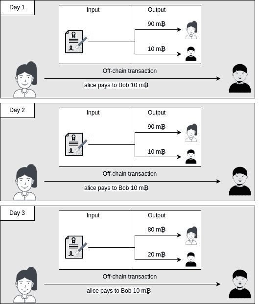

**图 13.2：** 每次离线交易的发送

每一笔新的交易需要失效之前的交易，这样 Alice 就无法发布并欺骗 Bob。Alice 发送给 Bob 的任何中间交易都不会被发布。

Alice 和 Bob 在 5 天后达成共识并发布交易。

以下是关闭通道的已发布交易：

**图 13.3：** 在链上发布的交易

这幅插图不包括交易费用，这些费用也是与输出一起支付的。在实际关闭通道时，Alice 和 Bob 会就他们希望支付的网络费用进行合作，然后发布累积了所有前置交易的交易。

# 通过多个通道进行支付

在现实世界的场景中，每个节点将有少量的通道，因此它只会连接到少数其他节点。随着网络的增长，将会有数十亿个节点。因此，任何人要想与其他人连接，就会有像我们在互联网上所看到的路由。

这意味着将会有中间商在节点之间促进支付。此外，源点和目的地之间会有多条路由，并且协议需要在选择路由路径时做出明智的决策。节点提供更好的连通性，延迟和资金将受到路由算法的青睐，因此节点将尝试通过收取路由费来激励这项服务。

为了实现这一点，闪电网络中的节点可以通过中间节点进行支付，并且中间节点可以收取费用。

假设爱丽丝想要支付卡罗尔，但她与卡罗尔没有直接的通道。然而，爱丽丝可以支付鲍勃，而鲍勃可以支付卡罗尔。我们还需要确保鲍勃不能偷走钱。

这只有在爱丽丝和鲍勃之间创建合同的情况下才能实现，这样鲍勃只有在能够证明他已经支付了卡罗尔时才能兑现比特币。这意味着首先鲍勃支付卡罗尔，然后鲍勃向爱丽丝证明他已经支付。

为了实现这一点，卡罗尔创建了一个秘密，鲍勃和爱丽丝都知道它的哈希值。爱丽丝和鲍勃之间的合同需要秘密，鲍勃在向卡罗尔支付后获得。卡罗尔只有在揭示了秘密后才能兑现她所收到的比特币。这种机制确保了没有人能够欺骗对方。

以下是爱丽丝通过鲍勃向卡罗尔路由支付的示例：

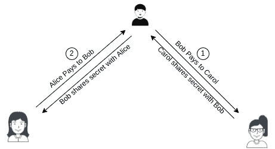

**图 13.4：** 通过中介进行支付

# Bolt 规范

闪电网络要求节点通过消息进行通信。它们需要设置条件来管理失败和攻击，发现彼此并保持匿名，还需要传递收据。

由于闪电网络是开放且去中心化的，软件实现需要规范。Bolt 是闪电网络软件遵循的一组规范，以便使用某个闪电网络软件的节点可以与运行不同闪电网络软件的节点进行交互。

Bolt 代表***闪电技术的基础***。

这是 Bolt 规范的活跃列表：

| **Bolt 规范编号** | **信息** |
| --- | --- |
| Bolt 1 | 基础层 |
| Bolt 2 | 通道管理的对等协议 |
| Bolt 3 | 比特币交易和脚本格式 |
| Bolt 4 | 洋葱路由协议 |
| Bolt 5 | 关于链上交易处理的建议 |
| Bolt 7 | P2P 节点和通道发现 |
| Bolt 8 | 加密和认证传输 |
| Bolt 9 | 分配的功能标志 |
| Bolt 10 | DNS 引导和辅助节点位置 |
| Bolt 11 | 闪电支付的发票协议 |

**表 13.1：**Bolt 规范

Bolt 6 已被移除并由 Bolt 7 替代。

# 涉及闪电网络的合约

在前一节中，你学习了闪电网络的基本工作原理。现在，我们将看看实际的合约以及处理不同情况的方式。

# 连接的对等方之间的离线支付

首先，我们将看看在连接的对等方之间的单个通道上发生支付时的情况。我们将研究涉及通道创建的实际合约、离线交易的结构，以及通道可以被关闭并在链上结算资金的不同方式。

我们还将了解在通道创建和通道关闭时如何支付费用，以及每个离线交易如何考虑这一点。我们还将了解协议如何通过合约处理作弊行为。

# 通道创建

爱丽丝是鲍勃的客户，希望与鲍勃创建通道，以便她可以继续支付鲍勃并支付少量费用。由于爱丽丝是客户，她将支付，鲍勃将始终收到比特币。通道被创建为只有爱丽丝在通道的她一侧有余额。

一旦通道创建并进行中间的离链交易，任何人都应该能够单方面关闭通道。关闭通道需要支付网络费用，因此在打开通道时需要协商网络费用。

节点通过交换定义好的消息格式进行通信。消息格式在 Bolt 2 规范中定义。这有助于网络费用协商、通道建立等。

合约价值定义为通道中锁定的资金和网络费用的总和。通道中锁定的总和仅用于从爱丽丝向鲍勃转移价值。

以下是合约价值及其构成的说明：

**图 13.5：** 合约价值构成

最初，通道中锁定的资金完全位于爱丽丝一侧，因为她为爱丽丝和鲍勃之间的 2-of-2 多重签名合约提供了资金。这表示为：

**图 13.6：** 付款通道

这是进入比特币区块链的资金交易：

**图 13.7：** 资金交易

# 即时通道或涡轮通道

在闪电网络中，预计完全资助的通道将在离链事务发生之前上链。然而，通道大多在支付时打开，并且等待半个小时可能会导致糟糕的客户体验。

我们看到，当交易可篡改性错误被隔离见证软分叉修复时，未确认的交易变得相当可靠。仍然存在 0-确认攻击的风险，即攻击者可以同时发布两个交易。由于大多数通道不会在单个通道上持有大量价值，依赖未确认的通道是安全和客户体验之间的公平权衡。

不等待资金交易确认有一个重要优势。可以支付低网络费用。仅仅等待几个小时的确认就可以显著降低费用。

# 离线交易

一旦资金被锁定在 2-of-2 多重签名合同中，如果 Alice 通道的一侧有余额，Alice 可以支付 Bob。

但是，Alice 可以发布一个给她更大价值的较旧交易。为了保护 Bob 不被 Alice 欺骗，所有旧交易在执行下一笔交易之前都需要无效化。

要使最新的交易无效，Alice 需要在执行下一笔交易之前向 Bob 提供撤销密钥。撤销密钥赋予了 Bob 主张通道中锁定的所有资金的权力，以防止 Alice 在撤销她对资金的索取之前取走她的份额。为了避免 Alice 取走她的份额，新合同不允许 Alice 在特定时间段之前取走她的资金份额。

以下是前两个承诺交易，包括初始承诺交易的撤销：

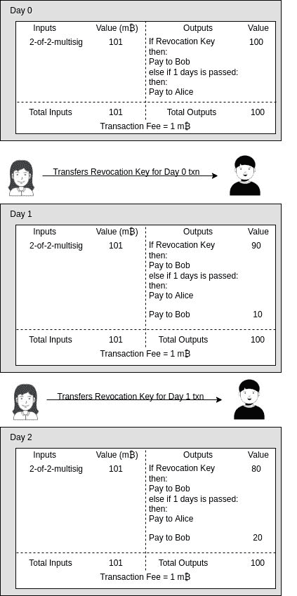

**图 13.8：** 承诺交易与撤销密钥共享

在这里，我们只保护了 Bob 不被 Alice 欺骗，因为 Alice 不会被 Bob 欺骗。如果 Alice 和 Bob 拥有双向支付通道，那么 Bob 和 Alice 将有不同的承诺交易，撤销也将双向共享。

在承诺交易中，我们可以观察到如果爱丽丝试图欺骗鲍勃，那么他可以使用撤销密钥立即索取爱丽丝的份额。

# 通道关闭

关闭通道有三种方法：

1.  通道可以由各方相互协调关闭。这样，费用可以重新协商。

1.  一个通道可以单方面关闭。这意味着任何一方都可以发布他们的最后一笔交易。

1.  一方可以通过发布交易的旧状态来欺骗另一方。

Bolt 2 规范还详细说明了通道的关闭。

# 双方协商关闭

在双方协商关闭的情况下，爱丽丝和鲍勃发送协议消息以决定费用，然后重新创建并签署最后一笔交易。然后爱丽丝和鲍勃将交易发布到比特币区块链上。与单方关闭不同，双方协调的关闭交易没有任何相对时间锁定，因此爱丽丝通过支付较低的费用可以立即获得她的资金。

以下是双方协商的最终交易示意图：

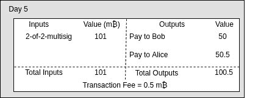

**图 13.9：** 双方协商的通道关闭

# 单方关闭

在单方关闭的情况下，最后一笔交易被发布，鲍勃可以立即取出他的资金，而爱丽丝必须等待相对时间锁定过期。

以下是单方关闭的示意图：

**图 13.10：** 单方通道关闭

在这种情况下，撤销密钥从未被共享。因此，鲍勃无法取出他的资金，但是爱丽丝必须等待相对时间锁定过期才能索取她的份额。

# 撤销的交易关闭

如果爱丽丝发布了一笔已经被撤销的旧交易，那么鲍勃可以创建一笔交易来索取爱丽丝所有的资金。

以下是爱丽丝发布的交易：

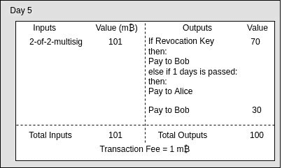

**图 13.11：** 爱丽丝发布的已撤销交易

然后，Bob 使用他的吊销密钥创建另一个用于惩罚 Alice 的交易。这个交易被称为**正**义**交**易。这里是说明：

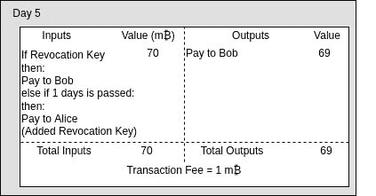

**图 13.12:** Bob 发布的正义交易

如果 Bob 丢失了吊销密钥，那么在经过 1 天后，Alice 可以将锁定的资金转移到她的地址。这里是说明：

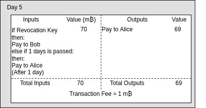

**图 13.13:** Alice 在 1 天后将资金转移到她的地址

# 双向资助通道

我们在前几节中讨论的案例仅涉及单向支付。很多时候，对等方之间的支付是双向的。在这种情况下，新的通道是通过使用 Alice 和 Bob 的资金创建的。

# 通道创建

下面是一个双向资助通道的插图：

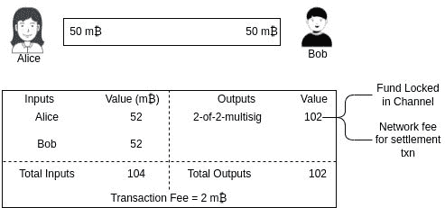

**图 13.14:** 双向资助通道的资金交易

在这种情况下，在 Alice 和 Bob 之间的支付时，双方都创建并发送交易给对方，并且为了吊销交易，双方将吊销密钥转移给对方。这在每个实例中都会发生，不论是谁向谁支付。

可以通过以下插图理解：

**图 13.15:** 承诺交易和吊销顺序

在前述交易中，Alice 需要向 Bob 发送 10 m来买咖啡。由于 Bob 是前一笔交易的接收方，Alice 会比 Bob 拥有更多的资金。因此，Alice 可以通过发布前一笔交易来欺骗 Bob。为了避免被欺骗的风险，Bob 需要从 Alice 那里获得有关咖啡的已签名交易，只有这样他才能吊销他的前一笔交易并签署 Alice 的交易。

这使得 Alice 和 Bob 可以拥有由双方资助的双向通道。通道的关闭方式与我们在前一节中学习的方式相同。

# 涉及中介的离线支付

在这种情况下，Alice 想要支付给 Carol 10mB，但她只与 Bob 拥有一个通道，而 Bob 与 Carol 有一个通道。Bob 通过他的节点转发交易收取费用，并且 Alice 需要支付给 Bob 这个费用，因为她要支付给 Carol。在闪电网络支付中，预期发送方会支付费用。

Bob 使用闪电网络协议消息通知 Alice 需要支付的费用。

正如我们在之前的一个主题中学到的那样，Carol 需要生成一个秘密并给出其哈希。Carol 只需与 Alice 共享秘密的哈希，当 Alice 和 Bob 创建合同时，Bob 获得秘密的哈希，他可以用来与 Carol 或另一个中介创建合同。

当 Carol 向 Bob 揭示秘密时，Carol 可以索取她的资金。这使得 Bob 知道秘密，他向 Alice 揭示以索取他的资金。由于 Bob 只能向 Alice 揭示秘密，所以当 Carol 向 Bob 揭示秘密时，Bob 和 Carol 之间的交易超时时间需要小于 Alice 和 Bob 之间的交易时间。

为了实现这一点，离线交易具有***哈希时间锁定合同***（**HTLC**）。HTLC 是一类合同，要求满足哈希条件或时间条件中的一个；否则，锁定的资金可能会被没收。HTLC 是离线交易的附加输出。

以下是在每个通道端进行的交易的示意图：

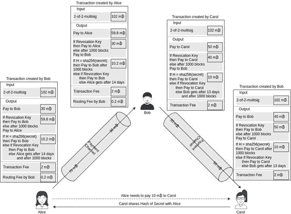

**图 13.16：** 通过中介进行离线交易的合同交换

在上述交易中，我们可以看到在 HTLC 输出中，如果秘密未被揭示且撤销密钥未被使用，则 Alice 可以在挖掘了 1,000 个区块后的 14 天内收回与 Bob 通道中的资金，而 Bob 则可以在挖掘了 1,000 个区块后的 13 天内收回与 Carol 通道中的资金。

HTLC 是一个单独的输出，因此它增加了交易成本，并且大多数情况下携带小额价值。这意味着当此交易被发布时，HTLC 的 UTXO 值可能使其不太可用。为了避免最终交易中的 HTLC，在 Bob 从 Carol 那里获取秘密并验证它后，通过移除 HTLC 输出并将其与接收者输出合并来创建新的交易。

以下是秘密和哈希共享的顺序图：

**图 13.17：** 通过中介支付的顺序图

在下面的插图中，当 Carol 向 Bob 分享秘密后，新的修改后的交易如下所示：

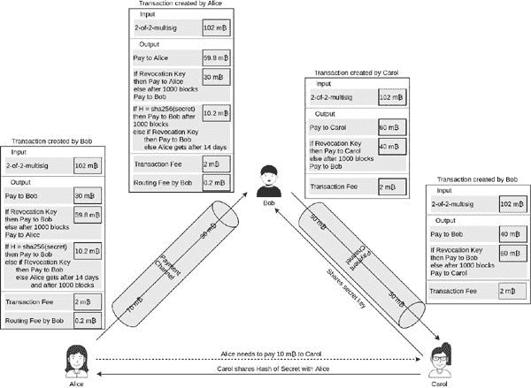

**图 13.18：** 当 Bob 知道秘密后移除 HTLC 输出

在此之后，Bob 与 Alice 共享秘密，并且双方同意从交易中移除 HTLC。

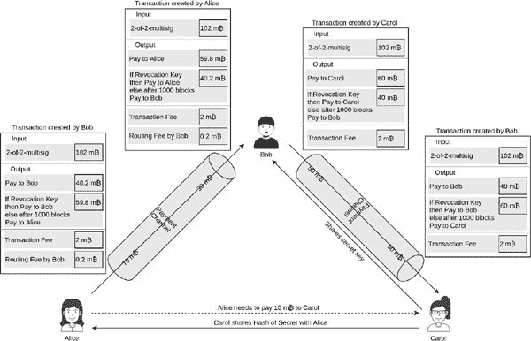

**图 13.19：** 当 Alice 知道秘密后移除 HTLC 输出

我们可以看到，前面更新的交易消除了交易结算的需要。

# 通道监控

闪电网络有一个缺点：节点需要始终在线监视它们的通道；否则，同行者将有机会突破通道。这是因为如果发生通道突破并且受影响的同行者不在线，那么它将不会知道发生了突破，而攻击者将成功窃取资金。然而，如果通道突破的受害者在线，它会知道突破已经发生，并且会通过发布所需的公正交易来惩罚攻击者。

但在实际情况下，节点可能会因为多种原因而下线，比如飓风、互联网连接中断、火灾或电路短路，或者只是因为错误地关闭电源。

为了避免这种情况，闪电节点可以支付可以监视其通道的节点。这些监控节点称为**守望者**。

# Watchtower

Watchtower 是一个闪电网络节点，为其客户维护通道状态，并且如果其客户离线，可以发布惩罚或公正交易以应对通道违约。

Watchtower 应该始终在线并始终监视区块链。Watchtower 的客户端需要在其客户进行新交易或其客户共享撤销密钥时每次更新 watchtower。

可以通过以下序列图来理解看守者的工作：

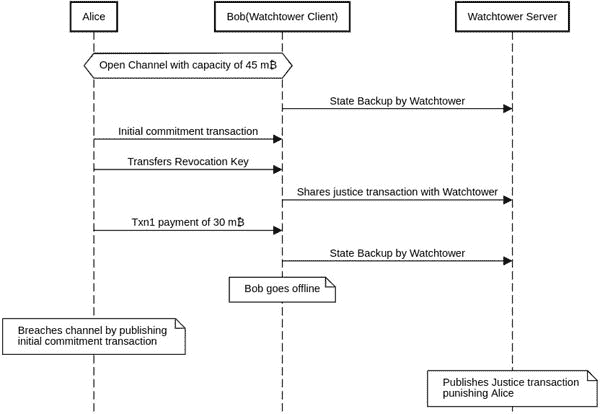

**图 13.20：** 看守者的功能

在前述序列图中，我们可以看到看守者的客户端使看守者服务器始终了解其所有通道状态的变化。因此，在通道违约事件发生时，看守者将发布公正交易，客户端可以申请惩罚交易。

# 公正交易的缺点

正如你所学到的，闪电网络提供了一种机制来惩罚试图通过发布非最近交易来违反通道的节点。这种惩罚机制称为***LN-penalty***，通过发布公正交易来实现。这听起来是一个很好的主意，但实际上，大多数受到惩罚的节点并没有作弊。大多数违约是因为节点没有保持最新交易。

惩罚一个节点因其错误是不正确的，因此正在研究一种不同的机制，称为***Eltoo***。Eltoo 可能是闪电网络的未来增强。它将依赖于一种新的哈希类型，称为`**SIGHASH_ANYPREVOUT**`。在`**SIGHASH_ANYPREVOUT**`未被添加到比特币脚本之前，无法实现 Eltoo。比特币具有非常严格的增强机制，其中大多数利益相关者需要就新的增强机制达成一致意见，特别是其庞大的开发者社区，这意味着如果`**SIGHASH_ANYPREVOUT**`存在不可接受的风险，它可能永远不会被接受。或者不同的增强可能会解决这个问题。在那之前，我们需要忍受这个缺点，并采取足够的预防措施以避免损失。

# 路由机制和注意事项

当爱丽丝想要支付戴夫时，她需要找到一条通往戴夫的路由，以确保路由中每个通道的支付端都有足够的资金，以便支付成功。这被称为***源路由***。当爱丽丝的节点尝试找到通往戴夫的路由时，它会查找通道容量，即通道中锁定的价值的总和。有时通道容量足够高，但发送端的资金不足；这可能导致无法处理。

这些信息需要收集，以便在下次出现类似支付需求时可以避免使用该通道。此外，可以根据过去的违约情况对节点和通道进行评级。

寻找目标接收方路由时需要考虑以下因素：

+   通道容量足够高

+   由于支付端资金不足而导致的过去失败

+   节点过去的通道违约情况

+   节点转发支付请求时收取的费用

# 蹦床节点

节点面临的挑战之一是找到便宜且在每个通道上容量足够的路由。这需要不断更新网络拓扑。在网络规模不大的情况下，这是可以接受的，但随着我们看到的快速采用增长，这成为了一个问题。

弹跳节点是闪电网络中的特殊节点，其唯一责任是通过频繁更新来维护当前的网络拓扑结构。因此，一个节点只需维护部分网络拓扑结构，即连接到弹跳节点或所有附近节点。

弹跳节点维护有关闪电网络中所有节点的信息，并可能依赖其他弹跳节点来扩展其子网之外的路由。这样，没有节点需要维护整个网络的信息。

弹跳节点允许非托管的移动钱包在全球范围内即时发送闪电支付，无需大量的存储和处理。

使用弹跳节点进行支付路由的示例如下图所示：

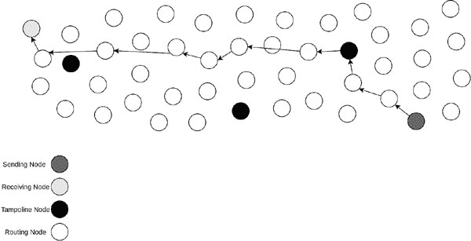

**图 13.21:** 发送节点寻找到接收节点路由的弹跳节点的帮助

# 通道管理

通道只能用于为对等方之间的请求提供服务，并且大多数情况下对网络的其余部分隐藏。这些被称为**私有通道**。另一方面，通道也可以是公开的，并且其他节点可以使用它与网络的其余部分进行路由连接。

对于公共通道，重要的是两端的资金平衡，以防由于付款方缺乏资金而导致路由失败。这需要积极的通道管理和与同行的合作。有多种方法可以实现这一点。

# 循环再平衡

重新平衡通道的一种方法是从我们的其他通道中支付给自己。

可以通过以下插图来理解：

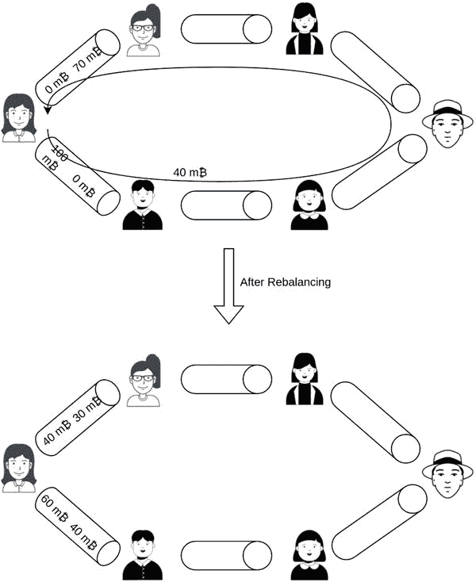

**图 13.22：** 循环再平衡机制

循环再平衡很便宜，因为只涉及链下交易，但它需要至少一个通道在另一侧被加载。

# 拼接

循环再平衡是首选的再平衡方法，但对于商家来说并不实用，因为商家可能只接收而不发送，因此可能没有任何通道可用于将资金移动到其他通道。

拼接允许更改通道容量，而无需关闭或重新打开通道。拼接需要修改资金交易，同时接受所有传入的付款请求。这使得其实现相当复杂。

内部拼接意味着增加通道的容量。以下是内部拼接的简要概述：

**图 13.23：** 简述内部拼接

外部拼接意味着减少通道的容量。以下图示是外部拼接的简要概述：

**图 13.24：** 简述外部拼接

这只是内部拼接和外部拼接的简化表示。实际上，实现将会更加复杂。

# 闪电环路或潜艇交换

潜艇交换，也称为闪电环路，是通过在通道内外移动资金来管理通道的另一种方法。闪电环路基于 HTLC 可以在链上和链下同时工作的原则，因此，交换提供者可以帮助在链下和链上之间以无信任方式移动资金。

闪电环路是商家可以将资金移动到通道另一侧而无需复杂操作的另一种方法。

要将资金从通道移出，一个节点通过多跳将资金发送到交换提供者，交换提供者将资金发送回链上的节点，从而将资金从链中移出。

下图能帮助理解：

**图 13.25：** 使用潜艇交换将资金从通道转移到链上

同样的方法可以用来通过交换提供者从链上添加资金，方法是按照相反的方向执行上述过程。

这是使用闪电环（Lightning Loop）将资金从链上转移到我的通道一侧的插图：

**图 13.26：** 使用 Submarine Swap 将资金从链上转移到通道的移动

# 多部分支付或 MPP

闪电网络不适合在通道网络上转移大额价值。这是因为在通道网络上转移价值时，只能选择在发送方一侧具有足够余额的通道，而具有大容量的通道很少。因此，如果需要转移大额价值，则在发送方和接收方之间建立路径就很困难。为了解决这个问题，闪电网络软件有时会将价值分割成多个通道，并为每个分割的价值找到单独的路径。这称为***多部分支付***。

这可以通过以下插图来理解：

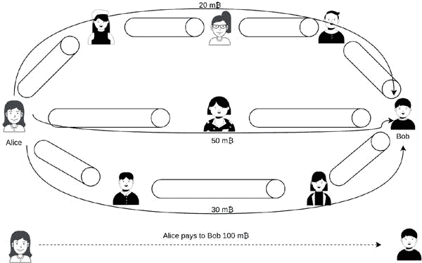

**图 13.27：** 多部分支付

在上图中，爱丽丝想要向鲍勃发送 100 m，但没有可用的转账路径。为了实现这一目标，爱丽丝将金额分成了 20 m、30 m 和 50 m，然后通过不同的路径发送。这样，鲍勃可以离线接收到 100 m 而无需进行链上交易。

# 终端用户体验

当我们使用闪电网络支付服务时，我们需要创建一个通道，以便向对等方支付多次，直到通道的支付方有余额。

要进行支付或接收支付，我们需要在我们的节点和网络中的几个其他节点之间建立通道。这需要通道管理，并可能涉及以下活动：

+   在我们的一侧、对等方的一侧或两端创建带有资金的通道。

+   创建涡轮通道或在接受或发送付款之前等待 3-6 次确认。

+   积极平衡通道，以便可以发送和接收付款。

+   保持网络拓扑更新或使用跳板节点找到最佳路由。

+   使用**watchtower 服务**以避免被同行欺骗。

+   相互或单方面关闭通道，并监视比特币区块链以进行通道关闭/违约事件。

这可能看起来很可怕，但许多闪电网络钱包会在内部处理所有这些问题，并且用户体验无缝。

# 闪电钱包

闪电钱包是比特币钱包，也可以打开和管理通道。钱包可以通过允许用户分配资金和管理通道来为用户提供更多控制，或者它可以隐藏所有的复杂性，使体验无缝。钱包可以是托管的，在这种情况下，资金由钱包控制，用户只需登录并批准交易。另一方面，在非托管钱包中，用于创建钱包的种子和密钥由用户拥有。

由于闪电钱包正在创建和管理通道，它们也被称为**闪电节点**。

这里是一些流行的闪电钱包：

*Zap 钱包，Muun 钱包，Bluewallet，Breez 钱包，Satoshi 钱包，比特币闪电钱包（BLW），Éclair Mobile 等。*

# Lightning 发票

你已经学到了当爱丽丝从鲍勃购买咖啡时，鲍勃会生成秘密哈希，以便爱丽丝可以付款。为了实现这一点，Bolt 11 解释了鲍勃需要与爱丽丝共享的消息结构，这被称为 Lightning 发票。

在这里，我们从商家应用程序生成了一个 Lightning 发票，并使用了一个开源应用程序对其进行解码。以下是应用程序的截图：

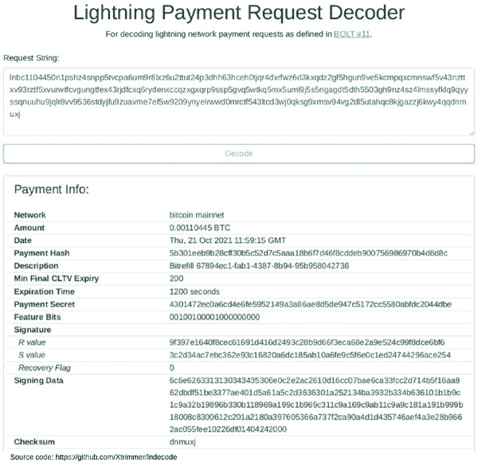

**图 13.28：**闪电发票信息

我们可以看到它包含的所有信息，并且将帮助 Alice 创建交易并将其发送到一个通道，通过该通道将支付路由并到达 Bob。

请求的字符串只是 Bob 与 Alice 共享的 QR 码。因此，Alice 去了 Bob 的咖啡店。Bob 通过他的手机钱包显示 QR 码请求付款。Alice 从她的手机钱包扫描 QR 码并进行付款。这在一分钟内完成。

以下是闪电网络支付的说明：

**图 13.29：** 闪电网络支付

# LNURL

LNURL 是闪电网络的第三层。它更进一步，允许你使用闪电网络创建通道、进行付款和接收付款，甚至在网站中用于认证。

LNURL 支付链接可重复使用，因此不需要在每次购买时重新扫描发票。LNURL 包括一个服务器，当扫描 QR 码时，扫描应用程序会联系 LNURL 服务器执行所需服务。这样，发票的发送就可以在没有用户交互的情况下完成。

这不仅允许使用闪电网络进行支付，还可以进行认证。LNURL 用于实现其他一些服务，这些服务在以下 URL 中指定：

**[`github.com/fiatjaf/lnurl-rfc`](https://github.com/fiatjaf/lnurl-rfc)**

LNURL 认证是 LNURL 启用的一项服务，允许你使用闪电钱包登录网站。

我们将使用以下网站演示 LNURL 认证：

**[`lightninglogin.live/login`](https://lightninglogin.live/login)**

以下是 LNURL：

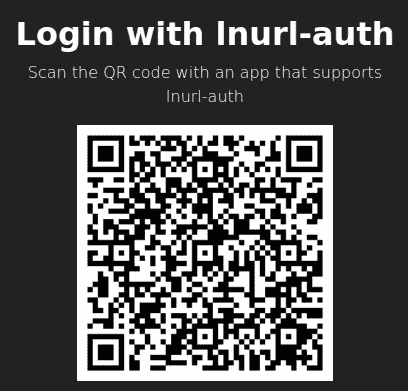

**图 13.30：** 用于网站登录的 LNURL 认证

解码结果如下：

lightNING:LNURL1DP68GURN8GHJ7MRFVA58GMNFDENKCMM8D9HZUMRFWEJJ7MR0VA5KU0MTXY7N2WTRX4JNYENXVVMXZVTZV43RWCN9XPSKVDECXY6NWEPHXG6KVCNYXEJRXWRPXVUNSVFK893K2CF5XENRXVNRVEJKVCFSVVURYDPCXCN8GCT884KX7EMFDCSMESJ7

我们使用了一个在线应用程序来解码这个，并获得了以下网址：

**[`lightninglogin.live/login?k1=59c5e2ffc6a1beb7be0af78157d725fbd6d38a398169cea46f32cfefa0c82486&tag=login`](https://lightninglogin.live/login?k1=59c5e2ffc6a1beb7be0af78157d725fbd6d38a398169cea46f32cfefa0c82486&tag=login)**

支持 LNURL 身份验证服务的钱包将能够与 LNURL 服务器协调，以进行身份验证并登录服务器。简单扫描 QR 码即可让用户登录网站，他们不需要任何传统的登录方法。

# 商家整合

闪电网络钱包允许任何实体店只需安装一个移动钱包就能接受付款。对于在线业务，BTCPay 服务器提供了闪电钱包与在线支付网页的轻松整合。BTCPay 是一个开源项目。还有其他一些，比如 wooCommerce 或 CoinGate，也提供了闪电网络的整合。

# 社交媒体整合

Twitter 最近与 strike 钱包整合。目前，任何拥有 strike 钱包的人都可以通过闪电网络通道接收比特币，任何拥有闪电钱包的人都可以发送比特币。这意味着人们可以在全球范围内合作，并为他们的服务获得报酬。此外，社会服务机构可以直接联系在专制政权下工作的人，并通过直接向他们支付比特币来帮助他们。

电报还有一个名为**LNTXBOT**的闪电网络机器人，可以用来支付或请求付款。

# 交易所的采用

一些交易所迅速采用了闪电网络。印度的 Zebpay 交易所就是其中之一。全球范围内还有许多交易所支持使用闪电网络进行比特币与其他货币或加密货币的交换。一些知名的交易所包括 Bitfinex、Strike、OKEx、CashApp、Paxful 等等。

# 其他加密货币

闪电网络需要一些增强功能，如隔离见证，以克服交易篡改的风险等。有许多加密货币几乎使用与比特币相同的代码库和脚本语言。使比特币网络上的闪电网络成为可能的增强功能也可能使许多其他加密货币上的闪电网络成为可能。

目前，莱特币是唯一一种在其网络上启用闪电网络的其他加密货币。少数其他加密货币表现出了兴趣，但直到目前为止，没有一种加密货币添加了对闪电网络所需的支持。

# 跨链原子交换

您学会了如何使用 HTLC 通过 Submarine Swaps 交换链下余额和链上余额。类似地，HTLC 可以用于与另一种加密货币进行跨链交换。这已由莱特币创始人查理·李于 2017 年 9 月 16 日演示。YouTube 上有一段为时 2 分钟的演示，标题为`**比特币和莱特币之间的闪电跨链交换**`：

**https://www.youtube.com/watch?v=cBVcgzEuJ7Q**

# 网络拓扑

闪电网络仍在发展中，并且网络结构可能会在未来发生变化。然而，总体上看，该网络似乎试图模仿邮政网络，个体连接到钱包提供者，钱包与更大的跳跃维护通道，更大的跳跃连接到其他几个类似的跳跃，以简化转发。

作为最终用户，我们永远不需要关闭与钱包的通道。如果我们发送和接收资金，则此通道可以持续较长时间；因此，总费用几乎可以忽略不计。

以下是闪电网络拓扑的图示：

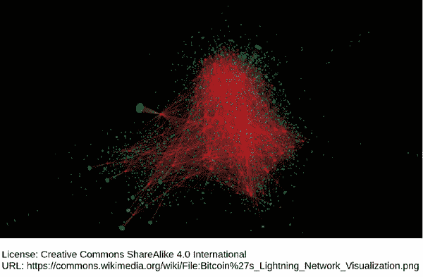

**图 13.31：** 闪电网络拓扑

在上图中，我们可以看到有数千个节点通过通道连接。这些是公共通道，因此可以找到并用于更新拓扑。

# 结论

在本章中，您学习了比特币的第二层协议闪电网络协议。您了解到比特币原始脚本语言如何实现可靠的即时交易，并理解了闪电网络有其开放的规范和消息系统，以允许不同的软件实现彼此通信。

您还学习了帮助路由支付或重新平衡通道的节点，以及为闪电网络建立和开发的生态系统。

这使我们到达了书的结尾。本书的目的是通过让读者了解比特币协议、网络、区块链、交易、增强等内部细节，帮助建立比特币开发者社区。开发者进入比特币开发社区越多，比特币就会变得更加安全和更好，这为我们带来了更加去中心化的未来的希望。

# 需要记住的要点

+   闪电网络是第二层协议，使用比特币交易脚本。

+   它允许比特币的即时离线支付。

+   要使用闪电网络执行离线交易，需要在发送方和接收方之间创建通道。

+   如果发送方通道端有足够的资金，则可以执行离线交易。

+   通道可以单方面关闭，也可以进行双向关闭。

+   通道违规是指攻击者通过发布旧交易来关闭通道。

+   通道违规的受害者通过发布正义交易来惩罚攻击者，该交易包含攻击者提供的吊销密钥，以支付攻击者的资金给自己。

+   单向通道在创建时只在发送方的一端有资金。

+   双向通道在通道的两端锁定了资金。

+   通过在 2-of-2 多重签名中锁定资金来创建通道。

+   两个没有直接通道的个体之间可以进行支付，通过经过一系列通道的多个节点进行路由支付。

+   源路由是指发送方与节点通信以构建网络拓扑，以找到最佳路由到目的地的路径。

+   Trampoline 节点帮助发送者找到最佳路由。

+   Trampoline 节点维护更新的网络拓扑，发送者只需要部分拓扑。

+   节点需要始终保持在线；否则，对等方可能会发布旧交易，而离线节点将损失资金。

+   Watchtower 节点可以通过始终监视链上情况为节点提供服务，并在需要时发布公正交易。

+   节点可以连接到 watchtower 服务器并定期更新其通道状态和公正交易。

+   循环重新平衡是一种方法，其中节点可以通过将资金转移到其对等方加载的另一个通道来平衡通道。

+   潜水交换或闪电环路节点帮助将链下资金移动到通道末端的节点，反之亦然。

+   Splicing 允许您在不使通道脱机的情况下动态增加或减少通道的容量。

+   增加通道容量称为 splice-in，减少容量称为 splice-out。

+   多部分支付允许发送者通过将金额分割成较小值并通过不同通道和路由发送它们来在闪电网络上发送大额交易。

+   闪电发票由商家或接收方生成，可以采用 QR 码形式。发送方用于进行付款。

+   LNURL 是一个第三层协议。

+   LNURL 提供了使用单个 QR 码重复进行支付的方法。

+   使用 LNURL，可以执行各种其他任务，如认证和创建通道。

# 问题

1.  解释单向和双向通道之间消息交换的区别。

1.  公共路由节点保持通道平衡的重要性是什么？

1.  使用跳板节点比源路由有什么好处？

1.  解释使用 MPP 的好处。

1.  填空：

    1.  通过称为 ___________ 的通道管理技术可以增加通道的容量。

    1.  闪电网络可以通过使用 LNURL _______ 对站点进行身份验证。

    1.  闪电网络已被证明可以在比特币节点和莱特币节点之间进行 _______ ______ 值的传输。

1.  真/假：

    1.  LNURL 是第三层协议，因为它具有自己的消息传递协议，可以帮助建立和执行闪电网络操作。

    1.  圆形重新平衡是最适合商家的通道平衡方法，因为他们大多数时候都会收到资金。

    1.  Turbo 通道没有风险，因此可以打开高容量通道。

    1.  闪电网络的可用性取决于节点之间的连接情况，这取决于其流行程度。

1.  创建托管和非托管钱包的列表。

1.  安装闪电网络钱包，进行付款，并尝试猜测后台发生的步骤。
