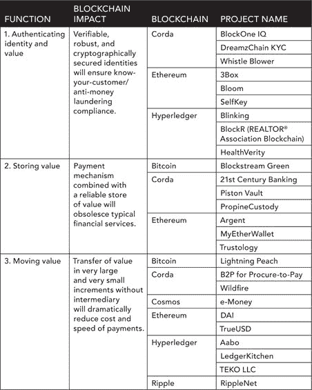
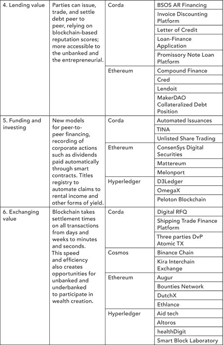
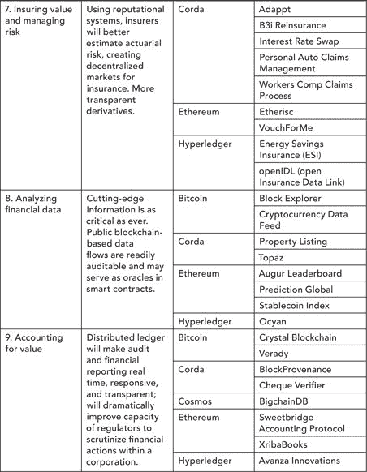

第一章

即将到来的灾难

区块链与金融服务

亚历克斯·塔普斯科特

金融服务简介

•在互联网的第一个时代，软件吞噬了整个世界，从广告和电视到零售和教育，这一过程转变了许多行业。⁶ 互联网的第二个时代将使这些变化显得古老，因为区块链颠覆了金融，这是所有行业和人类经济活动的基础。它将重塑我们经济的深层结构。

•赌注很高：下一个货币、商业和经济活动时代岌岌可危。当今数字领域的主要地主——Facebook、Google 和其他公司——毫无疑问将利用区块链来控制明天的数字世界。他们将面对维护现状的守护者：拥有庞大金融帝国的大银行以及拥有系统性权力和货币政策的政府。

•银行和其他金融中介移动资金。他们移动的越多，他们存储的越多，他们借出的也就越多。支付铁路是该行业体系的心血管系统，而货币则是全球商业的血液。没有它们，其他任何器官都无法运作。因此，价值的数字化是将中介与资产解耦，并将它们迁移到这种原生数字价值媒介的第一步。

•我们将研究行业的五大颠覆性变革：开放金融和金融资产的数字化；一切的“金融化”；区块链作为可信的共享真相登记簿；分散式金融（DeFi）的优势和局限性；以及自主身份的角色。

•新的分散式金融模型和新兴的加密资产类别很快将使现有企业——无论是银行还是数字集团——都不得不竭力避免过时和无关紧要。比特币和其他加密货币将挑战政府支持的法定货币的教条，并且首次，数十亿人将能够连接到全球经济。

我们看到了这个新未来中的希望和危险。镇压第一代互联网的威权政权已经开始利用这种第二代技术为自己谋利，这种趋势无疑会在缺乏治理和公众警觉的更加民主的社会中蔓延。

在有良好管治和负责任领导的情况下，区块链将开启金融服务的新时代，更加开放、包容、高效、安全和自由。如果我们做得好，新的经济体系将崛起，为更多人带来更大的繁荣，而不是为少数人带来更多财富。

介绍

#### 金融服务中的区块链革命

在我开始投资银行职业生涯的一周后，雷曼兄弟破产了，全球经济陷入了低迷。22 岁的我不得不经历一场严峻考验。当金融的烈火最终吞噬了许多世界最大的银行后，我的公司依然屹立不倒，我（不知何故）还在岗位上。我是幸运的。对于我的一代人中的许多人来说，2008 年开启了一个失落的十年，结构性失业、增长乏力、政治不稳定以及对许多机构的信任和信心腐蚀。金融危机暴露了驱使经济濒临崩溃的贪婪、渎职和显而易见的无能，并使一些人开始质疑：“腐败有多深？”

在这场金融危机中，一位名叫中本聪（或多人）的匿名人士发明了比特币区块链。尽管他曾经声称，“我对代码比对文字更在行”，但中本聪的杰出而清晰的白皮书，“比特币：一个点对点的电子现金系统”，引入了一个激进的新概念：通过互联网进行现金交易——一种在没有银行和政府等中介的情况下移动和存储价值的方式。⁷ 比特币引人注目的地方在于它运作良好，并引发了一场像野火般蔓延的火花，并俘获了技术专家、企业家和商业领袖的想象力。2009 年 1 月，中本聪说：“如果 10 年后我们没有以某种方式使用电子货币，我会感到惊讶……如果足够多的人以相同的方式思考，那就会成为自我实现的预言。”⁸ 今天，比特币的价值达到了 2000 亿美元，世界上最有影响力的人，从唐纳德·特朗普到马克·卡尼（英格兰银行）、史蒂文·姆努钦（美国财政部）、杰罗姆·鲍威尔（美联储主席）和克里斯汀·拉加德（国际货币基金组织）都在批评和赞扬它。每个人似乎都有自己的看法，而这些看法似乎在迅速发展。

比特币还引领了区块链革命，指的是使完全数字化资产如比特币成为可能的底层区块链。区块链是一种无需许可的分布式交易分类帐，位于点对点（P2P）网络中，其中信息（不一定是金融信息）以及时、安全和防篡改的方式记录。它们存在并且可以信任是因为大规模的协作、共识和代码，而不是传统的中介。它们为几乎所有形式的价值提供了可编程的稀缺数字资产。人类历史上首次，实体不需要依赖银行和其他第三方来移动、存储、协调和管理价值。

毫无疑问，比特币仍然是迄今为止最重要的区块链创新，但创新者和企业家正在利用区块链进行更多的事情。区块链是第一个原生数字价值媒介，就像互联网是信息的第一个数字媒介一样。因此，我们可以将其用于几乎任何类型的资产，并迫使我们重新思考许多行业的深层结构和运作方式，从金融开始。

#### FACEBOOK 加入区块链革命—系好安全带！

在 2019 年 6 月，Facebook 宣布了一个计划，为全球创造可用的货币。Libra 是一个大胆的新加密货币项目，可以让 Facebook 的 27 亿用户像在 WhatsApp 上发送消息一样轻松地发送资金。这一宣布动摇了全球许多强大的机构的大门，从银行和大型科技公司到各国政府和全球货币转移服务。

Facebook 主要将 Libra 市场营销为让无银行账户者入账的方式—这无疑是一项崇高的事业。但它将试图在其平台上部署这种硬币，用于在线和离线的所有形式的商务，将 Facebook 定位为全球金融系统中的一个强大新参与者。它可能会改变数十亿人如何、在何处以及与谁一起花费和储蓄、借贷和贷款，以及其他方面的融资和保险方式。如果 Facebook 成功—这是一个很大的如果—那么这一转变将颠覆金融服务，这是一个令人振奋但令人担忧的前景。这是一个分水岭时刻。Facebook 是我们数字经济中最大的房东之一，其行动影响深远。

首先，Facebook 把自己置于国会议员和监管机构的矛盾之中，他们在争夺对金融、货币和公民用户影响力的控制。在美国，两党议员都批评了这一计划，国会要求举行听证会。几周后，特朗普总统在推特上写道：“Facebook Libra 的‘虚拟货币’将毫无影响力或可靠性。”¹⁰ 美联储主席杰罗姆·鲍威尔在几天后的证词中补充道：“Libra 对隐私、洗钱、消费者保护和金融稳定引发了严重关切。”¹¹

Facebook 面临着重建用户、政府和其他利益相关者信任的艰巨任务。在 Libra 负责人大卫·马库斯在国会作证后，Coin Center 的杰里·布里托告诉《华尔街日报》：“Libra 面临着巨大的挑战…… 这不是加密货币问题，而是 Facebook 问题。”¹²

其次，通过涉足庞大而复杂的金融服务领域，Facebook 将自己置于大银行的对立面。想想看，Facebook、亚马逊、Netflix 和谷歌是如何颠覆广告、零售和电视等行业的。如果我是一名银行家，我会感到胆战心惊。最后，就像比特币一样，Libra 可能会永远改变全球经济中法定货币的传统角色。正如移动技术让数十亿人跳过了固定电话一样，Libra 的基于区块链的平台有潜力淘汰今天现有的鲁布·戈尔德堡式的金融基础设施。

到目前为止，华尔街一直持谨慎的态度。像 Visa 和 Mastercard 这样的主要金融机构已经签署了加入 Facebook 这一项目的非约束性意向书，随着更多的人开始在线交易，他们可能会有短期的金融再中介机会。Facebook 将需要与银行合作，至少在开始阶段要分一杯羹给他们。然而，从长远来看，金融服务业的每个方面都将受到争夺。考虑到无银行账户的人：非洲或南亚地区的任何居民都比拥有银行账户更有可能拥有 Facebook 账户。还要考虑年轻人：数千万年轻人尚未开立银行账户，可能永远不会去开，但 25 至 34 岁是 Facebook 上最常见的年龄段。支付服务可能只是 Facebook 金融服务的第一步。

监管机构和决策者一直持谨慎态度，理由充分。Facebook 在推出 Libra 并赢得用户和政府信任方面面临许多实施挑战。它必须把用户隐私和安全放在首位。尽管如此，Facebook 显然已经考虑过治理问题。Libra 由一个瑞士非营利基金会管理，可能有超过 30 个成员。通过向其他公司和组织提供参与治理的大篷车，Facebook 正在限制其对该平台的控制。尽管如此，这个最初的秘密团体主要由以利润为驱动的大型企业组成，不一定是为了让无银行账户的人上网或降低向贫困国家汇款的成本。

即使 Libra 在美国和欧洲的监管迷宫中航行，Facebook 在发展中国家面临另一场战斗。Libra 可能会成为世界上许多较小和边缘化货币之外更可靠、更有用的价值存储、交换媒介或计价单位。如果一个国家决定贬值其货币以使出口更具竞争力或投资更具吸引力，个人将能够选择使用“硬美元”数字替代品。生活在委内瑞拉的人可能并不完全信任 Facebook，但他们可能会比那些贬值他们货币的小独裁者更信任它。在较小程度上，这种替代价值存储也可能对世界上富裕国家以及那些重视货币主权的人造成问题。

北美及其他地区的决策者应保持开放的态度。如果他们禁止了 Libra，那么像百度或阿里巴巴这样的中国互联网巨头可能会推出自己的加密货币，得到专制政权的支持，该政权有兴趣追踪和分析用户。在比特币出现之前，腾讯推出了一个名为 QQ 币的项目，用户可以以一元的价格购买，且不可退款。QQ 币很快就成为了在线支付的常见方式，直到中国政府对其进行了打击。十多年过去了，我们可以想象私营部门的行动者与极权主义政府紧密合作推出一些东西。这应该引起民主领导人的关注，并促使立法者进行监管而不是禁止。我们将在这项研究中探讨这个问题以及其他深远的影响。

Libra 对比特币和其他加密货币意味着什么？因为它将是一种稳定币——意味着其价值将与一篮子传统货币挂钩——其价格不会像比特币那样波动大。Libra 可能是一种更有效的支付媒介，其中交易对手方期望一定的可预见性。但是，它并不威胁比特币本身。比特币区块链仍然是一代人中最重大的计算机科学发明。它为一种新的价值互联网铺平了道路，可以像互联网对新闻媒体等信息行业所做的那样，为资产行业做出贡献。不可阻挡的区块链力量正在与此前不可动摇的全球金融力量发生冲突。系好安全带。

比特币是“数字黄金”，这是《纽约时报》记者纳撒尼尔·波普尔流行起来的一个词。¹⁵ 它是一种去中心化的货币，不受政府或公司控制，具有固定供应曲线和非常强大的安全性——所有这些都是设计上的特点，而 Libra 永远不会拥有。如果说什么，Libra 可能会被证明是最广泛和最快速的途径，或者说是进入数字金融行业的入口。

最后，Facebook 将面临来自其最大竞争对手的竞争。在未来的几个月和几年里，许多大型科技公司可能会推出自己的加密货币。在一次采访中，Gemini 的联合创始人卡梅隆和泰勒·温克尔沃斯表示：“我们预计在 24 个月内，所有 FAANG 公司都会推出自己的加密货币。”¹⁶ 他们补充说，其他公司，比如拥有自己数字奖励计划的星巴克，显然也是紧随其后的候选公司。越来越保守的银行也会效仿。

亚马逊是北美和其他地方电子商务的巨头。有人期待杰夫·贝佐斯允许 Libra 进入亚马逊吗，而不推出另一种选择？除非你希望你的企业支付系统运行在其他公司的基础设施上，而这家公司占据大部分利润，否则你最好准备好设计一种代币。

#### LIBRA：最新创新

Facebook 进军加密货币领域对科技学生来说应该并不奇怪。毕竟，数字革命已经几乎改变了我们生活的方方面面，除了银行业。金融中介多多少少依赖于互联网之前的技术。Libra 只是最新的创新，为未来数字经济的战线打下了基础。

赌注很高：下一个商业时代、经济活动和货币的未来都是不确定的。计算机科学家正在重构经济权力格局，软件工程师正在重新编码人类事务的秩序，暴露了我们对隐私、言论自由和大公司在我们生活中的角色等基本概念的理解不足。作为这个新经济的数字地主——Facebook、Google 和其他公司——挑战大银行的至高地位，像比特币这样的去中心化加密货币迫使我们重新审视我们对货币、价值和围绕这些概念建立起来的法规堡垒的理解，这些法规最初是为了保护使用该系统的人，现在是为了维护现状。这最终是一场控制之争，因为许多各方——中国和其他地方的极权主义政府、传统金融机构、大型社交媒体公司和其他数字集团、科技新秀以及其他利益相关者——都在争夺更大的影响力。

人类已经越来越习惯于软件和技术在许多行业和日常生活的许多方面替代人类行为者。金融是其中最大、最重要且迄今为止最不可移动的行业。传统银行系统、数字巨头如 Facebook、自由开放的加密货币平台如比特币，当然还有各国政府，它们都正在不可避免地走向一场历史性的碰撞。这场撞击将是灾难性的。做好准备迎接冲击。

金融服务的区块链转型

#### 加密资产与开放金融

“他们说软件正在吞噬世界。很快，代币将吞噬世界，”泰勒·温克尔沃斯如是说。他说得对。区块链是第一个本地数字货币：我们可以使用它来为几乎所有资产编程。在《区块链革命》的最新版本中，我们提供了这些资产的分类法，以帮助读者理解它们的诸多不同之处。它们包括加密货币（比特币、Zcash、莱特币）、平台代币（以太币、ATOM、EOS）、实用代币（Augur 的 REP）、证券代币（theDAO、Munchee 的 MUN、Vocean 的加密债券）、自然资产代币（碳、水、空气）、加密收藏品、稳定币以及加密法币（委内瑞拉的石油币、中国即将推出的数字人民币）。¹⁷

在本节中，我们将重点讨论现有金融资产的数字化，以证券代币和法币支持的稳定币的形式呈现。这是开放金融的世界，与我们稍后讨论的去中心化金融有所不同。开放金融是指将传统上封闭、模拟和专有系统开放到区块链和数字资产的领域。开放金融将证明对于现有机构、监管机构和市场参与者来说既是机遇又是挑战。

以股票为例。全球“股票市场”实际上是由地方和区域交易所、银行、经纪商、托管人、清算所、监管机构、资产管理人、基金管理人和其他市场参与者和中介机构松散连接而成的混合物。虽然订单簿和市场做市商基本上已数字化，但这些不同方面的实际清算、结算、托管和登记资产所有权的基本功能是过时的。

Blythe Masters，前摩根大通投资银行董事总经理兼 Digital Asset Holdings 前首席执行官，告诉我们，

请记住，金融基础设施几十年来没有进化。前端已经发展，但后端没有。 这是一场技术投资的军备竞赛，旨在加快交易执行速度，以至于如今，竞争优势是以纳秒为单位衡量的。¹⁸

她提到了高频交易：“具有讽刺意味的是，后期交易基础设施并没有真正进化。” 区块链有潜力通过允许市场参与者即时进行对等连接、结算和清算，从而在市场中根本性地降低成本、复杂性和摩擦。

0x 是一种开放协议，可以在以太坊区块链上实现资产的 P2P 交换，在这方面是先驱。尽管在该交易所交易的并非所有资产都是金融资产，但有些是。到目前为止，0x 已经进行了超过 713,000 笔总价值 7.5 亿美元的交易。¹⁹ 随着以太坊、Cosmos、Polkadot、EOS 等底层平台的扩展，利用它们的应用程序和金融业务用例的容量也会增加。tZERO，是公开交易的 Overstock 的子公司，在这方面也取得了巨大进展。2019 年夏天，Overstock 宣布，该公司的股东将获得在 tZERO 上上市的数字代币形式的股息。Overstock 的前 CEO Patrick Byrne 谈到这一举措时表示：“五年前，我们着手创建了一个平行宇宙：一个基于法律的、区块链技术的资本市场。我们已经成功了。”²⁰ Byrne 有理由对数字资产的这个平行宇宙持乐观态度，因为这将为新的参与者和现有企业带来挑战和机遇。

证券代币不仅减少了摩擦、成本和复杂性。它们还能够扩大资本市场的参与范围，因为它们降低了壁垒，并使我们能够想象建立各种资产的流动市场，从房地产到私募股权和风险投资（VC）。更大的透明度、市场深度和流动性应该会改善价格、获取和市场的整体健康运行。

并非所有资产都适用于代币化。但我们发现，当满足几个条件时，代币化会起作用：

1.是否存在对资产的既定或未开发的需求？

2.人们或机构是否想购买该资产，但目前无法购买？

3.资产的可转让性或流动性是否存在较高的壁垒？

4.交易成本高，价差过大，或者其他壁垒是否如此严重，以至于市场参与者选择完全避免该资产类别？

5.数字资产是否需要区块链来数字化资产，即在传统系统中资产根本无法运作？

6.该行业是高度集中还是高度分散？

如果大多数问题的答案是肯定的，那么该资产很可能是证券代币的候选，并且高度分散的市场应该会使实验或创新变得更加容易。已经存在证券代币化的股权、债务和房地产。 我们最终可能会看到代币化的体育队、音乐目录、葡萄酒组合、艺术品和活动门票等。 证券代币可能帮助普通人改善财富创造的净的，降低准入壁垒并扩大投资选择。

这个机会并非没有挑战：它缺乏技术、商业、市场和监管基础设施。 摩根·克里克数字的联合创始人和合伙人安东尼·波姆皮亚诺认为，证券监管机构“采纳了富人越富的想法，并将其写入了法律。 他们将最佳表现的资产与最佳回报置于防火墙后。”²¹ 他指的是 1933 年的《证券交易法案》，该法限制了许多投资机会只对高净值个人开放。 他称之为“对美国梦的侵犯。” ²² 如果这类投资机会仍然限于最富有的人，那么我们并没有真正使基于区块链的金融创新的好处民主化。

考虑一下 Props。Props 是由热门视频应用 YouNow 创建的本地数字代币，尽管它可以在任何应用程序中使用。YouNow 获得了 SEC 特别授权，于 2019 年 7 月批准了其代币的 Regulation A 募集，并已经推出。将 Props 视为零工经济的股票期权，适用于像 Uber 司机、在 Airbnb 上出租房屋的房主或内容创作者等人。在 YouNow 上，这些人可以通过在平台上分享内容赚钱。否则，他们无法直接参与当前热门平台（如 Uber 或 Airbnb）增长所产生的价值创造。同样，Uber 司机可能会因完成一次行程而获得报酬，但他们不会分到 Uber 价值 750 亿美元的一部分。所谓的“共享经济”实际上是“聚合经济”，强大的平台捕获了大部分价值，而贡献者只能获得一些残羹剩饭。

使用 Props，像 YouNow 这样的平台的贡献者，很快可能包括 Uber、Airbnb 等，都可以获得报酬，并赚取 Props 代币。Props 的供应是有限的，以可预测的速度增长，因此使用本地代币的应用程序越多，赚取和持有它们的人越多，Props 的价值就越高。任何应用程序都可以接入 Props 应用程序编程接口（API），并允许贡献者开始赚取真正的 Props 价值。创始人和投资者将不再是平台增长的唯一受益者。在金融服务领域，我们可以将 Props 视为组织网络中贡献者的新支付路径，也可以将其视为激励机制，类似于股权，让贡献者留在平台上并为其增加价值。目前，有 20 万人在 YouNow 上使用 Props，每天进行 10 万次 Props 交易。计划随着时间的推移添加更多的应用程序。随着 Props 的普及，其他应用程序可能被迫向贡献者提供它——于是，一个新的数字经济诞生了。

这种数字代币的新篮子将需要共同的标准，像企业以太坊联盟（EEA）这样的团体将帮助带头。微软的 Marley Gray 是 EEA 的 Token Alliance 的主要贡献者之一，他告诉我们，共同的标准“消除了定义资产的障碍。区块链应该就像今天使用支付网络一样简单。人们应该只是使用它。”²³ 他补充道：“你不需要理解区块链就能使用代币。让我们直接产生业务价值。让我们将这个抽象化，使其成为共同的。让代币成为商品化，使任何行业或公司都能创建它们。”²⁴

如果存在于不能互相交流的独立空间中的不同资产，那么通证化将受到限制。只有通过共同的标准和互操作性，通证化才能发挥其全部潜力。像泰达币、美元稳定币和 Facebook 的 Libra 这样的法币支持的稳定币是开放金融的其他示例。并非所有的稳定币都是一比一地由储备支持的；一些稳定币，如 MakerDAO 创建的 DAI，完全存在于加密资产世界中。

稳定币的价值已经爆炸性增长，而且理由充分。它们提供了一种方便的方式，以比传统支付系统如 Venmo 更低的成本在对等网络中即时传输价值。“根据面向机构投资者的数字货币交易工具提供商 TradeBlock 的数据，目前最大的稳定币的总链上转账量已经超过了 Venmo 的总支付量。” TradeBlock 发现，与通过以太坊区块链传输稳定币涉及的费用相比，商家和相关 Venmo 服务的费用——“在五大 ERC-20 代币中，客户仅花费了$827,000 美元的以太坊网络费用，就转移了超过 370 亿美元。与此同时，预计同期付给 Venmo 的费用和相关服务的费用将达到 1.5 亿美元。”²⁵

鉴于这种爆炸性增长，Facebook、沃尔玛和摩根大通——也许还有谷歌和亚马逊——正在将稳定币纳入其增长计划。²⁶

卡梅伦·温克尔沃斯表示：“我们将看到许多公司发行代币，”并补充说：“像 Facebook 这样规模和地位的公司非常鼓舞人心，验证了由加密货币驱动的更好和新的支付架构的总体想法。无论是 Libra 还是其他代币成功与否，时间将证明一切。”考虑亚马逊：“你几乎可以在世界任何地方收到包裹。但你无法做的是为产品付款。亚马逊代币可以创造将支付系统延伸到地球边缘的能力。”²⁷ 毫无疑问，Libra 只是世界科技巨头之间新竞争的开端。

Pompliano 认为 Libra 是一个积极的发展，但也对比特币和其他加密货币有好处。他说：“这是代币密度理论——如果你在另一家餐馆对面开了一家餐馆，那么两家餐馆的客流量通常都会增加。随着每个合法的加密货币被创建并添加，它会增加比特币的整体价值主张。”²⁸ Messari 创始人 Ryan Selkis 简单地总结说，Libra 将作为其他加密资产的“领先阻碍者”。²⁹

并非每个人对公司的代币都持乐观态度。 “我不怕核反应堆熔毁或恐怖袭击。 我唯一害怕的是 Facebook 的加密货币，”Cosmos 的联合创始人伊桑·布克曼说。“Facebook 完善了数字殖民主义。 早期的殖民主义公司奴役身体，而 Facebook 奴役思想。 这将是[它的]历史遗产。” 考虑到 Facebook 与美国联邦贸易委员会达成 50 亿美元的和解以及与证券交易委员会达成 1 亿美元的和解，同时受到立法者的质询，其推出 Libra 的道路将是艰难的，Facebook 的领导者们需要重新赢得那些他们让失望的人的信任。 这是一项艰巨的挑战。

然而，技术有其自身的动力，这使得目前很难偏离轨道。 金融市场——从股票到债券以及介于两者之间的一切——将变得面目全非。 那些大举押注区块链的现有公司将在即将到来的革命中生存下来。

#### 金融化和数字化的一切

如果土地是农业时代最重要的资产，石油是工业时代最重要的资产，那么数据就是数字时代最重要的资产。 信息是我们数字经济的基础，也是一些世界上最大、最赚钱的公司的命脉，比如 Facebook 和 Google。 考虑一下过去 20 年世界上价值最高的公司的重新排序（表 1-1）。 在这段时间内，数据已经取代了石油，成为世界商业价值的主要驱动力，信息巨头已经取代了工业巨头。

#### 表格 1-1

#### 世界上价值最高的公司随时间的变化

| 1997 年 10 月市值最高 | 2019 年 4 月市值最高 |
| --- | --- |
| 通用电气（美国） | 微软（美国） |
| 皇家荷兰壳牌（荷兰） | 苹果（美国） |
| 微软（美国） | 亚马逊（美国） |
| 埃克森美孚（美国） | 谷歌母公司 Alphabet（美国） |
| 可口可乐（美国） | 伯克希尔哈撒韦（美国） |
| 英特尔（美国） | Facebook（美国） |
| NTT（日本） | 阿里巴巴（中国） |
| 默克（美国） | 腾讯（中国） |
| 丰田（日本） | 强生（美国） |
| 诺华（瑞士） | 埃克森美孚（美国） |

数据来源：RankingTheWorld，“世界上最有价值的 10 家公司（1997 年至 2019 年）”，视频，YouTube.com，YouTube LLC，2019 年 4 月 28 日。

我们创造了所有这些数据，但我们不拥有它们——数字地主拥有。这是一个问题，因为这意味着我们不能利用这些数据来更好地组织我们的生活，我们无法将其货币化，而且它可能落入错误的手中。

信息是一个例子，它是一种资产，但没有一个开放透明的市场，利益相关者可以在其中发现价格或交换其价值。这是数字时代加剧的一个更广泛的问题的一部分。许多资产处于市场力量之外，并容易受到大型中介的过度使用或捕获。像水、空气或海洋一样，强大的公司利用数据，反过来，利用了创造它的人们。

在区块链研究所的一份重要研究报告中，技术理论家迈克尔·凯西（Michael Casey）提出，令牌化和加密资产带来的数字稀缺性代表了一种解决方案：

区块链技术以及它带来的加密货币、代币和其他数字资产，可能正在将我们引向一种可编程货币模型，该模型包含了对共享资源的自动内部治理，并鼓励社区之间的合作。数字稀缺性，当应用于这些代币时，将我们日益数字化的世界与之前的非数字化世界区别对待。它提出了这样一种可能性，即我们的货币本身可能成为实现共同目标的工具。

新型去中心化应用的开发者正在将各种资源进行数字化，例如电力和带宽，但也包括人类的品质，如在线内容的受众关注度或事实检查者的诚实度。…… 一旦社区将稀缺的代币与这些资源的权利联系起来，就可以制定控制代币使用的规则，以帮助管理公共产品。这是一种动态的货币，其作用超出了交换单位的范围，是直接用于实现社区目标的工具。³²

在他的报告中，凯西提出了这些代币的新分类法，并建议至少有五种不同类型：媒体、身份、诚实度、去中心化计算和环境。

这些代币能够推动围绕先前属于公有财产（例如环境）或被少数大型技术中介所垄断（例如我们的身份）的资产形成新的经济，其潜力非常巨大。此外，我们可以对一切有价值的东西进行数字化，以确保创作者获得公平的报酬。现在，个人可以从他们在线个体中产生的数据中获取价值，选择保持私密或为其使用提供知情同意，并在此过程中赚钱。个人艺术家可以获得公平的报酬，因为他们的音乐在互联网上漫游时会收取版税。人们可以通过智能合约进入由预言机验证的协议，并在预测市场上进行验证。这些能力无疑会从琐碎的事物（体育博彩）扩展到更有意义的市场，如衍生品市场。

“金融服务”的界限将开始模糊，因为一切都变成了资产，每个人都成为了市场参与者。

#### 区块链作为状态机

区块链是一个及时、准确、共享、可信的快照，记录了网络或其他实体的事务状况，从公司账户到全球供应链或投票注册。它们是一种新的记录方式。我们称之为三重记账。双重记账经常被认为是资本主义和我们现代生活的基础，允许大量的财务信息被组织和理解。区块链也将起到同样的作用。

[区块链研究所](https://wiki.example.org/blockchain_research_institute)的作者安东尼·威廉姆斯写道：“由于账本上记录的交易可以立即搜索和发布，基于区块链的账本也可以提高……透明度，满足和加速……审计要求，并改善账目的完整性。”³³ 换句话说，它将是真相的共享版本。

在金融领域，这个共享账本将使市场参与者更清晰地看到伊桑·布克曼所说的“明文公司——一个容易被人类和机器阅读的企业状态的表述。”³⁴ 可靠及时地了解这些网络状态有助于检测风险集中或资金短缺。威廉姆斯在他的报告“用区块链合并多个账本”中概述了这一能力的四个优点：

1. 对账和报告的自动化：可立即验证的交易将消除不同系统之间的线下或批量对账过程所需的耗时。

2. 透明度和细化：利益相关者可以近乎实时地查看在网络或公司等实体中进行的个别交易。

3. 减少欺诈：区块链解决方案将确保财务记录不可篡改，并减少输入欺诈交易或伪造信息的范围。使用密码链接的区块将确保没有人可以在不被察觉的情况下更改或删除记录。

价值增值审计：区块链账本将允许审计员（以及其他利益相关者）验证公司、政府和其他方的财务账目背后的大部分重要数据。

想象一下基于区块链的账本如何从根本上简化金融服务行业的内部运作方式：

分布式账本无法被编辑，即使是持有所有访问密钥的个人也不行。股东记录可以追加，但不能对记录进行回溯调整。这个过程产生了一个极其可靠的审计追踪，清楚地——而且不容置疑地——显示了每个股东是如何获得股票以及从谁那里获得的。在法庭上，这个追踪将是至关重要的，如果原告对特定时刻的股东身份提出异议的话。

淘汰纸质记录是一大进步，但加快公司合并、并购、首次公开发行（IPO）和其他复杂商业交易可能会带来更大的效益。例如，基于区块链的智能合约将使得在特定条件满足时更新、删除和自动执行记录成为可能，比如期权到期等情况。其他可能性包括自动更新以反映姓名和地址变更，以及对押品描述和受托人的修正。

这样做的好处是，进行财务审计所需的成本和时间将大大降低。审计师可以更多地使用自动化、分析和机器学习能力，例如在几乎实时的基础上自动通知相关方不寻常的交易。支持文件——合同、采购订单和发票——可以加密并安全存储或链接到区块链上。这些改进将使审计师能够将时间花在更有价值的地方，例如分析复杂的交易、推荐改进公共支出流程，并确保足够的内部控制和流程来衡量和报告它们的绩效。

#### 一个新的身份模型

我们可以将互联网经济看作是“数字封建主义”，在这种情况下，数字精英拥有大量的虚拟土地。我们是这片土地的农民，搜索、学习、出版、合作和开展业务。但数字地主正在捕获真正的价值——我们在生活中产生的数据——并将其自行货币化。“想象一下如果通用汽车公司不支付钢铁、橡胶或玻璃——它的投入成本，”经济学家罗伯特·J·夏皮罗说。“对于大型互联网公司来说就是这样。这是一笔好买卖。”³⁷

隐私是自由的基础，然而这些数字地主们无法挽回地侵犯了我们的隐私和其他人权。看看中国基于区块链的社会信用评分系统，就能找到证据。区块链和加密货币可能会产生积极的或消极的影响。区块链可以使我们对个人信息拥有更大的隐私和自主权，也可以加剧已经糟糕的情况。比如，Libra 和其他大银行及其他现有公司的类似倡议可能会将更多有价值的数据——关于人们经济生活的数据——集中到少数几个强大的中间人手中，并将基于区块链的平台作为更大范围监视的工具。中国就认为加密货币的可追踪性比纸币元有价值。

在考虑 Facebook 雄心勃勃的新项目 Libra 中的隐私和身份时，CoinShares 首席战略官 Meltem Demirors 说道：

问题不在于 Facebook 是否有权启动 Libra。有两件事情必须：同意——同意系统规则。你需要选择退出系统，并确保所有数据完好无损。这些都是复杂的问题。区块链行业面临的问题之一是我们试图为复杂问题创造简单的解决方案。

这涉及到 McMullen、De Filippi 和 Choi 等 COALA 的区块链研究报告中指出的一个更广泛的问题。在他们的报告《区块链身份服务》中，作者们认为我们越来越依赖于“政府或公司，管理着与特定证书或属性相关的唯一标识符和集中化的私人数据存储库。这些中央管理机构，往往代表着单点故障，通常与数据隐私侵犯、数据滥用和泄露问题相关。”这是有问题的，原因有很多：

私人数据市场与身份管理服务市场之间界限的模糊化加剧了这一局势。一方面，由 Facebook 或 LinkedIn 等提供者宣传为身份管理的服务正在收集大量个人信息，并发展出高度盈利的私人数据经纪业务模式。另一方面，像 Experian 这样的数据经纪人，通过对个人的非自愿画像建立了赚钱且不透明的业务模式，现在却将他们的服务推广给被画像的个体。

这些系统在收集信息的种类、使用方式以及信息被分享或出售的透明度极低。数据主体对这些平台持有的信息的安全性、准确性或使用情况一无所知。最初的身份验证门户功能已演变为复杂且不透明的数据收集、个人画像和出售过程，其目的远超过简单的身份识别。随着这些平台成为我们日常生活中不可或缺的一部分，它们获得了操控数据收集和使用条件的权力，往往对我们作为数据主体造成不利影响。例如，印度的 Aadhaar 国家身份管理系统和中国的社会信用体系促成了身份信息扩张和监控国家的发展。⁴¹

COALA 团队认为：“利用区块链技术，个体有可能从诸如企业和数字平台等中心化实体手中重新夺回其身份和个人数据的主权，并从其数据的价值中受益。”⁴² 换言之，个体可以拥有自主的身份，完全由他们自己拥有和控制。

因此，解决方案并不是要求政府通过类似欧盟《一般数据保护条例》的法律来保护隐私。对隐私和身份管理的新方法使公民拥有他们的身份、他们生活中创造的事实以及数据的所有权。通过自主身份技术，我们可以记录和存储不可变的事实和其他个人数据，将其放入虚拟黑匣子，并通过智能合约管理对这些数据的访问。自主身份是区块链研究所“相互依存宣言：迈向数字经济的新社会契约”的支柱之一，对于转变为更开放、包容和私密的金融体系至关重要⁴³。

#### 去中心化金融：黄金九项

“金融去中心化实际上就是金融的民主化。它意味着消除障碍，”Cosmos Network 的联合创始人 Ethan Buchman 如此说道⁴⁴。在《区块链革命》中，我们将金融行业分解为七个组成部分：价值转移、价值储存、价值借贷、价值交换、融资和投资、会计、以及风险管理和保险。我们将这第九个类别“价值分析”添加进来，以反映数据和信息在全球经济中日益重要的地位，以及提供此类服务的项目和公司的大量涌现。如今，已经有几十个项目和公司推出或即将推出，打破我们金融现实支柱的局面（见表 1-2）。

以太坊已经远远成为去中心化金融应用的领先平台，许多项目来自于 ConSensys。项目的广度令人印象深刻。ConSensys 的 James Beck 表示：“从稳定币、去中心化交易所和钱包到支付网络、借贷和保险平台，关键基础设施的发展、市场、投资引擎——去中心化金融生态系统正在蓬勃发展。”⁴⁵ 以太坊联合创始人、ConSensys CEO Joseph Lubin 补充道，

现在正在出现的是一个广泛的去中心化金融领域：一方面，开放式金融平台赋予全球个人参与新型和改造后的金融系统的能力。另一方面，去中心化金融解决方案正在改变传统机构的做法，将去中心化解决方案引入其中。⁴⁶

#### 表 1-2

#### 黄金九

替换旧基础设施并引入新基础设施是一项艰巨的任务，引发了许多问题：我们试图解决什么问题？我们是否将大公司换成小型未经证实的创业公司？这些创业公司是否有助于包容性？这种转变是否真正使金融民主化，还是只是将财富集中在像以太坊和比特币这样的强大区块链网络的新一批大股东手中？

去中心化金融与开放金融有何不同？ConsenSys 的 Collin Myers 将其比作 0 到 10 的刻度，其中 0 代表创造性破坏，10 代表渐进式变革：“开放金融是 9 到 10 的创新——对我们今天所拥有的进行改进。而去中心化金融是 0 到 1 的创新——创建一个平行金融系统，让人类以前所未有的方式发送价值和组织。”④⁷在 Myers 看来，Libra 并非去中心化金融的例子，但它可能有助于铺平道路：“Libra 是让人们习惯于使用和利用数字货币的特洛伊木马。十年后，我们将回顾 Libra，作为使核心区块链社区达到我们想要的地方的一个中间步骤，即一个真正无需许可和开源的金融系统。”④⁸

与此同时，为什么每个人都对去中心化金融如此兴奋？MakerDAO 的创始人 Rune Christensen 说：“DeFi 的主要优势和特点与开源软件非常相似，它真的在于解锁网络效应，以及让人们能够无缝协作、无需中介的 permissionless 方式。”根据 Christensen 的说法，要被视为去中心化金融应用程序（Dapp），必须满足以下三个要求：难以关闭，运行在区块链上，并且是无需信任的。④⁹从 Christensen 的角度看，其好处是五倍的：降低成本，高效会计，完全透明，低转换成本，广泛访问。

去中心化金融已经取代了 ICO，成为以太坊网络的主导用例。数十个运行在以太坊上的 Dapps 代表了一个非常有意义的以太坊原生代币，ether 的总量。根据 defipulse.com 网站的数据，大约有 4 亿到 7 亿美元以太币在任何时候被锁定在这些去中心化金融应用中（表 1-3）。⑤⁰

#### TABLE 1-3

#### 前 10 个去中心化金融应用中锁定的价值

| NAME | BLOCKCHAIN | 类别 | 锁定（亿美元） |
| --- | --- | --- | --- |
| Maker | 以太坊 | 借贷 | $255.7 |
| Compound | 以太坊 | 借贷 | $93.0 |
| InstaDApp | 以太坊 | 借贷 | $23.8 |
| Synthetix | 以太坊 | 衍生品 | $20.4 |
| Uniswap | 以太坊 | 去中心化交易所 | $15.9 |
| Nuo Network | 以太坊 | 借贷 | $14.1 |
| dYdX | 以太坊 | 借贷 | $10.3 |
| Dharma | 以太坊 | 借贷 | $10.1 |
| Lightning Network | 比特币 | 支付 | $8.5 |
| WBTC | 以太坊 | 资产 | $5.8 |

数据来源：defipulse.com，截至 2019 年 8 月 14 日。

去中心化金融应用的一个好处是匿名性或伪匿名性。传统金融中介要求您提供证明您是谁（验证价值）的证据，但许多人没有可以提供或不愿意透露的身份。Demirors 将此视为 DeFi 的一个关键属性：

如果我们将身份和中心化中介的需求抽象出来，我们突然间创造了一个由全新一套标准定义的开放世界市场，可交易的一切都可以全天候交易。现在你可以做的事情——市场、资产、结构——开始发生变化。”⁵¹

以 MakerDAO 为例，它是最大、最成功的 DeFi 分布式应用。相关的稳定币 DAI：MakerDAO 是“旨在为每个人创造公正货币和公正信贷准入的数字金融基础设施”，根据其创始人 Rune Christensen 的说法。更简单地说，MakerDAO 将其使命视为比特币的一个逻辑步骤。“比特币原本应该是更好的点对点现金。但比特币不是好的现金。它是一个极好的价值存储和对中央银行的监管，但不是好的现金，” MakerDAO 的 Greg Di Prisco 如是说。Maker 是如何解决这些被认为是缺点的问题的呢？“Maker 是一个去中心化的央行。每个人都有能力根据自己的资产创造货币。传统上，你需要一个商业银行作为中介，” 但现在任何拥有以太坊的人都可以这样做。⁵²

个人可以通过用以太坊作为抵押来创建稳定币 DAI。关键是，智能合约设置了每个 DAI 必须超额抵押的规定。因此，例如，如果你向 MakerDAO 智能合约抵押了相当于 $150 的以太坊，你可以创造出 $100 的 DAI，但不能更多。目标是确保 DAI 不会“破产”，也就是，保持与美元的锚定。选择美元的决定更多是出于实际考量而非哲学上的考虑。现在美元是全球储备货币和最广为人知的交易媒介，因此以它为参考点是合乎逻辑的。

考虑到以太坊的波动性有多大—在过去的三年里，它从 20 美元飙升到 1400 美元以上，然后暴跌至 100 美元以下，现在则稳定在 200 美元左右—我们可能会想知道，一个以如此波动的资产作为抵押品的东西如何可能保持其与一个相对稳定的资产的挂钩。对于 DAI 来说，如果以太的价值跌破预设的阈值，智能合约将清算其中锁定的以太，以确保合约始终得到适当的抵押，价格得以维持。一个额外的缓冲是个人在创建 DAI 时向系统支付的稳定费用。

如果这一切听起来有些夸张，那么考虑一下 DAI 已经经历了一次严峻的考验。在 2018 年推出后，它经受住了以太价格崩溃的考验，同时保持了其挂钩。智能合约自主管理了这个过程的所有机制。目前，DAI 的价值约为 9000 万美元（Maker 中锁定的总价值为 3 亿美元），但 MakerDAO 计划通过向任何类型的资产开放抵押品来积极增长，最有可能在 2019 年实现。

好处在于任何人都可以在没有中间人的情况下生成新的货币。你成为了自己的银行。如今，DAI 被一小部分不断增长的技术人员和爱好者使用，但是 Rune Christensen 有更大的目标：“DAI 的长期扩展不太在于现有的加密货币世界。它是关于其他资产的代币化—[即]对财产、股票或债券的要求。”⁵³

DAI 路线图的核心是理解，虽然 DAI 是建立在以太坊上的，但不会有一个区块链来统治它们所有。不同类型的用例会有不同的权衡，行业将需要建立桥梁。克里斯滕森希望 MakerDAO 成为一个“超越区块链的分布式应用程序”。

他说：“通过在某些程度上获得采纳，你打开了行业的可能性。”⁵⁴ 如今，银行家可能对这些新生和小规模项目的潜在威胁感到放松，这是可以理解的。在宏观方案中，DAI 只是一个四舍五入的误差。但伟大的事情都是从小事物开始的：一旦创新被证明有效，就很难回头。正如 Demirors 所说关于 DeFi，“现在还处于早期阶段，但这些都是证明一系列想法的重要实验。现在世界已经接触到这些想法，它们无法被束缚在盒子里。”⁵⁵

然而，DeFi 并不是金融服务中的一个独立类别。Abra 的 CEO 比尔·巴赫德特说，去中心化金融是一个谱系：

如果你完全在比特币领域操作，并且不触及银行系统，个人持有自己的密钥，那就是一个纯粹的去中心化应用。你正在与所有比特币节点进行互操作。但是，如果你使用 Abra 购买合成的混合苹果股票，Abra 就是你的交易对手，所以它是准去中心化的。……任何融入物理世界的东西都会引入信任。⁵⁶

通过这种整合，为世界领先的金融现有企业创造了机遇和挑战，我们将在接下来讨论。

#### 挑战与影响

有多少现有企业意识到，他们赚钱的平台正在消亡，他们管理经济的工具正在削弱，他们追踪罪犯的方法严重侵犯了守法公民的隐私权，而他们在经济发展和金融包容方面的努力过于依赖财富再分配，而不是做出任何改变的风险比冒险跨越未知更大？正如退役美国陆军将军埃里克·新塞基所说，“如果你不喜欢变化，那么你会更不喜欢变得无关紧要。”⁵⁷

#### 现有企业的威胁与机遇

随着范式的转变，老一辈的领导者往往是最后一个接受新事物的，如果他们活到接受的话。那么为什么影碟行业没有创造出 Netflix，西尔斯也没有创造出亚马逊呢？其中一个原因是创新者的困境，即旧范式的颠覆者很难颠覆自己，主要是因为管理得当。哈佛商学院教授克莱·克里斯滕森解释道：

对于已经建立的公司的成功至关重要的决策制定和资源分配流程，恰恰是拒绝颠覆性技术的流程：倾听客户的意见；仔细跟踪竞争对手的行动；投资资源设计和建造性能更高、质量更好的产品，从而带来更大的利润。

这并不意味着现有企业坐视不管，而新创企业在其周围蓬勃发展。恰恰相反。哈佛大学和伦敦商学院的前战略与企业家精神教授唐·萨尔发现，成功公司的领导者会加倍投资于使其成功的因素，更多地投资于过时技术，而不是将资金投入创新。萨尔称这种现象为“积极惯性”：“当世界变化时，被困于积极惯性中的组织只会做更多同样的事情。”“被困于积极惯性中的组织就像一辆后轮陷入车辙的汽车，”萨尔写道。“管理者踩下油门。但他们并没有摆脱困境，只是让自己陷得更深。”

许多所谓的数字转型项目往往陷入了用数字化的外观做更多相同事情的困境中。通常，这些倡议都是失败和浪费的。例如，据福布斯的史蒂夫·佐贝尔称，70%的数字转型倡议都未能达到其目标。尽管在数字转型上花费了 13 万亿美元，但其中约有 9000 亿美元被浪费了。

然而，有时旧领导者确实会接受新事物。IBM 迄今已经在多次转变中导航——从打孔卡到大型机，个人电脑，以及互联网。联邦快递在供应链和运输方面一直是创新者，现在它对联邦快递如何成为一个基于区块链的开放标准的金融服务公司有着宏伟的愿景。Facebook 或许也希望通过推出 Libra 来做同样的事情。这些例子的共同点是它们关注客户正在努力解决的问题。

在金融服务领域，区块链经常被吹捧为一种神奇的节约成本的灵丹妙药，有望从现有市场中削减浪费和复杂性。这很可能是真的，但这远非全部。声称区块链可以从一个市场细分中削减 X 成本，这假设该市场细分本身将继续存在。历史告诉我们，技术不仅会颠覆行业，还会彻底消灭它们。

传统企业并不坐视不管。摩根大通和富达的策略反映了传统企业采取的不同方法。摩根大通代表了一些领先金融机构在这一领域所做的事情。该银行推出了 Quorum，这是以太坊网络的一种许可实现。该银行吹捧 Quorum 是一种具有强大权限和隐私的公共区块链技术的变种。这种对隐私的关注是可以理解的，因为许多金融交易是敏感的，需要匿名性。举例来说，摩根大通早在 2017 年就将 Zcash 的零知识证明集成到 Quorum 中。同样在 2017 年，该银行推出了自己的银行间信息网络，该银行将其吹捧为行业首个由区块链驱动的可扩展的点对点网络。

这家银行在这个领域仍然活跃。2018 年，它展示了 Dromaius，一个区块链交易的原型。当时，J.P.摩根区块链卓越中心负责人克里斯汀·莫伊表示，该项目可以“简化操作，帮助节省成本，并且总体上使得像这样的交易或发行金融工具的体验更加流畅和简化。”⁶⁵ 2019 年 2 月，该银行宣布成为“首家成功测试代表法定货币的数字货币的主要美国银行。”在一份新闻稿中，它表示：“JPM Coin 基于基于区块链的技术，可以实现机构客户之间的即时支付转账。”⁶⁶

尽管 J.P.摩根在这个领域的努力值得称赞，但它们仍然主要专注于减少现有金融市场中的成本、复杂性和摩擦。他们尚未接受加密资产，高级领导层对比特币等仍然持怀疑态度。⁶⁷

将 J.P.摩根的做法与富达公司进行比较。作为美国最著名的金融机构之一，富达长期以来一直倡导加密货币和底层区块链技术的好处。早在 2014 年，CEO 阿比盖尔·约翰逊就在宣传比特币的好处，富达也挖掘比特币已有一些年头。也许是因为富达是一家私人持有的公司，它可以专注于长期的颠覆而不是短期的利润。

2018 年，这家资产管理巨头推出了 Fidelity Digital Assets，一个独立管理的子公司，并不让我们感到意外。由华尔街资深人士汤姆·杰索普领导，Fidelity Digital Asset 正在打造一套产品和服务，以便更轻松地购买、出售和存储数字资产。最初，它专注于比特币和其他已建立良好的加密货币。然而，Fidelity 还管理或管理着近 6 万亿美元的客户资产，我们可以合理推测，Fidelity Digital Asset 对加密资产的初步尝试正在培养迁移现有证券和金融产品到区块链所需的知识和人才。无论如何，通过拥抱本地加密资产行业，Fidelity 正在为自己打造新业务，这很可能会吸引许多新的年轻客户。

越来越多的金融公司分为两类：关注成本或关注收入。我们相信，通过专注于后者，金融业的老牌公司不仅能够生存，还能在这个数字颠覆的新时代蓬勃发展。

#### 重新思考中央银行

中央银行自己正在面对区块链技术的威胁和机遇，从加密货币到分布式账本。一方面，加密货币——无论是比特币、Libra 还是其他什么——都要求中央银行面对可能导致政府货币垄断终结的可能性。但区块链也是一种强大的工具，政府很可能会为自己的目的而加以利用，这也可能是一件好事。区块链技术的崛起使人们重新开始了对这些政策的智慧的辩论，并引发了对古典货币经济学的兴趣的复苏，纽约大学教授大卫·耶马克和马克斯·拉斯金指出。

克里斯蒂娜·拉加德，欧洲央行(ECB)主席提名人，在接受 CNBC 采访时捕捉到了区块链和加密货币的威胁和机遇：“我认为破坏者和任何使用分布式账本技术的事物，无论你将其称为加密、资产、货币或其他什么。…[那]显然在撼动这个体系。” 她补充道：“我们不希望撼动体系到失去所需的稳定性。”

让我们先来谈谈区块链的潜在存在影响。货币政策是政府可以运用来影响经济并对人民施加主权的重要杠杆。在比特币的 10 年历史中，它实际上可能威胁或取代法定货币的想法更多是一种思想实验，而不是真正的风险。

然而，十年间，这种讨论已经从互联网论坛和邮件列表传播到了美国国会、国际货币基金组织、美国财政部和白宫。2019 年 7 月，许多美国高级政府官员对比特币及其对美元储备地位的风险（或缺乏风险）发表了意见。特朗普总统在一条推文中说，

我不是比特币和其他加密货币的粉丝，它们不是货币，其价值高度波动且基于虚无。未受监管的加密资产可能促进非法行为，包括毒品交易和其他非法活动。…我们在美国只有一种真正的货币，它比以往任何时候都更强大，更可靠。它是迄今为止全球最主导的货币，而且将永远如此。它被称为美元！

一些区块链技术支持的货币可能取代美元，或者至少会扰乱传统的法定货币已不再是一个遥不可及的想法，甚至可能是有可能的。政府并不总是善于管理法定货币和货币政策，缺乏强有力的管理已为比特币或其他替代品创造了机会。⁷¹ 威斯康星大学的亚当·海耶斯表示，我们“正在远离今天易受人为错误影响的中央银行家，转向一种技术专家、基于规则的算法方法。”⁷² 他指责现代中央银行“未能遏制宏观经济危机，事实上，可能通过激励过度风险承担和道德风险，利用量化宽松和负利率等非常规货币工具，加剧了负面结果。”⁷³

央行也必须应对像脸书的 Libra 这样的公司和其他私人部门数字货币的现实。Libra 区块链可能会迅速增长，使其成为世界上最大的央行之一，对股东负责但不一定对公民负责。它可能会变得太大而无法失败，使美国国际集团（AIG）的纾困看起来像小钱一样。⁷⁴ 这种系统性风险与个人选择退出本地支付基础设施和货币，转而支持全球公司硬币的真实风险相结合，应引起央行的关注。在《纽约时报》的一篇专栏文章中，开放市场研究所的研究员马特·斯托勒谈到了这种私人货币方案可能带来的威胁：“如果所有用户都想一次性出售他们的 Libra 货币，导致 Libra 储备出售资产怎么办？如果 Libra 系统在全球经济中像 Facebook 所希望的那样紧密相连，我们将需要考虑公共纾困私人管理的系统。抱歉，但不用了。”⁷⁵

斯托勒认为政府不应该允许任何私人全球支付系统的推出，因为纳税人可能不得不救助它，因为它已经变得太大而无法失败。在有关 Libra 的国会听证会上，众议院金融服务委员会代表格雷戈里·米克斯（D-NY）表示，成功的 Libra “绝对会使 [Libra] 成为系统性风险的金融机构，我们预计 [金融服务监督委员会] 会将 [Libra] 指定为这样的金融机构。”⁷⁶

斯托勒还提出了关于国家主权的担忧。在他看来，一个依赖于大量私有节点共识的公共货币方案并不是民主的，无论网络有多么去中心化，协议有多么开放：“今天，美国的银行监管机构和中央银行家是由公选领导人雇佣和解雇的。而 Libra 的支付监管机构将由一组自选的企业委员会聘用和解雇。有很多方式来描述这样的体系，但民主不是其中之一。”⁷⁷

另一个关注点是 Libra 对许多发展中国家经济可能产生的影响，在那里，拥有 Facebook 账号的人比拥有银行账号的人更多。他们可能选择在 Libra 中进行交易和储存价值，而不是使用当地货币。印度一直对比特币持敌对态度，关闭交易所并考虑对用户和比特币企业家判刑。⁷⁸ 他们可能无法轻易欺凌 Facebook 和其他大型科技公司，但如果他们把 Libra 视为威胁，他们可能会针对 Libra 的商家和用户。

如果 Libra 成功，它可能会让人们重新思考存款准备金制度。如今，商业银行通常借出的钱比他们存款多 10 倍。这种信用形式的货币扩张可以帮助推动经济增长，但当存款人变得焦虑并要求取回他们的钱时，会带来系统性风险。银行随之调回贷款，导致信贷紧缩和经济危机。正如 Abra 的 Bill Barhydt 所说，“如果 Libra 有 100%的准备金，他们就摧毁了存款准备金制度。”⁷⁹也许人们更喜欢“存款”在不创造太多新货币的银行。

最后，许多央行正在考虑数字法定货币可能产生的影响，并且许多项目已经启动。再过 10 年，我们预计全球货币格局将与今天大不相同，那些拥抱这项技术的政府将比那些不拥抱的政府表现得更好。“数字货币背后的区块链技术有可能改进央行的支付和清算业务，并可能作为央行推出自己数字货币的平台，”2016 年，Yermack 和 Raskin 教授写道。“主权数字货币可能对银行系统产生深远影响，拉近了公民与央行之间的关系，消除了公众在商业银行保持存款的需求。”⁸⁰

英国央行行长马克·卡尼可能是新金融秩序的最复杂的支持者，并公开而频繁地谈论数字货币。例如，在他的任期即将结束时，卡尼向旧世界的金融秩序投下了一颗震撼弹。在六年的时间里，他将金融创新与对英国经济的镇定管理相结合，这是一个时代的巨变，他提出了自 1944 年布雷顿森林协定以来可能是全球金融体系最大的变革。

2019 年 8 月 23 日，来自世界各地的中央银行家齐聚一堂，参加他们的年度杰克逊霍尔研讨会。特朗普的反应性推文可能主导了 24 小时的新闻周期，但卡尼的演讲将是留传千古的一次。那些参会者将会记住他的话语多年。他指出，国际政策合作的主流观点已经过时，并且脱离了我们不断变化的世界，主张用由一篮子数字政府发行的数字货币支持的合成全球货币替代美元成为全球储备货币。“这样的平台将以虚拟而不是实物为基础，”他说。

卡尼建议，这种国际稳定币可能类似于 Facebook 的天秤币。更有可能的是，它将混合法定货币、比特币等加密货币及其基础区块链技术的属性，以及可能的私营部门倡议，如天秤币。

在高度金融业内，挑战既定教条是危险的，可能会终结职业生涯——美元已经成为储备货币已有 75 年。像杰夫·贝佐斯、理查德·布兰森、埃隆·马斯克和马克·扎克伯格这样的破旧者大多是出类拔萃的局外人，他们对出版、零售、交通和媒体的堡垒毫无了解，而卡尼则是一位内部人，具有影响变革的权力。凭借对全球系统运作的内部知识和对未来的颠覆者视角，这是一种强大而罕见的领导才能的混合体。

这篇演讲让一些人感到惊讶，但卡尼早就预见到数字技术将如何改变我们的机构和我们的货币。2016 年，他曾说：“金融科技可能会实现一个更具包容性的国内和全球金融体系；人们将更加连接，更加了解，日益赋予权力。”在同一次演讲中，他宣布英国央行将开始进行数字法定货币的试点。

全球世界秩序正在发生变化，数字技术颠覆了产业，使我们的机构处于紧张状态，并迫使我们重新思考像货币这样的基本社会构造。许多国家应该认真阅读卡尼的言行，因为他们在三个方面可能受益于这种领导力。

首先，许多国家应该发行自己的数字法定货币。英国央行发现，用数字货币替代一部分支付可以提高全球国内生产总值三个百分点，降低金融包容性障碍，并赋予消费者权力。它甚至进一步制定了三种央行数字货币模型，包括设计原则和资产负债表影响。私营行业通过实验和冒险成长和创新。政府，虽然以更谨慎和谨慎的方式，也可以这样做。

第二，政治领导人应该与行业合作，解决新兴金融科技和区块链行业的监管挑战。卡尼对这些挑战非常清楚。在他 2019 年 8 月的演讲中，他说，

英国央行和其他监管机构已经明确表示，与社交媒体不同，社交媒体的标准和规定现在才在数十亿用户采用这些技术之后才被制定出来，任何新的系统性私人支付系统的参与条件必须在其启动之前就已经制定好了。

换句话说，货币受到不同于信息的监管、管理和管理。新的价值互联网将需要对这些挑战敏感并准备好开辟新道路的卓越领导力。

最后，通过成为技术的典范用户，简化法律法规，并资助教育和培训计划，一个国家政府可以引发新业务发展的寒武纪爆发，并为以其边界为中心的全球创新经济奠定基础。

到目前为止，许多实际的政府加密货币已经被委内瑞拉、伊朗和土耳其等威权政权提出或糟糕地实施。中国人民银行已经迈出了一些大胆的步伐。美联储、欧洲央行和其他一些国家的领导人在他们自己的风险上停滞不前。

#### 吸纳无银行账户者

区块链被吹捧为解决无银行账户者的银行问题的解决方案。事实上，像委内瑞拉这样的地方已经出现了一些有希望但有限的迹象，那里有电脑、电力和互联网的人（在一个挣扎的国家中是少数）可以选择摆脱当地货币的通货膨胀死亡螺旋，并在数字化存储和转移价值。

然而，解决金融包容危机的承诺仍然大部分未兑现。也许，正如 Demirors 在一次采访中告诉我们的那样，金融包容并不总是技术问题。“这是一个教育、政策、货币、硬件、社会问题。认为复杂的问题有简单的解决方案是非常幼稚的。”⁸⁶ 这是毫无疑问的。然而，我们认为这些问题不是区块链无法吸纳全球无银行账户者的原因，而是要克服的实施挑战。

世界经济论坛创始人和执行主任克劳斯·施瓦布表示：“我们集体无法确保包容性增长和保护我们稀缺资源，同时将多个全球系统置于风险之中。”他补充道：“我们的第一反应必须是制定不以狭隘利益为基础，而是以整个人类命运为基础的合作新模式。”⁸⁷ 金融包容性是构建全球增长更具包容性模式的基础。没有金融服务的访问权限，数十亿人无法充分参与全球经济。

区块链研究所的作者雷切尔·罗宾逊总结了现状，将其描述为“一系列受严密监管的中介机构 [促进] 各方之间的交易，通过对账交易数据并承担一些固有风险来使当前金融系统成为可能。”⁸⁸ 她指出：

这个网络是零散地发展起来的，是针对不同时间和不同技术的不同需求做出的响应。在这个网络内部，金融机构维护着具有最小透明度的交易专有分类帐。因此，这些机构和所有市场参与者都必须投资于昂贵的软件，以对账交易数据，而这些数据仍然容易出错和受到欺诈。他们还必须定期接受审计，以确保他们的专有分类帐已被准确记录。⁸⁹

结果是，许多金融中介机构不愿或无法为数十亿人提供银行业务，因为这样做的成本太高，或者这些个人缺乏可接受的身份，而银行需要这些身份来遵守了解您的客户（KYC）或反洗钱（AML）法规。

区块链应用正在使获取金融服务成为现实。我们在这个领域需要更多的工作。Barhydt 的 Abra 是最成功的加密货币应用之一。在美国以外，Abra 的快速增长市场包括加拿大、菲律宾、新加坡、香港、土耳其、墨西哥、俄罗斯、东南亚和英国。

最终，这是一个没有简单解决方案的复杂问题。除其他事项外，我们需要加速采用新形式的身份识别。如果个人能够启动持久的数字身份识别，他们将更容易获得银行和信贷服务。

#### 预防犯罪，同时保护权利

自比特币早期以来，批评者就将加密货币视为洗钱或购买非法商品的工具。批评者认为，由于技术是去中心化的、闪电般快速的，并且是点对点的，罪犯会利用它。毫无疑问，罪犯总是在利用最新技术时领先于法律。《未来犯罪》一书的作者马克·古德曼写道：“指数倍增的时代导致指数倍增的犯罪。” 所以对比特币的这种批评属于人类想要伤害其他人类的范畴。罪犯会利用最新技术来做到这一点。

但是，比特币或区块链技术并没有什么独特之处，使其对罪犯比其他技术或其他价值媒介（如纸币）更有效。事实上，随着该行业的成熟，许多当局现在认为数字货币可能通过提供可疑活动记录来帮助执法部门，甚至可能解决从金融服务到物联网的大量网络犯罪。

比特币和区块链技术可能会潜在地遏制犯罪行为。首先，即使犯罪分子也必须像其他人一样在区块链上发布他们所有的比特币交易。古老的水门事件格言，“追踪金钱”到罪犯身上，在区块链上比通过其他支付方式更加可行。比特币的匿名性使监管机构将比特币称为“起诉期货”，因为它们可以比现金更容易地被追踪和核对，而现金仍然是犯罪分子的主要支付媒介。

第二，尽管区块链确保了一定程度的匿名性，但它们也提供了一定程度的开放性。如果过去的行为是未来意图的指示，那么我们应该期待一些以窥探而闻名的企业和以发动网络战争而闻名的国家加倍努力，因为涉及价值——金钱、专利、矿产权的获取、土地和国家宝藏的所有权。这就好像我们在互联网上方放置了一个大大的靶子。好消息是每个人都能看到这些把戏。

结论：承诺与危险

#### 2030 年的世界

现在是 2030 年。全球超级大国之间的加密太空竞赛已经进行了十年。美元现在是两大主要数字法定储备货币之一。中国在 2022 年首次推出了完全数字化的人民币，创造了一个平行的货币体系。美国联邦储备银行于 2025 年将美元迁移到了区块链上。

对于世界上大多数的民主国家来说，美元已经成为全球商业结算货币近一个世纪，这既是出于必要也是出于选择。但中国的加密人民币已经成为世界各地国家赞助的重商主义和监控资本主义的工具。参与新丝绸之路的现在已经有 180 个国家同意采用中国的货币标准，以换取中国慷慨的贷款和进入中国不断扩大的中产阶级消费者群体。加密人民币也成为了（有时是被迫的）与中国国家和国有企业有联系的非洲企业的首选货币。中国共产党可以独家看到其专有和受许可的平台上的所有交易。美国和中国正在为在世界上的影响力而进行经济战争，他们有着各自对未来的两种竞争愿景。

在中国内部，政府已经禁止印刷现金；所有个人必须使用加密人民币。所有交易都会对他们的社会信用评分做出贡献，这决定了他们是否可以花钱或储蓄、投资房产、支付基本公用事业、接受教育或找到工作，一切都以新的国家支持的加密人民币计价。不会有宽恕或遗忘未付款、贷款违约或不幸购买的情况。年轻时的错误或父母的罪过也无法逃脱。

欧元仍然存在，但由于欧盟摇摆不定，许多成员国参与了丝绸之路计划，欧洲央行无法采用新的技术标准，货币的使用进一步减少。英镑也被数字化，但由于 BREXIT 的又一次延期以及自英国公投以来选举了第六任首相，没有人太在意。

公司货币现在已经成为数十亿人生活中的现实。Facebook 是第一个宣布计划但在华盛顿特区进行了激烈斗争后未能推出 Libra 的公司。仅在中国互联网巨头开始积极推广加密人民币之后，美国政府才决定允许其公司巨头用自己版本的美元做同样的事情。亚马逊、谷歌和 Facebook 现在实际上是拥有数万亿美元储备的影子央行，银行化数十亿人，其中一些人处于丝绸之路上的另类经济中。

在许多新兴市场，这些公司货币的崛起已经动摇了失去对自己货币主权的政府。印度不仅禁止了比特币，还禁止了 Facebook、亚马逊等公司。美国以对印度实施制裁作为回应。对个人来说，好处是在没有国家监视的情况下实现了金融包容。现在每个人都可以用智能手机移动、存储和管理价值。反面是对公司寡头的契约束缚。

这种情景是否不切实际？也许。它肯定是投机的。但请考虑比特币区块链前 10 年世界发生了多大变化。我们正处在棋盘的下半部分。更好的问题是，这种未来是否值得期待？我们是否希望今天数字经济的公司地主主导下一个时代？我们是否希望政府在技术领域与数十亿旁观者的人权为赌注进行自己的战斗？

#### 我们能做些什么？

2019 年 7 月，美国国会就 Facebook 的 Libra 项目进行了听证会。顺带一提，比特币和所有区块链应用也都受到审判。这场政治大戏引人入胜，但也揭示了政府内部的细微差别和深度知识。在一个特别引人注目的片段中，北卡罗来纳州众议员帕特里克·麦克亨利表示：“比特币白皮书作者中本聪构想的世界是一股不可阻挡的力量。我们不应该试图阻止这种创新……那些试图阻止的人已经失败了。”

麦克亨利议员是正确的。对于那些自早期起就在这个行业中的人来说，这是一个令人注目的承认，也展示了事物发展的速度有多快。我们欢迎这一创新值得培育的立场。我们也期待政府在这个行业的发展中参与更多，而不像在互联网上那样少，因为互联网处理的是信息和媒体，而区块链处理的是货币和资产，政府在这些领域的历史作用一直很大，也应该继续发挥更积极的作用。

当今关于如何从监管角度对加密资产进行分类存在着一种缺乏清晰度——究竟是证券、商品、货币，还是完全不同的东西？SEC 最初采取的方法是几乎所有的代币销售都被视为证券（除了比特币和可能是以太坊），至少在被证明不是证券之前是这样。然而，2019 年 7 月 10 日和 11 日，SEC 确实授予了两个不同的项目，Blockstack 和 YouNow，在新的 A 类别法规下的覆盖范围之下。Cooley LLP 律师事务所指出，这一公告是在“DAO 报告近两年”和“克莱顿主席在一年半前表示他尚未看到没有足够数量的证券特征的 ICO 项目”之后才发布的。Cooley 总结了这些授予：

[Blockstack 和 YouNow] 的发行符合《A 法规》的第二层，并涉及以下内容：(1) 对于 Blockstack，向持有非约束性凭证的现有持有者、合格买家发行和出售 stack 代币，并根据发行人的悬赏计划以非现金形式分发 stack 代币；(2) YouNow 将分发高达 5000 万美元的 prop 代币作为应用内奖励。⁹³

这些资助是积极的一步，标志着一条替代路径的出现。然而，其他代币发行是否能以最小的成本和监管负担取得资格尚待观察。与此同时，一些知名的加密货币和区块链公司对监管机构持续缺乏清晰度表示担忧和沮丧。例如，高盛支持的 Circle 公司将其大部分业务转移到了海外；其首席执行官杰里米·阿莱尔（Jeremy Allaire）表示：“缺乏监管框架显著限制了在[美国]向个人和企业提供的服务。”⁹⁴

到目前为止，政府对于区块链技术的崛起的反应普遍是零散的、零碎的，并且缺乏政府的广泛和明确的信息。也许我们需要的是一个新的“电信法”来适应区块链经济。1996 年的美国电信法是对广播和媒体法规的重大改革，首次包括了对互联网的考虑。该法案的第 230 条规定：“交互式计算机服务的提供者或用户不得被视为其他信息内容提供者提供的任何信息的出版者或发言人。”⁹⁵ 这为互联网革命的发生打开了大门，而无需担心被陈旧的法规所困扰。

我们可以将类似的类比应用到像 Circle 这样的公司。如果“区块链服务提供商”不直接对用户的不端行为和滥用行为负责，那么将会减少很多确定性和投资。这是一个微妙而复杂的问题。一方面，我们希望区块链创新蓬勃发展；另一方面，我们不应该错误地将信息互联网的问题（侵犯隐私、公开、道德、第五修正案和知识产权（IP）权利）等同于价值互联网的潜在问题，比如恐怖主义资助和洗钱。当这些“用户”可能是由敌对政权发起的去中心化自治组织时，通过“区块链平台”的“用户”进行这两种活动是完全可能的。在区块链研究所的一份研究报告中，乔尔·特尔普纳（Joel Telpner）写道：

当监管机构面对一个处于快速演变或革命状态的行业时，即高度不确定性时，监管机构有三种可能的反应。他们可以通过规则制定新法律，可能还通过执法行动。他们可以选择不采取任何行动，只是观察、研究和学习。或者他们可以观察发展，并定期发布报告、指导或威胁。他们最终可能需要以上某种组合。但是，我们认为确定哪种方法是最佳的，必须从一个知情质疑的过程开始。

我们同意。监管机构必须采取轻触式的方法，认识到技术创新使他们无法吸收所有信息并采取适当行动。此外，某些区块链创新的本质，如比特币，使监管成为一项困难的挑战。比特币应该受到轻度监管，但那些试图改变金融市场的大型企业应该受到审查。确实，它们的集中性质使得审查变得更加容易。正如 Messari 创始人 Ryan Selkis 告诉我们的：“国会想要一个要管束的对象。Facebook 是个不错的对象。对于像比特币这样的去中心化加密货币，没有实体可以被带到国会面前。” 一个与行业合作的方式，以及一个广泛、简单和明确的政策集合将是最有效的。

除了监管，政府还必须成为区块链的典范用户，这将有助于引领一个更好、更有效、更具包容性的金融市场。正如我们在这份报告中所主张的，政府应该使用区块链来发行自己的法定货币，以降低复杂性和成本，并改善金融服务的获取。一个真正的本地数字法定货币可以推动经济增长，改善货币政策，并帮助那些无银行或少银行服务的人们。

在职者必须将区块链视为降低复杂性、节省成本的一种方式，同时也是创造和转移价值的新平台。专注于未来的收入机会，而不仅仅是成本削减，这样你的位置就会更有优势。Facebook 的崛起和 Libra 的推出应该是一个警钟：金融是所有行业和几乎所有人类经济活动和生产的基础。转型已经开始。拥抱区块链，否则将灭亡。
