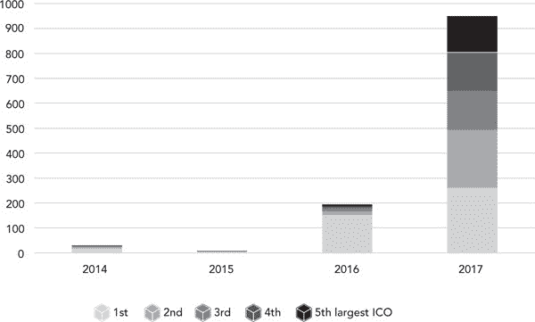
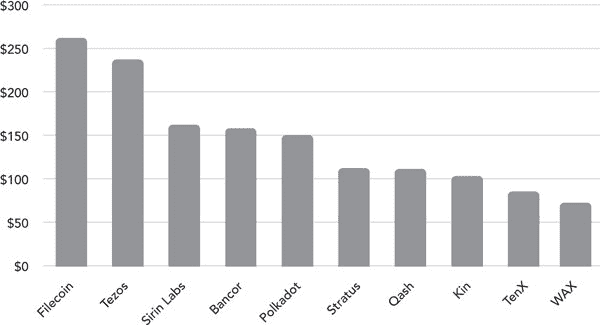

第三章

开放区块链生态系统的融资

在 ICO 中取得合规和创新

范妮·王、普里玛维拉·德菲利皮、亚历克西斯·科隆和克拉拉·索克

开放区块链生态系统的融资简介

大多数 ICO 将不会是真正的生态系统代币，因此非常适合作为证券代币发行，利用注册豁免和通过去中心化替代交易系统进行交易。

开源基于区块链的生态系统可能选择依赖于典型的初创公司和私营企业的筹款做法来进行预生产阶段的资金筹集。一旦他们建立了一些利润中心，他们可能选择使用代币发行来资助后期生产阶段。

代币发行人可能选择设计结合非营利结构和盈利结构的创新公司形式。非营利结构将监督共享的开源资源的访问，而盈利结构将开发特定业务或分散应用。

作为消费者和投资者保护的公共监管者，SEC 的担忧是有根据的。我们需要鼓励创新、最小化投机，并最终实现更具生产力、更具韧性、更具公正分配权力和资源的生态系统的创建的法规。

市场将需要一定水平的代币投机交易来提供流动性。围绕着市场对一定程度投机活动的必要性、监管机构对二级市场的担忧以及生态系统代币的功能要求，仍然存在一些问题需要解决。

治理中的合作至关重要。区块链社区的成员——企业家、技术专家、研究人员、学者、律师等——应保持与监管机构合作的开放态度，共同制定新兴代币经济的监管框架。

### 区块链对筹款的影响简介

区块链技术可能会显著影响我们在网络上的互动和沟通方式。随着 Web 2.0，互联网的第二代，我们见证了社交媒体和用户生成内容的兴起。 Web 2.0 孕育了亚马逊、谷歌、Facebook、Uber 和 Airbnb 等互联网巨头，导致了互联网日益私有化，由少数几家大型垄断运营商控制。

如今，Web 3.0——互联网的第三代——预示着一个更为去中心化的互联网，更类似于一个公共产品。 Web 3.0 最早可追溯至 2006 年，由《纽约时报》的约翰·马科夫（John Markoff）提出的一个术语，它承诺了一个开放和分布式的智能语义网络。对于许多这个领域的老将来说，它将是对互联网作为公共事业和对所有人开放的网络的最初承诺的回归。

在过去三年中，区块链技术已经开始影响传统的筹款实践，如风险投资和众筹。通过加密货币和基于区块链的代币的公开销售，出现了新的筹款机制。这些实践有时被称为 ICO 或代币生成事件（TGE），已经筹集了超过 36 亿美元的资金，超过了区块链生态系统中的风险投资金额。请参阅图 3-1，了解逐年前五大 ICO 的比较。

#### 图 3-1

#### 前五大 ICO 筹集的金额（以百万美元计）

数据来源：CoinDesk ICO 追踪器和《商业内幕》。

尽管这些代币销售为项目或倡议筹集必要资金提供了新的机会，但它们往往在法规灰色地带运作，特别是在证券法规方面。尽管许多基于区块链的代币的发行可能落入证券法的范围内，但许多基层项目或初创企业将难以承担这些法律的监管负担——包括对这些投资工具周围信息的披露要求、信息不对称以及目前零售投资者缺乏问责或补救机制。与此同时，对于位于硅谷等主要金融和技术中心之外的项目和企业来说，传统风险投资的获取仍然困难。

我们首先要区分区块链系统，它们符合生态系统的资格（例如比特币、以太坊），以及符合在生态系统之上运行的 Dapp。我们认为这两种方法需要实施不同的代币模型，并因此需要符合相关法律要求的不同机制。

生态系统代币的发行与应用代币（简称应用代币）的发行存在结构上的差异。生态系统代币代表与其关联的生态系统的基本和必要组成部分，而应用代币可能具有类似于忠诚积分或用于替代现金支付以使用服务的某些功能。这种应用代币的困难之处在于，在许多情况下，它们依赖于薄弱的经济理由，往往仅仅充当伪装，以资助围绕私人利润中心设计的基于区块链的应用程序的开发——实际上，作为其他手段的证券代币。

在本章中，我们认为只有生态系统代币才能成为真正的实用代币。我们概述了各种参与代币销售的项目采用的不同做法，并调查了现有监管机构采取的监管方法。我们特别关注美国证券交易委员会以及其过去一年思维的演变。我们特别关注 Howey 测试对证券的判断的解释，以及其对区块链代币销售作为筹款工具的潜在应用。

在监管不明确的情况下，基于区块链的项目和倡议必须在泥泞的水域中航行。一些项目采取一系列复杂的技术法律解决方案，以使其业务实践和技术设计适应现有法规的意图。这些解决方案试图利用各种司法管辖区的监管豁免，具体要求是——如果满足，则允许证券发行者减少其监管义务。其他人继续认为真正的实用代币应该完全免于证券法的约束，尽管向公众进行此类销售越来越困难。

鉴于此，我们分析和评估了现有解决方案的可行性，这些解决方案旨在遵守这些不同的监管框架。其中最常见的做法包括创建非营利性基金会，充当发行代币的总公司（例如，以太坊引入的瑞士基金会模式）或制定特定的合同安排，例如 Filecoin 引入的 SAFT 模式。然而，大多数这些解决方案需要大量的开销，同时仍承担着重大的监管风险和不确定性，并且通常仅限于证券法下的特定豁免，这些豁免不允许代币发行者充分利用代币销售的全部机会。

我们随后建议一系列创意解决方案或最佳实践，可在遵守现有监管框架的前提下，在美国和欧洲启动成功的代币销售。我们强调了现有营销实践可能会产生过度利润预期的风险。我们还界定了利用智能合约的力量来编码一些技术驱动的故障安全机制（或技术保证）的方法，以减少对代币价格进行投机的机会。这些包括，例如：

1.发行不可转让代币以防止二级市场的产生

2.为代币发行者和投资者使用解锁计划以避免“抬升和倒卖”

3.引入天花板机制，防止代币价格上涨超过特定阈值。

最后，鉴于将生态系统代币用作融资工具存在固有的紧张关系，我们探讨了在预生产阶段使用更传统的融资安排（例如可转换票据）的可能性，例如，通过建立与非营利开源软件基金会相距甚远的营利实体。根据这个模式，ICO 资金不再构成种子轮的替代品，而是用于利用区块链技术和公共资金在比传统的首次公开募股更快的时间表下进行后期轮次的资金杠杆。

#### 私人资助公共利益的固有紧张关系

本节探讨了使用基于区块链的代币作为去中心化网络的潜在融资机制，并分析了私人资助公共产品中固有的紧张关系。 这里我们将私人资金称为来自各种私人来源的资金，而不是来自政府、非政府组织或公共机构，后者是更为中心化的资金来源。 私人资金更为分散； 然而，它目前被困在 Web 2.0 的思维模式中，即各种实体提取和垄断私人网络价值。

股权是用来资助私营企业的经典工具，股份的价值基于对私营企业的收入和利润预期。 因此，股权是资助私营利润中心的适当工具，例如来自 Web 2.0 世界的中心化在线平台，甚至是 Web 3.0 景观中出现的各种 Dapp。

然而，当我们进入新的去中心化的基于区块链的协议或平台的领域，这些协议或平台作为 Web 3.0 的基础层运作时，仅凭股权可能是不足够的资金工具来资助这些新兴生态系统，这些生态系统具有“公共产品”的许多特征。 那么，什么是这些平台的正确资金工具呢？

加密货币众筹（Token Sale）或 ICO 的出现是为了解决私人资助公共产品中固有的紧张关系。 ICO 包括向公众出售基于区块链的代币的做法，并利用筹集到的资金支持基于区块链的平台或 Dapp 的开发——一旦部署，这些平台或 Dapp 将对所有代币持有者公开可用。 从根本上讲，这个想法是，如果我们正在建设一个公共产品，那么我们应该让将从这个好处中受益的公众来资助它。

#### 生态系统代币

该模型特别适用于基本上需要生态系统代币存在的开放平台或生态系统，即本地于去中心化网络或协议的代币，其功能是协调并激励原本相互对立和自私自利的各方，以贡献并发展公共资源。生态系统代币本质上解决了许多共享池资源所特有的“公地悲剧”的问题。¹⁶⁹ 公地悲剧产生于两个条件：

1.参与者个人从共享池资源的使用中受益。

2.过度使用或不足贡献的外部性被社区的所有成员共享。

因此，效用最大化的行为者可能会以可能导致资源过度利用或不足分配的方式行事。¹⁷⁰ 生态系统代币作为资源分配和质押机制，至少可以部分地有助于解决这些问题。¹⁷¹

寻求共享池资源访问权限的人必须在共同体中购买或持有利益才能获得访问权限。因此，生态系统代币通常用于访问网络资源，用作在网络节点之间支付交易费用的手段，或者用作其他内部会计和支付机制。为生态系统做出贡献的参与者也可能通过运行验证节点或以其他方式构建网络基础设施或应用程序而获得生态系统代币的奖励。

基于分布式区块链的协议，在其核心，需要一种经济激励机制，以便验证节点确认链上交易并维护与网络价值相关的网络安全，而不是利用特定区块链的特定应用程序的利润价值。真正的生态系统代币的价值捕获了网络中多个利润中心的价值以及所有可能的未来利润中心的价值，而不一定在任何特定利润中心承担特定的企业风险。

这种经济激励确实需要二级市场交易，以分散其分配并为验证节点提供流动性，使他们能够实现对网络的贡献价值。此外，使用以太币和比特币等加密货币作为激励模型是不足够的。这些加密货币的价格波动完全是外生的，并且独立于网络价值；希望赚取以太币或比特币的节点验证者将简单地挖掘这些区块链。将以太币和比特币作为奖励机制对新协议来说也过于资本密集。

网络利用率，包括构建生态系统和提供满足最终用户需求的服务和产品，增加了对网络访问的需求，进而增加了对生态系统代币的需求。如果其他条件不变，那么这种增加的需求会导致代币价值的增加。因此，生态系统代币将个人激励与公共共同体的激励保持一致。个人必须实际上获取代币才能访问网络并参与（个别和集体地）建设生态系统的价值，例如通过贡献核心网络架构和基础设施，或者通过构建增强生态系统效用价值的 Dapps。

生态系统代币的长期价值基本上需要许多利益相关者使用最初创始人创建的开源工具来构建生态系统，并贡献他们自己的资源、创造力和想象力。这是传统风险投资者未能理解的关键点，也是 Web 2.0 商业模式未能捕捉到的关键点。

让我们考虑以太坊生态系统。以太坊基金会在 2014 年 9 月通过出售其自己的原生加密货币以太（ether）完成了有史以来第一个 ICO，仅筹集了 1800 万美元。在随后的三年中，世界各地的独立项目筹集了超过 36 亿美元，都建立在以太坊网络之上，丰富了生态系统。在传统金融术语中，这被称为杠杆。

#### 去中心化应用（DAPP）代币

Dapp 代币与生态系统代币根本不同。即使 Dapp 代币具有实用功能——它在特定基于区块链的应用程序内协调操作——其经济功能根本受到限制：Dapps 不像真正的网络生态系统那样建立公共的共享基础设施。

长期以来，专注于特定产品或垂直领域的利润中心一直使用股权作为主要的融资机制。Dapps 具有收入和利润模型，Dapp 服务的用户可以使用现有的选项支付，如法定货币、加密货币、稳定币，甚至是 Dapp 构建所基于的网络或生态系统的生态系统代币。在许多情况下，很难证明给予 Dapp 其自己独特的实用性或应用代币，使其与生态系统代币区别开来是合理的。

即使 Dapp 使用访问或会员代币（例如，用于访问内容），也没有经济理由要求这种代币需要二级市场流动性，而生态系统代币作为其经济设计的一部分需要这种流动性。在实践中，Dapp 代币的实用价值通常似乎是强制的，作为规避证券法的机制，在本质上是为了私人利润中心的公开筹款提供资金。

在 ICO 风景中，目前的分析重点放在这些基于区块链的代币的“性质”或“功能”上，特别是一个特定代币是否被归类为实用代币、代币化证券或像比特币那样的加密货币。代币化证券显然会被归类为证券，受到所有适用的法律和法规的约束。然而，在实用代币类别中有一个微妙的区别。虽然实用代币可能跨越生态系统和 Dapp 代币，但这些代币对于去中心化生态系统和基于区块链的网络的运行至关重要，而它们对于 Dapp 的运行并非不可或缺。

由于生态系统代币与应用币之间的根本差异，我们认为法律分析应从那里开始，而不是从一个代币是否具有实用功能开始。将分析进行到其逻辑结论，Dapp 实用代币的原因通常非常薄弱，即使只是为了利用 ICO 炒作的热潮，全球监管机构目前正在对此进行审查。

没有经济或设计理由表明 Dapp 不应或不能通过传统股权进行资助，这使得实用案例更难以证明。正如 SEC 主席杰伊·克莱顿所说，“某些市场专业人士试图突出他们所提议的首次代币发行的实用特性，以主张他们所提议的代币或硬币不是证券。其中许多说法似乎是形式凌驾于实质之上。”¹⁷²

令人担忧的是，由于对许多不负责任和机会主义的 ICO 的监管打击，作为开源生态系统的基本资金机制的令牌的原始理念可能会失去。

在接下来的章节中，我们将审视 ICO 实践的演变，以及 SEC 在 ICO 领域的指导和执法行动。然后，我们提供了一系列关于如何发展符合法规的开放生态系统项目融资的建议和见解，这些建议既能增强此类项目的长期可行性，又能为投资者提供新的价值主张。

实践和监管方法的不断演变的景观

#### 历史分析

#### 比特币和萨托希·中本

区块链系统的第一个实例是比特币，这是一个点对点的电子现金系统，由一个化名实体萨托希·中本于 2008 年详细阐述，其首次交易发生在 2009 年 1 月 3 日。¹⁷³ 设计上，比特币是一个开放的生态系统，在经济意义上，我们可以将其视为一种准公共产品。¹⁷⁴ 与集中式数字平台相反，比特币没有任何私人利润中心，并使用其本地加密货币比特币作为降低未贡献和过度开发风险的手段。

这种自我调节源于用户必须支付比特币的交易费用和挖矿奖励的混合，新比特币发行给那些为维护和保护网络做出贡献的人。¹⁷⁵ 比特币因此具有价值，因为它们是执行交易所必需的。比特币也可以在二级市场或交易所上交易，在那里它们可以用法定货币买卖。

#### 以太坊和维塔利克·布特林

随着比特币开始受到关注，像 Vitalik Buterin 这样的人意识到他们可以利用底层区块链技术进行比简单的金融交易更多类型的应用。Buterin 是一位加密货币研究人员和程序员，曾共同创办比特币杂志，他最初于 2013 年底构想了一个开源、去中心化和基于区块链的计算平台。¹⁷⁶ 而比特币实现了一个非常基本的用于交易的脚本语言，故意不是图灵完备的，Buterin 的野心是创建一个具有图灵完备编程语言的平台，该语言使用户能够执行智能合约，以创建用户生成的 Dapps 及其附带的应用币。¹⁷⁷

他将这个平台命名为以太坊。¹⁷⁸ 这个基于新型区块链的网络的发展是通过 2014 年 7 月至 8 月间的以太币（其本地加密货币）在线众筹获得资助的。¹⁷⁹ 与比特币类似，以太币可以被视为生态系统代币：人们使用代币支付使用以太坊基础设施所需的交易费用（即“燃气”）；用户可以通过向网络贡献资源（即通过挖矿）来获取以太币。与比特币类似，以太坊生态系统没有运营任何盈利中心。然而，它的治理与比特币略有不同，因为 Buterin 在项目中担任积极的领导角色，并且社区可以依靠良好识别的非营利性组织以太坊基金会来开发和维护代码。

过去几年，以太坊已经发展成为领先的区块链生态系统之一，吸引了大批开发者、企业家、初创公司、成熟企业以及各种学术和研究兴趣方，他们都渴望探索并可能利用其平台来构建 Dapps。

#### DAO

这股新一轮创新的旗舰倡议之一是 DAO，这是一个分布式投资基金，于 2016 年 5 月通过代币销售筹集了全部资金。DAO 在短短几周内从约 11,000 名投资者那里筹集了超过 $150 百万，当时创下了有史以来最大的众筹活动记录。

DAO 的一个关键特点是它没有传统的管理结构（即它没有官方的管理机构或董事会）和没有正式的组织形式。DAO 没有法律实体；它只是一个建立在以太坊区块链上的分散式组织。

虽然 DAO 实际上从未开始运作，但分析其代币的功能或效用仍然是相关的。DAO 旨在成为以太坊生态系统中的重要参与者，使代币持有者通过投资各种商业和非商业活动进一步发展生态系统，从而为以太坊网络的效用和价值做出贡献。此外，作为创建分散化组织的尝试，DAO 本身也可以在一定程度上被视为一个开放的生态系统：任何人都可以使用 TheDAO 代币与 DAO 进行互动或贡献。

即使德国公司 Slock.it 开发了 DAO 的代码，但 Slock.it 只是众多其他竞争者之一，他们从 DAO 那里获得了资金。DAO 旨在完全自主，是一个独立的努力，将拥有自己的生命。它将由投资者自行管理，直接与 DAO 开源智能合约代码进行交易。因此，在其推出后，控制 DAO 运营的将是代币持有者，而不是 Slock.it。

然而，与比特币或以太币不同，TheDAO 代币的实用性并不是生态系统的基础。就像一种证券一样，它是一种可转让的代币，赋予每个持有者未来由 DAO 从其投资中获利的份额。此外，代币持有者有权参与 DAO 的治理，而馆长负责将符合条件的项目列入白名单，而一定数量的代币持有者将决定 DAO 资金的分配。¹⁸²

换句话说，就像股东可以通过在年度股东大会上投票来参与公司治理一样，TheDAO 代币持有者可以通过他们的投票直接影响 DAO 的最终分配决策。DAO 是一个投资基金，其投资者并未将项目选择任务委托给投资经理；相反，他们根据他们所投入的总资本份额自行确定投资选择过程，根据自己所投入的总资本份额来确定投资选择过程。¹⁸³ 从某种意义上说，DAO 的运作方式类似于投资证券的开放式基金，其中股东可以根据他们在基金中投入的总资本份额决定基金的投资。

TheDAO 代币确实具有特定的实用性：任何愿意向 DAO 提交项目的人都必须花费 TheDAO 代币。然而，如果 DAO 的原始设计包括这个选项，他们也可以通过花费以太币来实现相同的功能。TheDAO 代币与以太币相比唯一的增量使用价值在于，它使持有者能够在 DAO 的投资提交和选择过程中投票。

#### 图 3-2

#### 2017 年前 10 个 ICO（百万美元）

数据来源：Oscar Williams-Grut，“2017 年最大的 11 个 ICO 筹资项目”，《商业内幕》，2018 年 1 月 1 日。

尽管 DAO 的管理流程与标准公司管理流程有所不同，但 TheDAO 代币赋予其持有人的投票权与标准股东及其代表的私人利益有些相似。看起来 TheDAO 代币并非存在于支持 DAO 生态系统的运营之中，而是为了确保代币持有人能够获得与其个人贡献成比例的投资回报。

DAO 众筹的意外成功激发了大量基于区块链的项目和倡议发起自己的代币销售，其中一些项目超出了创始人的预期。Filecoin（257 百万美元）、Tezos（232 百万美元）、IOTA（434,000 美元）和 EOS（1.85 亿美元）是一些采用 ICO 模式而不是 VC 方案的倡议。¹⁸⁴

#### Munchee

虽然这些项目都致力于创建一个生态系统，但越来越多的私营公司正在尝试这些新的筹款机制，以筹集资金用于开发基于区块链的应用程序或 Dapp，这些应用程序或 Dapp 并不像开放生态系统那样运行，而是作为私人利润中心。

这种后一种趋势的典型例子是 Munchee，这是一家总部位于旧金山的公司，创建了一个供用户评论餐厅并分享他们的美食体验的移动应用程序。为了改善其应用程序，Munchee 在 2017 年第四季度启动了一次代币销售（使用 MUN 代币），目标是筹集 1500 万美元。

MUN 代币使持有者能够在应用程序上购买商品和服务，如广告、食品购买和餐厅忠诚度积分，并根据其会员身份状态获得评论的付款，其级别根据其代币持有量分层。 Munchee 将其代币称为 Munchee 生态系统内的交换方式。¹⁸⁵

然而，事实上，MUN 代币并不是生态系统代币。 Munchee 应用程序作为私人利润中心运作：用户使用 MUN 代币所实现的任何目标，他们都可以轻松地使用以太币、法币，甚至是集中式代币系统来实现。

这四个倡议——比特币、以太坊、DAO 和 Munchee——展示了从纯粹的生态系统代币（例如比特币和以太币）、用于开放生态系统的安全代币（TheDAO）到完全私有代币或应用币（MUN）的可能性范围。

#### SEC 标准的演变

在本节中，我们提供 ICO 代币的法律分析，并审视了 SEC 的方法演变，从其 2017 年 7 月关于 DAO 的初始报告到其最新的新闻稿以及 2017 年 12 月对 Munchee 的执行行动。

#### 对 DAO 的报告

2017 年 7 月 25 日，SEC 发布了一份调查报告，以及一份新闻稿，警告行业，即使用区块链技术不豁免代币发行者或交易所必须遵守旨在保护投资者和市场完整性的现行法律和法规的需求。¹⁸⁶ 具体而言，报告指出，由分散式区块链组织（如 DAO）出售数字资产（或代币）可能很可能符合证券发行的条件，因此受到联邦证券法的注册和披露要求的约束。

尽管该报告旨在就 ICO 实践的法律考虑提供一般性指导，但 SEC 在其法律分析中大部分关注的是 DAO。尽管 SEC 根据具体情况确定特定代币是否符合安全性，但 SEC 主要关注 DAO，以说明证券法在更一般情况下，即“虚拟组织”的区块链代币发行方面的适用。

具体来说，为了确定 DAO 代币是否符合证券标准，美国证券交易委员会（SEC）应用了豪伊测试，这是美国最高法院案件（SEC v W.J. Howey Co.，328 US 293）中使用的测试，用于确定投资合同是否涉及美国证券法。正如豪伊案中的法院确定的那样，投资合同需要（1）投资资金（2）在一个共同的企业中（3）有合理的利润预期（4）来自他人的企业或管理努力。所有要素都必须满足才能找到一种证券，从而涉及证券法和法规。

在 DAO 案中，SEC 发现 Slock.it 团队承担了足够的管理努力，例如编写白皮书、设计协议、编写大部分代码、维护公共论坛和网站，并宣传 Slock.it 团队和 DAO 策展人的专业知识。SEC 指出

DAO 的投资者合理地期望 Slock.it 及其联合创始人以及 DAO 的策展人在 DAO 启动后提供重大的管理努力。…实际上，Slock.it 及其联合创始人积极监督 DAO。他们密切关注 DAO 的情况，并在问题出现时加以解决，提议对所有提案实施暂停，直到解决了 DAO 代码中的漏洞并指定了一名安全专家来监测对 DAO 的潜在攻击。当攻击者利用代码中的漏洞并取走投资者资金时，Slock.it 及其联合创始人介入帮助解决了这一情况。¹⁸⁷

此外，根据 SEC 的说法，DAO 代币持有者的投票权受到限制，因此不足以取代对 Slock.it 管理团队的全面依赖：“即使投资者的努力有助于使企业盈利，这些努力也不一定等同于发起人对企业的重大管理努力或对企业的控制。”¹⁸⁸

公众参与对于增加生态系统代币的长期价值至关重要，这也是为什么许多律师认为美国证券交易委员会在 DAO 报告中对 Howey 测试的分析在最后一个要素上较为薄弱，需要期望主要来自他人管理努力的利润。

建立生态系统并非是一项被动投资，而是需要社区参与。然而，困难在于建立生态系统需要时间，并且需要最初的推动者付出大量努力。因此，项目的最初创始人必须首先为他人建立一些生态系统，以便其他人前来参与。在 DAO 的情况下，包括 Slock.it 团队在内的各种人员为建设该生态系统做出了贡献（从而也增加了与该生态系统相关的代币的价值）。然而，根据美国证券交易委员会的报告，如果可以确定一个团队正在向公众推销潜在的投资，并且公众信任该团队来激励社区参与，那么该团队的努力必然属于 Howey 测试中的“管理努力”范畴。

#### 针对 Munchee 的执法行动

几个月后，即 2017 年 12 月 11 日，美国证券交易委员会主席杰伊·克莱顿在对 Munchee 的 ICO 采取行动时发布了一份关于 ICO 的声明。克莱顿主席试图发出一个平衡的信息。一方面，他表示，美国证券交易委员会认为 ICO 是有效的筹款机制，并鼓励普通投资者对其持开放态度。另一方面，他警告称，大多数 ICO（到目前为止）将明确符合证券的定义，但未遵循必要的注册和披露要求，旨在保护普通投资者。在他的声明中，克莱顿主席指出：

我相信，无论初始币发行（ICO）是否代表证券发行，它们都可以成为创业者和其他人筹集资金的有效方式，包括用于创新项目。……我们美国证券交易委员会致力于促进资本形成。加密货币和 ICO 所基于的技术可能会被证明具有颠覆性、变革性和提高效率的特点。我相信金融科技的发展将有助于促进资本形成，并为机构投资者和普通投资者提供有前景的投资机会。我鼓励普通投资者对这些机会持开放态度，但在这样做时要提出好问题，要求清晰的答案，并运用良好的常识。

然而，正如《Munchee 执法令》和克莱顿主席的声明所指出的，仅仅将代币称为实用代币并不足以逃脱证券法的约束。证券法分析将考虑代币实际是如何营销的，代币的目标对象是谁，以及代币购买者是否有理由预期由项目发起者的努力和声明带来的利润。正如克莱顿主席所解释的那样，

一些市场专业人士试图突出他们提议的 ICO 的实用特性，以主张他们提议的代币或硬币不是证券。这些主张中许多似乎把形式凌驾于实质之上。仅仅将代币称为“实用”代币或设计成提供一些实用性并不能阻止该代币成为证券。在美国法律下，强调基于他人创业或管理努力的潜在利润的特征和营销努力的代币和发行仍然具有证券的特征。

附带的 Munchee 执法命令提供了色彩和细节。尽管 MUN 代币被描述为一个“生态系统”（SEC 在其执法命令中一直用引号标注生态系统一词，表明其对生态系统论点持怀疑态度），但 SEC 似乎并不认为 MUN 代币是一个真正的实用令牌。 MUN 代币显然是为了逃避 SEC 的监管要求而机会主义性地应用于现有应用程序中的资金机制。事实上，Munchee 并不是我们以上所定义的生态系统，因为其目标并非建立一个开放网络，供他人在其上构建应用程序的开源工具。相反，Munchee 纯粹是一个传统的社交媒体类型的食品评论应用程序，现在加入了内部代币作为支付和忠诚度奖励机制。

SEC 指出，MUN 代币没有即时用途，仅向加密货币投机者和投机者推广，并未针对 Munchee 应用程序用户推广，并且 Munchee 团队使用了描述 MUN 价值的语言，作为实用令牌，将因需求和 Munchee 团队努力建立 Munchee 生态系统而增加。

美国证券交易委员会（SEC）提供了一些有价值的指导，说明了如何以符合实用令牌的方式出售代币，尽管该代币并非立即可用：

Munchee 及其代理针对对代币或近年来为 ICO 的早期投资者创造利润的其他数字资产感兴趣的人推销 MUN 代币的营销。此营销未使用 Munchee App 或以其他方式专门针对 Munchee App 的当前用户，以推广购买 MUN 代币可能使他们有资格获得未来评论的更高等级和更大的付款。Munchee 也没有在餐饮行业媒体上宣传 MUN 代币的发行，以吸引餐厅所有者，并宣传 MUN 代币可能使他们在未来进行广告宣传。相反，Munchee 及其代理在专注于对比特币和其他数字资产感兴趣的人的论坛上推广了 MUN 代币的发行，包括在 BitcoinTalk.org 上，这是一个人们讨论投资数字资产的留言板。¹⁹¹

正如 SEC 所暗示的，Munchee 仍然可以将 MUN 代币销售给其现有和未来的客户群，以便未来利用 MUN 代币。但由于这些代币专门向对 ICO 和加密货币的盈利方面感兴趣的加密投资者推广，市场营销活动和销售策略削弱了 Munchee 声称该代币对应用程序本身的功能和内部经济至关重要的论点。相反，采用的销售渠道证明了 Munchee 真正意图将这些代币作为纯粹的投资工具出售。简而言之，MUN 代币是一种打扮成实用代币的证券代币。

虽然 SEC 指出 MUN 代币没有即时的实用性，但仔细阅读执法函件显示，代币的实际实用性对证券法问题的解答并不具有决定性意义。针对未来实用性向合适的受众销售，并避免任何对价值增值的预期的语言可能会通过审核。相反，通过销售渠道和市场营销语言针对投资者利润预期和价值增值推广具有即时可用性的实用性代币将违反豪伊测试并被视为证券发行。SEC 表示：

即使 MUN 代币在发行时具有实际用途，也不会排除代币是证券的可能性。确定一项交易是否涉及证券并不取决于标签——比如将 ICO 表述为涉及“实用性代币”——而是需要对“交易背后的经济实质”进行评估。Forman, 421 US at 849。¹⁹²

美国证券交易委员会（SEC）的执法函件和克莱顿主席的新闻发布会明确指出，与代币的实用性单方面关注不同，市场营销语言和销售策略在证券法分析中是一个重要因素，用以确定那些“经济实质”。克莱顿主席指出：

当这些项目的推动者强调这些代币在二级市场交易中的潜力时，情况尤其令人担忧。潜在的购买者被售卖代币增值的潜力所吸引——他们可以通过在二级市场上转售代币锁定这些增值，或者基于他人的努力以其他方式从代币中获利。这些是证券和证券发行的关键特征。¹⁹³

此外，在 Munchee 执法信中，SEC 指出 Munchee 曾使用描述 MUN 代币预期升值的经济机制的语言。因此，这样的语言在代币购买者中创建了对利润合理预期。它引述了创始人在播客中使用的以下语言：

所以[用户]将会创造更多优质内容来吸引更多餐厅加入平台。因此，我们拥有的餐厅越多，Munchee 拥有的优质内容越多，MUN 代币的价值就会上升——这就像是用户实际上贡献并真正建立社区的潜在激励。

此外，证券交易委员会还指出，Munchee 计划销毁代币以调节代币供应量，从而影响代币价值。

尽管我们不反对 SEC 最终决定终止 MUN 代币销售，我们认为这显然是一次证券发行，但我们对 SEC 选择突出强调作为证明支持证券分类的价值增长语言感到有些困惑。大多数经济交易并不涉及证券法。所有经济交易都涉及对价值的某种评估，无论商品或服务是否定价合理，以及该商品或资产是否会因为当前被低估而升值，与购买者对影响该资产价值因素的看法等等。

让我们来探讨投资房地产，这可能包括购买合作结构中的一家公司的股份。房地产投资通常不涉及证券法律。房地产当然具有实用价值。这是人们生活、工作、娱乐和发展的地方。但许多人也购买房地产希望未来升值。事实上，对于大多数普通人来说，他们的住房是他们的主要金融资产，从中既获得了实用价值（居住在家中），又获得了财务安全（升值）。开发商可以利用房地产销售收益进一步投资开发，从而提升房地产单位的价值。

其他人明确购买房地产作为投资物业或出租收入，其销售过程中明确分析租金定价趋势或历史房屋升值趋势。法律是否应禁止房地产经纪人与潜在购房者讨论他们认为房屋的真实“评估”价值相对于市场价格的情况，从而判断特定房屋是否是一个良好的购买选择，因为这些因素可能会增加其价值，例如积极的人口趋势？

当应用于真实生态系统（而不是 Munchee 的情况）时，SEC 在 Munchee 案例中特别指出的语言是生态系统代币激励公众对公共资源做出贡献的经济机制：个人之所以积极为生态系统做出贡献，是因为他们得到了相应的奖励。

社区参与度和最终用户接受程度越高，则生态系统代币需求越大，其价值也会随之增加，如果其他条件不变的话。仅仅描述这种经济机制，依我们之见，并不需要受到证券法的监管。这与房地产经纪人向潜在买家解释房屋价值受人口统计、国内生产总值、犯罪率、当地学区的质量、新市区的改造等因素的影响并无二致。仅仅描述影响特定经济交易价值的因素不应将生态系统代币本身分类为证券。

另一方面，当项目发起人制作或认可类似“ICO 价格的 MUN 代币获得 199%的收益！现在就注册预售！”或“基本上，如果你早点进入，你很可能会获得回报”或“1000 美元的投资可能创造出 94000 美元的回报。”¹⁹⁵这样的声明时，公众应该得到保护。对于特定资产利润增值的具体声明应该是关注的重点，而不是描述特定资产可能增值的经济理论的一般性陈述。

将所有这样的讨论——不论其性质如何——都视为证券发行的证据，很可能会产生负面的公共政策效果，对有关网络生态系统固有特征的相关讨论产生扼制作用。鉴于代币和代币经济的新兴领域，通过企业家和市场参与者阻碍公共讨论对于分析、挑战和测试这些新理论和模型是有害的。

尽管如此，尽管对 ICO 和代币作为筹款工具的使用保持开放态度，但 SEC 似乎已经缩小了对证券法问题的看法。当 SEC 首次发布其报告，将 TheDAO 代币归类为证券时，许多从业者如前 SEC 律师尼克·摩根认为，SEC 对 Howey 测试的分析在最后一个要素上最为薄弱，要求预期的利润来自他人的管理努力。在这个领域，法律斗争可能会成功。这个要素集中在一个结论上，即 DAO，尽管是一个分散的资金机制，但并不足够独立于 Slock.it 团队的管理努力；因此，DAO 投资者主要是依赖于 Slock.it 履行其利润预期的被动投资者。

随着最新的 SEC 指导意见在 Munchee 执法信中，Howey 测试的最后一个要素——预期利润是否来自他人的创业或管理努力——似乎越来越无关紧要，特别是对于预先生产的项目。这个要素与找到合理的利润预期密切相关。

与 DAO 报告一样，SEC 在 Munchee 案中指出，Munchee 突出了其团队的资质，使人们合理地依赖 Munchee 改变应用程序并培育以 MUN 代币作为忠诚度奖励的美食评论员和餐厅的“生态系统”的承诺。因此，利润预期将取决于 Munchee 创建该“生态系统”的能力以及通过销毁代币来管理代币供应，从而提高其价值。

从最新的指导中概括出来的，清晰的是，实用代币是逃避 SEC 管辖的必要条件，但并不充分。实用代币是否具有即时可用性与未来可用性并不必要也不充分，以解决证券法问题。我们在这里故意使用“可用性”一词来区分“理论上的效用”和“实际功能”。实用代币是通过设计具有功能性的，而其在平台或网络上的即时可用性取决于开发过程进行到何种程度。

正如 SEC 所述，代币的可用性并不能决定证券法问题。相反，代币的营销和销售方式，包括客户渠道，可能足以确定证券法的适用范围，包括代币是否真正是实用代币。例如，营销语言和策略可能会导致购买者对利润有合理的预期，这足以使代币发行在证券法规范的范围内，而不考虑代币的即时可用性。

从倡导的角度来看，我们会向 SEC 或法官（即 SEC 行政立法的司法审查）辩称，代币销售的营销和销售策略是确定代币是否真正是实用代币或伪装成实用代币的证券的重要（甚至可能是决定性的）指标。尽管如此，我们相信仅仅进行营销分析并不是 Howey 测试下的证券法分析的要素或要求。

#### 在生态系统代币和应用币的背景下重新审视 Howey

#### 步骤 1：对代币进行功能分析

鉴于最新的 SEC 指导意见，并尊重“实质高于形式”的格言，我们重申我们的观点，即对代币的证券法分析必须从功能分析开始：

• 项目或应用程序的性质是什么？

• 代币的经济设计和理由是什么？

• 代币的存在和设计是否有令人信服的理由？

• 筹资是代币的主要功能吗？

然而，我们认为，要确定一个代币是否符合证券的资格，我们还必须看看代币所属的平台类型。

• 这个平台是一个开源生态系统或网络，可以围绕它建立许多企业和用例，其中代币代表着一个重要的特征和经济机制，用来协调和发展共享的开源资源吗？

• 或者，它是一个特定的业务应用程序或 Dapp，其中代币充当着内部经济机制（例如忠诚度点数），与平台的内部运作并非内在联系，而仅仅是用来替代传统的会员费、收入或交易费用？

在生态系统代币和 Dapp 代币（或应用币）之间做出区分在于，当评估代币的未来盈利能力时，投资者是否将“他人的努力”视为一个重要的分析标准是有用的。在一个 Dapp 中，投资者没有参与开发和运营的基本经济需求。投资者扮演的是一个相当被动的角色，主要依赖 Dapp 团队的努力来开发、维护和推广系统。

在生态系统中，代币发挥着与基于区块链的平台运作密切相关的功能。因此，这些代币始终具有一定的实用性，因为它们被用来解决与共同资源过度开发或不足利用相关的“公地悲剧”。此外，由于这些代币的价值与生态系统的价值内在联系在一起，随着更多利益相关者参与或贡献于生态系统，它们的价值将会增加。

在这种情况下，代币的升值也取决于“他人的努力”，但这里的“他人”指的是一个更广泛的利益相关者社区，包括投资者，在各种方式上都对进一步推动生态系统作出贡献，如贡献开源代码、推广平台、发展社区，甚至在该生态系统之上创建或开发其他 Dapps。

鉴于此，我们认为根据所评估的代币类型重新确定 Howey 测试的适用性是有用的。当 Howey 测试于 1946 年确立时，它无法预料到开源项目的存在，更别说基于区块链的生态系统了。在将测试应用于全新的环境时，我们应该注意到这一点。特别是，我们认为 Howey 测试的第四项，涉及“他人的努力”，应根据测试是应用于开放生态系统还是应用于 Dapp 的私人利润中心而有所不同。

实际上，一个开放和去中心化的生态系统将始终依赖于“他人的努力”，因为生态系统是通过该生态系统中所有参与者的贡献建立起来的。我们认为，在 Web 3.0 的背景下，Howey 测试的最后一个元素应被解释为对他人的重大或长期依赖——这里的“他人”指的是一个可识别的管理团队或组织机构，如果没有他们，该生态系统将不再能够有效运作。因此，我们可能需要进行“碎片化”或“细分”测试，以确定 Howey 测试的第四个要素是否确实满足：

•是否有一组社区成员参与程度明显比其他人更多，并且产生了大部分的努力？

•将该团队从社区中移除会危及整个项目吗？

如果这两个问题的答案都是肯定的，那么可能存在一个标准的核心“管理”团队，其活动对系统的成功至关重要。然而，如果一个小团队的努力相对于社区的其他部分来说仍然“原子化”，那么情况就不同了。一个特定的团队具有影响力并且对社区至关重要并不应该是决定性的因素；相反，问题应该是项目的生存或成功是否从根本上取决于这个团队在长时间内的运作。

因此，为了筹集生态系统发展资金的代币销售——我们可能称之为生态系统代币发行（ECO）——不一定因为其他人的努力或代币价值可能升值而受到证券法的约束，除非其他原因证明需要应用豪伊测试。

当然，我们并不是说生态系统代币永远不会被视为投资证券。一些行为可能会触发证券警报，比如由一个核心和可识别团队明目张胆地营销代币的投资价值，就像 Slock.it 营销 DAO 一样。

最终，SEC 将不得不依靠“嗅觉测试”：它是否闻起来像是一种证券投资？这是一种“情况的总体”类型的分析。孤立地看，没有一个特定的特征可能会影响到分析结果。最终，只有少数项目可能会被认定为真正的生态系统，如比特币或以太坊，而大多数项目将简单地保持在法律的灰色地带。

#### 第二步：代币销售的营销和时机

正如我们所论证的，真正的实用代币总是按设计为实用代币，无论在底层协议的开发过程中的任何时间点其可用性如何。实用性是落在证券法之外的一个必要但不充分的条件。正如 SEC 已经澄清的那样，证券法问题不仅取决于代币的可用性，还取决于它的营销：

•实体向谁、以何种方式以及何时出售其代币？

•营销用语是否给购买者带来了合理的利润预期？

代币销售的时间相对于项目开发的时间具有关键意义，因为它影响营销和销售策略，以及潜在购买者依赖他人努力赚取利润的程度。声称代币不是证券更容易，当把它卖给潜在的客户或用户群而不是纯粹的投资者群时，因为客户将能够在正在运行的网络上使用代币。

到目前为止，项目仅使用 ICOs 来在预生产阶段筹集资金；这就是为什么这种用途是证监会分析的范围所在。在预生产阶段，生态系统代币和应用代币之间的区别是理论性的：在实践中，无论是生态系统还是 Dapp 项目都很可能是新兴的，拥有小型管理团队控制和编写有限代码库。因此，考虑到在有准备的平台之前向未来客户和用户销售的实际困难，生态系统代币有可能被归类为证券。

对于不熟悉解析技术白皮书的监管者，生态系统和 Dapp 之间几乎没有区别；大部分分析将集中在销售机制上，以及这些承诺是否需要证监会采取行动来保护公众。证监会被授权考虑这个重要的公共政策问题：一个代币购买者在没有证券法提供的保护的情况下具有显著的更高风险，而传统融资中的投资者则有这些保护。

对于这些早期项目，证券交易委员会发现代币购买者在很大程度上依赖于项目推广者的管理工作。证券交易委员会并不认同这样的论点，即代币购买者必须付出努力来增加代币价值（就像 DAO 的情况一样）。在早期项目中，反驳 Howey 测试的第四项（“他人的努力”）的适用性将会很困难，因为总是可以主张购买者主要依赖于项目推广者的努力来启动生态系统并激励社区。

因此，当生态系统项目在通过公开代币销售寻求资金时，仍存在有趣的问题。例如：

•哪些事实和情况会改变购买者是否依赖于他人的管理努力的分析？

•这是否与证券交易委员会相关？

⃘复制代码成为现实可能已经发生了或正在发生？

⃘任何人都可以作为节点验证者或矿工加入吗？

⃘公众是否积极使用、适应和消费开源代码，并在生态系统的基础上构建，而没有任何形式的中心化控制？

⃘投票和治理机制是否足够健壮，能够克服证券交易委员会在其 DAO 报告中指出的批评？

与以前一样，分析将取决于嗅觉测试和公共政策是否支持证券交易委员会采取行动对付发行行为。如果发行的整体气味像 DAO 那样属于证券，那么证券交易委员会可能认为购买者的努力不足以克服对项目推广者管理工作的依赖。

法律虚构和创造性结构：实用解决方案回顾

在本节中，我们回顾和评估了项目部署的各种法律解决方案，以预见各种监管问题，包括瑞士非营利基金会模型、SAFT、可转换票据和证券注册豁免。

#### 基金会模型

瑞士的环境和其监管设施对于建立新的区块链企业具有吸引力。瑞士基金会模式特别适用于管理旨在资助新区块链网络或应用程序开发的首次众筹交易所得款项。2014 年，以太坊是第一个在瑞士楚格州成立其基金会（Stiftung Ethereum）的区块链项目。随后，其他基于区块链的项目纷纷效仿，以太坊基金会奠定了“加密谷”的基石，自诩为“全球领先的区块链和密码技术生态系统”之一。

直到 2017 年中期，楚格是首选的司法管辖区，瑞士基金会（Stiftung）是希望以（理想情况下）合法合规方式筹集资金的组织结构。楚格以其低税收和商业友好的声誉而备受青睐。瑞士的组织结构将筹款框架定位为对基金会的捐款，其使命类似于加利福尼亚州的 Linux 和 Mozilla 基金会，两者均享有免税地位。据我们所知，迄今为止，这些瑞士基金会都没有获得实际的免税地位，这将使捐款在瑞士可享受税收减免。

理念是，如果所筹集的资金被定位为慈善捐款（尽管缺乏法律上的慈善地位）而不是投资，那么它们就不会违反全球的证券法。然而，考虑到豪伊测试的要求和美国监管机构（如 SEC）的远程管辖权，瑞士律师建议额外采取防范措施，阻止美国人和美国 IP 地址参与 ICO。

此外，由于瑞士基金会受到严格监管，其目的如果没有瑞士联邦基金会监管机构（Die Eidgenössische Stiftungsaufsicht [ESA]）的批准是无法更改的——ESA 是瑞士慈善基金会监管机构，有人认为瑞士基金会实际上是一个良好的治理结构，可以监督资金用于开发区块链项目。根据瑞士民法规定，瑞士基金会是“通过为特定目的捐赠资产而设立的”。例如，以太坊基金会的官方目的是：

促进和支持以太坊平台和基础层研究、开发和教育，将去中心化协议和工具带到世界上，赋予开发者生产下一代[Dapps]的能力，并共同构建一个更加全球可访问、更加自由和更加可信赖的互联网。

后来的加密基金会在描述其官方和法律目的时使用了类似的措辞。

然而，随着越来越多的资金通过瑞士基金会流入，瑞士的监管机构和政客加大了审查力度。瑞士基金会最初的功能是更像家庭信托或捐赠基金，而不是全球筹款工具或尖端技术项目。根据我们与瑞士几家律师事务所的讨论，瑞士金融市场监管局（FINMA，相当于美国证券交易委员会，但其职责范围更广，包括商品和银行业务）现在要求所有项目在公开筹款之前收到无异议函。

FINMA 的主要关注点是代币销售构成公共吸收存款，这将要求进行销售的组织具有银行许可证。此外，瑞士法郎超过 500 瑞士法郎的代币销售捐款将需要进行全面的 KYC 视频验证，并受到全面的持续 AML 义务的约束（例如，提交可疑活动报告或 SARs）。

最近，FINMA 发布了具体指导方针，描述了它打算如何将金融市场监管规定应用于 ICO。该指导方针区分了

• 不被视为证券但必须遵守反洗钱法规的支付代币；

• 提供访问特定应用程序或服务的实用代币，只要它们在发行时已经具备功能，就不会被视为证券，前提是它们没有其他具有投资目的的附加功能；

• 代表参与实物资产、公司或其他收入来源的资产代币，根据瑞士法律明确属于证券。

理论上，这在法律上与 SEC 的方法有所不同——实际的效用不一定决定性。然而，在实践中，我们预期这两种方法会趋于一致，因为具有投资特征的实用代币将被 SEC 和 FINMA 视为证券。此外，在这两种制度下，实际上尚未“功能化”的实用代币可能会被视为具有投资目的的证券。关于代币必须具备多少功能性才能划分证券代币和实用代币之间的界线的事实问题尚未解决——也就是说，代币必须具备多少实际效用才能被视为实用代币？

此外，楚格州的州政府也担心，尽管在楚格州技术上已经筹集了数亿瑞士法郎，但楚格州几乎没有看到任何好处，因为这些收入大部分几乎没有受到税收的影响。同时，该地区也几乎没有创造就业机会（尽管这对律师和顾问来说是一个福音），并引入技术专长，发展了一个真正的知识和人才生态系统。大多数这些基金会都有一个基金会理事会，根据法律要求，其中一个理事会成员是瑞士当地的法定居民，通常是专业理事会成员，以满足他们的当地存在要求。这些项目的核心团队仍位于瑞士以外的其他地方。瑞士当局可能也会审查当地存在要求和税收处理方式。

由于监管环境的变化，加密基金会（或任何其他法律结构）在瑞士开立银行账户变得日益困难，因为银行的合规部门可能采取比监管机构更保守的态度。许多银行已经完全停止接受加密客户。

随着其他全球司法辖区争夺业务，2018 年瑞士基金会模式的吸引力尚待观察。许多司法辖区现在正在努力改革自己的监管框架，以适应基于区块链的项目和代币销售。

#### SAFT 模式：未来代币的简单协议

SAFT 模式，由 Filecoin 和 Cooley LLP 推广，是一种投资合同，限制参与者为“合格投资者”，以从 SEC 豁免（简称 Regulation D 或 Reg D）中获益。虽然 SAFT 被视为一种证券，且仅面向合格投资者，但一旦相关平台启动，它将赋予投资者一定数量的代币权利。

SAFT 模型基于这样一个观念：在平台建成之前，通过 ICO 发行的实用代币可能被视为证券，尽管它们有未来的实用性。只有在平台开始运作后，这些实用代币才真正获得了必要的可用性，不再被视为证券。考虑以太坊众售：当以太在 2014 年出售时，以太坊网络甚至还没有建成，这些代币没有任何实用性，因此很可能被视为证券。然而，如今，这些代币肯定已经获得了切实的实用性，因为持有人可以用它们来支付以太坊网络上的交易。

为了降低在平台开始运作之前出售代币的证券法风险，SAFT 模型创建了一个两步流程：

第一步是向能够承担项目潜在失败风险的合格投资者发行投资合同。

第二个是在平台开始运作后向这些早期投资者发放实用代币，然后他们可以在二级市场上将这些代币出售给渴望使用该平台的人。

更准确地说，SAFT 白皮书中指出：

SAFT 是一种投资合同。 SAFT 交易考虑了开发者向合格投资者的初始销售。 SAFT 让投资者立即资助开发者。 作为交换，开发者使用资金开发真正功能网络，并提供真正功能的实用代币，然后一旦功能就绪，将这些代币交付给投资者。 然后，投资者可以将代币转售给公众，可能获得利润，开发者也可以如此。²⁰⁴

SAFT 的创建者承认他们的创造物是一种必须遵守证券法的证券。然而，他们坚持认为这些代币本身是完全功能性的，并且已经准备好供消费者使用；因此，他们应当遵守联邦和州的消费者保护法律。换句话说，监管机构不必认定这些代币为证券：“已经有功能的代币的销售者很可能已经花费了可能满足豪伊测试的‘必要’管理努力。”²⁰⁵

根据美国证券交易委员会最新的指导意见以及我们上面的分析，我们认为 SAFT 模型完全站不住脚。SAFT 模型需要两个条件成立：

•美国证券交易委员会将承认在预售代币和稍后的公开销售或代币发行之间存在法律区别。

•由于其实际可用性，代币确实将被视为非证券实用代币或商品。

我们已经分析过第二个条件是不成立的，根据 Munchee 执法信函。这一点足以使 SAFT 失效，因为 SAFT 需要两个条件都成立才能生效。

鉴于美国证券交易委员会主要强调评估“交易的经济实质”而不是交易形式，美国证券交易委员会很可能会同意 Cardozo 区块链项目的分析，即通过宣布 SAFT 本身为证券（因此，适用于 Reg D 豁免），整个交易（包括此类交易的对象，即实用代币）是带有利润预期的证券交易。Cardozo 报告指出：

人为地将整体投资方案分为多个事件并不会改变的事实，即认可投资者（虽然是通过 SAFT）出于投资目的购买代币，而且可能不会阻止法院在评估这些代币是否为证券时考虑这些现实。²⁰⁶

因此，只要这些代币在签订 SAFT 合同时被作为投资工具推广，它们即使在随后在生态系统或 Dapp 中获得有效用途，仍然是并将保持为一种证券。

此外，从公共政策的角度来看，SEC 对于预售定价结构持谨慎态度，这些结构通常是 SAFT 的情况，因为这些早期投资者有动机将他们的代币立即转售给公众获取回报。这种激励性削弱了 SEC 会认可销售合同与最终发行实用代币之间的法律区别的论点。

即使代币具有即时的可用性，SAFT 合同也会激励以与证券交易和投机一致的方式翻转代币，损害公共买家的利益——无论公众是基于实用性考虑购买这些代币。事实上，如果公众基于实用性考虑购买代币，并受到这些代币的投机交易的负面影响，那么损害将会更加严重，公共政策关注点也将更大。

此外，一旦发行人申请豁免，根据法律规定，它已经宣布该工具为证券。SAFT 模型特别棘手，因为它要求发行人根据 Reg D 的规则 506(b)或 506(c)向 SEC 申报。这项豁免旨在通过提供一般性的注册要求豁免来减轻证券发行的负担——但有一个限制，即 Reg D 下申报的证券只能销售给认证投资者。

如果 SAFT 与通过 SAFT 出售的代币之间的人为分隔未被认定为合法分隔，并且这些代币符合自身作为证券的资格，则通过 SAFT 合同出售的代币将永久被视为豁免证券，附带所有相关限制。换句话说，一旦成为证券，就永远是证券：即使这些代币最终具有可用性，它们仍将受到交易限制。尽管这些代币在特定平台内确实具有实际用途，但只有合格投资者才能交易它们。

因此，真正的实用代币不能是豁免证券，只能在其他合格投资者之间交易，因为只有合格投资者才能使用底层网络。这将违背这些代币的目的。

另一种 SAFT 主题的变体是由区块链初创公司 Colony 推出的未来代币或股权简单协议（SAFTE）。Colony 团队没有依赖于 Cooley LLP 详细阐述的 SAFT，而是起草了一份协议，如果没有 ICO，投资者将获得股权。²⁰⁷ 类似于 SAFT，SAFTE 也基于 Y Combinator 的 SAFE（折扣，无上限），这是一份未来股权的简单协议，“具有协商的折扣率……除以标准优先股的每股价格……应用于将 SAFE 转换为 SAFE 优先股的转换。”²⁰⁸ Colony 的 SAFTE 规定，早期投资者筹集的资金可以在第一次流动性事件时以特定折扣转换为股权，或者在代币生成事件时以相同折扣转换为代币——以先到者为准。

尽管它增加了股权备用选项，但如果 ICO 不发生，SAFTE 在形式和实质上基本上与 SAFT 没有区别：它与关于代币预售的基本证券法问题相同。与 SAFT 一样，发行人通过 Reg D 豁免预售被分类为证券的代币。期望 SEC 接受代币预售的投资合同与一旦它们获得“实用性”后实际代币的销售之间的法律区别需要相同的逻辑飞跃。

将股权作为接受代币的可接受替代方案的投资者可能构成证据，表明投资者将代币视为等同于股权的投资工具，即经典的证券。因此，无论代币是否具有实际效用，代币销售的经济实质实际上是证券发行，而不论。

我们可以想象可转换贷款，其中转换是自愿的，并为投资者提供的不仅是股权或代币转换的选择，还有第三种可能性：在成功的代币发行等资格事件中的赎回和应计利息。²⁰⁹ 然而，这种产品——通过现有金融工具的可转换性获取代币的实体——很可能会涉及与 SAFT 和 SAFTE 相同的监管风险。换句话说，“一旦是证券，永远是证券”的严格解释仍然可能适用。

#### 证券注册豁免

证券法 1933 年第五部分要求任何证券的发行或销售必须向 SEC 注册或符合豁免要求。许多豁免措施可供选择，主要是根据 Reg D Rule 506，在此提供两种不同的豁免：506(b)和 506(c)。这两种豁免都使发行人能够主要从符合以下任一条件的认可投资者那里筹集无限金额的资金：

• 在过去两年中每年收入为$200,000 美元

-   除了个人主要住所的价值外，净资产至少为 100 万美元。

在 506(b)下，发行人不得公开宣传该发行，但可以向最多 35 名非认证投资者出售，并在合理相信的情况下，可以依赖投资者的自我认证。在 506(c)下，发行人可以公开宣传，但仅限于认证投资者，且证明认证地位的责任落在发行人身上。

特别是 SAFT 模型鼓励在 506(c)豁免下进行申报，因为这将使得众筹对认证投资者开放。选择使用 Reg D 豁免的传统融资通常选择 506(b)。Rule 506(c)是根据《就业机会法案》最近添加的规定，以应对众筹平台的兴起，通过互联网、社交媒体和广告向投资者进行广告招揽。直到现在，506(c)的接受程度仍然很低，主要是因为在认证地位验证的法律不确定性，例如对财务报表的审查和验证，尽管第三方服务已经出现来验证地位。

根据 Reg D 发行的证券是受限制的证券：证券发行的默认规则是它们必须注册。Reg D 的豁免权仅适用于发行人，而不适用于转售商。转售商通常被视为承销商，需要许可。《144 号规则，出售受限制和控制证券》提供了在公开市场上转售受限制证券的安全港豁免，而无需成为承销商。

根据 144 条规定，非报告公司需要持有 ICO 典型的 Reg D 限制性证券至少一年。私营公司的某些信息应当公开，包括其业务性质、官员和董事的身份以及其财务报表。确保遵守 144 条规定或寻求其他转售豁免的主要义务落在限制性证券的转售人身上；然而，SEC 期望发行人建立足够的内部控制措施，以防止其官员、董事和员工违反联邦证券法。

此外，根据 1934 年证券交易法案，任何拥有超过 500 名非认证股东或总股东超过 2,000 人的公司将被视为完整的“报告公司”，从而成为具有所有相关披露和报告义务的公众公司。

《证券交易法案》下的报告公司义务还限制了根据《证券法》第 A+条“《证券法》下的小额和其他发行豁免修正案”进行众筹销售的吸引力，该修正案使发行人能够向公众征集资金，而不受认证投资者的限制。此外，Reg A+还要求提交由 SEC 批准的披露文件和财务报表。据我们所知，迄今为止，尚未有 ICO 是根据 Reg A+发布的。

我们认为，由于大多数 ICO 都是为 Dapps 服务，未来的趋势将是使用各种豁免条款将 ICO 发布为证券代币，尤其是根据 506(c)规则，该规则允许公开征集，但仅限于认证投资者。与 Reg A+类似，506(c)规则在被视为完整的报告公司之前，也需要满足 2,000 股东的门槛。

然而，在理论上，Rule 506(c)提供的筹资金额会比 Reg A+更多，因为没有对筹资规模的限制（Reg A+ Tier II 最高为 5000 万美元，Reg A+ Tier I 最高为 2500 万美元）和没有投资限制。（在 Reg A+ Tier I 下，没有投资限制。在 Reg A+ Tier II 下，投资者可以投资他们净资产或净收入中的 10%，以较高者为准，这可能是自行报告的。）

这些安全代币将需要专门的交易系统，包括受监管的交易所和另类交易系统（ATSs），这些系统是非交易所交易场所，用于匹配买卖订单。SEC 依据 Regulation ATS 将 ATS 作为经纪商而不是交易所进行监管，与交易所相比，监管要求较少。我们预测市场将采用基于区块链的分散式另类交易平台，实现安全代币的点对点交易，并将交易记录到分布式账本上。

安全代币和 ATSs 可以利用智能合约来编码对 Rule 144 和其他转售豁免（例如，自动一年锁定期）的自动执行。欧洲法规下 ATS 的等效术语是多边交易设施（MTF）。

#### 创造性解决方案前进

所有代币发行者，尤其是在发展早期阶段，都需要非常谨慎地考虑他们的销售、营销和代币设计方法。那些推出 Dapps 的人，尤其需要确定如何构建他们的代币销售以筹集资金，而不会触犯证券法。

我们在这里提出了一系列可能降低代币被视为证券的解决方案。虽然代币发行者无法控制代币购买者的动机，但他们可以在技术、合同或实际方面采取一系列措施，以阻止购买者从事纯粹的投机活动。

#### 仅销售给战略合作伙伴或潜在平台用户

代币的营销是 SEC 对代币是否符合证券的评估的决定性因素。因此，发行人向代币推销的受众在法律分析中可能具有重要的影响。将代币销售给那些希望在生态系统中使用它们的人，或者将其营销为投资工具给那些希望从其升值中获利的人，最终可能影响这些代币的法律资格。

根据 SEC 在 Munchee 案中的推理，发行人可以提出在平台推出之前合法出售实用代币的理由，前提是销售对象是其用户和客户。面向这些利益相关者和未来客户的营销语言应描述平台的实用性，而不是代币的价值增值。

对于在预生产阶段启动的 ICO，代币发行人可以与平台的关键利益相关者或未来用户建立合作伙伴关系，以代币交换试点资金。结果将是一种以服务合同形式的融资模型，不会违反证券法，但会开展市场导向的试点，证明项目的可行性。

与此同时，如果一个平台将实用代币用作内部协调机制，那么我们可以主张这些代币甚至不应该对最终用户可见。对于零售用户，我们可以主张这些代币应该完全不可见，就像卡支付网络对卡用户不可见一样。

良好的用户体验设计将使最终用户使用法定货币购买服务，然后平台将在幕后将法定货币转换为原生代币——也就是说，最终用户无需知道或理解后端存在实用代币。这就是为什么许多 Dapp 代币销售似乎很勉强的原因；代币似乎只是为了增加用户体验的复杂性，而除了筹集资金之外并没有增加功能。

除了法律考虑之外，从商业和生态系统发展的角度来看，机构或批量向机构和战略合作伙伴以及平台的大型和重复用户销售代币将比零售基础上的代币销售更有意义。对 Dapp 开发人员进行机构或批量销售生态系统代币也是有意义的。

#### 阻止建立二级市场

为了避免代币被视为证券，代币发行者不应承诺采取任何与为这些代币建立二级市场或支持、促进其建立相关的努力。正如证券交易委员会主席克莱顿所述，建立二级市场构成了“证券和证券发行的特征之一”。²¹⁵

当然，即使代币发行者实际上不参与为其代币创建二级市场，也可能会有其他人参与。为了避免投资者仅仅为了投机而购买代币的风险，代币发行者可以通过技术手段介入，例如阻止通过 ICO 发行的代币的可转让性。如果一个代币不可转让，那么很少有人会出于获利的预期而购买它，从而不符合豪伊测试，并且该代币在欧盟法律下将不被视为“可转让证券”。²¹⁶

平台的现有或未来用户将仅仅因为其实用价值而购买代币，而不是因为他们可能通过之后再次转售而获利。不可转让的代币还将减少银行和货币转移法律方面的监管关注，包括财政部下属的美国财政部金融犯罪执行网络（FinCEN）规定的持续的反洗钱/了解您的客户（AML/KYC）义务。²¹⁷

然而，这种方法在实践中不太可能受到普遍欢迎并真正应用，尤其是在真实的生态系统代币的背景下，比如许多基于区块链的网络的原生加密货币。正如我们所讨论的，如果没有通过二级市场的流动性，吸引节点验证者加入新网络将是困难的，因为代币是为了补偿他们在维护网络基础设施方面所花费的时间和资源。

一个较小的替代方案是限制一段时间内代币的可转让性（例如一年），这将是根据规则 144 安全港规定转售受限制的 Reg D 证券所必需的。虽然这样的时间限制不一定会使这些代币失去证券的资格，但它仍然可能减少这些代币交易中固有的投机动态，并使代币持有者的利益与项目或生态系统的利益保持一致。

#### 限制代币价格或使用代币绑定机制

即使发行者决定不阻止通过 ICO 发行的代币的可转让性，他们仍然可以通过引入代币价格上限来避免过度投机。实际上，如果存在二级市场，那么代币的价格可能会上涨到使得访问或使用平台变得极其昂贵的程度。根据代币价值的实际或潜在增值，人们可能会决定囤积它们或以更高的价格转售它们，而不是在平台上花费它们。这是一个自我破坏的模式：对实用代币价值的投机实际上降低了其关联平台的可用性。

实用代币设计的一个关键元素是其价格稳定性，因为服务和商品的价格应该是稳定的，不像带有利润或投机性质的工具。为了抵消投机动态，代币发行者可以建立一个持续的 ICO，以便在任何时间点，人们都可以通过 ICO 智能合约以特定价格（上限）购买代币。

每当代币的市场价格超过上限时，人们将停止在市场上购买代币，而是直接从 ICO 智能合约以上限价格购买。随着人们通过 ICO 智能合约购买代币并增加市场供应，市场价格将下降。只有当市场价格低于上限时，人们才会再次在市场上购买这些代币。

以太坊研究员 Vlad Zamfir 讨论了实施价格下限和价格上限的代币约束机制，其中——与比特币固定供应的经济相反——代币供应可能波动以保持在价格边界内。正如 Zamfir 所指出的，“恒定的上限消除了代币购买者可能拥有的任何合理的收益预期。任何足够低的上限都可以防止‘炒作和倒手’进行炒作。”²¹⁸

代币设计者可以定制价格控制机制以达到预期目标。例如，永久性的上限机制可以每年根据通胀或其他相关指标进行调整。在加密货币世界中，诸如以太坊智能合约运行的燃气成本等指标可能更适合用于锚定固定机制，而不是一些宽泛的经济通胀定义。

定期调整上限的永久性强制执行理论上应该是容易的，因为它要求在有需求时以上限价格自动发行新代币。然而，在某些情况下保证一个底价可能是不可能的。正如 Zamfir 所指出的，“销售管理员不能提高底价，如果这样做会使它无法以底价购买所有代币。”²¹⁹

即使 ICO 收益的一大部分被存入 ICO 智能合约中，以便人们可以以底价兑换代币，这个储备也会有限的容量；一旦被使用，生态系统将缺乏发展资金，并且代币价格将在二级市场上暴跌。这里的重点不是支持底价，而是确保价格稳定：代币价值的投机性增长脱离了实用需求，减少了真实项目使用协议进行其预期目的的动机。

通过下调预期收益的分布（因为价格上限可能是完全保证的，但并不总是有底价），这样的控制机制应该向代币买家发送一个关于其真实意图的积极信号：他们会投资，因为他们真正支持这些平台的发展，并且相信这些平台是构建整个代币经济的“基础设施”投资的必要条件（例如，Dapps 和安全代币）。

随着代币市场的成熟，生态系统代币将成为投资者在代币组合中持有的锚定代币，以分散风险，就像他们使用法定货币或与之密切相关的工具（如政府债券）来减少传统投资组合中的贝塔风险一样。

到目前为止，代币绑定设计在法律上尚未经过测试。在 SEC 的观点中，引入一个可能将代币价格维持在某个水平以上的底价，是否会产生利润预期？引入一个价格上限是否足以消除任何利润预期？

在 Munchee 案例中，SEC 认为团队承诺销毁代币是增加代币价值与利润预期分析相关的一种方式。SEC 在 Munchee 白皮书的“代币销毁计划”部分发现了相关语言：

Munchee 可能选择在餐厅向 Munchee 付费作为广告费时每次销毁（从流通中拿出）一小部分 MUN 代币。这… 可能会增加剩余 MUN 代币的升值，因为流通中的总供应量减少。²²⁰

如果 Munchee 将代币销毁框架为下行风险缓解而不是价值增值，以稳定应用内代币价格为目的，而不纯粹作为支持价格的机制（与股票回购没有区别），SEC 的分析会有所不同吗？

为了限制合理的利润预期，我们可以想象带有各种价格上限机制的代币设计。然而，就像这个不断发展的领域中的所有事情一样，分析将归结于事实和情况。SEC 可能会考虑诸如：

•价格上限有多严格，其驱动因素是什么？

•这些机制是真正用于价格稳定还是价格增值？

•平台中的代币价格稳定将提供什么样的增强功能？

最终，证券交易委员会（SEC）可能会对代币交易的经济进行全面评估——嗅觉测试——以逐案确定一个代币是否符合证券标准。

对于真正的生态系统代币来说，价格稳定功能的必要性以及 SEC 对这一主题的立场不明确，突显了这个固有的本体论问题：真正的生态系统代币并不完全是传统的证券，但它们的功能类似于货币。实际上，法定货币在经济生态系统内移动资源并促进交易，这与 Web 3.0 网络生态系统类似，有多个利润中心共享共同基础设施。

#### 将筹款与代币生态治理分离

我们回到了我们最初的主题，即使用生态系统代币——用于协调共同资源——作为私人筹款手段存在固有的紧张关系。虽然对于真正的生态系统代币，向核心生态系统利益相关者出售以维护和开发共同资源是有益的，在早期筹款阶段，区分网络生态系统的发展和在该生态系统上运行的 Dapp 的部署可能是困难的。换句话说，资助在公共轨道上运营的盈利企业和资助底层公共轨道之间的区别通常是理论上的和不明确的。

作为一个实际问题，这些生态系统项目可能需要一个独立的、与政府保持距离的私营企业来进行筹款，向投资者提供传统的债务或股权融资工具。这种模式类似于开源生态系统中普遍存在的情况，其中包括各种非营利软件基金会（例如，Linux 基金会），以及商业化特定与开源软件相关的产品或服务的盈利公司（例如，分发和商业化利用 Linux 内核的操作系统的 Red Hat 公司）。

对于生态系统项目，私营企业的资金可以用于最初建立生态系统基础设施，以换取来自非营利组织的代币，后者将是开源生态系统的管理者。在这种情况下，代币的交换将是一项简单的服务协议（例如，代币作为开源 IP 开发的补偿），不会违反任何证券法规定。私营企业可以专注于生态系统的特定垂直领域或商业应用，或者成为生态系统中其他 Dapp 的营利孵化器，从而启动生态系统的发展。营利性私营企业很可能是一家社会企业，选择成为一家受益公司和/或获得 B Corp 认证。

从务实的角度来看，私营企业可以获得各种投资者的广泛接触，包括加密投资者，但也包括更传统的专业投资者，他们的资金没有法律授权接受代币而不是股权。然而，这些传统投资者将通过私营企业的资产负债表间接获得代币的曝光。实际上，生态系统代币的价值代表了私营企业对开源 IP 的贡献价值。与传统专有 IP 不同，后者通常是初创公司的核心资产，存放在资产负债表上的生态系统代币在理论上将以更大的流动性和可交易性标记到市场，如果二级市场出现的话。

最终，这种新的创造性融资工具可能会出现

•典型的种子阶段融资前估值的可转换票据，可以用代币而不是股权抵销

•可能转换为代币的股权

•可在 ICO 时兑换现金的优先权益

通过智能合约、动态账本和去中心化交易平台和交易所，管理可能更加复杂但也更加动态的资本结构将变得更容易，这些结构结合了债务、股权和代币。

结论

ICO 正在改变筹资格局，但与大多数人今天所认为的不同层次上。尽管目前绝大多数 ICO 都是在项目尚未启动阶段完成的（即在种子阶段），但我们认为，如果一个代币在其相关的基于区块链的平台或去中心化应用构建之前就出售，很难避免符合证券法和监管规定。

生态系统代币构成了其基于区块链的系统的固有组成部分，因此可能更有可能被视为实用代币。然而，当前 SEC 关于 Howey 测试的指导似乎证实了这样一个想法，即销售具有实际或潜在实用性的代币并不构成其不作为证券的充分条件。我们还必须考虑代币如何向公众推广以及人们购买它们的原因。

因此，除非发行人希望引入特定的技术保证，以减少或消除其代币升值的投机机会（例如，通过使代币不可转让或创建低限价格上限代币），否则他们需要制定新方法，以确保出售的代币不被视为证券。虽然 SAFT（和相关的 SAFTE）是实现这一目标的有趣提议，但 SEC 在 Munchee 案后可能不会接受其逻辑。

生态系统代币作为协调机制和类似证券的筹款工具之间存在固有的冲突。采取务实的方法，基于开源区块链的生态系统最初将不得不通过依赖私营企业和初创企业典型的筹款实践来建立一些利润中心。因此，这些生态系统可能会像传统的 Web 2.0 模型一样发展。

去中心化是一个演进过程，实际上始于更为中心化，但在正确的治理和发展下，随着时间的推移逐渐演变为真正的去中心化生态系统。

我们相信，ICO，尤其是对于真正的生态系统代币，将不得不远离前期阶段（种子轮），而是在后期阶段的融资轮进行，当网络或产品具有最低可行性，并且有一批准备好的用户和客户时（A 轮、B 轮、C 轮等）。只有在平台部署并围绕其形成生态系统之后，效用才会显现出来，这些代币中固有的价值才会为所有人所认识到。然后，发行者最终将能够将代币作为真正的商品或商品出售，而不是作为投资工具。

要做到这一点，代币发行者可能需要设计创新的公司形式，将非营利结构（监督共享开源资源的访问）与营利结构（可能作为受益公司或 B Corps）结合起来，专注于开发特定的业务应用程序或 Dapps。大多数 ICO 并不是真正的生态系统代币，因此非常适合作为利用注册豁免进行证券代币发行，并通过去中心化的替代交易系统进行交易。

为了走向未来，我们希望区块链社区——包括企业家、技术专家、研究人员、学者、律师和其他人——能够与证监会等监管机构合作，制定出一套适应新兴代币经济的监管框架，包括像 ICO 这样的筹资活动和持续的市场监管。事实上，关于如何思考和讨论代币“经济学”（即，应该驱动实用价值的因素以及代币价格限制是否能够缓解证监会的一些担忧），仍然存在着重大问题。

此外，即使对于真正的生态系统代币，市场也需要一定程度的代币投机交易来提供流动性。市场上对于一些投机活动的必要性如何与对二级市场的监管担忧相协调，同时尊重生态系统代币的功能需求？当我们试图通过区块链技术创造更为去中心化的经济模型时，我们应该如何重新思考依赖于“他人努力”的含义，从豪伊测试的角度来看？

作为消费者和投资者保护的公共监察员，证监会的担忧是有充分理由的。我们希望制定的规定能够鼓励创新，最小化投机行为，并最终使区块链技术能够实现 Web 3.0 的承诺——创造更具生产力、更具韧性、更公正分配权力和资源的生态系统。
