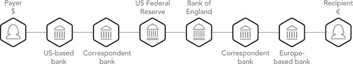
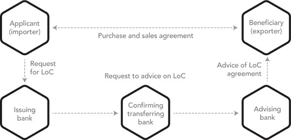
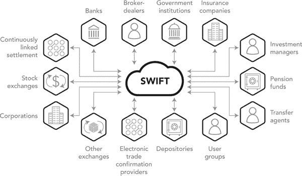
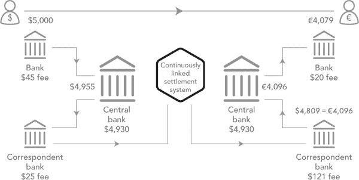
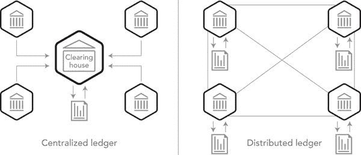

第四章

重塑国际结算与交收

分布式账本技术如何改变我们的全球支付系统

鲍勃·塔普斯科特

全球支付系统简介

•全球支付系统是世界商业的命脉。在互联网时代，国际资金转移（企业和消费者）的缓慢速度、高昂成本和不透明度令人沮丧。资金似乎在机构之间悬而未决。在一个同时在法国和英国拥有大型业务的银行内清算一张支票可能需要六到八个星期！²²¹

•资金转移通常是基于通过全球银行间金融电信协会（SWIFT）网络发送的消息。大多数银行不会对国际资金转移请求做出响应，除非该请求通过高度安全和可信任的 SWIFT 网络到达。尽管用于资金流动的 SWIFT 消息几乎是瞬时的，但银行内部的传统流程并不是。

•新兴的区块链技术可能会减少甚至取代 SWIFT 及其支持的系统。分布式账本技术（DLT）提供了三种加快资金转移并降低成本的可能性：

•DLT 消除了复杂系统之间的层层复杂交互来管理风险的需要，同时为其服务增加费用。

•分布式账本技术（DLT）使得资金在国家之间的转移几乎没有任何显著延迟。

•在 DLT 中，信任来自数学，而不是来自容易出错的人类及其系统。

•随着国际贸易的爆炸性增长，要求建立一个成本更低、中间环节更少的系统。智能手机应用将成为无银行账户人士的普遍支付机制。有无区块链的近银行和非银行支付系统都在蓬勃发展。

•这是一个改变游戏规则的举措。消费者和公司将准确知道他们的资金何时到账，无需猜测最终的货币兑换金额。没有收取高费用的中介的贫困人口支付系统将通过消除阻碍更大经济目的的摩擦和低效来刺激更大的商业活动。

•在技术上实施彻底新系统有两种方法：（1）革命性（大爆炸）和（2）渐进式（无形的低语）。几乎总是，即使计划得再好，快速实施的大规模变革都会产生负面和意想不到的后果。因此，每天转移的数万亿国际支付转向 DLT 技术必须是渐进的。

全球支付简介

#### 全球支付系统工作原理

在两个国家的银行之间进行的简单外汇（FX）交易可能涉及许多参与者。交易员（或其计算机）同意交易金额、汇率和未来结算日期，对于简单的即期合同，结算日期通常是明天或后天。

对于简单情况，涉及的金融机构需要确保在交易结算日期时，所涉及货币的中央银行拥有并可用的资金。在那个结算日期，当两个央行清算系统同时运行时，一个称为 CLS 的央行间清算系统，原本是指连续联机结算的首字母缩写，协调资金的近乎同时的双向转移。

如果涉及的银行在 CLS 没有账户，那么它们通常必须通过有账户的银行进行操作。对于系统外的人来说，这是关于资金的流动。对于系统内部的人来说，这是借方和贷方的流动，通过许多双录入会计系统进行历史审计，作为受保护和受信任的记录。事实上，这只是受信任和受监管的位元的流动。是的，它只是位元。

交易对手必须信任（并接受风险）两端的银行、各自国家的货币清算系统、对应银行以及 CLS 的协调。随着 DLT 的可能引入，许多人将信任已被证明可以保护代币流动及其消息的数学，而不是相信维护其系统的许多机构（及其成本）。为什么这些代币不能是美元或欧元？答案是它们可以是，并且我们将争辩，很快将会是。

#### 为什么系统有时不起作用

尽管我们付出了巨大的努力（和系统）来确保交易的双方同时发生，但我们的假设有时会让我们失望。考虑加拿大历史上最大的石油交易。随着在卡尔加里的谈判接近尾声，媒体宣布该交易已经签署。基于此，东海岸的银行家们将数十亿美元从美国银行转账至花旗银行加拿大分行的账户。然后东海岸的银行家们回家了。

然而，这笔交易没有签署。当仍在美国银行工作的少数人意识到他们已经转移了数十亿美元而没有相应的资产（已执行的销售合同）时，他们不得不说服花旗银行加拿大分行将数十亿美元转回或通知美联储他们在技术上已经破产。那是一个漫长的夜晚。

如果他们使用基于区块链的智能合约，合同条款和大规模资金转移的执行在数学上不可分割，就不会有风险。再说了，当我们可以把资金的流动交给无可争辩的数学时，谁还需要风险管理呢？今天的复杂问题有简单的解决方案。最初的区块链创建了一份不可变且在数学上可证明的活动日志。它结合了公钥和私钥加密来验证身份，并采用共识算法来验证交易并防止重复或欺诈性支出，全部在点对点网络中。没有集中控制的要求。这些特性各自并不具革命性，所有这些技术在 20 世纪都已经存在。它们的简单结合可能确实具有革新性。

### 支付系统的历史

在同一家银行的账户之间转移资金很容易。银行只需记账到一个账户并从另一个账户扣款。消费者通过月度账户费用支付这些转账费用。在同一国家的不同银行之间转移资金则不那么直接。资金通过该国的中央银行（例如美联储（Fed）、英格兰银行（BoE）、加拿大银行（BoC）或欧洲央行（ECB））进行重定向。银行自动化加速了支票清算，但银行仍然获得了大部分好处。新系统可以完全消除纸张。通过减少纸张的使用，增加比特的使用，清算系统成功处理了支付量的急剧增长。

几十年前，大多数国家允许银行在金融机构之间的支票交换中保持并为自己的利润使用客户资金多天，直到资金可供付款人使用为止。随着时间的推移，各国的规则逐渐加强。例如，美国于 2011 年颁布的《多德-弗兰克法案》要求银行在存款后的第二天提供头 200 美元，并在适用情况下支付利息。²²²在菲律宾，2017 年成为资金次日可用的法律。²²³

25 年前的加拿大，主要的清算银行会运行自己的支票分拣机，根据不同的银行来源对存入的支票进行分拣。一旦一家银行完成了这个排序并确定了其他银行欠它的款项，它就会从加拿大央行的其他银行账户中扣除这些银行的款项。第二天早上，它会将支票退还给发行银行以核实金额和已经扣除的账户。

系统风险显而易见；一家陷入困境的银行可以在深夜从加拿大央行的其他银行账户中取走数十亿，实际上使它们陷入困境，而没有证据证明它们的提款是有根据的。通常情况下，如果一家银行在中央银行没有可用资金，政府将充当“最后的贷款人”。政府会采取非常措施（包括准备金要求）来防止这种情况发生，但确实会发生。

在过去的 20 年里，大多数先进的资本主义国家都实施了需要多次结算的 RTGS（实时毛额结算）系统。这降低了每笔结算的规模，以避免系统性失败。涉及的金额巨大。在加拿大，由央行运行的较大价值转账系统（LVTS）每天结算约 1400 亿美元。²²⁴ 由 Payments Canada 运行的零售（较小价值）系统每天清算约 240 亿美元。²²⁵ 2017 年，CHAPS（英国的 RTGS 系统）每天清算约 5000 亿英镑。²²⁶ 鉴于涉及的资金规模巨大，没有中央银行愿意在新系统被证明无缺陷之前实施新系统。

在 2016 年，加拿大通过一个名为 Interac 的银行联合体推出了一个 P2P 支付系统，帐户可以绑定到手机号码或电子邮件地址。通过 Interac，消费者可以互相进行几乎实时的支付，而无需知道彼此的帐户号码。接受手机短信的存款会将资金释放到收款人的帐户中。尽管对消费者来说，支付是实时的，但实际上，资金会在当天稍后通过中央清算系统在银行之间转移。

美国的 Venmo 提供类似的服务，但没有直接访问清算系统，支付发起和资金实际到账之间可能需要几天时间。²²⁷ 信用卡用户需支付 3% 的手续费，但除此之外是免费的。

在 2017 年夏季，美国五大最大的银行推出了一个名为 Zelle 的全国消费者支付网络。²²⁸ 预期是在接下来的一年中，还会有二十多家较小的银行和信用合作社加入。与加拿大的 Interac 类似，美国的 Zelle 将为消费者之间提供几乎实时的 P2P 支付。为了加快其采用速度，Zelle 目前是一个免费服务，尽管其访问的帐户通常会收取费用。

今天，在一个国家签发的国际支票并在另一个国家兑现，可能要经过至少两家中央银行、一个中央银行交易协调中介（如 CLS）和可能的其他中介的账户（见图 4-1）。为什么会出现这种复杂性？

#### 图 4-1

#### 当前跨境银行间支付

即使在今天，国际支付也会从发送方经由中间人传递到接收方。

#### 东印度贸易公司和罗纳德·科斯

当我们在市场上买一个苹果时，我们可以看到苹果，卖家也可以看到我们的现金。如果一方欺骗，很容易挑战另一方。当我们相隔万里时，这种方法是不可能的。如何建立远程信任？非常困难。另一方可能受到我们不知道的法律约束，反之亦然。显然，对于出口商来说，没有见到钱就生产和发货是不明智的。对于进口商来说，没有见到货物就付款同样是不明智的。一个难题。

经济学家罗纳德·科斯（Ronald Coase）在 1932 年在邓迪的一次讲座中阐述了他对企业存在原因的看法，当时他只有 21 岁。他认为企业的产生和存在是因为去市场获取资源的成本比内部雇佣这些资源更高。更具体地说，企业的存在是为了降低交易成本。资源的搜索、协调、合同签订和建立信任在企业内部更容易。他进一步认为，随着企业规模的扩大，这些交易成本往往会增加。几十年来，他的洞察力被忽视和忽略，但最终他于 1991 年获得了诺贝尔奖。

与他的论点一致，历史上第一个大规模应对跨洋信任问题的方法简单地是信任自己。出现了可以从印度或中国购买产品，并将其运送到伦敦或鹿特丹自己仓库的全球公司。其中一个例子就是荷兰东印度贸易公司。它是世界历史上最大的公司。按照今天的标准，它大约是苹果公司的十倍大小。²²⁹

它的英国等价物也是庞大的。最初，它的主要产品是从印度运送茶叶到英国。最终，从阿富汗到中国运送鸦片更为有利可图。为了确保其“信任”的版本不被违反，印度总督组建了比英国还大两倍的军队。并不是英国政府在 18 世纪末夺取了印度，而是一个不受监管、由一个失控的总督和私掠船长（罗伯特·克莱夫）运营的公司。今天，他被认为是一个反社会者。²³⁰

仅有 35 名员工的英国总部，曾经是英国东印度公司高效运营的典范。直到克莱夫作为一个流氓特工，未经总部同意，组建并部署了一支 26 万人的军队。而军队并不在公司的业务计划之中。

正如罗纳德·科斯所解释的，当这种庞大的开销（用于执行公司信任版本的军队）的交易成本变得太高时，公司变得不可持续。当英国政府最终控制了这支私人军队时，一些人认为这标志着英国帝国的诞生。²³¹

#### 商业银行的崛起，信用证和相关痛苦

下一个应对信任难题的答案是商业银行。它专门从事管理和减轻买卖双方之间没有历史信任关系的国际信任问题，并从中获利。他们用来做到这一点的主要金融工具称为信用证（LoC）。这是一套复杂的文件，涉及四个或者通常更多的各方，每个各方都信任其中的另一个各方，实际上，这些各方会形成信任链的交易。

如果我们不信任货物的制造者，那么我们认识的人可能认识另一个他们信任的人，他们又认识另一个信任另一方的人，以此类推，直到有人信任卖方。这听起来完全不可行，但几个世纪以来，这些信用证（LoC）（在很大程度上仍然是）国际商务的金融基础。例如，一家银行会在货物制造完成并可供装运时支付货款（并承担风险）。当货物抵达并在出口码头进行检查时，另一家银行（随后承担运输风险）会支付给这家银行。当货物抵达进口商的码头时，另一家银行（随后支付并承担运输风险的下一个阶段）会支付给这家银行。当货物按照订单到达采购方的交货码头并进行检查时，另一家银行，即最终买方的银行，会支付给这家银行。对这些交易的成功执行所需的长期条款和条件的文件化和谈判的复杂性是缓慢且昂贵的（见图 4-2）。

顾问银行向卖方及其银行保证买方的银行是合法的。直观上，我们会预期信用证中这么多中间商的时间消耗和利润会使国际贸易的车轮陷入停滞。事实上，情况恰恰相反。几个世纪以来，信用证是促成国际贸易的润滑剂。那些能够谈判这些交易的人发现它们非常有利可图，对于进口商、出口商以及所有中间商来说都是如此。

#### 图 4-2

#### 信用证的工作原理

然而，这些流程在确定到底谁会接受什么风险以及何时接受时常常失败。为了促进国际货物的流动，大多数出口国政府将通过其进出口银行向担保银行提供一种最终保证。即使有政府支持，“按规格制造”的文件和与如此多不信任的中间方之间的责任转移是一项困难但非常有利可图的任务。

对于银行而言，预期客户的外汇支付最多只能算是一场猜测游戏，这取决于我们在玩这个游戏的效率，我们和客户都可能赢或输。如今，为了满足客户的外币需求，银行不断地将资金从一个机构转移到另一个机构，从一个国家转移到另一个国家，试图实现更高的资本效率。有时他们成功了，有时不；不管怎样，这都增加了运营成本。支付过程中的每个环节都是串行处理的，这增加了结算风险、延迟和因转账编码错误或银行在外国的主账户资金不足而导致的延迟或停止支付的耗时手工调查。

Nostro（“我们与你们的”）和 vostro（“你们与我们的”）账户是银行在其他国家的其他机构持有外汇余额，以满足其客户可能的外汇需求。例如，对于一家在 10 个国家设有分支机构的银行，预测明天客户对第 11 个国家外汇的需求是困难的，如果不是不可能的。放入太多的资金，资金就会被浪费。放入太少，客户的付款可能会进入无限期的悬而未决状态。今天，国际支票被暂时扣留，试图评估哪些是合法支付，哪些不是。这是耗时的，对许多人来说，结果是手工密集的对账过程。

所有这些都是金融机构与其客户之间信任缺失的结果。信任缺失是一个夸张的说法，但银行之间信任程度的限制已被制度化。在风险管理的游戏中，我们可能对谁值得信任有正确的判断，但仍然会失败。通过金融市场，一个人可能因信任一个信任不可信赖的第三方的人而失败。这是所有银行家的终极噩梦。这被称为系统性风险。例如，在 2008 年，那些信任高盛然后信任 AIG 的人如果没有联邦的大规模干预，将会陷入困境。²³²

DLT 将为方程式带来的是百分之百值得信赖的货币流动概念，有（或没有）银行。显然是一个改变游戏规则的因素。

#### SWIFT 及其消息服务的创建

直到 1970 年代初期，银行之间发送电传以进行跨国支付指令。尽管资金金额可能巨大，但流程是手工的且容易出错的。指令以非结构化的句子形式存在，通常以英语编写。有时这些消息的意图在翻译中会丢失。通过电话线打字并发送，这些电汇易于丢失，易于误解，也容易被黑客攻击。数学被用于检测消息的未经授权的更改，但没有像应该那样广泛地使用。

例如，一个了解到数学被用来创建验证发件人和收件人以及金额的秘密消息认证码（MAC）的欺诈者，只需请求一个小额有效的“电汇”消息，截获该消息，然后将货币从意大利里拉更改为美元后再转发，因为他知道它会被接受为真实消息。对于几千美元的投资（那时是许多百万里拉），欺诈者的回报是指数级的。必须有更好的方法。需要有标准。在 1970 年代初期，将计算机引入业务使得更安全的方法成为可能。

1973 年，SWIFT 在布鲁塞尔获得特许，负责监督和自动化这些流程。到 1978 年，SWIFT 上线了基本的第三方控制，以确保大型银行之间的金融支付消息的安全，并确保在发送机构有两个人“制作并检查”消息之前以及在消息发送之前，MAC，数字签名的前身，应用于所有字段。

每次转账都按顺序编号，以确保检测到欺诈性插入或删除消息。还制定了进一步的标准，以指示交易对手、货币、日期、分行、中介和基本金融服务的操作代码。SWIFT 消息类型已经发展到不仅包括支付，还包括财务和证券消息。

消息格式和元数据的标准现在是 ISO 20022（发音为 ISO 二零零二二）。²³³ 更具体地说，ISO 20022 是一套协调一致的可扩展标记语言（XML）金融消息标准，涵盖支付、贸易、证券、卡片和外汇交易。对于此标准的更改，SWIFT 被认定为 ISO 20022 登记机构。²³⁴

#### 图 4-3

#### SWIFT 的普遍性

世界范围银行间金融电信网络是世界领先的安全金融消息服务提供商。目前，该网络在 200 多个国家/地区拥有 11,000 名成员。

数据来源：SWIFT，swift.com/about-us，2018 年 1 月 5 日。

今天，SWIFT 制定了普遍的消息标准、参考模型，并管理着用于国际银行间支付指令的系统和网络（图 4-3）。SWIFT 是根据比利时法律成立的合作社，由其 3,000 家金融机构成员拥有。它是世界上最值得信赖的系统之一，平均每天处理超过 2,700 万笔交易。²³⁵ 该服务已扩展到包括超过 200 种消息类型，包括客户支付和支票指令、金融机构转账、财务市场、外汇和衍生品、票据和现金函、证券市场、财务市场、贵金属和银团贷款等。

需要注意的是，资金并不流经 SWIFT 网络。它只是一个高度安全的文本消息服务，用于编码、发送、接收和认证来自一个金融机构到另一个金融机构的标准化结构化消息。实际资金的流动通常通过各国央行的国家清算和结算中心进行。资金通过多个央行以及可能的其他中介银行的运动时间和协调使系统变得缓慢和复杂。

毫不奇怪，参与这一过程的人们希望得到报酬。这些因机构而异，但通常商业银行会收取出境和入境转账费，这两者的组合将达到 50 美元至 100 美元之间。这并不考虑在资金暂时处于各种银行控制下时，重新用于其他用途时可能获得的利息收入。除此之外，还有外汇汇率的利润（见图 4-4）。

举例来说，在 2017 年 8 月 18 日，在加拿大 TD Canada Trust 网站上，我们发现如果我们将 1000 美元兑换成加拿大元，然后再兑换回来，最后我们得到了 948.06 美元。换句话说，一家典型的银行在两个主要货币之间进行 1000 美元转账的外汇兑换中，每个方向都会获得 2.5%的利润。货币越不重要（和流动性越低），由于买入和卖出外汇汇率之间的差距更大，客户的损失就会越大。

很难衡量的是由于预期中的延迟而导致的业务延迟以及可能由于预期延迟而导致的交易利息损失。TransferWise、Venstar、OFX 等系统，尽管仍然基于法定货币，但已经发现了如何最小化成本和延迟。甚至在区块链出现之前，固有的低效率和通过剔除传统参与者和系统而获利的机会已经足够引人注目。

#### 图 4-4

#### 对应的银行业务模式

在从美国向欧洲转账 5000 美元中，有 211 美元流向银行。其中一半是美元对欧元外汇中间市场汇率与客户获得的买入汇率之间的差额。其余的费用是支付给各种金融机构的费用。

当 SWIFT 最初为机构提供自动化支付时，主要是用于大额外汇支付。在 20 世纪 80 年代，对于一笔百万美元的跨境支付，每笔 50 到 100 美元的费用被认为是可以接受的。对于个人转账，总会有西联汇款或美国运通办事处的效率低下。然而，随着互联网商务的兴起，当在线购买来自中国的 10 美元物品或向第三世界汇款时，每笔 50 美元的费用显然是无法接受的。转账的缓慢速度（美联储更快支付工作组争辩），妨碍了商业活动，或者在家庭紧急情况下可能会造成灾难。SWIFT、中央银行、传统银行和金融科技公司都意识到这是一个大问题，以及它所提供的机会。

尽管如此，改变还是受到了阻力。许多金融机构将 40 年来自动化努力所取得的效率视为更多利润的来源，而不是更好的客户服务。他们在这些系统上投入了数十亿美元，因此不急于将其抛弃或减免所带来的费用和利润。

对于银行来说，实时准确地预测客户的外汇需求几乎是不可能的。此外，并非所有银行都满意跨境支付所带来的延迟和费用。对于规模较小的银行来说，在海外的 nostro 账户中持有另一个国家的货币，以防需求，是一种必要但不理想且不盈利的资金配置。然而，对于可以作为较小银行的外国对应银行，并且可以通过对更大的客户群进行平均来减少意外需求的大银行来说，利润是非常真实的。

国际间资金流动速度缺乏国际标准或协议。预期曾根据基于纸质手动系统设定。跨国法规通常远远落后于国内法规。因此，银行未对客户传递自动化优势感到压力不大。银行将通过电脑化获得的效率视为利润来源，而非客户服务。

转账人和受让人机构之间的中介机构尽可能长时间持有和使用转移的资金。今天，国际资金转移的 30 天保留期仍然很常见。²³⁸ 为了避免结算风险的清算和结算系统可能会暂时排队资金过夜。在有多个清算系统的情况下，这种排队有时可能会持续两三个晚上。为了资金的有利使用，银行可能会更长时间地持有货币。尽管如此，客户面对不透明的流程，仍被告知资金“正在途中”。我们可以追踪一笔 50 美元的国际亚马逊购买，从发货到送达，然而 10 万美元却可能在空中漂浮数天。在国家间的监管环境之间，几乎没有规则保护客户，无论是公司还是消费者。

Damien Vanderveken，SWIFT 实验室的研发主管兼 SWIFT 用户体验主管，表示 SWIFT 已经意识到这些问题，并计划解决一些令人沮丧的问题：“如果银行能够实时管理其非本地账户的流动性，将使它们能够准确评估每个账户在任何时点所需的资金量，最终能够释放出大量资金用于其他投资。”²³⁹

非常正确。一个国家的 nostro 账户可能可以被来自许多国家的任何一家银行存款账户访问，这一直是最难调节和最容易欺诈的。通过使用 DLT，我们也许能够彻底消除 nostro/vostro 账户调节方面的问题。

这些计划中有一些现已实施。Vanderveken 解释说，SWIFT 全球支付创新（gpi）计划旨在通过为国际支付启用跟踪器功能以透明地显示费用，并可能使资金当日可用来恢复对应银行模式的活力。毫无疑问，银行之间的竞争压力可能会导致行为变化。然而，现状如此有利可图，改变将会受到很大阻力。

将资金从一个国家转移到另一个国家的金融科技初创企业已经对已建立的参与者施加了压力，使其更具响应性，现在挤压利润。即使服务提供几乎即时、几乎免费的转账，客户在速度和费用上所获得的，他们通常在汇率上失去了，而甚至不知道。改善端到端费用和汇率透明度的区块链解决方案有能力颠覆这个市场。

#### 管理支付系统的支付系统

CLS 在 2002 年推出，是世界领先的外汇银行拥有的一个系统，用于解决外汇交易中两个交易半部分结算时间的差异。更具体地说，CLS 是一个国际多币种清算系统，旨在确保外汇合同的双方在两个不同国家的清算系统中同时执行，并具有支付的最终性。CLS 系统通过与 18 个国家央行的账户结算基础外汇交易的支付指令，涉及 18 种货币。那么多国家的那么多银行的计算机之间在那么多时区的技术协调不是一件微不足道的任务。

CLS 系统使用 SWIFT 消息提供全球最大的外汇现金结算系统。²⁴² 每个结算成员（通常是银行）在 CLS 拥有一个多币种账户。在正常结算日的开始和结束时，每个结算成员和每个央行在其账户中都有零余额。它不是“最后的贷款人”。结算成员可以直接向 CLS 提交与其自身外汇交易以及第三方客户的外汇交易相关的付款指令。CLS 在与通过 CLS 结算的各个央行保持账户。CLS、结算成员和许多国家的国家 RTGS 系统通过 SWIFT 消息进行通信。

CLS 通过在两个国家的中央银行系统都开放以发送和接收付款的时候，几乎同时通过 RTGS 系统结算。这使得外汇交易的双方支付同时结算，比如横跨大西洋。²⁴³ 如果是将美元兑换成英镑，那么两种货币的流动（美元在纽约，英镑在伦敦）将在两个系统的中央银行清算系统同时可访问的短时间窗口内协调进行。

由于初始设置成本超过 3 亿美元，CLS 因其昂贵的结构而受到批评。²⁴⁴ 治疗的成本远远超过了疾病（至少在历史上是这样）。对银行家来说，这种时机差异潜在问题被称为 Herstatt 风险。在 CLS 的防御中，在 2008 年的崩盘期间，它完成了保持外汇市场流动性的主要任务，当时许多其他市场都处于冻结状态。²⁴⁵ 如果没有 CLS，在 2008 年的银行危机中，外汇支付可能会被冻结，大萧条可能会更加严重。

但是，建立一个清算和结算系统来管理在清算和结算系统之间资金流动会增加复杂性。由于美国、欧洲和远东之间的时区重叠时间很短，资金流动被排队并减缓。但它确实实现了管理时机结算风险的目标。

尽管 CLS 的成员包括世界上最大的金融机构，但对于较小的参与者来说，在组织之间进行外汇交易的间接路由导致了数天，甚至数周的延迟。我们不要忘记这些交易中的每个私人方都会收取费用。

对于银行业外的人来说，所有这些中间系统可能看起来很荒谬。对于了解银行系统及其历史的人来说，这是完全合理的。对于银行家来说，这曲折的旅程的每一步都是为了确保更大的信任并解决特定的风险。正如我们所指出的，这些步骤需要时间和金钱。客户被迫接受延误和开销，尽管它们似乎是随意的。

#### 在寻找更好的系统

移动国际支付中的现金或黄金到美国联邦储备系统的国家金库的时代已经过去了。即使信用证也是通过密码保护的文件进行交换，如果不是（更安全地）以数字签名的便携式文档格式（PDF）文件作为可信比特来代表文件。

即使通过电子邮件发送，这种信任也来自于许多学科、规则、法规和每个步骤的控制。具体来说，我们信任我们的金融机构

•履行其受托责任并培养一个机构对其他机构的级联信任。

•有效地运行他们的系统，定期测试这些系统，并对这些系统应用变更管理流程。

•维护他们的防火墙、病毒防护软件、备份、独立和补偿控制、准备金要求以及传输消息的网络的安全性。

•遵守从巴塞尔 III 到 GAAP（一般公认的会计原则）的标准和法规。²⁴⁶

•监督有能力的管理层对上述所有内容进行合规，由内部和外部审计师验证，并由政府监管机构重新验证，这些机构受到外部游说团体影响而不断变化的规定的监督。

所有这些功能都有成本，这些机构强迫客户接受。我们也知道，每一步都有可能导致失败的弱点。

这种对政府、金融机构、他们的人员、系统、流程、审计师和监管者的信任实际上是值得的吗？许多最近的事件动摇了这种信任。在 2008 年和 2009 年，美联储向银行投入了 7.77 万亿美元的贷款和担保，以使它们摆脱自己的愚蠢。²⁴⁷这大约是每位美国人 40,000 美元。

稍后在 2015 年，花旗集团、巴克莱、摩根大通和 RBS 承认操纵外汇汇率，同意支付 56 亿美元的罚款。²⁴⁸美国地方法官斯蒂芬·R·安德希尔（Stefan R. Underhill）观察到：“当市场被操纵时，遵守规则的人是傻瓜。”²⁴⁹这几乎是在默认欺诈，如果不是直接的银行欺诈的话。

仅在 2017 年，Equifax 泄露了 1.45 亿美国人的最机密的财务信息，实际上使整个信用评分行业失去信誉，使成年美国人面临声誉损害和可能的欺诈。²⁵⁰ 汇丰银行必须因可疑的外汇操作支付 1.75 亿美元，而西联汇款则不得不因未能阻止电汇诈骗而支付 5.86 亿美元。²⁵¹ 富国银行在未经允许的情况下为客户开设了多达 210 万个银行和信用卡账户，支付了 1.85 亿美元的和解金。²⁵² 受影响客户数量自那时以来增长到了 350 万，因为富国扩大了对销售违规行为的调查。显眼的银行行为和随之而来的罚款在许多人看来只是做生意的一种成本。

正如威廉·K·布莱克所假设的，抢劫银行的最佳方法就是拥有一家银行。²⁵³ 为了雪上加霜，美国国会通过了一项法律，使受害者更加难以，甚至不可能起诉银行要求赔偿他们的损失。²⁵⁴ 这是华尔街的一次重大胜利。副总统迈克·彭斯投下了决定性的一票。²⁵⁵

在美国和其他国家，对金融机构和政府适当监管的信任现已降至历史最低水平，代表们继续侵蚀这种信任。在 2017 年 12 月，共和党国会通过了一项 1.5 万亿美元的减税法案，一项领先经济学家的调查得出的结论是这将大幅增加国家债务。²⁵⁶ 现在众议院和参议院似乎正在计划废除德奥法案的大部分内容，该法案是为了减少导致 2008 年几乎导致银行倒闭和大萧条的恶行风险而制定的。²⁵⁷

以“再见，银行”为口号，总部位于伦敦的金融科技初创公司 TransferWise 推出了所谓的“无国界”账户。截至 2018 年 1 月，它支持 28 种不同的货币，与英国、美国和欧洲的本地银行账户号码相连。²⁵⁸ 它的网站解释了这个“无边界资金”的业务是如何产生的：

Taavet【欣里库斯】曾在爱沙尼亚的 Skype 工作，因此以欧元支付，但住在伦敦。Kristo【卡尔曼】在伦敦工作，但在爱沙尼亚有一笔以欧元计价的抵押贷款。他们想出了一个简单的方案。每个月，这对夫妻都会在路透社上查找当天的中间市场汇率，以找到一个公平的兑换率。Kristo 将英镑存入 Taavet 的英国银行账户，而 Taavet 则用欧元给他的朋友的欧元账户充值。两人都得到了他们需要的货币，而且没有支付任何隐藏的银行费用。²⁵⁹

Hinrikus 和 Käärmann 想到他们不是唯一面对这一挑战的人，于是他们将这个简单的解决方案转变为一个价值数十亿美元的业务，而无需区块链。

不需要新兴技术来智胜极其低效的外汇遗留系统。如果我们持有并结算支付，就有很多钱可以节省，对于更聪明的中介来说，可以赚取更多的钱。像 Facebook、亚马逊和谷歌这样在多种货币中持有余额的公司都意识到了这个机会。

基于这一模型，TransferWise 使客户能够在不支付国际转账费用和偏离中间市场外汇汇率的情况下收取和支付外汇义务。投资者包括维珍的**理查德·布兰森**和 PayPal 联合创始人彼得·蒂尔的 Valar Ventures。²⁶⁰

TransferWise 只收取中间市场汇率的 0.05%。听起来似乎不是很多，直到我们意识到每天都有数万亿美元的外汇交易。虽然其座右铭似乎对金融机构的威胁要大于 SWIFT，但其信息也是针对 SWIFT 的核心。它的转账（在很大程度上）绕过了 SWIFT、中央银行和 CLS 网络。相比之下，加拿大的 TD 银行在国际资金转账的最后阶段收取 30 到 80 美元不等的费用。²⁶¹ TransferWise 并非独行者；nanopay 也有类似的愿望。²⁶²

SWIFT 的核心是通过电信线路传输的安全位数据。理论上，可以将简单的文本消息应用程序（例如加密文本消息的 WhatsApp）作为传输介质；添加一些身份管理、序列化、消息认证代码；使用 ISO 20022 进行金融消息格式；并挑战 SWIFT 的存在。今天，支付服务正在尝试做到这一点。

P2P 支付系统随处可见，从消息服务（Snapchat 的 Snapcash）到社交网络（Facebook 的 Messenger，Google Wallet，Venmo/PayPal 和 Square Cash）。这与去年 11 月 Snapchat 推出的 Square Cash 支持的 Snapcash 功能相同。

通过将支付整合到其消息服务中，Facebook 试图排挤像 Venmo/PayPal、Google Wallet 和 Square Cash 这样的专门的消费者支付竞争对手。Facebook 表示用户更频繁地登录其网站。Facebook 宣布正在与 TransferWise 合作进行国际支付。苹果宣布推出基于短信的支付系统。²⁶³ eBay 的 PayPal 正试图通过提供 PayPal 的 2.9%加上$0.30 的费用来削减银行费用，而 Facebook Messenger，其收入模型在其他地方，提供其 Facebook Messenger 支付系统免费使用。²⁶⁴ 银行家们，小心。

现有参与者的战略

SWIFT、中央银行以及全球其他机构正在设计下一步，如果不是下一代，系统来解决当前的挫折。

#### 加拿大

Payments Canada 设想了现代支付系统的八项要求：

1.更快的支付选项

2.数据丰富的支付

3.交易透明度

4.更简单的支付

5.跨境便利

6.基于活动的监督

7.开放和基于风险的访问

8.创新平台

加拿大银行启动了 Jaspar 项目，开发了两个 DLT 清算和结算系统原型，首先在以太坊上，然后再次在 R3 的 Corda 上。作为一家央行，它明确指出 DLT“可能不会为央行提供总体净益”。但它也指出，对于一个设计上是分散的国际清算系统来说，这可能更有意义。我们同意。

#### 美国联邦储备系统

在美国，美联储于 2015 年 6 月委托成立了一个更快支付任务组，旨在寻找安全、公平获取、能够全年无休结算交易的支付过程加速方法。它表示，它希望创新是基于市场而不是强制性的。美联储希望为这种创新提供一个正式框架。它呼吁制定一项改善跨境支付的路线图。它表示，缓慢的跨境支付和成本、资金流动和交货时间的不透明度是经济增长的障碍。美联储将其改善目标定义为：

速度：无处不在，安全，经济实惠

安全性：需要保持强大

效率：更多电子，更少纸张

国际：用于跨境支付

协作：涉及广泛的支付参与者。

当我们看到美联储希望拥有一个“安全、更快、无处不在、广泛安全和高效”的支付系统时，很难不去考虑区块链。一些提案将区块链作为中央银行所有活动的不可变审计轨迹，但资金最终存入传统银行账户。像瑞波和 TransferWise 这样的公司则绕过了 SWIFT，并在某种程度上管理着资金转移。

联邦储备委员会（Fed）于 2017 年 7 月底发布了其支付研究报告。在报告中，美联储承认“其他国家通过强制性措施和/或发展国家更快支付系统来解决这些挑战。”²⁶⁶ 作为世界上最重要的银行之一，美联储选择鼓励创造性而不是强制性解决方案。在美联储认真考虑并随后公开的 16 个提案中，其中有 5 个涉及区块链技术。

• ECCHO、Hub Culture 和 Xalgorithms 提出了分布式账本技术（DLT）作为实时资产互换账本（RAIL）和实时资产互换网络（RAIN），这些技术有一天可能使全球区块链支付成为现实。²⁶⁷

• Kalypton 集团将其提案描述为“类似于区块链但没有限制”。²⁶⁸

• Ripple 通过金融参与者之间的直接端到端分布式账本实现了高分布式账本技术吞吐量，而无需中央账本。Ripple 的架构和吞吐量表明他们了解参与者越少，吞吐量越快。

• WingCash 更进一步建议联邦储备系统发行自己的加密货币。²⁶⁹ 它呼吁“普遍的收据——所有支付服务提供商都能够接收更快支付，并实时向客户提供这些资金。”²⁷⁰

2018 年 1 月，加密货币的总市值达到 7500 亿美元，约占美国联邦预算的 20％。²⁷¹

#### 欧洲央行

欧洲央行宣布了一项新的即时支付和结算系统计划。它将使企业和消费者能够在整个欧洲联盟实时发送资金。它将于 2018 年开始运营。

欧洲央行的一份报告指出，DLT 必须能够与非 DLT 系统进行互操作才能够生存。它进一步论证，正如英格兰银行所认为的那样，尽管 DLT 还不够成熟，不能被视为欧洲体系提供的市场基础设施的可行替代方案，但它确实值得分析和反思。²⁷²

2017 年 8 月，英格兰银行发布了一份类似的报告，鼓励未来的合作，但表示 DLT 还不够成熟，不能用于实时毛额结算。英格兰银行对互操作性的要求为 DLT 在清算和结算中的发展提供了重要的线索。

#### 新加坡

2017 年 10 月初，新加坡金融管理局（MAS）和新加坡银行协会（ABS）宣布了一个基于区块链的支付模型，作为他们所命名的 Project Ubin 的第二阶段。来自 Accenture 的 David Treat 告诉我们，他们与货币当局合作，建立了 Hyperledger Fabric、R3 Corda 和 Ethereum Quorum 三个银行间支付的实时毛额结算系统的系统之间的直接比较。同一用户界面被用来在这三种系统之间进行直接的架构比较。Treat 说，

对我而言，该项目最有趣的发现之一是，所有三种技术方案都满足了要求。它们以三种不同的方式实现了，因此它们具有不同的特点和对隐私以及数据隔离方法的影响。但我们基本上证明了，技术的三个不同、竞争版本都满足了要求。²⁷³

新加坡将选择一个成熟的方案吗？我们很快就会知道。正如 Treat 所说，

当前的局势是，我们都处于这些平台的第一个版本。LinkedIn 的创始人 Reid Hoffman 准确地说过：“如果你对你的产品的第一个版本感到不好意思，那么你发布得太晚了。” 第二版将会有显著的改进，看起来将截然不同。²⁷⁴

Treat 进一步指出，监管机构对新技术的明显好处着迷，不太可能阻碍其采用。

#### 日本

今年九月，日本银行家协会（JBA）宣布，它正与日本最大的 IT 设备和服务提供商富士通的基于云服务的区块链平台合作，作为其成员银行的试验平台。通过 JBA，富士通将向 JBA 成员提供其协作区块链平台，用于结算和资金转移等应用。

JBA 将与其他人一起测试和实施这些应用程序。瑞穗银行和富士通也正在研究更快、更高效的证券结算方式，以从当前的 T+3 缩短时间。富士通已经开发了多种区块链技术，包括用于匹配结算流程的交易信息、基于政策的交易限制和多用户密钥管理的技术之一。

#### SWIFT

作为大多数国际资金转移的媒介和消息标准，SWIFT 管理着三种资产：

• 一个安全的网络，与互联网分开并区分开来

• 金融机构之间的存储、转发和路由系统

• 一个 XML 参考模型，其消息类型格式由 SWIFT 作为 ISO 20022 注册管理机构定义。

SWIFT 的 Vanderveken 告诉我们，SWIFT 充分意识到了这些问题。他强调了 SWIFT gpi 在解决跨境支付中许多痛点方面的作用：gpi 可以实现同日使用资金，更大程度上透明化费用，以及对付款进行端到端的跟踪，包括在必要时停止付款。他还提到了进一步的数据元素，以实现更快、更容易的对账。银行对这些功能的适应速度尚待确定。

对于我方/对方记账，SWIFT gpi 倡议为支付的全程可见性提供了支持，从发起到经由对应银行和清算机构的整个过程。在对手方的日间时区重叠的情况下，甚至可能实现几乎实时的支付。可以将其视为联邦快递跟踪，个人可以看到他们的转账从队列到队列的移动过程。

在其试点中，SWIFT 表示，“DLT 目前还不够成熟，无法广泛用于跨境支付。[但是]这项技术可能为相关的账户对账提供解决方案。”²⁷⁶ 此外，它指出

SWIFT 将利用其关键资产，使该技术符合金融行业的要求，包括强大的治理、PKI（公钥基础设施）安全方案、BIC（银行识别代码）身份框架和流动性标准专业知识，旨在为其社区提供独特的 DLT 概念验证（POC）平台。²⁷⁷

2017 年 10 月 13 日，SWIFT 发布了关于使用 SWIFT 开发的 DLT 沙盒进行实时我方协调的 POC 的临时报告。共有 33 家银行参与其中。SWIFT 得出的结论是，仍然存在需要解决的问题，以实现全行业范围的采用。

SWIFT 明智地也参与了新的重要 ISO 技术委员会的工作，这些委员会致力于制定与开放式基于区块链的支付相关的标准，其中包括：

ISO/TC 307/SG 1 参考架构、分类和本体论

ISO/TC 307/SG 2 使用案例

ISO/TC 307/SG 3 安全和隐私

ISO/TC 307/SG 4 身份

ISO/TC 307/SG 5 智能合同

与此同时，SWIFT 正在通过在不存在数据保密性问题的参考数据环境中为场外（OTC）衍生品市场构建标准结算指令数据库来展示 DLT 的优势。POC 可能会阐明与现有系统的互操作性和向后兼容性。

SWIFT 还在与中央证券存管机构（CSDs）合作制定 DLT 管理证券的标准。参与者包括咨询公司 E&Y、加拿大证券存管机构、莫斯科证券交易所集团、南非 Strate、俄罗斯国家结算存管机构、瑞士 SIX 证券服务、纳斯达克北欧、智利中央证券存管中心。这个名单将不可避免地增长。

SWIFT 还有一个债券生命周期 POC 项目。由于其规模庞大且发行和到期相对简单，这是一个明智的市场。

旧模式和新模式之间一个明显的区别是身份。达米恩·范德贝肯告诉我们，SWIFT 正在致力于身份和访问管理。区块链使用公钥作为（可以说是匿名的）身份；SWIFT 使用其 PKI 的 X.509 证书用于数字证书和签名。目标是评估这两者如何共存或互操作，并希望实现自主身份。

许多，甚至大多数，SWIFT 消息触发或通知其他人关于资金移动到下一个中间商或最终提供者。

DLT 能够在全球范围内操作、存储、转发和普遍路由代币或加密货币，以消除许多利益相关方和 SWIFT 业务模型的三分之二。剩下的就是设置标准消息格式，私营公司或其他标准机构可以简单地采用。瑞波（Ripple）就是这样做的。换句话说，我们可以预见到一个在 DLT 上没有 SWIFT 网络的资金转移生态系统。

最后，作为其 gpi 路线图的一部分，SWIFT 在 2017 年启动了一个 POC，以查看 DLT 是否能够更有效地协助调节 nostro 账户。对于银行来说，从客户账户中取出资金并在第十一个国家结算支付（即，使这些资金可用）是缓慢、风险和困难的过程。SWIFT 巧妙地选择了这个高风险但低风险的领域作为其试点项目。这不是关于资金转移；而是已经转移的资金的调节。

理解 DLT 的潜力并不等同于彻底改变支付业务模式。²⁷⁹ SWIFT 认为，“解决多方网络环境中的自动化问题还需要业务参与者定义和达成共识，共享数据的含义和内容、业务流程、角色和责任。”²⁸⁰ 它担心“在了解技术的能力和限制之前过早地试图制定标准会导致标准很快过时或不相关。”²⁸¹ 它指出，DLT 的当前特征是每个人都能看到相同的信息（例如，土地所有权管理），这显然是一个优势，但每个人都能看到其他人的支付信息却不是。

今天存在的身份标准（ISO 标准 17442）明显不是 DLT 公钥。这并不意味着没有努力去定义新的标准。分散式身份基金会（包括 IBM 和 Hyperledger）、加拿大银行和许多其他机构正在努力做到这一点。²⁸²

SWIFT 在 nostro/vostro 账户上的 DLT 努力将使其了解新兴技术。SWIFT 需要极度谨慎并抵制快速变革。然而，这不会阻止 less cautious 的竞争对手，特别是那些几乎没有或没有什么损失的初创公司，竞相试图从中把他们排除在外。2017 年，大多数区块链实现都受到吞吐量的限制。清算和结算的 DLT 很可能会在风险远低得多的环境中实施，并被证明有效，即使有可管理的起步问题。竞赛正在进行中。

尽管许多初创公司渴望用分布式账本取代 SWIFT 网络，但我们必须记住，SWIFT 的客户也是其成员。我们可以预期，对于 SWIFT（或其他任何人）在 DLT 上的努力，现状将有很大的固守性。作为一个多成员协会，SWIFT 不是为了快速变革而设计的。关于银行在未来 10 年可能如何清算和结算的辩论假设了其他非银行中介的增加不会有重大影响。

消息的格式和元数据在 ISO 20022 中标准化，而 SWIFT 是其注册管理机构。Accenture 的 David Treat 认为，这很可能是其持久价值之一。我们对此并不那么确定。在向美国快速支付任务组和世界各地的初创公司提议时，这一标准正在被扩展。在基于 DLT 的系统中，身份管理将基于用于加密散列的密钥。目前通过 ISO 9362 的业务标识符代码需要进行彻底的重写或淘汰。

毫无疑问，通过 SWIFT 的 DLT 努力，他们将对 DLT 的转移、控制和保管问题有很多了解。当当前的吞吐量、安全性、身份验证和其他限制被克服时，很容易看到 SWIFT 如何监督一个私有区块链，作为国际资金流动的审计追踪。例如，如果 SWIFT 管理的 DLT 中的代币成为价值的实际数据库，则他们可能会开始淘汰 CLS。同样，如果不更有可能，我们也可以看到其他人通过类似的方式剔除 SWIFT。

SWIFT 推出了三项服务：（1）网络、（2）其上的安全消息传递，以及（3）明确定义的格式和元数据。我们可以更安全地在 DLT 上实现前两者。第三项正在改变和扩展，以适用于加密和智能合约。毫无疑问，对于如此关键的世界资本主义过程的偏离最终将收敛到少数几项标准。这些标准可能会或可能不会回到 SWIFT。在不久的将来，创新将会蓬勃发展，而赢家将会占据市场的大部分份额。

#### Ripple

通过 ICO 获得极好的资金支持，Ripple 开发了用于两个机构之间资金流动的代码，反映在两端同步分类帐上。通过其 ICO，它推出了一种加密货币 XRP。它希望将基于中央银行的轮毂-辐条支付模式转变为去中心化，如果不是分布式的模式。Ripple 是一个支持多个代币和点对点同步到单个分类帐的开源链分类帐。这些代币可以代表从货币到频繁购买者积分到商品等任何东西。

瑞波基于一个共享的、分布式的分类账，它可以用一个直接连接所有点的蜘蛛网线架构来替代今天的清算和结算系统的大部分，而不是用于今天清算和结算的轮毂和辐条模型。它使用了一个同步的分类账，它使用了一种允许在分布式过程中以更高速度进行支付、交换和汇款的共识过程。²⁸³

瑞波宣布美国运通和西班牙桑坦德银行已经准备好，即使不是今天，也将通过其区块链 RippleNet 进行跨大西洋支付。²⁸⁴

一个广为流传的谬论是，DLT 的性能问题主要与其区块大小和当前计算机速度有关。事实并非如此。有一个普遍的误解，即如果我们将计算机的速度提高一倍，那么我们的吞吐量就会减半。例如，如果我们的计算机运行在 20% 的速度，并且等待 I/O 占据 80% 的时间，那么将计算机的速度提高一倍只会给我们带来 10% 的增长（20%/2）。所有速度的计算机（甚至是量子计算机）都以相同的速度等待 I/O。

减慢共识模型 DLT 的因素是计算机等待彼此通信时由于网络延迟导致的 I/O 时间。如果我们减少参与的计算机数量，那么我们就能消除大部分的 I/O 问题。这正是瑞波所做的。通过这样做，它声称（并且是可信的）吞吐量比比特币或以太坊区块链的速度快几个数量级。

当我们交换相对不活跃的货币（例如，巴西雷亚尔换取新西兰元）时，通常会先通过更流动的货币（例如，美元）进行交换。瑞波希望有一天我们会使用其加密货币 XRP 替代。这个雄心勃勃的目标是非常大胆的，XRP 可以取代美元成为事实上的中间货币。

#### 存管信托与结算公司

银行存管结算公司（DTCC）是一个行业自有和治理的金融市场实用性公司，拥有 40 多年的风险缓解和推动金融行业运营和成本效率的经验。DTCC 一直以来都致力于推动创新，加强后期交易流程。作为一个系统性重要的金融市场实用性公司，DTCC 为股票和固定收益资产提供集中式的存管和托管服务，以及为这些资产交易提供集中式的清算和结算服务。

其领导者表示，DTCC 运营了行业内一些最强大的处理引擎，每天平均接收超过 100 亿交易方提交的实时交易，来自 50 个不同的交易市场，每秒处理的交易数量最多达到 25,000 笔。²⁸⁵ DTCC 已经测试过其系统的性能，可以处理超过 8 亿交易方，这是其历史性峰值的两倍多。在 2016 年，其子公司处理了总价值超过 1.5 千万亿美元的证券交易。²⁸⁶

2017 年 9 月，美国的结算周期缩短至 T+2 的高效率。DTCC 与行业协调，利用现有技术缩短了周期。这一举措与全球市场趋于一致，降低了风险和敞口，增强了市场流动性，提高了效率。

这一倡议的推动者是“客户价值—资本效率、风险降低和全球统一的结算周期。”²⁸⁷ 利用现有技术缩短结算周期的做法充分展示了当前流程改进并不总是需要使用新兴技术。根据 DTCC 的说法，如果行业愿意，就可以利用现有技术加快实时结算。

根据 DTCC 的观点，DLT 已经远远超出了概念验证阶段。DTCC 正在认真考虑使用 DLT 来增强应用程序。²⁸⁸市场已经取得了巨大的效益，通过将 DTCC 在一天内从各种交易活动中的头寸净额进行了结算，降低了风险，表明一般的交易日可能会产生 98%的净额。

DTCC 的领导告诉我们，他们的 DLT 工作已经超越了简单的原型阶段；但是他们仍然在技术状态方面面临挑战，包括寻找合适的用例、可伸缩性、性能、弹性、冗余性、智能合约的方法以及在适用的情况下的成本效益。DTCC 表示，它确实认识到分布式账本技术可以通过使用“共享的共同信息框架”来现代化、简化和简化金融行业基础设施的分立设计，从而解决后期交易流程中的限制。²⁸⁹

根据 DTCC 的说法，DLT 的短期价值主张在于解决高度手动且交易量相对较低的行业痛点。其当前重点是通过研发投资确定机会，评估如何更好地应用现有技术，并评估如何最好地利用新技术来展示投资回报率和客户价值。DTCC 解释道：

技术是达到目标的手段——而目标是通过创新我们的工作为客户创造更强的价值主张。无论是使用现有技术还是新兴创新，客户价值都指导着决策。只为了技术而技术是一个失败的主张。²⁹⁰

长期来看，DTCC 正在评估 DLT 在包括主数据管理、资产/证券发行和服务、确认资产交易、交易/合同验证、更复杂资产类型的记录和匹配、净额结算以及抵押品管理和结算等广泛应用中的潜力。然而，推动前进的关键因素包括成熟的技术能力以满足实际金融交易需求、可扩展性、互操作性和独立治理。

考虑到 DTCC 处理的美国证券市场交易量，它需要任何分布式账本不仅能够处理当前的高峰交易量，包括验证和不可逆转的交易完成，还要能够处理大幅增加的交易量。当前的 DLT 实现与实现这种能力还有数量级的差距。

与大多数人一样，DTCC 对当今技术的成熟度和吞吐量表示担忧，但正在密切关注其成熟过程。该公司表示：

目前，这项技术的规模或容量还无法匹配美国市场结算和交易清算需求的强大处理引擎。未来，任何面向成熟、高交易量市场的企业级分布式账本解决方案都需要达到或超过这种处理能力。²⁹¹

为了推进技术发展，DTCC 呼应了行业对分布式账本和遗留基础设施的互操作性和集成的呼吁，同时继续发展标准和协议。该公司仍然是发展独立治理的坚定倡导者，以解决 DLT 解决方案实施和运营所面临的挑战。根据其领导人的说法，DTCC 可以在这方面发挥关键作用，充当中立的网络运营商，并制定和执行所需的标准和协议。²⁹²

#### TransferWise

TransferWise 的费用为真实中间市场汇率的 0.5%，看起来像是一个微不足道的小数目，不太可能获得很大利润，直到我们意识到这是一个每天**5 万亿美元**的市场。²⁹³ TransferWise 的微小费用可能转化为数十亿美元的每日交易额。当分布式账本（DLT）技术完全成熟时，开发可以管理国际支付的软件可能只需要几百万美元，甚至可能更少。这是开源的，并且非常适合这个应用场景。

基于可信价值主张创建 ICO 并不困难。鉴于可能的回报和进入门槛低，市场参与者数量将很多。预计每个主要软件公司和每个主要金融机构都将参与至少一个支付努力，其中国际支付是最大的奖励。还会有许多有抱负的初创公司。如果他们足够聪明，每个具有强大技术实力的主要公司都将参与某种努力。潜在收益是巨大的。

尽管开发这样一个系统的障碍很低，但获得市场、监管机构和现有金融参与者的认可将决定胜者。大卫·特里特（David Treat）和我们与央行和监管机构的经验在于在某种程度上推动了这种变革。

对于他们来说，分布式账本（DLT）解决方案的简单性和优势是显而易见的。建立与金融服务行业核心参与者（我们知道 SWIFT 已经有了这样的人脉）的信誉和良好关系，可能会比开发技术花费更多。鉴于基于 DLT 的系统的优雅性、安全性和经济优势，监管机构和中央政府正在接受 DLT 解决方案，甚至可能会引领这场变革。还会有许多其他公司，如 nanopay 和 Ingenico Group。²⁹⁴

### 分析：在区块链上创建一个更好的系统

很快，人们将普遍认可通过同步的分布式账本(DLT)来保障代币流动及其消息的固有数学证明，比起在多个传统机构、人员和系统之间序列化消息更好、更快、更便宜。即使怀疑者可能会认识到，将国际资金转账放入区块链中的巨大减少延迟和成本的论点是不容忽视的。

在 20 世纪，对于孩子们来说，有一个教育时刻，告诉他们为什么应该把零用钱存入储蓄账户以积累利息。低利率和 21 世纪服务费的海啸使这一论点不复存在。比尔·格罗斯（债券王）和许多经济学家的严重预测，即赤字和量化宽松将导致更高的利率和通货膨胀失控，都没有出现。²⁹⁵

相反，自动化和外包的结合提高了生产率，但对应的工资增长却没有相应提升。这导致了创纪录的利润，同时保持通胀水平良好。令人惊讶的是，联邦储备委员会主席和其他人对“仍然顽固地低迷”的通胀情况如此关注。²⁹⁶

银行家很难跳出银行的思维模式。一个显而易见但又激进的方法是开发一个能够消除或大幅减少对中央银行和银行依赖的系统。该系统将把货币价值存储在分布式账本中，就像区块链为代币所做的那样。对许多银行家来说，这是不可思议的。我们必须记住，这些价值只是一些位——受信任的、受监管的和安全的位。相比于一大堆银行、对应银行、中央银行、CLS、监管机构、审计员等，我们有更简单的方法来保障和信任不同的位。我们可以通过提供同样功能的第三方分布式账本(DLT)来大幅改进中心化的清算和结算系统，甚至消除它们（图 4-5）。

区块链系统在数学上确保交易对手确实是他们声称的人。它确保了支付的最终性，与任何双向簿记系统不同，合同本质上在同一个区块中记录和复制了合同的两端。支付的双方同时性不需要我们今天看到的系统上的大量复杂性。分布式账本不需要中央受信任的机构（读取 SWIFT 和中央银行），不需要时区队列管理（读取 CLS），并避免了集线器和辐条架构中心枢纽的故障风险。它可以分布式。

分布式账本消除了中央银行验证所有权和清算交易的角色。它们可以是开放的、无需许可的和公开的，允许匿名参与者参与网络，或者它们可以是封闭的、有权限的和私有的，只允许事先确定的参与者。

我们不再认为在两个中央银行系统中几乎同时进行 CLS 更新，在它们开放的受限时区内。可以从账本中的单个合同块中推断出外汇交易的借方和贷方，并且会计结构可以保持不变。当外汇交易的双方都在区块链账本（以及独立的会计系统）中时，有些人将其称为三重入账会计。通过区块链超越会计范畴，我们可以创建单一入账簿记。更具体地说，当两家银行在同一分布式的国际外汇公共账本中的钱包地址之间进行转账形式的条目时，就会发生这种情况，从而创建了一种不可变的、相互锁定的会计记录系统。

#### 图 4-5

#### 集中式清算中心与分布式账本

一项区块链条目实际上会在两家不同银行的总帐上产生两笔借方和贷方，而无需央行参与。这个系统的设计可以更简单。从 SWIFT 的角度来看，许多功能已经在区块链中了。例如，对于大额资金转账，大多数金融机构都要求两个（甚至更多）签名来授权大额支付。在支付方使用多重签名，而在接收方使用付款脚本哈希，通过需要多个私钥来进行交易，确实实现了这一点。具体的实施可能有所不同，但我们可以认为这比 SWIFT 更安全。

它将满足客户的需求：实时的国际资金转账系统，无延迟或过高费用。将智能合约与物联网结合起来，一个人可以以远低于成本的方式做更多事情，以使现实世界的事件（例如信用证中包含的事件）触发资金的流动。将会有一个公开的、不可辩驳的资金流动账本。

#### 政府的新角色？

这是一场革命。首先，在国际支付方面，我们可以从区块链中得出不同国家和系统中的不同银行的借方和贷方。由于我们知道我们在区块链中的资产在数学上保证是我们对手方的责任，我们将不再需要所有的调账、补偿控制和内部外部审计来确保交易的完整性。审计职能可以专注于内部控制，而不是资产的验证。真正的游戏改变者。

这些新的架构基于新兴技术，允许快速整合智能合约和知识产权，超越了传统支付行业。如果我们将加密货币定义为“使用加密技术来调节货币单位的生成和验证资金转移的数字货币，独立于中央银行运作”，那么答案肯定是部分。

大多数经济学家认为，如果政府不对财政（政府借贷和支出）和货币（利率）政策进行一定程度的控制，资本主义将会崩溃。从 2008 年经济崩溃开始，西方政府通过所谓的量化宽松向世界经济注入了数万亿美元，即政府的左手（美联储、英格兰银行、加拿大银行）印钞票借给政府的右手（财政部）购买其国债。

自由派主张：“应该废除联邦储备系统；联邦储备理事会应该领取社会保障；社会保障应该被废除。”对于他们来说，一种不受政府控制的加密货币，再加上自由市场的统治，确实具有一定的吸引力。

对其他人来说，由政府控制供应的加密货币可能看起来像是一种矛盾。正如我们在委内瑞拉所见，糟糕的财政政策（印钞）可能会毁掉一个经济体。作为回应，委内瑞拉总统尼古拉斯·马杜罗·莫罗斯宣布推出一种由石油储备支持的加密货币，石油币。

在一些没有可靠的负责任经济政策记录的国家，透明的价值创造过程（如区块链上的比特币）可能会减少不信任，这意味着我们可能会有一天看到一种工作证明加密货币成为一种国家货币。尽管这可能放弃了该国使用传统技术管理经济的能力，但它将允许该国摆脱来自庞大货币中心银行的外汇交易商对其货币的任意攻击。

国际货币基金组织总裁克里斯蒂娜·拉加德表示：“想想那些制度薄弱、国家货币不稳定的国家。一些经济体可能会选择增加虚拟货币的使用，而不是采用另一个国家的货币，比如美元。将其称为美元化 2.0。”³⁰¹

布雷顿森林协定将美元确立为全球货币，使美国政府拥有非凡的权力，有能力拒绝向与朝鲜进行业务往来的中国银行等机构提供全球系统的接入。我们应该认真考虑采用像 XRP 或比特币这样的加密货币作为对这一世界秩序的重大可能性和颠覆者。³⁰²

#### 一种新的 SWIFT 角色？

在《美国银行家》的一期中，Chris Skinner 提出了“区块链应该取代 SWIFT 吗？”的问题。他认为基于区块链的系统可以改变或取代 SWIFT 网络，从而提高系统的安全性、速度和准确性。³⁰³ 这在一定程度上是正确的，但我们仍然需要一些国际机构的元数据标准。这将取决于 SWIFT 领导层何时以及如何接受或忽视这些新的可能性。

如果它进行创新，那么作为国际资金转移中心的 SWIFT 可以维持其与金融合作伙伴的基于信任的关系。当前区块链的限制以及 SWIFT 对于 DLT 和我们账户的创新，虽然还远未达到转型的程度，但将使其更好地了解技术的优势和局限性。这种经验将帮助 SWIFT 引导，如果不是牵引 FX 的 DLT 的出现。在全球接受加密货币之前，仍有许多未解决的问题。SWIFT 可能比任何人都更了解这些问题。

如果消费者可以将他们的资金投入到本地货币加密货币中，并且可以通过手机访问，并且拥有区块链现在已经赢得的信任水平，他们为什么要继续使用银行的需要支付费用的账户？要使数字法定货币或加密货币被广泛接受，它们需要具备十二个特征。它们必须

1.易于分割

2.易于转移

3.拥有强大的治理和充足的数据控制

4.易于携带和随时访问

5.可靠且高度可用

6.获得可预测的利息

7.价值稳定

8.符合监管要求

9.标准化（可能没有空间容纳数十种加密货币）

10.拥有不会丢失的身份框架

11.具有可扩展性

12.如果密码（或钱包词）丢失，应该可以检索到

中本聪在比特币中设计了前五个特征，而第五个可能很快就会从灵感转变为现实。有机构如 Magnr 愿意支付比特币存款的利息，因此第六项现在成立。³⁰⁴ 对于今天，第七项在加密货币价值大幅波动的情况下仍然难以捉摸。今天，加密货币市值网站（如 CoinMarketCap.com 或 Smith + Crown）的兑换率价值各异。为了减少这些价值大幅波动的风险，通过实际货币购买和出售加密货币的经纪人可能会提高 10％以上的差价。³⁰⁵

然而，这很快就会改变。³⁰⁶ 在 2017 年 10 月 31 日，芝加哥商品交易所宣布将在 2017 年第四季度开始交易期货。一旦开始交易，买卖汇率差距应该会大幅减少。³⁰⁷ 这也将允许人们购买比特币，而无需复杂的钱包和钱包密码。换句话说，对于国际支付而言，今天通过比特币而不是传统外汇系统进行交易尚无明显优势。

“公民可能有一天会更喜欢虚拟货币，因为它们潜在地提供了与现金相同的成本和便利性——没有结算风险，没有清算延迟，没有中央注册，也没有中间人来检查账户和身份，”克里斯汀·拉加德在伦敦英格兰银行的一次会议上说。³⁰⁸ 她分享了她对加密货币的看法：

就目前而言，比特币等虚拟货币对法定货币和中央银行现有秩序几乎没有挑战。为什么？因为它们过于波动，风险太高，能源消耗太大，而且底层技术尚不可扩展。许多对监管机构来说过于不透明；而有些则被黑客攻击。

但这些问题大多数是随着时间可以解决的技术挑战。不久前，一些专家认为个人电脑永远不会被采用，平板电脑只会被用作昂贵的咖啡托盘。因此，我认为不明智地忽视虚拟货币。³⁰⁹

以匿名方式将价值转移为代币的便利性，使比特币成为了非法丝绸之路网站的事实上货币。这也引起了面临国际制裁的流氓政权的极大兴趣。据信，朝鲜是导致数十万台计算机感染勒索软件 WannaCry 并勒索约 8100 万美元的幕后黑手。³¹⁰

尽管比特币账本是安全的，但钱包和交易所显然不是安全的。例如，有超过 7000 万美元的比特币从斯洛文尼亚的 NiceHash 市场被黑客攻击和盗取。³¹¹在韩国，第二次成功的对 Youbit 交易平台的黑客攻击使其破产。³¹²如今，存储在硬件钱包中的加密货币似乎是安全的，前提是它们没有丢失、被盗、被烧毁或不发生故障。

加密货币对任何希望隐藏资产的人都极具吸引力。身份管理仍然是一个讨论非常多的问题。了解客户是遵守制裁和避免洗钱的先决条件。我们可以辩论一下，在长远看来，政府的“完全信任和信用”是否能与加密货币的数学完整性竞争。它们不必是互斥的。它们甚至可以合并。作为对美国更快支付任务组的回应，WingCash 创建了一个“国家数字货币平台，拟用于由美联储使用，将美元延伸到数字领域。”³¹³这似乎是不可避免的。

今天，千禧一代（出生于 1977 年至 1995 年）和百禧一代（1995 年之后出生）将相机视为手机的一部分。很快，他们可能会将其视为包含法定货币和加密货币的钱包。政府和金融机构已经侵蚀了他们的信任。那么，我们可以根据什么来建立一种新的货币呢？有些人希望回归金本位制，而其他人则希望转向能源标准。有些人主张能源作为新的共同货币的基础。这似乎不太可能。

加密货币——政府控制货币发行和单位的货币——在数学上和经济上是可行的。与工作证明或股权证明不同，它将基于权威证明共识，其中央银行是权威。有了这样的定义，中央银行就可以慢慢将其法定货币转变为加密货币。有些人认为会出现无中央银行的世界。但他们承担了如此多的管理职能，这似乎不太可能。

国家加密货币定义的不确定部分是新单位发行的监管。对于比特币来说，预先确定的数学算法设置了发行速度。可以挖掘的比特币上限是固定的。

对于没有可信的负责任的经济政策记录的国家来说，价值创造的任意和透明过程（如区块链）可能会将加密货币安装为国家货币。

结论和建议

#### 随着国际贸易的爆炸性增长，人们需要一个更低成本、更透明和及时的支付系统。当前的系统已经无法满足当今的要求，很快将被替代。

-   智能手机应用将成为无银行账户人群的普遍支付机制。在加密货币和法定货币中，近银行和非银行支付系统都在蓬勃发展，有的使用区块链，有的不使用。这是一个改变游戏规则的事件。没有高额中介费的贫困人群支付系统将刺激更多的商业活动。根据一份新报告《利用数字金融加速东南亚的金融包容性》，促进金融包容的数字技术可以使东南亚一些经济体的国内生产总值增长高达九个百分点，甚至更多。对于银行业发展不足的市场来说，影响可能更大。

-   尽管国际支付向 DLT 技术的转变是革命性的，但为了保持连续性和管理风险，这种转变将是渐进的。除非由加拿大央行、英国央行、美联储和其他机构上述定义的必要特征得到无可辩驳的证明，否则没有一家主要金融机构会转向新的基于 DLT 的系统。

-   数十年来，对于国际支付，SWIFT 一直是至高无上的。但如果不进行转型，SWIFT 面临被边缘化的风险。它可以首先与 CLS 的 18 家机构合作，以实现 CLS 的边缘化。将其 11,000 个成员的界面从消息范式更改为账本范式将是一个缓慢的过程。SWIFT 和美国更快支付任务组都正确地表示，引入新标准为时尚早。这是技术和社会创新的时代。

-   国际支付中至少有两家甚至更多主要参与者可以建立由多个组织访问的 DLT，作为支付活动的后端日志或不可辩驳的审计追踪，记录了发生了哪些支付活动。如果失败了，它只是一个后端日志，并非市场冻结。

•随着技术的成熟，他们可以测试其吞吐量、安全性、准确性、灵活性、隐私性和其他必要的特性，以得出结论，即在需要定义这个 DLT 中的位表示货币之前，可以信任它作为记录数据库的基础，进行必要的法规变更。

•经过数月，甚至数年的信心和信任建设之后，合同可以起草，并且法规可以更改以允许 DLT 成为记录的数据库（毕竟，它只是比特）。这些组织可以带头（并从中获利）重新设计国家，然后是国际支付系统。

•通过点对点复制，瑞波（Ripple）以其分布式而非集中式的架构，减轻了与分布式共识模型相关的速度问题。它今天已经在 nostro/vostro 账户中投入使用，直接连接立即指示错误的账户号码，而不是 SWIFT 的消息模型。

•瑞波的 XRP 和恒星的 Lumens（XLM）都有望成为世界上的事实货币。这是一种痴心妄想还是可以实现的目标，尚待观察。通过将其分布式账本技术中的分布式参与者数量限制为两个，瑞波可以产生远远超过其更分布式竞争对手的吞吐量水平。然而，仅仅是宣布这个愿景（与 IBM 合作）后，恒星的市值从 1.94 亿美元跃升至 5.16 亿美元（增长了惊人的 265％）。

•DLT 实现全球支付似乎有两条进化路径。一条是老技术和新技术并存，正如英国银行所期望的那样，以免在转向新范式的同时干扰现有货币流动。

•另一条进化路径是由 Ripple 和以太坊所示范的有针对性的实施，采用 DLT（或类似 DLT 的）软件积极进入较小的市场，然后一旦证明有效，就转向更大的市场。从一个国家支付（在一个中央银行的许可和指导下）远比协商跨境支付的政治更容易。新加坡这个城市国家的小规模，再加上现有区块链的吞吐量限制，使其成为一个理想的可管理的实施地点。

•基于区块链的解决方案还处于起步阶段，DAO 方案的黑客攻击以及导致以太坊区块链分叉的事件，已经证明了一些需要谨慎的地方。³¹⁶ 它向我们表明，即使是那些对 DLT 有着扎实理解并且怀着最良好意图的人，仍然可能出现影响系统的微妙实施错误。

•美联储在其更快支付任务组的最终报告的第二部分中，“鼓励各种解决方案之间的竞争，而不是支持单一方法。”³¹⁷ 这将确保许多竞争的实施。美联储希望到 2020 年实现实时支付。

•存在一个明显的可能性，甚至可以说是不可避免的，即国际资金转移设计可能会在没有运营商的情况下运行，更不用说费用了。这远远超出了当前的思维范围，我们相信，受管理的授权证明 DLT 系统很可能是第一个重要的步骤。一个创新的金融科技初创公司或一个拥有更简单、更快速、更具响应性的 DLT 解决方案的银行创新团队的商业案例似乎很有可能。

•对支付处理缺乏国际规则或控制的情况使得其在历史上变得缓慢且昂贵。这也为低成本中介机构带来了数十亿美元的机会。数百家公司将进入市场，但除了少数几家外，其余都将失败。

•历史可能会重演。四十年前，计算机管理的高端人士前往拉斯维加斯的大型计算机展会 Comdex。掌握技术预算的人士看到了最新的技术产品。后来，一个规模较小并且最初看似无关紧要的消费电子展览会逐渐壮大，并击败了高端会议。

•推出低风险消费系统的成本和风险很小，一旦证明了该系统的有效性，无论是否经过监管机构或 SWIFT 的批准，它都可能被视为更大甚至更大的国际转账的安全之地。通过在消费市场上证明自己（没有大额银行间支付的风险），它很可能会成长为 800 磅的支付巨人。换句话说，现有机构有可能被消费者所取代，即使不是概率，也有可能性。

#### 谁将领导这个新的世界秩序的问题尚不清楚。将是 SWIFT、R3、以太坊、中央银行、Visa、像 Facebook 这样的现有的巨型科技公司，还是一家新的低成本的 DLT 启用初创公司？考虑到进入这个每天交易额达到数万亿美元的市场的低成本，我们预计竞争将非常激烈。
