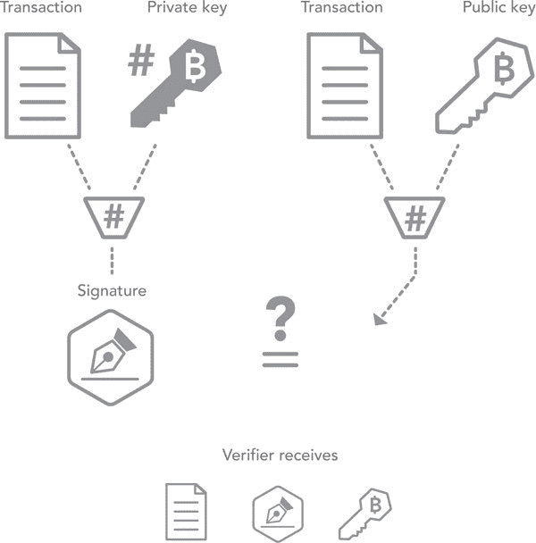

第六章

管理区块链透明度

私有/开放世界的策略

安德烈亚斯·帕克

区块链透明度简介

• 区块链技术的出现迫使我们重新考虑交易和合同公开揭示的利弊。分布式账本的实施、应用和可能的监管涉及选择，这些选择将在信息披露和经济交互方面产生关键影响。

• 区块链技术可以通过以比较低廉且对任何具有互联网访问权限的人都是固有可见的方式存储合同和交易，促进公司投资决策的监控。

• 区块链是公开且无需许可的，例如比特币或以太坊区块链，或者是私有且受控的，例如瑞波或超级账本的实现，并不重要：原则上，交易是可追踪的，并将行动归因于标识符。因此，该技术具有固有的高透明度水平。

• 用户在私有和公共区块链中仍然可以保护他们的隐私：一些方法是程序性的，并涉及协议的智能使用，而另一些则是技术性的，并使用数学。

#### 实时信息对称介绍

在 2001 年 10 月 19 日，安然公司的多年成功故事以没有人幸福地生活在一起而告终：公司宣布季度损失 6.38 亿美元，股东权益减少了 12 亿美元。几个月后，经过美国证券交易委员会和美国司法部的调查，世界得知安然管理层在复杂的会计结构中篡改账目，隐瞒了巨额债务。安然高管被判处 24 年监禁，这对于数万名失去工作和养老金的安然和安达信员工以及看到 650 亿美元股权消失的股东来说，几乎没有什么安慰。几起会计丑闻后，美国国会通过了《萨班斯-奥克斯法案》，加强了信息披露、会计和责任标准。

回过头来，让我们自问一下：监管机构和立法者一直试图解决的根本问题是什么？贷款人想知道借款人是否有可能偿还贷款，股权投资者想知道他们是否有可能获得投资回报，特别是当前公共公司的市场价格是否确实反映了股份的内在价值。然而，一次又一次，银行、公司、会计师事务所和政府机构的管理者们都被发现说谎。

不对称信息是指在一方拥有更好信息且可以利用它损害另一方的情况，这对市场的运作是有害的。出于这个原因，存在着一个复杂而常常繁重的法规体系，通过要求定期和准确的披露来减少这种不对称性。会计规则给了管理者在公司内重新分配资金和收入的自由。此外，会计报告是间歇性发布的，有大量证据表明，管理者从事许多经济上毫无意义但代价高昂的活动，如盈利“平滑”。最后，对账簿的外部认证是昂贵的。

在数字化之前，供应间歇性报告是合适的，耗时且昂贵的：管理层需要从各个单位汇总信息，并支付第三方进行检查和验证，然后邮寄给股东。今天，企业拥有电子会计系统：高管可以实时获得财务信息，但选择不与投资者分享这种原始和未经审计的数据流。

原则上，区块链技术允许企业公开、直接和实时披露经过验证的财务交易。它还允许它们披露一套广泛的合同。这些公开的交易将以代码形式呈现，消除了有关企业财务状况和承诺的模糊性。尽管仍然可能存在欺诈行为，但导致恩隆（Enron）灭亡的许多交易，例如，将不再可能。资产不可能一次出现在两个当事方名下，隐藏负债将是不可能的，并且潜在的恩隆（Enron）不可能像恩隆（Enron）那样吸引如此积极的媒体关注和额外资金支持。

#### 共享知识的好处

资产所有权和合同的一个关键组成部分是归因：谁持有资产，谁建立并参与合同？区块链通过记录资产起源和交易以及分布式（而不是集中式）账本中的所有权变更来存储这些信息。交易和合同的完整记录确定了资产的当前所有者。所有权归因于一个地址，这只是一组字母和数字，可以看作是一个标识符。

通过在区块链上记录交易，多方网络共享了资产的过去和当前所有权的知识。因此，技术的一个固有部分是，在过去的行动和现在的所有权方面存在一定程度的透明度。实际上，默认情况下，任何有权访问网络的人对于交易的归因都是完全透明的。原则上，地址或 ID 是匿名的。

如果恩隆公司的管理层被要求公开披露公司的地址，那么投资者和监管机构就可以追踪资产和负债的流动。基于区块链的交易之美在于披露是固有的。原则上，有权访问区块链信息的人可以获得与公司管理层相同的关于公司的信息。这个特性可能降低生成会计报表和进行审计的成本。进一步的成本节约是：信息不对称是一种风险，金融家需要得到补偿。通过减少信息不对称，公司降低了风险并降低了资本成本；他们有更多的投资和研究资金，可以利用这些资金构建更好的产品并增加就业。因此，区块链技术可以成为增量经济增长的催化剂。

#### **透明度过多会产生什么问题？**

尽管透明度有诸多优点，它也影响市场参与者的经济互动，并可能带来不利影响。例如，一个投资交易商应客户要求，接受了一大笔因流动性需求而来的头寸。这样一来，投资交易商的账上就多了一个不想承担的风险。在流动性相对充足的市场中，这个问题可能较小，因为交易商很可能很快就能脱手这个头寸。但在一个流动性尚可的市场中，客户一开始可能根本不会找到这个交易商。在一个流动性不足的市场中，由于潜在交易对手稀缺，交易商必须担心被挤压：一个资金雄厚的流氓交易者可能会操纵市场，迫使交易商以非常低的价格清仓头寸。交易商并不希望公众看到其风险头寸。

我们应该关心交易商吗？我认为我们必须关心。头寸挤压的风险是真实存在的，交易商希望得到补偿，因此，不是交易非流动性资产的成本上升，就是非流动性资产市场完全崩溃。

换句话说，有充分的理由在一个高度透明的区块链上完成交易，同时对这种透明性也有合理的担忧。实际上，当面对一个公开记录所有交易的公共区块链的概念时，金融行业的高管们感到不安——不在他们的监管之下！

另一种选择是一个许可的、私有的区块链，由诸如银行之类的已知并受信任的实体联盟组织和控制。假设是，这样一个私有的分布式账本或区块链的可见度是一个设计选择。但问题并非如此简单：即使是一个可能由银行联盟组织的私有区块链，也仍涉及在分布式网络的每个节点记录每个人的交易。换句话说，即使在一个私有区块链中，我们的竞争对手也能看到我们的活动。

讨论到此结束了吗？并非如此。如果银行担心缺乏隐私，那么他们也不应该使用互联网。相反，我认为透明度讨论应该集中在所需的、社会最优水平的透明度上。这个水平对于希望建立私有区块链的公司来说是一个关键的设计选择。此外，监管机构和立法者需要仔细考虑他们要求公共区块链的公司用户披露什么信息。

在这一章中，我将概述在区块链上记录信息与当前资产转移世界之间的差异，以及谁能看到什么信息。透明度的变化会产生经济后果，并可能造成赢家和输家。因此，我将描述反对和支持透明度的商业案例。最后，我将讨论存在的技术解决方案，以减少区块链内置的完全透明度。

区块链技术中的原生透明度

#### OWNERSHIP TRANSFERS: CENTRAL REGISTRIES VERSUS DISTRIBUTED LEDGERS

为了说明可能存在的透明度问题，让我们来看看区块链技术的运作方式以及它们与行动和持有的透明度之间的关系。

所有非物质、非注册资产转让都需要一种机制来更改所有权记录。目前，中心化账本保留了大部分这类记录，只有高度信任的当事方才能访问和修改这些记录。现金存放在银行账户中，而银行账户是一个中央注册处。房屋的所有权记录存放在房地产登记处。股票等证券也存放在中央证券存管机构，如美国的 DTCC 或加拿大证券存管中心（CDS）。最后，大多数双边合同的记录通常由涉及的当事方保留，并且合同条款触发的交易因此涉及复杂的账户对账过程。消费者贷款协议通常还会额外在信用局注册，如 Equifax 或 TransUnion。

区块链技术是一种共识协议，用于更改分布式账本中的记录，其设置定义了谁可以在什么情况下更改账本。在其核心，区块链是一种追加协议，它存储“交易”，在原则上，交易可以是一笔交易，但也可以是文本信息，比如一段编程代码。区块链的关键特征是，通过记录交易，它确保对资产的当前所有者达成共识。任何人都可以使用公共网站 Etherscan.io 在以太坊区块链上探索代币转账，该网站从以太坊区块链上获取数据；或者使用 Blockchain.info 网站在比特币区块链上探索。

#### 所有权转移：公共区块链与私有区块链

让我们考虑一下数据存储上的区别。迄今为止，大多数公司仍然将企业数据存储在中央数据库中。这种设置简单且易于理解。并且，由于所有信息都存储和更改在一个中央位置，一方不能将同一资产或同一美元花费两次。想想一个银行账户：Bob 不能将同一美元同时发送给 Sue 和 Alice，而且 Bob 不能将同一资产用于两笔交易的抵押。数据存储的集中化防止了这种重复支出问题。

然而，对于中央数据库存在许多关切，其中最主要的是安全性：如果数据库因为例如重大硬件故障而失败，所有数据可能会丢失。因此，中央数据库的管理者总是进行备份，而备份模型就更接近分布式数据库。也就是说，管理者需要持续更新他们的备份以避免数据丢失，并且需要一个备份协议来确保备份中的数据准确。

分布式数据库与中央备份系统共享某些特性，因为它在几个地方保存所有信息。关键区别在于，在分布式数据库中，没有一个单一的主要位置来源自所有变更。相反，每个站点都可以对数据进行更改。

这种设置有许多优势：没有单一的故障点，所有数据都可以在本地访问，并且该系统可以设置，使得不同的地点无需相互信任，但所有站点都持续同意数据库的内容。根据 R3 的 Richard Gendal Brown 所说，"[一个]由多方操作，彼此互不完全信任，但仍然对一组共享事实的性质和演变达成共识的系统"。

然而，分布式数据库的一个副作用是所有信息都存储在所有位置。因此，例如，如果一组银行组织分布式账本（其中每个银行都是网络节点），那么每个银行都持有所有其他银行账户的信息。这种安排引起了高管的警告，因此我们需要了解信息透露的内容（因为存储信息并不等同于访问信息）。

分布式账本主要有两种类型：公共和私有。

公共账本是无许可的：任何人都可以成为网络节点，原则上任何人都可以录入账本记录。最突出的例子是比特币和以太坊区块链。事实上，成为网络节点的过程是使用区块链的一部分：使用以太坊区块链的第一步是下载所谓的钱包软件；一个例子是“Mist 钱包”。这些钱包监视以太坊区块链，以查找发送到钱包的交易。作为该过程的一部分，从以太坊区块链下载信息并成为一个节点。

相比之下，私密分布式账本是由单个公司或由一组公司构建的，并在几个关键方面与公共分布式账本不同。首先，私有网络可以被授权，因此可以限制谁可以使用它记录交易，并可以查看信息和资产在其中的流动。对于金融机构来说，这一特性很重要，因为它使他们能够遵守 KYC 法规，这通常是遵守 AML 规则的先决条件。此外，原则上，这些网络不需要无信任协议。一个缺点是，联盟解决方案引发了联合作用和典型信任的租金提取的可能性；例如，网络成员可能限制进入、固定价格，并在费用上串通。从竞争政策的角度来看，因此可能希望强制实施无信任协议，以消除新入市企业希望加入联盟网络的障碍。

图 6-1 阐述了区块链交易验证的工作原理。³⁶⁰ 关键思想是用户的区块链地址（隐含地）有两个组成部分，一个是公开的，一个是私密的。每个人都可以看到与地址的公开部分相关联的每笔交易；私密部分用于签署交易。此外，公钥是验证用户是否确实授权了交易的关键组成部分。附录解释了如何获得地址并向该地址转账。³⁶¹

#### 图 6-1

#### 使用公钥和私钥签署和验证交易

图标 © 2017 Smashicons 和 Freepik。已获授权使用。

#### 简而言之：区块链转账如何工作

第 0 步：两个交易方就特定资金或其他资产的转移达成一致。

第 1 步：商品的买方（通过地址标识）向区块链网络发送消息，请求将资金转移给卖方（一个地址）。

第二步：网络检查买方是否拥有指定的资金，并且买方是否可以验证自己有权发起转账；这种验证需要用私钥/地址的私有部分对交易进行签名。

第三步：交易被打包成块，并根据区块链的协议添加到链中。

第四步：一旦一个区块被添加到链中，交易就已经完成。隐含地，买方的账户已经减少，卖方的账户已增加相应的金额。

这次讨论的要点是，区块链记录所有买方和卖方的交易 ID，这些信息被保存在每个节点上，并且这些信息因此在广泛的网络上共享。至关重要的是，人们不应将私有分布式账本与保证隐私的区块链协议混为一谈。相反，上述协议和将所有权归属于 ID 的原则在私有区块链中的工作方式基本相同。主要区别在于私有区块链可以控制除网络成员之外的任何人是否可以查看交易记录。

#### 透明度作为风险和资产

在许多情况下，透明度是一把双刃剑，而其中一些可能最能从中受益的当事方也是最热烈的反对者。在本章介绍中，我已经强调了中间人是强有力的反对者，例如，因为吸收客户库存会使中间人面临风险。过去交易和持有的透明度也可能帮助他们识别可能的交易对手。

#### 透明度作为战略风险

公司债券市场展示了这个问题的复杂性。在上个世纪初，公司债券经常在纽约证券交易所等证券交易所交易。但随着时间的推移，这个市场几乎完全转移到场外安排；尽管交易技术取得了重大进步，但这个数百万美元的市场仍然令人惊讶地落后，因为大多数交易都是通过电话交谈或通过彭博聊天安排的。

该行业还坚决抵制提高透明度的尝试，即使在后期交易信息方面也是如此。例如，美国证券经纪商协会（NASD）于 2002 年引入的交易报告和合规引擎（TRACE），以及加拿大投资行业监管组织类似的努力都遭到了很大的阻力。奥哈拉、王和周提供了一个可能的解释：积极的交易商，可能是常规客户，可以获得更好的价格，而主导性的经销商往往会提供更差的价格。这些发现表明，经销商有利润需要保护。然而，不具竞争力的利润最终会以发行人为代价，因为投资者会将流动性成本纳入定价。

与此同时，初创金融科技公司（如 Algomi）提供系统化、算法化的公司债券交易持仓匹配，报告称他们最大的客户之一是中介。换句话说，经销商认识到提升流动性的技术的用处。同样，有充分的证据表明，在引入 TRACE 之后，市场价格显著更加精确。更准确、更有效的价格有利于整体中介，因为糟糕的定价会增加风险。

卖方中介并不是唯一担心透明度过高的一方。大量研究表明，特别是机构投资者非常担心竞争对手可能模仿他们的交易策略。例如，共同基金被要求定期在 13-F 表格中公开披露其持有的股票；克里斯托弗森、达内什和穆斯托（Christoffersen, Danesh, and Musto）的研究表明，主动管理型共同基金通常会尽可能地延迟发布这些信息。换句话说，这些基金会尽可能地掩盖他们的活动，可能是因为他们担心失去竞争优势。此外，从更短期的角度来看，机构交易者花费大量精力隐藏他们的交易活动：他们不会一次性交易大量股票，而是使用复杂的计算机算法将他们的大订单“切割”成小块。他们这样做是为了避免被市场大众发现，因为正如范·科瑞尔（van Kervel）和门克维尔德（Menkveld）报告的那样，他们在一天内处理订单的时间越长，其他聪明的算法交易者就越有可能发现这些订单并推动价格朝相反的方向变动。

在过去的 20 年里，许多公司退出了公开股权市场：自上世纪 90 年代末市场高峰以来，美国上市公司数量下降了超过 40％，一些退出市场的公司是家喻户晓的品牌，如戴尔和沃尔玛。其他像优步这样非常成功和有名的公司则故意避开公开市场。这种趋势有很多原因，但被强制公开披露的上市公司公告是经常被提及的一个原因。CEO 必须公开披露他们的薪水，而财务披露可能会使公司面临泄露竞争或战略业务信息的风险。

除了一些方面希望保持隐私的情况外，还存在隐私是必要的情况。一个很好的例子是基于区块链的投票。利用区块链进行投票的基本思想是向合格选民发放数字化的一次性令牌。通过对令牌的控制和可审计的供应和分配，很难操纵一次投票。然而，在民主政治选举中，投票必须是私密的，因此隐私是必不可少的。在其他情况下，公开投票可能是可取的：例如，在最近由 TMX 集团引入的股东大会投票中，股东可能希望知道他们的代理投票是否被如约使用。

现有的区块链技术可以解决这里突出的透明度问题。这里提出的论点并不是反对使用区块链解决方案。

#### 透明度作为战略资产

互联网和电子文档以及数据的出现极大地增加了投资者、消费者、交易伙伴和监管机构可以获取有关企业、政府、非政府组织和个人的信息。随着时间的推移，许多实体已经学会了拥抱透明度并将其用于自己的利益。区块链技术使企业能够直接和间接地从透明度中受益。

#### 间接效应：声誉和被认为的完整性

在管理科学中有着长期的文献研究透明度的间接影响。³⁶⁸ 这些文献假设透明度应该是负责任管理实践的核心原则，并且研究人员已经发现组织 embrace 透明度受益良多的大量证据。我认为，这些好处是间接的，因为许多报告的好处源自公司的开放性，随着时间的推移改善了关系。例如，在许多商业交易中，一方获得关于另一方的知识，对于成功的关系，各方需要相互信任，以确保交易的一方不会利用这些知识。公司增加信任的常见方法是发布采纳的道德行为准则，这使得员工更容易知道期望并在商业交易中建立信誉。此外，及时与合作伙伴和供应链成员分享相关信息可以提高信任，并且通常可以提升公司的品牌。

正如 Tapscott 所述，公司要成功应对增加的透明度和公众监督，需要五个要素。公司需要

•创造真正的价值，经得起透明度带来的审查。

•了解客户并建立关系资本。

•保护客户的隐私。

•表现诚实，因为在透明的世界里缺陷会很快被发现。

•坦率地说，因为缺陷会很快被发现。³⁶⁹

许多这些原则适用于金融交易和合同在区块链上可见的世界。事实上，Parris 等人将透明度定义为“利益相关者感知组织提供关于自身学习机会的程度。”³⁷⁰ 在区块链上可见的交易和智能合同（编程代码片段）提供“硬”信息（因此学习机会），因为信息是可验证的和不可变的。

透明度的极端案例是 DAO。³⁷¹作为一家风险基金，所有 DAO 的投资及其整个治理都是透明的，因为底层代码是开源的，对所有人可见的。DAO 治理的基本思想是 DAO 代币的所有者会投票决定是否资助提议的项目。这种自主的、非人类的 DAO 运营模式并不适用于所有企业，但它与“正常”的公司决策制定形成了令人着迷的鲜明对比，在那里高管对资金的使用拥有很大的自由裁量权，而股东很少直接发言，并且往往对 CEO 的决定只有有限或间接的了解。³⁷²

作为区块链中存储的“硬”信息如何帮助实体的一个例子，考虑一个历史上腐败的国家。该国政府如何提高其地位？最终，证明自己不腐败是困难的。区块链技术可能是一个答案。在当前世界中，往往不可能真实可信地揭示政府的所有相关交易和业务往来，但当所有交易和合同都记录在区块链上时，就没有任何东西能隐藏。由于资金和合同条款可以追溯，这个政府可以可信地证明其行动并没有进一步腐败。

#### 直接收益：去中心化、治理改善

透明度还有直接的好处：记录在区块链上的交易通常是金融性质的，而在区块链上记录交易和持有情况可以在市场交易中直接带来程序上的优势。许多金融资产，如公司债券，非常不流动，意味着愿意交易的交易员很难找到交易对手；最近的监管变化，如沃尔克规则，加剧了这种情况。³⁷³ 一个问题是，在当前市场结构下，大多数交易是通过经销商线下安排的，很难知道谁在最近的过去交易了产品（因此可能有持续的利益）或者谁可能持有证券（因此可能成为交易对象）。可以说，在这个市场上增加透明度可能会增加投资者之间的交互（从而减少昂贵的中介）。马里诺瓦和帕克在理论上表明，具有公共区块链特征的设置（即使市场参与者采取措施隐藏其行为）相对于传统的、不透明的设置，在经销商的信息孤岛中保存有关过去交易和当前持有情况的所有信息，可以提高配置效率。³⁷⁴

另一个例子是首次公开招股市场。在上世纪 90 年代末的互联网泡沫时期，这个市场充满了问题。一个关键问题是招股的分配和获取规则。传统上，主承销投资银行控制着谁能获得招股份额。对于热门的首次公开招股，存在着许多利益冲突：例如，一个广泛报道的关注点是，主承销投资银行有兴趣取悦他们最好的客户，给予他们低估的股份。³⁷⁵ 另一个广泛报道的问题是梯形交易的过程，即只有投资者承诺以更高的价格购买更多股份，才能获得招股的股份。³⁷⁶ 在当前的投资银行世界中，承销商不能轻易地说服发行人和投资者，利益冲突在他们的建议和决策中没有起到作用。与当前炙手可热（不管好坏）的 ICO 市场形成对比，其中许多实际上看起来像证券招股。³⁷⁷ 这个市场的分配机制完全透明，因为它是确定代币分配方式的公开可见代码的内在特性。³⁷⁸

在一篇著名的论文中，大卫·耶尔马克（David Yermack）强调了区块链技术对公司治理可能带来的诸多潜在好处。³⁷⁹ 耶尔马克认为，例如，区块链中的透明所有权归属可以帮助解决所谓的空投票现象，即一个实体在没有对公司拥有经济利益的情况下就可以对经济意义重大的决策进行投票。³⁸⁰ 通常的假设是，对公司的经济利益和投票权与持股权相结合。然而，衍生品合同使得一方可以在没有对公司拥有经济利益的情况下获得大量的投票权。³⁸¹ 通过区块链进行所有权归属，任何时候都可以透明地知道谁拥有一支股票以及谁有经济上合理的投票权。

内幕交易，这在金融行业和学术界引起了很多争议，是另一个明显的应用场景。内部人员已经被要求公布他们的交易和持股情况，但是交易和报告之间经常存在重大延迟。³⁸² 因此，如果所有交易都记录在区块链上，那么内部人员可以通过公开的身份证明可靠地和立即展示他们的交易。他们的所有交易都将可见，这将消除昂贵的报告要求，并可能增加公众信任。³⁸³ 公众将能够更好地了解内部持股和内幕交易，公司高管将与股东建立信任。这一论点尤其适用于内幕交易违规执行不如北美严格的司法管辖区。最后，内幕交易的透明度应减少内部人员从事非法交易的倾向。随着透明度降低内幕交易者的灵活性，外部人士生成公司信息的盈利能力将增加。

耶马克强调，公共区块链的不可变性提高了（企业）治理质量。在当前系统中，土地记录可能被伪造，公司收入报表可以被操纵，期权授予可以被追溯。当所有这些数据记录在公共区块链上时，进行此类操纵变得极为困难和昂贵。

在金融领域中，合同和持股的透明度不仅仅解决了公司治理核心的不良选择和道德风险问题，还可能对风险管理产生深远的影响。2008 年金融危机后的一个主要发展是，特定类型的衍生品合约，如掉期，被迫通过一个新开发的中央对手方（CP）进行清算。基本思想是，当 A 想要卖给 B 时，A 先卖给 CP，然后 CP 再卖给 B。为什么这是必要的？想象一下，如果 A 也从 C 那里买入，但 C 破产了。那么 A 就无法交付给 B，可能也会破产。因此，在与 A 交易时，B 面临两个交易对手风险：（a）A 独立破产的风险和（b）C 破产并将 A 拖垮的风险。

在金融危机之前考虑美国国际集团（AIG）在信用违约互换市场上的衍生品交易，就可以发现 AIG 已经持有大量未对冲头寸。AIG 的违约将会触发其交易对手的违约，引发整个金融系统的连锁反应。当所有交易都由中央对手（CP）结算时，风险集中在 CP 身上。尽管这种体系可以产生互惠互利的风险分享水平，但也存在问题：因为它是一个“太大而无法倒闭”的实体，CP 需要受到严密监控，充足资本支持，可能还需要严格监管。此外，目前只有少数合同符合 CP 结算的条件。需要 CP 的根本原因是对总体风险缺乏足够的信息，这造成了道德风险。正如我们从美国经济学家乔治·阿克洛夫的开创性工作中所了解的那样，信息不对称可能导致市场崩溃。

我们可以认为区块链技术所可能实现的透明度能够促成市场化解决方案：当所有金融义务都是可见的时，我们将能够追踪到对手方风险超越双边互动。未对冲头寸将会被展现出来。此外，我们将能够编写带有保护性条款的智能合约，通过代码强制交易对手及时建立对冲，或者防止参与未对冲合同。

最后，智能合约本身可以从根本上改善经济交互。作为第一步，智能合约可以通过在违约情况下自动转让抵押品所有权来促进抵押品的交付。这种自动化极大地提高了抵押品的执行力，增加了其价值，降低了风险，并可能释放出资本。

我们使用合同向他人（例如，股东）证明货物的转移将会发生（或已经被合法化）。我们可以在没有区块链和不透明环境中使用智能合同；但是在透明的区块链中，各方可能能够出售未来支付的权利。换句话说，公司可能能够直接从合同中出售现金流，他们可能能够直接确保现金流风险。此外，正如 Cong、He 和 Zheng 所示，智能合同可以减轻信息不对称，导致增强的进入和竞争，从而带来更高的社会福利和消费者剩余。⁵⁸⁴

总的来说，支持区块链技术所提供的交易和合同透明度的商业案例是坚实的，而这些优势远远超出了解决头条新闻丑闻引发的担忧。事实上，公司实体的隐私已经受到限制，尤其是与个人相比。可以合理地假设，监管可以要求基于区块链的交互披露——如果确实区块链成为金融交易的标准，那么这种披露的程序成本是不高的。

最后，IBM 对 C 级高管进行的最新研究证实了我在这里提出的论点的有效性。⁵⁸⁵已经积极采用区块链技术的绝大多数高管报告称，该技术将创造更多信任，例如，通过交易可追溯的审计轨迹，通过透明公开过去行动来建立声誉。

#### 解决问题：区块链隐私的技术方法

区块链的主要目的是确保记录的真实性——默认情况下，分布式分类帐并没有设置以保证用户的隐私。事实上，有充分的证据表明，公共区块链上的交易并不是私密的，个人的行为可能会被追踪到。⁵⁸⁶

作为先决条件，重要的是要分开不同方的关切。从在热门互联网论坛上的讨论语气来看，许多加密货币的支持者，尤其是比特币的支持者，担心他们的交易是否能够被追踪或检测到，例如，被政府实体。考虑到比特币曾是 Silk Road 等网站上非法毒品购买或勒索软件支付的一种常用支付方式，这并不奇怪。

相比之下，大多数企业用户习惯于政府审计他们的行为，对政府知识本身的担忧较少。事实上，他们可能会欢迎一个能够更轻松追踪的系统。相反，企业用户主要关心的是他们的行为是否能被竞争对手追踪，从而减少了他们的知识产权。

#### 程序性变通方法：使用多个 ID

那么，区块链上的行为是否总是完全可追踪和可归因的？答案是否定的。有几种简单、低技术的程序性变通方法，允许用户混淆他们的行为。

让我通过一个具体的例子来解释这些想法。一个共同基金希望在最近发行的证券是基于区块链的代币的公司中进行大额投资。共同基金将把法定货币，如加拿大元，转换成基于区块链的货币，如以太币。这种转换将在基于区块链的交易所上进行。交易所会知道谁购买了以太币（因为他们必须遵循 KYC 规定）。转账完成后，基金将使用新购买的以太币购买加密证券。正如我在附录中概述的那样，通常这种转账是在一个交易钱包中执行的，该钱包结合了许多市场参与者的行为。对于最终结算，基金随后将证券转移到非交易所钱包中。但基金不必使用已知的钱包或向公众透露钱包 ID。相反，基金可以创建一个专用的新钱包。或者基金可以创建任意数量的新钱包，并将持有分配在其中。如果操作得当，外部人无法将这笔大额购买拼凑在一起。这种解决方案还可以利用所谓的分层确定性（HD）钱包进行正式编程，该钱包会为较大交易的每一部分算法生成一个新的公钥。

HD 钱包也被提议作为私有分布式账本隐私的解决方案。假设一个私有网络由一组大型银行和经纪人联合运行。他们中的每个人都会创建一个（或多个）HD 钱包，并在自己的系统中记录个别客户的持仓。这种安排类似于目前股票交易的结算。即，目前，股票交易的结算发生在中央托管机构，例如美国的 DTCC 或加拿大的 CDS，结算是在经纪人层面进行的。主要区别在于 HD 钱包的结算是在分布式账本上，而不是在中央数据库中。通过分布式账本，即使是有权访问账本的人（特别是对于加拿大，其中交易通常带有经纪人归因），也不会对中央托管方案产生信息优势。

与 HD 钱包相关的另一种生成隐私的解决方案是合并和重新分割操作：根据该协议，若干个实体匿名向智能合约提交新地址；合约从各方收集相同数量的加密证券单位（例如，每个 100 比特币），然后合约将金额重新分配到新地址。从外部来看，我们无法再跟踪到货币的路径。不用说，在一个没有外部控制的公共区块链中，我所描述的对于实际目的来说就是洗钱。然而，在获得许可的区块链中，ID 将被知晓，监管机构或税务机关将能够跟踪个人。这一努力的主要目的是使外部观察者难以理解个人的行为。

#### 高科技解决方案：零知识证明

除了上述的低技术解决方案外，现代密码学提供了几种高科技和优雅的方式来获得隐私。关于交易的常见隐私相关关注点是，信息所有者希望提供密码学证明，证明她是该信息的有效所有者，而不必向验证者（即网络）透露该信息。

例如，零知识在基于区块链的投票中至关重要。对于这样的投票，一个人收到一个投票代币。在投票时，代币持有者需要验证自己是代币的合法所有者；但在秘密选举中，验证者不能看到所有者是谁，因为那可能使验证者追溯实际的选票到投票者。毕竟，在公共区块链中，每个网络成员都会保留所有信息的记录。

解决这个问题的可能是迄今为止最复杂的方法之一涉及所谓的零知识证明。图 6-2 显示了这种验证的工作原理。

下面是零知识证明的一个标准示例。假设鲍勃是色盲但不知道。爱丽丝想向鲍勃证明绿色和红色之间的区别。鲍勃拿了两个台球，一个是红色的，另一个是绿色的，但除此之外它们完全相同。对于鲍勃来说，它们看起来完全相同，他怀疑它们实际上是可区分的。爱丽丝想向他证明它们实际上是不同颜色的。同时，爱丽丝不希望鲍勃知道哪个是红色的，哪个是绿色的。

这是证明系统：Bob 拿起两个球，一个放在每只手里。Alice 可以看到球，但不告诉他哪个是哪个。Bob 然后把两只手放在背后。接下来，他要么在手中切换球，要么保持不变，两种可能性相等。然后他把手从背后拿出来。Alice 现在必须“猜”Bob 是否交换了球。当然，Alice 可以通过简单地看颜色来确定 Bob 是否交换了球。如果它们是相同颜色的，因此无法区分，她将以 50% 的概率猜对颜色。当然，一次尝试是不够的，但如果 Bob 和 Alice 重复这个“证明”多次，Alice 始终都猜对的几率将消失。Bob 因此应该相信球确实是不同颜色的。此外，这个证明是“零知识”的，因为 Bob 永远不会知道哪个球是绿色的，哪个是红色的；实际上，他对如何区分这些球毫无所知。

#### 图 6-2

#### 零知识证明的示意图

一个证明者想要证明她拥有一扇洞穴中秘密门的钥匙。无论她选择向左还是向右，她都可以使用钥匙并从任一方向返回。验证者没有看到证明者走哪个方向，要求她通过右侧隧道返回。证明者拥有门的钥匙，打开门并通过右侧隧道返回。当然，她可能很幸运；没有钥匙的人也可以一开始选择右侧隧道。但是，他们重复实验多次，证明者每次通过正确的隧道出现的几率都在逐渐减小。

![图片

图标 © 2017 Smashicons 和 Freepik。已获得许可使用。

截至目前，公共区块链 Ethereum 的开发人员正在将使用零知识证明的广义版本作为 Ethereum 区块链的一部分。他们采用的概念是 zk-SNARK，这是一个协议，使得某人只能向验证者透露必要的信息，而不多。Zcash 是一种基于零知识证明的加密货币的例子。

公司何时想要这样的选项？想象一下，一家公司在区块链上存储智能合约。一个借款人想评估公司的信用价值，并要求揭示公司根据现有合同可以期待的付款。公司可能不希望向借款人透露合同的所有细节（如交易对手）。零知识证明是解决方案：公司可以证明自己是即将付款的收件人，而不透露所有细节。

另一个提供隐私的基于区块链的加密货币是 Monero。它基于一个不同的概念，即所谓的可链接环签名。其思想是，系统为每笔交易将真实 ID 与其他随机 ID 的集合混合。在签署交易时，用户透露自己是合法所有者，而不透露是哪一个。可链接性确保了不能发生双重支付。还有其他几种技术和程序解决方案可以提供隐私，但讨论所有这些解决方案超出了本章的范围。

总之，有多种解决方案可以确保隐私：一些是技术性的（如零知识证明），一些是程序性的（使用多个 ID）。

#### 在公共与私有区块链中的实现

上述描述的获取隐私的程序性解决方案是公共区块链固有的。使用许多地址的直接缺点是它会产生实际成本：虽然创建 ID 是免费的，但每笔交易都涉及费用，以这种方式调用隐私是有成本的。除了成本之外，没有什么能阻止实体使用任意数量的 ID 并隐藏其身份。

尽管隐私是私人公民的权利，但许多司法管辖区，如加拿大和美国，已经限制了企业和高管的隐私。例如，公司内部人必须公开交易公司股票的情况，而共同基金和一些对冲基金则必须披露其持有情况。对于使用公共区块链的公司，监管机构或立法者可以强加披露要求。例如，受监管的对冲基金或在区块链上发行类似证券的公司可能需要不时披露他们使用的地址。这样做可以说是比目前繁琐的行政披露更为优雅的解决方案。此外，正如我上面所论述的，公司和高管可以主动披露使用的地址，以利用透明度的战略价值。

使用高科技解决方案实现隐私，例如 zk-SNARKs，并不与企业将区块链透明性作为战略资产相矛盾。例如，智能合约是区块链技术最吸引人的特性之一，可能涉及一方 A 向另一方 B 进行交付，同时使用公司 A 的知识产权来完成交付所必需的任务。公司 A 不希望公司 B 看到其知识产权，也不希望更广泛的公众看到知识产权。解决方案是使用 zk-SNARKs 来验证任务确实已经完成。想要透明度的公司（例如，关于相关会计特性），不需要透露合同细节，而是仍然能够宣布最终交付，或者他们可以可验证地显示协议的关键参数。

在私有或许可的区块链中，来自公共区块链的程序性解决方案同样适用。但是，在私有区块链中，还有进一步的选择。用户是否可以创建多个身份是一种设计选择。对于交易的验证和结算的经济激励也是一种设计选择，使用多个身份的成本也是如此。私有区块链还可以包括掩盖用户身份或限制某些交易子集对一些参与者可见的特性。

对于私有区块链来说，更加关键的是用户理解身份设置、网络治理以及网络成员可获得的信息。例如，设置是否与公共区块链相同，只是所有用户都经历了 KYC 过程？或者是否对身份使用有限制？所有网络成员是否类似地使用身份？网络的客户是否有平等的访问权限，还是某些机构给予某些客户比其他人更多的信息？

如果确实领先的金融机构引入私有区块链以促进它们的互动，那么信息处理和标识符处理需要深思熟虑（可能需要进行漫长的立法和监管过程）。例如，区块链技术的主要优势在于它实现了点对点的互动，这将进一步推动去中心化。依赖银行联盟运营的私有区块链的机构投资者需要了解他们或其他任何一方可以从区块链中获取的信息。

与此相关的一个问题是企业用户的基线信息。商业伙伴可能会公开一部分信息。例如，一方可能分享信息以建立良好的商业伙伴关系。然而，如果披露是选择性的而不是完整的，那么用户就无法构建一个有意义的比较基准。

正如这次讨论所强调的，私有区块链可能会出现许多可能的信息不对称。由于现有的金融机构已经受到严格监管，它们构建的任何私有区块链可能也需要受到监管。监管需要确保成员和非成员之间信息不对称以及由此产生的利益冲突得到缓解。

在金融史上，改变透明度制度是困难的，并且这样的举措通常会遭到很多阻力。个人认为，私有或联盟区块链的监管很快就会变得极其棘手，因为它需要涵盖多个意志坚定的司法管辖区。

在我看来，有两个显著的结果：第一个是私有的、有权限的区块链与公共的区块链相同，只是网络的访问由网络成员控制，但所有其他信息和透明度特征与公共区块链相同。

第二个结果是金融机构设法设计出一个精确模仿当前世界的分布式分类帐。事实上，由世界上大多数最大的金融机构组成的 R3 联盟推广其自己版本的分布式分类帐，即 Corda 系统。R3 将该系统描述为一个开放的、分布式的分类帐，它在某种意义上保护了隐私，即作为分类帐一部分的公司只能看到与自己相关的信息。³⁹¹ 我认为，对 Corda 最好的描述是，它是一个通过双边协议同意和验证的交易系统，其冲突解决由（算法的）公证员提供。这个系统看起来像是使用一些在公共区块链（例如，智能合约）中开发和部署的功能的数字化合同世界的版本。由于区块链技术经常与互联网进行比较，这里的适当类比是 Corda 看起来像 21 世纪的 AOL。

最后，像比特币或以太坊这样的公共区块链非常安全：工作量证明（以及可能的权益证明）协议要求攻击者控制超过各自网络计算能力的 51%以上。目前，获得这些资源的成本是 astronomically astronomical；因此，在这些区块链上篡改记录在经济上是不可行的。私有区块链将成为黑客的大型、有利可图的目标；并且根据协议，单个受损网络成员可能会污染整个分类帐。私有区块链的安全性是一个真实而重要的问题，尽管超出了本章的范围。³⁹²

结论和建议

当企业高管首次了解到区块链的概念时，他们很快意识到固有的透明度根本违背了他们目前的程序——特别是对于金融机构而言。乍一看，私有区块链似乎是显而易见的选择——“私有”一词暗示着它们可以保持传统的金融交易的完全隐私水平。但事实更加复杂。

包括私有区块链在内，透明度是大多数区块链的固有特性。我们不能认为私有区块链等同于隐私，也不能将公共区块链等同于缺乏隐私。相反，存在技术解决方案，允许用户保持其交易匿名。因此，透明度和隐私是选择，即使在公共区块链中也是如此。

有了这个认识，区块链用户必须明白，当他们选择隐私而不是透明度时，他们会发出信号。坚持隐私可能会导致声誉损失。随着企业考虑将区块链技术纳入其业务运营中，他们应该考虑透明度对其业务的积极潜力。透明度增加了信任，可以帮助建立积极的声誉——与商业伙伴、客户和投资者。在现有系统中添加披露功能在概念上可能会很复杂——但是通过区块链技术，保持透明是直接的，披露可以不增加操作成本。

在未来几年，我们可能会看到私有区块链的实施，这些区块链提供标识符的掩码功能。尽管存在固有的安全顾虑和信号效应，但选择这条道路的高管们面临着关于私有区块链信息治理的重要问题：谁知道什么？谁掩盖和揭示标识符？谁控制和监控随后的协议？至关重要的是不要建立一种会产生不对称信息、逆向选择和道德风险的私有区块链，否则我们可能会看到一整套抑制创新的法规。

我希望高管们能够拥抱透明度的积极网络效应。修改现有的披露惯例具有挑战性，历史上我们只有在丑闻曝光之后才看到有意义的变革。这种新技术的出现是重新考虑和拥抱透明度，并利用开放世界经济利益的独特机会。

### 第六章附录

### 如何访问以太坊区块链

以太坊区块链上的项目与公共地址相关联，这些地址是数字和字母的组合。例如，我的公共地址是 0xb1f0ab5ba4DBABAACba71baB7d6bF79D64EE397c。

要接收付款，我们需要有这样一个地址。通过使用例如 MyEtherWallet.com 的网站，创建一个是很简单的。要创建一个地址，我们输入一个任意字符串作为密码。网站然后从这些信息中创建一个公共 ID 和一个私有 ID，并创建一个包含相关信息的文件。对于术语“showmethemoney!”，我收到了以下信息：

你的地址：

0x15b71d3db7F17B31e911517252EeE6a7445eA66C

你的私钥：

e36979144c398043f8606a349b01acecc1b8a0ffd-b9a55528710621434fdb538

请注意，这些信息仅供说明。这不是建议。没有人应该使用这些特定信息。我现在可以收到到这个地址的付款；但单独来看，这个地址是没有用的。换句话说，要进行付款，需要获取一个钱包。一个标准的钱包是 Mist，在这里可以找到：github.com/ethereum/mist/releases。

我们如何获取以太币，以太坊网络的本地货币？至少有三种方式：

1. 我们成为矿工，意味着我们使用我们的计算机参与以太坊区块链的验证活动。如果我们成功创建交易区块，那么我们将获得新铸造的以太币作为内置奖励。然而，成功的挖矿需要专用的计算设备——标准的中央处理单元速度太慢了。

2. 第三方向我们的地址发送以太币，例如，作为回报我们出售的真实世界价值物品（比如，在 Craigslist 上销售的婴儿推车）。

3. 我们将法定货币（例如，加拿大元，美元）兑换成以太币，并将其发送到这个地址。

就最后一点而言，在撰写本文时，将法定货币转换为数字货币是一个多步骤的过程。首先，我们需要在诸如 Coinbase、Kraken、Poloniex 或 QuadrigaCX 等加密货币交易所创建一个账户。这些交易所执行 KYC，意味着我们需要通过提供信用卡号码和护照或驾驶执照的扫描来验证我们的身份。一旦交易所验证了我们的身份，交易所会创建一个账户，我们可以通过向交易所发送以我们的名义的资金，例如使用信用卡或电汇来充值该账户。不用说，这个过程涉及到非常可观的费用。一旦资金充足，我们就可以在这些加密货币交易所购买以太币或其他数字资产。例如，Coinbase 会立即将法定货币转换为以太币。然而，转换交易尚未在区块链上结算——资金仍然在交易所技术上。因此，如果交易所被黑客攻击或破产，我们的资金就会丢失。要成为以太币的真正所有者，我们需要将资金从交易所转移并发送到上面列出的地址。

### 致谢

没有几十位人的贡献，这本书将无法问世。具体而言，我们要感谢正在塑造这个新行业的行业专家和企业家，他们慷慨地同意接受采访：ConsenSys 的约瑟夫·鲁宾、科林·迈尔斯和詹姆斯·贝克；MakerDAO 的鲁恩·克里斯滕森和格雷格·迪普里斯科；Winklevoss Capital Management 的泰勒和卡梅隆·温克莱沃斯；Morgan Creek Digital 的安东尼·波姆利安诺；CoinShares 的梅尔特姆·德米罗斯；Props 的阿迪·西德曼；Abra 的比尔·巴尔海特；Messari 的瑞安·塞尔基斯；Cosmos 和 Tendermint 的伊桑·布克曼；企业以太坊联盟的罗恩·雷斯尼克；微软的马利·格雷；康奈尔大学的埃明·吉恩·西瑞尔；Brave Marco 的布兰登·艾奇；Blockchain（原 Cooley LLP）的 Santori；BraveNew 的卢西安·塔诺夫斯基；Accenture 的大卫·特里特；SWIFT 实验室的达米安·范德维肯；经济空间机构的阿克塞利·维尔塔南；Mediachain 的杰西·沃尔登；以及 DTCC 的斯塔克马·桑德斯、詹妮弗·佩夫、迈克尔·麦克莱恩、丹尼尔·蒂克和特蕾莎·帕拉夏克。

感谢区块链研究所杰出的研究教职人员，包括迈克尔·凯西、普里玛维拉·迪菲利皮、安德烈亚斯·帕克、瑞秋·罗宾逊、鲍勃·塔普斯科特、乔尔·泰普纳、安东尼·威廉姆斯等，他们的工作为本书奠定了基础。特别感谢 CM Crypto Capital 的查理·莫里斯提供的反馈意见。

任何作家都知道拥有一位优秀的编辑的重要性。我们很荣幸能有业内最好的之一。区块链研究所的总编辑 Kirsten Sandberg 为 BRI 发布的每一篇内容提供了结构、清晰度和叙事推动力。我们整个编辑团队是推动我们内容的引擎，我们对他们所做的一切都心怀感激。

我们还要感谢我们机构的成员们持续的参与：Accenture, Aon, Bank of Canada, Bell Canada, BioLife, BPC Banking Technologies, Brightline（一个 Project Management Institute 的项目），Capgemini, Canadian Imperial Bank of Commerce, Centrica, Cimcorp, Cisco Systems Inc., City of Toronto, the Coca-Cola Company, Deloitte, Delta Air Lines Inc., Depository Trust & Clearing Corporation, ExxonMobil Global Service Company, FedEx Corporate Services, Fujitsu, Government of Ontario, Gowling WLG, Huobi, IBM, ICICI Bank, INSEAD, Institute on Governance, Interac, Intuit, ISED Canada, JumpStart, KPMG, Loblaw Companies, Manulife, Microsoft, MKS（Switzerland）SA, Moog, Nasdaq, Navigator, Ontario Ministry of Health and Long-Term Care, Orange, Philip Morris International Management, Procter & Gamble, PNC Bank, Raymond Chabot Grant Thornton, Reliance Industries, Revenu Québec, Salesforce, SAP SE, Tata Consultancy Services, Teck Resources, Tencent, Thomson Reuters, TMX Group, University of Arkansas, University Health Network, University of Texas-Dallas, 和 WISeKey。

我们感谢我们的先锋成员：Access Copyright, Aion, Artlery, Attest, Blockchain Guru, Bloq, CarbonX, Cosmos, Decentral Inc., Evrythng, Huobi, Jumpstart, Liechtenstein Cryptoassets Exchange, LongHash, Medicalchain, Navigator Ltd., NEM Foundation, Numeracle, Paycase Financial, PermianChain Technologies Inc., Polymath, SGInnovate, Slant AG, SpaceChain, Sweetbridge, Telos Foundation, Veriphi, 和 YouBase。

最后，感谢我们的附属组织：Alastria, Blockchain in Transport Alliance, Blockchain Research Institute Nanjing, Chamber of Digital Commerce, Coalition of Automated Legal Applications, Enterprise Ethereum Alliance, Healthcare Information and Management Systems Society, Hyperledger hosted by The Linux Foundation, 和 the Illinois Chamber of Commerce。

### 关于区块链研究所

由唐和亚历克斯·塔普斯科特于 2017 年共同创立的区块链研究所是一个独立的全球性智库，旨在帮助实现数字经济的新承诺。多年来，我们一直在调查区块链技术对企业、政府和社会的变革和颠覆潜力。

我们的联合研究项目由主要企业和政府机构资助，旨在填补全球对区块链协议、应用和生态系统及其对企业领导者、供应链和行业的战略影响的理解方面存在的巨大差距。交付内容包括领航案例、大创意白皮书、研究简报、圆桌报告、信息图、视频和网络研讨会。

我们的全球区块链专家团队致力于探索、理解、记录和告知领导者有关这种新兴技术市场机遇和实施挑战的研究领域。研究领域包括金融服务、制造业、零售业、能源与资源、科技、媒体、电信、医疗保健以及政府，以及组织管理、公司转型和创新管理的监管。我们还探讨了区块链在物联网、机器人技术和自主机器、人工智能和机器学习以及其他新兴技术中的潜在角色。

我们的研究结果最初是我们会员的专有，最终会根据创意共享许可发布，以帮助实现我们的使命。要了解更多信息，请访问

[blockchainresearchinstitute.org](http://blockchainresearchinstitute.org)

### 关于贡献者

### 迈克尔·J·凯西

Michael Casey 是 CoinDesk 的首席内容官，CoinDesk 是区块链和数字资产社区的主要新闻、事件编程和研究提供商。他还是 Streambed Media 的董事长兼联合创始人，Streambed Media 是一家早期视频制作和技术平台，旨在优化数字媒体行业的资本形成和创意产出。此外，他还担任麻省理工学院媒体实验室数字货币倡议的高级顾问，并担任科廷大学文化与技术中心的兼职教授。直到 2015 年中期，Michael 是《华尔街日报》的高级专栏作家，这是他二十年印刷新闻业生涯的巅峰。他还主持了《WSJ Live》的在线电视节目，并出现在包括 CNBC、CNN、福克斯商业频道和 BBC 在内的各种网络上。Michael 经常在数字创新、全球化以及媒体和货币的未来等主题上发表演讲。他曾担任初创企业和大型企业的顾问和咨询师，这些企业正在推动、经历或面临数字化转型。Michael 出版了五本备受赞誉的书籍，包括与 Paul Vigna 合著的《真相机器：区块链与未来的一切》和《加密货币时代：比特币和数字货币如何挑战全球经济秩序》。作为澳大利亚珀斯的本地人，Michael 毕业于西澳大学，并在康奈尔大学和科廷大学获得了更高的学位。

### ALEXIS COLLOMB

Alexis Collomb 于 2011 年加入了巴黎国立工艺学院（CNAM），他负责其金融硕士项目，负责资本市场和公司金融两条线路。目前，他是 CNAM 经济金融保险与银行系的负责人，同时也是总部位于巴黎的 ILB 智库内区块链视角联合研究计划的科学共同主任。Alexis 在纽约的 Donaldson, Lufkin & Jenrette 投资银行开始了他的职业生涯。后来，他加入了伦敦的花旗集团，最初担任股票衍生品策略师，后来担任跨资产策略师。最初是一名电信工程师和计算机科学家，Alexis 还拥有斯坦福大学的工程经济系统硕士学位和管理科学博士学位，他曾是斯坦福大学系统优化实验室的一员。除了创新融资，他目前的研究重点是加密经济学、智能合约以及分布式账本技术如何影响金融世界，尤其是其后期交易基础设施和保险行业。作为一名经验丰富的初创企业顾问，他目前担任多个董事会职位，并是 LabEx Refi 科学委员会的成员，LabEx Refi 是一个专注于金融监管的欧洲研究团体。

### PRIMAVERA DE FILIPPI

Primavera De Filippi 是巴黎国家科学研究中心的研究员，也是哈佛大学伯克曼-克莱因互联网与社会中心的教职员。她是世界经济论坛区块链技术全球未来理事会的成员，也是互联网治理论坛关于区块链技术的动态联盟 COALA 的创始人。2018 年，哈佛大学出版社出版了她与 Aaron Wright 合著的书籍《区块链与法律》。

### ANDREAS PARK

安德烈亚斯·帕克（Andreas Park）是多伦多大学金融学副教授，被任命为罗特曼管理学院、管理与创新研究所和多伦多大学密西沙加分校管理系的教师。他目前担任罗特曼金融创新实验室 FinHub 的研究主任。他是 LedgerHub 的联合创始人，这是多伦多大学的区块链研究实验室，并且是创新毁灭实验室区块链实验室的实验室经济学家。安德烈亚斯教授区块链、金融科技和金融市场交易课程，他目前的研究重点是区块链技术等技术变革对经济的影响。他的研究成果发表在包括计量经济学、金融学杂志、金融经济学杂志和金融与数量分析杂志在内的顶级经济学和金融学期刊上。

### KLARA SOK

Klara Sok 是法国国立工艺学院（Conservatoire National des Arts et Métiers）的社会科学研究员，就职于 Lirsa 和 Dicen-IdF 研究中心。她是跨学科区块链视角联合研究计划的创始成员，并正在准备她的区块链和加密货币博士论文。Klara 对比特币和其他基于区块链的信息和通信技术引发的社会经济和组织变革感兴趣，这些技术被视为现有传统系统的替代品，尤其是对金融服务行业而言。她的研究问题是区块链如何通过自动化可信信息流和公开价值转移过程而可能适用于通用技术类别，这反过来可能会平滑金融中介过程，并逐步推动进一步的经济增长。Klara 正在共同开发 OpenResearch，这是一个基于区块链的开放式同行评审平台。在担任波士顿咨询集团的组织分析师后，Klara 在 Edmond de Rothschild Asset Management 担任了数年新兴亚洲股票组合经理。她还曾在柬埔寨为联合国（贸发会议，联合国妇女署）、世界银行（国际金融公司）和世界经济论坛担任顾问。Klara 毕业于奥迪安西亚商学院（Audencia Business School），并持有巴黎政治学院（Sciences Po Paris）组织社会学硕士学位。

### ALEX TAPSCOTT

Alex Tapscott 是一位全球知名的作家、演讲者、投资者和顾问，专注于新兴技术（如区块链和加密货币）对商业、社会和政府的影响。他与唐·塔普斯科特（Don Tapscott）合著了备受好评的非虚构畅销书《区块链革命：比特币和其他加密货币背后的技术如何改变世界》，已被翻译成 15 种以上的语言。他在 TEDx 旧金山的演讲“区块链正在吞噬华尔街”已被观看超过 692,000 次。³⁹³ 在 2017 年，Alex 共同创立了区块链研究所，这是一个数百万美元的智库，致力于调查区块链战略、机会和用例。他还与唐·塔普斯科特（Don Tapscott）共同获得了 Digital Thinking Award，这是 Thinkers50 的杰出成就奖之一。此前，Alex 曾是加拿大最大的独立投资银行 Canaccord Genuity 的高管。Alex 毕业于阿默斯特学院（优等生），居住在加拿大多伦多。他是区块链项目和某些加密资产的积极投资者。在本书中提到，他拥有比特币、以太币、ATOM 和 Zcash。他还拥有 Facebook、亚马逊、苹果和谷歌的股票。

### BOB TAPSCOTT

Bob Tapscott 是一位知名的信息技术战略家、作家和演讲者，他在人工智能、金融科技和区块链等主题的大会上发表主题演讲。Bob 在成功领导大型国际软件项目方面拥有丰富的背景，不仅限于典型的技术设计和开发，还包括培训、组织重组和工作流程重设计，以实现、衡量和改善企业整体绩效。作为副总裁或首席信息官，Bob 领导了花旗银行、汇丰银行和其他加拿大 II 类银行的加拿大技术工作。近年来，Bob 一直担任多个组织的作者、顾问和顾问，包括 SAP 的主数据管理、J.P.摩根的衍生品以及 VMware 和 DIRECTV 的战略。在 Jeppesen（现为波音公司）工作期间，他设计了向世界上大多数商用飞机（包括波音和空客）提供航线的系统。他在支付管理方面的经验包括为多家加拿大银行管理清算和结算系统，并且曾担任 Lloyds 银行和汇丰银行的加拿大支付协会（Payments Canada 前身）董事会成员。

### FENNIE WANG

Fennie Wang 是一位律师出身的区块链领域企业家，在 ixo Network 担任战略、法律和合作伙伴关系领导人，这是联合国儿童基金会首次进行的区块链投资。ixo Network 是一个由区块链驱动的平台，用于收集、验证和将任何项目的影响数据进行代币化，然后可以实现货币化、共享或交易。Fennie 是一位美国合格的证券律师，在纽约和伦敦的领先美国律师事务所 WilmerHale 和 Latham＆Watkins 担任证券辩护（包括 SEC 调查）和国际资本市场的律师。在不工作 ixo 时，她通过担任 COALA 的工作组协调员，参与了紧急代币经济的法律倡导工作，COALA 是一个跨学科的区块链和法律领域的政策团体。她在 J.P.Morgan 担任高收益研究分析师开始了她的职业生涯。在华尔街和法学院之间，她在乌干达创立了一个法律服务非营利组织。她拥有哥伦比亚大学的法律学位，是哈兰·菲斯克·斯通学者，并在伯克利获得了高荣誉的商业和法律学位。

### 安东尼·D·威廉姆斯

安东尼·威廉姆斯是 DEEP 中心的联合创始人和总裁，也是国际公认的数字革命、创新和商业与社会创造力的权威人士。他与唐·塔普斯科特共同撰写了开创性的畅销书《维基经济学：大规模协作如何改变一切》以及其续集《宏观维基经济学：连接星球的新解决方案》。除其他当前职务外，安东尼还是马克尔基金会美国经济未来计划的专家顾问、布鲁塞尔里斯本理事会和渥太华治理研究所的高级研究员，以及巴西自由教育项目的首席顾问，该项目是一项国家战略，旨在为两百万年轻巴西人提供 21 世纪劳动力所需的技能。他关于技术和创新的工作曾在《赫芬顿邮报》、《哈佛商业评论》和《环球邮报》等出版物中亮相。

### 缩写和缩写

ABS，新加坡银行协会

AML，反洗钱

API，应用程序接口

ASICs，应用特定集成电路

ATS，替代交易系统

CDFS，常用部门财务系统

CDS，加拿大证券存管机构

CHAPS，清算所自动支付系统，英国的 RTGS 系统

CLS，最初是连续链接结算的缩写

COALA，自动化法律应用联盟

CP，中央对手方

CPM，每千次展示成本或每千次展示成本

CSD，中央证券存管机构

Dapps，去中心化应用程序

DeFi，去中心化金融

DFMS，部门财务管理系统

DLT，分布式账本技术

DTCC，存管信托和清算公司

ECB，欧洲央行

ECO，生态系统币发行

ECSA，经济空间机构

EEA，企业以太坊联盟

ETF，交易所交易基金

EVM，以太坊虚拟机

FASt Lane，联邦采购服务（FAS）和集成技术服务（ITS）的混合词

FinCEN，金融犯罪执法网络

FINMA，瑞士金融市场监督管理局

FX，外汇

GAAP，通用会计准则

gpi，SWIFT 全球支付创新

GPU，图形处理器

GSA，美国总务管理局

HD，分层确定性

HTTP，超文本传输协议

ICO，首次代币发行

IP，知识产权

IPFS，星际文件系统

IPO，首次公开募股

ISO，国际标准化组织

JBA，日本银行家协会

KSI，无密钥签名基础设施

KYC，了解您的客户

Lantmäteriet，瑞典土地登记机构

LLP，有限责任合伙企业

LoC，信用证

LVTS，大额转账系统

MAC，消息认证码

MAS，新加坡货币管理局

MSFO，月度财务业务报表

MTF，多边交易设施

NASD，美国证券经纪商协会

NGO，非政府组织

nostro，"我们与您"账户

OECD，经济合作与发展组织

OTC，场外交易

P2P，点对点

PDF，便携式文档格式

PKI，公钥基础设施

POC，概念验证

PoS，股权证明

PoW，工作量证明

PS-GL，工资系统总账

RAIL，实时资产交换分类帐

RAIN，实时资产交换网络

RG-GL，总账接收方-总账

RTGS，实时总账结算

SAFE，未来股权简单协议

SAFT，未来代币简单协议

SAFTE，未来代币或股权简单协议

SEC，美国证券交易委员会

SegWit，隔离见证

SMTP，简单邮件传输协议

STO，证券代币发行

SWIFT，国际银行间金融电信协会

TCP/IP，传输控制和 Internet 协议

TGEs，代币生成事件

TRACE，交易报告和合规引擎

VC，风险投资或资本家

vostro，"您与我们"账户

XML，可扩展标记语言

zk-SNARK，即零知识简洁非交互式知识证明（zero-knowledge Succinct Non-Interactive ARgument of Knowledge）。
