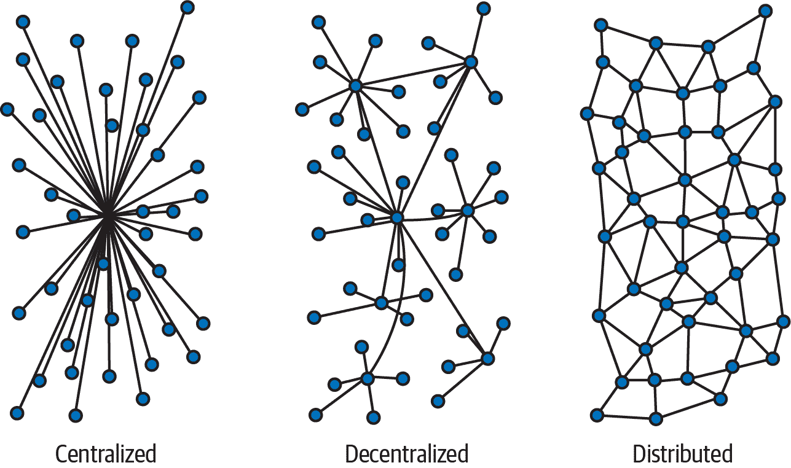
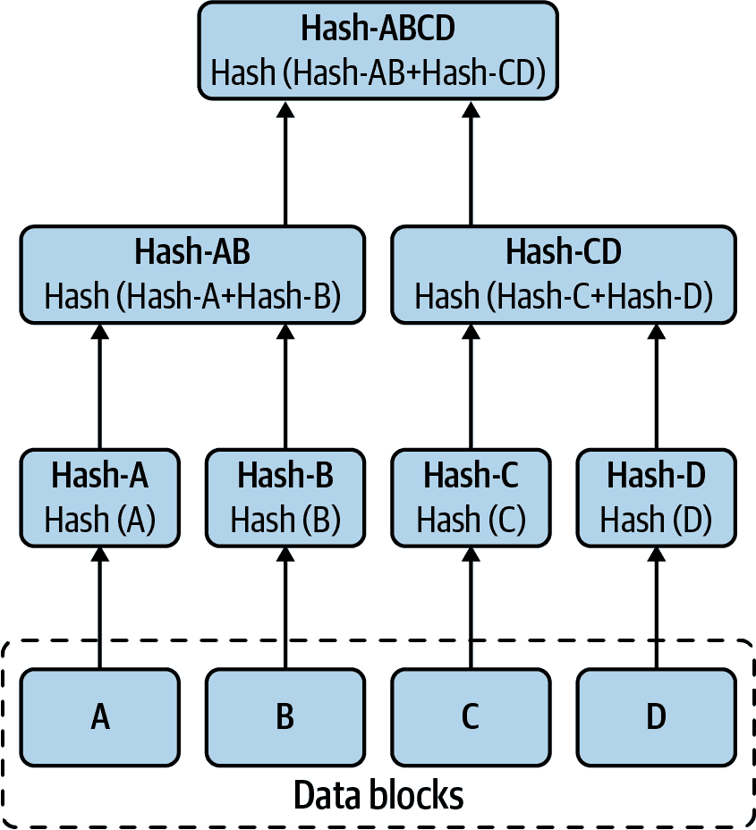

# 第一章。区块链基本概念

重要的是要理解，对于大多数人来说，区块链并不是一个简单的概念，如果没有对其起源、核心组件、架构以及围绕区块链的辩论有扎实的理解，就很难理解。区块链有许多略有不同的定义，引发了一些非常教条的意见，这让许多人在开始他们的区块链之旅时感到困惑。这种困惑是因为区块链不是可以触摸或看到的有形物体；相反，它是一种由算法、技术和对经济价值交换的新思想诞生的概念。

在这一章中，我们将通过首先简要介绍其起源的历史，来探讨区块链的基本概念。这些背景信息将帮助您理解为什么区块链没有单一的标准化和普遍接受的定义。

在我们讨论了区块链的起源之后，我们将简要介绍几个核心组件。然后我们将深入探讨其架构，接着是支持技术和概念。

在我们对核心组件的讨论中，我们首先从去中心化网络开始。然后我们涵盖了密码学。你可以将密码学看作是区块链的秘密武器，因为它是使区块链工作的关键。没有密码学，就没有区块链的用处。接下来，我们讨论账本实现。账本代表了区块链中的存储或数据库。它维护了由上一次提交的交易产生的状态，以及从账本创建之初的历史。

接下来，我们讨论共识，这是在节点之间找到“一致”的协议，是区块链的核心。共识提供了一种安全的方式来完成交易，而不依赖于普通交易系统中的传统中介。最后，我们讨论智能合约。区块链在执行复杂交易方面的能力直接源于智能合约的运用。您可以将智能合约视为软件程序。

本章将帮助您理解以下内容：

+   区块链的架构和核心设计组件

+   账本数据库和世界状态数据库在区块链中的工作原理

+   密码学（例如公钥/私钥或哈希函数）在区块链中的作用

+   区块链中使用的最流行的共识算法

+   智能合约在区块链系统中的工作原理

# 区块链是什么？

在普遍接受的定义中，*区块链*是分布式账本技术（DLT）的一个子集。分解 DLT，我们通过创建节点的点对点网络来实现*分布式*，这些节点是计算机；它们一起形成一个分布式网络（图 1-1）。每个节点处理客户端提交的交易。这些交易成为所有节点上的一个复制数据库的提交记录，称为账本。这个账本是不可变的，记录被分组成块。

###### 图 1-1\. 网络类型

每个节点维护着这个不可变账本的副本，通常实现为追加文件或数据库。区块链依赖于数字签名和共识来提交记录。大多数 DLT 不使用共识；相反，DLT 只需要存在数字签名就可以提交记录。没有共识，只有数字签名的交易。

记录被记录到不可变账本中。在这个只追加的数据库中，每条记录都按时间顺序排列，每个记录块都与之前提交的块进行了密码链接。每个块都包含附加的元数据，以及前一个块的哈希码和一组已提交的记录。这些记录通常由称为*Merkle 树*的哈希树表示（参见图 1-2）。

###### 图 1-2\. 默克尔树

这给了你一个大致了解区块链是什么。但当我们看它的起源、架构和组成时，我们可以开始获得更清晰的认识。起源解释了为什么定义分歧。区块链的架构是最容易理解的方面，因为它是最具体的主题，提供了整体视角。组成部分是一组传统技术和逻辑概念，每个部分都可以单独理解。通过检查这些组成部分，我们可以为掌握开发区块链智能合约和区块链应用所需的技能打下坚实的基础。请理解，区块链技术是建立在数字签名、点对点网络和几十年的先前工作等传统技术之上的。

区块链的产生是一种协同性的过程，当几种传统技术联合起来作为一个单一的、复杂的、集成的系统来执行基本任务时，它就形成了。许多人在讨论区块链时，将其视为数据库。其他人将其视为交易处理器。还有人将其视为一个去中心化的乌托邦，摆脱了任何中央控制的束缚，是重构社会的一种方式。区块链既是这些，又不仅限于此。不幸的是，这种范式是为什么难以理解区块链的基本概念的原因之一。

通常，新技术或发明都是通过单一目的或对问题的明确定义的解决方案来定义的。例如，NoSQL 数据库的概念很容易理解。即使软件定义网络也不难设想和定义。

许多人试图通过将其与采用区块链技术的加密货币比特币等同来理解区块链。这是因为区块链技术是促进比特币运作的基础机制，因此它们被视为一个整体。你应该明白，比特币是一个使用区块链技术的应用程序。比特币的用例是点对点的金融交易。要理解区块链，我们将其分解为离散的组件。然后你可以将它们组合起来，设想解决你想解决的问题的解决方案。

# 区块链的起源

大多数人认为区块链的诞生与比特币的开始有关——更具体地说，与中本聪撰写并于 2008 年发布的比特币论文有关。谁是中本聪？没有人知道，因为他们从未公开露面。他们可能是个人、团体、公司或者像美国国家安全局（NSA）这样的政府机构。尽管如此，中本聪仍然是个谜。

有人声称自己是中本聪，但从未提供过确凿的证据。因此，中本聪仍然是一个未知的人物。

在中本聪的论文《[比特币：一种点对点的电子现金系统](https://bitcoin.org/bitcoin.pdf)》中，你找不到 *区块链* 或 *区块链* 这个术语。你最接近找到的是 *区块链*。你必须去 *main.h* 的代码第 596 行才能找到 *区块链* 这个术语的第一个实例。

Satoshi 引用了八篇论文，其中包括斯图尔特·哈伯和 W·斯科特·斯托内塔的 “[如何为数字文档加时间戳](https://citeseerx.ist.psu.edu/viewdoc/download;jsessionid=C01131148AF17AF93F2655C091376AF4?doi=10.1.1.46.8740&rep=rep1&type=pdf)” ，其中包含短语*时间戳链*。毫无疑问，这启发了如何在比特币设计中将交易区块链接在一起。其他引用的论文必然影响了设计。首先是拉尔夫·C·默克尔的 “[公钥密码系统协议](http://www.weidai.com/bmoney.txt)” ，他因 Merkle 树而闻名（见图 1-2），这是一种广泛用于区块链的密码哈希树数据结构。另一篇具有重大影响的论文是魏·戴的 “[b-money](http://www.weidai.com/bmoney.txt)” ，在设计比特币成为用于对等价值交换的数字加密货币时肯定思考过。

## 区块链革命

比特币是点燃区块链革命的火花，但不是它的燃料。它还在比特币周围形成了一个具有强烈信仰和归属感的亚文化。这个稀疏而联合的社区，以“区块链只是无需许可”的共同信念为纽带，立即接管了比特币，并将其复制成了数百个版本。有些是相同的，有些是不同的，但所有人都团结在一个共同的论题上，这个论题代表了一个具有比特币可能的新世界的无政府主义者的观点。

## 区块链 2.0

在比特币之前，以太坊白皮书出现之前，Adam Back，以 [Hashcash](http://www.hashcash.org/papers/hashcash.pdf) 著称，于 2002 年撰写了一篇关于用于防止电子邮件垃圾邮件的工作证明系统。Nick Szabo 在 1997 年开发了术语 [智能合约](https://archive.is/wIUOA#selection-203.0-203.27)，并在 2005 年开发了 [bit gold](https://nakamotoinstitute.org/bit-gold/)，许多人认为这是比特币的前身。早在 1982 年，被称为数字货币发明者和盲签名发明者的 David Chaum 就已经在研究 [电子现金](https://www.chaum.com/publications/)。区块链概念有着丰富的历史，并且在 2013 年由 Vitalik Buterin 在 “[以太坊白皮书](https://ethereum.org/whitepaper/)” 中得以完整发展成为我们今天所认知的区块链 2.0。

在以太坊白皮书出现之前，我们拥有区块链 1.0，它为比特币提供动力，并代表着没有智能合约概念的区块链技术。在区块链 2.0 中，我们拥有智能合约技术，Buterin 在他的白皮书中表达了这一点。它促进了远远超出比特币能力范围的丰富交易，比特币只是一个简单价值交换的平台。有了智能合约功能，复杂交易的智能状态执行变得可能。正是区块链 2.0 开启了区块链革命、区块链演进以及吸引了 IBM、英特尔、甲骨文、亚马逊、微软等企业组织的关注，名单每天都在呈指数级增长。

到了 2015 年，在以太坊成为首个实现单一账本的区块链 2.0 平台之后，企业公司看到了区块链 2.0 的潜力。2015 年 12 月，Linux 基金会宣布创建 Hyperledger 项目。

我们在第二部分中介绍了 Hyperledger 项目，其中包含两章。 其中一章涵盖了项目和工具，另一章涵盖了 Hyperledger Fabric 的架构和组件。 这两章提供了您将需要的知识，用于第三部分，该部分涵盖了智能合约的开发、调用、维护和测试。 在下一节中，我们将高层次地讨论区块链的许多组件。

# 区块链的核心组件

区块链不是单一的源代码编译。 它可能有一个常见的可执行文件，但逻辑和物理组件共同工作以形成一个运行的区块链。 逻辑和物理组件的分离可能有助于在讨论区块链技术时产生您看到的混乱，以及区块链更像是一个概念而不是一个实现。 概念的实现正在迅速发展，并将随着越来越多的技术人员和企业家进入区块链世界而继续变化和转变。

常见组件构成了区块链的核心概念。 第一个是分布式网络。 第二个是密码学。 第三个是不可变账本。 第四个是共识。 第五个是智能合约。 这五个元素构成了你创建区块链概念所需的核心组件。 随着时间的推移，它们的实现方式将随着新的方法和算法的开发而不断发展。

你决定使用哪些组件将塑造你的区块链格局，并为新问题和现有问题创造丰富的创新解决方案生态系统。 没有规则。

## 分布式网络

区块链采用分布式网络（如图 1-1 所示）。 *公共区块链*允许任何人参与，而*私有区块链*则强制执行成员资格，只有具有有效成员资格的参与方才能参与区块链。

今天有两种被普遍接受的区块链类型：许可和无许可。*许可区块链*需要管理区块链机构来注册并授予成员资格参与。注册方可能只有阅读权限，或者只有写权限，或者读写权限。Hyperledger Fabric 是一种许可的私有区块链。

*无许可区块链*没有中央机构，任何人都可以参与。他们可以读写区块链。

网络可以是内部的或外部的，或者二者兼有。网络可以是自包含的，也可以是全球范围的。如今，我们在考虑区块链时，会把分散网络视为由节点组成。关于区块链的任何讨论、讲座或演示都会告诉你，区块链必须具有分散的节点网络。根据演讲者和目标受众的不同，信息可能会偏向于开放、封闭或混合网络，但它们始终是分散的。

## 密码学

*密码学*是区块链的血液。它是创造和保持秘密的艺术。自古以来，人们就需要创造秘密并发送秘密信息。今天，复杂的数学算法用于创建秘密。为了发送秘密信息，使用*协议*，这是连接和交流各方消息的规则。没有密码学，就没有区块链或分布式账本技术。密码学的主要用途是加密、密钥、哈希、签名、完整性、证明和防篡改。

### 数字签名

*数字签名*采用非对称密码学，其中使用私钥和公钥。密钥是伪随机生成的位串。私钥永远不会被揭示并保密。然而，公钥是公开的并分发给公众或指定的一方。数字签名算法使用私钥加密文本。只有公钥可以解密加密文本。因为私钥和公钥是一对，它们一起工作并促进了数字签名概念的创建。

数字签名有三个主要用途。第一个是*认证*。当某人用私钥签署区块链交易时，接收方可以使用该方的公钥验证签署交易的一方。

*完整性*是第二个主要用途。当消息被签名时，消息的任何更改都会使签名无效，接收方将知道消息已被篡改。

第三个重要的用途是*不可否认性*。当一方签署交易并提交后，他们不能后来试图声称他们没有提交交易，因为他们的签名可以在提交的交易上进行验证。他们只能声称他们的签名被盗，但这也可以通过使用属于提交交易的设备的额外签名来证明不是真实的，其中包括时间戳和可能指定位置的元数据。

### 散列函数

*散列函数*是一种密码学单向函数。该函数将数据作为参数接收，执行密码学任务，然后生成与输入数据唯一的字符串。如果更改输入数据的任何一位，输出字符串将更改。如果没有更改位，散列函数将始终产生相同的输出字符串。

在区块链中使用哈希函数意味着您不能更改数据，否则结果将不匹配记录的内容。通过将哈希输出链接成 Merkle 树，可以链接大量记录并存储在一个块中。这些块被哈希，并且前一个块的哈希是下一个块的一部分，从而创建了不可变的块链。

Merkle 树是一种哈希树结构，在此结构中，节点连续地进行哈希，直到创建一个单一的节点。此单一节点为整个树提供完整性。底部节点可以重新哈希和验证数据的完整性。

存在几种安全哈希算法，但 SHA-256 和 SHA-3 是区块链中主要使用的算法。

## 钱包

区块链中经常使用私钥和公钥。私钥用于签署交易并代表您想要保护和保护的秘密。您将您的密钥放在*数字钱包*中，就像您将信用卡放在您的物理钱包中一样。您可能为每个区块链拥有一个钱包，或者您可能为不同的应用程序拥有单独的钱包。钱包是您的密钥的容器。它们保护它们，管理它们，并可以促进签名的功能。

钱包的功能正在增长，并且它们变得越来越复杂。有*物理钱包*，可以插入您的 USB 并将您的密钥安全地存储在硬件隔离区中，还有*软件钱包*，可以存在于您的计算机或云中。随着时间的推移，钱包的功能和特性将继续增长和扩展。

## 共享账本

*共享账本*代表区块链中的数据库。与关系数据库不同，它没有标准格式。区块链共享账本有两个硬性规则。首先，它是不可变的，这意味着它是防篡改的。其次，它是有序的。顺序是按时间排序的。

这两条规则创造了区块链中使其如此强大的特性；一个按时间顺序记录的不可变交易。结合共识和密码学，共享账本提供了一种交付信任、透明度和溯源的机制。在 Hyperledger 中，账本分为两个组件：账本数据库和世界状态数据库。

### *账本数据库* 是一个二进制文件。区块被附加到文件中。每个对等方都在本地托管文件。该文件不能轻易阅读，因为它是为了性能而采用的二进制格式。工具和应用程序编程接口（API）可用于探索文件中的区块。通过探索组成账本数据库的区块，可以读取每个交易，如果需要，这允许文件复制到新节点。

账本数据库

### 世界状态数据库

*世界状态数据库* 是 Hyperledger Fabric 独有的。它是一个传统的数据库。你可以使用你喜欢的数据库。Hyperledger Fabric 默认使用 LevelDB，并通过配置支持 CouchDB。通过切换到 CouchDB，应用程序可以对世界状态数据库执行丰富的查询。它被称为世界状态数据库，因为它代表着区块链在任何时候的当前状态。

## 共识

区块链的核心概念是信任。*共识* 是区块链乌托邦特性的机制，它通过为不同方提供在今天的交易系统中所需的信任的手段来促进交易，而无需中介。

另一种理解共识的方式是：每次使用信用卡时，都会涉及几个中间人，每个中间人都会执行特定的功能并收取费用，你支付的费用包括购买金额和手续费。你可能看不到这些费用，但它们要么隐含在交易中，要么显式地计入其中，你支付了这些费用。在区块链中，共识机制执行了这种无需中间人的信任功能。

共识有许多实现方式。每种都旨在根据概率提供信任。这种概率是协议的函数。完全一致是很难实现的，并且需要大量时间和资源，而部分一致速度更快，需要更少的资源，但是存在风险。能够容忍多少风险取决于区块链治理，并决定用于达成一致的共识机制的属性。很少情况下，一致的概率会是 1 或 100%，通常而言，少于 100%的一致也是可以接受的。

存在许多共识算法，并且不断设计新的算法。你应该了解四种算法：工作证明、股权证明、实用拜占庭容错和已流逝时间的证明。

### PoW

*工作证明* （*PoW*）是比特币和以太坊（请注意，以太坊正在过渡到股权证明）中使用的共识算法。这种共识算法依赖通过解决一个密码谜题来产生能量。能量是由哈希率表示的，这是每秒生成的哈希数量。产生哈希需要有限的能量。这种能量就是用于生成哈希的电力。生产的哈希越多，需要的能量就越多。能源成本对能够生产的哈希数量至关重要。谜题是找到一个输入，使其产生具有一定数量前导零的哈希数。解决的复杂性或时间取决于指定前导零的数量。

对于比特币，前导零的数量会调整以保持求解时间在约`10 分钟`左右。根据进行哈希运算的矿工数量不同，这个数字会上下浮动。这种共识模型是能源依赖型的，因为消耗最多能源的矿工有更高的机会找到获胜输入，并因此获得比特币并提交当前区块。

### PoS

*Proof of stake* (*PoS*) 是一种依赖于区块链的随机化和利益相关的共识算法。存在几种 PoS 算法，但大多数都采用根据持有的硬币数量或持有的硬币的年龄等特定标准生成随机数的例程。生成的最低或最高随机数赢得并提交当前区块并获得奖励。一旦某个权益者获胜，他们的权益标准就会归零；这有效地将他们在下一轮中淘汰。

### PBFT

*Practical Byzantine fault tolerance* (*PBFT*) 是一种可以追溯到 1999 年的共识算法。PBFT 是基于领导者的非分叉算法。它要求所有节点都连接到所有其他节点。所有节点都是已知的，并且该算法不允许随机节点加入对等组。该算法支持最多三分之一的节点故障。只要不超过三分之一的节点出现故障，就可以达成共识。

### PoET

*Proof of elapsed time* (*PoET*) 是一种使用受信任执行环境（TEE）的共识算法。在这个算法中，随机对等体被选中以预定速率执行请求。选定的对等体对指数分布的随机变量进行取样。他们等待时间流逝，由取样决定，并且具有最小样本的对等体赢得选举并提交区块。

## 智能合约

区块链应用程序分为客户端、智能合约和区块链。*客户端*是用户（无论是人还是机器）与之交互以签署和提交交易的前端。提交的交易发送到指定的节点或对等节点，该节点接受交易并将其转发给智能合约。*智能合约*与区块链一起执行事务。智能合约与区块链之间的交互包括智能合约用于执行区块链公开的特定功能的 API（例如，读取或插入）。

由于区块链是一个不可变的分类帐，智能合约实际上不能对区块链执行许多功能。智能合约可以添加或读取数据，但更新数据实际上是一个更改当前状态的添加数据功能。智能合约不能删除数据，即使它可能执行用于删除数据的 API。删除是状态的更改。这种删除会导致读取返回无数据，但数据实际上是存在的。

数据可以通过使用称为*区块链浏览器*的特殊应用进行审计。这个特殊程序在最低层次读取不可变分类帐，有效地遍历块的数据结构并读取记录的数据。智能合约也可以做到这一点，但这不是一个典型的用例。

智能合约最好用于读取当前状态，在状态上执行逻辑，并更新（添加）状态。请记住，区块链分类帐是一系列记录数据的不可变链表。这些数据代表了状态。因此，区块链实际上是一个状态转换的运行分类帐，是不可变记录的日志。这是非常强大的。智能合约的客户端通常执行应用级逻辑并提供用户体验（UX）。客户端不仅充当智能合约的接口，而且在很多方面，它们代表用户的应用程序。

关于智能合约要记住的一件事是它并不是那么智能。它位于客户端和区块链之间。这实际上是件好事，因为你不希望智能合约工作得太辛苦。

你不想在客户端和账本之间进行大量的往返——例如，读取一千次来填充列表。你希望告诉智能合约读取一千个状态并将它们发送到你的客户端。这执行了对智能合约的单个调用，这是一种昂贵的资源，而且智能合约可能会在账本上进行批量读取。

典型接口是异步的，所以请记住并有效地使用你的回调函数。试着给用户一种大量工作正在进行的感觉，而实际上，区块链是一只乌龟，而不是我们成长过程中熟悉的兔子式数据库。明智地使用，智能合约是强大的工具；它们可以为你工作，也可以反对你，所以要考虑你是如何使用它们的。作为智能合约开发者，你总是希望把客户放在首位，并根据我们所讨论的内容为他们提供最有效的 API 支持。

# 区块链架构

区块链的架构由一个分散和分布式的节点网络组成。每个节点托管一个不可变账本的副本。不可变账本是一个密码链接的追加只读区块集合。节点执行交易和共识以将区块添加到账本中。客户端对交易进行签名并将其提交给节点。节点将经过验证的交易转发给智能合约进行执行。执行的交易被排序并放入区块中。这些区块被追加到区块链上。区块链的核心设计包括区块、链和网络。

## 节点

计算机被称为 *节点* 是因为它们在创建分布式网络中所扮演的角色。它们可以是由物理服务器托管的云中的虚拟机。它们可以是参与分布式网络的笔记本电脑。它们可以是在分散工业网络中运行的物联网设备。它们甚至可以是智能灯泡。 *节点* 是一个表示网络中端点的通用术语。网络可以是有线的或无线的。节点的另一个名称是 *同伴*，就像点对点网络中的同伴一样，这些网络被设计用于分散应用程序。

对于超级账本 Fabric 区块链，你会遇到这两个术语。在超级账本 Fabric 中，术语 *节点* 代表执行交易的认可和提交的计算节点，并托管不可变账本。在比特币中，节点是 *矿工*，像超级账本 Fabric 的节点一样，提交交易到账本。

## 区块

*区块* 包含提交和确认交易的记录。每个区块还包含一个头部、一个时间戳和前一个区块的哈希值。第一个区块，称为 *创世区块*，包含描述区块链的其他信息，比如政策。如果它在像超级账本 Fabric 这样的权限区块链中，创世区块将包含一个成员组织及其证书的列表，以及描述必须背书交易的组织数量的策略信息。它还将包含负责订购交易和创建同伴追加到区块链的区块的订购者节点的标识。

区块包含用于链接区块并提供完整性约束的附加数据，防止对区块中包含的数据进行任何篡改。区块被链接在一起，区块的这种链接负责术语 *区块链*。

加密学被用于创建和维护区块链数据结构和链接。由于使用了加密学，区块是防篡改的。

区块一起代表不可变账本，并且许多人将它们称为区块链*数据库*。区块附加到上一个创建的块上。随着时间的推移，这个附加过程会创建一个大型的数据结构，必须加以管理。其他数据结构也在使用中，比如图，它们不是线性的，并且创建类似网络的数据结构。交易中的数据并不总是存储在区块中，可能托管在传统数据存储中，比如文件或现有数据库技术。

## 链

*链*是一个区块链的链表。它们是不可变的且仅追加的。区块链架构可能具有一个或多个链。链可以无限增长，或者说是区块数量。这可以通过修剪来预防或管理，但修剪会产生降低区块链网络信任的副作用，并且会移除探索和审计整个链的能力。这会降低链的完整性。

## 通道

Hyperledger Fabric 中的每个区块链被称为*通道*，这是一组组织合作执行与特定目的相关的交易的财团。 Hyperledger Fabric 中的组织可能属于多个通道。比特币和以太坊使用单个主区块链和多个用于测试目的的区块链。

# 支持技术和概念

超越组件（分散网络、加密学、不可变账本、共识和智能合约），你需要理解，或至少意识到，许多概念和支持技术，以便为理解区块链打下坚实基础。让我们介绍每个概念和支持技术，这样你就可以在区块链之旅中进一步探索和增进知识。

## DLT

*分布式账本技术*是区块链的前身。使用 DLT，你只使用数字签名，不使用共识，因为你希望具有规模和高吞吐量。正是共识导致了区块链的高延迟和规模限制。这就是为什么你会看到像 Corda 这样的 DLT 在金融和保险行业如此受欢迎的原因。当参与者之间存在半信任时，如保险和银行业，你可以通过依赖数字签名来强制实施补救措施；你可以使用 DLT。但是当你需要信任机制来强制参与者之间的完整性，如供应链时，你会选择区块链，因为共识机制提供了这种保证和信任水平。

## 去中心化

区块链是一种*去中心化*技术。账本由一组点对点节点托管，形成去中心化网络。去中心化的概念是通过去除中央控制点而产生的。将控制权委托给所有协作节点执行网络目标的能力，赋予了区块链力量。这种委托控制和协作提供了在没有中央权威影响结果的情况下执行共识的手段。

## 点对点

区块链网络是*点对点网络*。网络设计为去中心化。在去中心化网络中不存在中央控制，并且每个节点与网络中的一个或多个节点相连接。节点合作在网络中发送和转发消息。使用像 Gossip 这样的对等友好协议允许消息在网络中快速复制。这使得数以百万计的节点在几秒钟内接收消息成为可能。点对点的去中心化网络有助于保持区块链账本的副本。

## 不可变性

*不变性*的概念，即不可改变或防篡改，对于区块链至关重要，因为这是分类帐的主要属性。信任是从不变性的概念和实施中创建的。知道按时间顺序排列的交易是不可变的，允许各方建立信任和最终性。

## 身份

区块链和智能合约需要身份来运行。*身份*代表参与执行智能合约交易和区块链管理的实体（人类和机器）。对于企业区块链，作为成员的组织登记身份来代表它们并代表组织执行交易。身份被分配私钥和公钥用于数字签名和数据加密。数字签名验证身份并授权其执行交易。

## 账户

区块链中的账户概念使我们能够为单个身份执行各种角色并执行多种功能。*账户*是定义特定访问权限和授权以执行属于或由账户管理的资产上的交易的属性记录。角色被创建并分配给一个账户。角色定义了映射到账户的一组权限。身份被授予一个角色，该角色允许身份执行角色允许的账户上的操作。这意味着我们不需要为每个被授予权限在区块链上执行交易的账户创建和管理一个身份。账户允许我们对一个或多个身份可用的角色和权限进行分区。账户可以保存各种形式的状态，并作为区块链上的可信实体进行交易。

## SDK

*软件开发工具包* (*SDK*) 用于集成或开发区块链软件。大多数开发人员都熟悉这个组件，因为许多应用程序提供了一个 SDK 来开发其应用程序的软件。区块链也不例外；大多数区块链平台都提供一个或多个 SDK，每个都针对特定编程语言和平台的特定组件。Hyperledger Fabric 有多个可用的 SDK，包括 JavaScript、Java 和 Go，用于开发 Fabric 区块链应用程序。

## API

*应用程序编程接口* (*API*) 是应用程序和客户端之间的软件合约，表示为一组方法或函数。API 可以通过 SDK 或作为 RESTful 接口来实现。API 定义了可执行的可用函数。一些 API 有数百种方法或函数可供调用，以执行各种交易。其他可能只有少于十几个，并且针对非常狭窄和特定的应用程序功能集。

API 是客户端和应用程序之间的中间接口。它必须被良好管理，并支持应用程序生命周期的持续演进。版本控制通常用于控制和提供方便的迁移至新功能或弃用功能。

区块链是一个应用程序，并拥有一个 API。智能合约嵌入和向客户端公开的是 API。嵌入式 API 和公开的 API 并不是同一个中间接口。*公开的 API* 用于区块链智能合约设施的客户端，而 *嵌入的 API* 是智能合约设施与负责操作节点或对等体的核心区块链软件之间的内部合约。智能合约设施可能由节点或对等体托管，也可能不是。

## 交易

客户提交*交易*。这些交易由节点或对等方处理，如果被接受，就会被提交到一个区块中，然后追加到区块链中的区块链。交易可以是任何内容，可以是关于资产的数据更新，或者是支付服务费用，也可以是购买产品。它们可能只是记录代表已知状态的信息或执行操作。交易可以源自人类客户或机器客户。区块链中的交易始终带有时间戳并且有序。它们是不可变的，不能被篡改的。当提交交易进行处理时，交易会使用私钥签名，并根据区块链对交易提交的权限进行身份验证。

## 激励

激励因素很少在区块链中讨论，这妨碍了许多区块链项目的成功。在区块链中，需要一个强大的*激励*来创造成功所需的行为。比特币的矿工知道什么是激励，因为这是驱使他们进行挖矿的原因。因此，他们为客户执行交易并维护不可变的、可信的区块链，从而为客户提供所需的价值交换，而只需支付少量费用。他们的激励是如果能解决密码难题就会得到奖励。奖励是用比特币表示的一笔可观的货币补助。

对于企业中的区块链，很少或没有类似比特币或以太坊的激励。缺乏激励是许多项目未能成功的主要原因。没有强大的激励，外部合作伙伴就没有理由对改变他们成熟的业务流程感到兴奋。他们只看到增加的成本和风险。如果有的话，财务建模也不足以让他们相信这是执行业务流程的更好、更有效的方式。

## 隐私

保持数据和交易参与者的身份私密是区块链中的一个主要关注点。有选择地披露并操作不能暴露的数据对区块链的发展至关重要。当多个参与方需要进行交易和交换信息时，他们应该遵守*数据隐私*。同样，当特定方需要所需数据来执行他们在复杂交易中的部分时，该数据必须保持私密。

直到最近，区块链的一个弱点是无法在复杂交易中混合不同级别的隐私。Hyperledger Fabric v2 支持执行带有私有数据的交易的能力。在 Hyperledger 内部，正在进行零知识证明（ZKPs）的工作。这种密码学有助于在不披露用于确定事实的源材料的情况下证明事实。想象一下验证年龄而不提供证明年龄的文件。这是强大的，因为它将允许保护交易各方隐私的交易。因为区块链是一个链接账本，密钥可以代表各方或地址，所以可以建立揭示足够信息的配置文件，这可能会减少一方认为自己拥有的隐私。这在比特币和以太坊中是真实存在的。

## 状态

区块链有历史，但我们最常想要的是*状态*。作为一个不可变的状态转换账本，区块链是为此而构建的。但当我们将区块链投入使用时，我们发现它的力量体现在当前状态上。我们相信这个状态，因为我们知道它是辛苦赚来的，经历了一系列验证和密码学证明的考验。我们享受这种防篡改的知识，这给状态增添了更多的价值。

但是状态并非历史。区块链拥有历史，但我们发现访问历史昂贵，并不是区块链真正擅长的事情。尤其是在规模化方面。因为在规模化的情况下，一切都集中于捕获状态、达成共识并提交它。我们已经学会保持状态的新鲜性、缓存，并把历史存储在传统数据库中。如果我们需要证明历史，我们可以遍历分类帐并证明历史。但历史毕竟是历史。状态才是重要的。你根据状态做出决策，状态可以是一个滚动记录，比如到目前为止的销售额。你不需要运行报告来获取状态。

这是一个巨大的变革和生产力的巨大提升。区块链将改变世界，因为世界将了解当前状态，现在，而不是明天，或者本周或季度末。保持准确和可信的状态的能力是一个强大的工具，由智能合约开发者利用，赋予决策者（无论是人还是机器）权力。

## Turing complete

在区块链中加入*Turing complete*概念是区块链与比特币分道扬镳的转折点。这使得区块链成为了 21 世纪智能交易引擎的核心。智能合约需要是 Turing complete 和确定性的，以达到最终性。确定性使它们能够去中心化并实现规模化。Turing complete 和确定性能力使共识机制能够执行中介功能，提供达成状态和最终性协议的方式。

## Gas

以太坊采用了 *gas* 的概念。这意味着你需要支付计算费用，计算费用是根据你执行的指令来计算的。这个概念并不新鲜；主机计费用户的计算费用，并根据 CPU 时间计算费用。在网络世界中，这是一种明确的成本。我们都支付计算费用，但由于访问层次和使用的资源，我们无法对其进行量化。我们能接近 gas 模型的最接近例子是亚马逊网络服务（AWS）云计算服务，其按资源和使用时间收费。AWS 比以太坊的细粒度成本模型粗略得多。

以太和所有加密货币的波动性对于试图在以太坊平台上预算和启动应用程序是有问题的。在 AWS 上，货币是美元，所以你对于启动和预算所需资源的长期成本有一个合理的期望。你的成本实际上从一天到另一天甚至从一分钟到另一分钟都不会变化，就像在以太坊上一样。

除了 gas 成本之外，你还在使用共享资源，因此直接与其他希望执行其应用程序并愿意支付更高费用的人竞争。这可能导致你永远无法执行你的交易，或者在达到目标所需的时间段内执行它们。

## 代币

大多数人会将代币等同于加密货币，但它们正在演变，并将随着它们与比特币和另类币社区越来越远而不断演变。*代币* 是一种可以交换的数字凭证。代币可以分类。

第一个是*加密货币*，也是第一个区块链代币。请注意，加密代币已经存在很长时间，并且已被用于各种用途，如身份和元数据。最新的代币，是加密货币的衍生品，被称为*稳定币*。它被称为稳定币，因为其代币价值被设计为等于另一个代币、货币或资产的代币价值，而后者不会出现大幅波动。术语*锚定*表示稳定币与其他代币、货币或资产之间的这种价值关系，稳定币被设计为与之价值相映。例如，与美元挂钩的稳定币在任何时候都被赋值为一美元加减很小的价值变化，大约是百分之一或千分之一美元。稳定币是由高盛和 Circle 推广的，旨在为加密货币创造稳定，并为已建立的公司探索加密货币提供一种手段。

在区块链世界中，加密代币被分类为加密货币、安全代币和实用代币。你会发现各种其他名称，但你需要专注于安全和实用代币。

*安全代币*通过各种方式向投资者出售，包括首次代币发行（ICO）和安全代币发行（STO）。安全代币被视为证券，受美国证券交易委员会（SEC）监管。因此，未经 SEC 注册，你不能出售（发行）它们。它们在法律上与股票无异。

*实用令牌*类似于以太坊的气体。这些是您可以出售的代币，但没有与之相关的投资氛围。区块链使用实用令牌作为内部运营手段。创建和尝试出售实用令牌存在风险。您应该与法律专业人员进行交谈，并寻求 SEC 的无行动信函。您可以通过提交一份详细的计划来实现这一点，该计划解释了您将如何使用实用令牌。一些公司已经收到了 SEC 的无行动信函，并作为 SEC 认为实用令牌的典范。实用令牌不会升值，可能会贬值，但与其购买无关联的回报。它们通常等于一美元，并且可以兑换成一美元。托管账户保存用于交换实用令牌的资金。

代币是智能合约开发和区块链使用中创新的激动人心的机会。它们可以是智能的，具有价值，并代表资产和权利。

## 在链上

当我们 在区块链上执行工作时，这被称为*链上*。或者，当我们在区块链上存储数据时，它可能被称为*链上数据*。在决定在链上存储什么数据时要慎重，因为今天的区块链不适合作为数据仓库。你应该将交易数据存储在链下（接下来解释）。当你想要快速执行大量交易时，你应该调查在链下执行交易。

## 离链

将工作从区块链上移走并在区块链之外执行的能力称为*离链*。一旦离链工作完成，结果就会被移回到链上，通过共识提交到区块链。如果你想要执行 10,000 次快速交易，将它们汇总成一次交易，然后将那一次交易移回链上，提交给共识并提交到区块链，这是合理的。离链交易可以记录在所谓的*侧链*上，也许通过分布式账本技术（DLT）实现快速执行。交易的默克尔树（在图 1-1 中 previously 展示）被放入一个交易中，并放置在链上以供共识和提交到主区块链。

## 可扩展性

可扩展性是区块链最大的问题之一。区块链采用共识，这使得交易处理出现延迟。达成一致，这是共识的核心，需要时间。如果你想实现扩展，你需要消除时间。你不能大规模达成共识。大量的研究和工作正在进行以解决这一问题。

金融和保险部门决定只使用分布式账本技术（DLT），如前所述，这种技术不使用共识。它们可以这样做，因为它们的部门由于受到高度监管而具有信任的要素。对于像供应链这样的部门，需要双方之间存在信任。这种信任是通过中介实现的。使用中介带来了显著的成本，无论是以美元计价还是效率方面。区块链的承诺和吸引力在于，通过使用共识，消除或大幅减少对中介的需求。可扩展性是所有区块链项目在应用设计中必须规划的关注领域。

## 加密货币

比特币是一种*加密货币*，或数字资产，设计用作货币。存在数百种加密货币。你可以将加密货币视为数字现金。这是其设计的灵感，但这种设计未能实现。相反，它已经成为一种像黄金一样的资产，有着虔诚的追随者和每天交易的市集，价格波动。

很少有供应商接受加密货币，因为它具有波动性。法定货币，如美联储发行的中央银行货币，在大部分时间里都是稳定的。它也可能经历大的波动，但不像加密货币那样具有波动性。

大多数人将加密货币视为高风险的长期投资，希望其升值，或者作为交易工具，试图利用其波动性。中央银行现在正在考虑转向发行加密货币，并采用术语*数字现金*，因为它对跨境和贸易融资支付有许多好处。

加密货币得到区块链技术和分布式账本的支持。通过使用加密货币和区块链，中央银行和政府将能够扩展和控制加密货币的流动和使用，而他们无法控制现金。

## 隔离区

当您需要签署交易时，必须使用您的私钥。每当您访问您的私钥时，您就会面临攻击和可能会破坏、损坏或窃取您的私钥的事件。如果您的私钥出现问题，那么任何需要它进行访问的内容都将丢失。您可能无法恢复您的私钥，因此资产或授权的访问将永远丢失。

你可以把你的密钥和任何其他数字资产存储在一个**隔离区**中，用来代表你执行交易签名。隔离区有硬件和软件两种形式。它们就像私人保险库，没有秘密密码或复杂仪式就无法进入。使用隔离区可以防止密钥暴露，从而保护和保障它。隔离区也可以执行它们自己的交易，因此它们可以用来执行你想保密的例行程序。

摩根大通的 Quorum 区块链，一种修改过的以太坊克隆版本，使用一个隔离区来执行其密码功能，提供了一个由监管金融机构保证的安全级别。Hyperledger Sawtooth 区块链使用英特尔的软件保护扩展（SGX），这是一种硬件隔离区。Sawtooth 使用隔离区来执行其 PoET 共识算法的安全版本。

## 神谕

当区块链需要外部数据或验证内部提交或生成的数据时，它会访问一个**神谕**。这是一个可以获取信息的 API、接口或网站。

一个智能合约，比如一个赌博应用、黄金期货应用或贷款应用，需要知道外部信息。赌博应用需要知道昨晚谁赢了比赛，因此它会从 *USA Today* 体育页面或提供体育比分结果的付费网站获取结果。黄金期货应用访问 *华尔街日报* 或付费经纪网站获取当前黄金价格。贷款应用访问发布当前利率的网站。

神谕也可以是其他智能合约。神谕背后的理念是它是一个外部的、可信的信息来源。

## DApps

*去中心化应用*，或*DApps*，是基于智能合约的应用程序，旨在提供与网络上发现的应用程序相同类型的应用，从游戏到金融应用。与网络应用不同，DApps 需要手续费才能运行。虽然存在许多 DApps，但除了用于交易虚拟商品的几个之外，很少有取得巨大成功的。最受欢迎的是赌博 DApps，在美国是不允许的。DApps 由于用户体验和运行所需的费用而遭受影响。

DApps 尚未进入企业领域，但随着企业采用区块链和普遍采用的混合区块链的推出和传播，它们可能开始出现并发生转变。混合区块链跨越企业和公共空间，并且按照联邦设计模式进行架构设计。目前还没有这样的区块链存在。

## 虚拟机

在区块链中，当我们谈论*虚拟机*（*VM*）时，我们谈论的是智能合约引擎。第一个区块链虚拟机是以太坊虚拟机（EVM），它建立了区块链 2.0。从那时起，它已被其他区块链克隆、扩展和增强。虚拟机执行智能合约。

## 分叉

当区块链因任何原因分割时，就会产生一个*分叉*，这是一个分叉的区块链，从而创建了两个版本的区块链。这可以被视为一个负面或正面的事件。如果所有参与者都同意分叉并进行管理，那么它就是积极的。这可能发生在需要更新、在区块链软件中找到严重的错误或发生了破坏性事件并需要进行纠正时。

## 治理

如何管理和控制区块链由*治理模型*或功能决定。治理对于区块链的运作非常重要，没有治理，区块链将无法长久存在。它需要治理来管理生命周期，包括升级、故障、参与者规则和运营约束。

## 创世

账本中的第一个区块称为*创世区块*。这个特殊的区块标志着区块链的开始。它将包含只有创世区块需要的附加数据，比如描述账本特定特征和属性的元数据。

## 客户端

*客户端*通过将交易提交到区块链上。客户端将使用他们的私钥（或密钥）对其交易进行签名，并将签名的交易发送到区块链节点。然后，节点通过将接收到的交易发送到已知节点来复制这些交易；最终，所有节点都有客户端交易的副本。客户端可以托管钱包来存储他们的密钥，并安全地维护已提交交易的收据。

# 摘要

本章涵盖了大量信息，帮助你开始理解区块链的概念。我们从讨论区块链的起源开始。然后我们讨论了几个区块链的一般组成部分，接着是它的架构、共享账本、密码学、共识和智能合约组件。我们保持讨论在一个较高的水平，这样你可以消化基本概念，并根据我们提供的知识制定自己的解释。我们希望随着你的区块链之旅的继续，你能更详细地研究每个项目，并掌握智能合约开发。

在第二部分中，我们将讨论 Hyperledger 项目和工具，随后是 Hyperledger Fabric 架构和组件，为你提供第三部分所需的知识，我们在其中涵盖了使用 Hyperledger Fabric 进行智能合约开发。
