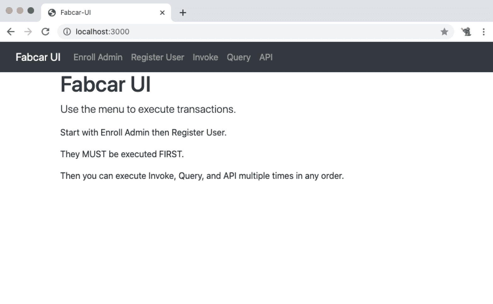
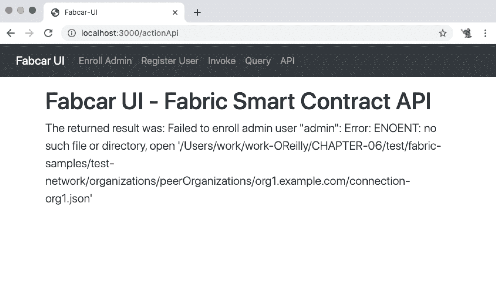
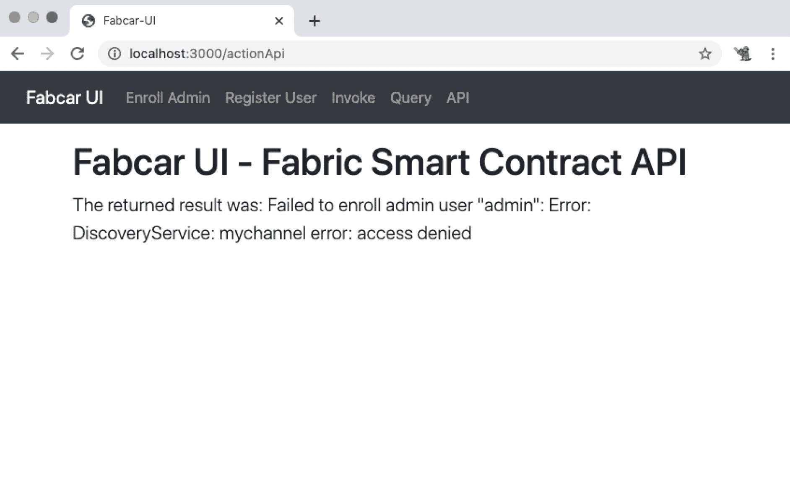
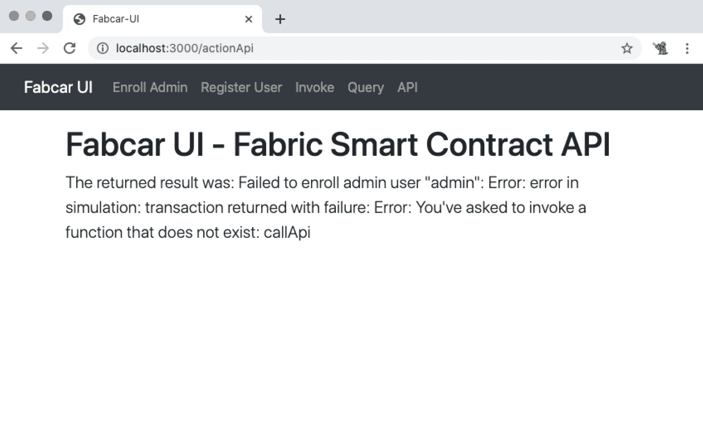

# 第六章。测试与维护

欢迎来到第 III 部分的最后一章。智能合约的生命周期与其他软件相同。一旦软件开发、测试和部署完成，我们的注意力就转移到维护上。

许多活动都是为了测试和维护软件的整个生命周期。这些活动分为两大类：技术和非技术。我们关注的是修改软件的技术活动。在维护期间，修改通常是修复问题或添加新内容。当发现错误时，需要纠正它们，因此会创建一个维护任务来修复错误。当要求新功能或能力时，会创建一个维护任务来向软件添加一个或多个新功能。有时，重大修改可能会导致发布新版本的软件。这也适用于智能合约的客户。这些活动会持续到软件被淘汰。大部分软件生命周期都被维护消耗掉。在修复错误或添加新功能时，测试对于成功至关重要。

在整个生命周期中，包括开发和维护阶段，测试活动被依赖于以确保软件按预期工作并满足功能和非功能要求。测试可以以许多方式执行，关于如何进行测试有几种不同的学派存在。无论你遵循哪种学派，都会对智能合约的开发和维护产生良好的效果。测试可以是正式的、非正式的，或者两者的结合。选择权在你手中。

本章分为四个不同的部分。第一部分介绍了一个智能合约维护任务，该任务将一个 Web UI 添加到 Fabcar 智能合约中。我们提供了代码，为您提供了一个可工作的 Web UI 客户端应用程序示例。*fabric-samples* 和 SDKs 并没有提供任何 Web UI 示例。相反，提供了命令行客户端。我们为您提供了一个 Web UI 智能合约客户端，以启动您的智能合约客户端开发，并作为智能合约维护任务的示例。使用 Web UI 客户端，您可以对智能合约进行端到端测试。您开发的大多数智能合约都需要一个或多个 Web UI 客户端。您可以像测试其他 Web UI 客户端一样测试智能合约 Web UI 客户端。使用 *test-network* 测试智能合约可能会很慢，很困难。特别是在系统或集成测试之前，您希望有一种快速迭代的方式来构建智能合约 API，该 API 由您的智能合约功能或交易表示。

第二部分将指导您设置快速测试智能合约的环境。这个设置有很多步骤，但提供了一种快速迭代测试智能合约的方式，而不需要启动测试网络并经历耗时的停止-部署-启动开发周期。通过本节将学到的方法，测试智能合约功能快速简单。然而，其他系统组件（如对等方、排序器和数据库）支持您的智能合约功能，测试这些组件可能会有问题。在测试智能合约功能时，您需要访问这些组件的日志文件以查看和理解它们的输出。

在第三节中，您将了解各种组件提供的可用日志。您可以使用 Hyperledger Fabric 提供的这些日志来帮助支持您的开发、维护和测试活动。在第四个和最后一个部分中，您将了解单元测试，这对于维护代码质量至关重要。

本章将帮助您实现以下实际目标：

+   在 Fabric 应用程序中处理错误和处理响应

+   测试和调试 Fabric 智能合约

+   在 Fabric 智能合约上运行单元测试

+   遵循识别和审查日志的最佳实践

# 创建 Fabcar UI 客户端

Fabcar 智能合约没有 Web UI 客户端，因此，在一个示例维护练习中，我们添加了一个。我们已经通过将 Fabcar 命令行可执行文件合并到 Web UI 应用程序客户端中为您创建了客户端。您可以从[*https://myhsts.org/hyperledger-fabric-book/*](https://myhsts.org/hyperledger-fabric-book/)下载客户端代码。然后，跟随我们在本节中的代码进行，以向您展示如何轻松地将 Web 客户端添加到智能合约中。在我们深入代码之前，让我们讨论一下处理错误响应。

## 错误响应处理

Fabric 可以部署在本地或云端，或者采用混合架构。Fabric 的部署位置不应更改预期的错误或成功响应。如果存在配置错误，则会收到错误响应。我们将在本节的后面看到一些错误和成功的响应。

应该采用与 Web 和软件开发中处理错误和成功响应相同的最佳实践。捕获您的错误，如果有额外信息可用，则增加它们，并以可读和可理解的格式向用户呈现错误或响应。错误应记录以进行分析和更正。

大多数智能合约的错误处理是透明的，并封装在一起形成一个连贯的分布式网络和应用架构的 SDK 和中间件中。这种分布式架构可以使用诸如 Docker 等虚拟技术构建，该技术在设计、操作和管理应用程序以及响应行为方面提供了灵活性。Fabric 提供了一个适用于在单个笔记本电脑、云环境或自定义环境上开发智能合约的虚拟化架构和操作环境。您选择的方法和工具将取决于个人偏好和提供的资源，但预期的响应应在所有环境中保持一致。

我们使用 JavaScript 和 Node.js 实现了 Web UI 应用程序，我们将其命名为 *fabcar-ui*。无论客户端框架如何，SDK 的响应都将相同。用于智能合约开发的语言与用于智能合约客户端的语言无关，并且不应更改响应。

通过设计企业应用程序 API，我们可以在我们的智能合约和客户端之间建立合同接口，为响应的外观和错误响应处理提供蓝图。我们甚至可以将这一工作延伸到设计特定于智能合约的 API，打包成应用程序库，供新的和现有的企业应用程序使用，定义期望的错误和成功响应。这使得维护和测试变得更加容易、一致和可重复。这种标准化支持将智能合约响应扩展到现有应用程序的能力。

## Fabcar UI 网页

Fabcar UI 的界面着重于简洁。它将 Fabcar 智能合约客户端应用程序可执行文件包装在 Web GUI 中。我们不想改变任何功能代码，并且希望保持可执行文件功能的分离。我们希望最终得到一个简单的 Web 应用程序，您可以扩展、实验，并且可能用作测试工具，同时也为您提供一个简单的智能合约 Web 应用程序示例。

作为我们的客户端平台的 Node.js，我们选择了流行且易于使用的 Express 框架。Express 使创建小型 Web 应用程序变得简单。对于生产应用程序，像 Angular、React 或 Vue.js 这样的框架也可以使用。应用程序可以通过企业发布的 API 利用智能合约服务。这允许进行受控维护和测试，以确保质量控制。让我们来看看 Fabcar UI 的 Web 页面。图 6-1 显示了主页。



###### 图 6-1\. Fabcar UI 主页

这个简单的网页显示了应用菜单和使用 Fabcar UI 的说明。查看菜单栏，您可以看到我们在 第五章 中探讨的每个 Fabcar 智能合约命令行应用程序的菜单项。

在最右侧有一个标记为 API 的菜单项。我们称之为 API 是为了通用性，因为它加载一个用于调用我们的新智能合约函数 `callApi` 的页面。我们稍后会实现这个新函数，但在实现之前，我们将使用 Fabcar UI 调用不存在的函数，并查看返回的错误响应。然后我们将实现它并看到成功的响应。

阅读主页面显示的说明，您可以看到 Fabcar 智能合约执行顺序与命令行版本中保持一致且是强制性的。Fabcar UI Web 应用的目标是镜像命令行应用，但具有 Web UI，并保持简单，以使 Web 应用代码与 Fabcar 智能合约特定代码之间的分离清晰。这种设计有助于快速迭代和添加新功能和特性，潜在地成为测试工具。

*fabcar-ui* 的用户界面响应灵敏，可在任何能够运行现代浏览器的设备上运行。所有网页都采用相同的布局设计：一个菜单，一个按钮，以及用于指导和响应的文本显示。响应以文本形式显示，没有任何格式。让我们逐个审查每个页面，从注册管理员开始。我们不会展示所有页面，因为它们都是类似的。

### 注册管理员

我们将注册管理员页面添加到我们的*fabcar-ui*中。单击注册管理员按钮将执行`enroll`事务请求。其他页面——注册用户、调用、查询和 API——看起来和功能类似于注册管理员页面。

### 注册用户

注册用户页面的功能类似于注册管理员页面。单击注册用户按钮将执行`register`函数，该函数使用`Admin`来注册用户。这就是我们为什么需要首先执行注册管理员页面的原因。单击按钮后显示的成功响应如下：

```
The returned result was: Successfully registered user "appUser" and imported user into the wallet
```

### 调用

现在，`wallet`中具有`Admin`和`User`身份，我们可以执行`invoke`和`query`函数。

当我们单击调用按钮时，我们执行`invoke`请求。此请求将调用 Fabcar 智能合约的`invoke`事务。此事务将记录添加到账本中。以下是成功响应显示：

```
The returned result was: Transaction has been submitted
```

`invoke`函数可以被多次执行。

### 查询

查询页面将显示账本中的记录，其中包含由 `invoke` 添加的记录。单击查询按钮将显示记录。

客户端的 `invoke` 函数生成一个随机数并将其附加到字符串 `CAR0.`，这样我们就可以多次执行 `invoke` 交易并看到一个唯一的响应。

### API

最终页面是 API 页面。它也有一个按钮并显示一个文本响应。当点击按钮时，将执行 `callApi` 请求，该请求调用 `callApi` 智能合约交易。我们尚未将 `callApi` 交易添加到 Fabcar 智能合约中，因此当我们点击 API 按钮时，我们将收到一个错误响应。

现在我们已经查看了 Fabcar UI web 应用程序的网页，让我们来审查一下代码。

## Fabcar UI 代码

我们不会详细查看所有代码，因为我们在第五章中已经涵盖了与智能合约相关的代码。我们想要关注的是新代码，这样你就可以修改或扩展它以学习或为自己的目的使用。

我们使用 Node.js、Express 和 Jade（一种模板工具）开发了 Fabcar UI web 应用程序。主文件是 *app.js*，可以像这样使用 Node.js 执行：

```
node app
```

这会启动一个 web 服务器并监听 localhost 和端口 3000。一旦启动，你可以打开浏览器并访问 *http://localhost:3000* 来显示 Fabcar UI 的主页面。主文件 *app.js* 包含 Express 设置，应用程序的 `views`（我们查看的页面），以及 `actions`（由按钮执行）。按钮调用 `actions`，而 `actions` 映射到执行智能合约客户端代码的 `handlers`。让我们来看看 *app.js*。

代码开始时导入了`handlers`——每个函数一个。每个函数都是来自 Fabcar 客户端命令行版本的代码。在导入之后，我们设置 Express 指向我们的`views`，表示我们的页面，以及包含公共资源（如 Bootstrap 和 CSS 文件）的公共目录。以下是加载`handlers`并设置 Express 的代码：

```
// Fabcar command-line client for enrolling and Admin
var enrollAdmin = require("./handlers/enrollAdmin");
var registerUser = require("./handlers/registerUser");
var invoke = require("./handlers/invoke");
var query = require("./handlers/query");
var api = require("./handlers/api");

/////////////////////////////////////////
// Express setup
var express = require("express");
var app = express();
app.set("views", "./views");
app.use(express.static("public"));
```

接下来是`views`。使用 Express，处理请求的一种简单方法是将它们映射到一个`view`，然后在收到请求时呈现该`view`。我们使用了一个名为 Jade 的模板语言来实现我们的`views`。这是一种简单的基于文本的标记语言，用于简化和减少 HTML 的冗长。页面具有响应式设计，并使用 Bootstrap 与 CSS 来促进我们的视觉风格和菜单。以下是将请求映射到作为网页呈现的视图的代码：

```
/////////////////////////////////////////
// VIEWS
app.get('/', function (req, res){
    res.render("index.jade")
});
app.get('/enroll', function (req, res){
    res.render("enroll.jade")
});
app.get('/register', function (req, res){
    res.render("register.jade")
});
app.get('/invoke', function (req, res){
    res.render("invoke.jade")
});
app.get('/query', function (req, res){
    res.render("query.jade")
});
app.get('/api', function (req, res){
    res.render("api.jade")
});
app.get('/test', function (req, res){
    res.render("test.jade", {title: "TEST"})
});
```

在`views`之后，我们使用相同的简单设计模式映射了`actions`。`actions`调用`handlers`，这些`handlers`封装了来自命令行 Fabcar 智能合约客户端的代码。这些`actions`执行异步设计模式。当用户点击一个视图按钮时，会从`view`接收请求，然后调用智能合约并呈现智能合约的响应。以下是实现`actions`的代码，它调用智能合约并呈现响应：

```
/////////////////////////////////////////
// ACTIONS
app.get('/actionEnrollAdmin', function (req, res){
    //var promiseEnrollAdmin = enrollAdmin.log();
    var promiseEnrollAdmin = enrollAdmin.enroll();
    var promiseValue = async () => {
        const value = await promiseEnrollAdmin;
        console.log(value);
        res.render("enroll.jade", {data: value});
    };
    promiseValue();
});
app.get('/actionRegisterUser', function (req, res){
    //var promiseRegisterUser = registerUser.log();
    var promiseRegisterUser = registerUser.register();
    var promiseValue = async () => {
        const value = await promiseRegisterUser;
        console.log(value);
        res.render("register.jade", {data: value});
    };
    promiseValue();
});
app.get('/actionInvoke', function (req, res){
    //ar promiseInvoke = invoke.log();
    var promiseInvoke = invoke.invokeTransaction();
    var promiseValue = async () => {
        const value = await promiseInvoke;
        console.log(value);
        res.render("invoke.jade", {data: value});
    };
    promiseValue();
});
app.get('/actionQuery', function (req, res){
    //var promiseQuery = query.log();
    var promiseQuery = query.queryTransaction();
    var promiseValue = async () => {
        const value = await promiseQuery;
        console.log(value);
        res.render("query.jade", {data: value});
    };
    promiseValue();
});
app.get('/actionApi', function (req, res){
    var promiseApi = api.callApi();
    //var promiseApi = api.log();
    var promiseValue = async () => {
        const value = await promiseApi;
        console.log(value);
        res.render("api.jade", {data: value});
    };
    promiseValue();
});
```

*app.js*代码最后设置服务器监听的端口，将消息打印到控制台，然后退出：

```
app.listen(3000,function (){
    console.log('fabcar-ui listening on port 3000');
});
```

当收到页面请求时，会显示一个`view`文件。视图被呈现，当按钮被点击时，页面会发送一个`action`的请求，并被*app.js*接收，然后由其中的一个`handler`文件进行处理。`handler`文件封装了来自命令行 Fabcar 智能合约客户端的代码。

所有的`view`文件都使用与此处显示的相同的代码模板，但根据需要变化其数据（例如，在`h1`或`href`中）：

```
extends layout
block content
    h1 Fabcar UI - Enroll Admin
    #data
        if data != undefined && data.length > 0
            p.lead The returned result was: #{data}
        else
            a.btn.btn-lg.btn-primary(href='/actionEnrollAdmin') Enroll Admin
script(src='/bootstrap/js/bootstrap.bundle.js')
```

当点击`view`按钮时，将调用`action`。链接在*app.js*文件中映射到一个`handler`，该`handler`实现了`action`，这是命令行 Fabcar 智能合约客户端执行的函数之一。每个可执行文件都是从 Fabcar 智能合约命令行客户端中提取并重构为 Node.js 模块，可以被引入并提供调用函数。

对每个`handler`都使用了相同的技术。`main`函数被替换并重构为一个模块。这提供了模块名作为对此函数的引用，在*app.js*中接收到点击按钮请求的时候调用该函数。添加了一个变量，叫做`result`，用于保存返回给客户端的响应。

我们使用成功的响应信息设置了`result`变量，将返回给客户端。我们注释掉了`process.exit(1)`，因为我们不想退出进程，这就是我们的 Web 服务器。然后我们设置了出现错误时返回给客户端的错误响应。最后，我们用`result`替换了`main`函数。现在可执行文件是一个 Node.js 模块，我们可以引入来调用该函数。我们为所有可执行文件执行了这些任务，将每个都转换为一个模块。这很容易，因为这些可执行文件是相互独立且自包含的。

这完成了代码审查部分。函数的分离是清晰的。`handlers`是实现智能合约相关代码的地方。这些可以独立于智能合约进行模拟和开发。与命令行 Fabcar 智能合约客户端一样，*package.json*文件包含了两个 Fabric SDK 依赖项：

```
"fabric-ca-client": "².2.4",
"fabric-network": "².2.4"
```

*wallet* 子目录的工作方式与命令行 Fabcar 智能合约客户端相同。当你执行`Enroll Admin`时，会创建一个`Admin`身份并放置在 *wallet* 子目录中。当你执行`Register User`时，会创建一个`appUser`身份并放置在 *wallet* 子目录中。每次启动测试网络时，你必须确保这些身份已从 *wallet* 子目录中删除。如果发现任何一个身份，客户端将在控制台打印错误响应：

```
Wallet path: /fabric-samples/fabcar-ui/wallet
An identity for the admin user "admin" already exists in the wallet

Wallet path: /fabric-samples/fabcar-ui/wallet
An identity for the user "appUser" already exists in the wallet
```

这完成了我们对 Fabcar UI 网页和代码的覆盖。现在让我们执行 *fabcar-ui* 并查看我们可以收到的响应。

## Fabcar UI 执行

如果你有一个测试网络在运行，我们想要关闭它以完成此任务。要关闭测试网络，请在 *fabcar* 子目录中执行 *`networkDown.sh`*。保持终端打开，因为我们将在查看关闭测试网络时收到的错误响应后重新启动测试网络。打开另一个终端，进入 *fabcar-ui* 子目录，并执行以下操作：

```
npm install
```

当这完成时，执行以下操作：

```
node app
```

你应该看到以下输出：

```
fabcar-ui listening on port 3000
```

现在打开你的浏览器并转到以下位置：

```
http://localhost:3000
```

你应该看到 Fabcar UI 主页。点击 API 菜单项，然后点击 API 按钮。你应该看到如下所示的失败响应，参见图 6-2。



###### 图 6-2\. Fabcar UI `callApi` 错误响应页面

在控制台中，你应该看到以下结果：

```
Failed to evaluate transaction: Error: ENOENT: no such file or directory, open '/fabric-samples/test-
network/organizations/peerOrganizations/org1.example.com/connection-org1.json'
Failed to enroll admin user "admin": Error: ENOENT: no such file or directory, open '/fabric-
samples/test-network/organizations/peerOrganizations/org1.example.com/connection-org1.json'
```

这表明测试网络没有启动。现在在你关闭 *test-network* 的终端中，确保你在 *fabcar* 客户端子目录中，并执行以下操作启动测试网络：

```
startFabric.sh javascript
```

一旦测试网络启动并运行，让我们执行相同的测试：点击 API 菜单项，然后点击 API 按钮。图 6-3 显示了结果。



###### 图 6-3\. Fabcar UI 失败的`enroll admin`页面

您应该在您的控制台中看到这个：

```
Wallet path: /fabric-samples/fabcar-ui/wallet
2021-02-20T05:01:01.222Z - error: [DiscoveryService]: send[mychannel] - Channel:mychannel received
discovery error:access denied
Failed to evaluate transaction: Error: DiscoveryService: mychannel error: access denied
Failed to enroll admin user "admin": Error: DiscoveryService: mychannel error: access denied
```

这表示管理员身份存在问题。我们收到这个消息是因为我们启动了一个测试网络，删除了所有先前的工件，所以我们在客户钱包中拥有的身份是无效的。在 Fabcar UI 的*钱包*子目录中删除两个身份，然后执行注册管理员和注册用户请求。然后再尝试 API 请求。图 6-4 显示了响应。



###### 图 6-4\. Fabcar UI 页面指示`callApi`函数不存在

在您的控制台中，您应该看到以下内容：

```
Wallet path: /fabric-samples/fabcar-ui/wallet
callApi will be called
Failed to evaluate transaction: Error: error in simulation: transaction returned with failure: Error:
You've asked to invoke a function that does not exist: callApi
Failed to enroll admin user "admin": Error: error in simulation: transaction returned with failure:
Error: You've asked to invoke a function that does not exist: callApi
```

此响应表示 Fabcar 智能合约中没有名为`callApi`的函数。

我们需要在 Fabcar 智能合约中实现它。当客户端调用不存在的交易时，您将收到此类型的错误响应。

由于我们将在 Fabcar 智能合约中扩展一个名为`callApi`的新功能，所以如果我们有一种方法可以快速测试新功能而不需要在每次迭代时停止和启动测试网络，或者需要经过前几章讨论的部署过程，那将是很好的。好吧，有一种方法，它将允许快速迭代。需要进行几个设置步骤，但最终努力值得。让我们开始吧。

# 执行快速智能合约测试

Hyperledger Fabric v2 提供了测试网络。它包括所有基本所需的组件——例如，所有 Docker 文件、与组织相关的配置和安装和部署智能合约的脚本。开发人员可以使用测试网络创建应用程序并测试智能合约，但使用它可能会很慢。在本节中，您将学习如何为快速测试智能合约创建替代开发环境。

## 设置

首先，关闭测试网络，否则会出现端口冲突。记住，在 *fabcar* 客户端子目录中使用 *`networkdown.sh`* 命令关闭测试网络。一旦关闭，创建一个名为 *fabcar-debug* 的新目录，并切换到该目录。然后从 [*https://github.com/hyperledger/fabric*](https://github.com/hyperledger/fabric) 下载 Fabric 版本 2.3（或你正在使用的版本），解压并复制到 *fabcar-debug* 目录中。所有命令都将在这个子目录中执行，请在设置智能合约测试和调试环境所需的几个步骤时牢记这一点。

### 启动 orderer

在包含下载的 Fabric 代码的 *fabcar-debug* 子目录中，执行以下操作：

```
make orderer peer configtxgen
```

当该命令完成后，将会有一个新的 *build/bin* 子目录。其中包含我们刚刚构建的二进制文件。我们希望将此子目录添加到我们的路径中，请执行以下操作：

```
export PATH=$(pwd)/build/bin:$PATH
```

我们提供了一个示例配置，可以利用它，因此我们要设置一个环境变量，以便工具可以找到该配置。执行以下命令设置环境变量：

```
export FABRIC_CFG_PATH=$(pwd)/sampleconfig
```

现在我们需要生成一个创世区块。它将被我们接下来要启动的 orderer 使用。要生成创世区块，请执行以下命令，确保所有内容在一行上：

```
configtxgen 
-profile SampleDevModeSolo 
-channelID syschannel 
-outputBlock genesisblock 
-configPath $FABRIC_CFG_PATH 
-outputBlock $(pwd)/sampleconfig/genesisblock
```

在输出的末尾，你应该看到这个内容：

```
doOutputBlock -> Writing genesis block
```

现在我们准备好启动 orderer 了。但首先，我们需要在 *var* 子目录下创建 *hyperledger* 子目录。这是 Fabric 使用的一个位置。要创建 *hyperledger* 子目录，请执行以下命令，并用你的用户名替换问号：

```
sudo mkdir /var/hyperledger
sudo chown ????? /var/hyperledger
```

现在我们可以启动 orderer 了：

```
ORDERER_GENERAL_GENESISPROFILE=SampleDevModeSolo orderer
```

你应该看到以下输出：

```
[orderer.common.server] Main -> Beginning to serve requests
```

如果出现端口冲突，可以执行以下命令：

```
netstat -n -a -p tcp
```

这将列出正在使用的 TCP 端口。 您可能与冲突的两个端口是 8443 和 9443。 如果是这样，只需在*sampleconfig*子目录中的*orderer.yaml*文件中将冲突的端口更改为 19443 或 18443。 查找文件中的`Operations`和`Admin`部分以找到端口。 订单者运行后，是时候启动我们的同伴了。

### 启动同伴

我们需要在另一个终端中启动我们的同伴。 打开另一个终端并切换到我们正在工作的 Fabric 子目录。 就像订购者一样，我们需要设置我们的环境，因此执行命令来设置`PATH`和`FABRIC_CFG_PATH`：

```
oilil
export FABRIC_CFG_PATH=$(pwd)/sampleconfig
```

现在通过执行以下命令的一行来启动同伴：

```
FABRIC_LOGGING_SPEC=chaincode=debug 
CORE_PEER_CHAINCODELISTENADDRESS=0.0.0.0:7052 
peer node start --peer-chaincodedev=true
```

你可能会收到这个错误：

```
Error: failed to initialize operations subsystem: listen tcp 127.0.0.1:9443: bind: address already in use
```

你可以通过在位于*sampleconfig*子目录中的*core.yaml*文件中将端口更改为 19443 来修复它。查找`Operations`部分和`ListenAddress`以找到端口。

当同伴启动时，你应该会在输出的末尾看到这条消息：

```
serve -> Started peer with ID=[jdoe], network ID=[dev], address=[192.168.86.37:7051]
```

### 创建一个通道并加入同伴

随着订购方和同伴运行，我们需要打开第三个终端并执行一些部署命令。 因此，打开第三个终端，切换到我们正在工作的 Fabric 子目录，并设置我们的两个环境变量：

```
export PATH=$(pwd)/build/bin:$PATH
export FABRIC_CFG_PATH=$(pwd)/sampleconfig
```

然后我们可以执行下一步，即创建我们的通道并加入同伴。 执行此命令，全部在一行上，生成创建通道事务：

```
configtxgen 
-channelID ch1 
-outputCreateChannelTx ch1.tx 
-profile SampleSingleMSPChannel 
-configPath $FABRIC_CFG_PATH
```

在输出的末尾你应该会看到这个：

```
[common.tools.configtxgen] doOutputChannelCreateTx -> Writing new channel tx
```

然后执行此命令，它将创建通道：

```
peer channel create -o 127.0.0.1:7050 -c ch1 -f ch1.tx
```

在输出的末尾你应该会看到这个：

```
[cli.common] readBlock -> Received block: 0
```

接下来，我们通过执行此命令加入同伴：

```
peer channel join -b ch1.block
```

在输出的末尾你应该会看到这个：

```
[channelCmd] executeJoin -> Successfully submitted proposal to join channel
```

同伴现在是通道的成员。

### 构建并运行链码

在这一点上，我们可以构建我们的链码，启动它，批准它并提交它。 一旦我们执行了这些最后的步骤，我们就可以停止和启动智能合约，并调用其事务。

要构建用于使此设置工作的链码，请执行以下命令：

```
go build -o simpleChaincode ./integration/chaincode/simple/cmd
```

当命令完成时，通过执行以下命令，全部写在一行上，启动链码：

```
CORE_CHAINCODE_LOGLEVEL=debug 
CORE_PEER_TLS_ENABLED=false 
CORE_CHAINCODE_ID_NAME=mycc:1.0 
./simpleChaincode -peer.address 127.0.0.1:7052
```

### 批准并提交链码

让链码保持运行状态，打开第四个终端，我们将在其中批准、提交和执行链码。在第四个终端中，设置我们的两个环境变量：

```
export PATH=$(pwd)/build/bin:$PATH
export FABRIC_CFG_PATH=$(pwd)/sampleconfig
```

现在执行以下三个命令，每个都写在一行上，它们将批准、检查链码的提交准备情况，并提交链码：

```
peer lifecycle chaincode approveformyorg
-o 127.0.0.1:7050 
--channelID ch1 
--name mycc 
--version 1.0 
--sequence 1 
--init-required 
--signature-policy "OR ('SampleOrg.member')" 
--package-id mycc:1.0

peer lifecycle chaincode checkcommitreadiness 
-o 127.0.0.1:7050 
--channelID ch1 
--name mycc 
--version 1.0 
--sequence 1 
--init-required 
--signature-policy "OR ('SampleOrg.member')"

peer lifecycle chaincode commit 
-o 127.0.0.1:7050 
--channelID ch1 
--name mycc 
--version 1.0 
--sequence 1 
--init-required 
--signature-policy "OR ('SampleOrg.member')" 
--peerAddresses 127.0.0.1:7051
```

所有这些步骤只需执行一次。现在我们可以执行交易，停止和启动智能合约，停止和启动排序者和对等体。我们可以关闭并打开新的终端。但对于每个新的终端，我们需要设置`PATH`和`FABRIC_CFG_PATH`环境变量，将其指向*build/bin*目录和*sampleconfig*配置目录。使用绝对路径并将其设置在您的 shell 配置中，可消除每次打开终端用于此任务时都需要设置这些环境变量的需要。用于设置此项的目录包含了创建的工件，使您能够在需要时重用此设置。

这个配置和设置将让我们启动和停止任何智能合约，并让我们调试它，但不要指望高级 API 能够正常工作。这里没有安全性，并且配置受限，但对于快速调试和实验，这是一个比执行部署步骤（需要时间且在需要快速迭代智能合约时效果不佳）要快得多的好设置。

### 测试部署的链码

我们可以通过这种设置一次只运行和调试一个智能合约。在我们停止第三个终端中启动的运行链码之前，让我们确保一切正常。这个智能合约需要初始化，所以在第四个终端中，执行以下命令，全部写在一行上：

```
CORE_PEER_ADDRESS=127.0.0.1:7051 peer chaincode invoke 
-o 127.0.0.1:7050 
-C ch1 
-n mycc 
-c '{"Args":["init","a","100","b","200"]}' 
--isInit
```

你应该看到如下输出：

```
INFO 001 Chaincode invoke successful. result: status:200
```

合约初始化完成后，我们可以使用以下命令调用一笔交易，将 10 单位从 A 移动到 B，输入以下一行命令：

```
CORE_PEER_ADDRESS=127.0.0.1:7051 peer chaincode invoke 
-o 127.0.0.1:7050 
-C ch1 
-n mycc 
-c '{"Args":["invoke","a","b","10"]}'
```

您应该看到成功的响应：

```
INFO 001 Chaincode invoke successful. result: status:200
```

最后，我们可以查询看看`a`是否如预期地具有值`90`，使用以下命令，输入以下一行命令：

```
CORE_PEER_ADDRESS=127.0.0.1:7051 peer chaincode invoke 
-o 127.0.0.1:7050 
-C ch1 
-n mycc 
-c '{"Args":["query","a"]}'
```

您应该看到我们期望的响应：

```
INFO 001 Chaincode invoke successful. result: status:200 payload:"90"
```

我们的智能合约调试设置已完成并正常工作。我们现在可以停止在第三个打开的终端中运行的智能合约，并关闭第三个终端。我们将使用当前所在的终端，第四个终端，在为此本地测试和调试设置准备好 Fabcar 智能合约后，调用 Fabcar 智能合约上的交易。

## 准备 Fabcar 智能合约进行测试和调试

现在打开第五个终端并切换到*fabric-samples/chaincode/fabcar/javascript*子目录。在我们启动 Fabcar 智能合约或任何其他 Node.js JavaScript 智能合约之前，我们需要安装依赖项并修改*package.json*文件中的启动命令。当我们部署到像*test-network*这样的网络时，我们不需要安装依赖项。运行时将在执行应用程序之前在部署的容器中为我们执行此操作。在生产环境中，这可能是一个问题，因为 npm 将访问互联网以下载依赖项，这可能是一个安全风险。

要安装依赖项，请执行以下操作：

```
npm install
```

此命令将创建一个名为*node_modules*的新子目录，其中包含我们的依赖项。现在我们需要编辑*package.json*并修改启动命令，因此在编辑器中打开*package.json*。将启动命令更改为以下单行命令并保存文件：

```
"start": "fabric-chaincode-node start 
--peer.address localhost:7052 
--chaincode-id-name \"mycc:1.0\""
```

现在回到刚刚执行了`npm install`命令的第五个终端，在此执行以下命令：

```
npm run start
```

您应该在输出的最后看到此内容：

```
Successfully established communication with peer node. State transferred to "ready"
```

Fabcar 智能合约现已运行，我们可以从第四个终端调用它。

我们经历了很多终端才到了这一步。因此，让我们回顾一下我们正在运行的内容：

+   终端 1 正在运行 orderer。

+   终端 2 正在运行 peer。

+   我们关闭了第三个终端 —— 我们用它来运行一个示例 Go 智能合约来测试设置是否工作。

+   终端 4，我们用来提交请求来测试我们的智能合约。

+   终端 5，正在运行 Fabcar 智能合约。

现在从第四个终端，输入这个命令，全部在一行中，来初始化 Fabcar 智能合约：

```
peer chaincode invoke 
-o 127.0.0.1:7050 
-C ch1 
-n mycc 
-c '{"Args":["initLedger"]}'
```

你应该看到以下内容：

```
INFO [chaincodeCmd] chaincodeInvokeOrQuery -> Chaincode invoke successful. result: status:200
```

现在输入这个命令，全部在一行中，来查询所有汽车：

```
peer chaincode invoke 
-o 127.0.0.1:7050 
-C ch1 
-n mycc 
-c '{"Args":["queryAllCars"]}'
```

你应该看到这个输出响应：

```
INFO [chaincodeCmd] chaincodeInvokeOrQuery -> Chaincode invoke successful. result: status:200
payload:"[{\"Key\":\"CAR0\",\"Record\":{\"color\":\"blue\",\"make\":\"Toyota\",\"model\":\"Prius\",\"owner\":
\"Tomoko\",\"docType\":\"car\"}},{\"Key\":\"CAR1\",\"Record\":{\"color\":\"red\",\"make\":\"Ford\",
\"model\":\"Mustang\",\"owner\":\"Brad\",\"docType\":\"car\"}},{\"Key\":\"CAR2\",\"Record\":{\"color\":
\"green\",\"make\":\"Hyundai\",\"model\":\"Tucson\",\"owner\":\"Jin 
Soo\",\"docType\":\"car\"}},{\"Key\":\"CAR3\",\"Record\":{\"color\":\"yellow\",\"make\":\"Volkswagen\",
\"model\":\"Passat\",\"owner\":\"Max\",\"docType\":\"car\"}},{\"Key\":\"CAR4\",\"Record\":{\"color\":\"black\",
\"make\":\"Tesla\",\"model\":\"S\",\"owner\":\"Adriana\",\"docType\":\"car\"}},{\"Key\":\"CAR5\",\"Record\":
{\"color\":\"purple\",\"make\":\"Peugeot\",\"model\":\"205\",\"owner\":\"Michel\",\"docType\":\"car\"}},
{\"Key\":\"CAR6\",\"Record\":{\"color\":\"white\",\"make\":\"Chery\",\"model\":\"S22L\",\"owner\":
\"Aarav\",\"docType\":\"car\"}},{\"Key\":\"CAR7\",\"Record\":{\"color\":\"violet\",\"make\":\"Fiat\",\"model\":
\"Punto\",\"owner\":\"Pari\",\"docType\":\"car\"}},{\"Key\":\"CAR8\",\"Record\":{\"color\":\"indigo\",
\"make\":\"Tata\",\"model\":\"Nano\",\"owner\":\"Valeria\",\"docType\":\"car\"}},{\"Key\":\"CAR9\",\"Record\":
{\"color\":\"brown\",\"make\":\"Holden\",\"model\":\"Barina\",\"owner\":\"Shotaro\",\"docType\":
\"car\"}},{\"Key\":\"a\",\"Record\":70},{\"Key\":\"b\",\"Record\":230}]"
```

太棒了！我们现在可以在我们的智能合约测试和调试设置中运行 Fabcar。这意味着我们可以快速测试和调试它和任何其他智能合约。利用这个设置，让我们向 Fabcar 智能合约添加一个新的交易，然后测试和调试它。

## 执行 Fabcar 测试和调试

首先，我们需要按下 Ctrl-C 停止在终端 5 中运行的 Fabcar 智能合约。然后我们需要将 Fabcar 项目加载到我们的编辑器或 IDE 中。

在你的编辑器或 IDE 中加载链代码 Fabcar JavaScript 项目，然后在 *fabcar.js* 文件底部的 `changeCarOwner` 函数后面添加以下 `callApi` 函数：

```
async callApi(ctx, apiRequest) {
    console.info('======== START : callApiRequest ========');
    console.info(apiRequest);
    // ClientIdentity
    let id = await ctx.clientIdentity.getID();
    let idBytes = await ctx.clientIdentity.getIDBytes();
    let mspid = await ctx.clientIdentity.getMSPID();
    let clientIdentity =  'id: ' + id + ', ' +
        'idBytes: ' + idBytes + ', ' +
        'mspid: ' + mspid + ' '
    ;
    console.info======== END : callApiRequest ========
    return '*** ClientIdentity *** ' + clientIdentity;
}
```

保存文件并启动 Fabcar。你可以通过你的 IDE 或者从终端 5 中的命令行启动它，就像我们在上一步中所做的那样。然后在终端 4 中，使用这个命令来通过 `peer` 命令调用 `callApi` 交易来测试新的交易：

```
peer chaincode invoke -o 127.0.0.1:7050 -C ch1 -n mycc -c '{"Args":["callApi"]}'
```

你应该看到以下输出：

```
Error: endorsement failure during invoke. response: status:500 
message:"error in simulation: transaction returned with failure: 
Error: Expected 1 parameters, but 0 have been supplied"
```

错误响应告诉我们我们需要提供一个参数。这是中间件为测试和调试提供的帮助示例。让我们通过执行这个命令来更正这个问题：

```
peer chaincode invoke 
-o 127.0.0.1:7050 
-C ch1 
-n mycc 
-c '{"Args":["callApi", "dummy"]}'

INFO [chaincodeCmd] chaincodeInvokeOrQuery -> Chaincode invoke successful. result: status:200
payload:"*** ClientIdentity *** id: x509::/C=US/ST=California/L=San
Francisco/OU=COP/CN=peer0.org1.example.com::/C=US/ST=California/L=San
Francisco/O=org1.example.com/OU=COP/CN=ca.org1.example.com, idBytes: -----BEGIN CERTIFICATE-----
\nMIICNjCCAd2gAwIBAgIRAMnf9/dmV9RvCCVw9pZQUfUwCgYIKoZIzj0EAwIwgYEx\nCzAJBgNVBAYTAlVTMRMwEQYDVQQIEwpDYWxpZ
m9ybmlhMRYwFAYDVQQHEw1TYW4g\nRnJhbmNpc2NvMRkwFwYDVQQKExBvcmcxLmV4YW1wbGUuY29tMQwwCgYDVQQLEwND\nT1AxHDAaBg
NVBAMTE2NhLm9yZzEuZXhhbXBsZS5jb20wHhcNMTcxMTEyMTM0MTEx\nWhcNMjcxMTEwMTM0MTExWjBpMQswCQYDVQQGEwJVUzETMBEGA
1UECBMKQ2FsaWZv\ncm5pYTEWMBQGA1UEBxMNU2FuIEZyYW5jaXNjbzEMMAoGA1UECxMDQ09QMR8wHQYD\nVQQDExZwZWVyMC5vcmcxLm
V4YW1wbGUuY29tMFkwEwYHKoZIzj0CAQYIKoZIzj0D\nAQcDQgAEZ8S4V71OBJpyMIVZdwYdFXAckItrpvSrCf0HQg40WW9XSoOOO76I+
Umf\nEkmTlIJXP7/AyRRSRU38oI8Ivtu4M6NNMEswDgYDVR0PAQH/BAQDAgeAMAwGA1Ud\nEwEB/wQCMAAwKwYDVR0jBCQwIoAginORIh
nPEFZUhXm6eWBkm7K7Zc8R4/z7LW4H\nossDlCswCgYIKoZIzj0EAwIDRwAwRAIgVikIUZzgfuFsGLQHWJUVJCU7pDaETkaz\nPzFgsCi
LxUACICgzJYlW7nvZxP7b6tbeu3t8mrhMXQs956mD4+BoKuNI\n-----END CERTIFICATE-----\n,mspid: SampleOrg "
```

我们在编辑器中加载了智能合约代码，进行了修改，运行了它，并对其进行了测试。这是一个快速的迭代。即使我们没有工具加载代码到集成开发环境并对其进行调试，使用这个过程进行开发也是稳健的。

让我们快速看一下调试。请记住，我们刚刚介绍的这个设置非常棒，因为通过它，你可以像处理普通的 Node.js JavaScript 一样处理 Fabric 智能合约。设置好并运行后，我们几乎可以忘记它。当我们使用特殊的`start`命令启动我们的智能合约时，它们作为一个节点进程运行，但被认可为对等方、排序方和通道——因此我们得到了开发智能合约所需的基本链码功能，但不需要所有的网络开销和链码部署要求。这个`start`命令可以重复使用，并应用于我们想要运行、测试或调试的任何链码智能合约：

```
"start": "fabric-chaincode-node start 
--peer.address localhost:7052 
--chaincode-id-name \"mycc:1.0\""
```

使用这个设置，你可以轻松地在*fabric-samples*中运行示例智能合约，无需经过部署流程。只需在你的集成开发环境中加载项目，安装依赖项，修改`start`命令，然后启动或调试智能合约。它将被加载和运行，使你能够通过使用`peer`命令提交请求，就像我们在本节中展示的那样。

这个快速查看调试使用了 WebStorm。在 WebStorm 中加载链码 Fabcar 智能合约后，我们需要做的就是点击*package.json*文件中的 start 命令，并选择调试选项。

然后，WebStorm 启动应用程序并附加调试器，如下所示：

```
/node/12.3.1/bin/node /node/12.3.1/lib/node_modules/npm/bin/npm-cli.js run start --scripts-prepend-
node-path=auto

Debugger listening on ws://127.0.0.1:56883/44db63ca-f74a-46bd-9995-350abb82cf2d
For help, see: https://nodejs.org/en/docs/inspector
Debugger attached.

> fabcar@1.0.0 start /fabric-samples/chaincode/fabcar/javascript
> fabric-chaincode-node start --peer.address localhost:7052 --chaincode-id-name "mycc:1.0"

Debugger listening on ws://127.0.0.1:56886/947e10eb-8b5a-4b2a-8793-3131ce74efa5
For help, see: https://nodejs.org/en/docs/inspector
Debugger attached.
```

现在我们可以在 Fabcar 代码中设置断点，甚至深入到*node_modules*并在 Fabric SDK 模块上设置断点，这样我们就可以逐步学习它们的操作方式以及我们的代码导致哪些函数被调用。这可以是学习智能合约如何运作并找出如何使用 SDK 中可用的更高级功能的绝佳方法。我们可以逐步执行我们的智能合约并检查变量、逻辑流程、被调用的函数、堆栈等等。

使用 IDE 开发方法时，我们无法通过我们的 Web 客户端测试智能合约，因为我们没有安全性，而且完整的网络没有运行。但根据我们所学的知识，这并不是必要的，因为我们可以通过使用`peer`命令从命令行调用所有智能合约交易，从而使我们专注于智能合约交易的开发。

智能合约可以启动和停止，这允许在开发过程中快速迭代。这很重要，因为它消除了减慢开发周期的重新部署步骤。我们可以使用我们的编辑器编写代码，使用命令行启动和停止智能合约，并使用`peer`命令进行测试。如果测试失败，我们可以设置断点并执行代码以触发断点，然后进行调试。

调试器让我们能够查看和分析运行时数据、状态、结构、堆栈等。一旦我们找到问题，我们就进行编辑和再次测试。这个开发周期重复进行，直到我们完成了事务的初始实现。一旦我们完成了这个开发周期，我们就可以将智能合约打包部署到测试网络，并在系统环境中进行测试，在这个环境中，安全性和多个对等方参与了我们新智能合约事务的执行。这与当今的典型开发流程类似，开发人员在本地受控环境中创建和测试代码，然后将其推广到系统或集成测试，然后到与生产环境相同的暂存环境，最终到生产环境。使用我们刚刚经历的设置非常适合快速本地开发智能合约。

# 辨认和审查日志

日志文件是智能合约开发人员获取信息的主要来源。知道如何访问日志是开发人员收集有关其代码性能和功能的信息的重要任务。在本节中，我们将确定可用的日志并展示如何审查它们。

第一个日志是开发者的*控制台日志*。在前一节中，我们为了快速测试和调试设置了开发环境，启动了排序器和对等方。两者都有控制台输出，我们可以在调用智能合约事务时进行审查和学习。

这是我们启动的排序器的日志输出示例：

```
2021-02-28 00:52:42.488 CDT 000d INFO [orderer.common.server] Main -> Starting orderer:
 Version: 2.4.0
 Commit SHA: 3acff50
 Go version: go1.14.2
 OS/Arch: darwin/amd64
2021-02-28 00:52:42.488 CDT 000e INFO [orderer.common.server] Main -> Beginning to serve requests
2021-02-28 01:40:15.322 CDT 000f INFO [comm.grpc.server] 1 -> streaming call completed
grpc.service=orderer.AtomicBroadcast grpc.method=Broadcast grpc.peer_address=127.0.0.1:53484
grpc.code=OK grpc.call_duration=10.733427ms
2021-02-28 01:40:15.479 CDT 0010 INFO [blkstorage] newBlockfileMgr -> Getting block information from
block storage
2021-02-28 01:40:15.980 CDT 0011 WARN [orderer.consensus.solo] HandleChain -> Use of the Solo orderer
is deprecated and remains only for use in test environments but may be removed in the future.
2021-02-28 01:40:15.980 CDT 0012 INFO [orderer.commmon.multichannel] newChain -> Created and started
new channel ch1
2021-02-28 01:40:15.983 CDT 0013 INFO [comm.grpc.server] 1 -> streaming call completed
grpc.service=orderer.AtomicBroadcast grpc.method=Deliver grpc.peer_address=127.0.0.1:53483
grpc.code=OK grpc.call_duration=672.54711ms
2021-02-28 02:09:30.719 CDT 0014 INFO [comm.grpc.server] 1 -> streaming call completed
grpc.service=orderer.AtomicBroadcast grpc.method=Broadcast grpc.peer_address=127.0.0.1:53564
grpc.code=OK grpc.call_duration=119.986μs
```

这是我们启动的对等方的日志输出示例：

```
2021-02-28 17:13:58.348 CDT 05ca DEBU [chaincode] CheckInvocation -> [e0e0bca2] getting chaincode data
for mycc on channel ch1
2021-02-28 17:13:58.348 CDT 05cb DEBU [chaincode] Execute -> Entry
2021-02-28 17:13:58.358 CDT 05cc DEBU [chaincode] handleMessage -> [e0e0bca2] Fabric side handling
ChaincodeMessage of type: COMPLETED in state ready
2021-02-28 17:13:58.358 CDT 05cd DEBU [chaincode] Notify -> [e0e0bca2] notifying
Txid:e0e0bca28e413b66a92305c253ecc09d7c8cc250cddd444e1f47e8b9f27c8871, channelID:ch1
2021-02-28 17:13:58.358 CDT 05ce DEBU [chaincode] Execute -> Exit
2021-02-28 17:13:58.358 CDT 05cf INFO [endorser] callChaincode -> finished chaincode: mycc duration:
10ms channel=ch1 txID=e0e0bca2
2021-02-28 17:13:58.359 CDT 05d0 INFO [comm.grpc.server] 1 -> unary call completed
grpc.service=protos.Endorser grpc.method=ProcessProposal grpc.peer_address=127.0.0.1:56768
grpc.code=OK grpc.call_duration=11.46977ms
2021-02-28 17:14:00.926 CDT 05d1 INFO [gossip.privdata] StoreBlock -> Received block [47] from buffer
channel=ch1
2021-02-28 17:14:00.928 CDT 05d2 INFO [committer.txvalidator] Validate -> [ch1]
Validated block [47] in 1ms
2021-02-28 17:14:01.459 CDT 05d3 INFO [kvledger] commit -> [ch1] Committed block [47] with 1
transaction(s) in 531ms (state_validation=0ms block_and_pvtdata_commit=319ms state_commit=111ms)
commitHash=[4d4207e9827e0c14c240f2f8912bdfb382d214575fca45cfb4d247fcacddbf97]
```

当我们启动测试网络时，首先感兴趣的日志是启动网络并部署 Fabcar 智能合约的脚本的日志输出。审查此日志可以了解到使用的命令和提供给这些命令的参数。对智能合约开发人员感兴趣的是详细说明部署智能合约所需的几个命令的日志条目。这些日志条目位于日志的末尾附近。

测试网络完成启动后，我们可以运行 Docker 命令来显示启动的容器：

```
docker ps
```

这个命令将显示启动的 11 个 Docker 容器的列表，以及端口信息、状态、创建日期、命令、镜像和容器 ID：

```
dev-peer0.org1.example.com-fabcar_1
dev-peer0.org2.example.com-fabcar_1
cli
peer0.org1.example.com
peer0.org2.example.com
couchdb1
couchdb0
orderer.example.com
ca_org1
ca_org2
ca_orderer
```

可以使用容器 ID 来查看任何容器的日志输出。我们甚至可以使用以下命令来追踪日志输出：

```
docker logs -f 9acf2852a0d5
```

我们可以使用 Logspout 来聚合所有这些容器的日志输出。*monitordocker.sh* 脚本，将为我们启动 Logspout，位于以下位置：

```
/fabric-samples/commercial-paper/organization/digibank/configuration/cli/
```

在启动测试网络后，要聚合所有容器的日志，只需打开终端并执行以下操作：

```
monitordocker.sh fabric_test
```

现在当您调用智能合约交易时，终端将显示聚合日志的输出。如果您想要查看特定容器的特定日志输出，我们可以使用 Docker。

# 创建单元测试合约

在快速智能合约测试会话中，我们讨论了如何测试 Fabcar。在大型项目中，许多智能合约将经常被团队成员更新。在当今复杂的软件开发环境中，单元测试在开发生命周期中至关重要，因为它们确保您的特定模块在所有预期条件下都能正常工作。*单元测试* 隔离一个函数、类或方法，并仅测试该代码片段。它有助于调试代码和提高代码质量，最终导致更可靠的代码。

正如您在前几章中学到的那样，Hyperledger Fabric 智能合约支持基于 Go、Java 和 Node.js 的代码。每种语言都有大量的模拟测试框架可供使用。例如，在本书中，我们使用 Node.js 作为我们的智能合约语言，而不是直接在示例网络中使用 Hyperledger Fabric 进行测试，我们可以使用 Mocha 和 Chai 模拟测试框架来模拟那些 Fabric SDK 接口并直接测试智能合约逻辑。您可以在 *package.json* 节点项目中包含以下节点依赖项来进行单元测试：

```
     "chai": "⁴.3.0",
        "mocha": "⁹.0.2",
        "nyc": "¹².0.2",
        "sinon": "¹¹.1.1",
        "sinon-chai": "³.7.0",
```

Chai 是一个行为驱动的开发/测试驱动的断言库，而 Mocha 和 Sinon.JS 是流行的独立测试框架。Sinon–Chai 为使用 Sinon.JS 和 Chai 断言库提供了一组自定义断言。

此外，以下是一个示例，展示了如何使用 JS 测试框架来测试智能合约：

```
const { ChaincodeStub, ClientIdentity } = require('fabric-shim');
const { SomeContract } = require('..');
const chai = require('chai');
const sinon = require('sinon');
const sinonChai = require('sinon-chai');
chai.should();
chai.use(sinonChai);

class Context {
    constructor() {
        this.stub = sinon.createStubInstance(ChaincodeStub);
        this.clientIdentity = sinon.createStubInstance(ClientIdentity);
    }

}

describe('SomeContract', () => {

    describe('#instantiate', () => {
        it('should instantiate', async () => {
            const ctx = new Context();
            const contract = new SomeContract();
            const result = await contract.instantiate(ctx);
            assert(revertedAddAdmin)

        });

    });

    describe('#invoke transaction', () => {

        it('should invoke transaction', async () => {
            const ctx = new Context();
            const contract = new SomeContract();
            const result = await contract.txn(ctx, 'success');
            assert(revertedAddAdmin)

        });

    });

});
```

我们首先在测试类中导入节点库。然后，创建一个 `Context` 类来模拟 `ChaincodeStub` 和 `ClientIdentity`。有了模拟的 `Context` 定义，我们就可以开始实例化一个智能合约，通过创建一个 `SomeContract` 实例来获取实例化的结果。类似地，我们可以调用 `contract.txn(ctx, 'success')` 来调用智能合约交易以验证结果。

# 摘要

在本章中，您学到了开发 Hyperledger Fabric 智能合约的四项重要技能：创建智能合约 Web 应用程序、进行快速智能合约测试、监视日志和创建单元测试合约。第一个重要技能是为 Fabric 智能合约创建 UI 客户端。我们将其作为维护任务来完成，为 Fabcar 智能合约添加了一个 Web UI 客户端。这样做的一个巨大好处是，我们现在可以将 Fabcar UI Web 客户端作为下一个智能合约的模板和快速启动。

第二项重要技能是关于测试智能合约的。我们建立了一个测试环境，可以快速测试智能合约。利用这个设置，您学会了我们可以在执行时调试我们的智能合约。快速测试智能合约的好处在于，它促进了智能合约开发的快速迭代和探索其他智能合约的运行。如果没有这个设置，您学会了我们可以使用*测试网络*。但那太慢了，而且调试困难。这个设置技能本身可能是您拥有的最重要的技能，用于快速智能合约开发、测试和调试。

此外，您还学会了如何监视日志并执行单元测试——这是两项重要的技能，用于监视代码执行和维护代码质量。

现在您已经准备好将您获得的知识和技能带到第七章中，该章节涵盖了 Hyperledger Fabric 最流行的用例：供应链。
