# 第七章。使用 Hyperledger Fabric 构建供应链 DApps

在第 III 部分中，您学习了如何在 Hyperledger Fabric 中开发、部署和测试链码。在本章中，我们将把所有这些信息整合起来，设计并构建一个名为 Pharma Ledger Network（PLN）的简单供应链区块链应用程序。这个项目将让您了解区块链如何通过提供更大的透明度、简化供应商入驻、更好地应对中断以及提供安全环境来促进全球业务交易。具体来说，PLN 项目说明了区块链如何帮助制造商、批发商和其他供应链成员如药房提供医疗用品。

本章将帮助您实现以下实际目标：

+   设计区块链供应链

+   编写智能合约的链码

+   编译和部署 Fabric 链码

+   运行和测试智能合约

+   通过 SDK 开发 Hyperledger Fabric 应用程序

# 设计区块链供应链

传统供应链通常缺乏透明度和可靠的报告。大型组织已建立了自己的系统，以实现对其日常运营的全球控制，同时实时记录供应商和分销商之间的交易。然而，许多小公司缺乏这些信息，并且在任何给定时刻都无法追踪其产品。这意味着，在他们的整个供应链产品流程中（从生产到消费），从上游到下游的透明度非常有限。这可能导致不准确的报告和缺乏互操作性。

根据设计，区块链是一个共享账本、透明、不可变和安全的去中心化系统。它被认为是传统供应链行业在资产登记、控制和转移方面的良好解决方案。事实上，区块链的流行及其部分采用源于其在全球供应链系统中的应用。

智能合约定义了一个业务功能，可以部署在区块链上，然后由区块链网络中的多个方访问。区块链中的每个成员将被分配唯一的标识符来签署和验证他们添加到区块链的区块。在供应链的生命周期内，当财团网络中的授权成员调用智能合约函数时，状态数据将被更新，此后当前资产的状态和交易数据将成为账本中的永久记录。同样，与资产相关的流程可以轻松快速地从一步转移到另一步。账本中的数字交易可以由所有供应链参与者实时跟踪、共享和查询。它为组织提供了纠正供应链系统中问题的新机会，因为它围绕着一个真实的信息源展开。

在本节中，我们讨论了一个简单的供应链系统，并构建了我们的 PLN 案例。这将为分析和实施基于 Hyperledger Fabric 的应用程序提供良好的基础。我们将分析业务流程工作流程，识别网络中的组织，然后设计财团网络。我们还将定义每个组织将执行的智能合约函数。

## 了解供应链工作流程

让我们来看看 PLN 业务场景中的组织，如 图 7-1 所示。为了演示目的，我们简化了制药分类账流程，因为在现实世界中它可能会更加复杂。

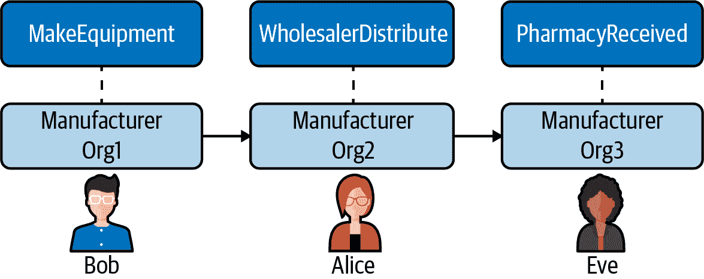

###### 图 7-1\. PLN 中的组织

我们的 PLN 流程分为以下三个步骤：

1.  制造商制造设备并将其运送给批发商。

1.  批发商向药房分发设备。

1.  药房作为消费者接收设备，供应链工作流程完成。

## 定义一个联盟

从流程工作流程中我们可以看到，我们的 PLN 包括三个组织：制造商、批发商和药房。这三个实体将联合建立一个联盟网络来开展供应链业务。联盟成员可以创建用户，调用智能合约和查询区块链数据。表 7-1 描述了 PLN 联盟中的组织和用户。

表 7-1\. PLN 联盟

| 组织名称 | 用户 | MSP | Peer |
| --- | --- | --- | --- |
| 制造商 | 鲍勃 | Org1MSP | *peer0.org1.example.com* |
| 批发商 | 爱丽丝 | Org2MSP | *peer0.org2.example.com* |
| 药房 | 伊娃 | Org3MSP | *peer0.org3.example.com* |

在我们的 PLN 联盟中，每个三个组织都有一个用户、一个 MSP 和一个对等体。对于制造商组织，我们有一个名为鲍勃的用户作为应用用户。Org1MSP 是一个 MSP ID，用于加载 MSP 定义。我们定义 AnchorPeers，其主机名为 peer0.org1.example.com 以跨节点进行通信。同样，批发商是第二个组织，爱丽丝是其应用程序用户，其 MSP ID 为 Org2MSP。最后，伊娃是药房组织的用户，其 MSP 为 Org3MSP。

通过确定组织，我们可以定义我们的 Hyperledger Fabric 网络拓扑，如图 7-2 所示。

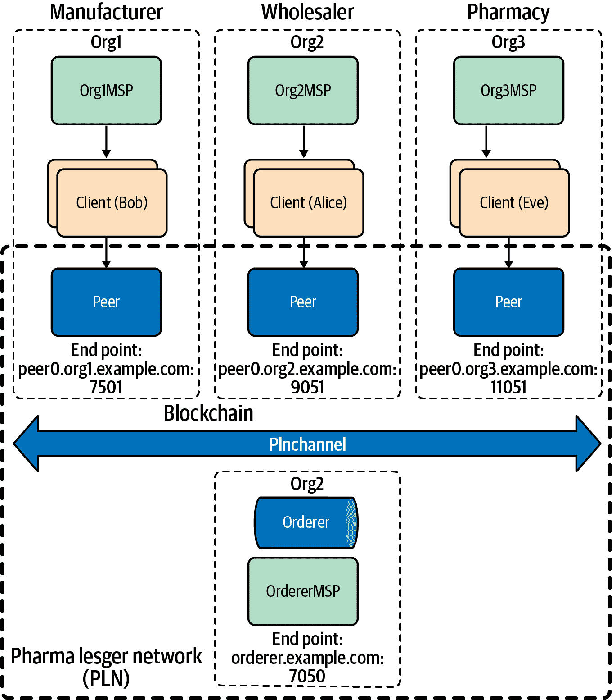

###### 图 7-2\. PLN 联盟的 Fabric 网络拓扑

由于在多个物理节点上安装和部署 PLN 可能不在本章的范围之内，我们将一个对等体定义为四个组织，代表制造商、批发商、药房和订购者节点。

通道*plnchannel*提供了一个由订购者和其他三个组织使用的私有通信机制，用于执行和验证交易。

## 回顾 PLN 生命周期

正如我们在前一节中提到的，PLN 的生命周期有三个步骤：制造商制造设备并运送给批发商；批发商将设备分配给药房；最后，药房接收设备。整个过程可以通过设备编号进行跟踪。让我们更详细地看一下这一点。

设备编号为 2000.001 的一件设备于 1 月 1 日由制造商制造，具有设备和其他属性及其值，如图 7-3 所示。

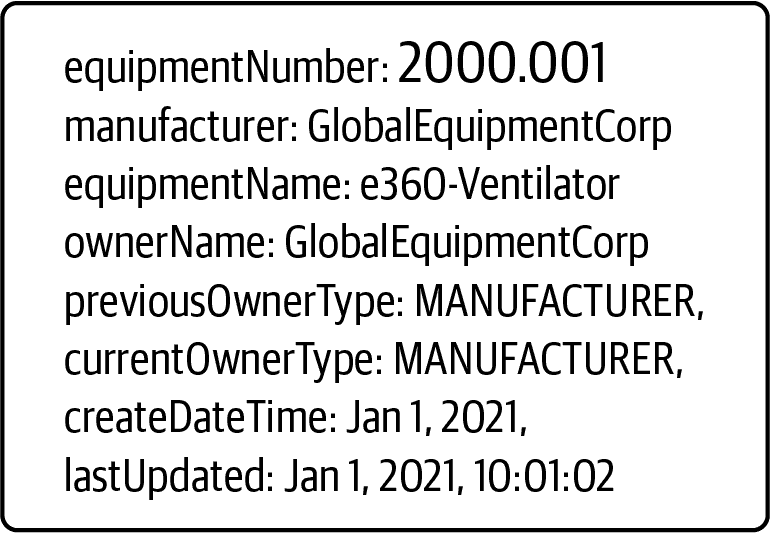

###### 图 7-3. 制造商的设备属性及其值

### 设备属性及其值

在这里，我们定义了一个唯一的标识设备的设备编号来代表设备。每个设备项目在某一时期由设备所有者拥有。在我们的案例中，我们定义了三种所有者类型：制造商、批发商和药房。

当制造商制造一件设备并在 PLN 中记录时，交易结果显示账本中具有唯一标识编号为 2000.001 的设备。当前所有者是 GlobalEquipmentCorp。当前所有者类型和上一个类型相同——制造商。设备于 2021 年 1 月 1 日制造。`lastUpdated`条目是记录交易在 PLN 中的日期。

几周后，制造商将设备运送到批发商，设备状态将发生变化，包括所有权、前一个和当前所有者类型以及最后更新。让我们看看哪些设备状态发生了变化，如图 7-4 所示。

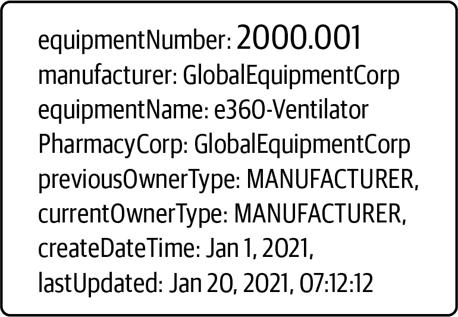

###### 图 7-4\. 批发商设备状态变化

### 设备状态变化

最显著的变化之一是设备现在归 GlobalWholesalerCorp 所有。先前的所有者类型是制造商。最后更新日期也已更改。

一个月后，药房终于收到了这个设备订单。所有权现在从批发商转移到了药房，如图 7-5 所示。供应链流程可以被视为关闭。

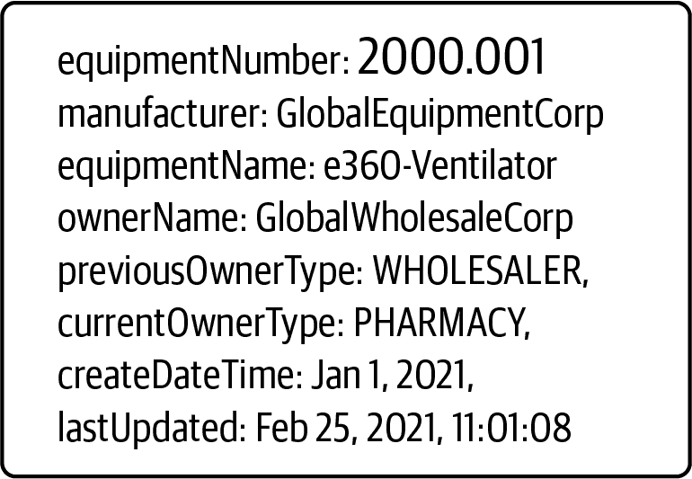

###### 图 7-5\. 药房更新设备价值

### 药房手中的设备

使用相同的设备标识，对等组织可以通过查找设备编号追溯设备的全部交易记录历史。

## 了解交易

正如你所见，整个生命周期有三个步骤。从制造商开始，设备从批发商移至药房。因此，由于制造了一件设备，批发商分配并且药房接收了交易。有了所有这些设计和分析，我们现在可以开始编写我们的 PLN 智能合约。

# 编写智能合约作为链码

我们已经讨论了在交易的生命周期中设备状态和属性如何发生变化，在我们的 Pharma Ledger Network 中设备如何在各方之间移动。如第三部分所述，在 Hyperledger Fabric 中，智能合约是一个在其生命周期内实现业务逻辑并管理业务对象的世界状态的程序。在部署过程中，此合约将打包成链码并安装在每个运行在安全 Docker 容器中的背书节点上。Hyperledger Fabric 智能合约可以使用 Go、JavaScript、Java 和 Python 编程。

在本节中，我们将使用 JavaScript 编写一个我们 PLN 的智能合约实现。本章的所有 PLN 代码都可以在书的 GitHub 存储库中找到。此外，我们在整个项目中使用 Fabric v2.1.0 和 Fabric CA v1.4.7。

## 项目结构

要开始我们的 PLN 智能合约开发，首先我们需要创建我们的智能合约项目。由于我们有三个组织，所有节点都必须同意并批准将要安装和部署到网络上的新版本智能合约。对于我们的 PLN，我们将假设它们都是一样的：

```
We define a smart contract called *pharmaledgercontract.js*.  The project structure is shown here:
   +---manufacturer
   |   +---application
   |   |   |   app.js
   |   |   |   package.json
   |   |   +---public
   |   |   +---services
   |   |   \---views
   |   |           index.ejs
   |   \---contract
   |       |   index.js
   |       |   package.json
   |       \---lib
   |               pharmaledgercontract.js
```

*package.json*文件定义了两个最重要的 fabric 库：

```
    "dependencies": {
        "fabric-contract-api": "².1.2",
        "fabric-shim": "².1.2"
    },
```

*fabric-contract-api*提供了合约接口。它有两个每个智能合约都需要使用的关键类，`Contract`和`Context`：

```
const { Contract, Context } = require('fabric-contract-api');
```

`Contract`有`beforeTransaction`、`afterTransaction`、`unknownTransaction`和`createContext`方法，这些方法在子类中是可选的并且可以被覆盖。您可以使用其超类来初始化 JavaScript 显式合约类名称。

`Context`类为每个事务调用提供了事务上下文。它可以被覆盖以支持智能合约执行的其他应用程序行为。

## 合约类

我们的药品账本合约实现将从*fabric-contract-api*库的默认内置合约类扩展。让我们首先用构造函数定义`PharmaLedgerContract`：`org.pln.PharmaLedgerContract`给出了一个非常描述性的名称，具有我们合约的唯一命名空间。唯一的合约命名空间在共享系统中避免了当一个共享系统有来自不同用户和操作的许多合约时的冲突是很重要的：

```
 const { Contract, Context } = require('fabric-contract-api');
class PharmaLedgerContract extends Contract {

    constructor() {
        super('org.pln.PharmaLedgerContract');
    }
}
```

## 交易逻辑

正如我们讨论的那样，`PharmaLedgerContract`将需要三个业务功能，将设备所有者从制造商转移到批发商，最后到药房：

```
 async makeEquipment(ctx, manufacturer, equipmentNumber, equipmentName, ownerName) {
// makeEquipment logic
}
async wholesalerDistribute(ctx, equipmentNumber, ownerName) {
// wholesalerDistribute logic
}
async pharmacyReceived(ctx, equipmentNumber, ownerName) {
// pharmacyReceived logic
}
```

制造商将被初始化，并创建一个设备条目。正如您将注意到的那样，这些函数接受上下文作为默认的第一个参数，并从客户端输入获取与设备相关的参数（`manufacturer`、`equipmentNumber`、`equipmentName`、`ownerName`）。当调用`makeEquipment`时，函数期望从客户端获取四个设备属性，并将其分配给新设备：

```
 async makeEquipment(ctx, manufacturer, equipmentNumber, equipmentName, ownerName){
        let dt = new Date().toString();
        const equipment = {
            equipmentNumber,
            manufacturer,
            equipmentName,
            ownerName,
            previousOwnerType: 'MANUFACTURER',
            currentOwnerType: 'MANUFACTURER',
            createDateTime: dt,
            lastUpdated: dt
        };
await ctx.stub.putState(equipmentNumber, Buffer.from(JSON.stringify(equipment)));
}
```

在`makeEquipment`结束时，`ctx.stub.putState`将使用设备编号键在账本上存储设备的初始状态值。设备的 JSON 数据将使用`JSON.stringify`转换为字符串，然后转换为缓冲区。缓冲区转换是由 shim API 与对等方通信所需的。

该函数使用 JavaScript 的新`Date`来获取当前日期时间，并将其分配给`lastUpdated`日期时间。当提交交易数据时，每个对等方都将验证并提交交易。

在制造商创建设备记录后，批发商和药房只需要更新所有权以跟踪当前所有者。这两个功能都很相似：

```
 async wholesalerDistribute(ctx, equipmentNumber, ownerName) {
        const equipmentAsBytes = await ctx.stub.getState(equipmentNumber);
        if (!equipmentAsBytes || equipmentAsBytes.length === 0) {
            throw new Error(`${equipmentNumber} does not exist`);
        }
        let dt = new Date().toString();
        const strValue = Buffer.from(equipmentAsBytes).toString('utf8');
        let record;
        try {
            record = JSON.parse(strValue);
            if(record.currentOwnerType!=='MANUFACTURER') {
  throw new Error(` equipment - ${equipmentNumber} owner must be MANUFACTURER`);
            }
            record.previousOwnerType= record.currentOwnerType;
            record.currentOwnerType = 'WHOLESALER';
            record.ownerName = ownerName;
            record.lastUpdated = dt;
       } catch (err) {
          throw new Error(`equipment ${equipmentNumber} data can't be processed`);
       }
   await ctx.stub.putState(equipmentNumber, Buffer.from(JSON.stringify(record)));
   }
```

在 `wholesalerDistribute` 函数中，我们通过调用 `ctx.stub.getState(equipmentNumber)` 查询当前设备账本数据。一旦数据返回，我们需要确保 `equipmentAsBytes` 不为空，并且 `equipmentNumber` 是一个有效的数字。由于账本数据以 JSON 字符串字节格式存在，所以需要使用 `Buffer.from().toString('utf8')` 将编码数据转换为可读的 JSON 格式。然后，我们通过使用返回的数据验证当前设备所有者类型是否为制造商。

一旦满足所有这些条件，就会再次调用 `ctx.stub.putState`。设备所有者状态将会更新为批发商，并带有当前时间戳。但是作为一个不可变的交易日志，所有世界状态的历史更改都将永久存储在账本中。我们将在下一步中定义 `queryHistoryByKey` 函数来查询所有这些数据。

`pharmacyReceived` 函数与 `wholesalerDistribute` 类似，因此需要验证当前所有者是否为批发商，然后在更新设备记录之前将所有权转移给药房：

```
if(record.currentOwnerType!=='WHOLESALER') {
throw new Error(` equipment - ${equipmentNumber} owner must be WHOLESALER`);
}
record.previousOwnerType= record.currentOwnerType;
record.currentOwnerType = 'PHARMACY';Query Functions
```

当我们实现了所有三个设备业务函数后，账本仍然需要一个查询函数来搜索当前设备数据，以及一个查询历史函数来获取所有的历史记录。

`ChaincodeStub` 由 *fabric-shim* 库实现，并提供 `GetState` 和 `GetHistoryForKey` 函数。在我们的情况下，查询定义很简单：我们只需要调用 `ctx.stub.getState` 来获取相应的结果。

`GetHistoryForKey` 函数返回跨时间的所有历史交易键值。我们可以遍历这些记录，并将它们转换为 JSON 字节数组，然后将数据作为响应发送回去。时间戳告诉我们设备状态何时被更新。每个记录包含相关的交易 ID 和时间戳：

```
    async queryHistoryByKey(ctx, key) {
      let iterator = await ctx.stub.getHistoryForKey(key);
      let result = [];
      let res = await iterator.next();
      while (!res.done) {
        if (res.value) {
          const obj = JSON.parse(res.value.value.toString('utf8'));
          result.push(obj);
        }
        res = await iterator.next();
      }
      await iterator.close();
      console.info(result);
      return JSON.stringify(result);
  }
```

这就是我们将为我们的 PLN 实现的智能合约函数。接下来，我们将编译并部署 Fabric 链码。

# 编译和部署 Fabric 链码

我们已经成功用 JavaScript 编写了我们的 PLN 链码。在部署合约之前，我们需要设置 Fabric 网络。

要开始使用 Hyperledger Fabric，我们首先需要满足一些前提条件。我们假设您已经安装了 第 II 部分 中涵盖的软件。如果还没有，请先安装那些软件。

## 安装前提条件

在进一步进行之前，我们需要安装以下第三方工具：

+   Linux（Ubuntu）

+   Python

+   [Git](https://git-scm.com)

+   [cURL](https://curl.haxx.se/)

+   Docker 和 Docker Compose：需要 Docker 版本 17.06.2-ce 或更高版本。

+   Go 版本 1.14.*x*

+   Node.js 运行时和 npm：支持 Node.js 版本 8（从 8.9.4 开始）和 Node.js 版本 10（从 10.15.3 开始）。

要设置一个网络，我们使用 Cryptogen 为一个组织生成加密材料，创建一个联合体，然后通过 Docker Compose 启动 PLN。让我们首先设置我们的项目。

## 检查项目结构

我们已经为我们的 PLN 项目定义了所有的设置脚本和配置文件；源代码可以在书籍的 GitHub 页面找到。项目结构如下所示：

```
|   loadFabric.sh 
|---pharma-ledger-network
    |   net-pln.sh
    +---channel-artifacts
    +---configtx
    |       configtx.yaml
    +---docker
    +---organizations
    |   +---cryptogen       
    |   +---manufacturer
    |   +---pharmacy
    |   +---wholesaler
    +---scripts
```

让我们来看看重要的配置。

### Cryptogen

四个加密配置位于 *cryptogen* 文件夹中，分别用于排序器和其他三个对等组织。`OrdererOrgs` 定义排序节点并创建组织定义。`PeerOrgs` 定义对等节点、组织和管理对等节点。

正如我们所知，网络中运行的组件需要 CA。Fabric Cryptogen 工具将使用这四个加密配置文件为所有组织生成所需的 X.509 证书。

对于 `OrdererOrgs`，我们定义以下加密配置：

```
 OrdererOrgs:
  - Name: Orderer
    Domain: example.com
    EnableNodeOUs: true
    Specs:
      - Hostname: orderer
        SANS:
          - localhost
```

对于 `PeerOrgs`，我们为 `Org1`（制造商）定义以下加密配置。其他两个组织类似：

```
 PeerOrgs:
  - Name: Org1
    Domain: org1.example.com
    EnableNodeOUs: true
    Template:
      Count: 1
      SANS:
        - localhost
    Users:
      Count: 1
```

我们将 `EnableNodeOUs` 设置为 `true`，这将启用身份分类。

### Configtx

*configtx.yaml* 文件将根据 *configtx.yaml* 配置生成 `OrdererSystemChannelGenesis` 和相关工件。在 *configtx.yaml* 的 `Organizations` 部分，我们定义了 `OrdererOrg` 和另外三个对等组织 — `Org1`、`Org2` 和 `Org3`，分别代表制造商、批发商和药房。每个组织都将定义其 `Name`、`ID`、`MSPDir` 和 `AnchorPeers`。`MSPDir` 描述了由 Cryptogen 生成的输出 MSP 目录。`AnchorPeers` 指定了对等节点的主机和端口。它基于对等节点之间的通信策略更新交易，并查找通道的所有活动参与者：

```
 Organizations:
    - &OrdererOrg
        Name: OrdererOrg
        ID: OrdererMSP
        MSPDir: ../organizations/ordererOrganizations/example.com/msp
        Policies:
           ....
        OrdererEndpoints:
            - orderer.example.com:7050
    - &Org1
        Name: Org1MSP
        ID: Org1MSP
        MSPDir: ../organizations/peerOrganizations/org1.example.com/msp
        Policies:
...
        AnchorPeers:
            - Host: peer0.org1.example.com
              Port: 7051
- &Org2
        AnchorPeers:
            - Host: peer0.org2.example.com
              Port: 9051
- &Org3
        AnchorPeers:
            - Host: peer0.org3.example.com
              Port: 11051
```

`Organization Policies` 部分定义了谁需要批准组织资源。在 PLN 中，我们使用签名策略。例如，我们在下一步定义了 `Org2 Readers` 策略，允许 `Org2` 的管理员、对等节点和客户端访问此节点的资源，并且只允许对等节点进行交易背书。您可以根据您的应用需求定义自己的策略。

```
 Policies:
            Readers:
                Type: Signature
                Rule: "OR('Org2MSP.admin', 'Org2MSP.peer', 'Org2MSP.client')"
            Endorsement:
                Type: Signature
                Rule: "OR('Org2MSP.peer')"
```

`Profiles` 部分定义了如何生成 `PharmaLedgerOrdererGenesis`，包括 PLN 联盟中的排序配置和组织：

```
 Profiles:
    PharmaLedgerOrdererGenesis:
        <<: *ChannelDefaults
        Orderer:
            <<: *OrdererDefaults
            Organizations:
                - *OrdererOrg
            Capabilities:
                <<: *OrdererCapabilities
        Consortiums:
            PharmaLedgerConsortium:
                Organizations:
                    - *Org1
                    - *Org2
                    - *Org3
    PharmaLedgerChannel:
        Consortium: PharmaLedgerConsortium
        <<: *ChannelDefaults
        Application:
            <<: *ApplicationDefaults
            Organizations:
                - *Org1
                - *Org2
                - *Org3
            Capabilities:
                <<: *ApplicationCapabilities
```

### Docker

*docker* 文件夹包含 Docker Compose 配置文件，*docker-compose-pln-net.yaml*。Docker Compose 工具使用此配置文件初始化 Fabric 运行时环境。它定义了卷（volumes）、网络（networks）和服务（services）。

在我们的 PLN 项目中，我们将网络名称定义为 `pln`。我们首先需要为每个组织服务指定 Docker 运行时环境变量。例如，我们将我们的区块链网络名称定义为 `${COMPOSE_PROJECT_NAME}_pln`。当我们为环境变量 `COMPOSE_PROJECT_NAME` 分配一个 `net` 值时，网络名称将是 `net_pln`。容器还从 *hyperledger/fabric-peer** 拉取 orderer 镜像。卷配置映射了在环境设置中使用的 MSP、TLS 和其他组织 Fabric 部分的目录。最后，`working_dir` 设置对等体的工作目录：

```
 services:
  orderer.example.com:
    container_name: orderer.example.com
    image: hyperledger/fabric-orderer:$IMAGE_TAG
    environment:..
    working_dir: /opt/gopath/src/github.com/hyperledger/fabric
    command: orderer
    volumes:..
    ports:
      - 7050:7050
    networks:
      - pln

  peer0.org1.example.com:
    container_name: peer0.org1.example.com
    image: hyperledger/fabric-peer:$IMAGE_TAG
    environment:
      - CORE_VM_DOCKER_HOSTCONFIG_NETWORKMODE=${COMPOSE_PROJECT_NAME}_pln
..
      - CORE_PEER_ADDRESS=peer0.org1.example.com:7051
      - CORE_PEER_LISTENADDRESS=0.0.0.0:7051
      - CORE_PEER_CHAINCODEADDRESS=peer0.org1.example.com:7052
      - CORE_PEER_CHAINCODELISTENADDRESS=0.0.0.0:7052
      - CORE_PEER_GOSSIP_BOOTSTRAP=peer0.org1.example.com:7051
      - CORE_PEER_GOSSIP_EXTERNALENDPOINT=peer0.org1.example.com:7051
      - CORE_PEER_LOCALMSPID=Org1MSP
    volumes:
...
    working_dir: /opt/gopath/src/github.com/hyperledger/fabric/peer
    command: peer node start
    ports:
      - 7051:7051
    networks:
      - pln
```

## 安装二进制文件和 Docker 镜像

我们已经审查了运行 PLN 网络所需的重要配置。*net-pln.sh* 脚本将启动 PLN 网络，但我们首先需要下载并安装 Fabric 二进制文件到您的系统中。在根项目文件夹下有一个名为 *loadFabric.sh* 的文件，请运行以下命令来加载 Fabric 二进制文件和配置：

```
./loadFabric.sh
```

这将把 Hyperledger Fabric 平台特定的二进制文件和配置文件安装到项目的 */bin* 和 */config* 目录下。对于该项目，我们使用当前最新的生产版本：Fabric v2.1.0 和 Fabric CA v1.4.7。运行 `docker images -a` 来检查已安装的 Fabric 镜像。

###### 注意

确保项目中的所有脚本都是可执行的。例如，您可以运行 `chmod +x loadFabric.sh` 使其可执行。

现在是启动我们的 PLN 网络的时候了。

## 启动 PLN 网络

正如我们之前提到的，要启动 PLN 网络，我们需要完成以下步骤：

1.  使用 Cryptogen 工具为对等组织生成证书。以下是为 `Org1` 执行的命令：

    ```
     cryptogen generate --config=./organizations/cryptogen/crypto-config-org1.yaml --output="organizations"
    ```

    生成的输出存储在 *organizations* 文件夹中。

1.  使用 Cryptogen 创建 orderer 组织身份：

    ```
     cryptogen generate --config=./organizations/cryptogen/crypto-config-orderer.yaml --output="organizations"
    ```

1.  为 `Org1`、`Org2` 和 `Org3` 生成一个公共连接配置文件（CCP）：

    ```
     ./organizations/ccp-generate.sh
    ```

    *ccp-generate.sh*位于*organizations*文件夹下。它使用*ccp-template.json*和*ccp-template.yaml*文件作为模板；它为组织名称、对等端口、CA 端口和 CA PEM 证书定义了占位符变量。通过传递这些定义的变量，我们可以在运行*ccp-generate.sh*时生成组织连接文件。而*ccp-generate.sh*还将生成的连接文件复制到*peer orgs*文件夹下：

    ```
    echo "$(json_ccp $ORG $P0PORT $CAPORT $PEERPEM $CAPEM)" >
    organizations/peerOrganizations/org1.example.com/connection-org1.json
    echo "$(yaml_ccp $ORG $P0PORT $CAPORT $PEERPEM $CAPEM)" >
    organizations/peerOrganizations/org1.example.com/connection-org1.yaml
    ```

    每个对等网络客户端都将使用这些连接文件连接到 Fabric 网络。

1.  创建财团并生成订购者系统通道创世块：

    ```
    configtxgen -profile PharmaLedgerOrdererGenesis -channelID system-channel -outputBlock ./system-genesis-
    block/genesis.block
    ```

    `configtxgen`读取*configtx.yaml*配置文件，并在*system-genesis-block*文件夹下生成*genesis.block*文件。

1.  启动对等节点和订购方节点。

    *docker-compose*文件定义在*docker/docker-compose-pln-net.yaml*下。该命令将拉取最新的 Fabric 订购者和对等方镜像，构建订购者和对等方镜像，并启动我们在*.yaml*文件中定义的服务。运行以下`docker-compose`命令来启动对等节点和订购方节点：

    ```
     IMAGE_TAG=$IMAGETAG docker-compose ${COMPOSE_FILES} up -d 2>&1
    ```

1.  现在，让我们启动 PLN 网络。打开一个终端窗口，然后在*pharma-ledger-network*文件夹下运行*net-pln.sh*：

    ```
     cd pharma-ledger-network 
    ./net-pln.sh up
    ```

    你应该看到以下成功日志：

    ```
     Creating network "net_pln" with the default driver
     Creating volume "net_orderer.example.com" with default driver
     Creating volume "net_peer0.org1.example.com" with default driver
     Creating volume "net_peer0.org2.example.com" with default driver
     Creating volume "net_peer0.org3.example.com" with default driver
     Creating orderer.example.com    ... done
     Creating peer0.org2.example.com ... done
     Creating peer0.org1.example.com ... done
     Creating peer0.org3.example.com ... done
     CONTAINER ID   IMAGE                        COMMAND   ..            NAMES
     5a1fb5778a94   hyperledger/fabric-peer:latest "peer node start" ... peer0.org3.example.com
     969a5a9f5a85   hyperledger/fabric-peer:latest "peer node start" ...  peer0.org1.example.com
     2f2cf2b0463d  hyperledger/fabric-peer:latest  "peer node start" ... peer0.org2.example.com
     f327510667ff hyperledger/fabric-orderer:latest "orderer"       ...  orderer.example.com
    ```

我们有四个组织，在*net_pln*网络中运行着包括三个对等方和一个订购方。在下一步中，我们将使用脚本为所有组织创建一个 PLN 通道。

## 监控 PLN 网络

PLN 网络中的 Fabric 镜像是基于 Docker 的。在项目开发或生产生命周期中，您可能会遇到许多错误。从 DevOps 的角度来看，日志监控是故障排除代码中最重要的事情之一。它将有助于更轻松、更快速地排查故障并找到根本原因。

Logspout 是一个用于监视 Docker 日志的开源容器日志工具。它收集集群中所有节点的 Docker 日志，汇总到一个地方。在我们的 PLN 项目中，我们将使用 Logspout 监视频道创建、智能合约安装以及其他操作。转到 *pharma-ledger-network* 文件夹并打开一个新的终端窗口：

```
 cd pharma-ledger-network
```

从 *net-pln.sh* 脚本运行以下命令，并启动 Logspout 工具以监视运行在 PLN 网络 *net_pln* 上的容器：

```
 ./net-pln.sh monitor-up

...
Starting docker log monitoring on network 'net_pln'
Starting monitoring on all containers on the network net_pln
Unable to find image 'gliderlabs/logspout:latest' locally
latest: Pulling from gliderlabs/logspout
cbdbe7a5bc2a: Pull complete
956fa3cf18b6: Pull complete
94f24e0675e0: Pull complete
Digest: sha256:872555b51b73d7f50726baeae8d8c138b6b48b550fc71d733df7ffcadc9072e1
Status: Downloaded newer image for gliderlabs/logspout:latest
e8a8ad1787b69cfb7387264ee6ff63fd5a805aabe50ca6af6356d4cd8b27e052
```

这里是启动 Logspout 工具的脚本逻辑；通过传递 PLN 网络名称，它拉取 *gliderlabs/logspout* 镜像：

```
 docker run -d --name="logspout" \
   --volume=/var/run/docker.sock:/var/run/docker.sock \
   --publish=127.0.0.1:${PORT}:80 \
   --network  ${DOCKER_NETWORK} gliderlabs/logspout
```

此终端窗口现在将显示项目开发剩余时间的 PLN 网络容器输出。

###### 提示

如果在此过程中遇到问题，请检查 Logspout 终端窗口以查看错误。

## 创建一个 PLN 频道。

要创建该频道，我们将使用 `configtxgen` CLI 工具生成创世区块，然后使用 peer channel 命令与其他对等节点加入频道。创建一个 PLN 频道需要多个步骤。所有这些脚本逻辑都可以在 *scripts/createChannel.sh* 中找到：

1.  生成一个频道配置交易文件。在 *createChannel.sh* 脚本中，我们定义了 `createChannelTxn` 函数。此函数中的关键命令如下：

    ```
     configtxgen -profile PharmaLedgerChannel -outputCreateChannelTx ./channel-artifacts/${CHANNEL_NAME}.tx
    -channelID $CHANNEL_NAME
    ```

    `configtxgen` 工具从 *configtx.yaml* 中读取 `PharmaLedgerChannel` 部分的配置文件，定义了生成交易和创世区块所需的频道相关配置。然后生成 *plnchannel.tx* 文件。

1.  创建一个 `AnchorPeer` 配置交易文件。

    接下来，我们定义 `createAncorPeerTxn` 函数。与前面的步骤类似，我们在 *configtx.yaml* 中定义了不同的组织身份。`configtxgen` 工具读取 `PharmaLedgerChannel` 组织配置，并生成对等节点配置交易文件：

    ```
     configtxgen -profile PharmaLedgerChannel -outputAnchorPeersUpdate ./channel-artifacts/${orgmsp}anchors.tx
    -channelID $CHANNEL_NAME -asOrg ${orgmsp}
    ```

    运行 `createAncorPeerTxn` 后，我们应该看到生成的 *Org1MSPanchors.tx*、*Org2MSPanchors.tx* 和 *Org3MSPanchors.tx* 事务文件。

1.  使用 `peer channel` 命令创建一个通道。`createChannel` 函数使用 `peer channel create` 命令来创建我们的 PLN 通道。当发出命令时，它将向订购服务提交通道创建事务。订购服务将检查在 *configtx.yaml* 中定义的通道创建策略权限。只有管理员用户才能创建通道。`setGlobalVars` 函数 *scripts/utils.sh* 将允许我们将对等组织设置为管理员用户。我们使用 `Org1` 作为管理员来创建我们的通道。

    命令如下：

    ```
    setGlobalVars 1
    peer channel create -o localhost:7050 -c $CHANNEL_NAME --ordererTLSHostnameOverrideorderer.example.com -
    f ./channel-artifacts/${CHANNEL_NAME}.tx --outputBlock ./channel-
    ```

    `setGlobalVars` 在 *scripts/utils.sh* 中有以下逻辑，用于将 `Org1` 设置为管理员用户。我们也可以使用此函数将其他对等组织设置为管理员用户：

    ```
     setGlobalVars() {
    ..
      if [ $USING_ORG -eq 1 ]; then
        export CORE_PEER_LOCALMSPID="Org1MSP"
        export CORE_PEER_TLS_ROOTCERT_FILE=$PEER0_ORG1_CA
        export CORE_PEER_MSPCONFIGPATH=${PWD}/organizations/peerOrganizations/org1.example.com/users/Admin@org1.example.
    com/msp
    export CORE_PEER_ADDRESS=localhost:7051
    ..
    }
    ```

1.  在我们的 PLN 通道创建完成后，我们可以将所有对等方加入到此通道中。`createChannel.sh` 脚本中的 `joinMultiPeersToChannel` 将通过运行 `peer channel join` 命令将所有三个对等组织加入到我们的 PLN 通道中：

    ```
     for org in $(seq 1 $TOTAL_ORGS); do
      setGlobalVars $ORG 
      peer channel join -b ./channel-artifacts/$CHANNEL_NAME.block >&log.txt
    done
    ```

    当对等组织加入到通道时，它们需要通过调用 `setGlobalVars` 函数并将 `$ORG` 参数传递给它来被分配为管理员用户。`peer channel join` 命令将使用 *genesis.block* 将对等组织加入到通道中。一旦对等方加入到通道中，它就可以在接收到订购服务事务提交时参加通道分类帐块的创建。

1.  在通道创建过程的最后一步，我们需要选择至少一个对等方作为锚定对等方。锚定对等方的主要角色是私有数据和服务发现。锚定对等方的端点是固定的。属于不同成员的其他对等节点可以与锚定对等方通信，以发现通道上的所有现有对等方。要更新锚定对等方，我们将选定的对等方设置为管理员用户，并发出 `peer channel update` 命令：

    ```
     setGlobalVars $ORG
    peer channel update -o localhost:7050 --ordererTLSHostnameOverride orderer.example.com -c $CHANNEL_NAME -
    f ./channel-artifacts/${CORE_PEER_LOCALMSPID}anchors.tx --tls $CORE_PEER_TLS_ENABLED --cafile $ORDERER_CA
    >&log.txt
    ```

    你可以通过运行以下命令使用*net-pln.sh*来创建 PLN 通道：

    ```
     ./net-pln.sh createChannel
    ```

    一旦通道创建完成，你应该看到以下日志：

    ```
     ...

    ***** [Step: 5]: start call updateAnchorPeers 3 on peer: peer0.org3, channelID: plnchannel,
    smartcontract: , version , sequence  *****
    Using organization 3
    2020-06-06 03:24:36.333 UTC [channelCmd] InitCmdFactory -> INFO 001 Endorser and orderer connections
    initialized
    2020-06-06 03:24:36.392 UTC [channelCmd] update -> INFO 002 Successfully submitted channel update
    ***** completed call updateAnchorPeers, updated peer0.org3 on anchorPeers on channelID: plnchannel,
    smartcontract: , version , sequence  *****

    ***** completed call updateOrgsOnAnchorPeers, anchorPeers updated on channelID: plnchannel,
    smartcontract: , version , sequence  *****

    ========= Pharma Ledger Network (PLN) Channel plnchannel successfully joined ===========
    ```

要查看相关的容器信息，你可以检查我们之前打开的 Logspout 终端窗口。

# 运行和测试智能合约

在安装通道前，我们需要打包一个智能合约。进入制造商合同文件夹目录并运行`npm install`命令：

```
cd pharma-ledger-network/organizations/manufacturer/contract
npm install
```

这将在*node_modules*下安装*pharmaledgercontract*节点依赖。

## 安装智能合约

现在我们可以通过运行以下*deploySmartContract.sh*脚本开始安装我们的智能合约：

1.  `peer lifecycle chaincode package`命令将打包我们的智能合约。我们将制造商指定为管理员用户来运行该打包命令：

    ```
    setGlobalVars 1
    peer lifecycle chaincode package ${CHINCODE_NAME}.tar.gz --path ${CC_SRC_PATH} --lang
    ${CC_RUNTIME_LANGUAGE} --label ${CHINCODE_NAME}_${VERSION}
    ```

1.  使用`peer lifecycle chaincode install`命令在所有对等方组织上安装链码作为管理员：

    ```
    for org in $(seq 1 $CHAINCODE_ORGS); do
    setGlobalVars $ORG
    peer lifecycle chaincode install ${CHINCODE_NAME}.tar.gz >&log.txt
    done
    ```

    当链码包安装完成时，你会在终端上看到类似以下的消息：

    ```
    2020-06-06 03:30:50.025 UTC [cli.lifecycle.chaincode] submitInstallProposal -> INFO 001 Installed
    remotely: response:<status:200
    payload:"\nWpharmaLedgerContract_1:1940852a477d7697bb3a12d032268ff48c741c585db166403dd35f5e0b5c4e74\022
    \026pharmaLedgerContract_1" >
    2020-06-06 03:30:50.025 UTC [cli.lifecycle.chaincode] submitInstallProposal -> INFO 002 Chaincode code
    package identifier:
    pharmaLedgerContract_1:1940852a477d7697bb3a12d032268ff48c741c585db166403dd35f5e0b5c4e74
    ***** completed call installChaincode, Chaincode is installed on peer0.org1 on channelID: plnchannel,
    smartcontract: pharmaLedgerContract, version 1, sequence 1 *****
    ```

1.  在安装智能合约后，我们需要查询链码是否已安装。我们可以使用`peer lifecycle chaincode queryinstalled`命令来查询`packageID`：

    ```
    peer lifecycle chaincode queryinstalled >&log.txt
    ```

    如果命令成功完成，你将看到类似以下的日志：

    ```
    Installed chaincodes on peer:
    Package ID: pharmaLedgerContract_1:1940852a477d7697bb3a12d032268ff48c741c585db166403dd35f5e0b5c4e74,
    Label: pharmaLedgerContract_1
    ***** completed call queryInstalled, Query installed successful with PackageID is
    pharmaLedgerContract_1:1940852a477d7697bb3a12d032268ff48c741c585db166403dd35f5e0b5c4e74 on
    channelID: plnchannel, smartcontract: pharmaLedgerContract, version 1, sequence 1 *****
    ```

1.  使用返回的包 ID，我们现在可以通过`approveForMyOrg`为制造商批准链码定义，这调用了`peer lifecycle chaincode approveformyorg`命令：

    ```
    peer lifecycle chaincode approveformyorg -o localhost:7050 --ordererTLSHostnameOverride
    orderer.example.com --tls $CORE_PEER_TLS_ENABLED --cafile $ORDERER_CA --channelID
    $CHANNEL_NAME --name ${CHINCODE_NAME} -- version ${VERSION}  --package-id ${PACKAGE_ID} --sequence ${VERSION} >&log.txt
    ```

1.  我们可以使用`checkOrgsCommitReadiness`来检查通道成员是否已经批准了相同的链码定义，这将运行`peer lifecycle chaincode checkcommitreadiness`命令：

    ```
    peer lifecycle chaincode checkcommitreadiness --channelID $CHANNEL_NAME --name ${CHINCODE_NAME} --
    version ${VERSION} --sequence ${VERSION} --output json >&log.txt
    ```

    如预期，我们应该看到`Org1MSP`的批准为`true`；另外两个组织为`false`：

    ```
    ***** [Step: 5]: start call checkCommitReadiness org1 on peer: peer0.org1, channelID: plnchannel,
    smartcontract: pharmaLedgerContract, version 1, sequence 1 *****
    Attempting to check the commit readiness of the chaincode definition on peer0.org1, Retry after 3
    seconds.
    + peer lifecycle chaincode checkcommitreadiness --channelID plnchannel --name pharmaLedgerContract --
    version 1 --sequence 1 --output json
    {
            "approvals": {
                    "Org1MSP": true, "Org2MSP": false, "Org3MSP": false
            }
    }
    ```

1.  批准策略要求一组多数组织在提交链码之前对交易进行背书。我们继续运行`peer lifecycle chaincode approveformyorg`命令对`Org2`和`Org3`进行批准：

    ```
     ## approve org2
    approveForMyOrg 2
    ## check whether the chaincode definition is ready to be committed, two orgs should be approved
    checkOrgsCommitReadiness 3 1 1 0
    ## approve org3
    approveForMyOrg 3
    ## check whether the chaincode definition is ready to be committed, all 3 orgs should be approved
    checkOrgsCommitReadiness 3 1 1 1
    ```

    如果所有命令都成功执行，所有三个组织都将批准链码安装：

    ```
     {
            "approvals": {
                    "Org1MSP": true, "Org2MSP": true, "Org3MSP": true
            }
    }
    ***** completed call checkCommitReadiness, Checking the commit readiness of the chaincode definition
    successful on peer0.org3 on channel 'plnchannel' on channelID: plnchannel,
    ```

1.  现在，我们可以确定制造商、批发商和药店都已经批准了*pharmaledgercontract*链码，我们将提交该定义。我们拥有所需的大多数组织（三个中的三个）来提交链码定义到通道。任何三个组织都可以使用`peer lifecycle chaincode commit`命令将链码提交到通道中：

    ```
    peer lifecycle chaincode commit -o localhost:7050 --ordererTLSHostnameOverride orderer.example.com --
    tls $CORE_PEER_TLS_ENABLED --cafile $ORDERER_CA --channelID $CHANNEL_NAME --name ${CHINCODE_NAME}
    $PEER_CONN_PARMS -- version ${VERSION} --sequence ${VERSION} >&log.txt
    ```

1.  我们将使用`peer lifecycle chaincode querycommitted`来检查链码提交状态：

    ```
    peer lifecycle chaincode querycommitted --channelID $ CHANNEL_NAME --name ${CHINCODE_NAME} >&log.txt
    ```

1.  现在我们已经完成了链码部署步骤，让我们通过运行以下命令在我们的 PLN 网络中部署*pharmaledgercontract*链码：

    ```
    ./net-pln.sh deploySmartContract
    ```

    如果命令成功，你应该在最后几行看到以下响应：

    ```
    Committed chaincode definition for chaincode 'pharmaLedgerContract' on channel 'plnchannel':
    Version: 1, Sequence: 1, Endorsement Plugin: escc, Validation Plugin: vscc, Approvals:
    [Org1MSP: true, Org2MSP: true, Org3MSP: true]
    ***** completed call queryCommitted, Query committed on channel 'plnchannel' on channelID: plnchannel,
    smartcontract: pharmaLedgerContract, version 1, sequence 1 *****
    ***** completed call queryAllCommitted, Chaincode installed on channelID: plnchannel, smartcontract: pharmaLedgerContract, version 1, sequence 1 *****
    === Pharma Ledger Network (PLN) contract successfully deployed on channel plnchannel  ====
    ```

链码安装后，我们可以开始调用和测试*pharmaledgercontract*的链码方法。

## 测试智能合约

我们为这个项目创建了*invokeContract.sh*。它定义了一个`makeEquipment`、`wholesalerDistribute`、`pharmacyReceived`*和一个查询函数的调用方法。现在我们可以开始测试这些函数的智能合约：

1.  调用`makeEquipment`链码方法：

    ```
     ./net-pln.sh invoke equipment GlobalEquipmentCorp 2000.001 e360-Ventilator GlobalEquipmentCorp
    ```

1.  我们传递`manufacturer`、`equipmentNumber`、`equipmentName`和`ownerName`作为参数。该脚本基本上通过传递相关的函数参数来调用`peer chaincode invoke`命令：

    ```
     peer chaincode invoke -o localhost:7050  --ordererTLSHostnameOverride orderer.example.com --tls
    $CORE_PEER_TLS_ENABLED --cafile $ORDERER_CA -C $CHANNEL_NAME -n ${CHINCODE_NAME} $PEER_CONN_PARMS  -c 
    '{"function":"makeEquipment","Args":["' $manufacturer'","'$equipmentNumber'", "' $equipmentName'", 
    "'$ownerName'"]}' >&log.txt
    ```

    你将看到类似以下的日志：

    ```
    invokeMakeEquipment--> manufacturer:GlobalEquipmentCorp, equipmentNumber:2000.001, equipmentName: e360-
    Ventilator,ownerName:GlobalEquipmentCorp
    + peer chaincode invoke -o localhost:7050 --ordererTLSHostnameOverride orderer.example.com --tls true 
    --cafile /home/ubuntu/Hyperledger-Fabric-V2/chapter7-supplychain/pharma-ledger-
    network/organizations/ordererOrganizations/example.com/orderers/orderer.example.com/msp/tlscacerts/tlsc
    a.example.com-cert.pem -C plnchannel -n pharmaLedgerContract --peerAddresses localhost:7051 
    --tlsRootCertFiles /home/ubuntu/Hyperledger-Fabric-V2/chapter7-supplychain/pharma-ledger-
    network/organizations/peerOrganizations/org1.example.com/peers/peer0.org1.example.com/tls/ca.crt --
    peerAddresses localhost:9051 --tlsRootCertFiles /home/ubuntu/Hyperledger-Fabric-V2/chapter7-
    supplychain/pharma-ledger-
    network/organizations/peerOrganizations/org2.example.com/peers/peer0.org2.example.com/tls/ca.crt --
    peerAddresses localhost:11051 --tlsRootCertFiles /home/ubuntu/Hyperledger-Fabric-V2/chapter7-
    supplychain/pharma-ledger-
    network/organizations/peerOrganizations/org3.example.com/peers/peer0.org3.example.com/tls/ca.crt -c 
    '{"function":"makeEquipment","Args":["GlobalEquipmentCorp","2000.001", "e360-Ventilator",
    "GlobalEquipmentCorp"]}'
    2020-06-06 03:43:09.186 UTC [chaincodeCmd] chaincodeInvokeOrQuery -> INFO 001 Chaincode invoke
    successful. result: status:200
    ```

1.  在调用`makeEquipment`之后，我们可以运行一个查询函数来验证账本结果。查询函数使用`peer chaincode query`命令：

    ```
      peer chaincode  query -C $CHANNEL_NAME - n ${CHINCODE_NAME} -c
    '{"function":"queryByKey","Args":["'$QUERY_KEY'"]}' >&log.txt
    ```

1.  发出以下脚本命令来查询设备：

    ```
    ./net-pln.sh invoke query 2000.001
    ```

    查询应该返回当前设备状态数据：

    ```
    {"Key":"2000.001","Record":{"equipmentNumber":"2000.001","manufacturer":"GlobalEquipmentCorp","equipmen
    tName":"e360-
    Ventilator","ownerName":"GlobalEquipmentCorp","previousOwnerType":
    "MANUFACTURER","currentOwnerType":"MANUFACTURER","createDateTime":"Sat Jun 06 2020 03:43:09 GMT+0000 (Coordinated Universal
    Time)","lastUpdated":"Sat Jun 06 2020 03:43:09 GMT+0000 (Coordinated Universal Time)"}}
    ```

1.  继续为批发商和药房调用剩余的设备功能：

    ```
    ./net-pln.sh invoke wholesaler 2000.001 GlobalWholesalerCorp
    ./net-pln.sh invoke pharmacy 2000.001 PharmacyCorp
    ```

1.  一旦设备所有权转移到药房，供应链就达到了最终状态。我们可以从`peer chaincode query`命令中发出`queryHistoryByKey`。让我们来检查设备的历史数据：

    ```
    ./net-pln.sh invoke queryHistory 2000.001
    ```

    我们可以在终端看到以下输出：

    ```
     ***** start call chaincodeQueryHistory on peer: peer0.org1, channelID: plnchannel, smartcontract:
    pharmaLedgerContract, version 1, sequence 1 *****
    + peer chaincode query -C plnchannel -n pharmaLedgerContract -c '{"function":"queryHistoryByKey","Args":["2000.001"]}'
    [{"equipmentNumber":"2000.001","manufacturer":"GlobalEquipmentCorp","equipmentName":"e360-
    Ventilator","ownerName":"PharmacyCorp","previousOwnerType":"WHOLESALER","currentOwnerType":"PHARMACY","
    createDateTime":"Sat Jun 06 2020 03:43:09 GMT+0000 (Coordinated Universal Time)","lastUpdated":"Sat Jun
    06 2020 03:48:48 GMT+0000 (Coordinated Universal
    Time)"},{"equipmentNumber":"2000.001","manufacturer":"GlobalEquipmentCorp","equipmentName":"e360-
    Ventilator","ownerName":"GlobalWholesalerCorp","previousOwnerType":"MANUAFACTURER","currentOwnerType":
    "WHOLESALER","createDateTime":"Sat Jun 06 2020 03:43:09 GMT+0000 (Coordinated Universal
    Time)","lastUpdated":"Sat Jun 06 2020 03:46:41 GMT+0000 (Coordinated Universal
    Time)"},{"equipmentNumber":"2000.001","manufacturer":"GlobalEquipmentCorp","equipmentName":"e360-
    Ventilator","ownerName":"GlobalEquipmentCorp","previousOwnerType":"
    MANUAFACTURER","currentOwnerType":"MANUAFACTURER","createDateTime":"Sat Jun 06 2020 03:43:09 GMT+0000 (Coordinated Universal
    Time)","lastUpdated":"Sat Jun 06 2020 03:43:09 GMT+0000 (Coordinated Universal Time)"}]
    ***** completed call chaincodeQuery, Query History successful on channelID: plnchannel, smartcontract:
    pharmaLedgerContract, version 1, sequence 1 *****
    ```

所有的交易历史记录都显示为输出。我们已经测试了我们的智能合约，它按预期工作。

# 通过 SDK 开发 Hyperledger Fabric 应用程序

我们刚刚在 Fabric 网络中部署了我们的 Pharma Ledger Network。下一步是构建一个 Pharma Ledger 客户端应用程序，以与网络中的智能合约函数进行交互。让我们花点时间来审查一下应用程序架构。

在我们的 PLN 网络部分开始时，我们为`Org1`、`Org2`和`Org3`生成了一个 CCP。我们将使用这些连接文件来连接每个对等机组织到我们的 PLN 网络。当制造商应用程序的用户 Bob 提交一个`makeEquipment`交易到分类账时，药物分类账的流程开始。让我们快速地检查一下我们的应用是如何工作的（图 7-6）。

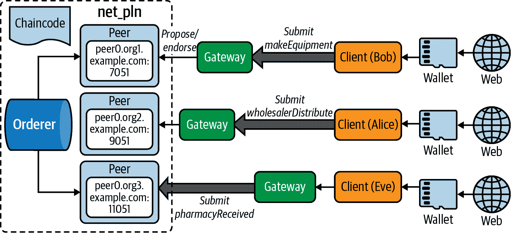

###### 图 7-6\. PLN 应用工作原理

制造商 Web 用户 Alice 通过钱包连接到 Fabric 网络。钱包为用户提供了一个经过授权的身份，该身份将被区块链网络验证以确保访问安全性。然后 Fabric SDK 将一个`makeEquipment`交易提案提交给 *peer0.org1.example.com*。认可对等体验证签名，模拟提案，并使用所需的参数调用`makeEquipment`链码函数。

在提案响应发送回 SDK 后启动交易。 应用程序收集和验证背书，直到链码的背书策略满足产生相同结果。 然后，客户端将交易提案和提案响应广播到订购服务。

订单服务按通道按时间顺序对它们进行排序，创建区块，并将事务块传递给通道上的所有对等节点。 对等方验证交易，以确保背书策略得到满足，并确保自交易执行生成提案响应以来分类帐状态未发生更改。 验证成功后，将区块提交到分类帐，并为每个有效交易更新世界状态。

您现在理解了交易的端到端工作流程。 是时候开始构建我们的药品分类帐客户端应用程序了。 图 7-7 显示了应用客户端项目结构。 对于批发商和药房，都有相同的文件夹结构可用。

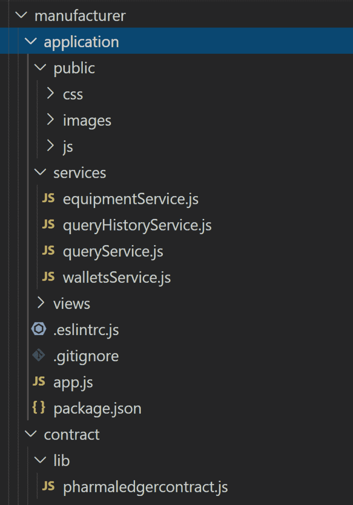

###### 图 7-7. 应用客户端项目结构

我们使用 *express.js* 来构建我们的 node 应用程序。让我们回顾一些重要的文件。

*package.json* 文件定义了两个与 Fabric 相关的依赖项：

```
     "dependencies" : {
        "fabric-contract-api" : "².1.2",
        "fabric-shim" : "².1.2"
    }
```

*app.js* 定义了制造商的所有入口点，而 `addUser` 将为制造商添加一个客户用户，我们的情况下是 Bob。 当制造商是所有者时，`makeEquipment` 将创建设备记录。 `queryByKey` 和 `queryHistoryByKey` 是所有三个组织的常见函数。 批发商和药房将拥有类似的功能：

```
app.post('/addUser',  async (req, res, next) => {
});
app.post('/makeEquipment',  async (req, res, next) => {
})
app. get('/queryHistoryByKey',  async (req, res, next) => {
})
app. get('/queryByKey', async (req, res, next) => {
})
```

`addUser` 将调用 `walletsService` 来添加用户。让我们来看看 `walletsService` 中的 `addToWallet(user)`：

```
const wallet = await Wallets.newFileSystemWallet('../identity/user/'+user+'/wallet');
```

`newFileSystemWallet`将为提供的文件系统目录下的输入用户（Bob）创建一个钱包。 接下来，我们找到用户证书和`privateKey`，并生成一个要存储在钱包中的 X.509 证书：

```
const credPath = path. join(fixtures,
'/peerOrganizations/org1.example.com/users/User1@org1.example.com');
const certificate = fs.readFileSync(path. join(credPath, '/msp/signcerts/User1@org1.example.com-
cert.pem')).toString();
const privateKey = fs.readFileSync(path.join(credPath, '/msp/keystore/priv_sk')).toString();
```

钱包调用关键类方法来管理`X509WalletMixin.createIdentity`*，*该方法用于使用 X.509 凭据创建 Org1MSP 身份。 该函数需要三个输入：`mspid`，证书和私钥：

```
 const identityLabel = user;
 const identity = {
            credentials: {
                certificate,
                privateKey
            },
            mspId: 'Org1MSP',
             type: 'X.509'
 }
 const response = await wallet.put(identityLabel, identity);
```

制造商的用户将调用`equipmentService makeEquipment`函数。 在任何用户可以调用智能合同函数之前，需要进行授权。 要授权用户访问区块链，我们需要按照以下步骤操作：

1.  找到通过添加用户功能创建的用户钱包：

    ```
      const wallet = await Wallets.newFileSystemWallet('../identity/user/'+userName+'/wallet');
    ```

1.  加载与用户关联的连接配置文件。 然后，钱包将用于定位并连接到网关：

    ```
      const gateway =  new Gateway();
         let connectionProfile =
    yaml.safeLoad(fs.readFileSync('../../../organizations/peerOrganizations/
    org1.example.com/connection-org1.json', 'utf8'));
          // Set connection options; identity and wallet
           let connectionOptions = {
            identity: userName,
            wallet: wallet,
            discovery: { enabled: true, asLocalhost: true }
          };
          await gateway.connect(connectionProfile, connectionOptions);
    ```

1.  一旦网关连接到通道，我们就可以在创建合同时找到我们的*pharmaLedgerContract*，该合同具有唯一的命名空间：

    ```
    const network = await gateway.getNetwork('plnchannel');
    const contract = await network.getContract('pharmaLedgerContract', 'org.pln.PharmaLedgerContract');
    ```

1.  提交`makeEquipment`链代码调用：

    ```
       const response = await contract.submitTransaction('makeEquipment', manufacturer, equipmentNumber,
    equipmentName, ownerName);
    ```

1.  要验证设备记录是否存储在区块链中，我们可以使用 Fabric 查询函数来检索结果。 以下代码显示了如何提交`query`或`queryHistory`函数以获取设备结果：

    ```
    const response = await contract.submitTransaction('queryByKey', key);
    const response = await contract.submitTransaction('queryHistoryByKey', key);
    ```

1.  让我们启动一个制造商，创建用户 Bob，然后向我们的 PLN 区块链提交交易。 转到*pharma-ledger-network/organizations/manufacturer/application*文件夹并运行`npm install`。 当我们启动应用程序时，我们还确保在*public/js*下的*plnClient.js*中更新客户端 IP 地址：

    ```
    var urlBase = " *http://your-machine-public-ip:30000*";
    ```

    ```
    npm install
    pharma-ledger-network/organizations/manufacturer/application$ node app.js
    App listening at http://:::30000
    ```

1.  在制造商中，我们将应用程序端口定义为 30000：

    ###### 注意

    确保此端口已打开，或者您可以将其更改为`app.js`行下的另一个可用端口号。

    ```
     var port = process.env.PORT || 30000;
    ```

1.  打开浏览器并输入`**http://your-machine-public-ip:30000**`：

    我们将在图 7-8 中看到显示屏。

    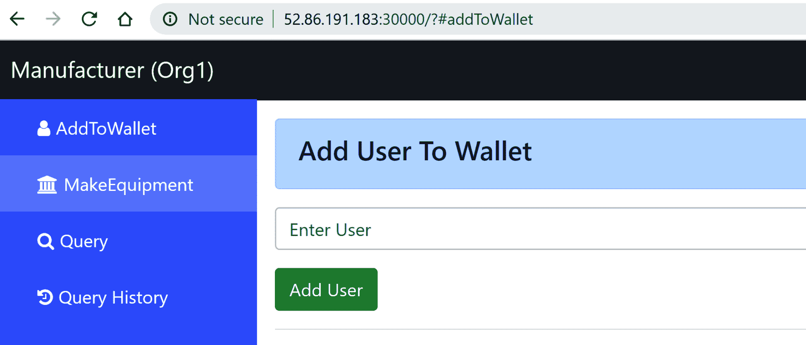

    ###### 图 7-8\. 为制造商向钱包添加用户

1.  默认页面是*addToWallet*。因为到目前为止我们还没有向钱包添加任何用户，所以你目前无法提交`makeEquipment`并查询历史事务。你必须向钱包添加一个用户。让我们将 Bob 添加为制造商用户，如图 7-9 所示。

    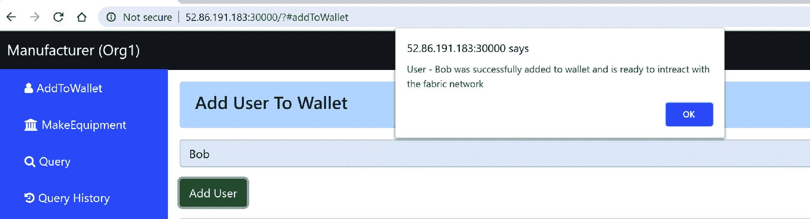

    ###### 图 7-9\. 新用户（Bob）被添加

1.  当用户钱包设置完成后，应用现在可以连接到我们的 PLN 并与链码进行交互。点击左侧菜单的 MakeEquipment，输入所有必需的设备信息，并提交请求 (图 7-10)。成功的响应将从区块链返回。

    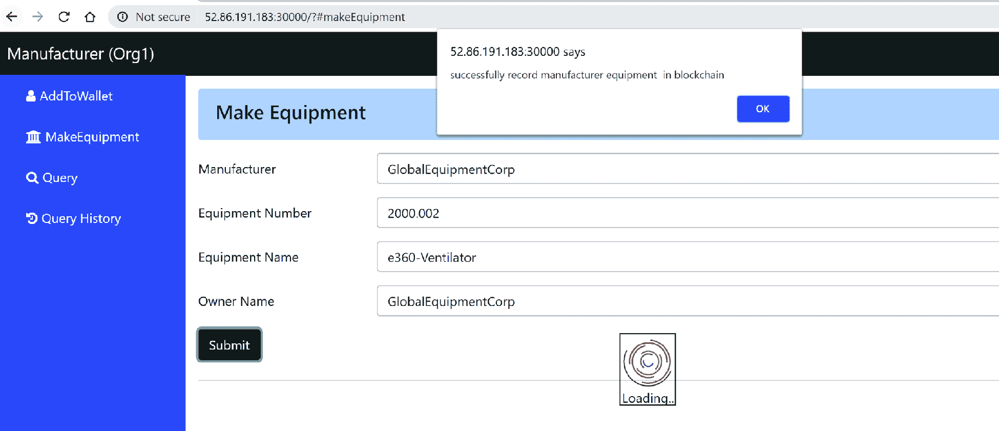

    ###### 图 7-10\. 向 PLN 网络添加设备

1.  我们现在可以通过设备编号在 PLN 网络中查询设备数据。图 7-11 展示了结果。

    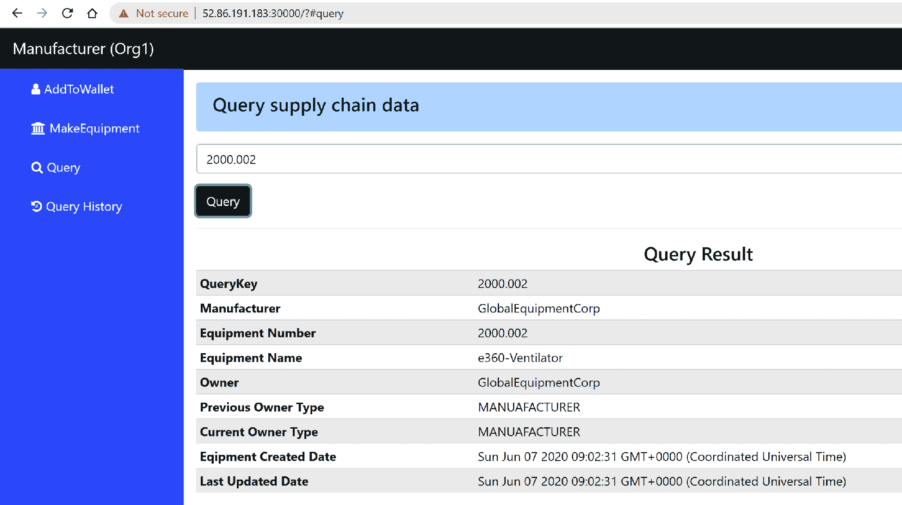

    ###### 图 7-11\. 在 PLN 网络上查询设备

1.  现在打开另外两个终端窗口，分别将批发商和药房的节点服务器启动。导航至/pharma-ledger-network/organizations/wholesaler/contract**.* 运行`npm install`先安装智能合约依赖。

1.  确保将基本 URL 更新为[*http://your-machine-public-ip:30001*](http://your-machine-public-ip:30001)在*plnClient.js*中。然后导航回*pharma-ledger-network/organizations/wholesaler/application*文件夹并运行以下命令：

    ```
    npm install
    node app.js
    This starts the wholesaler web App. Open a browser and enter: http://your-machine-public-ip:30001
    ```

1.  将 Alice 添加为批发商用户（图 7-12）并提交`wholesalerDistribute`请求：

    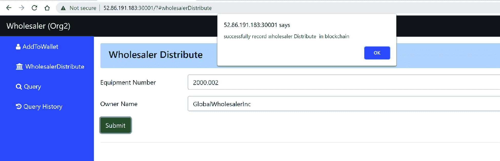

    ###### 图 7-12\. 将用户（Alice）添加到批发商

1.  通过启动药房节点服务器并将 Eve 添加为药房用户（图 7-13），按照相同步骤进行。提交 `pharmacyReceived` 请求：

    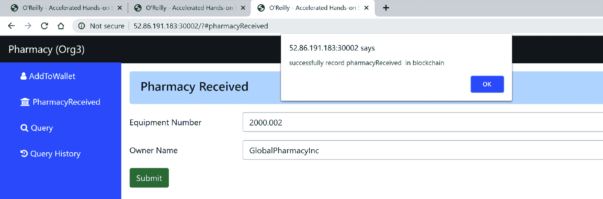

    ###### 图 7-13\. 将用户（Eve）添加到药房

现在，制药分类账供应链流程结束。Bob、Alice 和 Eve 可以查询设备数据并通过查询历史数据追溯整个供应链流程。只需进入任何用户，在查询历史页面搜索设备 `**2000.002**`，你应该能看到所有查询历史结果，如图 7-14 所示。

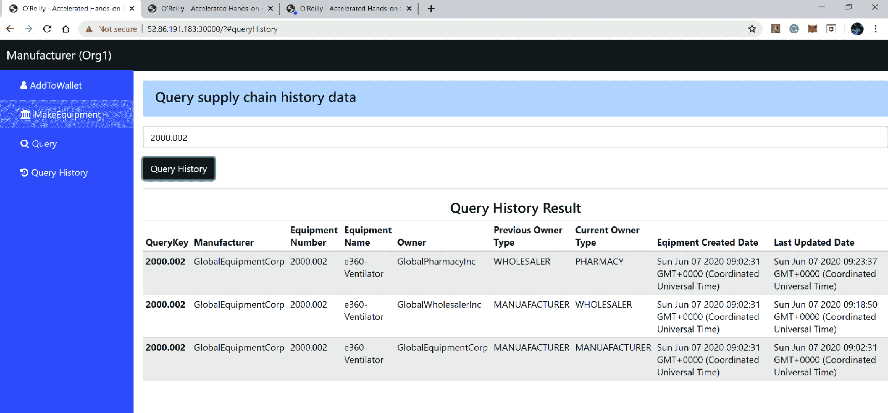

###### 图 7-14\. 查询设备历史数据

# 概要

在本章中，你学会了如何使用 Hyperledger Fabric 构建供应链 DApps。我们介绍了如何定义一个贸易联盟，分析 Pharma Ledger Network 的生命周期，并追溯设备的整个交易历史。我们花了大量时间编写链码作为智能合约，其中包括制造商、批发商和药房的逻辑。在设置了药房分类账 Fabric 网络环境后，我们逐步安装和部署了我们的智能合约到区块链。

我们通过命令行脚本测试了智能合约功能，以确保我们定义的所有函数都按预期工作。完成这项工作后，我们开始在 UI 页面上工作，你学会了如何将用户添加到钱包并通过 SDK 连接到 Fabric 区块链。我们还为制造商、批发商和药房构建了 UI 页面，允许这些组织中的用户提交相关请求以调用 PLN 区块链中的智能合约。

你可以看到构建端到端 Hyperledger Fabric 应用程序需要相当多的工作。所以我们希望你不会感到疲倦，因为在下一章中，我们将探讨另一个令人兴奋的主题：在云上部署 Hyperledger Fabric。
