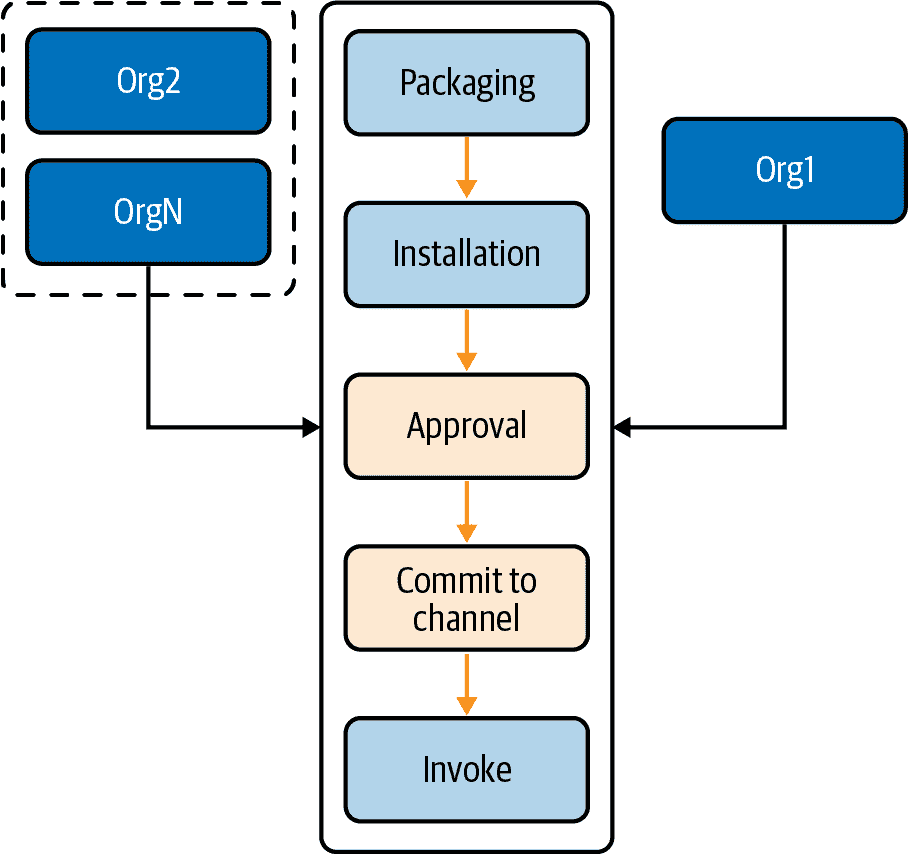
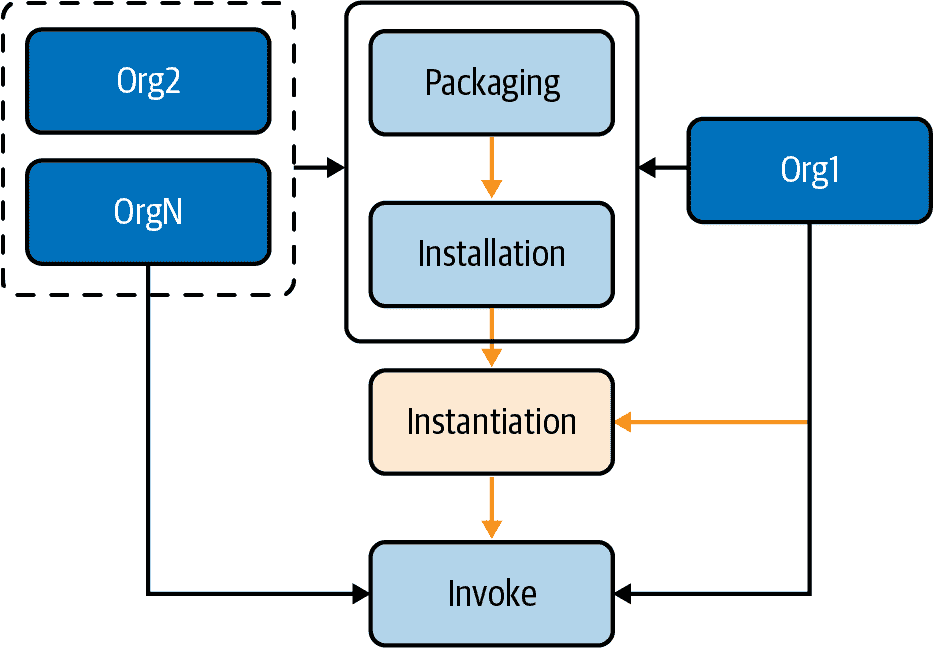
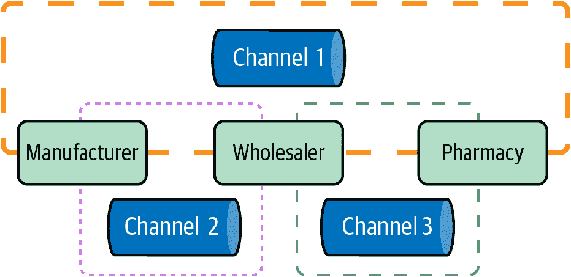
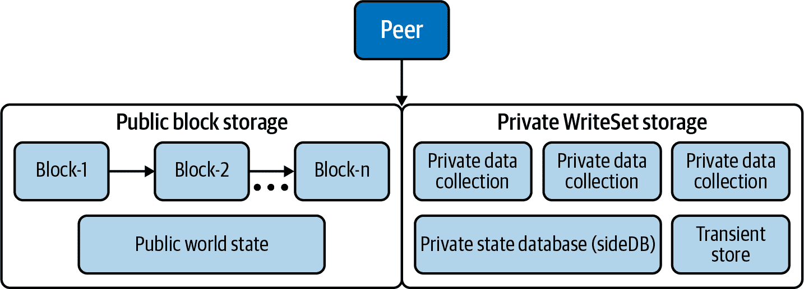
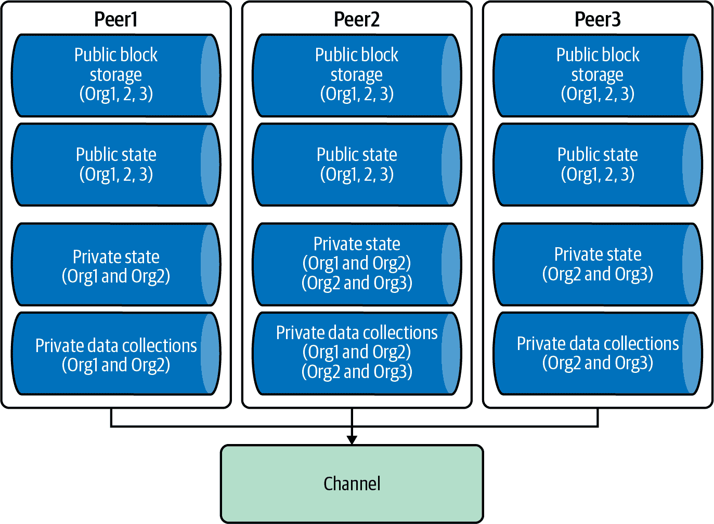
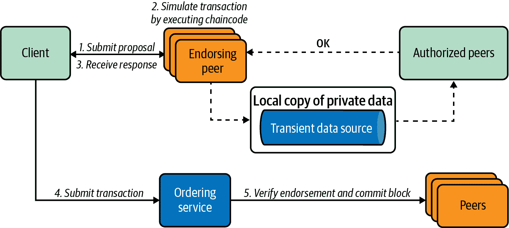

# 第九章 Hyperledger Fabric V2 集成

自 2017 年发布 Hyperledger Fabric v1.0.0 以来，Fabric v1.*x*（1.1、1.2、1.3、1.4）已经推出了许多次小版本。作为一个开源的、具有权限的分布式账本，Hyperledger Fabric 迅速成为了最受欢迎的企业级区块链框架之一，被从小型企业到全球企业的许多组织所采用。主要的云服务供应商——包括 AWS、IBM 和 Oracle——已经将 Fabric 纳入了他们的区块链云服务中，就像你在第八章中所看到的那样。Fabric 的益处和受欢迎程度源于其强大的企业级区块链应用架构。

在 2020 年，Hyperledger 社区发布了 Hyperledger Fabric v2，带来了许多改进，超越了 v1。这个重要的里程碑推动了企业区块链的采用，并增强了生产部署的效率和安全性。

本章将帮助您了解以下内容：

+   Hyperledger Fabric v2 的新功能

+   更新通道的能力级别

+   组件升级

+   进入 v2 的考虑因素

# Hyperledger Fabric V2 的新特性

Hyperledger Fabric 版本 2，或者简称 v2，建立在社区在过去四年中所学到的基础之上，提供了几项新功能和改进，使得 v2 成为了一个可用于生产环境的企业级区块链。Hyperledger Fabric 2.0 的新功能包括增强的智能合约治理支持、链码生命周期管理的改进、引入了新的 raft 共识机制、处理和共享私有数据的新模式，以及更强大的令牌支持。让我们来探索这些特性。

## 智能合约的去中心化治理

在 v2 之前，链码生命周期流程包括以下步骤：打包、安装和实例化。如果多个组织参与拥有相同的链码，就需要进行打包步骤。只需要一个组织安装链码，并可选地指定实例化策略。链码安装在链码所有者的背书节点上。通过签名的打包链码，可以实例化链码并发送给其他所有者进行检查和签名。当其他节点拒绝安装链码时，原始所有者将无法执行链码，但仍可验证和提交交易。一旦链码安装完成，链码尚未进入通道，因为尚未实例化到通道中。当选定的节点执行链码实例化时，实例化交易将调用生命周期系统链码（LCSC）。链码进入活动状态，可以在通道上执行。

图 9-1 展示了 Hyperledger Fabric 1.4 链码的生命周期操作。



###### 图 9-1\. Hyperledger Fabric 1.4 链码生命周期操作

在此链码生命周期操作中的一个主要缺点是链码治理：只有一个组织需要实例化、编写、部署和更新所有网络中的链码。这一中心化的过程限制了其他组织参与链码治理。

Hyperledger Fabric v2 为链码生命周期引入了分散治理。新流程要求多个组织同意链码的参数，并批准它在通道上的操作方式，而不是由单一组织实例化。这一更为民主的流程显著提高了网络安全性。例如，在一个由两个组织组成的网络中，需要所有通道成员批准链码定义后，才能将链码提交到通道。

图 9-2 展示了 Hyperledger Fabric v2 链码生命周期操作。



###### 图 9-2\. Hyperledger Fabric 2 链码生命周期操作

与 1.4 版本相比，新的生命周期取消了实例化步骤，并用两个新步骤替换：批准链码（由所有组织成员执行）和提交链码定义。

这里是用于链码初始化的`peer`命令列表：

```
peer lifecycle chaincode package ${CHAINCODE_NAME}.tar.gz
peer lifecycle chaincode install ${CHAINCODE_NAME}.tar.gz
peer lifecycle chaincode approveformyorg
peer lifecycle chaincode commit
```

在第七章中，我们详细介绍了整个链码操作过程；让我们快速回顾一下如何在配置中定义链码生命周期背书策略。

打开项目*configtx*文件夹下的*configtx.yaml*。`Application`部分定义了用于将值编码为配置交易或区块以用于应用相关参数的值：

```
Application: & ApplicationDefaults

    # Organizations is the list of orgs which are defined as participants on
    # the application side of the network
    Organizations:

    # Policies defines the set of policies at this level of the config tree
    # For Application policies, their canonical path is
    #   /Channel/Application/<PolicyName>
    Policies:
        Readers:
            Type: ImplicitMeta
            Rule: "ANY Readers"
        Writers:
            Type: ImplicitMeta
            Rule: "ANY Writers"
        Admins:
            Type: ImplicitMeta
            Rule: "MAJORITY Admins"
        LifecycleEndorsement:
            Type: ImplicitMeta
            Rule: "MAJORITY Endorsement"
        Endorsement:
            Type: ImplicitMeta
            Rule: "MAJORITY Endorsement"

    Capabilities:
        <<: *ApplicationCapabilities
```

在这里，您可以定义生命周期背书策略的类型。在我们的案例中，我们将治理定义为`MAJORITY Endorsement`。如果未明确指定背书策略，则将使用此`MAJORITY Endorsement`策略作为默认策略。它要求大多数对等节点参与通道中的链码交易验证和执行，并将交易提交到账本。

我们使用通道配置来定义我们的供应链认可策略。您还可以明确指定认可的签名策略；例如，以下命令将要求 `Org1` 和 `Org2` 的成员签署交易：

```
peer lifecycle chaincode approveformyorg --signature-policy "AND('Org1.member', 'Org2.member')"  --tls
$CORE_PEER_TLS_ENABLED --cafile $ORDERER_CA --channelID $CHANNEL_NAME --name ${CHINCODE_NAME} --version
${VERSION}  --package-id ${PACKAGE_ID} --sequence ${VERSION}
```

在 *configtx.yaml* 中的通道配置策略可以通过编辑特定通道的文件 *configtx.yaml* 进行自定义或覆盖。在需要更新配置值时，可以通过编辑特定通道的文件来自定义或覆盖 *configtx.yaml* 中的通道配置策略。

## 新的链码应用模式

如前所述，新的链码去中心化生命周期管理将应用于链码操作。这将确保多个组织必须同意链码的参数并批准它将如何在通道上运行。新的链码应用模式将允许以下操作：

自动化检查

组织可以自动化检查并在向订购服务提交交易提案请求之前验证附加的链码信息。

去中心化协议

个人决策可以建模为一个需要多个交易的链码过程。根据定义的分类账交易策略，链码可能需要不同的组织同意处理该交易。一旦所有个体交易者都得到满足，并由最终的链码提案验证通过，业务交易就会在所有通道成员之间最终确定。

## 私密数据增强

在集中式应用程序中，超级用户可以查看所有数据库数据，并授予选定的成员访问权限。在区块链网络中，交易数据存储在分类账中，该分类账与所有参与者共享。在 v2 之前，为了使数据免受通道上其他组织的影响，我们必须创建一个新的通道，其中包含需要访问数据的组织。

今天，Hyperledger Fabric MSP 将确保网络中所有成员的隐私。MSP 提供了成员操作的抽象，并定义了成员资格如何受到管理和认证的规则。Fabric 有三种类型的 MSP：

网络 MSP

定义网络中的成员

通道 MSP

根据通道策略定义谁可以参与给定通道上的某些操作

对等方/订购者 MSP

对于单个对等方或订购者的本地 MSP，用于识别同一组织的成员

在构建我们的供应链 DApps 示例中，我们在区块链中有制造商、批发商和药房组织。它们通过创建从制造商到药房的通道来共享所有设备所有权转移数据。在 图 9-3 中，我们可以看到所有三个组织都可以查看该通道 1 的账本数据。



###### 图 9-3。三个组织的通道 1 账本数据

与制造商完成交易后，批发商还可能希望向药房保留交易的机密数据。他们可以创建通道 2，在该通道中药房无法看到交易。

批发商可能还想与药房建立私密数据关系，因此他们创建了通道 3。同样，制造商无法看到通道 3 中的交易。

通道设计非常优雅，提供了一个子网络，可以在一组组织内保持所有交易的机密性。然而，这种设计也有一些缺点。首先，它需要额外的管理开销（创建通道、部署链码、更新策略和 MSPs 等）。其次，它不允许所有通道参与者看到交易数据，而是为选定的成员保留了部分数据隐私。第三，当许多成员（数百人）参与联盟网络时，这些成员可能在网络中创建大量的通道。这将使网络变得非常复杂和难以维护，并且跟踪通信将变得困难。

Hyperledger Fabric v2 不是创建多个频道，而是通过引入新的背书策略提供增强的私有数据集或策略配置。Fabric 可以在对等节点上创建私有数据集，有时称为*SideDB*，可以与选定的对等方共享。私有数据集有两个元素：实际的私有数据和私有数据的哈希值。

*实际的私有数据*通过允许的对等方之间通过八卦数据传播协议发送。每个传播的消息都经过签名，其他未经授权的对等方将被阻止看到该消息。数据存储在一个 SideDB 中。这个过程不涉及排序服务，该服务可能由一个未经授权的组织控制。

图 9-4 展示了公共数据和私有数据集如何存储在对等节点中。



###### 图 9-4\. 公共数据和私有数据集如何存储在对等节点中

公共块存储包含每个通道的交易日志和公共世界状态数据。世界状态保持数据的当前状态。通道成员可以查看此数据。背书交易日志存储在通过哈希机制按顺序链接的块中。

私有块存储由私有`writeSet`存储、私有状态数据库和临时存储组成。私有`writeSet`存储了许多私有数据收集以及每个私有数据收集的所有私有历史交易。私有状态数据库是保存私有数据收集当前状态的全球状态存储。临时存储用于在事务调用过程中存储临时私有数据。临时数据用于确定对等方在链码背书时间是否已经接收到私有数据。

订单者验证交易后，私有数据的*哈希值*被打包进块并写入总账。密码哈希作为交易的证据，并允许通道中的授权组织背书、提交或查询私有数据。

在我们的供应链示例中，所有三个对等方都为每个相关的私有收集拥有私有状态数据库实例。制造商和批发商之间的私有数据仅由`Org1`的对等方和`Org2`的对等方私下管理。同样，`Org2`的对等方和`Org3`的对等方将维护批发商和药店的私有数据收集。图 9-5 展示了这三个对等方在同一通道上具有两个私有数据收集的情况。



###### 图 9-5\. 同一通道上具有两个私有数据收集的三个对等方

要了解 Fabric 私有数据的工作原理，让我们看看事务周期中如何执行事务流程。图 9-6 描述了在 Hyperledger Fabric v2 中处理私有数据交易的端到端系统流程。



###### 图 9-6。在 Hyperledger Fabric v2 中处理私有数据交易的端到端系统流程

以下是流程的步骤：

1.  客户端通过向背书节点发送带有私有数据的交易提案请求来启动交易。这些背书节点是私有数据集的授权组织。

1.  背书节点通过使用暂时数据存储中的私有数据的本地副本来模拟交易，以执行链码。此链码执行通过八卦协议将私有数据分发给授权节点，并将结果发送回应用程序。

1.  此时，客户端应用程序将交易与背书（包括带有私有数据哈希的提案响应）组合起来，并将其广播到排序服务。私有数据哈希将分发给所有节点。在不知道实际私有数据的情况下，通道上的所有节点可以以一致的方式参与交易验证。

1.  最后，授权节点检查收集策略，以确保客户端有权限访问私有数据。如果授权节点在本地暂时数据存储中没有私有数据，则它们将从其他授权节点拉取数据以获取私有数据。

1.  一旦私有数据与公共区块中的哈希相匹配，交易将在区块中得到确认。授权节点中的私有状态数据库和私有`writeSet`存储将被更新。然后，暂时数据存储中的私有数据将被删除。

现在你了解了私有数据是如何工作的。在转移到下一个新的 v2 特性之前，让我们快速回顾一下私有数据集是如何定义的。以下是一个示例集合定义 JSON 文件：

```
 [
 {
    "name": "ORG12-PD",
    "policy": "OR('Org1MSP.member', 'Org2MSP.member')",
    "requiredPeerCount": 1,
    "maxPeerCount": 3,
    "blockToLive": 1000000,
"memberOnlyRead": true,
"memberOnlyWrite": true
 },
 {
    "name": " ORG23-PD ",
    "policy": "OR('Org2MSP.member', 'Org3MSP.member')",
    "requiredPeerCount": 1,
    "maxPeerCount": 3,
    "blockToLive": 0,
"memberOnlyRead": true
]
```

文件包含两个私有数据集合定义。在每一个中，我们需要指定集合名称。表 9-1 显示了 JSON 配置的关键字定义。

表 9-1\. 私有数据配置中的关键字

| 关键字 | 定义 |
| --- | --- |
| `name` | 集合的名称 |
| `policy` | 定义哪些组织的对等体有权操作集合数据 |
| `requiredPeerCount` | 必须有最少数量的对等体成功传播私有数据。 |
| `maxPeerCount` | 为了数据冗余，当 `maxPeerCount` 大于 `requiredPeerCount` 时，如果一个背书对等体在背书时间和提交时间之间不可用，则尚未收到私有数据的任何对等体可以从其他参与过程的对等体中获取它。 |
| `blockToLive` | 定义数据在私有数据库中以区块为单位存活多长时间。 |
| `memberOnlyRead` | 定义数据在私有数据库中以区块为单位存活多长时间； `memberOnlyRead` 定义客户端 |

当使用对等体 CLI 来批准和提交链码定义时，您可以使用与以下类似的集合定义文件的 `--collections-config` 标志：

```
 peer lifecycle chaincode commit --collections-config path/collections_config.json
```

要读取或写入私有数据，我们可以使用一个垫片 API。例如，我们可以使用 `PutPrivateData(*collection*,*key*,*value*)` 来将私有数据存储在私有的 `writeSet` 存储中，以及使用 `GetPrivateData(*collection*,*key*)` 来查询私有数据。

## 外部链码启动器

在 Hyperledger Fabric v2 之前，链码维护过程相当复杂和繁琐。在分散环境中，维护是一个真正的挑战。在大多数情况下，需要多个对等方安装代码在多组织联盟网络中。

这里简要介绍了一些 Hyperledger v1 的限制：

+   用于构建和启动链码的过程是对等方实现的一部分。要自定义此过程，您必须更改源代码并重新构建链码。

+   所有安装在对等方上的链码都是通过传递硬编码的特定语言逻辑构建的。例如：

    ```
    peer chaincode install -n mychannel -l golang
    ```

+   此构建过程需要 Docker 作为部署环境的一部分。该过程会为在 Docker 容器中执行链码生成 Docker 容器映像。客户端可以通过容器连接到对等方。

+   要构建和启动链码，对等方需要访问 Docker 守护程序的权限，这可能会在生产环境中造成问题。

为了增强开发和部署过程，v2 配备了外部构建器和启动器，它们的功能是赋予运营商在构建过程中进行最佳自定义，使得链码可以独立部署和执行（在 Fabric 系统之外）。这进一步提供了部署其他流行容器系统（如 Kubernetes pods）的机会。

在此更新之前，不同语言（如 Java 和 Node.js）的链码需要编译并构建为链码二进制文件，然后与 Go shim 库一起打包，以创建链码服务器。现在，Go shim API 可以打包成独立于链码服务器的形式。用户链码可以独立打包并作为外部服务运行，并通过链码 ID、服务器端点地址、TLS 信息等连接到链码服务器。

这种松散耦合模块设计提供了一种灵活的方式在类似 Kubernetes 的云服务环境中运行。Hyperledger Fabric 外部构建器和启动器在很大程度上基于 Heroku buildpacks。要利用外部构建器和启动器，您需要创建自己的 buildpack，然后修改 peer 的 *core.yaml* 中的 `externalBuilder` 配置。如果未指定任何配置的外部构建器，则 Fabric 将使用标准 Fabric 打包工具，如 peer CLI 或 node SDK。让我们更详细地探讨一下这个问题。

*Buildpacks* 是一组开源脚本，负责将部署的代码转换为目标环境。根据所选的编程语言，这些脚本将检查您的应用程序，下载相关依赖项，并确定如何配置应用程序 chaincode 以与绑定的 chaincode 服务器通信。

一个外部构建器和启动器存储库在 *bin* 目录中包含以下四个脚本：

第一个脚本是 *detect* 脚本。此脚本确定是否应该应用 buildpack 来构建 chaincode 包并启动它。peer 使用两个参数调用 *detect*：`CHAINCODE_SOURCE_DIR` 是 chaincode 源的位置，`CHAINCODE_METADATA_DIR` 是安装到 peer 的 chaincode 包的 *metadata.json* 文件的目录。

Fabric 运行 *detect* 脚本来确定是否应该应用 chaincode 源包，根据返回值。因此，如果脚本返回值为 0，则应该应用 chaincode 源包；相反，当脚本返回非零值时，它不会采取任何操作。

这里是一个简单的*检测* Go chaincode 脚本的示例：

```
#!/bin/bash

if [ $# -ne 2 ]; then
    echo "Expected 2 input got $#"
    exit 1
fi

CHAINCODE_METADATA_DIR="$2"

if [ "$(jq -r .type "$CHAINCODE_METADATA_DIR/metadata.json" | tr '[:upper:]' '[:lower:]')" = "golang" ]; then
    exit 0
fi

exit 1
```

此脚本使用 `jq`，一个轻量级命令行 JSON 处理器，来检查 chaincode 语言是否为 Go，以及在运行脚本时是否传递了至少两个参数。

第二个脚本是 *build*。此脚本执行构建包逻辑，并将链码包转换为可执行链码。

对等体使用三个参数调用 *build*：

```
bin/build SOURCE_DIR METADATA_DIR BUILD_OUTPUT_DIR
```

以下是一个简单的用于 Go 链码的 *build* 脚本示例：

```
 #!/bin/bash

if [ $# -ne 3 ]; then
    echo "Expected 3 input got $#"
    exit 1
fi

SOURCE_DIR="$1"
METADATA_DIR="$2"
OUTPUT_DIR="$3"

# extract package path from metadata.json
GO_PACKAGE="$(jq -r .path "$METADATA_DIR/metadata.json")"
if [ -f "$SOURCE_DIR/src/go.mod" ]; then
    cd "$SOURCE_DIR/src"
    go build -v -mod=readonly -o "$BUILD_OUTPUT_DIR/chaincode" "$GO_PACKAGE"
else
    GO111MODULE=off go build -v  -o "$BUILD_OUTPUT_DIR/chaincode" "$GO_PACKAGE"
fi

# save statedb index metadata to provide at release
if [ -d "$SOURCE_DIR/META-INF" ]; then
cp -a "$SOURCE_DIR/META-INF" "$OUTPUT_DIR/"
```

Fabric 运行 *build* 脚本。如果脚本返回成功代码 0，则将 `BUILD_OUTPUT_DIR` 的内容复制到对等持久存储；否则，构建步骤应视为失败。

第三个脚本是 *release*。此脚本向对等体提供元数据，指示如何执行链码。

第四个脚本是 *run*。此脚本运行链码。

要实现外部构建器，您可以在 *bin* 子文件夹内创建自己的外部构建器目录。然后在该目录下创建所有四个脚本：

```
     external-builder/bin
detect
build
run
release
```

要确保对等体选择外部构建器，您需要在对等体的 *core.yaml* 中添加 `externalBuilder` 信息。我们可以检查 *fabric-samples* 文件夹 *(/path/fabric-samples/config*) 中的 *core.yaml*。默认的 `externalBuilders` 部分是一个空数组 []。您可以使用所需信息更新 `externalBuilders` 部分。以下示例定义了一个外部构建器：

```
    externalBuilders:
        - path: /path-to-external-builder/external-builder
          name: externalBuilders-sample
          environmentWhitelist:
             - GOPROXY
             - GONOPROXY
             - GOSUMDB
             - GONOSUMDB
             - GOCACHE
             - GOPATH
             - GOROOT
             - HOME
             - XDG_CACHE_HOME
```

在此示例中，我们定义了 `externalBuilders-sample`，该示例在 */path-to-external-builder/external-builder* 下有一个 *external-builder* 脚本。

环境允许列表包含仅在对等体调用构建脚本时传播的值。

如果外部构建器脚本包含未包含在 *hyperledger/fabric-peer* Docker 镜像下的命令（例如，我们示例中的 *jq* 库），则需要构建自己的对等体镜像。

Fabric Docker 镜像可在 [*https://github.com/hyperledger/fabric.git*](https://github.com/hyperledger/fabric.git) 上获得，因此您可以在自己的环境中克隆并修改 Docker 镜像。在 *fabric/images/peer* 文件夹下，您可以更新对等 Dockerfile。例如，您可以添加`jq`命令，如下所示：

```
 RUN apk add --no-cache tzdata jq
```

一旦更新了 Dockerfile，就可以使用新名称构建一个新的对等体镜像，例如：

```
docker build -t fabric-peer:2.1.0-external-builder 
```

一旦成功构建了镜像，它将包含 *jq*。

由于对等 Docker 镜像已更新，您需要更新相关的对等 Docker Compose 文件。以下示例显示了此文件中的对等部分：

```
peer0.org2.example.com:
    container_name: peer0.org2.example.com
    image: fabric-peer:2.1.0-external-builder
    environment:
    volumes:
        - peer0.org2.example.com:/var/hyperledger/production
        - /path../external-builder:/etc/hyperledger/external-builder
```

完成此步骤后，您可以使用新的对等体镜像启动一个 Fabric 网络。您可以运行外部构建器和启动器。

## CouchDB 的状态数据库缓存

Fabric 支持两种对等状态数据库：LevelDB 和 CouchDB。对等节点中嵌入的默认状态数据库是 LevelDB。

*LevelDB* 是一个开源的、基于磁盘的、快速的键值存储系统。*CouchDB* 是一个文档存储的 NoSQL 数据库。它可以以灵活的基于文档的结构（JSON 格式）存储数据，并支持强大的数据映射，允许丰富的查询、组合和过滤信息。你可以创建索引来支持丰富的查询。

在 Fabric v2 之前，使用外部 CouchDB 状态数据库时，查询会在背书和验证阶段跨网络获取结果。这造成了性能瓶颈。使用 Fabric v2 后，状态数据缓存在对等节点中。Fabric 不再进行昂贵的查找，而是从本地缓存中查询状态数据以获取结果。这可以极大地提高网络性能。

要设置缓存大小，请更新对等 *core.yaml* 的 `cacheSize` 属性。以下是 `ledger -> state` 部分的 *core.yaml* CouchDB 配置示例：

```
ledger:
  state:
    stateDatabase: CouchDB
    totalQueryLimit: 100000
    couchDBConfig:
       couchDBAddress: 127.0.0.1:5984
       username:
       password:
       maxRetries: 3
       maxRetriesOnStartup: 10
       requestTimeout: 35s
       internalQueryLimit: 1000
       maxBatchUpdateSize: 1000
       warmIndexesAfterNBlocks: 1
       createGlobalChangesDB: false
       cacheSize: 128
```

我们首先将数据库定义为 CouchDB。默认的 `totalQueryLimit` 是 `100000`，无论是否使用分页 API。`couchDBConfig` 指定了 CouchDB 相关的配置。当将可选的 `createGlobalChangesDB` 标志设置为 `true` 时，Fabric 将同步网络状态数据更改并维护数据库，这需要额外的系统资源。默认值为 `false`。`cacheSize` 设置定义了如何为内存存储分配状态数据，以兆字节（MB）表示。`cacheSize` 的值需要是 32 MB 的倍数，否则 Fabric 将其舍入为下一个 32 MB 的倍数。我们可以定义 0 MB 来禁用缓存。

## 基于 Alpine 的 Docker 镜像

从版本 2.0 开始，Hyperledger Fabric Docker 镜像现在基于面向安全、轻量级的 *Alpine Linux* 构建。这个由社区开发的操作系统围绕 *musl* libc 和 BusyBox 构建。由于其小的镜像大小，在云、微服务和容器环境中被广泛采用。

*BusyBox* 是一个单一的可执行文件，提供了许多常见 Unix 实用程序的微型版本。它可以在各种可移植操作系统接口（POSIX）环境中运行，如 Linux、Android 和 FreeBSD。BusyBox 采用模块化、大小优化和资源有限的设计，因此非常容易定制为任何小型或嵌入式系统。

*musl* 是一个用于 ISO C 和 POSIX 标准描述的标准库功能的 C 实现。通过在 *musl* 中使用静态链接，应用程序能够获取运行所需的基本代码或数据，从而实现更高效的应用程序部署。*Musl* 将整个标准库实现，包括线程、数学、动态链接器本身整合到一个共享对象中。这消除了动态链接的大部分启动时间和内存开销。

使用 *musl* libc 和 BusyBox，Alpine 大小通常约为 8 MB；与最小磁盘安装相比，这相当小，后者可能约为 130 MB。这导致在容器中大量使用的操作系统的启动时间更快。在 Alpine Linux 中，所有用户空间（Userland）二进制文件都被编译为具有堆栈破坏保护的位置无关可执行文件（PIE），这使其非常安全。

让我们看一下 Hyperledger Fabric 1.3 和 2.0 中的 Docker 镜像 —— 具有最新标签的 Docker 镜像以及作为 Fabric 二进制文件下载的一部分将下载的不同标记版本的 Docker 镜像。Table 9-2 展示了 Hyperledger Fabric 1.3 中 Docker 镜像的大小。

Table 9-2\. Hyperledger Fabric 1.3 中的 Docker 镜像

| 包 | 版本 | 大小 |
| --- | --- | --- |
| *Inyperledger/fabric-ca* | 1.3.0-rel | 244 MB |
| *Inyperledger/fabric-ca* | 最新 | 244 MB |
| *Inyperledger/fabric-tools* | 1.3.0-rel | 1.5 GB |
| *Inyperledger/fabric-tools* | 最新 | 1.5 GB |
| *Inyperledger/fabric-ccenv* | 1.3.0-rel | 1.38 GB |
| *inyperledger/fabric-ccenv* | 最新 | 1.38 GB |
| *Inyperledger/fabric-orderer* | 1.3.0-rel | 145 GB |
| *Inyperledger/fabric-orderer* | 最新 | 145 GB |
| *Inyperledger/fabric-peer* | 1.3.0-rel | 151 MB |
| *Inyperledger/fabric-peer* | 最新 | 151 MB |
| *Inyperledger/fabric-zookeeper* | 0.4.12 | 1.39 GB |
| *Inyperledger/fabric-zookeeper* | 最新 | 1.39 GB |
| *ihyperledger/fabric-kafka* | 0.4.12 | 1.4 GB |
| *ihyperledger/fabric-kafka* | 最新 | 1.4 GB |
| *Inyper ledger/fabric-—couchdb* | 0.4.12 | 1.45 GB |
|   | *Inyper ledger/fabric-—couchdb* | 最新 | 1.45 GB |

接下来，让我们看一下 Hyperledger Fabric v2 中的 Docker 镜像大小，这些镜像在 Table 9-3 中列出。

Table 9-3\. Hyperledger Fabric v2 中的 Docker 镜像

| 包 | 版本 | 大小 |
| --- | --- | --- |
| *hyperledger/fabric-—javaenv* | 2.1.0-external-builder | 56.9 MB |
| *hyperledger/fabric—javaenv* | None | 895 MB |
| *hyperledger/fabric-javaenv* | None | 1.12 GB |
| *hyperledger/fabric-tools* | 3.10 | 5.58 MB |
| *hyperledger/fabric-tools* | 2.0 | 505 MB |
| *hyperledger/fabric-tools* | 2.0.1 | 505 MB |
| *hyperledger/fabric-peer* | Latest | 505 MB |
| *hyperledger/fabric-—peer* | 2.0 | 512 MB |
| *hyperledger/fabric-peer* | 2.0.1 | 512 MB |
| *hyperledger/fabric-orderer* | Latest | 512 MB |
| *hyperledger/fabric-orderer* | 2.0 | 57.2 MB |
| *hyperledger/fabric-orderer* | 2.0.1 | 57.2 MB |
| *hyperledger/fabric-ccenv* | Latest | 57.2 MB |
| *hyperledger/fabric-ccenv* | 2.0 | 39.7 MB |
| *hyperledger/fabric-ccenv* | 2.0.1 | 39.7 MB |
| *hyperledger/fabric-baseos* | Latest | 39.7 MB |
| *hyperledger/fabric-baseos* | 2.0 | 529 MB |
| *hyperledger/fabric-baseos* | 2.0.1 | 529 MB |
| *hyperledger/fabric-ca* | Latest | 529 MB |
| *hyperledger/fabric-ca* | 2.0 | 6.9 MB |
| *hyperledger/fabric-ca* | 2.0.1 | 6.9 MB |

我们可以看到，在 v2 版本中，图像大小显著减小了，例如，v1.3 中的 *fabric-tools* 为 1.5 GB，而在 v2 版本中仅为 512 MB。

## 样本测试网络

在 v2 版本之前，*first-network* 是用来演示 Hyperledger Fabric 工作原理的最常见示例。在 v2 版本中，*fabric-samples* 存储库中包含了一个新的 Fabric 测试网络，作为 *first-network* 示例的长期替代品。

### 项目结构

v2 测试网络项目结构更加有条理。例如，所有 Docker 文件都放置在 *docker* 文件夹下，与组织相关的配置放置在 *organizations* 文件夹下。*scripts* 文件夹包含智能合约安装和部署相关的脚本。这使得测试网络易于测试应用程序和智能合约。我们在第七章的供应链项目中构建了类似的项目结构。在第一个网络中，大多数 Docker 文件都在根项目文件夹下，因此没有组织文件夹。

### Peers 和组织

测试网络将一个 peer 定义为两个组织，而第一个网络则带有两个 peers，每个 peer 都有两个组织。表 9-4 展示了这两个示例网络中的 peers 和组织。

表 9-4\. 测试网络和第一个网络中的 peers 和组织

| 测试网络 | 第一个网络 |
| --- | --- |

| *peer0.org1.example.com peer0.org2.example.com* | *peer0.org1.example.com* *peer1.org1.example.com*

*peer0.org2.example.com*

*peer1.org2.example.com* |

### 生成加密材料

在第一个网络中，只支持 Cryptogen 用于生成加密材料。然而，在测试网络中，加密材料可以通过 Cryptogen 或组织 CA 生成。以下是测试网络中处理这两种类型加密材料的脚本：

```
function createOrgs() {
  # Create crypto material using cryptogen
  if [ "$CRYPTO" == "cryptogen" ]; then
echo "##### Generate certificates using cryptogen tool #########"
    ....
    cryptogen generate --config=./organizations/cryptogen/crypto-config-org1.yaml --
output="organizations"
     ...
    cryptogen generate --config=./organizations/cryptogen/crypto-config-org2.yaml --
output="organizations"
    ....
    cryptogen generate --config=./organizations/cryptogen/crypto-config-orderer.yaml --
output="organizations"
  fi
  # Create crypto material using Fabric CAs
  if [ "$CRYPTO" == "Certificate Authorities" ]; then
    echo "##### Generate certificates using Fabric CA's ############"
    IMAGE_TAG=${CA_IMAGETAG} docker-compose -f $COMPOSE_FILE_CA up -d 2>&1
    . organizations/fabric-ca/registerEnroll.sh
    ....
    createOrg1
    createOrg2
    createOrderer
  fi

}
```

由于测试网络支持使用 CA 来进行加密材料，这使得将应用用户注册到网络中变得更加容易。

# 更新通道的功能级别

当升级到最新的 2.*x* 版本时，我们需要升级 Fabric 通道以及通道中的组件，例如 orderer 和 peers。在本节中，我们将讨论如何更新通道的功能级别。

Fabric 在每个通道的配置中启用功能级别。这些版本功能需要与节点二进制版本密切相关。当定义时，它必须存在于 Fabric 二进制文件中。例如，当添加新的 MSP 类型时，新的二进制文件（v2）可以验证这些交易的签名，而旧的二进制文件（v1.*x*）可能会失败。这可能导致具有不同世界状态的 Fabric 二进制文件的多个版本。

整个通道的三个功能可以在 *configtx.yaml* 的 `capabilities` 部分中配置。

以下是针对 2.*x* 和 1.*x* 的功能的示例配置：

| 2.*x* | 1.*x* |
| --- | --- |

| 功能：

+   通道：&ChannelCapabilities

    +   V2_0: true

+   订购方：&OrdererCapabilities

    +   V2_0: true

+   应用程序：&ApplicationCapabilities

    +   V2_0: true

| 功能：

+   通道：&ChannelCapabilities

    +   V1_4_3: true

    +   V1_3: false

    +   V1_1: false

+   订购方：&OrdererCapabilities

    +   V1_4_2: true

    +   V1_1: false

+   应用程序：&ApplicationCapabilities

    +   V1_4_2: true

    +   V1_3: false

    +   V1_2: false

    +   V1_1: false

|

通道功能适用于对等方组织和订购服务。订购服务和对等方的二进制级别至少需要达到定义的最低级别，以便处理该功能。当 `ChannelCapabilities V2_0` 设置为 `true` 时，它期望通道上的所有订购方和对等方都需要达到 v2.0.0 或更高版本。

订购方功能仅适用于订购服务。订购方功能不涉及对等方或交易流程，因此当订购方失败时，只有订购服务管理员会受到影响。

应用功能仅适用于对等方。在私有数据的情况下，订购服务管理员和通道管理不涉及对等组织之间私有数据的设置，因此我们只能为私有数据启用这些功能。

在 *configtx.yaml* 中定义能力级别时，我们还需要将二进制文件升级到至少与相关能力级别相对应的水平；否则，二进制文件将崩溃，这可能会导致账本分叉。一旦启用了某个功能，它就是永久的，不可逆转的。即使回滚配置更改，旧的二进制文件也无法参与通道的交易。

###### 警告

在生产中启用功能之前，我们建议在测试环境中尝试新功能，以确保预期的结果。

## 更新到最新的功能级别

当我们开始升级到 v2 时，根据您自己的用例或要求更新到最新的功能变得必要。请注意，在使用最新版本的功能之前，可能需要更新到最新的功能级别，始终处于最新的二进制版本和功能级别被认为是最佳做法。在高层次上，这个过程有三个步骤（针对每个通道）：

1.  检索最新的通道配置。

1.  修改必要的通道配置。

1.  创建配置更新交易。

### 检索最新的通道配置

在开始检索通道配置之前，您需要为您的配置更新设置环境变量。以下变量需要导出为环境变量：

`CH_NAME`

用于更新系统通道的名称

`CORE_PEER_LOCALMSPID`

提议通道更新的订单组织的 ID

`TLS_ROOT_CA`

您的订单节点 TLS 证书的绝对路径（S）  

`CORE_PEER_MSPCONFIGPATH`

代表您的组织的 MSP 的绝对路径

`ORDERER_CONTAINER`

订单节点容器的名称

一旦我们设置了环境变量，我们可以使用 Protocol Buffers 格式拉取通道配置，这是一种序列化结构化数据的方法，并创建一个名为 *config_block.pb* 的文件。

在对等节点容器中，您可以发出以下命令：

```
channel fetch config config_block.pb -o $ORDERER_CONTAINER -c $CH_NAME --tls --cafile $TLS_ROOT_CA
```

接下来，我们将 Protobuf 文件转换为一个可读的 JSON 文件，称为*config_block.json*：

```
 configtxlator proto_decode --input config_block.pb --type common.Block --output config_block.json
```

最后，使用`jq`命令删除所有不必要的元数据，并生成一个新文件（在本例中，我们将其称为*config.json*）：

```
jq .data.data[0].payload.data.config config_block.json > config.json
```

在开始修改 JSON 配置文件之前，我们需要将*config.json*复制为一个名为*modified_config.json*的新 JSON 文件。在稍后的步骤中，我们需要比较这两个文件之间的差异，并提交更改后的配置。

运行以下命令以复制*config.json*：

```
cp config.json modified_config.json
```

### 修改必要的通道配置

在此步骤中，您可以打开文本编辑器或其他 JSON 工具，如*jq*，以修改通道配置以进行所有必要的更改。我们将*capabilities.json*定义为一个示例配置，然后将这些能力添加到`orderer`或`application`通道部分。这是*capabilities*配置文件：

```
{
     "channel": {
         "mod_policy": "Admins",
             "value": {
                 "capabilities": {
                     "V2_0": {}
                 }
             },
         "version": "0"
     },
     "orderer": {
         "mod_policy": "Admins",
             "value": {
                 "capabilities": {
                     "V2_0": {}
                 }
             },
         "version": "0"
     },
     "application": {
         "mod_policy": "Admins",
             "value": {
                 "capabilities": {
                     "V2_0": {}
                 }
             },
         "version": "0"
     }
   }
```

要将排序器组能力添加到*modified_config.json*中，请发出此命令：

```
 jq -s '.[0] * {"channel_group":{"groups":{"Orderer": {"values": {"Capabilities": .[1].orderer}}}}}'
config.json ./capabilities.json > modified_config.json
```

类似地，要将通道组能力添加到*modified_config.json*中，请发出此命令：

```
jq -s '.[0] * {"channel_group":{"values": {"Capabilities": .[1].channel}}}' config.json
./capabilities.json > modified_config.json
```

通道能力配置的三个部分可以更新：

+   排序组

+   通道组

+   应用组

排序组和通道组与排序器系统通道类似。要添加应用组能力，请发出此命令：

```
jq -s '.[0] * {"channel_group":{"groups":{"Application": {"values": {"Capabilities": .[1].application}}}}}' config.json ./capabilities.json > modified_config.json
```

###### 注意

对于增量更改，您需要每次更改重复执行三步流程。

### 创建配置更新事务

要更新 JSON 配置文件，我们首先需要运行`configtxlator`工具并提交修改后的配置。然后我们将配置从 JSON 格式转换回 Protobuf 格式：

```
configtxlator proto_encode --input config.json --type common.Config --output config.pb

configtxlator proto_encode --input modified_config.json --type common.Config --output
modified_config.pb

configtxlator compute_update --channel_id $CH_NAME --original config.pb --updated modified_config.pb --
output config_update.pb
```

使用`configtxlator`工具中的`compute_update`命令，我们可以得到旧配置和修改后配置之间的计算差异。接下来，我们将这些更改应用到配置中：

```
configtxlator proto_decode --input config_update.pb --type common.ConfigUpdate --output
config_update.json

echo '{"payload":{"header":{"channel_header":{"channel_id":"'$CH_NAME'",
"type":2}},"data":{"config_update":'$(cat config_update.json)'}}}' | jq . >
config_update_in_envelope.json

configtxlator proto_encode --input config_update_in_envelope.json --type common.Envelope --output
config_update_in_envelope.pb
```

最后，我们提交配置更新事务。排序服务将其转换为完整的通道配置：

```
peer channel update -f config_update_in_envelope.pb -c $CH_NAME -o $ORDERER_CONTAINER --tls --cafile
$TLS_ROOT_CA
```

###### 提示

要启用通道和应用程序功能，您可以同时捆绑所有更改，也可以逐步进行。

## 升级组件

将 Hyperledger Fabric 中的组件升级到较新版本（包括 v2）通常是一个四步过程：

1.  备份账本和 MSP。

1.  以滚动方式升级对最新 Fabric 版本的订购者二进制文件。

1.  以滚动方式升级对最新 Fabric 版本的对等二进制文件。

1.  更新订购者系统通道和任何应用程序通道到最新的功能水平。

对于本地部署，您还需要备份*orderer.yaml*或*core.yaml*文件，并根据需要更新内容，包括新端口更改。

## 为二进制文件设置环境变量

要运行对等或订购者节点操作，通常需要在每个升级的节点上设置与 Fabric CLI 命令相关的环境变量。以下是一些对等环境变量的列表；根据实际需要；一些变量是可选的：

```
CORE_PEER_TLS_ENABLED=true
CORE_PEER_GOSSIP_USELEADERELECTION=true
CORE_PEER_GOSSIP_ORGLEADER=false
CORE_PEER_PROFILE_ENABLED=true
CORE_PEER_TLS_CERT_FILE=/etc/hyperledger/fabric/tls/server.crt
CORE_PEER_TLS_KEY_FILE=/etc/hyperledger/fabric/tls/server.key
CORE_PEER_TLS_ROOTCERT_FILE=/etc/hyperledger/fabric/tls/ca.crt
CORE_PEER_ID=peer0.org1.example.com
CORE_PEER_ADDRESS=peer0.org1.example.com:7051
CORE_PEER_LISTENADDRESS=0.0.0.0:7051
CORE_PEER_CHAINCODEADDRESS=peer0.org1.example.com:7052
CORE_PEER_CHAINCODELISTENADDRESS=0.0.0.0:7052
CORE_PEER_GOSSIP_BOOTSTRAP=peer0.org1.example.com:7051
CORE_PEER_GOSSIP_EXTERNALENDPOINT=peer0.org1.example.com:7051
CORE_PEER_LOCALMSPID=Org1MSP
```

以下是一些 orderer 环境变量的列表。同样，一些变量是可选的：

```
ORDERER_GENERAL_LISTENADDRESS=0.0.0.0
ORDERER_GENERAL_GENESISMETHOD=file
ORDERER_GENERAL_GENESISFILE=/var/hyperledger/orderer/orderer.genesis.block
ORDERER_GENERAL_LOCALMSPID=OrdererMSP
ORDERER_GENERAL_LOCALMSPDIR=/var/hyperledger/orderer/msp
ORDERER_GENERAL_TLS_ENABLED=true
ORDERER_GENERAL_TLS_PRIVATEKEY=/var/hyperledger/orderer/tls/server.key
ORDERER_GENERAL_TLS_CERTIFICATE=/var/hyperledger/orderer/tls/server.crt
ORDERER_GENERAL_TLS_ROOTCAS=[/var/hyperledger/orderer/tls/ca.crt]
ORDERER_GENERAL_CLUSTER_CLIENTCERTIFICATE=/var/hyperledger/orderer/tls/server.crt
ORDERER_GENERAL_CLUSTER_CLIENTPRIVATEKEY=/var/hyperledger/orderer/tls/server.key
ORDERER_GENERAL_CLUSTER_ROOTCAS=[/var/hyperledger/orderer/tls/ca.crt]
```

## 备份和恢复账本

当重新启动节点并从创世区块引导并重新处理所有事务时，账本备份可以减少时间和计算成本。如果账本的大小很大，该过程可能需要相当长的时间。

我们可以通过两种方式备份账本数据：

+   创建一个新的对等体以加入相同的通道。新节点将与网络同步，并通过初始化所有已加入通道的创世区块和状态 DB 来重建其账本。

+   以对等节点管理员身份登录到对等节点，停止对等节点，然后转到对等数据文件夹。默认情况下，对等数据存储在*/var/hyperledger/production/*下。备份诸如*chaincodes*、*ledgersData*和*transientStore*等文件夹。一些*ledgersData*下的子文件夹（包括*stateLeveldb*、*historyLeveldb*和*chains/index*）可以忽略，以减少备份的存储需求，但在对等节点启动时，重建它们会花费更多时间。

## 升级订购节点

应以滚动方式（一个接一个地）升级订购节点。在升级订购节点之前，我们需要设置以下环境变量：

+   `ORDERER_CONTAINER`

+   `LEDGERS_BACKUP`：本地文件系统中存储账本数据的位置

+   `IMAGE_TAG`：您要升级到的 Fabric 版本

升级订购节点的过程通常遵循以下步骤：

1.  停止订购节点并运行以下`docker` CLI 命令：

    ```
    docker stop $ORDERER_CONTAINER
    ```

1.  在订购节点中备份账本和 MSP。请记住，默认订购节点数据位于*/var/hyperledger/production/orderer*下：

    ```
     docker cp $ORDERER_CONTAINER:/var/hyperledger/production/orderer/ ./$LEDGERS_BACKUP/$ORDERER_CONTAINER
    ```

1.  删除订购节点容器：

    ```
     docker rm -f $ORDERER_CONTAINER
    ```

1.  使用更新的版本镜像标签启动一个新的订购节点容器：

    ```
     docker run -d -v /opt/backup/$ORDERER_CONTAINER/:/var/hyperledger/production/orderer/ \
                -v /opt/msp/:/etc/hyperledger/fabric/msp/ \
                --env-file ./env<name of node>.list \
                --name $ORDERER_CONTAINER \
                hyperledger/fabric-orderer:$IMAGE_TAG orderer
    ```

1.  对订购服务的每个节点重复此过程，直到整个订购服务都已升级完毕。

## 升级对等节点

类似于升级订购节点，对等节点的升级应该以滚动方式进行。在升级对等节点之前，我们需要设置以下环境变量：

+   `PEER_CONTAINER`

+   `LEDGERS_BACKUP`

+   `IMAGE_TAG`

升级对等节点的过程如下：

1.  使用以下命令停止对等节点，然后关闭对等节点：

    ```
     docker stop $PEER_CONTAINER
    ```

1.  备份对等节点的账本和 MSP：

    ```
    docker cp $PEER_CONTAINER:/var/hyperledger/production ./$LEDGERS_BACKUP/$PEER_CONTAINER
    ```

1.  删除链码容器和镜像：

    ```
     //remove chaincode containers

    CC_CONTAINERS=$(docker ps | grep dev-$PEER_CONTAINER | awk '{print $1}') if [ -n "$CC_CONTAINERS" ] ;
    then docker rm -f $CC_CONTAINERS ; fi

    //remove chaincode images
    CC_IMAGES=$(docker images | grep dev-$PEER | awk '{print $1}') if [ -n "$CC_IMAGES" ] ; then docker rmi
    -f $CC_IMAGES ; fi
    ```

1.  删除对等容器：

    ```
     docker rm -f $PEER_CONTAINER
    ```

1.  使用相关的镜像标签启动一个新的对等容器，并发出以下命令：

    ```
    docker run -d -v /opt/backup/$PEER_CONTAINER/:/var/hyperledger/production/ -v
    /opt/msp/:/etc/hyperledger/fabric/msp/ --env-file ./env<name of node>.list --name $PEER_CONTAINER
    hyperledger/fabric-peer:$IMAGE_TAG peer node start
    ```

    一旦对等节点启动，您可以发出链码调用和查询以验证对等函数是否正常升级。

## 升级 Node SDK 客户端

升级 node SDK 客户端遵循常规的 npm 升级；你需要在包含 *package.json* 文件的项目根目录下执行 Node.js 的 `npm install` 命令。执行此命令以升级到最新的 Fabric 客户端和 Fabric CA 客户端：

```
$ npm install fabric-client@latest 

$ npm install fabric-ca-client@latest
```

# 考虑迁移到 V2 的注意事项

我们已经审查了 v2 中的新功能；Hyperledger Fabric 支持从 v1.4.*x* 到 v2.0 的滚动升级，无需停机。在从 v1.4.*x* 升级到 v2.2 时，我们需要考虑许多因素。

## 链码生命周期

正如您之前了解的那样，Hyperledger Fabric v2 链码生命周期的分散式治理要求多个组织同意链码的参数，并批准其在通道上的操作方式。当对等方参与新的链码流程时，对等方和排序节点必须处于 v2.*x*；否则，在启用通道能力后，对等方将会崩溃。这要求所有对等方在启用通道能力之前首先在通道上进行升级。一旦启用了通道能力，我们在通道上启用应用程序能力为 `V2_0`。

要在通道上打包、安装、批准和提交新的链码，我们必须使用 Hyperledger Fabric v2 链码生命周期操作。自新的分散式治理链码生命周期发布以来，通道配置中的背书策略需要更新（例如，`多数机构`）。

## Chaincode Shim Changes (Go Chaincode Only)

如果您的链码是用 Go 编写的，则在对等方和通道进行升级之前，*fabric-chaincode-go/shim* 库需要升级到 2.*x* 版本。最佳实践是在您的 v1.4 Go 链码中管理（或管理）shim。

有许多工具可用于供应 shim 依赖项。其中一个流行的工具是`govendor`，一个 Go 包依赖管理命令行工具。此工具将展开所有项目依赖项，并从您的`GOPATH`导入依赖项。以下演示如何使用`govendor`：

```
clone and cd to the Fabric repository to your $GOPATH/src/github.com/hyperledger directory
govendor init
govendor add +external  // Add all external package, or
govendor add github.com/external/pkg // Add specific external package
```

这将外部依赖项导入到本地 vendor 目录中。

如果您不想在您的 v1.4 链码中供应 shim，则有两个选项：

+   升级所有对等节点和通道上的链码。

+   设置对等环境变量以指定 v1.4 链码，包括链码中的新包。使用 v1.4 *ccenv* 重新构建链码映像；v1.4 *ccenv* 应仍与 v2.*x* 对等节点配合使用。

## 链码记录器（仅限 Go 链码）

在 v1.4 中，shim 通过`NewLogger` API 为链码提供日志对象，该 API 允许链码控制严重级别；这在 v2 中已被移除。对等节点和排序器中的链码日志使用*common/flogging*下的日志 API 库。此包支持以下内容：

+   基于消息严重程度的各种日志控制级别

+   基于应用程序日志生成消息的日志控制

+   各种日志消息格式选项，包括漂亮打印格式消息支持

您可以设置`FABRIC_LOGGING_SPEC`环境变量以指定日志级别。

完整的日志级别规范形式如下：

```
[<logger>[,<logger>...]=]<level>[:[<logger>[,<logger>...]=]<level>...]
```

## 对等数据库升级

当将对等组件升级到 2.*x* 时，还应将对等数据库升级到新版本。v2.*x* 中的数据格式与之前的格式不同。所有对等节点的数据库，包括状态数据库、历史数据库和对等节点的其他内部数据库，都必须重新构建。

对于同行数据库升级过程，您可以执行`peer node upgrade-dbs`命令以删除本地数据库卷目录。在执行此操作之前，您应备份同行数据。首先设置同行容器和分类账环境；然后运行以下 Docker 命令：

```
set the PEER_CONTAINER and LEDGERS_BACKUP environment variables
docker run --rm -v /opt/backup/$PEER_CONTAINER/:/var/hyperledger/production/ \
            -v /opt/msp/:/etc/hyperledger/fabric/msp/ \
            --env-file ./env<name of node>.list \
            --name $PEER_CONTAINER \
            hyperledger/fabric-peer:2.x peer node upgrade-dbs
```

同行节点将在重新启动后使用 v2.*x*数据格式重新构建数据库。重新构建数据库可能需要一段时间，具体取决于数据库的数据量。

## 能力

在“更新通道的能力级别”中，我们注意到在 v2 版本中引入了三个新的功能：

+   通道功能

+   应用程序功能

+   排序节点功能

在更新应用程序和通道功能之前，您需要将同行节点二进制文件升级到新版本的二进制文件（v2）。在更新排序节点和通道功能之前，也要升级排序节点二进制文件；否则，旧的二进制文件（v1.*x*）可能会失败。失败可能导致具有不同世界状态的多个版本的 Fabric 二进制文件。

### 每个组织定义排序节点端点

通过添加新的`OrdererEndpoint`，在系统通道和所有应用通道中定义排序节点端点是一种最佳实践。

如果您尚未为每个组织包含`OrdererEndpoint`，则可以创建一个端点配置 JSON 文件。定义和更新每个组织的排序节点端点的过程如下：

1.  创建一个排序节点端点配置 JSON 文件（例如，*newOrdererEndpoinConf.json*）：

    ```
    {
      "OrdererEndpoint": {
          "Endpoints": {
              "mod_policy": "Admins",
              "value": {
                  "addresses": [
                     "127.0.0.1:30000"
                  ]
              }
          }
       }
    }
    ```

1.  导出环境变量。一旦创建了`OrdererEndpoint` JSON 文件，您就可以开始使用命令行更新排序节点端点配置。在此之前，通常需要设置环境变量如下：

    `CH_NAME`

    系统通道的更新名称

    `CORE_PEER_LOCALMSPID`

    提议通道更新的一个排序组织的 ID

    `TLS_ROOT_CA`

    您的 orderer 节点 TLS 证书的绝对路径

    `CORE_PEER_MSPCONFIGPATH`

    代表您的组织的 MSP 的绝对路径

    `ORDERER_CONTAINER`

    一个 orderer 节点容器的名称

    `ORGNAME`

    您当前正在更新的组织的名称

1.  通过以下命令拉取并翻译配置，并将生命周期组织策略（如*orglevelEndpoints.json*所列）添加到*modified_config.json*中：

    ```
    jq -s ".[0] * {\"channel_group\":{\"groups\":{\"Orderer\": {\"groups\": {\"$ORGNAME\": {\"values\":
    .[1].${ORGNAME}Endpoint}}}}}}" config.json ./ newOrdererEndpoinConf.json > modified_config.json
    ```

1.  最后，提交配置。这将定义您系统通道和应用通道中的 orderer 节点端点。

# 总结

在本章中，我们讨论了 Hyperledger Fabric v2 的重要新功能。我们探讨了如何升级通道的组件和能力级别。通过展示详细的升级步骤，您对 peer 和 orderer 服务的升级过程有了更好的理解。

将升级到新的主要版本，并获得重要新功能的好处是最佳实践。我们讨论了从 1.*x*的版本升级到 v2 版本时您需要考虑的许多重要因素。在本章中，您获得了关于 Hyperledger Fabric v2 智能合约开发的许多实用知识。下一章将概述其他新的 Hyperledger 项目。
