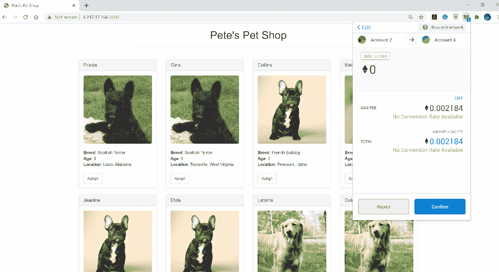

# 第十章。其他 Hyperledger 项目概览

在第二章中，我们简要回顾了 16 个 Hyperledger 项目和工具，并讨论了 Hyperledger 生态系统的设计哲学、核心组件和架构。在本章中，我们将通过更详细地探讨其中一些项目来继续我们的旅程。

本章将帮助您实现以下实际目标：

+   使用 Hyperledger Aries 构建去中心化身份管理系统

+   使用 Hyperledger Avalon 进行离线交易处理

+   使用 Hyperledger Besu 作为开源以太坊客户端，将公共区块链引入企业

+   使用 Hyperledger Grid 构建和管理供应链解决方案

Hyperledger Avalon 通过可信的离链处理解决了区块链可扩展性和隐私挑战。通过探索 Hyperledger Besu 的模块化架构，您了解了这个开源以太坊客户端如何将公共区块链引入企业。作为构建供应链解决方案的平台，Hyperledger Grid 允许开发人员选择最佳的可重用组件、具有现有分布式分类账平台软件和业务特定应用程序的框架。

# Hyperledger Aries

正如我们在第二章中讨论的，*Hyperledger Aries*库是一个面向区块链根源的可互操作工具的基础架构，用于对等互动。它包括一个用于区块链客户端的共享加密钱包，一个允许这些客户端之间进行离线交互的去中心化标识（DID）通信协议，以及关键管理技术。*共享加密钱包*是一个多签名钱包，可以由两个或更多用户访问。发送交易需要至少一个钱包的“共同签署者”使用他们的私钥进行授权。

Aries 源于对 Hyperledger Indy 的工作，后者是 Hyperledger 家族中活跃的分布式账本技术（DLT）。对于能够管理身份并增加 Hyperledger DLT（如 Fabric 和 Sawtooth）安全性的独立库的需求日益增加，这促成了 Hyperledger Ursa 和 Hyperledger Aries 的孵化。如第二章所述，虽然 Ursa 专注于增强 Hyperledger 网络的安全性，但 Aries 库与其他 Hyperledger DLT（如 Fabric 或 Sawtooth）结合使用，以在其分散架构中管理其成员 ID。

Aries 提供了安全的秘密管理和利用 Ursa 提供的加密支持的硬件安全功能。Aries 是一个区块链接口层（称为*resolver*），可促进与其他身份项目的互操作性，并用于创建、管理和传输数字凭据，而 Indy 提供了一个*resolver*实现。

Aries 支持以下功能：

+   用于支持多个区块链并创建和签名区块链交易的区块链*resolver*接口层

+   一个用于安全数据存储的数字钱包，包含经过审查的凭据

+   用于在客户端之间进行离账通信的加密消息系统，使用多种传输协议

+   使用 Ursa 中的 ZKP 原语，实现 ZKP W3C 可验证凭证

+   一个正在孵化中的可验证分散式密钥管理系统（DKMS）规范的实施，目前在 Indy 中进行中

+   一种基于安全消息功能构建更高级协议和类似 API 的用例的机制

图 10-1 显示了 Hyperledger Aries 架构中的组件。


###### 图 10-1\. Hyperledger Aries 架构中的组件

通过提供一个区块链解析器接口层，Aries 是分散身份（账本、DID、可验证凭证）的代理（客户端）部分。过去，Indy SDK 发起了分散身份。Aries 可以促进与其他 DID 网络的互操作性，例如 Ethereum、Bitcoin、Hyperledger Fabric 和 Sawtooth。通过可插拔的解析器接口架构，Aries 为开源社区提供了与基于区块链的身份相关的各种用例进行交互的一系列动态功能的机会。建立信任只需要最少的信息，包括公共 DID、模式和凭证定义。这由代理中的 ZKP 处理。Aries 提供了一种在代理之间通过安全通道传输数据的方式。

在当前的就业市场上，教育背景核查是用于确认候选人的教育、培训或认证声明并识别任何潜在差异的关键流程之一。Aries 可以创建、传输和存储可验证的数字凭证（如学位），以使这个验证过程更加高效。为了演示 Aries 的工作原理，我们将创建以下两个代理：

+   来自费伯学院毕业的爱丽丝

+   费伯学院，授予爱丽丝的学位

创建这些代理需要两个步骤。首先，爱丽丝与学院连接并发布关于她学位的凭证。其次，费伯学院将发送一个证明请求来验证爱丽丝的学位。要在本地机器上运行这个 Aries 演示，我们首先需要安装以下内容：

+   Docker

+   Docker Compose

+   Git

要运行此演示，我们还使用了一个*von-network*实例（一个在本地 Docker 中运行的 Hyperledger Indy 公共账本沙盒）。这个实例实现了一个带有四个节点的 Indy 账本。

## Set Up von-network

让我们从打开一个 bash 终端并克隆*von-network* Git 存储库开始：

```
git clone https://github.com/bcgov/von-network
cd von-network
```

一旦我们克隆了仓库，我们可以开始构建 VON 网络 Docker 镜像，并使用 *von-network* 文件夹中的 *./manage* bash 脚本启动我们的 VON 网络。该脚本简化了构建镜像和启动网络的过程。

###### 注意

VON 网络是一个便携式的开发级 Indy 节点网络，是可验证组织网络（VON）的一部分。VON 的使命是为组织提供可信的数据网络，无论是在本地还是全球范围内。

```
./manage build
./manage up
```

VON 网络运行起来后，您可以通过在浏览器中访问 [*http://your-machine-ip:9000*](http://your-machine-ip:9000) 来查看节点池和分类帐。

## 运行 Hyperledger Aries Cloud Agent

接下来，我们将使用 Hyperledger Aries Cloud Agent Python（ACA-Py）来构建和部署代理的两个实例——一个用于 Alice，另一个用于 Faber College。ACA-Py 是构建分散式身份应用程序和服务的基础，可在非移动环境中运行。

运行此命令克隆 ACA-Py 仓库并导航到 *demo* 文件夹：

```
git clone https://github.com/hyperledger/aries-cloudagent-python
cd aries-cloudagent-python/demo
```

接下来，通过发出以下命令启动 Faber 代理：

```
./run_demo faber
```

您应该看到 Faber 代理终端显示其公共 DID，模式和凭证定义，以及 QR 邀请码详细信息。

打开另一个终端窗口并导航到 *demo* 文件夹。然后发出以下命令：

```
cd aries-cloudagent-python/demo
./run_demo alice
```

这将启动 Alice 代理。当两个代理都启动后，Alice 将等待来自 Faber 的输入邀请。

从 Faber 终端复制 Faber 邀请 JSON 数据，然后粘贴到 Alice 提示符。代理将连接，然后显示选项菜单。

一旦 Alice 和 Faber 之间建立连接，Alice 终端将显示一个包含邀请密钥和 DID 信息的响应，如下所示：

```
Invitation response:
  {
    "their_label": "Faber.Agent",
    "invitation_key": "BLpHqGjjqPJ9NXz9wni8FVmcF74ue3LsXJBeyKV6ubTX",
    "request_id": "9b289bdb-7bd5-4804-baf1-794e66a70d60",
    "initiator": "external",
    "created_at": "2020-09-01 17:31:22.905350Z",
    "accept": "auto",
    "my_did": "MytrhNXxvaK3f5NX5ztFim",
    "updated_at": "2020-09-01 17:31:22.920279Z",
    "routing_state": "none",
    "invitation_mode": "once",
    "connection_id": "b4bddaea-f158-4910-825f-32acd0fc1ed0",
    "state": "request"
  }

Alice      | Connected
Connect duration: 0.21s
```

对于 Faber，我们现在有五个选项：

```
Faber | Connected
    (1) Issue Credential
    (2) Send Proof Request
    (3) Send Message
    (T) Toggle tracing on credential/proof exchange
    (X) Exit?
[1/2/3/T/X]
```

对于 Alice，我们有三个选项：

```
Alice | Connected
   (1) Send Message
   (2) Input New Invitation
   (X) Exit?
```

### 发出证书

您现在可以通过从 Faber 发出和证明凭证来测试凭证交换协议。我们不需要从 Alice 代理那里做任何事情。她的代理将自动接收凭证，并回应来自 ACA-Py 演示代码的证明请求。

在 Faber 终端窗口中，输入`**1**`以发送凭证：

```
[1/2/3/T/X] 1

#13 Issue credential offer to X
Faber      | Credential: state = offer_sent, credential_exchange_id = 97a2124b-6464-4761-a7b0-
62fbc0236433
Faber      | Credential: state = request_received, credential_exchange_id = 97a2124b-6464-4761-a7b0-
62fbc0236433

#17 Issue credential to X
Faber      | Credential: state = credential_issued, credential_exchange_id = 97a2124b-6464-4761-a7b0-
62fbc0236433
Faber      | Credential: state = credential_acked, credential_exchange_id = 97a2124b-6464-4761-a7b0-
62fbc0236433
```

在 Alice 终端窗口中，我们会看到这条消息：

```
Alice      | Credential: state = offer_received , credential_exchange_id = e9bd52c1-364a-407d-b95b-
0e1bc1593c0a

#15 After receiving credential offer, send credential request
Alice      | Credential: state = request_sent , credential_exchange_id = e9bd52c1-364a-407d-b95b-
0e1bc1593c0a
Alice      | Credential: state = credential_received , credential_exchange_id = e9bd52c1-364a-407d-
b95b-0e1bc1593c0a
Alice      | Credential: state = credential_acked , credential_exchange_id = e9bd52c1-364a-407d-b95b-
0e1bc1593c0a
Alice      | Stored credential b0030596-b025-4e95-804d-fcc6404c1788 in wallet

#18.1 Stored credential b0030596-b025-4e95-804d-fcc6404c1788 in wallet
```

在 Faber 发布凭证提议后，Alice 收到了凭证。然后，Alice 发送回一个凭证请求。Faber 接收到了 Alice 的消息，并确认 Alice 已经收到了凭证。然后 Alice 将凭证存储在她的钱包中。

### 请求证明

要请求证明，在 Faber 终端中输入`**2**`，然后我们会看到这条消息：

```
[1/2/3/T/X] 2
#20 Request proof of degree from alice
Faber      | Presentation: state = request_sent , presentation_exchange_id = 6d8b4157-254f-45f2-8f52-
ca86f2ab536a
Faber      | Presentation: state = presentation_received , presentation_exchange_id = 6d8b4157-254f-
45f2-8f52-ca86f2ab536a

#27 Process the proof provided by X

#28 Check if proof is valid
Faber      | Presentation: state = verified , presentation_exchange_id = 6d8b4157-254f-45f2-8f52-
ca86f2ab536a
Faber      | Proof = true
```

Alice 终端窗口将显示以下消息：

```
Presentation: state = request_received , presentation_exchange_id = b6675e49-1ddd-4edf-872d-
e667fcf155f7

#24 Query for credentials in the wallet that satisfy the proof request

#25 Generate the proof

#26 Send the proof to X
Presentation: state = presentation_sent , presentation_exchange_id = b6675e49-1ddd-4edf-872d-
e667fcf155f7
Presentation: state = presentation_acked , presentation_exchange_id = b6675e49-1ddd-4edf-872d-
e667fcf155f7
```

我们可以看到，在 Faber 发送证明请求后，Alice 收到了一个请求，并在钱包中查询满足证明请求的凭证。然后 Alice 生成了学位凭证的证明并将证明发送回 Faber。Faber 接收到了 Alice 提供的证明，然后开始处理和验证证明。

一旦证明被验证，Faber 将更新并标记证明为`true`以指示已验证。正如我们所看到的，证明是在 Alice 的一方生成的，而不会暴露 Alice 的实际个人数据。

# 超级账本阿瓦隆

区块链是一种去中心化的加密数据库系统。每个节点处理的每一笔交易都需要广播到网络中的其他节点。这种行为确保了交易的透明性，并反映了账本的状态。此外，这种行为将导致数据的弹性，因为这些数据的许多副本存在于参与网络的节点之间。然而，使用这种架构的代价是低吞吐量的可扩展性。只能处理有限数量的区块链交易。

公共区块链对每个人都是可访问的，每个交易都可以追溯到第一个创世区块。加密货币用户使用他们的私钥访问区块链并发起区块链交易。区块链中的交易数据是伪匿名的；不可能在不连接到其他个人信息（例如，数字身份）的情况下将数据分配给某个人。在某些应用程序（例如全球交易）中，需要保持一些敏感公司数据的保密性和逻辑加密，以防止其成为易受损的目标、被竞争对手窃取或被探索的外部实体前瞻性竞争。

*Hyperledger Avalon*项目是为了解决可伸缩性和隐私挑战而创建的。通过受信任的链下计算，Avalon 被用于尽可能地保持弹性和完整性保证，并实现额外的可伸缩性和隐私。

实现可伸缩性并确保计算正确且保密的核心策略是提供受信任执行环境、零知识证明和多方计算的受信任计算服务。

## 受信任执行环境

运行在*受信任执行环境*（*TEE*）中的应用程序可以确保强大的数据保密性。Hyperledger Avalon TEE 使用 Intel 的软件保护扩展（SGX）。这个扩展到 x86 架构的一组安全相关指令代码以完全隔离、安全的方式运行应用程序。它内建于一些现代 Intel 中央处理单元（CPU）中。在 SGX 中，用户级代码将分配称为*enclaves*的内存私有区域。应用程序进程运行在更高特权级别，不仅与同一系统上的其他应用程序隔离，而且与操作系统和可能的超级监视程序隔离。系统管理员无法在启动后篡改应用程序。

SGX 数据保密性为企业区块链工作负载带来了显著的好处，并增强了链下和链上执行之间的可信链接。SGX 可处理访问链下交易资源和计算机密数据、受信任的令牌、经证明的预言机等。

## 零知识证明

**零知识证明**（*ZKPs*）是一种数学方法，允许在不共享或泄露数据的情况下进行数据验证。在使用零知识证明进行交易时，基本角色是证明者和验证者。*证明者*需要基于一小部分不可链接的信息向验证者证明某些事情，而无需告诉验证者关于该信息的其他任何内容。验证者必须验证证明者在说真话。

一个真正的零知识证明需要证明三个标准：

完备性

证明者的陈述是真实的，并且应最终说服诚实的验证者。

真实性

如果陈述是错误的，则无法说服验证者证明者的陈述是真实的。

零知识性

如果陈述是真实的，则只会透露正在被证明的陈述。

**零知识证明**（*ZKPs*）的基本概念可以通过一个简单的例子来展示，那就是*瓦尔多在哪里*[¹]。它包含了密码学中最喜爱的虚构人物，艾丽斯和鲍勃。*瓦尔多在哪里*书系的目标是在人群中寻找到瓦尔多。

假设鲍勃是证明者，艾丽斯是验证者。鲍勃声称他有一种可以轻松找到瓦尔多的算法，但他想要得到报酬才会使用他的算法。艾丽斯想要购买，但她想要确保鲍勃没有撒谎，希望他证明自己。与许多交易一样，艾丽斯和鲍勃并不完全信任彼此。

现在，鲍勃需要证明他的算法有效。他指出了沃尔多的位置。为了确保鲍勃的算法完全有效，爱丽丝选择了其他页上也有沃尔多的页。由于鲍勃有这个算法，他总能在爱丽丝给他的页面上找到沃尔多。鲍勃重复这个练习的次数越多，他拥有有效且快速的算法的可能性就越大。

在这个例子中，解决方案满足 ZKP 系统的三个属性：合理性，完整性和零知识：

合理性

爱丽丝提供了场景的一个随机页面，让鲍勃证明他的算法，鲍勃的证明系统是诚实的，不会让他作弊。

完整性

只要鲍勃能够通过他的算法一直找到沃尔多，鲍勃的证明系统就能够说服爱丽丝他能找到沃尔多。

零知识

鲍勃向爱丽丝证明他已找到沃尔多，而不透露他的算法。

## 多方计算

*多方计算* (*MPC*) 是一种密码学协议，允许独立方共同计算出共享结果，而不泄露任何个体方的数据。让我们看一个平均薪水的例子来理解 MPC 的工作原理。

假设爱丽丝的薪水是$50K，鲍勃的薪水是$80K。爱丽丝将她的薪水随机分成两份：$20K 和 $30K，例如。爱丽丝将$20K 作为秘密留给自己，并发送$30K 给鲍勃。同样，鲍勃将他的薪水随机分成两份：$10K 和 $70K。鲍勃将$70K 作为秘密留给自己，并发送$10K 给爱丽丝。现在爱丽丝和鲍勃持有一组值，如表 10-1 中所列。

表 10-1\. 爱丽丝和鲍勃的分薪水情况

|  | 爱丽丝 | 鲍勃 |
| --- | --- | --- |
| **总额：$50K** | $20K | $30K |
| **总额：$80K** | $10K | $70K |

爱丽丝和鲍勃对对方的薪水一无所知。他们从对方的秘密部分中得不到任何有用的信息。

然而，Alice 和 Bob 可以在本地汇总他们的值。这将提供有价值的信息，如表格 10-2 所示。然后，重新组合的总和除以参与者数量得到平均工资为 $65K。

表格 10-2\. Alice 和 Bob 的工资合计

|  | Alice | Bob |
| --- | --- | --- |
| **总计：$130K** | $30K | $100K |

由于多方计算（MPC）较为复杂，现实世界中并没有多少项目使用这项技术。一个众所周知的例子是使用 Sharemind MPC 平台进行基于两个私有、秘密、共享政府数据库的研究；一个 2015 年的项目研究了在上大学期间兼职工作与未能按时毕业之间的相关性。

## 超级账本阿瓦隆架构

在阿瓦隆中，受信任的工作者（例如，TEE、MPC 和 ZKP 工作者）由受信任的计算服务（TCS）托管。工作者由 TCS 设置。工作者可以创建由 TEE SGX 签名的证明验证作为证明信息。证明信息可以在区块链上的工作者目录中发布。在 TEE SGX 工作者的情况下，工作者证明信息被生成为非对称签名/验证密钥对。请求者可以从 DLT 中的工作者目录中找到工作者，并验证并存储其证明信息。

请求者应用程序或智能合约提交工作订单请求。TCS 接收并维护工作订单队列。通过检查可用的工作者，TCS 安排工作订单进行执行。在工作订单执行阶段，受信任的工作者执行这些工作订单，并将工作订单响应记录在区块链上。

图 10-2 展示了超级账本阿瓦隆的高级架构。


###### 图 10-2\. 超级账本阿瓦隆高级架构

请求方可以通过两种模式连接到 TCS：代理模式和直连模式。在*代理模式*中，使用区块链连接器连接来自 DLT 上运行的智能合约（以太坊）或链码（Fabric）的请求。在该模式中，区块链充当代理。*直连模式*为通过前端 UI 或命令行工具提交的请求提供 JSON RPC API。

在中间层中，工单队列管理器会处理工单请求，将工单执行委托给执行适配器，并维护工单队列大小。工作注册表存储受信任的计算工作者列表。

在前端和中间件组件之间是 KV 存储管理器，它是在 Lightning 内存映射数据库（LMDB）之上实现的一个薄包装器，用于维护工作目录和工单队列。

在工作 TCF 微服务组件中，受信任的工作者执行特定于应用程序的工作负载。工作负载可以是静态的、预编译脚本，或者在运行时提供的脚本（例如 Solidity 或 Python）。工作负载脚本逻辑通常与应用程序相关。

# Hyperledger Besu

*Hyperledger Besu*，前身为*Pantheon*，是一个旨在将大型企业与公共以太坊区块链连接的开源以太坊客户端。它使用 Java 编写。Besu 可在以太坊公共网络、私有网络和测试网络上运行，如 Ropsten（工作量证明测试网络）、Kovan（权威测试网络）、Gorli（权威测试网络）和 Rinkeby（权威测试网络）。

作为基本的以太坊客户端，它具有以下功能：

+   连接区块链网络，以同步区块链交易数据或向网络发出事件

+   在 EVM 环境中通过智能合约处理交易

+   为网络提供数据存储（区块）

+   发布了供开发人员与区块链网络交互的客户端 API 接口

## Hyperledger Besu 架构

图 10-3 展示了高级别的 Hyperledger Besu 架构，由三个关键层组成。


###### 图 10-3\. Hyperledger Besu 架构

### 以太坊存储层

以太坊虚拟机（EVM）是嵌入在每个完整以太坊节点中的强大、图灵完备的虚拟机。智能合约将编译并部署到 EVM 字节码。EVM 负责在以太坊区块链内执行合约字节码。

Besu 通过 Ethash、Clique 和 IBFT 2.0 实现工作量证明（PoW）和权威证明（PoA）共识机制。正如第一章所解释的那样，PoW 是一种依赖于能源的共识算法，通过解决密码学难题来完成。这个难题是找到一个产生特定数量前导零的哈希数的输入。解决数学问题的工作被称为 PoW。

PoA 是一种选择有限数量受信任节点的算法。这些节点已经证明了他们的权威，并负责验证交易、生成新块并保持网络运行。Besu 实现了几种 PoA 协议，包括 Clique 和 IBFT 2.0。

Clique 是一种 PoA 区块链共识协议。区块链运行 Clique 协议，维护授权签名者列表。这些已批准的签名者验证交易和区块，并轮流创建下一个块而不进行挖矿。因此，交易任务计算量轻。在创建块时，矿工收集并执行交易，用块的计算哈希更新网络状态，并使用他们的私钥对块进行签名。通过定义一个创建块的时间段，Clique 可以限制处理的交易数量。

IBFT 2.0（伊斯坦布尔 BFT 2.0）是一种 PoA 拜占庭容错（BFT）区块链共识协议。网络中的交易和区块由授权账户（称为*验证者*）验证。验证者收集、验证和执行交易，并创建下一个区块。现有的验证者可以提出并投票添加或删除验证者，并维护动态验证者集。该共识可以确保即时最终性。正如其名称所示，IBFT 2.0 在 IBFT 区块链共识协议的基础上进行了改进，增强了安全性和活力性。在 IBFT 2.0 区块链中，所有有效的区块直接添加到主链中，没有分叉。

### 存储层

Besu 使用 RocksDB 数据库在本地存储数据。这些数据分为两部分：

区块链

区块链数据由区块头和区块体组成。每个区块头包含一组区块元数据（上一个区块的哈希、时间戳、随机数等），用于加密验证区块链状态。区块体包含每个区块中包含的有序交易列表。

世界状态

世界状态是一个数据库，它保存了区块链中由验证和提交的交易集合添加、修改或删除的业务对象属性的当前值。每个区块头通过`stateRoot`哈希引用一个世界状态。世界状态是地址和账户状态之间的映射。作为全局状态，它会通过交易执行不断更新。

### 网络存储层

Besu 实现了点对点（P2P）网络与以太坊的 DEVp2p 网络协议进行客户端间通信，并为 IBFT 2.0 额外子协议实现。在 DEVp2p 网络中，当对等节点的安全 TCP 连接建立后，DEVp2p 将在两个连接的对等节点之间协商应用程序会话。每个节点将向另一个对等节点发送一个包含其自身节点 ID、DEVp2p 版本、客户端名称和其他节点相关元数据的问候消息。然后节点开始通过 DEVp2p 传输应用程序数据包。DEVp2p 节点将定期向连接的客户端发送 ping 以确保它们的连接对等节点仍处于活动状态。如果客户端在最大允许的空闲时间内未收到相应的 DEVp2p 消息，则节点连接将关闭。

Besu 通过主网以太坊提供强大的面向用户的 API，以及通过 HTTP 和 WebSocket 协议的 EEA JSON-RPC API，以及 GraphQL API。

Besu 的监控功能允许您识别节点和网络问题。您可以配置指标和日志记录。节点性能通过使用 Prometheus Visual 工具或`debug_metrics` JSON-RPC API 方法进行监控。网络性能通过使用 Alethio 工具（如区块浏览器和 EthStats 网络监视器）进行监控。您还可以收集 Besu 日志文件以启用问题诊断。

Besu 使用私有事务管理器 Orion 来实现隐私。使用节点私钥签名的私有交易被发送或接收到与关联 Orion 节点的 Besu 节点。Besu 和 Orion 节点都具有用于标识它们的公共/私有密钥对。其他方无法访问交易内容、发送方或参与方列表。

通过启用节点许可和帐户许可，许可网络只允许特定的节点和帐户访问网络。节点许可用于控制各个节点之间的连接。帐户许可可以限制节点允许执行交易的帐户，拒绝损坏的智能合约，暂停帐户，并执行入职或身份要求。

## 配置 Hyperledger Besu

为了演示 Hyperledger Besu 的工作原理，我们将运行一个私有网络示例。它使用 Hyperledger Besu Docker 镜像来运行 Besu 节点的私有网络。要运行此示例，您必须安装以下软件：

+   Docker

+   Docker Compose

+   Git

+   cURL

+   Node.js（版本 10+）

+   npm

+   MetaMask

如果您还没有安装 Docker 和 Docker Compose，请在 Docker 官方网站找到安装指南。Node.js 网站将为您提供安装 Node.js 和 npm 的说明。

以太坊钱包 **MetaMask** 是 Google Chrome 浏览器的插件。它可以连接以太坊 DApps 上的区块链网络。用户可以调用智能合约来转移硬币、玩游戏等。您可以在 MetaMask 网站 (*[*https://metamask.io*](https://metamask.io)*) 找到安装指南。

首先，我们将打开一个 bash 终端并克隆 *besu-sample-network* Git 仓库，然后导航到 *besu-sample-networks* 目录：

```
git clone *https://github.com/PegaSysEng/besu-sample-networks.git*
cd besu-sample-networks
```

接下来，通过运行以下命令来启动 Besu 示例网络：

```
./run.sh
```

此脚本构建图像，并使用 Docker 创建一个本地私有 Besu 网络。默认的共识机制是 Ethash；您可以使用 `-c <ibft2|clique|ethash>` 在您的私有网络上选择其他共识机制。

当网络启动时，您应该在终端中看到正在运行的服务列表：

```
ubuntu@ip-172-31-72-58:~/besu-sample-networks$ sudo ./run.sh
*************************************
Sample Network for Besu at latest
*************************************
Start network
--------------------
Starting network...
minernode uses an image, skipping
….
*************************************
Sample Network for Besu at latest
*************************************
List endpoints and services
----------------------------------
              Name                             Command                       State                                            Ports
--------------------------------------------------------------------------------------------------------------------------------------------------------------------
besu-sample-networks_bootnode_1     /opt/besu/bootnode_start.s ...   Up (health: starting)   0.0.0.0:30303->30303/tcp, 0.0.0.0:30303->30303/udp, 8545/tcp, 8546/tcp,
                                                                                             8547/tcp
besu-sample-networks_explorer_1     /docker-entrypoint.sh ngin ...   Up                      0.0.0.0:25000->80/tcp
besu-sample-networks_grafana_1      /run.sh                          Up                      0.0.0.0:3000->3000/tcp
besu-sample-networks_minernode_1    /opt/besu/node_start.sh -- ...   Up (health: starting)   30303/tcp, 8545/tcp, 8546/tcp, 8547/tcp
besu-sample-networks_node_1         /opt/besu/node_start.sh -- ...   Up (health: starting)   30303/tcp, 8545/tcp, 8546/tcp, 8547/tcp
besu-sample-networks_prometheus_1   /bin/prometheus --config.f ...   Up                      0.0.0.0:9090->9090/tcp
besu-sample-networks_rpcnode_1      /opt/besu/node_start.sh -- ...   Up (health: starting)   30303/tcp, 0.0.0.0:8545->8545/tcp, 8546/tcp, 8547/tcp
```

您还将看到端点列表：

```
****************************************************************
JSON-RPC HTTP service endpoint      : http://localhost:8545
JSON-RPC WebSocket service endpoint : ws://localhost:8546
GraphQL HTTP service endpoint       : http://localhost:8547
Web block explorer address          : http://localhost:25000/
Prometheus address                  : http://localhost:9090/graph
Grafana address             : http://localhost:3000/d/XE4V0WGZz/besu-
overview?orgId=1&refresh=10s&from=now-30m&to=now&var-system=All
****************************************************************
```

### JSON-RPC HTTP 服务端点

JSON-RPC HTTP 服务端点是一种轻量级的远程过程调用（RPC）协议，它提供了从 DApp 客户端或加密货币钱包（如 MetaMask）访问 Besu 节点服务的方式。你可以使用 cURL 命令或其他 HTTP 工具（例如 Postman）在 rpcnode 上运行 RPC 请求。

这里是提交请求以获取最近挖掘的区块编号的命令。如果你从外部命令行终端运行，则需要将 *<http-rpc-endpoint>* 从 *http://localhost:8545* 替换为你的机器 IP 地址：

```
~/besu-sample-networks$ curl -X POST --data 
'{"jsonrpc":"2.0","method":"net_peerCount","params":[],"id":1}' http://3.237.17.164:8545
```

响应显示了最近挖掘的区块：

```
{
  "jsonrpc" : "2.0",
  "id" : 1,
  "result" : "0x3"
}
```

### JSON-RPC WebSocket

JSON-RPC WebSocket 服务端点为连接到节点服务的 DApp 客户端提供了一个 Web Socket 端点。

### GraphQL HTTP 服务端点

GraphQL 是用于 HTTP API 的查询语言，支持使用现有数据执行查询的运行时。这与暴露一套 URL 的 REST API 形成对比，每个 URL 都暴露了单个资源。你可以从你的 DApp 连接到 HTTP GraphQL 节点服务。

GraphQL 既是用于你的 API 的查询语言，也是用于使用你为数据定义的类型系统执行查询的服务器端运行时。

### Web 区块浏览器地址

Web 区块浏览器地址是一个在线的区块浏览器，显示了单个区块链交易、区块、交易历史和地址余额的内容。

你可以在浏览器中输入 Web 区块浏览器地址（图 10-4）来访问浏览器。它会显示私有网络的摘要。


###### 图 10-4\. Web 区块浏览器地址

在这个例子中，浏览器指示了三个节点：一个普通节点、一个挖矿节点和一个引导节点。点击区块编号（#1107）以显示区块详情（图 10-5）。


###### 图 10-5\. Web 区块浏览器区块详情

### Prometheus 地址

Prometheus 为 Besu 节点指标提供监控和警报服务。Prometheus 中存储的数据可在 Grafana 中用于可视化收集的数据。可以通过 Prometheus 地址访问 Prometheus 仪表板的链接。

### Grafana 地址

Grafana 仪表板提供了一个可视化和分析工具，用于监视 Besu 网络连接、同步状态和块导入速率，以及 CPU 和内存使用统计信息。Grafana 中的所需数据来自 Prometheus 数据存储，该数据直接从 Besu 导出。

有了 Besu 示例网络设置，我们现在将在 Besu 测试网络中运行一个智能合约和 DApp。在这个 DApp 示例中，我们将使用 MetaMask 发送交易。

### 设置 MetaMask 和帐户

使用以下步骤设置 MetaMask：

1.  登录 MetaMask。

1.  在 MetaMask 网络列表中，选择自定义 RPC。输入 JSON-RPC HTTP 服务端点：[*http://your-machine-ip:8545*](http://your-machine-ip:8545)。

1.  保存并返回到 MetaMask 主屏幕。MetaMask 现在连接到私有网络 RPC 节点。

1.  创建一个帐户或使用 Besu 提供的以下一个帐户进行测试。您可以通过使用私钥将帐户导入到 MetaMask 中：

    ```
    Account 1 (Miner Coinbase Account)
    Address: 0xfe3b557e8fb62b89f4916b721be55ceb828dbd73
    Private key : 0x8f2a55949038a9610f50fb23b5883af3b4ecb3c3bb792cbcefbd1542c692be63
    Initial balance : 0xad78ebc5ac6200000 (200000000000000000000 in decimal)
    Account 2
    Address: 0x627306090abaB3A6e1400e9345bC60c78a8BEf57
    Private key : 0xc87509a1c067bbde78beb793e6fa76530b6382a4c0241e5e4a9ec0a0f44dc0d3
    Initial balance : 0x90000000000000000000000 (2785365088392105618523029504 in decimal)
    Account 3
    Address: 0xf17f52151EbEF6C7334FAD080c5704D77216b732
    Private key : 0xae6ae8e5ccbfb04590405997ee2d52d2b330726137b875053c36d94e974d162f
    Initial balance : 0x90000000000000000000000 (2785365088392105618523029504 in decimal)
    ```

    图 10-6 显示了 MetaMask 导入私钥屏幕。

    

    ###### 图 10-6. MetaMask 导入私钥屏幕

    ###### 注意

    MetaMask 是一个用于访问以太坊区块链的浏览器扩展加密货币钱包。您可以访问*metamask.io*获取更多信息。

## 在 Hyperledger Besu 私有网络中的智能合约和 DApp

我们将在我们刚刚建立的 Hyperledger Besu 私有网络上运行 Truffle 网站上的 PetShop 教程。PetShop 是一个宠物店的领养跟踪系统。用户可以通过在网络中发送以太代币来领养宠物。

DApp 需要安装 Truffle。对于这个设置，我们使用 Truffle v5.0.15。Truffle 是一个端到端的以太坊 DApp 开发工具，提供了一个开发环境，用于编写、编译、测试和部署智能合约和 DApps。

打开命令行并运行以下命令：

```
npm install -g truffle
```

智能合约和 DApp 的 PetShop 源代码位于 *pet-shop* 文件夹中：

```
~/besu-sample-networks/pet-shop$ ls
Dockerfile      box-img-sm.png  contracts   node_modules       package.json  test
box-img-lg.png  bs-config.json  migrations  package-lock.json  src           truffle-config.js
```

在 *besu-sample-networks* 目录中运行 *./run-dapp.sh* 来启动 PetShop DApp：

```
 ~/besu-sample-networks$ sudo ./run-dapp.sh
```

*run-dapp.sh* 脚本在 *pet-shop* 文件夹下运行 `npm install`，然后使用 Truffle 命令来编译、迁移和测试 `sampleNetworkWallet` 中的智能合约。如果成功，它会为 PetShop DApp 构建一个容器，并在 *besu-sample-network* 中部署。DApp 容器会在系统上绑定端口 3001。

一旦 DApp 启动，您可以通过输入 **[*http://your-machine-ip:3001*](http://your-machine-ip:3001)** 打开浏览器，应该会看到 PetShop 运行。如果您点击采用按钮来领养宠物，应该会弹出一个 MetaMask 窗口询问是否确认或拒绝当前的领养交易 (图 10-7)。



###### 图 10-7\. 在这个宠物商店 DApp 中，注意右上角的 MetaMask 窗口

在确认交易后，被领养宠物的状态将显示为成功。MetaMask UI 将记录已确认的交易 (图 10-8)。


###### 图 10-8\. MetaMask 交易确认

我们还可以从区块浏览器 UI 中搜索相同的交易，通过输入交易哈希来查看交易详情 (图 10-9)。


###### 图 10-9\. 区块浏览器交易详情

当一切完成后，您可以停止私有网络并移除容器：

```
~/besu-sample-networks$ sudo ./remove.sh
```

该命令将关闭私有网络并删除从运行示例网络创建的所有容器和镜像。

# 超级账本网格

由于区块链是一个透明、不可变且安全的去中心化系统，它使参与者能够记录供应链中的每笔交易；分类帐数据在所有参与者之间共享。使用区块链技术的传统供应链行业可以改善以下几个方面：

+   跟踪从生产到交付，或通过最终用户在整个链条中的使用的资产

+   在链中验证和认证物理资产

+   确保分类帐数据是不可变的，并在供应链参与者之间共享

+   提供更好的审计能力

然而，为供应链应用程序开发区块链并不是一件容易的事情，尤其是在从零开始构建时。用例可能包含大量关于从产品订单到交付再到一个项目中包含的零件数量的信息。一个小错误可能导致整个供应链应用程序损坏且毫无价值。开发一个完整的、可用于生产的区块链应用程序也是耗时的。超级账本生态系统没有很多可重用的库、框架、领域模型或标准组件，能够快速创建供应链解决方案。这正是*超级账本网格*项目试图解决的问题。

Grid 是一个用于构建供应链解决方案的平台，它允许开发人员选择最佳的可重用组件、具有现有分布式分类帐平台软件的框架和业务特定应用程序。图 10-10 显示了超级账本网格平台的堆栈。


###### 图 10-10. 超级账本网格平台堆栈

网格的关键组件包括领域模型、智能合约、通用客户端 Pike 和示例应用程序。

## 领域模型

Grid 使用现有的开放标准，如 GS1、Open Data Initiative 和 Blockchain in Transit Alliance（BiTA）标准，来实现领域特定的数据模型。GS1 提供了一个全球标准的业务语言，用于识别、捕获和共享供应链数据，确保产品、位置、资产等的关键信息易于访问、准确并易于理解。其中最著名的标准是条形码。

## 智能合约

智能合约基于行业最佳实践构建业务逻辑，包括产品目录、产品转换和批处理行为。它在区块链上以分散的方式执行各种业务交易。智能合约由 Sawtooth Sabre 智能合约解释器处理，该解释器在 WebAssembly 虚拟机中实现了链上智能合约。

*WebAssembly* 是 W3C WebAssembly 社区组内部的一个开放标准。它定义了一种快速、高效、可移植的 WebAssembly 二进制代码格式，用于可执行程序。相应的低级文本汇编语言可读性强且易于调试。WebAssembly 设计用于安全性，并在安全的沙盒执行环境中运行其代码。通过利用通用硬件功能，它提供了与其他 Web 技术良好交互的接口，并保持向后兼容性。

所有 Sawtooth Sabre 对象在存储之前都使用 Protocol Buffers 进行序列化。这些对象包括命名空间注册表、合约注册表和合约。

## Pike

*Pike* 是一种智能合约，旨在跟踪供应链中的代理和组织身份权限。Pike 代理是一个包含角色信息的加密公钥，代表着组织的关系。这些角色可用于确定用户在平台上的访问权限。

代理有五个属性：

`public_key`

代理的唯一加密公钥

`org_id`

代理机构的组织标识符

`active`

活动标志，指示代理当前是否在组织中活动

`roles`

代理与组织拥有的角色列表

`metadata`

描述代理机构特定信息的一组键值数据

下面是一个 Pike 代理的示例：

```
    message Agent {
        string org_id = 1;
        string public_key = 2;
        bool active = 3;
        repeated string roles = 4;
        repeated KeyValueEntry metadata = 5;
    }

    message KeyValueEntry {
      string key = 1;
      string value = 2;
    }
```

`PikePayload` 作为 Pike 交易包含两部分：动作的枚举和交易动作。以下 Protocol Buffers 代码显示了如何定义 `PikePayload`：

```
message PikePayload {
        enum Action {
            ACTION_UNSET = 0;

            CREATE_AGENT = 1;
            UPDATE_AGENT = 2;

            CREATE_ORGANIZATION = 4;
            UPDATE_ORGANIZATION = 5;
        }

        Action action = 1;

        CreateAgentAction create_agent = 2;
        UpdateAgentAction update_agent = 3;

        CreateOrganizationAction create_org = 4;
        UpdateOrganizationAction update_org = 5;
    }
```

### SDK

目前，Pike 使用 Rust SDK 来开发智能合约。这个 SDK 有三个模块：permission、protocol 和 protos。在前面的部分中，`PikePayload` 是 protos 模块。

## 示例应用程序

Grid 提供了示例应用程序，可以帮助演示如何将 Grid 组件组合起来构建供应链应用程序。Grid Track and Trace 示例是第一个展示。这个智能合约允许用户跟踪货物，包括所有权和保管历史，以及温度和位置等各种属性的历史，通过供应链。

# 摘要

本章涵盖了 Hyperledger 家族的四个成员：Hyperledger Aries、Hyperledger Avalon、Hyperledger Besu 和 Hyperledger Grid。具体而言，我们讨论了 Aries 的工作方式：它提供了一个区块链接口层，促进了与其他身份项目的互操作性，并用于创建、管理和传输数字凭证。作为一个值得信赖的计算框架，Avalon 通过可信的链外处理来解决区块链的可扩展性和隐私挑战。通过探索 Besu 的模块化架构，您了解到这个开源以太坊客户端是如何将公共区块链引入企业的。作为构建供应链解决方案的平台，Grid 允许开发人员选择最佳的可重用组件、现有分布式账本平台软件的框架以及特定于业务的应用程序。

# 结语

在本文的过程中，你已经了解了使用 Hyperledger Fabric 开发和部署企业区块链应用所需考虑的所有方面和因素。我们希望我们不仅在 Fabric 应用程序开发的所有方面和功能上对你进行了教育，还强调了将你的区块链生态系统视为一个更广泛范围的重要性，包括行业内联盟、数据治理和变更管理等内容。

通过本书，你应该能够了解如何使用 Hyperledger Fabric 构建私有企业区块链系统，并且知道如何组合各种 Fabric 组件来创建和维护一个健壮、安全和可扩展的区块链应用。由于篇幅有限，一些主题留给你自己探索。具体来说，以下是值得进一步考虑的领域：

+   使用设计模式将 Fabric 集成到当前或遗留系统中

+   考虑后期因素，如可靠性、可用性和可维护性

+   实施持续集成和持续交付以及 DevOps 最佳实践，实现 Fabric 网络的敏捷性

+   在设计企业 Fabric 架构时考虑微服务和事件驱动架构

+   在 Fabric 网络中实现弹性和容错性的最佳实践

+   Fabric 智能合约和网络安全的最佳实践

# 下一步

你可能有很多问题。那很好。收集这些问题并发送给我们（通过电子邮件或我们网站上的联系表单）。但总的来说，我们建议你不要止步于此。尝试找到实际的问题，并使用 Hyperledger Fabric 创建并启动它们的解决方案。

除了实际经验之外，我们建议你继续阅读。如往常一样，浏览[Hyperledger 网站](https://www.hyperledger.org/)以追踪最新的发展，查看使用 Fabric 构建的最新项目，以及获取有关 Fabric 版本和补丁的最新更新。同样，[Fabric Wiki](https://wiki.hyperledger.org/)页面为开发人员提供了丰富的实践资源，帮助他们扩展他们对所有 Hyperledger DLTs、工具和库的知识和专业技能。

为了巩固你学到的所有知识，你需要运用它。经验是我们已经提到的一种方式，但指导、教学和一般的演示是另一种很好的学习方式。如果你不得不向别人解释某件事情，特别是当形式像演示这样正式时，它会迫使你巩固你的思想，并将你的模型和概括记忆下来。不要陷入认为你经验不足以谈论它的陷阱。你是；你是你拥有的经验的专家。你很可能能够以一种其他人无法做到的方式应用、解释或教授你在 Hyperledger Fabric 中的一些经验。试一试吧！

## 现在轮到你了

就此，我们将把话说给你听。

正如你所知，你可以在配套的[网站](https://www.myhsts.org/)上找到更多资源。但我们也想听听你的声音。我们想听听你正在从事的项目，你的挑战，你的技巧和窍门，以及你对 Hyperledger Fabric 未来的想法。如果你正在考虑将 Fabric 应用于行业，或者你在解决一个问题，我们特别希望与你交谈。我们可以通过解决方案、技巧和评估来减少工作量、降低风险和提高性能，让你的生活更轻松。从设计基本的概念验证到部署大规模的联盟解决方案，我们都可以帮助。所以请随时通过我们的[网站](https://www.hashflow.us/)联系我们。

祝好运！

## 进一步阅读

+   Hyperledger 分布式账本技术

    *Hyperledger Cookbook* 由 Brian Wu、Chuanfeng Zhang 和 Andrew Zhang（Packt Publishing）编写。

+   *Hyperledger Fabric 区块链*, 第二版, 由 Nitin Gaur 等人编写（Packt Publishing）。

+   以太坊和 Solidity

    *学习以太坊* 由 Brian Wu、Zhihong Zou 和 Dongying Song（Packt Publishing）编写。

^(1) *瓦里先生在哪里*, 如果你是在北美以外地区阅读此书。
