# 第一部分

# 区块链技术应用

# 第一章

# 区块链技术：

应用于行业

+   Zaigham Mahmood

    

    英国北安普顿大学 & 中国石家庄铁道大学

摘要

区块链技术是计算机科学领域的最新创新之一，具有全球范围和影响力。区块链是一种数学结构，用于在由多个区块组成的分布式和去中心化数字分类帐中存储数字交易，这些区块通过加密签名相连，并分布在多台计算机上。每个区块安全记录数字交易数据，并以有效的方式具有指向网络中前一个区块的哈希链接。新区块可以通过所有节点的一致共识添加和删除，这些节点共享分布式分类帐，无需中央控制机构。本章旨在介绍区块链技术，也称为分布式分类帐技术（DLT），并讨论其在银行业、医疗保健、交通运输、制造业、供应链和教育等社会各个领域的应用。还简要讨论了使用 DLT 扩展物联网愿景。

引言

区块链技术是计算机科学领域最新的创新之一，具有全球范围和影响力。长期以来，区块链一直与加密货币（如比特币）联系在一起。然而，这种新兴技术注定会在可预见的未来颠覆全球经济。它具有巨大的潜力，可以积极影响医疗保健、交通运输、制造业、金融、汽车、教育和政府等各个行业。世界经济论坛估计，到 2025 年，全球 GDP 至少有 10%，目前为 100 万亿美元，将通过区块链技术进行管理（Hance, 2020）。

区块链的概念最初被称为“区块链”，最早在 2008 年提出。这本质上是认识到支持“比特币”运作的技术可以从货币中分离出来，用于各种其他组织间的合作。然后，在大约 10 年的时间里，关于“智能合约”、“工作证明”和区块链“扩展”的发展进一步迅猛。自 2008 年起源以来，区块链技术经历了多个阶段，但最值得注意的是以下三个阶段（Goyal，2018）：

+   • 交易：大约在 2012-2014 年间

+   • 基于合同：大约在 2014-2016 年间

+   • 应用：从 2017 年开始

区块链技术发展时间轴如下所述。

+   2009-12：比特币白皮书；比特币加密货币的出现；区块链作为数字货币的支柱；比特币杂志

+   2012-14：比特币市场和初创企业；基于以太坊的项目；区块链对金融服务行业的吸引力

+   2014-15：超过 40 个区块链实施项目；智能合约；超级账本；技术公司对区块链的认可

+   2016-17：区块链在概念验证之外的采纳；EOS.IO 协议；区块链在不同行业的主流采纳

+   2018-20：区块链协议和标准；互联网服务提供商的加速投资；IPO 和区块链初创生态系统的兴起

+   2020 年至今：结合分析、物联网和区块链的新商业模式；世界经济论坛的认可

区块链技术呈现出诸多高度吸引人的特征，包括去中心化、透明性、不可篡改性、安全性、共识和智能合约（Rosic，2016；Tasca，2019）。Witscad（2020）将主要特征分为两类：功能性和新兴性。详见图 1。这些将在本章后面的部分详细解释。

由于这些特点的吸引力，自 2014 年左右以来，区块链在超越其加密货币根源的领域中引起了巨大关注。这项技术已经超越了最初在比特币加密货币中的应用；现在正在应用于社会的几乎每个领域，包括银行业、医疗保健、制造业、交通运输、物流、供应链管理和教育等。其中一些应用也在本文后面讨论。

| 图 1. 区块链特性 |
| --- |
| 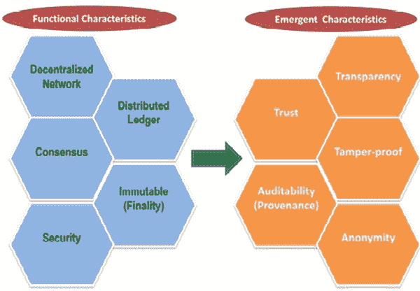 |

本章的组织如下。下一主要部分定义了区块链技术，描述了基本术语，概述了特性，描述了底层概念和区块链的各种类型，并总结了通用的区块链交易过程。下一节是本章的主要焦点，列举了目前在不同行业中追求的各种案例研究和应用，包括银行业、医疗保健、交通运输、制造业、供应链和教育等。还简要讨论了使用分布式账本技术（DLT）扩展物联网（IoT）愿景。最后一节提出了结论。

希望本章为进一步讨论本书后续章节中出现的各种与区块链相关的主题奠定基础。

区块链技术

区块链是分布式数据库，分布在许多计算机上，没有中央控制，它可以改变治理、商业模式和组织的运作方式。区块链是存储数字资产信息的理想场所（代表价值、身份、协议、产权、证书等）。它承诺了一种更高效、安全和透明的交易处理方式，可以节省大量的行政、官僚、努力和时间。

根据 McKinsey 在 Garson (2018)中的描述，区块链可以被描述为一个去中心化、共享和可信任的分布式账本（或数据库），它由添加到现有记录链中的加密的“块”组成。该账本依赖于全球对等网络的共识来运作。在没有修改整个链并且没有全体对等网络的一致共识的情况下，修改一个块中的数据是不可能的。在添加新块之前，必须首先由其他参与者（即其他块，也称为节点）验证，以防止欺诈并保护安全。块是不可变的，因此一旦数据被添加到链中的一个块中，就无法编辑；除非最初创建区块链时具有编辑块的功能，这是一个需要共识的事项（Robinson, 2018）。区块链允许信息在不依赖第三方中央或管理机构的情况下进行验证和交换。区块链技术基于一种称为密码学的复杂数学分支。

区块链应用包括：比特币（加密货币）、Sia（去中心化云存储）和以太坊（运行智能合约的虚拟机）。但是，在进一步进行之前，为了完整起见，有必要定义某些常用术语。这些列在表 1 中。

表 1\. 区块链术语及定义

| 区块链术语 | 定义 |
| --- | --- |
| 比特币 | • 第一个也是最流行的使用区块链技术运作的加密货币； • 一比特币等于 1 BTC 的货币单位 |

| 区块 | • 记录在区块链中的一组交易； • 基于密码学的过程，例如添加新块；

• 每个块都链接到前一个块，形成一个链 |

| 密码学 | • 用个性化代码保护通信的科学，使只有参与方能够读取消息 |
| --- | --- |
| 共识 | • 区块链进程运作的机制； • 指维护和更新分类帐的规则和机制，以确保记录的可靠性和真实性的规则和机制 |

| 以太坊 | • 一个构建基于区块链的应用程序的开源平台； • 发行一种称为以太币（ETH）的货币；

• 允许存储和执行代码，从而实现智能合约 |

| 哈希 | • 区块的数字签名（包括数字资产信息和哈希指针）用于认证 |
| --- | --- |
| 股权证明（PoS） | • 一种加密货币区块链网络达成分布式共识的共识算法； • 工作量证明（PoW）的替代方案 |
| 工作量证明（PoW） | • 区块链网络的共识算法，用于确认交易和生成新区块 |
| 智能合约 | • 与区块链相关联的程序代码，允许基于某个约定的触发事件添加交易； • 也称为链代码 |

区块链特性

如前所述，区块链的一些最重要的特性，这些特性形成了其在各种应用中使用的原因，包括：去中心化、透明度、不可变性和智能合约（Rosic，1016；Tasca，2019）。下面简要讨论这些特性。还可以参考图 1，其中详细列出了所述技术的功能和新兴特性。

+   • 去中心化：传统的客户端-服务器模型是一种中心化的方法，为行业提供了良好的服务，但存在漏洞。在去中心化系统中，数据由网络中的所有参与者拥有。此外，网络中两个节点之间的交互不需要经过第三方。这正是比特币和区块链背后的主要思想。

+   • 透明性：在区块链中，通过使用密码学来隐藏一个人的身份，从而保护用户的真实身份。但是，交易可以通过它们的公共地址进行查看；但这是为了责任追踪，进而转化为客户之间交易的信任和诚实。

+   • 不可变性：在区块链的情况下，这指的是一个块的数字内容，一旦输入就保持不变；任何修改尝试都会被阻止。这是通过使用密码哈希函数实现的。由于一个块包括数据和一个哈希（指向上一个块中的数据），这使得系统更加可靠。

+   • 智能合约：对于区块链，合约是以这样一种方式编写的，即不需要人为干预、验证或仲裁。此外，还有一种措施来确保冲突或双重交易不能写入区块链。任何冲突都会自动调解，并且每个有效的交易仅被添加一次（Tasca, 2019）。

解释区块链过程的简单方法如图 2 所示。

| 图 2\. 区块链的工作原理 |
| --- |
| 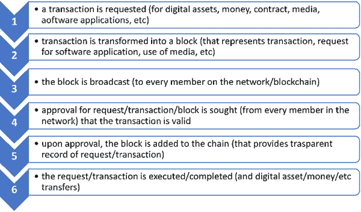 |

区块链类型

一般来说，区块链主要有三种类型：公共、私有和联合（Bhasin, 2019）。公共和私有区块链可以是有权限或无权限的（Singh, 2020）。联合区块链也被称为财团。以下是对它们的简要解释。

+   • 公共区块链：在这里，任何人都可以参与网络以添加和运行公共节点。这些区块链是分散的且速度较慢，与私有区块链相比，但它们提供更好的匿名性。网络的所有成员都可以看到块并参与验证的共识。这种类型具有真正的去中心化结构，并提供了最大的透明度和不可变性。例如：比特币和以太坊。

+   • 私有区块链：在这种情况下，拥有区块链的组织有权决定谁可以加入和访问网络。因此，这是一个中心化-去中心化的网络；访问权限因节点而异。不提供匿名性；然而，这些网络的运行成本比公共区块链低。这种类型比公共网络更节能，波动性更低，隐私性更好。例如：R3 和 Corda。

+   • 联盟或联合区块链：在这里，多个组织形成一个拥有网络的联合体。它充当多个组织共享和并行工作的中心。网络具有高度可扩展性和能源效率，并提供最快的输出和最低的成本。这种类型提供较低的交易费用和更强的健壮性，因为犯罪活动大大减少，与公共或私有区块链相比。例如：Multichain 和 Monax。

另一种分类如下：

+   • 无权限区块链：这些无需获得加入网络的许可（类似于公共区块链），因此非常适合运行和管理数字资产。其特点包括：匿名性、真正的去中心化、透明度、信任、不可变性和增强的安全性。这些链难以扩展，效率较低。以太坊（ETH）是一个例子。一些应用场景包括：数字身份、投票和筹款（Singh，2020）。

+   • 权限链：这更像是私有区块链，需要来自拥有组织（如银行）的许可才能加入。其特点包括：不同程度的去中心化、由拥有组织管理、高效、可扩展。这些链透明度较低，但能源效率更高。应用场景包括：研究、银行交易和供应链管理（Singh，2020）。

行业中的区块链应用

如《I-Scope》（2020）所述，区块链似乎比物联网（IoT）愿景更重要。区块链在行业中的应用和用例远远超出了使用比特币等加密货币进行金融交易。凭借区块链提供更多透明度和健壮性的能力，以及其不可变性等特点，这项技术正在影响着包括金融、制造业、供应链、物流和医疗保健在内的各种行业。下面将详细阐述该行业及更多领域中的一些区块链应用。

银行业

金融机构和银行业连接了各种群体，并为他们提供与贸易和商业相关的各种机会。在这种背景下，区块链提供了一种可以在更广泛范围内更安全和透明地完成相同任务的工具。因此，区块链技术具有全球商业潜力。它可以通过消除手工和纸质流程，并引入精简和自动化流程，使贸易更加高效。公共区块链可以成为一个伟大的协作工具，因为它是去中心化的。此外，在其运作中没有人类干预。以下要点简要讨论了区块链技术在银行业中的若干应用案例（《Concise Software》, 2020; Shumsky, 2019）。

+   • 更快的支付：银行业正朝着去中心化渠道进行支付和货币交易。因此，区块链技术已经被用于此目的。通过采用这项技术，支付变得更快，银行也能够减少处理费用以及来自第三方或中介的验证需求。一切迹象表明，到 2025 年，区块链将从根本上改变银行业（《Concise Software》，2020）。

+   • 减少欺诈：网络攻击的可能性可能是银行业今天面临的主要挑战。分散化的区块链技术因此较少容易受到这类欺诈的影响，不仅能够实时执行支付，而且具有完全透明性，这反过来也将实现实时欺诈分析和预防。区块链账本还可以保留并提供所有行动和共享文件的历史记录。

+   • 购买和销售资产：在证券市场，很大程度上依赖金融资产经纪人和托管银行进行买卖。这也涉及支付费用。使用区块链（以及比特币和以太坊等货币）可以消除中间人，消除交易费用，使流程更加自动化、具有弹性和安全，并帮助创建数字资产的去中心化数据库。

+   • 点对点转账：这允许客户在线转移资金，然而，存在许多限制，例如高额佣金和客户数据安全性的缺乏。在这里，区块链技术可以帮助去中心化点对点转账应用，因为区块链没有地理限制。交易是不可变的，可以实时进行，因此收款人不需要等待他们收到数字资产。

+   • 会计与审计：会计与审计在数字化方面进展相对较慢，主要是因为对数据完整性、准确性和有效性的监管要求。因此，会计是另一个可以通过区块链技术进行转型的领域，该技术可以简化合规流程并优化传统的簿记系统。在这里，企业可以直接将交易添加到分布式的联合注册中。因此，记录更加透明和安全。区块链智能合约也可以用于自动支付发票。

医疗保健

医疗行业开始采用区块链技术，以为患者提供综合护理，并解决存在于多个不同医院信息系统（HIS）中的患者数据同步挑战，同时确保数据安全和隐私。它还可以提供机会，确保互操作性、完整性、患者身份、隐私、可追溯性、降低运营成本，并使其服务普遍可及（CitiusTech，2018）。以下简要阐述了其中一些特点。

+   • 全国范围的互操作性：医疗机构作为国家医疗保健的一部分，采用不同的标准进行数据交换和共享，例如 FHIR、CDA 或 HL7 等。这可能导致不同系统之间的操作性降低。通过综合医疗企业（IHE）协议交换个人健康记录和健康信息交换（HIE）数据是解决系统互操作性和医疗记录可访问性挑战的重要组成部分。区块链可以通过使用 API 访问和传输数据来解决这些问题。虽然区块链技术并非数据标准化或系统集成挑战的灵丹妙药，但它确实提供了一个有前景的新的分布式框架，以加强和支持跨各种用途和利益相关者的医疗信息集成。它解决了几个现有的痛点，并实现了一个更高效、去中心化和安全的系统。

+   • 安全性：医疗机构日益关注的一个问题是敏感数据可能被篡改以及来自黑客的各种形式的安全漏洞。由于区块链中的数据使用发送者的私钥加密，只有预期的接收方才能使用相同的密钥解密，因此黑客很难篡改或修改这些数据。此外，要修改块中的数据，需要得到链中所有其他块的验证，因此，区块链还提供了内置的安全功能。

+   • 完整性：区块链是一个分布式账本，其交易是不可改变的（即它们保持不变）。这是一个确保交易完整性（即区块中的数据）的特征，同时数据加密增强了整个网络的安全性。通过实施区块链技术，各个医疗机构中多个过时的患者数据实例被最新患者信息的单一来源所取代。

+   • 普遍访问：在全国范围内管理医疗机构传播的及时访问患者数据是一个挑战。区块链技术也可以在这方面提供帮助。区块链架构确保所需数据存在于每个节点（即每个区块）中，并且根据智能合约或其他机制提供的访问权限，授权用户可以使用这些数据。

+   • 维护成本：信息系统需要在其运营寿命的剩余时间内进行维护。这涉及到诸如定期备份和建立恢复机制等操作。在这方面，区块链技术可以发挥作用。在区块链中，数据分布在网络中，没有单一的故障点可能导致固有备份机制；而且，每个区块链节点上都复制了单一版本的数据。这减少了在每个信息系统之间发生的交易量，从而减轻了医疗生态系统的负担。

区块链在医疗领域的更多应用，请参阅 CitiusTech (2018)。

制造业

制造业是一个区块链可能具有最大商业价值的行业。根据 Forbes 在 Columbus (2019) 的报告，成本节约、可追溯性和透明度是该行业投资于区块链背后的前三大驱动因素。Mire (2018) 列出了制造业中可以有用地应用区块链技术的十个用例，包括供应链管理、3D 打印、减少系统性故障、提高对产品的信任、对基于物联网的设备进行身份验证以及更好地跟踪和维护。其中一些简要讨论如下。

+   • 改进供应链管理：随着时间的推移，供应链（SC）变得越来越复杂，因为企业继续全球化。该领域技能的缺乏也变得越来越明显，供应链成本也变得越来越昂贵。正是在这种背景下，区块链解决方案可以简化供应链管理，帮助维持生产水平并提高效率。举例来说，企业可以开发系统，使供应链上的所有参与者都可以参考和更新所有人都能看到的单个记录。这些系统可以帮助制造商减少产品损失，为他们传递成品的人提供可靠性的证明，并且在监管合规方面起到重要作用。《福布斯》在哥伦布（2019）预测，区块链的最大投资将用于以下五个领域的应用：数字市场，追踪供应链参数，追踪产品质量，防止伪劣产品，追踪资产维护。本章稍后将进一步阐述区块链在供应链中的应用。

+   • 减少系统性错误：制造业并非免疫于数据泄露。这个如此依赖供应链的行业可能特别容易受到影响，因为 39%的受访高管在过去 12 个月中报告称成为了数据泄露的受害者；其中 38%的人报告称由于此类泄露而损失了高达$1000 万（Mire, 2018）。区块链的一个特点是，它需要链中所有节点的共识来批准数据录入或更改账本；这是区块链安全机制的一部分。因为制造业需要供应商之间几乎持续不断的沟通，而单一的数据泄露很容易损害每个方的运营，适当水平的区块链安全性可以防止欺诈尝试和由此导致的系统故障。

+   • 提高产品的信任度：制造和运输中的欺诈行为，特别是对可摄入产品的欺诈行为，尤其危险，可能导致严重的健康问题甚至死亡。制造商还要经受严格的认证和质量过程，消费者也应该知晓这些信息，没有理由不让他们参与其中。在这种情况下，区块链去中心化技术可以允许这些信息被分享，但不会被篡改或更改。此外，供应链溯源信息也可以被相当快速地获取。通过使用区块链技术，制造商可以建立其可靠性，从而获得更强的客户信任、忠诚度和关系。

+   • 网络设备的身份验证：物联网（IoT）正在影响几乎所有行业，包括制造业和物流业。根据 Mire（2018）报道的一项调查，在 2016 年至 2017 年间，制造业中基于物联网的设备连接增长了 84%。通过任何网络连接设备的一些问题包括：生成大量不同类型的数据，以及这些数据的安全性和完整性。使用区块链技术提供了一种安全的网络机制，通过该机制，基于物联网的设备可以更加可靠地进行身份验证和监控。在这里，信息还可以安全地传递并立即由授权用户共享。

供应链

管理当今的供应链可能异常复杂，因为成功的供应链运作依赖于在地理上分散的合作伙伴和其他相关组织之间的强大、透明和端到端的沟通。由于现有供应链的复杂性和不透明度，区块链对供应链管理（SCM）的作用正成为越来越受关注的领域。供应链管理（SCM）发现区块链技术吸引人的一些特性包括共识、溯源、不可变性、信任和最终性（Morley，2020）。这些特性为更高效的供应链管理带来了以下好处：

+   • 自动化：许多供应链流程是缓慢且基于纸张的。区块链技术可以用端到端数字化流程取代这些流程，提供更好的可见性和透明度。然而，这需要创建 100%数字化供应链，以便区块链能够运作。

+   • 更好的可追溯性：对溯源信息的监管需求日益增加，这已经在推动变革。公司已经开始利用区块链提高供应链透明度，采用追踪和溯源式的区块链应用。这反过来促成了更好的交货时间、提高的质量和可追溯性，以及减少的收入损失。

+   • 降低交易成本：基于区块链的资金转移能力，无需中介即可加快支付速度，同时节省交易和管理成本。此外，由于智能合约，许多操作可以自动触发（例如，如果交货延迟会发生什么），这可以显着降低成本。

+   • 加快操作速度：区块链技术保护信息和交易的完整性，从而减少错误和争议。整个过程变得更快，因为减少了产品召回或补发遗漏订单的需要。此外，使用智能合约意味着中介机构（例如清算所）的需求减少了。

+   • 更多的道德操作：消费者要求道德操作。在这里，区块链可以在两个方面帮助：1）供应链专业人员可以使用区块链溯源来确定他们使用的每一件物品的来源，并将这些信息传递给客户；2）由于固有的透明度，客户知道产品是如何制造和运输的。

运输和物流

区块链为行业提供的机会得到了广泛认可，这对运输行业也是如此。区块链在运输联盟（BiTA）是一个关于区块链兴趣的例子，该联盟成立了一个论坛（成员包括 UPS 和联邦快递），用于运输行业的区块链教育和标准制定（Robinson，2018）。在运输和物流领域，区块链可以有助于以下方面：

+   • 提高整个航运流程的效率和透明度，包括通过区块链智能合约将承运人与运输公司进行匹配

+   • 简化支付-通过使用以太坊等区块链平台，无需人为干预

+   • 减少中介数量-因为区块链技术不需要任何阶段的人为干预

+   • 展示整个供应链的更大可见性-因为区块链中的每一方都在整个过程中验证和记录交易

+   • 增加运输和航运的透明度和跟踪能力-这反过来会阻止货物盗窃的尝试

+   • 提高运输和航运过程中的信任级别 - 通过使用区块链，多个方将能够验证该过程。

区块链还以其他几种方式改变着运输和物流的面貌，包括以下几点（Winnesota，2020 年）：

+   • 更好的货运跟踪：随着按需交付的增加，顾客的期望也在增加，但是扩展流程已经被证明是有问题的，特别是在身份验证方面。通过使用区块链进行数据认证，整个网络都可以贡献并验证数据，从而减少了对恶意外部代理人篡改数据的可能性；跟踪效率也得到了提高。

+   • 成本降低：这一直是所有企业努力实现的核心目标之一。在这方面，智能合约可以是对货运行业最有影响力的区块链功能之一。智能合约本质上是通过区块链编码的自动执行任务，在满足某些条件时执行。区块链智能合约将彻底消除各种行政步骤的需要，降低成本，几乎也消除了所有人为错误的可能性。

+   • 提高供应链流动性：供应链管理中存在许多低效问题，主要是由于多个合作伙伴组织之间的互动。通过采用基于区块链的技术栈，如 Winnesota (2020)中提到的 Sweetbridge，大多数低效问题都可以解决。这些技术可以帮助提高供应链内各方在解决争议时的结算效率，从而增加流动性。

教育

区块链技术（BC）在教育领域的应用可能性很多。随着教育变得更加多样化、民主化和去中心化，迫切需要在认证流程和学习体验中保持声誉和信任，并确保教育过程更加透明。区块链可以提供这样的系统。Clark（2016 年）提出了区块链在教育中的十种用途，包括保留国家数据库、组织全球评估、更好的持续专业发展、提供企业培训、提供职业教育（例如学徒制）等。Byon（2020 年）还提出了一些可以帮助缓解与数字教室、智能教室白板、远程学习等教育技术相关问题的方法，并研究了教育机构实施区块链技术的动因。以下简要介绍了区块链可能证明有用的一些方式（Hance，2020 年；Clark，2016 年；Alacrity，2020 年；Maaghul，2019 年）：

+   • 学生记录的安全保存：这些记录（包括出勤情况、学习计划、缴费情况、取得的成绩和课程材料等）可以成为学生个人区块链记录的一部分。由于这些记录是不可变的（即不能在没有区块链共识的情况下删除或修改），它有助于数据安全。此外，这些记录现在将属于学生，而不是机构（Hance，2020 年；Alacrity，2020 年）。采用相同方法也可以确保教职员工的记录安全可靠。

+   • 为所有人提供学习平台：重要的是学生、教师、课程开发者和其他学术人员之间有联系。在这种情况下，区块链和数字代币（作为区块链技术的一部分）可以推动一个创新的学习平台，构建一个开源的内部学习教育系统，学生可以在这个平台上访问材料并开展创新项目。平台上的数字代币可以作为对学生在平台上活动的奖励。学生可以使用他们的代币来获取新的学习材料，并继续学习下去（Alacrity, 2020）。

+   • 标准化和真实性：有必要采取统一的方法来跟踪和管理来自教育机构、专业社团、行业协会和州考试委员会的学生证书。一个可以从任何地方随时数字访问的单一数据库创建了一个经过验证的证书标准。如果数据存储在公共区块链上，则存储在网络上的每个节点上（机构和教育机构）。如果一个节点受到 compromise，账本将保持不受影响。此外，如果任何数据被篡改，这将影响到区块的密码哈希，从而打破区块之间的链条。在这种情况下，违规行为将被广播到整个网络，并且被篡改的区块将被拒绝。这提供了标准化数据的安全性和真实性（Maaghul，2019）。

物联网（IoT）

目前，区块链与物联网的融合已经成为许多组织的议程，不仅在金融服务领域，在社会几乎所有领域都是如此，正如上文已经说明的那样。使用区块链为物联网带来的核心好处可以总结如下：

+   • 在用户和物联网设备之间建立信任，并减少串通和篡改的风险

+   • 通过消除涉及中间人的开销来降低成本

+   • 通过缩短各方之间的结算时间加快交易速度

+   • 增强设备连接和数据传输的安全性。

在以下项目符号中，介绍了一些区块链在物联网应用中的使用案例。

+   • 保险：区块链和物联网在保险中的主要用例是与智能合约和增强诸如理赔管理等流程有关。其他应用包括欺诈管理和减少安全相关威胁，法律要求的应用和合规性，甚至在保险背景下使用技术。物联网数据和区块链可以导致智能自动化保险政策（I-Scope，2020）。

+   • 企业资源规划（ERP）：区块链技术和物联网已经在 ERP 系统领域的供应链管理和生产中发挥着重要作用。区块链可以创建相关信息和数据的单一版本，并确保所有相关系统通过区块链进行交流，无需中介的干预。区块链可以作为一种补充手段，简化各方之间的集成，并减少由系统固有安全性导致的应用漏洞（Active Business Systems，2020）。

+   • 自动驾驶车辆：目前，像自动驾驶汽车（例如通过 Uber 或 Google）这样的共享机器，数据是由服务提供商集中管理的。利用基于区块链的服务和通过物联网连接的车辆，任何数量的个人都能够在他们之间形成购买或共享自动驾驶车辆并共同维护的协议。然后，每个合作团体可以与其他团体达成协议，并在更广泛的同行群体中共享其车辆的使用（ConsenSys，2016）。

结论

区块链技术似乎比物联网愿景（I-Scope，2020）更重要。 区块链在行业中的案例研究和应用远远超出了金融交易和加密货币转移。 这是由于其透明度、开放性和公平性，以及其具有高度吸引力的特性（如不可变性）和节点之间的共识等特性，这项技术正在影响金融、制造业、医疗保健、物流、供应链、汽车和交通等各种行业。

在本章中，我们介绍了区块链技术，并讨论了其在社会各个领域的应用和案例研究，包括银行业、医疗保健、交通运输、制造业、供应链和教育。我们还简要讨论了使用分布式账本技术扩展物联网（IoT）视野的可能性。我们描述了基本术语，概述了基本特征和优势，并描述了基本概念和区块链过程。

参考文献

主动商务系统。 (2020). 区块链与 ERP。 可在: https://www.activebs.com/en/news/2018/blockchain-and-erp

Bhasin，H. (2019 年 4 月). 区块链的 3 种主要类型: 区块链的分类。 可在: https://www.marketing91.com/types-of-blockchain/

Byon/Alacrity。 (2020 年 5 月). 教育中的区块链: 三项有前景的改革。 可在: https://alacritys.net/2020/05/27/blockchain-in-education-three-promising-reforms/

CitiusTech。 (2018 年 5 月). 区块链用于医疗保健。 可在: https://www.ehidc.org/sites/default/fi:les/resources/files/blockchain-for-healthcare-341.pdf

Clark，D. (2016). 区块链在教育中的 10 种用途。 可在: https://oeb.global/oeb-insights/10-ways-blockchain-could-be-used-in-education

Columbus, L. (2019 年). 区块链如何改善 2019 年的制造业。可在：https://www.forbes.com/sites/louiscolumbus/2018/10/28/how-blockchain-can-improve-manufacturing-in-2019 查阅。

Concise Software. (2020 年). 银行业区块链的 10 个用例。可在：https://concisesoftware.com/10-use-cases-of-blockchain-in-banking 查阅。

ConsenSys. (2016 年). 区块链物联网的 5 个不可思议的应用。可在：https://blockgeeks.com/5-incredible-blockchain-iot-applications/ 查阅。

Garson, B. (2018 年 6 月). 区块链超越炒作。可在：https://www.mckinsey.com/business-functions/mckinsey-digital/our-insights/blockchain-beyond-the-hype-what-is-the-strategic-business-value?cid=other-eml-nsl-mip-mck-oth-1807&hlkid=5424a29008e445239371a81cc83b3dbb&hctky=10291646&hdpid=bb9f89f0-458b-4b4e-a1ee-ad99e602294e 查阅。

Goyal, S. (2018 年 11 月). 区块链技术的历史：必须了解的时间线。可在：https://101blockchains.com/history-of-blockchain-timeline/ 查阅。

Hance, M. (2020 年). 什么是区块链，它如何在教育中使用？可在：https://mdreducation.com/2018/08/20/blockchain-education/ 查阅。

I-Scope. (2020 年). 区块链与物联网：物联网区块链的机遇与挑战。可在：https://www.i-scoop.eu/internet-of-things-guide/blockchain-iot/ 查阅。

Maaghul, R. (2019 年 10 月). 教育中的区块链：记录管理的未来。可在：https://blogs.odem.io/blockchains-bright-future-in-the-education-industry 查阅。

Mire, S. (2018 年 11 月). 制造业区块链：10 个可能的用例。可在：https://www.disruptordaily.com/blockchain-use-cases-manufacturing 查阅。

Morley, M. (2020 年 2 月). 供应链中 2020 年的区块链前 5 个用例。可在：https://blogs.opentext.com/blockchain-in-the-supply-chain/ 查阅。

Robinson, J. (2018 年 8 月). 区块链在运输业的未来。可在：https://www.fleetio.com/blog/future-of-blockchain-in-transportation 查阅。

Rosic，A.（1916 年）。什么是区块链技术？初学者的逐步指南。可查阅：https://blockgeeks.com/guides/what-is-blockchain-technology/

Shumsky，P.（2019 年 9 月）。2020 年银行的区块链用例。可查阅：https://www.finextra.com/blogposting/17857/blockchain-use-cases-for-banks-in-2020

Singh，N.（2020 年 5 月）。**许可**与**无许可**区块链：一份比较指南。可查阅：https://101blockchains.com/permissioned-vs-permissionless-blockchains/

Tasca，P.，& Tessone，C. J.（2019 年）。区块链技术分类：识别和分类原则，Ledger。LedgerJournal.org。

Winnesota。（2020 年）。区块链如何改变交通物流世界。可查阅：https://www.winnesota.com/blockchain

Witscad。 （2020 年）。区块链特性。可查阅：https://witscad.com/course/blockchain-fundamentals/chapter/blockchain-characteristics

**附加阅读**

R3。 （2020 年），Corda 企业版：下一代区块链平台，可查阅：https://www.r3.com/corda-platform/

Consensys，（2020 年），智慧迪拜：阿联酋政府的区块链案例研究，可查阅：https://consensys.net/blockchain-use-cases/government-and-the-public-sector/smart-dubai/

Consensys，（2020a），真实世界区块链案例研究，可查阅：https://consensys.net/blockchain-use-cases/case-studies/

Crypto Digest。 （2020 年），EOS 平台：你应该知道什么，可查阅：https://cryptodigestnews.com/eos-platform-what-you-should-know-58da830d2aa8

Daley，S.（2020 年 3 月），25 个颠覆现状的区块链应用与实际用例，可查阅：https://builtin.com/blockchain/blockchain-applications

经济点。 （2020 年），以太坊平台是什么，可查阅：https://economicpoint.com/ethereum

Garson, B. (2018 年 6 月)，区块链超越炒作，可在 https://www.mckinsey.com/business-functions/mckinsey-digital/our-insights/blockchain-beyond-the-hype-what-is-the-strategic-business-value?cid=other-eml-nsl-mip-mck-oth-1807&hlkid=5424a29008e445239371a81cc83b3dbb&hctky=10291646&hdpid=bb9f89f0-458b-4b4e-a1ee-ad99e602294e 上获取。

Hyperledger Fabric。 (2020 年)，Hyperledger Fabric，可在 https://hyperledger-fabric.readthedocs.io/en/release-2.0/whatis.html 上获取。

IEEE Spectrum，(2020 年 4 月)，西班牙研究人员使用区块链和人工智能来降低曲线，可在 https://spectrum.ieee.org/news-from-around-ieee/the-institute/ieee-member-news/researchers-spain-blockchain-ai-app-flatten-the-curve 上获取。

Infura，(2020 年)，与 Horizon Games 合作推动游戏的新维度，可在 https://infura.io/customers/skyweaver 上获取。

ISO，(2016 年)，信息技术，专利号 ISO/IEC 10118–1:2016

Kashyap, P. (2018 年 2 月)，什么是不同类型的区块链及其组成部分？可在 http://www.beingcrypto.com/what-are-different-types-of-blockchain-and-its-components/ 上获取。

Komgo，(2020 年)，简化贸易融资，可在 https://komgo.io/ 上获取。

Mahmood, Z. (2021 年)。区块链技术：行业中的倡议和用例。在 Mahmood, Z. (Ed.)，《区块链技术行业用例：行业中的倡议和用例》，IGI Global，2021。

Malhotra, M. (2020 年 3 月)，2020 年值得关注的区块链平台的全面列表，可在 https://www.valuecoders.com/blog/technology-and-apps/a-comprehensive-list-of-blockchain-platforms-to-look-for-in-2019/ 上获取。

MarketWatch。 (2020 年 6 月)，区块链技术市场份额，到 2025 年将超过 250 亿美元 - 新闻稿，可在 https://www.marketwatch.com/press-release/blockchain-technology-market-share-growth-to-record-over-us-25-billion-by-2025-2020-06-09 上获取。

MultiChain。 (2020 年)，面向开发人员的 MultiChain，可在 https://www.multichain.com/developers/ 上获取。

[OpenChain](https://docs.openchain.org/en/latest/general/overview.html)。 (2020)，OpenChain 概述。

[OpenZeppelin](https://openzeppelin.com/)。 (2020)，安全区块链应用的标准。

Project Khokha：企业以太坊银行和金融案例研究，（2020），可参考：https://pages.consensys.net/consensys-banking-and-finance-project-khokha-v2?utm_campaign=Enterprise%20Ethereum%20&utm_source=Website&utm_medium=Direct&utm_term=EntEth&utm_content=CaseStudyKhokha

[瑞波](https://ubri.ripple.com/faq/)，（2020），大学区块链研究计划。

Robinson, J. (2018, 八月)，区块链在交通运输中的未来。可参考：https://www.fleetio.com/blog/future-of-blockchain-in-transportation

[卡内基梅隆大学提佩商学院](https://www.cmu.edu/tepper/faculty-and-research/initiatives/blockchain-initiative/)。 (2020)，提佩区块链计划。

Zaky, D. (2020, 三月)，什么是区块链技术以及它是如何工作的？可参考：https://fxdailyreport.com/blockchain-technology/

关键术语与定义。

比特币：比特币是一种为了用于点对点在线交易而创建的数字货币，于 2008 年推出。它是一组虚拟货币中最为突出的一种。

区块链：区块链是分布在许多计算机上并且没有中央控制的分布式数据库，它可以改变治理、商业模式和组织的运作方式。区块链上存储着关于数字资产的信息（代表价值、身份、协议、财产权、证书等）。

链码：在区块链技术的背景下，它是自执行智能合约的另一个名称。

共识：它是区块链系统中用于实现在分布式进程或多代理系统之间对于单个数据值或网络的单个状态达成必要一致的容错机制，比如在加密货币中使用。

密码学：这是利用个性化代码（例如公钥和私钥）来保护通信的科学，以便只有参与方才能读取加密消息。

以太坊：一个构建基于区块链的应用程序的开源平台。它允许分发一种称为以太币（ETH）的货币；并允许存储和执行代码以实现智能合约。

哈希：这是一个区块的数字签名（包括公钥和私钥），用于身份验证和验证目的。它是区块链用于确认其状态的过程；区块链中的每个交易都需要一个或多个数字签名。

超级账本 Fabric：这是一个由 IBM 开发的分布式账本解决方案平台，支持模块化架构，提供高度的保密性、弹性、灵活性和可扩展性。它设计用于支持区块链技术的不同组件的可插拔实现。

权益证明（PoS）：这是一种共识算法类型，用于加密货币区块链网络实现分布式共识。在基于 PoS 的加密货币中，添加下一个区块是通过考虑各种组合的随机选择（例如财富或年龄，即“权益”）来组织的。

工作证明（PoSW）：这是一种共识机制，通过要求服务请求者进行一些工作，通常意味着计算机的处理时间，来帮助阻止或减少网络上的拒绝服务攻击和其他安全滥用，如垃圾邮件。

智能合约：智能合约是一种计算机协议，促进了已经同意的规定或条款之间的数字资产转移。它是一种自执行代码，当预先同意的条件得到满足时即会生效。

# 第二章

# 在教育环境中基于区块链的机器人流程自动化机制

+   Nhlanhla Andrew Sibanyoni

    

    南非约翰内斯堡大学

**摘要**

区块链技术和机器人流程自动化越来越成为研究的焦点，因为它们在商业、营销、制造和金融领域都被成功应用。然而，在教育环境中它们的应用仍在不断涌现。本章以一个在线学校注册系统的例子来探讨基于区块链的机器人流程自动化机制如何解决固有的挑战。提出的系统允许父母为他们选择的学校注册一年级和八年级的孩子。某些学校的名额竞争激烈，存在不公平分配教育资源的历史；因此，存在着不信任。为了应对这一威胁，本研究提出了一种基于区块链的机器人自动化流程机制，以公平、透明地分配教育资源。它建议进一步进行设计科学研究，其中区块链被其他技术流程补充，以增强教育环境中的数据共享。

**介绍**

本章探讨了南非一组区域学校的在线学校注册系统作为一个例证性示例。这是一个官方在线申请系统，由父母用于为他们的一年级和八年级孩子注册南非学校的下一个学年。这个系统是公民面向的电子政府系统的一部分，因为它由国家运营，并符合 Silcock（2001）给出的电子政府的定义。

电子政府被定义为利用信息和通信技术（ICT），可能包括广域网、系统、互联网、物联网和移动计算等，以增强对政府服务的获取和提供，从而使公民、商业伙伴和员工受益（Silcock，2001 年）。这促进了一种新的公共服务模式，政府机构有机会为其公民提供技术先进、集成和无缝的服务（Bakon，Elias＆Abusamhadana，2020 年；Silcock，2001 年）。然而，正如 Bélanger 和 Carter（2008 年）所确定的，相互信任阻碍了公民对电子政府服务的采纳。他们的研究得出结论，政府机构应直接解决公民对电子政府系统的可信度和值得信赖性的看法，以增加公民对其价值、准确性和可靠性的认知。通过改善透明度和问责制，可以进一步加强公民采用电子服务所需的信任（Bélanger＆Carter，2008 年）。

注意到，在南非，线上学校注册系统获得信任已被证明是一个挑战。在某些公立学校中，争夺名额充满了情绪，具有严重的个人和社会后果。这种不信任往往源于报纸和其他媒体发布的负面报道，加上该系统运行背景下不公平分配教育资源的历史（Mokhaoli，2020 年）。这已经影响了人们对线上学校注册系统透明度和完整性的信任问题。即使像当前章节一样，报告的研究重点专门是技术解决方案，这些问题仍然很重要。未来的研究将从其他电子政府视角审视在线学校注册系统。

在本章中，提出了一种基于区块链的、机器人流程自动化机制，作为解决社区、学校管理、ICT 技术人员和系统的监护政府部门在注册过程中面临的一些挑战的方法。重要的是要注意，目前在线学校注册系统(OSRS)并不使用物联网、机器人流程自动化(RPA)或区块链。这些术语在后续章节中将详细定义。

背景

鼓励家长通过在线系统注册他们的孩子，如图 1 所示。

| 图 1\. 在线学校注册系统流程的当前说明 |
| --- |
| 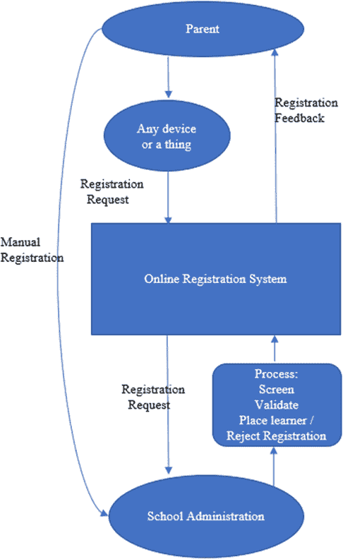 |

作为流程的一部分，必须附上已认证文件的副本，例如出生证明、身份证明文件、以往年级的学校成绩单和住所证明。该系统还要求家长“拍摄注册过程的照片”作为注册的证明，并在同一天将提交给学校的文件的纸质副本提交。这个额外的流程(出现在图 1 的左侧)可能旨在验证提供的信息，从而减少故意提交错误信息，并检查在线数据是否被篡改。家长可以使用各种设备访问系统(手机、笔记本电脑、台式电脑；如图 1 的顶部所示)。系统有一个密集的数据输入期(有固定的开始和结束时间)。

尽管父母已经使用了在线系统，但他们还需要提交文件的纸质副本，并向选择的学校提交注册证明（如图 1 左侧所示）。这种“备用系统”帮助父母证明，他们的在线申请遗失、误放、学校从未收到，或者他们的孩子被不公正地安排到远离家的学校等任何指控都是有依据的。然而，保留手动流程会导致工作重复和需要在争议案件中协调的重复数据增加，并且争议解决过程仍可能存在人为失误，包括偏见，这可能再次导致学习者被不当或不公平地安排。因此，在存在冲突信息时，信任问题仍然有效，而双系统导致手动管理负担增加。事实上，在使用两个平行系统时，自动化系统试图解决的手动系统的许多局限性只会被放大。  

尽管使用移动设备访问电子政府系统具有明显的优势，但也带来了机遇和挑战。在数据传输和存储过程中的安全性和隐私性是一个重大挑战。图 2 显示了一个特定于互联网的生态系统，物联网（Lohachab、Lohachab 和 Jangra，2020 年）所引发的挑战，但几乎所有指出的挑战都适用于任何基于互联网的生态系统。

| 图 2\. 物联网系统固有的挑战 |
| --- |
| 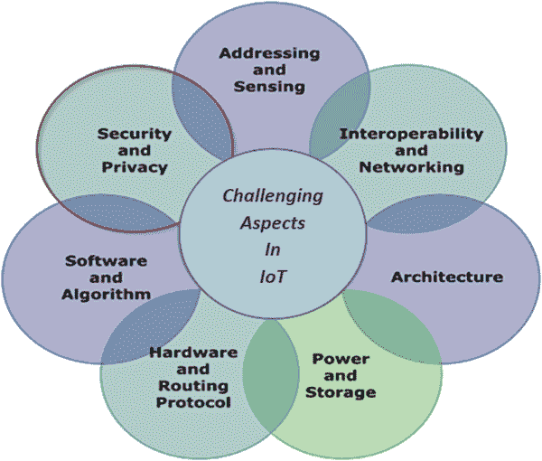 |

有必要解决这些挑战并吸收这样一个系统，因为这样可以理解连接移动设备的新范式，从而提供通信的超高可靠性。这可以通过研究和开发通用安全架构来实现，以成功部署基于互联网的系统（Lohachab 等人，2020 年）。

对虚拟环境的信任

信任的主题是一个重要的研究领域，因为人们普遍认为虚拟环境的广泛成功取决于公众的信任（Tan & Thoen，2001）。信任由两个元素组成：提供服务的一方（方信任），以及控制信任，即提供服务的机制（Bélanger & Carter，2008）。Tan 和 Thoen（2001）将控制机制定义为通过监控和控制确保交易成功执行的专用程序和协议。信任被定义为对个人或团体可以信赖其承诺的期望。根据社会学习理论，人们由于他们对承诺的负面或积极强化的经历而形成不同的期望。在给定的情景中，一些家长的申请按预期进行，而其他人可能会遇到困难，如介绍中所解释的那样。本章提出，正如 Xing 和 Marwala（2018）所建议的那样，区块链技术可以通过改变在线交易的一般执行方式并确保成功，为机器人流程自动化（RPA）提供辅助（Makridakis Polemitis、Giaglis & Louca，2018）。

基于区块链的 RPA 在线学校注册系统的潜力

提出的解决方案的第一部分是基于一个主张，即 RPA 在数据传输和存储过程中在一定程度上能够弥补安全和隐私方面的差距，并且，此外，学校行政效率和注册流程的公平性也能得到改善。RPA 被应用于重复和手工的基于规则的人类任务。例如，历史上 RPA 已经被用于工业工程流程，逐步自动化旨在实现经济效益和改善产品质量的任务（Moffitt、Rozario 和 Vasarhelyi，2018）。RPA，也被称为机器人或机器人，涉及模仿用户行为的软件代理，旨在提高运营效率以减轻人力工作负担（Syed 等，2020）。需要注意的是，这些并不是我们熟悉的硬件机器人。

RPA 最近被用于自动化组织内部流程和应用程序，这些流程和应用程序可以为核心业务流程带来直接价值，包括员工工资支付、员工状态变更、新员工招聘和入职、应收账款和应付账款、发票处理、库存管理、报告创建、软件安装、数据迁移以及供应商入职（Madakam、Holmukhe 和 Jaiswal，2019）。

提议解决方案的第二部分涉及区块链技术，因为在家长、在线学校注册系统和学校之间准确、可靠和安全地传输机密信息的需求仍然存在。正如前文所述，信任是系统所面临的一个主要因素，因为家长们不相信系统是公平和透明的（也就是说，它会根据语言和位置 - 靠近学校的距离 - 将他们的孩子安排在合适的学校）。区块链创建了交互的不可变记录，因为所有这些交互都通过区块链进行。这种方法确保数据的质量是完整的、正确的、持久的和可检索的（Reyna、Martín、Chen、Soler 和 Díaz，2018）。

人工智能（AI）以机器人或机器人（与 RPA 互换使用的术语）的形式体现，具有执行复杂、困难、危险、数据密集型任务的能力，例如监测网络安全威胁或为人类执行枯燥任务。AI 随处可见，并影响着我们生活的方方面面，包括服务、交通运输、军事机器人等等。AI 机器人可以在没有人类控制的情况下做出决策和行动（Dignum, 2017）。在基于区块链的 RPA 中，注册过程可以通过机器人（bots）有效可靠地自动化。区块链可以确保记录不被更改，历史被保留，并保持透明度，从而构建可信赖的数据共享（个人数据）（Shahaab、Hewage & Khan，2020），以及高效和有效的注册。透明度、验证（包括家庭事务部门对出生证明等问题的验证）、学习者注册记录的可追溯性和不可变性，都得到了改善。可追溯性显示了交易的状态，包括其在流程（工作流程）中何时接收。在分布式系统中特别有用（客户不访问办公室，几个不同的参与方 - 在这种情况下，学校和集中式注册机构）位于不同地方。区块链被认为安全地存储/传输可信赖的数据；另一方面，人工智能可以确保这些数据在没有人类干预的情况下发送和接收，使其在在线系统上进行交易更加可信赖。这种组合使得区块链和人工智能成为处理安全存储/传输数据的复杂任务的自然选择（Makridakis 等人，2018）。

区块链由按时间顺序排列和分组的交易组成。这些区块由网络中的矿工或节点（参与者）管理，这些矿工或节点将这些区块链接起来。由于这使得更改记录变得困难，尽管记录被广泛共享，但所有交易的稳固和可审计的注册表被创建（Casino et al.，2019）。在在线学校注册系统中，有一些问题可能会诱使父母、学校管理员或独立的不诚实人士如黑客来欺骗系统，有时是为了经济报酬。由于注册系统涵盖全国所有学校和学生，手动系统难以监控和控制。与注册相关的规则很复杂；例如，如果一个兄弟姐妹已经在学校，那么随后的兄弟姐妹会自动获得入学资格（因为他们是排在第一位的）。基于区块链的 RPA 机制可以确保这些规则被正确应用。区块链具有使用加密技术自动验证证书并以分散、安全、透明和可信任的方式提供对共享数据库、交易、记录和日志的访问的能力。而以 RPA（机器人或机器人）形式存在的 AI 提供了模仿人类智能的决策能力，这两种技术的结合可以为公民带来巨大的好处（Salah, Rehman, Nizamudddin, & AI-Fuquaha, 2018）。

本研究通过教育领域中一个具体的现有例子——在线学校注册系统，对区块链和 RPA 文献做出了贡献。然而，重要的是我们要承认，不能期望单一解决方案能够解决教育系统注册一年级和八年级孩子的所有问题；因此，需要进一步进行经验研究，找到区块链如何被其他解决方案补充以增强教育管理中的数据共享的方法。

本章组织如下：下一节将讨论有关物联网、机器人自动化流程和区块链技术处理数据流程的相关工作。 接下来的部分讨论了关于在线学校注册系统如何使用基于区块链的机器人流程自动化机制管理信任问题的提出的解决方案。 在最后一节中，本章以结论和未来工作前景结束。

相关工作

有足够的文献讨论了关于在教育领域使用区块链技术实现技术的实现技术，涉及到信任、交换、存储、验证和共享学生已经实现的证书和/或学习成果，但是有限的文献讨论了如何使用基于区块链的机器人流程自动化来处理与教育资源不公平分配相关的挑战的实现技术。

物联网（IoT）

万物互联可能会创建一个庞大的网络，其中包含数十亿或数万亿种不同类型的智能设备（或“物品”），它们相互连接并进行通信，而无需人类干预（Arslan 等，2019; 陈旭，刘，胡和王，2014）。术语“物联网”已被定义为通过相关传感器与互联网物理连接的几个对象的组合，例如，射频识别（RFID）或射频识别（Albishi，Soh，Ullah 和 Algarni，2017）。物联网也被定义为：1）用于通过与不可靠网络链接交互以达到共同目标的连接数字设备的数量不断增长（Arslan 等，2019）; 2）自动收集数据，将信息中继到彼此并协同处理信息的互连智能设备（陈，2012）; 3）使用标准通信协议具有虚拟表示的互连设备（Barnaghi，Wang，Henson 和 Taylor，2012）; 和 4）智能网络（即，基于互联网的网络的扩展和扩展），用于根据约定的协议通过信息传感设备从人到人，从人到其他物品或从物品到互联网扩展信息交换和通信（陈等，2014）。这些定义（以及表 1 中列出的其他定义）大致一致。

在本章中，物联网被视为涉及多种技术，如射频识别、短距离无线通信、实时定位和传感器网络，这些技术使互联网能够在最小或没有人类干预的情况下触及物理物体或物品的现实世界（Feki，Kawsar，Boussard 和 Trappeniers，2013）。这些技术中的许多都是在物联网的概念之前发明的；创新涉及将它们组合并以新的方式使用。

表 1. 万物互联愿景的其他定义 [摘自 Chen 等人（2014 年）]

| 组织 | 定义 |
| --- | --- |
| 加利福尼亚特许学校协会 | 支持人与物之间或物与物之间通信的网络基础设施，通过收集、传输、分类和处理来自物理世界对象的信息。因此，数据是由非人类传感器收集的，并通过具有感知、计算、执行和通信能力的各种部署设备进行控制。 |
| 电信标准化部门 | 利用现有和不断发展的可互操作的信息和通信技术，连接物理和虚拟事物，为信息社会提供先进服务的全球网络基础设施。 |
| 协调和支持全球 RFID 相关活动和标准化行动 | 利用捕获的数据和通信能力来连接物理和虚拟对象的全球网络基础设施。 |
| 互联网工程任务组 | 通过标准通信协议唯一控制的全球互联的物体或物体的网络。 |

万物互联模型被视为下一代互联网，其发展、实施、影响和价值取决于各种参与者（如软件开发人员和接入技术提供商），以实现不同通信基础设施的融合。新的、综合的结构可以在制造、公用事业管理、农业和医疗保健等各个领域部署。因此，物联网的应用领域很广泛，需要设计智能网关来连接物联网基础设施、云计算以及其他信息和通信技术（Hameed、Khan 和 Hameed，2018 年）。

但是，任何物联网架构的设计都是复杂的，因为系统必须能够集成使用技术链路层的异构设备，以打开对数据的选择性子集的访问（Zanella 等人，2014 年）。这必须透明、安全、无缝地完成。物联网面临的复杂性和挑战（参见图 2）需要具备以下特性（Chen 等人，2014 年）。请参阅表 2。

互联网物联网特性表 2. 特点

| 全面感知 | 使用识别和识别技术，自动获取任何时间、任何地点的对象信息，例如射频识别、传感器和二维条码。例如，一个使公民能够远程与现实世界互动的传感器网络。 |
| --- | --- |
| 可靠传输 | 物联网应该能够通过传输数据并利用各种现有和新的基础设施，在任何时间、任何地点、有线或无线的情况下，在物理世界、虚拟世界、数字世界、机器对机器（M2M）、移动对机器和人对机器之间创建互动，并能够在技术、网络技术和网关技术之间切换，例如，云计算、电信网络、无线电网络和互联网。 |
| 智能处理 | 借助诸如云计算等技术支持，物联网数据应该在设备或物体之间高效、安全地收集并即时处理到数据库中，无需人为干预。 |

现有的在线注册系统旨在成为南非公民数字平台的组成部分，该平台通过快速简便的服务请求提供相关信息，并具备跟踪功能（Gauteng Provincial Government, 2020）。旨在利用先进的通信技术支持父母的增值服务。建议使用基于区块链的 RPA 以及来自物联网架构的概念，南非教育部应能够提供对个人数据的部分子集的访问，而不会损害安全性。

父母仅在特定期间内进行在线注册，例如，2020 年 5 月 20 日至 7 月 22 日。然而，在该期间内，收集到在线学校注册系统的数据量巨大，使得将其整合、处理并迅速基于此作出决策成为一项具有挑战性的任务。此外，一些父母表现出沮丧的迹象，并抱怨系统不方便且不可靠，因为即使他们及时在线申请，他们的孩子仍然没有被安排。因此，在面对这些挑战时，相关教育当局不得不延长 2020 年的注册期限（The Citizen，2020）。然而，技术的进步可以改变和改善生活。它带来了极小的电子设备，拥有大量的计算能力、存储能力和电池容量，并具有识别、通信和互连能力。借助这种技术，可以分析和处理大量信息（Chen，2012）。因此，如表 2 中所示的三个必需特征可以通过新一代技术满足。Rejeb、Keogh 和 Treiblmaier（2019）已经证明，将区块链技术部署为物联网基础设施的一部分可以简化并有益于现代供应链，并增强价值链网络。

Robotic Process Automation (RPA)

RPA 软件模拟通常是结构化且重复性的人类操作（Hofmann、Samp 和 Urbach，2019）。这些流程使用诸如 Microsoft 工具、基于规则的结构（if、then、else 和循环语句）的 ERP 系统，通过连接到客户服务器或主机上的 API，或者通过使用 HTML 代码转换为可执行脚本并通过仪表板或其他用户界面控制的方式实现，在个人电脑上安装（van der Aalst、Bichler 和 Heinzl，2018）。

‘机器人’或‘机器人’一词表示一种可编程的电机机械设备，它自动执行一系列动作，有时可能是复杂且智能的。例如，Sophia 是由总部位于香港的汉森机器人公司开发的社交人型机器人，使用人工智能软件处理虚拟和情感数据。它可以展示 50 多种面部表情，并利用这些信息与人交谈并建立关系。受社会昆虫启发的群体机器人学使用协调技术来控制大量相对简单的机器人。在这种情况下，假定机器人具有以下重要特征：（i）机器人是部分独立的代理；（ii）机器人具有有限的表示，即它们不了解整个系统；和（iii）没有一个机器人管理整个系统，因此保持了去中心化（Zikratov、Lebedev、Gurtov 和 Kuzmich，2014 年）。机器人群体可以检测并信任其对等体，其中公钥密码技术允许任何想要与特定机器人地址通信并发送信息的机器人，具有只有机器人具有匹配密钥以读取记录的信息。即使公钥落入错误的手中，也没有风险，因为它不用于解密记录（Ferrer，2019 年）。此外，可审核的永久记录可用于协调操作，在点对点版本的区块链的同步副本中存储的凭据可用于验证它们都共享同一公共数据库（Ferrer，2019 年）。进化机器人学是一种新兴技术，受达尔文主义原则的启发，即最适者的选择性繁殖，用于自动创建与环境紧密互动的自主机器人，几乎不需要人为干预即可发展自己的技能。环境机器人技术具有减少服务机器人系统复杂性和成本的技术能力，重点是通过在物理和信息上提供协助环境的协同适应和兼容性的创建（Moore，2016 年）。RPA 是基于软件的解决方案，不是物理机器人，正如上文所述。

管理者会对工作进行结构化、制度化和衡量，以达到组织效率；而今天的 RPA 软件的发展可以补充和增强人类的优势（Lacity & Willcocks，2016 年）。然而，使用这种软件或自动化的管理者面临抵抗，因为存在一种风险，即某些人类工作将变得多余。自动化的优势在于减少或甚至消除重复、单调和简单的人类任务的负担，从而使人类劳动力可以专注于非结构化、智力、创造性和有趣的任务；日常处理的效率也得到提高（Lacity & Willcocks，2016 年；Uskenbayeva、Kalpeyeva、Satybaldiyeva 等，2019 年）。因此，公司正在采用快速发展的业务流程自动化技术，例如 RPA，它使用软件机器人或机器人来复制或替代人类任务（Geyer-Klingeberg 等，2018 年）。

RPA 通常在人机交互层使用基于规则和非主观过程进行部署和实施，期间为期 3-6 个月，以模拟人机交互行为，而不改变现有的业务流程或信息通信和技术（ICT）基础设施。AutomationEdge、Automation Anywhere、Blue Prism、Cognizant、Conduent、Kofax、Kryon Systems、Pegasystems、Softomotive 和 UiPath 等供应商实施和提供 RPA 工具（van der Aalst、Bichler 和 Heinzl，2018）。在 Lacity 和 Willcocks（2016）进行的研究中，发现 RPA 主要用于验证保险费销售、生成水电费账单、支付医疗保险理赔、保持员工记录最新以及生成新闻报道。同一审查还确定，实施了 RPA 的公司在采取三项策略时能够立即看到明显的实际效益。首先，对自动化实施提供高级管理支持；其次，实施能够为客户和员工提供价值的自动化流程；第三，建立企业范围的技能和能力。如果实施得当，这些作者表示，由于部署快速、成本效益高且工作质量有保证，投资回报期可以在 9-12 个月内实现（Lacity 和 Willcocks，2016）。通过这种数字化劳动，可以实现投资回报，因为它将降低成本并释放出人力资源，使其能够更多地专注于重要任务，并使机器人能够执行大量频繁重复、算法化和劳动密集型任务（Uskenbayeva 等，2019 年；Maalla，2019 年）。表 3 描述了由 RPA 自动化执行其操作的任务的标准。

表 3. RPA 自动化的标准 [改编自 Asatiani 和 Penttinen（2016）]

| 标准 | 描述 |
| --- | --- |
| 高交易量 | 一个或多个员工经常以大量进行的任务或其子任务。 |
| 需要访问多个系统 | 包括多个系统的重复任务执行步骤，例如，在电子表格上捕获数据并将其上传到系统中。 |
| 稳定的环境 | 一个任务可以预先定义，并且每次执行时保持相同。 |
| 低认知需求 | 一项不涉及创造力、主观判断或复杂解释技能的任务。 |
| 易于分解为明确规则 | 一项没有歧义或误解风险，可以轻松分解为简单、直接和基于规则的步骤的任务。 |
| 人类错误易发性 | 一项容易出错的任务，但不会发生在计算机上。例如 - 跨多个列计数数字。 |
| 有限的例外处理需求 | 在任务执行过程中很少或几乎没有例外发生的高度标准化任务。 |
| 对当前手动成本的清晰了解 | 可以使用手动任务的当前成本结构来估计和衡量 RPA 实施的投资回报。 |

有效实施 RPA 的步骤包括分析业务流程，评估业务流程是否适合机器人化和计算预期效果，开发，实施和扩展。参见图 3，并在下面进行简要解释：

| 有效实施 RPA 的步骤[摘自 Geyer-Klingeberg 等人(2018)] |
| --- |
|  |

+   评估 RPA 潜力：有效实施 RPA 的第一个决定（见图 3）取决于使用表 3 中的标准进行的过程自动化的潜力评估。为了成功实施 RPA，流程应该是可扩展的、重复的和标准化的。复杂且具有多个变体的流程不应复制，因为这将需要巨大的投资，维护和维修机器人的成本将超过所需的储蓄。

+   开发 RPA 应用程序：下一步是在现有工作流程中训练和开发 RPA 应用程序，作为试点项目。在使用过程挖掘应用程序进行了充分数量的执行后，应评估生成的过程实例。确定最有效的 RPA 实施方案，并对不同机器人和非机器人支持的流程的性能进行基准测试。

+   维持 RPA 收益：最后一步是持续监控所选和实施的 RPA 应用程序，使用过程挖掘确保 RPA 倡议的影响和投资回报持续存在。通过过程挖掘，用户可以监控流程变化，并在流程随时间演变并与不断发展或替代的业务环境保持一致时检测并调整机器人。

当前的研究探讨了基于区块链的 RPA 机制如何解决在线注册系统面临的一些挑战。正如介绍中所述，当前系统部分自动化，部分手动化，并且在注册期间处理大量交易。在这种情况下，可以实施 RPA 来管理处理、验证和通过区块链机制安全分发这些交易。接下来的部分探讨了区块链技术，因为可以利用机器人达成协议并记录交易，而无需通过基于区块链的 RPA 机制参与控制权威（Ferrer, 2019）。

区块链技术

区块链是一个点对点的分布式数据库，提供了不可变且透明的、仅可追加的注册表，其中包含了所有参与网络的成员共享的所有交易。每笔交易包含了谁发送了它、发送了什么、什么时间以及发送给谁的详细信息；然后将交易按照时间顺序分组到区块中（Reyna 等人，2018 年）。通过使用哈希函数将块链接在一起来形成链，该函数形成了一个唯一标识符，并用于创建到前一块的链接。每个块都使用密码技术来验证通过工作证明、哈希函数、数字签名和加密机制与该块链接的数据（Dubovitskaya，Novotny，Xu 和 Wang，2019 年）。参与者的身份（网络中也称为节点）及其参与权利在网络中被定义。从成员获得的共识被数字化表示，并允许将每笔交易记录在区块链中。数据库的分布式服务确保通过使数据对所有参与者可用来验证自从首次定义以来数据未被篡改而实现了可信性。此服务还确保数据保持不可变（Reyna 等人，2018 年；Dubovitskaya 等，2019 年）。一旦交易记录在数据库中，它们就无法被删除或移除以保留历史数据。区块链的基本特征总结如表 4 所示。

表 4\. 区块链的基本特征 [改编自 Cheng，Zeng 和 Huang（2017 年）]

| 特征 | 描述 |
| --- | --- |
| 身份 | - 使用扫描仪建立参与者的身份 |
| 数据对象 | - 顺序数据 - 以区块链的形式存储的交易，并按时间顺序排列 |

| 交易结构 | - 没有信任的中央实体 - 交易实体之间无需相互信任

- 使用智能合约在区块链系统中进行交易 |

| 信息扩展 | - 信息始终可用且可访问 - 每个交易由所有参与者的共识记录和维护

- 所有的交易都从一开始就被保留。

- 因此，可追溯性和可审计性是可能的。 |

| 数据安全 | - 高安全性 - 数据存储在网络的每个节点中并且公开可用

- 所有节点都可以在其他节点中维护数据。 |

互联网电子政务系统中的信任问题，包括物联网，是复杂的，特别是在传输敏感信息时，当没有验证或审计机制时。随着支持这些系统的网络和对它们的访问变得更加广泛，保护从这些系统收集的个人数据的需求变得更加迫切。这一挑战也促使参与信息安全研究和开发的计算机科学家寻找新的方法来保护数据（Reyna 等，2018 年；Shahaab 等，2020 年）。这种建立信任的过程有两个组成部分，即对技术的信任以及对机构和人员的信任。这两者并不完全独立。区块链的使用主要解决了对技术的信任问题，并最大限度地减少了对机构和个人的信任需求。

举个例子，中本聪（Nakamoto，2008 年）构想了一个基于公钥密码技术的点对点电子交易系统，以解决双重支付问题，每个参与者都被分配一个私钥，而公钥则为参与者所知。这构成了加密货币比特币的基础，无需第三方金融机构监督和控制交易。在这里，密码学证明是对网络的信任基础，而不是中央金融机构或中介（Mougayar，2016 年）。然而，值得注意的是，当单个节点控制超过一半（51%）的处理能力时，区块链也容易受到攻击。

应用三代区块链技术，预计金融、会计、管理和法律等领域可能会发生革命性变化。区块链 1.0，专注于数字货币，是第一代使用挖矿、哈希和公共分类帐以及数字货币交易启用软件等基础技术平台的区块链。区块链 2.0 将焦点拓展到数字经济，是区块链的第二代。它涉及智能合约，这是能够自动执行合同条款的计算机程序。在智能合约满足参与者预先配置的条件后，付款将自动进行处理。区块链 3.0 将焦点进一步扩展，并且其受益群体是数字社会。区块链 3.0 涉及到艺术、健康、科学、身份、治理、教育、公共产品以及文化和交流的各个方面。它不一定涉及经济活动（货币、货币、商业或金融市场）。区块链 3.0 在数字社会的应用包括智能治理、智能移动、智能生活、智能利用自然资源、智能公民以及智能城市的智能经济。在物联网平台上进行点对点交易的方法是基于区块链技术和智能合约的。同样，机器对机器（M2M）的交互，保持交易历史以促进审计性、互操作性和可访问性的去中心化概念，以及数字身份机制，可以在不可变的区块链上管理信息，适用于普通数据保护法规的上下文，所有这些都与数字社会的区块链 3.0 相关（赵、范和闫，2016 年； Efanov 和 Roschin，2018 年； Shahab，Hewage 和 Khan，2020 年； 孙、闫和张，2016 年）。

区块链与人工智能的结合可以增强两大技术生态系统的缺点。区块链提供了一个可信、可靠、受信任和安全的平台，而 AI 算法可以利用从区块链平台收集的数据或信息做出知情的决策，学习和快速推断。这种技术可以在安全地传输来自教育、物联网设备、群体机器人、智能城市、建筑物、车辆等各个领域的数据中发挥重要作用。这些特性在表 5 中做了总结（Marr, 2018; Strobel, Ferrer & Dorigo, 2018; Salah 等人，2018; Senthilkumar, 2020）。

表 5\. 区块链与人工智能的整合优势 [取自 Salah 等人（2018）]

| 人工智能 | 区块链 | 整合优势 |
| --- | --- | --- |
| 集中式 | 去中心化 | 数据安全增强：区块链以其在分布式数据库中存储敏感的、学术的证书和个人数据而著称。存储在区块链数据库中的数据经过数字签名，使得 AI 算法可以在经过私钥保护的安全数据上工作，从而确保进一步可信赖和可信的决策结果。 |
| 变化的 | 确定性 | 对机器决策的信任增强：区块链以一种去中心化、安全、透明和信任的方式记录日志。在区块链上记录决策过程可以确保 AI 的用户或消费者信任、了解和跟踪 AI 的决策。通过这种方式，透明度会增加，并获得公众对了解机器决策的信任。因此，在群体机器人生态系统中，绝对的去中心化共识使第三方审计人员是不必要的。 |
| 概率性 | 不可变性 | 集体决策：机器人群体生态系统中的代理需要协调努力达到群体目标。已经证明和采用了分散化和分布式算法来在许多群体机器人生态系统应用中进行决策，而不需要中央权威。群体机器人通过投票系统得出结论，其中以多数规则决定结果。如果区块链是公开的，那么群体网络中的每个机器人都可以将其投票以交易的形式提交给其他机器人进行验证，直到达成共识。 |
| 波动性 | 数据完整性 | 智能分散：不同个体的网络安全 AI 代理可以在多个代理参与主要任务和子任务的网络中，访问相同的训练数据应该被结合起来，以提供更安全和协调的努力，以避免调度问题。 |
| 数据；知识；和决策中心化 | 抗攻击 | 提高效率：人工智能和区块链技术的整合可以通过智能分散自治代理自动快速验证企业交易和在政府中涉及多方授权的多用户业务流程和多个利益相关者之间的数据/价值/资产转移来解决多方授权中固有的低效问题。 |

以下部分是区块链技术在教育环境中应用的概述。

教育环境中的区块链技术

区块链在教育领域的应用仍在不断涌现。目前，只有少数教育机构将其主要用于验证和共享学生取得的证书和/或学习成果。然而，研究人员预见到区块链技术可以提供的不仅仅是验证和共享证书。它还可以限定教育机构的中心作用，并打破机构规范，赋予其公民用信任进行交易的机会（Alammary、Alhazmi、Almasri 和 Gillani，2019）。在了解区块链在教育中的相关性之前，首先理解区块链的概念是很重要的（Sharples 和 Domingue，2016）。区块链是数字事件的分布式记录，可以描述为存储在每个参与者计算机上的项目的链接数据，以形成一长串链，网络中的大多数参与者可以通过共识允许将下一个项目/交易添加到新区块中。有两种类型的区块链：公共和私有。在公共区块链中，任何人都可以访问并可能添加；而在私有区块链中，仅限于网络内的参与者才有权限访问和添加到区块链中（Nakamoto，2008；Sharples 和 Domingue，2016）。

区块链在教育领域的广泛应用是存储学生的成绩和学分记录，例如，学位证书和绩效档案。区块链在教育中提供了一个持久且安全的公共记录平台，证书和徽章可以直接由信任的机构、专家和教师颁发给学生。学生还可以访问他们的凭证，与潜在雇主等共享。区块链技术不验证各方的可信度，它仅提供了公开证据，表明所提到的学生已经从某个机构获得了证书。区块链解决了事件发生记录和学位授予的可靠检查问题，如果例如，证书无效，可能会使颁发机构暴露出来（Bartolomé Castañeda，Torlà和 Adell，2017；Sharples 和 Domingue，2016）。这样，区块链可以引入信任、透明度和效率，并创建安全且连接的教育机构网络、教育技术公司和公民，以实现数据的安全共享和信任交换。为了减轻任何问题，并同时从区块链的分散体系结构、安全性提供、匿名性、不可变性、完整性和透明性方面受益，是吸引人的特点。Turkanović，Hölbl，M.和 Košič（2018）提出了一个名为 EduCTX 的系统，在高等教育学分和评分系统中可以全球信任。他们的贡献特别与高等教育学分制度相关，以提供高等教育的分布式和可互操作的体系结构模型，以便学生和机构拥有统一的观点。在这里，学生可以在一个单一且透明的视图中访问其课程的完整历史，而大学可以访问学生的教育记录，尽管它们的来源不同。这个好处也可以延伸到潜在的雇主，他们可以在获得许可后使用该系统验证学生的资格。例如，Grech 和 Camilleri（2017）预测并描述了区块链技术将影响的教育部门的某些领域，即：

+   在未来，资格和成就记录以及其他证书将可靠地从区块链驱动的系统中获取。区块链的创新可以促进终身学习，在那里凭证被存储和验证，并且自动颁发证书、认可和转移学分，并随时访问。结束纸质系统的错误。

+   区块链技术将消除用户与教育机构联系的需要，通过提供机会直接访问其证书并针对区块链验证其凭证。

+   区块链技术可以通过提供数据管理结构来减少组织的数据管理成本和暴露于数据管理责任问题，使用户能够更多地拥有和控制自己的数据。

+   教育机构更有可能实施基于区块链的加密货币以促进与其他机构的支付，提供自定义加密货币的灵活性可能会赢得国家使用教育的授予或凭证为基础的资金提供者。

区块链在教育领域的另一个例子是麻省理工学院（MIT）的 blockcerts 项目，该项目被介绍为一个参考点，具有平台和标准，例如开源库、工具和移动应用程序，以提供去中心化、基于标准和以接收者为中心的生态系统。这些最终通过区块链技术实现了无信任验证机制，指导机构在教育项目中实施区块链技术（Bartolomé，2017；Gräther，Schütte，Kolvenbach 等，2018），具有四个基本组成部分，即：发行者、证书、验证者和钱包。

+   颁发或创建数字证书的机构或发行者。

+   • 证书可以根据需要提供开放徽章的详细信息，例如，Mozilla 基金会所要求的技能、成就和/或记录。

+   • 验证者是一个独立的人员，确认证书的来源，通过验证证书未改变，发行机构的详细信息，以及个人的详细信息。

+   • 每个学生都有的钱包，使他们能够存储和与其他人分享他们的证书，例如潜在雇主。

目前的研究探索在线系统作为一个已经自动化的过程，并且只涉及到涉及学校的争议，如图 1 所示，在区块链 3.0 的数字社会中，在教育环境中进行。如本章前所述，家长们不信任该系统，并且觉得透明度不足。正如本节所示，我们阐述了区块链在教育中的应用。区块链技术可以为教育部门提供一种挑战学校管理集中权力的技术。这项技术将用于处理申请并创建公平、透明、可持续、安全和去中心化的注册流程。南非基础教育部门可以通过技术至少部分解决这些挑战，而不是通过增加更多规则和法规，因为去中心化技术有可能解决在线注册系统面临的许多最紧迫的问题（Fenwick & Vermeulen, 2019）。接下来的部分提供了一个不同的视角，阐述了区块链基础的机器人流程自动化机制在教育部门中的贡献，正如本章的介绍中所发现的。

区块链基础的机器人流程自动化（RPA）机制

本节探讨了南非基础教育部如何利用基于区块链的机器人流程自动化机制来简化公立学校一年级和八年级学生的注册流程。信任和分布式决策的问题可以通过将区块链技术与群体控制技术（Ferrer, 2019）相结合来解决。当这些技术结合在一起时，它们将帮助在线学校注册系统克服与从物联网获取数据有关的问题，并提供完整性，解决安全挑战，减轻可追溯性和信任问题，并减少信息不规范性的问题。出生证明、身份证明、以前年级的学校成绩单和居住证明等文件包含了孩子和父母的重要和敏感信息。因此，需要一位宣誓的专员来验证提出的纸质文档。请参阅图 4。在这种情况下，为了避免人为干扰，提议的新在线注册系统旨在从基于区块链的机器人流程自动化机制中受益。区块链技术允许各种机构识别参与者并验证参与者的属性，并将注册申请验证到区块链上。

| 图 4. 提议的基于区块链的在线学校注册系统机器人流程自动化机制[改编自 Shahaab 等人（2020）] |
| --- |
| 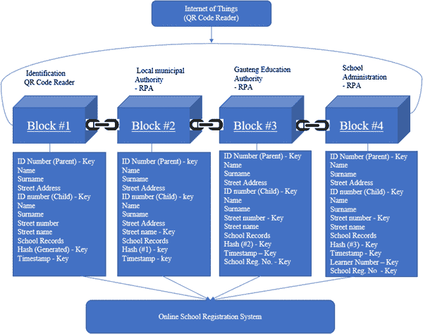 |

提议的基于区块链的机器人流程自动化在线注册系统（图 4）可以至少部分解决南非基础教育部面临的一些挑战，而不是通过增加更多规则和条例来解决这些挑战。这可以通过实施以下措施和流程来实现：

识别

提议在线注册系统必须利用物联网基础设施技术，如条形码阅读器或二维码阅读器（可作为智能手机或任何带摄像头设备上的应用程序）来识别父母及其子女。换句话说，用户不能手动输入身份证号码到系统中，而必须使用二维码或条形码阅读器。该传感器将读取代码，并自动将身份证号及相关姓名、姓氏和街道地址输入系统。通过这种方式，图 4 中的第一个块，块#01 将被创建。加密的私钥标识符是父母和子女的身份证号码、哈希（每次扫描中随机生成的数字）和时间戳。父母的身份证号码不能未经授权而更改（可能是如果一个孩子有一个新的监护人），而 18 岁以下的孩子的身份证号码也永远不能更改。南非内政部是唯一有权发放有效身份证件的机构。当然，其他详细信息，如住址，需要更新和验证（请参见下一个活动）。

数据对象

在成功识别后，建议将交易按照时间顺序连续存储在区块链的块中。图 4 中的下一个 Block＃02 然后将居住地址匹配以确定最近的学校。地方政府拥有的机器人接收以数字签名加密形式的公钥文件并解密以访问记录。然后，机器人登录地方政府系统并检索记录实用账单记录以使用图 4 中 Block＃01 的 ID 号码确认街道地址。如果匹配并确认了街道地址，则机器人使用由父母和子女的 ID 号码、图 4 中 Block＃01 的哈希、街道号码和时间戳组成的私钥创建交易。记录创建后，机器人将带有公钥的文件发送到基础教育部以确认孩子的学校记录。如果没有匹配项，则向父母发送无效消息。基础教育部网络节点上的机器人以数字签名加密形式接收文件并解密公钥以打开文件。它将使用 Block＃02（图 4）中的 ID 号码来访问子女的学校记录，并确认他们是否通过了 0 年级或 7 年级以符合分别为 1 年级或 8 年级的资格。机器人使用图 4 中 Block＃01 的地址来定位并检查最近学校是否有空位，使用申请人的街道地址。如果有空位，机器人将创建一个记录，如图 4 中的 Block＃03，其中包含父母和子女的 ID 号码、Block＃02（图 4）的哈希、街道号码、学校注册号和时间戳的私钥，并将文件发送给学校。如果子女不符合资格或未找到先前的学校记录，则立即向父母和部门发送“无效记录”消息以进行检查和更正。一旦成功完成了前面的步骤，机器人将使用数字签名加密将文件发送到下一个节点，即学校。一系列步骤的学校节点端的机器人使用自己的私钥解密文件并检查要放置的学习者人数与学校的空间可用性是否相匹配。请注意，此节点不需要实际位于学校，而是表示这是逻辑位置。有时会有学习者不占用分配的位置，但不会通知注册系统做出这一决定。因此，学校节点的机器人需要通过向学校现场管理员发送消息来确认学习者的空间可用性，特别是一旦课程已经开始。如果有空位，机器人将创建一个记录，如图 4 中的 Block＃04，其中包含父母和子女的 ID 号码、Block＃03（图 4）的哈希、街道号码、学校注册号、学习者号码和时间戳的私钥组合。机器人向父母、教育部和学校创建并发送消息“学习者已成功被安排在学校”。

信息扩展

关于学校申请和学校安置的信息始终可获得和访问。每个交易都由所有参与者的一致共识记录和维护。所有交易都从一开始就被保留，可追溯性和可审计性都是可能的。机器人通过公钥访问相关数据，每个交易都由所有参与机器人的共识记录和维护。

交易结构

不需要信任的中心实体；交易实体（机构和个人）之间不需要相互信任；智能合约用于验证区块链系统中的交易。该过程由包括当局在内的不同利益相关者验证，以确保没有特权实体控制注册申请流程和学习者的安置。

数据安全

高安全性得到加强；数据存储在网络的每个节点上并且公开可用，所有节点都可以帮助维护其他节点中的数据。学习者被安置到学校是通过一个 RPA，在所有节点或参与智能网络的节点验证了块#01 至#03（图 4）的步骤之后进行的。作者身份的保证是因为机器人使用自己的私钥加密文件，其他机器人使用发送者的公钥解密数字签名密码学。接收机器人使用发送者的加密私钥证明它不可能是由其他人发送的。

在所示的解决方案中，如图 4 所示，只有第一阶段需要人类发起注册流程。之后，剩余的步骤是区块链和人工智能（机器人）的组合，完成注册交易。该提议的解决方案建议使用机器人来检测和信任其对应物，其中公钥加密技术为任何机器人（想要与特定机器人地址通信和发送信息的机器人）提供了只有该机器人具有匹配密钥以读取记录的信息。即使公钥落入错误的手中，也没有风险，因为它不用于解密记录。有了这种区块链技术，机器人可以在无需控制权机构的情况下达成一致，认为给定的记录是可信的。一旦达成一致，该区块就不能被删除或更改，并且可以由网络上的任何人进行认证。在确保所有应该包含在块#4 中的新交易都是有效的之后，就不需要使以前的凭据失效，例如，在图 4 中显示的块 01＃到块 03＃中。

希望这一部分已经展示了如何通过基于区块链的 RPA 机制公平透明地分配教育资源。

提案

本节根据本章所述的示例，解释了实施基于区块链的 RPA 时的考虑因素。表 6 中的提案是对追求可信的在线学校注册系统的决策者的指南和意识，这些提案还有助于改进教育资源的分配过程。

表 6\. 提案，即在实施基于区块链的 RPA 时的考虑因素

| 提案 |
| --- |
| 分散化 | 如果南非豪登省教育部考虑采用基于区块链的 RPA 机制，将教育证书分散存储以供机器人验证，那么这必须在政策中定义，涉及豪登省的在线注册系统，标准和监管框架。政府应建立专业知识，以便理解和支持在存储敏感数字证书、学术证书和个人数据方面使用基于区块链的 RPA 的分布式数据库技术的实施。 |
| 加强对机器人决策的信任 | 能够展示谁收到了“工作”，包括何时收到，这很重要。因此，在一个分布式系统中显示申请状态（工作流）非常有用（家长不必访问学校，而是处于不同地方的几个不同方，如内政部、中央注册机构等）。在区块链上记录决策过程确保了父母、学校和政府可以信任、理解和追踪人工智能决策。 |
| 集体决策 | 建议教育部的决策者进一步调查并支持使用其他用例的基于区块链的 RPA 机制，用于在线学校注册系统。由于分配教育资源的决定将转移到 AI 算法，因此应该提高家长和学校对引入基于区块链的 RPA 及其对现有和计划活动的影响的意识，并进行谈判。 |
| 不可变性 | 基于区块链的 RPA 提议的机制有望加速学术证书签发的纸质系统的终结，因为它们将是不可变的，并通过区块链自动验证，家长不必提供纸质注册证明。因此，解决了公民对在线学校注册系统可信度和信任度的看法，并增加了公民对其价值、准确性和可靠性的认知。 |
| 战略合作伙伴关系 | 实现基于区块链的 RPA 的全部潜力的提议模型是通过分阶段的方法，例如，从战略公共和私人合作伙伴关系开始，以便调整并创建关于可能应用的意识，然后部署基于区块链的 RPA 机制。 |
| 进一步研究 | 由于教育部需要证明区块链对家长、学校和他们自己都能提供相当大的价值，基于区块链的 RPA 的示例作为一种方式，让部门意识到它在增加教育资源分配的效率和效果方面可能具有的社会优势和潜力；从而创建一个可信的在线学校注册系统。尽管已经展示了一种基于区块链的 RPA，能够自动将数据存储在分布式数据库中，验证教育证书，并在没有中央机构的情况下建立蜂群机器人之间的共识，但建议教育部通过一项试点研究进行进一步研究。建议此试点研究应该与家长、学校、私营部门、员工工会和政府机构合作，以获得支持并为教育环境中的区块链-RPA 机制创建一个政策框架。重要的是要注意，由于业务规则的变化，机器人可能会产生错误结果，部分原因是机器人无法适应新的业务规则而改变其行为。为了减少这些干扰，需要研究控制和监控机制，以主动适应机器人在检测业务规则变化时的行为。 |

结论

本章介绍了基于互联网的电子政府系统所面临的一些挑战，这些系统与物联网具有相似的特征。该章建议采用基于区块链的 RPA 机制作为追溯性、识别、验证和处理注册的可能解决方案，无需人为干预，也无需单一的中央机构控制将学习者安排到各个学校。此外，该章还使用了教育部门的一个示例来演示基于区块链的 RPA 机制在注册过程中的应用，其中包括密码学、智能合约、电子学校记录、机器对机器通信（机器人）以及这些在物联网场景中的含义。

区块链和 RPA 的结合已经被证明可以提供存储对象及其所有变化的可能性，从而在教育环境中实现完整、开放和可靠的可追溯性。可靠的身份识别非常重要，因此传统上重要文件的纸质副本由宣誓员确认，并始终附有身份证件。然而，区块链身份验证已经证明能够提供一个开放、可信赖的分布式分类账，可以用于验证身份，不仅限于金融领域，还包括教育领域。

该章节阐述了不同机构如何通过机器对机器的链接，使用一致性来显著提高公平性和透明度，在使用区块链技术为学习者安排学校的过程中使用私钥和公钥。这次探索性讨论仅限于一个示例。需要进一步的研究工作来确保使用更多案例来保障教育记录的安全性和隐私性。

参考文献

Alammary, A., Alhazmi, S., Almasri, M., & Gillani, S. (2019). 基于区块链的教育应用：系统评价。应用科学，9(12), 2400. doi:10.3390/app9122400

Albishi, S., Soh, B., Ullah, A., & Algarni, F. (2017). 物联网应用和技术的挑战与解决方案。计算机科学学报，124，608–614。doi:10.1016/j.procs.2017.12.196

Arslan, S. S., Jurdak, R., Jelitto, J., & Krishnamachari, B. (2019). 物联网的分布式账本技术的进展。物联网，9，100114。doi:10.1016/j.iot.2019.100114

Asatiani, A., & Penttinen, A. (2016). 将机器人流程自动化转化为商业成功–OpusCapita 案例。信息技术教学案例期刊，6(2)，67–74。doi:10.1057/jittc.2016.5

Bakon, K. A., Elias, N. F., & Abusamhadana, G. A. O. (2020). 文化和数字鸿沟对发展中国家政府成功的影响：文献综述。理论和应用信息技术期刊，98(9)。

Barnaghi, P., Wang, W., Henson, C., & Taylor, K. (2012). 物联网的语义：早期进展与回到未来。国际语义网和信息系统期刊，8(1)，1–21。doi:10.4018/jswis.2012010101

Bartolomé, A., Castañeda, L., Torlà, C. B., & Adell, J. (2017), 区块链在教育中的应用：现状介绍和批判性评论。EDUTEC，教育技术电子杂志。

Bélanger, F., & Carter, L. (2008). 电子政府采用中的信任和风险。战略信息系统期刊，17(2)，165–176。doi:10.1016/j.jsis.2007.12.002

Chen, S., Xu, H., Liu, D., Hu, B., & Wang, H. (2014). 一种物联网的愿景：应用、挑战和机遇与中国视角。IEEE 物联网期刊，1(4)。

ChenY. (2012), 物联网的挑战和机遇，在第 17 届亚太设计自动化会议（383-388 页）IEEE。10.1109/ASPDAC.2012.6164978

Cheng，S.，Zeng，B.，＆Huang，Y. Z.（2017）。更正：区块链技术在分布式电力市场中的应用模型研究。IOP 会议系列。地球与环境科学，93，012065。doi:10.1088/1755-1315/93/1/012065

Coin Telegraph。（2015）。爱沙尼亚如何将区块链更接近于公民：GovTech 案例研究。[`cointelegraph.com/news/how-estonia-brought-Blockchaincloser-to-citizens-govtech-case-studies`](https://cointelegraph.com/news/how-estonia-brought-Blockchaincloser-to-citizens-govtech-case-studies)

Dignum，V.（2017）。负责任的人工智能：为人类价值设计 AI。ITU 期刊：ICT 发现，1。

Dubovitskaya，A.，Novotny，P.，Xu，Z.，＆Wang，F.（2019）。区块链技术在肿瘤学数据共享中的应用：系统文献综述结果。肿瘤学和信息学 - 综述。doi:10.1159/000504325

Efanov，D.，＆Roschin，P。（2018）。区块链技术的普及。Procedia 计算机科学，123，116–12。doi:10.1016/j.procs.2018.01.019

Feki，M. A.，Kawsar，F.，Boussard，M.，＆Trappeniers，L。（2013）。物联网：下一个技术革命。计算机，46（2），24–25。doi:10.1109/MC.2013.63

Fenwick，M.，＆Vermeulen，E. P. M.（2019）。去中心化即将到来：区块链的未来。JBBA，2（2），2019。doi:10.31585/jbba-2-2-(8)2019

Ferrer，E. C.（2019），区块链：机器人群体系统的新框架。未来技术会议（FTC）2018 年论文集。

卡拉省。（2020）。在线招生。[`www.gdeadmissions.gov.za/Home/VideoTutorial`](https://www.gdeadmissions.gov.za/Home/VideoTutorial)

卡拉省政府。（2020）。数字平台。[`www.gov.za/`](https://www.gov.za/)

Gräther，W.，Schütte，J.，Kolvenbach，S.，Torres，C. F.，Ruland，R.，＆Wendland，F。（2018）。区块链教育：终身学习护照，见 W. Prinz＆P. Hoschka（Eds。），2018 年第一届 ERCIM 区块链研讨会报告，欧洲社会嵌入技术报告。学术出版社。

Grech, A., & Camilleri, A. F. (2017). 教育区块链, JRC 科学政策报告 . 欧洲委员会. doi:10.2760/60649

Hameed, S., Khan, F. I., & Hameed, B. (2018). 理解物联网 (IoT) 中的安全需求和挑战: 一篇综述. 计算机网络与通信杂志.

Hofmann, P., Samp, C., & Urbach, N. (2019). (2019), 机器人流程自动化. 电子市场 . 提前在线发布. doi:10.1007/s12525-019-00365-8

Lacity, L. P., & Willcocks, M. C. (2016). 一种自动化服务的新方法. MIT Sloan Management Review , 58(1).

Lohachab, A., Lohachab, A., & Jangra, A. (2020). 在后量子物联网网络中保护通信的重要加密方面的综合调查 . 物联网 , 9, 100174\. doi:10.1016/j.iot.2020.100174

Madakam, S., Holmukhe, R. M., & Jaiswal, D. K. (2019). 未来数字化工作力量: 机器人流程自动化 (RPA) . 信息系统与技术管理杂志 , 16, 1–17\. doi:10.4301/S1807-1775201916001

Makridakis, S., Polemitis, A., Giaglis, G., & Louca, S. (2018). 区块链: 人工智能快速进展的下一次突破 . 人工智能-新趋势和应用. doi:10.5772/intechopen.75668

Marr, B. (2018). 人工智能和区块链: 结合这两个大趋势的 3 个主要好处. https://www.forbes.com/sites/bernardmarr/2018/03/02/artificial-intelligenceand-blockchain-3-major-benefits-of-combining-these-two-mega-trends/

Mokhaoli, V. (2020). 家长恳求 Lesufi 恢复手动学校注册, 目击新闻. https://ewn.co.za/2020/01/15/parents-plead-with-lesufi-to-bring-back-manual-school-registrations

Moore, M. (Ed.). (2016). 网络安全漏洞和围绕在线威胁防护的问题 . IGI 全球.

Mougayar, W. (2016). 区块链商业：下一代互联网技术的承诺、实践和应用. 约翰·威利和儿子出版社. http://ebookcentral.proquest.com

Nakamoto，S。（2008）。比特币：一种点对点的电子现金系统。https://bitcoin.org/bitcoin.pdf

Rejeb，A.，Keogh，J. G.，& Treiblmaier，H.（2019）。利用物联网和区块链技术进行供应链管理。未来互联网，11（7），161。doi:10.3390/fi11070161

Reyna，A.，Martín，C.，Chen，J.，Soler，E.，& Díaz，M.（2018）。关于区块链及其与物联网的整合。挑战与机遇。未来一代计算机系统，88，173–190。doi:10.1016/j.future.2018.05.046

Salah，K.，Rehman，M. H.，Nizamuddin，N.，& Al-Fuqaha，A.（2019）。区块链用于人工智能：回顾和开放性研究挑战。IEEE Access：实用创新，开放解决方案，7，10127–10149。doi:10.1109/ACCESS.2018.2890507

Senthilkumar，D.（2020）。区块链技术的跨行业使用和未来机遇：区块链技术与人工智能。在跨行业使用区块链技术和未来机遇：区块链技术与人工智能。IGI Global。

Shahaab，A.，Hewage，R. M. C.，& Khan，I.（2020）。在 GDPR 的背景下，管理不可变区块链上的性别变更信息。JBBA，3（1）。

Sharples, M., & Domingue, J. (2016). 区块链与赞美：一个分布式系统，用于教育记录、声誉和奖励。在 Verbert，K.，Sharples，M.，& Klobučar，T.（Eds。）的 Lecture Notes in Computer Science：Vol. 9891.自适应和可适应的学习。 EC-TEL 2016. Springer。doi:10.1007/978-3-319-45153-4_48

Silcock，R。（2001）。什么是电子政府？议会事务，54（1），88–101。doi:10.1093/pa/54.1.88

Strobel，V.，Ferrer，E. C.，& Dorigo，M.（2018）。通过区块链技术管理拜占庭机器人在群体决策场景中的应用。Proc。17th Int。Conf。Auto。Agents MultiAgent Syst。国际自主代理人和多代理人系统基金会：瑞典斯德哥尔摩，541–549。

Syed, R., Suriadi, S., Adams, M., Bandara, W., Leemans, S. J. J., Ouyanga, C., Hofstede, A. H. M., de Weerd, I., Wynn, M. T., & Reijers, H. A. (2020). 机器人流程自动化：当代主题与挑战. 《工业计算机》，115, 103162\. doi:10.1016/j.compind.2019.103162

Tan, Y. H., & Thoen, W. (2001). 通向电子商务信任的通用模型. 《国际电子商务杂志》，5(2), 61–67.

The Citizen. (2020). 部门在线注册系统引发的挫折和愤怒，The Citizen. https://citizen.co.za/news/south-africa/education/2228424/frustration-and-anger-over--depts-online-registration-system/

Turkanović, M., Hölbl, M., Košič, K., Hericko, M., & Kamisalic, A. (2018). EduCTX: 一种基于区块链的高等教育学分平台. 《IEEE 接入：实用创新，开放解决方案》，6, 5112–5127\. doi:10.1109/ACCESS.2018.2789929

Uskenbayeva, R., Kalpeyeva, Z., Satybaldiyeva, R., Moldagulova, A., & Kassymova, A. (2019), 在公共行政管理的行政流程中应用 RPA. 在 2019 年 IEEE 第 21 届商业信息学会议论文集 (Vol. 2, pp. 9-12). IEEE.

van der Aalst, W. M. P., Bichler, M., & Heinzl, A. (2018). 机器人流程自动化. 《商业与信息系统工程》，60(4), 269–272\. doi:10.1007/s12599-018-0542-4

Xing, B., & Marwala, T. (2018). 区块链与人工智能的协同作用. https://arxiv.org/ftp/arxiv/papers/1802/1802.04451.pdf

Zhao, J. L., Fan, S., & Yan, J. (2016). 区块链中的商业创新概述与研究机会以及特刊导读. 《金融创新》，2(1), 28\. doi:10.1186/s40854-016-0049-2

Zikratov, I. A., Lebedev, I. S., Gurtov, A. V., & Kuzmich, E. V. (2014). 用警察办公模式保护群智能机器人的安全性. 2014 年 IEEE 第 8 届国际信息与通信技术应用大会(AICT), 1-5\. 10.1109/ICAICT.2014.7035906

ADDITIONAL READING

Al-Turjman, F. (2019). 物联网智能城市中的智能。Taylor and Francis 出版社，CRC 出版物系列，Taylor and Francis 印记的一部分，Taylor and Francis Group 的成员，T&F Informa，plc 的学术部门。

Amita, K. (2019). 为物联网的人工智能动手实践：为开发更智能的物联网系统提供专业的机器学习和深度学习技术。Packt Publishing, Limited 出版社。

Bwalya, K. (2018). 电子政府发展话语：分析发展中国家和新兴经济体的当代和未来增长前景。AOSIS 出版社。doi:10.4102/aosis.2018.BK71

Kapoor, A. (2019). 为物联网的人工智能动手实践：为开发更智能的物联网系统提供专业的机器学习和深度学习技术。Packt Publishing Ltd 出版社。

Leben, D. (2019). 机器人伦理学：如何设计一种道德算法。Routledge 出版社。

MahmoodZ. (2009), 电子政府：成功发展的阶段模型，第 13 届国际 IBIMA 会议论文集，摩洛哥，马拉喀什，2009 年 11 月

Mahmood, Z. (2013). 在发展中国家实施和实践电子政府。IGI Global 出版社。doi:10.4018/978-1-4666-4090-0

MichaelE. A.HannoH.PanaritS. (2020), 第四次工业革命对工程教育的影响：第 22 届国际互动协作学习大会(ICL2019)论文集，第 1 卷，泰国曼谷

Oppenheimer, A. (2019). 机器人来了！：自动化时代的就业前景。Vintage Books 出版社。

Oracle 南非. (2020), Oracle 南非 / 数据库，https://www.oracle.com/za/database/what-is-database.html，访问时间：2020 年 7 月

Paul, G. N., & Vassiliki, N. K. (2019). 欧洲的电子政府：重启国家。Routledge 出版社。

Stanislav, I., & Craig, W. (2019). 旅游、旅行和酒店服务中的机器人、人工智能和服务自动化。Emerald Publishing Limited 出版社。

Tan, Y., & Zheng, Z. (2013, March). 群体机器人技术研究进展. 国防技术 , 9(1), 18–39\. doi:10.1016/j.dt.2013.03.001

关键术语和定义

算法：指的是计算和解决数学问题的计算机通常遵循的过程或有限的指令或规则。它指的是一个有限序列，其中包含了可供计算机执行的指令。

人工智能：指的是被编程以模拟人类智能、像人类一样思考并模仿他们的行为的机器，例如解释和检测数据中的偏差以及解决问题。

区块链技术：指的是一种记录信息透明并获得其他参与者共识的系统，使信息不可变或难以更改。它指的是一个包含所有历史记录的数据库，这些记录是公开可用的，并且对所有参与者都是可访问的。

加密学：也称为密码学，是一种确保保护信息和安全通信的技术和研究实践，使用代码使只有预期接收者能够阅读和处理它。

数据库：指的是以结构化形式存储在计算机中的数据或信息的有组织的集合，并且可以从计算机系统中以电子方式访问。它通过数据库管理系统进行控制，并且在一系列表格中以行和列的形式进行建模，以便对数据进行高效处理和查询。

电子政务：定义为利用信息通信技术，如移动设备、计算机和互联网，有效地向国家的公民、企业和其他人员提供公共或政府服务。

物联网：这是指一种由传感器嵌入以使它们能够在不需要人与人或人与计算机交互的情况下自动收集和交换数据的系统，网络、软件、电子、机械和数字机器相互连接和关联的设备。

机构：它是一个大型过程或机械系统中的一个小部分，用于执行特定功能，换句话说，它是一个在机器内部一起工作的部件系统。机构可能是一个完整的机械系统。

在线学校注册系统：这是一个互联网系统，允许家长为他们在南非的学校就读的一年级和八年级的孩子进行电子注册。这是由南非豪登省教育部实施的一项电子服务或电子政府，旨在分配有限的教育资源。

公钥加密：也称为非对称加密，是一种使用两对密钥加密数据的方法，即，公钥对任何人可用，而私钥只有所有者知道。

机器人流程自动化：指的是一种可以配置为模仿人类在业务系统中的操作以执行业务流程的计算机软件、机器人或机器人。训练软件机器人的步骤具有说明性。

群体机器人技术：这指的是群体机器人算法如何通过学习自然系统如鸟群、哺乳动物、蜜蜂或鱼群解决问题。它指的是自然或人工的分散协调系统的集体行为。

# 第三章

# 区块链技术在博茨瓦纳和津巴布韦的记录管理中的应用

+   Olefhile Mosweu

    

    南非约翰内斯堡大学

+   忘记查特雷拉-赞布科

    

    阿布扎比索邦大学（Sorbonne University, Abu Dhabi）和南非南非大学（University of South Africa, South Africa）

摘要

第四次工业革命（4IR）带来了几种新兴和颠覆性的技术。多年来，南非的档案管理实践一直被报道落后于接受新技术。一些研究表明，缺乏管理电子档案所需的技能，还有些人在抱怨纸质档案的管理不规范。因此，本章的目的是引发一场讨论，挑战信息管理从业者拥抱颠覆性技术，以免自己被颠覆。有几种新兴技术，但本章重点关注区块链技术及其对档案管理可能带来的好处。在技术接受模型的指导下，该研究发现博茨瓦纳和津巴布韦的档案馆员和档案管理员会在区块链易于使用且对档案管理有用的情况下采用区块链。本章最后提出了一种区块链技术用于档案管理的采用模型。

研究的介绍和背景

采用新技术是一个相当被记录的现象。在发达国家，信息和通信技术（ICTs）的使用在 20 世纪 80 年代和 90 年代迅速增加。然而，在撒哈拉以南非洲（SSA）国家，情况并非如此，它们落后于其他地区，因此产生了全球数字鸿沟（Wamboye 等，2015）。到 2011 年，全球有超过一半的人口使用手机，13% 的人口可以接入互联网（ITU，2018）。尽管这显示出 ICTs 采用的增长，但 SSA 地区在 ICTs 实施方面仍落后于其他地区。本章重点关注撒哈拉以南非洲的两个国家，即博茨瓦纳和津巴布韦。这两个国家都有一个由国家政策支持的强大的 ICT 框架（ITU，2018）。ICTs 促进了相对轻松的信息捕获、处理、存储和共享（Burke，1992）。反过来，这导致了大量的数字、电子以及纸质记录的生成，因此需要采用新兴技术来更好地管理大量的记录。

根据 Mosweu 等人（2017 年，第 97 页）的说法：越来越多的公共部门机构正在实施记录管理系统，以改善服务交付。然而，这些系统的采用和使用情况存在不足。Mnjama 和 Wamukoya（2007 年）也观察到了这一点，他们指出，在非洲的公共部门中，管理 ICT 生成的记录一直是档案管理员和记录管理者面临的主要挑战。在国家层面上，博茨瓦纳和津巴布韦都采用了电子记录管理系统。Mosweu（2014 年）和 Mosweu 等人（2017 年）调查了影响贸易和工业部采用和使用电子文档记录管理系统的因素，使用了统一技术接受和使用理论（UTAUT）模型作为框架。Mosweu（2014 年）报道了一项正在进行中的研究的试点研究结果，发现电子文档记录管理系统的采用和使用受到计算机态度、计算机焦虑、社会影响、促进条件和绩效预期的影响。随后在 Mosweu 等人（2017 年）报告的研究结果表明，UTAUT 的四个主要构建解释了行为意图采用和使用名为文档工作流管理系统的电子文档记录管理系统的变异的 55％。实证数据表明，影响系统低采用和使用的关键因素是技术恐惧症，对系统使用的负面态度，认为系统复杂性和与现有信息系统不兼容是导致系统低采用和使用的关键因素。

另一项由 Mosweu 和 Kenosi（2018）进行的研究评估了法院记录管理系统（CRMS）的实施是否改善了哈博罗内地方法院的司法提供。 Motsaathebe 和 Mnjama（2007）研究了博茨瓦纳高等法院记录管理流程的自动化。两项前期研究表明，无论是在高等法院还是哈博罗内地方法院，实施都改善了案件管理和提供服务，如大大减少了需要辩论案件的丢失文件等情况，文件检索变得更加容易，案件成功地被捕捉到系统中。在另一项研究中，Moatlhodi 和 Kalusopa（2016）调查了劳工和内政部电子记录的准备情况，并发现增加电子记录准备深度的机会存在，因为系统实施资金可用，ICT 基础设施充足，而管理承诺也得到了保证。Kalusopa 和 Ngulube（2012）以及 Moloi 和 Mutula（2007）的研究重点分别是劳工组织的电子记录准备和电子政府环境中的电子记录准备。Kalusopa 和 Ngulube（2012）的研究表明，博茨瓦纳劳工组织的电子记录准备显而易见，水平低且正在发展。这一证据表明了 ICT 的缓慢采用，不足的记录管理标准和实践以及在国家电子准备框架中的低集成。Shonhe 和 Grand（2019）调查了 Tlokweng 土地委员会（TLB）的 EDRMS 实施中的变革管理。在 TLB 中，沟通被证明是最有效的变革管理工具。然而，由于在实施变革管理方面缺乏能力，期望的变革尚未得到强化。Rakemane 和 Serema（2018）调查了公司和知识产权局的电子记录管理实践，并发现 ICT 广泛应用于业务流程中，导致大量电子记录的产生。然而，缺乏管理其管理的政策和程序。

许多其他研究人员研究了电子邮件记录管理以及 EDRMS 实施成功因素（例如，Keakopa，2007 年；Mosweu，2016 年）。 Keakopa（2007 年）的研究重点是博茨瓦纳，纳米比亚和南非电子记录管理的政策和程序。研究结果确定了博茨瓦纳和纳米比亚缺乏政策和程序，而在南非，这些政策和程序已经存在并且运作良好。Mosweu（2016 年）评估了博茨瓦纳投资，贸易和工业部 EDRMS 实施的关键成功因素，发现它们包括高层管理支持，系统用户培训，变革管理和项目治理。

在津巴布韦，已经进行了许多与电子记录管理相关的研究。这些研究包括但不限于管理电子邮件作为电子记录，管理金融服务国有企业的电子记录，电子记录准备就绪性，EDRMS 的采用和使用，历史记录数字化以进行保护以及企业数字记录管理（Sigauke＆Nengomasha，2012 年；Nkala 等，2012 年；Chaterera，2013 年，Sigauke 等，2016 年；Chaterera 等，2018 年；Chikomba，2018 年；以及 Nengomasha＆Chikomba，2018 年）。尽管在方法和重点上存在差异，但这些研究共同认为津巴布韦的电子记录管理仍处于初级阶段。许多挑战，弱点和电子记录管理中的不足尚待解决。

技术意识促进其采用。对于发展中国家的档案馆员和记录管理员而言，电子记录管理仍然是一种遥远的实践，因为纸质记录管理系统占主导地位。多年来，发展中国家的档案和记录管理专业人员已经接受了手工记录管理，并为传统的纸质记录发展了技能和能力。但是，对于电子记录管理，情况却并非如此。正如现有文献中所记录的那样，南部非洲的记录和档案管理从业者一直在努力接受技术的进步，这些技术已经改变了现有的档案学理论、方法论和实践（Turnbaugh, 1997; Duranti, 2001）。虽然全球其他地区现已进入第四次工业革命（4IR），但撒哈拉以南非洲的国家仍在与纸质记录的正确管理作斗争。

尽管博茨瓦纳和津巴布韦的研究人员已经进行了关于记录管理和技术问题的研究，但缺乏关于区块链作为记录管理技术的文献，因此有必要进行本章研究。“区块链是一种新兴的记录技术，产生了新形式的记录，以及记录和信息专业人员需要参与的新记录管理模式”（Lemieux, et al., 2019），因此有必要确定博茨瓦纳和津巴布韦在意识和采用区块链技术进行记录管理方面的现状。

研究目标

鉴于在非洲，科技采用似乎总是来得晚，本研究旨在加强对区块链技术在博茨瓦纳和津巴布韦记录管理中的理解，并促进其使用。因此，本研究的具体目标是：

+   • 确定博茨瓦纳和津巴布韦的记录管理人员和档案管理员是否了解并熟悉区块链技术。

+   • 查明博茨瓦纳和津巴布韦的档案馆员和记录管理人员是否使用区块链进行记录管理

+   • 确定区块链技术在记录管理中的潜在益处

+   • 确定博茨瓦纳和津巴布韦的档案馆员和记录管理人员是否打算使用区块链，如果他们认为它对记录管理有用的话。

+   • 为记录和档案管理专业人员提出一项战略路线图，说明如何将区块链技术纳入记录和档案管理。

区块链技术

区块链技术是一系列技术的集合，可以以不同的方式组合以创建不同的结果。区块链的识别因素是技术上的去中心化；它没有基础设施故障点；它提供自主权；它是抗攻击的。这些和其他特征，如 Chaterera-Zambuko（2019 年）中所讨论的，如图 1 所示，影响了区块链技术在不同学科中的采用。

| 图 1\. 区块链技术的方面 |
| --- |
| 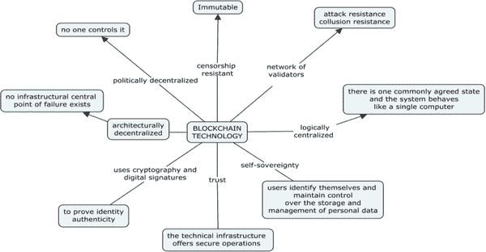 |

区块链技术实现了创建一个去中心化的环境，其中交易和数据不受任何第三方组织的控制。任何完成的交易都以可验证、安全和透明的方式记录在公共账本上，具有时间戳和其他详细信息（Holotescu，2018 年）。理解区块链技术可以通过将其类比为一本书来简化。一本书有一系列页面，每一页都包含文本以及有关该页的信息（不是指页面的内容，而是指有关该页面的信息，技术上称为元数据）。例如，页面顶部通常是书名，有时还有章节号或标题；底部通常是页面编号，告诉您在书中的位置。

类似地，在区块链中，每个区块都包含区块的内容；以及一个包含有关区块数据的头部，因此。它包括一些有关区块的技术信息，例如对前一个区块的引用，以及包含在此区块中的数据的指纹（哈希），等等。这个哈希对于排序很重要。链中的区块参考了先前的区块，就像书中的页码一样。在书中，可预测的页码使得很容易知道页面的顺序。如果将所有页面都撕下来并洗牌，那么将它们放回到正确的顺序中，使故事有意义，就会很容易。在区块链中，每个区块都引用了前一个区块，不是通过“区块号”，而是通过区块的指纹，这比页码更明智，因为指纹本身是由区块的内容确定的（Lewis，2015）。对先前区块的引用创建了一系列区块，因此有了“区块链”这个术语。

记录管理的区块链技术

数项研究表明，区块链技术可以有效用于记录管理（例如，Begley，2017 年；Stančić，2018 年；Lemieux 等，2019 年）。因此，政府和组织已开始认真考虑使用区块链技术来管理记录。这是因为通过区块链技术生成的记录已被证明是不可变的和可信赖的（Lemieux，2017 年），这是记录和档案管理中所崇尚的特征。作为一个相对较新的技术，最广为人知的是作为加密货币的基础，区块链技术具有巨大的潜力，并可能对文档和记录管理产生深远影响（Stančić，2018 年，第 71 页）。事实上，John（2019 年）认为记录管理是促进成本节约、提供收入生成机会并实际扩展记录管理流程能力的四个区块链业务倡议之一。因此，区块链技术在各种记录管理方面都是适用的，包括记录处置、促进记录的真实性、记录鉴定、转移、记录可靠性以及记录的长期数字保存、记录的隐私和安全性（Lemieux，2016 年；Stančić，2018 年；Lemieux 等，2019 年；以及 Bhatia 等，2020 年）。接下来的章节简要介绍了区块链技术在记录管理的上述方面的应用概况。

区块链用于数字记录的真实性和可靠性

记录可以在区块链上注册以证明其真实性。这就像认证法律文件和财务报表。该技术使得可以注册审计跟踪文档以证明流程，例如谁在什么时候以及持续多长时间做了什么（Jones, 2018）。真实性是记录的四个特征之一，与可用性、完整性和可靠性一起（ISO，2016）。它指的是记录没有被意外或恶意篡改，因此可以信任作为交易完成的证据（Duranti，2009）。与集中式数字签名技术不同，区块链不使用第三方，但记录的真实性可以通过生成用于验证它们的签名、指纹和时间戳来证明。这些可以存储在分布式账本上，以提供数据完整性和真实性的证明。在区块链上存储签名以及文档的哈希值，消除了顺序签名和证书的要求。这对于长期记录（如土地契约和遗嘱）可能特别有用（Bhatia 等，2020）。

Lemieux (2017) 讨论了区块链技术是否能够实现产生和保持可信记录的承诺。作为一种记录技术，区块链确实确保了交易记录是不可变的，因此在创建后仍然是真实的（Jones, 2018; Stančić, 2018; Bhatia 等，2020）。

区块链与可靠性和真实性的问题

可靠的记录是指其内容可以被信任为对所证明的交易或活动的全面准确的表达，并且可以在后续交易或活动中依赖（Lemieux，2019）。而真实性则依赖于从记录创建时开始建立和保护记录的身份和完整性（Lemieux，2019）。

记录管理的一个基本问题是确保记录的真实性和完整性。区块链为记录管理人员提供了一种确保电子系统提供完整性的新方法。记录的可靠性始于其创建时刻。基本问题包括谁创建了记录以及它是如何创建的。数字签名是确保记录可靠性的一种方式。它们是一种常见的交易数据形式。它们可以存储在区块链上。目前，当像 PDF 这样的电子文档被签名时，签名会存储在文档本身中。为了确保记录的可靠性，签名按顺序应用是至关重要的，如果证书过期，则可以质疑文档的有效性。将签名与文档的哈希一起存储可以消除证书顺序签名的要求。这对于长期记录，例如土地契约和遗嘱可能特别有用（NARA，2019，第 10 页）。

区块链可以用于为记录提供真实性。当组织向用户提供记录时，通常会提供来源和认证，证明它是真实准确的副本。如果之后有任何问题，副本将与原件进行比较。如果真实性证书保留在区块链中，则可以重新哈希记录以确定是否进行了任何更改或修改。照片可以被研究人员修改，裁剪或以其他方式修改，如果哈希在比较时失败，则他们将能够证明图像已被更改。为了实现这一点，区块链使用加密签名和公钥形成链式记录的交易，这些交易无法伪造（NARA，2019，第 10 页）。

有大量应用程序可用于操作视频，音频和照片文件。 这给 21 世纪的记录管理者和档案管理员带来了严重挑战。 有视频编辑应用程序可以调整面部外观，还有高度准确的语音编辑软件，允许用户轻松创建伪造视频而不被发现。 区块链技术可以通过在文件的元数据中使用哈希来解决这一挑战，以便外部实体能够验证数字材料未被篡改。 这些区块链的特性是使该技术对记录和档案管理专业人员如此具有吸引力的原因。

区块链与记录保留与处理

记录保留与处理是有效记录管理的核心（Lemieux 等人，2019 年）。 通过适当的记录，组织能够履行其义务并执行其任务，保护和捍卫其利益。 尽管记录保留的重要性，但组织面临的问题源于对记录业务价值的分歧所导致的缺乏记录保留计划（Lemieux 等人，2019 年）。 此外，Lemieux 等人（2019 年，第 49 页）提出了一些与记录保留相关的问题，包括：

+   • 区块链是否能减少记录保留所需的任何投资？

+   • 它是否会带来新的挑战或风险？

+   • 区块链记录保留可能是什么样子？

记录和档案管理专业人士在探索区块链作为潜在记录管理技术时，需要回答这些问题。从记录管理的角度来看，“使数据加密无法访问的特征表明记录保留和处置未作为区块链开发人员原始意图的一部分”（Bhatia 等人，2020 年）。区块链中生成的记录不可变的事实既有利于促进记录的真实性，也不利于记录的保留。就记录管理而言，区块链技术仍处于初级阶段，其集成解决方案与记录保留计划和分类系统的能力尚未开发（Lemieux 等人，2019 年）。记录保留是记录管理不可或缺的一个方面。

区块链和数字记录的长期保存

为了使记录在长期内仍然可访问和可用，它们需要被适当地保存。在其他记录管理功能中，区块链还可以用于数字记录的长期保存（Lemieux 等人，2019 年）。然而，区块链并非专为记录和档案的长期保存而设计。一个相关的问题是：如果传统的长期档案保存保管方法在区块链记录保存环境中失效了，那么会发生什么？这个问题的出现是因为与被设计为长期保持内容可访问的档案系统不同，区块链系统在这方面受到限制。然而，这并不排除区块链技术作为潜在记录管理工具的可能性。区块链技术有一些积极的属性，必须给予充分考虑。该技术可以有效用于确保数字记录的完整性和保持其来源可追溯性。

由克罗地亚萨格勒布大学的研究人员领导的 InterPARES Trust Truster 项目，探讨了在记录管理中应用区块链的挑战，解决了数字签名文件的存档挑战，即当用于签名的证书到期时或者当证书颁发机构停止运作时可能发生篡改（Chaterera 等人，2018 年；Bralić，2017 年）。这个挑战通过信任链得以解决，这是一个利用区块链技术长期保存数字签名文件的模型（Lemieux 等人，2019 年）。该系统的核心是包含数字签名哈希的区块链（Bralić等人，2017 年）。

所提出的信任链模型，我们提出的，基于多个档案（或其他感兴趣的）机构之间的合作。虽然单个机构运行所需的软件和硬件组件没有技术上的障碍，但在构想的系统中，信任与独立参与机构的数量直接相关。如果单个机构运行整个系统，该机构就能够操纵记录，并且需要被隐式信任。这就是我们今天所处的情况。我们通过要求多个机构在将数字签名文件写入不可变区块链之前确认其有效性来绕过对单个机构的信任需求（Bralić等人，2017 年，第 91 页）。

区块链安全性和记录的机密性

记录保密性泄露会受到严重处罚，因为这违反了数据保护立法（Lemieux et al.，2019）。2019 年上半年报告了 40 亿次数据泄露。这些被归类为金融数据泄露、娱乐数据泄露、医疗数据泄露、教育数据泄露、政府数据泄露和其他商业数据泄露（Norton Life Lock，2020）。从 2018 年 12 月到 2019 年 3 月的教育数据泄露报告显示，一个未知实体侵入了由乔治亚理工大学运行的中央数据库，从中窃取了 130 万条记录。数据库包含了学校当前和前任学生、教职员工的姓名、地址、社会安全号码和出生日期（Norton Life Lock，2020）。借助区块链技术，组织记录得到了安全保障，同时确保只有交易各方在需要知情的情况下才能访问记录。第三方的移除提高了记录的安全性。

区块链使用分布式（点对点）网络。分布式网络没有中心，因为所有相互连接的计算机被视为平等。这种类型的网络没有单一的控制点，因此也没有单一的攻击点（Stančić 2018，第 62 页）。相比之下，集中式数据库容易遭受昂贵的安全漏洞，因为它暴露了单一的故障点（John，2019）。因此，区块链技术利用了公钥基础设施和密码学，这些可以成为保护数据隐私的强大工具。

区块链在记录管理中的应用概述

本节简要介绍了区块链在记录管理中的一些用例。这些示例来自全球各地，旨在让人们了解和接受区块链技术的理解和接受程度。本节的目的是让记录管理人员相信该技术可以被采用，因为它已经在其他地方成功使用过。然而，应该承认，区块链并不是解决数字记录和档案管理挑战的万能药，因为该技术也并非免于缺陷。

由于其旨在确保记录的完整性和真实性的独特特征，区块链技术已被应用于许多记录管理领域，如土地所有权转让、健康记录和财务记录管理。一些国家正在考虑采用区块链技术进行记录保管。表 1 展示了一些区块链技术的用例（Lemieux 等人，2019）。

表 1\. 区块链技术的用例

| 国家 | 区块链项目 |
| --- | --- |
|  |  |
| 格鲁吉亚 | - 在 2016 年使用私有区块链试点注册土地所有权。 - 计划扩大区块链用途，涵盖土地所有权的买卖、抵押、租赁和新土地所有权登记 |
|  |  |
| 巴西 | - 2017 年，在佩洛塔斯市，将区块链技术应用于土地转让登记 - 该应用由当地房地产登记机构完成 |
|  |  |
| 爱沙尼亚 | - 使用区块链安全地保存医疗记录以及各种其他类型的政府记录 |
|  |  |
| 英国（国家档案馆） | - 正在尝试在数字保存中使用区块链技术 |

令人失望的是，在区块链和记录管理的彻底在线文献搜索中，没有发现来自非洲大陆的任何结果。在这方面，从这一观察中得出的假设是：

+   在非洲，记录管理从业者可能不了解区块链技术

+   或者区块链技术用于管理记录，但尚未有记录和发布。

考虑到之前非洲学者曾多次报告，抱怨专业人员在采用新技术方面落后，上述假设 1 的概率很可能是真实的，因此本章采取主动措施，引起非洲档案管理员和记录管理者对区块链的关注以及其对他们的潜在意义。在学术方面，一些学者开始深入研究这个课题，其中值得注意的有 Marutha（2019）在一次会议报告中提出了一个框架，利用区块链技术将医疗设施相互连接，实现普遍患者记录访问。

基于区块链的解决方案正在增加，并且对使用该技术管理记录的兴趣日益增加（Lemieux, 2016）。这需要档案和记录管理专业人员了解区块链作为管理和保护真实数字记录的可行技术。正是在这种情况下，本研究试图盘点区块链在博茨瓦纳和津巴布韦记录管理中的使用情况。

采用 TAM 的区块链技术

ICT 的采用和使用与成功相关联。工作流程的自动化带来了效率，表现为错误减少、成本降低和服务交付的一定一致性。因此，ICT 已被采用到教育、卫生、治理、制造业和银行业等经济不同部门（Luka，2012 年）。因此，研究人员将注意力集中在了解围绕技术采用的问题上。这些问题包括促进和阻碍技术采用的因素，使用不同的技术采用模型。一些常用的模型包括但不限于技术采用模型（TAM）、统一接受和使用技术理论（UTAUT）、技术-组织-环境框架（TOEF）和创新扩散（DOI）（Davis，1989 年；Tornatzky 和 Fleischer，1990 年；Rogers，2003 年；Venkatesh 和 Davis，2003 年）。

Jones 等人（2005 年）在一项描述性案例研究中使用了 TAM，以确定对澳大利亚学术机构的远程学习者使用的在线作业提交信息系统（OASIS）成功的重要系统因素。那些技术娴熟的学生认为该系统易于使用，而那些认为技术困难的学生则不然。当存在支持机制时，该系统被认为易于使用。研究得出的结论是，对系统易用性的认知促进了其采用。Radif 等人（2016 年）采用了类似的研究方法，以评估伊拉克 Al-Qadisiyah 大学使用学习管理系统（LMS）的意向。Chaterera（2012 年）也采用了相同的策略，以检验影响津巴布韦公民采用电子政府服务的因素。

Totolo（2007）利用 TAM 来支撑一项研究，调查了博茨瓦纳中学校长采用计算机技术的意向。研究发现，对于那些发现使用计算机技术容易且在工作中有用的人来说，有大量支持他们采用和使用计算机技术。此外，研究还发现，时间限制、恐惧、缺乏技能或培训以及对计算机缺乏实践是采用计算机技术的障碍。

在一项旨在为津巴布韦零售商开发适合的在线交易平台采用模型的研究中，发现系统的易用性被视为技术采用的主要驱动因素，其次是零售商的感知有用性（Dube and Gumbo, 2017）。第三个因素是系统的可靠性。对于银行家来说，推动接受在线交易系统的因素是系统的可靠性和管理态度。

少数研究探讨了使用 TAM 来预测技术采用的情况，显示该模型很适合用于评估技术采用。这对于发达国家和发展中国家都是正确的。因此，当前研究使用 TAM 来调查区块链作为记录管理技术在博茨瓦纳和津巴布韦的档案管理员和记录管理人员中的接受情况。

方法论

通过使用 Survey Monkey 工具的定量研究方法来进行研究。调查通过电子邮件和 WhatsApp 平台进行分发。目标人群是在博茨瓦纳和津巴布韦的公共、私营和准政府组织工作的档案管理员和记录管理员。受访者是通过雪球抽样策略选取的。数据收集于 2020 年 5 月 19 日开始，于 2020 年 6 月 5 日结束。总共发送了 95 份问卷脚本，回收了 54 份，回收率为 56.8%。这被认为是足够的，以便从收集到的实证数据中得出结论。

研究结果

本节呈现了从参与者那里收集到的实证数据所得出的研究结果。结果以主题方式呈现并进行讨论，这是根据研究的目标得出的。

区块链意识

档案和记录管理并不是在真空中发生的。它发生在一个交易被记录的组织中。因此，我们研究的最初问题要求受访者说明他们所在组织的类型。在 54 名研究参与者中，28 人（51.85%）表示他们在准政府机构工作，22 人（40.74%）表示他们在公共机构工作，而剩下的 5 人（9.26%）在私营组织工作。本研究的驱动力之一是要确定博茨瓦纳和津巴布韦的记录和档案管理从业者是否了解区块链技术。因此，第二个问题要求研究参与者指出他们是否了解区块链技术。研究结果显示，38 人（70.4%）回答肯定，而 16 人（29.6%）给出了否定的答复。

自 2008 年诞生以来，区块链技术一直被吹捧为 21 世纪的技术创新。然而，除了比特币这种加密货币是其诞生的基础外，对其应用的认识并没有真正凸显出来（Nakamoto，2008; Notheisen 等，2017）。尽管区块链技术已经在许多领域被采用，包括记录管理，但其应用在金融领域得到了广泛的认可（Sadhya 和 Sadhya，2018）。

对于那些表示他们了解区块链技术的受访者，随后询问了他们是如何了解区块链技术的。他们的回答可能包括从给定列表中选择多个选项，如表 2 所示。

表 2. 区块链知识来源（样本容量 n = 38）

| 区块链知识来源 | 回应数 |
| --- | --- |
| 互联网 | 32 |
| 同行专业人士 | 15 |
| 大学/学院 | 2 |
| 朋友 | 3 |
| 其他 | 4 |

结果显示，大多数受访者从互联网和同行专业人士那里了解了区块链技术，分别占了三十二和十五个回应。四位受访者表示他们是通过其他方式了解到这项技术的，但他们并没有具体说明。有三人表示他们是从朋友那里了解到区块链技术，而有两人表示是通过大学/学院课程了解到区块链。

另一个问题是询问受访者是否认为区块链可以用来管理记录。在 54 名受访者中，有 37 人（80.43%）表示可以用区块链来管理记录，3 人（6.52%）表示不能用区块链来管理记录，6 人（13.04%）回答类似于“我不知道”或“我不确定”，而有八名受访者跳过了这个问题。如研究结果所示，大多数受访者表示区块链可以用来管理记录。

从研究结果来看，互联网是博茨瓦纳和津巴布韦的档案馆员和记录管理人员的主要知识来源，至少是如此。技术进步和知识获取速度快以及知识迅速过时的速度使人们能够使用额外的学习形式来更新他们的知识，以适应不断变化的世界并在其中运作。互联网使自我教育变得更容易，因为在线拥有着广泛的信息资源。

互联网促进了超越课堂限制的自主学习。这一事实在 2020 年的新冠疫情面前变得更加清晰，这使得更多的人求助于互联网来满足他们的各种学习需求。信息已经无处不在，技术现在在促进知识的快速获取中发挥着重要作用（Reader，2018）。互联网促进了自主学习。影响互联网在教育中使用效果的一个重要因素是它允许用户与信息一起工作（联合国教科文组织，2003 年）。

区块链在记录管理中的应用

该研究的总体目标是审视区块链在博茨瓦纳和津巴布韦的记录和档案管理中的应用情况。研究参与者中没有人表示他们的组织实际使用了区块链技术。然而，当被问及区块链是否可以用于管理记录时，研究知情者提供了如图 2 所示的回应。

| 图 2. 用于记录管理的区块链的使用 |
| --- |
| 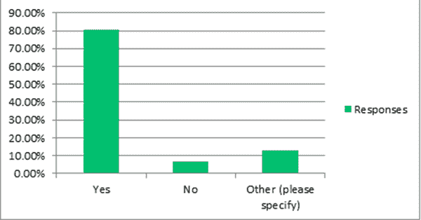 |

图 2 显示，大多数研究参与者认为区块链可以用于记录管理。尽管如此，还有一些人认为这项技术不适合记录管理。对于区块链可以用于记录管理的大量回应，可能是因为区块链已在金融领域、供应链管理、食品行业和能源行业等应用领域证明了其益处（Khatoon，2020）。这意味着记录管理也可以从区块链技术中受益；因此，大多数受访者表示可以使用区块链进行记录管理。

基于感知有用性和易用性的区块链采用

研究的目标之一是确定博茨瓦纳和津巴布韦的档案馆员和记录管理人员是否打算使用区块链，如果他们认为它对记录管理有用的话。因此，问题六到九（6-9）被构建成相关且相互关联的方式，最终旨在确定围绕区块链技术潜在采用的可能因素。问题的结构如下：

+   • 如果在您的组织中引入区块链用于记录管理，如果它易于使用，您会使用它吗？

+   • 如果区块链有用（改善记录管理），你会使用它并鼓励其他人使用吗？

+   • 如果区块链易于使用且对记录管理有用，您是否打算使用它进行记录管理？

+   • 你会向他人推荐区块链作为记录管理技术吗？

54 名受访者中有 48 名（88.9%）表示他们愿意使用区块链技术，如果它易于使用，两名表示他们不愿意尝试这项技术，而其他四名则跳过了这个问题。关于鼓励他人使用区块链，54 名受访者中有 50 名（92.6%）表示他们会鼓励他人使用它；而剩下的四人（7.4%）跳过了这个问题。

关于是否打算在发现区块链易于使用且对记录管理有用时使用区块链的问题，48 人表示‘是’，一人表示‘否’，四人跳过了这个问题，剩下的一人表示：“我认为现在它更受欢迎的是仅用于管理财务记录。除非它包含了对不同类型记录的全面管理，例如员工档案、政策、信函等。” 关于推荐区块链用于记录管理，40 人表示‘是’，四人表示‘否’，八人跳过了这个问题。剩下的两人中，一人表示“如果信息安全性好且有效，我可以推荐它”，而另一人表示“不确定”。

所获得的结果表明，如果区块链技术相对用户友好且易于实施，博茨瓦纳和津巴布韦的档案管理员和档案馆员都很愿意采用区块链技术进行记录管理。感知有用性和感知易用性是影响技术采纳或拒绝的关键变量之一（Jones 等人，2005 年；Totolo，2007 年；Chaterera，2012 年和 Radif 等人，2016 年）。因此，在决定采用任何形式的技术时，确保建立适当的支持系统至关重要。此外，被指定使用该技术的人员必须接受有关如何使用该技术的适当定位和培训（Mosweu 等人，2016 年）。这对于博茨瓦纳和津巴布韦的档案管理员和档案馆员尤其重要，因为由于缺乏培训和管理电子记录的专业知识，已经出现了大量关于记录管理不善的报告。

本研究的结果还证实，如果要将区块链技术作为记录管理工具采用，就需要充分的培训。其中一位受访者坦率地表示，他们认为区块链技术只用于管理财务记录。这些发现与 Chaterera-Zambuko（2019 年）的研究结果一致，该研究发现，受访者对区块链的真正作用存在困惑，因为他们将其与比特币大多混淆，并有时与数据库混淆。

区块链对记录管理技术的好处

意识到区块链技术作为潜在的记录管理技术，意味着潜在用户将意识到它对组织的好处。向受访者提出一个问题，从多个选择中选择使用区块链技术进行记录管理的好处。如表 3 所示的研究结果表明，研究受访者确实意识到区块链对记录管理的好处。大多数，30 人（73.17%）表示，通过区块链管理记录可以确保其不可变、真实并且具有完整性。最少的，17 人（41.46%）表示，区块链建立了对记录有效性的信任。

表 3\. 区块链作为记录管理技术的优势

| 好处 | 反馈 |
| --- | --- |
| 记录是不可变的、真实的并且具有完整性 | 30 | 73.17% |
| 灵活性 | 21 | 51.52% |
| 效率 | 23 | 56.10% |
| 节省成本（缩短流程，无需第三方） | 22 | 53.66% |
| 提高安全性 | 27 | 65.85% |
| 建立对记录有效性的信任 | 17 | 41.46% |

现在接下来的部分将讨论表 3 中显示的区块链对记录管理的好处。

记录的不可变性、真实性和完整性

通过区块链进行的交易记录一旦确认，就永远无法被抹去，因此它们是不可变的。这样的记录具有完整性的价值（Bhatia 等，2020），在记录管理中至关重要。数据的完整性是计算机安全技术世界的一个热点问题，与可用性和保密性一起，它们构成了其核心特征。人们普遍认为，互联网上的信息是固定和准确的（Duranti 和 Rogers，2019）。记录的完整性和身份使其具有真实性。真实性、可靠性、完整性和可用性是记录的关键特征，如 ISO 15489-1（ISO，2016）所述。

标准定义一条记录为一：a）可以证明其为所述内容的记录，b）已由声称创建或发送该记录的代理创建或发送；以及 c）已在声称的时间创建或发送（ISO，2016，第 4 页）。区块链生成的记录具有完整性、不可变性和真实性的事实使得该技术对记录和档案管理领域具有吸引力。

灵活性、效率和成本节约

使用区块链技术进行的交易由两个不相识的当事人进行，但由于信任问题而进行交易。通过不涉及第三方参与交易，效率更高。区块链技术具有灵活性。该技术是一个对等网络，对交易进行时间戳，并消除了第三方服务验证交易的必要性（Bhatia 等，2019）。使用区块链技术时，通常需要几天才能完成的涉及许多方的交易需要的时间大大缩短（Iron Mountain，2020）。因此，区块链用于记录管理促进了更高的效率，其中包括其他好处（John，2019）。

区块链技术可以带来显著的成本节约。其应用可以影响多个功能领域，例如支付、资本市场、贸易服务、投资和财富管理、证券和商品交易所（Di Grigorio，2017）。对于登记索赔，该技术可以确保索赔仅支付给应得者。总体而言，到 2022 年，公司可以预期将金融服务基础设施成本降低在 150 亿美元至 200 亿美元之间，这提供了除役传统系统和基础设施以及显着减少 IT 成本的可能性（Di Grigorio，2017）。

提高记录有效性的安全性和信任

可信记录是可以作为导致其生成的交易的证据的记录（Zhiliang 等人，2019）。在区块链系统中生成的记录被认为是可信的。区块链技术越来越被视为解决信任数字记录问题的解决方案（Lemieux 2016，第 11 页）。在区块链中生成的记录是安全的。该技术旨在每次发生新交易时更新每个成员保留的所有分类帐（Yoo，2017）。作为所有进行的交易的分布式数据库记录或公共分类帐，交易各方通过共识验证交易。大多数人必须同意所生成的记录是准确和完整的。一旦输入，信息就永远无法被抹去（Yoo，2017）。尽管卫生部门的进步通过实施电子健康记录（EHR）和电子医疗记录（EMR）系统提供了改进的安全性和用户体验，但安全问题仍然存在。有关医疗记录安全性、用户对数据的所有权以及数据完整性的问题仍然没有解决。区块链技术为存储医疗记录和其他与医疗保健相关信息提供了更安全、防篡改的平台（Shahnaz 等人，2019）。

在记录管理中采用区块链技术的建议模型

采用新技术可能是一项令人望而生畏的任务，周围充满了怀疑和不确定性。各个行业都面临着接受新兴技术的压力，否则它们就面临着变得多余、过时和不受各自服务社区青睐的风险。尽管采用颠覆性技术至关重要，但进行一些预检查和深入考虑同样至关重要。图 3 中提出的模型提供了在采用区块链进行记录管理时需要考虑的关键变量。这些变量是根据当前研究的发现确定的。

| 图 3\. 建议的区块链技术在记录和档案管理中的采用模型 |
| --- |
| 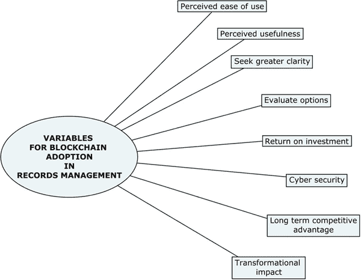 |

图 3 中描述的是拟议模型，其中包含了记录管理人员和档案管理员在管理其保管的文献遗产中采用区块链技术时应考虑的关键要素。

使用感知容易度

使用感知容易度是技术采用中的一个重要因素。正如本研究结果所显示的，只要易于使用，记录管理人员和档案管理员就愿意采用区块链技术。这也意味着应该对记录管理人员和档案管理员提供充分的培训，教授他们如何实施这项技术。许多组织中常见的一个明显错误是，采用新技术的培训通常只为信息技术部门保留。这导致许多记录管理人员和档案管理员成为了对其了解有限的系统的被动用户。因此，许多记录管理人员和档案管理员基于其复杂性而回避技术。

使用感知的有用性

使用感知的有用性同样重要，它培养了使用新实施技术的意愿。本研究的大部分受访者表示有兴趣采用区块链技术，前提是其在记录管理中有用。因此，采用技术不应该是为了跟上技术发展的步伐。相反，应该验证技术是否能更有效地完成工作。记录管理人员和档案管理员应该问自己的一个实际问题是他们想让技术为他们做什么，以及技术是否能做到。因此，使用情况应该驱动采用技术的需要。

世界正在乘坐技术的超级高速公路。 对许多专业人士来说，因为害怕落后而跳上技术的诱惑非常高。 提出的模型在图 3 中有所说明，但是它阻止档案管理员和档案馆员仅仅因为时髦而盲目地投身于新兴技术之中。 应该努力寻求更大的清晰度，了解技术的实际工作方式。 在没有令人满意的理解技术如何工作之前接受技术的使用是危险的。 在接受区块链技术用于记录和档案管理之前必须进行尽职调查。

选择方案的评估

采用新技术不必非此即死。 应该权衡和评估各种选择。 在这方面应该问的关键问题是，这项技术是否最适合该组织。 正如前文所述，采用新技术不应该基于每个人都在使用的压力。 建议档案管理员和档案馆员列出他们的系统用户需求、需求和期望，然后评估预期技术的能力是否符合预期。 在这方面，有必要进一步探讨区块链在档案管理中的应用方式和场景。 需要仔细检查区块链技术在档案管理中的规格。

投资回报

经济是随着时间建立和加强的，因此每个组织的支出都应该是值得的。涉及财务影响的决策必须经过慎重评估。必须有意义的投资回报。建议记录管理人员和档案管理员在考虑采用区块链进行记录管理时进行成本效益分析。对技术提供的成本效益必须有一个清晰的理解。Ngulube（2011）认为成本分析在规划记录管理方案时至关重要。它使组织能够对成本和收益做出明智的决策，从而使其拥有有效和高效的系统，从而获得竞争优势。然而，撒哈拉以南非洲的可用文献表明，进行成本效益分析并不是该地区专业人士的主要关注领域（Ngulube 和 Tafor，2006 年；Kemoni 等，2007 年；Ngoepe，2009 年）。事实上，对区块链在记录管理中实施进行详细的成本效益分析是必不可少的，因为这将为实施组织提供前进的选项，而且他们充分了解这样做将会证明花费的钱是合理的。

提高网络安全

当代组织为了保持竞争力，不得不拥抱新技术以求生存（Qiang 等人，2012 年）。采用新技术可能给组织带来好处，但也伴随着安全风险，形式上是违规行为（Dohertya 等人，2011 年）。在实施信息通信技术时必须谨慎。提高安全性在使用区块链技术进行记录管理方面被认为是第二高的受益数量，占 27 个指标。这表明技术提供安全性的能力不必过分强调。正如所提出的模型所示，网络安全是采用新技术时需要考虑的关键因素。应对内外攻击的技术强度应进行适当的检查和验证，例如非法访问以及可能威胁记录真实性的不可检测的删除和更改。在云计算中，对于记录管理来说，数据的安全性是值得怀疑的（Mosweu 等人，2019 年）。正是在这种背景下，McKemmish（2013 年）警告称，技术实施中的收益和好处应该与安全和隐私等风险进行权衡。尽管，McKemmish（2013 年）的上下文特指云端记录管理，但同样的风险也是区块链记录管理的一项关注重点。

变革性影响

如前面的章节所重申的，采用新技术不应仅仅是基于其他人也在使用的压力而进行。记录管理者应该评估采用该技术的长期竞争优势。他们应该设想技术的转型影响。例如，通过采用新技术，该行业或组织可能会经历哪些根本性变化？或者，可以实现的长期和短期收益是什么，等等？对这些和其他问题的回答将有助于做出是否采用该技术的明智决定，或者让其流逝。

结论

第四次工业革命（I4.0）见证了许多专业人士和从业者难以忽视的颠覆性技术的出现。记录管理者和档案管理员在跟上技术进步的竞赛中也未能幸免。总体而言，本研究表明，博茨瓦纳和津巴布韦的记录管理者和档案管理员意识到了区块链技术的存在，尽管他们各自的组织尚未使用这项技术。博茨瓦纳和津巴布韦的记录管理者和档案管理员认识到区块链技术对记录管理的潜在好处，并且愿意在技术确实有用且易于使用的情况下采用这项技术。除了感知到的有用性和易用性之外，需要考虑的其他因素包括寻求更大的清晰度、评估选择、考虑投资回报和长期竞争优势以及网络安全。

使用区块链技术不应被视为一劳永逸的解决方案。必须考虑一些问题，比如如何处理恶意用户、如何应用控制措施以及实施的局限性。必须注意的是，区块链记录系统并不从根本上改变现有的记录保管和归档系统，而是通过增加一层完整性检查来增强它们。然而，区块链记录并不需要存在证书颁发机构，因为公私钥对是在系统内自动生成的。因此，即使其原始证书仍然有效，传入的归档记录也可以被重新签名，并以时间顺序的方式在区块链中以加密方式进行安全存储，作为确立其持续真实性的基础。虽然这项技术可能不免受到与新技术相关的潜在风险的影响，但建议记录管理者和档案馆员接受这项技术，因为它提供了可观的好处。

进一步研究建议

区块链技术仍然很新，应该以探索它如何潜在地使记录和信息管理专业人士受益的心态来进行调查。毫无疑问，没有什么是永恒的事实引发了以下三个关键问题（Lemieux, 2019），这需要进一步的研究：

+   -   区块链将存活多久？

+   -   谁以及通过什么方式来确保用户数据的副本将被保留？

+   -   假设用户数据的副本被保留，是否可以使用存储在区块链上的数据来进行验证？

其他缺点包括硬件、能源和数据挖掘过程所需的时间成本高昂，以及技术复杂且可能难以理解的事实。

参考文献

Begley, R. (2017). 信息与记录管理与区块链技术：理解其潜力（硕士论文）。诺桑比亚大学，纽卡斯尔。

Bhatia, S.，Douglas, E. K.，& Most, M.（2020 年）。区块链与记录管理：颠覆性力量还是新方法？于 2020 年 5 月 17 日检索自 https://www.emerald.com/insight/0956-5698.htm

Bralić, V.，Kuleš, M.，& Stančić, H.（2017 年）。数字签名有效性长期保存的模型：TrustChain。在 Future2017：2017 年将 ICT 整合到社会中。于 2020 年 3 月 30 日检索自 https://www.researchgate.net/publication/321171227_A_Model_for_Long

Burke, F. G.（1992 年）。通过沟通实现混沌：档案馆员、记录管理员和通信现象。在《档案馆想象力：向休·A·泰勒致敬的论文集》（第 154-77 页）。学术出版社。

Chaterera, F.（2012 年）。走向在津巴布韦推行电子政府。2012 年。Mousaion：南非信息研究杂志，30（2），78–93。

Chaterera, F.（2013 年）。津巴布韦的记录调查与公共记录管理（硕士论文）。南非大学，比勒陀利亚。

Chaterera, F.，Masuku, M.，Bhebhe, S.，Ngoepe, M. S.和 Katuu, S.（2018 年）。津巴布韦的企业数字记录管理。于 2020 年 4 月 16 日检索自 https://interparestrust.org/assets/public/dissemination/AF03ZimbabweLitReviewJuly2018.pdf

Chaterera-Zambuko, F.（2019 年）。记录的完整性和真实性：区块链是银弹吗？论文发表于第 3 届档案管理与可持续发展会议，肯尼亚蒙巴萨。

Chikomba, A.（2018 年）。津巴布韦选定金融服务国有企业的数字记录管理（硕士论文）。南非大学，比勒陀利亚。

Davis, F. D.（1989 年）。感知有用性、感知易用性和信息技术的用户接受度。于 2020 年 5 月 12 日检索自 http://www.jstor.org/stable/249008

Di Grigorio, M.（2017 年）。区块链：降低成本的新工具。于 2020 年 3 月 30 日检索自 https://www.pwc.com/m1/en/media-centre/articles/Blockchain-new-tool-to-cut-costs.html

Dohertya, N. F., Anastakisa, L., & Fulfordb, H. (2011). 《加强信息资源企业安全性：可接受使用政策角色的关键审查》。《国际信息管理杂志》，31，201–209。

Dube, C., & Gumbo, V. (2017). 《津巴布韦的技术接受模型：津巴布韦零售业的案例》。《应用经济学与金融》，4(3)，56–76。doi:10.11114/aef.v4i3.2208

Duranti, L. (2001). 《数字技术对档案学的影响》。《档案学》，1(1)，39–55。doi:10.1007/BF02435638

Duranti, L. (2009). 《从数字外交学到数字记录取证》。《档案学：加拿大档案学会期刊》，68，39–66。

Duranti, L., & Rogers, C. (2019). 《相信在线记录和数据》。取自 2020 年 5 月 12 日，https://www.researchgate.net/publication/337398175_Trusting_Records_and_Data_in_the_Cloud_The_Creation_Management_and_Preservation_of_Trustworthy_Digital_Content

Holotescu, C. (2018). 《了解区块链技术及如何参与其中》。论文发表于第 14 届国际科学会议电子学习与教育软件，罗马尼亚布加勒斯特。

国际标准化组织. (2016). 《ISO 15489-1:2016 信息与文献--记录管理--第一部分：概念与原则》。ISO。

Iron Mountain. (2020). 《什么是区块链，为什么记录管理专业人员应该关注？》。取自 2020 年 5 月 6 日，https://www.ironmountain.com/resources/general-articles

ITU. (2018). 《衡量信息社会报告第二卷》。取自 2020 年 3 月 30 日，https://www.itu.int/en/ITU-D/Statistics/Documents/publications/misr2018/MISR-2018-Vol-2-E.pdf

John, C. (2019). 《合同和记录管理的区块链》。取自 2020 年 3 月 26 日，https://medium.com/vdcconsortium/Blockchain

Jones, A. (2018). 区块链为记录管理带来真实性的证明。Retrieved 20 March, 2020, https://www.alfresco.com/blogs/digital-transformation/Blockchain

Jones, D., Cranston, M., Behrens, S., & Jamieson, K. (2005). 什么使得信息通信技术（ICT）实施成功：在线作业提交的案例研究。Retrieved 29 March, 2020, from https://djon.es/blog/wp-content/uploads/2008/12/oasissubmit_v3.pdf

Kalusopa, T., & Ngulube, P. (2012). 为博茨瓦纳劳工组织制定电子记录准备就绪框架。《信息开发》，28(3)，199–215\. doi:10.1177/0266666912446209

Keakopa, S. (2007). 博茨瓦纳、纳米比亚和南非电子记录管理的政策和程序。《东南非洲区域国际档案委员会分会期刊》，26(1)，54–64\. doi:10.4314/esarjo.v26i1.31015

Kemoni, H., Ngulube, P., & Stilwell, C. (2007). 公共记录和档案作为良好治理工具：档案记录学者和从业者社区内的反思。《东南非洲区域国际档案委员会分会期刊》，26(1)，3–18\. doi:10.4314/esarjo.v26i1.31012

Khatoon, A. (2020). 区块链智能合约系统用于医疗管理。《电子学报》，9(94)，1–23\. doi:10.3390/electronics9010094

Lemieux, V. L. (2016). 信任记录：区块链技术是解决方案吗？《记录管理杂志》，26(2)，110–139\. doi:10.1108/RMJ-12-2015-0042

Lemieux, V. L. (2017). 区块链记录保管解决方案的分类及其对未来档案保存的影响的一些思考。Retrieved 26 April, 2020, from https://www.researchgate.net/publication/322511343

Lemieux, V. L. (2019). 区块链与公共记录保管：论庙宇、监狱和（再）配置权力。《区块链前沿》，2(5)，1–14\. doi:10.3389/fbloc.2019.00005

Lemieux, V. L., Hofman, J. D., Batista, D., & Joo, A. (2019). 区块链技术和档案管理。从 http://armaedfoundation.org/wp-content/uploads/2019/06/AIEF-Research-Paper-Blockchain-Technology-Recordkeeping.pdf 检索于 2020 年 3 月 26 日。

Lewis, A. (2015). 区块链技术的初步介绍。从 https://bitsonblocks.net/2015/09/09/gentle-introduction-Blockchain-technology/ 检索于 2020 年 7 月 17 日。

Luka, M. (2012). 信息通信技术对银行业的影响：尼日利亚银行业案例研究。《国际高级计算机科学与应用杂志》，3(9)，145–149。

Marutha, N. S. (2019). 利用区块链技术连接整个医疗保健世界以共享患者记录。在南非比勒陀利亚艺术学校三年一度会议上提交的论文。

McKemmish, S. (2013). 云端记录保存与档案管理：是否存在一线希望？从 https://infoz.ffzg.hr/INFuture/2013/papers/1-02%20McKemmish,%20Recordkeeping%20and%20Archiving%20in%20the%20Cloud.pdf 检索于 2020 年 7 月 1 日。

Mnjama, N., & Wamukoya, J. (2007). 电子政务和记录管理：政府电子记录准备度评估工具。《电子图书馆》，25(3)，274–284。doi:10.1108/02640470710754797

Moatlhodi, T., & Kalusopa, T. (2016). 对位于博茨瓦纳哈博罗内的劳动和内政部电子记录准备度的评估。《Mousaion：南非信息研究杂志》，34(3)，1–22。

Moloi, J., & Mutula, S. (2007). 电子记录管理。《信息开发》，23(4)，290–306。doi:10.1177/0266666907084765

Mosweu, O. (2014). 影响博茨瓦纳贸易和工业部行动人员和记录员采用和使用文档工作流管理系统（DWMS）的因素（硕士论文）。博茨瓦纳大学，哈博罗内。

Mosweu, O. (2016). 电子文件和记录管理的关键成功因素。《ESARBICA 杂志》，35，1–13。

Mosweu, O., Bwalya, J., & Mutshewa, A. (2017). 《电子文件和记录管理系统采用与使用因素探究》. 《信息发展》，33(1), 97–110\. doi:10.1177/0266666916640593

Mosweu, T., Luthuli, L., & Mosweu, O. (2019). 《云计算服务在非洲的影响：数字时代的致命缺陷？》.《南非信息管理杂志》，21(1), 1–12\. doi:10.4102/sajim.v21i1.1069

Mosweu, T. L., & Kenosi, L. (2018). 《博茨瓦纳哈博罗内裁判区法院记录管理系统在司法交付中的应用》.《记录管理杂志》，28(3), 234–251\. doi:10.1108/RMJ-11-2017-0033

Motsaathebe, L., & Mnjama, N. (2007). 《博茨瓦纳高等法院记录管理》.《记录管理杂志》，19(3), 173–189\. doi:10.1108/09565690910999175

Nakamoto, S. (2008). 《比特币：一种点对点电子现金系统》. 检索自 2020 年 7 月 20 日，https://bitcoin.org/bitcoin.pdf

国家档案和记录管理局（NARA）. (2019). 《区块链白皮书》. 检索自 2020 年 5 月 2 日，http://www.archives.gov>policy

Nengomasha, C. T., & Chikomba, A. (2018). 《津巴布韦和纳米比亚公共部门电子文件记录管理系统实施现状》. 《记录管理杂志》，28(3), 252–264\. doi:10.1108/RMJ-08-2017-0023

Ngoepe, M. (2009). 《组织公共记录以实现服务交付：南非国家档案和记录管理服务在政府部门中的功能主题文件计划的作用》.《东部和南部非洲国际档案理事会地区分会杂志》，28(1), 41–56\. doi:10.4314/esarjo.v28i1.44397

Ngulube, P. (2011). 《记录全生命周期成本分析与有效管理》.《南非档案学会杂志》，44, 3–18.

Ngulube, P., & Tafor, V. F. (2006). 国际档案理事会东部和南部非洲地区分会（ESARBICA）会员国公共档案和档案管理概览。《档案学会杂志》，27，69–86。

Nkala, G., Ngulube, P., & Mangena, S. (2012). 津巴布韦国家档案馆的电子记录准备就绪情况。《Mousaion》，30(2)，108–116。

Norton Life Lock. (2020). 2019 年数据泄露：迄今已泄露 40 亿条记录。检索于 2020 年 5 月 2 日，来自：https://us.norton.com/internetsecurity-emerging-threats-2019-data-breaches.html

Notheisen, B., Hawlitschek, F., & Weinhardt, C. (2017). 拆解区块链炒作 - 迈向区块链市场工程方法。检索于 2020 年 5 月 18 日，https://www.researchgate.net/publication/317828531

Prasad, D. (2016). 关于帕劳、萨摩亚、基里巴斯和所罗门群岛公共部门服务交付中 ICT 使用的研究。检索于 2020 年 5 月 19 日，来自 https://www.researchgate.net/publication/314281757

Qiang, Y., Fang, Y., & Gonzalez, J. J. (2012). 在新技术采用过程中管理安全风险。《计算机与安全》，31，859–869。

Radif, M., Fan, I. S., & McLaughlin, P. (2016). 雇佣技术接受模型（TAM）以在伊拉克大学采用学习管理系统（LMS）。于 2016 年第 10 届国际技术、教育和发展大会上发表的论文，西班牙瓦伦西亚。检索于 2020 年 5 月 2 日，来自：https://www.researchgate.net/publication/298953343_EMPLOYMENT_TECHNOLOGY_ACCEPTANCE_MODEL_TAM

Rakemane, D., & Serema, B. C. (2018). 加博隆尼公司和知识产权局的电子记录管理实践，博茨瓦纳。《南非档案学会杂志》，51，148–169。

Reader, S. (2018). 自主学习：为什么在 21 世纪对你至关重要。检索于 2020 年 5 月 6 日，来自：https://medium.com/wondr-blog/self-learning-why-its-essential-for-us-in-the-21st-century-9e9729abc4b8

Rogers, E. M. (2003). 创新的扩散 (第五版)。自由出版社。

SadhyaV.SadhyaH. (2018). 区块链技术采用的障碍。第二十四届美洲信息系统大会，新奥尔良。

Shonhe, L., & Grand, B. (2019). 电子记录的实施。《档案管理杂志》, 30(1), 43–62。 doi:10.1108/RMJ-03-2019-0013

Sigauke, D. T., & Nengomasha, C. (2012). 面对津巴布韦国家档案馆中历史记录数字化的挑战和前景。在第二届非洲数字图书馆和档案国际会议(ICADLA-2)上呈现的论文，南非约翰内斯堡威特沃特斯兰德大学。2020 年 4 月 16 日检索，来源于 https://core.ac.uk/download/pdf/39670341.pdf

Sigauke, D. T., Nengomasha, C., & Chabikwa, S. (2016). 津巴布韦国家档案馆中州立大学电子邮件记录的管理：发现及对津巴布韦国家档案馆的启示。《ESARBICA 杂志》, 35, 14–29。

Tornatzky, L. G., & Fleischer, M. (1990). 技术创新的过程。学术出版社。

Totolo, A. (2007). 博茨瓦纳中学校长对信息技术的采纳。2020 年 4 月 30 日检索，来源于 https://www.researchgate.net/publication/242407711_Information_Technology_Adoption_by_Principals_in_Botswana_Secondary_Schools

Turnbaugh, R. C. (1997). 信息技术、档案和国家档案馆。《美国档案馆员》, 60(2), 184–200。 doi:10.17723/aarc.60.2.e6247tm502671537

UNESCO. (2003). 教育中的互联网。2020 年 5 月 3 日检索，来源于 https://iite.unesco.org/pics/publications/en/files/3214612.pdf

Venkatesh, V., Morris, M. G., Davis, G. B., & Davis, F. D. (2003). 信息技术的用户接受：走向统一视角。2020 年 4 月 16 日检索，来源于 https://www.researchgate.net/publication/220259897

Wamboye, E., Tochkov, K., & Sergi, B. S. (2015). 亚非国家技术采纳与增长. Comparative Economic Studies , 57(1), 136–167\. doi:10.1057/ces.2014.38

Yoo, S. (2017). 基于区块链的金融案例分析及其影响. Asia Pacific Journal of Innovation and Entrepreneurship. , 11(3), 312–321\. doi:10.1108/APJIE-12-2017-036

Zhiliang, D., Yongjun, R., Yepeng, L., Xiang, Y., Zixuan, S., & Hye-Jin, K. (2019). 基于区块链的信任电子记录在云存储中的保护. Retrieved 16 July 2020, from https://vntechindia.com/wp-content/uploads/2020/04/004.pdf

ADDITIONAL READING

Bhatia, S., & de Hernandez, A. W. (2019). 区块链已经到来. 那对档案管理和档案的意义是什么？Journal of Archival Organization , 16(1), 75–84\. doi:10.1080/15332748.2019.1655614

Body, A. (2018), 区块链：如何为您的业务选择正确的技术. Retrieved 13 July, 2020, from https://medium.com/@abody/Blockchain-how-to-choose-the-right-tech-for-your-business-aa4597d7ee7c

Bwalya, K. (2019). 档案在第四次工业革命中的相关性 - 重新定义人工智能和动态信息治理的领域. Paper presented at the 2019 South African Society of Archivists, Johannesburg, South Africa.

Collomosse, J., Bui, T., Brown, A., Sheridan, J., Green, A., Bell, M., Fawcett, J and Higgins, J. (2018). ARCHANGEL: 可信数字公共文件档案. Retrieved 30 March, 2020, from https://arxiv.org/pdf/1804.08342.pdf

Connolly, A., & Kick, A. (2015). “比特币早期组织采用者与非采用者的不同之处是什么？” In: AMCIS 2015 Proceedings. AIS Electronic Library: Association for Information Systems (AIS).

Consensys. (2018), 区块链基础知识. A Curated Collection. ConsenSys Academy

Day, M. S. (2019), “关于如何结束区块链系统的关闭问题”, available at: arXiv: 1902.07254

Dhillon, V., Metcalf, D., & Hooper, M. (2017). 区块链应用程序：理解区块链生态系统以及如何使其为您工作。Apress。doi:10.1007/978-1-4842-3081-7

Dollar, C. (1993). 信息时代的档案馆员和记录管理人员。《Archivaria》，36，37–52。

Fincham, J. E. (2008). 调查的响应率和响应性，标准和期刊。《美国药学教育杂志》，72(2)，1–3。doi:10.5688/aj720243

Hofman, D., Lemieux, V. L., Joo, A., & Batista, D. A. (2019). "世界边缘与无限可能之间的边缘：区块链、GDPR 和信息治理"。《记录管理期刊》，29(1/2)，240–257。doi:10.1108/RMJ-12-2018-0045

ICA. (2010)，档案普遍宣言。检索自 2020 年 5 月 6 日，[链接](https://www.ica.org/en/universal-declaration-archives)。

Mearian, L. (2018). 区块链市场火热；这里是学习相关技能的方法。《Computerworld》。

Millar, L. (2009)，理解电子记录管理的背景。[链接](http://www.irmt.org/documents/educ_training/term%20modules/IRMT%20TERM%20Module%201.pdf)。

Morisse, M. (2015)，“加密货币与比特币：绘制研究景观。” In: AMCIS 2015 Proceedings. AIS Electronic Library: Association for Information Systems (AIS)。

Mosweu, O., Bwalya, K. J., & Mutshewa, A. (2016). 使用 UTAUT 模型检查影响文档工作流管理系统（DWMS）采纳和使用的因素。《记录管理期刊》，26(1)，38–67。doi:10.1108/RMJ-03-2015-0012

Motlhasedi, N., & Mnjama, N. (2014). **博茨瓦纳培训管理局**的电子记录管理。《神学、宗教与哲学期刊》，4(2)，361–382。

Motlhasedi, N. Y. (2012)，博茨瓦纳培训管理局的电子记录管理。University of Botswana, Gaborone，硕士论文。

Wattenhofer, R. (2016). 区块链科学。Inverted Forest Publishing。

Yaga, D., Mell, P., Roby, N., & Scarfone, K.（2018），“区块链技术概述，NISTIR 8202”，美国国家标准与技术研究院，可在：https://nvlpubs.nist.gov/nistpubs/ir/2018/NIST.IR.8202.pdf

Zyskind, G., Nathan, O., & Pentland, A.（2015）。去中心化隐私：使用区块链保护个人数据。在安全与隐私研讨会（SPW）中（第 180–184 页）。IEEE。doi:10.1109/SPW.2015.27

关键术语和定义

采用：采用指的是对新实施的技术的使用。在这一章节的背景下，采用意味着个人或机构接受使用区块链技术来管理其监管下的记录和档案。

真实性：这是接受记录作为确切发生事务的真实反映的概念。它指的是记录没有被意外或恶意篡改，因此可以信任作为已完成交易的证据。

区块链技术：这指的是可以集合在一起以确保分布式账本机制安全高效工作的技术集合。区块链的特征是过程政治上分散化，没有基础设施故障点，提供自主权和信任，并且具有抗攻击性。

加密货币：这些是设计成作为交换媒介的数字资产，其中个别币的所有权记录存储在以计算机化数据库形式存在的分类账中，使用强加密技术来保护交易记录。

数据库：数据库是一种有组织的数据集合，通常以电子形式存储并从计算机系统中访问。也可以描述为存储有组织信息的数据结构。大多数数据库包含多个表，每个表可能包含多个不同字段。

电子记录：电子记录是计算机记录的信息，它在机构或个人活动的发起、进行或完成时产生或接收。电子记录的例子包括电子邮件、文字处理文件、电子表格、数字图像。

新兴技术：这些技术的开发、实际应用或两者都尚未完全实现，因此它们正从不存在或默默无闻中逐渐脱颖而出。

不变性：一个不可变的记录对象是指创建后其状态无法修改的对象，除非通过涉及所有其他参与者的“共识”机制。这意味着一旦记录被创建，除非达成共识，否则无法被修改或删除。

工业革命：这指的是在较短时间内一个或多个技术被其他新技术替代的时期。这是一个技术进步加速的时代，新的创新快速应用和普及通常会导致社会的突变。

完整性：一个文件在其中未被更改、添加或删除任何内容时具有完整性；它准确地代表了作者创建的内容。完整性意味着记录是完整且真实的。

记录管理：这指的是管理功能，标志着从创建和捕获、使用、维护到处置全生命周期中业务功能产生的记录信息的管理。

安全性：它指的是保护记录免受各种形式的损害或攻击威胁。这些包括物理损害、外部数据泄露、未经授权的更改和删除等。

# 第四章

# 区块链中的端到端追踪与拥堵：

超级账本布料中的供应链用例

+   科萨拉·亚帕·班达拉

    

    爱尔兰国立大学高威，爱尔兰

+   苏巴西斯·萨库尔

    爱尔兰国立大学高威，爱尔兰

+   约翰·G·布雷斯林

    

    爱尔兰国立大学高威，爱尔兰

摘要

现代供应链应用是复杂系统，在许多不同领域中发挥着重要作用。供应链管理系统的实施是为了处理日益增加的复杂性和货物流动。然而，大多数这些系统也增加了在分布式供应链系统中提供信任和全局视图的复杂性。区块链技术引入了一种新的架构风格，以支持网络中参与者执行的交易的可追溯性和信任。本章利用这一新兴技术，通过改善透明度、信任和端到端查询来实现了来自英国 JLP Meats 的供应链用例，同时讨论了实现大型企业区块链应用可能面临的挑战。实现了从农场到餐桌的过程，并对其进行了可追溯性、商品召回、区块分析、拥塞启用食品安全和可持续农业的测试。在需要异构贸易合规性和可扩展性的复杂供应链中突出显示了潜在的挑战。

引言

供应链管理是将业务流程集成到从最终用户到原始供应商的分布式和异构系统中（Cooper，Lambert 和 Pagh，1997）。当前的供应链管理系统存在已知的局限性，而食品供应链是所有供应链中最复杂和碎片化的。（Martin，2017）。供应链中涉及许多参与者，它们使用分布式和异构系统，增加了集成、信息共享、端到端跟踪和合规跟踪的复杂性。此外，与供应链集成的各种系统可能会受到网络威胁的影响，这将导致供应链中信息的完整性受损（Gao 等，2018）。

区块链技术已经成为解决双花问题的解决方案，承诺交易的可追溯性、不可变性和透明性（Nakamoto，2008）。正如 Consensys（2020）所述，区块链技术与智能合约相结合可以实现：

+   • 从源头到最终消费端的消费品透明度

+   • 精确的资产跟踪

+   • 加强服务、产品和软件的许可。

区块链的共享 IT 基础设施可以简化所有参与者的工作流程，而不论业务网络的大小。此外，这种共享基础设施使审计员能够更清楚地了解供应链参与者的活动。

在食品行业供应链的背景下，从农场到餐桌的食品系统是一个复杂的由孤立系统组成的网络。关于如何记录和追踪食品溯源数据，目前没有被广泛采用的行业标准。由于区块链技术作为一个分布式、可信、不可变的账本而出现，它可以用来记录从农场到餐桌的食品系统中的交易，实现追溯（Martin, 2017）。供应链网络中的交易数量总是巨大的。以沃尔玛为例，它每周为 28 个国家的近 12,000 家门店的 2.6 亿客户提供服务（Yiannas, 2018）。一个区块链网络中的少数参与者就会产生数百万笔交易和区块，这些交易和区块不断增长，挑战着区块链网络的可伸缩性。

此外，供应链网络中的产品公司在将产品分配给客户之前生产了数千种不同类型的产品。其中一些交易的细节是冗余信息。例如，数千包肉制品都是由同一种商品制成的，因此只有包装标识符不同。此外，大部分这些信息只在一定的时间段内需要。因此，为这些类型创建交易区块并将它们存储在所有其他参与者的分布式账本中是一种昂贵的过程，因为它会导致区块链网络的拥堵和存储问题。另一方面，在所有账本中具有相同副本的记录支持物品的追溯和审计。然而，在现代复杂的供应链系统中，必须要对物品进行端到端的追溯。

全球化的商业部门增加了商品和货物的跨境流动，从而增加了全球供应链的复杂性（Martin，2017 年）。在当前复杂多样的全球供应链中，监管机构在区块链中的角色非常具有挑战性，因为存在着分布在各个国家的各种既定的老法律、法规和机构（Kshetri，2018 年）。像 Gao 等人（2018 年）所述的扮演监控角色是不够的，因为他们需要批准或拒绝交易并提供理由。监管机构只对合规所需的相关信息感兴趣。他们不需要了解在各种法规环境中发生的异构交易。当前的区块链架构支持等状态的分布式账本。监管机构成为需要合规性的所有区块链网络的参与者，并维护这些网络的账本，这不是一种实际的方法。因此，监管机构在区块链网络中的位置仍然不明确。

公共区块链框架优化了透明度，因此它们在共享私密和敏感信息方面存在挑战，并且只允许授权参与者参与供应链；例如，比特币（Bitcoin, 2020）、以太坊（Ethereum, 2020）和莱特币（Litecoin, 2020）。 然而，许可区块链平台将交易分为公共交易和私人交易，并且还能够进行授权，例如 Hyperledger Fabric（Hyperledger, 2020）和 Quorum（Quorum, 2020）。 与其他私有和许可区块链相比，Hyperledger Fabric 拥有可靠的技术堆栈来实现供应链应用，并且在 IBM 和沃尔玛等主要组织的试点项目中得到了广泛使用（Kshetri, 2018）。 Hyperledger Fabric 是一个模块化的区块链框架，支持旨在私有企业内使用的即插即用组件（Kenton, 2020）。 然而，大多数这些试点项目都专注于端到端追溯，仍然需要详细阐述其他挑战，如商品召回、区块链拥堵、数据冗余、可扩展性、监管合规性等。

本章中，作者讨论了在英国为 JLP Meats 实施的一个供应链使用案例，该案例采用了 Hyperledger Fabric（Hyperledger, 2020）。 作者选择了 Hyperledger Fabric 框架，因为它在开发供应链应用方面有着很大的潜力，支持私有企业所需的即插即用组件的模块化架构，以及可靠的技术堆栈用于开发和测试。 作者详细阐述了端到端追溯、商品召回、区块链拥堵、数据冗余、可扩展性以及监管机构在大规模区块链网络中的位置等使用案例。

本章的组织如下：主要有五个部分。首先，作者讨论了文献中的相关工作。然后，作者讨论了端到端追踪、区块链拥堵以及监管者在区块链中的位置。在下一部分中，本章描述了 JLP Meats 的一个用例，这是一家位于英国伦敦的批发肉类经销商。本章的第四部分描述了使用 Hyperledger Fabric 进行端到端追踪、商品召回和拥堵分析的设计、实施和测试。最后，本章总结了贡献，并强调了未来的工作和方向。

相关工作

在本节中，作者回顾了与区块链技术和供应链管理系统相关的相关工作，包括安全性、隐私性、可追溯性、商品召回和交易拥堵。

供应链管理是一个集成了从最终用户到原始供应商的分布式和异构系统中实施的业务流程（Cooper，Lambert 和 Pagh，1997）。大型供应链中的参与者通常在许多国家中运营，受到各种限制和法规的约束。此外，食品供应链正试图在面临巨大新挑战的同时提供更多样化、便捷和经济的食品来源。而且，在当今的食品供应系统中，来自一个配料生产商的产品可能最终出现在千家万户的杂货店货架上（Yiannas，2018）。在针对食品污染的必要行动方面，如 2008 年花生酱沙门氏菌爆发¹、2016 年受污染面粉引起的大肠杆菌疾病²、2020 年与苜蓿豆芽有关的大肠杆菌感染爆发³等，食品供应链的分布行为和复杂性变得更加复杂。食品供应链还面临着动态成本、价格和法规合规性的挑战。

目前，食品供应链中的每个环节（农民、加工商、分销商、零售商等）在食品可追溯性目的上的数据跟踪和记录并没有广泛采纳行业标准（Yiannas, 2018）。大多数参与者仍然在纸上或他们的传统系统上记录数据，这些系统无法实现必要的映射记录和所需的详细可追溯性和透明度的通信。此外，当前的供应链应用由于集成了孤立系统和涉及交易完整性的安全漏洞而备受困扰。用于通过供应链跟踪产品的技术包括射频识别（RFID）、远程监控、条形码和二维码、传感器启用技术、物联网（IoT）及其他众多技术（Davor & Domagoj, 2018）。然而，由于基础数据仅在公司内或部分连接的孤立系统中可用，跟踪数据的真正潜力并没有完全发挥出来。当前供应链系统中的主要问题包括系统之间的通信及各段之间缺乏信任。与供应链相关的可持续性事件表明，全球存在的企业在全球供应链中改善环境、社会和经济结果方面面临困难（Esteban Koberg, 2018）。企业应对其内部和供应商操作造成的环境、社会和经济结果负责任。

另一方面，区块链技术已经成为解决双花问题的解决方案，承诺交易的可追溯性、不可变性和透明性（Nakamoto，2008）。区块链技术已经从加密货币交易中发展出来，并不断扩大经济领域的领域（Davor & Domagoj，2018）。该技术可以为供应链系统提供改进的可追溯性、透明性和可交易性（Consensys，2020）。因此，区块链和分布式账本技术在供应链应用领域越来越受欢迎（Martin，2017）。区块链技术承诺解决信任问题，并为物流和供应链提供安全和经过验证的系统。这导致了使用区块链技术改革供应链系统。大型组织中已经存在试点项目；例如，从农场到餐桌⁴的过程可以采用物联网和区块链技术，以提高控制和灵活性，同时增加食品信任和品牌保护。

西门子将其 Mindsphere 平台、私有的追踪库以及区块链管理应用程序合并，以实施如图所示的追踪和追踪用例（Siemens，2019）。这些解决方案利用区块链技术在整个过程中实现信任。该框架允许公司限制信息查看权限，因此敏感信息可以被保密，同时只向供应链的其他成员公开关键信息。此平台进一步实现了利用物联网和区块链实现“数字孪生”（Meyvaert，2020）。在物联网中，数字孪生是物理产品或过程的虚拟表示，用于了解和预测其物理对应物的性能特征（Meyvaert，2020）。数字孪生在产品生命周期中被广泛使用，区块链使其能够记录所有信息在不可变记录中。

| 图 1\. 西门子供应链的 Mindsphere |
| --- |
| 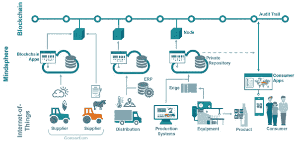 |

区块链技术可以实现分散化、分布式和可信赖的数字账本的创建，可用于记录跨复杂网络的多个实体的交易（Yiannas, 2018）。数据不可变性和数据流的公开访问性可以支持现代供应链系统的合规性、可靠性和透明度（Perboli, Musso, & Rosano, 2018）。供应链作为一个区块链，是一个两步的区块构建机制，由高等人等（2018）建议的分类为普通用户、第三方用户和不同角色的支持实体。在他们的方法中，监管机构正在专注于监测信息。讨论了一个监测代理来监测和分析区块链交易、节点、区块和智能合约，以确保区块链合法、高效、可靠地运作（Ko, Lee, Jeong, & Hong, 2018）。

(Kshetri, 2018) 中的作者总结了一系列成功的区块链实施用例，包括：丹麦航运公司马士基（用于国际物流的区块链应用）、Provenance（印度尼西亚的一个试点项目，用于渔业的可追溯性）、阿里巴巴（用于打击食品欺诈的区块链）、沃尔玛（从拉美到美国追踪农产品）、英特尔的解决方案来追踪海鲜供应链等。

供应链中的可追溯性是一个重要的探索领域（Westerkamp, Victor, & Küpper, 2018）。在当前的区块链架构中，分布式账本提供了所有参与者都可以访问的交易信息，从而提供了更大的透明度（Zheng, Xie, Dai, Chen, & Wang, 2017）。然而，组织不愿在公共账本上公开敏感信息，因此 Benhamouda, Halevi & Halevi (2018)引入了私有数据集来管理敏感信息。隐私、可扩展性和缺乏治理仍然是大规模工业适应区块链范 paradigm 的主要关注点（Li, Sforzin, Fedorov, & Karame, 2017）。

公共（无权限）区块链平台优化了透明度，交易是公开透明的，例如，比特币（Bitcoin, 2020）、以太坊（Ethereum, 2020）和莱特币（Litecoin, 2020）。然而，有权限的区块链平台将交易分为公共交易和私有交易，例如，Hyperledger Fabric（Hyperledger, 2020）和 Quorum（Quorum, 2020）。私有交易在网络参与者之间共享私有和敏感数据（Hyperledger2, 2020）。

以太坊是一个安全的去中心化账本，优化了透明度，因此在该平台上共享秘密是困难的（Ethereum, 2020）。以太坊的主要组成部分包括以太坊虚拟机（EVM）、矿工、区块、交易、共识算法、账户、智能合约、挖矿、以太币和燃料（Modi, 2018）。这些在图 2 中有所体现。私有交易和公共交易的概念被引入到 Quorum（Quorum, 2020）中，它扩展了以太坊的交易模型，包括一个可选的 privateFor 参数和一个新的 IsPrivate 方法来处理这种交易。

| 图 2. 以太坊的组成部分 |
| --- |
| 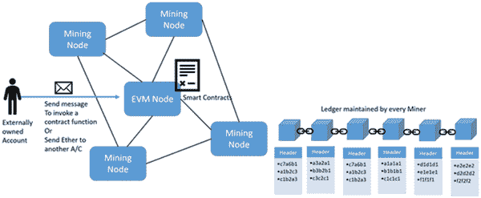 |

另一方面，超级账本 Fabric 引入了私有数据集合，允许通道上的一组定义明确的组织具有背书、提交或查询私有数据的能力（Hyperledger2，2020）。私有数据通过流言协议点对点发送到仅有权限查看它的组织。在这里，订购服务不涉及，订购者不会看到私有数据。私有数据的哈希经过认可、排序并写入通道上每个对等方的账本，如图所示。3（Hyperledger2，2020）。

| 图 3\. 超级账本 Fabric 中的私有数据存储 |
| --- |
| 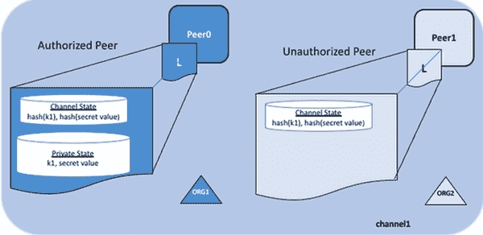 |

私有数据的哈希通过订购方传递到公共账本上，并保护隐私。哈希可用于状态验证和审计目的。在超级账本 Fabric 中，交易调用的流程如图所示。4（Thummavet，2020）。

| 图 4\. 超级账本 Fabric 中的交易调用 |
| --- |
| 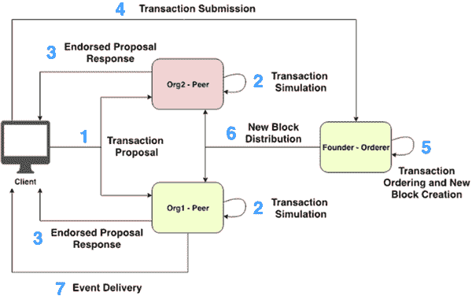 |

用于区块链应用程序的超级账本 Fabric 技术堆栈如图所示。5（Composer，2020）。

| 图 5\. 超级账本 Fabric 和 Composer 技术堆栈 |
| --- |
| 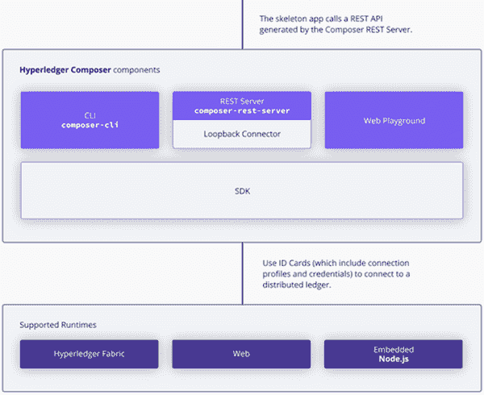 |

图中的技术堆栈使架构师和开发人员能够快速创建“全栈”区块链解决方案：例如，在区块链上运行的业务逻辑，将区块链逻辑暴露给 Web 或移动应用的 REST API，与现有系统的区块链集成等（Composer，2020）。超级账本 Composer 已被设计为支持可插拔的运行时。超级账本 Fabric 的模块化架构将交易处理工作流分为三个不同的进程：称为链代码的智能合约，其中包括系统的分布式逻辑处理和协议，交易排序以及交易验证和提交（Kenton，2020）。

端到端跟踪和拥塞

区块链将数据按照时间顺序存储在不断增长的区块中，并将这些区块链接在一起形成一个连续的序列。网络中的参与者正在贡献于将交易和区块提交到区块链中。将区块添加到区块链中是不可预测的，并且区块不是基于交易进行排序的。然而，所有的分布式账本都具有相同的状态，能够可靠地访问并支持从一个账本到另一个账本的端到端追溯记录。

| 图 6. 区块链中的交易和区块 |
| --- |
| 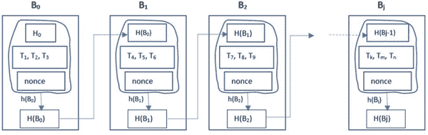 |

图 6 描述了一个区块链，其中 B[0] 到 B[j] 是区块链中的组成区块。H(B[0]) 到 H(B[j]) 是区块的哈希键。T[1] 到 T[k,] T[m], T[n] 是交易。k、m、n 是整数。h() 是哈希函数。在这里，作者假设一个区块包含三个交易。区块链根据网络参与者创建的交易不断增长。参与者将根据自己的需求进行交易，并将区块添加到不断增长的区块链中。交易信息的检索是一个挑战，因为交易之间没有关联。例如，项目可追溯性需要所有与一个项目相关的交易，审计需要审计一组交易等。然而，不同的区块链平台提供了各种检索交易信息的方法。Hyperledger Fabric 具有 composer-rest-server，为每个资产提供 REST 端点。

图 7 显示了参与者 P1...P6 和交易 T01 ... T04 以及 T11 ... T14。在供应链应用中，P1 到 P6 可以被视为商品提供者、物流公司、进口商和零售商。

| 图 7. 区块链中的交易顺序 |
| --- |
| 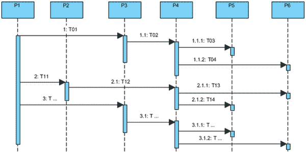 |

商品供应商通过物流公司持续提供各种类型的商品给进口公司，进口公司将从这些商品中生产批次的产品，并将其供应给客户。如图所示，区块链网络中的参与者贡献于向区块链网络添加区块。

| 图 8\. 区块链中的状态变化 |
| --- |
|  |

在当前的区块链架构中，要找到关于产品的端到端详情，涉及到一系列散布在区块链中的随机分布的交易，并不是一件简单的事情。虽然区块之间通过区块哈希机制连接，但链式概念和随机区块集成使得在供应链中找到物品演变变得复杂。然而，记录的去中心化性质以及具有最新账本的相同副本允许参与者直接与端到端数据详情进行交互。

作者已经创建了一个 REST-API，该 API 为区块链上的成员、断言、用户定义的查询以及区块链中的事务创建 REST 端点。查询被定义为从账本中提取必要信息。这些资源的表述状态可以被提取、过滤和连接以找到端到端的详情。应相应地定义这些流程。

区块链拥堵

在供应链应用中，最终用户产品在将资源转化为最终用户产品的过程中经历了一系列交易。区块链网络中存在中间参与者，他们将主要资源开发成各种产品，并将其分发给客户。这些情景将向区块链添加数百万条记录。这导致了关于区块链网络中的区块拥堵和参与者处的数据冗余的几个挑战。产品生命周期中发生的所有交易对区块链网络中的所有参与者来说并不都同等重要，因此需要一个交易验证的补偿模型。如图 7 所示，P4 从主要资源制造不同的产品，并将其分发给 P5 和 P6。

(T[01], T[02]) -> (T[1] … T[n1]), (T[n1]… T[n2]), (T[n2] … T[n3]), …… 其中 n1、n2、n3 ∈ ℤ

(T[11], T[12]) -> (T[11] … T[m1]), (T[m1]… T[m2]), (T[m2] … T[m3]), ... 其中 m1、m2、m3 ∈ ℤ

(T[...]) -> (T[21] … T[k1]), (T[k1]… T[k2]), (T[k2] … T[k3]), ….......... 其中 k1、k2、k3 ∈ ℤ

在 P4 阶段，交易 T[01]和 T[02]导致基于产品创建和客户需求创建交易集合。同样的情况也适用于 T[11]、T[12]和 T[...]。如果存在多个类型为 P4 的中间参与者开发子产品，这将在区块链网络中增加数百万条记录，导致实时拥塞。此外，这将在区块链中添加冗余数据。这是一个持续增长的实时开销，对区块链网络的可扩展性产生了负面影响。管理时间数据以减少交易冗余和供应链应用程序的交易验证仍需要进行重大开发。物联网设备已与供应链集成，并且它们在整个供应链中生成数百万条记录。可以采用临时解决方案来管理这些记录，例如，Hyperledger Fabric 支持即插即用的本地数据存储来记录物联网数据，仅在区块链中记录数据集的哈希值。物联网与供应链的集成是常见情景，因此需要新的标准来与物联网集成区块链。

此外，供应链应用程序需要遵守各个地区制定的法规。各个地区的监管机构只关注供应链交易的特定信息以进行合规检查。在当前的区块链架构中，参与者将维护完整的区块链，因此监管机构作为区块链网络中的参与者的角色并不实际。到目前为止，没有一种区块链架构提供必要的标准来将监管机构定位于区块链中。

如图所示，作者提出了一个私人渠道，供监管机构与仅需的参与者连接以进行合规检查。参考图 9，ORG 1 到 4 和 ORG 1 到 3 连接在两个区块链网络中。REG ORG 有一个私人渠道连接两个不同区块链网络的 ORG3 和 ORG2。各地的监管机构可以成为这个私人渠道的授权成员，这样可以快速验证供应链交易，而不像当前系统那样存在长时间的延迟。这进一步支持了任何需要通过供应链发送物品的人的透明合规检查。这个主题需要进一步阐述，因为到目前为止，没有适当的标准或成熟的产品，可以加快监管合规性，而区块链技术在这个领域表现出了很多潜力。

| 图 9. 区块链中的监管机构 |
| --- |
| 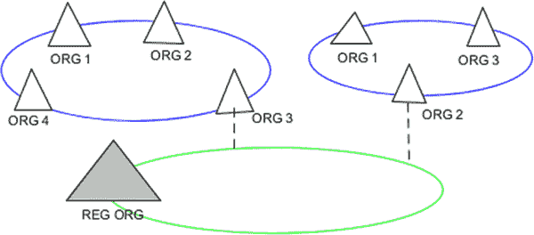 |

在我们提出的架构中，需要监管合规性的交易将被引导到监管机构，并且分布式账本将被更新为已批准或已拒绝的交易块。已批准或已拒绝的交易块被保存在监管者数据存储中，格式为{hash(block), block}。块的哈希记录在区块链上。在这种方法中，监管机构无需保留不必要的记录，他们只保留已处理的记录（批准或拒绝的记录）。未来的应用可以使用这些记录的数据。例如，由于这些块在区块链上有必要的哈希键，所以可以连接到网络中的参与者的账本进行审计追踪。

用例

JLP Meats Trading 组织（JLP Meets，2020 年）从澳大利亚、南美和欧洲进口肉类，并在英国销售。他们的客户是英国的餐馆、零售店和肉店。JLP Meats 生产数百种定制的肉类产品，并将它们分发给顾客。农场到餐桌流程的抽象视图如图所示。10.作者已使用 Hyperledger Fabric 实现了一个区块链解决方案，以说明端到端追踪、产品召回、交易拥塞等。

| 图 10\. JLP Meats，伦敦的用例 |
| --- |
| 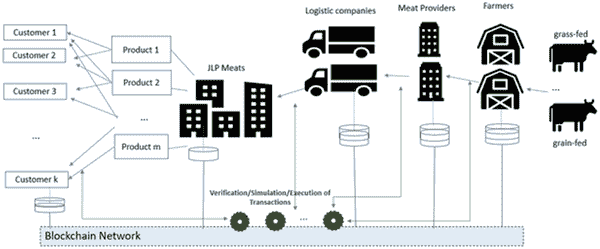 |

为了说明目的，作者考虑了一个具体的场景，如下所示。农民 Samex 使用物流公司 Sandford group 将草饲和粮饲的牛肉出口到英国的 JLP Meats。JLP Meats 将牛肉转化为 300 至 500 克的包装，并供应给他们的顾客 ASDA 和 TESCO 商店。从 TESCO（或 ASDA）购买牛肉包装的买家想要找到关于产品的端到端详细信息。在这里，一个典型的交易集可以建模如图所示。11.

| 图 11\. 用例场景中的交易 |
| --- |
| 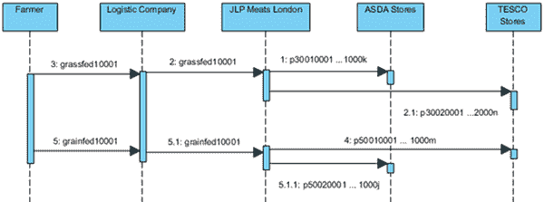 |

JLP Meats 供应各种类型的产品，从而在区块链中产生了成千上万的交易，提高了交易拥塞。交易验证由网络中被许可的验证者完成，并且这个过程应该得到补偿。然而，本章不涉及补偿过程；质量控制由监管机构管理。本章提出了一个监管者的私有通道网络，他们可以连接到区块链网络，执行监管活动和必要的认可，如图所示。9.

设计、实施和测试

作者使用公共和许可的区块链，以便账本是分散的，一组选定的节点参与共识过程。作者使用了 Hyperledger Fabric⁵、Composer Playground、Hyperledger Explorer 和在 Ubuntu 18.04 上的 Docker 来实现上述用例。

使用 Hyperledger Fabric 提出解决方案的高级架构如图所示。12。

| 图 12. 基于 Hyperledger Fabric 的高级架构 |
| --- |
| 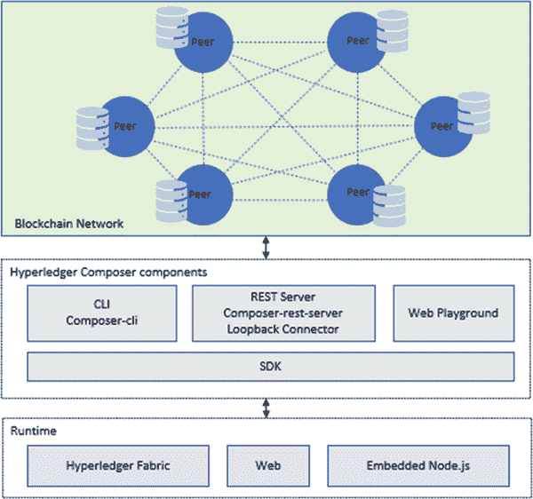 |

同行是区块链网络的成员。业务网络是在上述对等方上开发和安装的，为了执行物品的端到端追踪，创建了一个 REST-API⁶。使用 Hyperledger Composer Playground 来实现和测试场景，并使用 Hyperledger Blockchain Explorer 来可视化区块链统计数据。Swagger⁷用于可视化和测试 REST 端点。肉类数据包的交易定义如图所示。13。对等体可以是授权的矿工或参与者，用于挖掘供应链交易，并且应该引入一种补偿模型来进行交易验证。但是，到目前为止，尚无适当的标准或矿工可用来挖掘供应链交易。这些必要的发展可以进一步改革未来的供应链系统。

| 图 13. 数据包交易 |
| --- |
| 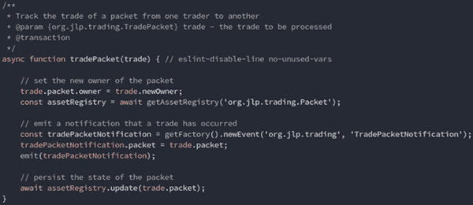 |

参考图。13，交易交易具有三个主要功能：为一包肉设置所有权，发出通知表明发生了交易，并保留一包肉的状态。这些基本上是交易交易的常见功能。商品交易在图中定义。14。

| 图 14. 商品交易 |
| --- |
| 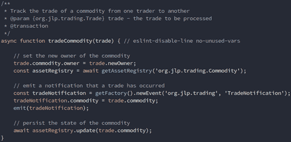 |

端到端追踪

通过 REST 端点实现了端到端的跟踪细节。这些端点及其结果用于获取一批货物，商品及其交易者的详细信息，如下所述：

http://localhost:3000/api/Packet/p3001001:

{

“$class”: “org.jlp.trading.Packet”,

“packetID”: “p3001001”,

“mainExchange”: “GBP”,

“quantity”: 300,

“unitprice”: 2,

“commodity”: “resource:org.jlp.trading.Commodity#grassfedbeef”,

“owner”: “resource:org.jlp.trading.Trade#tesco”

}

http://localhost:3000/api/Commodity/grassfedbeef:

{

“$class”:”org.jlp.trading.Commodity”,

“tradingSymbol”: “grassfedbeef”,

“description”: “草饲牛肉”,

“mainExchange”: “AUD”,

“slaughterDates”: “12 月 20 日”,

“quantity”: 500,

“owner”: “resource:org.jlp.trading.Trader#jlp”

}

http://localhost:3000/api/Trader/jlp:

{

“$class”:”org.jlp.trading.Trader”,

“tradeId”: “jlp”,

“name”:”JLP 肉类”,

“address”: “伦敦”

}

作者开发了用于检索信息的查询，并将其部署为 REST 端点。以下 REST 端点输出有关交易商品和农民详细信息的交易明细。用于检索农民详细信息的端点是基于查询的 REST 端点。

http://localhost:3000/api/Trade:

{“$class”: “org.hyperledger.composer.system.AddAsset”,

“resource”:[

{

“$class”: “org.jlp.trading.Commodity”,

“tradingSymbol”: “grassfedbeef”,

“description”: “草饲牛肉”,

“mainExchange”: “AUD”,

“slaughterDates”: “12 月 20 日”,

“quantity”: 500,

“owner”: “resource:org.jlp.trading.Trader#samex”

}

]}

http://localhost:3000/api/queries/findAddAssertsTradeTransactions:

{

“Packet id”: “p3001001”,

“牛肉类型”: “草饲牛肉”,

“Trader”: “JLP 肉类”,

“Logistic company used”: “Sandford”,

“Farmer name”: “Samex”,

“Slaughtered Date”: “12 月 20 日”

}

作者使用 REST 端点提取上述细节，并将它们安排在一个流程中，以生成有关特定包的端到端详细信息。也就是说，需要开发人员介入以开发将端点连接到过滤器并提供请求信息的工作流程。这些请求信息可以是简单的用户请求或复杂的审计跟踪。但是，这个过程使用户、参与者和监管机构能够查看端到端的详细信息，例如，农民可以了解他们的肉类正在哪里销售，一些公平贸易组织可以查看记录并确保公平贸易政策得到正确应用，组织可以查看统计数据以确保可持续农业等等。

项目召回

在供应链应用程序中，迅速追踪不安全产品的来源以及它们的分销地点是必要的。

在这个实现中，REST 端点 http://localhost:3000/api/Packet/p3001001 提供了包 p3001001 的详细信息。

{

“$class”:” org.jlp.trading.Package”,

“packetID”: “p3001001”,

“mainExchange”: “GBP”,

“quantity”: 300,

“unitprice”: 2,

“commodity”: “resource.org.jlp.trading.Commodity#grassfed10001”,

“owner”: “resource.jlp.trading.Trade#tesco”

}

使用以下 REST 端点和过滤器 http://localhost:3000/api/Packet 可以提取所有由商品“grassfed10001”制成的包。

其中“:{”commodity”:”resource:org.jlp.trading.Commodity#grassfed10001”}}。

[

{

“$class”: “org.jlp.trading.Packet”,

“packetID”: “p3001001”,

“mainExchange”: “GBP”,

“quantity”: 300,

“unitprice”: 2,

“commodity”: “resource:org.jlp.trading.Commodity#grassfed10001”,

“owner”: “resource:org.jlp.trading.Trade#tesco”

},

{

“$class”: “org.jlp.trading.Packet”,

“packetID”: “p3001002”,

“mainExchange”: “GBP”,

“quantity”: 300,

“unitprice”: 2,

“commodity”: “resource:org.jlp.trading.Commodity#grassfed10001”,

“owner”: “resource:org.jlp.trading.Trader#tesco”

},

{

“$class”: “org.jlp.trading.Packet”,

“packetID”: “p3001003”,

“mainExchange”: “GBP”,

“quantity”: 300,

“unitprice”: 2,

“commodity”: “resource:org.jlp.trading.Commodity#grassfed10001”，

“owner”: “resource:org.jlp.trading.Trade#jlp”

},

{

“$class”: “org.jlp.trading.Packet”,

“packetID”: “p3001005”,

“mainExchange”: “GBP”,

“quantity”: 300,

“unitprice”: 2,

“commodity”: “resource:org.jlp.trading.Commodity#grassfed10001”,

“owner”: “resource:org.jlp.trading.Trader#asda”

}

]

同样，还可以找到商品的农民和运输细节。可以根据所选商品相应地处理物品的召回。不需要召回 JLP 或农民提供的所有包裹。这种方法有助于更快地从客户和店铺中召回所有物品，防止在健康和财务方面造成进一步损害。可以根据需要开发必要的工作流程进行扩展。

通道中的区块

在 Hyperledger Fabric 中实现的对等通道命令⁸ 被用于探索区块链网络中的区块和通道。在这个用例实现中，CLI 命令“docker exec -it cli bash”和“peer channel getinfo -c mychannel”被用来连接到一个对等体并提取区块链信息。

区块链信息: {”height”:37,”currentBlockHash”:”avhlBTkndEjbj7GixWkvB9kC7RawTzhKmHhCy7gXHuQ=”,”previousBlockHash”:”+d+lYUBQzoWOXIn/wCRkI7uSAAcCd1Evloyzyau4jGM=”}

| 图 15\. 区块 16 的详细信息 |
| --- |
| 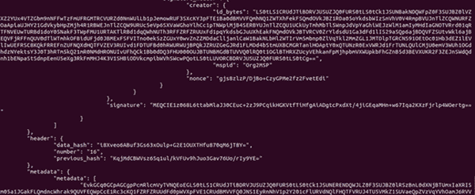 |

CLI 命令“peer channel fetch 16 -c mychannel”和“configtxlator proto_decode --input mychannel_16.block --type common.Block”可用于获取区块 16，解码并提取区块信息。这种方法提取了区块的所有内部细节（数据、有效负载、操作、创建者、随机数、mspid、认可、签名、认可者、链码细节、通道细节、数据哈希、前一个哈希、元数据等），如图所示。 15。

拥塞分析

图 16 描述了一个由 8 名参与者（p1 至 p8 - p1: 农民，p2 和 p3: 物流公司，p4: JLP Meats，p5 和 p6 是客户）组成的区块链网络中，来自农民的 6 次进口的交易。作者对 8 名参与者的区块链环境进行了拥塞分析，如图 6 所示。这里，p4 是 JLP Meats，从商品中创建数千种产品。

在大多数供应链中，有多个类似 P4 类型的参与者，这导致区块链上的交易拥塞并延迟交易验证。未来基于区块链的供应链系统应该有方法和标准来管理交易拥塞。例如，将冗余信息保留在本地，同时在区块链上记录该信息的哈希以确保信任。然而，Hyperledger Fabric 的私有通道、本地数据存储和即插即用的模块化架构可以进一步改进，以开发必要的解决方案。

| 图 16\. 8 名成员区块链网络中 6 次进口的拥塞分析 |
| --- |
| 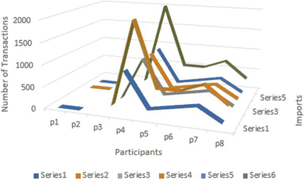 |
| 图 17\. 进口交易数量 |
| 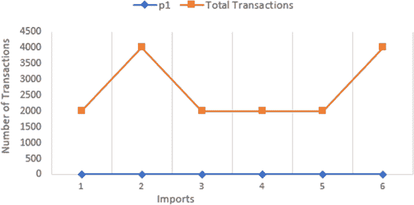 |

图 17 描述了每个进口的一组交易。在 Hyperledger Fabric 中，订单服务负责将区块添加到区块链网络中。P4 是一个中间参与者，从进口中创建数千种产品。在单个区块链网络中有多个这样的参与者会导致每次进口产生大量记录，从而增加了区块链的拥塞。

在供应链应用中，监管机构的角色是检查各种类型进出口的法规、批准进出口，并仅保留这些进出口的必要记录。监管机构无法维护所有交易的账本，此提议的方法有助于监管机构对所有其他必要的区块链网络保持透明。此外，作者使用区块链浏览器可视化区块统计数据，例如图 18、图 19 和图 20 中的数量、区块哈希和上一个哈希。

| 图 18\. 区块链详情 |
| --- |
| 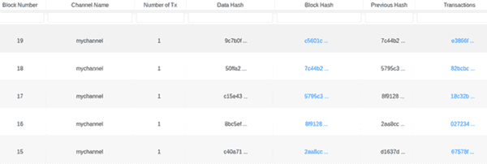 |
| 图 19\. 区块详情 |
| 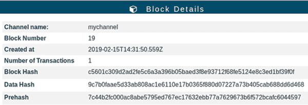 |
| 图 20\. 交易详情 |
| 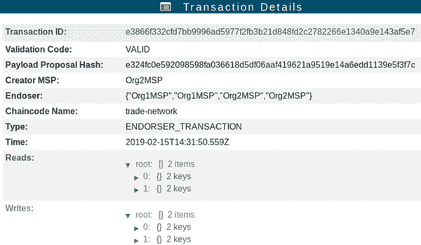 |

我们的 POC 源代码可以在 https://github.com/kosalayb/JLPMeats 找到。

讨论和结论

区块链技术是实现复杂供应链应用的潜在技术，因为其不可变和分布式账本的性质有助于简化追溯性并确保异构交易的信任。在供应链应用中，交易的追溯性和信任非常重要。文献中提出的大多数试点研究都讨论了追溯性，但没有详细讨论交易验证、拥塞、监管合规性和必要标准。

本章实现了一个使用 Hyperledger Fabric 的供应链用例，并说明了与食品供应行业相关的从农场到餐桌的过程，包括追溯性、产品召回、交易拥塞、监管合规性、必要标准等。此外，作者还强调了实现复杂供应链所需的必要改进，包括连接位于不同国家的监管机构、与物联网系统集成、管理冗余数据和处理大量交易。

当前的区块链架构和键值数据存储并不直接支持资产的端到端可追溯性、物品召回，并且缺乏必要的标准，这是明显的。因此，开发者应参与并开发必要的工作流程。作者们提出了私有通道概念，将监管者置于区块链网络中，以最小化数据冗余并确保审计。然而，需要不断改进以管理实时复杂的区块链应用程序中的区块拥堵、交易验证和补偿管理。

致谢

该出版物的研究部分得到了爱尔兰政府科学基金会（SFI）和农业、食品和海洋部在 SFI 16/RC/3835（VistaMilk）和 SFI 12/RC/2289_P2（Insight）的欧洲区域发展基金的共同资助。

参考文献

BenhamoudaF.HaleviS.HaleviT. (2018). 使用安全多方计算在 Hyperledger Fabric 上支持私有数据。2018 年 IEEE 云工程国际会议（IC2E）。奥兰多，佛罗里达：IEEE。 doi:10.1109/IC2E.2018.00069

Bitcoin. (2020). 比特币开发者。取自学习比特币并开始构建基于比特币的应用程序：https://developer.bitcoin.org/

Composer. (2020, June 23). 典型的 Hyperledger Composer 解决方案架构。取自 Hyperledger Composer：https://hyperledger.github.io/composer/v0.19/introduction/solution-architecture

Consensys. (2020). 区块链用例-供应链管理中的区块链。取自 https://consensys.net/blockchain-use-cases/supply-chain-management/

Cooper, M. C., Lambert, D. M., & Pagh, J. D. (1997). 供应链管理：不只是物流的新名称。国际物流管理杂志，8（1），1-14. doi:10.1108/09574099710805556

Davor, D., & Domagoj, S. (2018)。供应链中的区块链应用。《SMART 供应网络》，21-46。

Esteban Koberg, A. L. (2018)。全球供应链中可持续供应链管理的系统性评述。《清洁生产杂志》，1084–1098。

以太坊 (2020 年 6 月 23 日)。以太坊是一个全球开源的去中心化应用平台。摘自 ethereum.org：https://ethereum.org/

Gao, Z., Xu, L., Chen, L., Zhao, X., Lu, Y., & Shi, W. (2018)。CoC: 一种统一的基于分布式分类账的供应链管理系统。《计算机科学与技术杂志》，237–248。

超级账本 (2020 年 6 月 23 日 a)。[超级账本 Fabric](https://www.hyperledger.org/use/fabric)。摘自 Hyperledger：https://www.hyperledger.org/use/fabric

超级账本 (2020 年 6 月 23 日 b)。[私有数据](https://hyperledger-fabric.readthedocs.io/en/release-2.0/private-data/private-data.html)。摘自 Hyperledger Fabric：https://hyperledger-fabric.readthedocs.io/en/release-2.0/private-data/private-data.html

Kenton, W. (2020 年 6 月 24 日)。[超级账本 Fabric](https://www.investopedia.com/terms/h/hyperledger-fabric.asp)。摘自 Investopedia：https://www.investopedia.com/terms/h/hyperledger-fabric.asp

KoK.LeeC.JeongT.HongJ. W.-K. (2018)。基于 RPC 的区块链监控代理的设计。2018 年国际信息与通信技术融合大会 (ICTC)。韩国济州：IEEE。doi:10.1109/ICTC.2018.8539456

Kshetri, N. (2018)。区块链在满足关键供应链管理目标中的作用。《国际信息管理杂志》，39，80–89。doi:10.1016/j.ijinfomgt.2017.12.005

LiW.SforzinA.FedorovS.KarameG. (2017)。朝着可扩展和私密的工业区块链。《BCC ’17: ACM Workshop on Blockchain, Cryptocurrencies and Contracts》论文集 (pp. 9-14)。ACM。doi:10.1145/3055518.3055531

莱特币 (2020 年 6 月 23 日)。用于支付的加密货币：基于区块链技术。摘自 https://litecoin.org/

Martin, S. (2017)。食品溯源与控制的区块链应用案例。瑞典地方政府和地区：Kairos Future。摘自 Kairos Future：https://tinyurl.com/y7hh6nup

Meyvaert, E. (2020 年 6 月 22 日)。西门子 Mindsphere 和 SettleMint 的分布式中间件：完美匹配！来自 Medium：https://updates.settlemint.io/siemens-mindsphere-and-settlemints-distributed-middleware-the-perfect-match-b1ce77335c09

Modi, R. (2018 年)。Solidity 编程基础。Packt Publishing。

Nakamoto, S. (2008 年)。比特币：点对点电子现金系统。www.bitcoin.org

Perboli, G., Musso, S., & Rosano, M. (2018 年)。物流和供应链中的区块链：设计真实用例的精益方法。IEEE Access：实用创新，开放解决方案，6，62018–62028。doi:10.1109/ACCESS.2018.2875782

Quorum。 (2020 年 6 月 23 日)。企业的经过验证的区块链解决方案。来自 Evolve with Quorum：https://www.goquorum.com/

西门子。 (2019 年)。可信追溯性 - 区块链和物联网。德国，纽伦堡：西门子 AG 2019。来自 https://assets.new.siemens.com/siemens/assets/api/uuid:de496ba4-0081-48f5-965b-4963879b2d43/version:1557493248/vrfb-b10033-00-7600sbblockchainfb-144.pdf

Thummavet, P. (2020 年 6 月 22 日)。解密 Hyperledger Fabric：Fabric 架构。来自 Medium：https://tinyurl.com/y9yn33k5

Westerkamp, M., Victor, F., & Küpper, A. (2018 年)。基于区块链的供应链追溯性：令牌配方模型制造流程。在 IEEE/ACM 国际物理和社交计算会议(CPSCom)。加拿大，哈利法克斯：IEEE Xplore。10.1109/Cybermatics_2018.2018.00267

Yiannas, F. (2018 年)。由区块链驱动的食品透明度的新时代。创新：技术，治理，全球化，12(1-2)，46–56。doi:10.1162/inov_a_00266

ZhengZ.XieS.DaiH.ChenX.WangH. (2017 年)。区块链技术概述：架构，共识和未来趋势。2017 年 IEEE 大数据国际大会 (BigData Congress)。夏威夷，檀香山：IEEE。10.1109/BigDataCongress.2017.85

额外阅读

AhamedN. N. K. P, S. P. Anandaraj 和 V. R. 海产品供应链管理利用区块链, 第六届高级计算与通信系统国际会议（ICACCS），2020，pp. 473-476。

Du, M., Chen, Q., Xiao, J., Yang, H., & Ma, X. (2020). 利用区块链进行供应链金融创新，在 IEEE Transactions on Engineering Management，doi:10.1109/TEM.2020.2971858

Hastig, G. M., & Sodhi, M. S. (2019). 供应链可追溯性的区块链：业务需求和关键成功因素。生产与运作管理，935–954。

Jabbar, A., & Dani, S. (2020). 在区块链环境中研究交易和计算成本之间的联系。国际生产研究期刊，58(11)，3423–3436. doi:10.1080/00207543.2020.1754487

Li, Z., Guo, H., & Ali Vatankhah Barenji, W. M. (2020). 基于区块链、LSTM、层次分析过程的可持续生产能力评价机制，供应链网络国际生产研究期刊，58(24), 1–21. doi:10.1080/00207543.2020.1740342

Subramanian, N, Chaudhuri, A, & Kayikci, Y. (2020). 区块链在食品供应链中的应用。区块链和供应链物流, 21-29. Springer.

Subramanian, N, Chaudhuri, A, & Kayikci, Y. (2020). 区块链在医疗供应链中的应用。区块链和供应链物流, 31-38. Springer.

关键术语和定义

数字孪生: 数字孪生指的是潜在和实际物理资产、过程、人员、地点、系统和设备的数字副本，可用于各种目的。

从农场到餐桌: 该阶段涉及食物的种植、加工和消费——从供应商到客户桌子的整个食物周期。

物联网（Internet of Things）：物联网是一种由相互关联的计算设备、机械和数字机器组成的系统，具有唯一标识符和在网络上传输数据的能力，无需人与人之间或人与计算机之间的交互。

矿工：矿工验证新的区块链交易并记录它们在区块链上。矿工竞争解决基于加密哈希算法的困难数学问题。

点对点（P2P）：P2P 计算是一种分布式应用程序架构，将任务分配给对等方。对等方在应用程序中拥有相同的特权。

REST API：表述性状态转移（REST）是一种软件架构风格，定义了一组用于创建 Web 服务的约束条件。应用程序编程接口（API）定义了接口函数。

RFID：射频识别（RFID）利用电磁场自动识别和跟踪附加在物体上的标签。

智能合约：智能合约是区块链的重要组成部分；它是嵌入在区块链上由计算机代码管理的自执行协议。一旦满足了某些预先协议的条件，协议就会自动生效。

尾注

1 [`www.cdc.gov/salmonella/2009/peanut-butter-2008-2009.html`](https://www.cdc.gov/salmonella/2009/peanut-butter-2008-2009.html)

2 [`www.cdc.gov/ecoli/2016/o121-06-16/index.html`](https://www.cdc.gov/ecoli/2016/o121-06-16/index.html)

3 [`www.cdc.gov/ecoli/2020/o103h2-02-20/index.html`](https://www.cdc.gov/ecoli/2020/o103h2-02-20/index.html)

4 [`www.arcweb.com/blog/supply-chain-transparency-farm-table`](https://www.arcweb.com/blog/supply-chain-transparency-farm-table)

5 [`www.hyperledger.org/projects/fabric`](https://www.hyperledger.org/projects/fabric)

6 [`github.com/hyperledger/composer/wiki/Composer-REST-Server`](https://github.com/hyperledger/composer/wiki/Composer-REST-Server)

7 [`swagger.io/`](https://swagger.io/)

8 [`hyperledger-fabric.readthedocs.io/en/release/commands/peerchannel.htm`](https://hyperledger-fabric.readthedocs.io/en/release/commands/peerchannel.htm)

# 第五章

# 区块链技术和比特币税务逃避的一般问题

+   Güneş Çetin Gerger

    

    土耳其马尼萨 Celal Bayar 大学

摘要

虚拟货币经常还用于洗钱活动、恐怖主义融资、逃税以及其他价值超过 70 亿欧元的非法活动，尽管总金额几乎无法衡量。事实上，区块链技术涉及许多虚拟货币，包括比特币，在全球经济体系中进行各种与金融交易相关的实践。此外，其他区块链应用正在为包括医疗保健、供应链、制造业等各行业做出积极贡献。这项技术构成了数字资产交易货币的支柱，具有匿名性、隐私性、安全性和速度。从这个意义上讲，对于税务管理机构来说，检测金融欺诈以及针对虚拟交易的税收法规提出了新的挑战。本章旨在研究区块链技术、虚拟货币，特别是比特币，并探讨世界各国政府为打击逃税和非法交易而制定的法规。

介绍

区块链是新时代的软件架构结构。事实上，在区块链作为数据库中，数据以有序的方式记录到区块中。每个记录都有一个时间戳。当一个区块被填满时，下一个区块就会被创建，并且这些区块以链的形式相互连接。如今，在信息系统中，数据库是最常用的构造。对于区块链来说，情况也是如此。一个项目、一个加密货币和一个记录系统都可能创建一个区块链。在这个意义上，区块链就是一本记录簿。我们可以称之为“总账”（Güven, Şahinöz, 2018）。

世界经济论坛定义了区块链技术如下：“区块链技术，或分布式账本技术（DTL），是一种技术协议，使得两方在不需要中介的情况下交换数据成为可能。” 就安全性而言，区块链是卓越的，因为链中的所有记录都处于相同级别且拥有同等权限，不可更改，需经过一致的共识方可修改。系统崩溃、被黑客攻击或其数据被删除等问题不会出现。作为一个重要的发现，区块链可用于社会、政治和法律方面。区块链技术最流行的应用是在加密货币的交易中。

加密货币的产生不受任何国家或政府的控制，也没有任何物理形式；这些是虚拟货币。加密货币是通过区块链技术和数学加密方法由“矿工”创建的。通过在互联网上现有链条中添加新的链条，矿工们获得报酬。比特币是最广泛使用的虚拟货币，其生产量限制为 2100 万个单位。在记录比特币操作的区块链中，可以看到和监控所有过去的交易。然而，账户所有者并不明确，因此所有操作都是匿名进行的。在这方面，它经常被用于洗钱和地下经济的目的。这反过来导致了逃税的普遍性。逃税问题的主要原因是匿名性，即加密货币用户保持隐藏，其交易不受税务管辖，从而形成了一个无法检测的领域。因此，比特币有时被描述为“避税天堂”。

国家，即政府，也在花费时间和精力寻找将加密货币纳入税收体系的方法。尽管这些加密货币现在在一些国家被征税，但在其他国家仍然不在征税体系之内。关于如何将加密货币纳入所得税制度仍然没有明确的决定。总的来说，比特币收入被视为“商品”，而不是货币。在加密货币的情况下，钱是根据所有相关人员所知的公开可用的方法在建立时声明的数量创建的。另一方面，在传统货币系统中，国家可以通过中央银行创造任意数量的货币，并且国家在此过程中是担保人（Çarkacıoğlu，2016）。比特币的生产需要一个非常困难的过程。然而，从其使用情况来看，人们可以看到它被全球许多大型组织使用，包括维基百科、维珍银河、特斯拉、微软、Overstock、Namecheap 等（White，2018）。加密货币的优越性质使其普及。这些性质包括安全性、匿名性、可携带性、双向性、离线容量、无限期、广泛接受性和用户友好性（Matonis，1995）。这些优越的性质也可能导致负面影响，从而导致逃税。

事实上，数字技术构成了复杂的税务欺诈和税务诈骗计划的基础。尽管技术一直是非法经济活动的重要促进者，但网络空间包含许多被用于洗钱和其他非法金融交易的工具。例如，受监管的中介银行产品和服务、非银行中介的电子支付系统、大多数未受监管且可能分散化的加密货币、在线服务和交易平台、在线赌博和电子商务。将加密货币转换为现金或其他传统支付方式被用作非法资金转移的常见方式（Çetin Gerger 和 Bozdoğanoğlu，2017）。

世界各国政府的税收制度和税务检查形式的差异，以及他们使用的信息和通信技术，可能导致税收损失。各国和国际组织在比特币收入税收方面拥有不同的机制，如果有的话。虽然区块链技术在一些国家服务于有效的税收促进，但一些其他国家尚未利用此技术。依赖区块链技术的比特币操作由于立法不足、缺乏相关法规以及这项技术尚未普及等原因导致税收损失。

本章的组织如下所示。首先，它以一般术语讨论了区块链技术、加密货币和比特币，然后讨论了比特币货币与税收相关的优缺点，最后评估了国际组织可能已经制定的与逃税、洗钱以及相关的监管欺诈有关的规定。

区块链技术、加密货币和比特币

区块链可以定义为：一个系统，其中维护了比特币或其他加密货币交易记录的多台计算机相互连接成的对等网络（https://www.lexico.com/en/definition/Blockchain）。 “区块链”是一种特定类型的数据结构，用于一些分布式分类账，它以数字“链”形式存储和传输数据包，这些数据包称为“块”，彼此相连。区块链利用密码学和算法技术以不可变的方式在网络中记录和同步数据。由多个参与者管理的去中心化数据库称为分布式分类账技术（DLT）。这些是更广泛的“共享分类账”类别的特定应用，后者简单定义为跨不同方之间的共享数据记录（世界银行集团，2017 年）。

区块链应用正在四个主要领域不断涌现，即数字货币、数字资产、智能合约和身份。图 1 展示了一些更详细的内容。在“身份”下的应用包括医疗保健发展、所有权记录、所有权、投票、AML/KYC、护照和知识产权。其他主要应用在数字货币上。加密货币是特定的区块链产品（例如比特币、以太坊、瑞波、EOS 等），代表着一种新的数字资产转移方式，类似于股票交易、忠诚度、出处是区块链的其他用途。最后一个领域涉及智能合约，如抵押贷款和所有权转移（Chandrasekaran 等人，2019）。专注于图 1，我们还可以看到区块链的固有好处。具体如下：

+   • 身份：有助于消除诸如伪造文件等日益增多的问题，

+   • 智能合约：帮助数字化和自动化现有纸质合约，

+   • 数字资产：通过消除中间人使交易结算更快速、更便宜

+   • 加密货币：几乎可以立即转账给任何人和任何地方

| 图 1\. 区块链应用的主要领域 |
| --- |
| 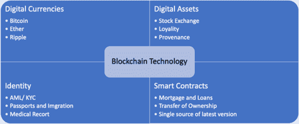 |

区块链技术通常更接近于虚拟货币应用、支付和金融服务。然而，理论上，区块链可以应用于许多不同的领域，尽管这项技术是为了解决比特币的“双重支付”问题而特定开发的。在比特币出现之前，账户持有者通过可信的独立平台进行调解，从而摆脱了对其交易和账户余额的担忧。然而，现在，已经开发出了数字货币的基本技术；这就是所谓的分布式账本技术（DLT）。通过这项技术，不需要机构的信任，因为安全和安全系统是通过基于匿名的参与者网络上的本地化账本的完整性实现的（Natarajan 等，2017）。

去中心化需要比特币区块链提供的普遍共识，这取决于“工作证明”，这是谨慎地开发出来用于基于指定数量的前导零的反垃圾邮件行动。工作证明的生成被称为“挖矿”。在比特币系统中，校准以一种方式进行处理，即在十分钟的时间段内对工作证明进行评估，并且较高的难度得分使协议在同时产生的两个中有效。每个有效的工作证明都会用比特币对“矿工”进行个别报酬（Natarajan 等，2017）。

| 图 2\. 比特币和区块链技术 |
| --- |
| 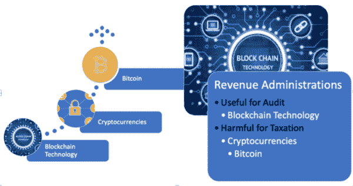 |

比特币是加密货币中最常用的一种。比特币使用区块链技术基础设施。考虑图 2，我们可以看到，比特币使用是区块链技术的四个主要使用领域之一，由于其匿名特性，可能对税收管理造成伤害，因为它可能导致逃税，而区块链通常是有益的。区块链对税务管理的检查和监控有益。考虑到区块链的使用领域，这些可能包括监测增值税和防止转移定价。

区块链，作为 DLT 系统的一种特殊类型，提供了多个数据库之间的数据记录和数据共享。尽管由不同来源收集，但存储的数据是唯一的，因为一个分散但集成的计算机服务器网络保留并检查所有数据以避免重复输入。基于密码学的区块链使用某些数学算法创建或验证数据结构（Natarajan 等，2017）。通过这种密码解决方案，由于基于匿名的网络参与者的本地化账本中的安全系统是完整的，因此消除了信任的机构要求。作为一种机制或数据结构，区块链通过特定方式的密码学和算法技术不可更改地保留数据。这项技术在不同的背景下具有潜力，并且与另一个术语“分布式账本技术”可以互换使用（Natarajan 等，2017）。

在税收方面，区块链技术将导致特别是在欧盟经常遇到的失踪贸易内部社区（MTIC）欺诈的减少（欧洲警察组织，2020 年）。这是欧洲最常见的增值税欺诈形式之一。2018-2021 年欧盟政策周期（https://www.europol.europa.eu/empact）显示了 MTIC 欺诈在九种代表犯罪优先领域之一的犯罪之间的地位。此外，区块链实践还可以防止双重征税和转让定价。Ainsworth、Alwohaibi、Cheetham 和 Tirand（2018 年）基于加密货币开发了一个模型。因此，在税收方面，他们为海湾国家制定了一个“加密货币税收”系统。在这些操作中，VATcoin 将被使用，所有操作都依赖于区块链。在区块链实践中，顾客只需支付账单给企业，企业再将这些账单支付给他们的供应商即可（德勤，2017 年）。通过这种方式，增值税欺诈可以被防止。

区块链技术可以监测增值税的缴纳地点和时间。它为税务管理机构、税务检查员和其他监管机构提供安全的信息流。个人之间的小额交易也变得更加可见。在税务检查方面，区块链技术允许提供更大的优势。毕竟，检查涉及对记录的操作进行证实，需要相关的、安全的、客观的和可确认的证据。区块链将带来积极影响，如实现雇员和雇主之间的税收信心，并增加税收收入的速度（约翰斯顿和刘易斯，2017 年）。在增值税中，一些税收链中的操作可能不再需要区块链实践。

使用区块链收税是税务局运营效率提升的一个因素。这是因为这种方法几乎没有错误。对于收入管理部门来说，采用区块链系统非常有用。在泰国，曼谷收入管理局自 2018 年以来一直在使用这一系统（Uti，2018）。此外，英国也是先锋国家之一（HMRC，2019）。在英国，HMRC 推出了其“数字化税收”项目，旨在到 2020 年废除基于纸张、长时间延后的税务申报。HMRC 将尽可能接近实时地收集和处理影响税收的信息，以防止税款的逐步积累或返还的积累（Asquith，2016）。世界经济论坛已经讨论了各国何时开始使用区块链收税，大多数参与者认为这样的做法将在 2013 年开始（Ainsworth & Shact，2016）。

加密货币和总市值资本

考虑到与区块链技术相连的加密货币，我们发现它们在今天开始被广泛使用。加密货币是由私人开发者电子发行的，用作在特殊账户单位中以交换的代币（Dong He 等，2016 年）。比特币成为了最早和最有价值的加密货币之一。它是一种数字资产，可以在互联网上安全地在两方之间买卖和转移（Nooruddin，2019 年）。像其他加密货币一样，比特币是一种点对点的电子现金机制，可以在现实世界或数字世界中安全支付购买。加密货币开发者使用先进系统构建这些协议，因此，他们使得复制或更改受保护的货币和交易变得困难（Martucci，2018 年）。现在，全球有 2247 种不同的加密货币，所有这些货币的价值，效用和市值各不相同（Coinmarketcap，2019 年）。加密货币交易所在为流行加密货币创建流动市场方面起着非常重要的作用。2019 年，BitPremier 审查并列出了其前 13 名加密货币交易所（BitPremier (2019)）。列表如表 1 所示。

表 1\. 前 13 名加密货币

| 1.Coinbase 2\. Coinmama

3\. Bitpanda

4\. CEX.IO

5\. Kraken

6\. LocalBitcoins

7\. Bitstamp

8\. Gemini

9\. 加密货币对加密货币交易所

10\. Binance

11\. Changelly

12\. Bitfinex

13\. Poloniex |

参考表 2，所有加密货币的总市值约为 1710 亿美元。总体而言，比特币是市场份额的 54.66％，其次是以太坊，仅占 9.7％，瑞波占 7.3％（Prewett 等，2019 年）。

表 2\. 加密货币市值 [摘自 CoinMarketCap.com (2019)]

| 日期 | 加密货币数量 | 市值 |
| --- | --- | --- |
|   2013 | 7 | 15,805,396,30 美元 |
|   2014 | 237 | 60,853,176,10 美元 |
|   2015 | 564 | 35,373,773,49 美元 |
|   2016 | 577 | $8,520,778,723 |
|   2017 | 777 | $29,473,958,605 |
| 2018 | 1563 | $388,027,865,010 |
| 2019 | 2140 | $171,075,254,32 |

比特币（BTC）的特点

比特币通常没有被转换成实物形式的机会，因此它的理想表示方式只是一个计算机文件。一个人可以将比特币虚拟地保存在计算系统上，甚至在互联网上，放在数字钱包中。为了使虚拟字符的组合能够被打印出来，明文比特币字符应该保持合格（Kaplanov, 2012）。

比特币可以通过“挖矿”过程发行，使用 PoW 共识机制。在 PoW 系统中，网络的加入者必须解决所谓的“加密谜题”，才能被允许在区块链上引入新的“块”。如果愿意，他们可以向比特币网络开放并分享计算机以进行疑难解答，其中涉及复杂的数学。成功解决一个这样的问题的计算机将获得比特币奖金（Kaplanov, 2012）。然而，挖矿是创造比特币的一种不良方式。

比特币在一个无需授权的自由区块链上运行，这意味着个人可以随时登录或退出全球网络，而无需由中央机构通知（Houben 等人，2018）。

比特币可以从加密货币转换为法定货币。比特币可以在各种加密货币类型上简单地兑换或购买为法定货币（Houben 等人，2018）。比特币被正式接受为交换媒介或资金来源，受到许多大型金融公司等交易商的青睐（Houben 等人，2018）。比特币是一种伪匿名的硬币。

一个公共账本构成了一个像公证员一样的机构，用于验证链式交易，尽管比特币似乎与个人有直接的自由联系。换句话说，匿名性并非比特币技术的必要属性，即使隐藏在比特币交易中的任何一方也是可检测的，通过合并伴随交易的技术要素（Grinberg, 2012）。比特币在加密货币市场上占据了重要地位，不仅因为其市场份额，还因为其特性的优越性。

**加密货币：优势和劣势**

加密货币有着多重优势，主要是由于其技术特性，包括网络安全、密码学、信任、去中心化和透明度。通过区块链技术，双花问题消失了，该技术将验证权力从一个中心转移到全球网络上。在这方面，数字货币市场建立在用户对传统金融的不信任之上，并且第三方金融机构的权威可能会被其效率上的点对点共识所否定（Schipor，2019；Gerger，2020）。由于在许多国家不对加密货币征税，因此它们不受任何税收减免或税收的约束。此外，由于它们没有中心，因此不需要管理员。在这方面，它们的成本和运营时间都很低。这些操作不受任何人的监控，而且货币的运输、存储和保护都很容易。由于系统安全使用了密码数字签名方法，这阻止了货币被仿冒。由于创建的加密货币数量是固定的，所以它没有遇到通货膨胀或紧缩的风险（Kızıl 2019，Çarkacıoğlu 2016）。由于账户持有人可以保持匿名，数字交易也不需要金融中介，因此加密货币对于恐怖主义行为、贩毒和洗钱等非法操作具有诱惑力，这样犯罪调查人员几乎无法获得信息来抓捕罪犯，因此这些犯罪行为就超出了他们的控制范围（Schipor，2019）。

据 Schipor（2019）指出，加密货币交易所是一个波动性大且有感染力的市场，影响着整个金融系统和全球经济。现在数字交易的成本较低，可以毫无疑问地争论，它可能建立一个跨越一个国家或多个国家的现代支付系统。加密货币可能成为金融系统的主要工具，并且将对金融稳定性构成风险（Carstens，2018）。根据国际清算银行（BIS）主席在欧盟的说法，应采取相关的政策干预，否则，由于加密货币与传统金融系统的整合，金融管理将来不及阻止加密货币可能带来的金融不稳定威胁（Castens，2018）。

比特币通常不适用于其他去中心化虚拟货币，因此，对于该货币的税收存在变化（Ram，2017）。虚拟货币被视为商品进行征税，因为它们与普通货币不同，这一特征可能决定了对消费税（包括增值税）、所得税（包括资本利得）、财产税（包括财富转移）和其他潜在应税项目的征税。不断上升的汇率带来收入和资本收益，尽管没有实际交易，这反过来启动对价值差异的征税。这种情况可能发生在不同情况下，其中多个虚拟货币的汇率甚至在一篮子中发生变化，或者这些货币直接无法兑换为法定货币。此外，减少同样被视为被征税的增加（Ram，2018）。

加密货币存在风险，因为没有国家或国家将作为其担保人。加密货币存在于虚拟环境中，因此，网络攻击可能会影响它。由于它是匿名的，因此可能被用于非法活动。收入税管理部门难以监控。由于加密货币没有法律依据，它们没有常规交易所。这增加了货币的波动性，并使其成为投机者的目标。因此，这导致货币价格的不平衡（Kizil，2019）。

如果我们总体评估加密货币的优缺点，隐私、安全性、速度和易用性使其具有优势，而其容易受到网络攻击、对金融稳定性构成威胁以及在非法经济活动中的使用使其处于不利地位。

加密货币和比特币的税收法规

各国将加密货币视为一种威胁。其中一个最重要的原因是，监控洗钱和资助恐怖主义活动变得困难，税收逃避增加。此外，其他问题可能包括失去印制货币的垄断、剥夺主权收入、可能降低货币政策的有效性、流动性管理变得困难，以及通货紧缩的担忧。因此，各国理所当然地以一定距离对待加密货币（Güven 和Şahinöz，2018）。为了消除这些负面影响，政府要么选择通过发布关于加密货币的法律法规来控制其使用，要么选择完全忽视它们并禁止它们。

在 2018 年峰会上，G20 国家在全球范围内为加密货币概念形成了一幅独特的立法画卷，并制定了一份列出各国加密货币法律地位的清单（《全球加密货币报告》，2018 年）。请参考表 3。

表 3。全球加密货币法律地位[来源于《全球加密货币报告》（2018 年）]

| 中立 | 限制 | 合法 | 非法 |
| --- | --- | --- | --- |

| 阿根廷 塞内加尔

卢旺达

印度

印度尼西亚

牙买加 | 墨西哥 俄罗斯

沙特阿拉伯

韩国 | 澳大利亚 荷兰

智利

巴西

加拿大

法国

新加坡

美国

马耳他 | 德国 南非

西班牙

意大利

土耳其

英国

日本 | 中国 |

欧盟成员国通常在税收问题上交换信息，主要是为了打击逃税行为；然而，当前的欧盟框架受到限制，因为由于加密货币的匿名性，虚拟货币被排除在外（霍本等人，2018 年）。虚拟货币的增长需要适当的监管。

加密货币缺乏中央权威。2017 年初，日本成为第一个承认比特币及其他加密货币为法定货币的国家，通过了虚拟货币法（Terazona, 2017）。国际机构有权制定加密货币的监管规定，但只有少数机构有声明。在 2017 年的 G20 峰会上，全球监管机构进行了国际协调，采取了虚拟货币的风险管理措施。国际货币基金组织（IMF）表示，对比特币实施一定的监管是必要的（Alkhalsi, 2018）。美国、加拿大、以色列、英国、澳大利亚和日本已经发布了关于纳税人投资虚拟货币的指导意见（Bal, 2015）。在欧洲议会，第四次反洗钱指令（AML）于 2015 年 5 月 20 日通过，第五次 AML 指令于 2018 年 5 月 30 日通过。这些指令与虚拟货币的注册有关。欧盟成员国根据欧盟的指令和实施条例调整其国家法律。不同国家的国家法律之间的差异使欧盟国家的虚拟货币市场之间存在差异。芬兰在 2019 年 3 月 13 日接受了第五个欧盟反洗钱指令（EC, 2019）。

AMLD5 定义了虚拟货币和虚拟货币交易的操作，并规定了托管钱包提供商对客户的尽职调查义务，以及向金融情报单位（FIUs）报告可疑交易。 该指令使虚拟货币交易平台和托管钱包提供商对加密货币负责，并因此引入了“虚拟货币”的现象。 当提供商向 FIU 报告加密货币已被生产或平台已实现任何交易时，该机构以“可疑交易”的名义通知税务机关可能存在的逃税行为（Houben 等人，2018 年）； 然后调查这种交易（第 32 条 AML 指令）。

欧盟还准备了一个关键项目（称为钛项目），涉及创新的数据驱动技术和解决方案的研究、开发和验证，以促进负责调查虚拟货币和/或黑暗网上未记录市场的犯罪调查机构。 钛项目旨在数字化打击可能发生在使用加密货币进行虚拟交易的情况下的逃税、洗钱和恐怖主义融资（Keatinge 等人，2020 年）。

根据欧洲银行业监督局，应采用欧盟框架概念（Yeoh，2017 年）。 根据世界银行的描述，加密货币被归类为数字货币，并被称为以电子格式表示的价值代表，在特殊计价单位中以特定面额表示。 此外，该银行还在定义中增加了这些是基于密码学的数字货币用于达成共识（Natarajan 等人，2017 年）。

目前非常常见的加密货币是比特币。由于犯罪分子利用其匿名性质以及虚拟交易中有限的监管框架和执行力度不足，他们被迫进行非法操作（Zola et al., 2019）。比特币交易不向用户收取任何税款。因此，政府希望对希望使用比特币进行交易的公民和企业的组织进行监管。政府应该在其传播中执行反洗钱法规，寻求对其使用征税，并起诉那些将比特币用于非法活动的人（IRS, 2014）。对于虚拟货币交易的税收处理，税务管理机构提供了强有力的指导至关重要（Prewett et al., 2019）。IRS 在 2013 年的年度报告中提到了指导的缺乏。IRS 通知 2014-21 提供了税务机构对比特币和其他加密货币认识的第一手、现行和最佳指导（IRS, 2014）。因此，个人所得税率适用于以比特币换取货物或服务的情况。

当我们看税收比特币收入时，我们看到每个国家的实践不同。根据国家的不同，比特币收入被视为证券、商品或货币，税收也相应进行调整。在美国，比特币销售被视为房地产销售，当一个人想要购买商品时，对销售操作收取资本利得税（De, 2018）。虽然税率在 15%至 23.8%之间，但对于持有期少于一年的人士，税率可能会增加至 39%（Köse, 2018）。在最近的法国，加密货币被视为证券，税率为 45%，但在 2018 年 4 月生效的法规下决定将该税率降至 19%（Zuckerman, 2018）。

加拿大将加密货币视为商品，并对商业收益或增值收益征税，而当商业机构使用时，将其视为易货贸易，当净利润征税时。它们需缴纳企业税和增值税。个人购买和销售所得收入的 50% 免征税收。另一方面，纳税基础按照正常税收制度征税。然而，如果存在短期和连续的购买和销售，加拿大税务管理局将这些活动视为商业活动（Uğurlu，2018）。

澳大利亚将通过加密货币的购买和销售视为易货贸易，并对其征税。公司需缴纳企业税和交易税。对于个人投资者，在加密货币下以不到 10,000 澳元进行的商品和服务购买免征所得税和消费税。自 2017 年 7 月 1 日起，加密货币的购买和销售操作已免除商品和服务交易税（Uçma Uysal 和 Aldemir，2018）。

在英国，使用加密货币进行的操作免除增值税。参与此类操作的人必须支付 20% 的企业税。个人投资者在购买或销售后所获利润需支付资本利得税（Uğurlu，2018）。在韩国，比特币收入适用 22% 的企业税和 2.2% 的地方所得税（Zuckerman，2018）。

透过比特币的税收逃避

收入管理部门受到加密货币的普及所带来的逃税问题的困扰。这是因为人们由于加密货币在非官方经济中的优越性，如匿名性和隐私性，而增加了远距离之间非法交换商品和服务的偏好。此外，如果纳税人不愿这样做，他们可能不会申报加密货币价值的增加。尽管可以监控大笔投资，但基于一个人可以开设任意数量的账户的想法，这些个人可以将非法交易分割成小额交易，以不引起注意。基于此，联邦调查局成功破坏了丝绸之路市场，并逮捕了他们的领导人（Fanusie 和 Robinson，2018）。目前还无法计算由比特币和其他加密货币使用引起的税收损失。加密货币可能被用于洗钱或资助恐怖主义（Güven 和 Şahinöz，2018）。

国际货币基金组织于 2016 年撰写了关于“虚拟货币及其更迭”的报告。报告中指出，加密货币已成为逃税的高度潜在工具。这种犯罪行为的主体主要使用加密货币，因为他们在使用该选项时可以保持匿名，并且由于虚拟交易的点对点特性和国际操作的潜力。这些数字货币根据它们与货币功能的联系而产生税收影响，即作为一种交换手段或一种经济价值存储方式。

应通过对图式结构和微妙操作产生的复杂问题进行深入评估来确定应征税的虚拟货币（VC）交易（IMF, 2016）。区块链实践将使了解您的客户（KYC）和反洗钱（AML）行动既简单又高度实用。借助区块链实践，个人或公司只需进行一次 KYC 操作即可（Güven 和Şahinöz, 2018）。

利用比特币等虚拟货币进行非法活动，并利用区块链技术，比起监控中央货币系统内部流动，将更容易进行监控。这就是为什么重要的是让它普及，而不是禁止它，并允许它在自己的生态系统内发展。例如，在布拉格地铁设置了加密货币 ATM（Konakçı, 2018）。同样，在瑞士，该国最大的铁路公司自 2016 年 11 月以来一直在其全国范围内的售票 ATM 上出售比特币。这样的政策可能有助于将加密货币拉向公共领域，从而使加密货币的监控和检查更加容易（Güven 和Şahinöz, 2018）。

区块链应用降低税收逃漏税问题

区块链使得更快速的数字报告成为可能，并为多个授权方提供独立查看同一笔交易信息的能力，这可能使未来的增值税申报行为更加无缝和高效（Asquith, 2016）。这有助于企业和税务机关更好地控制、简化合规，并避免双重征税（Gerger&Firuzan, 2020）。实施这样一个方案将允许获得各种优势，从而几乎完全消除了税收逃避（Faccia 和 Roxana, 2019），如下所述：

+   • 简化税务义务，降低企业咨询成本，

+   • **具有进行深入和快速税务规划的潜力**，

+   • **每月纳税公司税的潜力，但连接发票开具的税款扣缴。政府还将获得持续的现金流，并能够在生产和国内生产总值监控方面获得巨大优势**，

+   • 在计算利润率时，企业可以轻松考虑与税收相关的成本。他们还可以防止为了降低税收负担而承担不必要的费用，而专注于提高业务效率，

+   • 通过政府降低不可收回的税收抵免，这可以同时验证未支付并防止拖欠公司的活动。基本上，试验性的自我声明系统（所得税申报）将被消除（逃避的诱因）。基于在集中系统中发出的电子发票以及实施在付款中的预扣税的自动化机制将立即验证下个月应支付的税款。

尽管比特币导致了逃税问题，但在所得管理和商业世界中使用区块链应用于税收和会计实践将通过减少税收损失来增加税收合规性。此外，通过允许合法有效地利用技术，区块链应用还将降低税收合规性风险、运营风险和报告风险（Gerçek 和 Bakar Türegün，2018）。

**结论**

加密货币的监管是一个非常困难的问题。因此，扩大它们的使用范围，但进行严格的正确监管，并对使用这些货币进行的操作征收少量税款可能更为适当。禁止或忽视这些货币并不是一个现实的解决方案。这是因为不确定性会带来成本。这就是为什么灰色地带需要被澄清。公共权力机关需要不是过度限制而是平衡。

总的来说，区块链技术对各行各业都具有巨大潜力。因此，近年来，区块链技术已经超越了比特币，在公共和私人领域取得了进展。区块链技术仍然是一个不断发展的领域。许多公司已经开始开发自己的原型技术，以便理解区块链技术。区块链技术允许实时监控和记录数字货币、金融资产和其他数字文档在两个或多个方之间的转移。特别是在公共部门，通过允许输入的中央政府提供的区块链技术可能会使每个人更容易访问系统，并提供安全和隐私原则的实现。

收入管理部门需要针对加密货币普遍规定清晰易懂的法规，尤其是针对广泛使用的比特币。比特币是一种新现象，纳税人中存在着对此存在不准确认知的情况，他们认为在数字货币中进行交易会减轻税收和报告责任。比特币交易在许多国家都是合法的，并且受到税收的征税。此外，收入管理部门还开始采用基于区块链技术建立的税收检查系统。

为了减少税收损失和阻止非法金融活动，欧洲联盟正在开展一项反洗钱计划。人们已经注意到，加密货币的使用可能与非法活动有关。比特币正在被用于恐怖活动、毒品供应或洗钱等问题。通过在税收管理中也使用区块链技术，可能有可能控制这个问题。这样的管理部门已经在使用和发展诸如区块链技术、人工智能、云计算和物联网（Gerger, 2020）等技术来实现上述目标。

参考文献

AinsworthR.AlwohaibiM.CheethamM.TirandC. (2018), 解决 MTIC 欺诈的 Vatcoin 方案: 过去的努力、现在的技术和欧盟的 2017 年提议。波士顿大学法学院，法律与经济系列论文第 18-08 号。SSRN: https://ssrn.com/abstract=3151394

Ainsworth, R., & Shact, A. (2016). 区块链（分布式分类帐技术）解决增值税欺诈。SSRN。10.2139/ssrn.2853428

Alkhalsi, Z. (2018). IMF 主席: 加密货币监管“不可避免”。https://money.cnn.com/2018/02/11/investing/lagarde- bitcoin-regulation/index.html

Asquith, R. (2016). 区块链如何塑造税收自动化？https://www.avalara.com/vatlive/en/vat-news/how-Blockchain-could-shape-tax-automation.html

Bal, A. (2015). 比特币交易: 最新的税收发展和监管回应。https://www.ibfd.org/sites/ ibfd.org/files/content/pdf/dfi_2015_05_int_2.pdf

BitPremier. (2019). 加密货币交易所评论。https://www.bitpremier.com/best-exchanges

Çarkacıoğlu, A. (2016). 《加密货币比特币》. 资本市场委员会研究部。

Carstens, A. (2018). 数字时代的货币: 央行扮演什么角色？在金融之家的讲座，哥特大学。https://www.bis.org/speeches/sp180206.pdf

Çetin Gerger, G., & Bozdoğanoğlu, B. (2017). 在非正式经济和偷税逃税背景下对电子商务征税问题的评估。《公共部门经济学问题》，Peter Lang。

Chandrasekaran, N., Somanah, R., Rughoo, D., Dreepaul, R. K., Cunden, T. S. M., & Demkah, M. (2019). 通过利用区块链技术、人工智能、机器学习和深度学习的数字转型。在 Satapathy, S., Bhateja, V., Somanah, R., Yang, X. S., & Senkerik, R. (Eds.)，《信息系统设计和智能应用》。智能系统与计算（第 863 卷）。Springer。doi:10.1007/978-981-13-3338-5_25

CoinMarketCap. (2019). 所有加密货币。https://coinmarketcap.com/all/views/all

德国不会对您用比特币购买咖啡征税。https://www.coindesk.com/germany-considers-crypto-legal-equivalent-to-fiat-for-tax-purposes/

Deloitte. (2017). 区块链技术及其在税收领域的潜力。https://www2.deloitte.com/content/dam/Deloitte/pl/Documents/Reports/pl_Blockchain-technology-and-its-potential-in-taxes-2017-EN.PDF

EC. (2019). 紧急情况对应欧盟反洗钱指令第三国黑名单的迫切性。https://www.europarl.europa.eu/doceo/document/TA-8-2019-0216_EN.html

欧洲警察组织（Europol）。 (2020). 经济犯罪。https://www.europol.europa.eu/crime-areas-and-trends/crime-areas/economic-crime/mtic-missing-trader-intra-community-fraud

Faccia, N., & Mosteanu, R. (2019). 偷税 _ 信息系统和区块链。《信息系统与运营管理杂志》，13(1)，65-74。

Fanusie, Y. J., & Robinson, T. (2018). 比特币洗钱：对数字货币服务的不当资金流的分析。https://www.fdd.org/analysis/2018/01/10/bitcoin-laundering-an-analysis-of-illicit-flows-into-digital-currency-services/

Gerçek, A.，& Bakar Türegün, F.（2018）。公司税收风险感知和税收风险管理的研究。《会计与税收实践杂志》，11（3），307–332。doi:10.29067/muvu.368807

Gerger, A.（2020）。实施连接的政府技术：成功因素和最佳实践。在 Z. Mahmood（Ed.），为实施连接的政府而设计的 Web 2.0 和云技术。IGI Global。

Gerger, A.，& Firuzan, A.（2020）。基于田口方法的汽车行业案例研究：使用六西格玛方法减少不合格品。《应用统计学杂志》，1–17。在线提前发表。doi:10.1080/02664763.2020.1837086

Grinberg, R.（2011）。比特币：一种创新的替代数字货币。《黑斯廷斯科学与技术法律期刊》，4，164。[链接](https://papers.ssrn.com/sol3/papers.cfm?abstract_id=1817857)

Güven, V.，& Şahinöz, E.（2018）。区块链 - 加密货币 - 比特币。中本聪正在改变世界。克罗尼克出版社。

He, D.，Habermeier, K.，Leckow, R.，Haksar, V.，Almeida, Y.，Kashima, M.，Kyriakos-Saad, N.，Oura, H.，Saadi Sedik, T.，Stetsenko, N.，& Verdugo Yepes, C.（2016）。虚拟货币及其未来：初步考虑。IMF 工作人员讨论笔记，16（3），1。在线提前发表。doi:10.5089/9781498363273.006

英国税务局（HMRC）。（2019）。个人的加密资产税。[链接](https://www.gov.uk/government/publications/tax-on-cryptoassets/cryptoassets-for-individuals)

Houben, R.，& Snyers, A.（2018）。加密货币和区块链。[链接](https://www.europarl.europa.eu/cmsdata/150761/TAX3%20Study%20on%20cryptocurrencies%20and%20Blockchain.pdf)

IBINEX。（2019）。全球加密货币市场报告。[链接](https://www.financemagnates.com/wp-content/uploads/2018/10/Global-Cryptocurrency-Market-Report.pdf)

国际货币基金组织（IMF）货币与资本市场、法律和战略与政策审查部门。（2016）。虚拟货币及其未来：由 IMF 工作团队准备的初步考虑。[链接](https://www.imf.org/external/pubs/ft/sdn/2016/sdn1603.pdf)

IRS. (2014). **虚拟货币指南**：**虚拟货币**在**美国联邦税收**中被视为**财产**；一般的财产交易规则适用。**IRS**。https://www.irs.gov/uac/newsroom/irs-virtual-currency-guidance

Johnston, S., & Lewis, A. (2017). **新的前沿**：**税务机构**探索**区块链**。**Tax Notes International**，86(9)，16-19。https://www.taxnotes.com/tax-notes-international/tax-system-administration/new-frontiers-tax-agencies-explore-Blockchain/2017/04/03/18884661

Kaplanov, N. M. (2012). **书呆子货币**：**比特币**，私人数字货币，以及反对其监管的案例。**Temple Law Review**。https://papers.ssrn.com/sol3/papers.cfm?abstract_id=2115203

Keatinge, T., Carlisle, D., & Keen, F. (n.d.). **虚拟货币**与**恐怖主义融资**：评估风险和评估应对措施。**Citizens 政策部门**委托的研究。https://www.titanium-project.eu

Kızıl, E. (2019). **土耳其**‘de **加密货币**‘ın **税务处理**和会计处理。**Mali Çözüm**，29(155)，179–196。

Konakçı, A. E. (2018). **布拉格地铁系统**现在拥有 10 台**比特币 ATM**！https://koinbulteni.com/prag-metro-sistemi-artik-10-bitcoin-atmsine-sahip-19118

Martucci, B. (2018). **什么是加密货币**：工作原理，历史及**比特币**的替代品。https://www.moneycrashers.com/cryptocurrency-history-bitcoin-alternatives/

Matonis, J. W. (1995). **数字现金**和**货币自由**。**经济笔记** No. 63。http://libertarian.co.uk/lapubs/econn/econn063.pdf

Natarajan, H., Krause, S., & Gradstein, H. (2017). **分布式分类账技术（DLT）**和**区块链**。**金融科技**笔记，编号 1。http://documents.worldbank.org/curated/en/177911513714062215/pdf/122140-WP-PUBLIC-Distributed-Ledger-Technology-and-Blockchain-Fintech-Notes.pdf

Nooruddin, S. (2019). **关于区块链的一切**。**Vieh Group**。

Prewett, K., Dorsey, R. W., & Kumar, G.（2019）。**对加密货币投资的税收初探**。《投资税务杂志》，36（4），3。检索于 2020 年 4 月，来自 http://search.ebscohost.com/login.aspx?direct=true&db=edb&AN=138241160&site=eds-live

Ram, A. J.（2018）。**对比特币的税收：通过对应分析初步洞察**。《Meditari 会计研究》，26（2），214-240。http://www.emeraldinsight.com/doi/10.1108/MEDAR-10-2017-0229

Schipor, F. G.-L.（2019）。**加密货币市场的风险与机遇**。奥维迪乌斯大学年报，经济科学系，19（2），879–883。http://search.ebscohost.com/login.aspx?direct=true&db=obo&AN=142315464&site=eds-live

Terazono, E.（2017）。**比特币在日本获得官方认可**。https://www.ft.com/content/b8360e86-aceb-11e7-aab9-abaa44b1e130

Uçma Uysal, T., & Aldemi̇r, C.（2018）。**数字公共财政管理系统和区块链技术**。《会计与税收实践杂志》，11（3），505–522。doi:10.29067/muvu.415066

Uğurlu, M.（2018）。**加密货币的发展和税收问题**。https://coin-turk.com/kripto-paralarin-gelisimi-ve-vergisel-konular

Uti, T.（2018）。**曼谷的税务局将使用区块链技术防止逃税**。https://Blockchainreporter.net/bangkoks-revenue-department-will-use-Blockchain-technology-to-prevent-tax-evasion/

White, A. K.（2018）。**区块链：探索智能合约、钱包、挖矿和加密货币的技术**。CreateSpace 独立出版社。

世界银行集团（2017）。**金融科技笔记 No:1，分布式账本技术（DLT）和区块链**。作者。

Yeoh, P.（2017）。**区块链技术的监管问题**。《金融监管与合规杂志》，25（2），196–208。doi:10.1108/JFRC-08-2016-0068

Zuckerman, M. J. (2018). 韩国将对加密货币交易所征收 24.2%的税，符合现行税收政策。[链接](https://cointelegraph.com/news/s-korea-to-tax-crypto-exchanges-242-percent-in-line-with-existing-tax-policy)

附加阅读

Bal, A. (2015), 如何征税比特币？[链接](http://scitechconnect.elsevier.com/wp-content/uploads/2016/01/Chapter-14-%E2%80%93-How-to-Tax-Bitcoin.pdf)，访问时间为 2020 年 4 月。

Çetin, G. (2010). Bilişim Teknolojilerindeki Gelişmelerin Vergilemede Kayıt Düzeni ve Denetim Uygulamalarına Etkisi. Ekonomi Bilimleri Dergisi.2(1). ISSN: 1309-8020 (在线). 2012 年 9 月 3 日检索，网址为 http:// www.sobiad.org/eJOURNALS/dergi_EBD/ arsiv/2010_1/09gunes_cetin.pdf

Çetin Gerger, G. (2019). 税务服务及税务服务提供商在物联网和环境中的变化角色。在 Mahmood, Z. (主编)，指南：物联网环境中的环境智能。Computer Communications and Networks. Springer. doi:10.1007/978-3-030-04173-1_9

ECB. (2012), 虚拟货币方案，[链接](https://www.ecb.europa.eu/pub/pdf/other/virtualcurrencyschemes201210en.pdf)，访问时间为 2020 年 4 月。

欧洲委员会. (2016), 数字经济与社会指数（DESI），可在 www.ec.europa.eu/digital-single-market/en/desi 获取，访问时间为 2020 年 3 月。

Francesco, Z. et al. (2019), 比特币与网络安全：对区块链数据进行时间分析以揭示实体行为模式的变化。Applied Sciences 9.23, 5003.

Köse, B. (2018), 比特币价格下跌的原因可能是税收，[链接](https://uzmancoin.com/bitcoin-vergi-2/)，访问时间为 2020 年 4 月。

Nakamoto, S. (2009), [比特币：一种点对点的电子现金系统](https://bitcoin.org/bitcoin.pdf)，访问时间为 2020 年 5 月。

关键术语和定义

**反洗钱**：反洗钱（AML）指的是一组旨在防止犯罪分子将非法获得的资金伪装为合法收入的法律、法规和流程。

**比特币**：这是指去中心化和最受欢迎的虚拟货币，可以在点对点的比特币网络上从用户发送到用户，而无需中间人。

**区块链**：它是一种分布式账本形式，分布在多台计算机上，用于维持数字资产交易信息的永久和防篡改记录。

**加密货币**：一种使用加密方法来调节货币单位的生成和验证资金转移的数字货币，独立于中央银行的运作。

**KYC（了解您的客户）**：KYC 相关实践在与企业的用户和客户关系中尤其相关。这是客户与公司建立良好关系的第一步。

**工作证明**：在 PoW 系统中，网络参与者必须解决所谓的“加密难题”，才能被允许将新的“区块”引入到区块链中。

**纳税遵从**：纳税遵从意味着纳税人通过及时准确地缴纳税款来遵守税法和法规。

**逃税**：它指的是任何犯罪行为或任何可由民事处罚惩罚的不诚实行为，旨在降低或不支付税款。

# **第六章**

# **区块链在网络安全中的视角**：

**应用和未来发展**

+   **穆阿特·A·奥贝达特**

    **纽约市立大学犯罪研究中心，美国**

+   **约瑟夫·布朗**

    **纽约市立大学，美国**

**摘要**

近年来，区块链作为一种流行的数据结构，已经在软件解决方案中得到了广泛应用。然而，它的迅猛崛起也并非没有受到批评。由于其结构特性，主要是永久性和去中心化，区块链一直是网络安全领域的热门话题。然而，这一领域的区块链技术也受到了严格审查，并引发了一些问题，比如，区块链在该领域的应用仅仅是一种局部趋势还是投资者的诱饵，两者都没有希望带来永久性的游戏改变解决方案？以及区块链是否是一种会导致网络安全持续颠覆的架构？本章旨在中立地概述为什么区块链在网络安全领域崛起为一种流行的转折点，以及其在该领域的当前应用，并评估鉴于其局限性和优势，该技术未来的发展前景。

介绍

作为一种新兴技术，区块链已成为许多领域的讨论和实验的关键点。其中之一就是网络安全领域——一个快速发展、不断变化的行业，不断受到不同规范的影响。区块链技术并非仅仅出于网络安全的考虑而出现，而是作为一种在维护用户信任的同时去中心化数据的手段。然而，随着区块链的名声日益响亮，其用途扩展到了学术界和商业领域，在这个过程中，它也迅速在网络安全领域得到了发展，因为其固有特性，常被引用为不可变性和去中心化。

网络安全是一个领域，其要求的演变速度比其组成行业更频繁。随着其他技术规范的同时演变，网络安全必须以相对的速度演变，以确保对这些规范的安全性或替代方案。为了遵循技术不断变化的规范以及对安全性的改进和便利性的不断追求，网络安全仍然是一个不断发展的领域。随着新的架构和协议进入公众意识，这些概念总是会进入网络安全讨论和研究的范畴。这些概念能够被利用来提高安全性吗？这些概念对该领域有什么影响？其中一个概念就是区块链。区块链讨论和研究的激增在很大程度上是由对创新的渴望以及已被视为标准的改变后的物流网络安全结构所推动的，比如客户端-服务器或第三方认证模型。区块链与历史架构和安全方法论形成对比，因此为研究人员和企业带来了对未来的一些新希望，而其他人则对其适用性持怀疑态度。

在任何领域引入被认为是开创性或改变游戏规则的元素，都会带来自身的问题。这些元素并非孤立存在，而是伴随着对创新、知名度或吸引投资关注的普遍追求，而不关心所提出解决方案的完整性。在过去几年里，区块链已经从一个曾经引人好奇的概念转变为软件、计算机科学和网络安全领域的重要讨论点。区块链的普及程度呈指数级增长引发了激烈的讨论；一些声音声称区块链是填补历史领域前所未有差距的通用解决方案，而另一些人则认为区块链只是一种过时的潮流。如上所述，尤其在网络安全领域，区块链一直是一个敏感但又有争议的话题。

本章旨在调查区块链在当前网络安全领域的地位，并评估其未来在该领域可能存在的情况。本章的组织分为以下三个部分。第一部分概述了区块链的特点，就其在网络安全领域的优势以及可能提出的实施限制和责任进行讨论。第二部分以第一部分为跳板，讨论和评估了当前在网络安全领域内最受关注的区块链应用。第三部分讨论了区块链对网络安全领域的未来影响；它既讨论了区块链创造了哪些可能在未来仍然有影响的机会，也讨论了区块链为网络安全创造的可能会产生的问题。

区块链的特点

区块链在网络安全等垂直领域的使用通常依赖于区块链的核心架构特征，而不是对其功能的更为间接的推演。研究和私人公司提出的区块链在该领域内的可能用途包括数字身份管理，包括数字签名，这是数据结构固有功能的直接派生物。区块链通常具有五个核心架构特征：去中心化、不可变、匿名、密码学加密和基于信任。这些元素在网络安全领域中都有各自的推演（Yeasmin, 2019; Yassein, 2019）。简要解释如下：

+   • 去中心化指的是区块链网络内部节点之间的通信结构。这在一定程度上取决于所部署的区块链类型，这将在下面的章节中讨论。一般来说，去中心化通常意味着没有中央机构来分配权限和存储。

+   • 不可变性通常是指数据保持完整性且一旦存储就无法修改的保证；这是通过账本之间对数据的共同约定在区块链中实现的。

+   • 通过区块链的去中心化特性，部分地促进了匿名性。由于没有中央机构，身份仅通过其通信而不是其身份来区分。由于区块链通常建立在非对称加密之上，身份是基于密钥而不是个人可识别信息的。需要注意的是，区块链促进的匿名性并不意味着缺乏身份，而是缺乏公开的中心化身份。存在的身份与密钥相关联，而不是与个人相关联。这种区别是智能合约存在的基础。从理论上讲，区块链应用可以通过为密钥分配身份来消除匿名性，但这将通过中间件实现，而不是通过区块链本身的内在功能实现。

+   • 密码加密是不言而喻的，因为区块链是建立在账本存储和客户端之间的非对称加密之上的。账本中的数据被加密，而相应的客户端拥有解密所需的密钥，并管理自己的数据。

+   • 基于信任的特性略微复杂一些。信任是指在更广泛的网络中，管理数据的权威之间行动的整体完整性和合法性。根据区块链结构的不同，建立信任的方式也不同；用于促进访问控制的“证明”机制是信任的基础。

虽然这些特征可能与网络安全中的基本概念重叠，但研究人员一直在努力解决的一个突出问题是区块链的不精确性质。由于它的广泛使用和来自各种来源和用途的非对称、去中心化部署，很难普遍地将任何非理论特征视为标准。这种缺乏标准化基础意味着，在一个像网络安全这样的具体领域（在这个领域中，标准化的信息、结果和可靠性与适用性相关），区块链很难以一致的方式开发解决方案或进行一致的研究。这导致了研究中的强烈细微差别，反过来又引发了对一般分类的强烈社会愿望，以进一步评估可访问性和适用性（Yassein，2019）。

区块链本身的架构并不是单一的；账本结构有不同的类别，如可见性的性质，或用于保证信任的算法。因此，某些架构并不适用于所有给定领域中的所有应用程序，有些比其他的更适合。已经进行了深入的研究，以证明区块链的适用性，既适用于更广泛的区块链概念，也适用于不同架构之间的差异。这被称为区块链适用性框架。在这个框架中，通过对比应用程序的功能与各种变量，来确定其生态系统如何（或不能）仅适用于区块链本身，而且还适用于区块链的个别分类（如公共或私有）。它分为私有）。它被分为五个领域：数据和参与、技术属性、安全、信任参数以及性能/效率。每个领域由多个子领域构成，它们自身围绕上述变量结构化，以确定给定系统的需求（Gourisetti，2019）。

区块链架构

区块链的   区块链的推演因账本结构而异。尽管某些元素在分类中可能有所重叠，但某些类型的区块链更适合于特定的应用程序，这取决于个体生态系统的需求。

区块链的类型

有三种主要类型的区块链，每种都有其独特的结构。这些包括公开、"联盟"和私有。参见图 1。在公开区块链中，账本中的每个节点都参与验证，因此创建了一个分散的数据结构。公开区块链是无需许可的，每个节点都具有平等的参与权。这种类别的区块链通常部署在每个节点被视为平等的生态系统中，最流行的是加密货币。在联盟区块链中，存在分布式权限，与公开版本不同。因此，它在一定程度上是中央化的；然而，这创造了一个更安全的环境，因为获准的节点允许相对安全的功能。因此，信任过程不是普遍相互的，而是获准的。最后，私有区块链是完全中央化的区块链。这些区块链是严格许可的，通常由中央组织保留。某些功能，如读取或写入权限，由中央偏好控制。然而，由于中央集权的结果，数据不能保证完全完整性；因此，在某些环境中可能会发生数据篡改，这可能会根据区块链的目的提出问题（Yeasmin, 2019; Gourisetti, 2019; Yassein, 2019）。

| 图 1. 区块链架构可视化；从左到右依次为：公开、联盟、私有。 |
| --- |
| 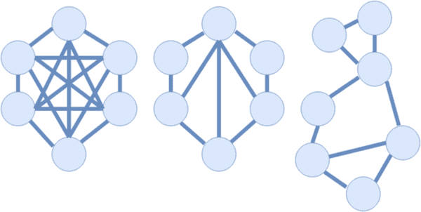 |

共识算法

正如上文所述，区块链是建立在节点之间信任的基础上的。在给定网络中，信任是网络安全中任何部署系统的最重要特征之一。为了建立信任，区块链架构实施了称为共识算法的内部方案，这些算法是节点在更广泛的架构中进行通信的基本蓝图。有各种不同的算法可以使用，选择一个算法而不是另一个通常依赖于所讨论的区块链的功能性和类别。因此，选择正确的算法，就像选择正确的区块链类别一样，对应用程序的功能至关重要。这些算法用于促进可靠的数据完整性以及在节点之间分配访问控制。共识算法有三种流行的版本：工作量证明、股权证明和权威证明。在工作量证明算法中，通过挑战创建迭代块，这些挑战难以创建，但易于验证。因此，节点必须努力创建一个证明，从而创造一个几乎不可能修改的块的环境，并以迭代链的方式工作。在股权证明算法中，信任被分配。节点通过提供其在系统中的股份的相对比例来竞争被选中为有效。然后选定的节点验证交易是否有效。权威证明作为股权证明的修改版本；除了竞争验证外，节点的身份本身在竞争验证时也被置于风险之中。

因此，有限节点在任何给定时间都会维持批准权威。需要注意的是，这些不是唯一的共识算法；至少有十几种其他流行的共识算法被各种区块链应用所采用。其他形式的共识算法可能包括燃烧证明，这是一种通过烧掉节点系统中的一部分份额来证明权限的算法。然而，上述三种算法通常是更广泛可推断讨论中最常见的（Yeasmin, 2019; Gourisetti, 2019）。

信任因素

正如上文所述，信任是区块链可用于促进的最重要因素之一。这在一定程度上解释了为什么区块链在信息安全领域如此受欢迎。信任可以通过集体、基本的信息安全概念——机密性、完整性和可用性来最容易地定义。研究表明，五个主要因素支持这些操作：1）利用加密算法提供隐私，2）通过不对称或基于身份的算法进行身份验证，3）通过存储和哈希签名确保数据的不可变性，4）使用数字操作（如签名或证书）来保证不可否认性，以及 5）可检查的退化，或者关于任何给定事务操作规范的可呈现证据。这五个因素通过随时间可验证的交易来建立信任的持续基础（Gorog, 2018）。

通过区块链交易实施的信任也可以分为五类：抑制、验证、可靠性、驳斥和剥夺。区块链可以通过实现这些类别来培养信任；这样做，区块链不仅可以提供不可变性，还可以提供可追溯性，这一点在某些领域中会否定区块链的地位（Gorog, 2018）。

智能合约

这是区块链架构的另一个重要方面。类似于匿名性和加密是区块链固有特性的派生特征，智能合约是区块链固有特性身份管理和积分数据存储的派生特征。它是预先嵌入到架构的交易结构中的协议。它们允许在各方之间进行永久、不可变的协议，然后加密存储在区块链分类账上（Yeasmin, 2019; Abbas, 2019）。这些合约发生在分类账上的节点之间，并促进了保证交易以及两个方之间签名的永久性。这个特性与“数字签名”有关，数字签名是区块链架构的另一个方面，它满足了网络安全领域的一个重要需求。数字签名与身份管理有关，并允许一个节点 - 假设由一个一致的实体持有 - 签署交易。它最常见地通过非对称加密来实现（Huynh, 2019）。

当前的网络安全范式

网络安全的目标可以简要总结为管理风险和保护资产。一个流行的子类别，信息安全，可以概括为三个方面：数据的保密性，完整性和可用性（Andriole，2020）。研究人员指出，由于对技术依赖程度的指数增长，对创新网络安全工具和协议的需求增长了。由于区块链的及时存在和流行，它已经成为提议的网络安全白皮书和研究中的流行标志。然而，一些人仍然在问，区块链是否已经证明自己是一个值得如此关注的关键概念？一些学者以及商业人士说可能现在下结论还为时过早，但区块链的初生状态可能预示着未来类似于云计算和基于云的解决方案的先前崛起的流行爆发（Andriole，2020）。

区块链在网络安全领域的潜在影响力仿效了它在更广泛的私营业务部门中的地位。由于其对投资者的吸引力和流行趋势，区块链大多被提议作为解决领域内未解决问题和填补差距的解决方案，而不考虑其在该子类别内的实际可行性。这也是未经证实的理论的结果；许多提倡区块链的商业提案和研究并未提供概念验证或部署解决方案，而只是以可量化的模糊理论存在。然而，话虽如此，这并不意味着区块链不能单独成为网络安全领域中有用的工具，除了上述情况也是真实的。已经有四种特定的区块链用途被更普遍地宣传为可推断的特性：数据的完整性和保密性除了人为监督，先前讨论的数据不可变性和节点之间的互通性，用户使用的可扩展性以及用户身份的永久性（Sharma，2019）。

应用确定性

随着方案的爆炸性增长，出现了一个需要确定区块链是否真正需要的解决方案的需求。先前的研究建议了一个评估新兴技术应用的四步骤过程，在其中区块链将被纳入考量。这些步骤包括：1）技术的背景，2）技术的潜在影响，3）试点演示识别，以及 4）计划的演示开发（Andriole，2020）。在网络安全领域，许多区块链应用在第三步阶段就陷入了停滞；关于区块链的理论影响以及其作为新兴技术的特征以及局部领域内的理论应用的讨论非常丰富，但许多理论尚未在实际演示中体现出来。在商业领域，有更多的区块链技术演示，但许多演示尚未完全推广到使这些演示比当前传统方法更实用的程度。

加密货币与代币

谈论区块链当前的应用现状而不讨论加密货币以及加密货币在网络安全中的位置是不可能的（Mohanta, 2019）。虽然加密货币不是与网络安全固有相关的话题，但是由加密货币引入的概念的推导在该领域中找到了一定程度的整合 - 或至少是讨论。这在某种程度上受到了以太坊平台智能合约等功能的推动（Polvora, 2020）。除了智能合约之外，这样的推导还包括基于相对代币持有的权限策略和/或访问控制的想法（Polvora, 2020）。这种讨论在很大程度上受到了 ICO 的影响，即“首次代币发行”，这是加密货币生态系统的初步投资轮次，类似于公开公司的股票发行。其中的想法包括分布式代币持有，这又与应用生态系统中的相对访问控制或权限有关。由于代币被不可变地持有于与特定身份相关联的钱包中，因此这种身份的所有者可以被认为具有明确的相对控制权（Polvora, 2020）。尽管处于早期阶段，但这些技术仍然在一定程度上得到了一些概念验证。虽然在白皮书中或在初期阶段至少在小规模上已经有了一定程度的工作证明，但仍然存在着各种问题的担忧，例如通过间接手段（如钓鱼或其他方式）威胁到身份的风险更高，以及其他更典型的担忧，例如之前讨论过的区块链网络的限制，在这里仍然适用。

区块链与云计算

| 图 2\. 云计算的可视化 |
| --- |
| 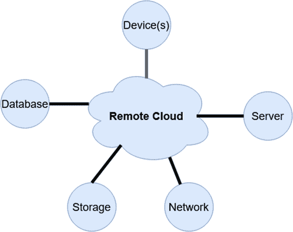 |

区块链已经被广泛地与云计算进行了比较。有关云分布式计算的虚拟化，请参考图 2。在过去的十年里，基于云的安全解决方案在流行度上显著增长，并且已经针对类似领域中的相似解决方案。然而，与区块链不同的是，云计算解决方案有时会放大狭窄的漏洞，甚至可能会创建新的攻击面，例如集中式数据存储或共享访问控制。区块链已被提议作为一种解决方案，用于将更加集中化的云计算结构替换为分散式架构，并进而消除漏洞。这并不意味着区块链是完全无法渗透的，而是相对于简单的云计算解决方案，攻击面大大减少；这部分是因为大多数区块链架构的实施中缺乏单一的入口点（Kshetri，2017）。

**网络安全解决方案与讨论**

目前区块链的应用，无论是在网络安全领域还是在更广泛的领域中，都很难进行全面评估，这反过来导致对其使用的分段评估。这是因为当前的设计差异很大，因此使得实施、部署和维护都变得困难。与许多当前系统不同，区块链相对年幼的阶段以及其对高水平复杂技术知识和复杂设置要求的需求使其更难被广泛采用（Vance，2019）。这引发了问题，特别是在网络安全领域，对自己所从事的工作有着明确的了解至关重要。尽管该领域对创新的渴望持续存在，但在业内，先例在专业人士中也非常重要，而区块链的使用缺乏大规模的先例对其采用的推广造成了不利影响。然而，这并不意味着没有成功的测试案例或概念验证，仅仅是因为缺乏历史性的使用证明其在更传统的实施和架构上的有效性，因此区块链在网络安全中的广泛应用受到了陌生和体面的限制。

区块链与物联网

尽管区块链的普及度爆炸式增长，但在两个网络安全领域，信息安全和物联网（IoT）安全领域，它受到了特别的指数级兴趣。在这两个子类别中，区块链对物联网的创新关注尤为严重。这是由于两个主要因素造成的——物联网的相对初期阶段，因此它的时机性流行与区块链的流行相交，以及目前物联网标准化和安全措施的缺乏（Obaidat，2019 年；Obaidat，2020 年）。信息安全也一直是一个热门类别；尽管这是因为该领域与区块链的特点之间存在动机上的重叠，即数据完整性和可用性（Ahram，2017 年）。在物联网网络安全讨论范围内，区块链的存在是双重的：物联网的本质可以说既支持又与区块链架构相冲突。一方面，区块链带来的标准化身份管理、数据不可变性和点对点验证的需求完美地适合物联网设备和软件的设计结构。另一方面，区块链的指数资源使用，特别是与物联网设备有限资源相对比时（Obaidat，2019 年；Hassebo，2018 年；Khodjaeva，2019 年），是一个重大障碍。尽管这是一个障碍，但并未完全阻止可能的解决方案出现；许多理论已被提出以规避这个问题，并在回报中维持区块链的好处，其中一个例子就是“轻链”（Doku，2019 年）。关于区块链如何影响物联网领域的具体细节已经零散并在提案和研究之间差异很大。一些想法包括将物联网设备作为独立的认证节点，并通过智能合约促进所有此类通信以保证有效性并跟踪交易（Kshetri，2017 年）。

物联网与区块链的交集引发了一场关于平整整合的激烈辩论。物联网漏洞的严重性以及它们的普及性已导致此类研究被加快推进（Obaidat，2019）。许多初创公司已经开始发布关于在物联网系统中使用区块链的白皮书和原型。像 IBM 这样的大型企业已经对此产生了兴趣，并已开始为供应链提供区块链服务。这些企业间的便利推动了区块链成为产业层面讨论的议题。已经提出了基于区块链的协议，用于部署依赖无线通信的工业系统的安全措施。区块链用于验证来源之间的身份已成为依赖于来自一组有效实体的通信的设备的重要讨论点（Kshetri，2017）。然而，物联网和区块链提案的交集并非没有问题；取决于区块链实施的基础设施，这将由区块链类型确定，可能存在隐私问题，考虑到物联网设备之间收集和传输的大量数据。关于此类物联网设备交互的问题已经引起了很大的关注，但尚未达成共识，特别是考虑到行业内缺乏标准化。区块链与物联网的整合并不本质上解决这些问题，并可能由于其基于账本的分布结构而引发新问题。解决这个问题的可能方案包括将个别私有区块链连接到更广泛的公共区块链的分层网络，分布式的细粒度访问控制。然而，这些体系结构大部分尚未经过测试。区块链还被提出作为物联网设备的管理平台，基本上是作为管理数据、建立永久身份和特权令牌化的中间件（Ali，2019）。

API 功能的促进

区块链的网络安全功能绝不仅限于物联网设备；作为非物联网数据管理平台的区块链也已经作为另一种流行的手段进行了单独测试。由于其基于节点的结构以及其不可变的性质，区块链已被用作简化用户管理的平台，特别是与基于云的应用相关的用户管理。这有助于促进访问控制，以及加强用户身份验证方法和实施单点登录功能。区块链还通过其他方法系统地提出，其中之一是“API 方法”，在这种方法中，区块链充当 API 以促进其他功能，而不是作为一个功能性平台。其中一些用途包括 DevOps、云集成和数据分析，特别是针对应用程序、企业和广告（Ahram，2017）。如前所述，这可能会反映出云平台的特性。已经大量比较了云计算和区块链平台的方面。研究注意到，一些云平台遵循“零信任”安全模型，并且，类似于区块链，完全采用了加密交易模型。区块链作为一个大部分是去中心化的模型（除了修改过的架构，如联合体），确实缺乏云计算允许的分段控制方案，比如管理员监督。然而，区块链可以说是更好的身份管理和数据不可变性，但代价是客户节点由于这种不可变性而承担了更严重的后果。然而，使用当前技术，入侵区块链节点将会变得更加困难，因为攻击将仅限于暴力破解或客户端劫持，这两种攻击的成功率远低于中间人、伪装或重放式攻击。但是，这两种模型仍然容易受到基于人为错误的攻击，如钓鱼或社会工程学（Kshetri，2017）。

给定上述对区块链功能的评估，不难看出大多数当前的区块链应用与当前的云计算应用相比较。然而，两者之间存在细微差别，这些差别可能会影响哪种更适合一个应用（或用户/企业，反之亦然）来利用。云计算依赖于具有物理基础设施的第三方，而区块链通过分布式账本实现去中心化，但可能通过第三方供应商进行促进。这些选项可能适用于不同的公司：一些公司可能希望借助第三方进行有效性监督，而另一些公司可能希望消除中间人。同样，物理基础设施可能适合某些公司，而基于账本的不可变性可能更适合其他公司。区块链和云计算非常相似，但并非在所有方面都相同。例如，尽管两者在权限控制方面都存在细微差别，但区块链可以被选择为无权限操作，而在大多数云计算范式下，这将是一种风险。两者之间的其他差异，如加密级别，将由各个组织根据目标和供应商规格进行评估。然而，两者仍然面临挑战；云计算是一个不太新的、更成熟的标准，而区块链仍然面临早期实施问题，例如缺乏安全机制。从理论上讲，两者都面临着资源管理问题，尽管原因不同——区块链是由于交易和账本大小所需资源的指数增长，而云计算是由于存储和速度的有限硬件资源（Kshetri, 2017）。

身份管理

| 图 3\. 数字签名和签名验证过程的可视化 |
| --- |
| 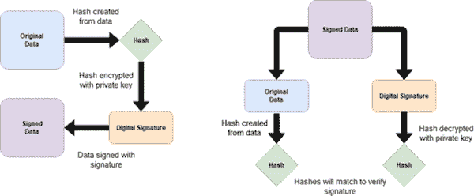 |

另一种区块链的功能性用途是便利数字证书和签名，这是其架构固有的吸引人的特点。参见图 3。因此，它的实现已经简化，但尚未大规模部署。许多私营公司已经开始开发或推出了相关解决方案，但由于创新的竞争，这些竞争品牌很大程度上互相挤出了更广泛的可访问性。然而，像 Facebook 或 Twitter 这样的大品牌也已宣布了他们自己的区块链解决方案的倡议，其中一些解决方案与不可变身份管理和签名的需求相交叉（Ahram，2017）。数字认证的流行应用承诺了一种取代公证的功能，并暗示着取代无形资产的基础设施，如版权或许可证，以及公共和私人记录的存储，并利用智能合约来实施仲裁和实际合同。目前许多这些实践的实施留下了系统容易受到数据篡改或盗窃的问题；区块链解决方案承诺通过增加机密性和完整性来增强存储和交易的网络安全标准。许多私营公司已经采纳了这些想法，但尚未走向主流，进一步受到严肃考虑（Alexander，2019）。

其他应用

区块链的进一步部署包括电子邮件和端点安全。当前电子邮件服务和协议的不安全性已经成为多年的问题；区块链被提议作为一种替代方案，并且与许多主张不同，它已经得到了概念验证测试的支持。由于不可变的交易记录和身份不可否认，区块链已经成为电子邮件的分散解决方案。当前消息真实性的问题，即钓鱼和欺诈电子邮件目前的来源，可以通过实施区块链系统来消除。另一方面，端点安全与区块链在物联网安全方面的流行交汇相关。大多数物联网设备缺乏端点安全措施，因此需要有效的措施。区块链被提议作为一种解决方案，主要是因为基于区块链的架构的攻击受到了区块链的分布式架构的削弱，尤其是如果使用数据验证节点。与电子邮件类似，针对此问题也已经部署了用例，并显示了有希望的结果（Vance，2019）。

在上述应用中使用区块链的优势在实现之间有一定的细微差别，但除了去中心化之外，还提供了一些适合某些目的而不适合其他目的的优势；其中包括节点之间的信任、本地-远程同步、不可更改数据的可用性以及跨节点同步。在需要个体节点之间通信的应用程序中，或者依赖同步的应用程序中，区块链已成为重要的讨论焦点。这在其在物联网中的流行程度中非常容易看到，但也适用于其他领域，比如希望在不依赖于集中式数据库的情况下同步客户端的领域。仍然需要一定程度的信任认证的点对点通信客户端发现区块链是一个合适的解决方案。然而，对于更大的对等网络，区块链的资源消耗和扩展性能问题仍然是一个令人沮丧的劣势（Yassein，2019）。

功能挑战

除了区块链部署之间的不一致性外，学术界对区块链能力的讨论还涉及其他广泛讨论的问题，特别是在安全性和隐私方面。区块链架构存在的问题包括在权限和完整性/数据一致性之间取得平衡，由用户在分类帐网络中的比例控制，以及操作和大小的指数增长。在保密性与区块链的连接性之间取得平衡也一直是一个问题。区块链的不可变性也可能成为一个双刃剑，因为用户或组织的错误会导致问题。如前所述，区块链分类帐的指数成本和大小也一直是一个巨大的问题，即使对于企业组织也是如此（Yassein，2019）。

已经提出了各种解决这些限制的方案，例如进一步部署加密技术，以及实施新的数据结构（Yassein, 2019）。区块链的初期和缺乏标准化在许多这些限制中扮演了催化剂的角色（Ahram, 2017）。区块链不仅本身是一个复杂的系统，而且不适合“即插即用”的开发风格。这是一个潜在的缺点，有两个原因。首先，作为一个相对新生的架构，区块链因为尚未得到证实而阻碍了许多人的采用。然而，缺乏采用反过来意味着相对于更容易测试的传统方法而言，缺乏广泛安全机制被测试或开发。区块链复杂而意图大，分散的本质使得概念验证难以在低密度或测试环境中评估（Kshetri, 2017）。然而，随着区块链作为一种架构的成熟，预计许多这些问题将得到解决，特别是当它吸引更多的学术关注进行研究时（Ahram, 2017; Kshetri, 2017）。

常见攻击和威胁

| 图 4\. 区块链中“多数”攻击的示例，恶意区块超过原始区块，因此覆盖它们。 |
| --- |
| 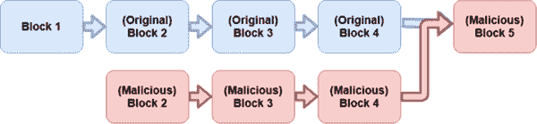 |

由于区块链网络固有特征的存在，还存在各种攻击。像在图 4 中所示的“多数”攻击，仍然是许多网络的问题，这可能发生在一个节点控制了给定环境中大多数股权的情况下。类似地，“自私挖矿”一直是一个问题，挖矿者参与在私有分支上创建区块，然后只有在该链比公共网络更长时才向公共网络广播，从而取代它们（Abbas，2019；Huynh，2019）。分布式拒绝服务（DDoS）攻击也是对区块链网络的威胁。这可能发生在一个不诚实的节点使用大量其他节点试图压倒区块链总账簿上的请求时（Huynh，2019；Oksiiuk，2020）。

值得注意的是，虽然区块链增强了身份验证措施，由于其永久性和促进数字签名和身份管理的完整性，区块链上身份的不可变状态也带来了自己的担忧。虽然身份验证强度在一定程度上取决于加密实施的强度，但还存在着与非区块链对应物相比更令人担忧的相关性漏洞。主要的，网络钓鱼和社会工程学对区块链身份验证造成的风险比其他身份验证程序更大。这是因为在区块链上身份的不可变、永久性的特性；如果有关身份的信息受到损害，根据区块链实施的性质，它可能会永久受损（Oksiiuk，2020）。

限制

区块链在“大数据”应用中经常被提及，但却存在一些通常被忽视的限制。首先，区块容量是一个很大的限制。更广泛的区块链实施具有较低的区块容量，而更大的区块可以存储更多的数据，但会导致重大的性能和扩展性问题。另一方面，较小的区块是可靠的，但显然限制了实际记录的空间。其次，因为区块链是一个分布式账本，大型区块链的存储机制通常不考虑账本被复制到所有用户端的情况。当然，这取决于实施方式：一些实施方式可能通过使用供应商或仅仅是简单地为用户提供对区块链的访问而不是分发客户节点来规避这一点。尽管如此，这仍然是一些实施方式的问题；虽然这些数据是加密的，但它仍然会使数据暴露于数据挖掘和其他攻击，具体取决于账本是如何被访问的。这也意味着攻击者可能会在账本中存储永久恶意数据（戴，2017 年）。

未来轨迹和讨论

区块链的未来仍然不明朗；这项技术光明灿烂，仍然受到很多关注和投资，但也受到尚未得到解决的限制和担忧的困扰，尽管它们不断地受到学术辩论的审查。未来区块链在网络安全领域的应用很大程度上取决于区块链在更广泛技术领域中的突出程度。私人和公共（政府）实体都已委托进行企业实施的研究，但许多这样的研究仍然，如前述，局限于理论化或小规模测试，而不是大规模部署。未来区块链可能发光的大多数网络安全影响要么是信息安全衍生功能，要么是在交易实体之间促进信任的便利性（Gorog, 2018）。

对于未来区块链可能走向的两种情况，研究大体上可以分为两派。一种立场是乐观地看待在公共、共享层面上整合区块链，取代许多实体间通信的基础（Aggarwal, 2019）。另一种则是更为悲观的观点，要么将区块链视为一时的风潮，要么提出目前对区块链应用架构的限制足以阻止它在未来进一步普及。从前一观点派生的许多讨论并不一定认同区块链构成这种功能的可能性。当涉及将区块链与合同、金融交易或其他共享活动等概念整合时，不太会有太多关于是否可以进行这种整合的争论，而更多地是关于是否应该这样做（Aggarwal, 2019）。对于这些概念如何实施，技术上有很多共识，但从组织角度来看，关于这些应用可以部署在何种现实措施下的共识较少。

命题与框架

研究表明，未来区块链的公共实施必须是开放的、透明的和可审计的，以避免由于架构的本质而可能产生的担忧。大多数关于区块链在网络安全和在某种程度上更广泛领域的未来的研究表明，该架构最强大的承诺来自于其促进去中心化的能力，以及无需任意权威的互相去中心化验证（Oksiiuk，2020）。这样未来的区块链实施可能不仅仅局限于使用公共架构，而且将不得不密切关注根据其应用需求的个别区块链分类中的注意事项。例如，寻求更好的隐私保护和更好性能的应用更有可能依赖于联盟区块链模型（Cai，2018）。然而，需要注意的是，未来，使用前述的“区块链适用性框架”将是至关重要的。不正确的区块链应用可能导致不仅性能降低，而且安全风险增加。

开发去中心化应用是一项利润丰厚的举措，需求量大，但也带来了独特的挑战。它需要额外的审查，而区块链可能无法完全自给自足地处理。特别是在处理企业的信任和资产时，去中心化应用必须被全面评估为安全。这意味着架构的各个部分 - 共识算法、区块链的类别，甚至是应用程序的独立结构 - 必须都受到严格的安全和性能指导（Cai，2018）。未来，区块链在这方面的机遇可能不仅仅是作为利用区块链的创新，而更可能是作为基于区块链构建的创新，垂直地旨在使区块链的利用对用户、商业或政府企业更加可访问和/或安全。

区块链即服务(Blockchain-as-a-Service)

| 图 5. 服务基础设施的比较。 |
| --- |
| 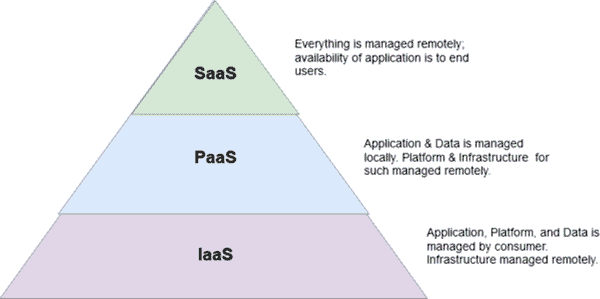 |

未来的区块链实现可能会复制当前云服务提供商的使用方式。如图 5 所示，正如基于云的网络安全应用程序作为服务提供一样，随着 SaaS（软件即服务）、PaaS（平台即服务）和 IaaS（基础设施即服务）模型的兴起，研究表明，未来的区块链可能会普及区块链即服务（Andriole，2020）。这个概念与之前提到的区块链与云计算的比较密切相关；服务模型的相似性和专注解决方案也在这方面产生了相似之处。然而，与云计算不同，供应商将促进访问而不是提供托管。这与当前的云计算模型略有不同，因为供应商还要负责平台核心基础设施的实际维护。虽然核心功能取决于部署的区块链类别和共识算法，但在这种进化的模型中，供应商只需充当提供对账本访问的前端，最多只能在应用层上对数据进行适度处理，而不是区块链的基础数据结构。一些研究指出，点对点生态系统和承包商（“零工”）平台的崛起可能同样受到区块链实现的支持。这是因为架构的身份管理功能以及去中心化结构、加密货币和代币的实现，以及最重要的智能合约功能。这样的实现可能会模仿“即服务”基础设施（Fraga-Lamas，2019）。

区块链作为基础设施

正如先前讨论的，关于区块链在取代和/或辅助基础架构方面的讨论很多，例如确保实体间合同的完整性和可用性，或为投票提供安全基础（Aggarwal，2019）。虽然目前大多数这类提议还没有实际大规模应用，但调查和委托研究指出，区块链可以被用作安全保障政府级基础设施需求的网络安全工具；多个政府已经委托进行了这方面的研究，包括英国针对能源基础设施、美国用于官员之间的安全国内通信和身份认证，以及澳大利亚用于保障“智慧城市”内部实体间通信的安全（Vance，2019）。区块链还被提议作为一种保障选举免受恶意影响的手段；提议指出，区块链将通过身份验证来增强风险降低，并增加数字化速度，同时将基础设施交互降至最低（Alexander，2019）。在政府层面上，区块链不仅被提议用于民用交易，还被提议用于基础设施层面上的交易系统。例如，将区块链整合到电网中可能允许交易记录的许可、可追溯和不可改变，从而提供比目前常见的纯集中式机制更高的安全性。智能合约被提议在基础设施问题上有着广泛的用途，既像之前提到的电网一样，也适用于其他社会需求，如现场设备或发电机（Li 等，2019）。

在其他地方，区块链一直在讨论基础设施手段的讨论中持续存在，通过确保信任和网络安全来实现复杂能源交易和数据交换的提议（Mylrea，2017）。研究人员指出，许多电网不仅是集中化的，而且连接性以及当前过时的技术手段使得能源电网以及相关的电气基础设施极为不安全。随着城市朝着智慧城市的愿景迈进，保护基础设施变得越来越重要，因为新的攻击向量变得可用。区块链创建去中心化的“能源物联网”的能力通过分散化漏洞使得对基础设施网的系统性攻击变得更加困难。智能合约的使用也可能增加韧性并更可靠地跟踪基础设施内的能源交易。研究人员指出，区块链的整合还将帮助确定系统内的异常实体或交易，并允许更加流畅地交汇基础设施需求，例如电力和数据报告。这些想法已经在测试基地小规模测试，但尚未推广应用于大城市。就像其他专业的大规模理论一样，这些概念通常被困在一个无法部署的状态，因为缺乏证据，但也因为它们需要大规模部署才能创造出这样的证据（Mylrea，2017）。

专业用途

新的机遇经常出现，比如最近在汽车经济领域提出的那些（Fraga-Lamas，2019）。将区块链融入汽车技术领域与智能汽车经济的最近崛起相交汇。术语“智能汽车”不仅适用于自动驾驶汽车：它适用于任何具有用于数据处理的车载技术的汽车。许多新型汽车配备了车载计算机，其中一些至少部分依赖于基于云的信息。鉴于在汽车中嵌入了计算机系统，安全性是汽车的首要任务，因此对网络安全的需求就产生了。汽车网络安全可能适用于不同的分类，不仅包括传统分类，防止网络攻击，确保云信息的可靠性和有效性，还包括新功能，如确保零件的有效性和防范伪造以及保护生产过程的完整性。研究表明，区块链可以通过基于区块链的证书防止伪造；同时，通过使用智能合约可以促进生产过程中的完整性。区块链可能为智能汽车带来的其他好处，本质上模仿了区块链为其他集成带来的好处，即通过加密、标准化和去中心化实现信息的完整性和安全性（Narbayeva，2020）。

区块链是否能满足其他更专业的目的仍未确定。尽管区块链的机会散落，但大量研究已经致力于这些更专注的领域，正如前文所见。与将区块链作为保障公共活动基础的考虑类似，集成问题的大部分并不在于如何或为什么，而在于是否。调查研究发现了区块链的许多益处，毫无疑问，会有持续的讨论，尤其是在物联网缺乏其他标准的情况下。鉴于区块链在这些狭窄实施理念方面的优点和广泛讨论，有很多理由对其未来持乐观态度。然而，非技术因素，如业务考虑，在这方面也必须考虑进去（Ali，2019）。

开放式研究和当前挑战

如前所述，如果区块链要作为大规模可访问的架构部署，未来的区块链实现仍然面临各种尚未解决的障碍。其中最重要的包括区块链的可扩展性不足——不是用户规模的问题，而是处理交易和消耗资源的问题。此外，区块链中存在一些隐私问题，例如源自账本公开性质的隐私问题。研究还表明，引导启动可能会对区块链应用构成问题，尤其是与大型商业企业文件和框架相关的问题（Sharma，2019）。可访问性在技术上受到限制；区块链的可访问性也必须在用户派生级别上得到改善。正如评估部分所述，区块链在其发展、部署和维护的复杂性围绕下使其在采用方面受到了阻碍。网络安全领域的专家们认为，由于对采用的度量和概念的具体理解至关重要，区块链应用的未来将取决于其开发用户友好的适应性（Vance，2019）。

性能

以前讨论过的区块链的许多限制，特别是在性能和指数资源使用方面，仍然是未来广泛采用的严重问题。虽然个别实施可能由于其范围而不会发现这些限制，但许多将区块链视为解决方案的公司产品和学术研究都打算大规模部署。目前，这些问题通常在广泛范围内发生，并引起许多组织和客户的担忧，否则他们可能会倾向于采用这些创新措施。直接采用区块链以及进一步讨论尚未完全受到这些问题的阻碍。原因在于人们对解决这些问题产生了极大的兴趣，但进展仍然受到了显著的拖累。许多人得出结论，在区块链可以在普通公众和个人私营部门中实现最高网络安全性之前，这些问题必须得到解决（或者，至少在某种程度上得到解决），因为它们超越了区块链带来的其他好处（亚历山大，2019 年）。这些担忧也延伸到了许多更专注的实施想法，这些想法将区块链作为解决方案，例如先前讨论的物联网，因此这些可能是区块链需要克服的一些最大障碍，即使在这些狭窄的鸽子洞内也是如此（阿里，2019 年）。

用户识别

虽然先前已经讨论过，区块链平台的去中心化，以及因此而加强的匿名措施，可能是未来的优势，但这是一把双刃剑。匿名性也意味着缺乏可追踪性，这在考虑通过区块链促进非法活动时可能是一个担忧。由于网络安全也涉及进攻性战术而非仅仅是防御性，区块链架构可能会阻碍执法部门执行关于非法交易的法律；或者，由于数据的永久性，阻碍或删除在线非法材料的传播可能性也可能受到影响（Oksiiuk, 2020）。

可访问性和传播

特别是在网络安全领域，区块链实施的未来，与其依赖于用户可访问性的并行发展，也将严重依赖于讨论该概念的研究质量。学术界已经注意到，关于区块链的说法是棘手的。例如，区块链被称为数据不可变的名声，但也容易受到多数或 51%攻击的影响，使数据可以被修改。这引发了对于这些概念是否被充分理解和合理传播给研究人员、开发者、政府和商业人士的担忧。例如，关于区块链完全不可变的说法存在当前的不一致，因为这些攻击的存在。尽管如此，这些说法仍在持续地被宣传（Vance, 2019）。

与前述话题一样，可以基本确定，考虑到目前区块链的状态以及对某些观点的共识，区块链的未来将在于专业化实现，而不是作为构成历史方法和基础的系统的替代品。这并不意味着区块链在为这些系统实现中不提供理论上的优势；相反，这种可行性可能主要限于理论而非实践。然而，这也不是最终结论，而是对当前区块链及其实现状况的评估，指出它们具有高度不稳定性（Fraga-Lamas，2019）。

适用性

在许多这些新机遇中实施的好处通常与其他类似系统提出的好处重叠。例如，我们之前讨论过将区块链用作进一步技术标准化社区活动的基础的可能用途（Fraga-Lamas，2019）。即使在这些专业系统中，许多这些重叠，如上述汽车集成的解释中所见，通常都归结为相同的基础设施优势和限制；这些包括标准化、身份管理和信息安全优势，以及可扩展性、复杂性和维护等方面的限制。鉴于许多这些好处明显重叠，很难断定区块链实际上是否有益于个别领域，还是该领域只是吸收了区块链的性质。换句话说，讨论往往集中在“这在区块链上如何运作？”而不是“这如何从区块链中受益？”因此，区块链的模糊泛化和好处更多地成为区块链的特征，而不是个别领域的改进特征。重要的是要注意，这不一定是普遍适用的；像物联网这样的领域已经对区块链实施的目的和个性化好处进行了更为确切的讨论。然而，从更广泛的泛化角度来看，这又回到了“区块链适用性框架”的早期提及。问题通常不是区块链的哪些特性可以与应用集成，而是应用是否从区块链中受益足够，使其集成变得值得。

开放研究和辩论摘要

总结起来，目前区块链领域的研究挑战通常可以归纳为六个类别（Mohanta，2019）：

+   • 在更广泛的可扩展性方面的分布式系统的效率

+   • 在不影响可用性和网络安全性的情况下，在区块链的架构中正确分配信任和/或权限。

+   • 指数资源使用

+   • 智能合约设计的通用性

+   • 在区块链网络上进行任务调度

+   • 随着网络规模呈指数增长，节点之间数据的有效验证变得效率高。

还存在其他讨论的挑战；然而，区块链的复杂性及其相对年轻（Fraga-Lamas，2019），以及之前提到的网络攻击的存在（Oksiiuk，2020），导致了这样的复杂性。最后，区块链本身对某些功能的适用性是否优于其他功能仍然存在争议，因此讨论了适用性框架的存在（Gourisetti，2019）。

结论

区块链是一种令人兴奋的相对新颖的架构，它在公共和私人领域都引起了极大的兴趣，特别是在网络安全领域可能的地位。然而，尽管有大量提议的创新和讨论，但对于更广泛的实施未来可能会如何仍然没有共识。无疑，有大量的研究和理论认为区块链的未来是光明的。然而，这些有前途的实施受到当前限制的限制，对于如何解决这些限制尚无共识，例如可扩展性和指数资源使用。专业化的领域，特别是在狭窄用途中，例如物联网安全，显示出区块链作为应用结构的最有前途的地方。

研究人员大多同意，区块链的未来在很大程度上取决于其架构能否适应希望采用它的企业的需求。虽然对于区块链采用可能带来的安全优势存在广泛的共识，但对其缺点或者对其实施的复杂性和维护特别是在广泛范围内的问题，已经成为了其在网络安全领域进一步渗透的障碍。正如本章所讨论的，区块链的普适性优势已经引发了关于区块链的实际好处的讨论，而不是区块链的使用是否真正适合应用，或者区块链本身是否只是具有某些特质，应用采用了它后会相应采用。这些讨论已经导致了为确定是否真正需要区块链而开发的框架的产生。有些人可能会说，围绕区块链的兴奋部分地模糊了其采用，因为通过其对几乎所有形式的网络安全漏洞提出更广泛的提议，其实施更适合的专业部门受到了较少关注。

尽管区块链持续受到广泛关注，但其在网络安全中的地位仍然不确定。尽管该架构的优点是毋庸置疑的，但其整合建议引发了各种的实际和理论问题。最重要的是，问题出现在：仅仅因为可以整合区块链，就应该整合吗？区块链的利益是否超过了复杂性和缺点？遗憾的是，对这些问题没有通用答案。相反，答案很大程度上取决于具体应用的个体因素。就像更广泛的网络安全领域一样，无论区块链固有的好处可能是什么，部署的个体细节和注意事项都比所谓集成本身的好处更具决定性作用。因此，毫不奇怪，区块链提出的穷尽可能最明显的集成方案，是那些源自专门系统的集成方案，比方说物联网。这些系统之所以使用区块链并非仅因为区块链的特征，而是因为这些系统的本质与区块链架构提供的结构和功能相交。

REFERENCES

Abbas, Q. E., & Sung-Bong, J. (2019). 区块链及其应用的调查. 2019 年人工智能与信息通信国际会议(ICAIIC), 1–3\. 10.1109/ICAIIC.2019.8669067

Aggarwal, S., Chaudhary, R., Aujla, G. S., Kumar, N., Choo, K.-K. R., & Zomaya, A. Y. (2019). 区块链. 网络和计算机应用杂志, 144, 13–48\. doi:10.1016/j.jnca.2019.06.018

Ahram, T., Sargolzaei, A., Sargolzaei, S., Daniels, J., & Amaba, B. (2017), 区块链技术创新. 2017 年 IEEE 技术工程管理会议(TEMSCON), 137–141\. 10.1109/TEMSCON.2017.7998367

Alexander, C. A., & Wang, L. (2019), 基于区块链的网络安全、信息保障和大数据。2019 SoutheastCon，1–7。doi:10.1109/SoutheastCon42311.2019.9020582

Ali, M. S., Vecchio, M., Pincheira, M., Dolui, K., Antonelli, F., & Rehmani, M. H. (2019). 区块链在物联网中的应用。IEEE 通信调查与教程，21（2），1676–1717。doi:10.1109/COMST.2018.2886932

Andriole, S. J. (2020). 区块链网络安全。IT 专业人员，22（1），13–16。doi:10.1109/MITP.2019.2949165

Cai, C., Duan, H., & Wang, C. (2018). 教程：构建安全可信的区块链应用，2018 年 IEEE 网络安全开发。SecDev。doi:10.1109/SecDev.2018.00023

Dai, F., Shi, Y., Meng, N., Wei, L., & Ye, Z. (2017), 从比特币到网络安全：区块链应用与安全问题的比较研究。2017 第四届国际系统与信息学会议（ICSAI），975–979。10.1109/ICSAI.2017.8248427

Doku, R., Rawat, D. B., Garuba, M., & Njilla, L. (2019). LightChain：物联网轻量级区块链。2019 IEEE 智能计算国际会议（SMARTCOMP），444–448，10.1109/SMARTCOMP.2019.00085

Fraga-Lamas, P., & Fernandez-Carames, T. M. (2019). 区块链综述。IEEE Access：实用创新，开放解决方案，7，17578–17598。doi:10.1109/ACCESS.2019.2895302

Gorog, C., & Boult, T. E. (2018). 通过区块链连接信任解决全球网络安全问题。2018 IEEE 物联网国际会议（IThings）和 IEEE 绿色计算与通信（GreenCom）和 IEEE 网络、物理和社交计算（CPSCom）和 IEEE 智能数据（SmartData），1425–1432。10.1109/Cybermatics_2018.2018.00243

Gourisetti, S. N. G., Mylrea, M., & Patangia, H. (2019). 区块链的评估与演示。IEEE 工程管理交易，1–15。doi:10.1109/TEM.2019.2928280

Hassebo, A., Obaidat, M. A., & Ali, M. (2018). 商用 4G LTE 蜂窝网络支持物联网新兴应用程序。机电技术及其应用国际会议，作为阿联酋迪拜科学与工程技术多会议（ASET）的一部分。

Huynh, T. T., Nguyen, T. D., & Tan, H. (2019). 区块链技术安全与隐私问题综述。2019 年国际系统科学与工程会议（ICSSE），362–367。10.1109/ICSSE.2019.8823094

Khodjaeva, M., Obaidat, M. A., & Salane, D. (2019). 通过使用公钥密码学外包计算来缓解物联网中 RFID 的威胁和漏洞。在物联网环境中的安全、隐私和信任。Springer-Cham。

Kshetri, N. (2017). 区块链隐私。电信政策，41（10），1027–1038。doi:10.1016/j.telpol.2017.09.003

Li, Z., Bahramirad, S., Paaso, A., Yan, M., & Shahidehpour, M. (2019). 区块链。《电力杂志》，32（4），58–72。doi:10.1016/j.tej.2019.03.008

Mohanta, B. K., Jena, D., Panda, S. S., & Sobhanayak, S. (2019). 区块链隐私。物联网，8，100107。doi:10.1016/j.iot.2019.100107

Mylrea, M., & Gourisetti, S. N. G. (2017). 用于智能电网韧性的区块链：以速度、规模和安全交换分布式能源。韧性周。doi:10.1109/RWEEK.2017.8088642

Narbayeva, S., Bakibayev, T., Abeshev, K., Makarova, I., Shubenkova, K., & Pashkevich, A. (2020). 区块链技术。交通运输研究论文集，44，168–175。doi:10.1016/j.trpro.2020.02.024

Obaidat, M. A., Khodjaeva, M., Obeidat, S., Salane, D., & Holst, J. (2019). 物联网的安全架构框架。IEEE 第 10 届无处不在的计算、电子和移动通信会议（UEMCON），154-157。doi:10.1109/UEMCON47517.2019.8993096

Obaidat, M. A., Obeidat, S., Holst, J., Al Hayajneh, A., & Brown, J. (2020, May). 互联网物联网：安全与隐私挑战，安全框架，启用技术，威胁，漏洞和对策的综合系统调查，于《计算机期刊》。MDPI，9，44。

Oksiiuk, O., & Dmyrieva, I. (2020). 区块链技术的安全与隐私问题。2020 年 IEEE 第 15 届无线电电子技术、通信技术和计算机工程高级趋势国际会议(TCSET)，1–5。10.1109/TCSET49122.2020.235489

Pólvora, A., Nascimento, S., Lourenço, J. S., & Scapolo, F. (2020). 区块链。《技术预测与社会变革》，157，120091。doi:10.1016/j.techfore.2020.120091

Sharma, M. (2019)，区块链与网络安全：工作机制，应用领域和安全挑战。2019 年第 2 届智能计算、仪器与控制技术国际会议(ICICICT)，1，1182–1187。10.1109/ICICICT46008.2019.8993204

Vance, T. R., & Vance, A. (2019). 区块链时代的网络安全：基于区块链技术的关键基础设施保护调查。2019 年 IEEE 国际科学实践会议信息通信、科学技术问题(PIC S&T)，107–112。10.1109/PICST47496.2019.9061242

Yassein, M. B., Shatnawi, F., Rawashdeh, S., & Mardin, W. (2019). 区块链技术：特点，安全和隐私；问题和解决方案。2019 年 IEEE/ACS 第 16 届国际计算机系统与应用会议(AICCSA)，1–8，10.1109/AICCSA47632.2019.9035216

YeasminS.BaigA. (2019). 发挥区块链的潜力。2019 年国际电气与计算技术应用会议(ICECTA)，1–5。10.1109/ICECTA48151.2019.8959713

额外阅读

Hasanova, H., Baek, U., Shin, M., Cho, K., & Kim, M. (2019). 区块链网络安全漏洞及可能的应对措施调查。国际网络管理杂志，29(2)，e2060\. doi:10.1002/nem.2060

Zhang, X., Li, R., & Cui, B. (2018). 基于区块链和移动边缘计算的 VANET 安全架构。2018 年第一届 IEEE 国际热信息中心网络会议（HotICN）。10.1109/HOTICN.2018.8605952

**关键术语和定义**

访问控制：通过对谁或/和什么可以查看、维护和使用系统中的个别资源进行规范的网络安全基本概念。

可用性：一种网络安全原则，指出授权用户不仅应该能够按需访问系统，还应该能够执行所需的任务和数据交易。

云计算：一种分布式计算方法，使用远程服务器网络来远程提供、管理、存储和处理数据，而不是使用本地系统。

保密性：一种网络安全原则，规定只有那些应该能够访问某些数据的人才能够访问。

加密货币：一种基于区块链的数字货币资产系统，其中数字货币存储在分布式账本中，并且单位通过受到强大保护的加密手段生成。

端点安全性：一种保护系统网络的方法，依赖于参与网络的桥接设备的安全性。

不可变性：数据在源中存在的能力，同时保持定义和无可争议的完整性，以便连接的系统可以在传输此类数据时不出错。

完整性：一种网络安全原则，规定数据应该被确保是准确的且没有被任何未经授权的实体篡改。

物联网（IoT）：连接在互联网连接的计算机和嵌入在日常系统中的处理器之间的设备的互联网，这些设备接收和传输数据。

点对点（P2P）：一种网络连接方法，其中网络分布在互连的节点之间，这些节点共享资源，没有中央来源，因此在传统的客户端-服务器模型之外进行协调。

交易：至少涉及两个系统或参与者之间的事件，参与实体发送和接收一系列信息。

# 第七章

# 区块链和加密货币：

法律和伦理考虑

+   Neha Mason

    澳大利亚查尔斯斯图尔特大学

+   Malka N. Halgamuge

    

    澳大利亚墨尔本大学

+   Kamalani Aiyar

    澳大利亚查尔斯斯图尔特大学

摘要

在金融交易中，像比特币这样的加密货币利用去中心化、可追踪性和匿名性功能来执行交易活动。利用新兴的区块链技术，这些数字货币正在形成世界上最大的未受监管市场的基础。这带来了各种各样的监管挑战，包括非法购买毒品和武器、洗钱和资助恐怖活动。本章分析了各种法律和伦理影响，它们的影响以及目前政策制定者和监管机构面临的固有问题的各种解决方案。作者提出了对 30 篇最近发表的同行评议科学出版物的分析结果，并提出了各种机制，可以帮助检测和预防当前占加密货币交易相当比例的非法活动。他们提出了未来也可以用来识别黑市场的方法和应用。

引言

近年来，加密货币交易已成为全球现象。这些是去中心化的匿名虚拟货币，不需要任何中央机构的中央控制（Nakamoto，2019）。加密货币可以适应新兴数字经济中的挑战，并用于资金筹集，同时通过众筹和点对点技术平台吸引社区（Tschorsch＆Scheuermann，2016）。因此，加密货币凭借区块链技术的使用，自 2012 年左右以来，市场交易量和价值方面的迅速增长成为新闻头条（Tschorsch＆Scheuermann，2016）。

加密货币的第一个倡议是白皮书，该白皮书于 2008 年以中本聪的化名发布。它结合了区块链技术、去中心化、有限供应和完美匿名的理念，为第一种被称为比特币的虚拟货币铺平了道路（Nakamoto，2019）。区块链已被应用于大多数商业模型，包括供应链（Alvarado＆Halgamuge，2019）、多媒体（Shrestha 等，2020）、金融和医疗保健。2010 年，像 WordPress、Microsoft 和 Expedia 这样的商家开始接受比特币作为支付方式，这导致比特币被认可为一种正式货币。

随着比特币的流行，加密和去中心化货币的理念出现了，并出现了第一种替代加密货币。这种货币被称为“Altcoin”，它专注于通过提供诸如更高的速度和匿名性等优势来改进原始的比特币设计。因此，这个时期对于像 Namecoin 和 Litecoin 等货币的新创企业变得有吸引力。

毫不奇怪，作为一种设计时考虑了缺乏控制和匿名性的货币，比特币被证明是犯罪分子的一项有利可图且有吸引力的目标。例如，在 2014 年 6 月，一个名为 Mt. Gox 的比特币交易所停止运营，使所有者损失了近 75 万比特币。这个案件仍在调查中，因为它导致了总估计损失 4 亿美元。由于这样的原因，许多国家禁止了像比特币这样的加密货币的使用，因为他们担心它们会被用于非法目的，如参与黑市交易（Fraser & Bouridane 2017; Kshetri & Voas 2017; Toyoda et al. 2017; Van Der Horst et al. 2017; Meiklejohn et al. 2013; Chadha & Kumar 2017）。

通过滥用伪匿名和使用区块链交易，很容易对比特币进行误用。此外，已经发现了比特币用于恐怖主义资金和洗钱的证据（Kshetri & Voas 2017; Toyoda et al. 2017; Van Der Horst et al. 2017; Chadha & Kumar 2017; Liu, Chen, et al. 2017）。因此，政府机构需要与其他机构如银行和其他金融监管机构合作，制定法律框架并跟踪加密货币交易，以将其纳入税收范畴。

大多数数字货币是不受监管的。一些国家将其视为合法，而另一些则完全禁止了它们的使用。例如，在中国，加密货币的使用是被禁止的，甚至在中国申请首次代币发行（ICO）都被视为非法活动。已将其纳入其金融体系的国家面临着与税收和非法活动增长相关的问题（Kshetri & Voas 2017; Toyoda et al. 2017; Van Der Horst et al. 2017; Meiklejohn et al. 2013; Chadha & Kumar 2017）。因此，需要制定适当的立法（Shehhi et al., 2014）。

基于此背景，本章尝试通过使用各种相关技术来分析数字货币的法律和道德影响，以填补现有的空白。

| 图 1\. 加密货币使用的法律和道德影响概览 |
| --- |
| 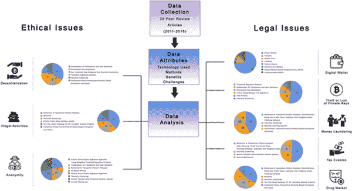 |

然而，到目前为止，人们对加密货币的使用还很少讨论。大多数加密货币文章只关注比特币，并且没有任何一项主要研究描述了通过区块链交易使用加密货币的法律和道德问题。本章试图提供对加密货币使用中各种问题的一瞥，并提出缓解这些问题的方法和技巧。

作为数字化和虚拟化的加密货币也导致了暗网市场的增长。因此，黑市运作的方式已经转变为利用这些加密货币的黑市电子商务。诸如 FBI 之类的执法机构仍在调查和追踪利用加密货币作为非法活动中的货币转移方式的罪犯。我们章节中提出的解决方案是通过分析 30 篇科学同行评审的文章，包括各种作者提出的技术和解决方案，来讨论这一主题的法律和道德方面。根据分析，大多数研究人员只观察到一两个加密货币使用中的问题；然而，在我们的章节中，我们分析了更多的问题，并提供了实用可行的建议。还调查了可以用来缓解这些问题并追踪这些交易背后的罪犯的应用程序。

另一个重要的研究空白是关于追踪那些将加密货币作为货币交易支付方式的人的监管。这是由于加密货币的匿名性质所致。因此，在追踪涉及洗钱和逃税者的罪犯方面还有许多问题有待解决。许多研究人员正在开发应用程序来追踪违约者并采取必要行动打击这些罪犯。目前的贡献还尝试通过揭示加密货币使用的阴暗面来提供机制，以帮助减少犯罪活动并协助监管机构追踪罪犯。

本章的主要目的是更深入地了解使用加密货币构建法律和道德框架控制加密货币使用的负面方面和挑战。在这方面，加密货币的法律和道德影响如图 1 所示。在本章的后续部分，我们将调查道德和法律影响，并通过分析搜索到的文章提出建议。

这一章分为五个部分。简介部分涉及所选主题的必要背景信息。材料和方法部分提供了对主题的详细概述，并提供了用于数据分析的数据获取选择标准，随后是数据分析表。在结果部分中呈现了说明建议和建议的图表，然后讨论了与文献相关的重要发现以及法律和道德问题。最后，本章通过提出相关主题领域的未来发展的重要解决方案来结束。

材料和方法

加密货币是分散的结构，使其得以在政府机构和其他中央机构的控制之外存在。区块链结构也是如此，具有匿名、安全和无需中央机构管理交易的特点。由于加密货币承诺更轻松地处理交易而无需第三方参与，因此更多的资金正在流入比特币、加密货币和其他虚拟货币生态系统。在本节中，我们讨论了加密货币被使用的交易领域，并讨论了这些交易方式的后果。此外，我们尝试分析使用加密货币的法律和道德影响，以便更好地理解。

为当前研究收集原始数据

我们收集了 30 篇最近发表的同行评审研究出版物的数据。这些出版物提及并讨论了与加密货币相关的不同方面。大多数出版物都集中讨论了比特币；然而，我们的章节也考察了各种其他加密货币。在这里，我们试图揭示使用加密货币的法律和道德影响，考虑到使用的技术、安全方法、分享方式、益处和挑战；并致力于减少不良活动（如洗钱）的不良影响。

数据纳入标准

在文献分析方面，我们考虑了来自 30 篇研究论文的各种研究数据，并检查了论文作者用于评估与加密货币相关的安全性、法律和伦理问题的算法。比较表 1-8 总结了我们在所述研究论文中报告的法律和伦理问题的发现。因此，建议使用分层密文策略属性基加密（CP-HABE）方案来加密用户的身份，并建议设置一个监管节点来预防与货币相关的问题。还建议使用不同的技术来减轻不利影响。未经同行评审的科学出版物被排除在外。

对当前研究的原始数据进行分析

分析了与法律和伦理问题相关的数据，如表 1-8 所示。用于比较的属性包括：伦理和法律问题的更广泛影响、受影响的国家、采取的各种措施、使用的技术、取得的收益以及使用加密货币的挑战。还分析了涉及数字钱包、逃税、洗钱、毒品市场和私钥被盗等法律问题，并以图 2-8 图形化呈现。还分析了涉及分权、非法活动和匿名性等伦理问题，并以图 9-11 图形化呈现。

在呈现这些结果时，采用了 CP-HABE 方案。 CP-HABE 方法是由王和高（2018 年）推荐的。使用这种方法，包括用户加密身份和修改后的签名（MS）算法用于签名的交易首先由用户生成并发送到区块链。然后，矿工验证交易、它们的签名和使用的加密货币的来源。最后，在发现交易可疑的情况下，使用监管节点解密用户的真实身份。它可以用作避免非法交易的一种衡量标准（王&高，2018 年）。这种方法以及其他各种方法被用来填补加密货币在法律和道德问题上的空白，如表 1-8 中所述。

研究这些空白、问题和解决方案，参考相关技术，使监管机构能够制定适当的加密货币法律框架。希望这也能帮助监管机构追踪非法活动和侵犯相关法律的人。

法律影响

现在在这里讨论与加密货币在数字钱包、私钥、逃税、洗钱和毒品市场使用相关的法律影响。

数字钱包

数字钱包持有用户的私钥，并允许他们访问其公钥。数字钱包不受联邦存款保险公司（FDIC）的保险保护。大多数数字钱包公司因此而倒闭。由于加密货币交易与“数字钱包 ID”相关联，而不是与用户的实际姓名和身份相关联，因此这些交易保持完全匿名。由于此原因，加密货币被接受作为交易方式，涉及非法产品和服务，例如“已停用的 Silk Road”（Kshetri & Voas 2017; Toyoda et al. 2017; Van Der Horst et al. 2017; Meiklejohn et al. 2013; Chadha & Kumar 2017）。

近年来，与加密货币相关的各种威胁和黑客事件不断被报道。以下是其中一些。北朝鲜拥有的顶级加密货币交易所 Bithumb 在 2017 年 6 月遭到黑客攻击，成为世界第四大股票交易所。加密货币名为 NiceHash 的数字钱包也在 2017 年 12 月被黑客攻击。以太坊是 Parity Technologies 的数字钱包，内含以太币，是 2017 年 11 月发生的最大的黑客事件之一。Wannacry 勒索软件影响了近 100 个国家，要求以比特币支付赎金。Petya 网络攻击针对塔斯马尼亚州的 Cadbury 巧克力工厂，要求以比特币支付赎金（Wang & Gao，2018）。关于管理和监管加密货币尚无法律法规。用户希望保持其交易的机密性，以确保其隐私得到保护。根据这一点，获得这些人群的信任将会很困难。

数字钱包的关键问题在于它们在防止涉及私钥的内部和外部威胁方面的安全性。有两种数字钱包类型称为热钱包和冷钱包。热钱包要求用户的私钥存储在连接到网络的设备上。另一方面，冷钱包将私钥离线存储，不连接到网络。根据这种情况，使用热钱包和冷钱包可能发生的威胁如下所述。

+   1\. 热钱包 - 私钥存储在线上：

    +   a. 内部威胁

这些钱包更容易受到内部人员的攻击，许多事件涉及私钥的盗窃或丢失。例如，当密钥被打印并存储在储物柜中时，密钥被盗窃的风险异常高。

+   b. 外部威胁

与网络安全相关的外部威胁很高。过去曾有过通过网络窃取比特币的几个案例。

+   2\. 冷钱包 - 私钥离线存储：

    +   a. 内部威胁

这些钱包面临与私钥的物理存储相关的威胁。私钥是离线存储的。只有访问存储位置才能窃取这些密钥。因此，需要一项公司内部控制政策来减轻这些风险。

+   b. 外部威胁

冷钱包不受外部威胁影响，因为它们未连接到网络。因此，由于存储在冷钱包中的私钥不在线上可用，网络相关的威胁得到了缓解。

表 1 展示了与数字钱包相关的法律意义，包括它们的好处和挑战。

私钥被盗或丢失

巨大的盗窃事件，比如 Mt. Gox，已经导致监管机构加强监管并将比特币交易纳入税收范畴。在比特币的非监管性质下，用户可能会丢失私钥，然后就更难以证明谁仍然拥有这些硬币。与丢失私钥相关的盗窃事件有很多，包括拒绝服务（DoS）攻击，也称为 51% 攻击。在这种攻击中，需要超过 51% 的计算能力才能修改、排除和自行撤销交易。此类盗窃事件过去在许多国家都发生过。

已经制定了技术来克服基于交易处理系统的比特币的问题。通过修改区块头和引入额外的字节来防止 51% 攻击。在哈希生成过程中，时间戳被有效利用来解决与此类盗窃有关的问题。然而，需要制定适当的策略并实施安全措施来防止这种类型的盗窃。可以通过检测在区块链上没有活动的比特币来检测丢失的硬币。表 2 显示了私钥丢失或盗窃涉及的法律责任。

税收逃避

虚拟货币的伪匿名性主要导致了税收逃避问题。用户通常倾向于隐藏资产以避免纳税。税收可以通过使用在线私钥来逃避，因为目前没有关于虚拟货币税收的合适法律框架。有些情况下，未经纳税的外币通过虚拟货币进入国内。然而，在一些国家中，虚拟货币是被禁止的。在澳大利亚，澳大利亚税务局（ATO）将虚拟货币视为一种财产，将其纳入税收范畴。ATO 正在与税务专家和律师商讨制定一个合适的制度以解决相关问题。为了做到这一点，政府需要追踪虚拟货币交易并确保所有税款及时缴纳。ATO 警告比特币“既非货币也非外币”，因此，应将其视为资产征税，并且不应该受到消费税的影响。因此，它应被视为资本增值税的收入来计算。

许多国家都面临着逃税问题。通常会召开正式会议讨论税收政策。各国政府及其监管官员也在努力制定适当的虚拟货币税收方法。努力制定检测逃税迹象的系统，并使货币和支付系统的管理机构负责交易税收。许多国家正在制定虚拟货币税收的法律框架。建议虚拟货币所有者妥善记录其意图、交易和收款人的记录；否则，一旦被发现，可能会面临巨额罚款。表 3 描述了逃税所涉及的法律后果。

洗钱

洗钱是一个严重的问题，因为资金可以在国家之间自由流动，而无人监控和追踪它们的流动，这是由区块链运作的性质决定的。比特币在一些国家如韩国并没有被禁止。然而，在一些其他国家，如果涉及比特币的非法活动，会有严厉的起诉。无论洗钱如何进行，它始终是非法的。然而，在法律框架中仍然存在许多漏洞，因此，政府和其他金融监管机构正在合作制定适当的法律框架来防止洗钱。为了追踪洗钱，应该建立一个适当的权威机构，并相应地对参与此类活动的用户进行惩罚。表 4 说明了洗钱涉及的法律后果。

毒品市场和资助恐怖主义

加密货币正在被用于在线毒品交易市场和资助恐怖组织。像丝绸之路这样的暗网市场据报道已经关闭。然而，由于比特币的匿名性质，类似的地方现在正在积极进行交易而不被追踪。比特币被用作黑市中由毒品贩子和谋杀犯进行的非法业务中的合同支付方式。加密货币也被用于购买武器。在暗网市场网站上，购买毒品、武器和其他非法物品的交易很常见。2015 年，丝绸之路网站的创始人因此类交易被送进监狱，丝绸之路被关闭。丝绸之路、军火库和杂货店之后又被发现在积极使用加密货币进行交易。每个国家目前都面临着这个问题。政府和其他金融监管机构正在合作制定相应的法律框架。

深网是联邦调查局（FBI）、欧洲银行管理局等的主要关注点。分析网络如何运作以及相关的挖矿过程至关重要。应设立监管机构来跟踪此类活动。可以通过随机存取存储器（RAM）分析和硬盘分析来提取非法交易。表 5 描述了在毒品市场使用加密货币涉及的法律影响。

伦理问题

使用加密货币的伦理问题与其分散化和匿名性功能相关，以及它们与非法活动的关系，现在在这里讨论。

分散化

分散化是加密货币的关键特征之一，使其超出任何货币控制权的控制范围。由于这个原因以及区块链的工作方式，所有处理的交易都是不可逆转的。在每个节点上正确维护交易分类帐，并在分布式节点上验证交易（而不是由中央机构），是使这一过程更加安全的必要条件。在比特币的情况下，用户可以透明地了解所使用的验证代码，并参与软件开发。然而，在这种分散的方式处理的交易中没有政府控制。因此，法规可能有助于征收税款并可持续地防止黑钱。表 6 说明了分散化涉及的伦理问题。

匿名性

由于加密货币的匿名特性，存在无法追踪的电子转账。洋葱路由（TOR）通过分层加密过程进一步增加了匿名性。由于匿名特性，用户可以在不留下任何痕迹的情况下转账。此外，暗网和勒索软件因此而变得流行起来。这些非法活动背后的人由于这个特性而不被注意到。像 Tox 这样的软件使我们能够制作适合于恶意活动的恶意软件。

匿名性也引发了各种伦理问题。约有 100 个国家受到了以比特币支付勒索的 Wannacry 勒索软件的影响。同样，Petya 网络攻击针对了塔斯马尼亚的 Cadbury 巧克力工厂。这些攻击背后的罪犯由于匿名性而未被注意到。账户无法被冻结，也没有人知道账户持有者的真实身份。因此，实施监管节点以防止这一问题是必要的。这些节点被创建用于揭示用户的真实身份。可疑和非法交易将自动被标记，并启用进一步的调查。真实身份将在监管节点上显露。在这种情况下，用户将不再被允许隐藏身份以浏览网络。即使勒索软件被检测到并停用，文件也不会被恢复，因此，制定相关法律至关重要。表 7 显示了与加密货币匿名特性相关的法律问题。

非法活动

据报道，毒品集团和人口贩运正在使用加密货币，就像上文已经提到的一样。用户在从事非法活动时将加密货币与匿名性结合起来，比如交易毒品和武器。2013 年，丝绸之路在国际刑警组织和联邦调查局的共同努力下关闭。然而，由于加密货币的使用需求高涨，以及去中心化和匿名性的存在，其他像丝绸之路 2.0、Evolution、Hydra 和 Agora 这样的暗网市场相继出现。因此，许多国家都受到了这些非法活动的影响。

因此，有必要追踪这些活动，并对参与此类活动的犯罪分子进行必要的惩罚。规范交易并使用相关技术可以帮助追踪可疑交易。各位作者提出的伦理和道德影响以及这些影响和应用的提议、益处和挑战在表 8 中进行了呈现。

表 1。涉及数字钱包的法律影响

| 无 | 作者 | 使用的技术 | 安全方法 | 益处 | 挑战 |
| --- | --- | --- | --- | --- | --- |
| 1 | (Dikshit & Singh, 2017) | 比特币钱包 | 共同控制 | 比特币钱包是为比特币持有者存储数字凭据的软件或硬件。钱包存储与交易相关的信息 | 它生成并存储私钥，因此安全性至关重要 |
| 2 | (Reid & Harrigan, 2013) | 比特币钱包 | 热钱包 | 辨识和追踪大部分用户活动 | 整个比特币交易历史都是可用的，这可能严重影响用户的匿名性和安全性 |
| 3 | (Gennaro et al., 2016) | 比特币钱包 | 热钱包和冷钱包 | 比特币钱包是一个软件抽象，它代表用户无缝地管理多个地址 | 钱包软件选择输入地址，更改地址，并构造交易 |
| 4 | (Narayanan et al., 2016) | 比特币钱包 | 热钱包和冷钱包 | 通过使用门限密码学保护比特币钱包 | 它使我们能够代表用户无缝管理多个地址。比特币面临的内部和外部威胁是最紧迫的问题 |
| 5 | (Kshetri & Voas, 2017) | 比特币钱包 | 热钱包 | 使用钱包进行非法活动分析 | 可以检测和阻止勒索软件 |
| 6 | (Maurer et al., 2017) | CoinJoin | 热钱包 | 多个用户将其交易合并为一笔大额交易。保持假名性 | 维护匿名性和保护钱包的安全性 |
|  |  | 比特币钱包 | 热钱包 | 它与比特币架构兼容，并提供更强的匿名性 | 使用比特币架构的方法来增强匿名性 |
| 7 | (Wang et al., 2018) | 比特币钱包 | 热钱包 | 可以对比特币高收益投资计划进行模式分析 | 维护匿名性和保护钱包的安全性 |
| 8 | (Toyoda et al., 2017) | 比特币核心 | 热钱包 | 比特币及其应用，比特币的存储和交易 | 研究两种钱包之间的差异，以识别与比特币密钥、口令和交易相关的潜在来源和相关数据 |
| 9 | (Van Der Horst et al., 2017) | Electrum | 热钱包 | Electrum 及其应用，比特币的存储和交易 |  |
|  |  | Testnet 比特币 | 热钱包 | 比特币支付和监督交易 | 监管比特币可能影响匿名性和安全性 |
| 10 | (Chen et al., 2017) | 比特币钱包 | 热钱包和冷钱包 | 与各种应用程序相关的比特币 | 可用于许多行业，然而匿名性和安全性是问题 |
| 11 | (Tama et al., 2017) | 比特币钱包 | 热钱包 | 买家的保护将确保比特币或任何其他加密货币更可靠 | 结合该概念以帮助解决冲突 |
| 12 | (尹等人，2018) | 确定性钱包 | 热钱包 | 区块链被用来减轻反量子攻击 | 规范比特币可能会影响匿名性和安全性 |
| 13 | (刘、刘等人，2017) | 比特币钱包 | 热钱包 | 结合交易哈希和地址余额来确认交易完成。通过交易可变性可以检测和减轻攻击 | 它与比特币网络兼容，易于使用和升级现有程序；然而，它可能会影响匿名性 |
| 14 | (何等人，2018) | 基于社交网络的加密货币钱包 | 热钱包和冷钱包 | 该方案具有高安全性和安全增强型存储、在不同设备上的便携式登录、无密码认证、灵活的密钥委派、盲目的钱包恢复等优点 | 部署这样的方案是一项艰巨的任务 |
| 15 | (张和李，2016.) | 比特币钱包 | 热钱包和冷钱包 | 作者建议不是将所有私钥存储在冷钱包中，而是建议用户结合随机种子和口令来生成私钥，从而使其更安全，更不易被窃取 | 生成随机种子和口令比在冷钱包中存储私钥更为复杂 |
| 16 | (Mehta 等人，2017) | 比特币钱包 | 热钱包和冷钱包 | 试图研究保护比特币免受攻击。它还提出了比特币安全算法 | 可以减轻盗窃和攻击，但无法完全消除 |
| 17 | (Meiklejohn 等人，2013) | 比特币钱包 | 热钱包 | 提供比特币市场的纵向变化，以及由此产生的压力，以及将其用于欺诈目的的用户 | 可以减轻这些风险；然而，无法避免将比特币用于犯罪活动的用户 |
| 18 | (Chadha & Kumar，2017 年) | 比特币钱包 | 热钱包 | 试图研究各种加密货币，其中最流行的是比特币 | 提供了与加密货币及其影响相关的更多见解 |
| 19 | (Shehhi 等人，2014 年) | 比特币钱包 | 热钱包 | 试图通过比特币钱包研究网络犯罪和勒索软件 | 可以减轻涉及网络犯罪的威胁；然而，无法消除 |
| 20 | (Upadhyaya & Jain，2016 年) | 比特币钱包 | 热钱包 | 试图通过比特币钱包研究暗网和勒索软件 | 威胁可以减轻，但不能完全避免 |
| 21 | (Baravalle 等人，2016 年) | 比特币钱包 | 热钱包和冷钱包 | 试图研究比特币用于安全金融交易 | 可以减轻盗窃和攻击的威胁；然而，它不能完全被抹去 |
| 22 | (Quamara & Singh，2016 年) | 比特币核心 | 热钱包 | 讨论与比特币钱包相关的安全风险，其中最安全的是比特币核心 | 可以减轻涉及比特币钱包的威胁；然而，无法消除 |
| 23 | (Kaushal 等人，2017 年) | 比特币钱包 | 热钱包 | 调查比特币中的安全漏洞 | 可以减轻涉及比特币钱包的威胁；然而，无法消除 |
| 24 | (Fraser & Bouridane，2017 年) | 比特币钱包 | 热钱包 | 对网络犯罪分子使用比特币的回顾 | 与比特币相关的安全问题很多 |
| 25 | (Shanmugam 等人，2017 年) | 比特币钱包 | 热钱包 | 对比特币的优势和机会进行 SWOT 分析，同时减轻其弱点和威胁 | 除了制定策略、实施和监管比特币交易之外，这是一个重要问题 |
| 26 | (Mirzayi & Mehrzad, 2017 年) | 加密货币 | 热钱包 | 用于检测勒索软件并跟踪活动流向 | 难以追踪和抓获勒索软件背后的罪犯 |
| 27 | (刘、陈等，2017 年) | 比特币钱包 | 热钱包 | 它提供了通过比特币挖矿池获取利润的见解 | 实施和获取利润都是困难且不稳定的 |
| 28 | (Barratt 等人，2016 年) | 比特币钱包 | 热钱包 | 尝试研究洗钱的原因以及可以采取的行动 | 提出了法规以制止洗钱活动并追踪参与其中的罪犯 |
| 29 | (Tschorsch & Scheuermann, 2016 年) | 比特币钱包 | 热钱包 | 有一个负责交易监管和加密身份的监管节点。在怀疑交易存在非法活动的情况下，授权的监管节点可以揭示用户的真实身份并将非法身份添加到公共黑名单中 | 用户倾向于匿名和隐私权。监管节点可能会影响匿名性 |
| 30 | (王&高, 2018 年) | 比特币钱包 | 热钱包 | 有一个负责交易监管和加密身份的监管节点。在怀疑交易存在非法活动的情况下，授权的监管节点可以揭示用户的真实身份并将非法身份添加到公共黑名单中 | 用户倾向于匿名和隐私权。监管节点可能会影响匿名性 |

表 2. 私钥丢失或被盗的法律影响

| No | 作者 | 使用的技术 | 秘密分享 | 益处 | 挑战 |
| --- | --- | --- | --- | --- | --- |
| 1 | (Dikshit & Singh, 2017) | 阈值签名方案 | 联合随机零秘密共享 | 根据权重/优先级，每个参与者被赋予一个或多个秘密密钥份额。在新方案下，每个参与者在满足权重要求的同时获得一个单独的份额 | 每个参与者通过管理许多密钥。如果来自两个或多个不同组的参与者汇集在一起重构密钥，该方案将无法运作 |
| 2 | (Reid & Harrigan, 2013) | 交易和用户网络的组合 | 交易和用户网络的组合 | 通过组合网络分析比特币的窃取并形成模式，以追踪比特币的流动并生成假设 | 可以分析和追踪私钥的窃取和丢失，而不会泄露匿名性 |
| 3 | (Gennaro et al., 2016) | 阈值签名方案 | 乘法秘密共享 | 阈值数字签名算法用于防止私钥被盗或丢失。没有这个，比特币容易出现单点故障，持有比特币的风险很高 | 仅供比较，不能提供完全的安全性证明 |
| 4 | (Narayanan et al., 2016) | 阈值签名方案 | 乘法秘密共享 | 密钥可以存储在不同的位置以防止私钥受到威胁 | 它使密钥和比特币的妥协更加困难 |
| 5 | (王等人，2018) | 分布式密钥生成 | 可验证的秘密共享 | 它加强了匿名性 | 用户的匿名性依赖于混合器不记录或透露输入和输出地址之间的关系的假设 |
| 6 | (Toyoda et al., 2017) | 交易和用户网络的组合 | 特征提取方案 | 可以进行实时欺诈检测和服务分类 | 可以分析和追踪私钥的窃取和丢失，而不会泄露匿名性 |
| 7 | (Van Der Horst et al., 2017) | 阈值签名方案 | Ethash | 它用于减轻私钥丢失或盗窃的风险 | 它使密钥和比特币更难受到妥协 |
| 8 | (Chen et al., 2017) | 阈值签名方案 | SHA-256 | 它分析如何通过提及对比特币支付进行调节来减轻密钥的窃取 | 它讨论了比特币 3.0 和政府对比特币的调节 |
| 9 | (Tama et al., 2017) | 阈值签名方案 | SHA-256 | 私钥存储在钱包中，可用于各种应用 | 它使密钥和比特币更难受到妥协 |
| 10 | (Yin et al., 2018) | 阈值签名方案 | SHA-256 | 私钥存储在钱包中，可用于各种应用 | 它使密钥和比特币更难受到妥协 |
| 11 | (Liu, Liu, et al., 2017) | 基于格的盆栽树签名 | SHA-256 和 RIPEMD 160 算法 | 它可以抵御量子算法攻击 | 它抵制了量子攻击，并可用于降低格上的 SIS 难题 |
| 12 | (He et al., 2018) | 交易和用户网络的组合 | SHA-256 和 RIPEMD 160 算法 | 它结合了交易哈希和地址余额以确认交易完成。通过交易篡改，可以检测和减轻攻击 | 在计算交易哈希之前，它从交易中删除了一个重要的脚本 |
| 13 | (Zhang & Li, 2016) | HIKE 方案 | SHA- 256（Shamir） | 它防止密钥丢失和盗窃，并使钱包更加安全 | 部署方案存在困难 |
| 14 | (Mehta et al., 2017) | 阈值签名方案 | SHA-256 | 私钥可以通过冷钱包进行离线存储。用户可以结合随机种子和口令生成私钥，因此可以完全避免物理存储的盗窃 | 部署方案是一项繁琐的任务 |
| 15 | (Chadha & Kumar, 2017) | 启发式聚类 | SHA-256 | 通过此方法，正在尝试分析私钥的潜在威胁并加以减轻 | 风险无法完全消除。新的潜在威胁正在出现，而且仍然利用加密货币进行非法活动 |

表 3\. 涉及逃税的法律影响

| No | 作者 | 使用的技术 | 好处 | 挑战 |
| --- | --- | --- | --- | --- |
| 1 | (Kshetri & Voas, 2017) | 行为与交易模式分析，数据检索，了解您的客户（KYC），打补丁软件 | 它有助于监控比特币交易，使其纳入税收范围。像马来西亚和印度这样的少数国家，要求个人通过交易所进行适当注册才能交易比特币，并要求他们提交 KYC | 由于税收目的在许多国家监控比特币交易都是困难的 |
| 2 | (Toyoda et al., 2017) | 行为与交易模式分析 | 它有助于识别不良和欺诈活动，例如 HYIP（高收益投资计划） | 它需要对每个模式的交易和频率进行研究，以识别非法活动 |
| 3 | (Van Der Horst et al., 2017) | KYC，客户尽职调查和启发式聚类 | 税收是无法避免的。联邦调查局已经高度确信将检测到逃税者，并处以巨额罚款 | 税务机构仍然在征税用户涉足比特币交易方面遇到困难 |
| 4 | (Chen et al., 2017) | 比特币支付与收款方案（BPCSS） | 管理机制以规范收款方案和税收支付 | 管理可能会影响匿名性 |
| 5 | (Tama et al., 2017) | 行为与交易模式分析 | 区块链中的每个区块都可以追溯到创世区块。这可以作为对用户的规定，防止他们逃税，因为他们知道监管者正在观察交易 | 规范可能会影响匿名性 |
| 6 | (Yin et al., 2018) | 第三方担保机制 | 需要第三方持有和监管交易以保护买家。监管机构控制交易 | 规范可能会影响匿名性 |
| 7 | (Chadha & Kumar, 2017) | 启发式聚类 | 许多国家已开始制定政策，将加密货币纳入税收框架，并分析其影响 | 税务部门仍然在征税从事比特币交易的用户方面遇到困难 |
| 8 | (Tschorsch & Scheuermann, 2016) | 行为与交易模式分析 | 大多数国家现在都有一个合法框架来对数字货币征税。许多税法旨在避免逃税。加密货币被归类为资产以将其纳入税收领域。模式分析将有助于跟踪交易 | 对税收总是存在抵制。将加密货币兑换成其他货币如美元的出色和明确的兑换机制缺乏。对比特币交易所进行许可的规定模糊不清。应实施与了解您的客户（KYC）政策一致的客户数据合规 |

表 4\. 涉及洗钱的法律影响

| No | 作者 | 使用技术 | 好处 | 挑战 |
| --- | --- | --- | --- | --- |
| 1 | (克谢特里和沃斯，2017) | 行为和交易模式分析，数据检索，认识您的客户（KYC），软件修补 | 用户可以通过 IP 地址和资金流追踪。人工智能可用于扫描和分析比特币网络以识别比特币交易中的可疑行为模式。它可以追踪交易至个人或团体 | 制定政策并监测它，并在发现洗钱时立即检测 |
| 2 | (丰田等人，2017) | 行为和交易模式分析 | 有助于识别不良和欺诈活动，如 HYIP（高收益投资计划） | 需要研究每个模式的交易和频率以识别非法活动 |
| 3 | (Van Der Horst 等人，2017) | KYC，客户尽职调查和启发式聚类 | 作者测试了逆向工程处理交易匿名化服务的行为 | 应防止和追踪洗钱活动 |
| 4 | (查德哈和库马尔，2017) | 启发式聚类 | 可扩展、不可撤销和匿名支付的组合已被证明比特币对于洗钱目的更有利。已评估了通过聚类分析洗钱活动的方法 | 执法部门仍然面临着识别用户、检测可疑活动和获取交易记录的困难 |
| 5 | (刘，陈等人，2017) | 机器学习算法 | 用于检测勒索软件并跟踪活动流 | 难以追踪和抓获勒索软件背后的罪犯 |
| 6 | (Tschorsch＆Scheuermann，2016 年) | 行为和交易模式分析、数据检索、了解你的客户（KYC）、打补丁软件 | 通过实施监管机制追踪用户并试图研究实施监管的弱点。这有助于加强监管机制 | 应防止和追踪洗钱活动；然而，执法部门仍然面临困难 |
| 7 | (王＆高，2018 年) | 分层密文策略属性基础加密（CP-HABE） | 监管机构可以追踪丢失的加密货币。可以对怀疑和标记的交易进行身份验证。监管节点的解密 | 用户认为监管节点与保护其隐私和自由贸易的权利存在冲突。用户坚持不受监管和匿名 |

表 5. 涉及药品市场的法律影响

| 无 | 作者 | 使用的技术 | 好处 | 挑战 |
| --- | --- | --- | --- | --- |
| 1 | (Kshetri & Voas, 2017 年) | 行为和交易模式分析、数据检索、了解你的客户（KYC）、打补丁软件 | 用户可以通过 IP 地址和资金流追踪到。可以使用人工智能来扫描和分析比特币网络以识别比特币交易中的可疑行为模式。它可以追踪交易到个人或团体 | 使用下一代加密货币，如 Monero、Dash 和 Z-Cash，有概率检测功能。这些具有内置的匿名功能 |
| 2 | (Toyoda 等人，2017 年) | 行为和交易模式分析 | 它有助于识别不良和欺诈活动，如 HYIP（高收益投资计划） | 需要研究每个模式的交易和频率以识别非法活动 |
| 3 | (Van Der Horst 等人，2017 年) | Bit Iodine | 它有助于调查与 Crypto Locker 勒索软件相关的丝绸之路钱包和地址 | 分析用于非法活动的钱包以防止非法活动 |
| 4 | (Meiklejohn 等人，2013) | 行为和交易模式分析 | 它试图研究各种攻击，并提到了这些攻击的原因，以便可以采取纠正措施来防止这些攻击 | 比特币具有匿名性和不可追踪性。暗网用户购买毒品、武器，甚至雇佣刺客的情况仍然存在 |
| 5 | (Chadha 和 Kumar，2017) | 启发式聚类 | 可伸缩、不可撤销和匿名支付的组合已被证明对于洗钱目的比特币更有利。已经评估了通过聚类来分析洗钱活动的方法 | 执法部门仍然面临着识别用户、检测可疑活动和获取交易记录的困难。 |
| 6 | (Shehhi 等人，2014) | 启发式聚类 | 可以使用交易流动来追踪被盗的比特币。可以对用户图进行分析，以追踪与毒品市场相关的比特币交易 | 跟踪和惩治使用比特币进行毒品营销的人仍然是一项困难的任务 |
| 7 | (Baravalle 等人，2016) | Tor（洋葱路由）或 I2P（隐形互联网项目） | 可以研究暗网和其他非法网站，如阿戈拉，以及评估交易的流动情况 | 跟踪和惩治使用比特币进行毒品营销的人仍然是一项困难的任务 |
| 8 | (Shanmugam 等人，2017) | Tor（洋葱路由）或 I2P（隐形互联网项目） | 对网络犯罪分析比特币的评论。它有助于追踪交易。犯罪身份可能会被揭示。它有助于离线备份交易，并且易于检索 | 与比特币相关的安全问题很多。交易所和交易的分布具有复杂的技术。与任何银行或监管机构没有联系使得它们在犯罪者中很受欢迎 |
| 9 | (王 & 高, 2018) | 密文策略分层属性基加密（CP-HABE） | 丢失的加密货币可以被监管机构追踪。对于存在疑问和标记的交易，身份可以得到验证。规则节点的解密 | 用户觉得规则节点与保护隐私和自由贸易的权利相冲突。用户坚持不受监管和匿名化。 |

表 6. 去中心化涉及的道德问题

| 无 | 作者 | 使用的技术 | 好处 | 挑战 |
| --- | --- | --- | --- | --- |
| 1 | (Reid & Harrigan, 2013) | 交易和用户网络的结合 | 追踪比特币流动并生成假设的能力 | 大型集中式服务可以识别和跟踪用户活动的相当部分。 |
| 2 | (王等, 2018) | 分布式密钥生成 | 它与比特币架构兼容，不需要修改比特币规则或脚本 | 用户的匿名性依赖于一个假设，即混合不记录或泄露输入和输出地址之间的关系。 |
| 3 | (Toyoda et al., 2017) | 交易和用户网络的结合 | 追踪比特币流动并生成假设的能力 | 计算每笔交易的模式是一种耗时的方法。 |
| 4 | (Van Der Horst et al., 2017) | KYC、客户尽职调查和启发式聚类 | 将会实施规定以避免非法活动。FBI 已经评估了在用户用比特币交换法定货币时去匿名化可疑用户的可能性 | 去中心化仍然困难，而且合适的机制仍然不可得。许多国家在这方面有着各种各样的政策和机制。 |
| 5 | (Chen et al., 2017) | 阈值签名方案 | 作者提到了使用比特币的支付和收款系统以及政府如何对其进行监管 | 用户的匿名性依赖于一个假设，即混合不记录或泄露输入和输出地址之间的关系。 |
| 6 | (Yin et al., 2018) | 阈值签名方案 | 它由另一个第三节点进行监管以保护买家。 | 它可能会影响用户的匿名性，因为第三节点控制交易。 |
| 7 | (He et al., 2018) | 交易和用户网络的组合 | 它将交易哈希和地址余额结合起来，以确认交易已完成。可以通过交易可塑性检测和减轻攻击。 | 大型中心化服务可以识别和跟踪相当大比例的用户活动。 |
| 8 | (Chadha & Kumar, 2017) | 启发式聚类 | 使用此技术可以对窃贼进行去匿名化，并且可以追踪窃贼。窃贼窃取了成千上万的比特币，这种窃案在比特币网络内是不可避免地可见的，因此窃贼的初始地址是已知的，他不能简单地将比特币直接从窃案转移到已知的交易所。虽然他可能尝试使用混合服务来隐藏资金的来源；然而，这些服务目前没有足够的容量来洗钱成千上万的比特币。 | 窃贼已经制定了各种隐藏比特币来源的策略。大多数策略都已经研究过，并且原因已经说明；然而，仍然有许多问题存在。这给窃案留下了很高的风险。 |
| 9 | (Wang & Gao, 2018) | 密文策略分层属性加密（CP-HABE） | 身份和钱包地址的关联可能会暴露真实身份。这也可以防止犯罪分子进行非法行为。 | 没有法律规定。实施监管节点可能会影响隐私权。获得大众的支持可能会很困难。 |

表 7\. 匿名性涉及的伦理问题

| 否 | 作者 | 使用的技术 | 好处 | 挑战 |
| --- | --- | --- | --- | --- |
| 1 | (Dikshit＆Singh，2017) | 使用加权阈值签名协议的椭圆曲线数字签名算法。 | 保持匿名性和隐私。由于比特币钱包选择输入地址、找零地址并构建交易，因此交易之间没有关联 | 在密钥丢失的情况下提出解决方案时保持匿名性和安全性 |
| 2 | (Reid＆Harrigan，2013) | 交易和用户网络的组合 | 所有交易历史都是公开可用的，可能涉及用户匿名性方面的影响 | 追踪交易，不向其他用户透露身份，仅向监管当局透露 |
| 3 | (Gennaro 等人，2016) | 使用加权阈值签名协议的椭圆曲线数字签名算法。 | 将属于单个用户的各种地址联系起来并不困难，因为整个交易日志是公开的。通过此方法提供的地址更换可以增加匿名性 | 在密钥丢失的情况下提出解决方案时保持匿名性和安全性 |
| 4 | (Narayanan 等人，2016) | 使用阈值签名协议的椭圆曲线数字签名算法。 | 它有助于加强内部财务控制。该方法有潜力显著提高比特币安全性，并将其推向广泛应用作为货币 | 在密钥丢失的情况下提出解决方案时保持匿名性和安全性 |
| 5 | (Kshetri＆Voas，2017) | 行为和交易模式分析 | 交易记录在永久的公共分类账中，财务流动可以追踪 | 只有可疑的交易应报告给监管机构 |
| 6 | (莫雷尔等人，2017 年) | 背包混合 | 通过这种方法，可以引入足够的歧义，使得大多数货币对的关联性高度不太可能，无论可用的计算能力如何。因此，匿名性在这种方法中是最为安全的 | 混合和分析可能代价高昂 |

| 7 | (王等人，2018 年) | 椭圆曲线数字签名算法 | 每个人只能窃听到一系列输出地址；然而，他们都无法将这些地址与相关用户联系起来，甚至真实参与者也不知道相应的关系 | 用户的匿名性依赖于这样一个假设，即混合不记录或透露输入和输出之间的关系 |

输出地址 |

| 8 | (丰田等人，2017 年) | 行为与交易模式分析 | 最近的研究，包括 FBI 报告，表明监管机构在跟踪交易方面保持警惕 | 主要挑战在于消除使用比特币的欺诈活动 |
| --- | --- | --- | --- | --- |
| 9 | (范德霍斯特等人，2017 年) | 启发式聚类 | 试图通过聚类技术对用户进行去匿名化，以跟踪可疑行为 | 在跟踪涉及非法活动的可疑用户的同时，维护真实用户的匿名性和安全性 |
| 10 | (陈等人，2017 年) | 比特币支付和收款方案（BPCSS） | 监管机制用于监管受规定约束的用户的收款方案和税款支付 | 监管可能会影响匿名性 |
| 11 | (尹等人，2018 年) | 第三方担保机制 | 它需要第三方持有和监管交易以保护买家。监管者控制着交易 | 监管可能会影响匿名性 |
| 12 | (何等人，2018 年) | 椭圆曲线数字签名算法 | 它结合了交易哈希和地址余额来确认交易是否完成。攻击可以通过交易篡改来检测和减轻 | 在计算交易哈希之前，它会从交易中删除一个重要的脚本 |
| 13 | (Mehta 等人，2017) | 椭圆曲线数字签名算法 | 通过组合随机种子和用户的密码短语生成私钥，可以检测和减轻攻击 | 实施难度较大；然而，适当的内部控制可以避免 |
| 14 | (Chadha & Kumar，2017) | 启发式聚类 | 通过启发式聚类可以检测和减轻攻击。聚类有助于评估可疑交易 | 小偷们已经开发了各种隐藏比特币来源的策略。大部分策略都经过了研究，原因也已说明；然而，许多策略仍然存在。这给盗窃留下了高风险 |

表 8. 非法活动涉及的伦理问题

| 序号 | 作者 | 使用的技术 | 益处 | 挑战 |
| --- | --- | --- | --- | --- |
| 1 | (Kshetri & Voas，2017) | 行为和交易模式分析 | 用户可以通过 IP 地址和资金流追踪。人工智能可以用来扫描和分析比特币网络，以识别比特币交易中的可疑行为模式。它可以追踪交易到个人或团体 | 使用下一代加密货币（如 Monero、Dash 和 Z-Cash）的检测概率。这些货币具有内置的匿名功能 |
| 2 | (Toyoda 等人，2017) | 行为和交易模式分析 | 它有助于识别不良和欺诈活动，如 HYIP（高收益投资计划） | 需要研究交易和每种模式的频率，以识别非法活动 |
| 3 | (Van Der Horst 等人，2017) | Bit Iodine | 作者讨论了各种方法来帮助追踪非法活动 | 分析用于非法活动的钱包以防止非法活动 |
| 4 | (Meiklejohn et al., 2013) | 行为与交易模式分析 | 有必要研究交易模式，并避免不受信任的交易模式，从而可以减轻与各种攻击相关的风险 | 与比特币相关的风险仍然很高，并且有新的风险和窃取比特币的方法不断出现。 |
| 5 | (查德哈 & 库马尔, 2017) | 启发式聚类 | 通过聚类研究了 Silk Road Marketplace 中的资金流动。启发式聚类可用于研究脏钱的传播 | 控制非法活动中的资金流动是困难的。 |
| 6 | (Upadhyaya & Jain, 2016) | 椭圆曲线迪菲-赫尔曼（ECDH） | 作者讨论了各种方法，以帮助追踪非法活动 | 实施监管可能会很困难。 |
| 7 | (Shanmugam et al., 2017) | Tor（洋葱路由）或 I2P（隐形互联网项目） | 对网络犯罪分子使用的比特币进行审查。它有助于追踪交易。罪犯身份可以被揭示。它有助于脱机备份交易并且容易检索 | 与比特币相关的安全问题很多。交易所和交易的分布采用复杂的技术。与银行或任何其他监管机构没有关联使它们在犯罪分子中流行。 |
| 8 | (王 & 高, 2018) | 密文策略分层属性基加密（CP-HABE） | 丢失的加密货币可以被监管者追踪。对于存疑和被标记的交易，身份可以得到验证。监管节点的解密 | 用户感觉监管节点与保护隐私和自由贸易的权利相冲突。用户坚持不受监管和匿名。 |

结果

使用的技术、安全方法、秘密分享方法、好处以及使用加密货币所面临的挑战所涉及的法律和道德问题已在表 1-8 中提出。已完成对 30 篇同行评审的科学出版物的分析，以确定每个法律和道德影响中所使用的技术。分析了涉及数字钱包、逃税、洗钱、毒品市场以及私钥被盗等法律问题，并现在以图 2-8 形式呈现。对涉及去中心化、非法活动和匿名性的道德问题进行了审查，并以图 9-11 形式进行了图形呈现。

法律问题的评估

基于对 30 篇同行评审的科学出版物的分析，评估了法律问题、其影响和固有挑战。我们的贡献现在提供了关于与法律问题相关的问题的逐步建议。使用 COUNTIF 公式来计算在其他应用程序范围内使用的应用程序的百分比。

COUNTIF 函数的语法是 COUNTIF(范围，条件)。例如，30 个不同的作者中有 23 个作者提到了比特币钱包应用程序，那么，范围等于 31 个应用程序（一个作者比较了两个不同的钱包），条件等于比特币钱包。计算指定范围内的比特币钱包的语法等于 COUNTIF(C2:C33，比特币钱包)，因此，答案是 74%。

与数字钱包相关的法律问题

根据 30 篇同行评审的文章，分析了各个作者使用的技术并将其聚类在一起。主要类别包括：比特币钱包、比特币核心、Coin Join、Electrum、Testnet 比特币、确定性钱包、加密货币钱包和基于社交网络的加密货币钱包。各种研究中使用的应用程序的流行程度在图 2 中说明。

| 图 2. 不同作者讨论的不同数字钱包概览 |
| --- |
| 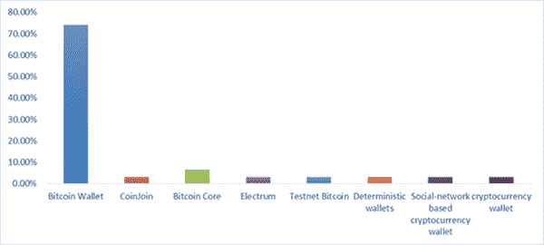 |

数据分析显示，大多数作者更喜欢用于他们的研究的比特币钱包，因为它向用户提供了整个区块链。另一方面，Electrum 基于简化支付验证（SPV）钱包或轻钱包，因为它们不提供区块链的完整副本来验证交易。Electrum 依赖于网络中的其他计算机提供信息；它是最有效、最稳健和最安全的桌面钱包。

根据 30 篇同行评审的文章，各位作者提到的存储密钥的方法（例如热钱包或冷钱包）进行了分析和聚类，并现在在图 3 中呈现。

| 图 3. 数字钱包存储使用的方法概览 |
| --- |
| 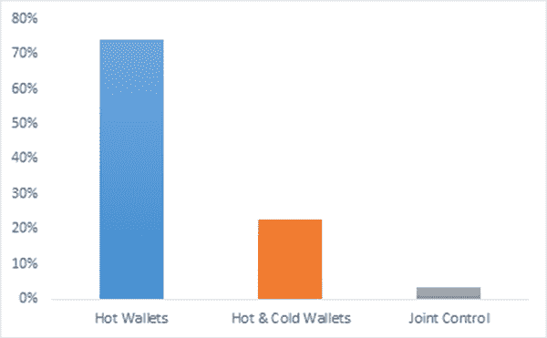 |

与逃税相关的法律问题

各位作者提到的防止逃税的技术包括：比特币支付和收款方案（BPCSS）、启发式聚类、行为分析和模式分析。各种推荐的方法，如 BPCSS、担保机制、启发式聚类以及交易和用户网络的组合也在各种研究中得到评估。所有这些信息都总结在图 4 中。

| 图 4. 防止逃税相关非法问题方法概述 |
| --- |
|  |

数据分析显示，大多数作者更喜欢使用行为和交易模式分析来跟踪交易流动，以防止逃税。需要制定一个适当的制度，其中应包括了解您的客户（KYC）细节、数据检索政策和客户尽职调查。

与洗钱相关的法律问题

加密货币提供了安全和私密的交易。 因此，它已被用于通过非法手段洗钱。 加密货币提供了洗钱的基础，因为它是不受监管的，匿名的，并且隐私性是主导的。 许多方法已被各种作者提出，并且仍在进行大量研究。 建议的方法包括：分析行为和交易模式分析、数据检索、KYC 和打补丁软件。 在各种研究中使用的这些方法显示在图 5 中。

数据分析显示，大多数作者倾向于 KYC 详细信息、客户尽职调查、启发式聚类和分层密文-策略属性基加密（CP-HABE）。 推荐使用 CP-HABE，因为它涉及监控交易的监管节点，并将可疑交易报告给监管机构。 因此，可以使用 CP-HABE 方法防止洗钱。

| 图 5\. 针对洗钱相关非法问题的预防方法概述 |
| --- |
| 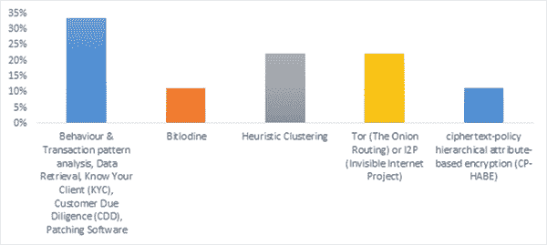 |

与毒品市场相关的法律问题

Silk Road 毒品交易商和 WannaCry 勒索软件网络犯罪分子要求以比特币支付。 许多方法已被各种作者提出，并且仍在进行大量研究以检测非法交易。 对 30 篇同行评审的科学文章中建议的方法进行了评估和分析，以评估这些方法。 方法列在图 6 中。

数据分析显示，行为和交易模式分析可以检测与毒品市场相关的交易。 这些模式可以进行分析，并且被认为可疑的资金流可以被追踪出来。 CP-HABE 被推荐，因为它涉及监控交易的监管节点，并将可疑交易报告给监管机构。 可以使用 CP-HABE 方法防止毒品市场，并向当局报告可疑交易。

| 图 6\. 防止非法药品交易方法概览 |
| --- |
|  |

与私钥盗窃或丢失相关的法律问题

加密货币提供了安全和私密的交易方式，并且已被用于通过非法手段洗钱。在私钥丢失或被盗的情况下，用户既不能访问也不能进行交易。许多方法已被各种作者提出，并且仍在进行大量研究，以使钱包足够强大，以减轻这些风险。评估了与 30 篇同行评审的科学文章中建议的方法相关的数据，并对其进行了聚类以得出结论。用于防止私钥盗窃或丢失的方法如图 7 所示。

| 图 7\. 防止私钥盗窃或丢失方法概览 |
| --- |
| 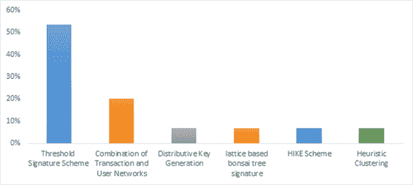 |

数据分析表明，门限签名方案是许多研究人员最常用的方法。它是最安全和最有帮助的方法，可以减轻与私钥丢失或盗窃相关的风险。还研究并在表 2 中介绍了秘密共享加密技术。这些加密技术肯定会增强安全性，并有助于减轻与私钥丢失或盗窃相关的风险。根据同行评审的文章，通过各种作者引用的钱包中使用的秘密共享方法进行了分析和聚类，并在图 8 中呈现。

| 图 8\. 用于防止私钥盗窃/丢失的秘密共享方法概览 |
| --- |
| 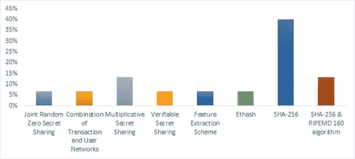 |

数据分析表明，Shamir 方法和安全散列算法-256（SHA-256）据报道是最常用的，原因是强大的加密和与其他方法的兼容性，除了阈值签名方案。乘法秘密分享也经常使用。然而，它不够强大，并且只与少数其他方法兼容。比特币钱包使用 SHA-256 进行更强的加密。

道德问题评估

从 30 篇同行评审的科学文章中分析了与去中心化、非法活动和匿名性有关的道德问题，并根据分析评估了道德问题、它们的影响和固有挑战。本章中的我们的贡献针对道德问题标题下的各种问题提出建议。

与去中心化相关的道德问题

加密货币提供了安全和私密的交易，并且完全是去中心化的。去中心化被用来促进非法交易，并通过非法手段洗钱。许多方法已被各种作者提出，仍然有许多研究正在进行以追踪可疑交易，遵循去中心化结构。本研究评估了 30 篇同行评审的科学文章中建议的去中心化方法的数据，并在图 9 中予以描述。

数据分析表明，各种作者主要使用交易和用户网络的组合，因为它们有助于追踪可疑交易，同时保持去中心化和匿名性。CP-HABE 被推荐，因为它涉及一个监管节点，该节点监控交易并向监管机构报告可疑交易。使用 CP-HABE 方法可以防止非法活动，并将可疑交易报告给监管机构。

| 图 9. 防止与去中心化相关的道德问题方法概述 |
| --- |
| 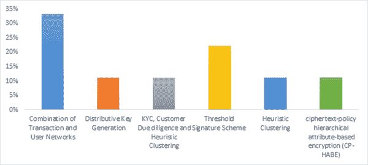 |

与非法活动相关的道德问题

不幸的是，加密货币相关的交易为处理非法交易活动提供了一个安全和私密的交易平台。许多方法已被各种研究人员提出，仍然有许多研究正在进行以追踪可疑交易。与预防非法活动相关的方法的数据，如 30 篇同行评审的科学文章所建议的，进行了评估，并呈现在图 10 中。

| 图 10\. 防止和检测与非法活动相关的道德问题的方法概览 |
| --- |
| 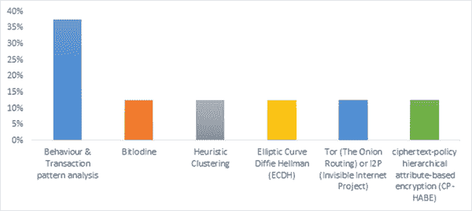 |

数据分析显示，可以通过用户行为和交易模式分析来追踪非法活动。许多作者青睐这种方法，因为它分析了交易流程并报告了可疑交易。建议使用 CP-HABE 方法，因为它涉及一个监管节点，监视交易并向监管机构报告可疑交易。可以使用 CP-HABE 方法预防非法活动，并将可疑交易报告给监管机构。

与匿名性相关的道德问题

加密货币由于其匿名特性而提供了安全和私密的交易。用户的身份不会被揭示，他们将完全匿名，导致犯罪分子使用加密货币进行非法交易。许多方法已被各种作者提出，仍然有许多研究正在进行以追踪可疑交易。在 30 篇同行评审的科学文章中，为防止与匿名性相关的非法活动所提出的方法进行了评估，进行了聚类，并呈现在图 11 中。

| 图 11\. 防止与匿名性相关的道德问题的方法概览 |
| --- |
| 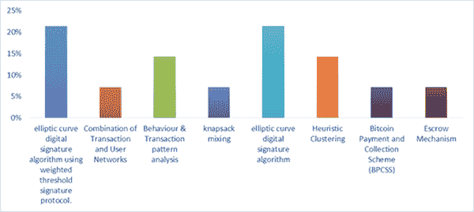 |

数据分   数据分析表明，匿名性特征被用来处理非法活动和交易。然而，它可以通过用户行为和交易模式分析进行追踪。许多作者倾向于这种方法，因为它分析了交易流程并报告了可疑交易。椭圆曲线数字签名算法（ECDSA）被推荐使用，因为它更安全，因此被普遍采用。比特币钱包青睐 ECDSA，因为它增强了匿名性。

讨论

由于比特币具有匿名性特征，因此成为了犯罪分子的在线交易的首选方式。因此，犯罪分子无法被追踪，他们的身份也不被披露。然而，最初的想法是由中本聪提出的，当时他开辟了比特币作为虚拟货币的道路。创建比特币和其他替代数字货币的原因是提供一种替代的去中心化支付系统。自从这些加密货币被引入以来，它们也被用于非法交易，如购买和出售非法商品、毒品和武器（Kshetri & Voas 2017; Toyoda et al. 2017; Van Der Horst et al. 2017; Meiklejohn et al. 2013; Chadha & Kumar 2017）。大多数人认为加密货币不受监管机构和当局的追踪，但事实并非如此（Reid & Harrigan 2013; Wang et al. 2018; Toyoda et al. 2017; Van Der Horst et al. 2017; Chen et al. 2017; Yin et al. 2018）。

我们的章节重点介绍了各种研究人员基于使用加密货币来检测非法活动所采用的方法（Dikshit & Singh 2017; Reid & Harrigan 2013; Gennaro et al. 2016; Narayanan et al. 2016; Kshetri & Voas 2017; Maurer et al. 2017; Wang et al. 2018）。这些解决方案已经帮助并将继续支持政策制定者通过使用加密货币来更加深入地了解犯罪活动的安全性和不确定性，从而做出更加明智的决定。

本章的主要贡献是关注通过使用比特币等数字货币在线进行的负面和非法活动领域。事实上，目前为止，政策制定者对于监管加密货币的能力有限，因为加密货币让犯罪分子有机可乘，可以将其用于非法活动。因此，我们的章节着重于帮助监管机构和政策制定者制定规章和指南，以控制在线进行的非法活动。

我们章节的另一个贡献是对可以用来识别非法活动并监管加密货币的新应用进行讨论。对于新方法的讨论，比如 CP-HABE 和交易及模式分析，以及它们如何被利用来检测非法活动，是我们章节的主要目标（Wang & Gao, 2018）。执法部门可以将我们章节提到的应用作为监视机制，用来对付非法活动，比如贩卖毒品、武器和洗钱（Kshetri & Voas 2017; Toyoda 等，2017; Van Der Horst 等，2017; Chadha & Kumar 2017; Liu, Chen, et al. 2017）。通过上述应用跟踪非法活动并监控它们，可以遏制正在进行的非法活动。这将有望遏制加密货币的非法交易和非法交易。

本章揭示了诸如丝绸之路的暗网市场是通过比特币和其他数字货币而存在的事实。人们正在暗网上购买非法武器、毒品，并利用加密货币的匿名特性进行支付（Kshetri & Voas 2017; Toyoda et al. 2017; Van Der Horst et al. 2017; Meiklejohn et al. 2013; Chadha & Kumar 2017）。这可能是街头犯罪比例变小的原因，与在线犯罪比例相比。人们在在线交易毒品和非法武器方面的活动已经从街头转移到了网络上。根据一些作者的说法，这导致了街头暴力事件的减少（Christin, 2014）。我们在我们的研究中建议，上述的非法活动可以被预防。使用我们本章中提到的应用程序可以在一定程度上阻止暗网，并“去匿名化”使用加密货币来追踪犯罪分子。

我们的章节揭示了椭圆曲线，使用加权阈值签名协议的数字签名（Gennaro et al. 2016; Dikshit & Singh 2017），而不是使用阈值签名协议的简单椭圆曲线数字签名（Narayanan et al., 2016），因为它为每个参与者提供了一个秘密密钥份额，同时满足了权重的要求。这可以用作匿名性的解决方案，以及用于保护比特币钱包。我们的章节还可以在未来帮助分析非法活动的规模，并量化和比较在线进行的非法活动与街头类似活动。这一贡献并未量化使用非法网站进行的操作规模，然而；这可以通过分析它们的活动，特别是与加密货币交易有关的活动，帮助追踪此类网站。

本章没有讨论加密货币价格波动可能产生的影响，尽管它强调了可能会严重影响价格的法律和道德问题。例如，加密货币的真正用户意识到它被用于非法活动，而这一事实在其在线交易价格中具有一定价值。在这种情况下，政府的严格政策或法规可能会对价格产生不利影响，影响程度相当大。

对于监管机构而言，本章提供了解上下文中整体法律和道德问题的价值。它可以帮助遏制与暗网相关的市场的增长。除了 Silk Road 2.0、Armory 和 Agora 之外，还有其他暗网市场正在运营，并且尚未被发现。我们的章节可以通过分析加密货币的使用行为和交易模式来帮助追踪新的暗网市场。

总的来说，我们章节的发现总结了使用加密货币进行的各种非法活动，并对其进行分类，提出了建议和推荐应用。我们研究中提到的方法，如行为和交易模式分析以及网络分析，可以帮助追踪这些罪犯。我们的章节可以帮助监管机构和政策制定者制定政策体系，并监管加密货币的使用。此外，我们的章节提供了一些指导，通过推荐使用各种应用程序来使加密货币钱包更加安全。这可以帮助减轻与使用加密货币相关的风险、攻击和盗窃。

结论

许多国家禁止某些虚拟货币，例如比特币，因为政府无法控制使用这些货币进行的交易。像比特币这样的加密货币不应该被各国禁止，仅仅因为它们被犯罪分子用于非法或不良活动。数字货币被认为是未来的货币，有潜力在经济金融体系中引发新的革命。因此，限制它们的使用并禁止它们并不是解决方案。这些货币在全球经济的进一步发展中有着正当的地位。

本章突出了各种可以用来规范和控制加密货币使用的应用。我们分析了从 2011 年至 2018 年出现的 30 篇同行评审的科学出版物中提取的数据，这些出版物描述了涵盖比特币等加密货币的法律和道德方面的实验观察。我们提出了各种方法来防止逃税和洗钱，以便犯罪分子无法从犯罪活动中获利，监管者可以通过让相关人士纳税和披露收入来监管进行加密货币交易的人群。行为和交易模式分析、KYC、CDD 和补丁软件可以作为反洗钱和反恐融资工具。在我们的章节中提出了各种方法来帮助减轻私钥丢失或丢失的风险，并保护加密货币中的数字钱包安全。例如，阈值签名方案被用作保护数字钱包的最有效和最优方案。SHA-256 被认为提供了最佳的加密形式。

我们的研究表明，由于比特币钱包近年来在交易和价格波动方面的普及，比特币钱包是最常用的。同时也表明，由于匿名性，这在犯罪分子中变得流行，这意味着犯罪分子不会被追踪，他们的身份保持未公开。我们提到了如何利用去中心化和匿名性来追踪犯罪分子。通过交易和用户网络的结合，可以追踪到犯罪分子。本章还提到了帮助防止药品营销和其他非法活动，如使用加密货币交易武器和恐怖主义资金等方法。我们强调了不同的应用程序来追踪非法活动，这是一个解决方案，例如利用先前的交易追踪加密货币的使用。

过去的许多研究已经考虑并讨论了与加密货币相关的法律问题，然而，他们并没有令人满意地研究整体的法律和伦理问题。我们的章节考虑了这些问题，并提出了明智的建议，以及现有的应用程序来防止与使用加密货币相关的非法活动。加密货币的匿名特性使犯罪分子认为他们无法被追踪。我们的章节提出了各种方法来去匿名化加密货币并追踪犯罪分子。这也可以防止黑暗网络在未来的增长。

我们目前的研究也可以帮助决策者做出更明智的决定，这些决定与加强安全有关，可以消除导致通过加密货币交易进行犯罪活动的不确定性。

作者贡献

N.M.和 M.N.H.构想了研究思路并制定了分析计划。N.M.分析了数据并撰写了初始章节。M.N.H.帮助准备了图表并最终撰写了手稿。K.A.提供了手稿的最终编辑。所有作者都参与了手稿的校对。

参考文献

Alvarado, J., & Halgamuge, M. N. (2019). 区块链在供应链管理中的新时代：一项调查。收录于《工业 4.0 和超定制智能制造供应链》（第 1-37 页）。IGI Global。

Baravalle, A., Lopez, M. S., & Lee, S. W. (2016). 挖掘暗网：药品和假身份证。2016 年 IEEE 第 16 届国际数据挖掘研讨会（ICDMW），350–356。10.1109/ICDMW.2016.0056

Barratt, M. J., Ferris, J. A., & Winstock, A. R. (2016). 更安全的评分？加密市场、社交供应和毒品市场暴力。《国际毒品政策杂志》，35，24–31。doi:10.1016/j.drugpo.2016.04.019

ChadhaS.KumarU. (2017). 勒索软件：让我们反击！2017 年国际计算、通信与自动化会议（ICCCA），925–930。10.1109/CCAA.2017.8229926

陈 P.-W.，蒋 B.-S.，& 王 C.-H. (2017). 基于区块链的普适比特币数字钱包支付收集监管系统。2017 年 IEEE 第 13 届无线与移动计算、网络和通信国际会议（WiMob），139–146。10.1109/WiMOB.2017.8115844

Christin, N. (2014). 对 Barratt 等人（2014）的评论：朝向表征在线匿名药品市场客户的步骤[评论]。《成瘾》（阿宾登，英格兰），109(5)，784–785。doi:10.1111/add.12519

Dikshit, P., & Singh, K. (2017). 用于保护比特币钱包的高效加权阈值 ECDSA。2017 年 ISEA 亚洲安全与隐私（ISEASP），1–9。10.1109/ISEASP.2017.7976994

FraserJ. G.BouridaneA. (2017). 围绕比特币的安全漏洞是否影响了货币的价值？ 2017 年第七届新兴安全技术国际会议 (EST)，50–55\. 10.1109/EST.2017.8090398

Gennaro, R., Goldfeder, S., & Narayanan, A. (2016). 门限最优的 DSA/ECDSA 签名及其在比特币钱包安全上的应用. 在 M. Manulis，A.-R. Sadeghi 和 S. Schneider（编者），应用密码学与网络安全 (pp. 156–174). Springer International Publishing. doi:10.1007/978-3-319-39555-5_9

何舒, 吴强, 罗雪, 梁泽, 李栋, 冯航, 郑宏, & 李杨. (2018). 基于社交网络的加密货币. IEEE Access: 实用创新，开放解决方案，6，7654–7663\. doi:10.1109/ACCESS.2018.2799385

KaushalP. K.BaggaA.SobtiR. (2017). 比特币的演变及比特币钱包中的安全风险. 2017 年计算机、通信和电子国际会议 (Comptelix)，172–177\. 10.1109/COMPTELIX.2017.8003959

Kshetri, N., & Voas, J. (2017). 加密货币是否助长了勒索软件？ IT 专业人士，19(5)，11–15\. doi:10.1109/MITP.2017.3680961

Liu, Y., 陈晓, 张力, 唐超, & 康宏. (2017). 用于比特币挖矿池获取利润的智能策略. 2017 年第十届计算智能与设计国际研讨会 (ISCID)，2，427–430\. 10.1109/ISCID.2017.184

Liu, Y., Liu, X., 张力, 唐超, & 康宏. (2017). 消除比特币交易的可塑性的高效策略. 2017 年第四届系统与信息学国际会议 (ICSAI)，960–964\. 10.1109/ICSAI.2017.8248424

Maurer, F. K., Neudecker, T., & Florian, M. (2017). 具有任意价值的匿名 CoinJoin 交易. 2017 年 IEEE Trustcom/BigDataSE/ICESS，522–529\. 10.1109/Trustcom/BigDataSE/ICESS.2017.280

MehtaI. S.ChakrabortyA.ChoudhuryT.SharmaM. (2017). 比特币安全算法的高效方法。2017 年国际信息技术和无人系统会议（趋势和未来方向）（ICTUS），807–810。10.1109/ICTUS.2017.8286117

MeiklejohnS.PomaroleM.JordanG.LevchenkoK.McCoyD.VoelkerG. M.SavageS. (2013). 一把比特币：描绘无名男子之间的支付特征。2013 年互联网测量会议论文集，127–140。10.1145/2504730.2504747

Mirzayi, S., & Mehrzad, M. (2017). 比特币，SWOT 分析。2017 年第七届计算机与知识工程国际会议（ICCKE），205–210。10.1109/ICCKE.2017.8167876

Nakamoto, S. (2019). 比特币：一种点对点的电子现金系统。Manubot。https://git.dhimmel.com/bitcoin-whitepaper/

Narayanan, A., Bonneau, J., Felten, E., Miller, A., & Goldfeder, S. (2016). 比特币与加密货币技术：全面介绍。普林斯顿大学出版社。

Quamara, S., & Singh, A. K. (2016). 比特币和安全金融交易处理，最新进展。2016 年第二届应用与理论计算与通信技术国际会议（ICATccT），216–219。10.1109/ICATCCT.2016.7911995

Reid, F., & Harrigan, M. (2013). 比特币系统匿名性分析。在 Y. Altshuler，Y. Elovici，A. B. Cremers，N. Aharony 和 A. Pentland（Eds。），社交网络中的安全与隐私（第 197–223 页）。施普林格。doi:10.1007/978-1-4614-4139-7_10

ShanmugamB.AzamS.YeoK. C.JoseJ.KannoorpattiK. (2017). 对网络犯罪分子使用比特币的关键回顾。2017 年计算机通信与信息国际会议（ICCCI），1–7。10.1109/ICCCI.2017.8117693

ShehhiA. A.OudahM.AungZ. (2014). 调查选择加密货币背后的因素。2014 年 IEEE 国际工业工程和工程管理会议，1443–1447。10.1109/IEEM.2014.7058877

Shrestha, B., Halgamuge, M. N., & Treiblmaier, H. (2020). 使用区块链进行在线多媒体管理：现有平台的特征。在区块链和分布式分类账技术用例（pp. 289–303）。施普林格。

TamaB. A.KwekaB. J.ParkY.RheeK.-H. (2017). 区块链及其当前应用的批判性回顾。2017 年国际电气工程与计算机科学会议（ICECOS），109–113。10.1109/ICECOS.2017.8167115

Toyoda, K., Ohtsuki, T., & Mathiopoulos, P. T. (2017). 通过交易模式分析在比特币中识别高收益投资计划。GLOBECOM 2017 - 2017 年 IEEE 全球通信会议，1–6。10.1109/GLOCOM.2017.8254420

Tschorsch, F., & Scheuermann, B. (2016). 比特币。IEEE 通信调查与教程，18（3），2084–2123。doi:10.1109/COMST.2016.2535718

UpadhyayaR.JainA. (2016). 网络伦理和网络犯罪：对合法性，勒索软件，地下网络和比特币钱包的深入研究。2016 年计算机，通信和自动化国际会议（ICCCA），143–148。10.1109/CCAA.2016.7813706

Van Der Horst, L., Choo, K.-K. R., & Le-Khac, N.-A. (2017). 比特币的过程内存调查。IEEE Access：实用创新，开放解决方案，5，22385–22398。doi:10.1109/ACCESS.2017.2759766

Wang, Q., Li, X., & Yu, Y. (2018). 匿名性。IEEE Access：实用创新，开放解决方案，6，12336–12341。doi:10.1109/ACCESS.2017.2787563

Wang, Y., & Gao, J. (2018). 基于密文策略分层属性加密的比特币调控方案。IEEE Access：实用创新，开放解决方案，6，16267–16278。doi:10.1109/ACCESS.2018.2814620

Yin, W., Wen, Q., Li, W., Zhang, H., & Jin, Z. (2018). 区块链中的反量子交易认证方法。IEEE Access：实用创新，开放解决方案，6，5393–5401。doi:10.1109/ACCESS.2017.2788411

张，Y.，& 李，J. (2016 年 6 月 30 日)。基于 DWT-DCT 的自动识别真伪作品防伪算法。《国际安全及其应用》, 10(6), 135–144。doi:10.14257/ijsia.2016.10.6.14

# 第八章

# 一种利用区块链技术的中央证券存管机构证券结算模型

+   安德烈·P·卡利茨

    南非纳尔逊·曼德拉大学

+   让·H·格雷林

    

    南非纳尔逊·曼德拉大学

+   史蒂夫·埃弗雷特

    南非纳尔逊·曼德拉大学

摘要

1980 年至 2000 年间，证券后交易结算进入了电子时代。诸如安全的电子消息传递技术的引入，以及数据库技术的改进，使得中央证券存管机构（CSDs）作为证券后交易结算领域的可信第三方或中介的概念成为可能。本章报告的研究重点放在 CSDs 以及区块链技术在证券结算中的应用上。其目标是为 CSDs 开发一个利用区块链技术的证券结算模型，因为目前全球范围内还没有任何一个 CSDs 引入了面向生产的基于区块链的证券结算解决方案。通过评估国际后期证券专业人士的报告文献，创建了一个概念模型。研究结果导致了对模型主要组成部分的接受，重点关注解决方案的成本，并确定了这样一个解决方案的先决条件（例如，法律/监管的支持）。

引言

随着新技术的出现，金融服务行业在全球范围内引入了新的支付方法和服务。移动设备和银行应用程序（App）的使用使银行服务更加便捷，从而改善了用户体验。现在可以点对点地发送电子现金（价值转移），而无需金融服务中介（Nakamoto, 2008）。现金和股票（例如在金融交易所交易的证券）都具有价值，通常可以在买方和卖方之间转移。股票买方直接与股票卖方或股票发行者（例如发行股票或债务股票的公司）进行交互，在网络中有能力查看交易（Gibson and Kirk, 2016）。

加密货币，如比特币、莱特币和以太坊，引入了一种可以在两个当事方之间交换的数字资产。点对点交易是比特币区块链中进行的核心交易类型，该区块链使用了一种称为比特币的加密货币，利用密码学来保护点对点交易在一个可验证的数据库中，而这个数据库在没有检测到的情况下不能被改变或修改（Swanson, 2015）。通常，这些交易可以在没有地理限制的情况下进行，而且不需要使用传统银行服务。

证券结算是一种业务流程，其中证券以现金支付交付给两方之间。在证券结算中实现这种类型的点对点交易的机会（例如可以交换股票或债券工具以换取现金）在金融服务行业内引起了很大的热情，因为证券结算生态系统中存在着消除金融服务中介的潜力（Gartner, 2020）。

根特（2020）指出，区块链技术正处于过度期望的顶峰。重要的是要注意，尽管当前形式下的技术相对较新，但其中许多加密技术早在 1970 年代就已经开发出来了（KPMG，2018）。因此，由于这项技术以公认的加密技术为基础，并已在比特币生态系统中应用，其在证券结算中的应用还需要进一步探讨。

在过去的二十年里，传统的股票交易所交易大厅已被虚拟交易大厅所取代，然而，无论是虚拟还是实体，每一个都提供了连接希望买卖股票的投资者的能力（O'Connor，2004）。随后的流程允许在交易后交换现金和证券，这通常被称为“后交易”流程。尽管在这段时间内金融服务领域出现了各种技术进步，但这个过程在过去的 10 至 15 年里并没有发生重大变化。

在交易到后交易环境中，存在多个受信任的第三方，如交易所、经纪人、交易商和中央证券存管机构（CSDs）。卡普（2015）强调了通过区块链技术颠覆金融服务这个特定领域的潜力。例如，CSDs 在大多数市场通常是一个受信任的第三方，可能只有一个或少数几个负责特定市场证券结算的 CSDs。

区块链技术为证券结算创造了新的机会，并具有巨大的潜力作为一个平台。通过算法确认的点对点资产交换能力是提高任何市场效率和降低成本的吸引人前景。然而，这项技术并不新鲜，已经有十多年的广泛发展和记录。

本章旨在调查为什么区块链技术尚未成功转化为基于区块链的证券结算生产系统。已提出使用区块链技术的证券结算模型。该模型已由一组国际角色扮演者评估。

问题陈述和研究目标

在发表本研究的时候，全球尚不存在任何一个利用区块链技术进行证券结算的中央证券存管机构（CSD），尽管许多机构已发布了计划中的研究和实施的新闻稿。此外，加密货币市场继续与现有证券市场并行增长。因此，本研究调查的研究问题如下：

目前，没有任何中央证券存管机构（CSD）或任何资本市场基础设施利用区块链技术进行证券结算。

当前的研究始于确定中央证券存管机构（CSD）减轻了哪些风险，考虑到参与者、中介和采用的各种结算模型；以及现有技术和流程如何帮助实现成功的结果。一旦确定了这些，研究便探讨了资本市场证券结算的主要角色（即监管机构、发行人和投资者）对证券结算存在哪些期望。该研究评估了在已建立的证券结算市场中实施新区块链技术的最合适方法。这提供了一个平衡的评估，包括现有区块链技术的固有风险和感知收益。然后提出了一个概念模型，并对其接受度进行了评估，不仅由 CSDs 评估，而且还由该行业的主要国际角色扮演者评估。

本研究的主要研究问题是：

国际行业参与者对使用区块链技术进行证券结算的拟议模型有何看法？

本研究的主要研究目标是：

由国际行业参与者评估一个针对中央证券存管机构使用区块链技术进行证券结算的拟议模型。

本研究集中在中央证券存管机构和区块链技术在证券结算中的应用上。由于大多数国家只有一个或两个中央证券存管机构，因此必须从国际中央证券存管机构以及南非的中央证券存管机构 Strate Ltd.获得信息。研究局限于评估在传统中央证券存管机构的证券结算中使用区块链技术的拟议模型，例如债券、货币市场和股票。

由于这一技术领域的迅速发展和创新，本研究在两年内进行，而没有重新评估区块链技术的最新可用信息和发展。本研究未开发任何软件应用，因为研究的主要目的是专注于解决应用区块链技术进行证券结算的广泛原则。

本研究旨在以一种平衡技术真正好处的方式提供应用区块链技术于证券结算的实用概念设计，而不引入不必要的风险。证券交易所或为市场提供结算服务的系统技术失败的风险可能对国家经济造成灾难性影响。因此，本研究旨在确保考虑到健壮的模型，因为支撑这些市场的技术正在快速发展。

文献综述

本节将讨论交易后证券结算生态系统，随后讨论区块链作为对 CSD（中央证券存管机构）的潜在颠覆者以及分布式账本技术在 CSD 中的应用。

交易后证券结算生态系统

在提供关于交易后流程的详细信息之前，了解涉及该行业的总体生态系统的背景是很重要的，该生态系统涉及参与者、中介机构和监管机构。哈里斯（2004 年）确定，股票（例如股票或债务工具）可以采用多种形式，如股票、商品或债务工具。股票可以通过交易所的经纪人进行买卖，这些经纪人是交易所的成员。哈里斯（2004 年）进一步定义了交易为一种搜索问题，即买方需要找到卖方，卖方需要找到买方。参与股票交易的主要角色是：

+   • 经纪人：他们协助客户找到愿意与他们交易的交易者；

+   • 经销商：他们根据客户的需求进行交易。经销商买卖时，价格分别为‘买入价’和‘卖出价’；

+   • 交易所和经纪公司：它们通过将买方和卖方放置在同一电子交易平台上来帮助降低买方和卖方的搜索成本，从而使买方与卖方相互接触。这些平台还提供了有关特定股票的最佳买入价和卖出价的重要信息。

一旦买方和卖方通过各自的经纪人在交易所上就价格达成一致（介于买入价和卖出价之间），交易所就会向经纪人发送一份报告，确认了该交易。买方必须支付购买股票的经纪人（股票和证券是可互换使用的术语），然后几天后（南非为五天），卖方收到股票的款项，而买方收到已达成的价格的股票，数量正确（哈里斯，2004 年）。

第一个电子股票交易所 NASDAQ 于 1971 年在美国创建，并于 1980 年完全电子化（Atack 和 Neal，2009；Gorham 和 Singh，2009）。用于证券交易的电子股票交易所需要更有效的后期处理。后期处理涉及清算和结算流程。Loader（2002）将清算描述为“准备通过匹配、记录和处理交易指令以进行结算”的过程，结算为“交换现金或资产以换取其他资产”，其中包括“法定所有权的交换”。Gorham 和 Singh（2009）描述了手工清算和结算匹配交易的过程既繁琐又复杂，并且需要金融市场中的许多机构合作和共同努力。管理清算和结算的复杂性也是后期风险管理的关键组成部分，以确保卖方收到付款，买方收到合同约定的资产，从而减轻信贷和违约风险（Gorham 和 Singh，2009）。

证券结算系统（SSS），更具体地说是以中央证券存管机构（CSDs）的形式，是在二十多年前引入的，旨在为本地市场提供集中式的保管功能，并以集中和电子化的方式加速清算和结算处理（Loader，2002）。本地市场发行人通常将他们的整个发行在 CSD 中保管（Dickinson，2015）。Dickinson（2015）进一步阐述了 CSDs 将以前作为实物证书保存在投资者、发行人或托管人处的实物股票进行了电子化处理。这些股票容易丢失、损坏和被盗，而且存储成本高昂。

| 图 1. 交易所产业价值链 [改编自 Floreani 和 Polato（2014）] |
| --- |
| 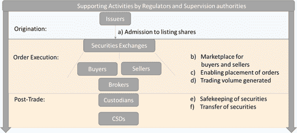 |

CSDs 位于交易后结算流程的末端，这构成了整个交易所行业价值链的一个子集，如图 1 所示，该图表明价值链中有三个关键阶段，即起源、订单执行和交易后；并且每个这些活动都受到某个市场或地区的监管和监督（Floreani 和 Polato，2014）。CSDs 关注证券的安全保管和转让的交易后活动。因此，CSD 可以被认为是作为整体交易后流程的一部分，按照市场或地区执行证券结算的。Caprio（2013）指出，证券结算由四个主要要求定义，即：

+   • 证券所有权：结算必须在适用司法管辖区的法律框架内完成所有权转移的法律要求；

+   • 现金结算：尽管现金支付是证券结算的重要方面，但最重要的是财产（证券/股票/股份）的交付。因此，在中介机构破产时，买方或卖方在现金或证券正在处理过程中应保持所有权；

+   • 经济高效的结算：这些结算也应具有全球竞争力，并能够与全球其他结算系统互操作；以及

+   • 不改变转让证券性质的结算：如果证券具有某种权利（例如投票权）针对发行人，持有这种证券的人必须能够行使特定证券所赋予的权利。

然而，CSDs 并不是在发行人（即发行债务或股票证券以筹集资金的机构）和投资者之间进行交易后证券结算的唯一值得信赖的第三方，如图 2 所示。Dickinson（2015）指出了以下差异，包括对 a）到 h）的解释：

+   (a) 直接投资者（无论是购买还是出售证券/股票）可以指定一个托管人，并有权选择一个或多个经纪人；

+   (b) 托管人反过来将在中央证券存管机构拥有一个名义账户，由直接投资者和机构投资者组成；

+   (c) 直接投资者也可以选择在托管人管理的中央证券存管机构开立直接账户；

+   (d) 使用经纪人的直接投资者将在经纪人名下拥有一个账户，该经纪人反过来在中央证券存管机构拥有一个名为“经纪人参与者账户”的账户；

+   (e) 机构客户可以直接在一个或多个托管人处开立账户；

+   (f) 机构客户通常会授权投资经理使用其作为托管人的账户；

+   (g) 投资经理也可以指定自己的托管人；

+   (h) 机构客户可以指定一个具有自己托管人的投资经理作为替代方案。

| 图 2. 后期交易结算格局 [来源：迪金森（2015 年）改编] |
| --- |
| 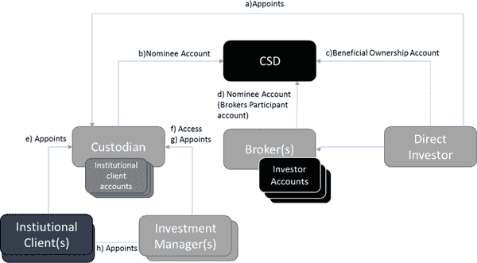 |

在图 2 中，假设发行人已经发行了证券（即股票或债务）。这表明了中央证券存管机构在保管和转移证券方面所起的系统重要性、相互连接的中心作用。对于资产如何转移和保管的业务模式的任何变化都将影响到图 2 中所示的所有中介机构，甚至可能导致完全新的业务模式，其中去中介化是世界经济论坛（2015 年）所代表的所有中介机构的一个明显可能性。

通常，这些中介机构中的每一个都以某种形式相互作用，如图 2 所示。 这意味着在图 2 所代表的相互连接的性质中涉及了系统、流程和人员。 当比特币首次推出时，它提出了一个问题，即是否有必要完全取消这些中介机构，以及是否可能仅仅让买家和卖家之间进行点对点的交易（Swan，2015）。

区块链作为 CSD 的潜在颠覆者

Zohar (2015) 提出，区块链技术可能对现有的商业模式产生破坏性影响，因为没有单个实体能够阻止交易或收取费用。 区块链技术有效地消除了需要信任的第三方来处理交易和提供记录保存服务的需求，这对某些中介机构的核心业务功能构成了威胁，比如 CSDs。

Swan (2015) 提出，证券结算的区块链可能需要更多的开发和定制，将最终结果描述为“区块链 2.0”。 这本身就是一个有趣的概念，因为到 2015 年为止，区块链技术的发展自 2008 年创立以来已经经历了广泛的改进和变化。 将区块链技术应用于证券结算需要加强由 Caprio (2013)定义的四个主要问题，以便像 Evans (2003)之前定义的那样有一个适当的商业案例。

由于证券结算的相互连接性质，去中心化的区块链技术模型并未清晰定义。 这将需要市场协调和与监管机构、中介机构、发行人和投资者进行规划，以验证一个商业案例，以便继续使用该技术作为目前使用的技术的替代品（Committee on Capital Markets Regulation，2019）。

区块链技术不断发展，然而，将区块链技术应用于证券结算是一项复杂的工作，考虑到后期交易环境的相互关联。然而，可以制定一个证券结算的理论概念模型，使用区块链技术。这个模型将需要确保区块链技术的好处可以应用于特定市场的 CSD，而不引入额外的风险。

Swan（2015）将区块链描述为一种颠覆性技术。这是在上下文中进行的，因为区块链提供了在没有可信第三方的情况下进行交易的潜力。在特定市场中，中央证券存管机构（CSD）是证券结算的事实上的可信第三方。因此，如果这项技术引入了一套基本上新的规则，这些规则可以决定资本市场结算的方式，那么作为一个可信第三方的 CSD 可能会变得无关紧要（Karp，2015）。

因此，了解为什么使用区块链技术进行证券结算比使用加密货币（如比特币）进行点对点交易更具挑战性是很重要的。几乎每周，资本市场的各方都会宣布新的原型或概念验证，旨在在区块链上进行证券结算（资本市场监管委员会，2019 年）。如果这在技术上是可行的，那么除了技术本身之外，必须考虑其他条件。

一种颠覆性技术有可能在一个已建立的行业中提升一个不知名的企业，同时淘汰一个经过验证甚至是占主导地位的现有企业。由于在特定市场上 CSDs（中央证券存管机构）是‘主导者’（通常每个市场通常只有一到两个 CSDs），它们似乎是区块链等颠覆性技术的主要应用案例，因为在大多数市场中它是‘受信任的第三方’。CSDs 通常位于资本市场后期交易结算流程的中间，处于多个实体/中介之间，尽管在后期交易流程的最后。因此，这种颠覆性技术提供了一个区别化的机会，可以消除对于像 CSD 这样的主导中介的需求，并使特定股票的买方和卖方之间的点对点交易成为可能。这一观察也可以是 CSD 是实现技术启动的明显起点。

区块链技术有可能取消金融服务中的任何流程（《经济学家》，2014）。这意味着证券结算交易供应链中的所有金融服务提供者都是可能的去中介点，包括中央银行、经纪公司、托管银行和 CSDs。然而，只有当技术能够提供不同 iating 因素时，去中介化才会发生，这些因素可以降低成本、创造效率并增加信息安全（资本市场监管委员会，2019）。截至撰写本文时，尽管该技术自 2008 年以来已经在使用，但尚未出现任何上述实体的去中介化。在全球资本市场参与者的广泛倡议中有许多正在进行的计划，但尚无一项能够成功地在端到端的基础上将该技术应用于后期交易证券结算（资本市场监管委员会，2019）。

要使区块链实现其作为真正颠覆者的潜力，该技术需要成为一个差异化因素，而不仅仅是一个启用因素（Swan, 2015）。这可能是为什么到目前为止在后期证券结算方面没有发生太多颠覆的关键所在。重要的是要注意，资本市场的中介机构范围内仍在进行大量的实验，其中大多数伴随着与新金融科技公司和已建立的公司的合资企业的新闻发布会。这些实验是为了理解技术的必要性；然而，这些实验并不是在市场范围内驱动的，也没有市场范围内的设计来实现共同的目标。

证券保管

本节介绍了证券保管的概念以及这在 CSD 角色中的应用。由于在证券电子化之前的物理性质，投资者寻求托管以保护他们的证券，有效地创造了‘间接资产持有’（Eva, 2015）。然而，技术的进步导致了电子证券持有的增加以及 CSD 的使用，但并没有消除间接持有，尽管它显著减少了风险并提高了效率。Eva（2015）提到，相反地，结果是投资者在一个或多个托管人那里有了更多的间接持有，这些托管人为其履行保管职能。

虽然仍然可能是直接投资者（买方/卖方），但投资者仍然有选择指定托管人（通常是银行）的选项，并且有能力选择一个或多个经纪人（Swanson, 2015）。一份非穷尽名单的中介机构，可能在一系列‘托管链’中运作：

+   • 经纪人：在托管人那里有自己的头寸或客户的头寸；

+   • 托管人：在其他托管人那里有账户，通常是子托管人或全球托管人（European Central Bank, 2007）；

+   -   机构客户：能够直接与一个或多个托管人开立账户；他们通常会为投资经理提供在托管人处访问其账户的权限；也可以选择任命一个拥有自己托管人的投资经理作为替代；以及

+   -   投资经理：也可以指定自己的托管人。

上述的托管链代表了一个多层账户和间接持有结构，这两者共同支持着稳定的证券结算（欧洲央行，2016 年）。尽管这些中介合作以保持证券结算的稳定，但是托管链有能力修改投资者的权利，因为托管人与其子托管人之间存在着多种条款和条件，这可能对投资者不利（Eva，2015 年）。

在证券持有人的记录最终实现在中央证券存管机构处之前，发行人与投资者之间的托管关系已经通过一到三个托管人进行了中介。此外，在此过程中，投资者的权利也已经发生了变化，从而导致了最终投资者的“间接持有”情况（Eva，2015 年）。此外，买方和卖方各自都有自己的托管安排。托管服务通常作为服务组合中的一个服务提供，包括税务、现金管理、投资咨询和经纪服务；无论是在国内市场还是在多个地理区域（欧洲央行，2007 年）。结算最终性是目前托管链中的结算系统的关键组成部分，由每个国家的法律框架支持，并且通常由托管人或中央证券存管机构的证券账户之间的转移来实现（Mori，2016 年）。

重要的是要理解，股票的买方和卖方实际上已经将结算证券所需的许多行政和运营功能外包给了一系列中介，包括托管人，子托管人，CSDs 经纪人和投资经理。根据金融稳定理事会（2009 年）的说法，CSDs 是作为一项联合市场倡议引入的，旨在为国家市场（国家或地区）以及维护所有权中央注册的电子化解决大量的资料化股份。

Eva (2015) 声称，CSDs（中央证券存管机构）通常在托管链的中间人之间与一个或多个托管人（子托管人）以协调和协调的方式与 CSD 合作，以保护投资者的资产。 CSDs 通常为一个国家市场服务，并且对于给定国家的国家监管机构（欧洲央行，2007 年）起着重要作用，并且在不同国家的实施上略有不同（Euroclear 和 Oliver Wyman，2016）。 Euroclear 和 Wyman（2016）进一步澄清，这意味着关于 CSDs 存在主权（即国家特定）要求，因为监管机构将根据各自市场的要求要求直接监督，监督和定制报告。

金融稳定委员会（2009）得出结论称，中央证券存管机构（CSDs）在资本市场的顺畅运作中具有系统性重要性，不仅从证券交割的角度来看，而且还因市场行为原因（Euroclear and Wyman，2016）。如果一个 CSD 因资本市场内复杂性和相互关联性而陷入困境或失败，这将对更广泛的金融体系和经济活动造成重大的中断。根据 Brennan and Lunn（2016）的说法，CSDs、中心化账本和其当前技术上的记录结构并非不变且容易受到审查、伪造或交易撤销影响。重要的是要注意，尽管 CSD 记录并非不变的，但目前已经成功地实施了其他逻辑和物理安全控制来管理信息安全和数据保护。考虑到 CSDs 在特定市场中也占据重要地位，CSD 系统需要与各种中介和交易所在本地市场内以预先定义的标准和协议进行互操作。

分布式账本技术

这一部分评估了分布式账本技术（DLT）是否适合当前的证券交割期望。介绍了采用 DLT 的各种方法，以评估 DLT 是否能够为证券交割带来好处或者与现有做法和技术形成差异化。

当前全球市场证券结算采用新平台，通过增量技术改进或变革，往往需要数年时间来实施。通常，市场委员会会考虑变更或改进，并且会以与生态系统中其他组织相匹配的同步时间表来实施。一个例子是由欧洲央行（2015 年）推动的 Target 2 Securities（T2S），该项目在欧洲实施了超过七年的时间，以实现跨境结算的协调。

尽管通过引入新的参与者来引发颠覆性变化无法消除，但考虑到受影响实体的互联性质，采用相对新的技术将需要类似的协作方法。摩根士丹利（2016 年）、欧洲证券和市场管理局（2016 年）、以及欧洲清算所和奥利弗·维曼（2016 年）都同意，对相关遗留系统、流程和组织变化的影响过于复杂，无法以“大爆炸”方式考虑，很可能会采用市场论坛或财团的协调方法进行实施。有许多由银行、市场基础设施和交易所组成的区块链财团，专注于已由世界交易所联合会（2016 年）描述的权限分配式分布式账本解决方案。其中包括 R3 CEV、Hyperledger 和后交易分布式账本组。然而，这并不意味着没有其他可能的采用方法，例如欧洲清算所和奥利弗·维曼（2016 年）所指出的那些方法。

Euroclear 和 Oliver Wyman（2016）指出合作可能是另一种选择。这由现有市场参与者（如 CSD 或行业联盟）领导，如 DTCC（2016）所述，旨在与现有技术并行开发新技术。通常，这取决于是否存在业务案例（摩根士丹利，2016）。最后，强制政策是另一种选择，即监管机构命令在市场范围内使用区块链技术替代现有系统（Euroclear 和 Oliver Wyman，2016）。

尽管 DLT 提供的功能与促进证券结算所需的功能可能没有一对一的匹配，但重要的是要认识到 DLT 仍然是一项新兴和不断发展的技术。Swan（2015）提出了“Blockchain 2.0”的潜力对于设计基于 DLT 的证券结算系统可能意味着什么的概念。有迹象表明技术正在进一步发展，这需要在设计新的基于 DLT 的生态系统时加以考虑。

使用区块链技术具有挑战性，重要的是要理解其基础设计以及对某些用例的后果，如 Natoli 和 Gramoli（2016）所述。虽然有许多可用于评估的平台，但已经参与过后期交易 DLT 开发的主要联盟是 R3 CEV、ChinaLedger、Hyperledger 和后期交易账本组（Swan，2015）。由于目前没有广泛使用的商业 DLT 解决方案用于资本市场，并且考虑到该领域的技术迅速发展和新技术的出现，因此重要的是调查可能支持证券结算的新技术发展，并协助开发支持此类服务的技术框架或生态系统。

多签名地址通常在比特币区块链中使用；然而，在考虑到托管链时，多签名的概念是一个新颖的概念。支付或资产转移可以通过要求超过一个签名（即买方、卖方和可能的银行）以及可能需要仲裁者的签名来完成交易（Natoli 和 Gramoli，2016）。这个概念在“阈值签名方案”的概念中得到了进一步的支持，通过多签名达成拜占庭协议（Pilkington，2015）。

还进一步需要一个“控制层”来满足监管的需要。值得注意的是，Ripple 和 Multichain 已经进行的工作，以实现独立于区块链“层”的“元层”的概念；并与账本/区块链本身进行交互。另一个选择是 Oracle，在以太坊协议中广泛使用；它允许第三方向智能合约提供输入（Wall 和 Malm，2016）。

DLT 生态系统可能是一个多账本环境，应该能够实现跨链/账本交付与支付（DvP）（Wall 和 Malm，2016）。因此，账本之间的互操作性是未来所有 DLT 技术对证券结算的关键要求。

分布式证券存管的概念模型

在本节中，提出了主权分布式证券存管的概念模型。图 3 和图 4 分别涵盖了所提议的主权分布式证券存管的设计概念以及其所需的互操作性。图 3 中描述的概念模型是一个“主权”分布式证券存管，与今天的中央证券存管相对立存在。一个“主权”使用案例的重要性在于，通常情况下，CSD 是在国家或地区基础上运行的。因此，所提议的概念模型应建立在这个原则上。

| 图 3\. 主权分布式证券账本/存证平台 DLT 生态系统 |
| --- |
| 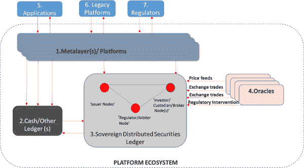 |

图 3 所示的已图形化整合到概念模型中的识别的设计元素，总结如下：

+   • 在 DLT 网络中，与无许可相对的是使用 Practical Byzantine Fault Tolerance（PBFT）的许可 Blockchain。这是在实际的 DLT 网络中使用的，由主权证券分布式账本（图 3 中的元素 3）表示；

+   • 由于存在国内法律、法规和市场纪律，每个国内市场都需要其自己的‘主权’账本。出于这些原因，大多数国家都有自己的 CSD（Euroclear 和 Oliver Wyman，2016）；

+   • 现金存放和跟踪在一个单独的现金账本中，如 Euroclear 和 Oliver Wyman（2016）所述。‘现金/其他账本’（图 3 中的元素 2）具有与主权账本进行双边交互的能力（通过智能合约）以启用 DvP 交易；

+   • 所有证券都在‘主权’分布式证券账本（存证处）（SDSD）中，分布在已知节点之间。这些节点代表了具有已知实体/中介的监管链。这确保了市场不会出现碎片化，即一些证券在一个账本中，而另一些在另一个账本中；

+   • 账本内的已知节点在多签名纪律中被赋予特定角色和访问级别。例如，如果投资者打算从特定卖方购买股票头寸，投资者会委托经纪人购买股票。经纪人可能与银行/托管人有信用额度，后者可能还为其客户在 Metalayer 顶部构建了定制应用程序（图 3 中的元素 1）。SDSD 将使用多签名技术确保投资者直接从卖方购买股票；但是，经纪人和银行/托管人在交易结束前签署/验证交易。这也意味着由于 DLT 网络提供托管功能，银行和经纪人将专注于其他客户服务活动以留住客户；

+   • 通过使用 Oracle（Poelstra, 2014）满足监管干预和监督的需求。Oracle（图 3 中的元素 4）用于将数据插入智能合约或直接插入 SDSD，以及通过元层平台对信息进行监管读取访问；

+   • 使用 Oracle 和多签名技术结合起来，充分满足金融应用程序的安全性和审计要求；

+   • 元层平台和 Oracle 与常规数据库类似，分别用于读取和写入区块链。它们应该承担计算和存储负担，使 SDSD 尽可能可扩展。这也为监管机构提供了对交易的“全景”视图的机会。此外，Oracle 可以提供必要的交易流量和价格信息作为示例。显然，这种模型的区块链组件并不是技术关注的焦点，但会影响整个生态系统的设计；和

+   • 上述组合形成了一个平台，应用程序、传统平台和监管机构可以与 DLT 结算生态系统交互，正如 Caprio（2013）和 Karp（2015）所描述的那样（图 3 中的元素 5、6 和 7）。

鉴于 SDSD 仅适用于一个国家/地区，有一个需要考虑的重要方面——与其他 SDSD 的互操作性，因为市场需要像比特币区块链提供的全球资产流动性一样。图 4 说明了这些主权账本如何概念化地与彼此接口。

| 图 4\. SDSD 的概念模型 |
| --- |
| 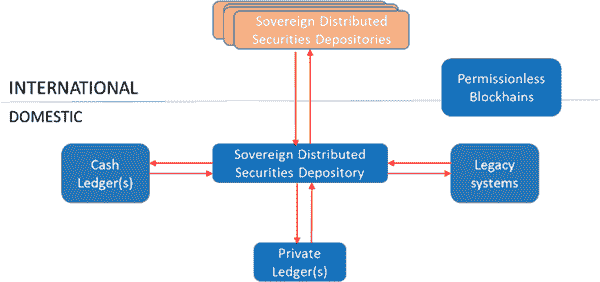 |

图 4 将图 3 的所有元素整合到了‘主权分布式证券存管机构’块中。这说明了 SDSD 之间相互操作的重要性，因为它不会孤立运行，需要具备与链上和链下资产（例如传统系统和现金账簿）以及其他市场中的其他 SDSD（就像 CSD 今天相互操作一样）相互操作的能力。从概念上讲，SDSD 需要彼此成为可信任和已知的法律实体，因为它们之间的网络将是另一个权限账本，以促进跨境交易。

提出概念模型的成功因素分析

以下是按照一个结算系统的要求来实施提出的概念模型的关键成功因素（如图 4 所示）。

证券所有权

所使用的不可变性和共识机制，例如实用拜占庭容错（PBFT），提供了结算的最终性，尤其是在超级账本的情况下。该模型旨在满足在适用司法管辖区的法律框架内的所有权转让方面的法律要求（Dickinson，2015）。

现金结算

Dickinson（2015）指出，在破产情况下，通过智能合约和基于资产和现金在各自分类账上的托管的 DvP 过程来维持所有权。然而，为了确保与当前 DvP 处理相比的明显增强服务，现金将需要发行到区块链上。托管方法并不改善目前存在的模型；然而，至少需要维持其有效性。

成本效益和效率

减少各种资产类型的结算时间线的潜力既高效又能帮助降低资本成本，以及协助托管链中的多个参与者进行对账。

与其他结算系统的互操作性

该模型（如图 4 所示）在概念上被设计为与全球其他 SDSDs 以及“链下”和其他分类账（Dickinson, 2015）进行互操作。在国内市场开发该模型的合作方法还提供了对“链下”交易和其他分类账的标准化能力。如果没有全球计划的互操作性，可能会消除技术的任何节省成本的好处。

结算不得改变转让的证券性质。这一要求是当前后期证券结算环境的一个基本元素，并包含在该模型中。如果该证券被归属于某种权利（例如对发行人的投票权），持有此类证券的人必须能够行使归属于特定证券的权利（Dickinson, 2015）。每个证券都由分类账跟踪和签署，辅助智能合约协助资产服务。

上市时间

DLT 解决方案带来的挑战在于目前尚不存在市场范围的采用。利用 CSD、托管人和经纪人与发行人、投资者和监管机构合作，是向国内市场实施技术而不使市场分裂的一个进化性步骤。这也意味着在初始阶段大部分变化应该发生在托管人、经纪人和 CSD 之间，作为一个包含且可管理的用户群体。

研究设计和方法论

该研究基于研究范式，提出了一个基于区块链技术的证券结算概念模型，作为理论贡献的产物，并旨在供全球证券结算系统（SSS），如 CSDs 等使用。国际上为 CSDs 工作的从业者被要求评估和验证所提出的模型。该提出的模型是商业案例研究的一部分，该研究包含在 Everett 等人（2017 年）发表的一篇行业公认的期刊论文中。鉴于这项研究的特殊性（证券结算和后期交易基础设施），希望已经在该领域有所了解的受访者最能够评估该模型。

使用了一种实证研究哲学，并通过调查收集了数据。Collis 和 Hussey（2013）断言，实证主义与定量分析方法学相关，并且需要定量研究数据。Yilmaz（2013）提供了一组定量数据的通用特征，包括以下内容：

+   • 事先构建或标准化的问题集，这些问题被分类；

+   • 将数据转化为数值以进行分析和泛化（找到‘规范’）； 和

+   • 一个随机选择的大型代表性样本。请注意，这是一个一般性要求，但在本研究案例中，全球范围内的 CSD 有限（通常每个发达国家只有 1 或 2 个），因此代表性样本的大小受到了所代表的利基行业的限制。

采用了演绎方法，即制定、发布和评估了一个提出的概念模型。鉴于目标受众（人口）的潜在规模有限，而且样本单位需要由研究人员进行唯一筛选，因此需要从南非和国际范围内各自确定至少 30 名受访者。从 7 个国家中选择了 47 个适当判断的样本单位，最终来自所有 7 个目标国家的 33 名受访者参与了调查。

问卷和评估因素

问卷，如附录 A 中所示，最初由文献中得出的 6 个因素（图 5）操作化，如下所述。经过详细的统计分析，并在大学统计学家的协助下，这六个因素被映射到 10 个因素（图 6）。

| 图 5\. 主权分布式证券存管调查中使用的因素 |
| --- |
| 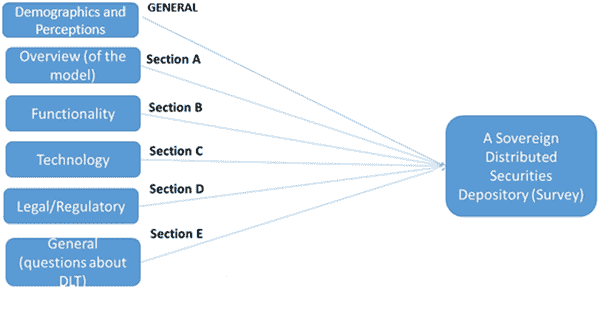 |

人口统计和感知（一般）

这个因素的目的是从受访者那里获取基本信息。但是，考虑到研究的背景和性质，受访者的看法和观点以及受访者的年龄和职位前置是很重要的。这个因素的目的是为了提供关于概念模型的一般反馈，受访者已被提供。主要是，受访者被要求验证模型的基本要素，比如其主权性质与公共分类账以及围绕感知实施时间的一般时间表。

模型概述（A 部分）

此因素的目的是介绍和验证概念模型，并提供概念模型的概述和解释。

功能性（分区 B）

此因素的目的是确定在概念模型中考虑的一般功能要求。为验证模型而包含的积极陈述的功能要求，配以可能验证模型的问题。

技术（分区 C）

此因素的目的是验证模型中讨论的主要技术组件。

法律/法规（分区 D）

此因素的目的是验证有关模型的法律和监管假设，包括验证将保留在模型中的监护链。此外，调查适用于新技术的证券结算的法律和/或监管框架。

DLT（分区 E）的一般问题

此因素的目的是考虑关于 DLT 实施的一般问题，特别是在回答关于拟议模型的问题之后。这一点很重要，因为这些问题中的每一个都有可能与其他因素相关联，并为先前在调查中询问有关模型的问题提供有意义的验证。

调查设计和抽样方法

在后来由受访者完成的调查中，考虑问题的性质非常重要。由于基于一种尚未在生产中完全证明的技术开发了一个概念模型，受访者可能会提供他们的意见，而不是具体的数值或名义答案。因此，问卷的设计至关重要，并且前面讨论的部分被用作指导以帮助受访者。所有问题都基于研究的文献综述。问卷（见附录 A）被发送给目标受众，并使用 Statistica 软件包对其进行分析以生成统计结果。此外，纳尔逊·曼德拉大学统计顾问丹尼·文特博士被委托制作和分析统计结果。

鉴于样本的规模以及每个受访者都是研究人员独特筛选的，选择了适当的非概率抽样方法。Saunders 等人（2012 年）描述了一种称为判断抽样的抽样技术，允许经验丰富的个人根据对样本成员最合适的特征的个人判断来选择样本单位。鉴于先前提供的信息，这个选项是这项研究的最合适选择。

数据和统计分析

该研究使用统计分析收集和分析了定量数据。数据来自阅读本研究案例（Everett 等人，2017 年）的受访者。通过使用描述性和推断性统计方法测试了概念模型（图 4）。

进行了以下描述性统计分析：

+   • 理解受访者的频率分布（年龄、对技术的理解等）；

+   • 每个因素的中心趋势和分布。

统计显著性是一个重要的目标，并且由 Alpha = 0.05 代表，p 值小于 0.05。Cohen’s D 用于一个样本 T 检验中的实际意义。范围在表 1 中说明。

表 1\. 科恩's d 解释区间（Gravetter 和 Wallnau, 2009: p 264）

| 科恩's d 解释区间 |
| --- |
| <0.20 | 不显著 |
| 0.20 - 0.49 | 小 |
| 0.50 - 0.79 | 中 |
| 0.80+ | 大 |

Pearson 积矩相关分析也进行了，如果 n=33 的 p 值为 0.05，则相关系数是统计显著的 (Gravetter 和 Wallnau, 2009)。Pearson's 卡方检验、方差分析和 t 检验被进行以检查各种人口统计变量之间的关系。此外，进行了推理排名。

可靠性和效度

进行的研究需要其他研究者可以重复，假设相同的方法被应用来得出类似的结论（Greener, 2008）。此外，Collis 和 Hussey (2014) 关注问卷的稳健性，并提供了三种可能的可靠性测试，这些测试应该在设计阶段使用，即：

+   • 重测：这涉及重新创建第一次调查的条件，然后要求参与者重新测试。这种方法只建议作为一种补充措施；

+   • 内部一致性：这种方法在统计上被包括以将问卷中问题的回答与问卷中其他问题相关联；和

+   • 替代形式：这涉及比较对同一问题的替代/不同形式的回答。

为了本研究的目的，内部一致性和备用形式被用来确定可靠性。根据 Greener（2008）的说法，研究覆盖有效性的三个组成部分是很重要的，即：外部效度、构想效度和内部效度。Greener（2008）进一步解释了这三个组成部分的区别以及它们如何相互关联，即：

+   • 外部效度确保非研究人员能够轻松确定这种研究方法是否适合回答提出的问题。更进一步解释，测量方法应该能够在测量中使用（Collis 和 Hussey，2014）；

+   • 构想效度关注于问卷中被要求的内容的可测量性。根据 Greener（2008）的说法，这是为了确保被调查者正确理解问题；以及

+   • 根据 Greener（2008）的说法，内部效度是必要的，以确保自变量（或因素）完全负责因变量（或效应）的结果，并确保这些不仅仅是假设。

问卷项目是从文献中操作化的。此外，计算科学系的学者和 NMU 统计学家能够验证问题，以确保研究工具的有效性。

道德要求

Collis 和 Hussey（2014）指出，研究伦理对于研究项目的成功至关重要。此外，他们详细说明了促进道德要求的准则，如：

+   • 必须确保所有参与者的隐私、保密性和匿名性；

+   • 参与者需要部分或全部撤回的能力；

+   • 应该避免任何潜在的不适、焦虑或伤害；

+   • 参与者有权获得与问卷相关的知情同意；以及

+   • 信息应该透明地和诚实地收集。

我们从纳尔逊·曼德拉大学伦理委员会获得了完整的道德批准，编号为 H18-SCI-CSS-006。

研究结果和讨论

实证研究的结果在本节中进行了展示和讨论。研究对象包括 47 名国际受访者，其中 33 人完成了调查，响应率为 70%。

人口资料

以下表格提供了关于 33 名受访者的基本人口统计信息。需要注意的是，本问卷的目标受众都具有相对广泛的后交易证券工作知识作为前提。

表 2. 用户群频率分布

| 用户群 | n | % |
| --- | --- | --- |
| 法律/监管 | 3 | 9% |
| Technologist/Consultant | 6 | 18% |
| 高级管理人员 | 21 | 64% |
| Operations | 3 | 9% |
| Total | 33 | 100% |

表 2 显示了受访者根据其当前角色或就业情况的用户群的频率分布。最常见的受访者是高级管理人员，其次是技术人员/顾问，最后是法律/监管和运营受访者人数相等。

表 3. 年龄频率分布

| 年龄 | n | % |
| --- | --- | --- |
| 21-30 | 0 | 0% |
| 31-40 | 11 | 33% |
| 41-50 | 14 | 43% |
| 50+ | 8 | 24% |
| Total | 33 | 100% |

表格 3 列出了受访者年龄的频率分布。受访者通常是中年人，只有 8 人超过 50 岁。

DLT 观念

表 4 提供了本研究的一个重要定性方面。它展示了受访者对 DLT 的理解的频率分布，以自我评估的形式呈现。73% 的人对 DLT 有中级或高级的理解。

表 4. DLT 理解频率分布

| DLT 理解 | n | % |
| --- | --- | --- |
| Basic | 9 | 27% |
| Intermediate | 18 | 55% |
| 高级 | 6 | 18% |
| Total | 33 | 100% |

在表 5 中，受访者的频率分布呈现，关于他们对该技术如何在可能的实施中被看待的看法。值得注意的是，73% 的受访者声称对该技术有中级或更好的了解，而 27% 的受访者维持对该技术的基本理解。

表 5\. 频率分布 – DLT 视角

| DLT 视角 | n | % |
| --- | --- | --- |
| 变革将是渐进的 | 24 | 73% |
| 技术尚不成熟，不太适用 | 2 | 6% |
| 这是一个‘时尚’，最终只会用于利基应用 | 3 | 9% |
| 变革将是革命性的 | 4 | 12% |
| 总计 | 33 | 100% |

表 4 和表 5 报告的结果提出了以下有趣的观点，即：

+   • 认为变革将是渐进的受访者数量（n=24，占 73%）与那些声称对该技术有中级或更好了解的受访者数量相似。进一步调查发现，这 24 名受访者中，有 17 名声称对该技术有中级或更好的了解，而其中 21%（n=6）的受访者声称对该技术有基本了解。此外，这 24 名受访者中有 17 名（71%）是高级经理，而其余 7 名（29%）的受访者由法律/监管、运营和技术/顾问组成；

+   • 两位受访者（6%）认为这项技术尚不成熟，不适用于证券结算，分别被指定为对该技术有基础了解的一位高级经理和一位对该技术有中级了解的运营受访者；

+   • 三位受访者（9%）认为这项技术是‘时尚’，最终只会用于利基应用，分别被指定为对该技术有基础和中级了解的两位高级经理，以及一位对该技术有中级了解的技术/顾问受访者；和

+   • 四位受访者（占 12%）认为这项技术将对证券结算产生革命性影响，他们中间的所有人对该技术都有中级或高级的理解，并且在一位高级经理、法律/监管受访者和两位技术人员/顾问受访者之间存在分歧。

受访者的观点结果可以进一步详细分析如下：

+   • 六位技术人员/顾问中的任何一个（即 18%）都不认为这项技术不适用于证券结算。值得注意的是，技术人员/顾问对技术有着最全面的了解（比任何其他用户群都有更高级的理解）。这意味着更加技术导向的受访者隐含地承认，这项技术适用于证券结算；

+   • 五位受访者（占 15%），其中三位是高级经理，一位是运营人员，一位是技术人员/顾问，似乎不赞成使用该技术，并且是唯一一组认为该技术尚不成熟、不适用于证券结算并且只会用于利基应用的用户群。还需要注意的是，这些受访者对技术有基本或中级的理解。这些受访者很可能目前在中介机构工作，如中央证券存管机构、银行等。

+   • 大多数高级经理（即 19 位受访者中的 58%）要么认为这项技术将以渐进式方式，要么以革命性方式实施。必须注意的是，渐进式选项是一种更受欢迎的选项，大约 90%的高级经理更倾向于以渐进方式实施技术，而不是革命性实施技术。

图 6 描述了与最终用于使用的最终子因素的发展相关的三个阶段。进行此练习的原因是出于尼尔森·曼德拉大学的统计学家丹尼·文特博士的建议，以提高收集到的数据的统计相关性。此练习分三个阶段进行，第一阶段对因素进行了一系列的统计分析，然后在第二阶段进行了调整和重新执行。最后，这些因素在第三次进一步调整以形成第三个和最后一个阶段 3，该阶段用于统计分析。

| 图 6\. 主权分布式证券存款的最终 10 个因素 |
| --- |
| 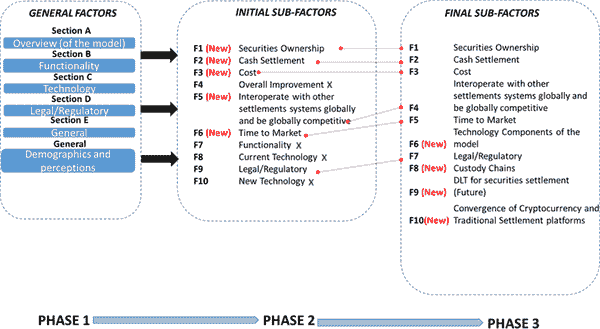 |

总分的可靠性

为了评估总分的内部可靠性，使用了克朗巴赫α系数。如上所述，这个特定研究的挑战在于问卷涉及潜在的未来状态，并且并未应用于对被调查者的当前和具体事物。因此，从这种测量技术中获得高度可靠的分数的期望并不高。 Hinton 等人（2004 年）提供了克朗巴赫α系数的使用指南，这可以在对分数进行总结并确定因素之间的一致性后使用。克朗巴赫α值的解释如表 6 中所述。

表 6\. 克朗巴赫α值的解释

| 不可接受 | < 0.50 |
| --- | --- |
| 可接受 | 0.50 - 0.69 |
| 良好 | 0.70 - 0.79 |
| 优秀 | 0.80 + |

表 7\. 克朗巴赫α值

| 因素 | 克朗巴赫α值 | 解释 |
| --- | --- | --- |
| F1- 证券所有权 | 0.25 | 不可接受 |
| F2- 现金结算 | 0.48 | 不可接受 |
| F3- 成本 | 0.53 | 可接受 |
| F4- 与全球其他结算系统互操作并具有全球竞争力 | 0.16 | 不可接受 |
| F5- 市场上市时间 | 0.79 | 良好 |
| F6- 模型的技术组成部分 | 0.55 | 可接受 |
| F7- 法律/监管 | 0.60 | 可接受 |
| F8- 托管链 | 0.37 | 不可接受 |
| F9- 证券结算的 DLT（未来） | 0.57 | 可接受 |
| F10- 加密货币和传统结算平台的融合 | 0.51 | 可接受 |

如表 7 所报告的 Cronbach's alpha 结果显示，有五个可接受的因素，分别是 F3（成本）、F6（模型的技术组件）、F7（法律/监管）、F9（证券结算的 DLT）和 F10（加密货币与传统结算平台的融合）。在可能的十个因素中表现出“良好”可靠性的因素有一个，即 F5（上市时间）。

因素的描述性统计

下一节讨论了最终达成的每个因素的描述性统计。每个问题都设计为 5 点李克特量表的一部分，但是为了描述这些因素，非常负面和负面被合并为负面（1.00 到 2.59），而中性保持不变，正面（3.41 到 5.00）包括正面和非常正面的组合。

表 8\. 因素的描述性统计（n = 33）

| 因素 | 负 1.00 到 2.59 | 中性 2.60 到 3.40 | 正 3.41 到 5.00 |
| --- | --- | --- | --- |
| F1- 证券所有权 | 6 | 18% | 16 | 48% | 11 | 33% |
| F2- 现金结算 | 5 | 15% | 11 | 33% | 17 | 51% |
| F3- 成本 | 3 | 9% | 4 | 12% | 26 | 79% |

| F4- 与其他全球结算系统互操作

并且具有全球竞争力 | 2 | 6% | 17 | 52% | 14 | 42% |

| F5- 上市时间 | 14 | 42% | 7 | 21% | 12 | 36% |
| --- | --- | --- | --- | --- | --- | --- |
| F6- 模型的技术组件 | 0 | 0% | 10 | 30% | 23 | 70% |
| F7- 法律/监管 | 0 | 0% | 5 | 15% | 28 | 85% |
| F8- 托管链 | 2 | 6% | 13 | 39% | 18 | 55% |
| F9- 证券结算的 DLT（未来） | 8 | 24% | 14 | 42% | 11 | 33% |

| F10- 加密货币和传统

结算平台 | 9 | 27% | 16 | 48% | 8 | 24% |

表 8 强调了每个因素的最高描述性统计数据，用红色表示。这表明，对于每个因素，调查对象认为五个因素具有明显的积极结果，而另外四个因素被大多数调查对象认为是中性的。因素 F5（上市时间）是唯一一个具有实质性负面描述性统计因素的因素。

因素的推断统计学

使用单样本 t 检验确定各种因素的调查对象平均得分是否可描述为负面、中性或正面。这些测试的结果报告在表 9 中。

表 9\. 因素的中心倾向和离散度（n = 33）

| 变量 | 平均值 | 标准差 | H[1]:m | t | p | Cohen's d |
| --- | --- | --- | --- | --- | --- | --- |
| F1- 证券所有权 | 3.22 | 0.69 | ≠3.40 | -1.48 | .148 | n/a |
| F2- 现金结算 | 3.41 | 0.84 | ≠3.40 | 0.06 | .951 | n/a |
| F3- 成本 | 3.65 | 0.66 | ≠3.40 | 2.20 | .035 | 0.38 |

| F4- 与全球其他结算系统互通

并具有全球竞争力 | 3.39 | 0.61 | ≠3.40 | -0.06 | .953 | n/a |

| F5- 上市时间 | 2.88 | 1.11 | ≠2.60 | 1.44 | .159 | n/a |
| --- | --- | --- | --- | --- | --- | --- |
| F6- 模型的技术组件 | 3.77 | 0.48 | ≠3.40 | 4.39 | <.0005 | 0.77 |
| F7- 法律/监管 | 3.92 | 0.48 | ≠3.40 | 6.21 | <.0005 | 1.08 |
| F8- 保管链 | 3.44 | 0.47 | ≠3.40 | 0.44 | .660 | n/a |
| F9- 证券结算的分布式账本（未来） | 3.20 | 0.78 | ≠3.40 | -1.46 | .154 | n/a |

| F10- 加密货币和传统的融合

结算平台 | 2.96 | 0.56 | ≠2.60 | 3.72 | .001 | 0.64 |

从表 9 可以看出，突出显示的人口均值为正值（M>3.40），对于因素 F3（成本，M=3.65）具有较低的实用性和统计显著性。因素 F6（模型的技术组件，M=3.77）产生了较大的统计显著性和中等实用性。因素 F7（法律/监管，M=3.92）获得了较大的统计显著性和实用性。

人口平均值为中立（2.60 <= M <= 3.40）对于 F10（加密货币和传统结算平台的融合），M=2.9，尽管具有中等的实际意义。对其他因素得到的结果不明确：F1（证券所有权）、F2（现金结算）和 F4（与其他全球结算系统互操作并具有全球竞争力）的人口平均值。F8（托管链）和 F9（证券结算的 DLT）可能是中立的或积极的。F5（上市时间）的平均值可能是负面的（M<2.60）或中立的，尽管它具有中等的实际意义。

皮尔逊乘积矩相关性

Gravetter 和 Wallnau（2009）指出，在相关性为 0.3 时具有实际意义，而相关系数超过 0.5 被认为具有统计显著性的强相关性。因此，3.44 因子（上述交点）在统计上和实际上都是显著的。表 10 使用皮尔逊乘积矩相关性（n = 33），旨在得出既具有统计意义又具有实际意义的相关性结论。

表 10. 因素的皮尔逊乘积矩相关性（n=33）

| 因素 | F1 | F2 | F3 | F4 | F5 | F6 | F7 | F8 | F9 | F10 |
| --- | --- | --- | --- | --- | --- | --- | --- | --- | --- | --- |
| F1- 证券所有权 | - | .205 | -.376 | .147 | -.316 | .295 | .186 | .211 | .036 | .265 |
| F2- 现金结算 | .205 | - | -.342 | -.019 | -.121 | .242 | .174 | .080 | -.099 | .216 |
| F3- 成本 | -.376 | -.342 | - | -.282 | .616 | -.027 | -.020 | -.302 | .366 | -.463 |

| F4- 与其他结算系统互操作

系统在全球范围内

和全球竞争力

竞争性 | .147 | -.019 | -.282 | - | -.514 | -.455 | .059 | .128 | -.040 | .521 |

| F5- 上市时间 | -.316 | -.121 | .616 | -.514 | - | .151 | .157 | -.368 | .509 | -.473 |
| --- | --- | --- | --- | --- | --- | --- | --- | --- | --- | --- |

| F6- 技术组件

模型 | .295 | .242 | -.027 | -.455 | .151 | - | .318 | -.039 | .168 | -.335 |

| F7- 法律/监管 | .186 | .174 | -.020 | .059 | .157 | .318 | - | .195 | .193 | .133 |
| --- | --- | --- | --- | --- | --- | --- | --- | --- | --- | --- |
| F8- 保管链 | .211 | .080 | -.302 | .128 | -.368 | -.039 | .195 | - | -.167 | .273 |

| F9- 证券的分布式账本技术

结算（未来） | .036 | -.099 | .366 | -.040 | .509 | .168 | .193 | -.167 | - | -.327 |

| F10- 加密货币与传统结算的融合

和传统

结算平台 | .265 | .216 | -.463 | .521 | -.473 | -.335 | .133 | .273 | -.327 | - |

表 10 显示因素之间主要呈现出微不足道的正负相关。然而，重要的是要强调主要的正向和负向相关，并理解它们如何被解释。我们发现 F3（成本）与 F5（上市时间）之间存在着强烈的正相关，M= .616；F4（与全球其他结算系统互操作并具有全球竞争力）与 F10（加密货币与传统结算平台的融合）之间存在着强烈的正相关，M= .521；以及 F5（上市时间）与 F9（证券结算的分布式账本技术）之间存在着显著的正相关，M= .509。F3（成本）与 F9（证券结算的分布式账本技术）之间存在着显著的正相关，M =. 366。

F4（与全球其他结算系统互操作并具有全球竞争力）与 F5（上市时间）之间存在强烈的负相关性，M= -0.514。F10（加密货币与传统结算平台的融合）与 F5（上市时间）之间进一步发现了显著的负相关性，M= -0.473；F10（加密货币与传统结算平台的融合）与 F3（成本）之间的负相关性为 M= -0.463；F4（与全球其他结算系统互操作并具有全球竞争力）与 F6（模型的技术组成部分）之间的负相关性为 M= -0.455。F1（证券所有权）与 F3（成本）之间的负相关性为 M= -0.376；以及 F8（托管链）与 F5（上市时间）之间的负相关性完成了其余的显著负相关性，M= -0.368。在表 11 中，每个三个分组中排名的十个因素被提出。第一组包括 F7（法律/监管）、F6（模型的技术组成部分）和特别是 F3（成本）。

进一步分析表 11 表明，这 10 个因素可以分组并排名为 3 个统计学意义的组：

+   • 第一组包括 F7（法律/监管）、F6（模型的技术组成部分）和 F3（成本），这些因素具有正均值。从第一组的关键推断是特别包括成本因素（F3）。鉴于有新的技术组件和更多的法律和监管前提条件适用于技术，这些都会带来合理的成本后果。因此，包含 F3（成本）尤为重要；

+   • 第二组，具有中性均值，包括 F8（托管链）、F2（现金结算）、F4（与全球其他结算系统互操作并具有全球竞争力）、F1（证券所有权）和 F9（证券结算的 DLT），作为一组描述了模型的功能要求；和

+   • 第三组因素最少，即 F10 (加密货币和传统结算平台的融合) 和 F5 (上市时间)，因此排名最低。

表 11. 每个因素的推论排名均值 (n=33)

| 因素 | 排名 | 重要性组 | 均值 | 标准差 |
| --- | --- | --- | --- | --- |
| F7- 法律/监管 | 1 | 1 | 3.92 | 0.48 |
| F6- 模型的技术组件 | 1 | 1 | 3.77 | 0.48 |
| F3- 成本 | 1 | 1 | 3.65 | 0.66 |
| F8- 保管链 | 4 | 2 | 3.44 | 0.47 |
| F2- 现金结算 | 4 | 2 | 3.41 | 0.84 |
| F4- 与全球其他结算系统互操作并具备全球竞争力 | 4 | 2 | 3.39 | 0.61 |
| F1- 证券所有权 | 4 | 2 | 3.22 | 0.69 |
| F9- 证券结算的 DLT (未来) | 4 | 2 | 3.20 | 0.78 |
| F10- 加密货币和传统结算平台的融合 | 9 | 3 | 2.96 | 0.56 |
| F5- 上市时间 | 9 | 3 | 2.88 | 1.11 |

这也似乎是一个合乎逻辑的结论，因为第一组提到了额外的技术需求、成本和法律前提，第二组提到了模型的功能需求。这一推断的主要原因是，加密货币有可能会继续与传统结算平行存在，考虑到实施证券结算的 DLT 可能的复杂性和成本，上市时间不太可能是一个重要的标准。

受访者评论的定性分析

研究中使用的问卷调查表 (附录 A) 为受访者提供了回答开放性问题的机会。总体反应是，模型得到了广泛认可。受访者认识到，大规模行业支持、合作和专注于金融业务案例及相关成本，将是实施这样一个模型的关键。

受访者评论中出现了以下显著主题：

+   • 模型基本经过验证；

+   • 成本是一个需要考虑的主要因素；

+   • 证券结算向 DLT 的转变将是一种渐进式的转变；

+   • 去中介化的概念：在这种情况下，尽管现有中介的去中介化是可能的，但很可能他们会继续存在，尽管可能会履行与目前不同的功能；以及

+   • 上市时间是另一个主要主题，普遍存在，似乎实施这样一个提议的模型可能需要超过十年的时间，并且将需要跨多个中介和价值链中的参与者进行大量协调和支持。

该模型的一个关键批评是现金分类账应该包含在总模型中，而不是作为一个可互操作的单独分类账。此外，按照评论数量从高到低的顺序，最常评论的主题是以下几个：

+   • 保管链（现有中介和/或这些中介之间的互操作性）；

+   • 上市时间：所有人都同意估计为 10 到 15 年；

+   • 现金结算：需要解决并包括在证券分类账中；以及

+   • 成本：潜在解决方案的成本将是需要考虑的一个关键因素。

研究结果摘要

统计分析结果摘要提供了对模型开发有用信息。它还提供了为什么 DLT 尚未完全实施到后期证券结算行业的推理。主要发现被总结为各种主题，并在下面进行讨论。

成本

在整个研究中最一致的发现与成本因素有关，该因素具有可接受的克朗巴赫α系数得分，由于对技术的理解水平提高，似乎更加重要，并且与上市时间和证券结算的 DLT 解决方案所使用的模型高度相关。此外，预先要求识别了诸如额外的技术组件、法律和监管要求、新的接口要求以及与现有参与者的集成在推理排名中的因素。由于每个因素都带来了一定的成本，因此在推理排名中包含成本后果是重要且相关的。这些信息为将来在考虑成本方面实施技术提供了模型，同时也提供了技术尚未成功在生产环境中实施的潜在原因。

法律/监管要求

下一个一致的主题是法律/监管考虑因素，这一因素在可接受的克朗巴赫α系数得分上排名最高，并且在团体和个人问题基础上的推理排名也很高。此外，这一因素提供了大量的统计证据，并且可能具有实际用途。这里的主要发现是，在建立这样一个模型之前，需要有一个明确的法律和监管框架。这本质上意味着这一因素也成为了这些解决方案在交易后证券结算中构建的关键成功因素。

上市时间

上市时间与至少五个其他因素强烈正相关或负相关，并且与互操作性和全球竞争力密切相关。这意味着一个被全球接受的解决方案，能够解决现有企业和技术的互操作性需求，将是一个关键驱动因素，从而使技术更快地进入市场。此外，来自开放性问题的指示表明，合适的全球解决方案至少还需十年的时间。

附属叙事

除了前面提到的主题之外，尽管大多数受访者表示，这项技术的变革将是一种渐进式的变化，但他们支持区块链技术确实适用于证券结算的观点。进一步来说，本研究的发现创造了一种协同演进的挑战叙事，作为管理在成熟市场中实施所谓的颠覆性技术（包括 DLT/区块链）的方法。为了解释这一点，将“颠覆性”一词与区块链联系起来。无论这项技术的所谓好处是什么，这种关联都不利于在成熟市场中实施技术，从而无论技术的实际实施如何，都不会得到行业的支持。现有企业很可能会采取技术孤立化的方式，因此无法获得行业支持，或者集中精力维持当前的技术以应对颠覆的威胁。

在成熟的市场中，技术发展显然是渐进的。本研究中的因素，如 F4（证券结算的 DLT）和 F10（加密货币与传统结算及技术组件的融合），指向了一种协作和包容的方式来开发市场的新技术模型。尽管上述因素具有可接受的克朗巴赫α值，从本质上验证了概念模型，但现金结算（作为模型的关键组成部分）未经验证。此外，现金结算在开放性问题中被证明是有分歧的。这导致了结论，即现金结算需要作为结算过程的一部分被纳入；最终需要解决的问题是，无论是在证券结算之前还是与之同时解决。

短期和孤立的价值链中断的威胁不太可能发生。需要与新技术、行业现有企业和监管机构进行行业规模上的互操作和合作，以便及时采用新技术。这种叙述需要与协作方式中确定的三个关键主题（成本、法律/监管要求和上市时间）相叠加，将是实施模型的主要成功因素。总之，只有在达成了行业范围的商业案例之后，这样的模型才能成功实施。此外，引入这些新技术的方法应该以此处开发的协作式渐进挑战者的概念为指导，而不是孤立的颠覆性金融科技。

提出的概念模型的实施

区块链技术有潜力使与金融业相关的任何流程去中介化（《经济学家》，2014 年）。在证券结算交易供应链内的所有金融服务提供商，包括 CSDs，都是潜在的去中介化点。区块链技术是证券结算的适当平台。使用区块链技术实施所提议的概念模型需要各种角色扮演者和利益相关者的协作，还需要国际合作。目前，正在开发一个基于以太坊平台的原型区块链应用，用于研究目的。

证券结算原型区块链项目需要与监管机构、中介机构、发行人和投资者进行市场协调和规划，以验证所提议的主权分布式证券存管概念模型。该原型使用以太坊区块链存储数据。在这里，需要对所有利益相关者的需求进行详细分析。如何对价值链进行建模和管理与所有利益相关者的需求获取过程的决策由 NMU 研究团队负责。

所提出的区块链应用由三个不同的组件组成。第一个组件是智能合约，运行在以太坊虚拟机上。智能合约组件使用当前在以太坊虚拟机上使用的 Solidity 语言编写。需要决定在 SDSD 区块链上如何以及存储哪些数据，考虑到某些数据可能更适合存储在私有数据库中，而其他数据则存储在区块链上。所提出的应用的建模至关重要，并需要仔细规划。一旦代码放置在区块链上，它将永远存在。智能合约组件的挑战不仅在于规划存储哪些信息，还在于如何存储数据和信息。需要特别关注数据和信息的存储，因为开发人员正在考虑类，就像在编程中使用的那样，这可能会带来额外的成本。目标是在区块链上存储足够的数据和信息，以供公众了解过程中发生了什么，但不包括额外的数据和信息来泄露或显示任何敏感或机密数据。

第二个组件是区块链与用户前端或用户界面之间通信的协议。一旦模型设计完成并创建了智能合约，就需要创建一个协议。协议将规定何时、如何以及需要写入或从区块链检索什么。创建协议涉及确保后端程序能从区块链中提取足够的信息，以向前端系统的用户显示相关信息。区块链数据结构与其他编程语言极不兼容。因此，创建一种简单的数据交换方式至关重要。

最后一个组成部分是提供用户界面与区块链交互并展示结果的应用程序。将使用任何常规编程语言来开发为所有利益相关者的程序，并使用区块链来存储和读取数据，而不是文本文件，数据库，网络请求等。该系统需要使用协议来读取相关信息，解析并向用户展示所需信息。程序需要向区块链写入数据并从区块链读取以展示价值链中的更新，并向管理 SDSD 过程的区块链写入更新。

管理建议

本研究的主要目标是为中央证券存管机构（CSD）使用区块链技术创建证券结算模型。目前全球范围内还没有任何 CSD 引入了可生产的基于区块链的证券结算解决方案。从文献中建立了一个概念模型，并在国际期刊上发表。这个模型构成了研究的基础，并被发送给全球的后期证券专业人士来验证所开发的概念模型。

管理建议是为了切实地弥补研究文献结果与实证研究之间的鸿沟而提出的。这些建议旨在改进未来对证券结算使用区块链技术的实施，并清晰地阐述对市场的潜在益处。

研究结果表明，包括三个主要组成部分和设计因素，即：成本、法律/法规和上市时间。此外，为了验证托管链的加入，技术组件，如加密货币和传统的结算系统，最终仍将保持分开。然而，发现现金结算要么是模型成功所需的前提条件，要么是平行发展。此外，该研究提出了一种贯穿全局的实施技术的方法，提出了"协作演进性挑战者"这一术语，以包容、咨询和全球市场共同努力构建新技术的商业案例。这种方法的重点主要集中在三个组成部分和设计因素上，即成本、法律/法规和上市时间。

证券所有权

《区块链承诺的不可变性》的文献中，最初将证券所有权作为证券结算的重要要求。鉴于区块链承诺的不可变性，证券所有权最终是一个无谓的问题，因为这在技术的使用中是假定的。然而，在该模型中对不可变性的可行性提出了质疑，但也提供了实际的解决方案（Euroclear 和 Oliver Wyman，2016）。

现金结算

现金结算应包括在与证券结算相同的分类账内。这种方法意味着在证券结算之前或同时，需要加入更广泛的行业接受和参与现金结算。无论哪种方式，潜在解决方案的上市时间都会受到负面影响。

成本

鉴于涉及到的附加技术组件、法律要求和多个利益相关者的协调，对所提出的模型的成本敏感度可能较高（Euroclear and Oliver Wyman，2016）。成本最终是研究中最重要的因素，以及提出的市场范围业务案例开发的合作演进挑战方法是本研究的主要发现。

与其他结算系统的互操作性

这一因素是重要考虑的因素，并被列为证券后交易结算系统的重要要求。需要注意的是，在基本设计元素（成本、上市时间和法律/监管框架）确定之前，此要求将次于列出的其他因素。一旦上述要素确定，此要求理想情况下应得到满足。

时间至市场

市场咨询、法律/监管改革和新技术的影响是耗时的活动。毫不奇怪的是，开放式问题的趣闻反馈显示预期的实施需要 10-15 年。这与像欧洲的 T2S 等大型跨地域项目的时间框架相一致，这些项目具有类似的现有企业。

模型的技术组件

该模型中的技术组件在很大程度上是可接受的，并且受到了良好的接待。技术的进一步发展将需要重新评估，并且需要与更广泛的市场之间建立一个持续的反馈机制。这是重要的，考虑到变化的速度和不断变化的市场需求。这些也将需要不断地针对本研究中已经确定的先决条件框架进行管理。

法律/监管

在这类项目合理启动之前，需要建立明确的、具有促进作用的法律和监管框架。在建立这样一个模型之前，清晰和促进性的法律和监管框架是一个明显可观的需求。因此，这一因素是在务实方式下建立任何后期证券结算解决方案的关键成功因素。

监护链

在这项研究所确定的 10 至 15 年的时间段内，现有的现有者很可能会继续存在，这些现有者是监护链的一部分，长期以来他们对于实施新技术将至关重要（Korman, 2017）。在监护链中，合作式的演变挑战者的方法也将至关重要，因为这种方法将需要证明对现有者和最终用户都有利。这将是推动变革、实现区块链技术在市场上带来好处的关键。

证券结算的 DLT 技术

八十五％的受访者认为证券结算将来会在 DLT/区块链技术上完成，而大多数（73％）表示这种变化将是渐进的性质。鉴于这种演变可能首先由现有的现有者发起，合作式的演变挑战者的方法再次将成为在任何给定市场中使用的一个重要方面。

加密货币和传统结算平台的融合

尽管加密货币对证券结算构成了实际影响，可能会通过犯罪活动或欺诈行为导致不稳定，但加密货币不太可能与传统结算平台整合。已观察到了潜在破坏的逆转，即相反的破坏。这被解释为，现有企业的商业模式并未受到威胁，而是提供加密货币服务（具有类似传统证券结算中提供的保障和治理）并直接与试图破坏它们的金融科技公司竞争。这是破坏威胁的间接结果，而不是寻求合作解决方案，这些方案将使整个市场受益。

局限性和最终结论

该研究的局限性包括由于因子负荷不足而被反转或删除的项目。具体而言，证券所有权、现金结算、与全球其他结算系统的互操作性以及监护链这四个因素的克伦巴赫α系数均达不到可接受水平。建议进行试点研究以确定任何不合适的问题，以改善克伦巴赫α系数。

该研究得出结论，证券所有权和现金结算、与全球其他结算系统的互操作性和全球竞争能力以及监护链，都必须从模型中删除。剩下的六个因素（成本、上市时间、模型的技术组成部分、法律/监管要求、证券结算的分布式账本技术（未来））以及加密货币与传统结算平台的融合，直接应用于验证提出的概念模型。

该研究始于对所谓的区块链技术和加密货币的颠覆性威胁的理解，以后的证券交易。在研究完成后，似乎一个中央证券存管机构（CSD）将转变为一个基于区块链的分布式市场存管机构，并且像中央证券存管机构这样的现有机构将参与相反的颠覆，并提供加密货币和传统结算，作为并行服务提供。目前，央行数字货币（CBDC）代表着将现金上链的下一步，并因此是本研究中看到传统资本市场转向分布式账本平台的最重要一步。未来的研究需要重点关注 CBDC 和证券在同一链或可互操作链上的实施，这代表了在该行业实现该技术优势的最可行机会。

参考文献

Atack, J., & Neal, L. (2009). 金融市场和机构的起源与发展：从 17 世纪到现在。剑桥大学出版社。 doi:10.1017/CBO9780511757419

Brennan, C., & Lunn, W. (2016), 信任颠覆者，https://www.finextra.com/finextra-downloads/newsdocs/document-1063851711.pdf，于 2016 年 8 月访问

Caprio, G. (2013). 证券结算系统。收录于《关键全球金融市场、机构和基础设施手册》(第 547–563 页)。学术出版社。

Collis, J., & Hussey, R. (2014). 商业研究（第 4 版）。麦克米伦。 doi:10.1007/978-1-137-03748-0

Capital Markets Regulation 委员会。 (2019). 区块链与证券清算与结算。https://www.capmktsreg.org/wp-content/uploads/2019/04/CCMR_statement_ Blockchain_Securities_Settlement-Final.pdf

Dickinson, K. (2015). 金融市场运营管理。约翰·威利。

DTCC. (2016). 拥抱颠覆。https://www.dtcc.com/~/media/Files/PDFs/DTCC-Embracing-Disruption.pdf

Euroclear 和 Oliver Wyman。 (2016). 资本市场中的区块链：奖励与旅程。 布鲁塞尔：Euroclear，Oliver Wyman。 [`www.euroclear.com/en/campaigns/Blockchain-in-capital-markets.html`](https://www.euroclear.com/en/campaigns/Blockchain-in-capital-markets.html)

欧洲央行。 (2007). 证券托管行业。 [`www.ecb.europa.eu/pub/pdf/scpops/ecbocp68.pdf`](https://www.ecb.europa.eu/pub/pdf/scpops/ecbocp68.pdf)

欧洲央行。 (2015). TARGET2-证券今日成功启动。 [`www.ecb.europa.eu/press/pr/date/2015/html/pr150622_2.en.html`](https://www.ecb.europa.eu/press/pr/date/2015/html/pr150622_2.en.html)

欧洲央行。 (2016). 证券后交易的分布式账本技术。 [`www.ecb.europa.eu/pub/pdf/scpops/ecbop172.en.pdf`](https://www.ecb.europa.eu/pub/pdf/scpops/ecbop172.en.pdf)

欧洲证券与市场管理局。 (2016). 应用于证券市场的分布式账本技术。 [`www.esma.europa.eu/press-news/esma-news/esma-assesses-usefulness-distributed-ledger-technologies`](https://www.esma.europa.eu/press-news/esma-news/esma-assesses-usefulness-distributed-ledger-technologies)

Eva，M. (2015). 托管链和资产价值：为什么值得考虑加密证券。 剑桥法律期刊，73(3)，505–533。

埃文斯，N. (2003). 商业创新和颠覆性技术：利用突破性技术获取竞争优势的力量。 美国新泽西州上萨德尔河：金融时报普林斯顿大厦。

Everett，S.，Calitz，A. P.，& Greyling，J. (2017). 为证券清算建立“主权”分布式证券托管机构的案例。 证券运营与托管杂志，9(3)，269-292。 [`www.henrystewartpublications.com/jsoc/v9`](https://www.henrystewartpublications.com/jsoc/v9)

金融稳定委员会。 (2009). 解决系统重要性金融机构问题。 [`www.fsb.org/what-we-do/policy-development/systematically-important-financial-institutions-sifis/`](https://www.fsb.org/what-we-do/policy-development/systematically-important-financial-institutions-sifis/)

弗洛里尼，J.，& Polato，M. (2014). 全球证券交易所行业经济学。 Palgrave Macmillan。 doi:10.1057/9781137321831

嘎纳特。 (2020). 嘎纳特新兴技术的炒作周期确定了组织必须跟踪的三个关键趋势，以获取竞争优势。 [`www.gartner.com/newsroom/id/3412017`](https://www.gartner.com/newsroom/id/3412017)

Gibson, C., & Kirk, T. (2016). 资产管理者的区块链 101。https://www.klgates.com/files/Publication/921292ec-0e76-4b4b-adf4-036b15c175fe/Presentation/PublicationAttachment/6489032d-7722-4dcc-a10c-09e7e9b4350e/Blockchain_101_for_Asset_Managers.pdf

Gorham, M., & Singh, N. (2009). 《电子交易：从交易场到比特》。Elsevier。

Gravetter, F. J., & Wallnau, L. B. (2009). 《行为科学的统计学》（第 8 版）。Wadsworth。

Greener, S. (2008). 《商业研究方法》。http://web.ftvs.cuni.cz/hendl/metodologie/introduction-to-research-methods.pdf

Harris, L. (2004). 《交易与交易所：从业者的市场微观结构》。牛津：牛津大学出版社

Hinton, P. R., McMurray, I., & Brownlow, C. (2004). 《SPSS 解析》。Routledge。doi:10.4324/9780203642597

Karp, N. (2015). 区块链技术：金融体系的终极颠覆。https://www.bbvaresearch.com/wp-content/uploads/2015/07/150710_US_EW_Blockchain Technology.pdf

Korman, Z. (2017). 关于区块链、中介和炒作。https://www.zkorman.com/writing/blockchain/

KPMG. (2018). 颠覆性技术的变化格局。https://home.kpmg/by/en/home/insights/2018/06/the-changing-landscape-of-disruptive-technologies.html

Loader, D. (2002). 结算、清算和托管。Butterworth-Heinemann。

Morgan Stanley. (2016). 全球洞察：银行业的区块链：颠覆性威胁还是工具？https://www.the-blockchain.com/docs/Morgan-Stanley-blockchain-report.pdf

Mori, T. (2016). 金融技术：区块链与证券结算。Deoitte and Touceh Tomatsu。

Natoli, C., & Gramoli, V. (2016). 区块链异常现象。https://arxiv.org/pdf/1605.05438v1.pdf

Nakamoto, S. (2008). 比特币：一种点对点的电子现金系统。https://bitcoin.org/bitcoin.pdf

O’Connor, D. (2004). 《经济学基础》。Greenwood。

Pilkington, M. (2015). 区块链技术：原理与应用。http://ssrn.com/abstract=2662660

Poelstra, A. (2014). 从权益证明的分布式共识是不可能的。 https://download.wpsoftware.net/bitcoin/old-pos.pdf

Saunders, M., Lewis, P., & Thornhill, A. (2012). 商业学生的研究方法 . 皮尔逊教育有限公司。

Swan, M. (2015), 金融服务。在区块链: 新经济的蓝图。 O'Reilly

Swanson, T. (2015). 共识即服务：关于许可的分布式账本系统的简要报告。 https://www.weusecoins.com/assets/pdf/library/Consensus-as-a-service%20-%20a%20brief%20report%20on%20the%20emergence%20of%20permissioned %20distributed%20ledger.pdf

经济学家. (2014). 加密货币 - 重大阻碍. https://www.economist.com/news/finance-and-economics/21596971-bitcoin-growing-too-fast-its-technology-keep-up-great-hiccup

Wall, E., & Malm, G. (2016). 利用区块链技术和智能合约创建分布式证券存托机构。 http://lup.lub.lu.se/student-papers/record/8885750

世界经济论坛. (2015). 金融服务的未来。 http://www3.weforum.org/docs/WEF_The_future__of_financial_services.pdf

世界交易所联合会. (2016). 金融市场基础设施和分布式账本技术。 https://www.world-exchanges.org/home/index.php/files/18/Studies%20-%20Reports/349/WFE%20IOSCO%20AMCC%20DLT%20report.pdf

Yilmaz, K. (2013). 欧洲教育杂志. 欧洲教育杂志, 48, 311–325\. doi:10.1111/ejed.12014

Zohar, A. (2015). 比特币 . 计算机协会通讯 . doi:10.1145/2701411

额外阅读

安永. (2020), 货币（R）的演变 II 区块链赋能 CBDC, https://www.accenture.com/_acnmedia/PDF-105/Accenture-Revolution-of-Money-II-2019.pdf#zoom=50, 访问于 2020 年 5 月

Ammous, S. (2016), 区块链技术：有什么好处？ SSRN: https://SSRN.com/Abstract=2832751, 访问于 2017 年 9 月

ECSDA. (2015), CSD Factbook, 第一版。 http://ecsda.eu/wp-content/uploads/2014_CSD_ Factbook.pdf, 访问于 2020 年 5 月

欧洲委员会. (2020), 中央证券存管机构 (CSDs) - 欧洲委员会, http://ec.europa.eu/finance/financial-markets/central_securities_depositories/ index_en.htm, 访问于 2020 年 5 月

金融行为监管局. (2018), 中央证券存管机构, https://www.fca.org.uk/markets/central-securities-depositories, 访问于 2020 年 5 月

金融行为监管局. (2020), 证券融资交易监管 (SFTR), https://www.fca.org.uk/markets/sftr, 访问于 2020 年 5 月

Inform, I. T. (2019), 区块链技术. https://www.informit.com/articles/article.aspx?p=2955143, 访问于 2020 年 5 月

Chase, J. P. M., & Wyman, O. (2020), 用区块链解锁经济优势: 资产管理者指南, https://www.oliverwyman.com/content/dam/oliver-wyman/global/en/2016/july/joint-report-by-jp-morgan-and-oliver-wyman-unlocking-economic-advantage-with-blockchain-A-Guide-for-Asset-Managers.pdf, 访问于 2020 年 5 月

毕马威. (2020), 抓住机遇 - 区块链与未来, https://assets.kpmg.com/content/dam/kpmg/pdf/2016/06/kpmg-blockchain-consensus-mechanism.pdf, 访问于 2020 年 5 月

毕马威. (2016), 区块链迎来大时代, https://home.kpmg.com/content/dam/kpmg/us/pdf/blockchain-hitting-the-big.pdf, 访问于 2020 年 5 月

Lafarre, A., & Van der Elst, C. (2018), 用于企业治理和股东活跃性的区块链技术. 欧洲公司治理研究所（ECGI） - 法律工作论文 No. 390/2018, https://ssrn.com/abstract=3135209, 访问于 2020 年 5 月

Mainelli, M., & Milne, A. (2016). 区块链对证券交易生命周期的影响与潜力. 计算机, 40(9), 96–99.

SWIFT. (2020), SWIFT 历史, https://www.swift.com/about-us/history, 访问于 2020 年 5 月

关键术语和定义

区块链技术：区块链技术并不是一种新技术，自 2008 年比特币协议诞生以来就一直作为其支柱存在。区块链技术消除了需要信任的第三方来处理交易并提供记录服务的需求，这对一些中介机构的核心业务功能构成威胁，如中央证券存管机构。区块链技术至今仍不是一种完全成熟的技术。

中央证券存管机构（CSD）：信任的第三方，例如交易所、经纪人、经销商和中央证券存管机构（CSD），在交易到后交易环境中运作。CSD 是一个联合市场倡议，用于为国家市场（国家或地区）结算高量的电子化股份并维护所有权的中央登记。D

分布式账本技术（DLT）：DLT 可以被视为提供能力将记录分布在网络中而不是与集中实体保持记录的‘区块链’。事实上，该技术结合了点对点网络、密码学技术和密码哈希技术以按照时间顺序处理交易。

证券结算模型（SSM）：这是一个概念模型，用于评估区块链相关技术在证券结算中的应用。

主权分布式证券（SDS）：所有证券都在‘主权’分布式证券账本（存管）（SDSD）中持有，分布在已知节点中。节点代表了具有已知实体/中介的托管链。在 SSM 中，SDSD 可以使用多签名技术确保投资者直接从卖方购买股票；然而，在交易结束之前，经纪人和银行/托管人会对交易进行签署/验证。

附录 A：问卷调查

主权分布式证券存管 - 试点评估研究

参与者编号：

用户群体：

高级管理

运营技术专家/顾问法律/监管

General:

您在证券行业或后期交易方面有多少年的经验？

+   a. 1-3 年

+   b. 4-5 年

+   c. 6-10 年

+   d. 10 年以上

你如何评价你对分布式账本技术（DLT）的理解？

+   e. 基础（仅理论知识）

+   f. 中级（我在概念上理解技术，并曾经交易过加密货币）

+   g. 高级（即我有一些构建这些应用的经验）

选择最能描述您对证券结算中分布式账本技术应用看法的选项：

+   h. 变革将是革命性的

+   i. 变革将是渐进的

+   j. 这项技术还不成熟，不适合

+   k. 这是一种‘时尚’，最终只会用于‘利基’应用

你属于哪个年龄段？

+   l. 21-30

+   m. 31-40

+   n. 41-50

+   o. 51+

请阅读解释主权分布式证券存管提议模型的论文。在阅读论文后回答以下问题。

| 问题 | 强烈不同意 | 不同意 | 中立 | 同意 | 强烈同意 | N/A |
| --- | --- | --- | --- | --- | --- | --- |
| A 部分 – 概览 |
| 5 | 在审阅附加文件后，证券结算在未来 5 到 10 年仍将按国家划分。 | O | O | O | O | O | O |
| 6 | 使用 DLT 进行国际证券结算可能通过连接/链接不同国家的结算系统来促进。 | O | O | O | O | O | O |
| 7 | 证券结算平台将服务于传统的证券结算，同时也将促进加密资产的买卖，尽管在不同的平台上。 | O | O | O | O | O | O |
| 8 | 与论文中描述的模型类似的模型将在您的市场内在 5 到 10 年内可能实现。 | O | O | O | O | O | O |
| 9 | 所有证券结算都将在 5 到 10 年内实现一个公共账本解决方案（不受国家/地区限制）是可能的。 | O | O | O | O | O | O |
| B 节 – 功能 |
| 10 | 此模型中实施的分布式账本技术将改善证券结算的某些方面。 | O | O | O | O | O | O |
| 11 | 现金账本应与证券结算系统分开。 | O | O | O | O | O | O |
| 12 | 遗留系统与预期平台的整合至关重要。 | O | O | O | O | O | O |
| 13 | 支持监管链功能对于模型至关重要。 | O | O | O | O | O | O |
| 14 | 根据需要修改证券记录是一个重要的需求。 | O | O | O | O | O | O |
| 15 | 文中描述的平台应为证券结算生态系统的其他利益相关方（如托管人、资产管理人、交易所等）提供功能。 | O | O | O | O | O | O |
| 16 | 该平台应提供功能以削减证券结算生态系统中的现有参与者，如中央证券存管机构或托管人。 | O | O | O | O | O | O |
| 17 | 与其他公共账本的互操作性将是一个重要的需求（如以太坊）。 | O | O | O | O | O | O |
| C 节 – 技术 |
| 18 | 许可账本适合于该模型。 | O | O | O | O | O | O |
| 19 | 神谕的使用对于模型的成功标准至关重要。特别是作为数据源和监管目的。 | O | O | O | O | O | O |
| 20 | 元层的使用对于模型的成功至关重要。 | O | O | O | O | O | O |
| 21 | 分布式账本技术的技术发展对证券结算而言将是渐进的，而非颠覆性的。 | O | O | O | O | O | O |
| 22 | 账本之间的接口（私有或公共）代表着需要在模型中加以缓解的关键风险。 | O | O | O | O | O | O |
| 23 | 鉴于这通常是一个高价值、低交易量的环境，工作量证明将是一个适合采用的协议。 | O | O | O | O | O | O |
| 24 | 鉴于这通常是一个高价值、低交易量的环境。权益证明将是一种适合采用的协议。 | O | O | O | O | O | O |
| D 节- 法律/监管 |
| 25 | 监管机构更倾向于区块链上的原生资产，而不是代币化的资产。 | O | O | O | O | O | O |
| 26 | 监管机构更有可能在现有市场参与者而不是新市场参与者的情况下在这项技术上试行基于生产的结算系统。 | O | O | O | O | O | O |
| 27 | 托管链将继续存在于 DLT 环境中，因此固有的法律风险也将继续存在。 | O | O | O | O | O | O |
| 28 | 法律协议将需要反映与技术相关的风险（即公共账本中网络的完全崩溃）。 | O | O | O | O | O | O |
| 29 | 智能合约可以被实施以自动执行法律协议和其他具有法律约束力的结算义务。 | O | O | O | O | O | O |
| 30 | 法规将需要扩展以详细说明 DLT 在证券结算中的使用，无论是原生资产还是代币化资产。 | O | O | O | O | O | O |
| E 节- 通用 |
| 31 | 使用 DLT 最终将改变整个景观，发行人和投资者将能够在无中介的情况下进行交易。 | O | O | O | O | O | O |
| 32 | 加密货币和证券（加密资产）最终将以相同的方式进行交易，传统的后期交易基础设施将变得多余。 | O | O | O | O | O | O |
| 33 | DLT 不适用于证券结算。 | O | O | O | O | O | O |
| 34 | 证券结算的 DLT 实施将比当前的后期交易基础设施更加复杂和昂贵。 | O | O | O | O | O | O |
| 35 | 银行主导的技术联盟推动技术最终将推动中庸的解决方案，进一步巩固现有市场参与者的地位。 | O | O | O | O | O | O |
| 36 | 这项技术还太不成熟，没有经过验证。 | O | O | O | O | O | O |
| 37 | DLT 实施最终将导致网络的自我调节 | O | O | O | O | O | O |
| 38 | 该技术目前尚未发生重大故障，而未知的影响太大，以至于无法冒险影响整个经济。 | O | O | O | O | O | O |
| 39 | 例如 DAO（以太坊）证明了即使是公共分类帐也最终需要集中化的决策。 | O | O | O | O | O | O |
| 40 | 记录的不可变性并非始终是一个优势。 | O | O | O | O | O | O |

+   41\. 列出模型的积极因素：

+   42\. 列出模型的负面因素：

+   43\. 如何改进该模型？

+   44\. 如果您认为现有企业将被排除在外，请说明您认为如何以及为什么会这样。

+   45\. 关于该模型是否有其他评论？

感谢您参与研究。

调查结束
