# 第二部分

# 区块链技术使用案例

# 第九章

# 区块链技术：

行业倡议和使用案例

+   Zaigham Mahmood

    

    英国北安普顿大学 & 中国石家庄铁道大学

摘要

区块链技术可能是自互联网出现以来最具吸引力的创新。区块链指的是分布在多台计算机上的开放式分布式账本，以更高效、透明和安全的方式记录数字交易。区块链由许多块组成，每个块包含与数字资产相关的数据和将其链接到链中前一个块的哈希头。这些块彼此链接在一起，并且可以添加和删除新的块，遵循一种共识过程。此外，参与交易的各方可以共享分布式数字账本，而无需中央化的中介机构。本章旨在介绍区块链技术，并讨论在社会各个领域中的使用案例和倡议，特别是在区块链产品供应商和服务提供商中。为了完整起见，还讨论了特征、优势、类型、基础技术和平台。

引言

区块链技术可能是自互联网出现以来最重要的创新。它承载着与印刷机或互联网相同的承诺，允许新形式的安全和匿名通信在社会的许多不同领域和众多行业中发生。区块链可能颠覆的领域包括医疗保健、交通运输、供应链、风险管理、制造业、旅游业、银行业、教育和政府等。区块链技术仍在发展，但它已经通过流程数字化、自动化、物理资源的标记化和利益相关者之间复杂合同的编码推动着数字革命。已经公开接受这项技术的国家包括中国、美国、英国、阿联酋、日本、新加坡和澳大利亚。据 Market Watch（2020）报道，区块链市场份额预计将在 2025 年超过 250 亿美元。

区块链技术的概念最初被称为 block chain，最早是在 2008 年由中本聪在一篇比特币白皮书中宣布的。第一次实施出现在 2009 年（Zaky，2020）。这基本上是认识到了支撑“比特币”运作的技术（现在可以将其视为区块链应用）可以与货币分开，并用于各种其他组织间的合作。然后，在大约 10 年的时间里，区块链技术在智能合约、工作证明和区块链扩展方面进一步发展。区块链技术发展的简要时间表如图 1 所示。

| 图 1. 区块链技术演变时间线 |
| --- |
|  |

区块链技术的特点包括去中心化、不可变性、透明度、安全性、共识和智能合约（Rosic，2016; Tasca 和 Tessone，2019）。Witscad（2020）将这些特点分为功能特性和新兴特性，如图 2 所示。这些将在本章的后续部分中进行解释。由于这些特性的吸引力，自 2014 年以来，区块链已经开始引起人们的注意，超越了其加密货币根源。这项技术现在已经超越了其在加密货币（如比特币）中的初始应用。它现在被应用于几乎社会的每个领域，包括银行业、医疗保健、制造业、交通运输、物流、供应链管理和风险管理等等，正如之前提到的。

本章的组织如下。下一主要部分定义了区块链技术，描述了基本术语，概述了主要特征和优势，描述了区块链的基本概念和类型，并概述了通用的区块链流程。出于完整性考虑，还总结了各种知名的区块链平台。下一主要部分列出了来自不同行业、供应商和服务提供商的各种用例，以及目前存在的各种倡议。最后一节提出了结论。

希望这一章为进一步讨论本书其他章节中出现的各种与区块链相关的调查铺平了道路。

区块链技术

区块链是一个共享的分布式账本（数据库），分布在许多计算机上，没有中央控制或权威，其中记录和链接数字资产（代表价值、身份、协议、财产权、证书等的交易），以提供资产的整个历史和当前状态或资产的来源。它承诺了一种更高效、安全和透明的处理数字资产交易的方式，可以节省大量的管理、官僚主义、工作和时间。区块链技术基于一种复杂的数学分支，称为密码学。

根据麦肯锡在加尔森（2018）的说法，区块链是一个去中心化、共享和值得信赖的分布式账本（或数据库），由添加到现有记录块链的加密信息“块”组成。账本依赖于全球对等网络的共识来运作。修改块中的数据是不可能的，而不修改整个链并获得整个对等网络的共识——这指的是区块链特性称为不可变性（罗宾逊，2018）。在添加新块之前，必须首先由其他参与者（即也称为节点的块）验证，以防止欺诈并提高安全性。区块链允许在不依赖中央权威或中介的情况下验证和交换信息。区块链应用包括：比特币（加密货币）、Sia（去中心化云存储）和以太坊（用于运行智能合约的虚拟机），仅举几例。

在继续讨论区块链技术之前，有必要定义一些常用术语和概念，以确保完整性。以下是列出的。

+   • 比特币：使用区块链技术运作的加密货币；货币单位；一比特币=1 BTC

+   • 区块：由矿工添加到区块链的一组交易；所用的过程称为密码学；每个区块与前一个区块相链接，形成一个区块链

+   • 共识：区块链工作的过程；指的是维护和更新账本的规则和机制，以确保记录的可靠性和真实性。

+   • 以太坊：用于构建基于区块链的应用程序的开源平台；发行一种名为以太币（ETH）的货币；允许存储和执行代码，从而实现智能合约。

+   • 哈希：用于验证区块的数字签名，具有公钥和私钥。

+   • 股权证明（PoS）：通过此算法，加密货币区块链网络实现了分布式共识；工作量证明的替代方案。

+   • 工作量证明（PoW）：用于区块链网络的共识算法，用于确认交易和生成新块。

+   • 智能合约：与区块链相关的代码，允许根据达成一致的某些约定要求添加交易，当达到约定的限制时触发事件。

区块链的优势

区块链技术承诺革新金融、商业和许多其他行业。其中一项证据是当前在公共领域中进行研究和开展的众多区块链项目，稍后在本章中讨论。以下是区块链技术提供的一些通用优势：

+   • 降低成本：由于区块链在一个系统内建立了点对点网络，因此省去了中间人（如中间商）的时间和费用。

+   • 快速结算和便利：使用区块链不同账本和流程的复杂性使得交易的整个生命周期（例如，在区块链中进行的股票交易）相当迅速地结算。将不需要另一个实体来处理交易。

+   • 更好的安全性：每一笔交易都存储在一个与之前和之后的区块相链接的区块中，有助于提高安全性。虽然没有什么是绝对安全的，但区块链比今天的任何其他东西都要安全得多。

+   • 透明度和不可腐化性：区块链数据不是集中存储的，这意味着交易是真正透明且易于验证的。此外，由于它是分散的，使得任何黑客很难篡改链或交易。

当我们讨论区块链的特性时，这些优势将在本章后面进一步阐述。

尽管仍然存在许多阻止区块链技术大规模采用的挑战，但随着进一步发展，这些问题正在得到解决。其中一些问题与能源消耗有关，通常非常高，可扩展性在某些情况下相对有限，由于技术的新颖性，目前的技能组合供应不足，以及操作速度通常很慢。

区块链特性

如前所述，区块链的一些最重要特性，形成了其在各种应用中使用的原因，包括分散化、透明度、不可变性和智能合约（Rosic，2016；Tasca，2019）。以下简要讨论这些特性。另请参考图 2，了解更详细的特性，分为功能性和新兴特性。

+   • 去中心化: 这指的是区块链（即分布式分类账）存在于多个计算系统（称为节点）上。这与传统的客户-服务器模型截然相反，后者是一种服务业务良好但存在缺陷的集中式方法。在去中心化系统中，数据归所有网络参与者所有。此外，网络中节点之间的交互不需要经过中介。这正是比特币和区块链的主要理念。

+   • 透明性: 在区块链中，这是通过使用加密技术隐藏一个人的身份，以确保用户的真实身份安全；此外，区块链上的每个操作都受数字签名驱动，这增加了进一步的安全性。然而，交易可以通过它们的公共地址进行查看；这是为了实现问责制，进而体现出客户间交易的信任、诚实和透明性。

+   • 不可变性: 这指的是系统的属性，一旦数据输入系统后便不允许更改。这是区块链的一个有吸引力的特点，它阻止了任何试图更改区块中数字内容的尝试。这是通过使用加密哈希函数实现的。由于每个区块包括数据和指向上一个区块的哈希（上一个区块的数据），因此使得系统更加可靠。

+   • 智能合约: 这些是存储在区块链上的代码行，当满足某些预定义条件时会自动执行，无需人为干预、验证或仲裁。这些合同用于执行某种协议。此外，冲突或重复的交易不能被写入区块链。任何冲突都将被自动调解，每个有效的交易只会被添加一次（Tasca and Tessone，2019）。

| 图 2\. 区块链特性 |
| --- |
| 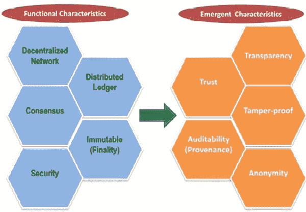 |

区块链基础技术

存在许多现有技术和概念，它们结合在一起，产生了最初于 2018 年形成的经过对等验证的分散式加密货币比特币，以及后来的区块链技术。这些技术包括：密码学、分布式分类帐、哈希机制和共识协议。以下段落简要解释了这些内容。

+   • 密码学：密码学的一般目标是为安全目的创建一个安全身份。密码学有两种类型：对称和非对称。非对称密码学提供了一个更强大的算法，其中包括公钥（对所有人可见）和私钥（仅对数据所有者可用）。非对称密码学的一个应用是数字签名。这种签名为数据和文件提供了真实性和完整性机制；并为资产所有者（例如数据或文件）提供了强大的控制。在区块链的情况下：1）用户的公钥是他们的区块链钱包（例如比特币或以太坊地址），对于链上的所有参与者都可见；2）私钥用于对交易进行数字签名，以确保该特定交易确实是由发送者生成的，并且安全地存储在加密钱包中。

+   • 分布式账本：账本是包含交易记录（信息和数据）的文件。分布式账本使用独立的计算机（称为节点）在各自的数字账本中记录、共享和同步交易（而不是像单个传统账本中那样将数据集中存储）。事实上，区块链是分布式账本的一种形式，它将数字资产和交易组织成一个由不同节点组成的区块数据库，并以追加模式链接在一起。分布式账本的优点在于，由于它是去中心化的并且具有自我调节性，因此它消除了需要中央控制机构或中介来处理、验证或认证交易或其他形式的数据交换的需求。

+   • 哈希函数：哈希函数是区块链架构中的重要元素，用于确保交易的不可变性。它是一种数学函数/过程，在区块链中用于表示其当前状态。哈希被用作共识机制的一部分，以便所有各方（节点）一致同意区块链状态是相同的。哈希包括获取任意数量的输入数据，然后应用算法将其转换为称为哈希的固定长度数据（ISO，2016）。哈希和数字签名是支撑加密学的两个概念。

+   -   共识协议：这些协议是网络中所有参与者的所有访问权限和义务的编码规则集。共识机制是一种容错过程，用于在多代理系统中实现对单个数据值或网络单个状态的必要一致性，例如加密货币和区块链技术。它对于记录和事务事件历史非常有用。由于区块链是动态变化的，因此有必要确保网络中发生的所有交易都是真实的，因此有必要存在一种高效、公平、实时、功能性、可靠且安全的机制。因此，所有参与者都需要就分类帐的状态达成共识。最常用的两种共识机制是：工作量证明（PoW）和股权证明（PoS）。

区块链过程

-   一个简单的解释区块链过程的方法如图 3 所示。

| Figure 3\. How Blockchain works |
| --- |
| 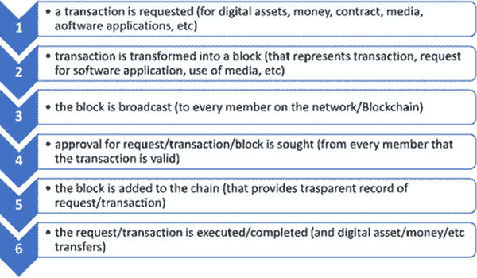 |

区块链类型

-   通常有三种主要类型的区块链：公共的、私有的和联合（Bhasin，2019 年）。公共和私有区块链可以进一步划分为许可或非许可区块链（Singh，2020 年）。联合区块链也称为联邦区块链。

+   -   公开：在这里，任何人都可以加入并参与网络，即下载代码，阅读、编写、审计、添加和运行公共节点。这些区块链是开放的、去中心化的和透明的，但相对较慢。所有加入的人都可以看到分类帐并参与共识以验证新的区块。决策是通过各种共识机制进行的，例如通过 PoW 或 PoS。示例包括比特币、莱特币和以太坊。

+   • 私有：在这里，个人或组织是区块链的所有者，并有权决定谁可以加入和拥有访问权。因此，这是一个中心化的去中心化网络。节点的读写访问权限因节点而异；并且不提供匿名性。这些网络比公共区块链更便宜，但比公共网络更节能，且不太容易受到波动影响。示例包括：R3、Bankchain 和 Corda。

+   • 联盟或联合：在这里，多个组织形成一个拥有网络的联盟。这类似于多个组织共享和同时工作的中心。只有选定的成员才能运行节点或进行交易。网络具有可扩展性和能源效率。这种类型提供了较低的交易费用和更强大的鲁棒性，因为犯罪活动减少了。示例包括：Multichain、R3 和 Monax。

+   • 无许可区块链：在这种类型中，任何人都可以加入、运行和管理数字资产。这些是公共区块链，真正的去中心化、透明、可信、不可变，并且具有增强的安全性。然而，这些更难扩展且效率较低。这里使用 PoW 机制来达成共识。以太坊和比特币就是这种区块链的例子。一些应用案例包括：数字身份、投票和筹款（Singh，2020）。

+   • 许可区块链：这些更像是私有区块链，需要从所有者组织那里获得加入许可。特点包括：不同程度的去中心化、由拥有组织管理和管理、高效、可扩展、透明度较低以及能源效率高。使用案例包括：研究、银行交易和供应链管理（Singh，2020）。

在这些区块链的种类中，根据 Kashyap（2018）的说法，我们可以确定区块链通常包括以下组成部分：

+   • 分账簿：这包括数字资产交易的元素

+   • 智能合约：指在特定事件发生时生效的约定条款。

+   • 共识网络：这些是区块链的节点，按特定顺序连接。

+   • 事件：这些指的是区块链活动，例如新增区块。

+   • 钱包：此元素保存和管理用户的安全凭证。

+   • 管理：此组件管理创建、更改和监视事件的能力。

+   • 集成：这有助于管理区块链与外部系统之间的链接。

区块链平台

在过去几年中，区块链生态系统迅速发展。因此，市场上出现了许多实施平台。它们分为多个类别，如区块链企业平台、区块链云平台等。Malhotra（2020）对最常用的十五个区块链平台进行了评估。以下部分概述了其中一些（以及其他一些）支持区块链应用程序开发和实施的平台。

以太坊

最初于 2014 年提出，这是第二个最受欢迎的开源分散式公共平台，仅次于比特币，用于在定制的区块链网络上运行智能合约。它可以用于设计和运行区块链上的应用程序。它提供一种名为 Ether（ETH）的加密货币。基于以太坊的程序（使用以太坊嵌入式编程语言）可以在没有人为干预的情况下安全运行，以及以 ETH 支付的款项是自动的。任何人都可以设计并上传应用程序到以太坊网络（该网络基于分布在世界各地的数千台计算机），任何人都可以作为网络中的另一个节点参与执行应用程序和验证交易。其优点包括安全性、可靠性和无需中间商（经济观点，2020 年）。

超级账本 Fabric

这是另一个由 IBM 开发的企业级开源权限分布式账本技术平台，提供模块化、可配置的架构和广泛行业用例的多样性，包括银行、金融、保险、医疗保健、人力资源、供应链甚至数字音乐交付。它支持使用 Java、Python 和 Go 等通用编程语言编写的智能合约（Hyperledger Fabric, 2020）。它支持可插拔的共识协议，使平台能够更有效地定制以适应特定的用例和信任模型。Fabric 可以利用不需要本地加密货币的共识协议；并提供安全性、隐私性、保密性、可扩展性和可插拔的共识（CitiusTech, 2018）。

OpenChain

这也是基于由 Coinprism 开发的安全开源分布式账本技术的最受欢迎的区块链平台之一。这是一个非常适合组织管理和保护其数字资产的强大、安全和可扩展的私有网络。尽管 OpenChain 不使用区块的概念（它的交易直接与彼此链接，不再分组成区块），但这个分布式账本是实时的；支持 JavaScript；其交易可扩展且安全，具有不同级别的自定义权限。其他功能包括：交易即时确认，不可变性，为用户分配别名，通过数字签名保护交易，并具有多级控制和分层账户系统（OpenChain, 2020）。

MultiChain

这是一个用于构建区块链的开源平台。一个关键的设计原则是与比特币核心的最大兼容性，其中包括比特币的网络协议、交易格式、区块格式和输出脚本。比特币开发者文档中几乎所有的信息都适用于 MultiChain。它提供了诸如自定义区块链参数、使用智能过滤器、API 命令控制 MultiChain、自定义运行时参数、精细的权限、快速部署和无限资产等功能。一些用于辅助 MultiChain 开发的工具包括 MultiChain Explorer、Docker Multichain 和 MultiChain Web Demo。C＃、GO、Java、PHP、Python 和 Ruby 可用于编程（MultiChain，2020）。

R3 Corda

R3 公司的 Corda 平台是一种企业级区块链平台，提供安全性、可扩展性、企业集成和互操作性。分布式应用可以建立在开源 Corda 之上，用于金融服务、保险、医疗保健、贸易金融和数字资产等各个行业的使用（R3, 2020）。企业可以直接、私密地进行交易（需要注意的是，大多数平台缺乏隐私保护），安全地、无缝地进行交易和记录，从而降低交易和记录成本，简化业务操作。使用智能合约使得平台可以在设定条件满足时立即执行任务。功能包括：降低运营成本，通过网络货币化增加收入，提供高水平的各方信任。Corda 没有原生货币。

EOS

这也是一个由名为 Block.One 的公司于 2018 年初推出的开源区块链平台。它允许在智能合约上安全且相对容易地购买和交易数字资产。基于去中心化技术，与许多使用权益证明（PoS）算法的其他平台不同，EOS 通过使用委托 PoS 来执行共识。其特点包括：商业可扩展性、广泛分布和灵活性。目前，EOS 是全球前 20 大加密货币之一，其代币市值达 5 亿美元（Crypto Digest，2020 年）。与仅在单链上运行的以太坊不同（通常导致易于拥塞网络的微交易），EOS 使用多条链，几乎没有或最小化了网络拥塞的风险，因此不会影响其他应用程序。

其他平台

还有许多其他区块链平台，包括瑞波（Ripple）、恒星（Stellar）、Quorum、门罗（Monero）、IBM 区块链平台、Hyperledger Sawtooth、Neo 区块链平台、Hedera Hashgraph、Hyperledger Iroha。这些在 Malhotra（2020）中有很好的总结。而且，市场上还有许多其他可用的平台，例如 Ardor、Cardano、Komodo 等。

区块链应用案例和倡议

正如 I-Scope（2020）所述，区块链技术似乎比物联网（IoT）愿景更重要。在行业中，区块链的应用案例和项目倡议远远超出了金融交易和加密货币转移。凭借其创造更多透明度、开放性和公平性的能力以及其不可变性等特点，这项技术正在影响包括金融、制造业、医疗保健和交通运输等多个行业。行业内一些区块链应用案例和倡议，特别是在区块链产品供应商和区块链服务提供商中，将在以下小节中详细介绍。

区块链应用案例

下面是一些使用分布式账本技术提供服务的供应商和商业组织的列表。

+   • **BURSTIQ**：这是一家位于科罗拉多州丹佛市的医疗行业公司（Daley, 2020）。他们利用区块链合同帮助患者和医务人员安全地转移敏感和私人的患者数据。区块链合同确定了哪些数据可以存储，以及每位患者可以显示的信息的参数。

+   • **PROPY**：这是一家位于加利福尼亚州帕洛阿尔托的房地产中介机构。它是一个市场和交易平台，具有分散式的产权注册系统，利用区块链技术实时发放产权。该机构使用加密货币购买房产（Daley, 2020）。

+   • **CIRCLE**：这是一家总部位于波士顿的点对点支付技术公司，属于金融科技（FinTech）领域。他们每月监管约 20 亿美元的加密货币投资和交易（Daley, 2020）。他们的投资组合涵盖了七种数字货币，包括比特币、Zcash 和 Monero。

+   • **HYPR**：这是一家位于纽约的公司，从事网络安全领域。他们使用分散式的凭证解决方案来检测和解决基于物联网的连接设备中的安全风险。他们使用生物特征和无密码解决方案；并开发几乎无法被黑客攻击的物联网设备（Daley, 2020）。

+   • **KOMGO**：这家公司成立于 2018 年末，目前总部位于瑞士，得到了 ABN-AMRO、BNP 和 ING 等机构的支持，旨在通过开发分散、开源和安全的商品交易网络来自动化全球大宗商品交易（Komgo, 2020）。

+   • HORIZON GAMES：这是一家区块链基础设施公司，开创了属于其玩家和创作者的新游戏维度（Infura，2020）。对于他们的旗舰游戏 SkyWeaver，玩家可以将 500 张可收藏卡片组装成一副卡组，这些卡片是以太坊 ERC 代币，是具有真实世界所有权和交易的数字卡片。

+   • OPEN ZEPPELIN：该公司构建 SDK（软件开发工具包）平台和其他工具，以帮助开发人员在以太坊平台上创建更快、更有趣的应用程序（OpenZeppelin，2020）。该公司能够减少其技术开销，并无缝地将其用户引入以太坊网络，以更安全地构建和部署更快的应用程序，从而改善其开发人员体验。

区块链文献中提供了许多可用的用例。例如，参考 Consensys（2020a）。

区块链倡议

以下是来自世界各地的一些与区块链相关的倡议的列表。

智慧迪拜

这是阿联酋为使迪拜成为“地球上最幸福的城市”而发起的一项倡议。目标是使迪拜成为 2021 年全面由区块链驱动的第一个城市（Consensys，2020）。该项目正在使用区块链作为服务，开发基于区块链的智慧城市大学，为 100% 的政府服务开发区块链生态系统，并确保无纸化流程。沙盒环境基于以太坊。

Khokha 项目

该项目旨在评估分布式账本技术的应用和用例，以创建基于区块链的银行间系统，通过南非储备银行和国家银行业的合作努力。该项目已超过了交易性能目标，仅在不到两个小时内实现了超过 70,000 笔交易（银行间清算和结算）（Project Khokha，2020a）。

Tepper 区块链倡议

**卡内基梅隆大学提升商学院**（The Tepper School of Business at the Carnegie Mellon University）成立了一个旨在促进去中心化区块链技术设计、使用、伦理和规范创新的倡议（Tepper School of Business，2020）。该项目旨在成为追求研究课题、开发教育内容和推动产业合作的中心。该倡议还致力于促进教师和学生的区块链和加密货币活动。

**IEEE COVID-19 进化项目**

该项目利用区块链和人工智能技术设计和开发一款应用程序，用于预测 2019 冠状病毒病的进化（IEEE Spectrum，2020）。由西班牙萨拉曼卡的两名 IEEE 会员领导，该团队试图确定影响 COVID-19 冠状病毒传播的因素，以为医疗专业人员提供决策所需的相关信息，并预测未来的流行病和大流行病。

**瑞波 UBRI 项目**

**大学区块链研究计划**（University Blockchain Research Initiative，UBRI）是**瑞波**（Ripple）与世界领先大学之间的合作伙伴关系，旨在支持区块链、加密货币和数字支付方面的研究、技术发展和创新（Ripple，2020）。瑞波（也是一个区块链平台）利用这一倡议激发学生追求区块链、分布式计算、金融科技等相关领域的职业生涯。

**结论**

区块链技术，也称为分布式账本技术（DLT），可能是自互联网出现以来最重要的创新。它承载了同样的承诺，但提供了一种新形式的安全和匿名通信，可以在社会和行业的许多不同领域进行，包括医疗保健、交通运输、供应链、风险管理、制造业、旅游业、银行业、教育等。它是计算机科学中的一项较新创新；然而，它发展非常迅速，各种行业和学术界都在拥抱这种新兴的颠覆性技术。

在本章中，我们介绍了区块链技术，并讨论了社会各个领域的使用案例和新倡议，特别是在产品供应商公司和区块链服务提供商内部。我们描述了基本术语，概述了核心特征，列出了区块链技术所承诺的好处，并描述了基本概念和区块链流程。为了完整起见，我们还总结了各种知名的区块链平台。

参考资料

R3\. (2020). Corda Enterprise：下一代区块链平台。网址：https://www.r3.com/corda-platform/

Bhasin, H. (2019, April). 区块链的 3 种主要类型：区块链的分类。网址：https://www.marketing91.com/types-of-Blockchain/

CitiusTech. (2018, May). 医疗保健的区块链。网址：https://www.ehidc.org/sites/default/fi:les/resources/files/Blockchain-for-healthcare-341.pdf

Consensys. (2020). 智慧迪拜：阿联酋政府的区块链案例研究。网址：https://consensys.net/Blockchain-use-cases/government-and-the-public-sector/smart-dubai/

Consensys. (2020a). 真实世界的区块链案例研究。网址：https://consensys.net/Blockchain-use-cases/case-studies/

Crypto Digest. (2020 年). EOS 平台：你应该知道的。可查阅：[`cryptodigestnews.com/eos-platform-what-you-should-know-58da830d2aa8`](https://cryptodigestnews.com/eos-platform-what-you-should-know-58da830d2aa8)

Daley, S. (2020 年 3 月). 25 个颠覆现状的区块链应用与实际应用案例。可查阅：[`builtin.com/Blockchain/Blockchain-applications`](https://builtin.com/Blockchain/Blockchain-applications)

Economic Point. (2020 年). 以太坊平台是什么。可查阅：[`economicpoint.com/ethereum`](https://economicpoint.com/ethereum)

Garson, B. (2018 年 6 月). 超越炒作的区块链。可查阅：[`www.mckinsey.com/business-functions/mckinsey-digital/our-insights/Blockchain-beyond-the-hype-what-is-the-strategic-business-value?cid=other-eml-nsl-mip-mck-oth-1807&hlkid=5424a29008e445239371a81cc83b3dbb&hctky=10291646&hdpid=bb9f89f0-458b-4b4e-a1ee-ad99e602294e`](https://www.mckinsey.com/business-functions/mckinsey-digital/our-insights/Blockchain-beyond-the-hype-what-is-the-strategic-business-value?cid=other-eml-nsl-mip-mck-oth-1807&hlkid=5424a29008e445239371a81cc83b3dbb&hctky=10291646&hdpid=bb9f89f0-458b-4b4e-a1ee-ad99e602294e)

Hyperledger Fabric. (2020 年). Hyperledger Fabric。可查阅：[`hyperledger-fabric.readthedocs.io/en/release-2.0/whatis.html`](https://hyperledger-fabric.readthedocs.io/en/release-2.0/whatis.html)

I-Scope. (2020 年). 区块链和物联网：物联网区块链的机遇与挑战。可查阅：[`www.i-scoop.eu/internet-of-things-guide/Blockchain-iot/`](https://www.i-scoop.eu/internet-of-things-guide/Blockchain-iot/)

IEEE Spectrum. (2020 年 4 月). 西班牙研究人员利用区块链和人工智能压平曲线。可查阅：[`spectrum.ieee.org/news-from-around-ieee/the-institute/ieee-member-news/researchers-spain-Blockchain-ai-app-flatten-the-curve`](https://spectrum.ieee.org/news-from-around-ieee/the-institute/ieee-member-news/researchers-spain-Blockchain-ai-app-flatten-the-curve)

Infura. (2020 年). 与 Horizon Games 合作，为新的游戏维度提供动力。可查阅：[`infura.io/customers/skyweaver`](https://infura.io/customers/skyweaver)

ISO. (2016 年). 信息技术。专利编号 ISO/IEC 10118–1:2016。

Kashyap, P. (2018 年 2 月). 区块链的不同类型及其组成部分是什么？可查阅：[`www.beingcrypto.com/what-are-different-types-of-Blockchain-and-its-components/`](http://www.beingcrypto.com/what-are-different-types-of-Blockchain-and-its-components/)

Komgo. (2020 年). 优化贸易融资流程。可查阅：[`komgo.io/`](https://komgo.io/)

Malhotra, M. (2020, 三月). 2020 年值得关注的区块链平台的综合列表。可在：https://www.valuecoders.com/blog/technology-and-apps/a-comprehensive-list-of-Blockchain-platforms-to-look-for-in-2019/

MarketWatch. (2020, 六月). 区块链技术市场份额，到 2025 年将超过 250 亿美元 – 新闻稿。可在：https://www.marketwatch.com/press-release/Blockchain-technology-market-share-growth-to-record-over-us-25-billion-by-2025-2020-06-09

MultiChain. (2020). 开发者的 MultiChain。可在：https://www.multichain.com/developers/

OpenChain. (2020). OpenChain 概览。可在：https://docs.openchain.org/en/latest/general/overview.html

OpenZeppelin. (2020). 安全区块链应用程序的标准。可在：https://openzeppelin.com/

Project Khokha: 企业以太坊银行与金融案例研究。 (2020). 可在：https://pages.consensys.net/consensys-banking-and-finance-project-khokha-v2?utm_campaign=Enterprise%20Ethereum%20&utm_source=Website&utm_medium=Direct&utm_term=EntEth&utm_content=CaseStudyKhokha

Ripple. (2020). 大学区块链研究计划。可在：https://ubri.ripple.com/faq/

Robinson, J. (2018, 八月). 区块链在交通运输中的未来。可在：https://www.fleetio.com/blog/future-of-Blockchain-in-transportation

Rosic, A. (1916). 什么是区块链技术？初学者的逐步指南。可在：https://blockgeeks.com/guides/what-is-Blockchain-technology/

Singh, N. (2020, 五月). 许可与无许可区块链：一份比较指南。可在：https://101Blockchains.com/permissioned-vs-permissionless-Blockchains/

Tasca, P., & Tessone, C. J. (2019). 区块链技术分类法：识别和分类原则，账本。LedgerJournal.org.

卡内基梅隆大学商学院. (2020). 卡内基梅隆区块链倡议，[链接](https://www.cmu.edu/tepper/faculty-and-research/initiatives/Blockchain-initiative/)

Witscad. (2020). 区块链特征，[链接](https://witscad.com/course/Blockchain-fundamentals/chapter/Blockchain-characteristics)

Zaky, D. (2020, 三月). 什么是区块链技术以及它是如何工作的？[链接](https://fxdailyreport.com/Blockchain-technology/)

额外阅读

活跃商业系统. (2020), 区块链和 ERP，[链接](https://www.activebs.com/en/news/2018/Blockchain-and-erp)

Byon/Alacrity. (2020, 五月), 区块链在教育中：三项有前景的改革，[链接](https://alacritys.net/2020/05/27/Blockchain-in-education-three-promising-reforms/)

Clark, D. (2016), 区块链在教育中的 10 种应用方式，[链接](https://oeb.global/oeb-insights/10-ways-Blockchain-could-be-used-in-education)

Columbus, L. (2019), 区块链如何改善 2019 年的制造业，[链接](https://www.forbes.com/sites/louiscolumbus/2018/10/28/how-Blockchain-can-improve-manufacturing-in-2019/)

Concise Software. (2020), 银行业中区块链的 10 个应用案例，[链接](https://concisesoftware.com/10-use-cases-of-Blockchain-in-banking/)

Consensys, (2016), 区块链物联网的 5 个不可思议的应用，[链接](https://blockgeeks.com/5-incredible-Blockchain-iot-applications/)

Goyal, S. (2018, 十一月), 区块链技术的历史：必须了解的时间线，[链接](https://101Blockchains.com/history-of-Blockchain-timeline/)

Hance, M. (2020), 什么是区块链以及它如何在教育中使用？[链接](https://mdreducation.com/2018/08/20/Blockchain-education/)

Maaghul, R. (2019, 十月), 区块链在教育中：记录管理的未来，[链接](https://blogs.odem.io/Blockchains-bright-future-in-the-education-industry)

Mahmood, Z. (2021). 区块链技术：在工业中的应用。在 Mahmood, Z. (Ed.)，《区块链技术在工业中的应用案例：工业中的倡议和应用案例》，IGI Global，2021 年。

Morley, M. (2020, Feb)，2020 年供应链中区块链的前 5 个应用案例，可在：https://blogs.opentext.com/Blockchain-in-the-supply-chain/

Shumsky, P. (2019, Sep)，2020 年银行的区块链使用案例，可在：https://www.finextra.com/blogposting/17857/Blockchain-use-cases-for-banks-in-2020

Winnesota，(2020)，区块链如何改变运输和物流世界，可在：https://www.winnesota.com/Blockchain

关键术语和定义

比特币：这是第一个也是最流行的加密货币，使用区块链技术进行数字交易。

区块链：区块链是一种数学结构，用于在分布式和去中心化的数字账本中存储数字交易。它由多个块组成，分布在多个计算节点上，并使用密码签名进行链接。

共识机制：这是指用于维护和更新区块链中账本的规则和机制，以保证记录的可信度，即其可靠性和真实性。

密码学：这是使用个性化代码（例如公钥和私钥）保护通信的科学，以便只有参与方可以阅读加密的消息。

以太坊：一个用于构建基于区块链的应用程序的开源平台。它允许分发一种称为以太币（ETH）的货币；并允许存储和执行代码以实现智能合约。

哈希机制：这是一个数字签名（由公钥和私钥组成）的块（包含有关数字资产和哈希指针的信息），用于认证和验证目的。

超级账本 Fabric：这是由 IBM 开发的企业级开源权限分布式账本技术平台。它提供了模块化、可配置的架构以及适用于广泛行业的多样性。

股权证明（PoS）：这是一种共识算法，通过它，加密货币区块链网络旨在实现分布式共识。在基于 PoS 的数字货币中，下一个区块的添加是通过考虑各种随机选择的组合来组织的，例如财富或年龄（即权益）。

工作证明（PoSW）：这是一种共识机制，通过要求服务请求者进行一些工作来阻止或减少网络上的拒绝服务攻击和其他安全滥用，通常意味着计算机的处理时间。

智能合约：智能合约是一种计算机协议，它在考虑已经达成的规定或条款的情况下促进数字资产之间的转移。

# 第十章

# 区块链技术：

概念、组件和案例

+   Somayya Madakam

    

    新德里 FORE 管理学院

+   Harshita

    印度加兹阿巴德管理技术学院

摘要

目前，个人、组织和公司之间的财务交易在第三方批准中介的帮助下进行，这些中介包括银行、金融机构、标准化机构或信用卡提供商。这些交易涉及多级批准、成本和在某些情况下效率低下的流程，这也导致时间和资源的浪费。为了解决这些问题，区块链技术出现了作为一种新的金融数字创新解决方案。在这里，金融交易是在线的、开放的和透明的。在本章中，作者们介绍了有关区块链技术的相关研究的系统文献。目标是了解历史演变、当前进行中的研究、基础技术和应用。作者们从包括 EBSCO、Scopus、Web of Science 和 Google Scholar 在内的科学数据库中提取了研究文章。在线博客、维基、媒体文章、YouTube 视频以及有关区块链技术的公司白皮书也用于内容分析。

**引言**

专家认为区块链是自互联网发展以来最具颠覆性的技术。区块链技术，也被称为分布式账本技术（DLT），将为未来几年的行业和商业提供构建基于用例的机会。因此，全球各地的软件开发公司，特别是印度，正在拼命寻找填补区块链技术领域以下职位的人才：区块链开发人员、区块链首席开发人员、区块链架构师、应用架构师、区块链工程师、区块链专家、区块链专家、区块链顾问等。这表明印度的软件中心，比如海德拉巴、金奈、加尔各答、浦那、科钦、诺伊达、艾哈迈达巴德、孟买等，急需开发区块链技术及其相关应用，以平滑金融服务。这不仅是印度的金融机构、银行和 IT/ITes 公司的当务之急，也是全球其他地区的其他部门的需要。以下是 2020 年 07 月 05 日在领英上发布的一些工作招聘示例，如：位于美国波特兰的 Smith + Crown 金融服务公司招聘区块链分析师；中国上海的 Onchain 公司招聘区块链研究员；位于泰国曼谷都会区的 Blockchain Space 执行公司招聘全球公关和品牌总监；新加坡 PERSOL 招聘区块链/金融科技销售总监以及瑞士苏黎世的 Swisscom Blockchain 招聘高级区块链工程师。

区块链技术的设计、开发、实施和应用涉及分布式系统和存储、区块链、加密货币、哈希函数、网络安全、应用密码学等使用不同的形式方法、工具和编程语言，如 C、C#、Java、Ruby、Solidity、JavaScript、Python、R、Go、Scala、Grafana、DataDog、Bash、Perl、MongoDB、MySQL、JSON、kotlin 和 RESTful API 等，这些是各种业务中常用的。区块链开发包括前端/后端、存储、网络和安全机制。这种颠覆性的金融技术有许多应用，包括基于分布式账本技术（DLT）的应用，利用去中心化、数字稀缺性和激进透明度，提供供应链和利益相关者信任。应用领域包括金融机构、制造业、房地产、医疗保健、司法、教育、治理、能源、电信和交通等。

在这本书的章节中，作者详细讨论了区块链技术在银行、保险、房地产、智慧城市、制造业、供应链、能源和电信等领域的应用，通过使用测试案例以及区块链概念和基础技术。这里有四个主要部分。前两个部分详细探讨了区块链技术，包括定义、起源、组成部分和不同的加密货币。随后的部分解释了全球各行各业的区块链概念、背景机制和案例研究。最后一个简短的部分提出了结论。

区块链概念

“区块链”技术正成为最受欢迎的颠覆性技术之一，与人工智能（AI）、机器学习（ML）、深度学习、数据分析、物联网（IoT）和云计算一起。关于这一新兴技术的文献非常丰富，形式包括新闻脚本、期刊文章、书籍章节、分析报告和书籍。在公共演讲活动、研讨会、会议、讲座、博士候选人讨论会、网络研讨会甚至类似会议兼展览的特别项目中，也有关于区块链技术的声音讨论。这表明对这一现象的需求非常巨大。过去的研究证明，对这一技术的需求正在增加，特别是对金融交易和银行服务而言，这一技术变得越来越有吸引力。Blidholm 和 Johnson（2018）; Coeckelbergh 和 Reijers（2016）; Grigoriadou（2019）; Hütten（2017）; Khatal 等（2020）; Lundström 和Öhman（2019）; Manrique（2018）; Mihigo（2019）; Mushtaq 和 Haq（2019）; Nehaï和 Guerard（2017）; Shi（2019）; Songara 和 Chouhan（2017）的研究充分阐明了对区块链技术、在线分布式分类账、区块链和星际文件系统（IPFS）框架以及它们的价值创造的需求。此外，Madakam 和 Kollu（2020）的重要论文清楚地解释了区块链技术的基本原理-观念、原则、程序和实践。

下面是关于区块链及相关技术不同方面的一些重要研究。Casey (2015) 在《华尔街日报》上提到了没有硬币的区块链，这引起了比特币社区的紧张情绪。Dash 等人（2017 年）在《国际信息科学与计算期刊》上专注于一种革命性的比特币。Felin & Lakhani（2018 年）在《麻省理工管理评论》中谈到了如何用区块链技术解决问题。Gatteschi 等人（2018 年）在《未来互联网》上解释了保险智能合约；Haber 等人（1991 年）在《密码学期刊》中描述了如何给数字文档时间戳。Janssen 等人（2020 年）在《国际信息管理期刊》中报告了有关区块链技术采用情况的研究。

Köhler & Pizzol（2019 年）在《环境科学与技术期刊》中探讨了比特币挖掘的生命周期评估。Nian & Chuen（2015 年）在他们的《数字货币手册》中详细讨论了虚拟货币的监管问题。Narayanan 等人（2016 年）在普林斯顿出版社版中全面讨论了比特币和加密货币技术。《自然新闻》的出版商还谈到了加密货币即比特币及其未来（Extance，2015 年）。Katie Martin（2016 年）在《金融时报》上报道了金融服务公司 CLS Group 准备批准基于区块链的交易。Salsman（2013 年）在《福布斯杂志》上建议，金融危机是政府失败，而不是自由市场的失败。

区块链的主题是跨学科和技术性质的。人们可以通过许多主要的出版商和论坛，包括 IGI Global、IEEE、ACM、Springer 会议论文集和期刊，以及与金融和会计相关的期刊，找到它的文献。此外，John Wiley & Sons、路透社、Elsevier、Inderscience、Emerald、普林斯顿大学出版社和学术出版社也积极参与区块链技术知识的传播。过去与这些出版商的研究探讨了区块链和加密货币作为信任证明、保护物联网设备的分散技术、对工业 4.0 的影响、智能电网应用以及可持续发展的关键驱动因素。

2019 年 10 月，Gartner 的炒作周期经验性地指出，到 2023 年，区块链平台将进展为可扩展、可互操作，并且将支持智能合约的可移植性和跨链功能。根据 Gartner 的预测，未来 5-10 年中将蓬勃发展的一些区块链子技术，预计将包括区块链 UX/UI 技术、去中心化身份、账本 DBMS、智能合约预言机、区块链 PaaS、与加密货币相关的软/硬件钱包、区块链元币平台、零知识证明等。此外，还在区块链业务模型、发展、区块链分布式账本、哈希函数、加密货币、稳定币、智能合约、智能资产、奖励与忠诚度、ICO、ACH 支付、潜在客户生成、去中心化自治组织、战略代币化、安全、数字签名、政策和法规等领域进行了大量研究。

最新的区块链技术或应用可以满足人类需求，并通过提供更好的生活质量（QoL）（Madakam＆Kollu，2020）在人们的生活中产生巨大影响。夸张地说，似乎没有任何领域可以幸免于区块链技术应用。由于它在各个领域的应用，这项技术正在渗透到人类生活的所有学科。尽管最初是为银行业应用而设计，但现在它已经与保险、治理、电信、教育、研发、医疗保健、石油和天然气、交通运输、零售、媒体和娱乐、广告、供应链与物流、公用事业、客户服务、灌溉、能源、智慧城市、游戏、三维（3D）打印和物联网等领域结合在一起，仅举几例。

区块链技术指的是由不断增长的在线数据记录列表组成的数据结构，这些记录被称为区块，使用密码学技术相互链接。区块链技术是一种开放、去中心化的分类账，可以在对等计算机网络上记录各方之间的交易，而无需中央金融认证机构的介入。根据 2015 年 10 月 31 日的《经济学人》: 要理解区块链系统的力量以及它们能够做到的事情，重要的是要区分三种经常混淆的东西，即比特币货币、支撑它的特定区块链以及一般的区块链概念。

尽管关于这个主题有大量的文献，但没有标准的/运行的定义，尽管存在许多工作定义。来自不同会计监管机构、金融机构、投资公司和银行的专家都有自己定义区块链技术的方式。学者、研究人员和学生都有自己解释这一概念的方式。此外，技术开发人员、政策制定者和最终用户也有各自的观点。为了更好地理解，我们可以考虑克罗斯比等人（2016）的定义：区块链是由参与方执行和共享的交易或数字事件记录组成的分布式数据库。这些交易中的每一笔都是由系统中大多数参与者的共识验证的。

区块链技术是一种开放的、去中心化的账本技术，在点对点交易的过程中，在线分布式账本记录以区块形式存储在节点级别上，存储在完全连接的计算网络上。这些技术是透明的，涉及到节点和矿工，无需像其他传统金融监控系统那样有中央管理机构。区块链技术是综合的、复杂的挖矿、点对点交易、工作证明安全机制等过程。

区块链历史

区块链技术是一种数据管理技术，允许将金融在线交易汇总到区块中，最终记录下来。它允许不同服务器在完全连接的计算机网络中访问生成的账本。没有基础信任关系的个人或实体也可以在没有中央控制机构的情况下使用它。根据 Brito & Castillo（2013）的说法，最初，区块链是一个不断增长的记录列表，称为区块，这些区块使用密码学链接。尽管区块链技术正在成为使用加密货币的整个金融服务业务的基础，但起初人们只知道比特币，而后来它发展成了一种技术。这表明最初，区块链技术被用来记录加密数字货币（例如比特币）的历史交易（Nakamoto，2008）。因此，在比特币推出之前，我们有在线分布式分类帐交易，并且在计算机网络的不同节点上存储了官方信息交易的分布式系统记录。一些背景文献证明，Stuart Haber 和 Scott Stornetta 在 1991 年首次提出了一个具有密码学安全的区块链的工作（Scott，1991）。他们希望实现一个不可能被篡改的文档时间戳系统。在 1992 年，Haber、Stornetta 和 Bayer 将 Merkle 树纳入设计，通过允许将多个文档证书收集到每个区块中来改进其效率（Haber et al.，1991；Bayer et al.，1992；Narayanan et al.，2016）。这些是区块链技术发展的基石。从 2008 年开始，许多全球技术发展公司和新创企业开始推出新的与区块链相关的产品和服务，因为这项技术为企业带来了许多优势。2009 年，第一个比特币被挖出并以数字形式上线。在随后的一年，即 2010 年，通过加密货币交易所，比特币推出并开始交易。2014 年，微软开始接受比特币进行业务支付。现在，比特币为加密货币创造了一个去中心化的环境，参与者可以用数字货币购买和交换商品（Yli-Huumo et al.，2016）。

在这个背景下，专注于构建数字解决方案的公司 LeewayHertz 为客户提供智能合约、dApps、安全代币发行（STO）/初始交易所发行（IEO）、稳定币以及公共和私有区块链解决方案。而 Consensys 则致力于开发和部署许多企业以太坊解决方案，Consensys 团队还提供面对面和在线的区块链教育。同样，ChromaWay 提供了一个区块链平台，为房地产和金融行业提供智能合约解决方案。此外，Blockchain Intelligence Group（BIG）旨在提供一种优化的解决方案，以减少与加密货币交易相关的风险。4IRE LABS 则利用区块链、机器学习和物联网开发健壮的解决方案。全球范围内，有超过 1,000 家公司从事区块链产品和服务的生成、规划、设计、融资、教育、咨询、开发和部署。这些产品可以以区块链、加密货币、挖矿过程、交易安全、智能合约、工作证明等形式在不同行业中使用。

区块链加密货币

2012 年，其中一位作者通过在孟买，印度参加相关商务会议的某人听说了 Onecoin。自 2012 年以来，出现了许多数字货币。其中包括比特币、莱特币、黑币、以太坊、瑞波币、门罗币等。表格 1 展示了一些加密货币的起源。

表格 1\. 加密货币 - 起源

| 序号 | 加密货币 | 创造者/铸币者 | 年份 | 语言 | 开发者 | 网站门户 |
| --- | --- | --- | --- | --- | --- | --- |
| 1 | 比特币（BTC） | 中本聪 | 2008/2009 | C++、Java、JavaScript | 比特币基金会，西雅图，华盛顿州（美国） | https://bitcoin.org/en/ |
| 2 | 莱特币（LTC） | 查理·李 | 2011 | C++ | 根据 MIT/X11 许可证 | https://litecoin.org/ |
| 3 | Ripple（XRP） | Ryan Fugger | 2012 | C/C++、Java、JavaScript、Python、Go | Ripple Labs Inc. （美国加利福尼亚州旧金山） | https://ripple.com/xrp/ |
| 4 | DigiByte（DGB） | Jared Tate | 2013/2014 | 开源协议 | DigiByte Foundation（DF）、DigiByte Awareness Team | https://digibyte.io/ |
| 5 | 以太坊（ETH） | Vitalik Buterin、Gavin Wood | 2013/2015 | C++、C#、Java、Python、Go、Rust | 以太坊 | https://ethereum.org/ |
| 6 | 泰达币 | Reeve Collins | 2014 | 开源软件 | Tether Limited | https://tether.to/ |
| 7 | LibrexCoin（LXC） | 匿名 | 2014 | C 创新库 | Zerocoin 库以支持本机 zerocash 协议 | http://www.librexcoin.com/ |
| 8 | Monero（XMR） | Nicolas van Saberhagen | 2014 | Korvi、Monero Spelunker、XMR Stak、Wolfs Miner | 社区内的多人共同开发 | https://web.getmonero.org/ |
| 9 | Dash（DASH） | Evan Duffield | 2014 | C++ | Decentralized Autonomous Organization（DAO） | https://www.dash.org/ |
| 10 | Zcash（ZEC） | Zooko Wilcox-O'Hearn | 2016 | C++、Python、Rust、Kotlin、Swift、Go | Electric Coin Company（zcashd）、Zcash Foundation（zebra） | https://z.cash/ |
|  |  |  |  |  |  |  |

区块链类型

区块链在金融科技（FinTech）领域受到了重视。这些区块链是在线以区块形式记录的公共分布式账本，并通过计算机网络相互链接。自 2017 年以来，区块链业务在全球范围内取得了飞跃。根据源代码、开发过程、访问权限和维护情况，区块链大致分为三类：公共、私人和联盟。参见图 1。

| 图 1. 区块链类型 |
| --- |
| 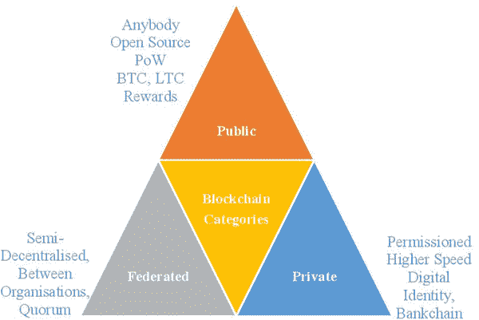 |

公共区块链

区块链的一类是公共区块链。这完全基于开源技术。来自全球各地的任何人都可以随时通过任何设备参与；公共节点可以通过他或她的个人机器或设备访问。在公共区块链中，任何人都可以作为用户、矿工、开发者和社区成员参与。所有这些交易都是匿名和透明的。简单来说，它是一个每个网络参与者都能读取和写入的平台。任何人都可以在不需要其他人许可的情况下使用源代码，并根据公共区块链中的预定义规则在其本地系统上运行代码。工作量证明（PoW）算法是公共区块链的支柱。然而，网络中的任何人都可以进行审计。这种公共区块链配置的主要优势之一是减少了对特殊中央数据库服务器和系统管理人员的需求，从而降低了成本。这些通常与网络中的参与者奖励相关联。此类别的示例包括比特币、莱特币、以太坊、门罗币和达世币等。

私有区块链

第二类是私有区块链，也被称为许可区块链。区块链源代码的读写权限仅限于所有者/所有者，有时也称为封闭区块链。这些区块链通常驻留在组织内部。私有区块链对访问以及谁可以参与交易和验证操作有限制。这是一个平台，只有区块链所有者有权修改规则或其他条款和条件。外部消费者无法运行完整节点，开始挖矿，进行交易或审计区块链。私有区块链是个人或组织的私有财产。私有区块链网络用于投票、数字身份、资产所有权和供应链管理（SCM）等。私有区块链的每秒交易量（TPS）较高；然而，这些区块链具有高度可扩展性。私有区块链的一般活动包括访问、可见性、存储和执行。这种区块链的最佳示例是 Bankchain。另一个示例是 MONAX。

联合区块链

另一个主要的区块链类别是联合或联盟区块链。这种类型继承了公共和私有区块链的特征混合。因此，这些可以被视为半去中心化。联盟区块链提供了公共区块链的效率和安全性，同时仍允许一定程度的中央控制、监控和保护。像公共区块链一样，这些是分布式系统，而像私有区块链一样，是许可的区块链。只有经过事先批准或投票的许可成员才能成为网络的一部分，进行交易。这种区块链处于公司之间和组织之间，用于日常金融业务操作。Quorum、Hyperledger 和 Corda 区块链是联合/联盟区块链类别下的一些最佳示例。

区块链组件

区块链技术现象在各个不同领域都有着巨大的应用。由于区块链和相关技术的许多优点，许多初创公司也在区块链解决方案的旗帜下迅速成长。许多现有公司也在进行可互操作技术发展的合作。例如，Hyperledger 是一个专注于开发一套稳定框架、工具和库，用于企业级区块链部署的开源社区。在这个项目中，英特尔、IBM、思科、CLS、IC3、安永、伦敦证券交易所等许多公司都是区块链技术应用开发的成员。许多 IT/ITeS 巨头和全球金融科技公司已经在全球区块链业务中体验到了先行者的优势。然而，新的初创公司也在分享区块链商业利润。

区块链技术的目标是创建一个去中心化的环境，没有第三方控制交易和数据（Yli-Huumo 等人，2016）。区块链技术促进了系统发展出一个民主、开放和可扩展的数字经济（Wang 等人，2016）。作为互联网时代的颠覆性创新，它结合了几种计算机技术，包括分布式数据存储、点对点传输、共识机制和加密算法（Zhang，2016）。区块链概念涉及多种技术，包括分布式数字分类帐、挖矿过程、加密货币、工作量证明/权益证明（PoW/PoS）、智能合约、安全等等。

下一节将详细阐述不同的区块链技术组件，包括分布式数字分类帐、挖矿过程、工作量证明/权益证明、智能合约、数据完整性和安全性。

分布式数字分类帐

如今，这个术语正在成为金融行业的时尚用语。在数字系统中，数字分类帐由数字交易记录组成，这些记录在网络中的多个点上进行维护。因此，在线开放式分布式数字分类帐由连接的区块链系统中的不同节点组成，这些节点以用户、计算机或系统的形式存在。这些用户随时进行交易。交易数据记录以块的形式保存，并添加或链接到区块链中的现有块。这些数字分类帐保存为单独的文件，或以纯文本形式保存在数据库中。这些块是一种在线数据结构，用于在分布式网络中保存所有交易。链是按照用户、金额、地点、日期和时间的特定顺序排列的一系列块，通过共识算法来实现。所有这些块都由块的头部的哈希技术（例如 SHA256 密码哈希算法）识别。因此，分布式数字分类帐是整个区块链技术在后端级别的核心。

挖掘过程

区块链业务自 2017 年以来呈指数增长。随着区块链技术的发展，比特币挖矿变得非常受欢迎（秦等，2018）。区块链技术中最重要的组成部分之一是挖矿过程。该过程类似于矿石的采矿过程。为了创建新的加密货币和交易，这一过程在区块链技术中扮演着重要角色。在挖矿中，每大约 10 分钟创建一个新区块，之后计算挑战的解决者会获得货币奖励（林德曼等，2017）。挖矿涉及使用专门的计算机硬件来找到特定的数学哈希函数，成功后的奖励是新比特币/加密货币的支付（伊斯利等，2019）。矿工是参与者，在创建新加密货币和验证区块链上的交易中发挥着关键作用。在基于工作量证明的区块链网络中，区块矿工参与密码难题解决竞赛，以赢得发布的奖励，即挖掘新区块（刘等，2018）。在区块链池挖矿中，按最后 N 份份额的报告，按照矿工在最后 N 份份额中的份额比例分配奖励是最常用的奖励机制之一（秦等，2018）。

工作量证明和股权证明

工作证明和权益证明是人们在区块链技术中经常遇到的两个技术术语。关于这些术语存在一个误解，即它们相似。工作证明缩写为 PoW，权益证明缩写为 PoS。这两者都是允许区分有效区块和无效区块的共识机制。这意味着该算法解决了网络参与者之间的信任问题。一些研究指出，Cynthia Dwork 和 Moni Naorin 首次在 1993 年的一篇期刊文章中提到了工作证明的概念。然而，也有人说 Markus Jakobsson 和 Ari Juels 在 1999 年首次提出了“工作证明”这个术语。在比特币中，哈希用于“工作证明”，这是一种将共识与计算能力联系起来的机制，使参与者的重复性对共识结果产生影响（Aste et al., 2017）。

关于权益证明，它是一种共识算法。一些研究表明，权益证明是区块链上交易验证的替代过程。权益证明的作用是在区块链网络中实现分布式共识。在基于权益证明的加密货币中，下一个区块的创建者是通过随机选择和财富或年龄（即权益）的各种组合来选择的。权益证明意味着拥有货币的所有权证明。交易消耗的货币年龄可以被视为一种权益证明形式。我们预计，由于不依赖能源消耗，基于权益证明的设计可能会成为一种更具竞争力的点对点加密货币形式，而不是基于工作证明的设计（King & Nadal, 2012）。权益证明共识协议是一种有趣而具有吸引力的协议，它将区块包含决策权交给了那些对系统拥有权益的实体，而不考虑区块链的长度或公共账本的历史记录（Tosh et al., 2017）。

智能合约

区块链技术下的新兴概念是智能合约。随着自动化成为任何类型业务的主要组成部分，两个商业方之间的合约也变得自动化，无需任何物理存在。智能合约是关于协议所涉及的业务规则来执行交易的，参与方可以是个人或组织。在这个过程中没有第三方参与。这些规则和条例是通过不同的编程语言开发和嵌入到区块链技术中的。

智能合约是可以由相互不信任的节点网络正确执行的计算机程序，无需外部信任的权威（Atzei et al. 2017）。通过签名的业务方之间的交易协议可以根据预定义的规则自动验证。加密货币之间的验证过程是通过数字签名和环签名进行的。新兴的智能合约系统在分散的加密货币上允许相互不信任的方安全地进行交易，而无需信任的第三方（Kosba et al., 2016）。因此，这个过程减少了旅行成本，要求较少的材料成本，需要较少的手动流程，节省时间，并且可以实时完成。

数据完整性

数据是一种无价的资源。它在大多数计算机辅助人类活动中引导着所有业务决策。因此，对数据完整性的威胁至关重要，因为篡改数据可能会恶意影响关键的业务决策（Gaetani 等，2017 年）。数据还是整个金融交易过程中的一个重要组成部分。当来自不同参与者的加密货币交易在它们之间/之间发生时，无论货币类型如何，加密货币转换的确切金额都会自动发生。最好的部分是，有不同的互操作技术，将帮助交易平滑进行而不会失败。在大多数情况下，数据根本不是集中存放在一个地方。分布式账本的所有区块记录都存储在分布式环境中，并由矿工见证作为交易的证据。据作者所知，中央服务器、云存储和像数据湖这样的先进存储范例的概念可能都不需要，因为除了大数据存储组织之外，并不需要中央存储库。

在区块链技术中，数据完整性指的是确保整个生命周期内交易数据的准确性和一致性。它还负责设计和使用任何区块链系统以及维护存储、处理或检索数据的数据；当我们在连接的网络中创建交易并将其作为新记录添加到链中时，由于区块链技术的不可变性，此块信息不能被修改或更改。每条记录一旦使用可信存储功能存储在 UCX 上，都将为文件内容生成唯一的哈希。简而言之，区块链集成将确保政府系统中处理的信息的透明性、可审计性和安全性。由于其强大的数据完整性保证，区块链可以用于确保日志完整性，但其当前的性能限制阻碍了实际的利用（Aniello 等人，2017 年）。因此，区块链技术中的数据完整性涉及数据校正、准确性、备份和可用性。

数据安全

安全性和隐私性是任何商业信息系统中最重要的方面之一。尽管这些术语不同，但从更广泛的角度来看，它们的目标是确保矿工的隐私，为发件人和收件人提供认证，保障交易在流程结束时的安全性，并尽量减少噪音误差。区块链最具吸引力的优势之一是在所有节点批准数据后，公共账本无法被修改或删除。这就是为什么区块链以其数据完整性和安全性特性而闻名（Yli-Huumo 等人，2016 年）。用户之间的信任程度决定了分布式账本的技术配置。在线账本在网络中共享，但与此同时，参与者们获得了自己交易的隐私。由于隐私问题，在线金融交易的身份未与一笔交易关联，然而，所有交易都经过了认证，而身份则保密。此外，为了交易的安全性，在节点级别使用了许多密码学工具和技术来顺利处理这些交易。密码学技术是区块链技术的支柱。这个术语“密码学”源自两个拉丁词：crypto 表示秘密，graph 表示写作。所有加密货币交易都是通过两个当事方之间的秘密书写进行的。RSA（Rivest–Shamir–Adleman）算法是一种用于数据通信安全机制中数据传输的著名的加密技术。实际上，所有加密货币在在线交易时都使用私钥和公钥。加密密钥是公开的，与保密（私有）的解密密钥不同。基于同样的技术，区块链技术的安全机制被开发用于点对点安全交易。

区块链案例研究

Laroiya 等人（2020 年）思考到区块链技术不仅有潜力“彻底改变”各行各业，而且还能“改变”我们的生活。作者引用了一项基于全球三千多名高管的 IBM 调查。调查报告称，约 80%的受访者已经在他们的业务中采用了一些区块链技术，或者计划这样做。作者报告说，该技术甚至被政府部门部署，以提高诸如向公众转移支付、消除不必要的繁文缛节等服务的透明度。Wang 和 Filippi（2020 年）预见到区块链将成为实现全球自主身份系统愿景的重要贡献者。虽然尚未形成一种神圣不可侵犯的定义，但自主身份可以被普遍定义为一个系统，在这个系统中，个人有权决定何时在不同的情境中披露他们的个人身份信息的方面（Wang & Filippi，2020 年）。

本节的重点是整理来自全球不同行业的案例研究。为了更好地阐述，本节分为四个子节，每个子节关注区块链在不同领域的应用。为了展示这一现象是全球性的，横跨国界的，我们努力呈现来自不同地理位置的案例。既有发达经济体，也有新兴经济体被纳入考虑。

银行业和保险业

正如 Arnold（2017 年）所说：几乎每天都会有新的声明，说明银行正在寻求使用区块链技术来改变他们业务的重要部分……区块链是该行业最炙手可热的词汇……

金融行业是第一个在所有行业中见证区块链技术重要应用的行业 - 在‘加密金融’的形式（Casey 等，2018）。从那时起，转变的潜力和进一步的潜力显著。基于金融技术的文章审查发现‘区块链’是金融科技中最研究的方面之一（Sangwan 等，2020）。此外，Madakam 和 Kollu（2020）观察到，在区块链中，有建立一个根本上更好的金融系统的巨大潜力。强调潜力和采用的幅度，Mappo（2019）提供了一个超过 200 家银行和其他金融机构的名单，他们已经或即将使用这项技术。截至今天，在报告前一年多的时间内，这一数字预计已经显著增加。许多作者已经强调了区块链可以积极改变银行和保险行业的许多潜在方式（例如 Campbell，2017 年；Bramblet，2018 年；Harris 和 Wonglimpiyarat，2019 年；Mappo，2019 年；Laroiya 等，2020 年）：

+   • 包括跨境支付在内的支付结算可以变得更加简便和快速

+   • 安全性可以得到加强，因此可以减少欺诈行为

+   • 通过无纸化可以最小化行政成本，从而降低交易成本

+   • 可以改善保险合同各方之间的透明度

+   • 信息获取可以变得更快速和更精确

+   • 更高效率甚至可以转化为更低的保险费率

+   • 不同流程的周转时间可以缩短

+   • 由于其他好处，客户满意度可能会提高。

在美国个人汽车保险公司的使用案例中，已经展示出了**巨大的节省**（Bramblet, 2018）。 根据《金融时报》（Arnold, 2017）对银行家、分析师和顾问进行的一项调查，预计将发生最大变化的五个领域是：i）清算和结算、ii）支付、iii）贸易金融、iv）身份（客户和其他方）、v）银团贷款。

这场革命也触及了各国央行。 Priyaranjan 等人（2020）提供了有关各国央行在分布式账本技术应用方面开展的项目的详细信息。 Gil-Pulgar（2019）报告称，据 IBM 称，预计未来五年，为了确保他们在货币事务上的持续控制，央行可能会推出加密货币（央行数字货币或 CBDC）。 失去垄断地位也可能促使这些曾经的垄断者审查现有系统中的任何不足并进行修正。 这种动态的速度可以通过与之形成鲜明对比的事实来把握。 一年前的同一研究报告称，各国央行不会在不久的将来推出加密货币（Esteves, 2018）。 根据 IBM Blockchain，CBDC 可能会带来以下优势（Esteves, 2018）：

+   • 可以消除信用风险，减少货币的波动性

+   • 通过使中央银行发行代币，可以解决流动性风险

+   • 可以最大限度地减少支付系统的运营成本和复杂性

+   • 可以提高支付系统的速度和效率

+   • 由于去中心化，可以构想央行数字货币的实时结算。

甚至保险业也没有置身事外这一发展。Bramblet（2018）报道称，预计保险业区块链市场的复合年增长率（CAGR）将达到 84.9％，到 2023 年可能增长到 13.9 亿美元（2018 年为 6450 万美元）。Accenture 进行的 2019 年技术展望调查报告称，超过 80％的保险业高管被调查者已经采用或计划采用区块链技术。世界经济论坛和 Accenture 共同进行的另一项调查报告称，65％的受访者（保险业高管）认为，分布式账本技术是确保竞争力的必要手段。鉴于区块链的日益重要性，Abdeen 等人（2019）提出了一个基于区块链的 Takaful 框架，即伊斯兰银行中保险合同的对应物。

作者 Abdeen 等人（2019）将区块链定义为：目前是唯一可行的解决方案，能够提供安全性、透明度、资源完整性，并确保客户之间的可信度。此外，已经有报道或探讨了区块链在各种其他金融方面的应用。Chang 等人（2020）讨论了区块链在贸易融资（即信用证的使用）中可能发挥的作用。Naheem（2019）讨论了区块链技术在反洗钱监管方面的作用。虽然很明显，区块链在金融服务行业的应用是巨大的，并且可以举出许多例子来验证这一观点，但在这里提供了两个案例研究 - 一个来自新兴经济体（印度），另一个来自发达经济体（德国） - 以阐明这一观点。

案例：印度国家银行（SBI）

以存款、资产和利润来衡量，印度国家银行是印度最大的公共商业银行（State Bank of India, 2020）。SBI 还以拥有最多分支机构和员工而荣登商业银行之首。它有着悠久的历史，其根可以追溯到 1806 年。该银行自豪地宣称拥有国际业务。该银行是印度银行中最早实现区块链所提供机会的银行之一。

2017 年 2 月，SBI 宣布计划利用区块链防范欺诈 (Mehta, 2017)。BankChain 就是为了实施这一提议而创立的（及后续的许多提议）。BankChain 自述为“一个由银行组成的社区，用于探索、构建和实施区块链解决方案”（BankChain, 2020）。目前，它有 37 名成员，来自境外。它与微软、IBM 和英特尔等业界巨头有合作伙伴关系。截至 2020 年 5 月 12 日，它列出参与的多达 24 个项目。BankChain 旨在吸引许多参与者，以确保兼容性并便于分享。不仅文件，甚至资源也可以共享，以实现共生。图 2 展示了 SBI 在区块链宣布和实施过程中的时间轴。

| 图 2\. 时间轴和 SBI 的区块链历程 |
| --- |
| 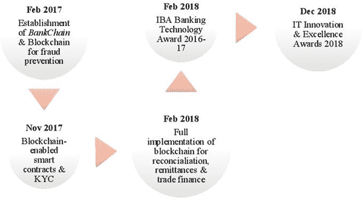 |

在 2017 年 11 月，该银行宣布计划推出基于区块链的智能合约和了解客户（KYC）服务。该银行还透露了其即将成立的创新中心，以探索最新技术在其业务中的适用性（ET Bureau, 2017）。2018 年 2 月，该银行进一步透露了其计划在 2019-20 财年全面实施区块链，用于对账、汇款和贸易融资管理（Bose, 2018）。这些举措赢得了该银行各种赞誉。该银行在 2018 年 2 月举办的印度银行协会（IBA）银行技术奖 2016-17（SBI in the news, 2018）中荣获奖项。SBI 在数字和渠道技术的最佳应用中名列亚军，其服务为客户提供了便利。该银行努力将最新技术应用于各种服务中，从而提高效率。聊天机器人就是利用区块链的一个例子。此外，2018 年 12 月，该银行荣获了最佳 BFSI（银行、金融服务和保险）类别的 AI、区块链和数字类别的认知技术实施奖（IT Innovation & Excellence Awards 2018）。这个奖项是由印度计算机学会组织的。此外，该银行还获得了其他技术奖项。它因不断成功推出基于技术的客户服务而获得了年度最佳技术银行奖。该银行成功推出了基于 AI、ML 和 RPA 的流程。此外，它因使用信息技术（IT）的最具创新性项目“自动实时客户情感反馈（ARTCEF）”而被选为最具创新性项目的获奖者。该银行利用摄像头采用 AI、ML 和认知技术来捕获客户的情感（因此也是反馈）。这个案例来自一个（印度）经济体，在 2016 年区块链的采用和成熟度水平被认为较低（Yadav et al., 2018）。尽管有巨大的潜力尚未开发，但迄今为止的区块链实施可能只是冰山一角，持续的进步将改变未来银行业的面貌。

案例：安联欧洲公司（Allianz SE，Societas Europaea）

成立于 1890 年的安联公司总部位于德国柏林，是德国保险行业的市场领导者（Allianz，2020）。作为一个集团，该公司在 70 多个国家设有业务，并拥有约 147,000 名员工。其客户基数在全球范围内超过 1 亿。该公司涉足人寿和非人寿保险，以及再保险业务。认识到保险行业面临的不可否认的技术变革，安联一直是迎接变革并成功适应的先驱之一。它不仅致力于探索新的解决方案，而且相信同时提升现有员工的技能水平，以使他们保持竞争力（Allianz Search，2020）。图 3 展示了安联宣布和实施与区块链相关业务的进展时间线。

| 图 3\. 安联区块链历程时间线 |
| --- |
| 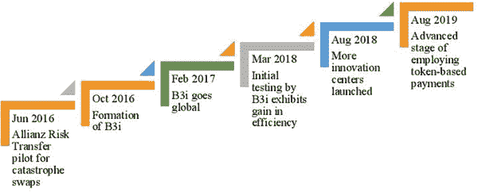 |

朝着安联颠覆性技术部门和尼菲拉的结果迈进，旅程的早期步骤之一始于 2016 年 6 月成功运行安联风险转移试点项目。最终，安联采用了基于区块链的智能合约来管理与灾难债券和互换相关的合同（布拉姆布雷特，2018 年）。安联是区块链保险业倡议（B3i）的创始成员之一，这是一个专注于保险业的财团。该财团于 2016 年 10 月成立，旨在帮助保险业实施区块链。它还得到了美国国际集团（AIG）和美国保险协会（AIA）等业界巨头的支持。2017 年 2 月，B3i 吸引了来自全球各地的成员，使其拥有了国际地位。该财团的目标之一是改善成员之间的数据共享。人们相信该应用将通过提供改进的服务来增强客户满意度。该财团还继续开发原型智能合同管理系统。此外，更多成员于 2017 年 10 月加入；该财团于 2018 年转变为初创公司（布拉姆布雷特，2018 年；安联搜索，2020 年）。2018 年 3 月，区块链初创公司 B3i 展示了其首个产品的初步测试效率提升高达 30%。该初创公司旨在商业化保险和再保险领域的基于区块链的解决方案。

2018 年 8 月，安联合作伙伴成立了三个创新中心，进一步探索和采用包括区块链在内的颠覆性技术。自 2014 年以来已有一个中心在运作，总数增加至四个。据皮鲁斯（2019）于 2019 年 8 月报道，安联全球企业与特殊风险公司正在开发基于代币的电子支付系统。该公司构想了一个基于区块链的保险相关支付系统，涉及不同类别的支付。

到目前为止所观察到的进展经常性地发生变化，区块链的采用似乎仍然是一个正在进行中的工作，并且许多新的惊喜希望能够看到天日。因此，银行和保险业开始更多地采用区块链技术。下一节将讨论房地产和智慧城市中另一组特定领域的两个区块链应用。

房地产和智慧城市

区块链应用是巨大而不可计数的，正如我们在上面的部分中已经讨论过的。另一个采用区块链技术的领域包括房地产和智慧城市。Grover 等人（2019 年）报告称，区块链技术在房地产领域的应用已经达到了创新决策过程的确认阶段。确认阶段意味着房地产行业已经开始使用区块链技术，并且结果比以前适用的系统更好。Wouda 和 Opdenakker（2019 年）提出了一种基于区块链的应用，可以提高商业房地产交易的效率和速度。此外，根据 Laroiya 等人（2020 年）的说法，房地产行业预计将受益于区块链维护与所有权记录相关的数据的能力，这些数据无法篡改。Karamitsos 等人（2018 年）认识到了更有效的数据库管理、在涉及方之间建立信任更容易、摆脱中介要求以及更有效的发票管理等好处。此外，它还在智慧城市/智慧城市空间中应用。根据 Xie 等人（2019 年）的说法，作为一种新兴技术的区块链具有许多良好特性，例如无需信任、透明度、化名、民主、自动化、分散化和安全性。这些区块链的特性有助于改善智慧城市服务并促进智慧城市的发展。

着眼于智慧城市，Feroz (2020) 指出区块链可以解决安全、透明度、创新等问题，这些是智慧城市的核心。Shilpi 和 Ahad (2020) 补充说，区块链可能是智慧城市系统各个组成部分之间安全信息交换的答案。此外，它也被视为资源有效利用和防止欺诈的首选技术(Rotuna 等，2019)。Hakak 等 (2020) 提出了一种关于应用区块链技术开发安全智慧城市的概念框架。人们可以在智能家居、智能建筑和土地登记等方面使用区块链应用。与其前身的模式一致，本节介绍了两个案例，一个基于发达经济体 (美国)，另一个基于新兴经济体 (阿联酋)。

案例：苏富比国际房地产 (SIR)

SIR 是一个旨在将房地产卖方与潜在买家连接起来的房地产平台。成立于 1976 年，该公司现在将自己定位为一个豪华品牌，其网站上充满了诸如“最好的”、“最负盛名的”、“异常的”、“非凡的”、“独特的”、“世界一流的”、“最受珍视的”和“鉴赏家”的词语 (苏富比国际房地产，2006-2020)。正如名字明示的那样，该公司是一家全球性的参与者，总部位于美利坚合众国。截至 2020 年 3 月，该公司在全球 70 个国家和地区设有业务。超过 23,000 名独立销售合伙人与 SIR 有关联，并且该公司在 2019 年的营业额为 1140 亿美元 (Couch, 2020)。

这家公司多年来赢得了各种荣誉，例如，连续七年获得了最佳房地产特许经营满意度奖（由特许经营业务审查委员会颁发）。该品牌将自己定义为“致力于创新”，这也是为什么区块链不得不出现在该公司中的原因。SIR 有幸向世界房地产交易引入了基于区块链的加密货币比特币（Chowdhury，2019）。2017 年 9 月见证了首次此类交易，德克萨斯州的库珀 SIR 以比特币出售了一栋房屋。

SIR 还拥有另一个“第一”。它是第一个与通证化平台合作的奢侈房地产公司。2019 年 12 月，英国 SIR 与 Smartlands（通证化平台）合作，探索了区块链在房地产行业中的应用。此次合作旨在探索使用安全通证发行（STO）来证明房地产所有权（Lane，2019）。STO 是一种加密代币，它被发行给投资者作为其对基础资产投资的证明。与其他文件作为证明（例如，印刷或数字证书）的发行不同的是，投资记录在区块链上进行维护（Pauw，2019）。此外，由于法律承认 STO，价值得到了提升。随着区块链和房地产的结合，预计未来将看到更多的应用。

案例：迪拜作为智慧城市

位于西亚的迪拜是阿拉伯联合酋长国（UAE）的一座城市。它是阿联酋最富裕的酋长国之一，常被称为“摩天大楼之城”（Davidson，2020）。作者认为促成该城市壮观增长的两个因素是：高效的行政体系和对企业的欢迎态度。该城市成功地将自己定位为一个全球城市，并且在全球商业和旅游方面享有盛誉（Bishr，2018）。

迪拜的智慧城市战略于 2014 年启动，旨在在 2021 年成为“全球最智能的城市”（迪拜, 2020）。该城市目前正在推进最为综合的信息和通信技术（ICT）整合计划之一，涉及超过 545 项正在进行或规划中的倡议。预计这些倡议将大幅贡献该市的国内生产总值（GDP）。其中一些倡议包括：

+   • 努力将基本政府服务转移到在线模式

+   • 采用智能卡实现公交车、地铁、出租车等智能交通系统

+   • 为全市范围内提供免费高速 Wi-Fi 访问

+   • 通过在城市轴线部署大规模技术，追求实现数据驱动型经济

正如前文所暗示的，这座城市热情地接受新技术，以在世界地图上留下自己的印记。从 1999 年到 2015 年，迪拜见证了数项战略的启动（Bishr, 2018）。列表中最新的是 2016 年 10 月推出的区块链战略。图 4 总结了相关项目。迪拜区块链战略的目标是成为第一个区块链驱动的城市。

| 图 4. 迪拜的 ICT 倡议 - 1999 年至今 [摘自 Bishr (2018)] |
| --- |
| 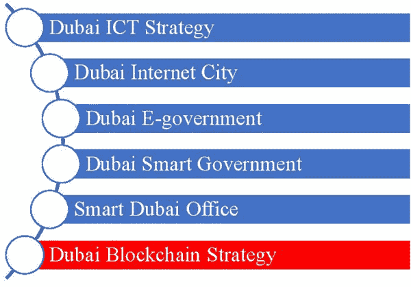 |

不同的参与者承诺迪拜政府在全市范围和跨行业提供一个有利于区块链就业的环境。印刷媒体（《经济时报》）已经将迪拜称为“区块链发展的世界首都”（Mediawire, 2020）。正如迪拜智能办公室主任所说，区块链战略有三大支柱，如图 5 所示（Bishr, 2018）。

| 图 5. 迪拜的区块链战略 |
| --- |
| 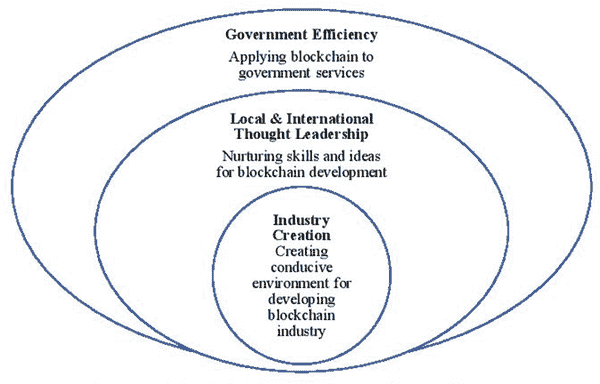 |

截至 2020 年 2 月，迪拜已经在八个行业中使用了 24 个区块链用例。参见来自 Mediawire (2020) 的图 6。此外，该城市推出了迪拜区块链平台和迪拜区块链政策（Mediawire, 2020）。迪拜区块链平台与 IBM 合作，帮助迪拜政府单位开发用例。迪拜区块链政策是一份手册，涵盖了迪拜在区块链实施方面的所有经验教训，旨在成为全球其他地方的指南。最有趣的是，该政策对全世界免费开放。

| 图 6\. 迪拜跨行业区块链战略实施 |
| --- |
| 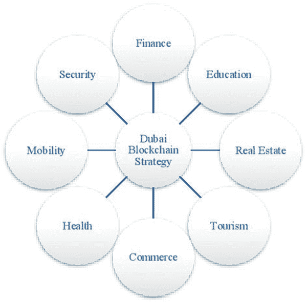 |

所有这些倡议导致迪拜区块链市场增长率高于世界平均水平（Mediawire, 2020）。怀着让迪拜成为‘地球上最幸福的城市’的狂热愿景（Smart Dubai, 2020），作者们（可能还有全世界）非常期待城市的进展。它可能会充当‘开路先锋’，引领世界进入一个前所未见的领域。目前，全球范围内所有即将启动的智能城市项目，包括葡萄牙的 PlanIT Valley、阿联酋的 Masdar、意大利的 Padova，以及印度的 Smart City Kochi，在讨论中都考虑了这项技术作为市政服务设施的一部分。

制造业和供应链公司

正如 Shah (2018) 提醒我们的那样：区块链是一种吸引制造商解决问题的技术... 但预计... 随着廉价、无处不在的计算资源的广泛可用性，区块链应用将变得与即便是最守旧的制造商相关。

当人们想到区块链应用时，金融领域似乎是最前沿的，但是这项技术已成功展示了其在各个其他领域的适用性。本小节重点介绍制造业和供应链领域。

研究人员已经确定了多个方面，通过这些方面，区块链正在重新定义制造业和供应链，即数据保护、通信、在不可见的参与者之间建立信任、流程改进、管理知识产权以及监视某些有形资产的维护（Shah, 2018; Kurpjuweit 等人，2019; Kasten, 2020）。同样，对于汽车行业，Dorri 等人（2017 年）提出，区块链技术可以解决诸如数据隐私和车辆安全等问题。此外，根据 Fraga-Lamas 和 Fernández-Caramés（2019 年）的说法，可以受益于汽车行业的最新技术之一是区块链，它可以增强其数据安全性、隐私性、匿名性、可追溯性、可问责性、完整性、鲁棒性、透明度、可信度和认证性，同时为整个行业提供长期可持续性和更高的运营效率。本节将包括两家公司采用区块链技术的案例，一家来自新兴经济体（中国），另一家来自发达经济体（日本）。此外，还有许多全球和本地的制造业、汽车和供应链公司计划将区块链技术应用于其日常业务运作中。

案例：丰田汽车公司（Toyota）

丰田汽车公司是日本汽车行业的市场领导者，同时在全球范围内拥有坚实的地位。总部位于日本，公司的历史可以追溯到 1933 年。该公司在全球范围内拥有近 600 个子公司。该公司从事汽车、商用车辆、工业车辆和零部件的制造（Duignan，2020）。培育创新可以说是该公司文化的一部分。为了促进研究，丰田研究院于 2015 年在美国成立。此外，最近，该公司明确了其致力于在新的 CASE 领域（包括连接车辆、自主/自动驾驶、共享和电动）提供持续服务的承诺（丰田，2020）。该公司在区块链世界中向公众展示的最初的小步骤可以追溯到 2016 年 12 月，当时该公司与数字车库公司等区块链活跃公司合作，邀请参与丰田下一个开放创新计划。其目的是利用创新技术和解决方案解决业务问题。丰田研究院与麻省理工学院（MIT）媒体实验室和其他行业合作伙伴宣布，正在探索区块链技术，以开发移动生态系统（丰田加拿大新闻室，2017 年）。2017 年 5 月，该计划的宣布旨在加速自动驾驶技术的进展。2019 年 4 月，丰田汽车公司和丰田金融服务公司共同成立了丰田区块链实验室，这是一个探索区块链在商业理念中应用的虚拟组织。2019 年 5 月，该公司与东京大学和 Trende 公司合作，开始测试基于区块链的电力交易系统。这些公司有一个愿景，即开发下一代电力系统，使个人和企业能够彼此交换电力。

| 图 7\. 丰田区块链之旅时间表 |
| --- |
| 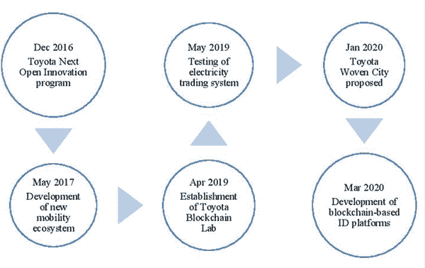 |

公司于 2020 年 1 月提出计划，在日本建立丰田编织之城。以改善未来的生活方式为愿景，预计将成为研究人员的‘生活实验室’，为他们提供开发技术的真实环境（Toyota Woven City，2020）。2020 年 3 月，丰田区块链实验室宣布计划吸纳合作伙伴公司，从而扩大合作关系（丰田，2020）。实验室还致力于全球丰田集团公司之间的合作，实现资源的共生利用。此外，公司还披露了与 Securitize 合作开发基于区块链的个人和车辆 ID（标识符）平台的计划（Bourne，2020）。这些平台可以多方面应用，即个人 ID 平台可以被雇主用来维护与员工相关的福利；车辆 ID 平台可以被用来维护与车辆注册、维护等相关的记录。图 7 总结了丰田的区块链之旅。在许多提案已经在管道中的情况下，最好的可能仍然来自丰田的有远见的投资组合。

案例：阿里巴巴

阿里巴巴集团是一个大型企业集团，旗下的阿里巴巴网站是其电子商务领域的一项业务。总部位于中国，该集团成立于 1999 年（阿里巴巴集团，2020 年）。截至 2019 年底，集团拥有超过 116,000 名员工。该集团涉足多个业务领域，包括商务、云计算、创新、数字媒体和娱乐。它可能在年龄上看起来年轻，但在业绩上却表现强大，并且已经在多个领域证明了自己的实力。阿里巴巴网站是全球领先的批发和贸易平台。2018 年，该公司荣获中国最大的综合国际在线批发市场的称号（阿里巴巴集团，2020 年）。该公司的客户遍布超过 190 个国家。此外，该公司为其会员提供供应链服务。

阿里巴巴利用区块链并不奇怪，因为该集团的基础甚至是建立在利用技术的基础上的。创始人相信，创新和技术可以被利用，为较小的企业与更大的对手竞争提供公平的竞争环境。该公司致力于成为商家和其他业务参与者的平台，帮助他们利用新技术扩大市场覆盖范围。2017 年，阿里巴巴举办了年度计算大会，其中区块链是其中一个主题。其业务之一已经提供区块链即服务（BaaS）。2018 年 10 月，该集团将其 BaaS 产品的客户群扩展到亚洲、欧洲和美国。该集团还拥有一个名为“链上慈善”的倡议，这是基于区块链的慈善记录管理，提供捐款的透明度和可追溯性（《分类帐见解》，2020 年）。

阿里巴巴在 2017 年 3 月与澳大利亚邮政和普华永道合作，旨在探索区块链在打击食品欺诈问题中的可能作用。一年后，即 2018 年 4 月，阿里巴巴在从澳大利亚和新西兰运送产品（食品/健康补充剂）到中国时进行了一项试点测试，采用区块链进行供应链。该集团副总裁在 2019 年 3 月宣布，该集团正在考虑使用区块链进行跨境供应链（Yakubowski，2019）。 2020 年 3 月，该集团宣布计划利用区块链进行其供应链，目标是增强链的透明度（Kastelein，2020）。它可以使客户跟踪货物在供应链中的原始来源和当前位置。客户可以通过扫描快速响应（QR）代码获取任何产品的物流详情（Peng，2020）。Peng（2020）还进一步报道，阿里巴巴预见到参与基于区块链的供应链可能带来以下好处：

+   • 它可以简化货物的追踪。

+   • 它可以避免货物和物流信息之间的不匹配问题。

+   • 它可以协助清楚地定义供应链中相关方的责任。

此外，正如 Sharma（2019）所报道的那样，区块链技术还可以通过使账本条目防篡改来帮助验证货物的真实性。所有这些好处都有望提升消费者的信心（Barbaschow，2018）。随着区块链的另一项应用旨在增强消费者体验，并且包括阿里巴巴在内的许多巨头已经参与其中，供应链有望见证游戏规则的变化。

能源和电信

利用区块链技术的出现，享受颠覆的另一组行业是网络运营部门，尤其是能源和电信行业。Andoni 等人（2019 年）报告称，在能源领域，基于区块链的初创企业和项目数量明显增加。根据他们的审查，作者得出结论，区块链可能是解决该行业一些问题的答案。Teufel 等人（即将出版）认为，区块链技术可用于能源交易、信息存储以及实现交易更大的透明度。作者们创造了术语“区块链能源”来指称可应用于能源领域的区块链技术。作者们承认应用也存在挑战，特别提到了需要解决网络安全挑战的必要性。此外，预计未来能源部门将涉及能源发生器的去中心化，Worner 等人（2019 年）预见到区块链在这一过程中将发挥重要作用。

与能源行业类似，分散化也被视为未来电信行业的发展方向。Kabbinale 等人（2020 年）认为，随着分散化的开始，区块链技术将成为以透明方式记录交易经济方面的平台。加密货币和智能合约也将发挥作用。Praveen 等人（即将发表）提出，随着 5G 技术在电信领域的推进，区块链将为涉及各方提供所需的增强隐私和安全性。Khalaf 等人（2020 年）提出了一种新的区块链技术算法，他们认为这对于新一代电信业务将是相关的。Lee（2018 年）提出了将区块链用于身份作为一种服务（BIDaaS）的用途，这可以用于移动用户的身份管理。Wang 等人（2019 年）总结了可能在电信领域应用区块链网络的情况。

与前文类似，接下来的案例基于来自新兴（南非）和发达（芬兰）经济体的公司。

案例：Sun Exchange（SE）

Sun Exchange 是世界上第一个点对点太阳能租赁平台（Sun Exchange, 2019）。该公司的安装合作伙伴为太阳能电池的所有者提供安装和维护服务，后者将其太阳能电池出租给商业企业。这项服务让普通人拥有一种通过拥有太阳能电池并将其出租来赚钱的来源。该公司的根源源自南非，成立于 2014 年，创始人的中心思想是关注气候变化。创始人意识到，将加密货币用于国际汇款的速度、便利性和效率是将区块链与这个拼图嵌入的关键。对太阳能电池所有者的支付可以是本地货币，也可以是加密货币。截至 2018 年 3 月，该公司的会员遍布 70 个国家。截至 2019 年，这个数字增至 155 个，一年增长了 121%。

Sun Exchange 连续两年获得了最佳非洲比特币/区块链奖——2016 年和 2017 年。2017 年 6 月，Sun Exchange 在全球 20 家基于区块链的参与者中脱颖而出，赢得了迪拜智能办公室全球区块链挑战赛。2018 年 3 月，该公司为公众推出了 SUNEX 网络代币销售，这是一个“变阳光为钱”的平台，通过租赁太阳能电池赚取加密货币。它被提议作为太阳能项目的保险基金。2019 年带来了更多的奖项和认可，其中之一是 Disruptor Daily 的能源使用区块链案例奖。该公司运营着一个基于区块链的框架，记录了太阳能电池的所有者及其收益。由于防篡改，这些记录成为监管机构计算通行费并通过智能合约申请的基础。消费者和卖家的记录都记录在区块链平台上，这简化了管理这些记录的要求。

虽然这降低了行政开支，但预计区块链也将有助于减少碳排放（Sun Exchange，2019; Ellsmoor，2019a）。该公司报告称，截至 2019 年，已节省了 1,280 吨 CO[2]。通过利用太阳能，SE 还有助于节省非可再生资源的消耗。此外，这些项目还帮助消费者节省了能源开支。该公司报告称，学校和其他机构的节省高达 30%。谈到区块链在能源行业的应用，Ellsmoor（2019b）指出，许多新进入者正在利用区块链技术来维护智能电网。通过实时与消费者共享数据，该系统使他们能够选择能源的购买来源。这反过来提高了分配和定价的效率，使市场更具竞争力。随着公司年轻且仍处于探索和扩展阶段，预计未来区块链在能源行业的应用将蓬勃发展。

案例：诺基亚

诺基亚是一家成立于 1865 年的芬兰公司，业务涉及电信、信息技术和消费电子（Nokia, 2020b）。该公司的标语“我们创造连接世界的技术”揭示了诺基亚以技术为中心的性质。公司自豪地…超过 150 年来不断适应不断变化的世界需求，并因…在塑造技术未来方面的领导地位而受到认可（Nokia, 2020a）。该公司为终端消费者、服务提供商和各行各业提供产品和服务。该公司致力于在全球平台提供网络设备、软件、服务和许可机会。截至 2019 年，诺基亚在五大洲拥有超过 98,000 名员工。2019 年，据报道，该公司是市场份额最高的电信服务提供商（Nokia, 2019）。

2016 年 12 月，诺基亚发起并建立了开放生态系统网络，这是一个作为开放协作和创新平台的中心。它吸引了来自各行各业的参与，并在其运营的第一年，推出了 100 个关于最新创新如区块链的项目（Cangl, 2017）。2018 年 4 月，诺基亚宣布与一家区块链初创公司合作，旨在使移动连接可用于偏远农村人口（Coleman, 2018）。2018 年 5 月，诺基亚还宣布与区块链数据平台 Streamr（以及一家软件公司 OSIsoft）合作，帮助诺基亚客户控制自己的数据，并与物联网设备进行交易（Floyd, 2018）。参与者可以利用智能合约用加密货币交易实时数据。诺基亚为其客户（即运营商）提供感知服务 (SaaS)。这项服务使运营商能够远程监视其网络资产。通过提高服务提供商的运营效率，这种数字化还为他们提供了一种新的营收来源，即基于区块链的智能合约，这些智能合约是自动生成的（Nokia, 2020c）。2019 年 4 月，以色列电信公司 Cellcom Israel 使用了诺基亚的 SaaS。这些公司还共同使用了基于区块链的物联网数据商店，以提高数据的透明度并提供更好的创新机会（Kfar-Saba, 2019）。2019 年 8 月，IBM 与诺基亚和其他参与者合作推出了区块链网络 Trust Your Supplier（Crouse, 2019）。该网络旨在为供应商提供数字身份，从而改善供应商管理。根据 IBM 区块链风险投资总监 David Post 的说法，诺基亚和沃达丰作为该平台的创始成员，将有助于探索该网络如何使电信行业受益。更多创新、更多合作以及由此产生的生态系统一定会发现更多的想法，并为电信业带来更新的基于区块链的面貌。

结论

区块链技术现象非常引人注目。其优势和应用之多，因此几乎所有企业都对此技术感兴趣。这种颠覆性的金融技术实际上就是能够让任何人在任何时间、任何地点、使用任何设备进行交易，以平滑网络中的金融运作。因此，金融、保险、移动、制造、供应链、司法、治理、教育、医疗保健、能源、房地产、旅游、酒店和服务等所有行业都在尝试采用这项技术以提高运营效率。从以物易物到铸造硬币、货币纸张、信用/借记卡，甚至是在线交易和金融应用，无一可与这项创新的颠覆性技术相提并论。

本书章节探讨了系统性文献、概念和组成部分。此外，书中还详细讨论了不同的案例研究。目前，关于开发新工具、技术、挖掘过程、新加密货币以及确保交易安全以进一步改善金融运作的研究仍在进行中。这些天我们经常听到有关加密货币的消息，这在我们日常交易中至关重要。比特币、黑币、莱特币、瑞波币、门罗币、泰瑟币、自由币和 Zcash 等不同的数字货币正在变得越来越受欢迎，但也存在一些担忧。原因是政府尚未明确允许采用这些加密货币进行商业活动。然而，希望在未来几年，全球各地都将肯定会为商业以及个人金融需求接纳这项颠覆性技术。

致谢

对于印度新德里 FORE 管理学院提供的图书馆、数据库、计算设备和技术支持基础设施，我们表示诚挚的感谢。

参考文献

Abdeen, M., Jan, S., Khan, S., & Ali, T. (2019). 通过最新的区块链运用 Takaful 伊斯兰银行：案例研究。国际先进计算机科学与应用期刊，10(2)，648–654\. doi:10.14569/IJACSA.2019.0101283

Alibaba Group. (2020). 主页。检索自 https://www.alibabagroup.com/en/global/home

Allianz. (2020). 一览。检索自 https://www.allianz.com/en/about-us/who-we-are/at-a-glance.html

Andoni, M., Robu, V., Flynn, D., Abram, S., Geach, D., Jenkins, D., McCallum, P., & Peacock, A. (2019). 区块链。可再生和可持续能源评论，100(2 月)，143–174\. doi:10.1016/j.rser.2018.10.014

Aniello, L., Baldoni, R., Gaetani, E., Lombardi, F., Margheri, A., & Sassone, V. (2017 年 9 月). 一项关于分布式数据库中防篡改高性能基于区块链的交易日志的原型评价。在 2017 年第 13 届欧洲可靠计算大会（EDCC）中（pp. 151-154）。IEEE。

Arnold, M. (2017). 银行正在使用区块链的五种方式。检索自 https://www.ft.com/content/615b3bd8-97a9-11e7-a652-cde3f882dd7b

Aste, T., Tasca, P., & Di Matteo, T. (2017). 区块链技术：对社会和产业的可预见影响。电脑，50(9)，18-28。

Atzei, N., Bartoletti, M., & Cimoli, T. (2017 年 4 月). 对以太坊智能合约的攻击调查（SOK）。在安全与信任原则国际会议（pp. 164-186）。Springer。

BankChain. (2020). 主页。检索自 https://www.bankchaintech.com/index.php

Barbaschow, A. (2018). 阿里巴巴在澳大利亚试点区块链供应链计划。检索自 https://www.zdnet.com/article/alibaba-pilots-blockchain-supply-chain-initiative-down-under/

Bayer, D., & Haber, S., & Stornetta, W. S. (1992 年 3 月). 改善数字时间戳的效率和可靠性。序列。, 2，329–334。

Bishr, A. B. (2018). 迪拜：一个由区块链驱动的城市。创新/全球发展的区块链 II，12(3/4)，4-8\.

Blidholm, G., & Johnson, M. (2018). 瑞典银行采用分布式账本技术进行贸易和出口金融业务的采纳。学术出版社。

Bose, S. (2018). 印度国家银行计划在 FY19 在三个功能中部署区块链。检索自 https://www.financialexpress.com/industry/sbi-to-deploy-blockchain-in-three-functions-in-fy19/1058852/

Bourne, J. (2020). 丰田和 Securitize 开发基于区块链的身份验证平台。检索自 https://blockchaintechnology-news.com/2020/03/toyota-and-securitize-develop-blockchain-based-id-platform/

Bramblet, J. (2018). 区块链在保险业的终极指南。检索自 https://insuranceblog.accenture.com/ultimate-guide-to-blockchain-in-insurance

Brito, J., & Castillo, A. (2013). 比特币：决策者的入门指南。乔治梅森大学墨卡图斯中心。

Bureau, E. T. (2017). 印度国家银行计划于下个月使用区块链进行智能合约和 KYC。检索自 https://economictimes.indiatimes.com/industry/banking/finance/banking/sbi-to-use-blockchain-for-smart-contracts-and-kyc-by-next-month/articleshow/61715860.cms?from=mdr

Campbell, R. (2017). 哪些主要银行已经采用或正在采用区块链？检索自 https://blockchain.works-hub.com/learn/Which-Major-Banks-Have-Adopted-or-Are-Adopting-the-Blockchain

Cangl, G. (2017). 第一年：开放生态系统网络有很多值得庆祝的事情。检索自 https://www.nokia.com/blog/year-one-open-ecosystem-network-lot-celebrate/

Casey, M., Crane, J., Gensler, G., Johnson, S., & Narula, N. (2018). 区块链技术对金融的影响：变革的催化剂（《世界经济日内瓦报告 21》）。国际货币与银行研究中心。

Casey, M. J. (2015 年 4 月 15 日)。 Moneybeat/BitBeat：没有硬币的区块链引发了比特币社区的紧张。《华尔街日报》。

Chang, S. E., Luo, H. L., & Chen, Y. C. (2020). 区块链。可持续性，12(1)，1–16。doi:10.3390/su12010188

Chowdhury, N. (2019)。深入探讨区块链、比特币和加密货币。CRC Press。

Coeckelbergh, M., & Reijers, W. (2016)。加密货币作为叙事技术。ACM SIGCAS Computers and Society , 45(3), 172–178。 doi:10.1145/2874239.2874264

Coleman, L. (2018)。为什么诺基亚与加密初创公司合作建立物联网网络。检索自 https://www.ccn.com/nokia-community-hosted-networks-to-bring-revenue-opportunities-to-remote-areas/

Couch, M. (2020)。苏富比国际房地产在乌克兰开设首家办事处。检索自 https://www.sothebysrealty.com/extraordinary-living-blog/sothebys-international-realty-opens-first-office-in-ukraine

Crosby, M. N., Pattanayak, P., Verma, S., & Kalyanaraman, V. (2016)。区块链技术：超越比特币。Applied Innovation Review , 2, 6–19。

Crouse, M. (2019)。IBM 的区块链网络为供应商提供数字身份。检索自 https://www.fiercetelecom.com/telecom/ibm-s-blockchain-network-gives-digital-identities-to-suppliers

Dash, , & Behera, P. C. (2017)。区块链。International Journal of Information Science and Computing , 4(1), 27–39。 doi:10.5958/2454-9533.2017.00004.7

Davidson, C. (2020)。迪拜-阿拉伯联合酋长国。检索自 https://www.britannica.com/place/Dubai-United-Arab-Emirates

Dorri, A., Steger, M., Kanhere, S. S., & Jurdak, R. (2017)。区块链：汽车安全与隐私的分布式解决方案。IEEE Communications Magazine , 55(12), 119–125。 doi:10.1109/MCOM.2017.1700879

迪拜。 (2020)。高级信息通信技术如何推动迪拜智慧城市。检索自 https://www.visitdubai.com/en/business-in-dubai/why-dubai/news-and-insights/becoming-the-worlds-smartest-city

Duignan, B. (2020)。丰田汽车公司。检索自 https://www.britannica.com/topic/Toyota-Motor-Corporation.

Easley, D., O’Hara, M., & Basu, S. (2019)。来自矿业的。Journal of Financial Economics , 134(1), 91–109。 doi:10.1016/j.jfineco.2019.03.004

Ellsmoor, J. (2019a). 与可再生能源领域前沿的 5 家公司见面。取自 https://www.forbes.com/sites/jamesellsmoor/2019/04/27/meet-5-companies-spearheading-blockchain-for-renewable-energy/#52efffb5f2ae

Ellsmoor, J. (2019b). 区块链是可再生能源的下一个大事。取自 https://www.forbes.com/sites/jamesellsmoor/2019/04/27/blockchain-is-the-next-big-thing-for-renewable-energy/#164c089d48c1

Esteves, R. (2018). IBM 调查：近期内没有主要中央银行将实施 CBDC。取自 https://www.newsbtc.com/2018/10/27/ibm-survey-no-major-central-bank-will-implement-cbdcs-in-the-near-term/

Extance, A. (2015). 加密货币的未来：比特币与其它。NATNews, 526(7571), 21。

Felin, T., & Lakhani, K. (2018). 你将用区块链解决哪些问题？MIT Sloan Management Review, 60(1), 32–38。

Feroz, N. (2020). 一篇关于基于区块链的服务用于智能城市安全升级的系统性回顾。EAI Endorsed Transactions on Smart Cities. doi:10.4108/eai.13-7-2018.163840

Floyd, D. (2018). 诺基亚让消费者通过区块链赚取数据。取自 https://www.coindesk.com/streamr-announces-partnership-with-nokia-osisoft

Fraga-Lamas, P., & Fernández-Caramés, T. M. (2019). 一篇关于区块链技术在先进和网络弹性汽车行业的综述。IEEE Access：Practical Innovations, Open Solutions, 7(January), 17578–17598。doi:10.1109/ACCESS.2019.2895302

Gaetani, E., Aniello, L., Baldoni, R., Lombardi, F., Margheri, A., & Sassone, V. (2017). 用于云计算环境中确保数据完整性的基于区块链的数据库。Academic Press。

Gatteschi, V., Lamberti, F., Demartini, C., Pranteda, C., & Santamaría, V. (2018). 区块链。Future Internet, 10(2), 20。doi:10.3390/fi10020020

Gil-Pulgar, J. (2019). IBM: 中央银行将在 5 年内推出数字货币. 检索自 https://bitcoinist.com/ibm-central-bank-issued-cryptocurrency-five-years/

Grigoriadou, V. (2019). 区块链. Homo Virtualis, 2(1), 50–56. doi:10.12681/homvir.20194

Grover, P., Kar, A. K., & Janssen, M. (2019). 区块链技术的扩散 - 来自学术文献和社交媒体分析的见解. 企业信息管理杂志, 32(5), 735–757. doi:10.1108/JEIM-06-2018-0132

Haber, S., & Stornetta, W. S. (1991 年，1 月). 如何给数字文档加时间戳. 密码学杂志, 3(2), 99–111. doi:10.1007/BF00196791

Hakak, S., Khan, W. Z., Gilkar, G. A., Imran, M., & Guizani, N. (2020). 保护智能城市. IEEE 网络, 34(1), 8–14. doi:10.1109/MNET.001.1900178

Harris, W. L., & Wonglimpiyarat, J. (2019). 区块链. 未来展望, 21(6), 625–639. doi:10.1108/FS-12-2018-0113

Hütten, M. (2017). 代码的软点: 区块链技术的出现、扩散和风险 (博士学位论文). 法兰克福歌德大学.

Insights, L. (2020). 阿里巴巴的跨境电子商务平台使用区块链进行可追溯性. 检索自 https://www.ledgerinsights.com/alibaba-blockchain-cross-border-e-commerce-kaolo-traceability/

2018 年 IT 创新与卓越奖. (2018). 概览. 检索自 https://www.csimumbai.org/it2025-18/award.html

Janssen, M., Weerakkody, V., Ismagilova, E., Sivarajah, U., & Irani, Z. (2020). 一个分析区块链技术采用的框架: 整合制度、市场和技术因素. 信息管理国际期刊, 50, 302–309. doi:10.1016/j.ijinfomgt.2019.08.012

Kabbinale, A. R., Dimogerontakis, E., Selimi, M., Ali, A., Navarro, L., Sathiaseelan, A., & Crowcroft, J. (2020). 区块链. 并发与计算, 32(12), e5349. doi:10.1002/cpe.5349

Karamitsos, I., Papadaki, M., & Al Barghuthi, N. B. (2018). 区块链智能合同的设计：房地产的一个用例。《信息安全杂志》，9(03)，177–190。doi:10.4236/jis.2018.93013

Kastelein, R. (2020). 阿里巴巴集团正在为世界上最大的电子商务网站实施区块链技术。检索自 https://www.the-blockchain.com/2020/03/23/alibaba-group-implementing-blockchain-technology-for-the-worlds-largest-ecommerce-site/

Kasten, J. E. (2020). 区块链上的工程和制造：系统评审。《IEEE 工程管理评论》，48(1)，31–47。doi:10.1109/EMR.2020.2964224

Kfar-Saba. (2019). 以色列 Cellcom 将部署诺基亚的 Sensing as a Service。检索自 https://www.nokia.com/about-us/news/releases/2019/04/12/cellcom-israel-to-deploy-nokias-sensing-as-a-service/

Khalaf, O. I., Abdulsahib, G. M., Kasmaei, H. D., & Ogudo, K. A. (2020). 区块链技术在直播视频传输和电信中的应用的新算法。《电子合作国际期刊》，16(1)，16–32。doi:10.4018/IJeC.2020010102

Khatal, S., Rane, J., Patel, D., Patel, P., & Busnel, Y. (2020 年 1 月)。FileShare：安全文件共享和数据溯源的区块链和 IPFS 框架。《建模、仿真和智能计算国际会议》（MoSICom 2020）。

King, S., & Nadal, S. (2012). Ppcoin: 具有股权证明的点对点加密货币。自行出版的论文。

Köhler, S., & Pizzol, M. (2019). 比特币的生命周期评估。《环境科学与技术》，53(23)，13598–13606。doi:10.1021/acs.est.9b05687

Kosba, A., Miller, A., Shi, E., Wen, Z., & Papamanthou, C. (2016 年 5 月)。Hawk: 密码学和隐私保护智能合同的区块链模型。在 2016 年 IEEE 安全与隐私研讨会（SP）(pp. 839-858)中。IEEE。

Kurpjuweit, S., Schmidt, C. G., Klockner, M., & Wagner, S. M. (2019). 区块链 区块链。提前查看，（特刊），jbl.12231。提前在线发布。doi:10.1111/jbl.12231

Lane, M. (2019). 代币化革命：Smartlands 与苏富比合作。检索自 https://www.propertyinvestortoday.co.uk/breaking-news/2019/12/the-tokenisation-revolution-smartlands-and-sothebys-partner-in-joint-experiment?source=trending

Laroiya, C., Saxena, D., & Komalavalli, C. (2020). 区块链技术的应用。在 S. Krishnan，V. E. Balas，E. G. Julie，Y. H. Robinson，S. Balaji 和 R. Kumar（Eds.），《区块链技术研究手册》（pp. 213–243）。学术出版社。doi:10.1016/B978-0-12-819816-2.00009-5

Lee, J.-H. (2018). BIDaaS：区块链。IEEE Access：实用创新，开放解决方案，6，2274–2278。doi:10.1109/ACCESS.2017.2782733

Lindman, J., Tuunainen, V. K., & Rossi, M. (2017). 区块链技术的机会与风险–研究议程。学术出版社。

Liu, X., Wang, W., Niyato, D., Zhao, N., & Wang, P. (2018). 用于挖掘的进化博弈。IEEE 无线通信通信信件，7(5)，760–763。doi:10.1109/LWC.2018.2820009

Lundström, S., & Öhman, S. (2019). 通过区块链技术创造价值：贸易金融案例。学术出版社。

Madakam, S., & Kollu, S (2020). 区块链技术基础–观念、原理、程序和实践。社会与管理科学杂志，345。

Manrique, S. (2018). 区块链：信任的证明。检索自：https://repository.tudelft.nl/islandora/object/uuid%3Ac1996e12-1462-4683-8716-72110c665d4c

Mappo. (2019). 使用区块链技术的银行综合名单。检索自 https://medium.com/predict/comprehensive-list-of-banks-using-blockchain-technology-dc39ce5b6573

Martin, K. (2016, 9 月 27 日). CLS 利用区块链来获得新的货币。《金融时报》。

Mediawire. (2020)。迪拜- 区块链发展的世界首都。检索自 https://economictimes.indiatimes.com/tech/ites/dubai-the-world-capital-of-blockchain-development/articleshow/74224682.cms

Mehta, S. (ET 社记者)。(2017)。SBI 领先于区块链，将用于防止欺诈。检索自 https://economictimes.indiatimes.com/markets/stocks/news/sbi-takes-lead-in-blockchain-to-use-it-to-prevent-fraud/articleshow/57178212.cms

Mihigo, E. (2019). 文化在第四次工业革命中：Botho 如何帮助区块链成为博茨瓦纳可持续发展的关键驱动力。学术出版社。

MushtaqA.HaqI. U. (2019 年 2 月)。区块链在工业 4.0 中的影响。在 2019 年工程与新兴技术国际会议(ICEET)论文集中(pp. 1-5)。IEEE。

Naheem, M. A. (2019)。探索反洗钱法、数字货币和区块链技术之间的联系。《反洗钱控制杂志》，22(3)，515–526。doi:10.1108/JMLC-11-2015-0050

Nakamoto, S. (2008)。比特币：点对点的电子现金系统。https://bitcoin.org/bitcoin.pdf

Narayanan, A., Bonneau, J., Felten, E., Miller, A., & Goldfeder, S. (2016)。比特币和加密货币技术：全面介绍。普林斯顿大学出版社。

Nehaï, Z., & Guerard, G. (2017 年 5 月)。区块链在智能电网模型中的整合。在第 14 届国际青年科学家能源问题大会(CYSENI 2017)论文集中，立陶宛考纳斯(pp. 25-26)。学术出版社。

Nian, L. P., & Chuen, D. L. K. (2015)。对虚拟货币的轻度监管。在《数字货币手册》(pp. 309–326)中。学术出版社。doi:10.1016/B978-0-12-802117-0.00016-3

Nokia. (2019)。诺基亚被评为市场份额最高的电信软件业务。检索自 https://www.nokia.com/about-us/news/releases/2019/10/08/nokia-ranked-as-the-top-telecom-software-business-by-market-share/

Nokia. (2020a)。关于我们。检索自 https://www.nokia.com/about-us/

Nokia. (2020b). 诺基亚。检索自 https://en.wikipedia.org/wiki/Nokia

Nokia. (2020c). 搜索结果。检索自 https://www.nokia.com/search/global/en/blockchain

Pauw, C. (2019). 什么是 STO，解释。检索自 https://cointelegraph.com/explained/what-is-an-sto-explained

Peng, T. (2020). 阿里巴巴进口电商平台采用区块链可追溯系统。检索自 https://cointelegraph.com/news/alibaba-imports-e-commerce-platform-adopts-blockchain-traceability-system

Pirus, B. (2019). 安联处于接受加密货币支付的“高级阶段”中。检索自 https://www.forbes.com/sites/benjaminpirus/2019/08/08/allianz-among-the-latest-entrants-into-token-based-payment-space-development/#53593b935c5e

Praveen, G., Chamola, V., Hassija, V., & Kumar, N. (2020). 区块链。早期，34(6)，106–113\. 提前在线发表。doi:10.1109/MNET.001.2000005

Priyaranjan, N., Roy, M., & Dhal, S. (2020). 分布式账本技术、区块链和中央银行。印度储备银行公报，(二月)，41–53。

Qin, R., Yuan, Y., Wang, S., & Wang, F. Y. (2018 年，六月)。比特币挖掘和区块链研究中的经济问题。2018 年 IEEE 智能车辆研讨会论文集（第 268-273 页）。IEEE。10.1109/IVS.2018.8500377

Rotuna, C., Gheorghita, A., Zamfiroiu, A., & Anagrama, D. S. (2019). 使用区块链的智能城市生态系统。经济信息，23(4)，41–50\. doi:10.12948/issn14531305/23.4.2019.04

Salsman, R. M. (2013). 金融危机是政府的失败，而不是自由市场。《福布斯》杂志，19。

Sangwan, V., Harshita, H., Prakash, P., & Singh, S. (2020). 金融技术：现有文献综述。《经济与金融研究》，37(1)，71–88\. doi:10.1108/SEF-07-2019-0270

SBI in the News. (2018). 印度国家银行技术奖 2016-17 于 2018 年 2 月 27 日在孟买举行。检索自 https://www.sbi.co.in/web/sbi-in-the-news

Scott, S. (1991). 如何为数字文档添加时间戳。密码学杂志。

Search, A. (2020)。区块链。检索自 https://www.allianz.com/en/search.html#searchTerm=blockchain

Shah, A. (2018). 《锁链帮》。《机械工程（纽约，N.Y.）》，140(5)，30–35。doi:10.1115/1.2018-MAY-1

Sharma, T. K. (2019)。阿里巴巴希望为其复杂的供应链实施区块链。检索自 https://www.blockchain-council.org/blockchain/alibaba-looks-to-implement-blockchain-for-its-complex-supply-chains/

Shi, X. (2019)。核心开发者是否向区块链平台的用户承担受托责任？Available at SSRN 3526685。

Shilpi & Ahad, M. A. (2020)。区块链技术和智慧城市-评论。EAI 认可的智慧城市交易。doi: .10.4108/eai.13-7-2018.163846

智慧迪拜。 (2020)。我们的愿景是让迪拜成为世界上最幸福的城市。检索自 https://www.smartdubai.ae/

SongaraA.ChouhanL. (2017, 十月)。区块链：一种用于保障物联网的去中心化技术。新兴工程创新与技术管理会议（ICET: EITM-2017）。

苏富比国际房地产。 (2006-2020)。一段非凡的历史。检索自 https://www.sothebysrealty.com/eng/history

印度国家银行。 (2020)。投资者关系。检索自 https://www.sbi.co.in/web/investor-relations/investor-relations

Sun Exchange. (2019)。关于 Sun Exchange。检索自 https://thesunexchange.com/about-us

Teufel, B., Sentic, A., & Barmet, M. (2020)。区块链能源：未来能源系统中的区块链。《电子科技杂志》。doi: 10.1016/j.jnlest.2020.100011

Tosh, D. K., Shetty, S., Liang, X., Kamhoua, C., & Njilla, L. (2017 年，十月)。基于区块链的数据溯源的共识协议：挑战与机遇。2017 年 IEEE 第 8 届普适计算、电子和移动通信会议（UEMCON）(pp. 469-474)。IEEE。

丰田。 (2020)。搜索。检索自 https://search.newsroom.toyota.co.jp/en/all/search.x?q=blockchain&pagemax=20

Toyota 加拿大新闻室. (2017). 丰田研究所探索区块链技术，以开发新的移动生态系统。 检索自 https://media.toyota.ca/releases/toyota-research-institute-explores-blockchain-technology-for-development-of-new-mobility-ecosystem

丰田编织城市. (2020). 欢迎来到编织城市。 检索自 https://www.woven-city.global/

Wang, F., & Filippi, P. D. (2020). 自主身份在全球化世界中：基于凭证的身份系统作为经济包容的推动者。 区块链前沿 , 2(January), 1–22\. doi:10.3389/fbloc.2019.00028

Wang, H., Chen, K., & Xu, D. (2016). 区块链采用的成熟度模型。 金融创新 , 2(1), 12.

Wang, W., Hoang, D. T., Hu, P., Xiong, Z., Niyato, D., Wang, P., Wen, Y., & Kim, D. I. (2019). 区块链网络中共识机制和挖矿策略管理的调查。 IEEE Access : 实用创新，开放解决方案 , 7, 22328–22370\. doi:10.1109/ACCESS.2019.2896108

Worner, A., Meeuw, A., Ableitner, L., Wortmann, F., Schopfer, S., & Tiefenbeck, V. (2019). 在社区内交易太阳能电能：基于区块链的电力市场的现场实施。 能源信息 , 2(Supplement 1), 1–12\. doi:10.1186/s42162-019-0092-0

Wouda, H. P., & Opdenakker, R. (2019). 商业房地产交易中的区块链技术。 物业投资与金融杂志 , 37(6), 570–579\. doi:10.1108/JPIF-06-2019-0085

Xie, J., Tang, H., Huang, T., Yu, F. R., Xie, R., Liu, J., & Liu, Y. (2019). 应用于智慧城市的区块链技术概述：研究问题和挑战。 IEEE 通信调查与教程 , 21(3), 2794–2830\. doi:10.1109/COMST.2019.2899617

Yadav, S. S., Singh, S., & Harshita. (2018). 金融科技：用新的眼光看待古老的金融世界。 在金融科技中的新视角 - 专家之声 (pp. 4-7). 哈里亚纳：国家金融管理研究所。

Yakubowski, M.（2019）。阿里巴巴高管：电子商务巨头正在考虑在复杂供应链中使用区块链。[查看详情](https://cointelegraph.com/news/alibaba-exec-e-commerce-giant-considering-blockchain-use-in-complex-supply-chains)

Yli-Huumo, J., Ko, D., Choi, S., Park, S., & Smolander, K.（2016）。区块链技术的当前研究在哪里？一项系统性回顾。《PLoS One》，11（10），e0163477。

张恩康（2016）。蚂蚁链白皮书 1.0。学术出版社。

额外阅读

Durach, C. F., Blesik, T., von During, M. & Bick, M.（2020）。供应链交易中的区块链应用。《商业物流杂志》，提前发表，1-18 页。DOI：10.1111/jbl.12238

Dutta, V.（ET Bureau）（2019）。Infibeam Avenues 与 Primechain Technologies 合作进行跨境区块链发票。[查看详情](https://cio.economictimes.indiatimes.com/news/corporate-news/infibeam-avenues-primechain-technologies-collaborate-for-cross-border-blockchain-invoicing/68948621)（于 2020 年 5 月 11 日访问）。

ETCIO（2017）。印度国家银行与 BankChain 和英特尔合作部署区块链解决方案。[查看详情](https://cio.economictimes.indiatimes.com/news/corporate-news/state-bank-of-india-partners-with-bankchain-and-intel-to-deploy-blockchain-solutions/61396719)（于 2020 年 5 月 12 日访问）。

关键术语和定义

比特币：指一种被介绍为“点对点电子现金系统”的加密货币。它允许电子现金从一个实体转移到另一个实体，而不涉及任何金融机构。

区块链技术：是一种数字分类账数据库技术；其中信息块被记录，堆叠在一起形成一个互连的链。每个块都有一个称为哈希的唯一标识，记录是不可变的。

加密货币：这是指一种数字货币，其单位主要在没有任何政府金融机构参与的情况下创建。加密货币的交易记录使用采用密码学技术的数字分类帐进行维护。因此，得名“加密货币”。

数据完整性：这是数据准确性和其整个生命周期内的一致性的保证。它还包括确保收集、存储、处理、传输和检索数据的系统的健全性。由于区块链技术是不可变的，可以确保数据的完整性。

数据安全：数据安全是将任何数字数据库置于未经授权的实体和攻击之外。它涉及确保矿工的隐私，为发件人和收件人提供认证，保护过程中的交易，并尽量减少噪声错误。

数字签名：这是一种数字身份验证机制，附加在任何数字文档上以识别发送者的身份。类似于手写签名，它被用作验证文档内容确实是由预期方发送的手段。

矿工：矿工是参与加密货币交易的角色，反过来，在创建新加密货币和验证区块链上的交易中起着关键作用。它向现有链添加新区块，并确保这些添加是准确的。

挖掘：这是矿工将额外的加密货币交易添加到区块链的过程。它涉及使用强大的计算机来解决复杂的问题，从而通过哈希函数创造新的加密货币。

工作量证明：工作量证明是一种共识机制，允许区分有效区块链和无效区块链。在比特币中，哈希用于“工作量证明”。

智能合约：智能合约是一种数字代码，通过区块链使两个当事方之间的合同执行得以实现，而不涉及任何法律体系。合同产生的交易也记录在区块链上，因此不可变。

# 第十一章

# 区块链技术的行业应用案例

+   Daniel Schönle

    德国 Furtwangen 应用科学大学

+   Kevin Wallis

    德国 Furtwangen 应用科学大学

+   Jan Stodt

    

    德国 Furtwangen 应用科学大学

+   Christoph Reich

    德国 Furtwangen 大学

+   Dominik Welte

    德国 Offenburg 应用科学大学

+   Axel Sikora

    德国 Offenburg 应用科学大学

摘要

数字转型加强了公司之间的互联，以开发优化和更好定制的跨公司业务模式。这些模式需要安全、可靠和可追踪的证据和监控合同约定的信息，以建立利益相关者之间的信任。区块链技术使用智能合约使行业能够建立信任并自动化跨公司业务流程，而无需担心数据控制的风险。典型的跨公司行业用例是设备维护。机器制造商和服务提供商为其机器和工具提供维护，以实现低成本的高可用性。本章的目的是通过利用超级账本的方式演示如何通过加固的维护过程记录来建立信任链，以实现法律确定性。合同被数字化为智能合约，自动化业务流程，增加了安全性，并减少了业务流程的出错率。

引言

复杂的产品和服务需要多层次的价值链和公司间的合作，导致并引领了复杂的商业模式与多样的跨公司关系。在所有利益相关者之间建立信任，以及关注所有交易，是至关重要的。支持记录行动、合同及其履行的安全、可靠、不可变和可追溯的数据库是必不可少的。

区块链技术，也被称为分布式账本技术（DLT），可以用来满足这些要求。区块链承诺为涉及的利益相关者的去中心化会计提供可靠的解决方案。它非常适用于使用智能合约进行维护和监控，并具有不可变日志记录的安全关键应用。它通过记录的供应链为替换零部件提供真实性证明。本章中的所有用例均使用私有和受许可的区块链。与流行的公共区块链相比，无需工作证明或股权证明。所有参与者在被允许加入网络之前都需要进行身份验证。数据块根据共识算法添加到区块链中。

传统方法向分布式区块链的转变有助于业务和服务流程，承诺提供诸如更高效的业务、故障安全性、更快的市场推出、流程效率和成本削减等优势。数据的不可变性提供了安全性，并实现了可靠的自动合同执行。然而，必须明智地权衡过渡的利与弊。区块链智能合约允许机床、操作员和服务提供商之间进行受控数据共享。利益相关方之间的合同协议数字化处理开始蓬勃发展，跨公司流程开始繁荣。因此，区块链技术在数字化背景下威胁到中介为主导的商业模式，创造了新的增值机会。公司可以联合起来组建联盟以代表他们的利益，甚至建立跨行业的基础设施平台（Gratzke 等，2017）。

我们目前还不知道区块链技术在工业生产环境中的专业和大规模使用情况。然而，其他业务领域已经开始使用。银行业中的区块链实施包括信息存储和验证，直至证券结算（Mills 等，2016 年）。区块链可以在了解客户（KYC）流程中实现持续优化（Moyano 等，2017）。供应链管理（SCM）中发现了几个项目。Everledger 项目（www.everledger.io）使用 IBM Hyperledger Fabric 来确保钻石的来源。钻石的数字指纹被创建并存储在区块链中，以验证其来源和所有权，并存储其特征，以便所有涉及的利益相关方，如供应商或中介，可以监视交易和每颗钻石的来源。

本章的组织结构如下：第一部分“行业需要信任”中，审视了行业应用案例和维护过程。介绍了使用区块链技术的解决方案。因此，“相关工作”部分将重点讨论信任，维护和区块链在工业 4.0 中的应用，随后是“跨公司商业模式需要数字合同”的部分，在这部分中将介绍和讨论智能合同和智能合同模板。描述了使用 Hyperledger Fabric 实施维护流程的“使用 Hyperledger Fabric 进行工具和设备维护”的部分。在“讨论，挑战和解决方案”部分，讨论了关于区块链和智能合同的各种挑战和解决方案。最后一节总结了成就并展望了我们的未来工作。

行业需要信任

在日常生活中，信任无处不在（Rutter, 2001）。客户信任餐馆会遵守卫生规定，信任银行会负责任地处理他们的钱。在商业中，公司之间的合作涉及数亿美元的财务义务。没有信任，公司之间的合作是不可能的。由于当今经济的快节奏性质，频繁变化的合作伙伴使得企业之间建立信任变得更加困难。Sako 等人（1998）定义了成功合作的四个核心方面；这些方面都归结为信任，即：

+   • 在公司之间的合作中，书面合同是必需的，不仅因为法律要求，还因为它可以防止欺诈活动并保证预期行为。具有高度模棱两可的现有自然语言合同可以转换为具有明确定义的合同条款的数字形式，称为智能合同。请参阅“智能合同（SC）”部分。

+   公司之间的合作中存在的不确定性由含糊的合同造成，这使得决策变得更加困难。具有高度含糊性的现有自然语言合同可以转化为具有清晰定义的合同条款的数字形式，称为智能合同。请参考“智能合同（SC）”部分。

+   双方公司之间准确地交换信息是成功合作的核心要求，否则将会出现严重后果的错误。与促进成功合作的方面相反，存在着阻碍动态合作的方面（参见 Sako 等人，1998 年）。公司之间的信息交换可以通过区块链中记录的信息自动化和验证，或者通过在区块链中启动事件来通知区块链参与者来证明。更多信息请参考“BISS 4.0 平台”。

+   在传统的合作关系中，通过在长期的交易关系中展示可信赖性来建立信任，防止合作伙伴的快速更换来创建信任。在动态商业关系中，对先前成功合作的证明可以通过区块链来展示，这种成功合作由区块链维护和保护。详细信息请参考“区块链作为信任锚点”。

区块链可以帮助支持这些需求，降低复杂性，成本更低，并减少负面影响，正如上述四个重点已经说明的那样。

可能受益于区块链实施的典型工业应用案例可以在以下领域找到：

+   • 供应链管理：供应链的复杂性在稳步增加。越来越多的货物在全球范围内运输，而运输期间的质量管理往往仍然基于纸笔。作为供应链的核心组成部分，数据需要透明、可用和可靠。在处理不同供应商时，对交付产品的数据质量信任至关重要（Uca 等，2017）。区块链有助于与授权的供应链参与者共享可靠数据，打破现有的隔阂，并支持具有变革性见解的新网络。

+   • 产品可追溯性：顾客对某一特定产品了解得越多（例如成分是什么，何时生产，谁进行最终质量控制），他或她对产品质量的信任就越大。通过产品可追溯性，顾客可以看到谁应对问题负责。因此，对于故障的索赔可以更容易地处理（Steinauer 等，1997）。区块链技术可以帮助创建关于生产时间、地点、质量等方面的产品历史。它可以为参与产品加工链的所有公司创造透明度。

+   • 认证：为了获得认证，例如 ISO 9000（ISO & IAF, 2020），审计员需要对公司遵循认证中规定的必要指南有信任。信任也必须反过来存在：公司需要确信审计员在没有任何偏见的情况下以完全独立的方式对公司进行检查（Kouakou 等，2013）。为了防止证书的误用，可以使用区块链来验证证书，并确保证书是真实的，既没有被篡改也没有被伪造。一旦信息存储在区块链中，公司就会使其证书透明化，并帮助建立信心。

本章专门介绍维护使用案例。尽管工业不断从手工劳动转向自动化制造，但维护任务仍然以人为中心。今天，维护任务仍然通过纸质检查表进行记录，这是一种不可靠的数据收集过程。关于维护正确性的疑虑可能是由于不足、不完整或甚至被篡改的维护报告所造成的。通过将区块链与数字证据相结合以及减轻身份欺诈，可以确保对维护的信任。例如，为了防止被篡改的射频识别标记，可以将标记物理地嵌入零部件中作为物理不可克隆功能（PUF）（Zimmermann 等人，2019），或者以无法移除的方式放置在表面上。这种物理证据的扫描可以证明备件的身份，或者可以指示维护过程的执行步骤。

工具和机器维护

可用性、可靠性和监管要求由于全球化和技术变革而在最近发生了巨大变化。这些挑战着各个级别的资产管理和维护专业人员，要使他们的活动更加高效。维护方法的变化和技术的使用将变得更加重要，以确保更加高效和具有成本效益的流程（Campbell & Jardine，2010）。

根据 DIN 31051（DIN，2012）的定义，维护包括服务、检查、检修和改进任务。Ran 等人（2019）调查了不同的维护方法，并如图 1 所示定义了三类：i）响应式维护，系统对错误事件做出反应；在大多数情况下，错误导致计划外的生产停机。ii）预防性维护通过间隔维护实现可预测的生产停机；在这里，维护计划基于预期的故障行为，这种行为必须是可预测的。iii）预测性维护测量机器及其零件的状态，实现更高的准确性；它预测设备可能故障或退化的时间，以及必须执行的维护活动以防止故障。

在这个过程中，需要平衡设备生产率、维护频率和维护成本。该流程需要根据规定进行，并且服务提供商随时需要能够证明这一点。传统的纸质维护流程可以通过使用区块链来简化，同时增加对维护流程的信心。请参考“使用 Hyperledger Fabric 进行工具和机器维护”以详细讨论使用区块链的好处。

| 图 1。维护计划：响应式、预防性和预测性 |
| --- |
| 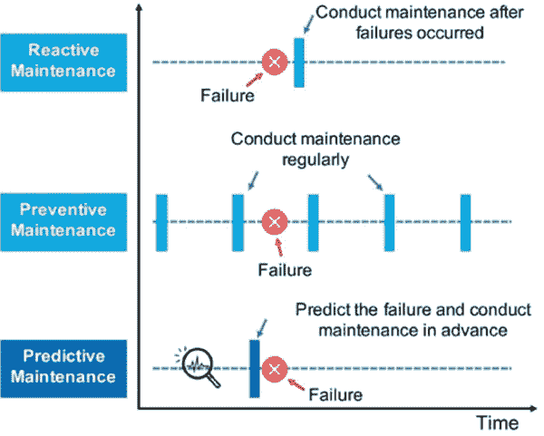 |

工具维护

在机械制造领域，工具被用作精密设备，用于切割、冲压或成型金属和其他材料（Canis，2012）。遵循制造商的规格以保持工件的高质量。例如，随着时间的推移，冲压工具的半径增加，不应大于 0.1mm（加拿大金属加工和焊接，2018）。参见图 2。根据规格的研磨过程对于维护是必要的，以去除磨损并重新磨尖边。

| 图 2\. 冲压工具的维护规范 |
| --- |
| 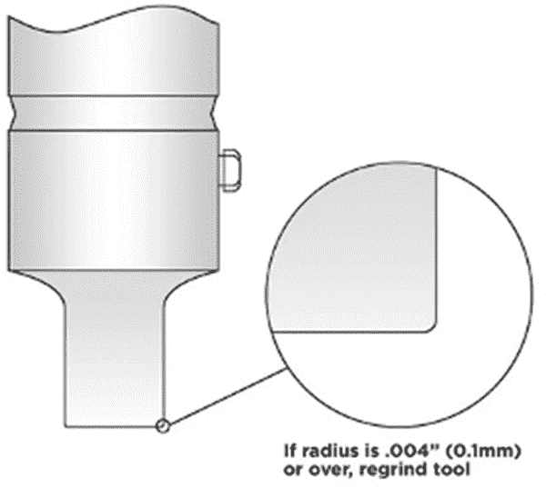 |

遵循维护建议，可以确保工具和机器的状态，同时也履行服务和保修合同。在“跨公司业务模型需要数字合同”一节中，智能合约被用于自动化此过程，并通过使用区块链技术提供法律确定性。

机器维护

如今，许多制造机器都是协作机器复杂系统的一部分（Zeng，1997）。随着使用和年龄增长，机器的状态会恶化。这对所有机械部件尤其成立。随着持续恶化，生产力下降，故障的易感性增加。维护计划根据维护理念制定，旨在确定设备维护的最佳频率，以确保其可用性（Duarte 等，2006; Jin 等，2009）。由于计划的遵守可能具有法律相关性，监控区块链中的维护任务是提供确定性的简单方法。表 1 显示了冲床机的典型预防性维护计划（Balram，2015）。

表 1\. 冲压机预防性维护计划。

| 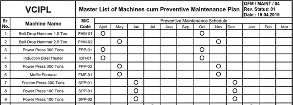 |
| --- |

维护合作伙伴关系

维护可以由不同的参与方执行，可以是内部熟练员工，也可以是原始设备制造商的员工，或者是由原始设备制造商授权的服务提供商（Tenneson，2017）。考虑到不同原因，第三方维护被认为是可能的，如维护成本降低，减少管理工作量和委托雇佣风险（Bertolini 等，2004）。第三方维护的对象可以是单个机器或机械，也可以是一般工厂中心领域，如基础设施、防火、清洁或电力（Gomez 等，2009）。维护的外包导致涉及的各方广泛。

机床维护的相关利益相关者和程序示例如图 3 所示，受到 Wan 等人（2017）的启发。机床制造商制定维护计划和公差规格。提供保修合同，参考了大量的技术信息。机床的所有者签订了一份工具保修合同，根据规格要求使用工具。维护计划触发维护时，由合同维护提供商移除工具。将工具送到第二个服务提供商进行大修。这包括对工具进行磨削和硬化。根据制造商的规格进行检测和重新认证。无论是作为翻新产品出售还是再次使用，都必须验证证书。

| 图 3。维护涉及多方利益相关者 |
| --- |
| 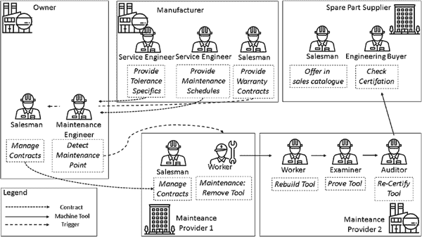 |

正如 Castillo（2020）所示，销售翻新备件可能是一个有利可图的商业模式，如果能证明翻新过程的质量；通过利用区块链技术可以优化此过程。

图 4 说明了在一个示例利益相关者联盟中使用区块链技术的情况，这些利益相关者都参与了维护过程。一个区块链（服务区块链）可以用于维护合作伙伴之间的信息交换。私人内部信息被保密在“车间区块链”中。这些解决方案的详细信息可以在“跨公司不必要数据传输”部分找到。

| 图 4\. 多利益相关者参与维护 |
| --- |
| 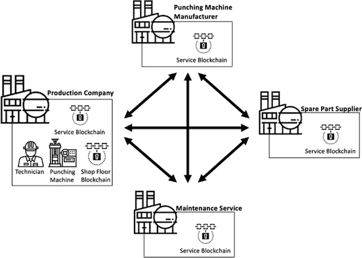 |

区块链技术可以提供维护审计追踪，用于追踪相关事件。维护记录被保存在区块链中，为所有利益相关者提供监控和验证。这使得事后可以调查故障原因，并为法律案件提供证据。此外，它可以用作提醒，以跟踪即将进行的维护。 “欧洲航空安全局”为航空业定义了维护审计追踪，以定义飞机的合规维护状态（EASA，2020 年）。

基于纸张的维护和人为错误

尽管已经制定了详细的维护计划和方法来防止或至少减轻维护过程中的人为错误的影响（Abbassi 等，2015 年），但人为错误仍然经常在其文档中发生（Dhillon，2013 年）。错误的来源各不相同，从缺乏有效沟通到操作员疲劳和不足的操作员培训（MacKenzie 等，2007 年；Whittingham，2004 年）。这些原因被总结为人为错误，并且随着参与维护过程的利益相关者数量的增加而增强。人为错误的主要来源是基于纸张的记录及其处理（Barchard 等，2011 年）。基于纸张文件存在的主要问题的典型例子包括笔迹潦草（由于错误解读而造成的伪造数据），大量文件的昂贵运输和存储，文件的破坏或丢失，或者个别文件之间关系难以理解（Pandey，2019 年）。

通过用数字化方法取代基于纸张的文档编制方法（Watson 等，2019 年），可以减少人为错误，这种方法利用自动数据收集（例如传感器，不能复制的物理标记（Jung 等，2013 年；Wlodarczyk 等，2017 年）以及其他自动收集数据源）与区块链相结合。使用智能合约可以证明数据收集的正确性和合理性。有关更多信息，请参阅“行业中的智能合约挑战及可能解决方案”。

质量保证和自动化的区块链

另一个可以使用区块链更有效和可验证地进行的产品生产过程是质量保证，其中产品的质量被持续检查，必要时采取对策。可以借助传感器收集确定质量的测量数据，并通过智能合约自动监控。如果检测到质量不佳，智能合约可以用于自动执行对生产过程的调整（例如，调整过程参数）；对这些调整及其原因可以以可追溯的方式记录下来。

相关工作

相关工作部分分为四个部分：区块链、可靠性与可追溯性、合同协议以及工业 4.0 中的维护。

区块链在工业 4.0 中的应用

将区块链整合到工业 4.0 中，可以用软件中心化和文档化的流程替代现有的容易出错的程序（参见 Kshetri，2017; Christidis 等，2016）。Teslya 等人（2017 年）介绍了将区块链整合到工业 4.0 中的架构方法。该方法建议使用智能合约来控制生产过程中的资源。一种名为 IoTChain 的区块链安全架构（见 Alphand 等，2018 年），将 ACE 作为授权框架和 OSCAR 作为应用层负载的加密框架进行了组合。其他针对工业 4.0 中的区块链的论文则侧重于保护数据的隐私性。Rahulamathavan 等人（2017 年）使用去中心化属性基加密和解密来访问传感器值。另一种基于智能合约的访问控制由 Zhang 等人（2018 年）介绍。他们使用不同类型的合约，例如：1)用于指定多个主体-对象对的访问控制的访问控制合约，2)用于评估访问控制期间用户的不端行为的判断合约，以及 3)用于管理其他合约的注册合约。尽管区块链和工业 4.0 提供了机会，但深入了解区块链仍然是必不可少的，否则可能会导致严重的财务损失（Destefanis 等，2018 年）。

工业 4.0 中的可靠性和可追溯性

随着各种信息的数字化，区块链技术目前正被用于建立使用去中心化架构的信任、货币价值和服务的数字化基础。除了比特币和其他金融服务外，大多数区块链工作目前集中在供应链管理领域。例如，在食品行业，在运输过程中必须确保严格的环境控制（Caro 等，2018 年; Tian，2017 年）。医疗产品也同样如此（Bocek 等，2017 年）。

工业 4.0 中的合同协议

有方法利用区块链技术来实现工业 4.0 中的智能合同。Norta（2015 年）基本上描述了将区块链引入传统业务流程的想法。Nakashima 等人（2017 年）引入了用于服务水平协议（SLA）合同的 Web API。该工作侧重于 SLA 合同的编排的 API 规范，但忽略了工业 4.0 使用案例，其中机器、传感器等是 SLA 合同的一部分。除了工业 4.0 外，Pascale 等人（2017 年）还讨论了用于移动通信提供商的智能合同 SLA 的使用。

工业 4.0 中的维护

工业 4.0 的主要维护研究集中在预测性维护领域，因为机器学习算法的兴起（Spendla 等人，2017 年；Yan 等人，2017 年）。然而，Beng（2018 年）进行了有关工业 4.0 对传统维护技术影响的一般性研究。它指出了需要更新来自 Garg 等人（2006 年）的原始维护管理模型。工业 4.0、物联网和物联网系统是新型维护策略类别。Kumar 等人（2017 年）描述了与工业 4.0 互动的维护模型对技术、组织和运营的积极影响。

跨公司业务模式需要数字化合同

典型情况下，合同是一种法律文件，定义了商业伙伴之间的协议，并概述了提供的服务、成本、资源等内容。跨公司业务模式由多个方提供的多个业务服务组成。为了为客户提供满意的服务，业务伙伴之间约定的服务质量必须数字化，以实现自动监控、合规性验证和在合同违反时启动行动。

走向数字协议

商业合同是两个或多个人或实体之间的法律约束协议。如图 5 所示，不同管理层级（Wallis 等人，2020 年）有不同的协议，例如：

+   • 服务级别协议：指定 IT 运营级别的服务质量，并根据技术基础设施的标准（例如带宽）进行测量和报告。

+   • 过程级别协议：在过程操作级别指定服务质量，并针对业务流程的上下文进行测量和报告（例如生产线加工时间）。

+   • 业务级别协议：指定业务运营级别的服务质量，并根据业务结果的背景（例如生产的工件数量）进行测量和报告。

| 图 5. 不同业务层级的智能合同 |
| --- |
|  |

通常，精密的报告机制足以事后记录协议。然而，为了支持业务流程的逐步数字化，实时报告和启动适当的行动，需要新的方法来满足几乎实时的要求。将这些文件转换为数字表示将允许以下操作：

+   • 对各种协议级别的服务之间的依赖关系进行建模（参见图 5）。

+   • 对任意复杂系统的指定服务质量进行全面和不可更改的记录。

+   • 监控指定的指标和活动（工作流程），并按需触发操作。

智能合同（SC）

区块链中智能合约的目标是实现先前基于纸张的合同的不可否认性和透明追溯性。它们不取代法律业务合同；而是细化和指定要自动化的部分。智能合约的实现范围从简单流程到非常复杂的流程，涵盖尽可能多的任务。简单流程的一个示例是监控条件，比如传感器数值。简单条件的比较总是会导致明确的结果。复杂流程的一个示例是验证涉及多方利益相关者的链接流程步骤。复杂条件的比较并不总是会导致清晰的结果，必须通过进一步的检查来处理，以获得清晰的结果。必须注意的一个限制是避免非确定性函数和值。这些包括以秒为单位获取当前时间、生成随机数或查询传感器数值（Alharby 等，2017 年；Vukolić，2017 年）。为了获取这些潜在的非确定性值，例如传感器数据，它们是在智能合约之外检索并被用作智能合约的输入参数。

智能合约模板（SCT）

为了保护区块链用户免受严重后果，如资产损失、在竞争对手中丢失订单，同时提供易用性，引入了智能合同模板化方案。SCT 将创建智能合同所需的知识分为两个领域 - 维护和区块链 - 允许每个领域的专家专注于自己的领域，而不必担心另一个领域的内部工作。区块链专家开发适用于特定领域的智能合同基础。维护领域专家确定基于纸质的维护服务手册的基本属性。如图 6 所示，分析了维护服务手册，并确定了名称、日期、服务间隔、服务价格、错误行为和责任等基本属性。维护专家将基本属性填入智能合同模板中，智能合同将自动生成并存储在区块链中以供执行。

| 图 6\. 智能协议合同模板工作流程 |
| --- |
| 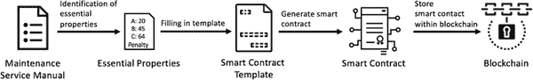 |

使用 Hyperledger Fabric 进行工具和机器维护

超级账本 Fabric（HLF 或 Fabric）是由 IBM 开发的开源权限区块链（Hyperledger Foundation, 2020）。权限区块链通过限制用户组来提供信任，同时将所有信息发布给每个参与者。因此，利益相关者必须互相了解，而不必相互信任。算法用于就交易是否符合合同及其引用数据的真实性达成共识。共识算法 raft 将在不久的将来成为拜占庭容错算法（IBM Corporation, 2020b）。智能合约在 Fabric 中称为 Chaincode，可以用 Go、node.js 或 Java 编写（IBM Corporation, 2020a）。提供了几种客户端 SDK，用于使用不同编程语言（Java、node.js、Python）构建与 Fabric 交互的应用程序（IBM Corporation, 2020c）。

工业机器人的维护用例

爱普生于 2019 年推出了 T3-401S SCARA 机器人（ESR），作为生产线的多功能入门级机器人解决方案（Epson, 2019）。以下小节展示了利用区块链进行 ESR 典型维护工作的应用案例。使用案例依赖于后文详细描述的 BISS 4.0 的集成。涉及的利益相关者和流程如图 7 所示。

利益相关者建立了一个联盟，以改变涉及服务合同的业务交易。所有者使用 ESR 进行生产，维护任务由内部和外部员工执行。对于外部维护，签约了清洁服务。所有者和制造商（OEM）之间的保修合同依赖于符合要求的维护任务。有两个应用程序（Capture Interface 和 Registry Application）可在共享区块链上执行交易，该区块链在 HLF 中表示为通道。每个利益相关者都保存账本的副本，即所有交易的完整历史记录。智能合约在通道上读取新的交易以确定成功或失败，并得出其合同履行的判断。与维护相关的智能合约基于（i）由 OEM 提供的维护计划，该计划基于历史数据，或者（ii）预防性维护（PM），这是一个观察 ESR 状态并采取自适应反应的系统。 PM 基于先前传感器收集的机器数据，该数据被解释并用于维护调度。 PM 使用机器学习技术来预测适当的维护间隔和类型。

| 图 7\. BISS 4.0 平台集成 |
| --- |
| 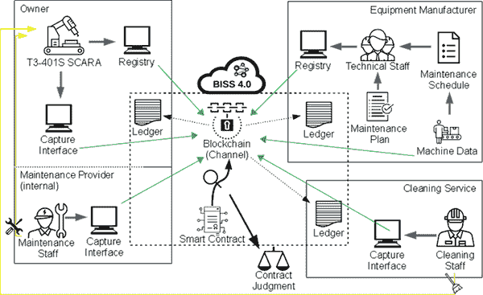 |

计划维护用例（PMUC）

在这个用例中，计划维护任务顺利进行。该任务在设备制造商提供的服务手册中定义。该手册列出了维护任务（MT），描述了任务和周边信息。最相关的是检查点、运行时间、维护程序和 ESR（爱普生，2016）的状况。两个示例任务是：“检查是否出现异常声音或振动”（MT1）每天一次；“检查螺栓/螺丝的松动或间隙。必要时拧紧它们”（MT2）；每 12 个月或 3000 小时运行后必须执行其中之一。参考图 8，显示了爱普生 T 系列机器人安全和安装手册的节选（爱普生，2016）。对于 MT1，ESR 必须处于开启状态，而对于 MT2，则必须处于关闭状态。假定内部工作人员可以执行维护，因为没有明确的专业要求。必须捕获记录维护的数据。完整的维护过程包括以下步骤：

+   1. 检测检查点。

+   2. 维护人员检查先决条件并准备 ESR 进行维护。

+   3. 执行维护程序。

+   4. 数据捕获的附加步骤：维护事件和结果的信息被记录。这包括由工作人员使用捕获界面创建的手动日志数据，以及机器和工具的传感器自动捕获的数据。

+   5. 出现的维护日志被添加到区块链中，以实现可信的持久性和可追溯性。

维护失败用例（FMUC）

这个用例涉及由清洁不足引起的故障，并展示了区块链如何简化法律案件中的证据证明。ESR 在灰尘多的环境中运行，因此需要频繁清洁以确保无缝运行。清洁任务由外部清洁服务执行。预测性维护用于调度。使用粒子浓度传感器捕获灰尘负荷。

在使用过程中，ESR 的预测性维护模型启动了一项需要对机械部件进行彻底检修的维护任务。检修必须提前执行，而不是在手册中规定的时间，导致成本增加和生产延误。这一事件的财务影响引发了业主和制造商（OEM）之间的法律诉讼。双方都拒绝承担成本。区块链被触发以生成审计跟踪记录。审计跟踪记录显示清洁不足。清洁服务未能及时执行所有必要的清洁任务。这导致由于灰尘含量高的空气而造成的磨损增加。区块链中的记录维护日志用于确定清洁人员的责任。

| 图 8\. 摘自爱普生 T 系列机器人安全和安装手册 |
| --- |
| 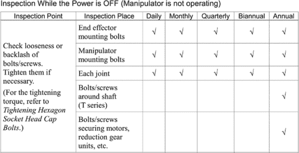 |

BISS 4.0 平台

BISS 4.0 平台（Blockchain-Technologien im Schaltschrank 或 Switch Cabinet 中的区块链）建立了一个持续的信任链，数字化了 SLA 合同，并根据政策在公司之间控制数据交换（Hochschule Furtwangen，2018）。应用用例“可靠的交互式维护计划”和“可靠的故障排除”已在 BISS 4.0 平台上实施并演示。

BISS 4.0 的架构满足了使用案例 MT1 和 MT2 的明显要求（如上所述），例如将三个具有不同访问级别的组织框定，提供具有关注点分离的可信区块链概念，并连接 ESR 等机器。除此之外，还追踪了三个关于分布式计算的目标：i) 利益相关者联盟实现所有参与者的平等权利；ii) 一个故障安全和冗余的平台基础设施；和 iii) 一个多租户架构。BISS 4.0 使用的所有使用和开发的组件都以开源许可证授权。Hyperledger Fabric (HLF) 被用作区块链组件。

| 图 9. BISS 4.0 平台 |
| --- |
| 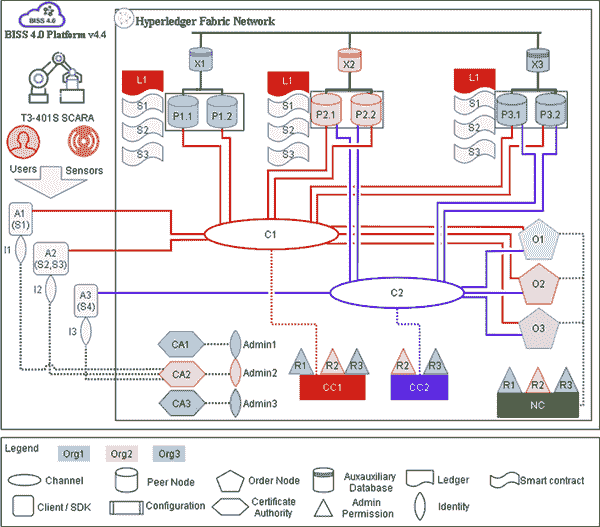 |

三个组织（见图 9），用三种不同的颜色表示，正在使用一个红色的 HLF 通道（C1）进行合作。根据使用案例，它们分别是一个清洁服务作为 i) Org1/R1，即 ESR-所有者；ii) 作为 Org2/R2 和 ESR-OEM；以及 iii) 作为 Org3/R3。每个组织都配备了自己的基础设施，具体如下：

+   i) 两个独立的 HLF 对等节点（P*.1，P*.2），连接到 C1 并且都维护了 HLF 分类账 (L1) 的副本。每个利益相关方的两个对等方是独立的，驻留在不同位置的硬件上提供故障安全性。智能合约 (S1-S3) 在 L1 上运行。

+   ii) 一个辅助数据库 (X*)，保存有关令牌信息的信息。例如，传感器数据和证据图片存储在这里；区块链存储相应的哈希值。该数据库使用 CouchDB (Apache Software Foundation, 2020) 实现，在组织之间进行复制。

+   iii) 一个 HLF 证书颁发机构，提供为身份创建证书的能力。

+   iv) 参与共识过程的 HLF Orderer 节点，用于决定交易是否有效。有效交易被排序为块以进行分发，构建区块链。每个组织都参与使用其管理权限定义网络配置（NC）。这些管理权限还用于控制通道 1 的配置（CC1），定义通道属性。

+   v) 在通道内执行业务交易的客户端应用程序（A1、A2）。A1 代表捕获接口应用程序，用于捕获有关维护的信息。在技术层面上，A1 将数据放入 C1。ESR 通过传感器连接，将数据传递给 A1 和 A2。清洁服务人员使用 A1 记录他们的工作，A1 也被业主的维护人员使用。A1 使用智能合约 S1，涉及维护任务。业主和 OEM 有一个丰富的应用程序（A2）可以相互交互，涉及维护任务、保修、零件更换、服务合同。

HLF 中的身份由成员服务提供商（MSP）提供。最常用的 MSP 是 HLF 证书管理机构（Fabric-CA）（IBM 公司，2020d）。它使用 X.509 证书来验证用户并签署交易。通常，每个组织至少有一个 Fabric-CA，允许管理员注册新用户。在配置的 BISS 4.0 中（图 9），R1（所有者）已使用 CA2 为 A1 和 A2 创建用户。ESR 及其传感器的身份已获得认证，因此在区块链中得到了记录。

区块链中的机器集成

为了能够从区块链网络中存储和检索信息，设备/机器需要集成到网络中。Fabric 提供了不同的 SDK 来解决这个任务。这些 SDK 提供了高级编程语言的接口。

由于工业机器是闭合系统，运行在专有软件上，因此无法运行自定义代码。大多数这些机器运行可编程逻辑控制器（PLC），可以通过可行性和额外功能进行扩展。一个常见的选项是集成 OPC UA 服务器。OPC UA 是一种专为工业自动化设计的机器对机器通信协议（OPC Foundation, 2020）。近年来，这种面向对象的协议已经成为自动化领域的事实标准。使用 OPC UA 只需一个协议即可集成不同供应商的机器。有多个开源客户端 OPC-UA 库可供使用，可以与不同的 Fabric SDK（例如 NodeOpcUa, 2020; FreeOpcUa, 2020）一起使用。

| 图 10\. 连接机器到 Hyperledger Fabric 的不同方式 |
| --- |
| 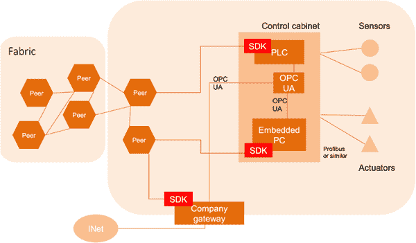 |

根据特定的机器和公司的网络能力，可以在不同的层次上实施区块链集成。请参考图 10\. 连接机器的最简单方式是通过嵌入式 OPC UA 服务器。Fabric SDK 可以运行在靠近或内部的小型嵌入式工业 PC 上，也可以充当所有车间内机器连接到的网关。如果有权限安装软件，则 SDK 直接在机器上运行。

维护智能合约和模板

将服务手册转换为维护智能合约需要两个领域的专家参与：一个熟悉维护的实体和一个熟悉区块链和智能合约的实体。转换包括两个主要步骤：由维护领域专家识别维护任务的基本属性，以及由区块链领域专家创建维护智能合约。

识别关键维护任务属性

维护领域专家分析服务手册以获取若干属性，例如：

+   • 维护任务类型（手动、半自动、自动）

+   • 维护任务的间隔（每日、每周、每 X 小时操作等）

+   • 需满足的条件（例如扭矩、填充水平等）

+   • 所需证据（传感器值、ID 扫描、更换部件的照片等）

关于两个维护案例的分析结果，MT1：“检查异常声音或振动”和 MT2：“检查螺栓松动并在必要时拧紧”，如下表 2 所示。

表 2\. 已识别的维护属性

| 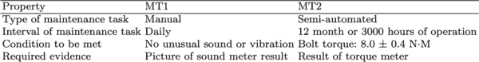 |
| --- |

创建维护智能合约模板

根据维护专家识别的维护属性，区块链专家创建维护智能合约和模板。对 MT1 和 MT2 之间的相似性进行评估，发现两者都需要某种证据并具有某种比较特征。这些相似之处被提取到模板中，以减少代码重复和潜在的错误源。此外，维护智能合约模板中包括一些常见的智能合约函数：

+   • 在区块链中保存内容

+   • 从区块链检索内容

+   • 触发事件

区块链领域专家创建的基于属性的维护智能合约模板如算法 1 所示。维护专家填写的属性由占位符标记。

| 图 11\. 算法 1：维护智能合约模板 |
| --- |
|  |

生成的维护智能合约

维护领域专家完成了两个维护任务的维护智能合约模板后，维护智能合约会自动生成。生成的两个智能合约如算法 2 和算法 3 所示。

| 图 12\. 智能合约算法 2：维护任务 1 |
| --- |
| 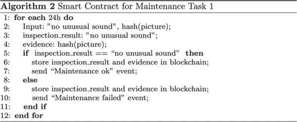 |
| 图 13\. 智能合约算法 3：维护任务 2 |
| 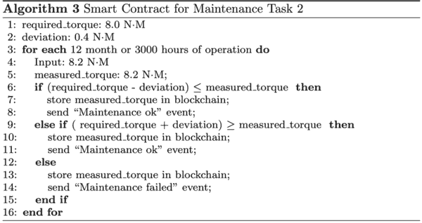 |

讨论、挑战与解决方案

基于上述考虑，下文将详细讨论一个实际例子。问题被描述，并提出了解决方案。此外，还讨论了智能合约领域中的现有问题并提出了解决方案。

不受欢迎的跨公司数据传输

企业间的数据传输可能导致数据泄露。为了确保信息的隔离，引入了区块链的多样化：包括详细信息的公司私有区块链（内部区块链）以及通用区块链（外部区块链）。

| 图 14\. 区块链的多样化 |
| --- |
| 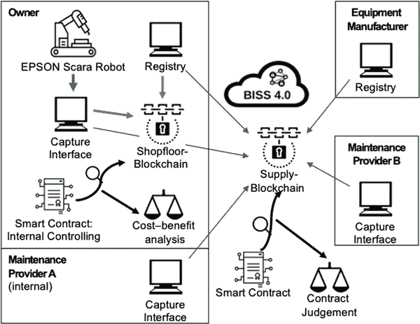 |

多样化反映了利益相关者的数据隐私边界，具有自我中心的观点。参考图 11\. 假设使用该机械的制造商将机械的使用信息放入区块链。客户、原始设备制造商和维护提供商相互连接以映射业务流程。区块链上的每个人都可以阅读使用统计数据的更改。可以阅读并推断合同的内容，例如客户订单的处理。为解决这种跨公司数据访问，必须在将数据写入该区块链（服务区块链）之前对数据进行过滤。完整的数据存储在私有区块链（车间区块链）中。

服务区块链存储由外部服务实体生成和利用的信息，例如维护记录。车间区块链提供数据分离，存储制造公司生成和利用的私人信息，例如机器数据和日志文件。这种分段提供了数据安全和隐私保护，同时为所有利益相关者提供了增加的区块链性能。机器数据仅存储在车间区块链中。因此，服务提供商不受存储机器数据所带来的大量交易的影响。

防止不受欢迎的跨公司数据传输的另一种方法是创建审计日志并使用定性描述（Stodt 等，2020 年）。如果要创建可审计的数据传输日志，可以使用在区块链中记录的 P2P 数据传输，而无需直接了解数据传输。这样，可以追踪传输的数据，但不能查看数据内容。然而，如果机密数据必须在智能合同中处理，则将数据转换为定性描述。例如，将“268 小时内维护”转换为“超过 200 小时内维护”。

此外，欧洲一般数据保护条例（EU GDPR）的法律规定，如将数据处理分离用于不同目的，可通过区块链多样化来解决。

工业中的智能合同挑战及可能的解决方案

本节讨论了进一步的挑战及其可能的解决方案。使用智能合同可能导致以下挑战：

部分数字化的智能合同：企业之间的合同并非所有部分都可以数字化。例如，像检查机器清洁度这样的定性测量，使用传感器实现不可能或成本太高。

+   可能的解决方案：具有机器学习功能的传感器，可以测量相关的定性数值。

难以集成的手动操作：人工手动任务难以集成，因为很难验证任务是否已处理并且质量可接受。

+   • 可能的解决方案：用于检查结果的传感器，例如 RFID 标记验证备件更换（Jung 等人，2013 年；Wlodarczyk 等人，2017 年）。

身份管理可能成本过高：区块链参与者的身份验证成本高昂。例如，传递重要信息的传感器必须进行加密标识并集成到区块链中。

+   • 可能的解决方案：使用网关，负责传感器与区块链之间的通信。该网关必须提供诸如加密模块、传感器的多个接口等不同功能。

智能合约的漏洞：智能合约本身可能编写不当，因此本身构成安全风险（Atzei 等人，2017 年）。

+   • 可能的解决方案：多次测试迭代，不同的测试场景，并由专家审核。

误将虚假信息变成永久性的可能性：各方可能会将虚假数据插入区块链，由于不可变性特征，这些数据难以删除。

+   • 可能的解决方案：验证系统，在将每个值存储到区块链之前验证每个值。需要特别注意，因为验证系统可能是单点故障。

智能合约代码重复的可能性：特定领域的智能合约可能存在代码重复，这会降低可维护性并增加潜在错误的数量。

+   • 可能的解决方案：引入包含常见功能的智能合约模板。

智能合约更新的复杂性：需要更新灵活内容（例如条件值）的智能合约更新代表着高度的行政负担。

+   • 可能的解决方案：通过占位符替换灵活内容，将灵活内容存储在区块链中，在执行智能合约时从区块链检索灵活内容。

结论和未来工作

由于工具和机器维护流程涉及许多交替的利益相关者，区块链使用的影响是巨大的。智能合约用于证明维护任务，其中每个任务步骤都被表示出来。正确执行的证据被存储在区块链中。在成功执行后，合同的最终操作，如支付，将发生以完成合同。建立信任的自动化和便利性降低了合同处理的成本。对维护的精确监控允许设备的最佳操作，提高了生产力并降低了成本。通过对智能协议合同模板进行建模加速了智能合约的实施。此外，该流程减少了错误的可能性，提高了安全水平。

为了提出的维护流程转换，使用了 Hyperledger Fabric。通过使用 BISS 4.0 平台，一个包括身份管理的基础设施已经被开发出来。讨论了将机器整合到区块链中，并且将维护流程数字化为智能合约。

尽管利用区块链技术具有诸多优势，但仍然存在一些挑战，如完全合同数字化的缺失、可扩展性、安全地整合外部信息、数据隐私保护、访问管理等。针对其中一些挑战，在本章中提出了一些解决方案，尽管其中许多仍在研究中。其结果是发展关于维护主题的区块链解决方案，因为大多数区块链解决方案仅专注于供应链主题中的可追溯性方面。

另外，生产行业的其他领域也可能从区块链的使用中受益。其中一个领域是动态机器支付，被称为“机器即服务”（EXOR，2019）。机器即服务有两种类型：按产量付费和出售剩余产能。在第一种类型中，机器以低成本卖给客户，每产生一单位产品额外收取一笔费用。在第二种类型中，公司的多余产能可以卖给外部公司，以成本效益的方式利用机器并产生额外收入。通过“机器即服务”，区块链获得了供求中介、支付服务提供商和安全证据提供商的角色。在生产行业的环境保护和资源保护领域，使用区块链可以建立透明的分拣流程。不符合一流质量的生产产出会被重新标记。通过区块链技术记录和可追溯的透明分拣流程，为被分拣的产品建立了信任。

致谢

这项工作得到了欧洲区域发展基金（EFRE）和巴登-符腾堡州科学、研究和艺术部（MWK）在项目 BISS 4.0（biss40.in.hs-furtwangen.de）框架内的资助。

参考文献

Abbassi, R., Khan, F., Garaniya, V., Chai, S., Chin, C., & Hossain, K. A. (2015). An integrated method for human error probability assessment during the maintenance of offshore facilities. Process Safety and Environmental Protection , 94, 172–179\. doi:10.1016/j.psep.2015.01.010

Alphand, O., Amoretti, M., Claeys, T., Dall’Asta, S., Duda, A., Ferrari, G., Rousseau, F., Tourancheau, B., Veltri, L., & Zanichelli, F. (2018). Iotchain: A blockchain security architecture for the internet of things. 2018 IEEE Wireless Communications and Networking Conference (WCNC), 1–6\. doi:10.1109/WCNC.2018.8377385

Apache 软件基金会。 (2020)。 Apache CouchDB。 2020 年 5 月 30 日检索自 https://couchdb.apache.org

Atzei, N.，Bartoletti, M.，& Cimoli, T. (2017)。 对以太坊智能合约攻击的调查 sok。 安全与信任原则第 6 届国际会议论文集，10204，164–186。 doi：10.1007/978-3-662-54455-6_8

Balram, J. (2015). 预防性维护计划。 Scribd。2020 年 5 月 30 日检索自 https://www.scribd.com/doc/279104286/Preventive-Maintenance-Plan

Barchard, K. A.，& Pace, L. A. (2011)。 防止人为错误：数据输入方法对数据准确性和统计结果的影响。 人类行为中的计算机，27(5)，1834–1839。 doi：10.1016/j.chb.2011.04.004

Beng, D. C. (2018)。 作为维护策略的工业 4.0 技术（综述）。 doi：10.13140/rg.2.2.18116.32644

Bertolini, M.，Bevilacqua, M.，Braglia, M.，& Frosolini, M. (2004)。 一种用于维护外包服务选择的分析方法。 [质量]。国际质量与可靠性管理杂志，21(7)，772–788。 doi：10.1108/02656710410549118

Bocek, T.，Rodrigues, B. B.，Strasser, T.，& Stiller, B. (2017)。 到处都是区块链 - 区块链在制药供应链中的用例。 2017 年 IFIP/IEEE 综合网络与服务管理研讨会（IM），772–777。 doi：10.23919/INM.2017.7987376

Campbell, J. D.，& Jardine, A. K. (2010)。 维护卓越：优化设备生命周期决策。 CRC Press。

加拿大制造与焊接。 （2018）。 高效冲压。 2020 年 5 月 30 日检索自 https://www.canadianmetalworking.com/canadianfabricatingandwelding/article/fabricating/punching-productively

Canis, B. (2012)。 工具和模具行业：对美国制造业的贡献和联邦政策考虑。 国会研究服务报告，1–17。

Caro, M. P., Ali, M. S., Vecchio, M., & Giaffreda, R. (2018). 农业食品供应链管理中基于区块链的可追溯性：实践实现. 2018 年意大利托斯卡纳物联网垂直和专题峰会(IOT Tuscany), 1–4. 10.1109/IOTTUSCANY.2018.8373021

del Castillo, M. (2020). 霍尼韦尔现在正在区块链上跟踪价值 10 亿美元的波音零部件. 福布斯. 检索于 2020 年 6 月 29 日，来源：https://www.forbes.com/sites/michaeldelcastillo/2020/03/07/honeywell-is-now-tracking-1-billion-in-boeing-parts-on-a-blockchain/

Christidis, K., & Devetsikiotis, M. (2016). 区块链和物联网的智能合同. IEEE Access：实用创新，开放解决方案, 4, 2292–2303. doi:10.1109/ACCESS.2016.2566339

DestefanisG.MarchesiM.OrtuM.TonelliR.BraccialiA.HieronsR. (2018, March). 智能合同的漏洞：对区块链软件工程的呼吁？在 2018 年区块链导向软件工程国际研讨会(IWBOSE)上(pp. 19-25). IEEE.

Dhillon, B. S. (2013). 人的可靠性：与人因素. Elsevier.

德国标准化学会. (2012). DIN 31051：2012 09-维护基础. DIN.

Duarte, J. A. C., Craveiro, J. C. T. A., & Trigo, T. P. (2006). 一系列组件系统预防性维护计划的优化. 国际压力容器与管道杂志, 83(4), 244–248. doi:10.1016/j.ijpvp.2006.02.016

欧洲航空安全局. (2020). “详细维护记录”一词是什么意思？检索于 2019 年 5 月 7 日，来源：https://www.easa.europa.eu/faq/19042

爱普生. (2016). 机器人系统安全与安装（t3 / epson rc+ 7.0）. 精工爱普生公司.

爱普生. (2019). Epson SCARA t3-401s - 爱普生. 检索于 2019 年 5 月 9 日，来源：https://www.epson.de/en/products/robot/epson-scara-t3-401s-with-controller-built-in

EXOR. (2019). 什么是作为服务业务模式的机器？检索于 2020 年 6 月 22 日，来源：https://www.exorint.com/en/blog/2019/04/26/what-is-the-machines-as-a-service-business-model

FreeOpcUa. (2020). Python asyncio 中的 OPC UA 栈。[链接](https://github.com/FreeOpcUa/opcua-asyncio)，访问日期为 2020 年 5 月 26 日。

Garg, A., & Deshmukh, S. (2006). 维护管理：文献综述和发展方向。《维护工程质量杂志》，12(3)，205–238 页。doi:10.1108/13552510610685075

Gomez, J., Crespo, A., Moreu, P., Parra, C., & Diaz, V. G. (2009). 服务提供商中的维护外包。《安全、可靠性和风险分析：理论、方法和应用》，829–837 页。

Gratzke, P., Schatsky, D., & Piscini, E. (2017). 策略者的信号：团结起来支持区块链。Deloitte 大学出版社。[链接](https://dupress.deloitte.com/dup-us-en/focus/tech-trends/2017/blockchain-trust-economy.html)

Furtwangen, H. (2018). BISS:4.0\. 2018 年版 BISS:4.0。[链接](https://www.hs-furtwangen.de/forschung/forschungsprojekte/biss40/)，访问日期为 2020 年 5 月 30 日。

Hyperledger Foundation. (2020). Hyperledger 开源区块链技术。Hyperledger。[链接](https://www.hyperledger.org/)，访问日期为 2020 年 5 月 30 日。

Corporation, I. B. M. (2020a). Fabric 链代码。[链接](https://hyperledger-fabric.readthedocs.io/en/release-2.0/chaincode.html)，访问日期为 2020 年 5 月 26 日。

Corporation, I. B. M. (2020b). Fabric 订购服务。[链接](https://hyperledger-fabric.readthedocs.io/en/release-2.0/orderer/ordering service.html#raft)，访问日期为 2020 年 5 月 26 日。

Corporation, I. B. M. (2020c). Fabric SDKs。[链接](https://hyperledger-fabric.readthedocs.io/en/release-2.0/fabric-sdks.html)，访问日期为 2020 年 5 月 26 日。

Corporation, I. B. M. (2020d). Hyperledger Fabric CA。[链接](https://hyperledger-fabric-ca.readthedocs.io/en/release-1.4/)，访问日期为 2020 年 5 月 26 日。

ISO & IAF. (2020). ISO 9001 审计实践组。[链接](https://committee.iso.org/home/tc176/iso-9001auditing-practices-group.html)，访问日期为 2020 年 5 月 29 日。

Jin, Y.-L., Jiang, Z.-H., & Hou, W.-R. (2009). 将灵活间隔预防性维护规划与生产调度集成。《国际计算机集成制造杂志》，22(12)，1089–1101。doi:10.1080/09511920903207449

Jung, S. W., & Jung, S. (2013). Hrp: 一种基于 hmac 的 rfid 互认证协议使用 puf。在 2013 年信息网络国际会议(ICOIN)上。IEEE。

Kouakou, D., Boiral, O., & Gendron, Y. (2013). ISO 审计与信任构建。《会计、审计与责任杂志》，26(8)，1279–1305。doi:10.1108/AAAJ-03-2013-1264

Kshetri, N. (2017). 区块链能否加强物联网？《IT 专业人士》，19(4)，68–72。doi:10.1109/MITP.2017.3051335

Kumar, U., & Galar, D. (2017). 在工业 4.0 时代的维护：问题与挑战。《质量、IT 和业务运营》，Springer 新加坡。

MacKenzie, C., Holmstrom, D., & Kaszniak, M. (2007). BP 德克萨斯城炼油厂爆炸的人因分析。人因学与人体工程学会年会论文集，51(20)，1444–1448。doi:10.1177/154193120705102015

Mills, D. C., Wang, K., Malone, B., Ravi, A., Marquardt, J., Badev, A. I., & Ellithorpe, M. (2016). 支付、清算和结算中的分布式账本技术。学术出版社。

Moyano, J. P., & Ross, O. (2017). 使用分布式账本技术优化 KYC。《企业与信息系统工程》，59(6)，411–423。doi:10.1007/s12599-017-0504-2

Nakashima, H., & Aoyama, M. (2017). Web API sla 合同的自动化方法及其基于区块链概念的平台。2017 年 IEEE 国际认知计算大会(ICCC)，32–39。doi:10.1109/IEEE.ICCC.2017.12

NodeOpcUa. (2020). Node.js 中的 OPC UA 堆栈。2020 年 5 月 26 日检索自 https://github.com/node-opcua/node-opcua

Norta, A. (2015). 创建用于去中心化自治组织的智能合约协作。《商业信息学研究视角》- 第 14 届国际会议，BIR 2015，2015 年 8 月 26-28 日，爱沙尼亚塔尔图，论文集，3–17 页。10.1007/978-3-319-21915-81

Pascale, E. D., McMenamy, J., Macaluso, I., & Doyle, L. (2017). 密集小单元作为服务的智能合同 SLA。https://arxiv.org/abs/1703.04502

Rahulamathavan, Y., Phan, R. C. W., Rajarajan, M., Misra, S., & Kondoz, A. (2017). 使用基于属性的加密的隐私保护区块链物联网生态系统。2017 IEEE 国际高级网络与电信系统会议（ANTS），1–6 页。doi:10.1109/ANTS.2017.8384164

Ran, Y., Zhou, X., Lin, P., Wen, Y., & Deng, R. (2019). 预测性维护概述：系统，目的和方法。arXiv 预印本 arXiv:1912.07383。

Rutter, J. (2001). 从信任社会学到“电子信任”社会学。《新产品开发与创新管理国际期刊》，2(4)，371–385 页。

Sako, M., & Helper, S. (1998). 信任的决定因素。《经济行为与组织期刊》，34(3)，387–417 页。doi:10.1016/S0167-2681(97)00082-6

Spendla, L., Kebisek, M., Tanuska, P., & Hrcka, L. (2017). 与工业 4.0 一致的生产系统预测性维护概念。2017 IEEE 第 15 届国际应用机器智能和信息学研讨会（SAMI），405–410 页。doi:10.1109/SAMI.2017.7880343

Steinauer, D. D., Wakid, S. A., & Rasberry, S. (1997). 电子商务中的信任和可追溯性。《标准视图》，5(3)，118–124 页。doi:10.1145/266231.266239

Stodt, J., & Reich, C. (2020). 工业 4.0 区块链的 P2P 通信和智能合约中的数据保密性。未发表手稿。

Tenneson, C. (2017). **竞争格局：与第三方维护提供商合作进行数据中心和网络维护成本优化**。检索于 2019 年 5 月 7 日，自 https://www.gartner.com/en/documents/3756176

Teslya, N., & Ryabchikov, I. (2017). **基于区块链的工业物联网平台架构**。2017 年开放创新协会（FRUCT）第 21 届会议，321–329。doi:10.23919/FRUCT.2017.8250199

Tian, F. (2017). **基于 HACCP、区块链和物联网的食品安全供应链可追溯系统**。2017 年服务系统与服务管理国际会议，1–6。doi:10.1109/ICSSSM.2017.7996119

Uca, N., Çemberci, M., Civelek, M., & Yılmaz, H. (2017). **供应链信任对企业绩效的影响：通过供应链协作和协作优势**。《美国科学杂志》, 15, 215–230。

VukolićM. (2017). **重新思考有权限的区块链**。ACM 区块链、加密货币和合同研讨会论文集，3–7。

Wallis, K., Stodt, J., Jastremskoj, E., & Reich, C. (2020). **工业 4.0 领域的智能合约数字化企业间协议**。未发表的手稿。

Wan, S., Li, D., Gao, J., Roy, R., & Tong, Y. (2017). **高价值机床协同维护规划系统中的流程与知识管理**。《工业计算机》, 84, 14–24。doi:10.1016/j.compind.2016.11.002

Watson, K., & Smith, J. (2019). **数字化方法：在程序中减少人为错误的重大变革**。SPE Offshore Europe Conference and Exhibition。doi:10.2118/195753-MS

Whittingham, R. (2004). **责任机器：为什么人为错误导致事故**。Routledge。doi:10.4324/9780080472126

Wlodarczyk, K. L., Ardron, M., Waddie, A. J., Taghizadeh, M. R., Weston, N. J., & Hand, D. P. (2017). **高价值金属商品的防篡改标记**。《光学快报》, 25(13), 15216–15230。doi:10.1364/OE.25.015216 PubMed

Yan, J., Meng, Y., Lu, L., & Li, L.（2017）。工业 4.0 环境下的工业大数据：预测性维护的挑战、方案和应用。IEEE Access：实用创新、开放解决方案，5，23484–23491。doi:10.1109/ACCESS.2017.2765544

曾, S. W.（1997）。制造业维护策略、政策及相应维护系统的讨论。可靠性工程与系统安全，55(2)，151–162。doi:10.1016/S0951-8320(96)00004-X

Zhang, Y., Kasahara, S., Shen, Y., Jiang, X., & Wan, J.（2018）。基于智能合约的物联网访问控制。IEEE 物联网杂志，1–1。doi:10.1109/JIOT.2018.2847705

Zimmermann, L., Scholz, A., Tahoori, M. B., Aghassi-Hagmann, J., & Sikora, A.（2019）。一种基于印刷的模拟差分物理不可克隆功能的设计与评估。IEEE Very Large-Scale Integration (VLSI) Transactions on Systems，27(11)，2498–2510。

关键术语和定义

链码：在 Hyperledger Fabric 中，智能合约称为链码。这些是在分布式方式下执行的小型计算机程序，代表了以前基于纸张的合约的数字化版本。在 Hyperledger Fabric 中，智能合约可以用 Go、Java 或 Node.js 编程，从而为程序员提供了易用性。执行智能合约的过程称为交易。

通道：Hyperledger Fabric 通道提供私密和保密的通信，并代表一个区块链。交易在通道上执行，并存储在通道的分类账中。通道用于隐藏特定组织的某些信息。

ESR：这款爱普生 T3-401S SCARA 机器人是一个多用途的入门级机器人解决方案，适用于生产线。

Hyperledger Fabric：Hyperledger Fabric 是一个权限区块链基础设施，最初由 IBM 和 Digital Asset 贡献，提供了一个模块化架构，将基础设施中的节点之间的角色划分清楚，并执行智能合约（在 Fabric 中称为“链代码”），以及可配置的共识和成员服务。

Membership Service Provider：成员服务提供商（MSP）发放和维护 Hyperledger Fabric 系统中所有节点的身份。发放和维护身份是通过基于数字签名的标准 PKI 方法处理的。节点承担三种角色之一：客户端（执行智能合约）、Peers（维护区块链副本并验证交易）和 Orderer（确立所有交易的顺序）。

Orderer：这是 Hyperledger Fabric 中的一种节点类型。一组 Orderers 组成订购服务，负责确立所有交易的正确顺序。在订购过程中，交易的一致性（协议）得以实现。Hyperledger Fabric 具有三种共识实现：Solo（用于开发目的）、Kafka（一种崩溃容错的共识实现）和 Raft（一种崩溃容错的共识算法）。

Organization：Hyperledger Fabric 使用组织来构建网络内的利益相关者。每个用户都是组织的一部分，确定了他的访问权限。每个组织形成一个信任域，这样，属于该组织的节点信任组织内的所有节点，但不信任其他组织的节点。每个组织为其成员颁发身份。

Peer：在 Hyperledger Fabric 中，Peer 是一种节点类型，提供对通道的访问，执行智能合约并保存账本副本。Peers 验证交易以建立共识。Peer 之间的通信通过点对点通信处理。

SDK：这是 Software Development Kit 的缩写。在 Hyperledger Fabric 中，有各种 SDK 可用于与区块链进行更轻松的交互。

车间：装配或生产由自动系统或工人完成的区域。这包括设备、库存和存储区域。

智能合约：模板：智能合约模板（SCT）减少了定义智能合约所需的知识。熟悉区块链的开发人员开发了一个涵盖各种可能性和 SCT 的智能合约。智能合约的最终用户只需要填写条件和值等参数。生成的代码代表了一个完全功能的智能合约，可以在区块链内使用。

# 第十二章

# 汽车行业中的区块链技术：

用例和统计评估

+   Atakan Gerger

    

    土耳其埃奇大学

摘要

尽管汽车行业是上个世纪工业革命的重要参与者之一，但在几年前，其他行业经历的显著变革并没有对这一行业产生重大影响。然而，技术和工业 4.0 的普遍进步为重新塑造商业环境提供了新的机遇。特别是比特币等加密货币的发展引起了人们对所谓的区块链技术的关注。区块链技术在不同行业取得的几个成功应用例子诱使汽车行业迅速投入到这一方向的努力中。因此，将区块链技术应用于汽车行业的高度多样化领域的运用被启动。本章旨在探讨区块链技术在汽车行业的应用，分析其优缺点，并展示其在总体上的成功。

简介

区块链（BC）技术已经彻底改变了社会的多个领域，包括制造业、商业、银行业、医疗保健、汽车业和供应链等等。BC 的创新方法是基于信任和价值，这是这场革命的主要吸引点之一，它提供了新的商业模式。尽管汽车行业直到最近才开始逐渐数字化，但它在个人移动性的未来方面具有巨大潜力（Colonna, 2018）。如今，随着技术的进步，汽车行业已经从内燃机车辆转变为混合动力和电动汽车。借助工业 4.0 技术（如物联网（IoT）、自动导引车（AGV）、云计算、大数据分析（BDA）、机器人技术、区块链和移动服务与技术）在汽车行业的应用，汽车行业开始成为与传统车辆向自主（自动驾驶）汽车转型相匹配的最先进技术的行业之一。第四次工业革命代表了整个产品生命周期价值创造链的新组织和控制水平。这一周期通常涉及越来越个性化的客户需求，从最初的采购订单，到开发和生产，再到产品交付给最终用户，最后到包括相关服务在内的回收过程（Çetin Gerger, 2019；Kern & Wolff, 2019；Fraga-Lamas & Fernández-Caramés, 2019；Reinsel, Gantz, & Rydning, 2018）。

随着汽车行业开始将重点放在自动驾驶车辆上，将产生非常大量的数据。为了说明这一点，自动驾驶汽车产生的数据量通常每秒约为 1 吉字节。当将这个数字与单个大都市中所有自动驾驶车辆产生的数据以及每天增加的自动驾驶车辆数量以及类似数据源进行比较时，一个庞大得难以想象的数字浮现出来。伴随着如此庞大的数据量的产生，不仅需要安全地存储数据，还需要对其进行统计分析和解释，这成为突出的问题。根据国际数据公司（IDCC）的估计，当前全球产生的数据量预计到 2025 年将达到约 175 泽字节（ZB），而 2018 年为 33 泽字节。考虑到 1 泽字节等于 1 万亿吉字节，也就是 10²¹（1,000,000,000,000,000,000,000）字节，这些数据的处理需要新的分析方法（Gerger, 2020; Gerger, 2019a; Gerger, 2019b; Pepper, 2012），这就是大数据技术发挥作用的地方。

由于汽车行业数字化和工业 4.0 的推动，网络攻击、不必要的损失、事故、高成本和运营效率低下导致零部件和服务价格上涨以及相关的安全挑战。该行业目前面临的这些问题转移到了处于车辆生产生命周期中的不同和异质化的利益相关者，这些利益相关者包括个人和公司车主、服务使用者、物流企业的客户或最终用户。工业 4.0 对多个领域的发展做出了贡献，其中包括大量传感器的定位。以下是其中一些（Fraga-Lamas & Fernández-Caramés, 2019）：

+   • 大数据技术的实施

+   • 连接性和计算能力的改进

+   • 机器学习方法的出现

+   • 新的计算范式的发展（例如云计算、雾计算、薄雾计算和边缘计算）

+   • 人机界面（HMI）

+   • 物联网的发展和机器人的使用

这些配备自主网络的复杂系统提供了各种功能和服务。然而，它们也带来恶意攻击和额外风险，使得网络安全成为一个更加严峻的问题。在受控系统是车辆或车辆相关系统的场景中，公共安全变得至关重要。因此，提供强大的网络安全服务成为一项基本必需（Blanco-Novoa, Fernández-Caramés 等人，2018 年；Fraga-Lamas, Fernández-Caramés 等人，2018 年；Fraga-Lamas, Fernández-Caramés 等人，2017 年）。为此，汽车行业采用区块链技术以优化供应链系统中所有合作伙伴的工作方式。

区块链技术指的是一个大型数据库或分布式分类帐系统，它在计算机网络上共享。当两方之间进行交易时，它将作为下一个区块（在区块链中）添加，经过区块链的共识机制进行验证后添加。然后将新的已验证区块追加并链接到之前的最后区块。如果将交易添加到区块链，它将变得不可逆转，以应对更改。智能合约是存储在区块链中的自动执行合约。它们包含了所有规则、条款与条件、到期日期和其他相关信息，这些信息对于管理所有相关方之间的互动至关重要。在满足智能合约的条款与条件后，代码将自动执行。智能合约存储在区块链中，并且在向其地址发送交易并经过验证并发布到总体网络后开始运作（Mohanta、Panda 和 Jena，2018 年；Lee、Chua、Keoh 和 Ohba，2019 年）。

利用区块链（Blockchain）技术，未来智能车辆将提供先进的自动驾驶功能，并且将严重依赖其他车辆、道路基础设施和各种云服务。这些通过无线互联获得的数据将被任何智能车辆用于丰富其自己的数据库，该数据库由安装的传感器（如摄像头和雷达系统）收集的数据组成，以进一步增强自动驾驶功能的安全性。此外，它们将促进解决诸如驾驶员疲劳或分心等问题。此外，从配备有有限智能技术的车辆收集的数据将被利用得更远，不仅仅是在行程中帮助车辆驾驶员（Stocker、Kaiser 和 Fellmann，2017 年；Stocker 和 Kaiser，2016 年；Kaiser 等，2018 年）。

本章的目的是探讨区块链技术在汽车市场的当前应用，并揭示其其他可能的应用领域。在讨论时，对区块链技术进行了整体的视角审视。

汽车行业

汽车行业可能是工业化国家中最大的行业，因此处于不断发展和变化之中。一辆汽车或一辆车辆需要组装超过 20,000 个零部件，这些零部件来自全球数千家供应商。从这个意义上讲，汽车行业拥有世界上最复杂的供应链，并且处于高度竞争的环境中。该行业的企业渴望提高产品质量和交货能力，降低设备和劳动力成本，减少供应链中的浪费和脆弱性，并以最佳方式发展工程技能。进入供应链的低质量零部件可能会导致汽车制造商面临严重问题（Kern & Wolff, 2019; Hoyle, 2005）。产品/服务的主要属性，用于满足客户需求或适合客户使用的，是质量（Hoyle, 2000; Gerger, 2018; Gerger & Firuzan, 2020）。因此，制造商不仅对使用的任何产品的所有部分负有完全责任（Clarke, 2005）；而是整个供应链中的所有各方共同承担责任。在当今数字互联的工业 4.0 时代，所有各方已经共同承担责任。工业 4.0 代表了产品生命周期中整个价值创造链的组织和控制的新水平。第四次工业革命的愿景是能够根据从连接设备收集的数据自动控制机器和生产系统。工业 4.0 最关键的特征是数字化和自动化。公司的数字化改变了商业和运营模式，并为获取更高水平的可靠性、敏捷性和生产力而发展和改变了供应链和生产方法。虽然汽车行业最初只关注生产和销售汽车，但今天它拥有更复杂的生态系统。该生态系统的利益相关者有多个，如下列表所示（Fraga-Lamas & Fernández-Caramés, 2019; IBM Institute for Business Value, 2018; Lu et al., 2019; Kern & Wolff, 2019）:

+   • 消费者、汽车所有者和乘客

+   • 汽车企业家、技术公司

+   • 经销商/零售商

+   • OEM/汽车制造商

+   • 保险公司

+   • 修理店/车库服务

+   • 售后服务部门

+   • 政府和公共机构

+   • 金融机构

+   • 电信和技术公司

+   • 废品回收商/回收机构

+   • 学术界

+   • 租赁和车队公司

+   • 监管机构和标准机构

+   • 供应商

如今，汽车行业渴望在技术发展的同时以最低成本创造最佳质量，不仅跟上了技术的发展步伐，而且是引领这一技术发展的行业之一。研究表明，汽车行业在智能工厂领域处于领先实践者的位置。作为对智能工厂急切关注的理由，提出了从生产率发展到显著成本节约等多种原因。以下是转向智能工厂的三个主要原因的主要分类：

+   • 首先，随着运营的现代化和数字化，与以往条件相比，它提高了工厂的生产率。

+   • 其次，它使得更容易发现对人类来说难以或难以察觉的质量问题。此外，它消除了由疲劳、心不在焉或人类本性中根植的恶意意图引起的可能出现的质量问题。

+   • 第三，通过融入按订单制造或大规模定制能力，提供了成本节约。

智能工厂利用数字技术来实现在生产率、质量、灵活性和服务等领域的重要发展。智能工厂专注于三项关键技术。这些如下：

+   • 连接性：使用工业物联网技术从现有设备和新传感器收集数据。

+   • 智能自动化：无人机、先进机器人（协作机器人即协作机器人）、机器学习、分布式控制以及其他智能设备和技术。

+   • 基于云的数据管理和分析：预测分析，人工智能（AI）实践。

智能工厂的主要特性是闭环、基于数据的端到端运营优化。最初，开发的分析用于决策支持。然而，最终目标是让操作自我优化。在这里，工厂不断适应需求和供应的变化以及过程偏差。特别是在过去几年里，汽车行业的发展尤为显著。根据 Capgemini（2019 年）的研究结果，尽管在 2017-2018 年期间汽车公司对智能工厂的兴趣比率为 38%，但到 2019 年，这一数字已达到 48%（Winkler 等人，2020 年）。

区块链技术

区块链（BC）是一种技术，它可以将分布式账本的不可逆数据以安全加密的格式记录下来，并且绝不允许对交易进行追溯性修改。区块链（BC）的概念最早是在 2008 年与比特币相关的时候由中本聪首次提出的。BC 为解决具有挑战性的商业问题提供了一种技术结构。区块链被定义为一种去中心化的分布式账本，它安全、可验证、透明地存储了在对等网络上执行的所有交易。这个分布式账本中的数据根据 BC 的设计而变化。如果区块链是为了资金转移而设计的，如比特币的情况，那么此类交易的数据将存储在一个区块中。如果区块链是为供应链而设计的，那么整个供应链系统中应存储的所有数据将存储在许多区块中。区块大小由系统确定。当需要创建新的区块时，一个被称为矿工的结构在确定哪些区块将被添加到系统中起着关键作用。这些结构使得区块中存在的数据得以处理。在 BC 技术中，要添加到系统中的新交易首先被创建。这个新操作（创建一个区块的操作）被发布到网络上进行验证和控制，当区块链上的大多数节点根据预先确定和授权的规则批准这个交易时，这个交易就会作为一个新区块添加到链上。为了确保安全，这个交易被记录在多个分布式节点上。称为智能合约的特性，也被称为 BC 技术的关键属性，提供了在没有任何第三方参与的情况下执行安全交易的机会。这些交易随着另一个称为共识的网络机制的一致验证过程而产生。在验证新记录并将其添加到区块链后，将以分散的方式创建多个副本以创建新的区块链。因此，借助 BC 技术，产品/服务中的多个问题，如追溯性、兼容性、灵活性和合作伙伴管理都得到了解决（Emen，2018 年；Güneşli，Yıldızbaşı & Eras，2020 年；Kosba，Miller，Shi 等，2016 年；Saberi，Kouhizadeh，Sarkis & Shen，2018 年；Liu，Kadıyala，& Cannistraci，2018 年）。由于在进行交易时省略了第三方，交易的安全性和效率得到了提高，交易成本也降低了（Dabbagh，Sookhak，& Safa，2019 年）。

区块链技术正在被多个行业迅速采用。每个具体行业采用该技术的程度显示在图 1 中（Pai 等，2018 年）。

| 图 1\. 每个具体行业采用区块链技术的程度 |
| --- |
| 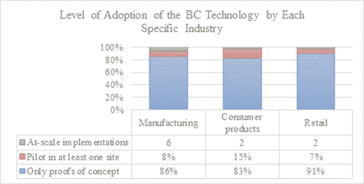 |

在对各国区块链技术生态系统进行审查后，发现英国、美国和法国处于领先地位（Pai 等，2018 年）。

| 图 2\. 区块链技术在国家生态系统中的应用 |
| --- |
| 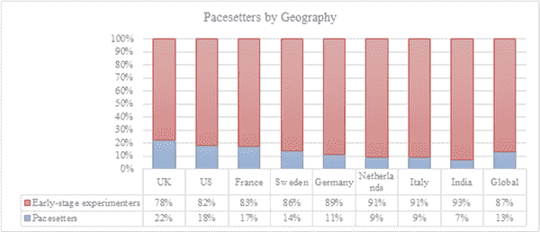 |

区块链技术的原理展示在表 1 中（Dobrovnik，Herold，Fürs，＆Kummer，2018 年；Iansiti＆Lakhani，2017 年）。

表 1\. 区块链技术原理

| 分布式数据库 | 区块链的每个参与方都可以访问整个数据库及其历史记录。没有任何一方控制数据/信息，每个参与方都可以直接验证其他交易方的记录，无需中介。 |
| --- | --- |
| 点对点传输 | 通信直接在对等方之间进行，而不是通过中心节点。每个节点都存储并将数据传输给其他节点。 |
| 透明度与伪匿名性 | 每个交易及其相关价值都可以被访问系统的每个参与方看到。每个节点或用户都有一个唯一的字母数字地址，用于识别它，由 30 多个字符组成。当在区块链地址之间进行交易时，用户可以选择保持匿名或向其他用户验证其身份。 |
| 记录的不可逆性 | 当交易输入数据库并更新帐户时，记录无法更改，因为每笔交易都与前面的交易相关联。用于确保数据库中的记录变为永久、按时间顺序排列且可被网络中所有其他用户使用的各种计算算法和方法被采用。 |
| 计算逻辑 | 分布式账本的数字结构意味着区块链交易可以与计算逻辑绑定，实质上可以被编程。换句话说，用户可以创建算法和规则，并自动在节点之间发起交易（例如智能合约）。 |

据世界经济论坛编制的一份调查报告显示，到 2027 年，全球约有 10%的国内生产总值（GDP）将存储在区块链中（世界经济论坛，2015 年）。这一估计表明，人们对区块链技术的兴趣将随着时间的推移而不断增长，增长速度更快。

区块链类型

区块链技术可以分为三大类别，即公共区块链、私有/许可区块链和联盟区块链。它们如下（Htet＆Htet，2019 年；Zheng，Shaoan Xie 等，2017 年）：

+   • 公共区块链：对公众开放，任何感兴趣的方都可以参与网络（例如用于加密货币交易）。所有在通用区块链上执行的交易都是完全透明的。每个方都可以检查交易详情。此外，用户可以参与任务的完成，例如批准交易（挖矿）或执行简单的用户交易。

+   • 私有/许可区块链：这与公共区块链不同。其特点如下：

    +   o 参与者需要达成一致才能加入网络。

    +   o 交易是私有的，只能由生态系统授权的参与者使用。

    +   o 它比公共区块链更加中心化。

私有区块链由有意与他人合作并交换信息或数据但又保护敏感商业数据机密性的机构或公司使用。这种区块链类型具有更加中心化的结构，区块链的实体或成员具有授权。

+   • 联合体区块链：这种类型的区块链具有私有区块链的所有优点，可以被视为其子类，而不是独立的区块链类型。节点分布在网络中，并充当对网络上处理的新数据或区块的共识系统。

表 2\. 区块链类型

| 特征 | 区块链类型 |
| --- | --- |
| 公共 | 私有/权限 | 联合体 |
| 协议机制 | 无需批准 | 需要批准 | 需要批准 |
| 阅读权限 | 开放 | 有限 | 有限 |
| 生产率 | 低 | 高 | 高 |
| 中心化 | 分布式 | 集中式 | 分布式集中式 |
| 数据交换 | 不可能 | 可变 | 可变 |

每种区块链类型的特征都不同。表 2 简要总结了特征（Baygin，Baygin，& Karakose，2019）。

区块链技术的显著特点

区块链技术的显著特点如下（Singh，BLOCKCHAIN TECHNOLOGY: A POTENTIAL GAME CHANGER FOR AUTOMOTIVE INDUSTRY，2020）：

+   • 实时性：记录操作的分析立即完成，消除了分歧并降低了风险。

+   • 可靠和可访问：由于多个参与者共享相同的区块链，因此每个用户的计算机中都记录了交易的副本。由于存在公共密码和私有密码两个密码，因此无法读取或更改数据。

+   • 透明性：所有参与者都可以看到交易。相同的副本存储在多个计算机系统中。对存储数据的控制提高了信任级别。

+   • 不可逆：可以进行交易，这可以促进记录的真实性并简化后台流程的不可逆性。

+   • 不可变：在不被识别的情况下，几乎不可能对区块链进行更改和欺诈。

+   • 数字化：几乎所有文档或实体都以代码形式表示，并可以在分类账条目中引用。换句话说，BC 技术具有广泛的应用范围。

区块链在网络安全中的基础知识

如图 3 所示，区块链提供了几个安全优势，这些优势对于抵抗网络攻击的应用至关重要（Fraga-Lamas & Fernández-Caramés，2019）。

| 图 3\. 区块链与网络安全相关的主要特点 |
| --- |
| 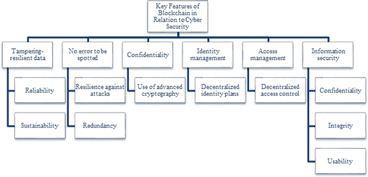 |

区块链中的信息以加密格式存储，这为系统提供了安全保障（Kalita，Boro 和 Bhattacharyya，2020）。每个区块都被添加到前面区块的复合值中，因此，它在密码学上与前面的区块链相连，从而保证了区块链的完整性。只要攻击者不掌握网络的大部分（这是极不可能的），区块链就可以防止双重支出和逆向交易。为了接受一个新提出的区块，区块链系统依赖于一种共识算法（Davi，Hatebur，Heisel 和 Wirtz，2019）。

针对 BC 技术应用的安全性和保密性目标，采取了以下安全措施（Lu 等，2019）：

+   • 保密性：第三方或与交易无关的人不应获得他们不拥有的对象的信息。

+   • 授权：第三方不应执行与其角色无关的操作。

+   • 责任制：在不受欢迎的第三方试图参与交易或进行恶意行为的情况下，系统应该跟踪错误行为。

区块链在应用方面的优缺点

区块链相对于现有技术的主要优势在于，它允许两个或更多方安全地通过互联网进行交易，而无需任何第三方的中介。排除第三方不仅有助于促进操作的安全性和生产力，而且降低了交易成本（Çetin Gerger, 2013; Dabbagh, Sookhak & Safa, 2019）。在区块链技术中，价值由记录在共享账本中的交易记录表示，提供安全和可审计的信息，可验证并包含时间戳（English, Auer, & Domingue, 2016）。即使今天 BC 技术在几个商业和其他领域中被积极使用，但其应用领域随着每一天的过去而日益扩大。例如，沃尔玛与 IBM 合作，利用 BC 技术确保食品安全和可追溯性。沃尔玛希望通过 BC 技术提高以下价值的期望（Galvin, 2017）：

+   • 提高消费者对信任和透明度的感知。

+   • 改善货架管理和防止因过期产品而造成的浪费。

+   • 消除危害消费者或可能导致灾难的假冒产品。

+   • 通过识别食品欺诈，促进食品安全，并避免损耗和浪费，创建更可持续的食品系统。

+   • 建立全球范围的供应链。

在探讨投资于 BC 技术的原因时，我们获得了如图 4 所示的结果。可以看出，投资于区块链的前三个主要因素是成本节约、可追溯性和透明度（Pai et al., 2018）。

| 图 4\. 投资区块链的原因 |
| --- |
| 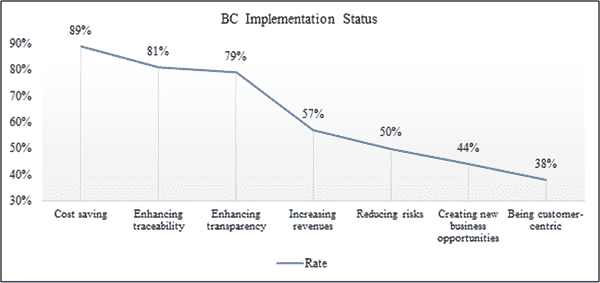 |

区块链应用在不同行业有所不同。区块链的优势和劣势可能因行业而异。区块链应用于的行业、应用领域、优势和劣势见表 3（Baygin、Baygin 和 Karakose，2019）。

表 3\. 不同行业区块链技术的优势和劣势

| 行业 | 应用领域 | 优势 | 劣势 |
| --- | --- | --- | --- |

| 治理 | • 投票 • 土地交易

• 税收法规

• 教育

• 公共服务

• 继承

• 慈善组织

• 劳工权利

• 认证 | • 一个透明、可靠和可验证的系统 • 自然灾害情况下的数据安全

• 资产保护、报告和会计、可访问性、成本节约和有效的抵押品管理 | • 基于互联网的系统的漏洞性 • 由于新增区块而导致系统减速

• 在所有情况下都无法保持隐私

• 自私的矿工使系统陷入困境 |

| 健康 | • 存储医疗记录 • 健康服务 | • 患者数据的安全性 • 与患者积极互动而不是由集中结构控制的系统

• 整体健康信息的存储和分析 | • 培训患者以便其与系统互动的义务 • 尽管未经授权的访问不被允许，但由于技术故障可能导致机密数据泄露的可能性。 |

| 金融 | • 互惠基金 • 加密交易所

• 股票

• 保险

• 信用记录

• 众筹 | • 一个快速、低成本和简单的系统 • 由于可控和不可篡改的区块而具有可靠性

• 在系统故障时可恢复的系统 | • 由于日常生活中使用的银行系统需要一定程度的中央集权，因此实施整个区块链结构存在困难 • 随着区块数量的增加，系统验证时间的延长以及系统的减速 |

| 技术 | • 云存储 • 数据备份

• 物联网管理

• 云计算

• 消息应用 | • 数据一致性和操作的快速验证 • 通过消除第三方代理来提高生产力和灵活性，并降低成本

• 利用区块链开源代码形成快速移动系统 | • 成本和容量限制 • 数据操纵

• 云服务器在停机期间容易受到网络攻击

• 数据窃取 |

| 其他 | • 供应链 • 版权保护

• 食品安全

• 拼车

• 互联网广告

• 预测系统

• 能源管理

• 人权

• 客户识别系统

• 质量控制

• 物流

• 废物管理 | • 改变传统结构以创建可靠、去中心化、可扩展和独特的结构 • 通过创建一个共同的数据库来确保完整性

• 作者版权的保护 | • 区块链的 51%被夺取，系统处于巨大风险之中 • 系统中的分叉问题

• 将现有系统基础设施转换为区块链结构的高成本

• 对法规的不确定性

• 智能合约的不明确性

• 不可互操作系统中的同步问题 |

区块链技术的优缺点因应用行业而异，但也存在相似之处。因此，针对每个行业特定的区块链应用，将提高成功的可能性。

汽车行业中的区块链技术

由于区块链提供更安全和可追溯的交易、更便捷的信息获取和透明度，它有潜力促进消费者甚至车辆之间的信任和合作。 区块链技术为汽车生态系统提供的优势包括促进参与者之间的合作，激活新型移动业务模型所需的技能。 除了激活单一数据源外，区块链还可以促进设备间交易、智能合约和实时处理和定位。 对于汽车行业而言，供应链的透明度意味着在金融交易、验证对汽车的访问、客户体验和忠诚度等方面的改善和运营生产力（IBM 商业价值研究所，2018 年）。 然而，数据安全对于汽车行业的竞争力提升和公司机密保护至关重要。 如果不能确保数据安全，公司承认系统应保持足够灵活，以应对不断变化的市场条件和客户需求，即使他们并不认为新技术会被广泛使用。 随着数据量的增长和计算技术的进步，预计这个话题在未来会变得更加重要。 今天使用的技术分析数据非常轻松。 为了消除与第三方相关的风险，公司将数据存储在具有支持性监管框架的国家的服务器上。 在这些国家，公司使用防火墙和没有互联网访问权限的系统。 此外，数据通常按照敏感性分类，并且指令指定了要存储的数据的安全级别和存储位置。 另一方面，虽然某些数据应由公司保护，但某些数据应与供应链伙伴共享。 必须通过更强大的互联系统确保整个供应链的数据安全。 其中最薄弱的实体的中断对整个网络构成安全威胁（Kern＆Wolff，2019 年）。

在汽车行业中，区块链技术成功应用于企业资源计划（ERP）软件中，该软件用于生产计划阶段（Winkler 等，2020; Gerger & Firuzan, 2010）。

| 图 5\. 区块链技术在汽车行业采用阶段 |
| --- |
| 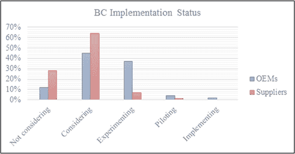 |

IBM 进行的行业特定研究尤其有益，因为它展示了汽车制造商和供应商对区块链技术的准备程度。这项研究的结果显示在图 5 中。

汽车行业中区块链技术的应用案例

使用区块链技术在汽车行业实现的服务可列举如下（Fraga-Lamas & Fernández-Caramés, 2019; Zhao 等，2018; Singh, 2020; Dorri, Steger, Kanhere & Jurdak, 2017; Rosado, Vasconcelos, & Correia, 2019）：

+   • 生产流程：生产工厂必须有效协调其供应商，以确保按时交付零件并优化库存水平。区块链技术用于存储所有数据，包括每辆车装配过程中的 WIP（在制品）数据，从生产过程中创建的质量控制记录到最终阶段。在引入区块链之前，汽车制造商必须等待几周或几个月，才能从进口商/分销商/卖家那里收到已交付车辆的付款。由于在供应链中控制不同步骤的多个方的影响，制造商必须经历缓慢的文件流程。通过基于区块链的系统，该流程缩短，通过确保在多个方之间创建信息透明度来验证银行文件并更快地处理它们。

+   • 供应链：汽车供应链是一个复杂的结构，由各种供应商、分销商、经销商、监管机构、保险公司等组成。基于区块链的系统可以在不同方之间提供透明度。通过在供应链中使用区块链技术，物流服务可以及时发展，错误订单的数量和成本降低，存货周转增加。由于区块链具有高度安全性，因此它非常适合在不同方之间保留记录。原材料供应商、汽车供应商、OEM 厂商、经销商、修理店、在线售后零售商等利益相关者之间的关系一般涉及多个方，这些方预计将就协议达成一致意见。每个方通过区块链进行交易，而不是直接参与验证和调和交易，以确保完全安全。例如，如果汽车零件在运输过程中被盗、更换或损坏，通过区块链概念可以确保制造商对这些零件进行全面准确的跟踪。在召回的情况下，召回程序也得以简化，因为区块链包含有关损坏零件历史的数据。可以准确检查零件是否有任何修改，或是否发生任何制造错误。

+   • 金融交易：凭借区块链技术，所有需要手动录入数据的交易都能降低操作成本，并且在其他方面也能促进审查。区块链将加速这些流程，并在汽车生命周期内保持其最新状态。汽车金融提供商通常对驾驶员的实际驾驶行为或车辆的维修和保养服务历史一无所知。基于区块链的系统使得可以与所有参与方访问的分类帐交换有关驾驶模式和维修保养服务历史的信息。通过区块链获得的有关车辆磨损情况的数据可以自动帮助金融提供商更准确地计算车辆的当前价值。自动融资包含一系列验证步骤，其中区块链可用于实现更高效率。

+   • 安全通信：BC 技术在车辆对车辆和物体对物体安全通信的情况下具有适用性。如今，自动驾驶车辆与其他车辆、交通灯和其他未经验证的设备建立通信。BC 技术确保通信仅在相关对象之间安全建立。因此，未经验证的人员被阻止黑客攻击这些操作。连接车辆包含基于软件的导航、车辆对车辆通信和多项服务，这些服务可能影响车辆和乘客的安全。区块链可以用于安全存储由系统发送和接收的数据。增强的加密级别防止计算机黑客访问或使用这些数据。随着自动驾驶车辆数量的增长，数百万设备正在不断地互相通信。因此，必须将共享数据存储在需要高级认证的安全数据库中。在汽车 OEM、零部件分销商、经销商、修理店、保险公司和其他各方之间共享的数据允许车辆内部的零部件和设备独立识别其自身的需求。例如，车辆的通信网络可以向驾驶员提供有关车辆维修需求的建议，并且可以与远程用户进行更新或与附近的供应商进行零部件交流。它可以协商价格并安排服务预约，并随后处理服务费用的支付。

+   • 车辆安全和数据安全：今天车辆与其他车辆或物体之间的更多通信使得车辆对网络攻击更为敏感，这可能导致致命后果。区块链是存储数据的理想地方，因为数据无法被篡改，这归功于区块链技术强大的加密基础，无法被逆向工程解析。例如，一个不道德的汽车经销商的常见做法是销售展示车辆，但不向为此车辆提供贷款的银行提供相关信息。这种做法使得经销商能够获得足够的营运资金来支付员工工资和供应品。如果银行及时发现这种不当行为，将立即对经销商采取行动。另一方面，由于车辆是合法销售的，银行无法直接对车辆提出索赔，同时向经销商提供的融资也已被使用。与数据透明度并存的是信息不对称，使得这种做法变得可能。区块链技术立即提供了透明度，并通过更多参与方提供更有价值的服务。它完全阻止了这类不道德的操作。

+   • 电动汽车：随着电动汽车变得越来越普遍，它们将需要一个新的机器对机器基础设施，涵盖电力供应商、充电站、汽车制造商、零部件供应商和汽车所有者。没有任何公司能够管理集成其合作伙伴的复杂业务。不应有任何单一实体持有可能会产生垄断的平台所有权。BC 提出的安全架构允许车辆与其他物联网参与者（例如智能家居和用户的智能设备）之间进行数据传输。其他参与者可以被视为覆盖节点。为了保护机密性，车辆所有者可以个性化定制将在这些实体之间共享哪些数据，并可以通过引入新服务来升级智能车辆及其功能。

+   • 保险：保险公司监控其客户的驾驶行为（制动、加速、变道等等）并评估这些数据。在最初，当车主选择这种灵活的保险模式时，保险公司通过云账户为车辆创建一对共享/私有的密码/密钥。因此，保险公司知道每个账户持有者的真实身份。这对密钥由车辆用于与保险公司进行所有交易。通过账户，车辆将所有数据存储在云中。保险公司利用这些数据为用户提供灵活的保险服务。由于保险公司通过云存储的信息了解车主的身份，因此在发生事故或其他需要时，公司与相关方交换信息。由于数据是通过区块链技术存储的，因此防止了恶意行为。车主可以随时终止与保险公司的合同或出售车辆。在这种情况下，保险公司将从云中删除相关车辆的账户。因此，车辆被阻止再次访问服务并将其数据存储到云中。

+   • 智能充电服务：随着电动车数量不断增长，需求量也在上升，对高效快速的车辆充电基础设施提出了更高的要求。智能车主希望将车辆连接到智能家居、移动设备等，可能需要多种复杂的服务。例如，通过获取用户出行习惯的信息（例如通过他/她的日历），定价可以更个性化地为每个用户定制。这些信息可以用于确保在用户需要时车辆充满电，并且通过避开最繁忙的充电时段选择最有效和最便宜的充电周期。

+   • 共享汽车服务：如今，共享汽车服务正在迅速增长。为了提供这种高度去中心化的服务，智能车辆、拼车服务提供商和服务用户需要安全地连接在一起。为了安全地更改诸如车辆位置、解锁车门信息和用户付款数据等数据，需要安全的通信渠道。由于区块链的去中心化结构，只有注册和授权的用户才能找到车辆位置、解锁车门并驾驶车辆。用户的真实身份和行车路线等信息被安全地存储。

+   • 智能合约：这些是为了在区块链用户之间创建协议而编写的计算机程序。通过智能合约，可以确保合同的条款自动履行，并使违反合同变得昂贵甚至被禁止。区块链创建了一个基于网络节点之间最小信任的共识，以创建智能合约。为了确保交易的有效性，智能合约的功能生效并履行其条款。

未来在汽车工业中，区块链用于数据收集和评估的其他一些领域将更加普遍，具体如下（Kaiser 等，2018）：

+   • 车辆排放数据

+   • 车辆数据（重量、乘客数量、制造年份、类型、品牌等）

+   • 环境数据（道路状况、室外温度、降雨等）

+   • 交通数据（识别车辆周围的实体，包括人类和车辆，街道密度等）

+   • 驾驶员数据（驾驶执照、音乐频道、精神状态、疲劳程度、驾驶绩效点、心率等）

+   • 行驶数据（GPS 位置、内部温度、起始日期、时间和目的地）

+   • 设备连接的结果的其他相关数据

汽车行业中区块链技术被最广泛使用的领域之一是供应链。区块链如何解决传统供应链中遇到的问题见表 4（Pai 等，2018）。

表 4\. 通过区块链技术解决汽车行业供应链问题

| 传统供应链中遇到的问题 | 区块链技术如何解决这些问题？ |
| --- | --- |
| 缺乏可追溯性 | 允许控制所有交易的权限 |
| 与多个利益相关者相关的风险 | 不可逆 - 防止未经授权的更改 |
| 缺乏敏感性 | 实时 |
| 大部分手工处理 | 数字化的更快交易 |
| 法律合规性 | 不易篡改的数据可以轻松验证 |
| 达成共识的负担 | 真实性的共享来源 |

区块链技术的应用不仅限于上述领域。与其他行业一样，区块链的应用领域在汽车行业也在扩大和多样化。

区块链技术实施策略

在决定是否将区块链技术应用于运营之前，首先进行良好结构化的情况分析是有用的。为此，分析公司的优势和劣势对于在区块链应用方面取得强大的开端是必要的。尽管在这种情况下使用了几种技术，但在本书章节中更偏爱战略管理中的有力工具之一，即 SWOT 分析。SWOT 这个名称来源于“优势（Strengths）”、“劣势（Weaknesses）”、“机会（Opportunities）”和“威胁（Threats）”这几个词的首字母缩写。这种分析是将通过外部分析确定的机会和威胁与内部分析的发现（即组织的优势和劣势）进行比较，这有助于改善（Hill & Westbrook, 1997; Özan, Polat, Gündüzalp, & Yaraş, 2015）。在区块链技术在汽车行业的应用阶段，评估优势和劣势至关重要。汽车行业的优势和劣势列在表 5 中（Fraga-Lamas & Fernández-Caramés, 2019）。

表 5. 促进区块链扩展到汽车行业的 SWOT 分析

| 积极的 | 消极的 |
| --- | --- |
| 优势 | 劣势 |

| 内部 | ▪ 运营生产力 ▪ 网络安全性

▪ 不需要不创造附加值的中间人

▪ 低成本下快速简单的转账

▪ 通过智能合约自动化交易，物联网的促进

▪ 减少人为错误

▪ 负责任，经过验证、有时间戳且不可逆的可审计数据

▪ 没有数据丢失，无论是改变还是扭曲

▪ 安全性和现代加密

▪ 不可否认性

▪ 透明度

▪ 全球可访问性

▪ 可靠的大数据分析平台

▪ 去中心化

▪ 追溯性，资产来源

▪ 动态和流动的价值交换

▪ 负责任，所有权和权利的证明 | ▪ 新兴的，处于早期发展阶段 ▪ 可伸缩性问题

▪ 高耗电量

▪ 性能低

▪ 缺乏互操作性

▪ 保密性问题（在某些场景中）

▪ 犯罪活动，恶意攻击

▪ 依赖外部资源的输入

▪ 用户体验差，客户不熟悉

▪ 如果用户的凭证丢失（例如钱包），则无法联系中介

▪ 在特定使用情况下暴露于加密货币的波动性

▪ 限制智能合约代码编程模型

▪ 钱包和密钥管理

▪ 高素质人力资源（稀缺且昂贵）

▪ 过于复杂（掌握区块链概念困难）

▪ 对新技术供应商缺乏信任

▪ 核心业务场景或流程未必适合应用区块链

▪ 企业治理差

| 机遇 | 威胁 |
| --- | --- |

| 外部 | ▪ 工业竞争力（例如较低的交易成本，增强的网络安全性，全面的物联网自动化） ▪ 市场多样化（例如支持共享汽车）

▪ 启用新的商业模式

▪ 平衡各方之间的信息对称性

▪ 减少欺诈

▪ 降低系统风险

▪ 网络效应

▪ 大量异构数据由不同的参与者推入区块链进行数据分析（大数据应用）

▪ 开源代码

▪ 促进跨境贸易

▪ 减少验证程序数量

▪ 数字孪生技术的推动者

▪ 循环经济推动者 | ▪ 不安全或不可靠的感知 ▪ 技术漏洞

▪ 不同的区块链，账本竞争

▪ 重要利益相关者对其采用的低级别

▪ 机构层面对采用的障碍

▪ 中长期投资

▪ 不适合外部客户，缺乏采用准备度 |

对于汽车行业中区块链应用的成功，进行 SWOT 分析是第一步。

汽车行业中的区块链：优势与劣势

形塑未来的数字技术已经为汽车及其制造商提供了各种连接和软件。在 IT 数据安全的背景下，这种情况已经成为生产和交付价值链中所有参与方的焦虑源。然而，区块链技术的出现在缓解这种焦虑方面发挥了关键作用。

BC 技术代表了一种突破，它消除了在记录和传播数据时需要可靠第三方的需求。即使在全球经济的不同领域有几个区块链应用的案例，面向汽车行业的区块链应用大多仍停留在实验和环境层面。这就是汽车行业面临的挑战是构思一个项目，将这种破坏性技术的革命性好处传播到整个汽车生态系统的原因（Carnomic, 2020）。为此，汽车行业应该了解在应用 BC 技术期间可能面临的现有情况，并寻求解决这些具有挑战性的情况的方法。Fraga-Lamas 和 Fernández-Caramés (2017) 已经总结了针对该行业的区块链应用可能固有挑战。这些列在表 6 中。

表 6\. BC 应用在汽车行业面临的挑战

| 利益相关者 | 可能面临的挑战 |
| --- | --- |

| Car owners and lenders / buyers and sellers of pre-owned cars |   • 缺乏关于汽车历史的透明度   • 意外的车辆维护和修理成本

-   维护和修理工作结果的信任缺失

-   缺乏知情购买选项

-   缺乏汽车保险选项

-   自动驾驶和物联网连接车辆的信任缺失

-   消费者高水平交易体验，同时降低其成本 |

| Fleet management companies / Car leasing or sharing (car-sharing, ride-sharing or ride-hailing) companies |   • 缺乏关于汽车历史的透明度   • 意外的车辆维护和修理成本

-   维护和修理工作结果的信任缺失

-   与业务合作伙伴的互操作性缺失

-   高运营成本，低利润率

-   车辆共享、乘车共享和顺风车经济中的高成本

-   自动驾驶和物联网连接车辆的信任缺失 |

| Car-sharing, ride-sharing or ride-hailing passengers |   • 更实惠地驾驶/乘车   • 维护更好的汽车

-   自动驾驶和物联网连接车辆的信任缺失

-   提供移动性的共同平台的缺失

-   缺乏即时支付 |

| Car entrepreneurs |   • 高车辆租赁成本   • 降低的车辆共享、乘车共享或顺风车合作费用

-   创业困难，不公平竞争

-   自动驾驶和物联网连接车辆的信任缺失

-   信息共享的缺失 |

| Car dealers and retailers |   • 更新的车辆所有权记录   • 更新的维修和维护记录

-   更新的购买记录

-   自动驾驶和物联网连接车辆的信任缺失

-   信息共享的缺失 |

| OEM / Car manufacturers and suppliers |   • 高保修索赔成本   • 强迫经销商遵守推荐的维护和修理价格

-   因汽车经销商违反汽车制造商推荐的维护费用而导致客户投诉

• 对授权经销商提供的车辆维护服务缺乏控制

• 低水平的客户忠诚度

• 自动驾驶和物联网连接车辆中的网络攻击和系统故障风险

• 物流控制

• 缺乏信息共享 |

| 保险公司 |   • 刚性且非定制的保单定价   • 全球范围内 5-10% 的所有索赔都是欺诈性的

• 昂贵且低效的索赔管理

• 错误的客户政策定价

• 缺乏对碰撞修复质量和定价的监督 |

| 独立维修店 |   • 未充分利用的产能   • 客户保留

• 利润率低

• 缺乏品牌信心 |

| 售后市场（零部件生产商，分销商和零售商，汽车修理厂） |   • 低效的库存管理   • 假冒零部件市场

• 保修监控和执行的透明度不足

• 利润率低

• 缺乏品牌信心 |

| 政府和公共组织 |   • 更新的州级记录（例如车辆维护记录，所有权，车辆税，交通罚款历史） • 对自动驾驶和物联网连接的车辆缺乏信任

• 特别是在驾驶员责任或数据保护方面遵守现有法规

• 增强的互连性以及通过数据云提供的开放源交通数据和基础设施数据，以及渴望转向数字无线电和普遍网络覆盖

• 在数据收集中更广泛地使用匿名化和化名化，并处理全面信息，并向车主和驾驶员提供收集了哪些数据以及由谁收集的信息。

• 实时路况和交通拥堵通知

• 用于事故研究和缓解措施的可靠数据 |

| 金融机构 |   • 更新的车辆所有权记录和汽车保险，维护和留置记录   • 缺乏所有交易的单一参考点 |
| --- | --- |
| 电信和技术公司、内容和服务提供商 |   • 确保稳定安全的车辆对车辆（V2V）和车辆对基础设施（V2I）通信，以确保高效安全的车辆协调和合作。   • 车辆之间及车辆与基础设施之间缺乏可靠连接 |

| 报废/回收和环保团体 |   • 控制温室气体排放   • 部件完全可追溯性

• 长期可持续性 |

| 学术界 |   • 确保车辆安全、安全和自主性   • 更高效的驾驶，优化人机界面（HMI）的开发

• 处理高度和全自动化车辆在混合交通条件下的交通管理 |

尽管存在上述挑战，但与传统方法相比，BC 技术伴随着几个优势。 这些列在表 7 中（Dorri、Steger、Kanhere 和 Jurdak，2017）。

表 7\. BC 技术 vs 传统方法 - BC 优势总结

| 应用领域 | 传统方法 | 由 BC 带来的优势 |
| --- | --- | --- |

| 无线远程软件更新（WRSU） |   • 集中式 – 不可扩展   • 部分参与 – 未解决整个价值链

• 缺乏保密性 – 车辆与 OEM 直接链接可能会泄露驾驶员的保密信息（例如驾驶行为或位置）。

• 只有 OEM 能够验证通信或更新历史 | • 启用分散式数据交换和安全可扩展性 • 端到端：涉及 OEM、车辆、服务中心、装配线等。

• 保护用户的保密性（也用于身份验证）

• 软件的更新历史和真实性可由所有参与方验证。 |

| 保险 |   • 现有系统普遍存在安全隐患，从而危及整个车辆。   • 用户无法控制交换的数据。

• 为了能够使用服务，隐私敏感数据应与保险公司不断交换。 | • 安全、去中心化且保护机密的数据交换 • 用户能够控制修改后的数据。

• 隐私敏感数据仅在请求时共享，而不是持续进行数据交换（例如发生事故）。

| 电动汽车 |   • 中心化支付和记账   • 用户的位置和行为可以被追踪（例如在某一天使用指定的充电器）。 | • 私密和去中心化的安全、支付和记账 • 用户信息如位置数据保持保密。 |
| --- | --- | --- |

| 共享汽车服务 |   • 中心化支付和记账   • 用户可以通过其身份被追踪。

• 中心化授权 | • 私密和去中心化的安全、支付和记账 • 用户使用可修改的凭据

• 去中心化授权 |

这些优势不仅限于所述领域。随着区块链知识的扩展，其应用领域和优势将会成倍增长。

最佳实践

区块链技术提供了强有力的使用示例，旨在改变汽车行业的几个方面。 2018 年 5 月，Mobility Open Blockchain Initiative（MOBI）活动是区块链革命在汽车行业加速发展的最明显体现。 在这个场合，像宝马、通用汽车、福特、博世和雷诺集团等大型汽车制造商以及 IBM、安永和 ConsenSys 等领先的区块链和技术企业汇聚在一起。 2019 年 2 月，BMW 集团 IT 中心在慕尼黑举办了为期两天的 MOBI 成员大会。 活动的重点被确定为促进和制定促进区块链和分布式账本技术在移动行业实施的共同标准。 MOBI 的创始人旨在利用区块链技术塑造一个更加环保、安全且提高城市生活质量的未来移动性。 此外，该团体还在努力研究区块链技术在使移动性更加安全、廉价和可访问方面的应用领域。

MOBI 致力于研究区块链如何在新的数字移动生态系统中满足客户需求。 MOBI 的一些首个项目专注于以下主题背景下的安全移动交易：

+   • 基于使用情况的移动定价和支付

+   • 车辆的身份、历史和使用情况

MOBI 的合作伙伴旨在仅开发明确定义的通用标准和一个开放且独立的平台，该平台将使区块链技术在该领域得以应用。 主要制造商目前正在推进各种区块链倡议。 其中一些简要概述如下（IBM 商业价值研究所，2018 年；辛格，2020 年）：

+   • **福特汽车**：该公司启动了一项试点研究，旨在确保锂电池生产中使用的钴的道德采购。因此，通过区块链技术，福特公司希望确保在钴矿业中不使用童工（童工矿工），通过跟踪钴生产和供应的供应链。

+   • **大众汽车**：这家汽车制造商正在生产一种基于区块链的跟踪系统，旨在防止汽车行业普遍存在的里程表欺诈行为。因此，他们的目标是阻止不公平的汽车卖家进行里程表欺诈，并保护潜在的购买者。

+   • **现代汽车**：他们宣布与 IBM 达成新的合作伙伴关系，旨在开发区块链技术和云端人工智能的应用。在这里，IBM 正致力于通过开源的 Hyper Ledger Fabric 创建供应链金融生态系统。该项目旨在自动化手工流程，降低成本和交付时间，从而提升客户体验。

+   • **Innogy SE**（德国能源巨头 RWE 的成员）：不久前，Innogy SE 通过其企业 Share & Charge 宣布，他们已经在全国范围内启动了通过区块链技术操作的电动汽车充电站的安装。这一举措旨在帮助电动汽车车主在由 Share & Charge 设立的充电站充电，Share & Charge 是 Innogy Innovation Hub 的创业公司。该应用是第一个依赖区块链技术的电动汽车社区平台。

+   • **戴姆勒股份公司**：戴姆勒股份公司推出了一种新的基于区块链的加密货币，名为 MobiCoin，投放市场。这种货币是公司倡导的一部分，旨在奖励司机的环保驾驶习惯。成功获取 MobiCoins 的司机将有机会将其用于获得诸如梅赛德斯杯决赛或柏林时装周等活动的 VIP 门票。

**统计评估和大数据分析**

大数据指的是数据集群，其特点是**数据量大**、**速度快**和**多样性**（Govindan, Cheng, Mishra, & Shukla, 2018）。在第四次工业革命之前，为了对人口进行统计分析，需要根据感兴趣的区域的特征从人口中选取样本。然而，随着数据访问变得容易，考虑到必要的技术已经可用，可以直接对人口进行分析。随着每一天的过去，这些发展使得统计在当今超智能社会中的重要性更加提升。为了从如此庞大的数据中选择必要的数据并对其进行分析，大数据的概念成为了前沿。大数据的概念首次出现于 1997 年（Cox and Ellsworth, 1997），在一篇名为“Application Controlled Demand Paging for Out-of-Core Visualization”的文章中提到了这一概念，该文章解决了存储设备（计算机内存、外部和内部硬盘等）由于数据集的大尺寸而不足的问题（Cox & Ellsworth, 1997; Gerger, 2020）。大数据是一个新概念，它定义了任何通过传统数据库技术似乎不可能处理的异构数据（Gahi, Guennoun, & Mouftah, 2016）。大数据是通过几种来源产生的，其中一些最著名的是传感器、智能设备（手表和手环）、医疗设备、平板电脑、手机、网站使用记录、社交媒体、模拟等（Schneider, 2012）。

由于数据收集和数据收集能力迅速增长，创建网络逐渐变得与所有领域和行业更相关（吴，朱，吴，＆丁，2014）。这是大数据分析的领域，它补充了大数据，也被称为业务智能和分析。通过分析关键业务数据，企业可以更好地了解他们的业务和市场，并及时做出业务决策（陈，蒋，＆斯托雷，2012）。

OEM 能够通过“大数据”技术进行统计分析，以优化包括运输时间、货车载荷和路线在内的运输网络。一级供应商舍弗勒认为数据分析是未来的重要机遇。通过与 IBM 建立战略合作伙伴关系，该公司已经通过使用专为大数据分析设计的自学习算法在生产上提高了效率。在另一个例子中，总装车间的工时被求和并分析，以找出流程优化的概率，如线平衡或原材料重定位（Kern＆Wolff，2019）。

结论

随着技术的快速发展，与汽车行业相关，交通拥堵也显著增加，这种情况导致连接设备生成的数据量急剧增加。有意义地对从智能系统获得的这些数据进行统计分析变得非常重要。在这种情况下，区块链技术可以帮助实现以下目标（加尔文，2017）：

+   • 节省时间，因为它使得即时执行交易成为可能。

+   • 消除一般费用，因为它排除了中间商。

+   • 减少风险，因为它防止了网络犯罪和欺诈。

+   • 提高信任度，因为共享过程被记录。

为促进数字化转型和区块链技术在汽车行业的传播，相关国家机构应注意以下建议（Kern & Wolff，2019 年）：

+   -   标准化：应资助参与标准化工作的机构。应支持标准化机构促进国际合作，并开发并提供免费数据转换工具供使用。

+   -   数据安全：应发展合作，加强数据安全，鼓励采用旨在打击国际网络犯罪的法律。

+   -   员工资格：应加强持续教育工作，并提高该领域学校和教育的质量。

尽管汽车行业在区块链应用方面仍处于初级阶段，但观察到在几个领域取得了快速进展。毫无疑问，随着时间的推移，汽车行业的数字化，以及区块链技术在其他应用领域的数字化，将大幅扩展。因此，重要的是汽车供应链中的所有股东，特别是该行业的大型参与者，投资于区块链技术，并为所需技能培训他们的员工。这样，在一个已经竞争激烈的行业中，企业将在促进客户满意度方面获得优势。

参考资料

Allison, I. (2017). Maersk 和 Ibm 希望到年底全球供应链区块链上有 1000 万个运输集装箱。国际商业时报。

Baygin, N., Baygin, M., & Karakose, M. (2019). 区块链技术：应用、优势和挑战。会议：2019 年第一届国际信息学与软件工程会议（UBMYK）。10.1109/UBMYK48245.2019.8965565

Blanco-Novoa, Ó., Fernández-Caramés, T. M., Fraga-Lamas, P., & Vilar-Montesinos, M. A. (2018). 工业 4.0 造船厂中商用工业增强现实系统的实际评估. IEEE Access: Practical Innovations, Open Solutions , 6, 8201–8218\. doi:10.1109/ACCESS.2018.2802699

Capgemini Research Institute. (2019). 区块链是否是新时代供应链透明度和信任的关键？组织如何从区块链炒作走向现实 . Capgemini Research Institute.

Carnomic. (2020). Carnomic 基于区块链的汽车解决方案: 白皮书版本 1.2. 检索于 2020 年 5 月 2 日, 来自 https://www.carnomic.io/wp/Carnomic-White-Paper-en.pdf

Çetin Gerger, G. (2013). 土耳其电子税务的法律框架 . 在 Mahmood, Z. (Ed.) 的 Developing E-Government Projects: Framworks and Methodologies (pp. 165–180) 中. IGI Global. doi:10.4018/978-1-4666-4245-4.ch008

Çetin Gerger, G. (2019). 在物联网和 AmI 环境中税务服务及税务服务提供商的角色变化. 在 Guide to Ambient Intelligence in the IoT Environment (pp. 203-216) 中. 瑞士，Cham: Springer Nature Switzerland. doi:10.1007/978-3-030-04173-1_9

Chen, H., Chiang, R. H., & Storey, V. C. (2012). 商业智能和分析: 从大数据到巨大影响. 管理信息系统季刊 , 36(4), 165–1188\. doi:10.2307/41703503

Christidis, K., & Devetsikiotis, M. (2018). 区块链和智能合约用于物联网. IEEE Access: Practical Innovations, Open Solutions , 2016(4), 2292–2303.

Clarke, C. (2005). 汽车生产系统和从福特到梅赛德斯-奔驰的标准化案例 . Physica-Verlag. doi:10.1007/b138988

Colonna, S. (2018). 汽车市场中的区块链机遇 - 备件案例研究 . 图林奥工程管理工程学位课程.

CoxM.EllsworthD. (1997). 应用控制的需求分页用于核外可视化。在第 8 届可视化会议论文集中(pp. 235-244). Phoenix: IEEE.

Dabbagh, M., Sookhak, M., & Safa, N. S. (2019). 区块链的演变：一项文献计量研究。IEEE Access: 实用创新，开放解决方案 , 7(8628982), 19212–19221\. doi:10.1109/ACCESS.2019.2895646

DaviL.HateburD.HeiselM.WirtzR. (2019). 使用区块链技术在自动驾驶汽车中结合安全性和安全性。国际计算机安全、可靠性和安全性会议。SAFECOMP 2019, 11699, 223-234\. doi:10.1007/978-3-030-26250-1_18

Dedeoğlu, D. (2019). 从 A 到 Z 的区块链. İnkılap Kitapevi.

Dobrovnik, M., Herold, D. M., Fürs, E., & Kummer, S. (2018). 物流中的区块链：采用和开始的地方。物流 , 2(18), 1–14\. doi:10.3390/logistics2030018

Dorri, A., Steger, M., Kanhere, S. S., & Jurdak, R. (2017). 区块链：汽车安全和隐私的分布式解决方案。IEEE 通信杂志, 55(12), 1–7\. doi:10.1109/MCOM.2017.1700879

Emen, E. (2018). 区块链技术. 工业和技术部工业和生产效率总局发展关键效率杂志, 30(353), 46-48\. 检索自 https://anahtar.sanayi.gov.tr/Files/Pdfs/anahta

English, M., Auer, S., & Domingue, J. (2016). 区块链技术与语义 Web：共生发展框架。波恩大学学生计算机科学会议, (pp. 47-61). 检索自 http://cscubs.cs.uni-bonn.de/2016/

Fraga-Lamas, P., & Fernández-Caramés, T. M. (2019). 一篇关于区块链技术的评论，用于先进和具有网络弹性的汽车工业。IEEE.

Fraga-Lamas, P., Fernández-Caramés, T. M., Blanco-Novoa, Ó., & Vilar-Montesinos, M. A. (2018). 一篇关于工业增强现实系统在工业 4.0 造船厂中应用的评论。IEEE Access: 实用创新，开放解决方案，6，3358–13375。doi:10.1109/ACCESS.2018.2808326

Fraga-Lamas, P., Fernández-Caramés, T. M., & Castedo, L. (2017). 朝着智能列车互联网：关于工业物联网连接铁路的评论。传感器（巴塞尔），17(6)，1–44。doi:10.3390/s17061457

GahiY.GuennounM.MouftahH. (2016). 大数据分析：安全性和隐私挑战。在计算机与通信研讨会（ISCC）（第 1-6 页）中。梅西纳：IEEE。10.1109/ISCC.2016.7543859

Galvin, D. (2017). IBM 和沃尔玛：食品安全的区块链。IBM 公司。

Gerger, A. (2018). 使用小部分改善法提高生产装配效率：案例研究。在社会科学中的关键辩论（第 54-70 页）中。FrontPage Publications Limited。

Gerger, A. (2019a). 在工业 4.0 生产过程中优化过程变异性的 Heijunka 方法。伊兹密尔民主大学社会科学期刊，2(1)，1–17。

Gerger, A. (2019b). 社会 5.0 和马尼萨。在《马尼萨经济与愿景》中（第 239–261 页）。Detay Yayıncılık。

Gerger, A. (2020). 关于新技术在连接政府实施中的成功因素和最佳实践。在 Z. Mahmood（Ed。）的《Web 2.0 和云技术用于实施连接政府》中（第 xx-xx 页）。IGI Global。

Gerger, A.，& Firuzan, A. R. (2010). 六西格玛项目失败的原因。亚萨尔大学杂志，20(5)，3383–3393。

Gerger, A.，& Firuzan, A. R. (2020). 基于田口方法的汽车行业案例研究：使用六西格玛方法减少不合格品。应用统计学杂志，1–17。doi:10.1080/02664763.2020.1837086

Govindan, K., Cheng, T. C., Mishra, N., & Shukla, N. (2018). 大数据分析及其在物流和供应链管理中的应用. Transportation Research Part E, Logistics and Transportation Review , 114(May), 343–349\. doi:10.1016/j.tre.2018.03.011

Güneşli, İ., Yıldızbaşı, A., & Eras, E. (2020). 汽车供应链中的区块链技术应用评估. Journal of Industrial Engineering , 31(1), 48–56.

Heutger, M., & Kueckelhaus, M. (2018). 物流中的区块链. DHL.

Hill, T., & Westbrook, R. (1997). SWOT 分析：是时候进行产品召回了. Long Range Planning , 30(1), 46–52\. doi:10.1016/S0024-6301(96)00095-7

Hoyle, D. (2000). 汽车质量体系手册 . Elsevier Butterworth-Heinemann.

Hoyle, D. (2005). ISO/TS 16949:2002 质量体系手册 (第 2 版). 牛津: Elsevier Butterworth-Heinemann.

Htet, C. C., & Htet, M. (2019). 基于区块链技术的安全二手车交易系统. 2019 年第 21 届信息集成与基于 Web 的应用与服务国际会议 (iiWAS’2019).

Huckle, S., Bhattacharya, R., White, M., & Beloff, N. (2016). 物联网、区块链和共享经济应用. Procedia Computer Science , 98, 461–466\. doi:10.1016/j.procs.2016.09.074

Iansiti, M., & Lakhani, K. R. (2017, January-February). 区块链的真相. 哈佛商业评论. Retrieved from https://hbr.org/2017/01/the-truth-about-blockchain

IBM Institute for Business Value. (2018). 敢为先：汽车先锋如何涉足区块链. IBM Corporation.

Kaiser, C., Steger, M., Dorri, A., Festl, A., Stocker, A., Fellmann, M., & Kanhere, S. (2018). 车辆数据共享的隐私保护方法探讨——区块链技术的案例？国际汽车微系统高级论坛, 111-122.

KalitaK. P.BoroD.BhattacharyyaD. K. (2020). 使用大数据应用实现最小共享区块链。2020 年第三届 ISEA 安全与隐私会议（ISEA-ISAP）。10.1109/ISEA-ISAP49340.2020.235000

Kern, J., & Wolff, P. (2019). 汽车供应链的数字化转型-来自德国和中国的实证分析：OECD TIP 数字和开放创新项目的案例研究贡献。部门案例研究，1-23。

KosbaA.MillerA.ShiE.WenZ.PapamanC. (2016). Hawk：区块链模型与隐私保护智能合约。2016 年 IEEE 安全与隐私研讨会，839–858。10.1109/SP.2016.55

Kshetri, N. (2017). 区块链能增强物联网吗？IT 专业人士，19（4），68–72。doi:10.1109/MITP.2017.3051335

LeeZ. E.ChuaR. L.KeohL. S.OhbaY. (2019). 用于物联网-区块链应用的边缘大数据处理性能评估。2019 年 IEEE 全球通信大会（GLOBECOM）。10.1109/GLOBECOM38437.2019.9013329

Liu, J., Kadıyala, A., & Cannistraci, P. (2018). 使用分布式账本技术增强供应链的透明度和安全性：由区块链和物联网驱动的价值驱动型供应链。Deloitte Development LLC。

LuD.Moreno-SanchezP.ZeryihunA.BajpayiS.YinS.FeldmanK.KateA. (2019). 使用区块链减少汽车伪造：好处与挑战。IEEE 分布式应用和基础设施国际会议（DAPPCON），39-48。10.1109/DAPPCON.2019.00015

Mathis, T. (2016). 区块链：区块链背后的技术。比特币和其他加密货币的技术，xx，xx。

Mohanta, B. K., Panda, S. S., & Jena, D. (2018). 智能合约概述及在区块链技术中的用例。2018 年第 9 届计算、通信和网络技术国际会议（ICCCNT），1-4。

Nakamato, S. (2008). 比特币：点对点电子现金系统。比特币。

Nooruddin, S. (2019 年)。《区块链全方位》。Vortex Institute of Ethical Hacking。

Özan, M. B., Polat, H., Gündüzalp, S., & Yaraş, Z. (2015 年)。教育机构 SWOT 分析。《土耳其教育研究期刊》，2(1)，1–28。

Pai, S., Sevilla, M., Buvat, J., Schneider-Maul, R., Lise, O., Calvayrac, A.，. . . Puttur, R. (2018 年)。区块链是否是实现供应链透明度和信任新时代的关键？Capgemini。

Pepper, R. (2012 年 6 月 1 日)。《在泽塔字节世界中的移动网络：来自思科视觉网络指数的趋势》。检索自 gsma.com：https://www.gsma.com/spectrum/wp-content/uploads/2012/06/Dr_Robert-_Pepper_Cisco_Public_Policy-Forum_Data_Demand.pdf

Reinsel, D., Gantz, J., & Rydning, J. (2018 年 11 月 1 日)。《从边缘到核心的世界数字化》。检索自希捷公司：https://www.seagate.com/files/www-content/our-story/trends/files/idc-seagate-dataage-whitepaper.pdf

Rosado, T., Vasconcelos, A., & Correia, M. (2019 年)。汽车注册的区块链用例。《区块链技术要义》（第 205-234 页）。doi:10.1201/9780429674457-10

Saberi, S., Kouhizadeh, M., Sarkis, J., & Shen, L. (2018 年)。区块链技术及其与可持续供应链管理的关系。《生产研究国际期刊》，57(7)，2117–2135。doi:10.1080/00207543.2018.1533261

Schneider, R. D. (2012 年)。《Hadoop 入门》。密西沙加：约翰·威利出版公司。

Singh, K. (2020 年)。区块链技术：汽车行业的潜在改变者。《管理与社会科学高级研究国际期刊》，9(3)，49–55。

Sözek, K. (2017 年)。《区块链：理解区块链技术、比特币创造和货币未来的终极逐步指南》。CreateSpace 独立出版平台。

Stocker, A., & Kaiser, C. (2016 年)。量化汽车：潜力、商业模式和数字生态系统。《E&i 电气技术和信息技术》，133(7)，334–340。

斯托克，A.，凯撒，C.，& 费尔曼，M. (2017). 量化车辆 - 车辆生命周期数据的新服务。商业与信息系统工程杂志，59(2)，1–6。

蒂莫西，L. (2017). 交通运输区块链：未来的起点。克利夫兰：TMWSystems，Inc。

安德伍德，S. (2016). 区块链超越比特币。ACM 通讯，59(1)，5–17。

白，G. R. (2017). 区块链在商业和管理中的未来应用：德尔菲研究。战略变革，2017(26)，439–451。doi:10.1002/jsc.2144

威廉姆斯，S. P. (2019). 区块链：下一个一切。斯克里布纳。

温克勒，M.，施奈德-莫尔，R.，普图尔，R. K.，梅尔，R.，布瓦特，J.，& 纳特，S. (2020). 汽车组织如何最大限度地发挥智能工厂的潜力。Capgemini 研究所。

世界经济论坛。 (2015). 深度转变技术转折点及其对社会的影响。调查报告。世界经济论坛。2020 年 5 月 25 日检索自 http://www3.weforum.org/docs/WEF_GAC15_Technological_Tipping_Points_report_2015.pdf

吴，X.，朱，X.，吴，G.-Q.，& 丁，W. (2014). 大数据的数据挖掘。IEEE 知识与数据工程交易，26(1)，97–107。doi:10.1109/TKDE.2013.109

赵，D.，贾，G.，任，H.，陈，C.，于，R.，戈，P.，及刘，S. (2018). 区块链在汽车工业中的应用研究。在 IOP 会议系列：材料科学与工程中。IOP 出版社。doi:10.1088/1757-899X/452/3/032076

郑，Z.，谢，S. S.，戴，H.，陈，X.，& 王，H. (2017). 区块链技术概述：架构，共识和未来趋势。IEEE 第六届国际大数据大会 (Big Dats Congress’17)。

ADDITIONAL READING

艾莉森，I. (2017). 马士基和 Ibm 想要全球供应区块链上的 1000 万运输集装箱。国际商业时报。

Baygin, N., Baygin, M., & Karakose, M. (2019). 区块链技术：应用、优势与挑战。 会议：2019 年第一届国际信息学与软件工程会议（UBMYK）。 安卡拉。 10.1109/UBMYK48245.2019.8965565

Blanco-Novoa, Ó., Fernández-Caramés, T. M., Fraga-Lamas, P., & Vilar-Montesinos, M. A. (2018). 在工业 4.0 造船厂的商业工业增强现实系统的实际评估。 IEEE Access: 实用创新，开放解决方案，6，8201–8218。 doi:10.1109/ACCESS.2018.2802699

Capgemini Research Institute. (2019). 区块链是否是新时代供应链透明度和信任的关键？ 组织如何从区块链炒作转向现实。 卡普吉尼研究所。

Carnomic. (2020). Carnomic 基于区块链的汽车解决方案：白皮书版本 1.2。 于 2020 年 5 月 2 日检索自 https://www.carnomic.io/wp/Carnomic-White-Paper-en.pdf

Çetin Gerger, G. (2013). 土耳其电子税务法律框架。 在 Mahmood, Z.（Ed。），开发电子政府项目：框架和方法（第 165–180 页）。 IGI Global。 doi:10.4018/978-1-4666-4245-4.ch008

Çetin Gerger, G. (2019). 税务服务与税务服务提供商在物联网和环境中的角色变化。 在物联网环境中的环境智能指南中（第 203-216 页）。 瑞士洛桑：斯普林格自然瑞士。 doi:10.1007/978-3-030-04173-1_9

Chen, H., Chiang, R. H., & Storey, V. C. (2012). 商业智能与分析：从大数据到重大影响。 管理信息系统季刊，36（4），165–1188。 doi:10.2307/41703503

Christidis, K., & Devetsikiotis, M. (2018). 用于物联网的区块链和智能合约。 IEEE Access: 实用创新，开放解决方案，2016（4），2292–2303。

Clarke, C. (2005). 汽车生产系统与标准化：从福特到奔驰案例。 Physica-Verlag。 doi:10.1007/b138988

Colonna, S. (2018). 汽车市场中的区块链机会 - 备件案例研究. 意大利都灵理工大学管理工程学位课程.

CoxM.EllsworthD. (1997). 应用控制的需求分页用于离核可视化. 第 8 届可视化会议论文集’97 (pp. 235-244). Phoenix: IEEE.

Dabbagh, M., Sookhak, M., & Safa, N. S. (2019). 区块链的演变：一项文献计量研究. IEEE Access: 实用创新，开放解决方案, 7(8628982), 19212–19221\. doi:10.1109/ACCESS.2019.2895646

DaviL.HateburD.HeiselM.WirtzR. (2019). 利用区块链技术在自动驾驶汽车中结合安全性和安全性. 计算机安全、可靠性和安全国际会议. SAFECOMP 2019\. 11699, pp. 223-234\. Springer, Cham. doi:10.1007/978-3-030-26250-1_18

Dobrovnik, M., Herold, D. M., Fürs, E., & Kummer, S. (2018). 物流中的区块链：采用和开始的路径. 物流, 2(18), 1–14\. doi:10.3390/logistics2030018

Dorri, A., Steger, M., Kanhere, S. S., & Jurdak, R. (2017). 区块链：汽车安全和隐私的分布式解决方案. IEEE 通讯杂志, 55(12), 1–7\. doi:10.1109/MCOM.2017.1700879

Emen, E. (2018). 区块链技术. 工业和技术部工业与生产效率总局《关键效率》杂志, 30(353), 46-48\. Retrieved from https://anahtar.sanayi.gov.tr/Files/Pdfs/anahta

English, M., Auer, S., & Domingue, J. (2016). 区块链技术与语义网：共生发展框架. 波恩大学计算机科学学生会议, (pp. 47-61). 波恩. Retrieved from http://cscubs.cs.uni-bonn.de/2016/

Fraga-Lamas, P., & Fernández-Caramés, T. M. (2019). 用于先进和抗网络攻击汽车工业的区块链技术综述. IEEE, 2169-3536.

Fraga-Lamas, P., Fernández-Caramés, T. M., Blanco-Novoa, Ó., & Vilar-Montesinos, M. A. (2018). 用于工业 4.0 船厂的增强现实系统综述。 IEEE Access: 实用创新，开放解决方案 , 6, 3358–13375\. doi:10.1109/ACCESS.2018.2808326

Fraga-Lamas, P., Fernández-Caramés, T. M., & Castedo, L. (2017). 朝着智能列车的互联网: 工业物联网连接的铁路综述。 传感器（巴塞尔） , 17(6), 1–44\. doi:10.3390/s17061457

GahiY.GuennounM.MouftahH. (2016). 大数据分析：安全与隐私挑战。 计算机和通信研讨会 (ISCC) (pp. 1-6). 摩西那: IEEE. 10.1109/ISCC.2016.7543859

Galvin, D. (2017). IBM 和沃尔玛：食品安全的区块链。 2017 IBM Corporation.

Gerger, A. (2018). 使用小部分改善方法提高生产装配效率：案例研究。 在社会科学的关键辩论中 (pp. 54-70). 英国: FrontPage Publications Limited.

Gerger, A. (2019b). 社会 5.0 和马尼萨。 在马尼萨经济与愿景中 (pp. 239–261). Detay Yayıncılık.

Gerger, A. (2020). 成功因素和最佳实践。 关于使用新技术在连接的政府实施方面。 在 Z. Mahmood, Web 2.0 和云技术实施连接的政府中 (pp. xx–xx). IGI Global.

Gerger, A., & Firuzan, A. R. (2010). YALIN ALTI SİGMA PROJELERİNİN BAŞARISIZ OLMA NEDENLERİ。 亚萨尔大学杂志 , 20(5), 3383–3393.

Gerger, A., & Firuzan, A. R. (2020). 基于田口方法的汽车工业案例研究：使用六西格玛方法减少不合格品。 应用统计学杂志 , •••, 1–17\. doi:10.1080/02664763.2020.1837086

Govindan, K., Cheng, T. C., Mishra, N., & Shukla, N. (2018). 大数据分析及其在物流和供应链管理中的应用。 运输研究部分 E，物流与运输评论 , 114(May), 343–349\. doi:10.1016/j.tre.2018.03.011

Heutger, M., & Kueckelhaus, M. (2018). 物流中的区块链。DHL。

Hill, T., & Westbrook, R. (1997). SWOT 分析：是时候召回产品了。长期规划，30(1)，46–52。doi:10.1016/S0024-6301(96)00095-7

Hoyle, D. (2000). 汽车质量体系手册。Elsevier Butterworth-Heinemann。

Hoyle, D. (2005). 质量体系手册 ISO/TS 16949:2002 (第 2 版）。牛津：Elsevier Butterworth-Heinemann。

Htet, C. C., & Htet, M. (2019). 基于区块链技术的安全二手车交易系统。在 2019 年第 21 届信息集成和基于 Web 的应用与服务国际会议（iiWAS’2019）上。慕尼黑。

Huckle, S., Bhattacharya, R., White, M., & Beloff, N. (2016). 物联网、区块链和共享经济应用。计算机科学会议记录，98，461–466。doi:10.1016/j.procs.2016.09.074

Iansiti, M., & Lakhani, K. R. (2017 年 1 月-2 月 1 日）。关于区块链的真相。哈佛商业评论。检索自 https://hbr.org/2017/01/the-truth-about-blockchain

IBM 商业价值研究所。 (2018). 敢为先行：汽车先驱们如何跃入区块链。 IBM 公司。

Kaiser, C., Steger, M., Dorri, A., Festl, A., Stocker, A., Fellmann, M., & Kanhere, S. (2018). 走向隐私保护的车辆数据共享方式 - 区块链技术的案例？在国际高级微系统汽车应用论坛上，111-122。

KalitaK. P.BoroD.BhattacharyyaD. K. (2020). 使用大数据应用实施最小共享区块链。2020 第三届 ISEA 安全与隐私会议（ISEA-ISAP）。古瓦哈蒂。10.1109/ISEA-ISAP49340.2020.235000

Kern, J., & Wolff, P. (2019). 汽车供应链的数字化转型 - 一项带有德国和中国证据的实证分析：OECD TIP 数字和开放创新项目的案例研究贡献。部门案例研究，1-23。

KosbaA.MillerA.ShiE.WenZ.PapamanC. (2016). Hawk: 区块链密码学和隐私保护智能合约的模型。2016 IEEE 安全与隐私研讨会, (pp. 839–858). doi:10.1109/SP.2016.55

Kshetri, N. (2017). 区块链能加强物联网吗？IT 专业人士 , 19(4), 68–72\. doi:10.1109/MITP.2017.3051335

LeeZ. E.ChuaR. L.KeohL. S.OhbaY. (2019). 大数据处理在物联网区块链应用中的性能评估。2019 年 IEEE 全球通信大会(GLOBECOM). Waikoloa. 10.1109/GLOBECOM38437.2019.9013329

Liu, J., Kadıyala, A., & Cannistraci, P. (2018). 使用分布式账本技术增强供应链的透明度和安全性: 由区块链和物联网驱动的价值驱动型供应链。美国: 德勤发展有限责任公司。

LuD.Moreno-SanchezP.ZeryihunA.BajpayiS.YinS.FeldmanK.KateA. (2019). 使用区块链减少汽车产品伪造: 利益和挑战。IEEE 分布式应用和基础设施国际会议(DAPPCON), 39-48\. 10.1109/DAPPCON.2019.00015

Mathis, T. (2016). 区块链: 区块链背后的技术。比特币和其他加密货币的技术。 , xx, xx.

Mohanta, B. K., Panda, S. S., & Jena, D. (2018). 智能合约概述及在区块链技术中的用例。2018 年第 9 届计算、通信和网络技术国际会议(ICCCNT), (pp. 1-4).

Nakamato, S. (2008). 比特币: 一个点对点的电子现金系统。比特币。

Nooruddin, S. (2019). 区块链全攻略。Vortex 道德黑客研究所。

Özan, M. B., Polat, H., Gündüzalp, S., & Yaraş, Z. (2015). Eğitim Kurumlarında SWOT Analizi.土耳其教育研究杂志 , 2(1), 1–28.

Pai, S., Sevilla, M., Buvat, J., Schneider-Maul, R., Lise, O., Calvayrac, A., . . . Puttur, R. (2018). 区块链是否成为提高供应链透明度和信任的新时代的关键？欧盟: 印咨询集团。

Pepper, R. (2012 年 6 月 1 日)。《在赛斯比特世界中的移动网络：来自思科视觉网络指数的趋势》。检索自 gsma.com：[`www.gsma.com/spectrum/wp-content/uploads/2012/06/Dr_Robert-_Pepper_Cisco_Public_Policy-Forum_Data_Demand.pdf`](https://www.gsma.com/spectrum/wp-content/uploads/2012/06/Dr_Robert-_Pepper_Cisco_Public_Policy-Forum_Data_Demand.pdf)

Reinsel, D., Gantz, J., & Rydning, J. (2018 年 11 月 1 日)。《从边缘到核心的世界数字化》。检索自 Seagate：[`www.seagate.com/files/www-content/our-story/trends/files/idc-seagate-dataage-whitepaper.pdf`](https://www.seagate.com/files/www-content/our-story/trends/files/idc-seagate-dataage-whitepaper.pdf)

Rosado, T., Vasconcelos, A., & Correia, M. (2019). 《汽车注册的区块链用例》。在《区块链技术要点》中（第 205-234 页）。doi:10.1201/9780429674457-10

Saberi, S., Kouhizadeh, M., Sarkis, J., & Shen, L. (2018). 区块链技术及其与可持续供应链管理的关系。《生产研究国际期刊》，57(7)，2117–2135。doi:10.1080/00207543.2018.1533261

Schneider, R. D. (2012). 《Hadoop for Dummies》（特别版）。密西沙加：约翰·威利。

Sözek, K. (2017). 《区块链：理解区块链技术、比特币创造和货币未来的终极步骤指南》。CreateSpace 独立出版平台。

Stocker, A., & Kaiser, C. (2016). 《量化汽车：潜力、商业模式和数字生态系统》。《E&i 电气技术与信息技术》，133(7)，334–340。

Stocker, A., Kaiser, C., & Fellmann, M. (2017). 《量化车辆-车辆生命周期数据的新服务》。《商业与信息系统工程杂志》，59(2)，1–6。

Timothy, L. (2017). 《交通运输的区块链：未来的起点》。克利夫兰：TMWSystems, Inc。

Underwood, S. (2016). 《区块链超越比特币》。《ACM 通信》，59(1)，5–17。

White, G. R. (2017). 《区块链在商业和管理中的未来应用：德尔菲研究》。《战略变革》，2017(26)，439–451。doi:10.1002/jsc.2144

Williams, S. P. (2019). 《区块链：下一个一切》。斯克里布纳。

温克勒，施耐德-莫尔，普特图尔，梅尔，布瓦特，纳特。（2020 年）。汽车组织如何最大化智能工厂潜力。欧盟：凯捷米尼研究所。

世界经济论坛。（2015 年）。深层技术转变：技术转折点与社会影响。调查报告。世界经济论坛。2020 年 5 月 25 日检索自 http://www3.weforum.org/docs/WEF_GAC15_Technological_Tipping_Points_report_2015.pdf

吴晓，朱欣，吴国庆，丁伟。（2014 年）。大数据的数据挖掘。IEEE 知识与数据工程交易，26（1），97-107。doi:10.1109/TKDE.2013.109

赵丹，贾刚，任华，陈超，于瑞，葛平，刘帅。（2018 年）。区块链在汽车行业应用的研究。IOP 会议系列：材料科学与工程。IOP 出版社。doi:10.1088/1757-899X/452/3/032076

关键术语和定义

自动导引车辆（AGV）：自动导引车辆是可以自动引导自己而无需直接驱动的运输车辆，因为它们配备了自行驱动装置。这些车辆是自主车辆，用于牵引和/或运输原材料至。例如，仓库。

大数据：大数据指的是大量异构数据，无法使用传统数据库技术轻松处理。大数据的特征包括数据的数量、多样性和速度。这些数据由许多来源生成，包括智能传感器、智能手表、腕带、医疗设备/设备、平板电脑、手机、网络使用记录、社交媒体和仿真。

大数据分析：这是指对数据集群进行分析，以获得商业智能，并确定数据中存在的逻辑和趋势。

区块链（BC）：这是一种开放的、分布式的分类账，可以更高效、安全和永久地记录两个或多个方之间的交易。

云计算：指的是一个分布式环境，其中包含网络、服务器、存储空间、软件应用程序和虚拟化硬件，可以通过远程访问、利用和释放，并且需要最少的管理工作。环境充当可定制的通用数据处理资源池，并用于提供按需网络访问。

工业 4.0：工业 4.0 于 2011 年在德国出现，旨在将数字技术应用于开发、生产和制造。它涉及自动化、机器学习和所有形式的新兴技术，以实现操作的速度、效率和有效性。

物联网（IoT）：它指的是一个由互联智能对象（计算机、传感器、嵌入式处理器的设备、智能手机等）组成的网络。这些对象彼此通信，并在连接的智能设备之间传输数据。

机器人技术：指的是利用机器学习、人工智能和自动化技术来执行复杂操作而几乎不需要人类干预。

统计学：统计学是研究收集、分析、解释和呈现数据方法的科学。统计学是一个跨学科领域，在几乎所有科学领域都有应用。各种科学领域的研究问题有助于发展新的统计方法和理论。

# 第十三章

# 区块链重塑医疗保健行业：

使用案例和应用

+   Vijayaraghavan Varadharajan

    印度 Infosys 有限公司

+   Divik Bansal

    印度 Infosys 有限公司

+   Sanal J. Nair

    印度 Infosys 有限公司

+   Rian Leevinson J

    印度 Infosys 有限公司

摘要

医疗保健领域数据的碎片化和混乱性给科学研究和医疗应用带来了各种挑战。这主要源于交易的不可追溯性、复杂的断开连接的网络和数据互操作性的缺乏。这种复杂性导致了进行研究和临床试验的困难，以及市场上假药的问题。这引发了研究人员和医疗专家缺乏数据可用性和可访问性的问题。区块链技术为这些问题提供了全面的解决方案，因此它在医疗保健领域引起了极大的兴趣。区块链技术具有天生的透明度、可追溯性、数据安全性和分布式性，可以帮助克服医疗保健领域的数据相关问题。本章概述了区块链在医疗行业中的使用，并探讨了各种用例和应用。本章还讨论了在医疗保健行业采用区块链时遇到的各种挑战和案例研究。

引言

区块链技术是一种无需中央机构的分散式和分布式数据共享平台。区块链中的交易由于加密算法和共识算法的工作证明特性而天生安全、防篡改和值得信赖。近年来，由于加密货币的普及，区块链和数字账本技术的使用已经引起了广泛关注，并进入了不同的领域。在作为比特币加密货币实现的分布式账本技术方面获得知名度后，区块链在非金融领域也变得流行起来，因此现在被视为一种通用技术（Jovanovic 等，2005）。

医疗保健领域具有实施区块链技术的巨大潜力，并已开发出多种应用案例。研究表明，在医疗保健领域使用区块链有广泛的可能性。主要应用领域包括电子健康记录（EHR）、个人患者数据、医疗记录存储系统、临床试验支持系统、连接设备的数据管理、行政系统以及制药行业的供应链。

区块链主要用于改进复杂的多方交易、访问控制、数据完整性和溯源，这些是当今医疗保健行业的主要挑战之一。区块链使研究人员、医疗专业人员和患者之间的信息安全传输成为可能。它可用于在不同机构、医疗系统和诊所之间建立集成的健康管理系统。它还支持高效的电子健康记录和个人健康记录管理，这是现代医疗保健行业的重要组成部分。此外，它还为生物医学和生物信息学研究人员提供了无缝数据获取，促进更好的科学合作和研究。溯源是区块链的一个关键优势，在制药供应链中发挥了不可或缺的作用，尤其是在预防伪造药物和药品掺假方面。

这些是可能由区块链革命性改变的极其重要的应用领域。此外，区块链的使用还可以在保护数据机密性和安全性的同时提高互操作性。它符合严格的敏感数据处理和存储规定，并具有固有的数据完整性。

技术的进化已经从根本上改变了医疗系统的设计。传统医疗系统的缺点将被下一代医疗系统所克服，这些系统将是智能的、连接更好的、协作的、安全设计的，并且将专注于包容性用户体验。人工智能可以处理来自分布式系统的 PB 级数据，并对药物发现过程中的化学化合物、天然产物、提取物和活性成分的库生成有意义的见解。一个可穿戴的手腕表或手机上的个人健康助手可以识别医疗紧急情况，比如心脏衰竭、糖尿病、哮喘等，并提醒医生。同样，增强现实正在帮助建模新的发现，并使它们对学术界可访问。数字技术的融合，如机器学习、物联网、区块链和增强现实，将带来前所未有的协作水平，引发医学研究的创新，并促进精准医学、群体健康等新概念的形成，并帮助创建医生的决策支持系统。区块链可以实现信任、数据完整性、数据安全、可验证性，并更好地控制设备、组织、平台和算法之间流动的敏感信息。

人类习惯了更加久坐的生活方式，并且老龄化人口迅速增加，医疗成本大幅增加，慢性疾病的风险日益增加。也许，更有意义和长期的好处在于精准基因组医学。目前，基因组测序在癌症研究、遗传性疾病的特征鉴定以及预测个体对治疗的可能反应方面发挥作用。基因组研究的进展以及诸如机器学习和区块链等技术的发展将有助于创建全球基因知识库或决策支持数据库（Mattick 等人，2014 年）。全球决策支持系统可以大幅改善慢性疾病的诊断和治疗、个性化药物处方以及根据更大范围的人口数据预防流行病。

当前，全球医疗和生命科学组织似乎面临着老龄化人口增加、医疗成本上升以及患有复杂健康状况的患者数量增加的挑战。医疗提供者是由多学科专家和医疗专业人员组成的团队，他们提供医疗服务。主要由医生或医师主导与医疗专业人员的互动。在更注重患者的中心化方法中，涉及到多个跨学科专业人员参与护理计划，保持患者健康记录的中心化变得极其重要。这个记录必须是安全的，最重要的是自从最初开始提供患者健康记录以来提供准确的追踪。

健康记录的主要问题之一是，我们可能会丢失多年前存在的健康状况记录。几家医疗初创公司和行业资深人士已经接受了这一挑战，并利用区块链构建新一代智能解决方案。尽管在将区块链应用于医疗保健领域的使用案例方面进行了广泛的理论研究，但在实施这些解决方案时存在许多挑战和障碍。

现有系统缺乏灵活性、对变革的抵制、初期投资成本高、对区块链技术缺乏认识等是实际应用中的一些主要障碍。此外，大多数当前研究侧重于框架、算法、应用设计、体系结构或模型，而不是展示能够说服医疗专业人员采用基于区块链的解决方案的原型或可部署解决方案。

在本章中，我们探讨了区块链技术在医疗保健行业中的应用以及各种使用案例和应用程序。本章首先简要介绍了全球医疗保健和生命科学行业以及区块链技术。在接下来的部分中，我们回顾了行业面临的挑战和监管环境。随后的部分探讨了区块链技术在医疗保健中的相关性和与区块链相关的使用案例。在接下来的章节中，介绍了关键的行业倡议和区块链采用中的挑战。

行业挑战

行业面临的一些主要挑战在于供应链管理。药品供应链中的欺诈和伪劣产品数量极高。研究估计，全球约有 4550 亿美元的医疗支出因欺诈或腐败而损失（Button＆GEE，2015 年）。世界卫生组织表示，来自假药的损失每年超过数十亿美元，是一个深受关注的问题，特别是在发展中国家。在超过 50%的情况下，从没有实际地址的网站购买的药物被发现是伪劣的（世界卫生组织公报，2010 年）。国际刑警组织表示，每年有多达 100 万人死于伪劣药物（Southwick，2013 年）。由于所有这些伪劣药物，召回数量巨大。在药品召回期间，无论是伪劣药物还是非伪劣但受污染的药物，所有这些药品都需要从商店货架和人们手中清除。这个问题在于，并不是所有的药品都需要召回，只有一些需要。因为我们宁愿安全也不要冒险，所以我们不必要地移除了所有药物。

行业面临的第二个主要问题是数据泄露。根据 IBM 的数据，医疗行业数据泄露的平均成本为 650 万美元（IBM Security，2019 年）。在 2009 年至 2018 年间，仅在美国就有超过 1.89 亿份医疗记录被盗，占美国整个人口的 59%以上（HIPAA，2019 年）。药物滥用是医疗行业的另一个主要问题。根据（NIDA，2018 年）的数据，阿片类药物危机仍在继续增长，2017 年有 1800 万人滥用药物。

在医疗和生命科学行业中，健康记录并未标准化，记录的所有者是信息收集的机构。这对患者来说是个问题，因为如果他们想换医生或因其他原因带着记录去其他地方，就没有一个地方可以去收集这些记录。结果是，没有一个单一全面的病人健康记录，这使得医生的诊断更加困难。

行业中的另一个问题涉及医学研究人员的关切。FDA 估计，接近 10%的临床试验监测到的数据有错误标记或处理不当（FDA，2013 年）。医学科学家必须收集自己的患者数据，因为他们没有所有患者记录的同意，或者他们的记录不如他们可以的那样准确。

冷链物流是医疗行业面临的另一个挑战。某些药物需要从生产到消费保持在冷藏状态。这意味着送货卡车需要冷藏，并且药物不能超过特定的临界温度。如果药物超过规定的温度，它们可能无法正常发挥作用。目前，没有一种特定的方法来监测单个药物的温度水平。虽然卡车可以配备温度控制的冷藏装置，但不一定会提供持续反馈，在超过临界温度时触发警报。

监管环境

医疗保健行业是最受监管的行业之一。然而，随着技术的进步，数据泄露问题正在上升。由于这些泄露以及技术的进步，出台了越来越多的规则和法规。这些规定大多涉及患者隐私。美国的《健康保险可携带性和责任法案》（HIPAA）和欧洲的《通用数据保护条例》（GDPR）等监管政策旨在保护个人的医疗记录和隐私。美国还有其他政策，如医疗器械报告（MDR），要求简化医疗器械问题的报告流程。另一个旨在简化效率并使记录报告更容易的政策是 HITECH，其目标是促进电子健康记录（EHR）的采用。像医疗保健企业整合（IHE）这样的政策制定了更简单和更流畅的报告标准。美国联邦医疗保险局也一直在收集和分析记录以发现欺诈行为。《药物供应链安全法》（DSCSA）规定，到 2023 年，每种产品都需要由产品所有权链上的所有各方进行追踪、访问和不可更改（DSCSA，2015）。其目标是打击假药，并帮助召回药物，因为更容易确定哪些药物被污染并需要从系统中移除。

区块链在医疗保健中的相关性

区块链技术有能力影响医疗保健和生命科学领域的业务，本节探讨了区块链在医疗保健中的相关性以及一些应用案例。

运营效率

顾客通过利用区块链技术看到了运营效率的提高。区块链可以提高供应链运营效率的各种方式。各种健康保险公司之间的共享数据库就是利用区块链提高运营效率的一个例子。它主要有助于提高医疗保健提供者数据库中存在的人口统计数据的准确性。共享区块链网络有助于提高运营效率、数据准确性并降低成本。

减少费用比率

一旦先行者实现了运营效率，他们就会开始看到他们的费用比率在降低。公司将能够利用区块链技术重新组织他们的开支并节省资金。MELLODDY（用于药物发现的机器学习分类账编排）是一组公司合作的联盟，致力于降低这种费用比率（Galtier, 2020）。该联盟成员正在使用人工智能和联邦机器学习技术，以通过基于区块链的防篡改审计记录加强的安全数据共享来使药物发现更加高效、快速和安全。他们使用安全、可扩展和智能的框架，可以高效地训练和评估与药物发现相关的模型。此外，通过共享他们的数据库而不共享他们的专利信息，他们大幅降低了他们的费用比率。

提高生产力

在成功实施运营效率和降低费用比率之后，提高生产力是公司和组织面临的一个关键挑战，尽管医疗机构越来越有兴趣推进电子健康记录的使用，因为患者将能够访问自己的数据，这将极大地提高生产力。然而，每次患者去看新医生时，他们的档案都需要通过许多问题和答案重新构建。这种方法的问题在于患者很难记住他们去过的所有医生、接受过的治疗和做过的检查。这可能导致关键信息的丢失，并且对医生诊断和治疗患者也可能造成困难。患者可能没有考虑到的某些事情对医生来说可能非常重要，并且可能会影响到开出的治疗方案。

这种情况在临床试验中也经常遇到。在每次临床试验期间，医学研究人员需要重建患者的病史，以便进行更准确的研究，但患者可能会忘记过去的治疗。通过拥有去中心化的电子健康记录，每位医生都可以向患者的长期记录添加信息。这个完整的记录随后可以由患者分享给任何他们想要的人。拥有分布式电子健康记录将极大地提高生产力。

区块链在医疗保健领域的潜力

医疗主要归功于个人医疗服务，涉及患者和医疗服务提供者。在预防、诊断和治疗疾病或疾病的实践中取得了重大成就。与几十年前相比，世界上有很大比例的人更容易获得医疗服务。在这个数字化时代，通过利用技术，在这一领域已经取得了很大的成就，但仍有很多工作需要做。

世界卫生组织将患者安全定义为‘在医疗过程中防止对患者造成可预防伤害的情况，将与医疗相关的不必要伤害的风险降低到可接受的最低水平’。该行业一直面临着改善患者安全、减少医疗错误的压力，通过提供安全和及时获取信息的方式来控制与之相关的成本。

药品供应链的安全

在发达国家和发展中国家，假药问题已经成为一个严重的问题。美国、欧盟、日本、印度、韩国、土耳其、中国等国家的管理机构已经引入了严格的监管规范，以保证药品供应链的安全。这主要包括对条形码和序列化的严格规定。根据最近的世界卫生组织估计，低收入或中等收入国家约有 10.5% 的医药样品被发现不合格或伪造（世卫组织，2017 年）。

制药公司和生态系统中其他利益相关者面临的最大挑战之一是如何为每一批货物生成、验证、共享和报告特定信息。图 1 显示了制药供应链中多样化的利益相关者。当前消息架构需要许多点对点接口来发行、验证和报告信息，准确性将继续是一个挑战。

| 图 1\. 制药供应链中的利益相关者 |
| --- |
| 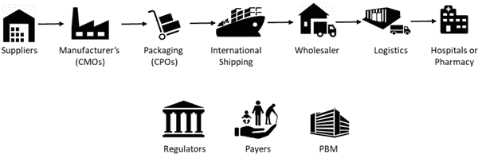 |

基于区块链的供应链可追溯性解决方案有巨大的潜力来解决假药问题，通过跟踪药物在整个生命周期中的运动（Sylim，2018）。制造业、零售业和采矿业等多个行业已经应用区块链或数字分类帐技术来构建解决方案，解决他们的供应链相关挑战，如来源、监管证明、库存审计和可追溯性。区块链的固有设计特点，包括去中心化、加密方法和不可变记录保存，确保相关数据可以安全地在利益相关者之间分发。在制药行业，类似的方法可以用来防止假药进入供应链。不过，区块链不应被视为供应链现有景观的替代品。它旨在通过不可变的共享分类帐的好处来补充当前的 IT 系统。

区块链的一个好处是能够通过利益相关者网络安全地跟踪任何物品的来源。这意味着从最初的原材料到最终消费者，供应链可以被严格监控。每当一种药物更换所有者时，都会被记录在不可变的分类帐上。通过查看每种药物的来源，很容易验证药物是否是假冒的。

制药供应链中另一个安全问题是药物召回。由于每种药物都可以单独标记，因此药物召回过程更简单更容易。不仅可以将受影响的药物从货架上拿走，而且可以自动通知消费者不再服用这些药物。

某些药品和医疗设备在运输过程中必须遵守供应链上严格的存储和处理要求（WHO Bulletib, 2010）。这些要求包括控制存储条件，如温度、湿度和空气质量。药品召回的主要原因包括未达到规格、标签错误或药物污染。

区块链解决方案可以避免因标签错误、污染和规格失败而导致的药品召回，或支持有针对性的召回（Bayanna, 2019）。基于区块链的可追溯性解决方案将是安全的、透明的，并能够在药品价值链上建立起源地，追溯物料和信息流。供应链中的所有参与者和权威机构都能利用这一点以确保更好的合规性。

通过结合使用区块链和连接的物联网传感器，可以安装温度传感器不断监控药品的温度，并实时反馈。技术将确保通过报警进行纠正措施以保持环境条件，不超过阈值温度。如果药品温度超过关键温度，货物可以自动退回，这些药品将不会进入零售渠道。

区块链技术具有高安全性、去中心化和防篡改的特点。随着智能设备连接到网络，并生成和使用各种传感器数据来触发自动化流程，这种系统的安全性至关重要。使用密码学可以确保区块链的安全，在传输过程中数据由公私钥加密。此外，只有具有有效凭据的同行才能在网络上执行交易。智能合约中写入的合同条款规定了网络上交易的有效性。在网络利益相关者的认可以及共识算法的支持下部署的合同展示了这些智能设备的去中心化自治。

特种药品溯源

特种药品通常用于治疗慢性、复杂或罕见的医疗状况，如果不及时治疗可能会逐渐恶化或致命。这些特种药品非常昂贵，通常不会在大多数零售和社区药店发放。这增加了额外的成本，如特殊处理、存储、运输，另外，它们可能需要密集的监测和临床监督。在药物的端到端分发中涉及多个利益相关者。交易细节和传感器数据通常在利益相关者处维护，并且数据共享通常效率低下。这增加了操作成本之外的复杂性。

数据或交易问题会导致复杂情况，这可能会给保险增加额外负担。基于区块链的专用药物端到端可追溯性，自动监测环境参数，并使用智能合约触发预防性维护或启动药品补充，将显著改善特殊药物的物流。药品的补充、丢弃或更换都可以实现自主操作。患者还可以访问特殊药品从制造商到药品经历的溯源信息，包括环境条件、分销商和药房详情。此外，能够识别昂贵特殊药品的监管链还允许安全退还或重新分配未使用或捐赠的药品。

互操作性电子健康记录

在当前情况下，患者的电子健康记录（EHR）由医疗服务提供者管理和控制。获取医疗历史、诊断和治疗的综合视图变得具有挑战性。例如，如果患者就诊于两家不同的医院或提供者进行任何药物治疗或诊断服务，患者需要回到各个提供者那里并寻求医疗记录或处方。当前的健康服务主要围绕医院或提供者展开。此外，数据隐私没有保障。医疗服务提供者或机构通常不愿分享健康记录数据，因为存在隐私顾虑，并且担心共享的数据可能被他人利用为竞争优势。这也导致由于不准确或不完整的医疗记录而产生药物错误在不同医疗服务提供者之间更好地协调不同专业领域的护理，减少由于缺少记录而产生的错误，从而显著降低患者的医疗费用。

大规模健康信息交换存在挑战，原因有：1）与个人健康信息（PHI）相关的隐私问题，2）与单一集中式数据库相关的安全风险，3）由于不连贯系统中数据不匹配而导致的数据交换错误，以及 4）患者缺乏控制权（Trehan, 2020）。在患者、医疗服务提供者和诊断中心之间实现有效的医疗信息交换将为患者带来重大好处，如避免药物错误、重复检测并改善诊断。

准确的病史是医疗保健的非常重要的一部分，在任何健康状况的初步评估过程中至关重要。区块链可以根据唯一的患者标识符存储个人健康记录。当患者访问新的提供者时，提供者会与患者电子共享诊断、医疗报告或处方。患者可以在自己的设备上（如手机）上收到相同的信息。信息可以通过 QR 码、电子邮件或电子消息进行共享 (Kim J.W 等人, 2019)。医疗记录的哈希值存储在区块链上，以便将来对任何可能的篡改尝试进行验证。这种以患者为中心的医疗健康记录的所有权归患者或其法定监护人所有，并且可以在患者的有时限同意的情况下向药房或其他提供者提供。接收这样的医疗记录的人可以轻松地根据存储在区块链上的哈希值验证记录的真实性。这种验证将需要验证伪造，或可能的处方滥用的情况，后者在本章后面讨论。

为了使信息能够与其他提供者互操作，健康记录上的信息应该被标准化。国际标准已经由 Health Level Seven International (HL7) 制定。HL7 制定了快速医疗互操作资源 (FHIR)，这是一种描述数据格式和元素（称为“资源”）以及用于交换电子健康记录的应用程序编程接口 (API) 的标准。在 HL7 FHIR 网站上可以找到几个标准规范、相关的详细文档和示例 (FHIR, 2019)。

患者可以利用他们的电子健康记录上的数据进行各种用途，如从药房接受处方、提交保险理赔、就医新提供者、同意临床研究组织使用他或她的医疗记录进行研究。信息接收者可以通过与基于区块链的分布式账本上存储的哈希进行验证，在几秒钟内验证记录的合法性。

基于区块链的电子健康记录系统还将能够与传统的 EHR 系统集成，通过保留大部分用户体验，使从旧系统向新系统的过渡更加容易。通过电子健康记录，患者可以捕获来自所有医生的信息，并帮助建立患者的完整视图。有了这个完整的记录，患者现在可以访问自己的记录，并与任何人分享。

医疗记录数据泄露

医疗数据泄露是医疗信息系统中医疗信息、个人信息或医疗账单信息的泄露。如果泄露，医疗记录可能被用于进行诸如个人身份盗窃、诽谤和炒作等恶意活动。除了个人健康详情外，医疗组织保留的患者记录还可能包括患者的财务数据，如信用卡号、电话号码和 Aadhaar 卡号或社会安全号码等，这些信息可能被滥用以谋取金钱利益。在迄今为止最大的医疗保健数据泄露中，2015 年，超过 7,880 万患者记录被不明身份的黑客窃取（Mathews, 2015）。数据泄露使黑客可以访问包含个人信息的数据库，如姓名、社会安全号码、地址、电子邮件地址、就业信息、出生日期等（Pierson, 2017）。

在过去的两年中，几乎有 94%的医疗机构都遭受过数据泄露（York & MacAlister，2015）。尽管存在这种普遍现象和高昂成本，但仍然有超过一半的医疗机构缺乏防止或迅速检测数据泄露所需的技术或专业知识。这种资源匮乏已经导致了行业的重大转变。图 2 显示了已在多个来源公开报道的显着数据泄露事件。Joseph Conn（2016），Steve Alder（2018），Kate Vinton（2015），Patrick Ouellette（2013），Davis（2019），Julie（2017），Singh（2019）。

| 图 2. 医疗保健领域最严重的数据泄露事件之一 |
| --- |
| 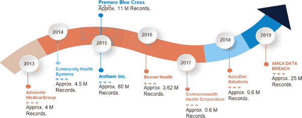 |

基于区块链的电子健康记录将会在基于区块链的分布式应用程序上安全地保护患者的医疗记录。数据经过加密保护，涉及医疗记录的交易采用公私钥加密进行加密。因此，确保了高安全性、去中心化和防篡改的个人健康记录。数据存储在分布式网络上，只有在获得患者同意后才能访问，通常以有时间限制的访问形式提供，这意味着接收者只能在一段时间内访问信息。

将所有内容存储在加密的区块链中，不一定要存储在个人的计算机网络上。因此，它非常安全，而且很难被侵犯。然而，如果医院的计算机网络被黑客攻击，或者发生重大数据泄露，医院和其数据中心并不需要关闭。数据可以从连接到网络的其他计算机中检索。勒索软件是一种臭名昭著的恶意软件形式，它在目标系统中加密数据，从而使用户无法访问数据。黑客通常要求支付高额费用，才能再次向数据所有者授予对数据的访问权限。但是在区块链网络的情况下，医院可以通过连接到区块链的另一台计算机访问记录的副本。区块链上数据存储的分布性有助于解决勒索软件攻击的问题。

药物滥用和误用

阿片类药物、大麻和一些类似的药物已被考虑用于医疗用途；例如，作为止痛药和缓解压力的药物，并且通常用于传统药物无法开具的病例，考虑到患者的健康状况。

美国阿片类危机的起源可以追溯到 1990 年代。它于 2017 年 10 月被宣布为美国的公共卫生紧急状态（Hargan，2017 年）。根据 CDC 上可共享的图形，每天约有 184 人死于药物过量（Wilson，2018 年）。此外，从 1999 年到 2018 年，超过 450,000 人死于阿片类药物过量。过量的主要来源是由于处方药的误用以及合成阿片类药物的非法制造或分销。

基于区块链的处方药物监测程序可以作为防止处方药物滥用的可行解决方案。借助区块链技术，医疗专业人员将能够检查患者的处方历史，甚至在发现药物潜在滥用时撤销处方。药店还可以根据存储在区块链网络上的哈希值验证处方，从而确保流程的效率和合规性。

处方和允许的换药次数在基于区块链的处方管理系统上进行跟踪，确保供应链中的流程透明度和问责制的增加。可以建立一个已序列化药物的链式监管，并帮助验证处方药物的所有权和来源。使用该平台跟踪的药品可以与医生和患者的详细信息一起验证，从而防止处方药物的滥用。

通过使用区块链系统，个人的处方历史可以被存储在区块链上。有了这些信息，很容易看出同一人是否去不同的医生那里获取处方，并在不同的药店填写。基于区块链的处方管理系统上的智能合约可以自动标记潜在滥用药物的用户，医疗专业人员将能够检查和验证滥用情况。

除了严格的预防措施之外，同样重要的是控制这类合成药物的许可、制造和分发，直到分发到药店并根据有效处方提供给患者。通过使用基于区块链的处方药物监测程序跟踪合法处方药物，将带来额外的互操作性、数据隐私和对患者的问责制的好处。

临床试验

疫苗或药物的开发是一个漫长且昂贵的过程。进行研究和试验可能需要数年时间才能生产出一种获得许可的药物或疫苗，并且通常伴随着高昂的成本和失败率（Fogel, 2018）。图 3 展示了典型临床试验中的各个阶段。

| 第三图：临床试验的阶段 |
| --- |
| 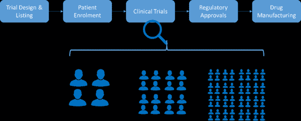 |

疫苗或药物开发成本的增加是制约制药公司愿意进行临床试验的主要障碍。H1N1 流感疫苗是开发速度最快的疫苗之一，这在很大程度上归功于过去对流感疫苗的类似工作。然而，疫苗仅在感染高峰后才向大众提供。随后，疫苗被纳入了商业可用的流感疫苗中。在其他情况下，例如 SARS、埃博拉和寨卡病毒，疫苗没有及时在市场上出现。这些流行病按时结束，导致感染者受苦，同时也给药品制造商和其他为他们而放弃的药品试验造成了经济损失（Lurie 等人，2020）。

研究参与者的招募、保留和监测是一项复杂的任务，可能占临床试验成本的 30%（Sertkaya 等人，2016）。如今，追踪临床试验物流、试验管理和患者同意管理存在挑战。许多候选人由于信任问题和担心其隐私可能会受到侵犯而不选择参加研究。在某些情况下，患者退出试验仅仅是因为他无法管理或缺乏支持定期访问试验现场进行试验程序。

在临床试验领域的挑战范围内，我们可以看到一个由数字技术支持的生态系统，可以节省成本，同时通过完全透明和隐私保护来加速生命周期。采用分散式基于区块链的解决方案，以跟踪试验药物在供应链中的运动，并利用智能物联网设备实时监控运输条件以及通过连接的医疗设备实时监测患者，将确保患者能够在家中完成大部分试验流程。匿名化数据收集和同意管理流程将允许患者分享病例记录和诊断参数，而不会泄露个人身份信息，从而增加参与率。

通过在区块链上拥有患者的完整电子健康记录，研究人员可以比以前更多地了解患者的健康状况。此外，由于有了患者健康档案的可用性，数据处理不当的问题将不那么棘手。患者还可以为他们健康记录的不同部分提供同意，因此对同意的担忧会减少，因为患者可以清楚地看到谁访问了他们的数据以及何时访问的。

传统上，大多数临床试验都在医疗机构进行，这些机构通常是患者接受诊断、治疗和监测的地方，由合格的医疗从业者监督。随着无站点试验的出现，其中许多程序可以在患者方便的情况下在家中进行虚拟进行。智能医疗设备、人工智能、远程医疗和移动性的融合，结合分布式区块链平台，为虚拟无站点试验提供了所需的基础设施。患者可以参加试验，在线与医疗从业者进行虚拟咨询，获得药物和补给送货上门，并将试验结果记录在虚拟中，同时在试验的每一步都保持问责制。这不仅仅是一种便利，而且还将扩大临床试验的覆盖范围，使那些由于医疗条件、时间不足或个人支持不足而无法负担所需旅行的远程患者也能够参与。

当前的研究和行业倡议

有各种研究关于区块链在医疗保健中的应用，主要涉及区块链数据管理、电子健康记录、药物发现和临床试验。此外，公司和研究机构正在积极调查区块链技术在医疗保健中的前景。其中大多数工作都是通过对研究论文、文章和出版物的系统审查总结的（Agbo 2019；Casino 2019）。它们提供了关于当前局势以及在医疗保健中使用区块链时面临的挑战的综合概述。

岳等人（2016）提出了一种基于区块链存储平台的 Healthcare Data Gateway（HDG），该平台允许患者在不违反隐私的情况下处理自己的数据。MedRec 是一种分散式的基于区块链的记录管理系统（Azaria 等，2016）。郭等人（2018）提出了一种具有多个授权机构的属性基签名方案。

Guardtime 是区块链领域的先驱之一，并且一直致力于为英国 3000 万 NHS 患者推出的世界首个区块链支持的个人护理记录平台（Guardtime，2020）。在类似的努力中，新加坡政府拥有的深科技发展公司 Innovate 正与新加坡一家基于区块链和医疗保健分析初创公司 Medilot、新加坡国立大学医院以及其他几家机构合作，建立一套由区块链驱动的电子健康记录，其中包括病历、治疗计划等（Sregantan，2018）。

全球各地的政府机构和监管机构一直关注着一种日益严重的假药和医疗器械重要方面的问题。此外，还存在一个问题，即识别导致药品召回的任何关键问题以及将召回信息有针对性地传达给相关经销商和药店。药品召回可能由于药品污染、标签错误或任何规格失败等原因而发生。在供应链早期识别此类事件并防止它们发生至关重要。欧洲等监管机构采取了集中式跟踪和报告解决方案来应对此问题。与此同时，一些组织正在尝试使用区块链作为解决其制药供应链问题的解决方案。Mediledger，由一些领先的制药公司和技术解决方案提供商支持，一直在与美国 FDA 合作开展一个项目，以解决药品串行验证的问题（AmerisourceBergen，2020）。该团队在其报告中展示了如何通过基于区块链的解决方案来扩展并提供一种解决方案，以验证供应链中的串行包装或一批药品，而不实际向公众公开使用区块链上的零知识证明解决方案的信息。一些其他组织，如 Remedichain，正在努力追踪昂贵的特殊药物，例如口服化疗药物，并将其提供给有需要的人（Boxler，2019）。其他像 Melloddy 项目，涉及领先的制药公司，正在使用区块链来强制执行数据安全性和不可变审计试验以及防止专有信息泄漏，同时实现预测性能（Galtier，2020）。该框架旨在尝试实施联邦机器学习以改善制药公司之间的合作和竞争数据共享，即数据永远不会离开它们各自的节点。在网络上只交换算法、预测模型和非敏感元数据。分布式账本技术在这里被用于编排计算并建立信息的可追溯性和真实性。大约有 10 家大型制药公司参与了该项目，以及大学、研究机构、公共机构、非营利组织和几家技术供应商。

MedBlock 也表现出很高的信息安全性，这归功于定制的访问控制协议和对称加密（FanKai 等，2018）。BlockHIE 是一个基于区块链的医疗信息交换平台。它使用两种不同的区块链来处理不同类型的医疗数据。它还结合了链下存储和链上验证，以满足隐私和身份验证的要求。它还使用两种基于公平性的打包算法来改善系统（Shan 等，2018）。

类似于 Coalesce Health Alliance 等联盟正在致力于跨支付实体的医疗数据交换和提供者数据目录。同样，另一个联盟 Synaptic Health Alliance 一直在美国致力于处理与提供者数据管理相关的问题，这直接或间接影响到索赔结算、医生目录、医生转诊、证书颁发以及信息交换。像 IBM 这样的公司与美国领先的保险巨头一起致力于理赔裁决、实现医疗信息交换和提供者目录。

Ancile（Dagher 等人，2018）是一个利用以太坊区块链中的智能合约进行加强访问控制的框架，并采用先进的加密技术以提高安全性。主要被患者、医疗服务提供者和第三方使用。DPS 是使用区块链的医疗数据保存系统（DPS）。它提供可靠的存储解决方案，提供数据完整性和可验证性，同时保护用户的隐私。这使得用户能够保留其数据，确保需要时能够验证数据的原始性和完整性。使用谨慎的数据存储策略和各种加密算法增强用户隐私。

FHIRChain 是一个基于区块链的架构，旨在处理共享的临床数据。它遵循快速医疗保健互操作性资源（FHIR）标准。FHIRChain 可用于使用数字健康身份构建分散式应用程序。这个解决方案已被实施并用于验证参与者在远程癌症治疗的协作决策中的身份（Zhang 等人，2018）。

MedShare 是一个基于区块链的系统，为大数据实体之间在云存储库中共享的医疗数据提供数据溯源、审计和控制。MedShare 监控访问数据的实体是否从数据保管人系统中进行恶意使用（Xia 等人，2017）。在 MedShare 系统中记录数据的转换、交易以及实体之间的数据共享和所有其他操作的方式是防篡改的。该设计采用智能合约和访问控制机制，有效跟踪整个系统中数据的行为。如果检测到任何恶意活动或违反规定，则立即暂停访问。MedShare 在与研究和医疗机构等实体共享医疗数据时实现了数据溯源和审计，同时最小化了数据隐私的风险。

Medium.io AG（Bocek 等人，2017）使用基于区块链技术的物联网设备来确保数据的不可变性和记录的公开可访问性。它们还大幅降低了传统制药供应链的运营成本。医疗行业有许多复杂严格的环境控制流程，如温度和湿度，以确保医疗产品的质量控制和监管合规性。传感器设备在运输过程中监测每个包裹的温度，以确保符合规定。这些传感器数据被转移到区块链上，智能合约会与产品属性进行评估。

HealthChain，一个医疗行业应用，是基于区块链的 IBM 区块链计划（Ahram 等人，2017）的基础上正式化和开发的。该系统可转移至金融、政府和制造等各行业，这些行业都需要达到安全性和可扩展性。信息管理是区块链技术的另一个出色应用，MedBlock 是其中之一，它利用分布式账本技术实现了高效的电子医疗记录（EMRs）访问和检索。它使用了改进的共识机制来达成 EMRs 的共识，能够大大降低能源消耗和网络拥塞。

几家制药公司一直在利用技术改善临床试验支持系统。临床试验系统涉及一系列复杂的数据共享，涉及赞助商、研究人员、患者和监管机构。Medrec 正在研究区块链上的医疗数据管理。它使患者能够访问透明的医疗记录。数据安全且私密，只有持有私钥的患者才能访问。数据由调查人员挖掘，数据提供者因为为试验做出贡献而获得激励。Embleema 是一个医学研究人员和患者的财团，旨在为研究人员提供更好的数据，并支付参与者。有一个应用程序，患者可以上传他们的个人数据，如医疗、基因组和生活方式数据。通过拥有这些记录，患者在参与每项临床研究时不需要重建个人数据。这为研究人员节省了金钱，同时为他们提供了更好的数据质量。

虽然这项技术带来了相当多的希望，但要从当前的点对点交互和有限信息共享的操作模式转变还存在相当大的惯性。几家行业参与者正在实施区块链解决方案，与其他技术不同，监管机构已经跟上了这项技术的步伐，因为它具有网络完整性、安全性、隐私性和包容性等固有原则，这有助于更广泛的采用。

区块链采用面临的挑战

行业目前在采用区块链技术的广泛进步方面进展缓慢。由于几个主要原因，采用过程缓慢。第一个原因是缺乏法规。虽然存在一些激励措施来采用更好的技术，但各种机构之间的不同规定使得采用变得困难。像 HIPAA 和 GDPR 这样的监管机构希望确保患者记录的安全。然而，缺乏国际标准使得大规模解决方案变得困难。

另一个原因是网络效应。这意味着在广泛采用之前，解决方案不够有效。随着每个组织的加入，区块链变得更加强大；而最初的几个加入者是最困难的。达到临界质量后，采用将会更快，并且后续的好处更容易实现。此外，在区块链行业中没有被广泛认可的标准。有不同的区块链网络存在，每个网络提供的利益各不相同，但在没有标准之前，行业很难采用。各种类型的区块链网络不兼容，因此如果你的一个合作伙伴使用一个区块链系统，另一个合作伙伴使用另一个系统，很难选择采用哪一个。此外，还需要考虑不断发展的医疗保健法规、规则和标准。

区块链技术普遍采用缓慢的另一个原因是很难预测准确的投资回报率（ROI）。这主要是由于医疗保健相关用例中缺乏大规模实际应用。大多数试点项目和原型处于早期阶段，并未部署到实际应用中，因此其影响尚未完全实现。尽管存在采用速度缓慢的原因，但公司和研究人员仍在继续探索各种实施区块链技术的方法。

第四个原因是初始投资成本，这常常是评估区块链用例的主要障碍。虽然可能不会立即有直接的投资回报，但基于区块链的系统的好处最终会得到实现。投资回报应该对所有涉及方清晰可见，而不仅仅是个别公司，因为除非其他利益相关者也被说服，否则实施区块链系统将是一项挑战。因此，利益相关者必须彻底理解基于区块链的系统的需求，即使这意味着彻底改造现有的遗留系统。

区块链中的挖矿成本高昂且使用大量计算资源。虽然现在以比特币的高价为例，它是有利可图的，但在医疗保健行业并非如此。挖矿应该安全进行，同时仔细考虑资源密集型，因为这可能会导致矿工在计算资源消耗上花费的资金比他们收到的回报更多。一些公司倾向于通过让矿工访问匿名数据来鼓励他们，作为他们的挖矿贡献的回报（Azaria 等人，2016）。

在评估医疗保健行业中的区块链系统时，还需要考虑的另一个方面是政府监管。医疗保健和生命科学行业受到严格监管，产品或服务要在该领域取得成功，应符合所有规则和法规。例如，HIPAA 或 GDPR 中的所有新规定。如果美国的公司不遵守 HIPAA，或者欧洲的公司不遵守 GDPR 规定，那么该公司及其产品通常不允许商业使用。重要的不仅是考虑当前的规则和法规，还要考虑未来的情景。

结论

在当前医疗保健行业存在的各种问题和挑战中，可以借助区块链技术来解决。作为信任中介，它可以实现新颖的医疗保健解决方案；作为激励机制，它可以实现可能导致患者和提供者等各种医疗保健利益相关者之间产生新动态的新型业务模式。同样，基于区块链的去中心化网络和服务可以帮助确保医疗数据的安全性，保密性，并在利益相关者之间提供数据完整性和数据透明度。

在本章中，探讨了区块链的主要用例，例如医疗数据管理和存储，以及区块链在制药行业中的应用，药物发现，临床试验等。还介绍了研究和开发基于区块链的医疗应用的组织和研究机构的例子。然而，尽管区块链技术具有巨大的潜力，并且在其周围存在巨大的兴趣，但从实现、应用和应用方面来看，该技术似乎仍处于非常早期的阶段。大多数基于区块链的解决方案仍处于研究和实验阶段。

诸如与现有系统集成、实施和运行成本不确定性、缺乏灵活性和与传统系统的互操作性、技术和采用障碍、监管合规性和扩展等挑战仍需要得到充分解决，以实现在医疗保健和其他相关领域广泛实施区块链技术。

参考文献

Agbo, C. C., Mahmoud, Q. H., & Eklund, J. M. (2019 年). 医疗保健中的区块链技术：一项系统综述。《医疗保健》，7，56。

Ahram, T., Sargolzaei, A., Sargolzaei, S., Daniels, J., & Amaba, B. (2017 年). 区块链技术创新。2017 年 IEEE 技术与工程管理会议（TEMSCON）论文集，137–141。10.1109/TEMSCON.2017.7998367

Alder. (2018 年). 265 万名 Atrium Health 患者受到业务伙伴数据泄露的影响。https://www.hipaajournal.com/2-65-million-atrium-health-patients-impacted-by-business-associate-data-breach/

AmerisourceBergen. (2020 年). MediLedger DSCSA 试点项目。切斯特布鲁克：Mediledger。

Azaria, A., Ekblaw, A., Vieira, T., & Lippman, A. (2016 年). Medrec：利用区块链进行医疗数据访问和权限管理。国际开放大数据会议（OBD）论文集，25–30。

BayannaK. (2019 年). 错误！超链接引用无效。http://mdxblocks.com/wp-content/uploads/2018/05/Product-traceability.pdf

BocekT.RodriguesB. B.StrasserT.StillerB. (2017 年). 区块链无处不在—在制药供应链中使用区块链的一个用例。2017 年 IFIP/IEEE 集成网络与服务管理研讨会（IM）论文集，772–777。10.23919/INM.2017.7987376

Boxler, D. (2019 年 4 月). Remedichain 连接昂贵药物的患者。《药品话题》，•••，42–43。

Button, M., & Gee, J. (2015 年). 医疗保健欺诈的财务成本。https://www.researchgate.net/publication/299378586_The_Financial_Cost_of_Healthcare_Fraud

Casino, F., Dasaklis, T. K., & Patsakis, C. (2019). 基于区块链的应用程序的系统文献综述：当前状况、分类和未解决问题。《Telematics and Informatics》，36，55–81\. doi:10.1016/j.tele.2018.11.006

Conn. (2016). Banner Health 网络攻击影响了 370 万人。https://www.modernhealthcare.com/article/20160803/NEWS/160809954/banner-health-cyberattack-impacts-3-7-million-people

Dagher, G. G., Mohler, J., Milojkovic, M., & Marella, P. B. (2018). Ancile: 通过区块链技术实现电子健康记录的隐私保护框架和访问控制互操作性。《可持续城市与社会》，39，283–297。

Davis, J. (2019). 2019 年迄今最大的 10 起医疗数据泄露事件。https://healthitsecurity.com/news/the-10-biggest-healthcare-data-breaches-of-2019-so-far

Fan, K., Wang, S., Ren, Y., Li, H., & Yang, Y. (2018). MedBlock: 通过区块链实现高效安全的医疗数据共享。《Journal of Medical Systems》，42(8)，136\. doi:10.1007/s10916-018-0993-7

FDA. (2013). 行业指南：对临床调查的监督 — 一种基于风险的监控方法。美国卫生与人类服务部食品和药物管理局。

FHIR. (2019 年 11 月 1 日). HL7 FHIR Release 4. 从 https://www.hl7.org/ 检索: https://www.hl7.org/fhir/

Fogel, D. B. (2018). 影响临床试验失败的因素及提高成功可能性的机会：一篇综述。《Contemp Clin Trials Commun》。

Galtier, M. (2020 年 2 月 17 日). MELLODDY：由 Owkin 技术驱动的公司间机器学习“合作竞争”平台。从 www.melloddy.eu 检索: https://www.melloddy.eu/blog/melloddy-a-co-opetitive-platform-for-machine-learning-across-companies-powered-by-owkin-technology

Guardtime. (2020). 由 Guardtime 和合作伙伴为英国高达 3000 万 NHS 患者推出的世界首个区块链支持的个人护理记录平台。从 guardtime 检索: [链接](https://guardtime.com/blog/world-s-first-blockchain-supported-personal-care-record-platform-launched-by-guardtime-and-partners)

Guo, R., Shi, H., Zhao, Q., & Zheng, D. (2018). 电子健康记录系统中基于属性的安全签名方案，具有多个权威机构的区块链。IEEE Access, 6, 676–686.

Hargan, E. D. (2017 年 6 月 10 日). 美国卫生与公众服务部。从 https://www.hhs.gov/sites/default/files/opioid%20PHE%20Declaration-no-sig.pdf 检索

HIPAA. (2019). 医疗保健数据泄露统计。HIPAA Journal. [链接](https://www.hipaajournal.com/healthcare-data-breach-statistics/)

Jovanovic, B., & Peter, L. R. (2005). 通用技术。在经济增长手册中。Elsevier . doi:10.3386/w11093

KimJ. W.LeeA. R.KimM. G.KimI. K.LeeE. J. (2019). 使用区块链的以患者为中心的药物历史记录系统。2019 年 IEEE 生物信息学与生物医学国际会议 (BIBM), 1513-1517. 10.1109/BIBM47256.2019.8983032

Lurie, N. Saville, M., Hatchett, R., & Halton, J. (2020 年 3 月 20 日). 以疫情速度开发新冠疫苗。NEJM.org.

Mathews, A. W. (2015). 安泰: 数据库被黑事件涉及 7,880 万人。华尔街日报。

Mattick, J. S., Dziadek, M. A., Terrill, B. N., Kaplan, W., Spigelman, A. D., Bowling, F. G., & Dinger, M. E. (2014). 基因组学对医学和健康未来的影响。澳大利亚医学杂志, 201(1), 17–20. doi:10.5694/mja13.10920

NIDA. (2018). 阿片类药物过量危机。[链接](https://www.drugabuse.gov/drug-topics/opioids/opioid-overdose-crisis)

Ouellette. (2013). Advocate Medical Group 经历了大规模数据泄露。[链接](https://healthitsecurity.com/news/advocate-medical-group-endures-massive-data-breach)

Pierson, B. (2017). 安泰公司支付创纪录的 1.15 亿美元解决美国数据泄露诉讼。https://www.reuters.com/article/us-anthem-cyber-settlement/anthem-to-pay-record-115-million-to-settle-u-s-lawsuits-over-data-breach

安全, I. B. M. (2019). 2020 年数据泄露成本报告。https://www.ibm.com/security/digital-assets/cost-data-breach-report/#/

Sertkaya, A., Wong, H. H., Jessup, A., & Beleche, T. (2016). 制药临床试验的关键成本驱动因素 . 临床试验 , 13(2), 117–126\. Advance online publication. doi:10.1177/1740774515625964

Shan, J., Jiannong, C., Hanqing W., Yanni, Y., Mingyu, M., & Jianfei, H. (2018). BlocHIE: 基于区块链的医疗信息交换平台. .10.1109/SMARTCOMP.2018.00073

Singh, H. (2019). 2019 年最严重的网络安全数据泄露事件. https://www.appknox.com/blog/top-cybersecurity-data-breaches

Southwick, N. (2013). 假药每年致使 100 万人死亡. Interpol. https://www.insightcrime.org/news/brief/counterfeit-drugs-kill-1-million-annually-interpol/

Spitzer. (2017). 2017 年最大的 11 次医疗保健网络攻击事件. https://www.beckershospitalreview.com/cybersecurity/11-of-the-biggest-healthcare-cyberattacks-of-2017.html

Sregantan, N. (2018, July 17). SGInnovate 投资于新加坡医疗技术初创公司 MediLOT Technologies. straitstimes.

Sylim, P., Liu, F., Alvin, M., & Fontelo, P. (2018). 区块链技术用于检测制药分销系统中的伪劣药品和劣质药品 (预印本). JMIR 研究方案 , 7. Advance online publication. doi:10.2196/10163

Trehan, R., Bansal, D., & Nair, S. J. (2020). 利用区块链促进互操作性医疗生态系统。摘自 www.infosys.com/: https://www.infosys.com/blockchain/documents/fostering-interoperable-healthcare-ecosystems.pdf

文顿。 （2015）。Premera 蓝十字突破可能已经暴露了 1100 万客户的医疗和财务数据。https://www.forbes.com/sites/katevinton/2015/03/17/11-million-customers-medical-and-financial-data-may-have-been-exposed-in-premera-blue-cross-breach/#1aa66d4675d9

世界卫生组织公报 - 技术报告系列。（2010）。世界卫生组织药品良好分销实践。世界卫生组织技术报告系列，第 957 号。

世界卫生组织。（2017）。有关次标准和伪劣医疗产品公共卫生和社会经济影响的研究。世界卫生组织/EMP/RHT/2017.02。

世界卫生组织公报（2010）。伪劣药物日益威胁。世界卫生组织公报，88（4），241–320。

Wilson，N.，Kariisa，M.，Seth，P.，Smith，H. I. V.，& Davis，N. L.（2018）。美国 2017 年至 2018 年药物和鸦片类药物致死过量死亡。美国疾病控制和预防中心。流行病学与死亡率周报，2020（69），290–297。

夏，Q.，Sifah，E. B.，Asamoah，K. O.，高，J.，杜，X.，& Guizani，M.（2017）。MeDShare：云服务提供商之间的不受信任的医疗数据共享通过区块链。IEEE Access：实用创新，开放解决方案，5，14757–14767。doi:10.1109/ACCESS.2017.2730843

York，T. W.，& MacAlister，D.（2015）。医院与医疗保健安全。学术出版社。

岳，X.，王，H.，金，D.，李，M.，& 江，W.（2016）。医疗数据网关：在区块链上找到新型隐私风险控制的医疗智能。医疗系统杂志，40（10），218。

张，P.，White，J.，Schmidt，D. C.，Lenz，G.，& Rosenbloom，S. T.（2018）。FHIRChain：将区块链应用于安全可扩展地共享临床数据。计算和结构生物技术杂志，16，267–278。doi:10.1016/j.csbj.2018.07.004

额外阅读

DSCDA。（2015），药品供应链安全法案，https://www.fda.gov/drugs/drug-supply-chain-security-act-dscsa/title-ii-drug-quality-and-security-act，2020 年 5 月访问。

Hölbl, M., Kompara, M., Kamišali’c, M., & Zlatolas, L. N. (2018). 区块链在医疗保健中的应用的系统性回顾。对称，10(10)，470. 提前在线发布。doi:10.3390/sym10100470

Ichikawa, D., Kashiyama, M., & Ueno, T. (2017). 利用区块链技术的防篡改移动健康。JMIR 移动健康与 uHealth，5(7)，e111. doi:10.2196/mhealth.7938

Katuwal, G. J., Pandey, S., Hennessey, M., & Lamichhane, B. (2018)，区块链在医疗保健中的应用：当前形势和挑战，arXiv: 1812.02776

Li, H., Zhu, L., Shen, M., Gao, F., Tao, X., & Liu, S. (2018). 基于区块链的医疗数据保存系统。医疗系统杂志，42(8)，141. doi:10.1007/s10916-018-0997-3

**关键术语和定义**

**CDS：临床决策支持系统**，是一种旨在为医生和其他卫生专业人员提供临床决策支持，即协助进行临床决策任务的卫生信息技术系统。

**分布式账本技术（DLT）**：分布式账本是一种在国家、组织或机构之间复制、共享和同步数字数据的共识。没有中央管理员或集中数据存储。

[HL7：健康水平七](https://www.hl7.org/)或 HL7 是一组国际标准，用于在各种医疗保健提供者使用的软件应用程序之间传输临床和行政数据。

[NHS：国家卫生服务体系](https://www.nhs.uk/)（NHS）是指英国公共资助的卫生保健系统，包括苏格兰国家卫生服务体系（NHS Scotland）、威尔士国家卫生服务体系（NHS Wales）和北爱尔兰的卫生与社会保健。

[NIDA：美国国家药物滥用研究所](https://www.nida.nih.gov/)是美国联邦机构，支持对药物使用进行科学研究。

阿片类药物：这些是具有类似吗啡的效果的物质。在医学上，它们主要用于止痛，包括麻醉。阿片类药物包括羟考酮、羟吗啡酮、吗啡等。

药品序列化：药品序列化是为处方产品的每个单位分配唯一编号的过程，其中包含有关产品来源、批号和过期日期的信息。

智能合约：智能合约是一种旨在数字化促进、验证或执行合同的计算机协议。智能合约允许进行可信交易，而无需第三方。这些交易是可追踪且不可逆转的。

世界卫生组织（WHO）是联合国的一个专门机构，负责国际公共卫生事务。WHO 的广泛职责包括倡导普遍医疗保健，监测公共卫生风险，协调应对卫生紧急情况，并促进人类健康和福祉。

# 第十四章

# 区块链融入供应链运营：

案例分析

+   Yigit Sever

    土耳其中东技术大学

+   Pelin Angin

    土耳其中东技术大学

摘要

随着由物流集装箱化引发的全球化，供应链可能会通过整合颠覆性的区块链技术而迎来另一场革命，该技术解决了管理复杂全球供应链的当前问题。区块链是分布式数字账本，无需中央机构运作，同时提供每笔交易的防篡改和透明历史记录。这些账本的分布性确保供应链的每个参与者都能访问可信数据。该行业已经开始尝试将区块链整合到其运营中。然而，对于大多数组织来说，这些实验仍处于概念验证阶段或小规模试点研究阶段。在本章中，作者讨论了使区块链整合成为有利条件的供应链特征，奠定了区块链如何用于供应链操作以及迄今为止如何使用它的基础。

**介绍**

供应链是由独立组织组成的网络，它们生产并向客户交付产品。这些复杂的来源网络通常跨越多个国家甚至是大陆。由于供应链上的参与者众多，组织只关注它们的直接联系；他们从上游购买的参与者和他们向下游销售的参与者。无意中，没有一个组织对整个网络拥有绝对控制权，但组织必须管理其资源和资本以履行其在供应链中的角色。

供应链管理是链条上组织的资源、时间和资本的协作与合作。在集中化和去中心化之间存在微妙的平衡，集中化导致时间和资源的有效利用，而去中心化则可以防止机会主义行为和欺诈（Azzi 等人，2019 年；Schmidt & Wagner，2019 年）。正如上文所述，供应链并非集中化，因此认为组织对其输入的来源具有足够的信息或有责任向其上方的各方提供信息是不现实的。信息的缺乏导致库存空间的浪费，交货时间的不确定性，并迫使公司计划具有可能导致鞭击效应的误差边际（Ivanov 等人，2018 年）。

区块链技术在 2008 年被用于支持加密货币比特币后变得流行起来（中本聪，2008 年）。从那时起，它在金融领域以外找到了许多用途。区块链技术在供应链管理背景下的主要好处包括：透明度、可追溯性和去中心化。区块链可以作为一个不可篡改的、共享的账本，供所有参与方使用。一旦供应链上的组织采用了这一技术，参与者之间的交易就可以通过一些共识过程被提交到区块链中，以验证数据的合法性。信息的透明度和可追溯性与权限系统相辅相成，使得数据的所有者只能允许相关方访问。沿着链条的所有参与方，包括最终的顾客，都可以验证他们所获得产品的来源，并确认其不是假冒产品，也不是使用不道德或可疑的劳工实践或以某种方式被污染。

该行业一直在进行区块链集成到供应链的试点研究，包括食品（IBM，2017 年）和物流（Moise & Chopping，2018 年）行业。文献还提出了可扩展的框架（El Maouchi & Ersoy，2018 年）和针对特定应用的建议，例如防伪电子供应链（Xu 等，2019 年）。物联网（IoT）是另一个可以从区块链技术提供的数字化和互操作性中获益的领域。物联网包括具有网络访问权限的设备，收集数据并自主行动。随着大数据和机器学习领域的发展，收集数据以优化操作并做出明智决策具有明显价值。

本章介绍了供应链的基础知识，并确定了当前供应链管理解决方案可能存在的问题。然后，介绍了区块链在供应链管理中的用途。检查了区块链集成的缺点以及针对技术的常见批评，讨论了在何时区块链不是可行的解决方案。最后，详细介绍了现实生活和文献中的用例，并审查了开放性问题以及未来的研究方向。本节还提供了有关供应链及其当前问题的初步信息。

供应链

供应链是最终为最终客户提供价值的组织集合。一个典型的供应链视图，也在图 1 中描述，从供应商提供的自然资源开始，制造商将其制成组件，最终制成消费者市场的产品，分销商负责整个网络的流程。

为了交付最终产品，中间组织与其供应商、客户和物流处理者进行互动，在这个网络中创建了物质、零部件、信息和资本流动。网络允许双向流动以获取反馈并处理每个级别的客户退款，最终来自终端用户的退款非常重要。

现代供应链在全球范围内运作。全球化是在运输成本在距离上变得微不足道后开始的，导致生产选择在成本最低的地方以及劳动力最廉价的地方进行，而不是在资源或运输枢纽附近进行（Levinson, 2008）。由于采购是在全球范围内进行的，因此竞争也发生在全球舞台上。

在文章《The Box: How the Shipping Container Made the World Smaller and the World Economy Bigger》（Levinson, 2008）中，作者认为普遍采用集装箱无意中导致了运输成本变得微不足道，并推动了现代全球供应链的启动。这不应与集装箱的发明相混淆。之前尝试采用集装箱化的企图失败了，因为只试图在供应链的部分环节上进行实施。例如，船东只实施了对他们的设备有意义的部分。结果，下一级组织不得不处理其供应商的非标准物流决策。已经包装好的货物再次打包并在目的地解包以进行分类导致企业避免使用集装箱。然而，随着网络效应导致整个供应网络支持集装箱；从船舶设计到码头和产品包装。简而言之，只有当业务物流的“旧方法”被放弃时，集装箱化的真正潜力才能被实现。

| 图 1\. 一个端到端供应链的概览。 |
| --- |
| 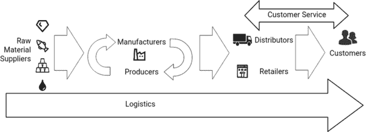 |

区块链是否有颠覆供应链业务的潜力，类似于之前航运集装箱所做的？区块链在带来加密货币的同时，也引发了 Bitcoin 这一成功案例，但也有像 Onecoin（司法部，2019）这样的恶意参与者或欺诈行为。一个公司的股价在同一天内只因为在其名称中加入了区块链而实现了 289％的增长，然后又崩溃（Shapira & Leinz, 2017）的故事，这表明了围绕该技术的炒作。另一个要考虑的替代方案是这个阶段，即企业尚未找到如何利用区块链潜力的方式，就像 20 世纪 50 年代的企业没有理解集装箱化一样，认为集装箱是不必要的，或者试图维持自己的利益的现状。

世界上见过的最具颠覆性的技术之一是互联网（Babich & Hilary, 2020），它从上世纪 90 年代的互联网泡沫和区块链中汲取了灵感。这种新颖又令人兴奋的技术可能也会经历类似的阶段；炒作，快速采纳导致泡沫，然后崩盘，然后稳定下来。在互联网泡沫之后，互联网现在是一种常见的做生意的方式。区块链可能也会经历类似的阶段，并找到一个稳定的利基来填补，一旦其优势和劣势得到适当的解决。来自行业的区块链采用者的调查（例如 Pawczuk 等人，2020）声称目前的区块链情绪已经达到了稳定期。

供应链存在的问题

信息不对称下的物流需要协调，而在考虑国际舞台时，产品的旅程中穿越边界的法律和意识形态存在差异（Liu & Li，2020 年）。 在规划运营过程中的任何低效都会导致库存和生产设施的非最优利用（Liotine & Ginocchio，2020 年）。 这直接与一个组织的运营如何在全球范围内分开有关（Zhang，2019 年）。 此外，行业专家指出，采购和库存成本是使用数据驱动的长期规划进行优化的主要罪魁祸首（Kaçan，2019 年）。 由制造商，零售商和物流实体构成的供应链正在努力为其组织创造价值。 纸笔记录和包括发票，证书和提单等纸质文档的记录导致信息是暂时的环境。 此外，信息的稀缺性使恶意行为者可以通过伪造或“双倍花费”和抢劫容器内容来篡改文档（Kshetri，2018 年）。 缺乏全面信息也会产生间接影响。

在商业谈判等竞争环境中，如果两方对彼此资源的了解存在不对称性，谈判者往往会利用对方（Boles 等，2000）。这种现象在供应链谈判的实验条件下也得到了验证（Inderfurth 等，2013）。在那项研究中，作者解释说，如果一方隐瞒信息并充分利用，利用方就会获利，而供应链的其他部分包括最终客户将承担更高的零售价格。为了披露信息，建议的方法是使用筛选合同。然而，这些合同是手工设置的，这阻碍了供应链的效率，特别是考虑到倾向于采用即时制（JiT）方法。此外，作者通过实验发现，沟通和相互信任能增加供应链的绩效，但这种信任是脆弱的。问题的根本原因仍然在于以纸质文件为基础的繁琐业务性质，这使得信息共享比信息隐瞒更加困难。

在信息获取不对称和信息流动有限的环境中，缺乏信任决定了实体的行为。Babich & Hilary（2020）认为，供应链上的零售商和供应商希望通过提供歪曲的信息来使价格对自己有利。例如，供应商预测生产量较低，以减少显而易见的供应量，从而推高价格。另一方面，零售商通过预测更高的销售量来人为地提高需求，以促使供应商增加库存，从而提高供应量并降低价格。最终，双方都在利用信息不对称来获取利益。

牛鞭效应是各方信息不对称情况下竞争的直接原因。该效应规定，当向制造商提供的需求的方差高于制造商生产能力的方差时，他们无法做出最优决策。该效应导致库存管理不善，客户服务质量下降，以及生产设施的分配效率低下（Schmidt & Wagner，2019）。

总结一下，供应链方面的问题可以归纳为：

+   1\. 追踪困难

+   2\. 缺乏对不道德行为、腐败行为的威慑力不够

+   3\. 全球化和基于纸质文档的协调工作艰难

供应链管理的区块链技术

本节首先介绍了区块链技术的基本属性。然后，详细介绍了与供应链运营相关的区块链方面。最后，讨论了供应链运营如何从区块链与物联网技术的整合中受益。

区块链

区块链是一系列密码连接的数据块。每个块包含一个时间戳，一个随机值，对前一个块的引用以及新交易的列表。对前一个哈希的引用以及随机值确保了区块链是一个连续状态，不可篡改。区块链的简化结构如图 2 所示。

对于诸如比特币之类的公共区块链，工作量证明（PoW）为交易提供共识，并允许任何人在没有时间限制或来自中央机构的批准的情况下进入系统。PoW 是找到一个 nonce 值的过程，使得区块中的交易列表与 nonce 值组合后的哈希值满足要求。由于计算哈希值的过程是计算密集型的，区块链中的参与者（称为矿工）必须耗费 CPU 功率和电力才能参与。

比特币是加密货币的第一个成功实现，是一个分散的价值系统，不以实物为支撑。之前的“电子现金”系统失败是因为它们依赖于可信赖的中心 intermediaries。另一方面，比特币是固有防篡改的，因为攻击者受到鼓励为链条的货币价值贡献他们的资源。如果恶意行为者决定花费资源攻击货币，他们必须比网络参与者的 51%更多的计算能力，即使他们成功了，货币也会因为他们的努力而失去价值，使得他们的收益变得毫无价值。

区块链实现根据不同的访问分类提出了不同的方案。比特币是一个完全公开、开放且无需许可的网络，参与者可以随时加入链条。私有区块链需要在参与之前进行身份验证和授权，可以采用网络访问或加密的形式。财团区块链网络是扩展的私有区块链。它们包含着验证节点，这些节点管理着哪些参与节点可以对交易进行共识（Puthal 等人，2018）。它们通常由具有共同目标但可能存在竞争利益的组织构建，类似于供应链的运作方式。因此，财团区块链网络通常是本章提到的试点研究的起点。

区块链以时间和电力成本高昂而闻名。这在区块链实施的缺点中经常被放在最前面进行讨论（Puthal et al.，2018）。由于比特币是一个无需访问权限的公共分类帐，因此必须采取昂贵的 PoW 来对抗 51%的攻击。供应链运营的区块链实施已经起草使用许可或联盟结构，其中不需要昂贵的 PoW（Yiannas，2018）。

| 图 2\. 区块链的简化结构。 |
| --- |
| 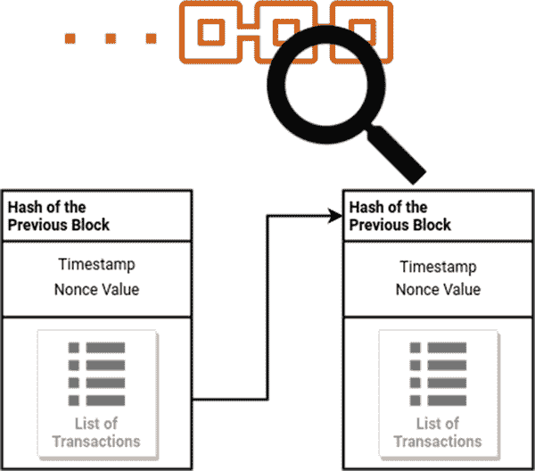 |

智能合约被用来进一步扩展区块链的能力。它们是可以与其自己的地址一起烘焙到区块链中的程序。它们根据区块链的状态和接收到的交易执行自定义逻辑（Christidis & Devetsikiotis，2016）。由于智能合约是运行任意脚本的计算机程序，因此可以编程使其通过传感器数据验证区块链输入的质量标准（Azzi et al.，2019）。

区块链在供应链管理中的适用性

在文献中，关于区块链整合到供应链运营中的经验研究有限（Wamba & Queiroz，2020）。然而，可以从研究机构的调查、公司的试点研究以及文献中的框架提案中得出区块链技术对供应链的潜在好处。在本节中，作者提出了区块链技术的某些适用方面，这些方面可能对管理供应链有用或已经有用。

在 2018 年进行的一项关于区块链在公司运营中潜在用途的调查中，五分之四的受访者表示，他们的公司将主要使用区块链以获得可追溯性和透明度的好处（Pai et al.，2018）。这些好处包括产品跟踪和来源溯源。

| 图 3. 区块链技术适用方面的关系图 |
| --- |
| 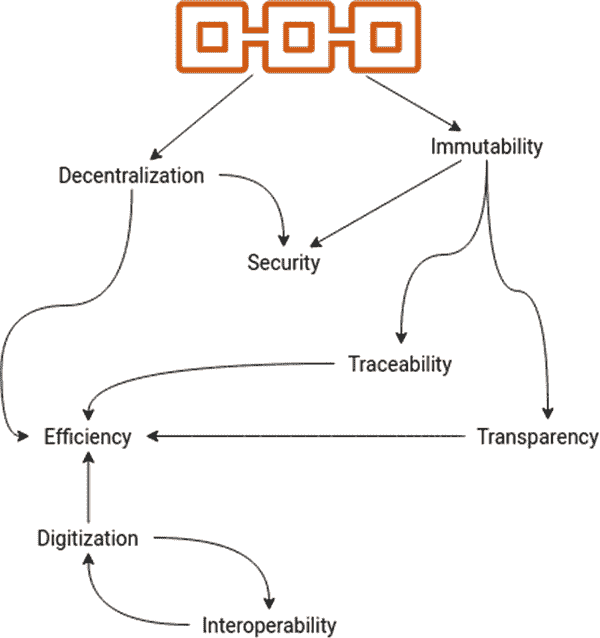 |

通过对供应链文献中的区块链整合进行分析，经常会遇到诸如“区块链解决的问题可以使用其他工具解决”的观念。正如 Babich & Hilary（2020）所说的：几乎没有什么是在没有分布式账本技术的情况下无法实现的。然而，其中一些可能性在经济上不可行，对于许多人来说，分布式账本技术更经济实惠。Kshetri（2018）通过说区块链解决了一个消息传递问题而不是一个数据库问题来表达了同样的情感。

区块链技术可以为供应链管理提供以下有益属性。这些方面的关系图如图 3 所示。

追溯性

这指的是沿着供应链追踪产品来源的便利程度。将这个想法扩展到多个层次，当产品通过供应网络的旅程可用且可以迅速访问时，就实现了追溯性。食品、药品或电子组件等易腐产品之间的区别并非必要。直观地认为，电子产品是由来自不同制造商的许多组件组装而成的，但是放在杂货架上的商品的成分可能曾经在供应网络的某个环节中被分发以供成千上万的产品使用（Yiannas，2018）。追溯过程不仅应该是可能的，而且应该是快速的。在沃尔玛进行的区块链整合试点研究中，一袋芒果在大约一周的时间里通过传统的纸质记录系统被追溯到了原始农场（Yiannas，2018）。在与食品污染有关的危机期间，一周的追溯期可能是不可接受的。

此外，追溯性使公司能够在发生任何污染批次时隔离受污染的批次，或者避免不必要的指责，而追溯到安全来源的产品则无需浪费。当公司希望展示其道德的采购手段或可持续的业务实践时，追溯性是一个优化的有价值的目标。从整体的角度来看，提高追溯性标准的组织增加了道德合规性，减少了货物在运输过程中丢失和整个供应网络中的欺诈产品案例（Chang 等，2019 年）。在电子制造业中，追溯性有助于保真度（Xu 等，2019 年）。区块链如下帮助追溯性：每个产品或文件都是与其数字孪生体一起创建的。现实生活中的交易，在供应链的参与者之间转移产品或文件的过程也会在区块链上创建一个交易，在此交易中，数字孪生体被交换并不可逆地提交到分类帐中，该分类帐由网络中的每个实体共享。最终的商品接收者可以追溯数字代币从创建到目的地的过程（Francisco＆Swanson，2018 年）。使用序列号、条形码、传感器或 RFID 芯片保留数字代币与实际商品之间的联系（Schmidt＆Wagner，2019 年）。

透明度

透明度是关于产品信息的便捷访问。 它与可追溯性略有不同，因为透明度涉及产品的构成，而不是产品的来源。 具有良好透明度的可食用产品转化为对健康问题的人提供 readily accessible 的过敏原信息，或者一份可信赖的成分清单，供有膳食偏好的人依赖。 拥有清真、犹太教或有机产品信息的组织可以从增加透明度中受益——通过赢得消费者的信任（Chang et al.，2019）。 透明度是供应链的悬而未决问题，因为沿着链条有太多利益相关者。 例如，在 2018 年，由于未披露食品中的过敏原信息，损失了超过 35 亿美元（Maberry，2018）。 实施区块链技术可以通过追踪产品成分的时间顺序排序的交易清单来满足透明度要求。

不变性

  这是提交到区块链的每笔交易的终局。 在区块链上更改之前的交易需要更改随后的交易，而网络的其余部分正在正确共享状态前进。 总的来说，不变性通过确保对区块链状态的信任，为可追溯性和透明性提供了基础。 集成区块链的额外安全措施可以保护组织的数据存储完整性。

效率

区块链技术的整合带来了将智能合约整合到供应网络的能力。通过智能合约和物联网设备的验证能力，机械性采购流程可以转移到无摩擦的自动化流程中，包括订购、支付和发票。去中心化和可追溯性在这里是相关的，以消除牛鞭效应。正如之前提到的，JiT 操作一直在受到关注，以优化库存和生产设施的利用率。通过物联网传感器的实时跟踪可以实现提前操作，甚至可以跟踪到细微的细节和小批量（Kshetri，2018）。最后，买家和卖家之间的争议解决从效率方面受益于交易的不可变历史，可以随时供任何一方进行审计（Chang 等，2019）。

数字化

随着组织达到互操作性里程碑，诸如提货单、证书和产品信息以及产品的行程等交易数据可以作为原始数据提供。数据聚合在决策和优化过程中非常有用，特别是结合大数据应用和机器学习。物联网数据、产品行程、传感器读数（如温度和湿度）甚至视频数据应该为此目的而随时可用（刘和李，2020）。交易文件的数字化或者纸质记录的消除与交易的效率息息相关。例如，物流公司马士基发现，由于缺少文件而使得他们的货物在港口无故等待，这些文件本可以与货物的区块链集成的数字孪生体相联系（Kshetri，2018）。

去中心化

对于本研究，去中心化与消除供应链中的单点故障相关。区块链的集成确保了供应网络上的责任和信任，通过确保每个参与者都能访问共享和可信的状态。民主共识过程进一步证实了这一点。区块链集成的透明度方面也源自去中心化；账本分布给所有参与方。目前的供应链交易通过将信任的仲裁分配给第三方验证者来建立验证，从而增加了交易成本（张，2019）。在区块链广泛应用之后，这些验证者将转移到供应链的入口点，以确保正确的人员或传感器输入到区块链中。供应链沿途的其余交易是在区块链参与者之间进行的，这些交易的验证是通过共识机制进行处理的（Babich＆Hilary，2020）。

安全

安全性来自不可变性和去中心化的双重保障。不可变性保护记录系统免受完整性损失，而去中心化则提供对可访问性的攻击保护（Min，2019）。传统的数据库管理系统需要防范这些威胁，而运行在区块链技术上的账本本身是安全的。此外，通过选择适当的共识算法和验证节点，可以在存在不受信任的节点的情况下确保区块链的安全性（Toyoda 等，2017）。需要注意的是，不受信任并不一定意味着恶意。竞争参与者可能存在潜在利益分歧（Babich＆Hilary，2020），这也需要安全措施。最后，区块链集成用于带有加密安全性的安全文档交换和存储，并用于“资产和个人的身份验证”（Kshetri，2018）。

互操作性

正如之前提到的，当前供应链信息交换主要通过手工操作完成，使用纸笔方法，但组织仍然将记录保存在传统数据库管理系统中。这些系统是根据组织定制的，并且在数据访问方面对第三方形成了有效的壁垒。在这种情况下，互操作性是指系统能够接受彼此的通信和数据。标准化的区块链交易或 API 要求也是互操作性的一部分。互操作性并不一定是区块链集成的直接好处，但当组织逐步采用区块链集成时，达到互操作性里程碑是非常重要的。在达到互操作性里程碑后进行区块链集成，允许对供应链进行数字化，并利用物联网（IoT）设备和传感器来增强质量要求跟踪。产品运输的温度、压力或其他变量可以实时跟踪，并通过智能合约自动提交到区块链。GPS 追踪器和区块的时间排序允许在运输过程中实时跟踪和定位货物（Kshetri，2018）。

使用智能合约和物联网

在区块链技术的背景下，代币化是指通过构建其表示形式来为物理或无形资产创建数字孪生体的过程，以输入到区块链中（Schmidt & Wagner，2019）；（Cameron-Huff，2017）。由此产生的代币是对数字化资产的整体或部分的证明记录。区块的所有者因此拥有整个物理商品（即一些金条）、物理商品的部分（即房地产中的某些股份）或者，如果资产是无形的，则拥有排放配额或顶级域名的记录。

将数据输入区块链涉及将实物货物或数字资产标记化。一旦标记化，区块链以一种可通过加密验证的方式处理资产的所有权安全性，主要是完整性，并带有清晰的时间戳（Christidis & Devetsikiotis, 2016），即使在存在恶意节点的情况下，即使在许可网络中也是如此（Azzi et al., 2019）。

利用区块链对数据的标记化和安全传输所提供的自由度，文献提出了利用前述的智能合约来增加供应链操作效率的方法。图 4 展示了利用物联网传感器和区块链集成进行货物运输。

Liu & Li (2020) 提出了一个具有多链结构的区块链框架，其中敏感账户数据与交易数据以及由物联网设备生成的数据分开。该框架解决了三种类型数据的单独访问频率和数据需求，同时提供了为每种数据定义访问限制的能力。El Maouchi & Ersoy (2018) 提出并经验性地分析了一个由区块链驱动的通用供应链可追溯性框架。他们的框架是为公共区块链结构提出的，并假设来自环境的安全输入。

| 图 4\. 利用区块链和物联网传感器进行实时产品追踪。 |
| --- |
| 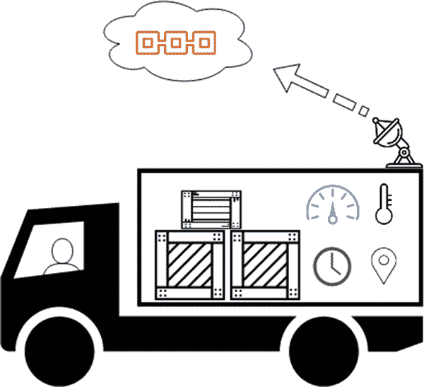 |

Reyna 等人（2018）对区块链和物联网整合进行了文献调查。作者建议，区块链整合可以通过提供数据可靠性来帮助物联网通信。此外，区块链可以为网络上的每个设备提供唯一标识符和可信的身份验证方案。他们确定了三种用于区块链整合的通信架构。第一种是物联网-物联网，物联网设备直接相互通信，用于低延迟应用，而区块链仅提供寻址和认证框架。第二种架构是物联网-区块链，物联网设备必须将区块链用作数据库来查询和自主操作。对于这种架构，交易被不可变地提交到区块链上。第三种架构是混合方法，其中前两种架构根据需要结合在一起，以创建完整的操作定义。作者声称，混合方法是将物联网整合到区块链应用程序的最佳方法，因为它利用了物联网的实时能力以及区块链的上述优势。

Bumblauskas 等人（2020）在美国进行了一项关于鸡蛋追踪的试点研究，与一家公司合作进行。该公司使用温湿度传感器收集有关鸡蛋从农场到顾客的运输的数据。在概念验证研究期间，消费者可以用他们的智能手机扫描杂货店里的二维码，获取他们手中鸡蛋盒的来源信息。Behnke & Janssen（2020）记录了奶制品供应链满足追溯要求的边界条件。作者在四个案例研究中对奶制品供应链组织进行了访谈。他们发现数据标准化和治理结构的选择是区块链集成的主要驱动因素。

另一方面，（Marsal-Llacuna，2018）声称，依赖于物联网数据的区块链集成系统需要大量的计算资源，将不可行。然而，作者只考虑了公共区块链结构，其中限制因素是昂贵的 PoW 共识算法。

采用区块链技术进行供应链管理

虽然区块链的所有合适方面都需要一组具有共同目标和不同利益的组织参与区块链，并为交易提供共识，但互操作性方面需要采取更强有力的行动。虽然区块链本质上是去中心化的，但必须就交易的标准、区块链的特性以及技术细节达成一致，例如共识方法的选择或验证节点的存在。区块链技术的采用可以朝两个方向传播：当一个大型零售公司要求其供应商加入区块链时，可以进行自上而下的集成；或者当供应链起始点的供应商开始参与区块链并向分销公司展示收益时，可以采取自下而上的方法（Kshetri，2018）。

本节致力于区块链集成过程的细节，主要包括区块链的参数和初始数据输入问题。

区块链运行模式

区块链网络遵循两种基本的访问原则；有许可的和无许可的。根据 Wüst & Gervais（2018）的说法，无许可或去中心化的运行模式是可以发挥区块链技术真正潜力的用例。此外，如果网络的所有参与方都是完全信任的，那么使用私有许可的区块链实施是多余的，应该使用传统的数据库系统。由于竞争的存在，供应链不是所有参与方都受信任的网络。

环境到区块链输入

区块链的完整性保证在人类或传感器初次输入到区块链时处于最弱的状态（Schmidt & Wagner，2019 年）。这里的威胁行为者是恶意的人类和功能失常或被篡改的传感器（Wüst & Gervais，2018 年）。Babich & Hilary (2020)将不安全的初始输入到不可变区块链过渡称为零状态问题。

区块链上的交易是在共识期间由买方和卖方共同达成的协议。Babich & Hilary (2020)指出这只是部分解决方案。然而，Rodney & Zuckerman (2019)声称使用物联网传感器完全解决了这个问题。Queiroz 等人 (2019)也支持这一发现，他们认为物联网设备对于确保来自环境的初始输入到区块链是合法的特别有用。这些传感器可能包括温度和重量传感器，条形码和 RFID 标签。对于易腐材料，如药品和食品，可以使用不干扰物品的凝胶状跟踪器。文献还提出了成功的工作证明技术，可以在不打开容器的情况下识别欺诈性食品（Ha, Leng 等，2020 年）。当考虑到一位葡萄酒鉴定师的声明“流通中的欺诈性优质葡萄酒价值可能高达 10 亿美元”(Adam Lechmere，2016 年)时，这些提议的价值就显而易见了。这些方法的多样性突显了区块链实现的互操作性要求以及通过使用多个传感器和传感技术可以建立的冗余性。

共识

达成对交易中资产的要求和质量标准的共识的另一途径是依赖外部预言机。 简单来说，预言机是区块链上的行动者依赖于验证交易真实性的第三方实体。 使用预言机无意中扭曲了区块链平台的去中心化性质，将信任实施在一个中央机构上。 公司 ChainLink（Ellis et al.，2017）提出了一种去中心化预言机结构来解决这个问题。

根据区块链网络的访问要求，应该使用适当的共识算法。 无许可或公共网络使用昂贵的 PoW 在没有信任的情况下达成共识。 由于供应网络的区块链属于联盟区块链类别，昂贵的 PoW 不受欢迎。 像实用拜占庭容错这样在许可设置下工作并且提供对三分之一恶意网络的抵抗的算法是合适的。

案例研究

区块链作为一系列链接的交易而出现，被视为新货币的推动力。 就供应链而言，在系统内保持所有交易不可更改的时间顺序的核心思想得以延续。 区块链很难与其比特币根源以及仍然围绕它的炒作分离开来。 但是，所有交易都被认可并最终完成的看似简单的想法可以得到发展。 最终，将区块链视为共享数据存储，所有编写者和读者都可以信任的基础是所有实施的基础。

区块链技术已经引起了组织的兴趣，尤其是食品行业和零售业。 这种兴趣最常见的原因是源于受污染食品引发的疫情。

在 2018 年 4 月至 5 月期间，Capgemini Research Institute 向 731 家不同供应链的组织询问了他们在区块链采用方面的进展情况。447 家组织做出了回应，这些组织主要涵盖制造业、零售业和消费品行业。在回答中；仅有 3%的组织在日常运营中使用区块链，有 10%正在进行区块链的试点研究，而 87%将其用作概念验证。调查还发现，对于组织在供应链运营中使用区块链的最受欢迎的好处是可追溯性和透明度。一个更为具体的好处是供应商合同的管理。(Pai et al., 2018)。

最近，Deloitte Insights 对来自 14 个国家的 1,488 名高级管理人员和从业者进行了调查，时间跨度从 2020 年 2 月 6 日到 3 月 3 日(Pawczuk et al., 2020)。由于该研究机构过去 3 年一直在进行类似的调查，他们已经收集了一些关于区块链采用进展的数据。例如，回答认为区块链是其组织前五大重点之一的受访者比例从 43%上升到了 53%。调查报告的作者将这一发现描述为“区块链现在已经成为一种不可或缺的业务方式”的表征。在回答中，肯定答案的比例上升了，例如“如果我们不采用区块链技术，我的组织或项目将失去竞争优势”和“我们的管理团队认为在我的组织或项目内使用区块链技术存在强有力的商业案例”等进一步表明了这种采用。然而，对“区块链被夸大了”的肯定回答也有所增加。

区块链技术需要工作的去中心化。计划仅在组织内部使用的区块链实施是潜力和资源的浪费。这种封闭的区块链实现作为数据存储应该留给传统的数据存储解决方案，如数据库（Wüst & Gervais, 2018）。此外，只有通过适当的入职程序和采用激励措施，不同的参与方，甚至竞争对手，才能参与到区块链中，并成为民主共识过程的一部分。

为了简化库存管理，沃尔玛要求其前 100 名供应商在 2005 年 1 月之前采用射频识别标签。这是在供应链中讨论的采用区块链的自上而下传播的一个例子。一种重要的零售驱动的创新采用以平滑过渡阶段的网络效应上坡阶段。同样，具有足够激励的组织可以加快区块链的采用。另一方面，根据汽车行业区块链倡议 MOBI 的创始人克里斯·巴林格的说法，网络效应在使用区块链技术的行业中将非常强大，如果你不是在一开始就加入，可能为时已晚（Shiraz Ahmed, 2018）。

追溯性是与食品相关的供应链所需的一个核心要求。这一要求得到了零售商、制造商和消费者的充分认可。零售商希望在产品出现污染或类似问题导致召回流程时，能够确定商品的来源。制造商希望在产品并非疫情爆发的原因时，避免不当指责，以免不得不召回产品或因公众面前丧失品牌声誉。最后，消费者希望购买符合标准的食品（Tan 等，2018 年）。Pai 等人（2018 年）报告称，“2017 年典型的饮料召回成本约为 800 万美元，而美国发生的 456 起食品召回预计造成了 35 亿美元的损失”。对于大多数召回事件而言，罪魁祸首是未声明的过敏原信息（Maberry，2018 年）。换句话说，由于缺乏透明度和追溯性，食品行业损失了高达 35 亿美元。难怪区块链在供应链中的初次应用主要针对的是食品行业。

追溯性对于希望通过关心环境事业和可持续性赢得客户信任的组织来说，具有另一个价值主张。据估计，有一项规模达 9660 亿欧元的机会适用于明确表明其可持续性凭证的品牌（Unilever NV，2017）。在五个国家和 20,000 名参与者上进行的调查发现，客户意识到其产品的环境影响，并在选择时更倾向于那些来源和生产可持续的品牌。这对于发展中国家的客户尤其如此。对于正在将可持续性纳入其运营的组织来说，区块链是向客户传达这一立场的解决方案的一部分。Provenance 进行的金枪鱼追踪试点研究进一步展示了如何将原材料的初始采购过程输入区块链，并将其向上传播到供应链，直至客户端。

在本节的其余部分，作者根据进行研究的组织提供的描述，展示了区块链整合到供应链中的实际用例。

Provenance 的金枪鱼追踪

Provenance 是一家总部位于伦敦的区块链初创公司。他们一直在为不同的供应链进行试点研究，并记录了他们的经验报告和文档。在这些研究中，该公司与时尚、纺织、化妆品和咖啡等行业的组织和人员合作。在印度尼西亚的黄鳍金枪鱼和小黄鳍金枪鱼追踪方面，公司进行了最广泛的报告，本章将对此进行介绍。

在 2016 年为期 6 个月的试点研究中，Provenance 为印度尼西亚的金枪鱼建立了一个区块链（Provenance, 2016）。金枪鱼采购的可追溯性对该地区尤为重要，因为存在不道德的采购行为，极端情况甚至达到奴隶制的程度。Provenance 发现渔民可以使用手机，并设置他们的系统以便与简单的短信消息进行交互。他们使用智能标签将鱼标记为 NFC 启用的智能贴纸形式。

试点研究的目的是帮助该地区的产业证明符合标准。渔民获得证书证明他们符合可持续捕捞的要求，并保护他们免受不道德的劳动实践。另一个目标是防止证书的“双重使用”。关于该公司的研究的整体观点是“探索这些新技术如何构建一个基于可追溯性的开放系统，为食品和其他实物商品提供消费者可见的透明度”。

试点研究已成功证明了将区块链整合到端到端供应链的可能性，从源头一直到消费者。通过供应链流动的数据并提交到区块链已成功确保其互操作性。

沃尔玛的食品追踪

改善处理食品项目的供应链已成为近期研究的重点。由于它们大量运输（McKenzie, 2018），食品项目特别容易受到欺诈和篡改的影响。虽然欺诈和篡改，比如稀释或伪造，对消费者健康有害，但利用受污染的食物作为疾病传播媒介的爆发会带来灾难性后果。特别是 2006 年一起大肠杆菌爆发事件很有意义，因为导致 102 人住院和 3 人死亡的可疑菠菜批次被发现源自同一批（Centers for Disease Control and Prevention, 2006）。能够识别食品采购的价值显而易见。

当沃尔玛食品安全总裁意识到追溯和追踪食品来源的困难时，他们进行了一项简单的实验（Yiannas, 2018）。他们购买了一包切片芒果，并在会议上要求团队追踪到收割该产品的农场。涉及芒果的供应链使用笔记本和纸张方法来记录芒果。这种纸质记录不具备可伸缩性，一个团队中的信息在另一个团队中并不直接可用。此外，正如本章前面讨论的那样，由于供应链的复杂性，组织只了解供应链的相邻部分。最终，团队花了 6 天、18 小时和 26 分钟才追踪到收割芒果的农场。撇开向顾客介绍道德收割流程等非必要目标不谈，这对一个组织在潜在的受污染食品爆发期间收集数据可能需要一周的时间。

在成功的试点研究之后，沃尔玛邀请了其他食品零售公司，他们共同组成了由供应商和零售商组成的十个基金会合作伙伴联盟，包括沃尔玛、Kroger、Wegmans、Tyson、Driscolls、雀巢、联合利华、Danone、麦考密克和多尔。作为这个联盟，试点研究继续进行，“截至 2018 年 5 月，沃尔玛已经在生产环境中追踪了近两打 SKU，涉及 260 万个食品包装，跨越了 16.6 万个区块链追溯事件”。

如果一个去中心化系统不具备互操作性，那么它将失败。从那些在该领域应用区块链技术的人士那里，当前的共识是，应该实施简单的入门流程和强大的数据输入，以构建开放系统。区块链应该是去中心化的，但实施不应该垄断化。没有一个单一的食品零售商能够强制实施更好的食品可追溯性，一个国家的食品制造商单凭自己也无法做到，任何一个单一国家的监管机构也不能做到。更好的食品可追溯性需要合作，并且必须由人们主导、技术支持。

当消费者去食品杂货店购物时，他们想知道他们购买的产品中的成分是否来自道德合规的途径。虽然这并不是一个持续存在的担忧，但关于忽视劳工实践或通过奴隶劳工获取原材料的新闻也会让消费者感到不安。此外，消费者更喜欢对环境无害的可持续方法。一些消费者有严格的饮食要求，比如素食主义者和纯素主义者。其他人的要求超出了成分列表，而是涉及到采购流程；例如，清真食品要求关注动物的宰杀过程。最后，过敏原信息应该在透明度下得到覆盖。

Everledger 进行的高价值物品追踪

Everledger 是一个区块链平台，旨在满足钻石、葡萄酒和奢侈品等高价值物品的可追溯性和来源需求。奢侈品案例与之前的案例研究相反，因为食品是相对低价值的物品，需要原子风险评估，从农场到顾客餐盘的产品之旅可以分步规划。Everledger 处理的高价值物品需要整体解决方案，因为高价值物品面临的威胁增加（Kshetri, 2018）。例如，为了克服零状态问题，Everledger 的操作包括“在将数据存储在区块链之前，手动扫描和验证每颗钻石”，该公司已为 200 多万颗钻石执行此操作，据 2019 年的一项研究报道（Schmidt & Wagner, 2019）。

Everledger 已经发现顾客对钻石的来源提出了道德关注（George, 2020b）。他们利用区块链技术的倡议是因为它提供的不可变性（Price, 2015），这是透明度的基础。高价值钻石的认证流程与证书和法规相关联；因此，Everledger 委派周大福珠宝集团负责认证可追溯性、真实性、思考性和透明度；独立的钻石评估机构美国宝石学院（GIA）负责认证每颗钻石的物理属性作为验证者（George, 2020a）。类似于沃尔玛展示其产品的可追溯性和透明度证书，最终顾客可以使用智能手机访问这些信息（George, 2020a）。

结论

区块链技术，只看实施细节的话，是一个共享状态，具有强大的保证，即该状态可以追溯到最初，并且对每个参与者都是相同的。从这个简单的定义开始，就有可能构建一些真正具有颠覆性的系统，可以改变商业、供应链、能源网络或通信系统的运作方式。

根据本章介绍的示例和案例研究，区块链整合到供应链的下一个障碍是采纳阶段。网络效应决定采用速度将会很慢，因为加入区块链的激励不足，由于网络参与者的缺乏。进行的行业专业人士的调查表明，快速采用过程可能正在逼近。

区块链的真正有益之处，即数字化和效率，它们给我们带来了收集、学习和自主采取行动的能力，需要互操作性。如果区块链的采用阶段使行业留下了相互不集成的分段网络，那么每个链的价值将会降低。

本章简要概述了区块链对供应链参与者有益的方面，并提供了一些现实生活中的用例，这些用例为区块链在现实市场中的理论优势提供了宝贵的见解。

应该注意到，区块链与供应链整合的未来工作是广阔的。例如，协会区块链的协调，满足物联网设备所产生的数据处理需求，以及保护区块链输入免受恶意行为者或传感器攻击的问题仍然是悬而未决的。

参考文献

艾哈迈德，S.（2018 年 5 月 2 日）。汽车制造商、供应商合作开发区块链技术。《汽车新闻》。https://www.autonews.com/article/20180502/MOBILITY/180509974/automakers-suppliers-team-up-to-develop-blockchain-technology

Azzi, R., Chamoun, R. K., & Sokhn, M. (2019). 基于区块链的供应链的力量。《计算机与工业工程》，135，582–592。doi:10.1016/j.cie.2019.06.042

Babich, V., & Hilary, G. (2020). 分布式分类账和运营：运营管理研究者应了解的区块链技术。《制造与服务运营管理》，22(2)，223–240。doi:10.1287/msom.2018.0752

Behnke, K., & Janssen, M. F. W. H. A. (2020). 使用区块链技术追溯食品供应链的边界条件。《信息管理国际期刊》，52，101969。doi:10.1016/j.ijinfomgt.2019.05.025

Boles, T. L., Croson, R. T. A., & Murnighan, J. K. (2000). 在重复的最终交易中的欺骗与报复。《组织行为与人类决策过程》，83(2)，235–259。doi:10.1006/obhd.2000.2908

Bumblauskas, D., Mann, A., Dugan, B., & Rittmer, J. (2020). 食品分销中的一个区块链应用案例：你知道你的食物来自哪里吗？《信息管理国际期刊》，52，102008。doi:10.1016/j.ijinfomgt.2019.09.004

Cameron-Huff, A. (2017, March 30). 代币化如何将现实世界资产放入区块链：代币化如何将现实世界资产放入区块链 | 纳斯达克。https://www.nasdaq.com/articles/how-tokenization-putting-real-world-assets-blockchains-2017-03-30

疾病控制与预防中心。 (2006, October 6). 与新鲜菠菜相关的 E. coli O157:H7 感染的多州爆发（最终更新）。https://www.cdc.gov/ecoli/2006/spinach-10-2006.html

Chang, Y., Iakovou, E., & Shi, W. (2019). 全球供应链和跨境贸易中的区块链：对现状、挑战和机遇的关键综合。https://arxiv.org/abs/1901.02715

Christidis, K., & Devetsikiotis, M. (2016). 用于物联网的区块链和智能合约。《IEEE Access: 实用创新，开放解决方案》，4，2292–2303。doi:10.1109/ACCESS.2016.2566339

美国司法部。（2019 年 3 月 8 日）。曼哈顿美国检察官宣布对“OneCoin”领导人提出指控，涉及销售欺诈加密货币的数十亿美元金字塔计划。[`www.justice.gov/usao-sdny/pr/manhattan-us-attorney-announces-charges-against-leaders-onecoin-multibillion-dollar`](https://www.justice.gov/usao-sdny/pr/manhattan-us-attorney-announces-charges-against-leaders-onecoin-multibillion-dollar)

El Maouchi，M.，& Ersoy，O.（2018）。TRADE：供应链透明，去中心化的可追溯系统。10.18420/BLOCKCHAIN2018_01

Ellis，S.，Juels，A.，& Nazarov，S.（2017）。ChainLink 一个去中心化的 Oracle 网络。ChainLink。[`link.smartcontract.com/whitepaper`](https://link.smartcontract.com/whitepaper)

Francisco，K.，& Swanson，D.（2018）。供应链一丝不挂：区块链技术在供应链透明度方面的采用。物流，2（1），2。doi:10.3390/logistics2010002

George，C.（2020a）。揭示钻石采购中的隐藏价值。Everledger。[`www.everledger.io/concept-paper/unraveling-hidden-value-in-diamond-sourcing/`](https://www.everledger.io/concept-paper/unraveling-hidden-value-in-diamond-sourcing/)

George，C.（2020b，5 月 1 日）。价值链每个环节的钻石来源。Everledger。[`www.everledger.io/diamond-provenance-at-every-link-of-the-value-chain/`](https://www.everledger.io/diamond-provenance-at-every-link-of-the-value-chain/)

Ha，U.，Leng，J.，Khaddaj，A.，& Adib，F.（2020）。在实际环境中使用 RFID 进行食品和液体感知。第 17 届 USENIX 网络系统设计与实现研讨会（NSDI 20），1083–1100。[`www.usenix.org/conference/nsdi20/presentation/ha`](https://www.usenix.org/conference/nsdi20/presentation/ha)

IBM。（2017 年 8 月 22 日）。IBM 宣布与 Dole，Driscoll’s，Golden State Foods，Kroger，McCormick and Company，McLane Company，Nestlé，Tyson Foods，Unilever 和 Walmart 进行重大区块链合作，以全球解决食品安全问题。PR Newswire。[`www.prnewswire.com/news-releases/ibm-announces-major-blockchain-collaboration-with-dole-driscolls-golden-state-foods-kroger-mccormick-and-company-mclane-company-nestle-tyson-foods-unilever-and-walmart-to-address-food-safety-worldwide-300507604.html`](https://www.prnewswire.com/news-releases/ibm-announces-major-blockchain-collaboration-with-dole-driscolls-golden-state-foods-kroger-mccormick-and-company-mclane-company-nestle-tyson-foods-unilever-and-walmart-to-address-food-safety-worldwide-300507604.html)

Inderfurth, K., Sadrieh, A., & Voigt, G. (2013). 信息共享对不对称信息下供应链绩效的影响. Production and Operations Management , 22(2), 410–425\. doi:10.1111/j.1937-5956.2012.01372.x

Ivanov, D., Tsipoulanidis, A., & Schönberger, J. (2018). 全球供应链与运营管理：创造价值的决策导向介绍 (第 2 版). Springer.

Kaçan, M. (2019, October 17). 供应链成本的 5 大主要驱动因素. ICRON. https://icrontech.com/blog_item/5-main-drivers-of-supply-chain-costs/

Kshetri, N. (2018). 区块链在实现关键供应链管理目标中的角色. International Journal of Information Management , 39, 80–89\. doi:10.1016/j.ijinfomgt.2017.12.005

Lechmere, A. (2016, December 5). 酒窖：数字时代的安全保障. Wine-Searcher. https://www.wine-searcher.com/m/2016/12/wine-vault-offers-security-in-a-digital-age

Levinson, M. (2008). 集装箱：如何使世界变小且世界经济变大 . Princeton University Press.

Liotine, M., & Ginocchio, D. (2020). 供应链区块链：在供应链运营中整合区块链技术 . In Technology in Supply Chain Management and Logistics (pp. 57–89). Elsevier. doi:10.1016/B978-0-12-815956-9.00004-1

Liu, Z., & Li, Z. (2020). 基于区块链的跨境电子商务供应链框架. International Journal of Information Management , 52, 102059\. doi:10.1016/j.ijinfomgt.2019.102059

Maberry, T. (2018, February 6). 回顾 2017 年食品召回事件. Food Safety Magazine. https://www.foodsafetymagazine.com/enewsletter/a-look-back-at-2017-food-recalls/

Marsal-Llacuna, M.-L. (2018). 未来生活框架：区块链是下一个启用网络吗？Technological Forecasting and Social Change , 128, 226–234\. doi:10.1016/j.techfore.2017.12.005

McKenzie, J. (2018 年 2 月 4 日). 沃尔玛和 IBM 想利用区块链提高食品安全性。《The Counter》。[链接](https://thecounter.org/blockchain-food-traceability-walmart-ibm/)

Min, H. (2019 年). 区块链技术增强供应链韧性。《商业视野》，62(1)，35–45。doi:10.1016/j.bushor.2018.08.012

Moise, I., & Chopping, D. (2018 年 1 月 16 日). Maersk 和 IBM 就全球贸易的区块链合作伙伴关系。《华尔街日报》。[链接](https://www.wsj.com/articles/maersk-and-ibm-partner-on-blockchain-for-global-trade-1516111543)

Nakamoto, S. (2008 年). 比特币：点对点的电子现金系统。《学术出版社》。

Pai, S., Sevilla, M., Buvat, J., Schneider-Maul, R., Lise, O., Calvayrac, A., Karanam, T., & Puttur, R. (2018 年). 区块链是否是提高供应链透明度和信任的新时代之钥？《Capgemini 研究所》。[链接](https://www.capgemini.com/research/does-blockchain-hold-the-key-to-a-new-age-in-supply-chain-transparency-and-trust/)

Pawczuk, L., Holdowsky, J., Massey, R., & Hansen, B. (2020 年). 德勤 2020 全球区块链调查。《德勤洞察》。[链接](https://www2.deloitte.com/content/dam/insights/us/articles/6608_2020-global-blockchain-survey/DI_CIR%202020%20global%20blockchain%20survey.pdf)

Price, R. (2015 年 8 月 28 日). 这家伦敦初创企业可能会让钻石盗窃成为历史——而这只是开始。《商业内幕》。[链接](https://www.businessinsider.com/everledger-ledger-diamonds-blockchain-tech-theft-fraud-2015-8)

Provenance. (2016 年). 从海岸到餐桌：区块链上追踪金枪鱼。《Provenance》。[链接](https://www.provenance.org/tracking-tuna-on-the-blockchain)

Puthal, D., Malik, N., Mohanty, S. P., Kougianos, E., & Das, G. (2018 年). 有关区块链的一切：它的承诺、组件、流程和问题。《IEEE 消费电子杂志》，7(4)，6–14。doi:10.1109/MCE.2018.2816299

Queiroz, M. M., Telles, R., & Bonilla, S. H. (2019). 区块链与供应链管理融合：文献系统性回顾。供应链管理，25(2)，241–254。doi:10.1108/SCM-03-2018-0143

Reyna, A., Martín, C., Chen, J., Soler, E., & Díaz, M. (2018). 关于区块链及其与物联网的整合。挑战与机遇。未来一代计算机系统，88，173–190。doi:10.1016/j.future.2018.05.046

Rodney, J. D., & Zuckerman, N. (2019 年 2 月 11 日). 区块链如何加强军事供应链。先锋杂志。https://vanguardcanada.com/2019/02/11/how-blockchain-can-strengthen-the-military-supply-chain/

Schmidt, C. G., & Wagner, S. M. (2019). 区块链与供应链关系：一个交易成本理论的视角。采购与供应管理杂志，25(4)，100552。doi:10.1016/j.pursup.2019.100552

Shapira, A., & Leinz, K. (2017 年 12 月 21 日). 更名为 Long Blockchain 后，Long Island Iced Tea 股价飙升。彭博社。https://www.bloomberg.com/news/articles/2017-12-21/crypto-craze-sees-long-island-iced-tea-rename-as-long-blockchain

TanB.YanJ.ChenS.LiuX. (2018). 区块链对食品供应链的影响: 沃尔玛案例研究。智能区块链国际会议，167–177。doi:10.1007/978-3-030-05764-0_18

Toyoda, K., Takis Mathiopoulos, P., Sasase, I., & Ohtsuki, T. (2017). 一种新型基于区块链的产品所有权管理系统（POMS）用于反供应链中的伪冒品。IEEE Access，5，17465–17477。doi:10.1109/ACCESS.2017.2720760

Unilever, N. V. (2017 年 5 月 1 日). 报告显示三分之一的消费者更喜欢可持续品牌。联合利华全球公司网站。https://www.unilever.com/news/press-releases/2017/report-shows-a-third-of-consumers-prefer-sustainable-brands.html

Wamba, S. F., & Queiroz, M. M. (2020). 运营与供应链管理中的区块链：优势、挑战和未来研究机遇。《信息管理国际期刊》，52，102064。doi:10.1016/j.ijinfomgt.2019.102064

WüstK.GervaisA. (2018). 你需要区块链吗？2018 年区块链技术瑞士加密谷会议(CVCBT)，45–54。10.1109/CVCBT.2018.00011

Xu, X., Rahman, F., Shakya, B., Vassilev, A., Forte, D., & Tehranipoor, M. (2019). 区块链启用的电子供应链完整性。《ACM 电子系统设计自动化交易》，24(3)，31:1–31:25。10.1145/3315571

Yiannas, F. (2018). 区块链驱动的食品透明度新时代。在《创新：技术、治理、全球化》中，12(1–2)，46–56。doi:10.1162/inov_a_00266

Zhang, J. (2019). 在供应链中部署区块链技术。在《区块链与分布式分类账技术(DLT)》中。IntechOpen。doi:10.5772/intechopen.86530

额外阅读

Di Vaio, A., & Varriale, L. (2020). 区块链技术在可持续绩效的供应链管理中的应用：来自机场行业的证据。《信息管理国际期刊》，52，102014。doi:10.1016/j.ijinfomgt.2019.09.010

Frizzo-Barker, J., Chow-White, P. A., Adams, P. R., Mentanko, J., Ha, D., & Green, S. (2020). 区块链作为一种颠覆性的商业技术：一项系统性评估。《信息管理国际期刊》，51，102029。doi:10.1016/j.ijinfomgt.2019.10.014

Kamble, S. S., Gunasekaran, A., & Sharma, R. (2020). 在农业供应链中建模区块链启用的追溯性。《信息管理国际期刊》，52，101967。doi:10.1016/j.ijinfomgt.2019.05.023

Liotine, M., & Ginocchio, D. (2020). 供应链区块链：将区块链技术融入供应链运营中。在《供应链管理与物流中的技术》(pp. 57–89)。Elsevier。doi:10.1016/B978-0-12-815956-9.00004-1

鲁乔，徐旭。（2017）。可适应的基于区块链的系统：产品溯源的案例研究。IEEE 软件，34(6)，21–27。doi:10.1109/MS.2017.4121227

Pawczuk, L., Holdowsky, J., Massey, R., & Hansen, B. (2020). 德勤 2020 年全球区块链调查。德勤洞察。https://www2.deloitte.com/content/dam/insights/us/articles/6608_2020-global-blockchain-survey/DI_CIR%202020%20global%20blockchain%20survey.pdf

产品溯源。（2016）。从海岸到餐桌：追踪金枪鱼的区块链。产品溯源。https://www.provenance.org/tracking-tuna-on-the-blockchain

Tian, F. (2016). 基于 RFID 区块链技术的中国农业食品供应链可追溯系统。2016 年第 13 届国际服务系统与服务管理会议（ICSSSM），1–6。10.1109/ICSSSM.2016.7538424

Tönnissen, S., & Teuteberg, F. (2020). 分析区块链技术对运营和供应链管理的影响：基于多个案例研究得出的解释模型。《国际信息管理杂志》，52，101953。doi:10.1016/j.ijinfomgt.2019.05.009

Wamba, S. F., & Queiroz, M. M. (2020). 运营和供应链管理中的区块链：好处、挑战和未来研究机会。《国际信息管理杂志》，52，102064。doi:10.1016/j.ijinfomgt.2019.102064

Wong, L.-W., Leong, L.-Y., Hew, J.-J., Tan, G. W.-H., & Ooi, K.-B. (2020). 抓住数字化演进的时机：马来西亚中小企业运营和供应链管理中区块链的采用。《国际信息管理杂志》，52，101997。doi:10.1016/j.ijinfomgt.2019.08.005

Yiannas, F. (2018). 区块链驱动的食品透明度新时代。《创新：技术、治理、全球化》，12(1–2)，46–56。doi:10.1162/inov_a_00266

术语和定义

区块链：区块链指的是一种分散的交易历史，由各种参与者共享。区块链的块按时间顺序连接在一起，每个块都链接到前一个块。改变任意交易都需要修改每个块，而网络的其余部分则遵循最长的链。

物联网（IoT）：这指的是通过互联网连接处理设备（计算机、手机、传感器、智能手表和其他智能设备），以便通信、共享和处理数据。应用包括物联网车辆、工业物联网、智能城市等。

互操作性：互操作性是两个或多个系统之间通信的程度。当系统之间的互操作性高时，它们可以相互通信、共享数据并使用彼此的功能。当系统之间的互操作性较低时，如果可能的话，则需要额外的工作来将一个系统的数据类型和通信协议转换为另一个系统的数据类型和通信协议。

工作量证明（PoW）：这是在公共开放式区块链网络中使用的计算密集型任务。它要求参与者递增一个随机数值以使用待处理交易列表计算哈希。结果哈希值应低于设定的限制。这种繁重的工作主要是为了选择要提交到区块链的交易，同时保护网络免受恶意行为者的影响，因为对手无法获得足够的计算能力来转移区块链。

智能合约：智能合约是可以在区块链上分配地址的计算机程序。它们的代码可以根据区块链的状态或根据它们收到的交易，根据某些预定义的条款，向区块链上的其他方发出交易。智能合约可用于向区块链引入自动化。

State Zero Problem: 区块链的任何输入都是不可逆的，因此代币化过程是微妙的。如果发生任何错误或恶意行为者更改信息，则区块链将继续使用错误的信息前进。如果代币化过程是安全的，那么区块链技术的不可变性特征保证了区块链处理其他安全要求的能力。

供应链: 供应链是指产品原材料的采购、组装、分配和销售给客户的过程。这些包括跨国界的多个组织。

Tokenization: 这是创建物理项目或资产表示以在区块链中使用的过程。这个代币在交易过程中交换，匹配资产从发送者到接收者的过程。
